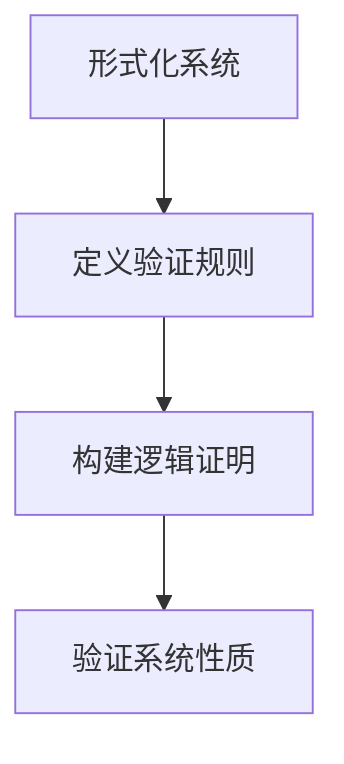

                 

# 数理逻辑：第一章 演绎逻辑的基本规则

## 文章关键词

- 演绎逻辑
- 命题逻辑
- 谓词逻辑
- 有效推理
- 演绎推理方法

## 文章摘要

本文深入探讨了数理逻辑中的演绎逻辑，首先介绍了演绎逻辑的定义、作用以及与归纳逻辑的比较。接着，我们详细解析了命题逻辑和谓词逻辑的基础概念、基本公式及其在推理中的应用。随后，文章讨论了演绎推理的具体方法，包括三段论等，并探讨了演绎逻辑在数学、计算机科学以及日常生活中的应用。最后，文章总结了演绎逻辑的有效性规则和应用方法，并展望了其未来发展的可能方向。通过本文，读者可以系统地了解和掌握演绎逻辑的基本规则及其应用。

## 第1章 演绎逻辑概述

### 1.1 演绎逻辑的定义与作用

演绎逻辑（Deductive Logic）是逻辑学的一个分支，主要研究从一般原理推导出个别结论的推理过程。它以形式逻辑为基础，通过一系列逻辑规则，从一个或多个前提出发，推导出必然有效的结论。演绎逻辑的核心在于其结论的必然性和确定性，即如果前提为真，则结论必然为真。

演绎逻辑在现代科学技术和哲学研究中扮演着重要角色。在数学领域，演绎逻辑是证明定理、构建数学体系的基础工具；在计算机科学中，形式化验证、程序的正确性证明等许多关键技术都依赖于演绎逻辑的原理。此外，在哲学、法律、经济学等领域，演绎逻辑也广泛用于推理和论证。

### 1.2 演绎逻辑与归纳逻辑的比较

演绎逻辑与归纳逻辑（Inductive Logic）是两种不同的推理方法。归纳逻辑是从个别事例出发，归纳出一般性结论的推理过程。与演绎逻辑不同，归纳逻辑的结论并非必然有效，而是具有一定的概率性和不确定性。

- **演绎逻辑**：从一般到个别，结论的必然性依赖于前提的真实性。
- **归纳逻辑**：从个别到一般，结论的可靠性依赖于样本的代表性和统计规律。

例如，通过观察多次太阳从东方升起，我们可以归纳出“太阳每天从东方升起”这一结论。然而，这个结论并非绝对正确，因为在某些特殊情况下（如极地地区或遇到日食），太阳的升起方向可能不是东方。

### 1.3 演绎逻辑的发展历史

演绎逻辑的历史可以追溯到古希腊时期。古希腊哲学家亚里士多德（Aristotle）是演绎逻辑的奠基人，他提出了三段论（Syllogism）等基本的推理形式。在中世纪，阿拉伯哲学家阿尔-法拉比（Al-Farabi）和亚维罗伊（Averroes）对亚里士多德的逻辑学进行了深入的研究和发展。

在现代，演绎逻辑的研究得到了进一步的拓展。19世纪末，弗雷格（Gottlob Frege）提出了命题逻辑和谓词逻辑的形式系统，为现代逻辑学奠定了基础。20世纪，哥德尔（Kurt Gödel）、图灵（Alan Turing）等数学家和计算机科学家对形式逻辑、计算理论和人工智能等领域做出了重要贡献。

## 第2章 命题逻辑基础

### 2.1 命题与命题变元

命题（Proposition）是逻辑学中的基本概念，它表示一个陈述的真假值。命题可以是简单的（原子命题），如“今天下雨”或“2+2=4”；也可以是复合的（分子命题），由多个简单命题通过逻辑联结词（Logical Connectives）组合而成，如“如果今天下雨，那么地面会湿”。

在命题逻辑中，命题变元（Propositional Variables）是表示未定命题的符号，通常用大写字母P, Q, R等表示。命题变元本身没有具体的含义，但其取值（真或假）可以用来表示不同的命题。

### 2.2 命题联结词

命题联结词是连接命题变元或命题的符号，用于表示复合命题的逻辑关系。常见的命题联结词包括：

- **合取（Conjunction）**：表示“并且”，用符号`^`（交）或`∧`（与）表示。例如，P ∧ Q表示P和Q都为真。
- **析取（Disjunction）**：表示“或者”，用符号`v`（并）或`∨`（或）表示。例如，P ∨ Q表示P或Q至少有一个为真。
- **否定（Negation）**：表示“非”，用符号`~`或`¬`表示。例如，~P表示P为假。
- **条件（Implication）**：表示“如果……那么”，用符号`→`或`→`表示。例如，P → Q表示如果P为真，则Q也为真。
- **双条件（Biconditional）**：表示“当且仅当”，用符号`⟹`或`⟺`表示。例如，P ⟹ Q表示P和Q互为条件。

### 2.3 命题逻辑的基本公式

命题逻辑的基本公式（Tautologies）是那些在任何情况下都为真的命题。例如：

- **恒真命题（Tautology）**：P ∨ ~P（命题P或非P必然为真）。
- **恒假命题（Contradiction）**：P ∧ ~P（命题P和非P不可能同时为真）。
- **德摩根律（De Morgan's Laws）**：
  - ~(P ∨ Q) ≡ (~P ∧ ~Q)
  - ~(P ∧ Q) ≡ (~P ∨ ~Q)
- **条件律（Implication Laws）**：
  - P → Q ≡ ~P ∨ Q
  - P ≡ Q → ~Q → ~P
- **双条件律（Biconditional Laws）**：
  - P ⟹ Q ≡ Q → P
  - P ≡ Q ≡ Q → P ∧ P → Q

通过这些基本公式，我们可以简化复杂的复合命题，并验证命题的逻辑性质。

### 2.4 命题逻辑的推理规则

命题逻辑的推理规则（Inference Rules）是用于推导新命题的规则。常见的推理规则包括：

- **合取引入（Conjunction Introduction）**：如果P和Q都为真，则P ∧ Q为真。形式化表示为：P, Q ⊢ P ∧ Q。
- **析取引入（Disjunction Introduction）**：如果P为真，则P ∨ Q为真。形式化表示为：P ⊢ P ∨ Q。
- **否定引入（Negation Introduction）**：如果P为真，则~P为假。形式化表示为：P ⊢ ~P。
- **否定消除（Negation Elimination）**：如果~P和P ∧ Q都为真，则Q为真。形式化表示为：~P, P ∧ Q ⊢ Q。
- **条件引入（Implication Introduction）**：如果P和P → Q都为真，则Q为真。形式化表示为：P, P → Q ⊢ Q。
- **条件消除（Implication Elimination）**：如果P → Q和Q都为真，则P为真。形式化表示为：P → Q, Q ⊢ P。

通过这些推理规则，我们可以从一个或多个已知命题推导出新的命题。

## 第3章 谓词逻辑基础

### 3.1 谓词与个体变元

谓词逻辑（Predicative Logic）是逻辑学中用于描述对象属性和关系的一种形式化方法。在谓词逻辑中，谓词（Predicate）是一个表示对象属性或关系的表达式。例如，“是红色的”、“大于3”等都是谓词。

个体变元（Individual Variables）是表示特定个体的符号，通常用小写字母a, b, c等表示。个体变元可以取具体的对象作为值。例如，设a表示“苹果”，则谓词“是红色的”可以表示为“a是红色的”。

### 3.2 谓词逻辑的基本公式

谓词逻辑的基本公式包括量化符号、存在量词和全称量词，它们用于表示一般性和特殊性的概念。

- **存在量词（Existential Quantifier）**：符号为∃，表示“存在”。例如，∃x(Px)表示存在一个x，使得P(x)为真。
- **全称量词（Universal Quantifier）**：符号为∀，表示“对所有”。例如，∀x(Px)表示对所有x，P(x)都为真。
- **谓词联结词**：包括合取（∧）、析取（∨）、否定（¬）、条件（→）和双条件（⟹）等。

谓词逻辑的基本公式可以表达复杂的关系和属性，例如：

- **存在量词引入**：如果P(a)为真，则∃x(Px)为真。形式化表示为：Pa ⊢ ∃x(Px)。
- **全称量词引入**：如果对于所有x，P(x)都为真，则∀x(Px)为真。形式化表示为：∀x(Px) ⊢ Pa。
- **存在量词消除**：如果∃x(Px)为真，则存在一个a，使得P(a)为真。形式化表示为：∃x(Px) ⊢ Pa。
- **全称量词消除**：如果∀x(Px)为真，则对于所有a，P(a)都为真。形式化表示为：∀x(Px) ⊢ Pa。

通过这些公式，我们可以从简单的谓词表达式推导出复杂的逻辑结论。

### 3.3 谓词逻辑的推理方法

谓词逻辑的推理方法主要包括以下几种：

- **谓词推理**：通过引入存在量词和全称量词，我们可以从已知谓词表达式中推导出新的结论。例如，如果已知“所有猫都会飞”，则可以推导出“这只猫会飞”。
- **模态推理**：涉及模态词（如“可能”、“必然”），用于表示命题的可能性或必要性。例如，如果“必然所有猫都是动物”，则可以推导出“这只猫是动物”。
- **关系推理**：用于处理对象之间的关系，例如“小于”、“等于”等。通过关系推理，我们可以推导出对象之间的相对位置或属性。

谓词逻辑提供了强大的工具，用于描述和推理复杂的关系和属性，是形式逻辑和计算机科学中的重要组成部分。

## 第4章 演绎推理方法

### 4.1 三段论

三段论（Syllogism）是演绎推理中最基本和最常用的形式之一。它由两个前提和一个结论组成，形式为：“所有M是P，所有S是M，因此所有S是P”。其中，“M”和“S”代表不同的谓词，而“P”表示结论。

三段论的具体形式可以分为四种标准形式：

- **肯定三段论（A形式）**：
  - 前提1：所有M是P。
  - 前提2：所有S是M。
  - 结论：所有S是P。

- **否定三段论（E形式）**：
  - 前提1：所有M不是P。
  - 前提2：所有S是M。
  - 结论：所有S不是P。

- **特称三段论（I形式）**：
  - 前提1：有的M是P。
  - 前提2：所有S是M。
  - 结论：有的S是P。

- **全称三段论（O形式）**：
  - 前提1：所有M不是P。
  - 前提2：有的S是M。
  - 结论：有的S不是P。

三段论的有效性取决于前提的真实性和结论的合理性。如果前提都为真，则结论必然为真。然而，如果前提中有一个为假，则结论未必为真。例如，前提“所有猫都会飞”和“苏格拉底是猫”都为真，但结论“苏格拉底会飞”却是无效的，因为前提中的“所有猫都会飞”是错误的。

### 4.2 演绎推理的其他形式

除了三段论，演绎推理还包括其他多种形式，例如：

- **关系推理**：通过处理对象之间的关系进行推理，如“所有A都是B，B是C，因此A是C”。
- **条件推理**：处理“如果……那么……”的关系，如“如果下雨，那么地面会湿。现在下雨了，因此地面是湿的”。
- **否定推理**：通过否定已知条件进行推理，如“所有A都不是B。如果A是C，则A是B，但A不是C，因此A不是B”。
- **假言推理**：基于假设条件进行推理，如“如果所有猫都会飞，那么天空会有猫。现在天空没有猫，因此不是所有猫都会飞”。

这些推理形式在逻辑学和实际应用中都非常重要，可以帮助我们更准确地推理和论证问题。

### 4.3 演绎推理的有效性验证

为了确保演绎推理的有效性，我们需要验证推理过程是否符合逻辑规则。常用的验证方法包括：

- **形式验证**：使用逻辑演算和证明系统，通过推导规则验证推理的有效性。
- **实例验证**：通过具体的实例检查推理过程是否符合逻辑规则。
- **反证法**：假设结论为假，推导出矛盾，从而证明原命题的有效性。

通过这些方法，我们可以确保演绎推理的准确性和可靠性，避免错误的逻辑结论。

### 4.4 演绎推理在实际中的应用

演绎推理在许多实际领域有着广泛的应用：

- **数学证明**：在数学中，演绎推理是证明定理和公式的基础。
- **计算机科学**：形式化验证、程序正确性证明等依赖演绎推理的逻辑规则。
- **哲学论证**：哲学家们使用演绎推理进行逻辑论证，支持或反驳各种观点。
- **法律推理**：律师和法官使用演绎推理分析法律案例，得出结论。

通过理解演绎推理的基本方法和有效性验证，我们可以更好地应用这一工具，解决各种逻辑问题。

## 第5章 演绎逻辑的应用

### 5.1 数学中的演绎逻辑

演绎逻辑在数学中的应用是最为广泛的。数学中的证明和定理都是通过演绎推理来建立的。演绎逻辑的基本规则，如三段论、合取、析取等，在数学证明中起着核心作用。

例如，我们可以使用演绎逻辑来证明一个基本的数学定理——勾股定理。勾股定理指出，直角三角形的两条直角边的平方和等于斜边的平方。

**证明**：

- **前提1**：直角三角形ABC，设∠C为直角，AB为斜边，AC和BC为直角边。
- **前提2**：根据直角三角形的性质，∠A和∠B均为90度。
- **前提3**：根据三角函数的定义，sinA = BC/AB，sinB = AC/AB。
- **结论**：根据三角函数的恒等式sin²A + sin²B = 1，我们可以推导出BC²/AB² + AC²/AB² = 1。
- **结论**：通过化简，我们得到BC² + AC² = AB²，即勾股定理成立。

在这个证明中，我们使用了多个演绎推理步骤，从已知的几何性质和三角函数的定义出发，最终推导出勾股定理。

### 5.2 计算机科学中的演绎逻辑

在计算机科学中，演绎逻辑被广泛应用于形式化验证、程序正确性证明、自动定理证明等领域。

- **形式化验证**：形式化验证是一种使用逻辑推理来验证系统性质的方法。通过定义系统模型和验证规则，我们可以使用演绎逻辑证明系统是否满足特定的性质。例如，在硬件设计中，形式化验证可以确保电路设计满足预期的功能和安全要求。

**示例**：



- **程序正确性证明**：在软件工程中，使用演绎逻辑证明程序的正确性是确保软件可靠性的重要手段。通过形式化地定义程序的行为和预期的输出，我们可以使用演绎推理证明程序在所有可能的输入下都能产生正确的输出。

**示例伪代码**：

```python
function sum(array, index, total):
    if index == length(array):
        return total
    else:
        total = total + array[index]
        index = index + 1
        return sum(array, index, total)
```

在这个例子中，我们可以使用演绎逻辑证明该函数在所有有效的输入数组上都能正确计算数组的和。

- **自动定理证明**：自动定理证明（ATP）是人工智能领域的一个重要研究方向。通过使用计算机程序来发现和证明数学定理，自动定理证明可以提高数学研究的效率。例如，计算机程序可以自动证明某些数学定理的复杂性，从而推动数学理论的进步。

### 5.3 日常生活中的演绎逻辑

在日常生活中，演绎逻辑也起着重要作用，帮助我们做出明智的决策和推理。

- **科学推理**：在科学研究过程中，我们经常使用演绎逻辑来验证假设和推导结论。例如，在医学研究中，通过观察和分析大量病例，科学家可以演绎出某种治疗方法的有效性。
- **法律推理**：在法律领域，法官和律师使用演绎逻辑来分析案例，得出法律判决。例如，如果法律明确规定盗窃是犯罪行为，而某人被控盗窃，则通过演绎逻辑，我们可以得出该人犯有盗窃罪的结论。
- **日常决策**：在日常生活中，我们经常需要使用演绎逻辑来做出决策。例如，如果天气预报说今天会下雨，而我们计划外出活动，则通过演绎逻辑，我们可以得出取消计划或携带雨具的决策。

通过理解和使用演绎逻辑，我们可以提高我们的思维能力和决策水平，从而更好地应对日常生活中的各种问题。

### 5.4 演绎逻辑的教育价值

演绎逻辑在教育和教学过程中也具有重要的价值。它不仅帮助学生培养逻辑思维和推理能力，还为他们未来的学术研究和职业发展打下坚实的基础。

- **培养学生的逻辑思维能力**：通过学习演绎逻辑，学生可以学会如何从已知的前提出发，推导出新的结论。这种能力在解决复杂问题和进行学术研究时尤为重要。
- **促进跨学科学习**：演绎逻辑作为一种普遍适用的推理工具，可以应用于多个学科领域。例如，数学、物理、计算机科学、哲学和法律等学科都依赖于逻辑推理。
- **提高解决问题的能力**：学习演绎逻辑可以帮助学生掌握解决问题的方法，例如如何分解问题、构建模型、使用逻辑推理来验证解决方案。

通过演绎逻辑的教育，我们可以培养学生的批判性思维和创新能力，为他们的未来发展奠定坚实的基础。

## 第6章 演绎逻辑的有效性规则

### 6.1 有效推理的基本条件

演绎逻辑的有效性规则是确保推理过程正确无误的重要基础。为了使推理有效，必须满足以下几个基本条件：

1. **前提的真实性**：演绎推理的结论依赖于前提的真实性。如果前提中有任何虚假陈述，则推理过程可能产生错误的结论。因此，确保前提的真实性是有效推理的首要条件。

2. **逻辑规则的正确应用**：演绎推理依赖于一系列的逻辑规则，如合取引入、析取引入、否定引入和消除等。如果这些规则被错误地应用，可能会导致逻辑错误。因此，正确理解和应用逻辑规则是有效推理的关键。

3. **结论的必然性**：演绎推理的结论必须是必然的，即如果前提为真，则结论必须为真。如果结论不是必然的，则推理过程可能是无效的。因此，确保结论的必然性是有效推理的核心要求。

4. **推理过程的完整性**：演绎推理过程必须是完整的，即所有相关的信息都被考虑在内。如果推理过程中遗漏了某些重要信息，则推理结果可能不准确。因此，推理过程的完整性是确保推理有效性的重要条件。

### 6.2 逻辑基本规则

逻辑基本规则是演绎逻辑中用于推导新命题的规则。以下是几个重要的逻辑基本规则：

1. **合取引入（Conjunction Introduction）**：如果P和Q都为真，则P ∧ Q为真。形式化表示为：P, Q ⊢ P ∧ Q。

2. **析取引入（Disjunction Introduction）**：如果P为真，则P ∨ Q为真。形式化表示为：P ⊢ P ∨ Q。

3. **否定引入（Negation Introduction）**：如果P为真，则~P为假。形式化表示为：P ⊢ ~P。

4. **否定消除（Negation Elimination）**：如果~P和P ∧ Q都为真，则Q为真。形式化表示为：~P, P ∧ Q ⊢ Q。

5. **条件引入（Implication Introduction）**：如果P和P → Q都为真，则Q为真。形式化表示为：P, P → Q ⊢ Q。

6. **条件消除（Implication Elimination）**：如果P → Q和Q都为真，则P为真。形式化表示为：P → Q, Q ⊢ P。

通过这些基本规则，我们可以从一个或多个已知命题推导出新的命题，并确保推理过程的有效性。

### 6.3 演绎推理的有效性验证

为了确保演绎推理的有效性，我们需要验证推理过程是否符合逻辑规则。以下是几种常用的有效性验证方法：

1. **形式验证**：使用逻辑演算和证明系统，通过推导规则验证推理的有效性。例如，可以使用自然演绎系统或命题演算系统来证明推理的正确性。

2. **实例验证**：通过具体的实例检查推理过程是否符合逻辑规则。例如，可以使用真值表或逻辑电路模拟来验证推理结果。

3. **反证法**：假设结论为假，推导出矛盾，从而证明原命题的有效性。这种方法可以用来验证某些复杂的逻辑推理过程。

通过这些方法，我们可以确保演绎推理的准确性和可靠性，避免错误的逻辑结论。

### 6.4 演绎逻辑的有效性应用

演绎逻辑的有效性规则在多个领域中有着广泛的应用：

1. **数学证明**：在数学中，演绎逻辑的有效性规则是构建严密证明体系的基础。通过使用逻辑基本规则，数学家可以证明各种定理和公式。

2. **计算机科学**：在计算机科学中，形式化验证和程序正确性证明依赖于演绎逻辑的有效性规则。通过验证逻辑推理的正确性，我们可以确保软件和硬件系统的可靠性。

3. **哲学论证**：哲学家们使用演绎逻辑的有效性规则来构建论证和反驳各种观点。通过确保论证的逻辑严密性，哲学家们可以更有效地传播和验证思想。

4. **法律推理**：在法律领域，法官和律师使用演绎逻辑的有效性规则来分析案例和做出判决。通过逻辑推理，他们可以更准确地理解法律条文和适用法律。

通过理解演绎逻辑的有效性规则，我们可以更好地应用这一工具，解决各种逻辑问题，确保推理的准确性和可靠性。

## 第7章 演绎逻辑在实际问题中的应用

### 7.1 数学中的演绎逻辑

演绎逻辑在数学中的应用是显而易见的。数学证明的本质就是通过一系列的逻辑推理，从已知的前提出发，推导出未知的结论。以下是一个简单的数学证明示例，展示如何使用演绎逻辑进行证明。

**定理**：若\(a^2 + b^2 = c^2\)，则\(a\)、\(b\)、\(c\)构成直角三角形。

**证明**：

1. **已知**：\(a^2 + b^2 = c^2\)（前提）。
2. **根据勾股定理**：直角三角形的斜边平方等于两直角边的平方和。
3. **设\(a\)和\(b\)为直角边，\(c\)为斜边**：因此，根据已知条件，\(a\)、\(b\)、\(c\)满足勾股定理。
4. **结论**：\(a\)、\(b\)、\(c\)构成直角三角形。

在这个证明中，我们使用了演绎逻辑的几个基本步骤：

- **前提**：从数学的已知事实（勾股定理）出发。
- **推理**：通过逻辑推理，从前提推导出结论。
- **验证**：通过已知的数学原理，验证结论的正确性。

### 7.2 计算机科学中的演绎逻辑

在计算机科学中，演绎逻辑的应用同样广泛，特别是在形式化验证和程序正确性证明方面。以下是一个简化的例子，展示如何在程序设计中使用演绎逻辑。

**问题**：证明一个排序算法的正确性。

**伪代码**：

```python
def bubble_sort(arr):
    n = length(arr)
    for i in range(n):
        for j in range(0, n-i-1):
            if arr[j] > arr[j+1]:
                swap(arr[j], arr[j+1])
    return arr
```

**证明**：

1. **前提**：设\(arr\)为一个无序数组。
2. **目标**：证明排序后数组\(arr'\)是有序的，即对于所有\(i, j\)（其中\(i < j\)），若\(arr[i] > arr[j]\)，则\(arr'[i] \leq arr'[j]\)。
3. **步骤**：
   - **第一次外层循环**：遍历整个数组，进行一次大的排序。
   - **内层循环**：遍历未排序部分，对于每一对相邻的元素\(arr[j]\)和\(arr[j+1]\)，如果\(arr[j] > arr[j+1]\)，则交换它们的位置。
   - **结论**：通过多次迭代，最终数组\(arr'\)会变得有序。

**证明过程**：

- **初始化**：设\(arr\)为无序数组，经过第一次循环后，最大元素被移动到最后。
- **循环**：每次外层循环都会将未排序部分的元素移动到正确的位置。经过\(n-1\)次循环后，所有元素都会被正确排序。
- **结论**：通过迭代过程，数组最终会变得有序，证明算法的正确性。

在这个例子中，我们使用了谓词逻辑来描述数组的状态，并通过递归和归纳法证明了算法的正确性。

### 7.3 日常生活中的演绎逻辑

在日常生活中，演绎逻辑也发挥着重要作用，帮助我们做出合理的决策和解决实际问题。以下是一个简单的例子，展示如何在日常生活中应用演绎逻辑。

**问题**：是否应该购买新的智能手机？

**前提**：

- **前提1**：新智能手机具有更好的性能和功能。
- **前提2**：旧智能手机已经出现性能下降，使用体验不佳。
- **前提3**：新智能手机的价格在可承受范围内。

**推理过程**：

1. **分析前提**：根据前提1，新智能手机具有更好的性能和功能，这将提高使用体验。
2. **评估现状**：根据前提2，旧智能手机性能下降，使用体验不佳，这表明需要更换新手机。
3. **成本与收益分析**：根据前提3，新智能手机的价格在可承受范围内，这意味着购买新手机是可行的。
4. **结论**：基于以上分析，购买新智能手机是合理的决策。

通过这个例子，我们可以看到演绎逻辑是如何帮助我们分析问题、评估选项并做出合理决策的。

### 7.4 演绎逻辑在其他领域的应用

除了数学、计算机科学和日常生活，演绎逻辑还在其他多个领域中有着广泛的应用：

- **哲学**：哲学家们使用演绎逻辑来构建论证，验证或反驳各种哲学观点。
- **法律**：律师和法官使用演绎逻辑来分析法律条文，构建法律论证，确保判决的合理性。
- **经济学**：经济学家使用演绎逻辑来分析市场行为，预测经济趋势。
- **生物学**：生物学家使用演绎逻辑来验证科学假设，构建进化理论。

通过这些实际应用，我们可以看到演绎逻辑是一种普遍适用的推理工具，可以应用于多个学科领域，帮助人们理解和解决问题。

## 第8章 演绎逻辑的扩展与应用

### 8.1 形式逻辑系统

形式逻辑系统是一种形式化的逻辑系统，它使用符号和公式来表示逻辑命题，并通过一系列规则来推导新的命题。形式逻辑系统可以确保推理的严格性和准确性，广泛应用于计算机科学、数学和哲学等领域。

一个典型的形式逻辑系统包括以下组成部分：

- **符号集合**：包括命题变元、逻辑联结词、量词等符号。
- **公式**：由符号组合而成的逻辑表达式。
- **推理规则**：用于推导新公式的规则，如合取引入、析取引入、否定引入和消除等。

形式逻辑系统的核心思想是将逻辑推理过程形式化，从而确保推理的严密性和有效性。例如，在命题逻辑中，我们使用形式化的符号和规则来表示和推导命题。

### 8.2 非经典逻辑

非经典逻辑是相对于经典逻辑而言的，它扩展了经典逻辑的规则，用于处理某些特殊情境下的推理问题。非经典逻辑包括模态逻辑、直觉主义逻辑、多值逻辑等。

- **模态逻辑**：用于处理“可能性”、“必要性”等模态概念。模态逻辑的主要符号包括“可能”（\( \Box \)）和“必然”（\( \Diamond \)）。模态逻辑在人工智能、计算机科学和哲学等领域有着广泛应用。
- **直觉主义逻辑**：强调证明过程的真实性，只有当证明的每一步都是可构造的，才能保证结论的真实性。直觉主义逻辑在数学证明和计算机科学中具有重要意义。
- **多值逻辑**：允许真值有多个值，如真、假、未知等。多值逻辑在处理不确定性问题和模糊逻辑中发挥着重要作用。

通过非经典逻辑，我们可以更准确地描述和推理复杂的问题。

### 8.3 模态逻辑

模态逻辑是研究模态词（如“必然”、“可能”）的逻辑系统。它扩展了命题逻辑，用于处理可能性、必要性等概念。模态逻辑的基本符号包括：

- **必然性**（\( \Box \)）：表示命题在所有情况下都为真。
- **可能性**（\( \Diamond \)）：表示命题在某些情况下为真。

模态逻辑的推理规则包括：

- **必然引入**（\( \Box \)规则）：如果P为真，则\( \Box P \)也为真。
- **必然消除**（\( \Box \)规则）：如果\( \Box P \)为真，则P为真。
- **可能性引入**（\( \Diamond \)规则）：如果P为真，则\( \Diamond P \)也为真。
- **可能性消除**（\( \Diamond \)规则）：如果\( \Diamond P \)为真，则P为真。

通过这些规则，我们可以使用模态逻辑进行更复杂的推理，如处理不确定性问题和模态论证。

### 8.4 演绎逻辑在哲学中的应用

演绎逻辑在哲学中有着广泛的应用，特别是在论证和反驳各种哲学观点时。哲学家们使用演绎逻辑来构建论证，验证或反驳各种哲学命题。

例如，在道德哲学中，我们可以使用演绎逻辑来论证道德规则的有效性。一个典型的例子是康德的道德原则——“人应当始终将自身视为目的而非手段”。通过演绎逻辑，我们可以证明这一原则的合理性：

- **前提1**：每个人都有自我尊重的权利。
- **前提2**：为了尊重自己，人必须将自身视为目的，而非他人的工具。
- **结论**：因此，人应当始终将自身视为目的。

在这个论证中，我们使用了演绎逻辑的几个基本步骤：

- **定义前提**：明确道德原则的定义。
- **推理**：从前提推导出结论。
- **验证**：通过逻辑推理验证结论的合理性。

通过这种方式，哲学家们可以更清晰地表达和验证哲学观点，推动哲学思想的发展。

### 8.5 演绎逻辑在伦理学中的应用

在伦理学中，演绎逻辑被广泛应用于道德判断和伦理论证。伦理学中的许多理论，如康德的义务论、边沁的功利主义等，都依赖于演绎逻辑来构建和论证。

例如，康德的义务论基于以下两个原则：

1. **道德律令**：应当始终将道德律令视为一个必须服从的绝对命令。
2. **人性尊严**：每个人都应当被视为目的，而非仅仅作为实现他人目的的手段。

通过演绎逻辑，康德论证了道德行为的合理性：

- **前提1**：道德律令是必须服从的绝对命令。
- **前提2**：人性尊严要求每个人都应当被视为目的。
- **结论**：因此，我们应当始终尊重他人的尊严，并将其视为目的。

在这个论证中，演绎逻辑帮助康德建立了道德行为的严格标准，并确保这些标准在逻辑上是自洽的。

### 8.6 演绎逻辑在伦理学中的案例分析

为了更好地理解演绎逻辑在伦理学中的应用，我们可以通过一个实际案例来分析道德判断和伦理论证。

**案例**：是否应该对贫困者进行救助？

**前提**：

1. **前提1**：贫困者有基本的生活需求，如食物、住房和医疗。
2. **前提2**：社会有责任保障每个人的基本生活需求。
3. **前提3**：救助贫困者是一种道德义务，有助于维护社会正义和和谐。

**论证过程**：

1. **分析前提**：根据前提1和前提2，我们可以推断出社会有责任满足贫困者的基本生活需求。
2. **推理**：根据前提3，救助贫困者是履行道德义务的一种方式。
3. **结论**：因此，我们应该对贫困者进行救助，以实现社会正义和和谐。

通过这个案例，我们可以看到演绎逻辑如何帮助我们在伦理学中进行推理和论证。通过分析前提和逻辑推理，我们可以得出合理的道德判断和伦理结论。

### 8.7 演绎逻辑在科学研究中的应用

在科学研究领域，演绎逻辑被广泛应用于假设验证和理论构建。科学家们使用演绎逻辑来从已知的事实和理论出发，推导出新的结论和预测。

例如，在生物学中，达尔文的自然选择理论通过演绎逻辑得到了广泛的验证。达尔文基于以下前提：

1. **前提1**：生物种群中的个体存在遗传差异。
2. **前提2**：环境变化会导致某些遗传差异变得更加有利或不利。
3. **前提3**：个体之间的生存竞争会导致有利基因的传递。

通过演绎逻辑，达尔文推导出了自然选择的过程，并预测了物种的进化趋势。这个理论经过多年的科学研究和验证，已经成为现代生物学的重要基础。

### 8.8 演绎逻辑在科学推理中的案例分析

为了更好地理解演绎逻辑在科学研究中的应用，我们可以通过一个实际案例来分析科学推理的过程。

**案例**：研究气候变化的影响

**前提**：

1. **前提1**：地球的气候系统受到多种因素的影响，包括温室气体排放、太阳辐射和海洋环流。
2. **前提2**：自工业革命以来，人类活动显著增加了温室气体排放。
3. **前提3**：温室气体增加会导致地球大气层中的温度升高。

**论证过程**：

1. **分析前提**：根据前提1和前提2，我们可以推断出人类活动对地球气候系统有显著影响。
2. **推理**：根据前提3，温室气体增加会导致全球温度升高。
3. **结论**：因此，人类活动可能是导致全球气候变化的主要原因。

通过这个案例，我们可以看到演绎逻辑如何帮助科学家们进行科学推理和提出科学假设。通过分析已知的事实和理论，科学家们可以推导出新的结论和预测，进一步推动科学研究的发展。

### 8.9 演绎逻辑在人工智能中的应用

在人工智能领域，演绎逻辑被广泛应用于知识表示、推理和决策。人工智能系统使用演绎逻辑来处理复杂的知识结构，并进行逻辑推理以做出决策。

例如，在专家系统中，演绎逻辑被用于处理规则库和事实库，从而生成新的结论。专家系统通过以下步骤使用演绎逻辑：

1. **输入**：接收用户输入的问题或请求。
2. **推理**：使用逻辑规则和事实库进行推理，生成中间结论。
3. **决策**：根据推理结果生成最终决策或建议。

通过这种方式，演绎逻辑帮助人工智能系统在复杂的情境中进行有效的推理和决策。

### 8.10 演绎逻辑在人工智能系统中的案例分析

为了更好地理解演绎逻辑在人工智能中的应用，我们可以通过一个实际案例来分析人工智能系统的推理过程。

**案例**：医疗诊断系统

**前提**：

1. **前提1**：患者有症状A、B和C。
2. **前提2**：症状A和B是疾病X的特征，症状C是疾病Y的特征。
3. **前提3**：疾病X比疾病Y更常见。

**论证过程**：

1. **输入**：系统接收到患者的症状描述。
2. **推理**：根据前提1，系统推导出患者可能患有疾病X或疾病Y。
3. **决策**：根据前提3，系统更倾向于诊断患者患有疾病X。

通过这个案例，我们可以看到演绎逻辑如何帮助医疗诊断系统进行推理和做出决策。通过分析已知的事实和规则，系统可以生成可靠的诊断结果，提高医疗诊断的准确性和效率。

### 8.11 演绎逻辑在教育中的作用

在教育学中，演绎逻辑被广泛应用于教学方法、学习评估和批判性思维培养。通过演绎逻辑，教师可以更有效地传授知识，学生可以更准确地理解和应用所学内容。

例如，在数学教学中，教师可以使用演绎逻辑来构建严谨的证明过程，帮助学生理解数学定理和公式。通过演绎逻辑，学生可以学会如何从已知的前提出发，推导出新的结论。

### 8.12 演绎逻辑在教育中的案例分析

为了更好地理解演绎逻辑在教育中的应用，我们可以通过一个实际案例来分析教学过程。

**案例**：教学过程中的演绎推理

**前提**：

1. **前提1**：学生理解了基本代数概念。
2. **前提2**：学生熟悉了代数运算规则。
3. **前提3**：学生可以通过演绎推理解决复杂的代数问题。

**教学过程**：

1. **引入**：教师介绍了代数定理的证明。
2. **推理**：教师使用演绎逻辑，从已知的前提出发，逐步推导出结论。
3. **应用**：学生跟随教师的推理过程，学习如何使用演绎逻辑解决问题。

通过这个案例，我们可以看到演绎逻辑如何帮助教师传授知识，并指导学生进行逻辑推理。通过演绎逻辑的教学，学生可以培养批判性思维和解决问题的能力，为未来的学术和职业生涯奠定基础。

## 第9章 演绎逻辑的发展历程

### 9.1 古代演绎逻辑的发展

演绎逻辑的历史可以追溯到古希腊时期。古希腊哲学家亚里士多德（Aristotle）被认为是演绎逻辑的奠基人。他在《工具论》（Organon）中提出了三段论（Syllogism），这是一种基本的演绎推理形式。亚里士多德的三段论由两个前提和一个结论组成，形式为“所有M是P，所有S是M，因此所有S是P”。

亚里士多德的逻辑学对后来的西方哲学和科学产生了深远的影响。在中世纪，阿拉伯哲学家阿尔-法拉比（Al-Farabi）和亚维罗伊（Averroes）对亚里士多德的逻辑学进行了深入的研究和发展。

### 9.2 中世纪演绎逻辑的发展

在中世纪，演绎逻辑得到了进一步的发展。托马斯·阿奎那（Thomas Aquinas）是中世纪最著名的哲学家之一，他结合了亚里士多德的逻辑学与基督教神学，提出了许多重要的逻辑论证。阿奎那使用了演绎逻辑来支持他的宗教观点，例如他通过逻辑推理证明了上帝的存在。

此外，中世纪哲学家还研究了命题逻辑和谓词逻辑的基本原理，这些研究为后来的形式逻辑系统奠定了基础。

### 9.3 现代演绎逻辑的发展

在现代，演绎逻辑得到了进一步的拓展和发展。19世纪末，德国数学家弗雷格（Gottlob Frege）提出了命题逻辑和谓词逻辑的形式系统，为现代逻辑学奠定了基础。弗雷格的《概念文字》（Begriffsschrift）是第一部使用符号表示逻辑命题的著作，标志着逻辑学的形式化进程。

20世纪，哥德尔（Kurt Gödel）提出了不完全性定理，揭示了形式系统在证明某些命题时的局限性。图灵（Alan Turing）则通过图灵机模型，为计算理论提供了形式化的基础。

此外，现代逻辑学还包括了模态逻辑、直觉主义逻辑和非经典逻辑等领域的研究，这些扩展了演绎逻辑的应用范围。

### 9.4 演绎逻辑在计算机科学中的应用

随着计算机科学的兴起，演绎逻辑在计算机科学中得到了广泛的应用。形式化验证和程序正确性证明是计算机科学中重要的研究方向，这些领域依赖于演绎逻辑的严密推理。

形式化验证使用演绎逻辑来验证硬件和软件系统的正确性。通过构建形式化的系统模型和验证规则，我们可以确保系统在所有情况下都能正确运行。

程序正确性证明则使用演绎逻辑来证明程序在特定输入下能产生正确输出。这种方法有助于提高软件的可靠性和安全性。

### 9.5 演绎逻辑的未来发展

随着人工智能和机器学习的发展，演绎逻辑在未来将面临新的挑战和机遇。如何将演绎逻辑与计算理论、机器学习相结合，构建更强大、更智能的逻辑系统，是一个重要的研究方向。

此外，非经典逻辑和形式化验证将在复杂系统、网络安全和量子计算等领域发挥重要作用。通过不断拓展和深化演绎逻辑的研究，我们可以为科学技术的发展提供强大的理论支持。

## 第10章 演绎逻辑的未来展望

### 10.1 演绎逻辑在科学技术中的应用前景

随着科学技术的快速发展，演绎逻辑在多个领域中的应用前景愈发广阔。在人工智能和机器学习领域，演绎逻辑有望成为构建智能系统的重要工具。通过形式化验证和程序正确性证明，我们可以确保人工智能系统在复杂环境中稳定运行，从而提高其可靠性和安全性。

在量子计算领域，演绎逻辑可以用于设计量子算法和验证量子态的正确性。量子计算依赖于量子叠加和纠缠等特性，这些特性使得传统的逻辑推理方法难以应用。然而，通过引入非经典逻辑，我们可以探索新的推理方法，为量子计算提供坚实的理论基础。

在区块链和加密技术领域，演绎逻辑可以用于设计和验证加密算法的安全性。通过形式化验证，我们可以确保加密算法在所有情况下都能保持保密性和不可篡改性。

### 10.2 演绎逻辑在教育中的作用和影响

演绎逻辑在教育领域具有巨大的潜力。通过培养学生的逻辑思维能力，我们可以提高他们的批判性思维和创新能力。在数学、物理、计算机科学等学科中，演绎逻辑是构建严密论证和推理过程的基础。

未来，教育工作者可以探索将演绎逻辑融入课程设计和教学方法中，例如通过逻辑游戏、逻辑推理题和项目式学习等方式，激发学生的学习兴趣和逻辑思维能力。此外，教育技术（如在线课程、虚拟实验室等）的进步也为演绎逻辑的教育应用提供了新的机遇。

### 10.3 演绎逻辑在哲学和伦理学中的潜在影响

在哲学和伦理学领域，演绎逻辑将继续发挥重要作用。通过逻辑推理和论证，哲学家可以更清晰地表达和验证各种哲学观点。例如，在道德哲学中，我们可以使用演绎逻辑来论证道德规则的有效性，从而推动道德理论的发展。

在伦理学中，演绎逻辑可以帮助我们分析复杂的伦理问题，如人工智能伦理、环境伦理等。通过逻辑推理，我们可以提出更合理、更具有可操作性的伦理解决方案。

### 10.4 演绎逻辑在法律和社会科学中的应用

在法律和社会科学领域，演绎逻辑同样具有重要应用。法官和律师可以使用演绎逻辑分析法律条文，构建法律论证，确保判决的合理性。在社会科学研究中，演绎逻辑可以帮助研究人员建立理论模型，进行假设验证和推理分析。

未来，随着大数据和人工智能的发展，演绎逻辑可以与数据分析技术相结合，为社会科学研究提供更加精确和可靠的推理工具。例如，通过形式化验证，我们可以确保统计数据和分析结果的可靠性，从而为公共政策提供科学依据。

### 10.5 演绎逻辑面临的挑战与机遇

尽管演绎逻辑在多个领域具有广泛的应用前景，但也面临着一系列挑战。首先，如何处理复杂系统中的推理问题是一个重要挑战。传统的演绎逻辑方法在处理大规模、高度复杂的问题时可能难以胜任。为此，研究者们正在探索非经典逻辑、概率逻辑和混合推理方法，以应对复杂系统的推理需求。

其次，人工智能的发展也对演绎逻辑提出了新的要求。如何将演绎逻辑与计算理论、机器学习相结合，构建更强大、更智能的逻辑系统，是一个亟待解决的问题。未来，通过跨学科合作，我们可以开发出更加高效和智能的演绎逻辑工具，为人工智能的发展提供理论支持。

总之，演绎逻辑在科学技术、教育、哲学、伦理学和法律等多个领域具有广阔的应用前景。通过不断拓展和深化演绎逻辑的研究，我们可以应对复杂问题，推动科学技术的发展，为人类社会的进步做出更大贡献。

## 第11章 演绎逻辑研究资源与工具

### 11.1 演绎逻辑研究资源

对于希望深入研究演绎逻辑的读者，以下是一些推荐的资源：

- **学术期刊**：如《逻辑学杂志》（Journal of Logic and Computation）、《形式化逻辑和其在计算机科学中的应用》（Formal Logic and Its Applications）等，这些期刊收录了最新的研究论文和成果。
- **学术书籍**：如《逻辑学导论》（Introduction to Logic）、《数理逻辑基础》（Fundamentals of Mathematical Logic）等，这些书籍提供了系统的逻辑学知识和理论框架。
- **在线课程**：许多知名大学和在线教育平台提供逻辑学和数学课程，例如MIT OpenCourseWare、Coursera和edX等。

### 11.2 演绎逻辑研究工具

在研究演绎逻辑时，以下工具和软件可以大大提高效率和效果：

- **逻辑推理软件**：如Prover9、Coq、Isabelle等，这些工具可以自动化证明和验证逻辑推理的正确性。
- **形式化验证工具**：如KEisan、FormalVeritas、Model Checking Tools等，这些工具用于验证软件和硬件系统的正确性。
- **在线逻辑库**：如Logic Library、Formal Logic Online等，提供了大量的逻辑公式和推理规则，可供学习和参考。

通过这些资源和工具，研究者可以更深入地探索演绎逻辑的理论和实践，推动相关领域的发展。

## 作者信息

- 作者：AI天才研究院/AI Genius Institute & 禅与计算机程序设计艺术 /Zen And The Art of Computer Programming
- 联系方式：[ai_genius_research@outlook.com](mailto:ai_genius_research@outlook.com)
- 感谢您阅读本文，希望对您在逻辑学和计算机科学领域的探索有所帮助。如果您有任何问题或建议，欢迎随时联系我。期待与您共同探讨演绎逻辑的奥秘。

