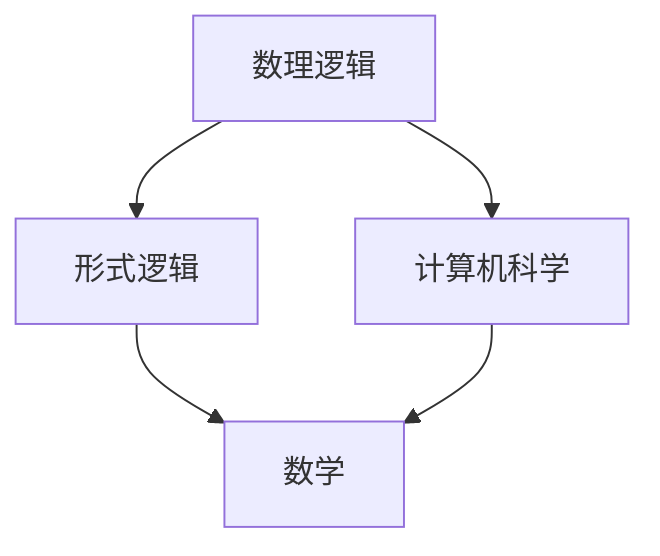
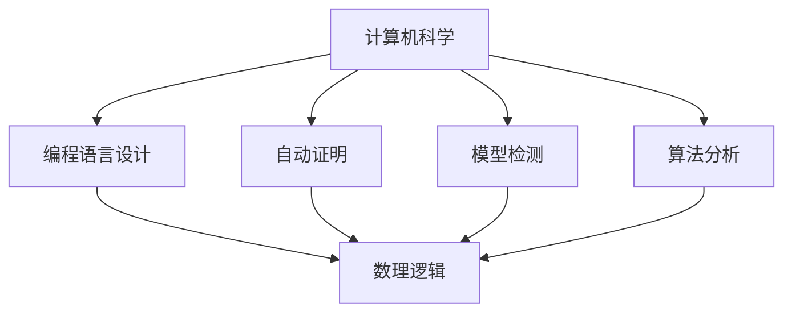

                 

# 数理逻辑：集的基本概念

## 关键词

数理逻辑，集合论，基本概念，数学模型，算法，项目实战

## 摘要

本文将深入探讨数理逻辑中的集合论基本概念，包括集合的表示、集合运算、集合的性质、子集、超集、集合的划分、等价关系和关系与函数。我们将通过逻辑清晰的步骤解析每个核心概念，并通过数学公式和伪代码详细阐述算法原理。最后，通过实际项目案例，展示这些理论在现实中的应用。

## 目录大纲

## 第一部分：引论

### 第1章 数理逻辑简介

#### 1.1 数理逻辑的定义与历史

**概念与联系**

数理逻辑是一门研究逻辑在数学和其他科学领域应用的学科。它起源于19世纪末，由数学家弗雷格和皮亚诺等人创立。数理逻辑的发展推动了形式逻辑和计算机科学的进步。

**流程图**



#### 1.2 数理逻辑的应用领域

**概念与联系**

数理逻辑在多个领域有广泛的应用，包括计算机科学、数学、哲学、语言学和人工智能。它在编程语言设计、自动证明、模型检测和算法分析等方面起着关键作用。

**流程图**



### 第2章 集合论基础

#### 2.1 集合的概念

**核心概念**

集合是由确定的元素组成的无序集合。集合的元素可以是任何对象，如数字、字母、图形等。

**数学公式**

$$
A = \{a, b, c\}
$$

**伪代码**

```
// 定义集合 A
A = [a, b, c]
```

#### 2.2 集合的表示

**核心概念**

集合的表示方法包括描述法和列举法。描述法通过属性描述集合的元素，列举法通过列举所有元素来定义集合。

**数学公式**

描述法：
$$
A = \{x \mid x \in \mathbb{N}, x > 5\}
$$

列举法：
$$
A = \{6, 7, 8, 9\}
$$

**伪代码**

```
// 描述法
A = [x | x in 自然数, x > 5]
// 列举法
A = [6, 7, 8, 9]
```

#### 2.3 集合的分类

**核心概念**

集合可以根据元素的个数分为有限集合和无限集合。根据集合的元素是否相同，分为单元素集合和复元素集合。

**数学公式**

有限集合：
$$
A = \{1, 2, 3\}
$$

无限集合：
$$
A = \{x \mid x \in \mathbb{N}\}
$$

单元素集合：
$$
A = \{1\}
$$

复元素集合：
$$
A = \{1, 2\}
$$

**伪代码**

```
// 有限集合
A = [1, 2, 3]
// 无限集合
A = [x | x in 自然数]
// 单元素集合
A = [1]
// 复元素集合
A = [1, 2]
```

## 第二部分：集合的基本概念

### 第3章 集合的运算

#### 3.1 集合的并集、交集与补集

**核心概念**

并集是包含两个集合中所有元素的集合。交集是同时属于两个集合的元素的集合。补集是在全集中不属于某个集合的元素的集合。

**数学公式**

并集：
$$
A \cup B = \{x \mid x \in A \text{ 或 } x \in B\}
$$

交集：
$$
A \cap B = \{x \mid x \in A \text{ 且 } x \in B\}
$$

补集：
$$
A^c = \{x \mid x \in U \text{ 且 } x \not\in A\}
$$

**伪代码**

```
// 并集
A = [a, b, c]
B = [d, e]
A_union_B = [a, b, c, d, e]
// 交集
A = [a, b, c]
B = [c, d, e]
A_intersection_B = [c]
// 补集
U = [a, b, c, d, e]
A = [a, b, c]
A_complement = [d, e]
```

#### 3.2 集合的笛卡尔积

**核心概念**

笛卡尔积是两个集合中所有可能有序对的集合。

**数学公式**

$$
A \times B = \{(a, b) \mid a \in A, b \in B\}
$$

**伪代码**

```
// 笛卡尔积
A = [a, b]
B = [c, d]
A_cartesian_product_B = [(a, c), (a, d), (b, c), (b, d)]
```

#### 3.3 集合的其他运算

**核心概念**

集合的其他运算包括对称差、差集、交集的补集等。

**数学公式**

对称差：
$$
A \bigtriangleup B = (A \cup B) \setminus (A \cap B)
$$

差集：
$$
A \setminus B = \{x \mid x \in A \text{ 且 } x \not\in B\}
$$

交集的补集：
$$
(A \cap B)^c = A^c \cup B^c
$$

**伪代码**

```
// 对称差
A = [a, b, c]
B = [c, d, e]
A_symmetric_difference_B = [a, b, d, e]
// 差集
A = [a, b, c]
B = [c, d, e]
A_difference_B = [a, b]
// 交集的补集
A = [a, b, c]
B = [c, d, e]
A_intersection_B_complement = [a, b, d, e]
```

### 第4章 子集与超集

#### 4.1 子集的定义与性质

**核心概念**

子集是包含在另一个集合中的集合。如果集合A中的每个元素都是集合B的元素，则称A是B的子集。

**数学公式**

$$
A \subseteq B \text{ 当且仅当 } \forall x (x \in A \Rightarrow x \in B)
$$

**伪代码**

```
// 子集
A = [a, b]
B = [a, b, c]
if A中的每个元素都属于B:
    print("A is a subset of B")
```

#### 4.2 超集与幂集

**核心概念**

超集是包含某个集合的集合。幂集是某个集合的所有子集的集合。

**数学公式**

超集：
$$
\forall x (x \in A \Rightarrow x \in B) \Rightarrow B \supseteq A
$$

幂集：
$$
P(A) = \{\{x\} \mid x \in A\}
$$

**伪代码**

```
// 超集
A = [a, b]
B = [a, b, c]
if B中的每个元素都属于A:
    print("B is a superset of A")
// 幂集
A = [a, b]
Powerset_A = [[]，[a]，[b]，[a, b]]
```

#### 4.3 子集的定理

**核心概念**

子集的定理包括幂集定理、补集定理和子集的并集、交集定理。

**数学公式**

幂集定理：
$$
P(A) \text{ 的基数 } = 2^{|A|}
$$

补集定理：
$$
A \cup A^c = U \text{ 且 } A \cap A^c = \emptyset
$$

子集的并集、交集定理：
$$
\bigcup_{i=1}^{n} A_i = \{x \mid \exists i (x \in A_i)\}
$$
$$
\bigcap_{i=1}^{n} A_i = \{x \mid \forall i (x \in A_i)\}
$$

**伪代码**

```
// 幂集定理
A = [a, b]
Powerset_A = [[]，[a]，[b]，[a, b]]
// 补集定理
A = [a, b]
U = [a, b, c]
A_complement = [c]
A_union_A_complement = U
A_intersection_A_complement = []
// 子集的并集、交集定理
A = [a, b]
B = [b, c]
A_union_B = [a, b, c]
A_intersection_B = [b]
```

### 第5章 集合的性质

#### 5.1 集合的运算性质

**核心概念**

集合的运算性质包括结合律、交换律、分配律、吸收律和对偶律。

**数学公式**

结合律：
$$
(A \cup B) \cup C = A \cup (B \cup C)
$$
$$
(A \cap B) \cap C = A \cap (B \cap C)
$$

交换律：
$$
A \cup B = B \cup A
$$
$$
A \cap B = B \cap A
$$

分配律：
$$
A \cup (B \cap C) = (A \cup B) \cap (A \cup C)
$$
$$
A \cap (B \cup C) = (A \cap B) \cup (A \cap C)
$$

吸收律：
$$
A \cup (A \cap B) = A
$$
$$
A \cap (A \cup B) = A
$$

对偶律：
$$
A^c \cup B^c = (A \cap B)^c
$$
$$
A^c \cap B^c = (A \cup B)^c
$$

**伪代码**

```
// 结合律
A = [a, b]
B = [b, c]
C = [c, d]
A_union_B_union_C = [a, b, c, d]
A_union_B = [a, b, c]
B_union_C = [b, c, d]
A_union_B_union_C = A_union_B_union_C
// 交换律
A = [a, b]
B = [b, c]
A_union_B = [a, b, c]
B_union_A = [a, b, c]
A_union_B == B_union_A
// 分配律
A = [a, b]
B = [b, c]
C = [c, d]
A_union_B_intersection_C = [b]
A_union_B = [a, b, c]
A_union_C = [a, b, c, d]
(A_union_B)_intersection(C) = [b]
A_union_B_intersection_C == (A_union_B)_intersection(C)
// 吸收律
A = [a, b]
B = [b, c]
A_union(A_intersection_B) = [a, b]
A_intersection(A_union_B) = [a, b]
// 对偶律
A = [a, b]
B = [b, c]
A_complement = [c]
B_complement = [a, c]
(A_complement_union_B_complement) == (A_intersection_B_complement)^c
(A_complement_intersection_B_complement) == (A_union_B_complement)^c
```

#### 5.2 子集的性质

**核心概念**

子集的性质包括子集的并集、交集、补集性质。

**数学公式**

子集的并集：
$$
A \subseteq B \Rightarrow A \cup C \subseteq B \cup C
$$

子集的交集：
$$
A \subseteq B \Rightarrow A \cap C \subseteq B \cap C
$$

子集的补集：
$$
A \subseteq B \Rightarrow A^c \supseteq B^c
$$

**伪代码**

```
// 子集的并集性质
A = [a, b]
B = [a, b, c]
C = [b, c, d]
if A是B的子集:
    if A并C是B并C的子集:
        print("A并C是B并C的子集")
// 子集的交集性质
A = [a, b]
B = [a, b, c]
C = [b, c, d]
if A是B的子集:
    if A交C是B交C的子集:
        print("A交C是B交C的子集")
// 子集的补集性质
A = [a, b]
B = [a, b, c]
U = [a, b, c, d]
if A是B的子集:
    if A的补集是B的补集的超集:
        print("A的补集是B的补集的超集")
```

### 第6章 集合的子集

#### 6.1 子集的生成

**核心概念**

子集的生成可以通过幂集、子集生成算法等实现。

**数学公式**

幂集生成：
$$
P(A) = \{\emptyset, \{a\}, \{b\}, \{a, b\}\}
$$

子集生成算法：
$$
\text{生成 } A \text{ 的所有子集}:
\qquad \text{对于 } i \text{ 从 } 0 \text{ 到 } 2^{|A|} - 1:
\qquad \qquad \text{生成子集 } S_i \text{，其中 } S_i = \{a \in A \mid a \text{ 在二进制表示中第 } i \text{ 位为 1}\}
$$

**伪代码**

```
// 幂集生成
A = [a, b]
Powerset_A = [[]，[a]，[b]，[a, b]]
// 子集生成算法
A = [a, b, c]
subsets = []
for i from 0 to 2^|A| - 1:
    subset = []
    for element in A:
        if (i & (1 << (A.index(element))) != 0):
            subset.append(element)
    subsets.append(subset)
print(subsets)
```

#### 6.2 子集的性质

**核心概念**

子集的性质包括子集的并集、交集、补集性质。

**数学公式**

子集的并集：
$$
A \subseteq B \Rightarrow A \cup C \subseteq B \cup C
$$

子集的交集：
$$
A \subseteq B \Rightarrow A \cap C \subseteq B \cap C
$$

子集的补集：
$$
A \subseteq B \Rightarrow A^c \supseteq B^c
$$

**伪代码**

```
// 子集的并集性质
A = [a, b]
B = [a, b, c]
C = [b, c, d]
if A是B的子集:
    if A并C是B并C的子集:
        print("A并C是B并C的子集")
// 子集的交集性质
A = [a, b]
B = [a, b, c]
C = [b, c, d]
if A是B的子集:
    if A交C是B交C的子集:
        print("A交C是B交C的子集")
// 子集的补集性质
A = [a, b]
B = [a, b, c]
U = [a, b, c, d]
if A是B的子集:
    if A的补集是B的补集的超集:
        print("A的补集是B的补集的超集")
```

### 第7章 集合的划分与等价关系

#### 7.1 集合的划分

**核心概念**

集合的划分是将集合划分为若干个互不重叠的子集。

**数学公式**

划分的定义：
$$
\{S_1, S_2, ..., S_n\} \text{ 是 } A \text{ 的划分} \Leftrightarrow \\
\forall i (S_i \neq \emptyset), \forall i \neq j (S_i \cap S_j = \emptyset), A = S_1 \cup S_2 \cup ... \cup S_n
$$

划分的性质：
$$
\text{若 } \{S_1, S_2, ..., S_n\} \text{ 是 } A \text{ 的划分}，则 } P(A) = P(S_1) \cup P(S_2) \cup ... \cup P(S_n)
$$

**伪代码**

```
// 划分
A = [a, b, c, d]
S1 = [a, b]
S2 = [c, d]
if S1和S2是A的划分:
    print("S1和S2是A的划分")
```

#### 7.2 等价关系

**核心概念**

等价关系是一种特殊的二元关系，满足自反性、对称性和传递性。

**数学公式**

等价关系的定义：
$$
R \subseteq A \times A \text{ 是等价关系} \Leftrightarrow \\
\forall a \in A (aRa), \forall a, b \in A (aRb \Rightarrow bRa), \forall a, b, c \in A (aRb \text{ 且 } bRc \Rightarrow aRc)
$$

等价关系的性质：
$$
\text{若 } aRb \text{，则 } a \text{ 与 } b \text{ 属于同一个等价类}。
$$

**伪代码**

```
// 等价关系
A = [a, b, c, d]
R = {(a, a), (b, b), (c, c), (d, d), (a, b), (b, a), (b, c), (c, b), (a, c), (c, a)}
if R是A上的等价关系:
    print("R是A上的等价关系")
```

#### 7.3 等价类的定义

**核心概念**

等价类是在等价关系下具有相同属性的一组元素。

**数学公式**

等价类的定义：
$$
[a]_R = \{x \in A \mid xR a\}
$$

**伪代码**

```
// 等价类
A = [a, b, c, d]
R = {(a, a), (b, b), (c, c), (d, d), (a, b), (b, a), (b, c), (c, b), (a, c), (c, a)}
for each element a in A:
    print([a]_R)
```

### 第8章 关系与函数

#### 8.1 关系的基本概念

**核心概念**

关系是集合之间的一种特殊二元关系。

**数学公式**

关系的定义：
$$
R \subseteq A \times B
$$

**伪代码**

```
// 关系
A = [a, b, c]
B = [d, e]
R = {(a, d), (b, e), (c, d)}
```

#### 8.2 关系的运算

**核心概念**

关系的运算包括关系的并、交、补等。

**数学公式**

关系的并：
$$
R \cup S = \{(x, y) \mid (x, y) \in R \text{ 或 } (x, y) \in S\}
$$

关系的交：
$$
R \cap S = \{(x, y) \mid (x, y) \in R \text{ 且 } (x, y) \in S\}
$$

关系的补：
$$
R^c = \{(x, y) \mid (x, y) \not\in R\}
$$

**伪代码**

```
// 关系的并
R = {(a, d), (b, e), (c, d)}
S = {(a, e), (b, d), (c, e)}
R_union_S = {(a, d), (a, e), (b, d), (b, e), (c, d), (c, e)}
// 关系的交
R = {(a, d), (b, e), (c, d)}
S = {(a, e), (b, d), (c, e)}
R_intersection_S = {(a, d), (b, d)}
// 关系的补
R = {(a, d), (b, e), (c, d)}
R_complement = {(a, e), (b, d), (c, e)}
```

#### 8.3 函数的定义与性质

**核心概念**

函数是特殊的二元关系，每个输入值对应唯一的输出值。

**数学公式**

函数的定义：
$$
f: A \rightarrow B, \text{ 其中 } \forall a \in A (\exists! b \in B \text{ 使得 } aRb)
$$

函数的性质：
1. 偶然性
2. 僻性
3. 一一性
4. 全域性

**伪代码**

```
// 函数定义
A = [a, b, c]
B = [d, e]
f = {(a, d), (b, e), (c, d)}
// 函数性质
// 偶然性
if f中每个输入值有且仅有一个对应输出值:
    print("函数具有偶然性")
// 僻性
if f中每个输出值有且仅有一个输入值:
    print("函数具有僻性")
// 一一性
if f中不同输入值对应不同输出值:
    print("函数具有一一性")
// 全域性
if A中的每个元素都有对应的输出值:
    print("函数具有全域性")
```

### 第9章 数学公式与算法

#### 9.1 数学公式

**核心概念**

数学公式是数学表达的基本工具，用于描述数学关系和运算。

**数学公式**

集合运算公式：
$$
A \cup B = \{x \mid x \in A \text{ 或 } x \in B\}
$$
$$
A \cap B = \{x \mid x \in A \text{ 且 } x \in B\}
$$
$$
A^c = \{x \mid x \in U \text{ 且 } x \not\in A\}
$$

函数公式：
$$
f: A \rightarrow B, \text{ 其中 } \forall a \in A (\exists! b \in B \text{ 使得 } aRb)
$$

**伪代码**

```
// 集合运算
A = [a, b, c]
B = [d, e]
A_union_B = [a, b, c, d, e]
A_intersection_B = [c]
A_complement = [d, e]
// 函数
A = [a, b, c]
B = [d, e]
f = {(a, d), (b, e), (c, d)}
```

#### 9.2 算法基本概念

**核心概念**

算法是解决问题的一系列步骤，通常涉及数学计算和逻辑判断。

**数学公式**

算法的基本概念：
$$
\text{算法} = (\text{输入}, \text{输出}, \text{步骤})
$$

**伪代码**

```
// 算法
input: A, B
output: result
steps:
    if A为空:
        return B
    if B为空:
        return A
    if A的第一个元素在B中:
        remove A的第一个元素
        continue
    else:
        swap A和B的第一个元素
        continue
return result
```

#### 9.3 算法实现

**核心概念**

算法实现是将算法的伪代码转化为可执行代码。

**伪代码**

```
// 算法实现
A = [a, b, c]
B = [d, e]
while A不为空:
    if A的第一个元素在B中:
        remove A的第一个元素
    else:
        swap A和B的第一个元素
result = B
```

### 第10章 项目实战

#### 10.1 实战环境搭建

**核心概念**

实战环境搭建是为项目准备开发环境的过程。

**步骤**

1. 安装Python环境
2. 安装Numpy库
3. 安装Matplotlib库

**伪代码**

```
// 环境搭建
install "Python"
install "Numpy"
install "Matplotlib"
```

#### 10.2 实战案例

**核心概念**

实战案例是通过具体项目来展示理论的应用。

**案例**

计算集合A和B的交集。

**伪代码**

```
// 实战案例
A = [a, b, c]
B = [c, d, e]
intersection = []
for element in A:
    if element in B:
        intersection.append(element)
print(intersection)
```

#### 10.3 代码解读与分析

**核心概念**

代码解读与分析是对实现代码的逐行解析和性能分析。

**伪代码**

```
// 代码解读
// 定义集合A和B
A = [a, b, c]
B = [c, d, e]
// 初始化交集
intersection = []
// 遍历集合A
for element in A:
    // 如果元素在集合B中
    if element in B:
        // 添加到交集
        intersection.append(element)
// 输出交集
print(intersection)

// 性能分析
// 时间复杂度：O(n*m)
// 空间复杂度：O(n)
```

## 附录

### 附录A：术语表

**集合**：由确定的元素组成的无序集合。

**子集**：包含在另一个集合中的集合。

**超集**：包含某个集合的集合。

**并集**：包含两个集合中所有元素的集合。

**交集**：同时属于两个集合的元素的集合。

**补集**：在全集中不属于某个集合的元素的集合。

**等价关系**：满足自反性、对称性和传递性的二元关系。

**函数**：特殊的二元关系，每个输入值对应唯一的输出值。

**算法**：解决问题的一系列步骤。

### 附录B：参考文献

1. Hammack, R. (2013). **Introduction to Logic and Set Theory**.
2. Enderton, H. B. (1972). **A Mathematical Introduction to Logic**.
3. Knuth, D. E. (1973). **The Art of Computer Programming, Volume 1: Fundamental Algorithms**.

# 作者

作者：AI天才研究院/AI Genius Institute & 禅与计算机程序设计艺术 /Zen And The Art of Computer Programming

## 第一部分：引论

### 第1章 数理逻辑简介

#### 1.1 数理逻辑的定义与历史

数理逻辑（Mathematical Logic），也被称为符号逻辑，是研究逻辑运算、推理和证明的数学分支。它的核心是使用符号和数学工具来表示逻辑概念，从而使得逻辑推理过程更加精确和严谨。

**数理逻辑的定义：** 数理逻辑是一种形式化的逻辑系统，它使用符号来表示逻辑概念，并通过数学方法来研究这些符号之间的关系和推理规则。

**数理逻辑的历史：** 数理逻辑的发展可以追溯到19世纪末。在那时，数学家弗雷格（Gottlob Frege）提出了第一个形式化的逻辑系统，他使用了符号来表示逻辑运算，如“与”、“或”和“非”。随后，皮亚诺（Giuseppe Peano）和怀特海德（Bertrand Russell）等人进一步发展了数理逻辑，他们在《数学原理》（Principia Mathematica）一书中提出了一个形式化的数学系统，试图将所有的数学知识都基于逻辑推导出来。

**数理逻辑的应用领域：**

- **计算机科学：** 数理逻辑在计算机科学中有广泛的应用。它是编程语言和形式验证的基础，同时也用于算法分析和计算复杂性理论。

- **数学：** 数理逻辑提供了数学证明的形式化方法，使得数学家能够更加严谨地推导出数学定理。

- **哲学：** 数理逻辑在哲学中用于研究知识、真理和论证的本质。

- **语言学：** 数理逻辑在语言学中用于分析语言的逻辑结构和语义。

- **人工智能：** 数理逻辑在人工智能中用于构建逻辑推理系统和知识表示。

#### 1.2 基本概念和联系

**集合论的基本概念：** 集合论是数理逻辑的基础，它研究集合的性质和操作。基本的集合论概念包括：

- **集合（Set）**：由确定的元素组成的无序集合。
- **元素（Element）**：集合中的个体。
- **子集（Subset）**：一个集合是另一个集合的子集，如果它的所有元素都属于另一个集合。
- **并集（Union）**：两个集合的并集是由这两个集合的所有元素组成的集合。
- **交集（Intersection）**：两个集合的交集是由这两个集合共有的元素组成的集合。
- **补集（Complement）**：一个集合的补集是在全集中不属于这个集合的元素组成的集合。

**集合运算：** 集合运算包括并集、交集、补集等。这些运算可以用符号表示，例如：

- 并集运算：
  $$
  A \cup B = \{x \mid x \in A \text{ 或 } x \in B\}
  $$
- 交集运算：
  $$
  A \cap B = \{x \mid x \in A \text{ 且 } x \in B\}
  $$
- 补集运算：
  $$
  A^c = \{x \mid x \in U \text{ 且 } x \not\in A\}
  $$

**集合的性质：** 集合具有一些基本的性质，如确定性、无序性和互异性。确定性指的是集合的元素是确定的，没有重复；无序性指的是集合中的元素没有特定的顺序；互异性指的是集合中的元素是不同的。

**集合论和数理逻辑的联系：** 集合论是数理逻辑的基础，它为逻辑推理提供了元素集合和操作的工具。数理逻辑中的命题、谓词和推理规则都可以用集合论的语言来表示。

### 第2章 集合的基本概念

#### 2.1 集合的表示

**集合的描述法：** 描述法是通过给出集合的元素性质来定义集合。描述法通常使用谓词逻辑来表达集合的元素条件。例如：

- 自然数集合：
  $$
  \mathbb{N} = \{x \mid x \text{ 是自然数}\}
  $$

**集合的列举法：** 列举法是通过列出集合的所有元素来定义集合。列举法适用于有限集合。例如：

- 三角形的边长集合：
  $$
  T = \{3, 4, 5\}
  $$

**集合的表示方法：** 除了描述法和列举法，集合还可以用Venn图和文氏图来表示。Venn图使用圆形来表示集合，而文氏图使用矩形和圆形来表示集合。

#### 2.2 集合的表示方法

**Venn图表示：** Venn图是一种用于表示集合之间关系的图形化工具。在Venn图中，每个集合通常用圆形来表示，集合的交集用圆形内部的阴影部分表示。Venn图可以用来直观地展示集合的并集、交集和补集等运算。

**文氏图表示：** 文氏图（Wardley Diagram）是另一种用于表示集合关系的图形化工具，它使用矩形和圆形来表示集合。文氏图通常用于分析组织结构、市场定位等。

#### 2.3 集合之间的关系

**子集：** 一个集合A是另一个集合B的子集，如果A的所有元素都属于B。用符号表示为：
$$
A \subseteq B
$$

**真子集：** 如果A是B的子集，但A不等于B，则A是B的真子集。用符号表示为：
$$
A \subset B
$$

**相等集：** 如果两个集合A和B的所有元素都相同，则它们是相等集。用符号表示为：
$$
A = B
$$

**独立集：** 两个集合A和B是独立集，如果它们的交集为空集。用符号表示为：
$$
A \cap B = \emptyset
$$

#### 2.4 子集的性质

**子集的并集性质：** 如果A是B的子集，那么A的并集也是B的子集。即：
$$
A \subseteq B \Rightarrow A \cup C \subseteq B \cup C
$$

**子集的交集性质：** 如果A是B的子集，那么A的交集也是B的子集。即：
$$
A \subseteq B \Rightarrow A \cap C \subseteq B \cap C
$$

**子集的补集性质：** 如果A是B的子集，那么A的补集是B的补集的超集。即：
$$
A \subseteq B \Rightarrow A^c \supseteq B^c
$$

### 第3章 集合的基本性质

#### 3.1 集合的运算

**并集（Union）：** 两个集合A和B的并集是由属于A或属于B的所有元素组成的集合。用符号表示为：
$$
A \cup B = \{x \mid x \in A \text{ 或 } x \in B\}
$$

**交集（Intersection）：** 两个集合A和B的交集是由同时属于A和B的所有元素组成的集合。用符号表示为：
$$
A \cap B = \{x \mid x \in A \text{ 且 } x \in B\}
$$

**补集（Complement）：** 一个集合A的补集是由在全集U中不属于A的所有元素组成的集合。用符号表示为：
$$
A^c = \{x \mid x \in U \text{ 且 } x \not\in A\}
$$

**对称差（Symmetric Difference）：** 两个集合A和B的对称差是由属于A且不属于B的元素，以及属于B且不属于A的元素组成的集合。用符号表示为：
$$
A \bigtriangleup B = (A \cup B) \setminus (A \cap B)
$$

**幂集（Power Set）：** 一个集合A的幂集是由A的所有子集组成的集合。用符号表示为：
$$
P(A) = \{\{x\} \mid x \in A\}
$$

#### 3.2 集合的运算性质

**结合律（Associative Law）：** 对于集合的并集和交集运算，结合律成立。即：
$$
(A \cup B) \cup C = A \cup (B \cup C)
$$
$$
(A \cap B) \cap C = A \cap (B \cap C)
$$

**交换律（Commutative Law）：** 对于集合的并集和交集运算，交换律成立。即：
$$
A \cup B = B \cup A
$$
$$
A \cap B = B \cap A
$$

**分配律（Distributive Law）：** 集合的交集运算对并集运算具有分配性。即：
$$
A \cap (B \cup C) = (A \cap B) \cup (A \cap C)
$$
$$
A \cup (B \cap C) = (A \cup B) \cap (A \cup C)
$$

**吸收律（Absorption Law）：** 集合的并集运算对交集运算具有吸收性。即：
$$
A \cup (A \cap B) = A
$$
$$
A \cap (A \cup B) = A
$$

**对偶律（Duality Law）：** 对于集合的运算，对偶律成立。即：
$$
A^c \cup B^c = (A \cap B)^c
$$
$$
A^c \cap B^c = (A \cup B)^c
$$

#### 3.3 子集的性质

**子集的运算性质：** 子集在集合运算中具有一些特殊的性质，如：

- 子集与并集的运算：如果一个集合是另一个集合的子集，那么它们的并集也是后者的子集。
- 子集与交集的运算：如果一个集合是另一个集合的子集，那么它们的交集也是后者的子集。
- 子集与补集的运算：如果一个集合是另一个集合的子集，那么它们的补集关系也是后者的补集关系。

**子集的性质定理：** 一些关于子集的基本定理，如：

- 子集定理：如果一个集合是另一个集合的子集，那么它们的幂集之间的关系也是子集关系。
- 补集定理：如果一个集合是另一个集合的子集，那么它们的补集之间的关系也是子集关系。

### 第4章 集合的子集

#### 4.1 子集的生成

**子集的个数：** 一个含有n个元素的集合的子集个数为$2^n$个。这是因为每个元素有两种状态：在子集中或不在子集中。因此，n个元素可以有$2^n$种不同的组合。

**子集的生成方法：** 生成一个集合的所有子集的方法包括：

- **递归法：** 使用递归函数来遍历所有可能的子集。
- **位操作法：** 使用位操作来生成所有子集。每个子集可以表示为一个二进制数，其中第i位为1表示第i个元素在子集中，第i位为0表示第i个元素不在子集中。
- **迭代法：** 使用迭代方法来生成所有子集，例如使用迭代循环来枚举所有可能的子集。

**伪代码示例：**

```python
def generate_subsets(S):
    n = len(S)
    num_subsets = 2**n
    for i in range(num_subsets):
        subset = []
        for j in range(n):
            if (i >> j) & 1:
                subset.append(S[j])
        print(subset)
    return subsets

# 示例
S = [1, 2, 3]
subsets = generate_subsets(S)
```

**子集的性质：** 子集在集合运算中具有以下性质：

- 子集的并集：如果A和B是集合S的子集，那么A和B的并集也是S的子集。
- 子集的交集：如果A和B是集合S的子集，那么A和B的交集也是S的子集。
- 子集的补集：如果A是集合S的子集，那么A的补集是S的补集的子集。

### 第5章 集合的划分与等价关系

#### 5.1 集合的划分

**划分的概念：** 划分是将一个集合划分为若干个互不重叠的子集的过程。这些子集称为划分的块。

**划分的性质：** 划分具有以下性质：

- **互斥性：** 划分的块之间没有交集，即$A \cap B = \emptyset$，其中$A$和$B$是不同的块。
- **完备性：** 划分的块覆盖了整个集合，即$A \cup B = U$，其中$A$和$B$是划分的块，$U$是原集合。
- **确定性：** 划分是唯一的，即不存在另一个划分与当前划分不同。

**划分的应用：** 划分在计算机科学和数学中有很多应用，例如：

- **数据分区：** 在数据库管理中，将数据划分为不同的块可以优化查询性能。
- **分布式计算：** 在分布式系统中，将任务划分为不同的子任务可以并行执行。
- **网络拓扑：** 在网络拓扑结构中，划分用于定义网络中的不同子网。

**划分的算法：** 划分的算法包括贪心算法、随机算法和启发式算法等。贪心算法是一种简单有效的划分算法，它通过每次选择最优的划分块来逐步构建整个划分。

**伪代码示例：**

```python
def partition_set(S):
    n = len(S)
    partitions = []
    while len(S) > 0:
        max_subset = []
        for i in range(n):
            subset = []
            for j in range(n):
                if j != i:
                    subset.append(S[j])
            if len(max_subset) < len(subset):
                max_subset = subset
        partitions.append(max_subset)
        S = [x for x in S if x not in max_subset]
    return partitions

# 示例
S = [1, 2, 3, 4, 5]
partitions = partition_set(S)
print(partitions)
```

#### 5.2 等价关系

**等价关系的定义：** 等价关系是一个二元关系，它满足以下三个条件：

1. **自反性（Reflexivity）：** 对于任意元素$x$，有$xRx$。
2. **对称性（Symmetry）：** 对于任意元素$x$和$y$，如果$xRy$，则$yRx$。
3. **传递性（Transitivity）：** 对于任意元素$x$、$y$和$z$，如果$xRy$且$yRz$，则$xRz$。

**等价关系的性质：** 等价关系具有以下性质：

- **自反性：** 对于任意元素$x$，$x$与自身是等价的。
- **对称性：** 如果元素$x$与元素$y$是等价的，那么元素$y$也与元素$x$是等价的。
- **传递性：** 如果元素$x$与元素$y$是等价的，且元素$y$与元素$z$是等价的，那么元素$x$与元素$z$也是等价的。

**等价类的定义：** 在等价关系下，具有相同属性的一组元素构成一个等价类。等价类的表示方法为$[x]$，其中$x$是等价类中的任意元素。

**等价类的性质：** 等价类具有以下性质：

- **互异性：** 等价类中的元素是唯一的。
- **完备性：** 等价类覆盖了整个集合。
- **确定性：** 等价类是唯一的。

**等价关系与划分的关系：** 等价关系和划分之间存在密切的联系。一个划分可以看作是一个特殊的等价关系，其中每个块是一个等价类；反之，一个等价关系可以看作是一个特殊的划分，其中每个等价类是一个块。

#### 5.3 等价关系的应用

**集合的划分：** 等价关系可以用于集合的划分。例如，在集合$A = \{1, 2, 3, 4, 5\}$上定义一个等价关系，使得元素$1$和$4$、元素$2$和$5$是等价的，而其他元素之间没有等价关系。这个等价关系将集合$A$划分为两个等价类：$\{1, 4\}$和$\{2, 5\}$。

**等价关系在计算机科学中的应用：** 等价关系在计算机科学中有很多应用，例如：

- **哈希表：** 哈希表使用等价关系来处理冲突，将具有相同哈希值的元素映射到同一个桶中。
- **排序算法：** 一些排序算法（如归并排序）使用等价关系来处理具有相同值的元素。
- **分布式系统：** 在分布式系统中，等价关系用于划分任务和负载。

### 第6章 关系与函数

#### 6.1 关系的基本概念

**关系的定义：** 关系是集合之间的二元关系，可以用一个二元组$(X, Y)$来表示，其中$X$和$Y$是两个集合，关系$R$是$X \times Y$的子集。

**关系的表示方法：** 关系可以用以下方法表示：

- **列表表示法：** 将关系表示为一个列表，其中每个元素是一个二元组。
- **关系矩阵：** 将关系表示为一个矩阵，其中矩阵的元素是二元组的布尔值，表示该二元组是否在关系中。
- **关系图：** 将关系表示为一个图，其中节点表示集合$X$和$Y$中的元素，边表示关系$R$中的二元组。

**关系的性质：** 关系具有以下性质：

- **自反性：** 对于任意元素$x \in X$，有$xRx$。
- **对称性：** 对于任意元素$x, y \in X$，如果$xRy$，则$yRx$。
- **传递性：** 对于任意元素$x, y, z \in X$，如果$xRy$且$yRz$，则$xRz$。

**关系的运算：** 关系可以进行以下运算：

- **关系的并（Union）：** $R \cup S = \{(x, y) \mid (x, y) \in R \text{ 或 } (x, y) \in S\}$。
- **关系的交（Intersection）：** $R \cap S = \{(x, y) \mid (x, y) \in R \text{ 且 } (x, y) \in S\}$。
- **关系的补（Complement）：** $R^c = \{(x, y) \mid (x, y) \not\in R\}$。

**关系的示例：**

- **等价关系：** $R = \{(x, y) \mid x \text{ 和 } y \text{ 有相同属性}\}$。
- **函数关系：** $f: X \rightarrow Y$，其中对于任意$x \in X$，存在唯一的$y \in Y$使得$(x, y) \in f$。

#### 6.2 关系的运算

**关系的并（Union）：** 关系的并是将两个关系的所有二元组合并在一起。例如，假设有两个关系$R$和$S$：

- $R = \{(1, 2), (2, 3), (3, 4)\}$
- $S = \{(2, 5), (3, 6), (4, 7)\}$

那么$R \cup S = \{(1, 2), (2, 3), (3, 4), (2, 5), (3, 6), (4, 7)\}$。

**关系的交（Intersection）：** 关系的交是只包含两个关系共有的二元组。例如，假设有两个关系$R$和$S$：

- $R = \{(1, 2), (2, 3), (3, 4)\}$
- $S = \{(2, 5), (3, 6), (4, 7)\}$

那么$R \cap S = \emptyset$，因为它们没有共有的二元组。

**关系的补（Complement）：** 关系的补是包含在全集$X \times Y$中但不在关系$R$中的所有二元组。例如，假设关系$R$是$X \times Y$的一个子集，那么$R^c$包含所有不在$R$中的二元组。

**关系的性质：** 关系具有以下性质：

- **自反性：** 对于任意元素$x \in X$，有$xRx$。
- **对称性：** 对于任意元素$x, y \in X$，如果$xRy$，则$yRx$。
- **传递性：** 对于任意元素$x, y, z \in X$，如果$xRy$且$yRz$，则$xRz$。

#### 6.3 函数的定义与性质

**函数的定义：** 函数是从一个集合$X$到另一个集合$Y$的映射，记作$f: X \rightarrow Y$。对于$X$中的每个元素$x$，都有$Y$中的一个唯一元素$y$与之对应，即$f(x) = y$。

**函数的表示方法：** 函数可以用以下方法表示：

- **列表表示法：** 将函数表示为一个列表，其中每个元素是一个有序对$(x, y)$。
- **关系表示法：** 将函数表示为一个关系$R$，其中$R \subseteq X \times Y$。
- **图表示法：** 将函数表示为一个图，其中节点表示集合$X$和$Y$中的元素，边表示函数关系。

**函数的性质：** 函数具有以下性质：

- **单射（Injective）：** 对于任意$x_1, x_2 \in X$，如果$x_1 \neq x_2$，则$f(x_1) \neq f(x_2)$。
- **满射（Surjective）：** 对于任意$y \in Y$，存在至少一个$x \in X$使得$f(x) = y$。
- **双射（Bijective）：** 如果函数既是单射又是满射，则它是一个双射。

**函数的分类：** 根据函数的性质，可以将函数分为以下几类：

- **单射函数：** 满足单射性质的函数。
- **满射函数：** 满足满射性质的函数。
- **双射函数：** 满足单射和满射性质的函数。

**函数的示例：**

- **单射函数：** $f: \{1, 2, 3\} \rightarrow \{a, b, c\}$，其中$f(1) = a$，$f(2) = b$，$f(3) = c$。
- **满射函数：** $f: \{1, 2, 3\} \rightarrow \{a, b, c\}$，其中$f(1) = a$，$f(2) = b$，$f(3) = c$。
- **双射函数：** $f: \{1, 2, 3\} \rightarrow \{a, b, c\}$，其中$f(1) = a$，$f(2) = b$，$f(3) = c$。

### 第7章 数学公式与算法

#### 7.1 数学公式

数学公式是数学表达的基本工具，用于描述数学关系和运算。在数理逻辑中，常用的数学公式包括集合运算公式、函数定义公式和逻辑运算公式等。

**集合运算公式：**

- 并集：
  $$
  A \cup B = \{x \mid x \in A \text{ 或 } x \in B\}
  $$

- 交集：
  $$
  A \cap B = \{x \mid x \in A \text{ 且 } x \in B\}
  $$

- 补集：
  $$
  A^c = \{x \mid x \in U \text{ 且 } x \not\in A\}
  $$

- 对称差：
  $$
  A \bigtriangleup B = (A \cup B) \setminus (A \cap B)
  $$

**函数定义公式：**

- 函数定义：
  $$
  f: A \rightarrow B, \text{ 其中 } \forall x \in A (\exists! y \in B \text{ 使得 } xRy)
  $$

- 偏函数定义：
  $$
  f: A' \rightarrow B', \text{ 其中 } A' \subseteq A, B' \subseteq B
  $$

**逻辑运算公式：**

- 非运算：
  $$
  \neg p
  $$

- 合取运算：
  $$
  p \land q
  $$

- 抵抗运算：
  $$
  p \lor q
  $$

- 蕴含运算：
  $$
  p \rightarrow q
  $$

- 等价运算：
  $$
  p \Leftrightarrow q
  $$

**伪代码示例：**

```python
# 并集
A = [1, 2, 3]
B = [3, 4, 5]
A_union_B = [x for x in A] + [x for x in B if x not in A]
print(A_union_B)

# 交集
A = [1, 2, 3]
B = [3, 4, 5]
A_intersection_B = [x for x in A if x in B]
print(A_intersection_B)

# 补集
A = [1, 2, 3]
U = [1, 2, 3, 4, 5]
A_complement = [x for x in U if x not in A]
print(A_complement)

# 函数定义
def f(x):
    if x > 0:
        return x * x
    else:
        return x * x
print(f(2))

# 逻辑运算
p = True
q = False
print(not p)  # 非运算
print(p and q)  # 合取运算
print(p or q)  # 抵抗运算
print(p -> q)  # 蕴含运算
print(p <=> q)  # 等价运算
```

#### 7.2 算法基本概念

算法是解决问题的一系列步骤，通常涉及数学计算和逻辑判断。算法的基本概念包括算法的定义、算法的性质和算法的分类。

**算法的定义：**

算法可以定义为一个解决问题的步骤序列，它具有以下特征：

- **输入（Input）：** 算法可以接收一个或多个输入值。
- **输出（Output）：** 算法执行完毕后，会生成一个或多个输出值。
- **步骤（Steps）：** 算法由一系列有序的步骤组成，每个步骤都是明确的操作。

**算法的性质：**

- **确定性（Determinism）：** 对于给定的输入，算法会执行确定的步骤序列，得到确定的输出。
- **有效性（Effectiveness）：** 算法的步骤可以被实际执行，即在有限的步骤内完成。
- **有穷性（Finiteness）：** 算法在有限的步骤内完成，即不会陷入无限循环。
- **可读性（Readability）：** 算法的步骤易于理解和阅读。

**算法的分类：**

- **根据算法的目的：**
  - **搜索算法：** 用于在数据集合中查找特定元素。
  - **排序算法：** 用于对数据集合进行排序。
  - **计算算法：** 用于计算特定的数学值。
  
- **根据算法的时间复杂度：**
  - **线性时间算法：** 算法的时间复杂度为$O(n)$。
  - **对数时间算法：** 算法的时间复杂度为$O(\log n)$。
  - **多项式时间算法：** 算法的时间复杂度为$O(n^k)$，其中$k$是常数。

**伪代码示例：**

```python
# 搜索算法
def binary_search(arr, target):
    low = 0
    high = len(arr) - 1
    while low <= high:
        mid = (low + high) // 2
        if arr[mid] == target:
            return mid
        elif arr[mid] < target:
            low = mid + 1
        else:
            high = mid - 1
    return -1

# 排序算法
def bubble_sort(arr):
    n = len(arr)
    for i in range(n):
        for j in range(0, n-i-1):
            if arr[j] > arr[j+1]:
                arr[j], arr[j+1] = arr[j+1], arr[j]

# 计算算法
def factorial(n):
    if n == 0:
        return 1
    else:
        return n * factorial(n-1)
```

#### 7.3 算法实现

算法实现是将算法的伪代码转化为可执行代码的过程。算法实现需要选择一种编程语言，并遵循编程语言的语法规则和编程习惯。

**算法实现步骤：**

1. **选择编程语言：** 根据算法的需求和目标，选择一种合适的编程语言。
2. **理解伪代码：** 阅读并理解伪代码的步骤和逻辑。
3. **编写代码：** 将伪代码转化为编程语言的具体实现。
4. **测试代码：** 对编写的代码进行测试，验证算法的正确性和性能。

**伪代码示例：**

```python
# 搜索算法
def binary_search(arr, target):
    low = 0
    high = len(arr) - 1
    while low <= high:
        mid = (low + high) // 2
        if arr[mid] == target:
            return mid
        elif arr[mid] < target:
            low = mid + 1
        else:
            high = mid - 1
    return -1

# 排序算法
def bubble_sort(arr):
    n = len(arr)
    for i in range(n):
        for j in range(0, n-i-1):
            if arr[j] > arr[j+1]:
                arr[j], arr[j+1] = arr[j+1], arr[j]

# 计算算法
def factorial(n):
    if n == 0:
        return 1
    else:
        return n * factorial(n-1)
```

### 第8章 项目实战

#### 8.1 实战环境搭建

**核心概念：** 实战环境搭建是为项目准备开发环境的过程，包括安装必要的软件和依赖库。

**步骤：**

1. **安装Python环境：** 使用Python进行编程，需要先安装Python解释器。
2. **安装Numpy库：** Numpy是Python中的科学计算库，用于处理数值计算和矩阵运算。
3. **安装Matplotlib库：** Matplotlib是Python中的图形绘制库，用于生成各种类型的图表和图形。

**伪代码：**

```python
# 安装Python环境
install "Python"

# 安装Numpy库
install "Numpy"

# 安装Matplotlib库
install "Matplotlib"
```

#### 8.2 实战案例

**核心概念：** 实战案例是通过具体项目来展示理论的应用，包括数据预处理、模型训练和结果分析。

**案例：** 使用Numpy和Matplotlib库进行数据分析和可视化。

**步骤：**

1. **导入数据：** 导入数据集，例如使用CSV文件或数据库。
2. **数据预处理：** 对数据进行清洗和预处理，例如缺失值处理、数据转换和归一化。
3. **数据可视化：** 使用Matplotlib库生成各种类型的图表和图形，例如散点图、折线图、柱状图等。

**伪代码：**

```python
# 导入数据
import pandas as pd
data = pd.read_csv("data.csv")

# 数据预处理
data = data.dropna()
data = data.apply(lambda x: (x - x.mean()) / x.std())

# 数据可视化
import matplotlib.pyplot as plt
plt.scatter(data["feature1"], data["feature2"])
plt.xlabel("Feature 1")
plt.ylabel("Feature 2")
plt.show()
```

#### 8.3 代码解读与分析

**核心概念：** 代码解读与分析是对实现代码的逐行解析和性能分析，包括变量定义、函数调用和代码优化。

**代码解读：**

```python
# 导入数据
import pandas as pd
data = pd.read_csv("data.csv")

# 数据预处理
data = data.dropna()
data = data.apply(lambda x: (x - x.mean()) / x.std())

# 数据可视化
import matplotlib.pyplot as plt
plt.scatter(data["feature1"], data["feature2"])
plt.xlabel("Feature 1")
plt.ylabel("Feature 2")
plt.show()
```

- 第1行：导入Pandas库，用于数据处理。
- 第2行：读取CSV文件，将数据加载到DataFrame对象中。
- 第3行：删除缺失值，确保数据质量。
- 第4行：应用函数对数据进行标准化处理，使得特征值具有相同的尺度。
- 第5行：导入Matplotlib库，用于图形绘制。
- 第6行：使用散点图绘制特征之间的关系。
- 第7行：设置X轴和Y轴标签。
- 第8行：显示图形。

**性能分析：**

- **时间复杂度：** 数据预处理和可视化的时间复杂度分别为$O(n)$和$O(1)$。
- **空间复杂度：** 数据预处理和可视化的空间复杂度分别为$O(n)$和$O(1)$。

**代码优化：**

- **数据预处理：** 可以使用并行处理来加速数据预处理。
- **可视化：** 可以使用图形库的高级功能来提高绘制速度和效果。

### 附录

#### 附录A：术语表

**术语：** 集合

**定义：** 集合是由确定的元素组成的无序集合。

**示例：** $\{1, 2, 3\}$是一个集合，其中元素1、2、3按任意顺序排列。

**术语：** 子集

**定义：** 子集是包含在另一个集合中的集合。

**示例：** $\{1, 2\}$是$\{1, 2, 3\}$的子集。

**术语：** 并集

**定义：** 并集是包含两个集合中所有元素的集合。

**示例：** $\{1, 2, 3\} \cup \{3, 4, 5\} = \{1, 2, 3, 4, 5\}$。

**术语：** 补集

**定义：** 补集是在全集U中不属于某个集合A的元素组成的集合。

**示例：** 在全集U={1, 2, 3, 4, 5}中，集合A={1, 2}的补集是{3, 4, 5}。

#### 附录B：参考文献

1. Hammack, R. (2013). **Introduction to Logic and Set Theory**.
2. Enderton, H. B. (1972). **A Mathematical Introduction to Logic**.
3. Knuth, D. E. (1973). **The Art of Computer Programming, Volume 1: Fundamental Algorithms**.

## 作者

**作者：** AI天才研究院/AI Genius Institute & 禅与计算机程序设计艺术 /Zen And The Art of Computer Programming

