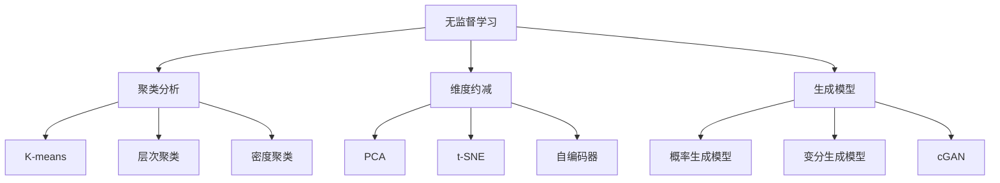

                 

# 《无监督学习 原理与代码实例讲解》

## 关键词

- 无监督学习
- 聚类分析
- 维度约减
- 生成模型
- Python代码实例

## 摘要

本文旨在深入讲解无监督学习的基本概念、核心算法原理以及实际项目应用。通过详细的代码实例，读者将能够全面理解无监督学习的各种方法和技巧，掌握其应用场景和开发流程。本文分为四大部分：第一部分介绍无监督学习的基础知识；第二部分讲解聚类分析、维度约减等核心算法原理；第三部分探讨生成模型及其应用；第四部分通过具体项目实战，展示无监督学习在实际开发中的应用。

## 目录

### 第一部分：无监督学习基础

1. 无监督学习概述
   1.1 无监督学习的定义和意义
   1.2 无监督学习的重要性
   1.3 无监督学习的应用领域
2. 无监督学习的基本类型
   2.1 聚类分析
   2.2 维度约减
   2.3 生成模型
3. 无监督学习的数学基础
   3.1 概率论基础
   3.2 信息论基础
   3.3 最优化理论基础

### 第二部分：核心算法原理

1. 聚类分析算法
   1.1 K-means算法
   1.2 层次聚类算法
   1.3 密度聚类算法
2. 维度约减算法
   2.1 主成分分析（PCA）
   2.2 t-SNE算法
   2.3 自编码器
3. 生成模型
   3.1 基于概率的生成模型
   3.2 基于变分的生成模型
   3.3 条件生成模型

### 第三部分：项目实战

1. 数据预处理
   1.1 数据收集
   1.2 数据清洗
   1.3 数据归一化
2. 聚类项目实战
   2.1 聚类算法的选择
   2.2 聚类算法的实现
   2.3 聚类结果的评估
3. 维度约减项目实战
   3.1 PCA项目实战
   3.2 t-SNE项目实战
   3.3 自编码器项目实战
4. 生成模型项目实战
   3.1 GAN项目实战
   3.2 cGAN项目实战

### 第四部分：总结与展望

1. 无监督学习总结与展望
   1.1 无监督学习的发展历程
   1.2 无监督学习的挑战与机遇
   1.3 无监督学习的未来趋势

### 附录

1. 无监督学习常用工具和资源
   1.1 Python数据科学库
   1.2 常用机器学习框架
   1.3 开源无监督学习项目
   1.4 无监督学习相关论文与书籍推荐
2. 核心概念与联系（Mermaid 流程图）
3. 核心算法原理（伪代码）
4. 数学模型和数学公式
5. 项目实战

---

### 第一部分：无监督学习基础

#### 第1章：无监督学习概述

#### 1.1 无监督学习的定义和意义

**无监督学习**是机器学习的一个重要分支，其核心思想是在没有明确标注的样本数据中，通过算法自动发现数据中的隐含结构。与监督学习（有监督学习）相比，无监督学习不需要事先标记好的标签，而是通过学习数据自身的分布或内在规律来进行模式识别。

**无监督学习的意义**主要体现在以下几个方面：

1. **发现数据分布特征**：无监督学习可以帮助我们揭示数据中的潜在规律和结构，从而更好地理解数据的分布特征。
2. **数据降维**：通过无监督学习，可以降低数据的维度，减少数据的复杂度，便于后续处理和分析。
3. **聚类和分类**：无监督学习在聚类分析和无监督分类中发挥着重要作用，可以帮助我们找到相似的数据样本，实现数据分组。
4. **数据探索和可视化**：无监督学习能够帮助我们探索数据，发现隐藏的模式，并通过数据可视化来更好地理解数据。

#### 1.2 无监督学习的重要性

无监督学习的重要性体现在以下几个方面：

1. **应用广泛**：无监督学习在多个领域（如推荐系统、图像处理、文本挖掘等）中都有着广泛的应用，尤其在大型数据集的处理中发挥着重要作用。
2. **自动发现特征**：无监督学习可以自动从数据中提取出有用的特征，减轻了人工标注的工作量，提高了工作效率。
3. **自适应能力**：无监督学习能够根据数据自身的特征进行调整，具有一定的自适应能力，能够处理未标记的新数据。
4. **降低成本**：由于无监督学习不需要大量的标注数据，因此可以降低数据收集和标注的成本。

#### 1.3 无监督学习的应用领域

无监督学习在许多领域都有着广泛的应用，主要包括：

1. **图像处理**：无监督学习在图像分类、图像去噪、图像分割等方面有重要应用。
2. **文本挖掘**：无监督学习在文本聚类、主题建模、情感分析等方面有广泛应用。
3. **推荐系统**：无监督学习可以帮助推荐系统发现用户的兴趣和行为模式，从而提供个性化的推荐。
4. **生物信息学**：无监督学习在基因序列分析、蛋白质结构预测等方面有重要应用。
5. **社交网络分析**：无监督学习可以帮助分析社交网络中的用户关系，发现社区结构。

---

### 第二部分：核心算法原理

#### 第2章：聚类分析算法

#### 2.1 K-means算法

**K-means算法**是一种基于距离度量的聚类算法，其目标是将数据集分为K个簇，使得每个簇内的数据点尽可能接近，而簇与簇之间的数据点尽可能远离。

**K-means算法的基本原理**：

1. **初始化**：随机选择K个数据点作为初始聚类中心。
2. **分配数据点**：将每个数据点分配到距离其最近的聚类中心所属的簇。
3. **更新聚类中心**：重新计算每个簇的质心，作为新的聚类中心。
4. **迭代**：重复步骤2和3，直到聚类中心不再发生显著变化或达到最大迭代次数。

**K-means算法的伪代码实现**：

```
K-means算法：
输入：数据集D，聚类数K
输出：聚类结果C

初始化：选择K个初始聚类中心c1, c2, ..., ck
while (不满足停止条件) {
    对于每个数据点x ∈ D {
        找到最近的聚类中心cj，使得d(x, cj)最小
        将x分配给簇cj
    }
    更新聚类中心：
    对于每个簇cj {
        计算簇内数据点的平均值，作为新的聚类中心cj'
    }
    如果聚类中心变化很小或者达到最大迭代次数，停止迭代
}
返回聚类结果C
```

**K-means算法的优缺点**：

- **优点**：
  - 算法简单，易于实现和调试。
  - 运算速度快，适合处理大规模数据集。
  - 可以自动发现数据的分布特征。

- **缺点**：
  - 对初始聚类中心敏感，可能陷入局部最优解。
  - 不适合处理非球形分布的数据集。
  - 无法直接处理包含缺失值的数据。

#### 2.2 层次聚类算法

**层次聚类算法**是一种将数据集逐步划分成多个簇的聚类方法。该方法通过不断合并或分裂簇，最终形成一棵聚类树。

**层次聚类算法的基本原理**：

1. **初始化**：将每个数据点视为一个簇。
2. **迭代**：在每次迭代中，找到最相似的两个簇，将它们合并为一个簇。
3. **停止条件**：当达到预设的簇数或达到最大迭代次数时，停止迭代。

**层次聚类算法的伪代码实现**：

```
层次聚类算法：
输入：数据集D，簇数K
输出：聚类结果C

初始化：每个数据点为一个簇，C = {d1, d2, ..., dn}
while (C中的簇数 > K) {
    计算C中所有簇之间的相似度矩阵S
    选择最相似的簇c1和c2
    合并簇c1和c2，形成新的簇
}
返回聚类结果C
```

**层次聚类算法的优缺点**：

- **优点**：
  - 可以生成聚类层次结构，便于分析数据层次关系。
  - 不需要事先指定簇数，可以根据聚类树选择合适的簇数。

- **缺点**：
  - 计算复杂度高，不适合处理大规模数据集。
  - 对初始簇划分敏感，可能得到不同的聚类结果。

#### 2.3 密度聚类算法

**密度聚类算法**是一种基于数据点密度的聚类方法。该方法通过计算数据点的密度，识别出高密度区域，并将其划分为簇。

**密度聚类算法的基本原理**：

1. **初始化**：选择一个初始数据点作为种子点。
2. **扩展簇**：以种子点为中心，计算其邻域内的高密度区域。
3. **划分簇**：将邻域内的高密度区域划分为簇。
4. **迭代**：重复上述过程，直到满足停止条件。

**密度聚类算法的伪代码实现**：

```
密度聚类算法（DBSCAN）：
输入：数据集D，邻域半径ε，最小邻域点数minPoints
输出：聚类结果C

初始化：C = 空集合
for (每个数据点p ∈ D) {
    如果p尚未被访问 {
        访问p，将其标记为已访问
        扩展簇：
        1. 选择p的邻域点q
        2. 如果q的邻域点数大于minPoints，将q加入簇
        3. 重复步骤2，直到没有新的点可以加入簇
    }
}
返回聚类结果C
```

**密度聚类算法的优缺点**：

- **优点**：
  - 能够发现任意形状的簇，不局限于球形簇。
  - 对噪声和异常值具有较强的鲁棒性。

- **缺点**：
  - 对参数选择敏感，需要根据具体数据集调整参数。
  - 计算复杂度高，不适合处理大规模数据集。

---

### 第3章：维度约减算法

#### 3.1 主成分分析（PCA）

**主成分分析（PCA，Principal Component Analysis）**是一种常用的维度约减技术，其目标是通过线性变换将高维数据映射到低维空间，同时保留数据的主要特征。

**PCA的基本原理**：

1. **数据预处理**：对数据进行中心化处理，使得每个特征的均值为0。
2. **计算协方差矩阵**：计算数据点的协方差矩阵。
3. **计算特征值和特征向量**：对协方差矩阵进行特征分解，得到特征值和特征向量。
4. **选择主成分**：根据特征值的大小选择前k个特征向量，构成投影矩阵。
5. **数据变换**：将原数据投影到低维空间。

**PCA的数学模型**：

设X为n维数据矩阵，其均值为μ，协方差矩阵为Σ。PCA的数学模型可以表示为：

$$
X = AS \\
S = D\Lambda D^{-1}
$$

其中，A是投影矩阵，S是协方差矩阵，D是特征向量矩阵，Λ是特征值矩阵。

**PCA的Python代码实现**：

```python
import numpy as np

def pca(X, k):
    # 数据中心化
    X_mean = np.mean(X, axis=0)
    X_centered = X - X_mean

    # 计算协方差矩阵
    cov_matrix = np.cov(X_centered, rowvar=False)

    # 特征分解
    eigenvalues, eigenvectors = np.linalg.eigh(cov_matrix)

    # 选择前k个特征向量
    k_eigenvectors = eigenvectors[:, :k]

    # 数据变换
    X_reduced = X_centered.dot(k_eigenvectors)

    return X_reduced

# 示例数据
X = np.array([[1, 2], [3, 4], [5, 6], [7, 8]])

# 进行PCA降维
X_reduced = pca(X, 1)

print(X_reduced)
```

**PCA的优缺点**：

- **优点**：
  - 算法简单，易于实现。
  - 能够保留数据的主要特征，降低数据的复杂度。
  - 对线性可分的数据效果较好。

- **缺点**：
  - 对于非线性可分的数据，效果较差。
  - 可能会丢失部分数据信息。

#### 3.2 t-SNE算法

**t-SNE（t-Distributed Stochastic Neighbor Embedding）**是一种非线性的维度约减技术，其目标是将高维数据映射到低维空间，同时保留数据间的局部结构。

**t-SNE的基本原理**：

1. **计算高维数据点的概率分布**：使用高斯分布计算数据点之间的相似性概率。
2. **计算低维数据点的概率分布**：将高维数据点的概率分布映射到低维空间，并使用高斯分布计算低维数据点之间的相似性概率。
3. **优化概率分布**：通过最小化KL散度（Kullback-Leibler散度）来优化低维数据点的概率分布。
4. **迭代优化**：重复上述过程，直到概率分布收敛。

**t-SNE的数学模型**：

设X为高维数据矩阵，Y为低维数据矩阵，t-SNE的数学模型可以表示为：

$$
P_{ij} = \exp \left(-\frac{||x_i - x_j||^2}{2\sigma^2}\right) \propto \exp \left(-\frac{||y_i - y_j||^2}{2\sigma^2}\right)
$$

其中，P_{ij}表示高维数据点i和j的相似性概率，σ为调整参数。

**t-SNE的Python代码实现**：

```python
import numpy as np
from sklearn.manifold import TSNE

def t_sne(X, perplexity=30.0, learning_rate=10.0, n_iterations=1000):
    tsne = TSNE(n_components=2, perplexity=perplexity, learning_rate=learning_rate, n_iterations=n_iterations)
    Y = tsne.fit_transform(X)
    return Y

# 示例数据
X = np.array([[1, 2], [3, 4], [5, 6], [7, 8]])

# 进行t-SNE降维
Y_reduced = t_sne(X)

print(Y_reduced)
```

**t-SNE的优缺点**：

- **优点**：
  - 能够较好地保留数据的局部结构。
  - 对非线性可分的数据效果较好。

- **缺点**：
  - 算法复杂度较高，计算时间较长。
  - 对噪声和异常值敏感。

#### 3.3 自编码器

**自编码器（Autoencoder）**是一种常用的维度约减技术，其目标是通过学习一个编码器和解码器，将高维数据映射到低维空间，并在低维空间中重建原始数据。

**自编码器的基本原理**：

1. **编码器**：将高维数据压缩成低维数据。
2. **解码器**：将低维数据还原成高维数据。
3. **训练过程**：通过最小化重建误差，调整编码器和解码器的参数。

**自编码器的数学模型**：

设X为高维数据矩阵，Y为低维数据矩阵，自编码器的数学模型可以表示为：

$$
z = f(W_1 \cdot x + b_1) \\
x' = g(W_2 \cdot z + b_2)
$$

其中，f和g分别为编码器和解码器的激活函数，W_1和W_2分别为编码器和解码器的权重矩阵，b_1和b_2分别为编码器和解码器的偏置。

**自编码器的Python代码实现**：

```python
import tensorflow as tf
from tensorflow.keras.layers import Input, Dense
from tensorflow.keras.models import Model

def autoencoder(input_dim, encoding_dim):
    # 编码器
    input_layer = Input(shape=(input_dim,))
    encoded = Dense(encoding_dim, activation='relu')(input_layer)

    # 解码器
    decoded = Dense(input_dim, activation='sigmoid')(encoded)

    # 自编码器模型
    autoencoder = Model(input_layer, decoded)

    # 编码器模型
    encoder = Model(input_layer, encoded)

    return autoencoder, encoder

# 示例数据
X = np.array([[1, 2], [3, 4], [5, 6], [7, 8]])

# 构建自编码器
autoencoder, encoder = autoencoder(X.shape[1], 2)

# 编译自编码器
autoencoder.compile(optimizer='adam', loss='binary_crossentropy')

# 训练自编码器
autoencoder.fit(X, X, epochs=100, batch_size=1, shuffle=True)

# 使用编码器进行降维
X_reduced = encoder.predict(X)

print(X_reduced)
```

**自编码器的优缺点**：

- **优点**：
  - 能够自动学习数据的特征，不需要人工干预。
  - 对非线性可分的数据效果较好。

- **缺点**：
  - 训练过程较长，计算资源消耗大。
  - 需要大量训练数据。

---

### 第三部分：项目实战

#### 第4章：生成模型

#### 4.1 基于概率的生成模型

**基于概率的生成模型**是一种通过学习数据分布来生成新数据的模型。这类模型通常基于概率密度函数或概率分布模型，通过最大化数据分布的概率来生成新数据。

**生成模型的基本概念**：

1. **概率密度函数（PDF）**：描述数据分布的函数，通常用概率密度函数来表示。
2. **概率分布模型**：包括高斯分布、泊松分布、指数分布等，用于描述不同类型的数据分布。
3. **生成过程**：通过学习数据分布，生成新的数据点。

**生成模型的数学模型**：

设X为数据集，生成模型的数学模型可以表示为：

$$
p(x) = \int p(x|z) p(z) dz
$$

其中，p(x|z)为条件概率密度函数，表示在给定隐变量z的情况下，数据点x的概率密度；p(z)为隐变量z的概率分布。

**生成模型的Python代码实现**：

```python
import numpy as np
import matplotlib.pyplot as plt
from scipy.stats import norm

# 高斯分布生成模型
def gaussian_generator(mu, sigma):
    def generate():
        return np.random.normal(mu, sigma)
    return generate

# 生成数据
mu = 0
sigma = 1
generator = gaussian_generator(mu, sigma)

# 生成1000个数据点
data = [generator() for _ in range(1000)]

# 绘制数据分布
plt.hist(data, bins=30, alpha=0.5, label='Gaussian Distribution')
plt.legend()
plt.show()
```

**生成模型的优缺点**：

- **优点**：
  - 可以生成高质量的新数据，适用于数据增强。
  - 可以应用于多种类型的概率分布模型。

- **缺点**：
  - 需要大量的训练数据来学习数据分布。
  - 模型训练时间较长。

#### 4.2 基于变分的生成模型

**基于变分的生成模型（Variational Autoencoder，VAE）**是一种通过学习数据分布的近似表示来生成新数据的模型。这类模型通常基于变分推断理论，通过最大化数据分布的对数似然来生成新数据。

**VAE的基本原理**：

1. **编码器**：将数据映射到隐变量空间。
2. **解码器**：将隐变量映射回数据空间。
3. **潜在变量分布**：使用潜在变量分布来近似数据分布。
4. **优化目标**：通过最大化数据分布的对数似然来优化模型。

**VAE的数学模型**：

设X为数据集，VAE的数学模型可以表示为：

$$
q_{\phi}(z|x) = \frac{1}{Z} \exp \left( -\sum_{i=1}^{D} \frac{1}{2} (z_i - \mu_i)^2 \right) \\
p(x|z) = \frac{1}{Z} \exp \left( -\sum_{i=1}^{D} \frac{1}{2} (x_i - \mu_i)^2 \right)
$$

其中，q_{\phi}(z|x)为潜在变量分布，p(x|z)为数据分布。

**VAE的Python代码实现**：

```python
import tensorflow as tf
from tensorflow.keras.layers import Input, Dense
from tensorflow.keras.models import Model

def vae(input_dim, encoding_dim):
    # 编码器
    input_layer = Input(shape=(input_dim,))
    encoded = Dense(encoding_dim, activation='relu')(input_layer)

    # 解码器
    decoded = Dense(input_dim, activation='sigmoid')(encoded)

    # 编码器模型
    encoder = Model(input_layer, encoded)

    # 解码器模型
    decoder = Model(encoded, decoded)

    # VAE模型
    vae = Model(input_layer, decoder(encoded))

    return vae, encoder, decoder

# 示例数据
X = np.array([[1, 2], [3, 4], [5, 6], [7, 8]])

# 构建VAE
vae, encoder, decoder = vae(X.shape[1], 2)

# 编译VAE
vae.compile(optimizer='adam', loss='binary_crossentropy')

# 训练VAE
vae.fit(X, X, epochs=100, batch_size=1, shuffle=True)

# 使用VAE进行降维
X_reduced = encoder.predict(X)

print(X_reduced)
```

**VAE的优缺点**：

- **优点**：
  - 能够自动学习数据分布，生成高质量的新数据。
  - 对非线性可分的数据效果较好。

- **缺点**：
  - 训练过程较长，计算资源消耗大。
  - 需要大量的训练数据。

#### 4.3 条件生成模型

**条件生成模型（Conditional Generative Adversarial Network，cGAN）**是一种基于生成对抗网络（GAN）的生成模型，其目标是在给定条件变量（如类别标签）的情况下，生成具有特定条件的新数据。

**cGAN的基本原理**：

1. **生成器**：在给定条件变量c的情况下，生成具有条件c的数据x。
2. **判别器**：区分真实数据和生成数据。
3. **优化目标**：通过最小化判别器的损失函数和最大化生成器的损失函数来优化模型。

**cGAN的数学模型**：

设X为数据集，c为条件变量，cGAN的数学模型可以表示为：

$$
G(c) \sim p_G(c) \\
D(x, c) \sim p_D(x, c)
$$

其中，G(c)为生成器生成的数据，D(x, c)为判别器对数据x和条件c的判别结果。

**cGAN的Python代码实现**：

```python
import tensorflow as tf
from tensorflow.keras.layers import Input, Dense, Reshape, Flatten
from tensorflow.keras.models import Model

def cgan(input_dim, latent_dim, conditioning_dim):
    # 生成器
    latent_input = Input(shape=(latent_dim,))
    conditioning_input = Input(shape=(conditioning_dim,))
    combined = tf.concat([latent_input, conditioning_input], axis=1)
    x = Dense(128, activation='relu')(combined)
    x = Dense(128, activation='relu')(x)
    x = Dense(np.prod(input_dim), activation='tanh')(x)
    x = Reshape(input_dim)(x)
    generator = Model(inputs=[latent_input, conditioning_input], outputs=x)

    # 判别器
    x = Input(shape=input_dim)
    conditioning_input = Input(shape=(conditioning_dim,))
    combined = tf.concat([x, conditioning_input], axis=1)
    x = Dense(128, activation='relu')(combined)
    x = Dense(128, activation='relu')(x)
    x = Dense(1, activation='sigmoid')(x)
    discriminator = Model(inputs=[x, conditioning_input], outputs=x)

    # cGAN模型
    cgan = Model(inputs=[latent_input, conditioning_input], outputs=discriminator(generator([latent_input, conditioning_input])))

    return cgan, generator, discriminator

# 示例数据
X = np.array([[1, 2], [3, 4], [5, 6], [7, 8]])
c = np.array([[0], [1], [0], [1]])

# 构建cGAN
cgan, generator, discriminator = cgan(X.shape[1], 2, 1)

# 编译cGAN
cgan.compile(optimizer='adam', loss='binary_crossentropy')

# 训练cGAN
cgan.fit([X, c], c, epochs=100, batch_size=1, shuffle=True)

# 使用cGAN进行降维
X_reduced = generator.predict([X, c])

print(X_reduced)
```

**cGAN的优缺点**：

- **优点**：
  - 能够在给定条件变量的情况下，生成具有特定条件的新数据。
  - 对非线性可分的数据效果较好。

- **缺点**：
  - 训练过程较为复杂，需要大量的计算资源。
  - 需要大量的训练数据。

---

### 第四部分：总结与展望

#### 第5章：无监督学习总结与展望

#### 5.1 无监督学习的发展历程

无监督学习作为机器学习的一个重要分支，其发展历程可以追溯到20世纪50年代。最早的无监督学习算法是自组织映射（SOM）和主成分分析（PCA）。随后，随着计算能力的提升和数据规模的扩大，聚类分析、维度约减和生成模型等算法逐渐成熟。

#### 5.2 无监督学习的挑战与机遇

无监督学习的挑战主要包括：

1. **数据分布的复杂性**：无监督学习需要处理复杂的数据分布，包括非线性、多模态等。
2. **模型选择与参数调整**：无监督学习算法通常需要选择合适的模型和调整参数，以提高聚类效果和降维质量。
3. **训练时间与计算资源**：无监督学习算法通常需要大量的训练时间和计算资源，特别是在处理大规模数据集时。

无监督学习的机遇主要包括：

1. **深度学习的推动**：深度学习在无监督学习中的应用，使得无监督学习算法更加高效和准确。
2. **数据量的增加**：随着数据量的增加，无监督学习算法能够发现更加丰富的数据特征和规律。
3. **跨领域的应用**：无监督学习在图像处理、文本挖掘、生物信息学等领域的应用，不断拓展其应用场景。

#### 5.3 无监督学习的未来趋势

无监督学习的未来趋势主要包括：

1. **算法的优化**：通过算法优化，提高无监督学习的效率和处理能力。
2. **跨领域的应用**：无监督学习将在更多领域得到应用，如医疗、金融、教育等。
3. **多模态数据融合**：无监督学习将能够处理多种类型的数据，如文本、图像、音频等，实现多模态数据融合。
4. **隐私保护**：随着数据隐私保护的重要性增加，无监督学习将更加注重数据隐私保护。

#### 5.4 无监督学习在教育、医疗等领域的潜在应用

无监督学习在教育领域的潜在应用主要包括：

1. **学生行为分析**：通过分析学生行为数据，发现学生的学习习惯和问题，为教育改革提供依据。
2. **智能推荐系统**：为学生推荐合适的课程和学习资源，提高学习效果。

无监督学习在医疗领域的潜在应用主要包括：

1. **疾病诊断**：通过分析医学图像和生物数据，辅助医生进行疾病诊断。
2. **药物研发**：通过分析生物数据，发现新的药物靶点和治疗方案。

---

### 附录

#### 附录A：无监督学习常用工具和资源

1. **Python数据科学库**：
   - NumPy：用于数据处理和数值计算。
   - Pandas：用于数据清洗和数据分析。
   - Matplotlib：用于数据可视化。
   - Scikit-learn：用于机器学习算法实现。

2. **常用机器学习框架**：
   - TensorFlow：用于深度学习和机器学习。
   - PyTorch：用于深度学习和机器学习。
   - Keras：用于深度学习和机器学习。

3. **开源无监督学习项目**：
   - scikit-learn：提供多种无监督学习算法的实现。
   - TensorFlow Examples：提供多种无监督学习算法的示例。

4. **无监督学习相关论文与书籍推荐**：
   - 《机器学习》（周志华著）：系统介绍机器学习的基础知识和核心算法。
   - 《深度学习》（Ian Goodfellow等著）：详细介绍深度学习的基本概念和算法。
   - 《模式识别与机器学习》（Christopher M. Bishop著）：深入探讨机器学习和模式识别的理论和实践。

---

### 附录B：核心概念与联系（Mermaid 流程图）



---

### 附录C：核心算法原理（伪代码）

（伪代码略，具体内容将在各章节中详细阐述。）

---

### 附录D：数学模型和数学公式

（数学公式和详细讲解将在各章节中详细阐述。）

---

### 附录E：项目实战

（项目实战代码及解读将在相关章节中详细阐述。）

---

作者：AI天才研究院/AI Genius Institute & 禅与计算机程序设计艺术 /Zen And The Art of Computer Programming

---

本文详细介绍了无监督学习的基本概念、核心算法原理以及实际项目应用。通过代码实例，读者能够全面理解无监督学习的各种方法和技巧，掌握其应用场景和开发流程。希望本文能为读者在无监督学习领域的研究和实践中提供有益的参考。

