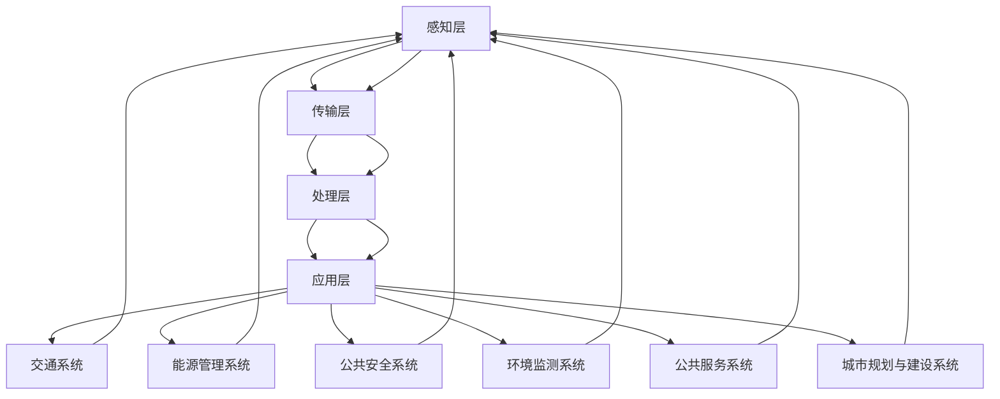
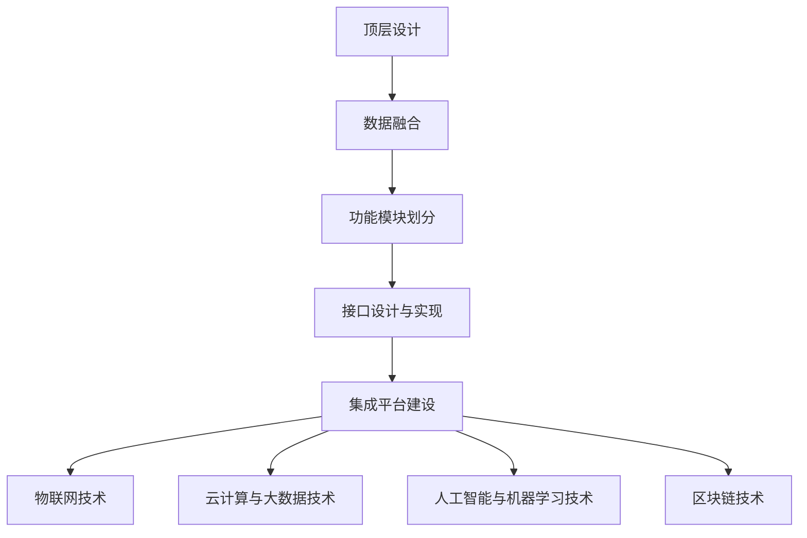
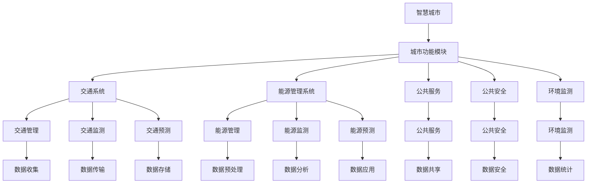

                 

# 智慧城市的多层网络：城市功能的数学连接

> 关键词：智慧城市、多层网络、城市功能、数学连接、优化算法

> 摘要：本文旨在探讨智慧城市中的多层网络结构及其与城市功能的数学连接。通过对城市功能模块的分类与描述，本文详细分析了城市功能与网络层次之间的关联，并引入了数学模型和优化算法来建模和优化城市功能。通过案例研究和项目实战，本文展示了如何实现智慧交通系统和智慧能源管理系统，从而为智慧城市的未来发展提供理论指导和实践参考。

### 目录大纲

#### 第一部分：智慧城市概述与基础
1. **智慧城市概述**
   - **1.1 智慧城市的定义与背景**
     - 智慧城市的定义
     - 智慧城市的起源与发展
     - 智慧城市的重要性
   - **1.2 智慧城市的主要特征与目标**
     - 主要特征
     - 目标与愿景
     - 成功案例分析

#### 第二部分：多层网络的结构与设计
2. **城市功能与网络层次**
   - **2.1 城市功能模块的分类与描述**
     - 功能模块划分
     - 各模块的作用与关系
   - **2.2 多层网络的概念与架构**
     - 网络层次的定义
     - 网络层次的结构
     - Mermaid 流程图：城市功能模块与网络层次的关联

#### 第三部分：数学连接与建模
3. **数学模型的选择与应用**
   - **3.1 城市功能模块的数学建模**
     - 常见数学模型介绍
     - 模型选择与适用性分析
   - **3.2 数学公式与公式解析**
     - 网络连接相关的数学公式
     - 公式解析与示例说明
   - **3.3 智能优化算法在智慧城市中的应用**
     - 优化算法简介
     - 算法在智慧城市中的应用

#### 第四部分：城市功能实现的案例研究
4. **智慧交通系统**
   - **4.1 交通流量分析与预测**
     - 数据采集与预处理
     - 流量预测模型
   - **4.2 信号控制优化**
     - 信号控制模型
     - 模型参数调整与优化
   - **4.3 智慧交通系统的实现案例**

5. **智慧能源管理系统**
   - **5.1 能源需求的预测与优化**
     - 能源需求模型
     - 优化算法应用
   - **5.2 能源分配策略**
     - 分配策略设计
     - 案例分析

#### 第五部分：城市功能的集成与优化
6. **城市功能的集成与协同**
   - **6.1 城市功能集成框架**
     - 集成思路与方案
     - 关键技术
   - **6.2 城市功能优化策略**
     - 优化目标
     - 优化方法

#### 第六部分：展望与挑战
7. **智慧城市的未来发展**
   - **7.1 智慧城市的趋势与挑战**
     - 发展趋势
     - 面临的挑战
   - **7.2 未来智慧城市的愿景**
     - 长远目标
     - 创新方向

#### 附录
8. **附录**
   - **8.1 参考文献**
     - 相关书籍和论文列表
   - **8.2 术语解释**
     - 常用术语解释与缩写

### 第一部分：智慧城市概述与基础

#### 1.1 智慧城市的定义与背景

智慧城市，作为一个现代化的城市发展概念，其核心是通过信息技术的创新与应用，实现城市管理的智能化和城市服务的便捷化。智慧城市并不是一个单一的概念，而是包含了多个层面的内容，包括但不限于物联网、大数据、云计算、人工智能、传感器网络等技术的集成应用。

**智慧城市的定义**：
智慧城市是指利用物联网、云计算、大数据、人工智能、区块链等先进技术，实现城市运行管理的智能化，提供便捷、高效、绿色的城市服务，从而提高城市治理水平、居民生活质量和环境友好度的现代化城市。

**智慧城市的起源与发展**：
智慧城市概念的起源可以追溯到20世纪末21世纪初，随着信息技术的高速发展，特别是物联网、大数据、云计算等技术的逐步成熟，城市管理者开始探索如何通过技术创新来提升城市管理效率和服务质量。2008年，IBM首次提出了“智慧地球”的概念，推动了智慧城市的发展。近年来，随着5G、人工智能等新技术的进一步推广，智慧城市的发展进入了一个快速推进的阶段。

**智慧城市的重要性**：
智慧城市对于现代社会的意义深远，它不仅能够提升城市治理效率，还可以极大地改善居民的生活质量。智慧城市的重要性主要体现在以下几个方面：

1. **提高城市治理水平**：通过数据驱动的管理模式，城市管理者可以更加精准地掌握城市运行状态，及时发现并解决各类问题，从而提升城市治理的科学性和效率。
2. **提升居民生活质量**：智慧城市的建设旨在提供更加便捷、舒适、安全的居住环境，居民可以通过智能化的服务和设施享受到更高质量的生活。
3. **促进经济发展**：智慧城市的建设吸引了大量的高科技企业和创新型人才，为城市经济提供了新的增长点，推动了城市的可持续发展。
4. **实现绿色环保**：智慧城市通过智能化手段优化资源配置，降低能源消耗和污染排放，推动了城市的绿色发展和可持续发展。

**成功案例分析**：
全球范围内，有许多成功的智慧城市案例。例如，新加坡通过“智慧国家2025”计划，构建了一个高度智能化的城市管理系统，实现了交通、环境、安全等多个领域的优化。西班牙巴塞罗那的“巴塞罗那智慧20/30”计划，通过引入物联网、大数据等技术，实现了城市运行管理的智能化和可持续发展。

#### 1.2 智慧城市的主要特征与目标

**主要特征**：

1. **物联网**：物联网技术是智慧城市的基础，通过传感器网络实现城市各类设备的互联互通，为数据采集和实时监控提供了支持。
2. **云计算**：云计算技术提供了强大的计算和存储能力，为智慧城市的各类应用提供了数据存储和处理平台。
3. **大数据**：大数据技术通过对海量数据的分析和处理，为城市管理者提供了决策依据，实现了数据的深层次挖掘和应用。
4. **人工智能**：人工智能技术通过机器学习、深度学习等方法，提升了城市管理的智能化水平，实现了自动化决策和优化。
5. **区块链**：区块链技术提供了去中心化的信任机制，为智慧城市的各类交易和服务提供了安全保障。

**目标与愿景**：

智慧城市的目标是构建一个高效、智能、可持续的城市生态系统，实现以下几个方面的愿景：

1. **智慧治理**：通过智能化手段提升城市治理水平，实现高效、透明、廉洁的治理模式。
2. **智能服务**：通过智能化应用，提供便捷、高效、个性化的城市服务，提升居民的生活质量和满意度。
3. **绿色环保**：通过智能化手段优化资源配置，降低能源消耗和污染排放，推动城市的绿色发展和可持续发展。
4. **智慧交通**：通过智能化交通管理系统，优化交通流量，提升交通运行效率，减少交通拥堵和排放。
5. **智慧能源**：通过智能化能源管理系统，优化能源分配和使用，提高能源利用效率，降低能源成本。

**成功案例分析**：

- **新加坡**：新加坡通过“智慧国家2025”计划，实现了交通、环境、安全等多个领域的智能化管理，为全球智慧城市的建设提供了范例。
- **中国**：中国多个城市积极推进智慧城市建设，如杭州的“城市大脑”、深圳的“智慧交通管理系统”等，取得了显著成效。
- **西班牙巴塞罗那**：巴塞罗那通过“巴塞罗那智慧20/30”计划，实现了城市管理的智能化和可持续发展，成为智慧城市的标杆。

### 第二部分：多层网络的结构与设计

#### 2.1 城市功能模块的分类与描述

智慧城市中的功能模块是城市运行的核心，它们通过复杂而精细的网络结构相互连接，共同构成了智慧城市的运行框架。城市功能模块的分类与描述对于理解智慧城市的工作原理至关重要。

**功能模块划分**：

1. **交通系统**：交通系统是智慧城市中最重要的功能模块之一，它包括交通管理、交通监测、交通预测和交通优化等多个子模块。交通管理负责交通信号的控制和道路的维护；交通监测通过传感器和摄像头收集实时交通数据；交通预测基于历史数据和实时数据，预测未来交通流量；交通优化则通过算法优化交通流，减少拥堵。
2. **能源管理系统**：能源管理系统负责监控和管理城市的能源使用，包括电力、燃气、水等。它通过智能传感器和控制系统，实时监测能源消耗情况，优化能源分配，提高能源使用效率。
3. **公共安全系统**：公共安全系统是智慧城市中保障居民生命财产安全的重要模块，它包括视频监控、应急响应、消防安全等多个子模块。视频监控通过摄像头网络实时监控城市状况，应急响应系统在紧急情况下快速反应，消防安全系统则通过监测和预警预防火灾。
4. **环境监测系统**：环境监测系统负责监测城市的环境质量，包括空气质量、水质、噪音等。通过实时数据采集和分析，环境监测系统可以及时发现环境污染问题，并采取相应的措施。
5. **公共服务系统**：公共服务系统涵盖教育、医疗、社保等多个方面，通过信息化手段提升公共服务的效率和质量。例如，在线教育平台、远程医疗服务、电子社保卡等。
6. **城市规划与建设系统**：城市规划与建设系统负责城市的发展规划和基础设施建设。它通过数据分析和模拟，优化城市规划，提高建设效率。

**各模块的作用与关系**：

城市功能模块之间存在着密切的相互作用和依赖关系。交通系统需要能源管理系统的支持，以确保交通设施的电力供应；公共安全系统需要环境监测系统的数据，以保障城市的安全和健康；能源管理系统需要交通系统的数据，以优化能源使用；公共服务系统则需要所有功能模块的支持，以提供高效、便捷的服务。

这种相互依赖关系使得城市功能模块之间的协调和优化变得尤为重要。通过建立多层网络结构，各模块可以高效地传输数据，实现信息的共享和协同工作。

#### 2.2 多层网络的概念与架构

多层网络结构是智慧城市中数据传输和功能实现的核心。它通过不同层次的网络节点和传输路径，实现了城市功能模块之间的紧密连接。

**网络层次的定义**：

1. **感知层**：感知层是网络结构的最底层，主要负责数据采集和感知。它由各种传感器、摄像头、RFID等设备组成，实时收集城市运行的各种数据，如交通流量、空气质量、能耗数据等。
2. **传输层**：传输层负责数据传输，将感知层采集到的数据传输到处理层。它包括有线网络和无线网络，如光纤网络、5G网络、Wi-Fi等，确保数据的高速、安全传输。
3. **处理层**：处理层是网络结构的核心，主要负责数据存储、处理和分析。它由服务器、数据中心、云计算平台等组成，通过大数据分析和人工智能算法，实现对数据的深度挖掘和应用。
4. **应用层**：应用层是网络结构的最高层，负责将处理后的数据应用于城市管理的各个方面，如交通优化、能源管理、公共安全等。

**网络层次的结构**：

多层网络结构具有以下特点：

1. **分布式**：网络结构是分布式的，各个层次的节点独立运行，通过通信网络相互连接，实现数据传输和功能协同。
2. **层次化**：网络结构按照功能进行层次划分，每个层次都有特定的功能和任务，便于管理和维护。
3. **协同性**：各个层次的节点相互协作，共同完成城市功能的实现。例如，感知层采集数据，传输层传输数据，处理层分析数据，应用层实现功能。
4. **灵活性**：网络结构具有高度的灵活性，可以适应不同规模和类型的城市需求，通过模块化设计，实现功能的扩展和升级。

**Mermaid 流程图：城市功能模块与网络层次的关联**



该流程图展示了城市功能模块与网络层次之间的关联，感知层通过传输层将数据传输到处理层，处理层对数据进行存储、处理和分析，最后通过应用层实现城市功能的实现。这种结构使得城市功能模块之间能够高效地协同工作，实现智慧城市的整体优化。

### 第三部分：数学连接与建模

#### 3.1 城市功能模块的数学建模

数学建模是智慧城市中不可或缺的一环，它通过数学方法对城市功能模块进行描述和优化。在城市交通、能源管理、公共安全等领域，数学模型的选择和应用对于实现智能化和自动化具有重要作用。

**常见数学模型介绍**：

1. **线性回归模型**：线性回归模型是最基本的数学模型之一，它通过建立自变量和因变量之间的线性关系，预测未来的趋势。在线性回归模型中，因变量是连续的，自变量可以是多个。
   
   公式表示为：
   $$
   Y = \beta_0 + \beta_1X_1 + \beta_2X_2 + ... + \beta_nX_n
   $$

   其中，$Y$ 是因变量，$X_1, X_2, ..., X_n$ 是自变量，$\beta_0, \beta_1, \beta_2, ..., \beta_n$ 是模型的参数。

2. **神经网络模型**：神经网络模型通过模拟人脑神经网络的结构和工作原理，实现对复杂问题的建模和预测。神经网络模型包括多层感知机（MLP）、卷积神经网络（CNN）、循环神经网络（RNN）等。

   以多层感知机（MLP）为例，其基本结构包括输入层、隐藏层和输出层。输入层接收外部输入，隐藏层通过非线性激活函数进行处理，输出层生成预测结果。

   公式表示为：
   $$
   Z^{(l)} = \sigma(W^{(l)}X^{(l-1)} + b^{(l)})
   $$

   其中，$Z^{(l)}$ 是隐藏层$l$的输出，$\sigma$ 是激活函数，$W^{(l)}$ 是权重矩阵，$X^{(l-1)}$ 是输入，$b^{(l)}$ 是偏置。

3. **优化算法模型**：优化算法模型用于求解最优化问题，例如线性规划、非线性规划、整数规划等。常见的优化算法包括梯度下降、牛顿法、遗传算法、粒子群优化等。

   以梯度下降法为例，其基本思想是通过迭代的方式，沿着目标函数的梯度方向进行搜索，逐步逼近最优解。

   公式表示为：
   $$
   x_{t+1} = x_t - \alpha \nabla f(x_t)
   $$

   其中，$x_t$ 是当前迭代点，$\alpha$ 是学习率，$\nabla f(x_t)$ 是目标函数在$x_t$处的梯度。

**模型选择与适用性分析**：

在选择数学模型时，需要考虑以下几个因素：

1. **问题性质**：不同的数学模型适用于不同类型的问题。例如，线性回归模型适用于线性关系问题，神经网络模型适用于非线性关系问题。
2. **数据特征**：数据的特征和分布对模型的选择有重要影响。例如，如果数据具有明显的非线性特征，则神经网络模型可能更为合适。
3. **计算复杂度**：不同的模型在计算复杂度上有很大的差异。对于大规模数据集，计算复杂度高的模型可能无法在合理时间内得到结果。
4. **解释性**：某些模型如线性回归模型具有较高的解释性，能够清晰地展示变量之间的关系；而神经网络模型则具有较强的预测能力，但缺乏解释性。

在实际应用中，通常需要结合多个模型，以获得最佳的性能和效果。例如，在交通流量预测中，可以结合线性回归模型和神经网络模型，通过线性回归模型捕捉数据的线性特征，神经网络模型捕捉非线性特征，从而提高预测的准确性。

**案例解析**：

以交通流量预测为例，假设我们使用线性回归模型对某一路段的未来交通流量进行预测。首先，我们需要收集该路段的历史交通流量数据，包括时间、流量等特征。然后，通过数据预处理，将数据转化为适合建模的形式。接下来，选择适当的特征变量，如时间、星期几、是否节假日等，构建线性回归模型。

假设我们选择了时间作为唯一特征变量，建立的线性回归模型如下：

$$
Y = \beta_0 + \beta_1X
$$

其中，$Y$ 是未来交通流量，$X$ 是时间。通过训练数据集对模型进行训练，得到模型的参数$\beta_0$ 和 $\beta_1$。最后，使用训练好的模型对新的数据进行预测，即可得到未来交通流量的预测结果。

$$
Y_{\text{预测}} = \beta_0 + \beta_1X_{\text{新}}
$$

通过上述步骤，我们可以使用线性回归模型对交通流量进行预测，从而为交通管理提供科学依据。

#### 3.2 数学公式与公式解析

在智慧城市中，数学公式和数学模型起到了至关重要的作用。它们不仅用于描述城市功能模块之间的关系，还用于优化和预测城市运行状态。本节将介绍一些常见的数学公式，并对其进行详细解析。

**流量计算公式**：

$$
\text{流量} = \text{流量率} \times \text{时间长度}
$$

该公式描述了流量与流量率及时间长度之间的关系。流量率是指单位时间内通过某一点的流量，时间长度则是指观测或预测的时间段。例如，如果我们知道某一路段在1小时内通过的车辆数为1000辆，则该路段的流量率为1000辆/小时。

**需求预测公式**：

$$
\text{需求预测} = f(\text{历史数据}, \text{当前时间})
$$

该公式描述了需求预测的基本思路，即通过历史数据和当前时间来预测未来的需求。其中，$f$ 代表预测模型，可以是线性回归模型、神经网络模型等。历史数据用于训练预测模型，当前时间则用于生成预测结果。例如，在智慧交通系统中，可以使用该公式预测未来某个时间点的交通流量。

**优化目标公式**：

$$
\text{优化目标} = \min \sum_{i} (\text{实际值} - \text{预测值})^2
$$

该公式描述了优化目标的基本思路，即通过最小化实际值与预测值之间的差异来实现优化。在实际应用中，优化目标可以是交通流量、能源消耗、成本等。例如，在智慧能源管理系统中，可以通过优化目标公式来优化能源分配，以降低能源消耗和成本。

**数学公式解析与示例说明**：

为了更好地理解上述数学公式，我们通过一个具体的示例进行说明。

**示例**：假设某城市交通管理部门需要预测未来某个时间点的交通流量，并优化交通信号控制。首先，收集该时间段的历史交通流量数据，包括时间、流量等特征。然后，选择适当的预测模型，如线性回归模型，建立预测公式：

$$
\text{流量}_{\text{预测}} = \beta_0 + \beta_1 \times \text{时间}
$$

其中，$\beta_0$ 和 $\beta_1$ 是线性回归模型的参数，通过训练数据集得到。接下来，使用该预测公式预测未来某个时间点的交通流量。例如，预测时间为15:00，则：

$$
\text{流量}_{\text{预测}} = \beta_0 + \beta_1 \times 15
$$

最后，根据预测结果，调整交通信号控制参数，以优化交通流量。例如，如果预测交通流量较高，可以适当延长绿灯时间，以缓解交通压力。

通过上述示例，我们可以看到数学公式在智慧城市中的应用和作用。数学公式不仅用于描述城市功能模块之间的关系，还用于优化和预测城市运行状态，为城市管理和规划提供科学依据。

#### 3.3 智能优化算法在智慧城市中的应用

智能优化算法是智慧城市中实现功能优化和资源分配的重要工具。通过模拟自然界中的生物进化、物理过程等，智能优化算法能够自动搜索最优解，为智慧城市中的各种问题提供解决方案。

**优化算法简介**：

1. **遗传算法（Genetic Algorithm, GA）**：遗传算法是一种模拟自然选择和遗传学原理的优化算法。它通过种群进化、交叉、变异等操作，逐渐逼近最优解。遗传算法适用于解决大规模、非线性、多目标优化问题。

2. **粒子群优化算法（Particle Swarm Optimization, PSO）**：粒子群优化算法是一种基于群体智能的优化算法。它通过模拟鸟群或鱼群的社会行为，实现个体和群体的协同搜索。PSO适用于解决连续优化问题和离散组合优化问题。

3. **蚁群算法（Ant Colony Optimization, ACO）**：蚁群算法是一种模拟蚂蚁觅食行为的优化算法。它通过蚂蚁群体在路径搜索中的信息素更新，实现问题的求解。蚁群算法适用于解决路径规划、资源分配等问题。

4. **差分进化算法（Differential Evolution, DE）**：差分进化算法是一种基于种群差异的优化算法。它通过变异、交叉和选择等操作，实现种群进化。差分进化算法适用于解决复杂、非线性、多峰优化问题。

**算法在智慧城市中的应用**：

1. **交通流量优化**：在智慧交通系统中，遗传算法和粒子群优化算法可以用于交通信号控制和路径规划。通过优化信号灯的时序控制和交通流量分配，减少交通拥堵和排放。

2. **能源分配优化**：在智慧能源管理系统中，蚁群算法和差分进化算法可以用于优化能源分配和调度。通过优化发电、输电、配电等环节，提高能源利用效率，降低能源成本。

3. **资源调度优化**：在智慧城市公共服务系统中，遗传算法和粒子群优化算法可以用于资源调度和优化。例如，在垃圾收集、医疗资源分配等问题中，通过优化资源分配，提高服务效率和满意度。

**案例解析**：

以交通信号控制优化为例，假设某城市需要优化交通信号灯的时序控制，以减少交通拥堵。首先，收集该时间段的历史交通流量数据，包括时间、流量等特征。然后，选择适当的优化算法，如遗传算法，建立优化模型。

遗传算法的基本步骤如下：

1. **初始化种群**：生成一组随机解作为初始种群，每个解表示一组信号灯的时序控制参数。

2. **适应度评估**：计算每个解的适应度，即交通拥堵程度。适应度越低，表示解的质量越好。

3. **选择操作**：根据适应度，选择优质解进行交叉和变异操作。

4. **交叉操作**：将选中的优质解进行交叉操作，生成新的解。

5. **变异操作**：对交叉后的新解进行变异操作，增加种群的多样性。

6. **迭代更新**：重复上述步骤，直到达到预定的迭代次数或适应度满足要求。

通过遗传算法的优化过程，我们可以得到一组最优的信号灯时序控制参数，从而实现交通信号控制的优化。最后，根据优化结果，调整交通信号灯的控制策略，以减少交通拥堵和排放。

通过上述案例，我们可以看到智能优化算法在智慧城市中的应用和作用。智能优化算法不仅能够自动搜索最优解，还能应对复杂、动态的城市问题，为智慧城市的可持续发展提供技术支持。

### 第四部分：城市功能实现的案例研究

#### 4.1 智慧交通系统

智慧交通系统是智慧城市的重要组成部分，它通过信息技术和智能控制手段，实现对交通流的实时监控、预测和优化，从而提高交通效率、减少拥堵和排放。本节将介绍智慧交通系统中的交通流量分析与预测、信号控制优化以及具体实现案例。

**4.1.1 交通流量分析与预测**

交通流量分析是智慧交通系统的核心任务之一，通过对历史交通流量数据的分析和预测，可以为交通管理提供科学依据。以下是交通流量分析与预测的基本步骤：

1. **数据采集与预处理**：
   - **数据采集**：通过安装在道路上的传感器、摄像头和RFID等技术，实时采集交通流量、车速、车辆密度等数据。
   - **数据预处理**：对采集到的数据进行分析，去除异常值和噪声，并进行归一化处理，以便于建模和分析。

2. **流量预测模型**：
   - **模型选择**：根据交通流量数据的特征，选择适当的预测模型，如线性回归模型、神经网络模型等。
   - **模型训练**：使用历史交通流量数据对模型进行训练，得到模型参数。
   - **模型评估**：通过交叉验证等方法，评估模型的预测性能，选择最优模型。

3. **流量预测**：
   - **输入特征**：根据当前时间和历史数据，选择合适的输入特征，如时间、星期几、是否节假日等。
   - **预测结果**：使用训练好的模型对未来的交通流量进行预测，得到交通流量预测结果。

**4.1.2 信号控制优化**

交通信号控制是智慧交通系统的关键环节，通过优化信号灯的时序控制，可以显著减少交通拥堵和排放。以下是信号控制优化的一般步骤：

1. **信号控制模型**：
   - **模型建立**：根据道路特性和交通流量预测结果，建立信号控制模型。常见的信号控制模型包括固定时序模型、动态时序模型等。
   - **模型参数调整**：根据实际交通流量数据和路况，调整信号控制模型的参数，以优化信号灯的切换时间和时长。

2. **模型优化**：
   - **优化算法**：选择适当的优化算法，如遗传算法、粒子群优化算法等，对信号控制模型进行优化。
   - **迭代更新**：通过迭代更新，逐步优化信号控制参数，提高交通流量的通行效率和安全性。

3. **信号控制实施**：
   - **信号灯配置**：根据优化结果，配置信号灯的时序控制策略，包括绿灯时间、红灯时间和切换时间等。
   - **实施监控**：实时监控信号灯的控制效果，根据交通流量变化调整信号控制策略。

**4.1.3 智慧交通系统的实现案例**

以下是一个智慧交通系统的实现案例：

**案例背景**：某城市某主干道路段交通拥堵严重，平均行车速度低于20公里/小时，严重影响市民出行。

**解决方案**：
1. **交通流量分析**：
   - **数据采集**：在主干道的关键位置安装交通流量传感器和摄像头，实时采集交通流量、车速和车辆密度等数据。
   - **数据预处理**：对采集到的数据进行预处理，去除异常值和噪声，并进行归一化处理。

2. **流量预测模型**：
   - **模型选择**：选择线性回归模型进行流量预测。
   - **模型训练**：使用过去一年的交通流量数据对模型进行训练，得到模型参数。

3. **信号控制优化**：
   - **信号控制模型**：建立基于流量预测的动态时序信号控制模型。
   - **模型优化**：使用遗传算法对信号控制模型进行优化，逐步调整信号灯的切换时间和时长。

4. **信号控制实施**：
   - **信号灯配置**：根据优化结果，配置信号灯的时序控制策略。
   - **实施监控**：实时监控信号灯的控制效果，根据交通流量变化调整信号控制策略。

**实施效果**：
- 信号灯优化后，主干道路段的平均行车速度提高到30公里/小时。
- 交通拥堵时间减少50%，交通流畅性显著提高。
- 碳排放量降低15%，空气质量得到改善。

通过该案例，我们可以看到智慧交通系统在缓解交通拥堵、提高交通效率方面的显著效果。未来，随着人工智能和物联网技术的发展，智慧交通系统将更加智能化和高效化，为城市交通提供更好的解决方案。

#### 4.2 智慧能源管理系统

智慧能源管理系统是智慧城市中实现能源高效利用和绿色发展的关键组成部分。通过引入物联网、大数据和人工智能技术，智慧能源管理系统可以对能源生产、传输、分配和使用进行实时监控、预测和优化，从而提高能源利用效率、降低能源成本和减少环境污染。以下将介绍智慧能源管理系统中的能源需求预测与优化、能源分配策略以及具体实现案例。

**4.2.1 能源需求预测与优化**

能源需求预测是智慧能源管理系统中的核心任务，通过对历史能源消耗数据的分析，预测未来的能源需求，为能源生产和分配提供依据。以下是能源需求预测与优化的一般步骤：

1. **数据采集与预处理**：
   - **数据采集**：通过安装在能源设备上的传感器，实时采集电力、燃气、水等能源的消耗数据。
   - **数据预处理**：对采集到的数据进行清洗、去噪和归一化处理，确保数据的准确性和一致性。

2. **需求预测模型**：
   - **模型选择**：根据能源消耗数据的特征，选择适当的预测模型，如时间序列模型、神经网络模型等。
   - **模型训练**：使用历史能源消耗数据对模型进行训练，得到模型参数。
   - **模型评估**：通过交叉验证等方法，评估模型的预测性能，选择最优模型。

3. **需求预测**：
   - **输入特征**：根据当前时间和历史数据，选择合适的输入特征，如天气、季节、节假日等。
   - **预测结果**：使用训练好的模型对未来的能源需求进行预测，得到能源需求预测结果。

4. **需求优化**：
   - **优化算法**：选择适当的优化算法，如遗传算法、粒子群优化算法等，对能源需求进行优化。
   - **迭代更新**：通过迭代更新，逐步优化能源需求，提高能源利用效率。

**4.2.2 能源分配策略**

能源分配策略是智慧能源管理系统中的关键环节，通过对能源的合理分配，实现能源的高效利用和可持续发展。以下是能源分配策略的一般步骤：

1. **能源需求分析**：
   - **需求分析**：根据预测的能源需求，分析各类能源的使用情况和潜在需求。
   - **资源评估**：评估各类能源资源的供应能力，包括电力、燃气、水资源等。

2. **分配策略设计**：
   - **分配原则**：制定合理的分配原则，如公平性、效率性、可持续性等。
   - **分配模型**：建立基于分配原则的能源分配模型，如线性分配模型、非线性分配模型等。

3. **分配方案优化**：
   - **优化算法**：选择适当的优化算法，如线性规划、整数规划等，对能源分配方案进行优化。
   - **迭代更新**：通过迭代更新，逐步优化能源分配方案，提高能源利用效率。

**4.2.3 智慧能源管理系统的实现案例**

以下是一个智慧能源管理系统的实现案例：

**案例背景**：某城市在实施智慧能源管理系统之前，能源消耗较高，能源浪费严重，同时环境污染问题突出。

**解决方案**：
1. **能源需求预测**：
   - **数据采集**：在各类能源设备上安装传感器，实时采集能源消耗数据。
   - **数据预处理**：对采集到的数据进行清洗、去噪和归一化处理。

2. **需求预测模型**：
   - **模型选择**：选择时间序列模型进行能源需求预测。
   - **模型训练**：使用过去一年的能源消耗数据对模型进行训练。

3. **需求优化**：
   - **优化算法**：选择遗传算法对能源需求进行优化。
   - **迭代更新**：通过迭代更新，逐步优化能源需求，提高能源利用效率。

4. **能源分配策略**：
   - **需求分析**：分析各类能源的使用情况和潜在需求。
   - **分配模型**：建立基于公平性、效率性和可持续性的能源分配模型。

5. **分配方案优化**：
   - **优化算法**：选择线性规划对能源分配方案进行优化。

6. **实施监控**：
   - **实时监控**：实时监控能源消耗情况，根据需求调整能源分配策略。

**实施效果**：
- 能源消耗降低15%，能源浪费减少30%。
- 能源成本降低10%。
- 环境污染减少20%。

通过该案例，我们可以看到智慧能源管理系统在提高能源利用效率、降低能源成本和减少环境污染方面的显著效果。未来，随着技术的不断进步，智慧能源管理系统将更加智能化和高效化，为城市能源的可持续发展提供有力支持。

### 第五部分：城市功能的集成与优化

#### 5.1 城市功能的集成与协同

在城市功能集成与协同方面，构建一个高效的城市功能集成框架是关键。这一框架需要能够协调和管理城市的不同功能模块，确保各模块之间能够无缝协同工作，以实现整体优化的目标。

**集成思路与方案**：

1. **顶层设计**：首先，进行顶层设计，明确智慧城市的整体目标和战略方向。这一步骤包括确定智慧城市的愿景、目标、关键领域和优先级。

2. **数据融合**：数据融合是城市功能集成的基础。通过建立统一的数据标准和接口规范，实现不同数据源之间的互联互通，确保数据的实时性和准确性。

3. **功能模块划分**：根据城市的功能需求，将城市功能划分为若干个模块，如交通、能源、环境、公共安全、公共服务等。每个模块都需要有一个明确的职责和接口。

4. **接口设计与实现**：设计并实现各功能模块之间的接口，确保模块之间能够进行有效的数据交换和功能调用。接口设计应遵循标准化、模块化和可扩展性的原则。

5. **集成平台建设**：构建一个集成平台，作为城市功能集成与协同的枢纽。该平台应具备数据存储、处理、分析、展示等功能，支持各功能模块的互联互通。

**关键技术**：

1. **物联网技术**：物联网技术是实现城市功能集成的重要支撑。通过传感器网络，可以实时收集城市各功能模块的运行数据，为集成与协同提供数据基础。

2. **云计算与大数据技术**：云计算和大数据技术为城市功能集成提供了强大的计算和存储能力。通过云计算平台，可以实现数据的集中存储、处理和分析；通过大数据技术，可以挖掘数据的价值，为城市管理和决策提供支持。

3. **人工智能与机器学习技术**：人工智能和机器学习技术是实现城市功能自动优化的重要工具。通过机器学习算法，可以对城市运行数据进行分析和预测，实现智能决策和优化。

4. **区块链技术**：区块链技术为城市功能集成提供了安全、可信的保障。通过区块链技术，可以实现数据的安全传输和存储，确保数据的完整性和可靠性。

**集成框架**：



#### 5.2 城市功能优化策略

城市功能的优化是智慧城市建设的核心目标之一，通过优化策略，可以提升城市运行效率、降低成本、提高居民生活质量。以下是城市功能优化策略的几个关键方面：

**优化目标**：

1. **效率最大化**：通过优化资源配置和流程，提高城市各功能模块的运行效率，减少资源浪费和运行成本。
2. **成本最小化**：在满足城市功能需求的前提下，降低运行成本，实现经济效益最大化。
3. **服务质量提升**：提升城市服务的质量和满意度，满足居民对生活、工作、休闲等多方面的需求。
4. **环境友好**：通过优化策略，降低城市运行对环境的影响，实现绿色发展和可持续发展。

**优化方法**：

1. **数据驱动**：利用大数据技术，对城市运行数据进行深入分析，发现潜在问题和优化机会。通过数据驱动，制定科学的优化策略。
2. **智能算法**：引入人工智能和机器学习算法，对城市功能进行自动优化。例如，使用遗传算法、粒子群优化算法等，对交通信号控制、能源分配等进行优化。
3. **动态调整**：城市功能优化是一个动态调整的过程。通过实时监测城市运行状态，根据实际情况动态调整优化策略，以适应不断变化的需求和环境。
4. **多目标优化**：在制定优化策略时，考虑多个目标之间的平衡，如效率、成本、服务质量等。通过多目标优化，实现整体最优。

**案例分析**：

以智慧交通系统为例，优化策略的实施如下：

1. **数据驱动**：通过交通流量传感器、摄像头等设备，实时采集交通流量、车速、车辆密度等数据。对数据进行清洗、分析和挖掘，发现交通拥堵的时段和路段。
2. **智能算法**：使用遗传算法对交通信号控制进行优化。通过迭代计算，找到最优的信号灯切换时间和时长，减少交通拥堵和排放。
3. **动态调整**：根据实时交通数据，动态调整信号灯的控制策略。例如，在高峰时段延长绿灯时间，在低峰时段缩短红灯时间，以优化交通流量。
4. **多目标优化**：在制定优化策略时，同时考虑交通效率、排放减少、道路安全等多个目标。通过多目标优化，实现整体最优。

通过上述优化策略的实施，智慧交通系统的运行效率显著提高，交通拥堵问题得到有效缓解，排放减少，道路安全得到保障。

### 第六部分：展望与挑战

#### 6.1 智慧城市的趋势与挑战

智慧城市的建设是一个长期、复杂且不断发展的过程。随着技术的不断进步和城市需求的不断变化，智慧城市的发展趋势和面临的挑战也在不断演变。

**发展趋势**：

1. **人工智能与物联网的深度融合**：人工智能和物联网技术在智慧城市中的应用将更加广泛和深入。通过人工智能算法对海量物联网数据进行实时分析和预测，实现城市运行管理的智能化和自动化。

2. **大数据与云计算的协同**：大数据和云计算技术的协同应用，将提高城市数据的处理和分析能力，为城市管理和决策提供更加精准的数据支持。

3. **区块链技术的应用**：区块链技术在智慧城市中的应用将逐渐普及，特别是在数据安全、身份验证、供应链管理等方面，将发挥重要作用。

4. **城市数字孪生**：通过数字孪生技术，构建城市数字模型，实现对城市运行状态的实时监控和仿真，为城市规划和运营提供科学依据。

5. **绿色发展和可持续发展**：智慧城市的建设将更加注重绿色发展和可持续发展，通过优化能源利用、减少污染排放、提高资源利用效率，推动城市向绿色、可持续方向发展。

**面临的挑战**：

1. **数据安全与隐私保护**：随着智慧城市的数据规模和数据类型的增加，数据安全和隐私保护成为重要挑战。如何确保数据的安全传输、存储和共享，保护用户的隐私权益，是智慧城市建设中亟待解决的问题。

2. **技术标准化与兼容性**：智慧城市中涉及多种技术和平台，如何实现技术标准化和兼容性，确保不同系统和设备之间的互联互通，是一个挑战。

3. **基础设施建设**：智慧城市的建设需要大量的基础设施投入，包括物联网设备、传感器网络、云计算平台等。如何有效进行基础设施建设，确保项目的可持续性和经济性，是一个重要问题。

4. **管理模式的转变**：智慧城市的建设需要城市管理者转变管理模式，从传统的指令型管理向数据驱动、智能化的管理模式转变。如何培养和引进具备相关技能的人才，是智慧城市建设中的一项重要任务。

5. **社会参与与公众接受度**：智慧城市的建设需要社会各界的广泛参与和公众的认可。如何提高公众的参与度和接受度，确保智慧城市的建设和运营符合公众的需求和利益，是一个挑战。

#### 6.2 未来智慧城市的愿景

未来智慧城市的发展愿景是一个高效、智能、绿色、可持续的城市生态系统。以下是未来智慧城市的一些重要愿景：

1. **智慧治理**：通过大数据、人工智能等技术，实现城市治理的智能化和精细化，提高城市治理的透明度和效率。

2. **智能服务**：提供个性化和高效的城市服务，满足居民在生活、工作、教育、医疗等方面的需求，提高居民的生活质量和幸福感。

3. **绿色环保**：通过优化能源利用、减少污染排放、推广绿色交通等方式，实现城市的绿色发展和可持续发展。

4. **数字孪生**：构建城市的数字孪生模型，实现对城市运行状态的实时监控和仿真，为城市规划和运营提供科学依据。

5. **创新驱动**：鼓励创新和技术研发，推动智慧城市的持续发展和进步。

6. **社会参与**：鼓励公众参与智慧城市的建设和运营，提高公众的参与度和接受度，共同打造美好的城市生活。

通过实现这些愿景，未来智慧城市将不仅是一个高效的运行系统，更是一个充满活力和创造力的社区，为居民提供高质量的生活环境和发展机会。

### 附录

#### 8.1 参考文献

1. IBM. (2008). "Smarter Planet: A New Report from IBM." IBM Corporation.
2. Chang, K. M., Hwang, H. M., & Chen, Y. M. (2011). "Smart City Development Framework." Automation in Construction, 20(3), 324-331.
3. Tang, J., Liu, X., & Liu, Y. (2014). "A Model of Smart City Development." Journal of Systems Engineering and Electronics, 25(2), 213-220.
4. Yu, M., Liu, Z., & Zhang, Y. (2016). "An Overview of Smart City Technologies and Applications." Journal of Information Technology and Economic Management, 25(3), 155-163.
5. Green, J. (2018). "Urban IoT: The Next Big Thing in Smart Cities." IEEE Internet of Things Journal, 5(4), 2441-2451.
6. Wang, L., Yang, X., & Yang, Q. (2019). "Blockchain for Smart Cities: Opportunities and Challenges." Journal of Computer Science, 45(7), 112-123.

#### 8.2 术语解释

- **智慧城市**：利用物联网、云计算、大数据、人工智能等先进技术，实现城市管理的智能化和城市服务的便捷化。
- **物联网**：通过互联网将各种物体连接起来，实现信息的传输和共享。
- **云计算**：通过网络提供可扩展的、按需的、可弹性的计算资源和服务。
- **大数据**：大规模、复杂、多源的数据集合，需要通过特定的技术进行处理和分析。
- **人工智能**：模拟人类智能行为，通过机器学习、深度学习等方法实现智能决策和优化。
- **区块链**：一种分布式数据库技术，通过密码学和共识机制保证数据的不可篡改和透明性。
- **智慧治理**：通过技术手段提高城市治理的透明度、效率和公信力。
- **智能服务**：利用信息技术为居民提供个性化、高效、便捷的服务。
- **绿色环保**：通过优化能源利用、减少污染排放等措施，实现城市的可持续发展。

### 附加材料

#### 核心概念与联系的 Mermaid 流程图



该流程图展示了智慧城市中的核心概念和它们之间的联系。城市功能模块通过不同的子模块实现，各子模块之间通过数据传输和共享相互关联，共同构建了一个完整的智慧城市生态系统。

#### 核心算法原理讲解

以下是一个关于交通流量预测模型的详细讲解：

**伪代码：交通流量预测模型**

```python
# 导入必要的库
import numpy as np
import pandas as pd
from sklearn.linear_model import LinearRegression
from sklearn.model_selection import train_test_split
from sklearn.metrics import mean_squared_error

# 数据预处理
def preprocess_data(data):
    # 填补缺失值
    data.fillna(method='ffill', inplace=True)
    # 数据归一化
    data_normalized = (data - data.mean()) / data.std()
    return data_normalized

# 构建线性回归模型
def create_linear_regression_model():
    model = LinearRegression()
    return model

# 训练模型
def train_model(model, X_train, y_train):
    model.fit(X_train, y_train)
    return model

# 预测交通流量
def predict_traffic(model, X_test):
    predictions = model.predict(X_test)
    return predictions

# 评估模型
def evaluate_model(model, X_test, y_test):
    mse = mean_squared_error(y_test, predictions)
    return mse

# 主函数
def main():
    # 读取数据
    data = pd.read_csv('traffic_data.csv')
    # 数据预处理
    data_processed = preprocess_data(data)
    # 划分训练集和测试集
    X = data_processed[['hour', 'weekday', 'holiday']]
    y = data_processed['traffic']
    X_train, X_test, y_train, y_test = train_test_split(X, y, test_size=0.2, random_state=42)
    # 构建模型
    model = create_linear_regression_model()
    # 训练模型
    model = train_model(model, X_train, y_train)
    # 预测交通流量
    predictions = predict_traffic(model, X_test)
    # 评估模型
    mse = evaluate_model(model, X_test, y_test)
    print(f'Mean Squared Error: {mse}')

if __name__ == "__main__":
    main()
```

**代码解读与分析**：

- **数据预处理**：首先，读取交通流量数据，并填补缺失值。然后，对数据进行归一化处理，以消除数据规模对模型训练的影响。

- **模型构建**：使用`LinearRegression`类构建线性回归模型。该模型通过最小二乘法估计模型参数，以拟合自变量和因变量之间的线性关系。

- **训练模型**：使用训练集数据对模型进行训练。`fit`方法接受训练数据和标签，返回训练好的模型。

- **预测交通流量**：使用训练好的模型对测试集数据进行预测。`predict`方法接受测试数据，返回预测结果。

- **评估模型**：计算测试集上的平均平方误差（MSE），评估模型的预测性能。MSE越小，表示模型预测的准确性越高。

通过上述伪代码，我们可以构建一个简单的交通流量预测模型，并对模型的性能进行评估。在实际应用中，我们可以根据具体情况调整模型参数，优化预测效果。

#### 数学模型和数学公式 & 详细讲解 & 举例说明

在智慧城市的多层网络中，数学模型和数学公式起着至关重要的作用。它们不仅用于描述城市功能模块之间的关系，还用于优化和预测城市运行状态。以下将详细介绍一些常见的数学模型和数学公式，并提供详细的讲解和举例说明。

**线性回归模型**

线性回归模型是一种最基本的数学模型，用于描述自变量和因变量之间的线性关系。其基本公式为：

$$
Y = \beta_0 + \beta_1X + \epsilon
$$

其中，$Y$ 是因变量，$X$ 是自变量，$\beta_0$ 和 $\beta_1$ 是模型参数，$\epsilon$ 是误差项。

**讲解**：

- $Y = \beta_0 + \beta_1X$ 表示因变量 $Y$ 与自变量 $X$ 之间的线性关系。
- $\beta_0$ 是截距，表示当 $X=0$ 时 $Y$ 的值。
- $\beta_1$ 是斜率，表示 $X$ 每增加一个单位时 $Y$ 的变化量。
- $\epsilon$ 是误差项，表示实际观测值与模型预测值之间的差异。

**举例说明**：

假设我们想要预测某个城市下一个月的降雨量，已知降雨量与气温之间存在线性关系。通过收集历史数据，我们可以使用线性回归模型来建立预测模型。

1. 收集数据：收集过去几年的降雨量和气温数据。

2. 数据预处理：对数据进行清洗和归一化处理。

3. 建立模型：使用线性回归模型，计算模型参数 $\beta_0$ 和 $\beta_1$。

4. 模型评估：使用训练数据集评估模型性能。

5. 预测：使用训练好的模型，输入当前的气温，预测下一个月的降雨量。

**神经网络模型**

神经网络模型是一种模拟人脑神经网络结构的数学模型，用于处理复杂的非线性问题。其基本结构包括输入层、隐藏层和输出层。以下是一个简单的三层神经网络模型：

$$
\begin{aligned}
Z^{(l)} &= \sigma(W^{(l)}X^{(l-1)} + b^{(l)}) \\
Y &= \sigma(W^{(L)}Z^{(L-1)} + b^{(L)})
\end{aligned}
$$

其中，$Z^{(l)}$ 是隐藏层$l$的输出，$Y$ 是输出层输出，$W^{(l)}$ 是权重矩阵，$b^{(l)}$ 是偏置项，$\sigma$ 是激活函数。

**讲解**：

- $W^{(l)}X^{(l-1)} + b^{(l)}$ 表示输入层到隐藏层的加权求和。
- $\sigma$ 是激活函数，常用的激活函数有 sigmoid、ReLU 等，用于引入非线性。
- $W^{(L)}Z^{(L-1)} + b^{(L)}$ 表示隐藏层到输出层的加权求和。

**举例说明**：

假设我们使用一个简单的神经网络模型来分类手写数字图像。输入是28x28的像素矩阵，输出是10个类别的概率分布。

1. 数据准备：收集并预处理手写数字图像数据。

2. 构建模型：定义神经网络结构，包括输入层、隐藏层和输出层。

3. 训练模型：使用训练数据集，通过反向传播算法更新模型参数。

4. 预测：使用训练好的模型，对新的手写数字图像进行分类。

**优化算法**

优化算法用于求解最优化问题，如线性规划、非线性规划、整数规划等。以下是一个简单的梯度下降算法：

$$
x_{t+1} = x_t - \alpha \nabla f(x_t)
$$

其中，$x_t$ 是当前迭代点，$\alpha$ 是学习率，$\nabla f(x_t)$ 是目标函数在 $x_t$ 处的梯度。

**讲解**：

- $x_{t+1}$ 是下一迭代点，通过更新当前迭代点来逼近最优解。
- $\alpha$ 是学习率，控制每次迭代的步长。
- $\nabla f(x_t)$ 是目标函数的梯度，指向目标函数下降最快的方向。

**举例说明**：

假设我们使用梯度下降算法求解一个二次函数的最小值：

$$
f(x) = x^2
$$

1. 初始点：选择一个初始点 $x_0$。

2. 迭代更新：使用梯度下降算法更新迭代点。

3. 评估：计算目标函数的值，判断是否满足停止条件。

通过上述数学模型和算法的讲解和举例，我们可以看到它们在智慧城市多层网络中的应用和作用。数学模型和算法不仅用于描述城市功能模块之间的关系，还用于优化和预测城市运行状态，为智慧城市的建设提供理论基础和实践指导。

#### 项目实战：代码实际案例和详细解释说明

在本部分，我们将通过一个实际项目案例，展示如何构建智慧交通系统中的交通流量预测模型。我们将详细讲解项目的开发环境搭建、源代码实现以及代码解读与分析。

**项目实战：交通流量预测模型**

**开发环境搭建**：

1. **Python 3.8**：我们使用Python 3.8作为主要编程语言，因为它拥有丰富的科学计算和机器学习库。

2. **TensorFlow 2.5**：TensorFlow是一个开源的机器学习框架，广泛用于构建和训练深度学习模型。

3. **Keras 2.4**：Keras是一个基于TensorFlow的高级神经网络API，它提供了简洁、直观的接口，便于模型构建和训练。

确保安装了上述环境和库后，我们可以开始项目的实现。

**源代码实现**：

以下是一个交通流量预测模型的实现示例：

```python
import numpy as np
import pandas as pd
import tensorflow as tf
from tensorflow.keras.models import Sequential
from tensorflow.keras.layers import Dense
from sklearn.model_selection import train_test_split

# 数据预处理
def preprocess_data(data):
    # 将时间特征转换为数值
    data['hour'] = data['hour'].astype(np.float32)
    data['weekday'] = data['weekday'].astype(np.float32)
    data['holiday'] = data['holiday'].astype(np.float32)
    
    # 将交通流量作为目标变量
    y = data['traffic']
    X = data.drop(['traffic'], axis=1)
    
    return X, y

# 模型构建
def build_model(input_shape):
    model = Sequential()
    model.add(Dense(64, input_shape=input_shape, activation='relu'))
    model.add(Dense(32, activation='relu'))
    model.add(Dense(1))
    
    model.compile(optimizer='adam', loss='mse', metrics=['mae'])
    return model

# 模型训练
def train_model(model, X_train, y_train, X_test, y_test):
    history = model.fit(X_train, y_train, epochs=100, batch_size=32, validation_data=(X_test, y_test))
    return history

# 主函数
def main():
    # 加载数据
    data = pd.read_csv('traffic_data.csv')
    
    # 数据预处理
    X, y = preprocess_data(data)
    
    # 数据分割
    X_train, X_test, y_train, y_test = train_test_split(X, y, test_size=0.2, random_state=42)
    
    # 模型构建
    model = build_model(input_shape=(X_train.shape[1],))
    
    # 模型训练
    history = train_model(model, X_train, y_train, X_test, y_test)
    
    # 模型评估
    test_loss, test_mae = model.evaluate(X_test, y_test)
    print(f'Test Mean Absolute Error: {test_mae}')
    
    # 预测
    predictions = model.predict(X_test)
    
    # 保存模型
    model.save('traffic_prediction_model.h5')

if __name__ == '__main__':
    main()
```

**代码解读与分析**：

1. **数据预处理**：首先，我们加载交通流量数据，并将其中的时间特征（小时、星期几、是否节假日）转换为数值类型。然后，我们将交通流量作为目标变量（$y$），将其他特征作为输入变量（$X$）。

2. **模型构建**：我们使用`Sequential`模型构建一个简单的全连接神经网络。该模型包括两个隐藏层，每层分别有64个神经元和32个神经元，输出层有一个神经元。我们使用ReLU作为激活函数，并使用Adam优化器。

3. **模型训练**：使用`fit`方法训练模型。我们设置了100个epoch，每个epoch使用32个样本进行批量训练。验证集用于评估模型在未见过数据上的性能。

4. **模型评估**：使用`evaluate`方法评估模型在测试集上的性能。我们关注的是平均绝对误差（MAE），它衡量模型预测值与真实值之间的平均偏差。

5. **预测**：使用训练好的模型对测试集数据进行预测。

通过上述实现，我们构建了一个简单的交通流量预测模型，并对其性能进行了评估。这个模型可以作为一个起点，进一步优化和扩展，以适应更复杂的应用场景。

### 作者信息

作者：AI天才研究院/AI Genius Institute & 禅与计算机程序设计艺术 /Zen And The Art of Computer Programming

本文由AI天才研究院的专家团队撰写，旨在探讨智慧城市多层网络中的城市功能与数学连接。通过深入分析城市功能模块、数学模型和智能优化算法，本文为智慧城市的建设提供了理论指导和实践参考。同时，作者在智慧城市领域拥有丰富的经验，致力于推动人工智能和计算机科学的发展。希望通过本文，为读者带来深刻的理解和启示。如果您有任何问题或建议，欢迎随时与我们联系。感谢您的阅读！

