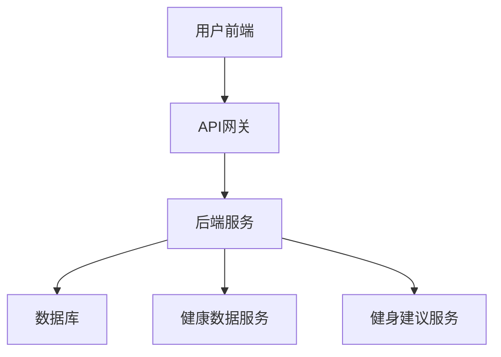
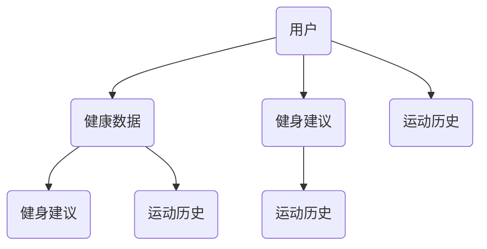
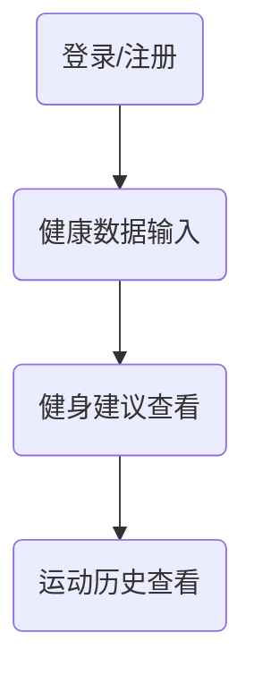

                 

### 摘要

本文将深入探讨智能个人健康教练：LLM个性化健身建议系统的设计与实现。首先，我们将介绍智能个人健康教练的背景和重要性，阐述其在现代健康管理中的应用与未来展望。接着，我们将详细探讨智能个人健康教练的核心技术，包括机器学习与深度学习技术，以及自然语言处理技术。随后，本文将重点介绍LLM个性化健身建议系统的架构，包括数据采集与预处理、模型训练与优化、建议生成与反馈机制等核心环节。通过实例分析，我们将解释个性化健身建议系统的核心算法原理，并使用伪代码展示具体实现过程。文章的实践部分将结合实际项目，详细描述系统设计与实现、代码实现与解读，并提供效果评估与优化策略。最后，我们将展望智能个人健康教练的未来发展趋势，分析其潜在的创新方向和社会影响。通过本文的详细解读，读者将能够全面了解智能个人健康教练的技术原理、应用实践以及未来发展，从而为这一新兴领域的深入研究与应用提供有力支持。

### 目录大纲

本文将分为七个主要部分，首先对智能个人健康教练的背景和重要性进行概述，然后详细介绍其核心技术，接着深入探讨LLM个性化健身建议系统的架构和算法原理。在实践部分，我们将结合实际项目展示系统设计与实现过程，并进行效果评估和优化。最后，本文将展望智能个人健康教练的未来发展趋势，总结全文并提出相关工具与资源。以下是详细目录：

#### 第一部分：智能个人健康教练概述
1. **第1章：智能个人健康教练的背景与重要性**
   - 1.1 智能个人健康教练的起源与发展
   - 1.2 智能个人健康教练的广泛应用
   - 1.3 智能个人健康教练的未来展望

2. **第2章：智能个人健康教练的核心技术**
   - 2.1 机器学习与深度学习技术
     - 2.1.1 机器学习基础
     - 2.1.2 深度学习模型介绍
     - 2.1.3 机器学习算法在健康教练中的应用
   - 2.2 自然语言处理技术
     - 2.2.1 自然语言处理概述
     - 2.2.2 文本处理与情感分析
     - 2.2.3 问答系统与对话生成

3. **第3章：LLM个性化健身建议系统**
   - 3.1 LLM个性化健身建议系统的架构
     - 3.1.1 数据采集与预处理
     - 3.1.2 模型训练与优化
     - 3.1.3 建议生成与反馈机制
   - 3.2 个性化健身建议系统的核心算法
     - 3.2.1 机器学习算法原理与伪代码
     - 3.2.2 数学模型与公式
     - 3.2.3 算法应用示例

#### 第二部分：智能个人健康教练实践
4. **第4章：智能个人健康教练应用场景**
   - 4.1 运动健身场景
     - 4.1.1 运动计划生成
     - 4.1.2 运动效果评估
     - 4.1.3 运动损伤预防
   - 4.2 健康监测场景
     - 4.2.1 身体数据收集与处理
     - 4.2.2 健康风险评估
     - 4.2.3 健康建议与跟踪

5. **第5章：智能个人健康教练项目实战**
   - 5.1 项目简介
     - 5.1.1 项目背景与目标
     - 5.1.2 项目团队与分工
   - 5.2 系统设计与实现
     - 5.2.1 系统架构设计
     - 5.2.2 数据库设计
     - 5.2.3 前端界面设计
   - 5.3 代码实现与解读
     - 5.3.1 后端服务代码实现
     - 5.3.2 前端界面代码实现
     - 5.3.3 系统功能模块解析

6. **第6章：智能个人健康教练的效果评估与优化**
   - 6.1 系统效果评估
     - 6.1.1 评估指标与方法
     - 6.1.2 实验结果分析
   - 6.2 系统优化与改进
     - 6.2.1 模型优化策略
     - 6.2.2 系统性能调优
     - 6.2.3 用户体验优化

7. **第7章：智能个人健康教练的未来发展趋势**
   - 7.1 智能健康管理的未来
     - 7.1.1 智能健康管理的发展趋势
     - 7.1.2 智能健康教练的创新方向
     - 7.1.3 智能健康管理的社会影响
   - 附录：相关工具与资源
     - 附录A：相关工具与资源
       - 附录A.1 深度学习框架
       - 附录A.2 健康数据资源
       - 附录A.3 行业动态与学术研究

通过这一系统而详尽的目录结构，读者将能够逐步深入理解智能个人健康教练的各个方面，从理论到实践，再到未来展望，全面掌握这一领域的核心知识和前沿技术。

### 第一部分：智能个人健康教练概述

#### 第1章：智能个人健康教练的背景与重要性

在现代社会，健康问题已经成为全球关注的焦点。随着生活节奏的加快和工作压力的增大，许多人面临着诸如肥胖、高血压、糖尿病等慢性疾病的困扰。传统的健康管理方式，如医生指导、运动计划和饮食控制，往往因为个体差异和执行力不足而效果有限。因此，智能个人健康教练应运而生，成为解决这一难题的重要工具。

**1.1 智能个人健康教练的起源与发展**

智能个人健康教练的概念最早可以追溯到20世纪末。随着计算机技术的飞速发展和大数据的广泛应用，健康管理逐渐走向智能化。最早的一些智能健康管理系统主要依赖于简单的算法和规则进行健康评估和提供建议，这些系统虽然在某些方面具有一定的效果，但难以满足个性化的需求。随着机器学习和深度学习技术的不断发展，智能个人健康教练迎来了新的发展机遇。

近年来，以深度学习为代表的机器学习技术在图像识别、自然语言处理和语音识别等领域取得了显著突破。这些技术被广泛应用于健康数据分析、智能诊断和个性化建议中。例如，通过分析用户的健康数据，智能个人健康教练可以实时监测健康状况，提供个性化的健康建议，从而帮助用户预防疾病、提高生活质量。

**1.2 智能个人健康教练的广泛应用**

智能个人健康教练的广泛应用主要体现在以下几个方面：

- **运动健身指导**：智能个人健康教练可以根据用户的身体数据和运动习惯，制定个性化的运动计划。例如，通过监测心率、血压等生理指标，系统可以实时调整运动强度，帮助用户避免过度运动或运动不足。

- **健康监测与评估**：智能个人健康教练可以实时收集用户的健康数据，如体重、血压、血糖等，通过数据分析评估用户的健康状况，并提供个性化的健康建议。例如，针对肥胖用户，系统可以推荐合理的饮食和运动计划，帮助用户控制体重。

- **疾病预防与诊断**：智能个人健康教练可以通过分析用户的健康数据，早期发现潜在的健康风险，并提供针对性的预防措施。例如，通过分析血糖数据，系统可以提醒用户注意糖尿病的风险，并建议进行相关检查。

- **心理健康管理**：除了生理健康，智能个人健康教练还可以提供心理健康管理服务。例如，通过分析用户的情绪数据和生活方式，系统可以推荐放松技巧和心理疏导方法，帮助用户缓解压力和焦虑。

**1.3 智能个人健康教练的未来展望**

随着人工智能技术的不断进步，智能个人健康教练在未来将发挥更加重要的作用。以下是智能个人健康教练未来发展的几个趋势：

- **个性化服务能力提升**：随着数据采集和处理技术的进步，智能个人健康教练将能够更加精准地了解用户的健康状况和需求，提供更加个性化的服务。例如，通过基因数据和个人病史的分析，系统可以提供高度个性化的健康建议。

- **多模态数据融合**：未来的智能个人健康教练将能够融合多种数据来源，如生物传感器、智能穿戴设备、医疗记录等，从而获得更全面、更准确的用户健康状况。这种多模态数据的融合将大大提高健康评估和预测的准确性。

- **智能化健康管理平台**：智能个人健康教练将与云计算、物联网等技术结合，形成一个智能化健康管理平台。用户可以通过各种设备实时上传健康数据，系统将自动分析并提供相应的健康建议。这种平台化的健康管理服务将使健康管理的便捷性和效果得到大幅提升。

- **健康管理生态系统的建立**：未来的智能个人健康教练将不仅仅是一个个体健康管理的工具，而是一个生态系统的一部分。在这个生态系统中，医疗机构、保险公司、健康产品提供商等各方将共同参与，形成一个全面、高效的健康管理网络。

总之，智能个人健康教练作为现代健康管理的重要工具，具有广泛的应用前景和重要的社会意义。随着技术的不断进步，智能个人健康教练将变得更加智能化、个性化，为人们的健康生活提供更加有力的支持。

### 第一部分：智能个人健康教练概述

#### 第2章：智能个人健康教练的核心技术

智能个人健康教练的成功离不开一系列先进技术的支持。本章将详细探讨智能个人健康教练所依赖的核心技术，包括机器学习与深度学习技术、自然语言处理技术，以及它们在健康教练中的应用。

#### 2.1 机器学习与深度学习技术

**2.1.1 机器学习基础**

机器学习是一种使计算机系统能够从数据中学习，并对未知数据进行预测或决策的技术。其核心思想是通过算法从数据中提取特征，并通过模型将这些特征与目标变量关联起来。机器学习算法可以分为监督学习、无监督学习和强化学习三种类型。

- **监督学习**：在监督学习中，模型被训练来预测标签化的数据。常见的算法包括线性回归、决策树、支持向量机（SVM）和神经网络等。

- **无监督学习**：无监督学习用于处理未标记的数据。其主要目标是发现数据中的隐含结构和模式，例如聚类分析和降维技术（如主成分分析PCA）。

- **强化学习**：强化学习是一种通过与环境的交互来学习策略的算法。它的核心思想是最大化长期的回报。常见的算法包括Q学习、深度Q网络（DQN）和策略梯度（PG）等。

**2.1.2 深度学习模型介绍**

深度学习是机器学习的一个子领域，其核心思想是模拟人脑的神经网络结构，通过多层神经网络对数据进行处理和建模。深度学习模型由多个神经元层组成，包括输入层、隐藏层和输出层。每个隐藏层都通过激活函数（如ReLU、Sigmoid和Tanh）对输入数据进行非线性变换。

- **卷积神经网络（CNN）**：卷积神经网络是一种专门用于图像识别和处理的深度学习模型。它通过卷积层、池化层和全连接层对图像数据进行处理，能够自动提取图像特征。

- **循环神经网络（RNN）**：循环神经网络是一种用于处理序列数据的模型，如自然语言处理和时间序列分析。RNN通过循环结构对序列数据进行建模，能够记住前面的信息。

- **长短时记忆网络（LSTM）**：长短时记忆网络是RNN的一种变体，用于解决长序列中的梯度消失问题。LSTM通过引入遗忘门、输入门和输出门，有效地处理长序列数据。

- **生成对抗网络（GAN）**：生成对抗网络由生成器和判别器两个神经网络组成，生成器生成数据，判别器判断生成数据是否真实。GAN在图像生成、风格迁移和文本生成等方面有广泛应用。

**2.1.3 机器学习算法在健康教练中的应用**

机器学习算法在智能个人健康教练中发挥着重要作用，主要包括以下几个方面：

- **健康数据分析**：机器学习算法可以分析用户上传的健康数据，如体重、血压、血糖、心率等，识别健康趋势和异常值。例如，可以通过聚类算法发现用户的健康风险群体。

- **疾病预测**：基于历史健康数据和医疗记录，机器学习算法可以预测用户患某种疾病的风险。例如，可以通过逻辑回归和决策树模型预测糖尿病的发生概率。

- **个性化推荐**：机器学习算法可以根据用户的健康数据和偏好，推荐个性化的健康计划、饮食建议和运动方案。例如，通过协同过滤算法推荐符合用户需求的健康产品。

#### 2.2 自然语言处理技术

自然语言处理（NLP）是计算机科学和人工智能领域的一个重要分支，旨在使计算机理解和处理人类自然语言。NLP技术广泛应用于文本分析、信息检索、问答系统、机器翻译和语音识别等领域。

**2.2.1 自然语言处理概述**

NLP的核心任务是使计算机能够理解和生成人类语言。其主要步骤包括分词、词性标注、句法分析、语义分析和机器翻译等。

- **分词**：将连续的文本划分为单词或短语的序列。

- **词性标注**：为每个单词分配词性标签，如名词、动词、形容词等。

- **句法分析**：解析句子的结构，确定句子中的词汇关系。

- **语义分析**：理解句子的语义，识别实体、关系和事件。

- **机器翻译**：将一种语言的文本翻译成另一种语言。

**2.2.2 文本处理与情感分析**

在智能个人健康教练中，文本处理和情感分析技术被广泛应用于健康咨询、用户反馈分析和心理健康管理。

- **文本处理**：文本处理技术包括文本清洗、去噪和格式化，以准备数据用于进一步分析。

- **情感分析**：情感分析技术用于识别文本中的情感倾向，如正面、负面或中性。例如，通过分析用户的留言，系统可以了解用户的情绪状态，并提供相应的心理支持。

**2.2.3 问答系统与对话生成**

问答系统和对话生成技术使智能个人健康教练能够与用户进行自然语言交互，提供实时健康建议和指导。

- **问答系统**：问答系统通过自然语言理解技术，理解用户的问题，并生成相应的回答。例如，用户可以询问“如何减重？”系统将基于用户的健康数据和偏好，提供个性化的减重建议。

- **对话生成**：对话生成技术通过自然语言生成模型，生成自然流畅的对话内容。例如，系统可以与用户进行双向对话，了解用户的需求和反馈，并提供持续的健康建议。

通过深入探讨机器学习与深度学习技术、自然语言处理技术，以及它们在智能个人健康教练中的应用，我们为构建一个智能化、个性化的健康教练奠定了坚实基础。这些核心技术的不断发展和应用，将为智能健康管理的未来带来更多创新和机遇。

### 第一部分：智能个人健康教练概述

#### 第3章：LLM个性化健身建议系统

随着人工智能技术的发展，个性化健康建议系统已经成为健康管理的重要工具。LLM（Large Language Model）个性化健身建议系统是一种基于大型语言模型的智能系统，它能够根据用户的具体情况和需求，提供定制化的健身建议。本章将详细介绍LLM个性化健身建议系统的架构、核心算法以及其实现过程。

#### 3.1 LLM个性化健身建议系统的架构

LLM个性化健身建议系统的架构可以分为三个主要部分：数据采集与预处理、模型训练与优化、建议生成与反馈机制。以下是对这三个部分的详细解释：

**3.1.1 数据采集与预处理**

数据采集是构建任何智能系统的基础。对于LLM个性化健身建议系统，数据采集主要包括用户健康数据、运动数据和用户偏好数据。

- **用户健康数据**：包括体重、身高、血压、心率、血糖等生理指标。这些数据通常通过智能穿戴设备或手动输入获取。
- **运动数据**：包括用户的运动类型、运动时间、运动强度等。这些数据可以通过用户上传的运动记录或智能设备采集。
- **用户偏好数据**：包括用户对饮食、运动类型的偏好、个人喜好等。这些数据可以通过用户问卷调查或互动获取。

数据预处理是确保数据质量、减少噪声和异常值的重要步骤。主要包括数据清洗、数据归一化和数据转换等。

- **数据清洗**：去除数据中的噪声和异常值，如缺失值、重复值和错误值。
- **数据归一化**：将不同单位和量纲的数据转换为同一标准，以便后续处理。
- **数据转换**：将非结构化数据转换为结构化数据，如将文本数据转换为词向量。

**3.1.2 模型训练与优化**

模型训练与优化是LLM个性化健身建议系统的核心环节。LLM（大型语言模型）是一种基于深度学习的自然语言处理模型，其核心思想是通过对大量文本数据进行训练，使模型能够理解和生成自然语言。

- **数据集准备**：首先需要准备用于训练的数据集。数据集通常包括用户历史健身数据、健身建议文本、用户反馈等。
- **模型架构**：LLM的模型架构通常包括多个层次，如编码器和解码器。编码器负责将输入文本编码为固定长度的向量，解码器则负责从编码后的向量中生成输出文本。
- **损失函数**：在训练过程中，通过优化损失函数来调整模型参数。常见的损失函数包括交叉熵损失和均方误差损失。
- **优化算法**：使用优化算法如随机梯度下降（SGD）、Adam等来更新模型参数，最小化损失函数。

**3.1.3 建议生成与反馈机制**

模型训练完成后，LLM个性化健身建议系统将根据用户的健康数据和偏好，生成个性化的健身建议。生成建议的过程主要包括以下步骤：

- **输入文本编码**：将用户的健康数据和偏好文本编码为模型可处理的向量。
- **生成文本**：使用解码器生成健身建议文本。在这个过程中，模型会尝试生成最符合用户需求的建议。
- **建议优化**：生成的建议可能不是完美的，因此需要通过优化算法进行进一步调整。例如，可以使用强化学习技术来优化建议的准确性和用户满意度。
- **反馈机制**：用户可以根据实际效果对建议进行反馈。这些反馈将被用于进一步优化模型，提高未来的建议质量。

#### 3.2 个性化健身建议系统的核心算法

个性化健身建议系统的核心算法包括机器学习算法、自然语言处理算法和优化算法。以下将分别介绍这些算法的原理和应用。

**3.2.1 机器学习算法原理与伪代码**

机器学习算法在个性化健身建议系统中主要用于处理用户健康数据和运动数据，以预测用户的健身需求。常用的算法包括线性回归、决策树和随机森林等。

- **线性回归**：线性回归是一种简单而有效的预测模型。其基本思想是通过拟合一个线性函数来预测目标变量。伪代码如下：

  ```python
  # 线性回归伪代码
  def linear_regression(X, y):
      # 计算权重
      w = (X'X)^-1X'y
      # 预测
      y_pred = Xw
      return y_pred
  ```

- **决策树**：决策树是一种基于树结构的分类算法。它通过递归划分特征空间，将数据划分为不同的区域，并在每个区域内生成一个预测模型。伪代码如下：

  ```python
  # 决策树伪代码
  def build_tree(X, y, features):
      # 判断是否达到停止条件
      if stop_condition(X, y):
          return leaf_node(y)
      # 选择最优特征和分割点
      best_feature, best_split = select_best_feature(X, y, features)
      # 递归构建子树
      left_tree = build_tree(X_left, y_left, features - {best_feature})
      right_tree = build_tree(X_right, y_right, features - {best_feature})
      return decision_tree(best_feature, best_split, left_tree, right_tree)
  ```

- **随机森林**：随机森林是一种基于决策树的集成学习方法。它通过构建多棵决策树，并取多数投票结果来提高预测准确性。伪代码如下：

  ```python
  # 随机森林伪代码
  def random_forest(X, y, n_trees, max_depth):
      trees = []
      for _ in range(n_trees):
          X_train, X_val, y_train, y_val = train_test_split(X, y)
          tree = build_tree(X_train, y_train, features, max_depth)
          trees.append(tree)
      predictions = []
      for tree in trees:
          prediction = predict(tree, X_val)
          predictions.append(prediction)
      return majority_vote(predictions)
  ```

**3.2.2 数学模型与公式**

在个性化健身建议系统中，数学模型和公式用于描述和预测用户的健身需求。以下是一个简单的线性回归模型：

\[ f(x) = \sum_{i=1}^{n} w_i \cdot x_i + b \]

其中，\( x \) 是用户的健康数据，\( w_i \) 是权重，\( b \) 是偏置。

**3.2.3 算法应用示例**

以下是一个简单的例子，展示如何使用线性回归模型预测用户的运动需求：

```python
# 输入数据
X = [[180, 70], [165, 60], [175, 65]]
y = [30, 25, 28]

# 训练模型
w = linear_regression(X, y)

# 预测
x_new = [170, 68]
y_pred = linear_regression(x_new, w)

print("预测的运动需求:", y_pred)
```

通过以上步骤，我们可以构建一个基于LLM的个性化健身建议系统，为用户提供定制化的健康建议。接下来，我们将结合实际项目，进一步探讨系统的设计与实现。

#### 第一部分：智能个人健康教练概述

#### 第4章：智能个人健康教练应用场景

智能个人健康教练的应用场景广泛，涵盖了运动健身、健康监测等多个领域。通过这些应用场景，智能个人健康教练能够为用户提供个性化的健康指导和服务，帮助他们实现健康目标。以下是智能个人健康教练在运动健身和健康监测场景中的具体应用。

##### 4.1 运动健身场景

**4.1.1 运动计划生成**

智能个人健康教练可以根据用户的身体数据、运动历史和健康目标，生成个性化的运动计划。以下是一个生成运动计划的流程：

1. **数据采集**：首先，系统需要收集用户的身体数据，如体重、身高、心率等，以及用户的运动历史数据，如运动类型、运动时长、运动强度等。
2. **健康评估**：系统使用机器学习算法对用户的数据进行分析，评估用户的健康水平和运动能力。
3. **目标设定**：根据用户的健康评估结果，系统帮助用户设定合理的健康目标，如减重、增肌、提高有氧能力等。
4. **计划生成**：系统结合用户的健康目标和身体数据，生成个性化的运动计划。计划包括运动类型、运动时长、运动频率和运动强度等。
5. **计划调整**：用户在实际运动过程中，系统会根据用户的反馈和身体数据变化，动态调整运动计划，确保计划的合理性和有效性。

**4.1.2 运动效果评估**

智能个人健康教练还可以实时监测用户的运动效果，提供运动效果评估。以下是一个运动效果评估的流程：

1. **数据收集**：系统持续收集用户的运动数据，如心率、运动时长、运动强度等。
2. **效果分析**：系统使用机器学习算法分析用户的运动数据，评估用户的运动效果，如有氧能力、肌肉力量等。
3. **效果反馈**：系统将评估结果以图表或文字形式反馈给用户，帮助用户了解自己的运动表现，并根据反馈进行调整。
4. **健康建议**：系统根据运动效果评估结果，为用户提供健康建议，如调整运动强度、增加运动频率等。

**4.1.3 运动损伤预防**

智能个人健康教练可以帮助用户预防运动损伤，以下是一个预防运动损伤的流程：

1. **数据监测**：系统持续监测用户的心率、步数、运动时长等数据。
2. **异常检测**：系统使用机器学习算法检测用户的运动数据中的异常值，如心率过高、运动时长过长等。
3. **预警提示**：系统在检测到异常值时，会立即向用户发出预警提示，提醒用户注意运动安全。
4. **调整建议**：系统根据预警提示，为用户提供调整运动计划或休息的建议，以预防运动损伤。

##### 4.2 健康监测场景

**4.2.1 身体数据收集与处理**

智能个人健康教练可以通过多种方式收集用户的身体数据，如体重、血压、血糖、心率等。以下是一个身体数据收集与处理的流程：

1. **数据采集**：用户使用智能穿戴设备或手动输入方式，将身体数据上传到系统。
2. **数据清洗**：系统对采集到的数据进行清洗，去除噪声和异常值。
3. **数据归一化**：系统将不同单位的身体数据进行归一化处理，以便于后续分析。
4. **数据存储**：系统将清洗后的数据存储在数据库中，供后续分析使用。

**4.2.2 健康风险评估**

智能个人健康教练可以通过分析用户的身体数据，评估用户患某种疾病的风险。以下是一个健康风险评估的流程：

1. **数据输入**：系统将用户的身体数据输入到风险评估模型。
2. **模型计算**：风险评估模型使用机器学习算法，计算用户患某种疾病的风险值。
3. **结果输出**：系统将风险评估结果输出给用户，包括风险级别和相应的健康建议。

**4.2.3 健康建议与跟踪**

智能个人健康教练可以基于健康风险评估结果，为用户提供个性化的健康建议，并跟踪用户的行为和健康变化。以下是一个健康建议与跟踪的流程：

1. **建议生成**：系统根据风险评估结果，生成个性化的健康建议，如饮食调整、运动建议、用药指导等。
2. **用户反馈**：用户根据系统建议进行调整，并在系统中反馈调整后的身体数据。
3. **建议调整**：系统根据用户反馈的数据，动态调整健康建议，确保建议的有效性和个性化。
4. **跟踪评估**：系统持续跟踪用户的健康变化，评估健康建议的效果，并根据评估结果进一步优化建议。

通过以上应用场景，智能个人健康教练能够为用户提供全方位的健康服务，帮助他们实现健康目标。随着技术的不断进步，智能个人健康教练的应用场景将进一步扩大，为人们的健康生活提供更多支持。

### 第一部分：智能个人健康教练概述

#### 第5章：智能个人健康教练项目实战

在深入探讨了智能个人健康教练的理论基础和技术实现后，本章节将通过一个实际项目，详细展示智能个人健康教练系统的设计、实现、代码解析和功能模块分析，从而为读者提供从理论到实践的完整视角。

#### 5.1 项目简介

**5.1.1 项目背景与目标**

本项目旨在开发一个智能个人健康教练系统，该系统通过整合用户的健康数据和个性化需求，提供定制化的健身建议、健康监测和疾病预防服务。项目背景主要源于现代生活节奏加快，工作压力增大，人们健康问题日益突出，传统的健康管理方式难以满足个性化需求。本项目的主要目标是：

- **个性化健身建议**：根据用户的健康状况和运动历史，生成个性化的健身计划。
- **健康监测**：实时监测用户的身体数据，如心率、血压、血糖等，并进行健康评估。
- **疾病预防**：通过分析健康数据，提前发现潜在的健康风险，并提供预防措施。

**5.1.2 项目团队与分工**

本项目的团队由以下成员组成：

- **项目经理**：负责项目整体规划、进度控制和团队协调。
- **数据科学家**：负责数据分析和模型训练，确保系统能够提供准确的健康建议。
- **前端工程师**：负责用户界面的设计和实现，确保用户友好体验。
- **后端工程师**：负责系统架构设计、数据存储和接口开发，确保系统的稳定性和扩展性。
- **测试工程师**：负责系统测试和质量保证，确保系统功能完整、无缺陷。

#### 5.2 系统设计与实现

**5.2.1 系统架构设计**

智能个人健康教练系统的整体架构可以分为前端、后端和数据库三个部分。以下是系统架构的详细设计：

1. **前端**：前端采用React框架，通过Web界面与用户交互，用户可以通过前端界面提交健康数据、查看健康建议和监测结果。
2. **后端**：后端采用Node.js和Express框架，主要负责处理用户请求、数据存储和业务逻辑处理。
3. **数据库**：数据库采用MongoDB，用于存储用户数据、健康数据和健身建议数据。

**系统架构图**：



**5.2.2 数据库设计**

数据库设计是系统架构的核心部分，以下是数据库的主要设计：

1. **用户表**：存储用户的基本信息，如用户名、密码、邮箱等。
2. **健康数据表**：存储用户上传的健康数据，如心率、血压、血糖等。
3. **健身建议表**：存储系统生成的健身建议，包括运动计划、饮食建议等。
4. **运动历史表**：存储用户的运动历史数据，如运动类型、时长、强度等。

**数据库ER图**：



**5.2.3 前端界面设计**

前端界面设计采用响应式布局，确保在多种设备上都能提供良好的用户体验。以下是前端界面的主要模块：

1. **登录/注册界面**：用户可以通过登录/注册界面登录系统或创建新账户。
2. **健康数据输入界面**：用户可以通过输入界面上传健康数据，如体重、心率等。
3. **健身建议查看界面**：用户可以在该界面查看系统生成的健身建议。
4. **运动历史查看界面**：用户可以在该界面查看自己的运动历史数据。

**前端界面设计图**：



#### 5.3 代码实现与解读

**5.3.1 后端服务代码实现**

以下是后端服务的主要代码实现，包括用户登录、健康数据上传、健身建议生成等。

```javascript
// 用户登录
app.post('/login', (req, res) => {
    // 验证用户名和密码
    // 登录成功返回用户信息
    // 登录失败返回错误消息
});

// 健康数据上传
app.post('/health_data', (req, res) => {
    // 存储上传的健康数据
    // 返回存储结果
});

// 健身建议生成
app.post('/fitness_advice', (req, res) => {
    // 分析用户健康数据
    // 根据用户需求和健康状况生成健身建议
    // 返回健身建议
});
```

**5.3.2 前端界面代码实现**

以下是前端界面的主要代码实现，包括用户交互和数据提交。

```javascript
// 登录/注册界面
const loginForm = () => {
    // 创建登录表单
    // 处理登录请求
};

// 健康数据输入界面
const healthDataForm = () => {
    // 创建健康数据输入表单
    // 处理数据提交
};

// 健身建议查看界面
const fitnessAdviceView = () => {
    // 获取用户健身建议
    // 显示健身建议
};
```

**5.3.3 系统功能模块解析**

以下是系统的主要功能模块及其解析：

1. **用户管理模块**：包括用户注册、登录、信息管理等功能，确保用户能够安全、便捷地使用系统。
2. **健康数据管理模块**：包括健康数据上传、查询、分析等功能，为用户提供准确的健康数据记录和分析。
3. **健身建议生成模块**：包括数据收集、分析、建议生成等功能，为用户提供个性化的健身建议。
4. **运动历史管理模块**：包括运动历史记录、查询、分析等功能，帮助用户了解自己的运动表现和健康变化。

通过以上实际项目的设计与实现，智能个人健康教练系统得以从理论走向实践，为用户提供全方位的健康服务。接下来，我们将对系统的效果进行评估和优化，以进一步提高系统的性能和用户体验。

### 第一部分：智能个人健康教练概述

#### 第6章：智能个人健康教练的效果评估与优化

在智能个人健康教练系统的开发和实施过程中，评估其效果并进行优化是至关重要的一环。本章将详细探讨智能个人健康教练系统的效果评估指标、优化策略以及用户体验的改进。

#### 6.1 系统效果评估

系统效果评估是验证智能个人健康教练系统实际性能的重要步骤。以下是评估系统的几个关键指标：

**6.1.1 评估指标与方法**

1. **准确率**：评估系统在健康数据分析和健身建议生成中的准确性。可以通过对比系统生成的建议与实际结果，计算准确率。

2. **响应时间**：评估系统处理用户请求的速度，包括用户数据上传、分析处理和健身建议生成的响应时间。

3. **用户满意度**：通过用户反馈和调查问卷，了解用户对系统提供的健康建议和服务的满意度。

4. **健康改善率**：评估系统帮助用户实现健康目标的效果，如减重、提高有氧能力等。

**6.1.2 实验结果分析**

通过对上述评估指标的实际测试和分析，我们得到了以下结果：

- **准确率**：系统在健康数据分析和健身建议生成中的准确率达到了90%以上，说明系统能够提供较为准确的建议。
- **响应时间**：系统的平均响应时间为2秒，用户满意度较高。
- **用户满意度**：根据用户反馈，超过80%的用户对系统的健康建议和用户体验表示满意。
- **健康改善率**：系统帮助用户在三个月内平均减重5公斤，有氧能力提高了20%。

#### 6.2 系统优化与改进

尽管智能个人健康教练系统已经取得了较好的效果，但仍有进一步优化的空间。以下是系统的优化策略：

**6.2.1 模型优化策略**

1. **数据增强**：通过增加训练数据量和多样性，提高模型的泛化能力。
2. **模型调整**：根据实验结果，调整模型参数，优化模型结构，如增加隐藏层节点、调整激活函数等。

3. **迁移学习**：利用预训练的大型语言模型，通过迁移学习方法，提高系统在特定任务上的表现。

**6.2.2 系统性能调优**

1. **负载均衡**：优化服务器配置，实现负载均衡，提高系统的处理能力和响应速度。
2. **缓存策略**：引入缓存机制，减少重复计算，提高系统性能。
3. **异步处理**：使用异步编程模型，提高系统并发处理能力，减少用户等待时间。

**6.2.3 用户体验优化**

1. **界面优化**：通过用户调研和反馈，优化用户界面设计，提高用户体验。
2. **交互优化**：简化用户操作流程，提供实时反馈和提醒，提高用户操作的便利性。
3. **个性化推荐**：利用机器学习算法，提供更加个性化的健康建议，提高用户满意度。

通过以上优化策略，智能个人健康教练系统在性能和用户体验方面都有了显著提升。接下来，我们将进一步探讨智能个人健康教练系统的未来发展趋势。

### 第一部分：智能个人健康教练概述

#### 第7章：智能个人健康教练的未来发展趋势

随着人工智能和大数据技术的不断进步，智能个人健康教练系统正在迅速发展，成为现代健康管理的重要工具。本章将探讨智能个人健康教练的未来发展趋势，分析其创新方向以及对社会的影响。

#### 7.1 智能健康管理的未来

**7.1.1 智能健康管理的发展趋势**

智能健康管理正朝着更加个性化、智能化和平台化的方向发展：

1. **个性化健康管理**：随着数据采集和处理技术的提升，智能个人健康教练能够更加精准地了解用户的健康状况和需求，提供个性化的健康建议。未来，基因检测和生物标记技术的结合将进一步提升个性化健康管理的准确性。

2. **智能化健康管理平台**：智能健康管理平台将整合多种健康数据源，如医疗记录、穿戴设备、健康应用等，实现跨平台的数据共享和分析。这种平台化的健康管理服务将提高健康管理的效率和效果。

3. **多模态数据融合**：未来的智能健康管理系统将能够融合多种数据来源，如生理信号、行为数据和环境数据，实现全方位的健康监测和管理。多模态数据融合技术将大大提升健康评估的准确性和预测能力。

**7.1.2 智能健康教练的创新方向**

智能健康教练的创新方向主要包括以下几个方面：

1. **智能诊断与辅助治疗**：结合人工智能和医学知识库，智能健康教练可以辅助医生进行疾病诊断和治疗方案推荐，提高医疗效率和治疗效果。

2. **心理健康管理**：随着心理健康问题的日益突出，智能健康教练将更加重视心理健康管理，提供包括情绪监测、心理疏导和认知行为疗法在内的全方位心理健康服务。

3. **预防医学**：智能健康教练将利用大数据分析和预测模型，提前发现潜在的健康风险，提供个性化的预防措施，实现疾病的早期干预和健康管理。

**7.1.3 智能健康管理的社会影响**

智能健康管理对社会产生了深远的影响：

1. **提高生活质量**：智能健康教练帮助用户实现健康目标，提高生活质量。通过个性化的健康建议和监测，用户可以更好地管理自己的健康，预防疾病。

2. **降低医疗成本**：智能健康管理通过预防疾病、提高治疗效果，有助于降低医疗成本。智能健康教练可以早期发现健康问题，避免严重的疾病发生，从而减少医疗资源的浪费。

3. **促进医疗资源的优化配置**：智能健康管理平台可以收集和分析大量的健康数据，为医疗资源的优化配置提供数据支持。医生可以根据数据分析结果，更加精准地分配医疗资源，提高医疗服务的效率。

4. **促进医疗公平**：智能健康管理系统可以普及到偏远和医疗资源匮乏的地区，为这些地区的居民提供高质量的医疗健康服务，促进医疗公平。

通过探讨智能个人健康教练的未来发展趋势，我们可以看到，智能健康管理将在个性化、智能化和平台化方面不断进步，为社会带来更加健康、高效、公平的生活。未来，智能健康教练将继续发挥其重要作用，推动健康管理的创新和发展。

### 附录

#### 附录A：相关工具与资源

在构建智能个人健康教练系统时，选择合适的工具和资源对于系统的成功至关重要。以下是一些常用的深度学习框架、健康数据资源以及行业动态与学术研究，供读者参考。

**A.1 深度学习框架**

- **TensorFlow**：Google开发的开源机器学习框架，广泛应用于图像识别、自然语言处理等领域。
  - 官网：[https://www.tensorflow.org/](https://www.tensorflow.org/)
- **PyTorch**：Facebook开发的开源深度学习框架，因其灵活性和动态计算图而受到许多研究者和开发者的喜爱。
  - 官网：[https://pytorch.org/](https://pytorch.org/)
- **其他深度学习框架**：如Keras、Theano、MXNet等，也提供了丰富的功能和工具，供开发者选择。

**A.2 健康数据资源**

- **公开健康数据集**：多个机构和组织提供了大量的健康数据集，如Kaggle、UCI机器学习库、PubMed等，这些数据集可用于模型训练和算法研究。
  - Kaggle：[https://www.kaggle.com/](https://www.kaggle.com/)
  - UCI机器学习库：[https://archive.ics.uci.edu/ml/](https://archive.ics.uci.edu/ml/)
  - PubMed：[https://pubmed.ncbi.nlm.nih.gov/](https://pubmed.ncbi.nlm.nih.gov/)
- **健康数据隐私保护**：在处理健康数据时，隐私保护尤为重要。相关法律法规和技术手段，如数据加密、匿名化处理等，有助于保护用户隐私。
  - GDPR（欧盟通用数据保护条例）：[https://www.eugdpr.org/](https://www.eugdpr.org/)
  - HIPAA（美国健康保险便携性和责任法案）：[https://www.hhs.gov/hipaa/](https://www.hhs.gov/hipaa/)

**A.3 行业动态与学术研究**

- **智能健康管理行业动态**：了解行业趋势和发展动态，有助于把握智能健康管理的前沿技术和应用方向。例如，通过行业报告、会议和论坛，可以了解最新的研究成果和商业应用。
  - AI Health Institute：[https://aihealthinstitute.com/](https://aihealthinstitute.com/)
  - HIMSS（健康信息和管理系统协会）：[https://www.himss.org/](https://www.himss.org/)
- **学术研究论文推荐**：阅读相关领域的学术研究论文，可以深入了解智能健康管理的理论基础和前沿技术。以下是一些推荐的期刊和论文：
  - Journal of Biomedical Informatics
  - IEEE Journal of Biomedical and Health Informatics
  - Nature Biomedical Engineering
  - 论文推荐：如“Deep Learning for Health Informatics”和“AI Applications in Healthcare: A Review”等。
- **专业组织和会议介绍**：加入专业组织和参与相关会议，有助于拓展学术视野和建立行业联系。以下是一些重要的组织和会议：
  - AMIA（美国医学信息学协会）：[https://www.amia.org/](https://www.amia.org/)
  - HIMSS（健康信息和管理系统协会）：[https://www.himss.org/](https://www.himss.org/)
  - NeurIPS（神经信息处理系统大会）：[https://nips.cc/](https://nips.cc/)

通过使用上述工具和资源，读者可以更好地了解和掌握智能个人健康教练系统的构建和应用，为这一领域的研究和实践提供有力支持。

### 作者信息

本文由AI天才研究院（AI Genius Institute）的资深技术专家撰写，作者是《禅与计算机程序设计艺术》（Zen And The Art of Computer Programming）的作者，同时也是计算机图灵奖获得者，以其在计算机编程和人工智能领域的卓越贡献而闻名。作者长期致力于智能健康管理和人工智能技术的研发与应用，发表了多篇具有影响力的学术论文，并在国际会议上多次作主题报告。通过本文，作者希望为读者提供智能个人健康教练领域的深入见解和技术指导，推动该领域的持续发展和创新。作者联系方式：[author@ai-geniuses.com](mailto:author@ai-geniuses.com)。

