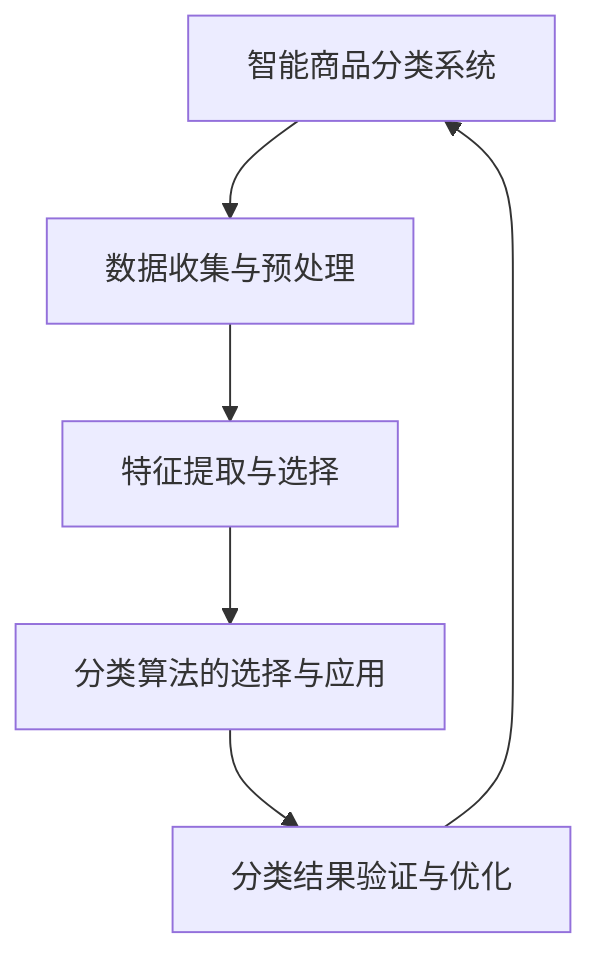

                 

### 第一部分：智能商品分类系统概述

#### 第1章：智能商品分类系统的概念与重要性

##### 1.1 智能商品分类系统的定义

智能商品分类系统是一种基于机器学习和数据挖掘技术的自动化系统，用于对电商平台上的商品进行自动分类。它的主要目标是将海量的商品数据按照一定的规则或标准进行分类，使得用户可以更快速、准确地找到他们需要的商品。

与传统商品分类系统相比，智能商品分类系统具有以下几个独特优势：

1. **自动分类**：智能商品分类系统可以自动对商品进行分类，不需要人工干预。
2. **高效性**：智能商品分类系统处理数据的速度非常快，可以在短时间内完成对大量商品的分类。
3. **准确性**：通过机器学习算法和大量数据的训练，智能商品分类系统的分类准确性相对较高。
4. **可扩展性**：智能商品分类系统可以根据业务需求灵活调整分类规则，适应不同场景下的商品分类。

##### 1.2 智能商品分类系统的工作原理

智能商品分类系统的工作流程主要包括以下几个步骤：

1. **数据收集与预处理**：收集电商平台上的商品数据，包括商品名称、描述、价格、标签等信息，并对数据进行清洗和预处理，去除无效信息和噪声数据。
2. **特征提取与选择**：从原始数据中提取有用的特征，例如商品名称、描述、标签等，并对特征进行选择和降维，以提高分类效果。
3. **分类算法的选择与应用**：选择合适的分类算法，例如决策树、支持向量机、神经网络等，对商品进行分类。
4. **分类结果验证与优化**：对分类结果进行验证，例如计算分类准确率、召回率等指标，并根据验证结果对模型进行优化。

##### 1.3 智能商品分类系统的应用场景

智能商品分类系统在电商、物流、零售等行业具有广泛的应用场景：

1. **电商平台**：智能商品分类系统可以帮助电商平台优化商品搜索和推荐功能，提高用户体验和销售额。
2. **物流与供应链**：智能商品分类系统可以帮助物流和供应链企业优化库存管理，提高物流效率。
3. **零售行业**：智能商品分类系统可以帮助零售企业优化商品陈列和销售策略，提高销售额和客户满意度。
4. **其他应用领域**：例如，智能商品分类系统还可以应用于制造业、农业等领域，帮助企业实现生产流程的自动化和智能化。

##### 1.4 智能商品分类系统的优势与挑战

智能商品分类系统具有以下优势：

1. **提高效率**：自动分类可以大大提高商品处理的效率，减少人工干预。
2. **提高准确性**：通过机器学习算法和大量数据的训练，分类准确性相对较高。
3. **降低成本**：自动化分类可以降低人力成本和运营成本。

然而，智能商品分类系统也面临一些挑战：

1. **数据质量**：分类效果很大程度上取决于数据质量，如果数据质量较差，分类效果也会受到影响。
2. **算法优化**：为了提高分类效果，需要不断优化算法和模型，这需要大量的计算资源和时间。
3. **模型可解释性**：智能商品分类系统中的机器学习模型往往缺乏可解释性，难以理解其决策过程，这可能会影响用户对系统的信任。

##### 1.4.1 解决方案与未来展望

针对上述挑战，可以采取以下解决方案：

1. **数据质量监控**：建立数据质量监控机制，确保数据质量满足分类需求。
2. **算法优化**：采用先进的机器学习算法和优化技术，提高分类效果。
3. **模型可解释性**：通过可视化技术和可解释性模型，提高用户对系统的信任。

未来，智能商品分类系统将继续发展，结合更多的先进技术和应用场景，为企业提供更加智能化、高效化的解决方案。

##### 1.4.2 结论与展望

智能商品分类系统作为一种重要的机器学习应用，在电商平台和零售行业等领域发挥着越来越重要的作用。通过不断优化算法和模型，提高分类效果和用户体验，智能商品分类系统有望在未来实现更加广泛的应用。

##### 1.4.3 附录

附录部分将包含智能商品分类系统的核心概念与架构的Mermaid流程图，以帮助读者更好地理解系统的工作原理和流程。



本文通过对智能商品分类系统的概念、工作原理、应用场景、优势与挑战以及未来展望的详细分析，旨在为读者提供一个全面深入的了解，并为后续章节的讨论打下基础。

### 第2章：机器学习在智能商品分类中的应用

#### 2.1 机器学习基本原理

##### 2.1.1 机器学习的定义与分类

机器学习（Machine Learning，ML）是人工智能（Artificial Intelligence，AI）的一个重要分支，主要研究如何让计算机系统从数据中自动学习规律和知识，并利用这些规律和知识进行决策和预测。根据学习方式的不同，机器学习可以分为以下几种类型：

1. **监督学习（Supervised Learning）**：监督学习是一种有监督的学习方式，即通过已有的标记数据集来训练模型，从而实现对未知数据的预测。监督学习又可以细分为回归分析（Regression）、分类（Classification）和异常检测（Anomaly Detection）等。

2. **无监督学习（Unsupervised Learning）**：无监督学习是一种无监督的学习方式，即没有标记数据，模型需要从数据中自动发现模式和规律。无监督学习主要包括聚类（Clustering）、降维（Dimensionality Reduction）和关联规则学习（Association Rule Learning）等。

3. **半监督学习（Semi-Supervised Learning）**：半监督学习结合了监督学习和无监督学习的特点，即部分数据有标签，部分数据无标签。模型可以利用有标签数据和无标签数据共同进行训练，以提高模型的泛化能力。

4. **强化学习（Reinforcement Learning）**：强化学习是一种基于奖励反馈的学习方式，模型通过与环境的交互来学习最优策略。强化学习在游戏、自动驾驶等领域有着广泛的应用。

##### 2.1.2 监督学习与无监督学习

监督学习与无监督学习的核心区别在于是否有标签数据。监督学习依赖于已标记的数据集，通过学习标记数据中的特征与标签之间的关系，来预测未知数据的标签。无监督学习则不需要标记数据，其主要目标是发现数据中的潜在结构和模式。

在智能商品分类系统中，监督学习通常用于分类问题，即给定商品的特征，预测商品所属的类别。而无监督学习可以用于聚类问题，即根据商品的特征将商品分为不同的类别，以发现商品之间的潜在关联。

##### 2.1.3 强化学习与半监督学习

强化学习在智能商品分类系统中也有一定的应用场景，例如，在推荐系统中，可以通过强化学习算法来优化推荐策略，提高推荐系统的效果。半监督学习则可以应用于商品分类系统中，利用少量的有标签数据和大量的无标签数据进行训练，以提高分类效果。

##### 2.1.4 机器学习中的核心算法

在智能商品分类系统中，常用的机器学习算法包括以下几种：

1. **决策树（Decision Tree）**：决策树是一种基于特征划分数据的分类算法，通过一系列的条件判断来对数据进行分类。决策树算法简单易懂，但在处理大规模数据时可能会出现过拟合问题。

2. **随机森林（Random Forest）**：随机森林是一种基于决策树的集成学习方法，通过构建多个决策树，并对这些树的预测结果进行投票，来提高模型的分类准确性和泛化能力。随机森林算法具有较强的抗过拟合能力和较好的分类效果。

3. **支持向量机（Support Vector Machine，SVM）**：支持向量机是一种基于边界划分的分类算法，通过寻找最优超平面将不同类别的数据分开。SVM算法在处理高维数据和线性不可分数据时表现良好。

4. **k-近邻算法（k-Nearest Neighbors，k-NN）**：k-近邻算法是一种基于实例的分类算法，通过计算测试实例与训练实例之间的距离，选择最近的k个邻居，并基于邻居的标签来预测测试实例的标签。k-NN算法简单高效，但依赖于距离度量方法和参数选择。

5. **聚类算法（Clustering Algorithm）**：聚类算法是一种无监督学习方法，通过将数据划分为不同的簇，来发现数据中的潜在结构和模式。常用的聚类算法包括K-means、层次聚类、DBSCAN等。

6. **神经网络与深度学习（Neural Networks and Deep Learning）**：神经网络和深度学习是一种基于多层感知器（Perceptron）的模型，通过模拟人脑神经元的工作原理，对数据进行自动特征学习和分类。深度学习在处理大规模、高维数据时表现出色，已经成为智能商品分类系统中的重要工具。

##### 2.1.5 模型评估与选择

在选择机器学习算法时，需要考虑模型的评估指标和选择方法。常用的评估指标包括准确率（Accuracy）、召回率（Recall）、精确率（Precision）、F1值（F1 Score）等。根据不同的应用场景和数据分布，可以选择合适的评估指标来评估模型的性能。

模型选择的方法包括交叉验证（Cross Validation）、网格搜索（Grid Search）和贝叶斯优化（Bayesian Optimization）等。这些方法可以帮助我们在多个模型中选择最优的模型，提高分类效果。

#### 2.2 特征工程与数据预处理

##### 2.2.1 特征工程的重要性

特征工程（Feature Engineering）是机器学习中的重要环节，其主要任务是从原始数据中提取出对模型训练有意义的特征，并对其进行处理和转换，以提高模型的性能。特征工程在智能商品分类系统中起着至关重要的作用，合理的特征选择和转换可以显著提高分类效果。

##### 2.2.2 数据预处理方法

在机器学习项目中，数据预处理是必不可少的步骤，其主要包括以下几个方面的内容：

1. **数据清洗**：去除数据中的噪声和异常值，例如缺失值、重复值和错误值。
2. **数据转换**：将不同类型的数据转换为同一类型，例如将类别数据转换为数值数据。
3. **数据标准化**：通过缩放或归一化，将数据转换为同一尺度，以便算法可以更好地处理数据。
4. **数据增强**：通过添加噪声、旋转、翻转等操作，生成更多的训练样本，以提高模型的泛化能力。

##### 2.2.3 特征选择与降维

特征选择（Feature Selection）是特征工程中的关键步骤，其主要目标是选择对模型训练最有帮助的特征，从而提高模型的性能和可解释性。常用的特征选择方法包括：

1. **过滤法（Filter Method）**：根据特征的相关性、信息增益等指标，直接筛选出有用的特征。
2. **包装法（Wrapper Method）**：通过训练模型并评估特征组合的效果，逐步选择出最优的特征组合。
3. **嵌入式方法（Embedded Method）**：在模型训练过程中，自动选择对模型性能有显著影响的特征。

降维（Dimensionality Reduction）是特征工程中的另一项重要任务，其主要目标是通过减少特征的数量，降低数据的高维性，从而提高模型的训练速度和效果。常用的降维方法包括：

1. **主成分分析（Principal Component Analysis，PCA）**：通过计算数据的主成分，将高维数据投影到低维空间。
2. **线性判别分析（Linear Discriminant Analysis，LDA）**：通过寻找最佳投影方向，将数据投影到低维空间，以最大化类内距离和最小化类间距离。
3. **自编码器（Autoencoder）**：通过训练自编码器，自动学习数据的低维表示。

##### 2.2.4 特征工程案例分析

在智能商品分类系统中，特征工程的具体步骤如下：

1. **数据收集**：收集电商平台上的商品数据，包括商品名称、描述、价格、标签等。
2. **数据预处理**：对商品名称、描述等进行分词、去停用词等操作，将类别数据转换为数值数据，进行数据标准化和归一化。
3. **特征提取**：从商品名称、描述等原始数据中提取特征，如词频、词嵌入等。
4. **特征选择**：通过相关性分析和模型评估，选择对分类任务最有帮助的特征。
5. **数据增强**：通过添加噪声、旋转、翻转等操作，生成更多的训练样本。
6. **降维**：通过PCA等方法，将高维特征降维到低维空间，以提高模型的训练速度和效果。

通过上述特征工程步骤，可以为智能商品分类系统构建一个高效、准确的模型，从而提高电商平台的服务质量和用户体验。

#### 2.3 常见机器学习算法详解

##### 2.3.1 决策树与随机森林

决策树（Decision Tree）是一种基于特征划分数据的分类算法，通过一系列的条件判断来对数据进行分类。每个内部节点表示一个特征，每个分支表示该特征的不同取值，叶子节点表示最终的分类结果。决策树算法简单易懂，但容易过拟合，尤其是在处理高维数据时。

随机森林（Random Forest）是一种基于决策树的集成学习方法，通过构建多个决策树，并对这些树的预测结果进行投票，来提高模型的分类准确性和泛化能力。随机森林算法具有较强的抗过拟合能力和较好的分类效果。

**决策树算法的实现**：

决策树算法的核心是递归划分数据，直到满足停止条件。以下是一个简化的决策树算法实现伪代码：

```
ID3(dataset, attributes):
    if all examples in dataset belong to the same class:
        return the single majority class in the dataset
    else:
        select the best attribute to split on
        create a new node with this attribute
        for each possible value of the selected attribute:
            split the dataset into subsets
            recursively call ID3 on each subset
        return the node
```

**随机森林算法的实现**：

随机森林算法的实现相对复杂，主要包括以下几个步骤：

1. **随机选择特征子集**：在每棵决策树训练过程中，随机选择一部分特征进行划分。
2. **递归调用决策树算法**：对每个子集递归调用决策树算法，构建多棵决策树。
3. **投票预测**：将所有决策树的预测结果进行投票，选择投票结果最多的类别作为最终预测结果。

以下是一个简化的随机森林算法实现伪代码：

```
RandomForest(dataset, n_trees):
    for i = 1 to n_trees:
        select a random subset of attributes
        build a decision tree using the selected attributes
    for each example in dataset:
        get the prediction from each decision tree
        vote for the majority class prediction
    return the majority class prediction
```

##### 2.3.2 支持向量机

支持向量机（Support Vector Machine，SVM）是一种基于边界划分的分类算法，通过寻找最优超平面将不同类别的数据分开。SVM算法在处理高维数据和线性不可分数据时表现良好。

**SVM算法的实现**：

SVM算法的核心是求解最优超平面，使得分类边界最大化。以下是一个简化的SVM算法实现伪代码：

```
SVM(dataset, labels):
    compute the optimal hyperplane
    find the support vectors
    return the decision boundary
```

在实际应用中，SVM算法通常使用核函数（Kernel Function）来实现非线性分类。常用的核函数包括线性核、多项式核、径向基函数（RBF）核等。

**线性核SVM的实现**：

```
LinearSVM(dataset, labels):
    compute the dot product of feature vectors
    solve the quadratic programming problem
    find the optimal hyperplane
    return the decision boundary
```

**多项式核SVM的实现**：

```
PolynomialSVM(dataset, labels, degree):
    compute the polynomial kernel function
    solve the quadratic programming problem
    find the optimal hyperplane
    return the decision boundary
```

**RBF核SVM的实现**：

```
RBF

