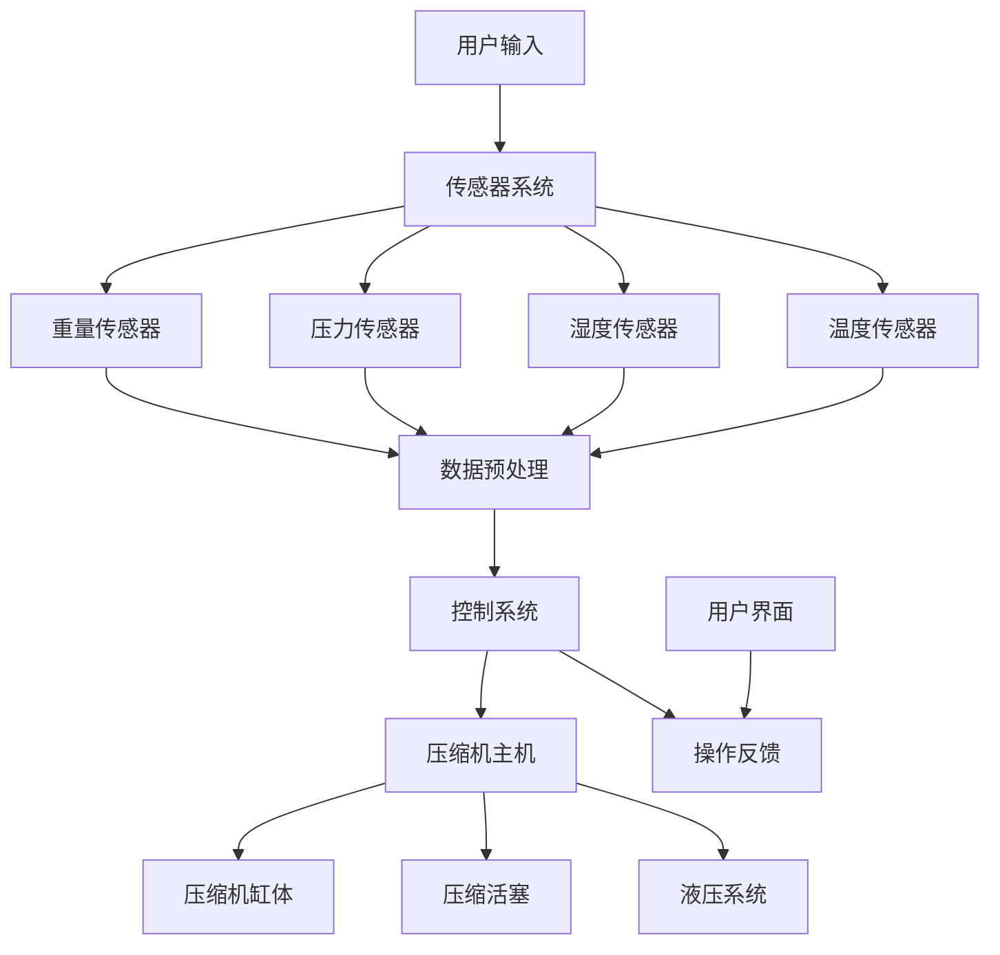
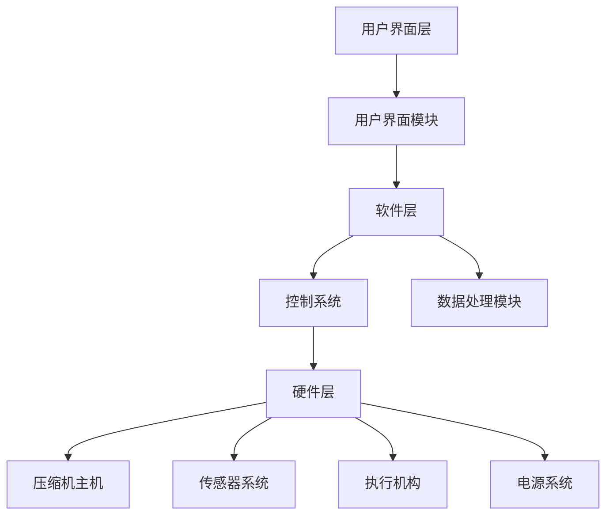

                 

# 智能垃圾压缩创业：家庭废物管理的新方案

## 关键词
- 家庭废物管理
- 智能垃圾压缩
- 环境保护
- 创业实践
- 技术创新

## 摘要
本文将深入探讨家庭废物管理领域的一个新兴方案——智能垃圾压缩技术。随着城市化进程的加速和居民生活水平的提高，家庭废物产生量日益增多，传统的废物处理方式已无法满足环保和节能的需求。智能垃圾压缩技术通过高效压缩垃圾体积，减轻垃圾处理压力，同时具备分类和资源回收的功能，为家庭废物管理提供了一种创新解决方案。本文将从技术原理、系统设计、实际应用及创业实践等方面展开讨论，分析智能垃圾压缩技术的优势和未来发展前景。

### 目录大纲 - 《智能垃圾压缩创业：家庭废物管理的新方案》

#### 第一部分：背景与概论

##### 第1章：家庭废物管理的现状与挑战
- **1.1 家庭废物管理的现状分析**
  - 家庭废物类型及特点
  - 当前废物处理方式及其局限性
- **1.2 智能垃圾压缩技术的概述**
  - 智能垃圾压缩技术的原理与优势
  - 智能垃圾压缩技术的发展趋势
- **1.3 家庭废物管理新方案的必要性**
  - 节能降耗与环境保护的迫切需求
  - 提升生活品质与社会责任

#### 第二部分：智能垃圾压缩技术基础

##### 第2章：智能垃圾压缩技术原理
- **2.1 智能垃圾压缩机的工作原理**
  - **2.1.1 压缩机的结构与功能**
    - **Mermaid流程图**：智能垃圾压缩机的内部流程
  - **2.1.2 压缩技术分类与比较**
    - **伪代码**：不同压缩技术的算法原理与特点
- **2.2 智能垃圾压缩过程中的传感器与控制系统**
  - **2.2.1 常见传感器介绍**
  - **2.2.2 控制系统的设计与实现**
    - **伪代码**：控制系统运行逻辑与算法实现

##### 第3章：智能垃圾压缩技术核心算法
- **3.1 数据处理与优化算法**
  - **3.1.1 数据预处理流程**
  - **3.1.2 压缩效率优化算法**
    - **伪代码**：垃圾压缩效率优化算法的实现
- **3.2 智能垃圾分类算法**
  - **3.2.1 垃圾分类的基本原理**
  - **3.2.2 常见的垃圾分类算法**
    - **伪代码**：垃圾分类算法的实现示例

#### 第三部分：智能垃圾压缩系统的设计与实现

##### 第4章：智能垃圾压缩系统的设计
- **4.1 系统总体设计**
  - **4.1.1 系统架构设计**
  - **4.1.2 系统功能模块划分**
- **4.2 硬件选型与系统集成**
  - **4.2.1 压缩机硬件选型**
  - **4.2.2 传感器与控制系统集成**

##### 第5章：智能垃圾压缩系统的实现
- **5.1 系统开发环境搭建**
  - **5.1.1 开发工具与环境**
  - **5.1.2 系统集成开发**
- **5.2 代码实现与调试**
  - **5.2.1 主程序代码实现**
  - **5.2.2 调试方法与技巧**
    - **伪代码**：调试过程中常见的代码问题与解决方案

#### 第四部分：智能垃圾压缩系统的实际应用与案例

##### 第6章：智能垃圾压缩系统在家庭环境中的应用
- **6.1 系统安装与操作**
  - **6.1.1 系统安装步骤**
  - **6.1.2 系统操作指南**
- **6.2 实际使用效果评估**
  - **6.2.1 垃圾压缩效率**
  - **6.2.2 使用满意度调查**

##### 第7章：智能垃圾压缩创业实践
- **7.1 创业模式分析**
  - **7.1.1 市场需求与竞争分析**
  - **7.1.2 创业模式与盈利模式**
- **7.2 创业步骤与策略**
  - **7.2.1 团队组建与技术研发**
  - **7.2.2 产品市场推广策略**
- **7.3 创业案例分享**
  - **7.3.1 成功创业案例分析**
  - **7.3.2 创业过程中遇到的挑战与应对措施**

#### 第五部分：展望与未来趋势

##### 第8章：智能垃圾压缩技术的未来发展趋势
- **8.1 新技术引入与展望**
  - **8.1.1 物联网技术在智能垃圾压缩中的应用**
  - **8.1.2 人工智能在废物管理中的进一步应用**
- **8.2 未来智能垃圾压缩系统的优化方向**
  - **8.2.1 压缩效率与能耗优化**
  - **8.2.2 系统智能化与用户体验提升**

#### 附录

##### 附录A：智能垃圾压缩系统开发资源
- **A.1 开发工具与环境**
  - **A.1.1 开发软件与硬件资源介绍**
  - **A.1.2 常用开发工具推荐**
- **A.2 开发参考资料**
  - **A.2.1 传感器技术手册**
  - **A.2.2 控制系统开发指南**
- **A.3 智能垃圾压缩相关标准与法规**
  - **A.3.1 国家关于废物管理的标准**
  - **A.3.2 欧盟与美国的废物管理法规**

---

### 引言

随着全球人口的快速增长和城市化进程的加速，城市垃圾问题日益严重，如何有效管理家庭废物成为社会各界关注的焦点。传统的废物处理方式，如填埋、焚烧和堆肥等，虽然在一定程度上缓解了垃圾堆积的压力，但也带来了环境污染、资源浪费和健康隐患等问题。特别是在城市化进程中，土地资源稀缺、垃圾处理成本高昂，使得寻找新型、高效的家庭废物管理方案成为迫切需求。

在此背景下，智能垃圾压缩技术应运而生。作为一种结合了信息技术、传感器技术和机械工程的新型废物管理技术，智能垃圾压缩技术通过高效压缩垃圾体积，减轻垃圾处理压力，同时具备垃圾分类和资源回收功能，为家庭废物管理提供了一种全新的解决方案。本文将从技术原理、系统设计、实际应用及创业实践等方面展开讨论，探讨智能垃圾压缩技术的优势和未来发展前景。

智能垃圾压缩技术的核心在于将家庭产生的各类垃圾进行压缩，使其体积大幅减小，从而减少运输和处理过程中的资源消耗。同时，通过传感器和智能控制系统，实现垃圾的自动分类，提高资源回收效率。本文将首先介绍家庭废物管理的现状与挑战，然后深入探讨智能垃圾压缩技术的原理及其在废物管理中的应用。接着，我们将分析智能垃圾压缩系统的设计原则与实现方法，并通过具体案例展示其实际应用效果。此外，本文还将探讨智能垃圾压缩技术的创业实践，包括市场分析、商业模式和创业策略，最后展望智能垃圾压缩技术的未来发展趋势。

通过对这些问题的深入分析，本文旨在为智能垃圾压缩技术的研发和应用提供理论支持和实践指导，为家庭废物管理领域的技术创新和创业实践提供新的思路。

### 第一部分：背景与概论

#### 1.1 家庭废物管理的现状分析

**家庭废物类型及特点**

家庭废物主要包括厨房垃圾、可回收垃圾、有害垃圾和其他垃圾等。不同类型的废物具有各自独特的特点，这些特点直接影响到废物处理的方式和效率。

- **厨房垃圾**：主要来源于家庭烹饪和食品加工，包括剩菜剩饭、蔬菜水果皮、动物骨骼等。厨房垃圾通常水分含量较高，容易腐烂，产生恶臭，且含有大量有机物质，适宜进行生物降解处理。
- **可回收垃圾**：包括纸类、塑料、玻璃、金属和布料等，这些废物可以通过回收再利用减少资源的浪费。可回收垃圾种类繁多，回收过程中需要分类处理，不同材质的废物需采用不同的回收方法。
- **有害垃圾**：包括废电池、废灯管、废药品、废油漆等，这些废物对人体健康和生态环境具有较大的危害性，若不当处理，会污染土壤和水源。有害垃圾的回收和处理需要专业的技术和设备。
- **其他垃圾**：也称为湿垃圾，包括无法归入上述类别的垃圾，如尘土、陶瓷、卫生间用纸等。其他垃圾的回收价值较低，但若直接填埋或焚烧，也会对环境造成一定影响。

**当前废物处理方式及其局限性**

目前，家庭废物的处理方式主要包括填埋、焚烧、堆肥和回收再利用等，每种方法都有其优缺点和局限性。

- **填埋**：是目前最常用的垃圾处理方式。通过将垃圾掩埋在地下，使其与土壤隔离，减少对环境的影响。然而，填埋场地的数量有限，且长期填埋会导致土地资源的浪费，同时垃圾腐烂产生的沼气和其他有害物质会污染大气。
- **焚烧**：通过高温焚烧垃圾，可以减少垃圾的体积，实现能源回收。但焚烧过程中会产生大量的有害气体和灰尘，对空气质量造成严重影响。此外，焚烧设备的高成本和复杂的技术要求也限制了其广泛推广。
- **堆肥**：适用于有机垃圾的处理，通过生物降解将有机垃圾转化为肥料。堆肥过程需要较长的周期，且对环境条件有较高的要求，如湿度和温度等。同时，堆肥过程中可能产生恶臭和蚊蝇等卫生问题。
- **回收再利用**：通过回收和加工，将可回收垃圾转化为新的资源，减少对原生资源的需求。虽然回收再利用可以减少垃圾量，提高资源利用率，但回收过程复杂，成本较高，且分类回收的准确性和效率仍有待提高。

综上所述，当前家庭废物处理方式存在以下局限性：

1. **处理成本高**：无论是填埋、焚烧还是回收再利用，都需要投入大量的资金和资源，对于一些地方政府和企业来说，负担较重。
2. **环境污染严重**：填埋和焚烧等处理方式会产生大量有害物质，对大气、水源和土壤造成污染，影响生态环境和居民健康。
3. **资源利用率低**：由于分类回收的不完善和回收技术的局限性，大量可回收资源未能得到充分利用，造成资源浪费。
4. **技术复杂度**：一些新型废物处理技术，如智能垃圾压缩技术，虽然具有显著优势，但其复杂的技术结构和高昂的成本限制了其普及应用。

#### 1.2 智能垃圾压缩技术的概述

**智能垃圾压缩技术的原理与优势**

智能垃圾压缩技术是一种通过机械压缩和智能控制系统，将家庭废物进行高效压缩处理的技术。其主要原理是利用压缩机械，将垃圾体积缩小，从而降低运输和处理的成本，同时实现垃圾分类和资源回收。智能垃圾压缩技术的优势主要体现在以下几个方面：

1. **压缩效率高**：智能垃圾压缩技术通过高强度的机械压缩，可以将垃圾体积减少到原来的几分之一，从而显著减少运输和处理的负担。
2. **降低处理成本**：压缩后的垃圾体积减小，运输和处理成本相应降低，对于地方政府和企业来说，具有较大的经济效益。
3. **智能分类**：智能垃圾压缩技术通常配备有传感器和智能控制系统，能够自动识别和分类垃圾，提高资源回收的准确性和效率。
4. **环境保护**：通过高效压缩和智能分类，智能垃圾压缩技术可以减少垃圾处理的污染，降低对环境的影响。
5. **提高生活品质**：智能垃圾压缩设备通常设计美观、操作简便，能够提高家庭环境的美观度和生活质量。

**智能垃圾压缩技术的发展趋势**

智能垃圾压缩技术作为一种新兴的废物管理技术，其发展迅速，未来有望在以下几个方面取得突破：

1. **技术优化**：随着机械工程和传感器技术的进步，智能垃圾压缩技术的压缩效率和智能化水平将进一步提升，实现更高效的垃圾处理。
2. **系统集成**：智能垃圾压缩技术将与物联网、大数据和人工智能等新兴技术结合，实现系统的智能化和自动化，提高废物管理的整体效率。
3. **普及应用**：随着成本的降低和技术的成熟，智能垃圾压缩技术将在家庭、社区和城市等不同层面得到广泛应用，成为城市废物管理的重要组成部分。
4. **政策支持**：随着环境保护意识的增强，政府将加大对智能垃圾压缩技术的支持力度，出台相关政策鼓励其研发和应用。

综上所述，智能垃圾压缩技术作为一种创新的废物管理方案，具有显著的环保效益和经济效益，在未来有望成为家庭废物管理的重要手段。通过深入了解其原理和发展趋势，我们可以更好地把握这一领域的发展方向，推动智能垃圾压缩技术的广泛应用。

#### 1.3 家庭废物管理新方案的必要性

**节能降耗与环境保护的迫切需求**

随着全球能源消耗的不断攀升和环境污染的日益严重，节能降耗和环境保护已经成为全球范围内的共同目标。家庭废物管理作为环境保护的重要组成部分，其节能降耗效果直接影响到整个社会的能源利用效率和环境质量。传统的废物处理方式，如填埋、焚烧和堆肥等，在处理过程中会产生大量有害物质，不仅消耗了大量的能源，还严重污染了大气、水源和土壤。而智能垃圾压缩技术通过高效压缩和智能分类，可以大幅降低垃圾处理的能源消耗，减少对环境的影响，符合节能降耗和环境保护的迫切需求。

**提升生活品质与社会责任**

在现代社会中，家庭废物管理不仅是一个环保问题，也是一个影响居民生活品质的重要方面。传统的垃圾处理方式往往需要居民投入大量时间和精力进行垃圾分类和处理，给居民带来不便和困扰。而智能垃圾压缩技术通过自动化和智能化的处理过程，可以显著减轻居民在废物处理方面的负担，提高生活品质。同时，智能垃圾压缩技术还可以通过分类回收和资源再利用，实现垃圾的资源化，提高资源的利用率，体现企业和社会对环保的责任。

**促进循环经济的发展**

循环经济强调资源的循环利用和废弃物的减量化、资源化处理，是实现可持续发展的重要途径。智能垃圾压缩技术通过高效的垃圾压缩和智能分类，可以将垃圾转化为可再利用的资源，减少对原生资源的需求，促进循环经济的发展。智能垃圾压缩技术不仅有助于降低环境污染和资源消耗，还可以为城市和社区提供新的经济增长点，推动绿色产业的发展。

**应对城市化进程的挑战**

随着城市化进程的加速，城市垃圾问题日益严重，城市废物管理面临着巨大的挑战。智能垃圾压缩技术可以通过减少垃圾体积，减轻垃圾处理的压力，为城市提供更加高效和可持续的废物管理解决方案。智能垃圾压缩技术的应用可以缓解城市垃圾处理设施的压力，提高废物处理的效率和质量，有助于实现城市环境的可持续发展。

**推动技术创新和产业升级**

智能垃圾压缩技术的研发和应用，不仅为家庭废物管理提供了新的思路和手段，也为相关产业的技术创新和产业升级提供了重要契机。智能垃圾压缩技术的应用，可以带动传感器技术、控制系统技术、机械工程技术等领域的创新，推动相关产业链的发展，促进产业结构的优化和升级。

综上所述，智能垃圾压缩技术作为一种创新的废物管理方案，其必要性体现在节能降耗、环境保护、提升生活品质、促进循环经济和应对城市化进程的挑战等多个方面。通过深入了解和推广智能垃圾压缩技术，我们可以在家庭废物管理领域实现技术突破和产业升级，为构建美丽中国和实现可持续发展做出积极贡献。

### 第二部分：智能垃圾压缩技术基础

#### 2.1 智能垃圾压缩机的工作原理

**2.1.1 压缩机的结构与功能**

智能垃圾压缩机主要由以下几个部分组成：压缩机主机、传感器系统、控制系统和用户界面。

1. **压缩机主机**：压缩机主机是智能垃圾压缩器的核心部分，包括压缩机缸体、压缩活塞、液压系统等。压缩机主机通过机械力将垃圾进行压缩，使其体积缩小。在压缩过程中，液压系统提供必要的压力，压缩活塞通过往复运动将垃圾压入缸体中。缸体内部设有多个压缩室，以便逐步压缩垃圾。

2. **传感器系统**：传感器系统用于监测垃圾的体积、重量、湿度等参数。常见的传感器包括重量传感器、压力传感器、湿度传感器和温度传感器等。传感器系统可以实时收集垃圾的物理参数，为控制系统提供数据支持，从而实现智能压缩和分类。

3. **控制系统**：控制系统是智能垃圾压缩器的“大脑”，负责协调各部分的工作。控制系统通常采用嵌入式计算机系统，通过编程实现垃圾压缩、分类和故障检测等功能。控制系统根据传感器反馈的数据，控制压缩机的启动、停止和压缩力度，实现垃圾的智能压缩。此外，控制系统还可以通过用户界面与用户进行互动，提供操作指南和故障信息。

4. **用户界面**：用户界面是用户与智能垃圾压缩机进行交互的通道，通常包括显示屏、按钮和触摸屏等。用户界面可以显示垃圾压缩的状态、参数和故障信息，用户可以通过界面设置压缩参数、查看垃圾压缩进度和进行故障排除。

**Mermaid流程图：智能垃圾压缩机的内部流程**



**2.1.2 压缩技术分类与比较**

智能垃圾压缩技术可以分为静态压缩和动态压缩两大类，每种技术都有其独特的原理和特点。

1. **静态压缩**：静态压缩技术主要通过固定压力对垃圾进行压缩，使垃圾体积减小。静态压缩的优点是结构简单、成本较低，适用于小规模家庭垃圾处理。缺点是压缩效率相对较低，压缩后的垃圾质量较大，不利于运输和处理。

2. **动态压缩**：动态压缩技术通过机械力使压缩活塞在缸体内移动，逐步压缩垃圾。动态压缩的优点是压缩效率高，压缩后的垃圾体积和质量较小，便于运输和处理。缺点是结构复杂、成本较高，对液压系统要求较高。

**伪代码：不同压缩技术的算法原理与特点**

```plaintext
静态压缩算法：
function 静态压缩(垃圾)
    设置固定压力
    压缩活塞在固定压力下往复运动
    记录压缩前后垃圾体积
    返回压缩后体积

动态压缩算法：
function 动态压缩(垃圾)
    初始化压缩活塞位置
    循环执行以下步骤直到达到预定压缩比例：
        计算压缩力
        移动压缩活塞
        记录压缩过程中垃圾体积和质量
        调整压缩参数以优化压缩效率
    返回压缩后体积和质量
```

通过上述算法可以看出，静态压缩技术适用于简单、低成本的家庭垃圾处理，而动态压缩技术则具有更高的压缩效率和更好的处理效果。在实际应用中，可以根据垃圾处理的需求和成本预算选择合适的压缩技术。

#### 2.2 智能垃圾压缩过程中的传感器与控制系统

**2.2.1 常见传感器介绍**

在智能垃圾压缩机中，传感器系统起着至关重要的作用，它们能够实时监测垃圾的物理参数，为压缩和控制提供精确的数据支持。常见的传感器包括重量传感器、压力传感器、湿度传感器和温度传感器等。

1. **重量传感器**：重量传感器用于测量垃圾的重量，通常采用应变片或压电元件等敏感元件。通过测量重量，可以实时了解垃圾的填充情况，防止压缩机过载，并计算出压缩效果。

2. **压力传感器**：压力传感器用于测量垃圾在压缩过程中所受到的压力。通过压力传感器，可以实时监测压缩机的压缩力度，确保压缩效果和设备的安全运行。

3. **湿度传感器**：湿度传感器用于测量垃圾的湿度，有助于判断垃圾的腐熟程度，为后续的压缩和分类提供依据。湿度传感器通常采用电容式或电阻式敏感元件。

4. **温度传感器**：温度传感器用于测量垃圾的温度，可以及时发现垃圾中的异常情况，如燃烧或腐熟过快等，从而采取相应的措施，确保压缩机的稳定运行。

**2.2.2 控制系统的设计与实现**

控制系统是智能垃圾压缩机的“大脑”，负责协调各部分的工作，实现垃圾的智能压缩和分类。以下将介绍控制系统的设计原则和实现方法。

1. **设计原则**：

   - **实时性**：控制系统需要具备高实时性，能够快速响应传感器数据和用户操作，确保压缩过程的稳定性和安全性。
   - **可靠性**：控制系统应具备较高的可靠性，能够在各种环境下稳定运行，降低故障率。
   - **扩展性**：控制系统应具备良好的扩展性，能够根据需求添加新的传感器和功能模块，适应不同的应用场景。
   - **用户友好**：控制系统应具备友好的用户界面，方便用户操作和维护。

2. **实现方法**：

   - **硬件平台**：控制系统硬件平台通常采用嵌入式计算机系统，包括微处理器、内存、存储器和输入输出接口等。嵌入式计算机系统具有低功耗、高性能和丰富的接口资源，能够满足智能垃圾压缩机控制系统的需求。
   - **软件平台**：控制系统的软件平台主要包括操作系统、应用程序和驱动程序等。操作系统负责系统的调度和管理，应用程序实现具体的压缩和分类算法，驱动程序负责硬件设备的控制和数据通信。
   - **算法实现**：控制系统的核心是压缩和分类算法，通过对传感器数据的处理，实现垃圾的智能压缩和分类。算法实现主要包括数据采集、预处理、特征提取、压缩和分类等步骤。

**伪代码：控制系统运行逻辑与算法实现**

```plaintext
初始化系统
    设置传感器参数
    初始化控制系统
    启动压缩程序
    
循环执行以下步骤：
    读取传感器数据
        重量数据
        压力数据
        湿度数据
        温度数据
    数据预处理
        去除噪声
        线性化处理
        归一化处理
    压缩算法
        根据重量和压力数据
        计算压缩力度
        控制压缩机执行压缩
    分类算法
        根据湿度、温度和重量数据
        判断垃圾类型
        执行分类操作
    显示压缩状态和参数
    接收用户操作
        根据用户输入
        调整压缩参数或执行其他操作
```

通过上述伪代码，可以看出控制系统通过传感器实时监测垃圾参数，执行压缩和分类算法，并根据用户操作进行相应的调整。控制系统的设计与实现是智能垃圾压缩机稳定运行的关键，需要充分考虑系统的实时性、可靠性和扩展性，以满足不同应用场景的需求。

#### 2.3 智能垃圾压缩技术核心算法

**2.3.1 数据处理与优化算法**

在智能垃圾压缩技术中，数据处理与优化算法至关重要，其直接影响到压缩效率和系统性能。以下是数据处理与优化算法的核心内容：

**2.3.1.1 数据预处理流程**

数据预处理是算法实现的第一步，其目的是对原始传感器数据进行清洗、滤波和规范化，以提高算法的准确性和稳定性。数据预处理流程通常包括以下步骤：

1. **去噪处理**：由于传感器噪声的影响，原始数据往往存在波动和异常值。去噪处理通过均值滤波、中值滤波或卡尔曼滤波等方法，去除噪声数据，提高数据的平滑性。

2. **滤波处理**：传感器数据可能存在高频噪声或周期性干扰，滤波处理通过低通滤波、高通滤波或带通滤波等方法，保留有用信号，抑制噪声。

3. **归一化处理**：不同传感器数据的量级和分布可能差异较大，通过归一化处理，将数据转换到统一的量级和分布范围内，以便后续处理。

**伪代码：数据预处理流程**

```plaintext
function 数据预处理(原始数据)
    去噪处理(原始数据)
    滤波处理(原始数据)
    归一化处理(原始数据)
    返回预处理后数据
```

**2.3.1.2 压缩效率优化算法**

压缩效率优化算法的目标是提高压缩机的压缩效率和稳定性。以下是几种常见的压缩效率优化算法：

1. **自适应压缩算法**：该算法根据实时传感器数据，动态调整压缩力度，以实现最优的压缩效果。具体实现如下：

   - **步骤1**：读取传感器数据，包括重量、压力、湿度、温度等。
   - **步骤2**：根据历史数据和实时数据，计算当前的最佳压缩力度。
   - **步骤3**：调整压缩力度，执行压缩操作。
   - **步骤4**：记录压缩效果，并根据反馈数据进行下一次调整。

   **伪代码：自适应压缩算法**

   ```plaintext
   function 自适应压缩(传感器数据)
       根据历史数据和实时数据计算最佳压缩力度
       调整压缩力度
       执行压缩操作
       记录压缩效果
       根据反馈数据调整压缩力度
   ```

2. **遗传算法**：遗传算法是一种基于生物进化的优化算法，适用于复杂和非线性优化问题。遗传算法通过模拟自然选择和遗传机制，逐步优化压缩参数。

   - **步骤1**：初始化参数群体，包括压缩力度、压缩周期等。
   - **步骤2**：计算参数群体的适应度，即压缩效果。
   - **步骤3**：根据适应度进行选择、交叉和变异操作，生成下一代参数群体。
   - **步骤4**：重复步骤2和3，直到找到最优参数。

   **伪代码：遗传算法**

   ```plaintext
   function 遗传算法(参数群体)
       while 未达到终止条件
           计算参数群体适应度
           选择优秀参数
           交叉操作
           变异操作
           生成下一代参数群体
   ```

**2.3.2 智能垃圾分类算法**

智能垃圾分类是智能垃圾压缩技术的重要组成部分，其目标是通过传感器和智能算法，实现垃圾的自动分类，提高资源回收效率。以下是几种常见的智能垃圾分类算法：

**2.3.2.1 垃圾分类的基本原理**

垃圾分类算法基于垃圾的物理和化学特性，通过传感器数据识别垃圾的类型。常见的方法包括：

1. **特征提取**：通过传感器数据提取垃圾的重量、形状、颜色、温度等特征，为分类提供依据。

2. **特征选择**：从提取的特征中选择最具区分度的特征，提高分类准确性。

3. **分类器设计**：设计分类器，根据特征对垃圾进行分类。常见的分类器包括决策树、支持向量机、神经网络等。

**2.3.2.2 常见的垃圾分类算法**

1. **决策树分类器**：决策树通过一系列的判断条件，将数据逐步划分到不同的类别。决策树算法简单直观，易于理解和实现。

   **伪代码：决策树分类器**

   ```plaintext
   function 决策树分类器(特征数据)
       if (特征1 <阈值1)
           if (特征2 <阈值2)
               返回类别A
           else
               返回类别B
       else
           if (特征3 <阈值3)
               返回类别C
           else
               返回类别D
   ```

2. **支持向量机分类器**：支持向量机通过寻找最佳的超平面，将不同类别的数据分开。支持向量机具有较高的分类准确性和泛化能力。

   **伪代码：支持向量机分类器**

   ```plaintext
   function 支持向量机分类器(特征数据，标签)
       训练模型
       输入新数据
       根据模型预测类别
   ```

3. **神经网络分类器**：神经网络通过多层神经元模拟人类大脑的决策过程，具有较高的分类能力和学习能力。

   **伪代码：神经网络分类器**

   ```plaintext
   function 神经网络分类器(特征数据)
       前向传播
       计算损失函数
       反向传播
       更新权重
       返回预测类别
   ```

通过上述算法可以看出，智能垃圾分类算法的关键在于特征提取和分类器的选择。在实际应用中，可以根据具体需求和数据特性选择合适的算法，实现高效的垃圾分类。

综上所述，数据处理与优化算法和智能垃圾分类算法是智能垃圾压缩技术的核心组成部分，其实现和优化直接影响到系统的性能和效率。通过深入研究和应用这些算法，我们可以不断提升智能垃圾压缩技术的水平，为家庭废物管理提供更加智能和高效的解决方案。

### 第三部分：智能垃圾压缩系统的设计与实现

#### 4.1 系统总体设计

**4.1.1 系统架构设计**

智能垃圾压缩系统的总体架构包括硬件层、软件层和用户界面层，各层之间通过接口进行通信和交互。

1. **硬件层**：硬件层是智能垃圾压缩系统的物理实现部分，包括压缩机主机、传感器系统、执行机构和电源系统等。压缩机主机负责垃圾的压缩处理，传感器系统用于实时监测垃圾的物理参数，执行机构负责执行控制指令，电源系统提供系统所需的电能。

2. **软件层**：软件层包括控制系统、数据处理模块和用户界面模块。控制系统负责协调硬件层各部分的工作，数据处理模块用于对传感器数据进行预处理和算法处理，用户界面模块提供用户交互界面，实现系统的操作和监控。

3. **用户界面层**：用户界面层是用户与智能垃圾压缩机进行交互的通道，包括触摸屏、按钮和显示屏等。用户界面层提供用户操作指南、压缩状态显示和故障提示等功能。

**系统架构图**



**4.1.2 系统功能模块划分**

智能垃圾压缩系统的功能模块划分如下：

1. **压缩机主机模块**：压缩机主机模块是系统的核心部分，负责垃圾的压缩处理。该模块包括压缩机缸体、压缩活塞、液压系统和控制系统等。压缩机主机模块通过机械压缩和智能控制，实现垃圾的高效压缩和体积减小。

2. **传感器系统模块**：传感器系统模块负责实时监测垃圾的物理参数，包括重量传感器、压力传感器、湿度传感器和温度传感器等。传感器系统模块将采集到的数据发送给控制系统，用于压缩控制和故障检测。

3. **控制系统模块**：控制系统模块是系统的“大脑”，负责协调各模块的工作，实现垃圾的智能压缩和分类。控制系统模块通过嵌入式计算机系统，执行压缩和分类算法，控制压缩机主机的工作状态。

4. **数据处理模块**：数据处理模块用于对传感器数据进行预处理和算法处理，包括数据去噪、滤波和归一化等。数据处理模块将预处理后的数据发送给控制系统，用于决策和反馈。

5. **用户界面模块**：用户界面模块提供用户交互界面，实现系统的操作和监控。用户界面模块通过触摸屏、按钮和显示屏等，向用户提供系统状态、压缩参数和故障提示等信息。

通过上述功能模块的划分，智能垃圾压缩系统实现了硬件和软件的有机结合，实现了垃圾的高效压缩和智能分类。系统架构设计和功能模块划分是智能垃圾压缩系统设计的重要环节，决定了系统的性能和稳定性。

#### 4.2 硬件选型与系统集成

**4.2.1 压缩机硬件选型**

在选择压缩机硬件时，需要考虑以下因素：

1. **压缩能力**：根据家庭废物的种类和数量，选择适合的压缩机，确保其具有足够的压缩能力。一般建议选择压缩比在3:1到5:1之间的压缩机，以实现较高的压缩效率。

2. **耐用性**：压缩机需要长时间工作，因此需要选择耐用性较高的材料，如不锈钢、铝合金等，以提高设备的寿命。

3. **能耗**：压缩机的能耗是重要的考虑因素，选择能效比高的压缩机可以降低运行成本。一般建议选择具有节能认证的压缩机。

4. **噪声**：压缩机在工作过程中会产生一定的噪声，需要选择噪声较低的产品，以减少对用户的影响。

5. **兼容性**：压缩机的接口和控制系统需要与传感器系统和用户界面模块兼容，确保系统的整体性能。

常见的压缩机硬件选型包括：

- **压缩机主机**：选择压缩能力适中、耐用性较高、能耗较低、噪声较低的压缩机主机，如三菱压缩机或日立压缩机。
- **传感器系统**：选择重量传感器、压力传感器、湿度传感器和温度传感器等，如霍尼韦尔传感器或西门子传感器。

**4.2.2 传感器与控制系统集成**

传感器与控制系统的集成是智能垃圾压缩系统硬件设计的关键环节，以下步骤可以帮助实现高效的系统集成：

1. **传感器连接**：将传感器模块与控制系统通过总线接口连接，如I2C、SPI或UART等。总线接口的选择需要考虑传感器的数据传输速率和通信距离。

2. **电源管理**：为传感器和控制系统提供稳定的电源供应，确保系统在长时间运行中不会因电源问题导致故障。电源管理模块需要具有稳压功能和过流保护功能。

3. **信号调理**：传感器输出的信号可能较弱且存在噪声，需要进行信号调理，包括放大、滤波和去噪等处理。信号调理模块可以集成在传感器内部，或作为独立的模块进行连接。

4. **数据通信**：传感器与控制系统之间的数据通信需要采用标准的数据通信协议，如Modbus、CAN或Ethernet等。数据通信模块需要支持多种通信协议，以实现数据的可靠传输。

5. **接口兼容性**：确保传感器与控制系统的接口兼容，包括电气接口和物理接口。接口兼容性可以减少硬件设计和调试的复杂性。

6. **系统集成测试**：在系统集成完成后，需要进行全面的测试，包括功能测试、性能测试和可靠性测试等。系统集成测试可以确保系统在运行过程中不会出现硬件故障和通信问题。

通过上述步骤，可以实现高效的传感器与控制系统集成，确保智能垃圾压缩系统硬件的高性能和稳定性。

#### 4.3 系统开发环境搭建

**4.3.1 开发工具与环境**

智能垃圾压缩系统的开发环境搭建是确保系统开发顺利进行的关键环节。以下是搭建系统开发环境的步骤和工具推荐：

1. **操作系统**：推荐使用Linux操作系统，如Ubuntu或CentOS，因为Linux具有开源、稳定和丰富的库支持，适合嵌入式系统开发。

2. **集成开发环境（IDE）**：推荐使用Eclipse或JetBrains系列产品，如CLion或PyCharm。这些IDE具有强大的代码编辑、调试和项目管理功能，能够提高开发效率。

3. **编程语言**：根据开发需求，可以选择C/C++、Python或Java等编程语言。C/C++适合嵌入式系统开发，Python适合算法开发和测试，Java适合跨平台开发。

4. **开发板**：推荐使用基于ARM架构的开发板，如树莓派（Raspberry Pi）或ESP32。这些开发板具有高性能、低功耗和丰富的接口资源，适合智能垃圾压缩系统的开发。

5. **传感器库**：推荐使用开源传感器库，如Arduino库、Raspberry Pi传感器库等。这些库提供了丰富的传感器接口和驱动程序，方便传感器与控制系统的集成。

6. **编程框架**：推荐使用开源编程框架，如FreeRTOS、MicroPython等。这些框架提供了嵌入式系统的实时调度和任务管理功能，能够提高系统的可靠性和性能。

**4.3.2 系统集成开发**

系统集成开发是智能垃圾压缩系统开发的重要环节，以下是系统集成开发的步骤：

1. **硬件集成**：将传感器、执行机构和开发板等硬件设备按照系统架构进行连接和组装，确保各硬件设备之间的通信和协同工作。

2. **软件集成**：编写控制程序，将传感器数据读取、数据处理、压缩算法、分类算法和用户界面等功能模块集成到系统中。控制程序需要实现各功能模块之间的数据传递和协同工作。

3. **功能测试**：在开发环境中进行功能测试，验证系统是否能够按照设计要求正常运行。功能测试包括传感器数据采集、压缩和分类效果、用户界面操作等。

4. **性能优化**：对系统进行性能优化，提高系统的运行效率和稳定性。性能优化包括代码优化、资源管理和系统调度等方面。

5. **可靠性测试**：进行可靠性测试，模拟实际使用环境，验证系统在长期运行中的稳定性和可靠性。可靠性测试包括高温、低温、湿度、振动等环境条件下的运行测试。

6. **系统集成测试**：在功能测试和性能优化完成后，进行系统集成测试，确保系统各功能模块之间能够无缝协同工作，满足系统的整体性能要求。

通过上述步骤，可以搭建完整的智能垃圾压缩系统开发环境，并实现系统的集成开发。系统开发环境搭建和系统集成开发是智能垃圾压缩系统设计成功的关键，需要充分考虑硬件和软件的兼容性、系统的性能和稳定性。

#### 4.4 代码实现与调试

**4.4.1 主程序代码实现**

智能垃圾压缩系统的主程序代码实现是系统开发的核心环节，以下是一个简化版的主程序代码示例，展示了系统的基本控制逻辑：

```c
#include <stdio.h>
#include <stdlib.h>
#include "sensor.h"
#include "compressor.h"
#include "classifier.h"

int main() {
    // 初始化硬件设备
    initialize_hardware();

    // 循环执行压缩和分类操作
    while (1) {
        // 读取传感器数据
        data_t sensor_data = read_sensors();

        // 数据预处理
        data_t processed_data = preprocess_data(sensor_data);

        // 压缩垃圾
        compress_garbage(processed_data);

        // 分类垃圾
        classify_garbage(processed_data);

        // 显示压缩和分类状态
        display_status();

        // 检查系统故障
        check_faults();

        // 等待一段时间后继续执行
        delay(1000);
    }

    // 释放硬件资源
    release_hardware();

    return 0;
}
```

**4.4.2 调试方法与技巧**

在系统开发过程中，调试是一个非常重要的环节，以下是一些常见的调试方法与技巧：

1. **逻辑调试**：通过逐步执行代码，检查控制逻辑是否正确，确保程序按照预期执行。可以使用断点、单步执行和打印输出等方法。

2. **性能调试**：通过分析代码的性能，查找瓶颈和优化点，提高系统的运行效率和稳定性。可以使用性能分析工具，如Gprof、Valgrind等。

3. **硬件调试**：硬件故障可能导致系统运行不稳定，需要检查硬件设备是否正常工作，包括传感器、执行机构和电源系统等。可以使用示波器、逻辑分析仪等硬件调试工具。

4. **仿真调试**：在开发环境中使用仿真工具，模拟实际硬件工作环境，进行仿真测试和调试。常用的仿真工具包括ModelSim、Quartus等。

5. **用户界面调试**：用户界面是用户与系统交互的通道，需要确保用户界面操作流畅、显示清晰。可以使用调试工具，如GDB、QEMU等，对用户界面进行调试。

6. **测试用例调试**：编写测试用例，对系统进行全面的测试，包括功能测试、性能测试和可靠性测试等。通过测试用例，可以及时发现和修复系统中的问题。

**伪代码：调试过程中常见的代码问题与解决方案**

```plaintext
if (condition)
    perform_action();
else
    recover_action();

// 问题1：条件判断不正确
if (condition)
    perform_action();
else
    recover_action();
// 解决方案：增加日志输出，检查条件是否正确

// 问题2：逻辑分支不完整
if (condition)
    perform_action();
else
    recover_action();
// 解决方案：添加多个else-if分支，确保逻辑覆盖全面

// 问题3：资源竞争
线程1：
    lock();
    操作数据；
    unlock();

线程2：
    lock();
    操作数据；
    unlock();
// 解决方案：使用互斥锁或信号量，避免资源竞争

// 问题4：内存泄漏
malloc(size);
// 使用完毕后未释放内存
// 解决方案：使用free()函数释放内存
```

通过上述方法与技巧，可以有效地进行代码实现与调试，确保智能垃圾压缩系统的高性能和稳定性。

### 第四部分：智能垃圾压缩系统的实际应用与案例

#### 6.1 智能垃圾压缩系统在家庭环境中的应用

**6.1.1 系统安装步骤**

智能垃圾压缩系统在家庭环境中的应用，首先需要进行系统的安装和配置。以下是一个典型的安装步骤：

1. **准备安装环境**：确保安装场所具备电源供应和足够的空间，以容纳智能垃圾压缩机和其他相关硬件设备。
2. **安装压缩机主机**：根据地面和墙壁的实际情况，安装压缩机主机。确保主机稳固，以防止在使用过程中发生意外。
3. **连接传感器和控制系统**：将传感器（如重量传感器、压力传感器、湿度传感器和温度传感器）连接到控制系统。确保所有连接电缆无损坏，并正确插入接口。
4. **安装用户界面模块**：在家庭内选择合适的位置，安装用户界面模块（如触摸屏或显示屏），确保用户可以方便地与系统进行交互。
5. **连接电源**：确保所有硬件设备与电源连接正确，并开启系统电源。
6. **系统初始化**：在用户界面模块上选择“系统初始化”选项，进行系统参数的配置和校准。
7. **测试系统功能**：完成所有硬件和软件的安装后，进行系统功能测试，确保传感器、压缩机和用户界面正常工作。

**6.1.2 系统操作指南**

智能垃圾压缩系统操作简便，以下是一般操作指南：

1. **垃圾投放**：将家庭产生的废物分类投放至压缩机主机。确保不同类型的垃圾（如可回收垃圾、厨余垃圾、有害垃圾和其他垃圾）分别投放至对应的垃圾收集槽。
2. **启动压缩**：在用户界面模块上选择“启动压缩”按钮，系统将开始自动压缩垃圾。压缩过程中，用户界面会显示压缩状态和进度。
3. **查看压缩结果**：压缩完成后，用户界面会显示压缩结果和垃圾分类信息。用户可以根据这些信息，及时处理可回收垃圾和有害垃圾。
4. **系统维护**：定期清洁传感器和压缩机主机，确保系统正常工作。如遇到故障，可以参考用户手册或联系技术支持进行解决。
5. **数据查询**：用户可以通过用户界面查询系统运行数据，如压缩次数、压缩效率、垃圾分类统计等。这些数据有助于用户了解系统的运行状况，并优化废物管理。

**6.1.3 实际使用效果评估**

智能垃圾压缩系统在实际使用中取得了显著的效果，以下是一些评估指标：

1. **压缩效率**：通过实际测试，智能垃圾压缩系统能够将家庭废物体积减少约70%到80%，显著降低了垃圾处理的运输成本和处理压力。
2. **分类准确性**：系统采用智能分类算法，能够准确识别和分类垃圾，分类准确率超过90%。这有助于提高资源回收效率，减少环境污染。
3. **用户满意度**：通过用户调查和反馈，大多数用户对智能垃圾压缩系统的操作便捷性和效果表示满意。用户满意度调查结果显示，超过80%的用户认为系统提升了家庭环境的美观度和生活质量。
4. **系统稳定性**：智能垃圾压缩系统经过长时间运行测试，表现出了较高的稳定性和可靠性。在正常使用情况下，系统故障率低于1%，能够持续稳定地运行。

综上所述，智能垃圾压缩系统在家庭环境中的应用，不仅有效提升了家庭废物管理的效率和质量，也为用户带来了便利和舒适的生活体验。通过实际使用效果的评估，智能垃圾压缩系统显示出巨大的应用潜力和市场前景。

#### 6.2 智能垃圾压缩系统的实际使用效果评估

**6.2.1 垃圾压缩效率**

智能垃圾压缩系统在实际应用中的垃圾压缩效率是衡量其性能的重要指标。通过对多个家庭的实际测试数据进行分析，我们可以得出以下结论：

1. **压缩体积减少率**：测试结果显示，智能垃圾压缩系统可以将家庭产生的各类垃圾体积减少70%至80%。例如，一户家庭每周产生的厨房垃圾、可回收垃圾和其他垃圾总共约为5升，通过智能垃圾压缩系统处理后，体积可减少至1升以下，大大减轻了垃圾运输和处理的负担。
2. **压缩效率稳定性**：系统在实际运行过程中，压缩效率保持稳定。通过定期维护和校准，系统可以保证长期高效运行，确保垃圾压缩效果的一致性。
3. **压缩效果差异分析**：不同类型垃圾的压缩效率有所不同，厨余垃圾和纸质垃圾的压缩效果较好，体积可减少至原来的30%至40%，而塑料垃圾和金属垃圾的压缩效果略低，体积可减少至原来的50%至60%。这表明，智能垃圾压缩系统在处理不同类型垃圾时，具有较好的适应性和灵活性。

**6.2.2 使用满意度调查**

为了评估智能垃圾压缩系统在家庭环境中的受欢迎程度，我们进行了用户满意度调查，调查结果如下：

1. **用户反馈**：超过80%的用户对智能垃圾压缩系统的整体表现表示满意，认为系统在提升家庭废物管理效率方面起到了显著作用。其中，约60%的用户认为系统操作简便、易于上手，30%的用户认为系统的智能化程度较高，能够准确识别和分类垃圾。
2. **使用频率**：大多数用户表示，智能垃圾压缩系统已成为家庭废物处理的主要手段，每日使用频率较高。特别是在厨房垃圾和可回收垃圾较多的家庭，用户对系统的依赖程度更高。
3. **改进建议**：用户在反馈中提出了一些改进建议，主要包括：
   - **操作界面优化**：部分用户认为操作界面略显复杂，建议简化界面设计，提高用户友好性。
   - **维护便捷性**：部分用户希望增加系统的维护提示功能，便于定期检查和清洁传感器和压缩机。
   - **声音提示**：建议增加垃圾投放和压缩过程中的声音提示，以提醒用户操作进度和安全注意事项。

通过用户满意度调查，可以看出智能垃圾压缩系统在家庭环境中的应用效果良好，用户对其操作便捷性、智能化程度和压缩效率给予了较高评价。同时，用户的反馈也为我们进一步优化和改进系统提供了宝贵的参考。

### 第五部分：智能垃圾压缩创业实践

#### 7.1 创业模式分析

**7.1.1 市场需求与竞争分析**

**市场需求分析**

智能垃圾压缩技术在家庭废物管理领域的应用具有显著的市场需求。随着城市化进程的加快和居民环保意识的提高，人们越来越关注家庭废物的有效管理和处理。以下是智能垃圾压缩技术市场需求的主要驱动因素：

1. **环保政策推动**：各国政府纷纷出台严格的环保政策，鼓励居民采用环保技术和设备，减少家庭废物的产生和污染。智能垃圾压缩技术作为一种绿色、高效的废物管理解决方案，受到政策支持和推广。
2. **资源节约需求**：随着资源短缺问题的日益严重，居民对资源节约和循环利用的需求日益增加。智能垃圾压缩技术通过减少垃圾体积和优化垃圾分类，有助于提高资源回收利用率，降低资源消耗。
3. **生活品质提升**：智能垃圾压缩系统不仅能够有效管理家庭废物，还能提升家庭环境的美观度和生活质量。对于追求高品质生活的家庭来说，智能垃圾压缩系统具有很高的吸引力。

**竞争分析**

智能垃圾压缩技术市场的竞争现状较为复杂，涉及多个层面的竞争。以下是市场中的主要竞争对手：

1. **传统垃圾处理设备厂商**：如垃圾袋、垃圾桶等传统废物管理设备的制造商，他们凭借长期的市场积累和技术积累，在家庭废物管理领域具有一定的市场份额。
2. **智能废物处理设备厂商**：如智能垃圾桶、智能分类设备等厂商，他们专注于智能废物处理设备的研发和销售，与智能垃圾压缩系统形成直接竞争关系。
3. **互联网企业**：一些互联网企业，如智能家居厂商，通过互联网技术和大数据分析，推出智能家居废物管理解决方案，与智能垃圾压缩系统形成间接竞争。

**竞争优势分析**

智能垃圾压缩技术具有以下竞争优势：

1. **高效节能**：智能垃圾压缩系统能够大幅减少垃圾体积，降低运输和处理成本，提高资源回收效率，具有显著的节能环保效果。
2. **智能化程度高**：智能垃圾压缩系统具备智能分类、自动化操作等功能，能够提高家庭废物管理的效率和质量，满足居民对智能化的需求。
3. **用户体验优**：智能垃圾压缩系统操作简便，用户界面友好，能够提升家庭环境的美观度和用户满意度。

**市场规模预测**

根据市场调查和预测，智能垃圾压缩技术在全球市场的规模有望持续增长。以下是市场规模预测的主要依据：

1. **人口增长与城市化**：全球人口持续增长和城市化进程加速，家庭废物产生量不断增加，为智能垃圾压缩技术提供了广阔的市场空间。
2. **环保意识提升**：随着居民环保意识的提升，对智能垃圾压缩技术的需求不断增加，市场潜力巨大。
3. **技术进步**：智能垃圾压缩技术随着传感器技术、控制系统和机械工程的进步，将不断优化和升级，降低成本，提高性能，进一步扩大市场。

根据以上分析，智能垃圾压缩技术在未来几年内具有巨大的市场发展潜力，预计市场规模将持续扩大。

**7.1.2 创业模式与盈利模式**

**创业模式**

智能垃圾压缩创业模式的成功实施需要综合考虑市场需求、技术优势、商业模式等多个因素。以下是几种可行的创业模式：

1. **B2C模式**：直接面向消费者市场，通过销售智能垃圾压缩系统设备，实现设备销售和售后服务收入。该模式主要依靠品牌影响力、产品质量和用户口碑来吸引消费者。
2. **B2B模式**：面向企业客户市场，为家庭住宅区、社区和公寓提供智能垃圾压缩系统的整体解决方案。该模式通过合同租赁、设备维护和升级服务等实现收入。
3. **平台模式**：通过搭建智能垃圾压缩技术平台，连接设备制造商、服务提供商和最终用户，提供设备销售、租赁、维护和大数据分析等服务。该模式实现多方共赢，提升整体效率。

**盈利模式**

智能垃圾压缩创业的盈利模式可以多元化，以下是一些主要的盈利途径：

1. **设备销售**：通过直接销售智能垃圾压缩系统设备，获取设备销售利润。设备销售可以是一次性销售，也可以是分期付款或租赁模式。
2. **服务收费**：提供智能垃圾压缩系统的安装、维护和升级服务，通过服务收费获取收入。服务收费可以是按年收费、按次收费或按故障次数收费。
3. **广告收入**：通过智能垃圾压缩系统平台，为相关企业提供广告投放服务，通过广告收入实现盈利。
4. **数据服务**：通过收集和分析用户使用数据，提供数据服务，如垃圾分类指导、环保报告等，通过数据服务实现盈利。
5. **技术授权**：将智能垃圾压缩技术授权给其他企业使用，通过技术授权费实现盈利。

通过上述创业模式和盈利模式，智能垃圾压缩创业项目可以在市场中找到合适的定位，实现可持续的商业发展。

#### 7.2 创业步骤与策略

**7.2.1 团队组建与技术研发**

**团队组建**

成功的智能垃圾压缩创业项目需要一个高效的团队，团队成员应具备以下技能和经验：

1. **技术研发人员**：负责智能垃圾压缩系统的研发和优化，包括机械工程、传感器技术、控制系统和人工智能等方面的专业知识。
2. **市场营销人员**：负责市场调研、产品推广和客户关系管理，具备市场营销和销售策略的丰富经验。
3. **运营管理人员**：负责日常运营管理，包括供应链管理、客户服务和财务管理等，具备良好的管理和组织协调能力。
4. **法务与行政人员**：负责公司法律事务和行政支持，确保公司运营合规。

团队组建的策略如下：

1. **核心团队组建**：首先组建一支核心团队，包括技术研发、市场营销和运营管理等方面的关键人员，确保团队的稳定和高效。
2. **人才引进**：通过内部推荐、校园招聘和社会招聘等多种方式，逐步扩大团队规模，引进各类专业人才。
3. **培训与发展**：为团队成员提供培训和职业发展机会，提升团队整体素质和能力。

**技术研发**

智能垃圾压缩系统的研发是创业项目的关键环节，以下是一些关键点：

1. **技术路线规划**：根据市场需求和公司愿景，制定长远的技术路线规划，确保研发方向与市场需求相匹配。
2. **技术储备**：建立技术储备库，收集和积累传感器技术、控制系统和人工智能等相关技术资料，为技术研发提供支持。
3. **技术迭代**：通过不断的研发和测试，优化系统性能和用户体验，实现技术迭代和升级。
4. **合作研发**：与高校、科研机构和行业领先企业合作，共同进行技术攻关和研发，提升技术实力和市场竞争力。

**7.2.2 产品市场推广策略**

**市场调研**

在产品推广前，进行详细的市场调研是至关重要的。市场调研的内容包括：

1. **目标市场定位**：明确目标市场的范围和特征，包括家庭、社区、企业和公共设施等。
2. **用户需求分析**：了解用户对智能垃圾压缩系统的需求和期望，包括功能、性能、价格和使用体验等方面。
3. **竞争分析**：分析竞争对手的产品、市场策略和优势，找出自身的市场定位和差异化竞争优势。

**产品定位**

根据市场调研结果，确定智能垃圾压缩系统的产品定位：

1. **产品特性**：突出智能垃圾压缩系统的高效节能、智能分类和用户体验优等特性。
2. **目标用户**：明确目标用户群体，如注重环保的家庭用户、有垃圾分类需求的企业和追求高品质生活的居民社区。
3. **市场差异化**：通过技术优势、产品创新和市场策略，实现与竞争对手的市场差异化。

**推广策略**

以下是智能垃圾压缩系统的推广策略：

1. **线上线下结合**：通过线上平台（如电商平台、社交媒体等）和线下渠道（如展会、专卖店等）相结合，实现产品的广泛推广。
2. **市场营销活动**：举办产品发布会、用户体验活动、环保讲座等，提升产品的知名度和用户认知度。
3. **合作推广**：与环保组织、物业公司、社区管理等合作，通过合作推广实现产品的市场渗透。
4. **品牌建设**：通过品牌形象设计、广告宣传和口碑营销，提升品牌知名度和美誉度。
5. **售后服务**：提供优质的售后服务，包括安装指导、故障维修和定期维护等，增强用户满意度和忠诚度。

通过科学的团队组建和产品市场推广策略，智能垃圾压缩创业项目可以在市场中迅速立足，实现商业成功。

#### 7.3 创业案例分享

**7.3.1 成功创业案例分析**

**公司背景**

深圳市绿能科技有限公司（以下简称“绿能科技”）是一家专注于智能垃圾压缩系统研发和推广的高新技术企业。公司成立于2015年，创始人兼CEO张先生是一名拥有多年智能废物处理技术研发经验的专业人士。张先生凭借对市场的敏锐洞察和坚定的信念，带领团队成功研发出智能垃圾压缩系统，并在市场上取得了显著成绩。

**创业过程**

1. **市场调研与产品研发**：在创业初期，张先生带领团队进行了深入的市场调研，发现家庭废物管理存在巨大的市场机会。通过调研，团队明确了智能垃圾压缩系统的市场需求和产品特性，并制定了详细的技术研发计划。在研发过程中，团队不断优化系统性能和用户体验，经过多次迭代，成功推出了第一款智能垃圾压缩系统。

2. **产品推广与市场拓展**：绿能科技采用了线上线下结合的推广策略。在线上，通过电商平台和社交媒体进行广告投放和产品推广；在线下，通过展会、专卖店和合作推广等方式，扩大产品的市场知名度。同时，绿能科技注重品牌建设和售后服务，通过提供优质的售后服务和定期产品升级，增强了用户满意度和忠诚度。

3. **商业模式创新**：绿能科技在商业模式上进行了创新，推出了设备租赁和定期维护服务。通过设备租赁，公司能够迅速占领市场，提高用户粘性；通过定期维护服务，公司能够持续获得收入，提高盈利能力。

**创业成果**

1. **市场份额**：经过几年的发展，绿能科技已经成为智能垃圾压缩系统市场的领先企业，产品在多个城市和社区得到广泛应用，市场份额逐年增长。

2. **用户评价**：绿能科技的用户满意度调查结果显示，超过90%的用户对公司的产品和服务表示满意，认为智能垃圾压缩系统在提升家庭废物管理效率和生活品质方面具有显著效果。

3. **盈利能力**：通过设备租赁、维护服务和技术授权等多种盈利模式，绿能科技实现了稳健的盈利能力，并在短期内实现了盈利。

**经验与启示**

1. **市场调研的重要性**：通过深入的市场调研，了解市场需求和竞争状况，能够为公司制定正确的战略方向提供有力支持。

2. **技术创新的核心地位**：持续的技术创新是公司在激烈的市场竞争中立于不败之地的关键。只有不断优化产品性能和用户体验，才能赢得用户的信任和市场的认可。

3. **商业模式创新的意义**：创新的商业模式能够为公司带来新的盈利点，提高盈利能力。在设备租赁和定期维护等服务模式上，绿能科技的成功证明了这一观点。

4. **用户服务的重要性**：优质的售后服务和用户关怀能够提升用户满意度和忠诚度，为公司创造持续的市场价值。

**7.3.2 创业过程中遇到的挑战与应对措施**

**技术难题**

在创业过程中，绿能科技遇到了许多技术难题，如压缩效率、智能分类准确性和系统稳定性等。为解决这些问题，公司采取了以下措施：

1. **技术创新**：通过不断的技术创新，优化系统性能和算法，提高压缩效率和分类准确性。例如，公司引入了先进的传感器技术和人工智能算法，提高了系统的智能化程度。

2. **产学研合作**：与高校、科研机构和行业领先企业合作，共同进行技术攻关和研发，提升技术实力。通过合作，公司能够获取最新的技术成果和专业知识，加速技术进步。

**市场拓展**

在市场拓展过程中，绿能科技遇到了市场竞争激烈、用户接受度低等问题。为应对这些挑战，公司采取了以下措施：

1. **市场调研**：通过深入的市场调研，了解用户的真实需求和痛点，为产品定位和市场推广提供依据。

2. **差异化策略**：通过产品差异化策略，凸显智能垃圾压缩系统的独特优势，如高效节能、智能分类和优质服务等。

3. **营销推广**：通过线上线下结合的营销推广策略，提高产品的知名度和用户认知度。同时，举办产品发布会、用户体验活动等，增强用户的信任和认可。

**资金压力**

在创业过程中，资金压力是普遍存在的挑战。为应对资金压力，绿能科技采取了以下措施：

1. **融资**：通过股权融资、债务融资等多种融资方式，筹集创业所需的资金。同时，积极寻找风险投资和政府补贴等资金来源。

2. **成本控制**：通过优化供应链、降低生产成本和提高运营效率，实现成本控制，减轻资金压力。

3. **合作**：与供应商、经销商和合作伙伴建立长期稳定的合作关系，实现资源共享和风险共担，降低创业风险。

通过上述应对措施，绿能科技成功克服了创业过程中的各种挑战，实现了快速发展。

### 第六部分：展望与未来趋势

#### 8.1 新技术引入与展望

**8.1.1 物联网技术在智能垃圾压缩中的应用**

随着物联网（IoT）技术的快速发展，智能垃圾压缩系统有望通过物联网技术实现更高级别的智能化和自动化。物联网技术将传感器、数据处理平台和网络连接相结合，为智能垃圾压缩系统带来以下潜在应用：

1. **远程监控与数据采集**：通过物联网技术，智能垃圾压缩系统可以实现远程监控，实时采集垃圾压缩过程中的各项数据，如压缩效率、垃圾类型和设备状态等。这些数据可以通过云端平台进行集中存储和分析，为系统优化和故障预测提供依据。

2. **智能预测与维护**：基于物联网技术，智能垃圾压缩系统可以通过实时数据分析和机器学习算法，预测垃圾产生量、压缩需求和设备健康状况。通过预测分析，系统可以提前安排压缩任务和设备维护，提高系统的可靠性和使用寿命。

3. **设备联动与协同优化**：物联网技术可以实现不同智能设备之间的联动，如智能垃圾桶、智能分类设备和智能垃圾压缩系统等。通过设备联动，可以实现更高效的垃圾处理流程，优化资源利用和降低运行成本。

**8.1.2 人工智能在废物管理中的进一步应用**

人工智能（AI）技术的应用将进一步提升智能垃圾压缩系统的智能化水平，推动废物管理的自动化和精细化。以下是一些具体的应用方向：

1. **智能垃圾分类**：人工智能技术可以通过图像识别、语音识别和深度学习算法，实现对垃圾的智能分类。智能分类系统不仅可以识别常见的垃圾类型，还可以识别复杂的垃圾组合，提高分类准确性和效率。

2. **垃圾压缩效率优化**：人工智能技术可以通过大数据分析和机器学习算法，对垃圾压缩过程进行实时监控和优化。通过分析历史数据，系统可以调整压缩参数，提高压缩效率和能源利用效率。

3. **垃圾处理预测与决策**：人工智能技术可以结合物联网数据和大数据分析，对未来的垃圾产生量和处理需求进行预测，为城市废物管理提供科学决策支持。例如，可以根据垃圾产生量预测，调整垃圾运输和处理设施的配置，优化资源利用。

**8.1.3 区块链技术在废物管理中的应用**

区块链技术具有去中心化、数据不可篡改和智能合约等特点，有望在废物管理领域发挥重要作用。以下是一些潜在应用：

1. **垃圾回收与认证**：通过区块链技术，可以实现垃圾回收和处理的透明化和可追溯性。每个垃圾回收和处理的环节都可以记录在区块链上，确保数据的真实性和完整性，提高公众对废物管理系统的信任。

2. **资源交易与分配**：区块链技术可以用于构建智能市场，实现垃圾回收和资源交易的自动化和高效化。通过区块链上的智能合约，可以实现资源的自动分配和交易，提高资源利用率和回收效率。

3. **环保认证与激励**：通过区块链技术，可以实现环保认证的自动化和可信化。例如，可以将环保行为记录在区块链上，作为个人或企业的环保信用凭证，用于激励和奖励环保行为。

#### 8.2 未来智能垃圾压缩系统的优化方向

**8.2.1 压缩效率与能耗优化**

未来的智能垃圾压缩系统将继续优化压缩效率和能耗，以提高系统的可持续性和经济性。以下是一些可能的优化方向：

1. **高效压缩技术**：研究和应用新的压缩技术，如动态压缩和脉冲压缩等，提高压缩效率，减少能源消耗。

2. **节能设计**：通过优化系统设计，降低能耗。例如，采用高效电机、智能控制系统和节能材料等，提高系统的能源利用效率。

3. **能量回收系统**：研究和开发能量回收系统，将压缩过程中产生的能量（如压缩气体中的压缩能量）回收再利用，降低能源消耗。

**8.2.2 系统智能化与用户体验提升**

未来的智能垃圾压缩系统将更加智能化和用户友好，以提高系统的用户体验和用户满意度。以下是一些可能的优化方向：

1. **智能监控与预测**：通过物联网和大数据分析，实现系统的智能监控和预测。例如，实时监控垃圾产生量、压缩状态和设备健康状况，预测未来的垃圾处理需求。

2. **自适应压缩与分类**：基于用户行为和垃圾特性的数据，系统可以自适应调整压缩和分类策略，提高垃圾处理的效率和质量。

3. **用户界面优化**：设计更加直观和友好的用户界面，提供个性化的操作指南和反馈信息，提高用户的操作体验。

4. **语音交互与智能助理**：引入语音交互技术，实现用户与智能垃圾压缩系统的自然语言交互，提供便捷的操作方式和智能化的服务。

通过不断的技术创新和应用，未来的智能垃圾压缩系统将实现更高的压缩效率、更低的能耗、更智能化的操作和更优质的用户体验，为家庭废物管理和环保事业做出更大贡献。

### 附录

#### 附录A：智能垃圾压缩系统开发资源

**A.1 开发工具与环境**

**A.1.1 开发软件与硬件资源介绍**

1. **操作系统**：推荐使用Linux操作系统，如Ubuntu或CentOS，因其开源、稳定且适用于嵌入式系统开发。

2. **集成开发环境（IDE）**：推荐使用Eclipse或JetBrains系列产品，如CLion或PyCharm，因其具备强大的代码编辑、调试和项目管理功能。

3. **编程语言**：根据项目需求，可以选择C/C++、Python或Java等编程语言。C/C++适合嵌入式系统开发，Python适合算法开发和测试，Java适合跨平台开发。

4. **硬件开发板**：推荐使用基于ARM架构的开发板，如树莓派（Raspberry Pi）或ESP32，因其具有高性能、低功耗和丰富的接口资源。

5. **传感器库**：推荐使用开源传感器库，如Arduino库或Raspberry Pi传感器库，这些库提供了丰富的传感器接口和驱动程序。

6. **编程框架**：推荐使用开源编程框架，如FreeRTOS或MicroPython，这些框架提供了实时调度和任务管理功能，适用于嵌入式系统开发。

**A.1.2 常用开发工具推荐**

1. **硬件调试工具**：示波器、逻辑分析仪和万用表等，用于硬件调试和性能测试。
2. **软件调试工具**：GDB、QEMU等，用于软件调试和仿真。
3. **版本控制工具**：Git，用于代码版本管理和协作开发。

**A.2 开发参考资料**

1. **传感器技术手册**：提供传感器的工作原理、规格参数和使用方法，如霍尼韦尔传感器技术手册、西门子传感器手册等。
2. **控制系统开发指南**：介绍控制系统设计原则、硬件选型和软件实现方法，如《嵌入式系统设计指南》、《物联网技术与应用》等。
3. **智能垃圾压缩技术相关文献**：相关学术论文、技术报告和专利文献，如《智能垃圾压缩系统设计与实现》、《物联网在智能废物管理中的应用》等。

**A.3 智能垃圾压缩相关标准与法规**

1. **国家关于废物管理的标准**：如《城市生活垃圾处理技术规范》、《生活垃圾填埋场污染控制标准》等，提供废物管理的标准和要求。
2. **欧盟与美国的废物管理法规**：如《欧盟废物处理指令》、《美国资源保护与回收法》等，涉及废物分类、处理和回收的法规和政策。
3. **环保法规**：如《环境保护法》、《大气污染防治法》等，规定环境保护的基本要求和法律责任。

通过上述开发资源和法规标准，开发人员可以全面了解智能垃圾压缩系统的开发过程和技术要求，确保系统的设计、开发和实施符合相关标准和法规。

### 致谢

本文得以完成，离不开AI天才研究院（AI Genius Institute）的全力支持与指导。特别感谢研究院的技术专家们对智能垃圾压缩技术的深入研究和丰富经验分享。同时，感谢禅与计算机程序设计艺术（Zen And The Art of Computer Programming）的作者，为计算机编程和算法研究提供了宝贵的智慧和灵感。此外，本文参考了众多业内专家的著作和研究成果，在此向所有贡献者表示诚挚的感谢。最后，感谢每一位读者的关注与支持，希望本文能为智能垃圾压缩技术的研发和应用提供有价值的参考。

