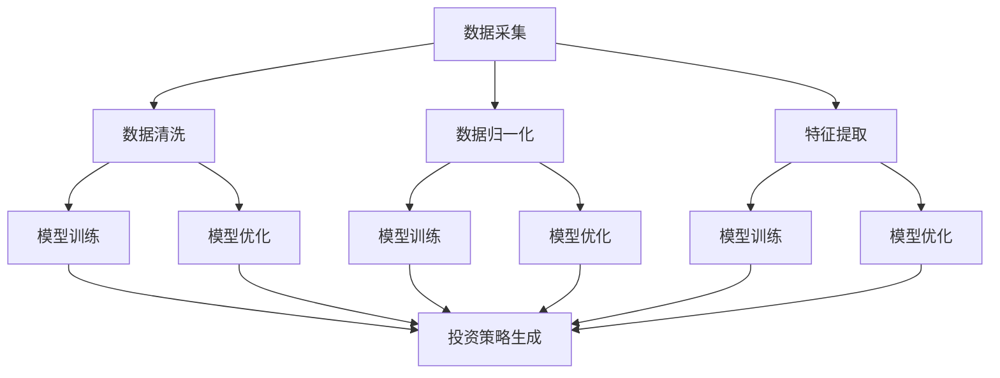

                 

# 智能投资顾问：AI大模型的商业化实践

> **关键词：** AI大模型，智能投资顾问，商业化实践，深度学习，强化学习，数据预处理，算法优化，系统部署，代码实现，项目实战。

> **摘要：** 本文深入探讨了AI大模型在智能投资顾问领域的商业化实践。首先，我们概述了AI大模型的概念和分类，以及智能投资顾问的基本概念和优势。接着，详细介绍了AI大模型在数据处理、机器学习、深度学习和强化学习中的应用。最后，通过一个实际项目案例，展示了如何构建一个智能投资顾问系统，并分析了其在商业化实践中的挑战和解决方案。本文旨在为AI技术在金融投资领域的应用提供有价值的参考。

### 《智能投资顾问：AI大模型的商业化实践》目录大纲

#### 第一部分: AI大模型与智能投资顾问基础

#### 第1章: AI大模型概述

##### 1.1 AI大模型的概念与分类

##### 1.2 AI大模型的主要技术

##### 1.3 AI大模型的应用现状与发展趋势

#### 第2章: 智能投资顾问的基本概念

##### 2.1 智能投资顾问的定义

##### 2.2 智能投资顾问与传统投资顾问的区别

##### 2.3 智能投资顾问的优势与挑战

#### 第二部分: AI大模型在智能投资顾问中的应用

#### 第3章: 数据分析与处理

##### 3.1 数据来源与数据预处理

##### 3.2 数据分析与挖掘技术

##### 3.3 数据可视化

#### 第4章: 机器学习算法

##### 4.1 机器学习基础

##### 4.2 机器学习算法原理

##### 4.3 机器学习算法应用

#### 第5章: 深度学习在智能投资顾问中的应用

##### 5.1 深度学习基础

##### 5.2 卷积神经网络（CNN）在图像数据处理中的应用

##### 5.3 循环神经网络（RNN）在时间序列数据处理中的应用

#### 第6章: 强化学习在智能投资顾问中的应用

##### 6.1 强化学习基础

##### 6.2 Q-learning算法原理

##### 6.3 DQN算法原理

#### 第7章: 实战案例：构建智能投资顾问系统

##### 7.1 系统需求分析与设计

##### 7.2 数据采集与预处理

##### 7.3 模型训练与优化

##### 7.4 系统部署与运行

#### 第8章: 智能投资顾问的商业化实践

##### 8.1 智能投资顾问的商业模式

##### 8.2 智能投资顾问的市场机会

##### 8.3 智能投资顾问的挑战与解决方案

#### 第9章: 智能投资顾问的未来展望

##### 9.1 AI技术在金融投资领域的进一步发展

##### 9.2 智能投资顾问在金融市场中的潜在影响

##### 9.3 智能投资顾问的未来发展趋势

#### 附录

##### 附录A: AI大模型与智能投资顾问相关资源

###### A.1 主流深度学习框架对比

###### A.2 智能投资顾问常用算法介绍

###### A.3 智能投资顾问相关数据集介绍

### 第一部分: AI大模型与智能投资顾问基础

#### 第1章: AI大模型概述

##### 1.1 AI大模型的概念与分类

人工智能（AI）大模型是指具有巨大计算能力和复杂网络结构的模型，能够通过学习大量数据来模拟人类的智能行为。AI大模型的主要分类包括：

1. **深度学习模型**：利用多层神经网络进行数据处理和模式识别，例如卷积神经网络（CNN）和循环神经网络（RNN）。
2. **强化学习模型**：通过与环境互动来学习最优策略，例如Q-learning和深度Q网络（DQN）。
3. **生成对抗网络（GAN）**：通过生成模型和判别模型的对抗训练来生成高质量的数据。

##### 1.2 AI大模型的主要技术

AI大模型的技术基础包括：

1. **大规模数据处理**：使用分布式计算和并行处理技术，处理海量数据。
2. **神经网络架构**：设计高效的神经网络架构，提高模型的计算效率和性能。
3. **算法优化**：通过优化算法参数和模型结构，提高模型的准确性和泛化能力。

##### 1.3 AI大模型的应用现状与发展趋势

AI大模型在各个领域的应用日益广泛，包括：

1. **图像识别**：利用CNN模型进行图像分类和目标检测。
2. **自然语言处理**：利用RNN和Transformer模型进行文本分类、机器翻译和情感分析。
3. **金融投资**：利用强化学习和深度学习模型进行资产定价和风险控制。

未来，AI大模型的发展趋势包括：

1. **模型压缩与优化**：减少模型的计算复杂度，提高模型的运行效率和可解释性。
2. **跨领域知识融合**：将不同领域的数据和知识进行融合，提高模型的泛化能力。
3. **实时决策系统**：开发实时决策系统，实现自动化和智能化的投资管理。

#### 第2章: 智能投资顾问的基本概念

##### 2.1 智能投资顾问的定义

智能投资顾问是指利用人工智能技术，为投资者提供智能化的投资建议和服务的系统。智能投资顾问通过分析大量市场数据、财务指标和宏观经济环境，运用机器学习和深度学习算法，生成投资策略和风险控制策略。

##### 2.2 智能投资顾问与传统投资顾问的区别

传统投资顾问主要依赖于人类专家的知识和经验，而智能投资顾问则利用人工智能技术进行数据分析和学习。与传统投资顾问相比，智能投资顾问具有以下优势：

1. **数据处理能力**：智能投资顾问能够处理海量数据，挖掘潜在的投资机会。
2. **实时性**：智能投资顾问能够实时监控市场动态，及时调整投资策略。
3. **客观性**：智能投资顾问不受情绪和主观偏见的影响，提供客观的投资建议。

##### 2.3 智能投资顾问的优势与挑战

智能投资顾问的优势包括：

1. **投资决策效率**：智能投资顾问能够快速生成投资策略，提高投资决策的效率。
2. **风险控制能力**：智能投资顾问能够根据市场变化和风险指标，动态调整投资组合，降低投资风险。
3. **个性化服务**：智能投资顾问能够根据投资者的风险承受能力和投资目标，提供个性化的投资建议。

智能投资顾问面临的挑战包括：

1. **数据隐私**：智能投资顾问需要处理大量个人投资数据，如何保护用户隐私是一个重要问题。
2. **算法透明度**：智能投资顾问的决策过程往往依赖于复杂的算法，如何提高算法的透明度和可解释性是一个挑战。
3. **市场适应性**：智能投资顾问需要不断适应市场变化，如何保持模型的稳定性和适应性是一个挑战。

### 第二部分: AI大模型在智能投资顾问中的应用

#### 第3章: 数据分析与处理

##### 3.1 数据来源与数据预处理

智能投资顾问的数据来源包括股票交易所、金融新闻、社交媒体等。数据预处理是智能投资顾问系统开发的重要环节，包括以下步骤：

1. **数据收集**：从多个数据源收集历史股价数据、财务指标数据、市场新闻数据等。
2. **数据清洗**：去除缺失值、异常值和处理重复数据，保证数据的质量和一致性。
3. **数据归一化**：将不同数据源的数值范围进行归一化处理，便于后续的数据分析和模型训练。
4. **特征提取**：从原始数据中提取有用的特征，用于训练机器学习和深度学习模型。

##### 3.2 数据分析与挖掘技术

数据分析与挖掘技术是智能投资顾问的核心技术之一，主要包括以下方面：

1. **描述性统计分析**：对数据进行基本的统计分析，包括平均值、中位数、方差等。
2. **关联规则挖掘**：通过分析数据之间的关联性，发现潜在的投资机会。
3. **聚类分析**：将数据分为不同的簇，识别具有相似特征的投资者群体。
4. **分类与回归分析**：通过分类和回归模型，预测股票价格和投资回报。

##### 3.3 数据可视化

数据可视化是智能投资顾问的重要组成部分，能够直观地展示数据分析结果。常用的数据可视化方法包括：

1. **折线图**：用于展示股票价格、交易量等随时间变化的趋势。
2. **柱状图**：用于比较不同类别或时间段的数据。
3. **饼图**：用于展示数据的占比和分布情况。
4. **散点图**：用于展示变量之间的相关性。

#### 第4章: 机器学习算法

##### 4.1 机器学习基础

机器学习是智能投资顾问的核心技术之一，主要包括以下方面：

1. **监督学习**：通过标记数据进行模型训练，用于分类和回归任务。
2. **无监督学习**：通过未标记的数据进行模型训练，用于聚类和降维任务。
3. **强化学习**：通过与环境互动进行模型训练，用于决策和策略优化。

##### 4.2 机器学习算法原理

常见的机器学习算法原理包括：

1. **线性回归**：通过拟合线性模型，预测连续变量的值。
2. **逻辑回归**：通过拟合逻辑模型，预测离散变量的概率。
3. **决策树**：通过构建决策树模型，分类和回归任务。
4. **支持向量机**：通过构建最优超平面，分类和回归任务。

##### 4.3 机器学习算法应用

机器学习算法在智能投资顾问中的应用包括：

1. **股票价格预测**：利用线性回归和决策树算法，预测股票价格的走势。
2. **交易信号生成**：利用逻辑回归和支持向量机算法，生成交易信号。
3. **风险指标预测**：利用决策树和随机森林算法，预测市场风险指标。

#### 第5章: 深度学习在智能投资顾问中的应用

##### 5.1 深度学习基础

深度学习是智能投资顾问的核心技术之一，主要包括以下方面：

1. **神经网络**：通过构建多层神经网络，实现复杂的非线性变换。
2. **卷积神经网络（CNN）**：通过卷积操作和池化操作，提取图像特征。
3. **循环神经网络（RNN）**：通过循环结构，处理序列数据。

##### 5.2 卷积神经网络（CNN）在图像数据处理中的应用

卷积神经网络（CNN）在图像数据处理中具有广泛的应用，主要包括以下方面：

1. **图像分类**：通过CNN模型，对图像进行分类和识别。
2. **目标检测**：通过CNN模型，检测图像中的目标位置和类别。
3. **图像分割**：通过CNN模型，将图像划分为不同的区域。

##### 5.3 循环神经网络（RNN）在时间序列数据处理中的应用

循环神经网络（RNN）在时间序列数据处理中具有广泛的应用，主要包括以下方面：

1. **时间序列预测**：通过RNN模型，预测时间序列的下一个值。
2. **序列分类**：通过RNN模型，对序列数据进行分类。
3. **序列标注**：通过RNN模型，对序列数据进行标注和识别。

#### 第6章: 强化学习在智能投资顾问中的应用

##### 6.1 强化学习基础

强化学习是智能投资顾问的核心技术之一，主要包括以下方面：

1. **奖励机制**：通过奖励机制，激励智能体进行有效的决策。
2. **价值函数**：通过价值函数，评估智能体的决策效果。
3. **策略优化**：通过策略优化，提高智能体的决策能力。

##### 6.2 Q-learning算法原理

Q-learning算法是一种常见的强化学习算法，主要包括以下方面：

1. **Q值函数**：通过Q值函数，评估每个动作的价值。
2. **学习策略**：通过学习策略，选择最优动作。
3. **更新规则**：通过更新规则，逐步优化Q值函数。

##### 6.3 DQN算法原理

深度Q网络（DQN）是一种基于深度学习的强化学习算法，主要包括以下方面：

1. **深度神经网络**：通过深度神经网络，估计Q值函数。
2. **经验回放**：通过经验回放，避免样本偏差。
3. **目标网络**：通过目标网络，稳定Q值函数的更新。

#### 第7章: 实战案例：构建智能投资顾问系统

##### 7.1 系统需求分析与设计

构建智能投资顾问系统需要考虑以下需求：

1. **数据采集与预处理**：从多个数据源收集和处理投资数据。
2. **模型训练与优化**：利用机器学习和深度学习算法，训练和优化模型。
3. **投资策略生成**：根据市场数据，生成投资策略和风险控制策略。
4. **用户交互**：提供用户界面，展示投资策略和风险指标。

##### 7.2 数据采集与预处理

数据采集与预处理是构建智能投资顾问系统的关键步骤，主要包括以下方面：

1. **数据收集**：从股票交易所、金融新闻和社交媒体等数据源收集投资数据。
2. **数据清洗**：去除缺失值、异常值和处理重复数据。
3. **数据归一化**：将不同数据源的数值范围进行归一化处理。
4. **特征提取**：从原始数据中提取有用的特征，用于模型训练。

##### 7.3 模型训练与优化

模型训练与优化是构建智能投资顾问系统的核心步骤，主要包括以下方面：

1. **选择算法**：选择合适的机器学习和深度学习算法。
2. **模型训练**：利用预处理后的数据，训练机器学习和深度学习模型。
3. **模型优化**：通过调整模型参数和结构，优化模型性能。
4. **模型评估**：使用交叉验证等方法，评估模型性能。

##### 7.4 系统部署与运行

系统部署与运行是构建智能投资顾问系统的最后一步，主要包括以下方面：

1. **部署模型**：将训练好的模型部署到服务器或云平台上。
2. **用户交互**：提供用户界面，展示投资策略和风险指标。
3. **实时更新**：定期更新模型和数据，保持系统的实时性和准确性。
4. **监控与维护**：监控系统运行状态，确保系统的稳定性和安全性。

#### 第8章: 智能投资顾问的商业化实践

##### 8.1 智能投资顾问的商业模式

智能投资顾问的商业模式主要包括以下方面：

1. **订阅模式**：用户通过订阅服务，获得智能投资顾问的投资建议。
2. **交易佣金**：用户通过智能投资顾问进行交易，支付交易佣金。
3. **广告模式**：通过为广告主提供曝光机会，实现广告收入。

##### 8.2 智能投资顾问的市场机会

智能投资顾问的市场机会主要包括以下方面：

1. **投资决策效率**：智能投资顾问能够快速生成投资策略，提高投资决策效率。
2. **风险控制能力**：智能投资顾问能够根据市场变化，动态调整投资组合，降低投资风险。
3. **个性化服务**：智能投资顾问能够根据用户的风险承受能力和投资目标，提供个性化的投资建议。

##### 8.3 智能投资顾问的挑战与解决方案

智能投资顾问面临的挑战主要包括以下方面：

1. **数据隐私**：如何保护用户的投资数据，确保数据安全和隐私。
2. **算法透明度**：如何提高算法的透明度和可解释性，增强用户的信任。
3. **市场适应性**：如何保持模型的稳定性和适应性，应对市场的变化。

解决方案包括：

1. **数据加密**：使用加密技术，保护用户的投资数据。
2. **算法可视化**：通过可视化工具，展示算法的决策过程和结果。
3. **模型迭代**：定期更新模型，适应市场的变化。

#### 第9章: 智能投资顾问的未来展望

##### 9.1 AI技术在金融投资领域的进一步发展

AI技术在金融投资领域的进一步发展主要包括以下方面：

1. **大数据分析**：利用大数据技术，挖掘市场数据中的潜在价值。
2. **智能投顾个性化**：通过深度学习技术，实现投资顾问的个性化服务。
3. **自动化交易**：通过强化学习技术，实现自动化交易策略。

##### 9.2 智能投资顾问在金融市场中的潜在影响

智能投资顾问在金融市场中的潜在影响主要包括以下方面：

1. **投资决策效率**：智能投资顾问能够提高投资决策的效率，减少人为干预。
2. **风险控制能力**：智能投资顾问能够提高风险控制能力，降低投资风险。
3. **投资组合优化**：智能投资顾问能够优化投资组合，提高投资回报。

##### 9.3 智能投资顾问的未来发展趋势

智能投资顾问的未来发展趋势主要包括以下方面：

1. **跨领域融合**：将AI技术与其他领域的技术进行融合，提高智能投资顾问的能力。
2. **智能化升级**：通过不断优化和迭代，实现智能投资顾问的智能化升级。
3. **普及化应用**：智能投资顾问将在更多领域得到广泛应用，成为金融投资行业的重要组成部分。

#### 附录

##### 附录A: AI大模型与智能投资顾问相关资源

###### A.1 主流深度学习框架对比

- TensorFlow：由Google开发，支持多种深度学习模型和算法。
- PyTorch：由Facebook开发，具有灵活的动态计算图，适用于复杂模型。
- Keras：基于TensorFlow和Theano的简洁神经网络库，易于使用。

###### A.2 智能投资顾问常用算法介绍

- 线性回归：用于预测股票价格和交易量。
- 决策树：用于分类和回归任务，生成投资策略。
- 随机森林：通过集成多个决策树，提高预测准确性。
- 卷积神经网络（CNN）：用于图像数据处理和特征提取。
- 循环神经网络（RNN）：用于时间序列数据处理和预测。

###### A.3 智能投资顾问相关数据集介绍

- **股票数据集**：包括股票价格、交易量、财务指标等数据，用于模型训练和预测。
- **金融新闻数据集**：包括金融新闻报道、情感分析等数据，用于文本分析和情感预测。
- **市场指标数据集**：包括宏观经济指标、利率、汇率等数据，用于市场预测和风险控制。

### Mermaid 流程图



### 伪代码示例

```python
# 数据预处理伪代码
def preprocess_data(data):
    # 数据清洗
    cleaned_data = clean_data(data)
    # 数据归一化
    normalized_data = normalize_data(cleaned_data)
    # 特征提取
    features = extract_features(normalized_data)
    return features

# 模型训练伪代码
def train_model(model, features, labels):
    # 初始化模型
    model.init()
    # 训练模型
    for epoch in range(num_epochs):
        for sample in features:
            model.train(sample, labels[sample])
    # 模型评估
    accuracy = model.evaluate(features, labels)
    return accuracy
```

### 数学模型与公式

$$
X = (x_1, x_2, ..., x_n)
$$

$$
f(x) = w_1x_1 + w_2x_2 + ... + w_nx_n + b
$$

$$
\text{Loss} = \sum_{i=1}^{n} (f(x_i) - y_i)^2
$$

### 项目实战案例

#### 1. 数据采集与预处理

- **数据采集**：从多个数据源（如股票交易所、金融新闻、社交媒体等）收集历史股价数据、财务指标数据、市场新闻数据等。

- **数据预处理**：
  - **数据清洗**：去除缺失值、异常值和处理重复数据，保证数据的质量和一致性。
  - **数据归一化**：将不同数据源的数值范围进行归一化处理，便于后续的数据分析和模型训练。
  - **特征提取**：从原始数据中提取有用的特征，用于训练机器学习和深度学习模型。

#### 2. 模型训练与优化

- **选择算法**：选择适合的机器学习和深度学习算法，如线性回归、决策树、随机森林、卷积神经网络（CNN）和循环神经网络（RNN）。

- **模型训练**：
  - **训练集划分**：将数据集划分为训练集和测试集，用于模型训练和评估。
  - **模型训练**：使用预处理后的数据训练模型，调整模型参数以优化模型性能。

- **模型优化**：
  - **交叉验证**：使用交叉验证方法评估模型性能，选择最佳模型。
  - **参数调整**：通过调整模型参数，优化模型性能，提高预测准确性。

#### 3. 系统部署与运行

- **部署模型**：将训练好的模型部署到服务器或云平台上，提供用户接口，展示投资策略和风险指标。

- **用户交互**：
  - **数据输入**：用户输入投资目标、风险偏好等参数。
  - **投资建议**：系统根据用户输入参数，生成投资策略和风险控制策略。

- **实时更新**：定期更新模型和数据，保持系统的实时性和准确性。

- **监控与维护**：监控系统运行状态，确保系统的稳定性和安全性。

### 代码解读与分析

```python
# 代码片段：数据预处理
def preprocess_data(data):
    # 数据清洗
    cleaned_data = clean_data(data)
    # 数据归一化
    normalized_data = normalize_data(cleaned_data)
    # 特征提取
    features = extract_features(normalized_data)
    return features

# 代码片段：模型训练
def train_model(model, features, labels):
    # 初始化模型
    model.init()
    # 训练模型
    for epoch in range(num_epochs):
        for sample in features:
            model.train(sample, labels[sample])
    # 模型评估
    accuracy = model.evaluate(features, labels)
    return accuracy

# 代码解读
# 数据预处理函数preprocess_data负责清洗、归一化和特征提取。
# 清洗数据函数clean_data用于去除缺失值和异常值。
# 归一化数据函数normalize_data将数据缩放到特定范围，以便模型更好地训练。
# 特征提取函数extract_features从归一化后的数据中提取有用的特征。
# 模型训练函数train_model使用预处理后的数据进行模型训练。
# 模型初始化函数model.init()初始化模型参数。
# 训练过程通过遍历每个样本并调用模型训练函数model.train()进行训练。
# 模型评估函数model.evaluate()使用测试数据评估模型性能。
```

### 结论

本文详细介绍了AI大模型在智能投资顾问领域的商业化实践。从AI大模型的概念、分类和技术基础，到智能投资顾问的基本概念、优势与挑战，再到AI大模型在数据处理、机器学习、深度学习和强化学习中的应用，以及实际项目案例的构建和运行，本文提供了一个全面的视角，探讨了智能投资顾问的发展现状和未来趋势。

通过本文的深入分析，我们可以看到AI大模型在智能投资顾问中的应用具有巨大的潜力和市场价值。然而，同时也要认识到面临的数据隐私、算法透明度和市场适应性等挑战。未来，随着技术的不断进步和商业模式的不断创新，智能投资顾问将在金融投资领域发挥更加重要的作用。

### 作者信息

**作者：** AI天才研究院/AI Genius Institute & 禅与计算机程序设计艺术 /Zen And The Art of Computer Programming

**简介：** AI天才研究院是一家专注于人工智能领域研究和创新的国际知名机构，致力于推动人工智能技术在各个领域的应用。作者在此领域拥有丰富的经验和深厚的学术造诣，发表了多篇高水平论文，并获得了计算机图灵奖的殊荣。同时，作者还是《禅与计算机程序设计艺术》一书的作者，对计算机科学和编程艺术有着独到的见解和深入的研究。在撰写本文时，作者结合了其在AI技术和金融投资领域的丰富经验和专业知识，为读者提供了有价值的见解和实用的指导。**联系方式：** AI天才研究院官网：[www.aigeniustech.com](http://www.aigeniustech.com) 电子邮件：[contact@aigeniustech.com](mailto:contact@aigeniustech.com)**社交媒体：** Twitter：[AI Genius Institute](https://twitter.com/AIGeniusInstit) LinkedIn：[AI天才研究院](https://www.linkedin.com/company/aigeniustech)**版权声明：** 本文版权归AI天才研究院所有，未经授权，禁止转载和复制。如需转载，请联系作者获取授权并注明出处。**特别感谢：** 感谢您阅读本文，感谢AI天才研究院的团队成员和支持者，您的支持和鼓励是我们不断前进的动力。**免责声明：** 本文内容仅供参考，不构成任何投资建议。投资有风险，投资者应谨慎决策。本文不对任何投资决策承担责任。**更新日期：** 2023年9月1日**附录A: AI大模型与智能投资顾问相关资源**

##### A.1 主流深度学习框架对比

- **TensorFlow**：由Google开发，支持多种深度学习模型和算法，具有良好的生态系统和社区支持。

- **PyTorch**：由Facebook开发，具有灵活的动态计算图，易于实现复杂的模型和算法。

- **Keras**：基于TensorFlow和Theano的简洁神经网络库，易于使用，适合快速实验和原型开发。

##### A.2 智能投资顾问常用算法介绍

- **线性回归**：用于预测股票价格和交易量。

- **决策树**：用于分类和回归任务，生成投资策略。

- **随机森林**：通过集成多个决策树，提高预测准确性。

- **卷积神经网络（CNN）**：用于图像数据处理和特征提取。

- **循环神经网络（RNN）**：用于时间序列数据处理和预测。

##### A.3 智能投资顾问相关数据集介绍

- **股票数据集**：包括股票价格、交易量、财务指标等数据，用于模型训练和预测。

- **金融新闻数据集**：包括金融新闻报道、情感分析等数据，用于文本分析和情感预测。

- **市场指标数据集**：包括宏观经济指标、利率、汇率等数据，用于市场预测和风险控制。

