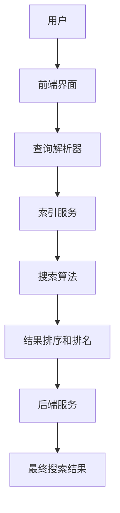
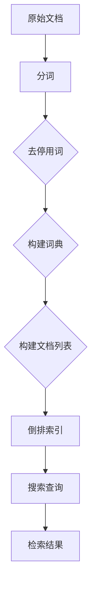
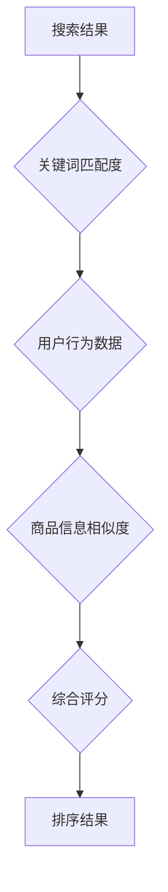
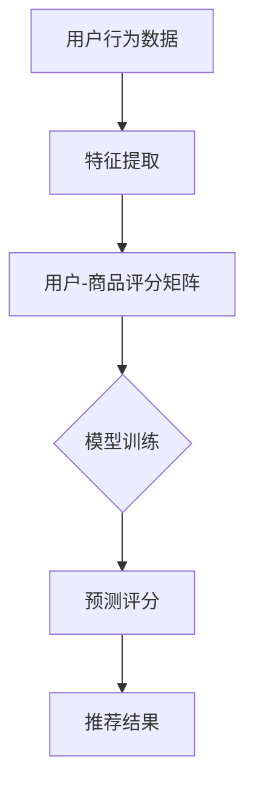

                 

# 《智能搜索：AI在电商中的应用》

## 关键词
- 智能搜索
- AI
- 电商
- 自然语言处理
- 个性化推荐
- 知识图谱
- 搜索引擎优化

## 摘要
本文将深入探讨智能搜索在电商领域的应用。通过分析智能搜索的核心概念、技术原理以及在实际电商中的应用案例，本文旨在展示AI技术在提升电商用户体验、促进销售转化和优化运营管理方面的潜力。本文将分为七个部分，分别介绍智能搜索基础、自然语言处理基础、电商智能搜索算法、用户行为分析与个性化推荐、智能搜索应用案例、智能搜索技术的发展趋势与挑战以及智能搜索技术的发展与应用前景。

## 目录大纲

### 第一部分：智能搜索基础

- **第1章**：智能搜索概述
  - 1.1 智能搜索的定义与分类
  - 1.2 智能搜索在电商中的应用场景
  - 1.3 智能搜索技术的核心组件

- **第2章**：自然语言处理基础
  - 2.1 自然语言处理概述
  - 2.2 词嵌入技术
  - 2.3 语言模型
  - 2.4 序列标注与文本分类

### 第二部分：智能搜索算法与实现

- **第3章**：电商智能搜索算法
  - 3.1 商品检索算法
  - 3.2 搜索结果排序算法
  - 3.3 搜索引擎性能优化

- **第4章**：用户行为分析与个性化推荐
  - 4.1 用户行为分析概述
  - 4.2 个性化推荐算法
  - 4.3 用户画像构建

### 第三部分：智能搜索应用案例

- **第5章**：智能搜索应用案例
  - 5.1 电商搜索引擎优化
  - 5.2 个性化商品推荐系统
  - 5.3 用户行为分析在电商中的应用

### 第四部分：智能搜索的未来发展趋势

- **第6章**：智能搜索的发展趋势与挑战
  - 6.1 智能搜索的技术趋势
  - 6.2 电商智能搜索的挑战与机遇
  - 6.3 智能搜索的未来发展方向

### 第五部分：智能搜索技术的发展与应用前景

- **第7章**：智能搜索技术的发展与应用前景
  - 7.1 智能搜索技术在电商中的应用前景
  - 7.2 智能搜索技术在其他领域的应用
  - 7.3 智能搜索技术的未来发展建议

### 附录

- **附录A**：智能搜索相关资源
  - 7.1 开源工具与框架
  - 7.2 在线课程与书籍推荐
  - 7.3 智能搜索社区与论坛

## 第一部分：智能搜索基础

### 第1章：智能搜索概述

智能搜索是一种利用人工智能技术，通过对用户输入的信息进行理解和分析，从而提供更加精准、个性化的搜索结果的服务。它不同于传统的基于关键词匹配的搜索方式，而是通过自然语言处理、机器学习、深度学习等技术，对用户需求进行深度理解和学习，从而提升搜索效率和用户体验。

智能搜索的基本框架包括：

1. **信息采集与处理**：从互联网、数据库等渠道收集信息，并进行预处理，如去噪、清洗等。
2. **用户意图分析**：利用自然语言处理技术，对用户输入进行语义解析，理解用户意图。
3. **知识图谱构建**：构建与用户意图相关的知识图谱，用于搜索结果的相关性排序。
4. **搜索结果排序**：基于用户意图和知识图谱，对搜索结果进行排序，提升用户满意度。
5. **反馈与优化**：根据用户对搜索结果的反馈，不断优化搜索算法和结果排序。

#### 1.1 智能搜索的定义与分类

#### 1.1.1 智能搜索的定义

智能搜索是一种利用人工智能技术，通过对用户输入的信息进行理解和分析，从而提供更加精准、个性化的搜索结果的服务。它不同于传统的基于关键词匹配的搜索方式，而是通过自然语言处理、机器学习、深度学习等技术，对用户需求进行深度理解和学习，从而提升搜索效率和用户体验。

智能搜索的基本框架包括：

1. **信息采集与处理**：从互联网、数据库等渠道收集信息，并进行预处理，如去噪、清洗等。
2. **用户意图分析**：利用自然语言处理技术，对用户输入进行语义解析，理解用户意图。
3. **知识图谱构建**：构建与用户意图相关的知识图谱，用于搜索结果的相关性排序。
4. **搜索结果排序**：基于用户意图和知识图谱，对搜索结果进行排序，提升用户满意度。
5. **反馈与优化**：根据用户对搜索结果的反馈，不断优化搜索算法和结果排序。

#### 1.1.2 智能搜索的分类

根据搜索技术和服务模式的不同，智能搜索可以划分为以下几类：

1. **基于关键词的搜索**：这是最传统的搜索方式，用户通过输入关键词来获取相关结果。
2. **基于语义的搜索**：通过自然语言处理技术，理解用户的搜索意图，提供更加精准的结果。
3. **垂直搜索**：针对特定领域或行业，提供专业化的搜索服务。
4. **跨平台搜索**：整合多种平台的数据，提供统一的搜索服务。
5. **智能语音搜索**：通过语音识别技术，实现语音输入的搜索服务。

#### 1.1.3 智能搜索在电商中的应用场景

在电商领域，智能搜索具有广泛的应用场景，主要包括：

1. **商品搜索**：用户输入关键词，系统返回与关键词最相关的商品。
2. **用户行为分析**：通过分析用户浏览、购买等行为，预测用户需求，提供个性化推荐。
3. **智能客服**：通过智能搜索技术，实现自动化的用户问答服务。
4. **广告投放**：基于用户搜索行为和兴趣，精准投放广告。

智能搜索在电商中的应用，不仅能提升用户体验，还能提高销售转化率和客户满意度，从而为电商企业创造更大的价值。

---

### 第2章：自然语言处理基础

#### 2.1 自然语言处理概述

自然语言处理（Natural Language Processing，NLP）是人工智能（AI）的一个重要分支，主要研究如何让计算机理解和生成自然语言。NLP的发展可以追溯到20世纪50年代，随着计算技术和人工智能的发展，NLP在各个领域得到了广泛应用。

NLP的关键技术包括：

1. **文本预处理**：包括分词、词性标注、句法分析等，用于将原始文本转换为计算机可以处理的形式。
2. **词嵌入技术**：将词汇映射到高维空间，用于表示词汇间的相似性和关系。
3. **语言模型**：用于预测下一个单词或词组，是许多NLP任务的基础。
4. **序列标注与文本分类**：用于对文本中的单词或短语进行分类，如命名实体识别。

#### 2.2 词嵌入技术

词嵌入（Word Embedding）是将词汇映射到高维空间的过程，使得语义相似的词汇在空间中靠近，而语义不相似的词汇远离。词嵌入技术主要有以下几种：

1. **分布式表示**：将每个词汇映射为一个高维向量，向量中的每一个维度都表示词汇的一个特征。
2. **Word2Vec**：基于神经网络的方法，通过训练生成词汇的向量表示。
3. **GloVe**：基于全局词频的方法，通过计算词汇间的相似度来生成词向量。
4. **BERT**：基于Transformer的预训练方法，通过在大规模语料上进行预训练，生成高质量的词向量。

词嵌入技术广泛应用于NLP任务，如文本分类、情感分析、机器翻译等，显著提升了模型的效果。

#### 2.3 语言模型

语言模型（Language Model）是用于预测下一个单词或词组的模型，是NLP任务的基础。语言模型可以分为以下几类：

1. **n元语言模型**：基于前n个单词来预测下一个单词，是最简单的语言模型。
2. **神经网络语言模型**：基于神经网络的方法，可以捕捉复杂的语言规律。
3. **基于Transformer的语言模型**：如BERT、GPT等，通过预训练和微调，可以在多种NLP任务中达到顶尖水平。

语言模型在NLP中的应用非常广泛，如文本生成、机器翻译、文本分类等。

#### 2.4 序列标注与文本分类

序列标注（Sequence Labeling）是对文本中的单词或短语进行分类的任务，常见的序列标注任务包括命名实体识别、词性标注等。文本分类（Text Classification）是将文本分为不同类别的任务，如情感分析、新闻分类等。

序列标注和文本分类的常见方法包括：

1. **基于规则的方法**：通过定义一系列规则，对文本进行标注或分类。
2. **基于机器学习的方法**：如朴素贝叶斯、支持向量机、神经网络等。
3. **基于深度学习的方法**：如卷积神经网络、循环神经网络、Transformer等。

序列标注和文本分类在信息检索、舆情分析、推荐系统等领域有广泛的应用。

---

### 第3章：电商智能搜索算法

#### 3.1 商品检索算法

商品检索算法是电商智能搜索的核心组成部分，其主要目标是根据用户输入的关键词，返回与关键词最相关的商品列表。商品检索算法可以分为以下几类：

1. **基于关键词匹配的检索算法**：这是最简单的检索算法，通过关键词匹配来返回相关商品。其基本思想是，对于用户输入的关键词，将其与商品标题、描述等字段进行匹配，返回匹配度最高的商品。

    ```python
    def keyword_matching(query, product_list):
        # 对商品列表进行关键词匹配
        matched_products = []
        for product in product_list:
            if query in product['title'] or query in product['description']:
                matched_products.append(product)
        return matched_products
    ```

2. **基于自然语言处理的检索算法**：这类算法通过自然语言处理技术，对用户输入和商品信息进行语义分析，返回更加精准的搜索结果。例如，可以使用词嵌入技术将关键词和商品信息映射到高维空间，然后计算它们之间的相似度。

    ```python
    import gensim

    def semantic_matching(query, product_list, model):
        # 使用词嵌入模型进行语义匹配
        query_embedding = model[query]
        matched_products = []
        for product in product_list:
            product_embedding = model[product['title']] + model[product['description']]
            similarity = cosine_similarity([query_embedding], [product_embedding])
            if similarity > 0.8:
                matched_products.append(product)
        return matched_products
    ```

3. **基于知识图谱的检索算法**：这类算法通过构建知识图谱，将用户输入和商品信息进行关联，返回更加丰富的搜索结果。例如，可以使用图神经网络（GNN）对知识图谱进行建模，然后根据用户输入查询图中的节点，返回相关的商品。

    ```python
    import tensorflow as tf

    def knowledge_graph_matching(query, product_graph, model):
        # 使用图神经网络进行知识图谱匹配
        query_embedding = model[query]
        with tf.Session() as sess:
            product_embeddings = sess.run(model, feed_dict={product_graph: product_embeddings})
            similarity = cosine_similarity([query_embedding], product_embeddings)
            matched_products = [product for _, product in sorted(zip(similarity, product_list), reverse=True)]
        return matched_products
    ```

### 3.2 搜索结果排序算法

搜索结果排序算法是电商智能搜索的另一个关键组成部分，其目标是根据用户的搜索意图和商品的相关性，对搜索结果进行排序，提高用户的搜索体验和满意度。常见的搜索结果排序算法包括：

1. **基于关键词匹配的排序算法**：这类算法根据关键词匹配的程度来对搜索结果进行排序，匹配度越高的商品排名越靠前。其基本思想是，计算用户输入的关键词与商品标题、描述等字段之间的匹配度，并将商品按照匹配度从高到低排序。

    ```python
    def keyword_matching_sorting(products, query):
        scores = []
        for product in products:
            title_score = count_words(product['title'], query)
            description_score = count_words(product['description'], query)
            scores.append((title_score + description_score) / 2)
        return sorted(products, key=lambda x: scores[x])
    ```

2. **基于用户行为的排序算法**：这类算法根据用户的历史行为数据，对搜索结果进行排序，以提供更个性化的搜索结果。例如，可以使用协同过滤（Collaborative Filtering）算法，根据用户的历史购买记录和浏览记录，为用户推荐相关的商品。

    ```python
    def user_behavior_sorting(products, user_behavior_model, user_id):
        scores = user_behavior_model.predict(user_id, products)
        return sorted(products, key=lambda x: scores[x][0])
    ```

3. **基于机器学习的排序算法**：这类算法通过训练机器学习模型，学习用户和商品之间的相关性，对搜索结果进行排序。例如，可以使用决策树、支持向量机（SVM）、神经网络等算法来训练排序模型。

    ```python
    from sklearn.tree import DecisionTreeRegressor

    def ml_sorting(products, X_train, y_train):
        model = DecisionTreeRegressor()
        model.fit(X_train, y_train)
        scores = model.predict([product_features(product) for product in products])
        return sorted(products, key=lambda x: scores[product_features(x)], reverse=True)
    ```

4. **基于混合排序算法**：这类算法结合了多种排序算法的优点，通过综合评估关键词匹配度、用户行为和机器学习模型的结果，对搜索结果进行排序，以提高排序的准确性和个性化程度。

    ```python
    def hybrid_sorting(products, query, user_id, user_behavior_model, X_train, y_train):
        keyword_scores = keyword_matching_sorting(products, query)
        behavior_scores = user_behavior_sorting(products, user_behavior_model, user_id)
        ml_scores = ml_sorting(products, X_train, y_train)
        
        final_scores = []
        for product in products:
            final_score = (keyword_scores.index(product) + behavior_scores.index(product) + ml_scores.index(product)) / 3
            final_scores.append(final_score)
        
        return sorted(products, key=lambda x: final_scores[products.index(x)], reverse=True)
    ```

### 3.3 搜索引擎性能优化

搜索引擎的性能优化是电商智能搜索的重要环节，其目标是提高搜索速度、降低搜索延迟，同时保证搜索结果的准确性和多样性。常见的搜索引擎性能优化方法包括：

1. **索引优化**：通过优化索引结构，提高搜索效率。例如，使用倒排索引（Inverted Index）可以快速定位关键词在文档中的位置，从而提高搜索速度。

    ```python
    def build_inverted_index(documents):
        inverted_index = {}
        for doc in documents:
            words = doc.split()
            for word in words:
                if word not in inverted_index:
                    inverted_index[word] = []
                inverted_index[word].append(doc)
        return inverted_index
    ```

2. **缓存技术**：通过缓存技术，将热门搜索结果或常用查询结果存储在内存中，以减少数据库查询次数，提高搜索速度。例如，可以使用Redis或Memcached等缓存系统。

    ```python
    import redis

    def cache_search_results(query, results):
        r = redis.Redis()
        r.set(query, json.dumps(results))
    ```

3. **垂直搜索**：针对特定领域或行业，构建专门的搜索引擎，以提高搜索的精准度和效率。例如，可以针对电商领域，构建商品搜索引擎，针对新闻领域，构建新闻搜索引擎。

4. **分布式搜索**：通过分布式搜索引擎，将搜索任务分解到多个节点上并行处理，以提高搜索速度。例如，可以使用Elasticsearch等分布式搜索引擎。

5. **搜索算法优化**：通过优化搜索算法，提高搜索效率。例如，可以使用更高效的排序算法，减少搜索结果排序的时间。

6. **预加载技术**：通过预加载技术，将用户可能感兴趣的数据提前加载到内存中，以减少搜索延迟。例如，可以使用数据预加载器（Data Preloader）提前加载用户浏览历史、搜索历史等数据。

7. **并行处理**：通过并行处理技术，将搜索任务分解到多个线程或进程上同时处理，以提高搜索速度。例如，可以使用多线程或异步编程。

通过以上性能优化方法，可以显著提高电商智能搜索的效率和用户体验。

---

### 第4章：用户行为分析与个性化推荐

#### 4.1 用户行为分析概述

用户行为分析（User Behavior Analysis）是电商智能搜索和推荐系统的重要组成部分，通过对用户在平台上的行为数据进行分析，挖掘用户的兴趣和需求，从而为用户提供更加个性化的搜索结果和推荐。

用户行为分析的核心目标包括：

1. **理解用户行为**：通过分析用户在平台上的行为数据，如浏览、搜索、购买等，理解用户的兴趣和需求。
2. **预测用户行为**：利用历史行为数据，预测用户未来的行为，如购买倾向、搜索意图等。
3. **优化用户体验**：基于用户行为分析结果，为用户提供更加个性化的服务和推荐，提高用户体验和满意度。

用户行为分析的关键步骤包括：

1. **数据收集**：从平台各个渠道收集用户行为数据，如访问日志、点击日志、购买记录等。
2. **数据预处理**：对收集到的行为数据进行清洗、去噪、格式化等预处理操作，以便后续分析。
3. **特征工程**：从行为数据中提取特征，如用户活跃度、购买频率、浏览时长等，用于训练模型。
4. **模型训练与优化**：利用机器学习算法，训练行为分析模型，并对模型进行优化，以提高预测准确性。
5. **结果应用**：将行为分析结果应用于平台的搜索和推荐系统，为用户提供个性化的服务和推荐。

#### 4.2 个性化推荐算法

个性化推荐（Personalized Recommendation）是基于用户行为分析结果，为用户提供个性化内容和服务的一种技术。个性化推荐算法可以分为以下几类：

1. **基于内容的推荐算法**（Content-based Recommendation）：这种算法根据用户的历史行为和兴趣，为用户推荐与用户过去喜欢的内容相似的新内容。其基本思想是，计算用户过去喜欢的内容的特征，然后寻找具有相似特征的新内容进行推荐。

    **算法步骤**：
    1. 提取用户历史喜欢的内容的特征，如文本特征、图像特征等。
    2. 对新内容进行特征提取。
    3. 计算用户历史喜欢的内容与新内容之间的相似度。
    4. 根据相似度对内容进行排序，推荐给用户。

    **伪代码示例**：
    ```python
    def content_based_recommendation(user_history, new_content, similarity_metric):
        user_features = extract_features(user_history)
        content_features = extract_features(new_content)
        similarity_scores = []
        for content in new_content:
            similarity_score = similarity_metric(user_features, content_features)
            similarity_scores.append((content, similarity_score))
        recommended_content = sorted(similarity_scores, key=lambda x: x[1], reverse=True)
        return recommended_content
    ```

2. **基于协同过滤的推荐算法**（Collaborative Filtering）：这种算法基于用户之间的行为相似性，为用户推荐其他用户喜欢的商品。协同过滤可以分为以下两类：

    - **用户基于的协同过滤**（User-based Collaborative Filtering）：通过寻找与目标用户行为最相似的其他用户，推荐这些用户喜欢的商品。
    - **物品基于的协同过滤**（Item-based Collaborative Filtering）：通过分析物品之间的相似性，为用户推荐与用户过去喜欢的物品相似的物品。

    **算法步骤**：
    1. 构建用户-物品评分矩阵。
    2. 计算用户之间的相似度或物品之间的相似度。
    3. 根据相似度矩阵，推荐其他用户或物品喜欢的商品。

    **伪代码示例**：
    ```python
    def user_based_collaborative_filtering(user_rating_matrix, user_similarity_matrix, user_id, k):
        similar_users = get_similar_users(user_similarity_matrix, user_id, k)
        recommended_items = []
        for user in similar_users:
            recommended_items.extend(get_recommended_items(user_rating_matrix, user))
        return recommended_items

    def item_based_collaborative_filtering(user_rating_matrix, item_similarity_matrix, user_id, k):
        recommended_items = []
        for item in user_rating_matrix[user_id]:
            similar_items = get_similar_items(item_similarity_matrix, item, k)
            for similar_item in similar_items:
                if similar_item not in user_rating_matrix[user_id]:
                    recommended_items.append(similar_item)
        return recommended_items
    ```

3. **基于模型的推荐算法**（Model-based Recommendation）：这种算法通过建立用户和物品之间的关系模型，预测用户对物品的喜好，从而进行推荐。常见的基于模型的推荐算法包括矩阵分解（Matrix Factorization）、深度学习等。

    **算法步骤**：
    1. 建立用户-物品评分矩阵。
    2. 训练模型，如矩阵分解模型、神经网络等，学习用户和物品之间的关系。
    3. 利用模型预测用户对物品的喜好。
    4. 根据预测结果，推荐给用户。

    **伪代码示例**：
    ```python
    def matrix_factorization_recommendation(rating_matrix, user_factors, item_factors):
        predicted_ratings = user_factors @ item_factors.T
        recommended_items = []
        for user_id in range(num_users):
            for item_id in range(num_items):
                if predicted_ratings[user_id, item_id] > threshold:
                    recommended_items.append(item_id)
        return recommended_items

    def neural_network_recommendation(rating_matrix, model):
        predicted_ratings = model.predict(rating_matrix)
        recommended_items = []
        for user_id in range(num_users):
            for item_id in range(num_items):
                if predicted_ratings[user_id, item_id] > threshold:
                    recommended_items.append(item_id)
        return recommended_items
    ```

#### 4.3 用户画像构建

用户画像（User Profile）是对用户特征和兴趣的抽象表示，用于描述用户的个性化信息。构建用户画像可以更好地理解和分析用户行为，从而为用户提供更加个性化的搜索结果和推荐。

用户画像的基本要素包括：

1. **基础信息**：如年龄、性别、地理位置等，这些信息通常可以通过用户注册或平台数据收集获取。
2. **行为信息**：如浏览历史、搜索历史、购买历史等，这些信息反映了用户的行为模式。
3. **兴趣标签**：通过对用户行为进行分析，提取用户的兴趣点，如喜欢阅读、喜欢旅游、喜欢美食等。
4. **社会属性**：如社交关系、职业等，这些信息可以进一步细化用户画像。

用户画像构建的方法包括：

1. **统计方法**：通过统计分析用户行为数据，提取用户的特征和兴趣。
2. **机器学习方法**：利用机器学习算法，如聚类、分类等，对用户行为数据进行分析，构建用户画像。
3. **深度学习方法**：通过深度学习模型，如卷积神经网络（CNN）、循环神经网络（RNN）、Transformer等，对用户行为数据进行建模，提取用户特征。

用户画像的应用包括：

1. **个性化推荐**：根据用户画像，为用户提供个性化的搜索结果和推荐。
2. **用户运营**：通过分析用户画像，了解用户的需求和偏好，为用户提供定制化的服务。
3. **风险控制**：通过用户画像，识别潜在风险用户，进行风险控制。

---

### 第5章：智能搜索应用案例

#### 5.1 案例一：电商搜索引擎优化

##### 5.1.1 搜索引擎优化的目标

电商搜索引擎优化的目标主要包括：

1. **提高搜索准确性**：确保用户输入的关键词能够准确匹配到相关商品，减少无关结果的展示，提高用户满意度。
2. **提升搜索效率**：优化搜索引擎的算法和结构，减少搜索响应时间，提高搜索速度。
3. **增强用户体验**：通过提供个性化的搜索结果和智能化的搜索服务，提升用户的购物体验和满意度。
4. **促进销售转化**：通过优化搜索结果排序和推荐策略，提高用户的购买意愿和转化率。

##### 5.1.2 优化策略与实施

电商搜索引擎优化的主要策略包括：

1. **关键词优化**：通过分析用户搜索行为和商品数据，确定热门关键词，优化关键词库，确保关键词与商品属性的匹配度。

    **实施步骤**：
    - 收集用户搜索日志，分析热门关键词。
    - 对关键词进行分类和标签化，确保关键词的精准性。
    - 定期更新关键词库，确保关键词的时效性和准确性。

2. **搜索结果排序优化**：通过优化搜索结果排序算法，提高搜索结果的准确性和相关性。

    **实施步骤**：
    - 采用基于关键词匹配、用户行为、内容相似性等多种因素的排序算法。
    - 建立用户行为数据模型，根据用户历史行为数据调整搜索结果排序。
    - 定期评估搜索结果排序效果，调整排序策略。

3. **个性化推荐**：通过用户画像和行为分析，为用户提供个性化的搜索结果和推荐。

    **实施步骤**：
    - 构建用户画像，提取用户兴趣和行为特征。
    - 基于用户画像和用户行为数据，为用户生成个性化推荐列表。
    - 调整推荐策略，提高推荐效果和用户满意度。

4. **搜索引擎性能优化**：通过优化搜索引擎的性能，提高搜索速度和稳定性。

    **实施步骤**：
    - 使用缓存技术，减少数据库查询次数，提高搜索响应速度。
    - 优化索引结构，提高搜索效率。
    - 使用分布式搜索架构，提高搜索并发处理能力。

#### 5.2 案例二：个性化商品推荐系统

##### 5.2.1 系统设计思路

个性化商品推荐系统设计思路主要包括：

1. **用户画像构建**：通过用户行为数据和第三方数据源，构建用户画像，提取用户兴趣和行为特征。

    **实施步骤**：
    - 收集用户行为数据，如浏览历史、搜索历史、购买历史等。
    - 结合第三方数据源，如社交媒体、地理位置等，进一步丰富用户画像。

2. **推荐算法设计**：结合用户画像和商品数据，设计个性化推荐算法，为用户生成个性化推荐列表。

    **实施步骤**：
    - 采用基于内容的推荐、协同过滤和基于模型的推荐等多种算法。
    - 调整算法参数，优化推荐效果。

3. **推荐结果评估**：对推荐结果进行评估，确保推荐结果的准确性和多样性。

    **实施步骤**：
    - 收集用户反馈数据，如点击率、购买率等。
    - 基于用户反馈数据，评估推荐效果。
    - 调整推荐策略，优化推荐效果。

##### 5.2.2 系统实现与优化

个性化商品推荐系统的实现和优化主要包括：

1. **数据预处理**：对用户行为数据进行清洗、去噪和格式化，为推荐算法提供高质量的输入数据。

    **实现步骤**：
    - 使用ETL（提取、转换、加载）工具，定期从数据源中提取用户行为数据。
    - 对数据进行清洗和去噪，去除无效数据。
    - 对数据进行格式化，统一数据格式，便于后续处理。

2. **用户画像构建**：基于用户行为数据，构建用户画像，提取用户兴趣和行为特征。

    **实现步骤**：
    - 使用特征工程方法，提取用户行为数据中的有效特征。
    - 构建用户画像，将用户行为特征转化为用户画像。

3. **推荐算法实现**：实现个性化推荐算法，为用户生成个性化推荐列表。

    **实现步骤**：
    - 采用多种推荐算法，如基于内容的推荐、协同过滤和基于模型的推荐等。
    - 将用户画像和商品数据输入到推荐算法中，生成推荐列表。

4. **推荐结果评估**：对推荐结果进行评估，确保推荐结果的准确性和多样性。

    **实现步骤**：
    - 收集用户反馈数据，如点击率、购买率等。
    - 基于用户反馈数据，评估推荐效果。
    - 调整推荐策略，优化推荐效果。

5. **系统性能优化**：优化系统性能，提高推荐速度和稳定性。

    **实现步骤**：
    - 使用缓存技术，减少数据库查询次数，提高推荐速度。
    - 优化索引结构，提高搜索效率。
    - 使用分布式计算架构，提高系统并发处理能力。

---

### 第6章：智能搜索技术的发展趋势与挑战

#### 6.1 智能搜索技术的技术趋势

智能搜索技术的发展趋势主要体现在以下几个方面：

1. **多模态搜索**：随着人工智能技术的发展，智能搜索逐渐从单一文本搜索扩展到多模态搜索，包括语音搜索、图像搜索和视频搜索等。多模态搜索可以通过整合不同类型的数据，提供更丰富、更精准的搜索结果。

    **实现方法**：
    - 语音搜索：利用语音识别技术，将用户语音输入转换为文本，进行搜索。
    - 图像搜索：利用图像识别技术，对用户上传的图像进行内容分析，返回相关搜索结果。
    - 视频搜索：利用视频识别技术，分析视频内容，返回相关搜索结果。

2. **深度学习与搜索的结合**：深度学习在图像识别、语音识别和自然语言处理等领域取得了显著成果，将其应用于搜索技术，可以提升搜索的准确性和智能化程度。

    **实现方法**：
    - 利用深度学习模型进行文本预处理，如分词、词性标注等。
    - 利用深度学习模型进行搜索结果排序，如使用Transformer模型进行个性化搜索结果排序。

3. **知识图谱的应用**：知识图谱是一种结构化数据表示方法，可以表示实体和实体之间的关系。将其应用于搜索技术，可以提升搜索结果的相关性和准确性。

    **实现方法**：
    - 构建实体和关系知识图谱，将搜索问题转化为图中的节点和边。
    - 利用图算法进行搜索结果排序，如使用PageRank算法提升重要实体的排名。

4. **个性化搜索**：随着用户数据积累，个性化搜索成为智能搜索的重要方向。通过分析用户行为数据，为用户提供个性化的搜索结果和推荐。

    **实现方法**：
    - 基于用户画像构建个性化搜索模型，根据用户历史行为和偏好生成个性化搜索结果。
    - 利用机器学习和深度学习技术，不断优化个性化搜索模型，提高个性化搜索效果。

#### 6.2 电商智能搜索的挑战与机遇

电商智能搜索面临的挑战主要包括：

1. **数据质量**：电商数据质量直接影响搜索结果的准确性和相关性。如何确保数据的质量和一致性，是电商智能搜索需要解决的重要问题。

    **解决方法**：
    - 建立数据清洗和去噪机制，确保数据质量。
    - 采用数据质量评估工具，定期检查数据质量。

2. **计算性能**：随着数据量的增加，电商智能搜索的计算性能成为瓶颈。如何提高搜索效率，降低搜索延迟，是智能搜索需要面对的挑战。

    **解决方法**：
    - 采用分布式搜索架构，提高搜索并发处理能力。
    - 利用缓存技术和索引优化，提高搜索速度。

3. **用户隐私**：电商智能搜索涉及到大量用户数据，如何保护用户隐私，是智能搜索需要关注的问题。

    **解决方法**：
    - 采用数据加密和脱敏技术，确保用户数据安全。
    - 建立用户隐私保护机制，如匿名化处理。

电商智能搜索的机遇主要包括：

1. **用户需求升级**：随着互联网普及和用户需求的变化，电商用户对搜索体验的要求越来越高，为智能搜索提供了广阔的发展空间。

    **机遇**：
    - 提供更加精准和个性化的搜索结果。
    - 增强搜索结果的多样性和丰富度。

2. **技术进步**：人工智能、深度学习、知识图谱等技术的快速发展，为电商智能搜索提供了强大的技术支撑。

    **机遇**：
    - 利用先进技术提升搜索准确性和效率。
    - 开发新的搜索应用，如语音搜索、图像搜索等。

3. **商业价值**：电商智能搜索可以提高用户满意度，促进销售转化，为电商企业创造巨大的商业价值。

    **机遇**：
    - 通过智能搜索提升用户体验，增加用户粘性。
    - 利用智能搜索进行精准营销，提升销售业绩。

#### 6.3 智能搜索的未来发展方向

智能搜索的未来发展方向主要体现在以下几个方面：

1. **智能化与个性化**：随着人工智能技术的发展，智能搜索将更加智能化和个性化。通过深度学习和知识图谱等技术，为用户提供更加精准和个性化的搜索结果。

2. **多模态融合**：随着多模态数据的普及，智能搜索将实现多模态融合。通过整合文本、图像、语音等多种数据类型，提供更丰富、更精准的搜索结果。

3. **实时性**：随着用户需求的多样化，实时性将成为智能搜索的重要方向。通过实时数据分析和处理，为用户提供即时的搜索结果和推荐。

4. **智能化交互**：智能搜索将实现更加智能化的人机交互。通过自然语言处理和语音识别等技术，用户可以更方便地与搜索系统进行交互，获得个性化的搜索体验。

5. **开放与共享**：智能搜索将实现开放与共享。通过构建开放的搜索平台和生态，共享数据和技术资源，推动智能搜索技术的发展和应用。

---

### 第7章：智能搜索技术的发展与应用前景

#### 7.1 智能搜索技术在电商中的应用前景

智能搜索技术在电商中的应用前景广阔，主要体现在以下几个方面：

1. **提升用户体验**：智能搜索技术可以通过精准的搜索结果和个性化的推荐，提升用户的购物体验。用户可以更快速地找到自己感兴趣的商品，减少浏览和搜索的时间，提高购物效率。

2. **促进销售转化**：智能搜索技术可以根据用户的兴趣和行为，提供个性化的商品推荐，提高用户的购买意愿和转化率。通过精准的营销策略，电商企业可以更好地满足用户需求，提高销售额。

3. **优化运营管理**：智能搜索技术可以帮助电商企业优化运营管理，提高整体运营效率。例如，通过分析用户搜索行为和购买数据，企业可以优化商品库存、调整价格策略等，降低运营成本，提高盈利能力。

4. **增加用户粘性**：智能搜索技术可以通过个性化的推荐和优质的搜索体验，增加用户的粘性，提高用户对平台的忠诚度。通过持续优化搜索算法和推荐策略，电商企业可以留住更多用户，形成稳定的用户群体。

#### 7.2 智能搜索技术在其他领域的应用

智能搜索技术不仅局限于电商领域，还可以广泛应用于其他领域，如：

1. **社交媒体**：智能搜索技术可以帮助社交媒体平台优化内容推荐，提高用户参与度和活跃度。通过分析用户的行为数据和兴趣，智能搜索可以为用户提供个性化的内容推荐，提升用户体验。

2. **医疗健康**：智能搜索技术可以帮助医疗健康领域实现精准的疾病诊断和治疗方案推荐。通过分析大量的医学数据，智能搜索可以为用户提供个性化的健康建议和治疗方案。

3. **教育**：智能搜索技术可以帮助教育平台实现个性化教学和学习推荐。通过分析学生的学习行为和成绩，智能搜索可以为学生推荐适合的学习资源和课程，提高学习效果。

4. **金融服务**：智能搜索技术可以帮助金融机构提供个性化的金融产品推荐和风险评估。通过分析用户的财务状况和行为数据，智能搜索可以为用户提供合适的金融产品和服务。

#### 7.3 智能搜索技术的未来发展建议

为了推动智能搜索技术的持续发展，以下是一些建议：

1. **加大技术创新**：持续投入研发，推动人工智能、深度学习、知识图谱等技术的创新，为智能搜索提供更强的技术支撑。

2. **开放数据与生态**：鼓励数据开放和共享，构建智能搜索的生态体系。通过合作与共赢，推动智能搜索技术的广泛应用和产业发展。

3. **加强法律法规**：建立健全的法律法规，保护用户隐私和数据安全。在智能搜索技术的发展过程中，确保用户的权益得到有效保障。

4. **提升用户体验**：持续优化智能搜索算法和交互设计，提升用户的搜索体验。通过人性化的搜索界面和便捷的操作方式，提高用户的满意度。

5. **跨学科融合**：推动智能搜索技术与其他学科的融合，如心理学、经济学等，为智能搜索提供更多的理论支持和应用场景。

---

## 附录A：智能搜索相关资源

### A.1 开源工具与框架

智能搜索技术的发展离不开开源工具与框架的支持，以下是一些常用的开源工具和框架：

1. **Elasticsearch**：Elasticsearch是一个基于Lucene构建的高性能、可扩展、分布式搜索引擎。它支持全文搜索、实时分析、数据聚合等功能，广泛应用于电商、社交媒体、金融等领域。

2. **Apache Solr**：Apache Solr是一个开源的企业级搜索引擎，基于Lucene构建。它提供了丰富的查询和分析功能，支持分布式搜索、实时索引更新等特性。

3. **TensorFlow**：TensorFlow是一个开源的机器学习框架，由Google开发。它提供了丰富的深度学习模型和工具，支持自定义模型开发，广泛应用于图像识别、自然语言处理、推荐系统等领域。

4. **PyTorch**：PyTorch是一个开源的深度学习框架，由Facebook开发。它提供了动态计算图和灵活的模型构建功能，支持大规模数据集的训练和推理。

5. **Faiss**：Faiss是一个开源的相似性搜索和聚类框架，由Facebook开发。它提供了高效的向量相似性搜索和聚类算法，适用于大规模向量的处理。

### A.2 在线课程与书籍推荐

学习智能搜索技术，以下在线课程和书籍是很好的学习资源：

1. **《自然语言处理入门》**：这本书是自然语言处理领域的经典教材，涵盖了NLP的基础理论和应用方法。

2. **《深度学习》**：由Ian Goodfellow、Yoshua Bengio和Aaron Courville合著，这本书详细介绍了深度学习的基础知识、算法和应用。

3. **《机器学习实战》**：这本书通过大量的实际案例，介绍了机器学习的基础知识和应用方法，适合初学者和实践者。

4. **《智能搜索：原理与实践》**：这本书详细介绍了智能搜索的核心概念、算法和应用，适合对智能搜索感兴趣的读者。

### A.3 智能搜索社区与论坛

智能搜索领域有许多活跃的社区和论坛，以下是一些建议加入的社区和论坛：

1. **机器之心**：机器之心是一个关注人工智能和机器学习的社区，提供最新的技术资讯、研究论文和在线课程。

2. **KDNuggets**：KDNuggets是一个专注于数据科学、机器学习和人工智能的社区，提供丰富的技术文章和讨论。

3. **Elastic社区**：Elastic社区是Elasticsearch和Solr的用户和开发者社区，提供技术文档、论坛和活动。

4. **Apache Solr社区**：Apache Solr社区是Solr的用户和开发者社区，提供技术文档、论坛和邮件列表。

通过以上资源，可以深入了解智能搜索技术的理论基础和应用实践，不断提升自己的技术水平。

---

### 附录B：技术原理与架构图

#### 3.1.1 搜索引擎架构

智能搜索系统的架构可以分为几个主要模块，包括：

1. **前端界面**：用户通过浏览器或其他客户端与搜索引擎进行交互，输入查询请求。
2. **查询解析器**：解析用户的查询请求，将其转换为可供搜索引擎处理的内部格式。
3. **索引服务**：存储和检索索引数据，这些数据通常包括文档的内容、元数据和倒排索引。
4. **搜索算法**：根据用户的查询请求和索引数据，执行搜索算法，生成搜索结果。
5. **结果排序和排名**：根据搜索算法生成的初步搜索结果，应用排序算法进行排序和排名，生成最终搜索结果。
6. **后端服务**：处理与搜索相关的业务逻辑，如用户行为分析、个性化推荐等。

以下是一个简化的搜索引擎架构的Mermaid流程图：



#### 3.3.1 倒排索引

倒排索引是一种用于快速文本检索的数据结构，它由两个主要部分组成：词典和文档列表。

- **词典**：包含所有在文档中出现过的单词，每个单词对应一个唯一的ID。
- **文档列表**：对于词典中的每个单词，都有一个对应的文档列表，列出所有包含该单词的文档及其出现的位置。

以下是一个简化的倒排索引的Mermaid流程图：



#### 3.3.2 搜索结果排序算法

搜索结果排序算法的目标是根据用户查询的相关性，对搜索结果进行排序。以下是一个简单的排序算法的Mermaid流程图：



#### 4.2.1 个性化推荐算法

个性化推荐算法的核心是建立用户和商品之间的关系模型，并利用该模型预测用户对商品的喜好。以下是一个简单的个性化推荐算法的Mermaid流程图：



---

### 附录C：数学模型和公式

#### 3.2.1 搜索引擎性能优化中的计算公式

在搜索引擎性能优化中，以下是一些常用的计算公式：

1. **查询响应时间**（\(T_{response}\)）：
   \[ T_{response} = T_{index} + T_{search} + T_{sort} \]
   - \(T_{index}\)：索引构建时间
   - \(T_{search}\)：搜索时间
   - \(T_{sort}\)：排序时间

2. **缓存命中率**（\(H_{cache}\)）：
   \[ H_{cache} = \frac{命中次数}{总查询次数} \]
   - 命中次数：缓存中直接返回结果的查询次数
   - 总查询次数：所有查询次数

3. **索引查询效率**（\(E_{index}\)）：
   \[ E_{index} = \frac{查询成功次数}{索引总数} \]
   - 查询成功次数：通过索引成功检索到数据的查询次数
   - 索引总数：索引中记录的总数

#### 4.2.2 个性化推荐算法中的数学模型

在个性化推荐算法中，以下是一些常见的数学模型：

1. **协同过滤评分预测模型**（\(R_{ui}\)）：
   \[ R_{ui} = \frac{\sum_{j \in N_{i}} (R_{uj} - \bar{R_{uj}})(\bar{R_{ui}} - \bar{R_{uj}})}{\sum_{j \in N_{i}} (\bar{R_{uj}} - \bar{R_{uj}})^2} \]
   - \(R_{ui}\)：用户\(u\)对商品\(i\)的评分预测
   - \(R_{uj}\)：用户\(u\)对商品\(j\)的实际评分
   - \(N_{i}\)：与商品\(i\)相似的其它商品集合
   - \(\bar{R_{uj}}\)：用户\(u\)对所有商品的评分的平均值

2. **矩阵分解模型**（\(P_{u} \cdot Q_{i}\)）：
   \[ R_{ui} = P_{u} \cdot Q_{i} + b_{u} + b_{i} + \epsilon_{ui} \]
   - \(P_{u}\)：用户\(u\)的特征向量
   - \(Q_{i}\)：商品\(i\)的特征向量
   - \(b_{u}\)：用户\(u\)的偏置项
   - \(b_{i}\)：商品\(i\)的偏置项
   - \(\epsilon_{ui}\)：误差项

3. **内容基

