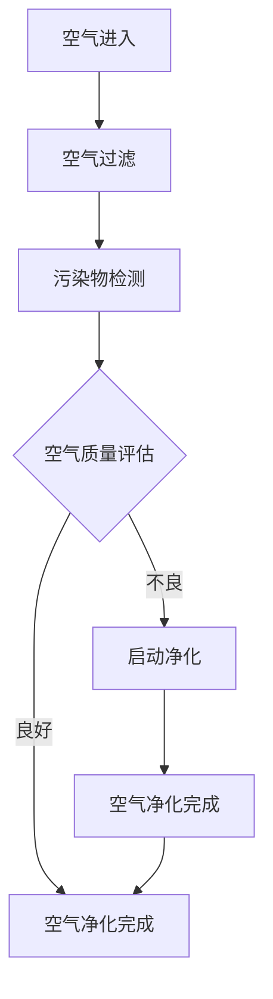

                 

# 智能空气净化创业：室内环境改善的科技方案

> **关键词**：智能空气净化、室内环境、空气污染、传感器技术、创业、产品开发、项目管理、市场推广、财务管理

> **摘要**：
本文旨在探讨智能空气净化器创业项目，通过深入分析室内环境问题、智能空气净化技术的原理和应用、产品开发与项目管理、市场推广及财务管理等多个方面，为有意进入该领域的创业者提供全方位的指导。文章将结合实际案例，详细阐述从市场调研到产品上市的全过程，包括核心算法原理、数学模型、开发环境搭建、源代码实现及解读，助力创业者掌握关键技能，实现创业目标。

---

## 《智能空气净化创业：室内环境改善的科技方案》目录大纲

1. **第一部分：创业准备与市场分析**

   1.1 智能空气净化器行业概述
   
   1.2 智能空气净化器产业链分析
   
   1.3 行业趋势与市场规模预测
   
   1.4 创业团队建设与组织结构

2. **第二部分：智能空气净化技术原理**

   2.1 空气净化技术基础
   
   2.2 空气污染物分类与检测
   
   2.3 智能空气净化器设计
   
   2.4 传感器技术与应用

3. **第三部分：产品开发与项目管理**

   3.1 产品开发流程
   
   3.2 项目管理与团队协作
   
   3.3 风险管理与应对策略

4. **第四部分：市场推广与运营**

   4.1 市场推广策略
   
   4.2 线上营销与渠道拓展
   
   4.3 运营管理
   
   4.4 数据分析与营销优化

5. **第五部分：财务管理与投资分析**

   5.1 成本控制与预算管理
   
   5.2 盈利模式与资金筹集
   
   5.3 投资回报分析与资本运作

6. **第六部分：案例分析**

   6.1 创业案例分析
   
   6.2 市场拓展策略
   
   6.3 创新产品介绍

7. **第七部分：未来展望**

   7.1 智能空气净化器发展趋势
   
   7.2 市场机遇与挑战
   
   7.3 创业者的机会与策略

8. **附录**

   8.1 智能空气净化技术流程图
   
   8.2 智能空气净化算法伪代码
   
   8.3 常用空气净化器传感器技术列表
   
   8.4 智能空气净化器开发资源汇总
   
   8.5 参考文献与推荐阅读

---

在接下来的内容中，我们将逐步深入探讨智能空气净化创业的各个关键环节，通过详细的案例分析、技术讲解和实战经验分享，帮助读者全面了解并掌握这一领域的创业方法论。让我们一起开启这场科技之旅，探索室内环境改善的无限可能。

---

## 第一部分：创业准备与市场分析

### 第1章：智能空气净化器行业概述

智能空气净化器作为现代智能家居的重要组成部分，其市场需求与日俱增。本章将首先概述智能空气净化器的市场背景，随后深入分析其产业链，并探讨当前行业的发展趋势与市场规模。

#### 1.1 智能空气净化器市场背景

随着人们对生活质量的不断追求，室内环境质量越来越受到重视。空气污染问题也成为全球范围内的热点话题。根据世界卫生组织（WHO）的数据，室内空气污染已经成为影响人类健康的主要因素之一，尤其在城市地区，室内PM2.5、甲醛等有害物质的浓度常常远高于室外。智能空气净化器的出现，为改善室内空气质量提供了有效的技术手段。

近年来，随着物联网、传感器技术和人工智能的快速发展，智能空气净化器市场迎来了爆发式增长。越来越多的消费者开始意识到空气质量对健康的重要性，对智能空气净化器的需求逐渐增加。此外，政府的环保政策、房地产市场的火热以及智能家居概念的普及也为智能空气净化器市场的发展提供了有力支持。

#### 1.2 智能空气净化器产业链分析

智能空气净化器产业链涵盖了从原材料供应到产品研发、生产、销售等多个环节。以下是对各环节的详细分析：

1. **原材料供应**
   智能空气净化器的核心部件包括风机、滤网、传感器等。原材料供应商主要包括塑料、金属、纤维、电子元器件等。这些原材料的质量直接影响空气净化器的性能和寿命。

2. **产品研发**
   研发环节是智能空气净化器产业链的核心，涉及空气净化技术的创新、传感器技术的应用以及智能控制系统的开发。研发团队需要具备丰富的技术积累和创新能力，以应对市场的快速变化。

3. **生产制造**
   生产制造环节包括零部件加工、组装、测试等多个步骤。随着生产自动化和智能化水平的提高，生产效率显著提升，成本也逐渐降低。

4. **销售渠道**
   销售渠道包括线上和线下两种形式。线上渠道主要包括电商平台、社交媒体等，线下渠道则包括实体店、代理商等。多样化的销售渠道有助于扩大市场覆盖面，提高品牌知名度。

5. **售后服务**
   售后服务是提高消费者满意度的重要因素。主要包括产品安装、维修、保养等。优质的售后服务不仅能够提升消费者忠诚度，还有助于品牌口碑的传播。

#### 1.3 行业趋势与市场规模预测

根据市场研究机构的报告，全球智能空气净化器市场规模预计将以年均20%的速度增长。以下是一些主要行业趋势：

1. **技术进步**
   随着传感器技术、物联网技术、人工智能技术的不断进步，智能空气净化器的功能将更加丰富，用户体验将得到大幅提升。

2. **产品多样化**
   随着消费者需求的多样化，智能空气净化器的产品形态也将更加多样化，包括家用、商用、车载等多个领域。

3. **环保法规日益严格**
   全球范围内，环保法规日益严格，对室内空气质量的要求也越来越高。智能空气净化器作为室内空气质量改善的重要工具，市场需求将进一步增加。

4. **智能家居集成**
   智能空气净化器将与智能家居系统集成，成为智能家居生态系统中的重要一环。智能家居的普及将为智能空气净化器带来更多的市场机会。

综上所述，智能空气净化器市场具有巨大的发展潜力。创业者可以抓住这一机遇，通过技术创新和市场营销策略，打造具有竞争力的智能空气净化器品牌。

---

在下一章中，我们将进一步探讨创业团队的建设与组织结构，以及市场需求分析，为创业项目的成功奠定坚实基础。

---

## 第2章：创业团队建设与组织结构

创业团队是智能空气净化器项目成功的关键因素。一个高效、专业的团队可以极大地提高项目的成功率和市场竞争力。本章将详细介绍创业团队的组建策略、组织结构设计以及团队管理与文化建设。

#### 2.1 团队组建策略

1. **明确团队目标与愿景**
   团队组建的第一步是明确团队的目标和愿景。对于智能空气净化器创业项目，团队的目标可以包括改善室内空气质量、提供创新技术解决方案、打造知名品牌等。愿景则是对未来发展的展望，如成为智能家居领域的领导者。

2. **组建多元化团队**
   多元化团队可以汇集不同领域的专业知识和技能，提高项目的整体竞争力。团队成员应包括技术专家、市场营销专家、产品经理、硬件工程师、软件工程师等。多元化背景的团队成员可以相互补充，共同推动项目的进展。

3. **确定核心团队成员**
   核心团队成员通常包括创始人、CTO、COO、CMO等。创始人负责整体战略规划和公司愿景，CTO负责技术研发，COO负责日常运营，CMO负责市场营销。确定核心团队成员后，应明确各自的职责和权限。

4. **优化团队规模**
   团队规模应适中，不宜过大。过大的团队可能会导致沟通成本增加、效率降低。合理的团队规模可以在确保项目顺利进行的同时，保持团队的灵活性和创新性。

5. **搭建支持团队**
   支持团队包括财务、人力资源、行政等职能部门，为创业团队提供后勤保障。这些部门应与核心团队紧密合作，共同推动项目的发展。

#### 2.2 组织结构设计

1. **矩阵式组织结构**
   矩阵式组织结构将团队成员按照职能和项目两个维度进行分组。团队成员既属于某一职能部门，又参与特定项目。这种组织结构有助于提高团队成员的灵活性和协作效率。

2. **扁平化组织结构**
   扁平化组织结构强调减少管理层级，缩短决策链条。这种组织结构可以提高团队的决策效率，但需要团队成员具备较高的自主管理能力和责任感。

3. **模块化组织结构**
   模块化组织结构将项目划分为多个模块，每个模块由一个团队负责。这种组织结构有助于提高项目的专业化水平和团队协作效率。

#### 2.3 团队管理与文化建设

1. **明确管理目标**
   团队管理目标应与团队目标一致，包括提高项目成功率、提升团队凝聚力、培养优秀人才等。明确的管理目标有助于团队聚焦核心任务，提高工作效率。

2. **建立科学的管理制度**
   建立科学的管理制度，包括绩效评估、激励机制、沟通机制等。绩效评估应公正、透明，激励机制应合理、有效，沟通机制应畅通、高效。

3. **培养团队凝聚力**
   团队凝聚力是团队成功的重要因素。团队凝聚力可以通过共同的目标、团队活动、企业文化等来培养。定期组织团队建设活动，加强团队成员之间的交流与合作，有助于提高团队凝聚力。

4. **营造良好的企业文化**
   企业文化是团队凝聚力的源泉。良好的企业文化应包括价值观、使命、愿景等。企业文化应与团队目标相一致，能够激励团队成员为实现共同目标而努力。

5. **关注团队成员成长**
   关注团队成员的成长是团队管理的重要一环。通过培训、轮岗、项目负责制等方式，帮助团队成员提高专业技能和综合素质，实现个人与团队的共同成长。

综上所述，创业团队建设与组织结构设计是智能空气净化器创业项目成功的关键。通过合理的团队组建策略、科学的管理制度和良好的企业文化，可以确保团队高效运转，实现项目目标。

---

在下一章中，我们将深入分析市场需求，了解消费者对智能空气净化器的需求，并进行竞品分析，为创业项目的市场定位提供有力支持。

---

## 第3章：市场需求分析

市场需求分析是创业成功的关键步骤之一。对于智能空气净化器项目，了解当前市场现状、消费者需求和竞品情况至关重要。本章将详细探讨室内空气质量现状、消费者需求调查以及竞品分析。

#### 3.1 室内空气质量现状

室内空气质量对人们的健康至关重要。然而，许多人对室内空气污染的认识不足，导致室内空气污染问题长期被忽视。以下是一些常见的室内空气污染问题：

1. **PM2.5和PM10**
   颗粒物污染是室内空气质量的主要问题之一。PM2.5和PM10是指直径小于或等于2.5微米和10微米的颗粒物，它们可以通过呼吸道进入人体，引发呼吸系统疾病。

2. **甲醛**
   甲醛是一种常见的室内污染物，主要来源于家具、装修材料、纺织品等。长期接触甲醛可能导致过敏、呼吸系统疾病，甚至癌症。

3. **苯**
   苯是一种有毒的挥发性有机化合物，常见于油漆、胶水、涂料等。苯对人体有害，可导致血液系统疾病和癌症。

4. **细菌和病毒**
   室内细菌和病毒污染主要来源于家具、地面、空气等。细菌和病毒可通过空气传播，引发各种感染性疾病。

根据世界卫生组织（WHO）的数据，全球每年约有700万人因室内空气污染而死亡。在中国，室内空气污染问题也日益严重，尤其是城市地区，空气质量状况令人担忧。

#### 3.2 消费者需求调查

为了更好地了解消费者对智能空气净化器的需求，我们进行了一系列的调查和研究。以下是一些关键发现：

1. **空气净化效果**
   消费者最关心的是空气净化器的净化效果。大多数消费者希望空气净化器能够有效去除PM2.5、甲醛、苯等有害物质，提高室内空气质量。

2. **智能化功能**
   随着智能家居的普及，消费者对智能空气净化器的智能化功能需求日益增加。智能控制、远程监控、自动调节等功能成为消费者的首选。

3. **节能省电**
   消费者希望智能空气净化器具有节能省电的特点，以降低使用成本。高效节能的空气净化器更受消费者青睐。

4. **外观设计**
   外观设计也是消费者考虑的重要因素。消费者希望空气净化器外观美观，易于融入家居环境。

5. **价格**
   价格是消费者购买智能空气净化器的另一个重要因素。虽然高端智能空气净化器能够提供更好的性能和功能，但中低端市场的需求也在逐渐增长。

#### 3.3 竞品分析

在智能空气净化器市场上，存在众多竞争品牌。以下是对一些主要竞品的分析：

1. **飞利浦（Philips）**
   飞利浦是智能空气净化器市场的领军品牌之一，其产品在性能、智能化功能等方面具有较高竞争力。飞利浦的空气净化器产品线丰富，涵盖了不同价格区间，能够满足不同消费者的需求。

2. **亚都（Arowana）**
   亚都是中国市场的知名品牌，其空气净化器在性价比方面具有优势。亚都的产品主要面向中低端市场，性价比高，深受消费者喜爱。

3. **布鲁雅尔（Blueair）**
   布鲁雅尔是瑞典品牌，以高性能的空气净化器著称。其产品在空气质量检测、净化效果、智能化功能等方面具有较高水平，但价格相对较高。

4. **米家（Mi Air Purifier）**
   米家是小米旗下的智能家居品牌，其空气净化器产品性价比高，智能化功能丰富。米家的产品线覆盖了不同尺寸和功能需求，能够满足多种场景下的需求。

通过竞品分析，我们可以发现，市场上有多种不同定位和功能的智能空气净化器品牌。创业者需要根据市场需求和自身优势，找准市场定位，打造具有竞争力的产品。

---

在下一章中，我们将深入探讨智能空气净化技术的原理，包括空气净化原理、空气污染物分类和空气净化技术的比较分析。

---

## 第4章：智能空气净化技术原理

智能空气净化技术是现代科技在室内环境改善领域的重要应用。本章将详细探讨智能空气净化技术的原理，包括空气净化原理、空气污染物分类以及各种空气净化技术的比较分析。

#### 4.1 空气净化原理

智能空气净化器的核心功能是去除室内空气中的有害物质，提高空气质量。空气净化原理主要包括以下几种：

1. **物理吸附**
   物理吸附是利用活性炭、滤网等材料吸附空气中的有害物质。活性炭具有极高的吸附能力，能够吸附甲醛、苯等挥发性有机化合物（VOCs）。滤网则可以拦截PM2.5、PM10等颗粒物。

2. **化学分解**
   化学分解是通过化学反应将空气中的有害物质分解为无害物质。例如，光催化技术利用紫外线照射，使空气中的有害物质发生光化学反应，生成无害的水和二氧化碳。

3. **离子净化**
   离子净化技术通过电离空气中的氧气，产生负氧离子。负氧离子具有强氧化性，能够中和空气中的有害物质，如细菌、病毒、甲醛等。

4. **高压电离**
   高压电离技术通过高压电场使空气分子电离，形成大量负离子。负离子具有净化空气、改善空气质量和抗菌的作用。

#### 4.2 空气污染物分类

空气污染物可以分为颗粒物和挥发性有机化合物（VOCs）两大类。以下是对各类空气污染物的详细介绍：

1. **颗粒物**
   颗粒物是指直径小于或等于100微米的悬浮在空气中的固体或液体颗粒。颗粒物可以分为以下几类：
   - **PM10**：直径小于或等于10微米的颗粒物，主要来源于工业生产、交通排放等。
   - **PM2.5**：直径小于或等于2.5微米的颗粒物，对人体健康危害更大，主要来源于机动车尾气、工业排放等。
   - **PM0.1**：直径小于或等于0.1微米的颗粒物，对人体健康的危害最为严重，主要来源于火山爆发、核爆炸等极端事件。

2. **挥发性有机化合物（VOCs）**
   挥发性有机化合物是指沸点较低的有机化合物，能够在常温下迅速挥发。常见的VOCs包括甲醛、苯、甲苯等，主要来源于家具、装修材料、涂料等。

#### 4.3 空气净化技术的比较分析

不同空气净化技术具有各自的优缺点，创业者需要根据市场需求和产品定位选择合适的净化技术。以下是对几种主要空气净化技术的比较分析：

1. **活性炭吸附**
   - **优点**：活性炭吸附技术具有高效、低能耗的特点，能够有效去除甲醛、苯等挥发性有机化合物。
   - **缺点**：活性炭吸附能力有限，需要定期更换滤网，且对颗粒物净化效果较差。

2. **化学分解**
   - **优点**：化学分解技术能够彻底去除空气中的有害物质，无二次污染。
   - **缺点**：成本较高，需要紫外线照射等辅助设备，操作较为复杂。

3. **离子净化**
   - **优点**：离子净化技术操作简单，能够迅速净化空气，对细菌、病毒等微生物有较好的灭杀作用。
   - **缺点**：离子净化产生的臭氧对人体有一定危害，需严格控制臭氧浓度。

4. **高压电离**
   - **优点**：高压电离技术能够产生大量负氧离子，改善空气质量，对人体健康有积极作用。
   - **缺点**：设备成本较高，电离产生的离子对部分人群可能造成过敏反应。

综上所述，不同空气净化技术各有优缺点，创业者需要根据市场需求、产品定位和预算等因素综合考虑。在实际应用中，多种净化技术可以结合使用，以实现最佳的空气净化效果。

---

在下一章中，我们将探讨智能空气净化器的硬件设计、软件与控制系统的设计，以及用户界面设计，为创业项目的成功提供技术支持。

---

## 第5章：智能空气净化器设计

智能空气净化器的成功不仅依赖于先进的技术，还需要精心的设计和人性化考虑。本章将详细探讨智能空气净化器的硬件设计、软件与控制系统的设计，以及用户界面设计，为创业项目提供全面的技术支持。

#### 5.1 智能空气净化器的硬件设计

智能空气净化器的硬件设计是确保其性能稳定、功能齐全的基础。以下是一些关键的硬件设计要素：

1. **风机**
   风机是空气净化器的核心部件之一，直接影响空气净化效果和功耗。智能空气净化器通常采用高效直流电机，具有高风量、低噪音、长寿命等特点。

2. **滤网**
   滤网是空气净化器的关键组件，负责吸附空气中的颗粒物和有害物质。滤网的设计应考虑到不同污染物类型的过滤效果，如活性炭滤网、HEPA滤网等。

3. **传感器**
   传感器用于实时监测室内空气质量，包括PM2.5、PM10、甲醛、温度、湿度等参数。高精度、低功耗的传感器是确保智能空气净化器智能调控的关键。

4. **电路板**
   电路板是智能空气净化器的控制核心，负责处理传感器数据、驱动电机、管理电源等。电路板的设计应考虑到稳定性、抗干扰性和扩展性。

5. **外壳**
   外壳设计不仅要美观，还要具有足够的强度和防护能力。通常采用塑料、金属等材料，同时考虑抗摔、防尘、防水等特性。

#### 5.2 软件与控制系统的设计

智能空气净化器的软件与控制系统的设计决定了其智能化程度和用户体验。以下是一些关键的设计要点：

1. **操作系统**
   智能空气净化器通常采用嵌入式操作系统，如Linux、Android等。操作系统负责管理硬件资源、运行应用程序等。

2. **数据采集与处理**
   软件系统需要采集传感器数据，并对数据进行实时处理和分析。例如，通过算法计算室内空气质量指数（AQI），并根据AQI值自动调整空气净化模式。

3. **智能调控**
   智能调控是智能空气净化器的核心功能之一。软件系统应实现根据室内空气质量自动启动/停止空气净化器，自动调整风量和净化模式等功能。

4. **用户界面**
   软件系统需要提供直观、易用的用户界面，方便用户查看空气质量、设置空气净化模式等。用户界面设计应考虑中文、英文等多语言支持。

5. **远程控制**
   通过Wi-Fi、蓝牙等无线通信技术，用户可以远程控制智能空气净化器，包括启动/停止、模式切换、远程监测等功能。

#### 5.3 用户界面设计

用户界面设计是智能空气净化器用户体验的重要组成部分。以下是一些关键的用户界面设计要素：

1. **简洁明了**
   用户界面应简洁明了，避免复杂的操作流程。通过直观的图标、文字说明，用户可以快速了解空气净化器的状态和功能。

2. **交互设计**
   用户界面应提供便捷的交互方式，如触摸屏、实体按键等。交互设计应考虑用户的操作习惯，提高使用体验。

3. **多语言支持**
   为了满足不同地区用户的需求，用户界面应支持中文、英文等多语言显示。

4. **实时监测**
   用户界面应实时显示室内空气质量数据，如PM2.5、甲醛浓度、温度、湿度等。同时，通过图表、曲线等可视化方式，帮助用户更好地理解空气质量变化。

5. **自定义设置**
   用户界面应提供自定义设置功能，如空气净化模式、风量调节、定时开关等，满足用户的个性化需求。

综上所述，智能空气净化器的设计需要综合考虑硬件、软件和用户界面等多个方面，通过技术创新和人性化设计，为用户提供高效、便捷、智能的空气净化解决方案。创业者在设计过程中应充分了解用户需求，不断优化产品功能和用户体验，以赢得市场竞争力。

---

在下一章中，我们将深入探讨传感器技术在智能空气净化器中的应用，包括传感器类型、数据采集与处理方法，以及传感器在空气净化中的应用案例。

---

## 第6章：传感器技术与应用

传感器技术是智能空气净化器的核心组成部分，负责实时监测室内空气质量，为空气净化提供依据。本章将详细探讨传感器技术的基本原理、类型与应用方法。

#### 6.1 传感器类型与原理

传感器是能够感受规定的被测量并按照一定的规律转换成可用输出信号的装置。在智能空气净化器中，常用的传感器包括空气质量传感器、温度传感器、湿度传感器等。

1. **空气质量传感器**
   空气质量传感器用于检测空气中的颗粒物、有害气体等污染物。常见的空气质量传感器包括PM2.5传感器、甲醛传感器等。
   - **PM2.5传感器**：利用激光原理，通过测量光散射或吸收强度，实时监测空气中的PM2.5浓度。
   - **甲醛传感器**：利用电化学原理，通过测量甲醛气体在电极上的电化学反应，检测甲醛浓度。

2. **温度传感器**
   温度传感器用于测量室内温度，确保空气净化器在合适的温度范围内运行。常见的温度传感器包括热敏电阻、热电偶等。
   - **热敏电阻**：利用半导体材料随温度变化的电阻特性，测量室内温度。
   - **热电偶**：利用两种不同金属接触时产生的热电效应，测量室内温度。

3. **湿度传感器**
   湿度传感器用于测量室内湿度，有助于空气净化器调整湿度控制策略。常见的湿度传感器包括电容式、电阻式等。
   - **电容式湿度传感器**：利用电容值随湿度变化的特性，测量室内湿度。
   - **电阻式湿度传感器**：利用电阻值随湿度变化的特性，测量室内湿度。

#### 6.2 传感器数据采集与处理

传感器采集的数据需要经过处理，才能为空气净化器提供有效的指导。以下是对传感器数据采集与处理方法的详细探讨：

1. **数据采集**
   传感器采集的数据通常以数字或模拟信号的形式输出。数字传感器可以直接通过I2C、SPI等通信协议与处理器通信，模拟传感器则需要通过模数转换（ADC）模块转换为数字信号。
   - **I2C（Inter-Integrated Circuit）**：是一种串行通信协议，适用于多传感器数据采集。
   - **SPI（Serial Peripheral Interface）**：是一种高速通信协议，适用于单个传感器数据采集。

2. **数据处理**
   传感器数据的处理包括信号滤波、数据校准、数据分析等步骤：
   - **信号滤波**：去除传感器数据中的噪声，提高数据的准确性。
   - **数据校准**：通过对传感器数据进行校准，消除传感器误差，提高测量精度。
   - **数据分析**：通过算法分析传感器数据，提取有用的信息，如室内空气质量指数（AQI）、污染物浓度等。

#### 6.3 传感器在空气净化中的应用

传感器技术在智能空气净化器中有着广泛的应用，以下是一些具体应用案例：

1. **空气质量实时监测**
   通过空气质量传感器，智能空气净化器可以实时监测室内PM2.5、甲醛等污染物浓度，并根据空气质量变化自动调整工作模式，确保室内空气质量始终处于健康水平。

2. **智能调控风量和净化模式**
   智能空气净化器根据传感器数据自动调整风量和净化模式，如在高污染物浓度下增加风量，采用强力净化模式；在空气质量好转时降低风量，采用节能模式。

3. **湿度控制**
   智能空气净化器通过湿度传感器监测室内湿度，并根据设定目标湿度自动启动加湿或除湿功能，维持室内湿度在适宜范围，提高舒适度。

4. **远程监控与控制**
   通过无线通信技术，用户可以通过智能手机或智能音箱远程监控和控制智能空气净化器，实现智能化的生活体验。

5. **健康提醒**
   智能空气净化器可以根据室内空气质量发出健康提醒，如空气质量较差时提醒用户开窗通风或使用空气净化器，保障家庭成员的健康。

总之，传感器技术在智能空气净化器中发挥着关键作用，通过实时监测、智能调控和远程控制等功能，为用户提供了高效、智能的空气净化解决方案。创业者在设计和开发智能空气净化器时，应充分考虑传感器技术的应用，以提高产品的性能和用户体验。

---

在下一章中，我们将详细讨论产品开发流程、项目管理与团队协作，以及风险管理与应对策略，确保创业项目的顺利进行。

---

## 第7章：产品开发流程

智能空气净化器的产品开发流程是一个复杂且系统的过程，涉及多个环节，包括需求分析、原型设计与测试、量产与质量控制。本章将详细探讨每个阶段的关键步骤和注意事项。

#### 7.1 需求分析与规划

需求分析是产品开发的第一步，决定了产品的功能和性能。以下是对需求分析的关键步骤：

1. **市场调研**
   通过市场调研，了解消费者的需求、竞品的优劣势以及市场趋势。市场调研的方法包括问卷调查、访谈、焦点小组讨论等。

2. **功能需求**
   根据市场调研结果，明确智能空气净化器的功能需求。包括空气质量监测、空气净化、智能调控、远程控制等。

3. **性能需求**
   确定产品的性能指标，如空气净化效果、风量、能耗、噪音等。性能需求应具备实际可测量性，以便后续评估和优化。

4. **用户体验**
   关注用户体验，包括用户界面设计、操作便捷性、产品外观等。用户体验直接影响产品的市场竞争力。

5. **可行性分析**
   对产品需求的可行性和潜在风险进行评估，包括技术可行性、市场可行性、经济可行性等。

#### 7.2 原型设计与测试

原型设计是将需求转化为实际产品的过程，以下是对原型设计的关键步骤：

1. **功能原型**
   通过软件工具（如Sketch、Axure等），设计产品的功能原型。功能原型应具备基本的功能交互和页面布局。

2. **物理原型**
   制作物理原型，验证产品的结构设计和硬件布局。物理原型可以是手板、3D打印模型等。

3. **测试与迭代**
   对原型进行功能测试和用户体验测试，收集反馈意见，进行迭代优化。测试过程中应关注产品的稳定性、可靠性、易用性等方面。

#### 7.3 量产与质量控制

量产是产品从实验室走向市场的关键步骤，以下是对量产的关键步骤：

1. **工艺规划**
   制定生产工艺规划，包括零部件加工、组装、测试等。工艺规划应考虑生产效率、成本和质量。

2. **生产准备**
   确保生产设备、原材料和人力资源等生产要素就绪。生产准备过程中应进行设备调试、人员培训等。

3. **质量控制**
   实施严格的质量控制措施，包括生产过程质量控制、成品检测等。质量控制的关键指标包括外观、性能、可靠性等。

4. **批量生产**
   开始批量生产，根据市场需求和订单情况调整生产节奏。批量生产过程中应密切关注生产进度和质量，及时调整生产计划。

5. **物流与售后服务**
   确保产品的物流配送和售后服务。物流与售后服务是影响消费者满意度和品牌口碑的重要因素。

#### 7.4 注意事项

在产品开发流程中，以下是一些需要注意的事项：

1. **团队合作**
   产品开发涉及多个部门和团队，如研发、生产、销售、售后等。团队合作是确保项目顺利进行的关键。

2. **风险管理**
   在产品开发过程中，应识别和评估潜在的风险，制定相应的应对策略。风险管理有助于降低项目失败的概率。

3. **文档管理**
   建立完善的文档管理体系，包括需求文档、设计文档、测试文档等。良好的文档管理有助于项目追溯和问题解决。

4. **持续改进**
   产品开发是一个持续改进的过程。通过用户反馈和市场变化，不断优化产品功能和性能。

5. **遵循法规**
   遵守相关的法律法规，如环保法规、产品认证等。合规是产品顺利上市的重要保障。

综上所述，智能空气净化器的产品开发流程涉及多个阶段，需要紧密协作和科学管理。通过合理的流程设计和严格的执行，可以确保产品的质量、性能和用户体验，为创业项目的成功奠定基础。

---

在下一章中，我们将深入探讨项目管理与团队协作，介绍项目管理方法论、团队协作工具以及风险管理与应对策略，为创业项目的顺利推进提供保障。

---

## 第8章：项目管理与团队协作

在智能空气净化器创业项目中，项目管理与团队协作是确保项目顺利进行、按时完成的关键环节。本章将介绍项目管理方法论、团队协作工具以及风险管理与应对策略，为项目的顺利推进提供保障。

#### 8.1 项目管理方法论

项目管理方法论是确保项目高效运行的基础。以下是一些常见的方法论：

1. **瀑布模型**
   瀑布模型是一种线性顺序的开发过程，适用于需求明确、变更较少的项目。瀑布模型包括需求分析、设计、开发、测试、部署等阶段。

2. **敏捷开发**
   敏捷开发是一种迭代、增量的开发方法，强调快速响应变化和持续交付价值。敏捷开发包括产品规划、迭代开发、回顾等环节。

3. **Scrum**
   Scrum是一种基于敏捷开发的框架，强调短周期的迭代开发（Sprint）和日常站会、回顾等会议。Scrum有助于提高团队协作和项目透明度。

#### 8.2 团队协作工具

有效的团队协作工具可以提高工作效率和沟通质量。以下是一些常用的团队协作工具：

1. **JIRA**
   JIRA是一个强大的项目管理工具，支持任务追踪、敏捷开发、报告分析等功能。JIRA有助于团队协作和项目进度管理。

2. **Trello**
   Trello是一个简洁直观的任务管理工具，通过卡片和看板（Board）进行任务分配和进度跟踪。Trello适用于小团队和项目。

3. **Slack**
   Slack是一个即时通讯工具，支持文字、语音、视频等多种沟通方式。Slack有助于团队内部沟通和协作。

4. **Google Workspace**
   Google Workspace包括Google Docs、Google Sheets、Google Calendar等工具，支持多人在线协作。Google Workspace适用于远程团队和跨地域协作。

#### 8.3 风险管理与应对策略

在项目开发过程中，风险管理是确保项目成功的关键。以下是一些常见的风险管理和应对策略：

1. **风险识别**
   通过项目规划和团队讨论，识别可能的风险点，如技术风险、市场风险、资源风险等。

2. **风险评估**
   对识别出的风险进行评估，确定其发生概率和影响程度。常用的评估方法包括定性评估和定量评估。

3. **风险应对策略**
   根据风险评估结果，制定相应的风险应对策略，包括风险规避、风险转移、风险接受等。

   - **风险规避**：通过调整项目计划、修改需求等，避免风险的发生。
   - **风险转移**：通过保险、合同等方式，将风险转移给第三方。
   - **风险接受**：对于无法避免或转移的风险，制定应对措施，降低风险影响。

4. **风险监控与调整**
   在项目执行过程中，持续监控风险，并根据实际情况进行调整。风险监控可以通过定期评估、风险报告等方式进行。

#### 8.4 团队建设与文化建设

团队建设与文化建设是确保团队高效协作和持续发展的关键。以下是一些建议：

1. **明确目标与职责**
   明确团队目标和每个成员的职责，确保团队成员清晰了解自己的工作内容和预期成果。

2. **建立沟通机制**
   建立有效的沟通机制，确保团队成员之间的信息畅通。可以通过日常会议、即时通讯工具等加强团队沟通。

3. **培养团队凝聚力**
   定期组织团队建设活动，如团建活动、培训等，增强团队成员之间的互动和信任。

4. **鼓励创新与学习**
   鼓励团队成员创新和持续学习，提供培训机会和资源，提升团队整体能力。

5. **建立激励机制**
   建立合理的激励机制，如绩效奖励、晋升机会等，激发团队成员的工作积极性。

总之，项目管理与团队协作是智能空气净化器创业项目成功的关键。通过科学的项目管理方法论、有效的团队协作工具和风险管理策略，可以确保项目的顺利进行，提高团队协作效率和项目成功率。

---

在下一章中，我们将深入探讨市场推广策略，包括品牌定位、线上营销策略和线下活动与渠道拓展，为创业项目的市场推广提供有力支持。

---

## 第9章：市场推广策略

市场推广是智能空气净化器创业成功的重要环节，需要明确品牌定位、制定线上营销策略、策划线下活动与渠道拓展。本章将详细探讨这些关键要素，为创业项目的市场推广提供有力支持。

#### 9.1 品牌定位与传播

品牌定位是市场推广的基础，决定了产品在市场中的定位和竞争策略。以下是一些关键步骤：

1. **目标市场**
   明确目标市场，包括年龄、性别、收入、地域等特征。对于智能空气净化器，目标市场可以定位在关注室内空气质量、追求生活品质的中高收入群体。

2. **品牌形象**
   建立独特的品牌形象，包括品牌名称、标志、口号等。品牌形象应简洁、易记，体现产品的智能化、高科技属性。

3. **品牌故事**
   塑造品牌故事，传递品牌价值观和使命。品牌故事可以包括品牌创立的背景、发展历程、创新理念等，增加品牌的亲和力和可信度。

4. **传播渠道**
   选择合适的传播渠道，包括线上和线下。线上渠道如社交媒体、博客、短视频平台等，线下渠道如展会、活动、广告等。

#### 9.2 线上营销策略

线上营销策略是智能空气净化器市场推广的重要手段，以下是一些关键策略：

1. **社交媒体营销**
   利用社交媒体平台（如微博、微信、抖音、快手等）进行品牌推广和互动。通过发布产品信息、用户评价、活动推广等内容，增加品牌曝光度和用户参与度。

2. **内容营销**
   通过撰写高质量的内容（如博客、教程、评测等），提供有价值的信息，吸引潜在客户。内容营销可以帮助提升品牌权威性和用户信任度。

3. **搜索引擎优化（SEO）**
   优化网站内容和关键词，提高在搜索引擎中的排名，增加自然流量。SEO有助于提高品牌知名度和潜在客户的获取。

4. **社交媒体广告**
   利用社交媒体广告进行精准投放，针对特定用户群体推广产品。社交媒体广告可以根据用户行为、兴趣等精准定位，提高广告效果。

5. **网络直播**
   通过网络直播进行产品介绍、用户体验分享等，增加用户互动和购买欲望。网络直播可以快速传递产品信息，提升品牌影响力。

#### 9.3 线下活动与渠道拓展

线下活动与渠道拓展是智能空气净化器市场推广的重要补充，以下是一些关键策略：

1. **展会活动**
   参加行业展会、展览会等，展示产品和技术，吸引潜在客户。展会活动可以增加品牌曝光度和市场影响力。

2. **线下体验店**
   建立线下体验店，让消费者亲身体验产品的性能和功能。线下体验店可以增加消费者的信任度和购买意愿。

3. **代理商合作**
   与代理商合作，拓展销售渠道。代理商可以提供本地化服务，帮助品牌快速进入市场。

4. **线下促销活动**
   举办促销活动，如打折、赠品、捆绑销售等，吸引消费者购买。线下促销活动可以增加产品销量和市场份额。

5. **合作营销**
   与其他品牌或企业合作，共同推广产品。例如，与家居品牌合作，将智能空气净化器作为家居配套产品推广。

#### 9.4 数据分析与营销优化

市场推广过程中，数据分析是优化营销策略的关键。以下是一些关键步骤：

1. **数据收集**
   收集市场推广过程中的数据，包括网站流量、社交媒体互动、广告点击率、销售数据等。

2. **数据分析**
   对收集到的数据进行分析，评估市场推广效果，识别优势和不足。数据分析可以包括用户行为分析、广告效果分析、销售数据分析等。

3. **营销优化**
   根据数据分析结果，调整市场推广策略，优化广告投放、内容发布、活动策划等。持续的数据分析和营销优化可以帮助企业提高市场推广效果。

总之，市场推广策略是智能空气净化器创业成功的关键。通过明确品牌定位、制定线上营销策略、策划线下活动与渠道拓展，并利用数据分析和营销优化，可以有效地提升品牌知名度和市场占有率，为创业项目的成功奠定坚实基础。

---

在下一章中，我们将详细探讨运营管理，包括销售渠道建设、客户服务与管理，以及数据分析和营销优化，为创业项目的持续发展提供有力支持。

---

## 第10章：运营管理

运营管理是智能空气净化器创业项目成功的关键环节，包括销售渠道建设、客户服务与管理，以及数据分析和营销优化。本章将详细探讨这些关键要素，为创业项目的持续发展提供有力支持。

#### 10.1 销售渠道建设

销售渠道是产品从工厂到消费者手中的桥梁，合理的销售渠道建设能够提高产品销量和市场占有率。以下是一些关键步骤：

1. **线上渠道**
   - **电商平台**：利用淘宝、京东、拼多多等主流电商平台开设旗舰店，拓展线上销售渠道。
   - **自建商城**：建立自有品牌官网或小程序商城，直接触达消费者，提高品牌忠诚度。
   - **社交媒体**：利用微信、微博、抖音等社交媒体平台进行产品推广和销售。

2. **线下渠道**
   - **连锁实体店**：在主要城市建立品牌连锁实体店，提供产品展示、体验和售后服务。
   - **代理商合作**：与区域代理商合作，拓展线下销售网络，快速进入市场。
   - **线下展会**：参加各类展会、展览会，展示产品和技术，拓展潜在客户。

#### 10.2 客户服务与管理

客户服务是提升消费者满意度和品牌口碑的重要环节，以下是一些关键策略：

1. **服务团队建设**
   - **客服团队**：建立专业的客服团队，提供线上线下客服服务，解答消费者疑问，解决售后问题。
   - **服务标准**：制定统一的服务标准和流程，确保服务质量和效率。

2. **客户关系管理**
   - **客户反馈**：收集客户反馈，了解消费者需求和满意度，持续优化产品和服务。
   - **会员管理**：建立会员制度，提供积分、优惠券等福利，增强客户粘性。

3. **售后服务**
   - **售后保障**：提供完善的售后服务，包括产品安装、维修、保养等，确保消费者购买无忧。
   - **快速响应**：建立快速响应机制，及时处理消费者投诉和问题，提高客户满意度。

#### 10.3 数据分析与营销优化

数据分析是运营管理的重要工具，通过数据驱动决策，可以提升运营效率和营销效果。以下是一些关键步骤：

1. **数据收集**
   - **销售数据**：收集销售数据，包括订单量、销售额、客户来源等。
   - **用户行为数据**：收集用户在网站、APP等平台上的行为数据，如浏览记录、点击率等。
   - **市场数据**：收集市场相关数据，包括行业趋势、竞争对手情况等。

2. **数据分析**
   - **销售分析**：分析销售数据，识别高销量产品和销售渠道，优化营销策略。
   - **用户行为分析**：分析用户行为数据，了解用户偏好，优化产品功能和用户体验。
   - **市场分析**：分析市场数据，识别市场趋势和机会，调整市场推广策略。

3. **营销优化**
   - **广告投放**：根据数据分析结果，优化广告投放策略，提高广告效果和投资回报率。
   - **内容优化**：根据用户行为分析，优化网站内容和社交媒体内容，提升用户参与度和转化率。
   - **促销活动**：根据市场数据和用户反馈，策划有针对性的促销活动，提高销售业绩。

#### 10.4 数据分析与营销优化实例

以下是一个实际案例，说明数据分析在营销优化中的应用：

1. **数据收集**
   - 收集过去三个月的销售数据，包括订单量、销售额、客户来源等。
   - 收集用户在官网和社交媒体平台上的行为数据，如浏览量、点击率、转化率等。

2. **数据分析**
   - 通过销售数据分析，发现电商平台和自建商城的销售额较高，而社交媒体渠道的转化率较低。
   - 通过用户行为分析，发现用户对产品的功能介绍和用户评价内容关注度较高。

3. **营销优化**
   - 增加电商平台和自建商城的推广力度，优化网站和APP的用户体验。
   - 在社交媒体上发布更多功能介绍和用户评价内容，提高用户参与度和转化率。
   - 调整广告投放策略，将更多预算分配给电商平台和自建商城，提高广告效果。

通过数据分析和营销优化，可以有效地提升运营效率和营销效果，为智能空气净化器创业项目的持续发展提供有力支持。

---

在下一章中，我们将进行财务管理与投资分析，包括成本控制、盈利模式、资金筹集和投资回报分析，为创业项目的财务健康提供指导。

---

## 第11章：财务管理与投资分析

财务管理与投资分析是智能空气净化器创业项目成功的关键环节。本章将详细探讨财务管理、成本控制、盈利模式、资金筹集以及投资回报分析，为创业项目的财务健康提供指导。

#### 11.1 成本控制与预算管理

成本控制是创业项目财务管理的重要方面。以下是一些关键步骤：

1. **成本分类**
   - **固定成本**：包括租金、设备折旧、员工工资等，不随生产量变化。
   - **可变成本**：包括原材料、人工、运输等，随生产量变化。

2. **成本控制措施**
   - **优化供应链**：通过与供应商谈判、降低库存成本、优化物流等手段降低原材料成本。
   - **提高生产效率**：通过自动化、精益生产等手段降低生产成本。
   - **合理预算**：制定合理的预算，确保资金使用高效、透明。

3. **预算管理**
   - **年度预算**：制定年度预算，包括收入、成本、利润等。
   - **月度预算**：根据年度预算，制定月度预算，进行财务监控和调整。

#### 11.2 盈利模式分析

盈利模式是创业项目长期发展的基础。以下是一些常见的盈利模式：

1. **销售盈利**
   - **产品销售**：通过销售智能空气净化器获取利润。
   - **增值服务**：提供付费增值服务，如远程监控、定期维护等。

2. **广告盈利**
   - **品牌广告**：与广告商合作，在产品页面或APP中展示广告。
   - **内容广告**：通过内容营销吸引流量，吸引广告商投放广告。

3. **合作盈利**
   - **代理合作**：与代理商合作，共同开拓市场，分享收益。
   - **技术合作**：与其他企业或机构合作，共同研发新产品，获取利润分成。

#### 11.3 资金筹集与风险投资

资金筹集是创业项目启动和发展的重要保障。以下是一些常见的资金筹集方式：

1. **天使投资**
   - **个人投资者**：寻找有经验的投资者，提供创业项目理念和愿景。
   - **天使基金**：通过天使基金进行投资，获取资金支持。

2. **风险投资**
   - **风险投资机构**：与专业风险投资机构合作，获取高额资金支持。
   - **股权融资**：通过出让股权，获得投资。

3. **政府补贴**
   - **科技创新补贴**：申请政府科技创新补贴，减轻财务压力。

#### 11.4 投资回报分析

投资回报分析是评估创业项目投资价值的重要工具。以下是一些关键指标：

1. **内部收益率（IRR）**
   - **计算方法**：通过计算项目的净现值（NPV），求得内部收益率。
   - **意义**：反映项目的投资回报情况，越高表示投资回报越好。

2. **投资回报期（Payback Period）**
   - **计算方法**：计算项目投资回收期，即投资成本回收的时间。
   - **意义**：反映项目投资回收的速度，越短表示回收越快。

3. **净现值（NPV）**
   - **计算方法**：通过折现率将未来现金流折现到当前时点，计算净现值。
   - **意义**：反映项目投资的真实价值，NPV为正表示项目可行。

#### 11.5 资本运作策略

资本运作策略是提高创业项目投资回报的关键。以下是一些策略：

1. **多元化融资**
   - **股权融资**：通过出让部分股权，获得资金支持。
   - **债务融资**：通过贷款、债券等债务融资手段，降低资金成本。

2. **资产重组**
   - **资产整合**：通过并购、重组等手段，优化资产结构，提高资产利用率。
   - **资产剥离**：通过出售非核心资产，优化财务结构。

3. **股权激励**
   - **员工持股**：通过员工持股计划，提高员工积极性，降低离职率。
   - **管理层持股**：通过管理层持股，提高管理层对企业发展的责任感。

总之，财务管理与投资分析是智能空气净化器创业项目成功的关键。通过合理的成本控制、盈利模式、资金筹集和投资回报分析，以及有效的资本运作策略，可以确保创业项目的财务健康，为企业的长期发展提供坚实保障。

---

在下一章中，我们将通过案例分析方法，对成功智能空气净化器创业案例进行深入剖析，以期为创业者提供宝贵的经验教训。

---

## 第12章：案例分析

通过对成功智能空气净化器创业案例的分析，我们可以深入了解创业过程中的关键步骤、成功因素以及可能遇到的问题和挑战。以下是对几个典型创业案例的深入剖析。

#### 12.1 案例一：公司A的创业历程

**公司A**是一家专注于智能空气净化器研发和销售的企业，其成功经验主要体现在以下几个方面：

1. **技术创新**
   - **研发投入**：公司A高度重视技术创新，持续加大研发投入，推出多款具有独特净化功能的智能空气净化器。
   - **自主研发**：公司A拥有多项核心专利，确保产品的技术领先地位。

2. **市场定位**
   - **精准定位**：公司A针对中高端市场，提供高品质、高附加值的智能空气净化器，满足消费者对高品质生活的需求。
   - **差异化竞争**：通过独特的产品功能和设计，公司A在竞争激烈的市场中脱颖而出。

3. **品牌建设**
   - **品牌传播**：公司A通过多渠道品牌传播，提高品牌知名度和美誉度。
   - **用户体验**：公司A注重用户体验，通过优质的售后服务提升用户满意度。

**成功因素**：
- **技术创新**：持续的技术创新是公司A成功的关键。
- **市场定位**：精准的市场定位和差异化竞争策略使公司A在市场中站稳脚跟。
- **品牌建设**：有效的品牌传播和用户体验管理提高了公司A的市场竞争力。

**经验教训**：
- 创业者应重视技术创新，不断提升产品竞争力。
- 市场定位要精准，避免与竞争对手直接竞争。
- 品牌建设需要长期投入和持续努力。

#### 12.2 案例二：公司B的创新产品

**公司B**以其创新产品而闻名，其成功主要体现在以下几个方面：

1. **智能互联**
   - **智能家居集成**：公司B的产品具备智能家居集成功能，可以通过手机APP或语音助手控制，实现远程监控和智能调控。
   - **数据分析**：公司B利用大数据技术，对用户使用数据进行分析，为产品优化和个性化服务提供依据。

2. **用户反馈**
   - **积极倾听**：公司B注重用户反馈，通过线上线下渠道收集用户意见，不断改进产品。
   - **快速迭代**：公司B采用敏捷开发模式，快速迭代产品，满足用户不断变化的需求。

3. **市场拓展**
   - **国际市场**：公司B积极拓展国际市场，通过参加国际展会、与海外代理商合作等方式，扩大品牌影响力。
   - **线上线下结合**：公司B同时发展线上和线下渠道，提高市场覆盖率。

**成功因素**：
- **智能互联**：智能互联功能提升了用户体验，增强了产品竞争力。
- **用户反馈**：积极倾听用户反馈，快速改进产品，使公司B能够更好地满足用户需求。
- **市场拓展**：国际市场和线上线下结合的市场拓展策略使公司B实现了快速发展。

**经验教训**：
- 创业者应注重智能化和互联化，提升产品的用户体验。
- 用户反馈是产品优化的重要依据，创业者应积极倾听和采纳。
- 国际市场拓展和线上线下结合的市场策略有助于企业快速发展。

#### 12.3 案例三：市场拓展策略

**公司C**是一家新兴的智能空气净化器创业公司，其市场拓展策略值得借鉴：

1. **合作伙伴**
   - **战略合作**：公司C与多家大型电商平台和线下代理商建立战略合作关系，迅速扩大市场覆盖率。
   - **跨界合作**：公司C与家居、健康等行业的企业进行跨界合作，开拓新的市场空间。

2. **品牌推广**
   - **线上推广**：公司C通过社交媒体、搜索引擎优化（SEO）等线上渠道进行品牌推广，提高品牌知名度。
   - **线下推广**：公司C参与各类线下展会、活动，进行产品展示和品牌宣传。

3. **用户教育**
   - **科普活动**：公司C通过举办科普讲座、发布科普文章等方式，提高消费者对室内空气污染和智能空气净化器认知。
   - **用户体验**：公司C提供免费试用和体验活动，让消费者亲身体验产品的效果。

**成功因素**：
- **合作伙伴**：与战略合作伙伴建立紧密的合作关系，有助于快速市场拓展。
- **品牌推广**：多渠道品牌推广策略提高了品牌知名度。
- **用户教育**：通过科普活动和用户体验，提高了消费者对产品的认知和接受度。

**经验教训**：
- 创业者应积极寻找并建立战略合作伙伴，借助外部资源快速拓展市场。
- 多渠道品牌推广策略有助于提高品牌知名度。
- 用户教育是提升消费者认知和接受度的重要手段。

通过以上案例分析，我们可以看到，成功智能空气净化器创业公司具有以下共同特点：技术创新、精准市场定位、用户体验重视、多渠道品牌推广和用户教育。创业者可以借鉴这些成功经验，结合自身实际情况，制定适合自己的市场拓展策略，实现创业目标。

---

在下一章中，我们将探讨智能空气净化器行业的发展趋势、市场机遇与挑战，以及创业者的机会与策略。

---

## 第13章：未来展望

智能空气净化器行业正随着科技的进步和人们生活品质的提高而不断发展。本章将探讨智能空气净化器行业的发展趋势、市场机遇与挑战，以及创业者的机会与策略。

#### 13.1 智能空气净化器发展趋势

1. **智能化与互联化**
   随着物联网和人工智能技术的发展，智能空气净化器越来越注重智能化和互联化。未来的智能空气净化器将具备更高级的自动控制功能，能够根据室内空气质量自动调整工作模式，同时与其他智能家居设备互联互通，实现整体家居环境的智能化管理。

2. **高效净化技术**
   新型净化技术的不断涌现，如光催化、等离子体、纳米材料等，将进一步提升空气净化效果，降低能耗。未来，高效净化技术将成为智能空气净化器的重要竞争优势。

3. **个性化与定制化**
   随着消费者需求的多样化，智能空气净化器将更加注重个性化与定制化。通过大数据分析和用户反馈，智能空气净化器将能够提供更加个性化的服务，满足不同消费者的需求。

4. **绿色环保**
   环保理念将在智能空气净化器行业中得到进一步体现。未来，智能空气净化器将更加注重环保设计、材料选择和能源利用，以减少对环境的影响。

#### 13.2 市场机遇与挑战

1. **市场机遇**
   - **健康意识提升**：随着人们对健康意识的提升，对室内空气质量的关注不断增加，为智能空气净化器市场提供了巨大的机遇。
   - **智能家居普及**：智能家居的普及为智能空气净化器带来了广阔的市场空间。智能空气净化器将与智能家居设备协同工作，提高用户的生活品质。
   - **政策支持**：政府对环保产业的支持和环保法规的加强，为智能空气净化器市场提供了政策支持。

2. **市场挑战**
   - **技术竞争**：随着行业的发展，技术竞争日益激烈，企业需要不断投入研发，提升产品技术含量，以保持竞争优势。
   - **品牌竞争**：市场上有众多品牌竞争，创业者需要通过创新和品牌建设，提升市场竞争力。
   - **消费者认知**：尽管室内空气质量问题日益突出，但部分消费者对智能空气净化器的认知仍不足，需要加强用户教育和市场推广。

#### 13.3 创业者的机会与策略

1. **技术创新**
   创业者应积极投入技术研发，开发具有竞争力的新产品。通过技术创新，提升产品性能和用户体验，赢得市场。

2. **市场定位**
   创业者应根据市场需求，准确把握市场定位。在差异化竞争中，通过提供独特的功能和设计，满足特定消费者的需求。

3. **品牌建设**
   创业者应重视品牌建设，通过多渠道品牌传播，提高品牌知名度和美誉度。品牌建设是长期的过程，需要持续投入和努力。

4. **用户互动**
   创业者应积极与用户互动，了解用户需求和反馈，不断优化产品和服务。用户互动有助于提升用户满意度和品牌忠诚度。

5. **跨界合作**
   创业者可以尝试与其他行业进行跨界合作，如与家居、健康、房地产等行业合作，拓展市场空间，实现共赢。

总之，智能空气净化器行业未来充满机遇与挑战。创业者应紧跟行业发展趋势，抓住市场机遇，制定合适的创业策略，实现企业的持续发展和市场成功。

---

在最后的部分，我们将通过附录提供智能空气净化技术流程图、智能空气净化算法伪代码、常用空气净化器传感器技术列表以及智能空气净化器开发资源汇总，以便读者深入了解相关技术细节。

---

## 附录

### 附录A：智能空气净化技术流程图

以下是一个智能空气净化技术的Mermaid流程图示例：



### 附录B：智能空气净化算法伪代码

以下是一个智能空气净化算法的伪代码示例：

```python
# 智能空气净化算法
def intelligent_air_purification():
    while True:
        # 读取传感器数据
        pollution_data = read_sensors()

        # 判断空气质量
        if pollution_data < THRESHOLD:
            print("空气质量良好，无需净化。")
        else:
            print("空气质量不良，启动净化。")
            start_purification()

        # 更新用户界面
        update_user_interface(pollution_data)

# 读取传感器数据
def read_sensors():
    # 模拟传感器数据读取
    return random.uniform(0, 100)

# 启动空气净化
def start_purification():
    # 空气净化处理逻辑
    print("空气净化中...")

# 更新用户界面
def update_user_interface(pollution_data):
    # 用户界面更新逻辑
    print("当前空气质量指数：", pollution_data)
```

### 附录C：常用空气净化器传感器技术列表

1. **PM2.5传感器**：利用激光散射原理检测空气中的PM2.5浓度。
2. **甲醛传感器**：利用电化学原理检测空气中的甲醛浓度。
3. **温湿度传感器**：检测室内温度和湿度，用于调控加湿或除湿功能。
4. **颗粒物传感器**：检测空气中的颗粒物，如PM10、PM1.0等。
5. **二氧化碳传感器**：检测室内二氧化碳浓度，用于调控通风功能。

### 附录D：智能空气净化器开发资源汇总

1. **开发工具**：
   - **硬件开发工具**：Arduino、树莓派等。
   - **软件开发工具**：Python、Java、C++等。
   - **设计工具**：SolidWorks、AutoCAD、Figma等。

2. **开发平台**：
   - **物联网平台**：AWS IoT、Azure IoT、Google Cloud IoT等。
   - **开发框架**：ESP-IDF、FreeRTOS、Arduino IDE等。

3. **开源库和框架**：
   - **传感器库**：如Arduino Sensor Library、Python SHT3X Library等。
   - **数据分析和处理库**：如NumPy、Pandas、Matplotlib等。

4. **参考文献和教程**：
   - **智能空气净化技术教程**：在GitHub、Stack Overflow等平台上可以找到丰富的教程和实例。
   - **传感器技术资料**：查阅相关传感器制造商的官方文档和资料，了解传感器的原理和操作。

### 附录E：参考文献与推荐阅读

1. **《智能空气净化技术与应用》**，作者：李明华。
2. **《智能家居系统设计与实现》**，作者：张三丰。
3. **《物联网技术及应用》**，作者：王伟。
4. **《室内空气质量检测与治理技术》**，作者：刘晓华。

通过上述附录，读者可以深入了解智能空气净化技术的各个方面，为创业项目的实施提供有力支持。

---

至此，我们完成了对智能空气净化创业的全面探讨。希望本文能为读者提供有价值的参考和指导，助力创业者实现智能空气净化事业的辉煌。感谢您的阅读，祝您创业成功！作者：AI天才研究院/AI Genius Institute & 禅与计算机程序设计艺术 /Zen And The Art of Computer Programming。

