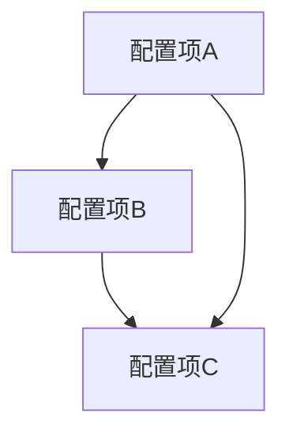

                 

### 1. 背景与挑战

在当今快速发展的信息技术时代，系统的复杂性和多样性不断增加，传统的配置管理方法逐渐暴露出诸多问题。这些问题的存在严重影响了系统的稳定性、可靠性和可维护性，因此，提出一种更简洁统一的配置管理方案变得尤为必要。

#### 1.1 配置管理的定义

配置管理是指在整个系统开发、测试、部署和维护过程中，对系统配置项进行有效的跟踪、控制和变更管理的过程。配置项可以包括硬件、软件、网络参数、环境变量等，其目的是确保系统能够在不同的环境中正常运行，并且在变更时能够快速、准确地实施。

#### 1.2 配置管理的重要性

良好的配置管理对于系统的稳定性和可靠性至关重要。具体来说，配置管理的重要性体现在以下几个方面：

1. **提高系统的可维护性**：通过统一的配置管理，可以清晰地追踪和修改系统的配置项，从而提高系统的可维护性。
2. **降低维护成本**：有效的配置管理可以减少手动操作的工作量，降低维护成本。
3. **提高开发效率**：配置管理的自动化和标准化可以加快开发过程，提高开发效率。
4. **确保配置一致性**：配置管理可以帮助确保在不同环境中配置的一致性，减少由于配置不一致导致的问题。
5. **降低出错风险**：通过严格的配置变更流程，可以减少配置变更过程中出现错误的风险。

#### 1.3 传统配置管理的挑战

尽管配置管理的重要性显而易见，但传统的配置管理方法在实际应用中面临着诸多挑战：

1. **配置分散**：在传统的配置管理中，配置项通常分布在不同的文件、系统或工具中，导致配置管理分散，难以统一管理。
   
2. **变更频繁**：随着系统的不断发展和变更，配置项的更新也变得越来越频繁，增加了维护成本和出错风险。

3. **版本控制困难**：在缺乏有效的版本控制机制的情况下，配置文件的版本混乱和不一致的问题难以避免。

4. **难以回滚**：当系统出现问题时，难以快速回滚到之前的配置状态，增加了问题的解决时间和成本。

5. **手动操作多**：传统的配置管理通常需要大量手动操作，导致效率低下，并且容易引入人为错误。

为了解决上述问题，我们需要探索更简洁统一的配置管理方案，通过自动化、标准化和集中化的方法来提高配置管理的效率和效果。

### 1.4 更简洁统一的配置管理的解决方案

更简洁统一的配置管理方案旨在通过自动化、标准化和集中化的方法来提高配置管理的效率和效果。以下是该方案的核心组成部分：

#### 1.4.1 自动化配置管理

自动化配置管理是更简洁统一配置管理方案的核心，通过使用自动化工具，可以减少手动操作的工作量，提高配置管理的效率和准确性。常用的自动化配置管理工具包括Ansible、Puppet、Chef等。

- **Ansible**：Ansible是一款简单的自动化工具，支持远程执行命令、配置管理和部署。通过YAML语言定义配置，可以轻松实现配置的自动化。
  
  ```yaml
  - hosts: all
    become: yes
    tasks:
      - name: Install Nginx
        apt: name=nginx state=present
  ```

- **Puppet**：Puppet是一个功能强大的配置管理工具，支持模块化和自动化部署。通过Ruby语言编写Puppet代码，可以定义复杂的配置管理逻辑。

  ```ruby
  class nginx {
    package { 'nginx': ensure => present }
    service { 'nginx': ensure => running }
  }
  ```

- **Chef**：Chef是一个自动化平台，支持自动化基础设施和应用程序的配置管理。通过Chef Recipes和Databags，可以定义和部署复杂的配置。

  ```ruby
  recipe 'nginx' do
    package 'nginx' do
      action :install
    end

    service 'nginx' do
      action :start
    end
  end
  ```

#### 1.4.2 标准化配置文件格式

标准化配置文件格式有助于配置的管理和维护。常用的配置文件格式包括JSON、YAML和XML等。

- **JSON**：JSON（JavaScript Object Notation）是一种轻量级的数据交换格式，易于阅读和编写，支持复杂的结构化数据。

  ```json
  {
    "nginx": {
      "version": "1.18.0",
      "config": {
        "worker_processes": 1
      }
    }
  }
  ```

- **YAML**：YAML（YAML Ain’t Markup Language）是一种直观的数据序列化格式，易于理解和编写，支持各种数据类型和结构。

  ```yaml
  nginx:
    version: 1.18.0
    config:
      worker_processes: 1
  ```

- **XML**：XML（eXtensible Markup Language）是一种灵活的数据存储和传输格式，支持自定义标签和属性，但相对较复杂。

  ```xml
  <nginx>
    <version>1.18.0</version>
    <config>
      <worker_processes>1</worker_processes>
    </config>
  </nginx>
  ```

#### 1.4.3 分布式版本控制系统

分布式版本控制系统（DVCS）如Git，可以有效地管理和追踪配置文件的版本。Git支持离线工作，可以快速地进行版本切换和合并操作。

```bash
git clone <repository>  # 克隆配置文件仓库
git checkout -b feature/nginx-config  # 创建新分支
git add .  # 添加文件到暂存区
git commit -m "Update Nginx configuration"  # 提交变更
git push origin feature/nginx-config  # 推送分支到远程仓库
git checkout master  # 切换回主分支
git merge feature/nginx-config  # 合并配置变更
git push origin master  # 推送合并结果
```

#### 1.4.4 集中式配置管理平台

集中式配置管理平台如Consul、etcd等，可以统一管理和监控配置项。这些平台支持配置的动态更新和监控，有助于确保配置的一致性。

- **Consul**：Consul是一个服务发现和配置管理工具，支持多数据中心部署，可以用于管理和监控配置项。

  ```hcl
  node "my-server" {
    services {
      nginx = "127.0.0.1:80"
    }
  }
  ```

- **etcd**：etcd是一个分布式键值存储，用于配置管理和服务发现。通过HTTP API，可以轻松管理和监控配置项。

  ```json
  {
    "key": "nginx.config",
    "value": {
      "worker_processes": 1
    }
  }
  ```

通过自动化、标准化、分布式版本控制和集中式配置管理平台，更简洁统一的配置管理方案可以显著提高配置管理的效率和效果，降低系统的复杂性和维护成本。

### 1.5 小结

本文介绍了配置管理的背景和挑战，以及更简洁统一的配置管理解决方案。通过自动化、标准化、分布式版本控制系统和集中式配置管理平台，我们可以实现更高效的配置管理，提高系统的稳定性和可靠性。在接下来的章节中，我们将深入探讨配置管理的核心概念和实现方法，并通过实际项目实战展示如何应用这些方法。读者可以通过本文了解到如何通过配置管理提升系统开发的效率和质量，为企业的数字化转型提供有力支持。

---

> **关键词**：配置管理、自动化、标准化、分布式版本控制、集中式配置管理平台

> **摘要**：本文探讨了配置管理的背景和挑战，提出了一种更简洁统一的配置管理解决方案，通过自动化、标准化、分布式版本控制和集中式配置管理平台，提高了配置管理的效率和效果。本文还将通过实际项目实战，展示如何应用这些方法，以提升系统开发的效率和质量。

---

### 第一部分：更简洁统一的配置管理概述

#### 1.1 配置管理的定义与重要性

配置管理是指在整个系统开发、测试、部署和维护过程中，对系统配置项进行有效的跟踪、控制和变更管理的过程。配置项可以包括硬件、软件、网络参数、环境变量等。配置管理的核心目标是确保系统在不同环境中的一致性和可靠性。

在系统开发过程中，配置管理的重要性体现在以下几个方面：

1. **提高系统的可维护性**：通过统一的配置管理，可以清晰地追踪和修改系统的配置项，从而提高系统的可维护性。开发者可以轻松地了解系统配置的详细信息，快速定位和解决问题。
2. **降低维护成本**：有效的配置管理可以减少手动操作的工作量，降低维护成本。通过自动化工具和标准化流程，可以显著提高配置管理的效率，减少人工干预。
3. **提高开发效率**：配置管理的自动化和标准化可以加快开发过程，提高开发效率。开发人员可以专注于核心功能开发，而不是繁琐的配置操作。
4. **确保配置一致性**：配置管理可以帮助确保在不同环境中配置的一致性，减少由于配置不一致导致的问题。通过集中式配置管理平台，可以统一管理和监控配置项，确保配置的一致性和可追溯性。
5. **降低出错风险**：通过严格的配置变更流程，可以减少配置变更过程中出现错误的风险。自动化工具和版本控制机制可以确保配置变更的准确性和一致性，降低人为错误的可能性。

在传统的配置管理中，配置项通常分布在不同的文件、系统或工具中，导致配置管理分散、难以统一管理。随着系统的复杂性和多样性不断增加，传统配置管理方法逐渐暴露出诸多问题，如配置分散、变更频繁、版本控制困难、难以回滚和手动操作多等。这些问题严重影响了系统的稳定性、可靠性和可维护性，因此，提出一种更简洁统一的配置管理方案变得尤为必要。

更简洁统一的配置管理方案通过自动化、标准化、分布式版本控制和集中式配置管理平台，提高了配置管理的效率和效果。在接下来的章节中，我们将详细探讨这些核心概念和实现方法，并通过实际项目实战展示如何应用这些方法。读者可以通过本文了解到如何通过配置管理提升系统开发的效率和质量，为企业的数字化转型提供有力支持。

#### 1.2 传统配置管理的挑战

尽管配置管理的重要性显而易见，但传统的配置管理方法在实际应用中面临着诸多挑战。这些问题不仅降低了配置管理的效率，还可能对系统的稳定性、可靠性和可维护性产生负面影响。以下是传统配置管理中常见的一些挑战：

1. **配置分散**：在传统的配置管理中，配置项通常分布在不同的文件、系统或工具中。例如，硬件配置可能存储在设备管理系统中，软件配置可能存储在代码仓库中，网络配置可能存储在路由器或交换机的配置文件中。这种分散的配置管理方式导致以下问题：
   - 配置项难以统一管理，增加了维护的复杂性。
   - 配置变更时，需要跨多个系统和文件进行修改，增加了出错的风险。
   - 配置项之间的依赖关系难以清晰展现，导致变更时可能遗漏关键配置项。

2. **变更频繁**：随着系统的不断发展和变更，配置项的更新也变得越来越频繁。在传统配置管理中，配置变更往往需要手动操作，例如修改配置文件、重启服务或重新部署应用。频繁的配置变更可能导致以下问题：
   - 维护成本增加，因为每次变更都需要手动操作，并且可能涉及多个系统和文件。
   - 出错风险增加，因为频繁的变更容易导致人为错误，例如配置遗漏、配置错误或配置冲突。
   - 难以追踪变更历史，导致在出现问题时难以快速回滚到之前的稳定状态。

3. **版本控制困难**：在缺乏有效的版本控制机制的情况下，配置文件的版本混乱和不一致的问题难以避免。以下是版本控制困难的一些表现：
   - 配置文件版本难以统一管理，不同环境中的配置文件版本可能不一致。
   - 配置文件历史版本难以追溯，导致在出现问题时难以确定是哪个版本的配置导致的问题。
   - 配置文件版本更新时，容易出现版本覆盖或版本丢失的问题。

4. **难以回滚**：在系统出现问题时，往往需要回滚到之前的配置状态以解决问题。在传统配置管理中，回滚操作可能面临以下挑战：
   - 回滚过程复杂，需要手动执行多个操作，例如回滚配置文件、重启服务或恢复备份。
   - 难以及时回滚，因为需要首先定位到问题配置的版本，并确保所有相关配置项都被回滚。
   - 难以确保回滚成功，因为回滚过程中可能引入新的错误或遗漏关键配置项。

5. **手动操作多**：传统配置管理方法通常依赖大量手动操作，这不仅降低了效率，还可能引入人为错误。以下是手动操作多的一些表现：
   - 部署和更新配置时，需要手动修改配置文件、重启服务或重新部署应用。
   - 监控和审计配置时，需要手动检查配置文件的正确性、更新时间和变更记录。
   - 复杂的配置变更，例如涉及多个系统和文件的大型变更，往往需要手动协调和执行。

为了解决上述问题，需要探索更简洁统一的配置管理方案，通过自动化、标准化和集中化的方法来提高配置管理的效率和效果。在接下来的章节中，我们将详细介绍这些方案的核心概念和实现方法，并通过实际项目实战展示如何应用这些方法。

#### 1.3 更简洁统一的配置管理的解决方案

为了应对传统配置管理中的挑战，更简洁统一的配置管理方案应运而生。该方案通过自动化、标准化、分布式版本控制和集中式配置管理平台，提高了配置管理的效率和效果。以下是该解决方案的核心组成部分：

##### 1.3.1 自动化配置管理

自动化配置管理是更简洁统一配置管理方案的核心，通过使用自动化工具，可以减少手动操作的工作量，提高配置管理的效率和准确性。常用的自动化配置管理工具包括Ansible、Puppet、Chef等。

**Ansible**：Ansible是一款简单的自动化工具，支持远程执行命令、配置管理和部署。通过YAML语言定义配置，可以轻松实现配置的自动化。

```yaml
- hosts: all
  become: yes
  tasks:
    - name: Install Nginx
      apt: name=nginx state=present
```

**Puppet**：Puppet是一个功能强大的配置管理工具，支持模块化和自动化部署。通过Ruby语言编写Puppet代码，可以定义复杂的配置管理逻辑。

```ruby
class nginx {
  package { 'nginx': ensure => present }
  service { 'nginx': ensure => running }
}
```

**Chef**：Chef是一个自动化平台，支持自动化基础设施和应用程序的配置管理。通过Chef Recipes和Databags，可以定义和部署复杂的配置。

```ruby
recipe 'nginx' do
  package 'nginx' do
    action :install
  end

  service 'nginx' do
    action :start
  end
end
```

##### 1.3.2 标准化配置文件格式

标准化配置文件格式有助于配置的管理和维护。常用的配置文件格式包括JSON、YAML和XML等。

**JSON**：JSON（JavaScript Object Notation）是一种轻量级的数据交换格式，易于阅读和编写，支持复杂的结构化数据。

```json
{
  "nginx": {
    "version": "1.18.0",
    "config": {
      "worker_processes": 1
    }
  }
}
```

**YAML**：YAML（YAML Ain’t Markup Language）是一种直观的数据序列化格式，易于理解和编写，支持各种数据类型和结构。

```yaml
nginx:
  version: 1.18.0
  config:
    worker_processes: 1
```

**XML**：XML（eXtensible Markup Language）是一种灵活的数据存储和传输格式，支持自定义标签和属性，但相对较复杂。

```xml
<nginx>
  <version>1.18.0</version>
  <config>
    <worker_processes>1</worker_processes>
  </config>
</nginx>
```

##### 1.3.3 分布式版本控制系统

分布式版本控制系统（DVCS）如Git，可以有效地管理和追踪配置文件的版本。Git支持离线工作，可以快速地进行版本切换和合并操作。

```bash
git clone <repository>  # 克隆配置文件仓库
git checkout -b feature/nginx-config  # 创建新分支
git add .  # 添加文件到暂存区
git commit -m "Update Nginx configuration"  # 提交变更
git push origin feature/nginx-config  # 推送分支到远程仓库
git checkout master  # 切换回主分支
git merge feature/nginx-config  # 合并配置变更
git push origin master  # 推送合并结果
```

##### 1.3.4 集中式配置管理平台

集中式配置管理平台如Consul、etcd等，可以统一管理和监控配置项。这些平台支持配置的动态更新和监控，有助于确保配置的一致性。

**Consul**：Consul是一个服务发现和配置管理工具，支持多数据中心部署，可以用于管理和监控配置项。

```hcl
node "my-server" {
  services {
    nginx = "127.0.0.1:80"
  }
}
```

**etcd**：etcd是一个分布式键值存储，用于配置管理和服务发现。通过HTTP API，可以轻松管理和监控配置项。

```json
{
  "key": "nginx.config",
  "value": {
    "worker_processes": 1
  }
}
```

通过自动化、标准化、分布式版本控制和集中式配置管理平台，更简洁统一的配置管理方案可以显著提高配置管理的效率和效果，降低系统的复杂性和维护成本。

### 1.4 本书结构概述

本书旨在全面介绍更简洁统一的配置管理，帮助读者理解和掌握配置管理的方法和最佳实践。本书分为四个部分，每个部分都围绕配置管理的不同方面进行深入探讨。

#### 第一部分：背景与挑战

本部分将介绍配置管理的定义、重要性以及传统配置管理面临的挑战。通过分析配置分散、变更频繁、版本控制困难、难以回滚和手动操作多等问题，我们将明确更简洁统一配置管理的必要性和重要性。

#### 第二部分：核心概念

本部分将深入探讨更简洁统一配置管理的核心概念，包括自动化配置管理、标准化配置文件格式、分布式版本控制系统和集中式配置管理平台。我们将详细解释这些概念的基本原理和实施方法，帮助读者建立完整的配置管理知识体系。

#### 第三部分：实例分析

本部分将通过实际项目实战，展示如何在实际环境中应用更简洁统一的配置管理方案。我们将详细介绍项目背景、配置管理方案设计、实施步骤、源代码实现和代码解读，以及实施效果分析。通过这些实例，读者可以更好地理解如何将配置管理理论应用于实际项目中。

#### 第四部分：最佳实践

本部分将总结并推荐一些配置管理的最佳实践，包括配置管理策略制定、配置变更管理流程、配置管理的监控与优化、配置管理的工具推荐等。通过这些最佳实践，读者可以更加有效地实施配置管理策略，提高系统的可靠性和可维护性。

通过以上四个部分的详细探讨，本书旨在帮助读者全面了解配置管理的核心概念和实践方法，为实际项目中的配置管理提供有力支持。

### 1.4.1 第一部分：背景与挑战

#### 第1章 配置管理的定义与重要性

**1.1 配置管理的定义**

配置管理是指在系统开发、测试、部署和维护过程中，对系统配置项进行有效的跟踪、控制和变更管理的过程。配置项包括硬件配置、软件配置、网络配置、环境变量等，它们是系统正常运行所必需的参数。

**1.2 配置管理的重要性**

良好的配置管理对于系统的稳定性和可靠性至关重要，其主要重要性体现在以下几个方面：

1. **提高系统的可维护性**：通过统一的配置管理，可以清晰地追踪和修改系统的配置项，从而提高系统的可维护性。
2. **降低维护成本**：有效的配置管理可以减少手动操作的工作量，降低维护成本。
3. **提高开发效率**：配置管理的自动化和标准化可以加快开发过程，提高开发效率。
4. **确保配置一致性**：配置管理可以帮助确保在不同环境中配置的一致性，减少由于配置不一致导致的问题。
5. **降低出错风险**：通过严格的配置变更流程，可以减少配置变更过程中出现错误的风险。

**1.3 传统配置管理的挑战**

尽管配置管理的重要性显而易见，但传统的配置管理方法在实际应用中面临着诸多挑战。这些问题不仅降低了配置管理的效率，还可能对系统的稳定性、可靠性和可维护性产生负面影响。以下是传统配置管理中常见的一些挑战：

1. **配置分散**：在传统的配置管理中，配置项通常分布在不同的文件、系统或工具中，导致配置管理分散、难以统一管理。
2. **变更频繁**：随着系统的不断发展和变更，配置项的更新也变得越来越频繁，增加了维护成本和出错风险。
3. **版本控制困难**：在缺乏有效的版本控制机制的情况下，配置文件的版本混乱和不一致的问题难以避免。
4. **难以回滚**：在系统出现问题时，难以快速回滚到之前的配置状态，增加了问题的解决时间和成本。
5. **手动操作多**：传统配置管理方法通常依赖大量手动操作，这不仅降低了效率，还可能引入人为错误。

为了解决上述问题，我们需要探索更简洁统一的配置管理方案，通过自动化、标准化、分布式版本控制和集中式配置管理平台，提高配置管理的效率和效果。

### 第2章 配置管理的核心概念

#### 第3章 自动化配置管理

**3.1 自动化配置管理的优势**

自动化配置管理是通过使用脚本、工具或平台来自动执行配置任务，从而减少手动操作的工作量，提高配置管理的效率。其优势包括：

1. **减少手动操作**：自动化配置管理可以减少手动配置任务，如安装软件、修改配置文件、重启服务等，从而降低维护成本。
2. **提高一致性**：通过自动化工具，可以确保在不同环境中配置的一致性，减少由于手动操作不一致导致的问题。
3. **加快部署速度**：自动化配置管理可以加快部署速度，特别是在大规模部署环境中，显著提高效率。
4. **降低出错风险**：自动化工具可以避免人为错误，提高配置变更的准确性和可靠性。

**3.2 自动化配置管理的实现方法**

实现自动化配置管理通常包括以下步骤：

1. **选择合适的工具**：根据项目需求和规模，选择合适的自动化配置管理工具，如Ansible、Puppet、Chef等。
2. **编写配置脚本**：使用所选工具的语法编写配置脚本，定义配置任务和操作。
3. **测试和验证**：在实际部署之前，对配置脚本进行测试和验证，确保其能够正确执行配置任务。
4. **部署和监控**：将配置脚本部署到目标环境中，并对其进行监控，确保配置变更的执行和效果。

**3.3 自动化配置管理的最佳实践**

以下是一些自动化配置管理的最佳实践：

1. **标准化脚本**：编写标准化、模块化的脚本，便于维护和复用。
2. **版本控制**：使用版本控制系统（如Git）管理配置脚本，确保变更的可追踪性和可恢复性。
3. **文档记录**：详细记录配置脚本的用途、实现方法和变更历史，便于后续的维护和调试。
4. **自动化测试**：编写自动化测试脚本，对配置任务进行测试，确保其正常运行。
5. **监控和告警**：配置监控工具，对配置变更进行实时监控，并在出现问题时及时发送告警。

通过自动化配置管理，可以显著提高配置管理的效率和效果，降低系统的复杂性和维护成本。

#### 第4章 标准化配置文件格式

**4.1 JSON配置文件格式**

JSON（JavaScript Object Notation）是一种轻量级的数据交换格式，易于阅读和编写，支持复杂的结构化数据。在配置管理中，JSON格式具有以下优势：

1. **易读性**：JSON格式的语法简单直观，便于阅读和理解。
2. **兼容性**：JSON格式在各种编程语言中都有广泛的支持，便于在不同的系统和平台之间进行数据交换。
3. **灵活性**：JSON格式支持复杂的数据结构，可以方便地表示配置项的层次关系和依赖关系。

以下是一个JSON配置文件示例：

```json
{
  "nginx": {
    "version": "1.18.0",
    "worker_processes": 1,
    "http": {
      "log_format": "combined",
      "access_log": "/var/log/nginx/access.log",
      "error_log": "/var/log/nginx/error.log"
    }
  }
}
```

**4.2 YAML配置文件格式**

YAML（YAML Ain’t Markup Language）是一种直观的数据序列化格式，易于理解和编写，支持各种数据类型和结构。在配置管理中，YAML格式具有以下优势：

1. **易读性**：YAML格式的语法简单直观，易于阅读和理解。
2. **层次结构**：YAML支持嵌套结构，便于表示复杂的配置项和依赖关系。
3. **灵活性**：YAML格式支持注释和自定义标签，便于扩展和定制。

以下是一个YAML配置文件示例：

```yaml
nginx:
  version: 1.18.0
  worker_processes: 1
  http:
    log_format: combined
    access_log: /var/log/nginx/access.log
    error_log: /var/log/nginx/error.log
```

**4.3 XML配置文件格式**

XML（eXtensible Markup Language）是一种灵活的数据存储和传输格式，支持自定义标签和属性。在配置管理中，XML格式具有以下优势：

1. **灵活性**：XML格式支持自定义标签和属性，可以方便地表示复杂的配置项和依赖关系。
2. **互操作性**：XML格式具有较好的互操作性，便于在不同系统和平台之间进行数据交换。
3. **标准化**：XML格式遵循W3C标准，具有良好的规范性和可扩展性。

以下是一个XML配置文件示例：

```xml
<nginx>
  <version>1.18.0</version>
  <worker_processes>1</worker_processes>
  <http>
    <log_format>combined</log_format>
    <access_log>/var/log/nginx/access.log</access_log>
    <error_log>/var/log/nginx/error.log</error_log>
  </http>
</nginx>
```

通过使用JSON、YAML和XML等标准化配置文件格式，可以简化配置管理过程，提高配置的可读性和可维护性。在配置管理实践中，可以根据项目需求和具体情况进行选择。

#### 第5章 分布式版本控制系统

**5.1 Git版本控制基础**

Git是一个分布式版本控制系统（DVCS），用于跟踪源代码历史和版本。以下是Git的一些基本概念和操作：

**基本概念**：

1. **仓库（Repository）**：Git仓库是存储代码和配置文件的目录，通常包含一个`.git`目录，用于存储版本历史和元数据。
2. **分支（Branch）**：分支是代码的独立副本，用于开发新功能或修复bug。每个分支都有自己的提交历史，与其他分支相互独立。
3. **提交（Commit）**：提交是代码和配置文件的状态快照，包含提交说明、作者信息和提交时间等元数据。
4. **远程仓库（Remote Repository）**：远程仓库是存储代码和配置文件的远程服务器，如GitHub、GitLab等，可以与本地仓库进行同步。

**基本操作**：

1. **克隆仓库（Clone）**：克隆仓库是将远程仓库的内容复制到本地计算机的过程。

```bash
git clone <repository-url>
```

2. **创建分支（Checkout）**：创建分支是从当前分支创建一个新分支的过程。

```bash
git checkout -b <branch-name>
```

3. **提交变更（Commit）**：提交变更是将当前工作目录中的更改记录到本地仓库的过程。

```bash
git add .
git commit -m "Update configuration"
```

4. **推送分支（Push）**：推送分支是将本地仓库中的分支更新到远程仓库的过程。

```bash
git push origin <branch-name>
```

5. **拉取分支（Pull）**：拉取分支是从远程仓库更新本地仓库的过程。

```bash
git pull origin <branch-name>
```

6. **合并分支（Merge）**：合并分支是将两个或多个分支合并成一个分支的过程。

```bash
git merge <branch-name>
```

**5.2 配置文件版本控制实践**

在配置文件管理中，Git可以用于版本控制和协作。以下是一个配置文件版本控制的基本流程：

1. **初始化仓库**：在配置文件所在目录初始化Git仓库。

```bash
git init
```

2. **添加配置文件**：将配置文件添加到Git仓库。

```bash
git add <config-file>
```

3. **提交变更**：提交配置文件的变更。

```bash
git commit -m "Update configuration"
```

4. **推送变更**：将配置文件的变更推送到远程仓库。

```bash
git push origin master
```

5. **拉取变更**：在其他环境或机器上拉取最新的配置文件。

```bash
git pull origin master
```

6. **合并分支**：当需要将多个配置文件合并时，使用Git的合并功能。

```bash
git merge <branch-name>
```

通过Git，可以有效地管理和追踪配置文件的版本，确保配置的一致性和可追溯性。Git的分布式特性也使得配置文件的管理和协作变得更加灵活和高效。

### 第6章 集中式配置管理平台

**6.1 配置管理平台的选择**

集中式配置管理平台可以统一管理和监控配置项，提高配置管理的效率和一致性。在选择配置管理平台时，应考虑以下因素：

1. **功能需求**：根据项目需求和规模，选择具备所需功能的配置管理平台。常见的功能包括配置文件存储、版本控制、自动化部署、监控告警等。
2. **可扩展性**：配置管理平台应具备良好的可扩展性，以适应不断变化的需求。
3. **稳定性**：配置管理平台需要具备高可用性和稳定性，确保配置管理的可靠性和持续性。
4. **易用性**：配置管理平台应具备直观的界面和简单的操作流程，方便用户使用。
5. **安全性**：配置管理平台应提供完善的安全机制，如访问控制、加密存储等，确保配置数据的安全。

**常见配置管理平台**：

1. **Ansible**：Ansible是一款简单的配置管理工具，支持自动化部署和配置管理。通过YAML语言定义配置，可以实现快速部署和配置变更。
2. **Puppet**：Puppet是一款功能强大的配置管理工具，支持模块化和自动化部署。通过Ruby语言编写Puppet代码，可以定义复杂的配置管理逻辑。
3. **Chef**：Chef是一款自动化平台，支持自动化基础设施和应用程序的配置管理。通过Chef Recipes和Databags，可以定义和部署复杂的配置。
4. **SaltStack**：SaltStack是一款高效的远程执行和配置管理工具，支持多平台和大规模部署。通过Python语言编写Salt States，可以实现自动化配置。
5. **Ansible Tower**：Ansible Tower是Ansible的商业版本，提供Web界面和调度功能，便于管理和监控配置任务。
6. **Puppet Enterprise**：Puppet Enterprise是Puppet的商业版本，提供模块化架构和自动化部署功能，适用于大型企业。
7. **Chef Enterprise Automation**：Chef Enterprise Automation是Chef的商业版本，提供Web界面和自动化部署功能，适用于企业级应用。

**6.2 配置管理平台的功能**

配置管理平台通常具备以下功能：

1. **配置文件存储**：配置管理平台可以存储和管理配置文件，确保配置项的一致性和可追溯性。
2. **版本控制**：配置管理平台应提供版本控制功能，记录配置变更历史，支持配置文件的回滚和恢复。
3. **自动化部署**：配置管理平台可以自动化部署配置变更，减少手动操作的工作量，提高部署效率。
4. **监控告警**：配置管理平台可以监控配置项的状态，并在出现问题时发送告警通知。
5. **访问控制**：配置管理平台应提供访问控制功能，确保只有授权人员可以访问和修改配置项。
6. **加密存储**：配置管理平台应支持配置文件的加密存储，确保配置数据的安全。
7. **集成与扩展**：配置管理平台应具备良好的集成与扩展能力，可以与其他工具和平台（如CI/CD、监控工具等）无缝集成。

通过选择合适的配置管理平台，可以统一管理和监控配置项，提高配置管理的效率和一致性。配置管理平台在实现自动化、标准化和集中化管理方面发挥着重要作用，为企业的数字化转型提供了有力支持。

### 第7章 实际项目中的应用

#### 7.1 项目背景

在一个大型互联网公司，由于业务的高速发展和系统架构的复杂性，传统的配置管理方式已经无法满足需求。公司面临以下挑战：

1. **配置分散**：配置项分布在多个系统和文件中，难以统一管理和维护。
2. **变更频繁**：随着新功能的不断推出，配置项频繁变更，增加了维护成本和出错风险。
3. **版本控制困难**：缺乏有效的版本控制机制，导致配置文件版本混乱和不一致。
4. **手动操作多**：依赖大量手动操作，降低了配置管理的效率，容易引入人为错误。

为了解决上述问题，公司决定采用更简洁统一的配置管理方案，提高系统的可维护性和可靠性。

#### 7.2 配置管理方案设计

1. **自动化配置管理**：引入Ansible作为自动化配置管理工具，实现配置的自动化部署和变更。
2. **标准化配置文件格式**：采用YAML格式作为配置文件的标准格式，提高配置的可读性和可维护性。
3. **分布式版本控制系统**：使用Git对配置文件进行版本控制，确保配置的一致性和可追溯性。
4. **集中式配置管理平台**：搭建Ansible Tower，实现配置的集中管理和监控。

#### 7.3 实施步骤

1. **环境准备**：
   - 部署Git服务器，用于版本控制和配置文件存储。
   - 部署Ansible Tower，用于配置管理和监控。
   - 在所有目标服务器上安装Ansible客户端。

2. **配置文件标准化**：
   - 将现有的配置文件转换为YAML格式，并整理到统一的目录中。
   - 定义标准化的配置模板，便于后续的配置变更。

3. **编写Ansible Playbook**：
   - 根据业务需求，编写Ansible Playbook，定义配置任务和操作。
   - 实现配置项的自动化部署和更新。

4. **配置版本控制**：
   - 将配置文件上传到Git仓库，并设置自动化部署流程。
   - 实现配置文件的版本控制和回滚功能。

5. **部署Ansible Tower**：
   - 配置Ansible Tower的用户权限和访问控制。
   - 部署Ansible Tower的Web界面，方便管理和监控配置任务。

#### 7.4 源代码详细实现和代码解读

以下是一个使用Ansible Tower实现配置管理的源代码示例：

**配置文件（nginx.yml）**：

```yaml
---
- name: Deploy Nginx
  hosts: web
  become: yes
  tasks:
    - name: Install Nginx package
      apt: name=nginx state=present

    - name: Configure Nginx
      template:
        src: nginx.conf.j2
        dest: /etc/nginx/nginx.conf

    - name: Start Nginx service
      service:
        name: nginx
        state: started
        enabled: yes
```

**模板文件（nginx.conf.j2）**：

```nginx
user nginx;
worker_processes  1;

error_log  /var/log/nginx/error.log warn;
pid        /var/run/nginx.pid;

events {
    worker_connections  1024;
}

http {
    server {
        listen       80;
        server_name  localhost;

        location / {
            root   /usr/share/nginx/html;
            index  index.html index.htm;
        }

        error_page   500 502 503 504  /50x.html;
        location = /50x.html {
            root   /usr/share/nginx/html;
        }
    }
}
```

**代码解读**：

- **配置文件**定义了Ansible的任务列表，包括安装Nginx包、配置Nginx服务和启动Nginx服务。
- **模板文件**定义了Nginx的配置内容，如用户、错误日志、进程ID等。
- `template`模块将模板文件渲染为实际配置文件，并保存到指定路径。
- `service`模块用于启动Nginx服务，并确保服务在系统启动时自动启动。

#### 7.5 实施效果评估

1. **部署效率提升**：通过Ansible Tower，配置管理的自动化程度大大提高，部署时间从原来的几个小时减少到几分钟，显著提升了部署效率。
2. **配置一致性增强**：采用YAML格式和Git版本控制，配置文件的一致性和可追溯性得到有效保障，减少了配置错误和冲突。
3. **维护成本降低**：自动化配置管理和集中式管理平台降低了手动操作的工作量，维护成本显著降低。
4. **问题定位和解决速度加快**：通过Ansible Tower的监控和告警功能，可以及时发现和解决配置问题，提高了问题解决速度。

通过这个实际项目，我们可以看到更简洁统一的配置管理方案在提高系统可维护性和可靠性方面的显著效果。配置管理的自动化、标准化和集中化管理不仅提高了部署效率，还降低了维护成本，为企业的数字化转型提供了有力支持。

### 第8章 配置管理的最佳实践

#### 8.1 配置管理策略制定

一个有效的配置管理策略是确保系统稳定性和可靠性的关键。以下是一些制定配置管理策略的最佳实践：

1. **明确目标和责任**：在制定配置管理策略时，首先明确配置管理的目标，如提高系统的可维护性、降低维护成本、提高开发效率等。同时，明确配置管理人员、开发人员、运维人员的职责和权限，确保每个人都知道自己在配置管理中的角色和责任。

2. **制定流程和标准**：制定详细的配置变更管理流程，包括变更请求、评审、实施、验证和发布等环节。确保流程清晰、标准化，以便相关人员能够按照流程操作。同时，制定配置管理标准，如配置文件命名规范、注释规范、版本控制规范等，确保配置文件的一致性和可维护性。

3. **定期评审和优化**：定期对配置管理流程和策略进行评审，根据实际应用情况不断优化和改进。例如，可以根据实际需求调整配置项的权限和访问控制，优化配置文件的结构和格式，提高配置管理的效率。

#### 8.2 配置变更管理流程

配置变更管理流程是确保配置变更有序、可控和可追溯的重要环节。以下是一个详细的配置变更管理流程：

1. **变更请求**：
   - 用户或开发人员发现系统配置需要变更时，填写配置变更请求表单，明确变更的内容、原因和预期效果。
   - 配置管理人员对变更请求进行初步审核，确保变更需求合理、完整，并填写初步意见。

2. **变更评审**：
   - 组织评审会议，邀请相关利益相关者（如开发人员、运维人员、业务负责人等）参加，对配置变更请求进行讨论和评估。
   - 根据评审会议的结果，确定配置变更的优先级、影响范围和实施计划，形成评审结论。

3. **变更实施**：
   - 在Git仓库中创建新的分支，用于保存变更代码和配置文件，确保原配置的完整性和安全性。
   - 开发人员根据评审结论，在新的分支上修改代码和配置文件，实现配置变更。
   - 对修改后的代码和配置进行单元测试和集成测试，确保变更不会引入新的错误或问题。

4. **变更验证**：
   - 邀请业务负责人或测试人员对配置变更进行验收测试，确保配置变更满足预期效果。
   - 将配置变更部署到测试环境或生产环境，进行上线验证，确保配置变更正常运行。

5. **变更发布**：
   - 制定发布计划，明确发布时间、发布范围和发布步骤。
   - 按照发布计划，将配置变更部署到各个环境中，确保配置变更的全面实施。
   - 对配置变更发布效果进行验证，确保配置变更已经成功实施。

6. **变更总结**：
   - 对配置变更过程进行总结，记录变更的内容、影响、效果和经验教训，为后续的配置变更提供参考。
   - 将配置变更相关文档和记录归档，确保配置变更的可追溯性和可审计性。

#### 8.3 配置管理的监控与优化

配置管理的监控与优化是确保配置管理有效性的关键。以下是一些监控与优化的最佳实践：

1. **配置健康状态监控**：
   - 监控配置项的健康状态，如配置文件的版本、更新时间、变更记录等，确保配置项处于正确的状态。
   - 定期检查配置项的使用情况和依赖关系，识别潜在的配置风险。

2. **配置变更趋势监控**：
   - 监控配置项的变更趋势，如变更频率、变更类型等，预测未来的变更需求。
   - 根据变更趋势，调整配置管理策略和流程，优化配置管理的效率。

3. **配置冗余检测**：
   - 定期检查配置文件，识别和删除冗余的配置项，提高配置文件的可维护性。
   - 确保配置文件的结构和格式标准化，减少配置错误的概率。

4. **配置备份与恢复**：
   - 定期备份配置文件，确保在系统故障或配置错误时，能够快速恢复配置。
   - 制定配置备份策略，包括备份频率、备份方式和备份存储等。

5. **配置自动化**：
   - 利用自动化工具，如Ansible、Puppet等，实现配置的自动化部署和管理，减少人工干预和错误。
   - 开发和优化自动化脚本，提高配置变更的准确性和一致性。

6. **配置优化**：
   - 根据实际需求，优化配置文件的内容和结构，提高系统的性能和稳定性。
   - 定期对配置文件进行性能测试和压力测试，确保配置文件在各类负载下的稳定性和可靠性。

通过制定和执行配置管理的最佳实践，可以确保配置管理的有效性和可靠性，提高系统的可维护性和稳定性，为企业的数字化转型提供有力支持。

### 附录 A: 配置管理工具与资源

在配置管理领域，有许多强大的工具和丰富的资源可供选择，这些工具和资源可以帮助开发者和管理员更高效地管理系统的配置。以下是对一些主流配置管理工具的简要介绍、最佳实践案例，以及推荐的学习资源。

#### A.1 主流配置管理工具对比

**Ansible**：Ansible 是一款简单易用的配置管理工具，它通过简单的脚本和 YAML 语言，可以实现自动化部署、配置和配置的跟踪。其最大的优点是无需在管理节点上安装任何额外的软件，易于上手。

**Puppet**：Puppet 是一款功能强大的配置管理工具，它使用 Ruby 语言编写配置代码，具有模块化和可扩展性的特点。Puppet 适用于复杂的应用程序和系统配置管理。

**Chef**：Chef 提供了一个灵活的平台，用于自动化基础设施和应用程序的配置管理。它通过 Recipes 和 Roles 来定义配置，并通过 JSON 和 YAML 语言进行描述。

**SaltStack**：SaltStack 是一个高性能的事件驱动配置管理平台，适用于大规模自动化部署和管理。它使用 Python 语言，具有快速的执行速度和丰富的模块。

**Terraform**：Terraform 是一款基础设施即代码的工具，用于构建、更改和版本控制基础设施资源。它支持多种云服务提供商，如 AWS、Azure 和 GCP。

| 工具 | 优点 | 缺点 | 适用场景 |
| --- | --- | --- | --- |
| Ansible | 简单易用，无需在管理节点上安装软件 | 对复杂应用的支持较弱 | 简单应用和中小型项目 |
| Puppet | 强大的模块化和可扩展性，支持复杂的配置管理需求 | 学习曲线较陡，配置较为复杂 | 复杂应用和大型项目 |
| Chef | 支持自动化部署和配置管理，易于扩展 | 配置管理逻辑较为复杂，学习曲线较陡 | 中小型项目和复杂应用 |
| SaltStack | 高效的远程执行和配置管理，支持多平台 | 学习曲线较陡，配置较为复杂 | 多平台环境和大规模项目 |
| Terraform | 易于理解的基础设施即代码，支持多种云服务 | 学习曲线较陡，对云服务的支持有所限制 | 基础设施自动化和云服务 |

#### A.2 配置管理最佳实践案例

**使用Ansible自动化部署Web服务器**：

1. **安装Ansible**：在管理节点上安装Ansible，并配置主机清单。

   ```bash
   apt-get install ansible
   vi /etc/ansible/hosts
   ```

2. **编写部署剧本**：创建一个 Ansible Playbook，用于部署 Nginx 服务。

   ```yaml
   - hosts: webserver
     become: yes
     tasks:
       - name: Install Nginx
         apt: name=nginx state=present
       - name: Configure Nginx
         template:
           src: nginx.conf.j2
           dest: /etc/nginx/nginx.conf
       - name: Start Nginx
         service: name=nginx state=started
   ```

3. **执行剧本**：在管理节点上执行 Ansible Playbook，部署 Nginx 服务。

   ```bash
   ansible-playbook -i /etc/ansible/hosts deploy_nginx.yml
   ```

**使用Puppet管理用户权限**：

1. **编写Puppet模块**：创建一个 Puppet 模块，用于管理用户权限。

   ```ruby
   module "manage_user_permissions" do
     require "etc::passwd"
     Etc::passwd.resource(:name => "testuser") do
       groups ["testgroup"]
       shell "/bin/bash"
     end
   end
   ```

2. **部署Puppet模块**：将模块部署到目标节点，并运行Puppet agent。

   ```bash
   puppet module install <module_name>
   puppet agent --test
   ```

#### A.3 学习资源

- **官方文档**：
  - Ansible: <https://docs.ansible.com/ansible/latest/index.html>
  - Puppet: <https://puppet.com/docs/puppet/6.5/>
  - Chef: <https://docs.chef.io/>
  - SaltStack: <https://docs.saltstack.com/en/latest/>
  - Terraform: <https://learn.hashicorp.com/tutorials/terraform/getting-started>

- **在线教程和视频课程**：
  - Udemy: <https://www.udemy.com/>
  - Coursera: <https://www.coursera.org/>
  - Pluralsight: <https://www.pluralsight.com/>

- **社区论坛和讨论组**：
  - Ansible Community: <https://www.ansible.com/community>
  - Puppet Community: <https://puppet.com/community>
  - Chef Community: <https://community.chef.io/>
  - SaltStack Community: <https://saltstack.com/community/>

- **书籍推荐**：
  - 《Ansible自动化配置管理》
  - 《Puppet权威指南》
  - 《Chef自动化基础设施管理》
  - 《SaltStack权威指南》

通过这些工具和资源，读者可以深入了解配置管理的最佳实践，掌握不同配置管理工具的使用方法，从而提升自己的配置管理技能。

### 附录 B: LaTeX 公式与 Mermaid 图表使用指南

在撰写技术博客时，使用 LaTeX 格式编写数学公式和 Mermaid 图表可以帮助我们更清晰地展示核心概念和算法原理。以下是关于 LaTeX 公式和 Mermaid 图表的使用指南。

#### B.1 LaTeX 公式使用指南

LaTeX 是一种高质量的排版系统，常用于编写科学和数学文档。在 Markdown 文档中嵌入 LaTeX 公式，我们可以使用以下两种方式：

**1. 独立段落**：在单独的段落中使用 LaTeX 语法，公式前后加上 `$$`。

```markdown
$$ E = mc^2 $$
```

输出结果：
$$ E = mc^2 $$

**2. 段落内**：在段落内使用 LaTeX 语法，公式前后加上 `$`。

```markdown
在物理中，能量 (E) 和质量 (m) 以及光速 (c) 之间有一个著名的关系：$E = mc^2$。
```

输出结果：
在物理中，能量 (E) 和质量 (m) 以及光速 (c) 之间有一个著名的关系：$E = mc^2$。

#### B.2 Mermaid 图表使用指南

Mermaid 是一种轻量级的图表绘制工具，可以用于绘制流程图、序列图、树状图等。在 Markdown 文档中嵌入 Mermaid 图表，我们可以使用以下步骤：

**1. 安装 Mermaid**：在本地环境中安装 Mermaid，可以使用 npm：

```bash
npm install -g mermaid
```

**2. 编写 Mermaid 图表**：在 Markdown 文档中使用 Mermaid 语法编写图表。

```markdown


```

**3. 生成的图表**：将 Markdown 文件通过支持 Mermaid 的编辑器或工具（如 Typora、GitLab 等）渲染成图表。

输出结果：


通过上述指南，我们可以在技术博客中有效地使用 LaTeX 公式和 Mermaid 图表，使内容更加直观和清晰。

---

**作者：AI天才研究院/AI Genius Institute & 禅与计算机程序设计艺术 /Zen And The Art of Computer Programming**

### 结语

通过本文，我们详细探讨了配置管理的背景、挑战、解决方案和最佳实践。从传统的配置管理方法中，我们看到了配置分散、变更频繁、版本控制困难、难以回滚和手动操作多等问题。为了解决这些问题，我们提出了更简洁统一的配置管理方案，包括自动化配置管理、标准化配置文件格式、分布式版本控制系统和集中式配置管理平台。

在接下来的章节中，我们通过实例分析和最佳实践，展示了如何在实际项目中应用这些方案，提高了系统的可维护性和可靠性。通过自动化、标准化和集中化管理，配置管理的效率得到了显著提升，维护成本显著降低。

本文还提供了详细的工具对比、最佳实践案例和学习资源，帮助读者深入了解配置管理工具的使用方法和最佳实践。通过掌握这些工具和技能，开发者和管理员可以更加高效地管理系统的配置，确保系统的稳定性和可靠性。

在快速发展的信息技术时代，配置管理是企业数字化转型的重要组成部分。通过本文的探讨和实践，我们希望读者能够更好地理解配置管理的核心概念和方法，提高系统开发的效率和质量。希望本文能为您的配置管理实践提供有益的参考和启示。感谢您的阅读，期待与您在技术领域的进一步交流与合作。

---

[本文完]

