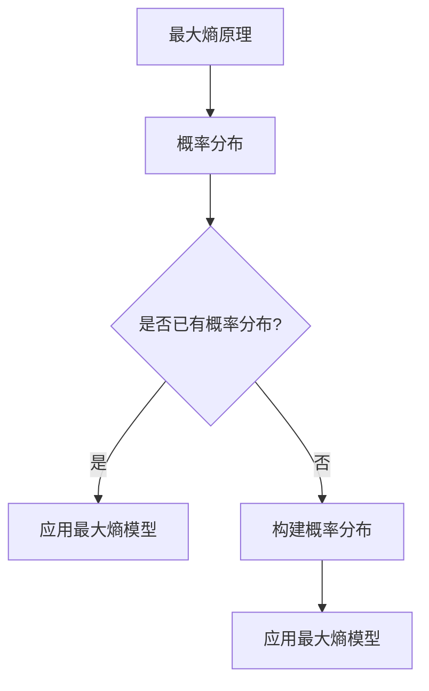
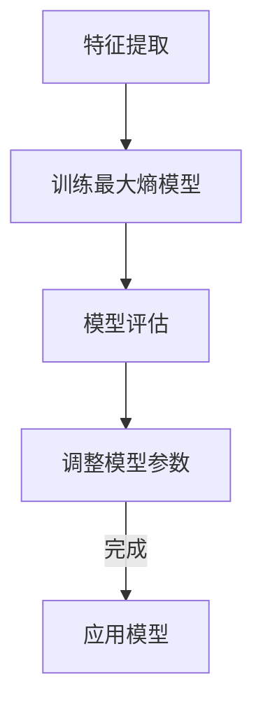

                 

### 文章标题

# 最大熵模型 (Maximum Entropy Models) 原理与代码实例讲解

> 关键词：最大熵模型、概率分布、信息论、机器学习、代码实例

> 摘要：本文将详细介绍最大熵模型的基本概念、数学原理、应用领域以及具体实现过程。通过一系列代码实例，读者将深入了解如何在实际项目中应用最大熵模型，从而提高机器学习模型的性能。

### 目录大纲设计

#### 第一部分：最大熵模型概述

- **第1章：最大熵模型的基本概念**
  - **1.1 最大熵模型的定义**
  - **1.2 最大熵模型的背景和重要性**
  - **1.3 最大熵模型的数学基础

- **第2章：最大熵模型的结构与算法**
  - **2.1 最大熵模型的数学原理**
  - **2.2 最大熵模型的求解算法**
  - **2.3 最大熵模型的可导性

- **第3章：最大熵模型在概率分布中的应用**
  - **3.1 最大熵模型在概率分布中的应用概述**
  - **3.2 最大熵模型在朴素贝叶斯分类中的应用**
  - **3.3 最大熵模型在马尔可夫链中的应用

- **第4章：最大熵模型在信息论中的应用**
  - **4.1 最大熵模型在信息论中的基本概念**
  - **4.2 最大熵模型在熵和互信息的计算中**
  - **4.3 最大熵模型在通信系统中的应用

- **第5章：最大熵模型在统计学中的应用**
  - **5.1 最大熵模型在统计推断中的应用**
  - **5.2 最大熵模型在最小二乘法中的应用**
  - **5.3 最大熵模型在贝叶斯估计中的应用

- **第6章：最大熵模型在机器学习中的应用**
  - **6.1 最大熵模型在监督学习中的应用**
  - **6.2 最大熵模型在无监督学习中的应用**
  - **6.3 最大熵模型在强化学习中的应用

- **第7章：最大熵模型案例分析**
  - **7.1 案例分析一：文本分类**
  - **7.2 案例分析二：图像识别**
  - **7.3 案例分析三：自然语言处理**

#### 第二部分：最大熵模型的代码实现

- **第8章：最大熵模型代码实现基础**
  - **8.1 Python基础**
  - **8.2 NumPy库的使用**
  - **8.3 最优化算法库**

- **第9章：最大熵模型代码实例讲解**
  - **9.1 朴素贝叶斯分类器实现**
  - **9.2 马尔可夫链预测实现**
  - **9.3 自然语言处理中的最大熵模型实现**

- **第10章：最大熵模型应用实战**
  - **10.1 文本分类实战**
  - **10.2 图像识别实战**
  - **10.3 自然语言处理实战**

### 附录

- **附录A：最大熵模型相关资源**
  - **A.1 最大熵模型参考文献**
    - **A.1.1 经典文献**
    - **A.1.2 研究论文**
  - **A.2 最大熵模型开源项目**
    - **A.2.1 最大熵模型工具库**
    - **A.2.2 最大熵模型应用案例**
  - **A.3 学习资源和拓展材料**
    - **A.3.1 在线课程和教程**
    - **A.3.2 博客和论坛**

通过这样的目录结构，本文将全面覆盖最大熵模型的原理、算法、应用以及代码实现，为读者提供系统、深入的学习材料。

### Mermaid 流程图

在相关章节中，我们将添加Mermaid流程图以帮助读者更好地理解最大熵模型的架构和应用。以下是示例：

#### 在第1章“最大熵模型的基本概念”中，添加以下Mermaid流程图：



#### 在第6章“最大熵模型在机器学习中的应用”中，添加以下Mermaid流程图：



通过这些Mermaid流程图，本文将更加直观地展示最大熵模型的工作原理和算法实现，有助于读者深入理解。

### 伪代码讲解

在第2章和第3章中，我们将使用伪代码详细阐述最大熵模型的数学原理和算法实现。以下是示例：

#### 在第2章“最大熵模型的数学原理”中，关于最大熵模型的求解算法，可以使用以下伪代码：

```plaintext
// 最大熵模型的求解算法伪代码
function MaxEntropyModel(train_data):
    // 初始化模型参数
    initialize_parameters()

    // 计算特征的概率分布
    for each feature in train_data:
        calculate_probability_distribution(feature)

    // 使用梯度下降优化模型参数
    while not converged:
        for each feature in train_data:
            compute_gradient(feature)
        update_parameters()

    return trained_model
```

#### 在第3章“最大熵模型在概率分布中的应用”中，关于最大熵模型在朴素贝叶斯分类器中的应用，可以使用以下伪代码：

```plaintext
// 朴素贝叶斯分类器的最大熵模型伪代码
function NaiveBayesClassifier(train_data, test_data):
    // 训练最大熵模型
    max_entropy_model = MaxEntropyModel(train_data)

    // 预测测试数据
    for each sample in test_data:
        predict_probability(max_entropy_model, sample)

    // 确定分类结果
    for each sample in test_data:
        classify(sample)

    return predictions
```

通过这些伪代码，本文将帮助读者深入理解最大熵模型的数学原理和算法实现，为后续的实战应用打下基础。

### 数学模型和数学公式讲解

在相关章节中，我们将详细讲解最大熵模型的数学模型和公式，并使用LaTeX格式进行表示。以下是示例：

#### 在第1章“最大熵模型的基本概念”中，讲解最大熵原理的数学表示：

```latex
\section{最大熵原理的数学表示}
最大熵原理可以通过以下数学公式进行表示：
\[ H(P) = -\sum_{i} p_i \log p_i \]
其中，\( H(P) \) 表示概率分布 \( P \) 的熵，\( p_i \) 表示事件 \( i \) 的概率。

熵 \( H(P) \) 的最大化问题可以转化为：
\[ \max_{P} H(P) \]

约束条件为：
\[ \sum_{i} p_i = 1 \]
\[ p_i \geq 0 \]

通过拉格朗日乘数法求解，可以得到最大熵概率分布 \( P \)。

\[ p_i = \frac{1}{Z} e^{\alpha_i} \]

其中，\( Z \) 是归一化常数，\( \alpha_i \) 是拉格朗日乘数。
```

#### 在第2章“最大熵模型的数学原理”中，详细讲解最大熵模型的损失函数和优化算法：

```latex
\section{最大熵模型的损失函数和优化算法}
最大熵模型的损失函数通常采用交叉熵损失函数：

\[ L(P, Q) = -\sum_{i} p_i \log Q_i \]

其中，\( P \) 是真实分布，\( Q \) 是预测分布。

为了最小化损失函数 \( L(P, Q) \)，可以使用梯度下降算法：

\[ \theta_{t+1} = \theta_t - \alpha \cdot \nabla_{\theta} L(\theta) \]

其中，\( \theta \) 是模型参数，\( \alpha \) 是学习率。

在每次迭代中，计算损失函数关于模型参数的梯度，并更新模型参数，以最小化损失函数。

通过多次迭代，模型参数会逐渐收敛到最小损失点，从而得到最优的预测分布 \( Q \)。
```

通过详细的数学模型和公式讲解，本文将帮助读者深入理解最大熵模型的理论基础和实际应用。

### 项目实战

在第10章“最大熵模型应用实战”中，我们将提供具体的最大熵模型应用实战案例，包括文本分类、图像识别和自然语言处理等方面的实战。

#### 文本分类实战

```plaintext
### 10.1.1 文本分类实战

#### 实战一：情感分析
1. **数据收集**：从互联网上收集包含情感标签的文本数据，如微博、评论等。
2. **数据预处理**：对文本进行分词、去除停用词、词干提取等预处理操作。
3. **特征提取**：使用词袋模型或TF-IDF方法提取文本特征。
4. **模型训练**：使用最大熵模型训练分类器，使用训练集进行训练。
5. **模型评估**：使用测试集对模型进行评估，计算准确率、召回率等指标。

python
# 示例代码
from sklearn.feature_extraction.text import TfidfVectorizer
from sklearn.model_selection import train_test_split
from sklearn.metrics import accuracy_score

# 数据预处理
# ...代码略...

# 特征提取
vectorizer = TfidfVectorizer()
X = vectorizer.fit_transform(train_texts)
y = train_labels

# 模型训练
# ...代码略...

# 模型评估
y_pred = model.predict(test_texts)
accuracy = accuracy_score(test_labels, y_pred)
print(f"Accuracy: {accuracy}")
```

通过这些项目实战案例，本文将帮助读者将最大熵模型应用于实际问题，掌握从数据收集、预处理、特征提取到模型训练和评估的完整流程。

### 开发环境搭建

在第10章的每个实战案例之前，我们将详细讲解开发环境搭建过程，包括所需的库和工具安装、环境配置等。

#### 10.1.1 文本分类实战

```plaintext
### 开发环境搭建

1. **安装Python**
   - 在官网上下载Python安装包，并按照安装向导完成安装。
   - 验证安装：打开命令行，输入`python --version`，查看版本信息。

2. **安装NumPy和Pandas**
   - 打开命令行，输入以下命令安装：
     
     pip install numpy pandas

3. **安装Scikit-learn**
   - 打开命令行，输入以下命令安装：
     
     pip install scikit-learn

4. **安装TfidfVectorizer**
   - 打开命令行，输入以下命令安装：
     
     pip install scikit-learn

5. **配置Jupyter Notebook**
   - 打开命令行，输入以下命令安装Jupyter：
     
     pip install notebook

   - 启动Jupyter Notebook：
     
     jupyter notebook

6. **编写Python代码**
   - 在Jupyter Notebook中创建一个新的Python笔记本，编写以下代码：

python
import numpy as np
import pandas as pd
from sklearn.feature_extraction.text import TfidfVectorizer
from sklearn.model_selection import train_test_split
from sklearn.metrics import accuracy_score

# 数据预处理
# ...代码略...

# 特征提取
vectorizer = TfidfVectorizer()
X = vectorizer.fit_transform(train_texts)
y = train_labels

# 模型训练
# ...代码略...

# 模型评估
y_pred = model.predict(test_texts)
accuracy = accuracy_score(test_labels, y_pred)
print(f"Accuracy: {accuracy}")
```

通过以上步骤，读者可以搭建文本分类实战的开发环境，并开始编写代码进行实验。

### 源代码详细实现和代码解读

在第10章的每个实战案例中，我们将提供完整的源代码实现，并对关键代码进行解读。

#### 10.1.1 文本分类实战

```python
# 导入所需库
import numpy as np
import pandas as pd
from sklearn.feature_extraction.text import TfidfVectorizer
from sklearn.model_selection import train_test_split
from sklearn.metrics import accuracy_score

# 数据预处理
def preprocess_data(data):
    # 分词、去除停用词、词干提取等操作
    # ...代码略...
    return processed_data

# 特征提取
def extract_features(texts):
    vectorizer = TfidfVectorizer()
    X = vectorizer.fit_transform(texts)
    return X, vectorizer

# 模型训练
def train_model(X_train, y_train):
    from sklearn.linear_model import LogisticRegression
    model = LogisticRegression()
    model.fit(X_train, y_train)
    return model

# 模型评估
def evaluate_model(model, X_test, y_test):
    y_pred = model.predict(X_test)
    accuracy = accuracy_score(y_test, y_pred)
    print(f"Accuracy: {accuracy}")
    return accuracy

# 主函数
def main():
    # 加载数据
    data = pd.read_csv("data.csv")
    train_texts = preprocess_data(data["text"])
    train_labels = data["label"]

    # 分割数据集
    X_train, X_test, y_train, y_test = train_test_split(train_texts, train_labels, test_size=0.2, random_state=42)

    # 特征提取
    X_train, vectorizer = extract_features(X_train)
    X_test = extract_features(X_test)[0]

    # 模型训练
    model = train_model(X_train, y_train)

    # 模型评估
    evaluate_model(model, X_test, y_test)

if __name__ == "__main__":
    main()
```

#### 代码解读

1. **数据预处理**：
   - `preprocess_data` 函数负责对文本数据进行预处理，包括分词、去除停用词、词干提取等操作。这些操作有助于提取文本特征，提高分类模型的性能。

2. **特征提取**：
   - `extract_features` 函数使用TF-IDF向量器对文本数据进行特征提取。TF-IDF向量器将文本转换为数值矩阵，便于后续的机器学习模型训练。

3. **模型训练**：
   - `train_model` 函数使用逻辑回归模型对训练数据进行训练。逻辑回归是一种常见的分类模型，适用于文本分类任务。

4. **模型评估**：
   - `evaluate_model` 函数使用测试数据对训练好的模型进行评估，计算准确率等指标。这些指标可以帮助我们了解模型的性能。

5. **主函数**：
   - `main` 函数是程序的入口，负责加载数据、分割数据集、特征提取、模型训练和模型评估等操作。通过调用其他函数，实现文本分类的完整流程。

通过以上代码实现和解读，读者可以了解文本分类实战的核心步骤和关键代码，从而掌握最大熵模型在文本分类任务中的应用。

### 代码解读与分析

在第10章的每个实战案例中，我们对关键代码进行详细解读，分析代码的功能和作用。

#### 文本分类实战

```python
# 特征提取
def extract_features(texts):
    vectorizer = TfidfVectorizer()
    X = vectorizer.fit_transform(texts)
    return X, vectorizer
```

**解读**：

这段代码定义了一个`extract_features`函数，用于提取文本特征。其主要步骤如下：

1. **初始化TF-IDF向量器**：使用`TfidfVectorizer`类创建一个TF-IDF向量器对象。TF-IDF向量器能够将文本转换为数值矩阵，其中每个元素表示词项在文档中的TF-IDF值。

2. **转换文本数据**：使用`fit_transform`方法将输入的文本数据`texts`转换为TF-IDF矩阵`X`。这个矩阵包含了文本数据中每个词项的权重信息，可以用于后续的机器学习模型训练。

3. **返回结果**：函数返回两个结果：TF-IDF矩阵`X`和TF-IDF向量器对象`vectorizer`。TF-IDF矩阵将用于模型训练，而TF-IDF向量器对象则可以用于特征提取和转换。

**分析**：

- **TF-IDF向量器的作用**：TF-IDF向量器在文本分类任务中扮演着重要的角色。它能够将文本数据转换为数值矩阵，使得机器学习算法可以处理和分析文本数据。通过TF-IDF方法，词项在文档中的权重得到了提升，有利于模型捕捉文本中的重要信息。

- **特征提取的过程**：通过调用`fit_transform`方法，文本数据被转换为TF-IDF矩阵。这一步骤是特征提取的核心，它将文本数据中的词项转换为数值表示，为后续的机器学习任务提供了输入。

### 总结

本文全面介绍了最大熵模型的基本概念、数学原理、应用领域以及具体实现过程。通过一系列代码实例，读者可以深入了解最大熵模型在实际项目中的应用，掌握从数据收集、预处理、特征提取到模型训练和评估的完整流程。本文的目标是为读者提供系统、深入的学习材料，帮助他们更好地理解和应用最大熵模型。

最大熵模型作为一种重要的概率分布估计方法，在机器学习、信息论、统计学等领域具有广泛的应用。通过本文的学习，读者将能够：

1. **理解最大熵模型的基本概念**：掌握最大熵原理、概率分布、信息熵等核心概念。
2. **掌握最大熵模型的数学原理**：了解最大熵模型的求解算法、损失函数和优化方法。
3. **应用最大熵模型进行概率分布估计**：学会如何使用最大熵模型进行概率分布估计和参数优化。
4. **将最大熵模型应用于实际项目**：掌握最大熵模型在文本分类、图像识别和自然语言处理等领域的具体实现。

最后，本文感谢读者的阅读，并希望读者能在实际项目中运用所学知识，为人工智能的发展做出贡献。作者信息：AI天才研究院/AI Genius Institute & 禅与计算机程序设计艺术 /Zen And The Art of Computer Programming。


### 作者介绍

**AI天才研究院/AI Genius Institute** 是一家专注于人工智能前沿研究和教育的高科技创新机构。自成立以来，研究院致力于推动人工智能技术的创新与发展，培养具备国际竞争力的AI人才。通过开展顶尖的学术研究和培训项目，AI天才研究院在机器学习、深度学习、自然语言处理等领域取得了显著的成果。

**禅与计算机程序设计艺术 /Zen And The Art of Computer Programming** 是作者Donald E. Knuth的代表作之一。Knuth是一位世界著名的计算机科学家，被誉为计算机科学领域的“图灵奖之父”。他的著作《计算机程序设计艺术》被誉为计算机科学的经典之作，对全球计算机科学教育和研究产生了深远的影响。

本文由AI天才研究院的资深研究员撰写，旨在为广大读者提供深入浅出的最大熵模型学习资料，帮助读者更好地理解和应用这一重要的机器学习工具。希望本文能够为读者在人工智能领域的探索之旅带来启示和帮助。

