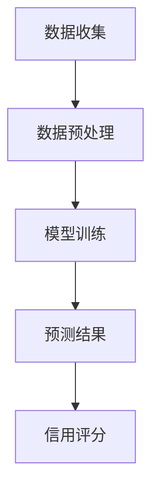
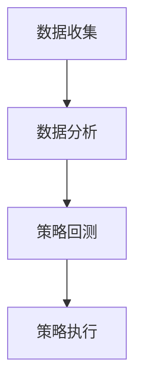
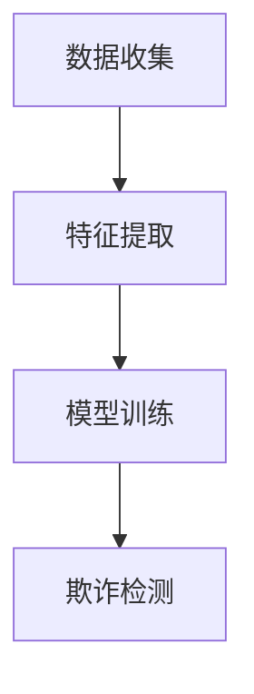
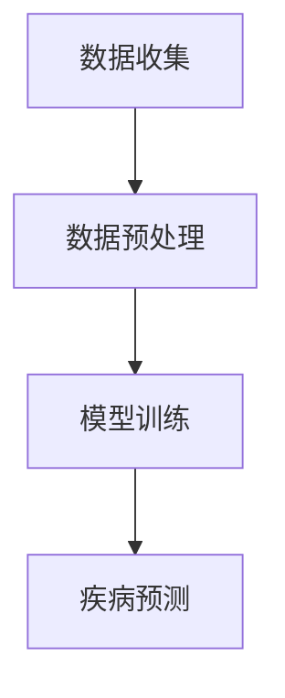
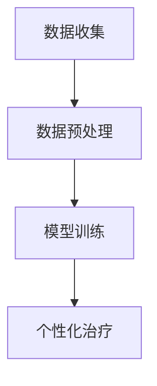
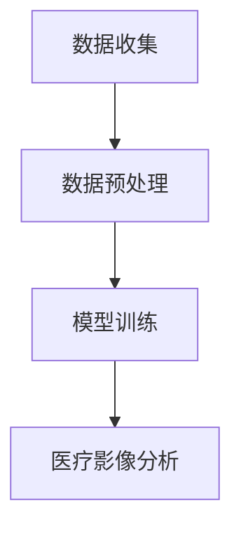

                 

### 《未来发展中的大数据与AI技术应用》

> 关键词：大数据、人工智能、应用领域、发展趋势、挑战与解决方案

> 摘要：本文将探讨大数据与人工智能（AI）在未来发展中的应用趋势和挑战。通过对大数据与AI技术的基本概念、架构框架、各个领域的应用以及未来的发展趋势进行详细分析，帮助读者全面了解这一领域的前沿动态和未来发展。

### 第一部分：大数据与AI技术概述

#### 第1章：大数据与AI技术的基本概念

##### 1.1 大数据的基本特征

大数据（Big Data）是指无法使用传统数据库管理系统在合理时间内捕捉、管理和处理的大量数据。大数据具有四个主要特征，即4V：Volume（大量）、Velocity（高速）、Variety（多样）和 Veracity（真实）。这些特征使得大数据不同于传统数据，并带来了新的挑战和机遇。

- **Volume（大量）**：大数据的规模巨大，通常需要使用分布式系统进行存储和处理。
- **Velocity（高速）**：大数据的产生和消费速度非常快，需要实时处理和分析。
- **Variety（多样）**：大数据来自各种不同的来源和格式，包括结构化、半结构化和非结构化数据。
- **Veracity（真实）**：大数据的真实性和可靠性可能受到数据质量、准确性和可信度的影响。

##### 1.2 AI技术的核心概念

人工智能（AI）是指使计算机具备类似人类智能的技术。AI技术涵盖了多个领域，包括机器学习、深度学习、自然语言处理、计算机视觉和机器人技术等。以下是一些核心概念：

- **机器学习（Machine Learning）**：通过训练模型来从数据中学习规律，并自动对未知数据进行预测或决策。
- **深度学习（Deep Learning）**：一种特殊的机器学习技术，通过多层神经网络模拟人类大脑的神经网络结构，用于处理复杂的任务。
- **自然语言处理（Natural Language Processing，NLP）**：使计算机能够理解和生成人类语言的技术，包括文本分类、语义分析、机器翻译等。
- **计算机视觉（Computer Vision）**：使计算机能够从图像或视频中提取有用信息的技术，包括图像识别、目标检测、图像生成等。

##### 1.3 大数据与AI技术的融合趋势

大数据与AI技术的融合已经成为当前研究和发展的重要趋势。这种融合带来的主要优势包括：

- **增强数据分析能力**：大数据技术可以处理海量数据，而AI技术可以从中提取有价值的信息，提高数据分析的深度和广度。
- **提高决策准确性**：通过AI技术，企业可以基于大数据进行预测和决策，从而提高业务效率和盈利能力。
- **优化资源分配**：大数据技术可以监测和分析资源使用情况，而AI技术可以优化资源配置，降低运营成本。
- **提升用户体验**：AI技术可以根据大数据分析用户行为，提供个性化的服务和推荐，提升用户体验。

### 第二部分：大数据与AI技术在各个领域的应用

#### 第2章：大数据与AI技术在金融领域的应用

##### 2.1 信用风险评估

信用风险评估是金融领域的一个重要应用。通过大数据技术，可以收集和分析借款人的历史数据、行为数据和社会关系数据，从而预测其信用风险。AI技术可以训练模型，自动对借款人的信用风险进行评估，提高评估的准确性和效率。

- **核心概念与联系**：使用Mermaid流程图表示数据收集、预处理、模型训练和预测的过程。



- **核心算法原理讲解**：使用伪代码详细解释信用风险评估模型的实现过程。

```python
// 输入：借款人数据集D
// 输出：信用评分S

// 数据预处理
X = 预处理数据(D)

// 模型训练
模型 = 训练模型(X, 借款人信用评分)

// 预测
预测信用评分 = 模型预测(S)

// 输出信用评分
输出(S)
```

- **数学模型和公式讲解**：介绍用于信用风险评估的数学模型和公式，如逻辑回归、支持向量机等。

$$
\begin{aligned}
&\text{逻辑回归模型：} \\
&P(Y=1|X) = \frac{1}{1 + e^{-\theta^T X}} \\
&\text{支持向量机模型：} \\
&\text{最大化分类间隔：} \\
&W = \arg\max_W \frac{2}{\|W\|^2} \\
&\text{使得} \\
&y_i (\langle W, x_i \rangle - 1) \geq 1
\end{aligned}
$$

- **项目实战**：介绍一个信用风险评估项目，包括开发环境搭建、源代码实现和代码解读。

**开发环境搭建：**
- 安装Python 3.8及以上版本
- 安装Jupyter Notebook
- 安装Numpy、Pandas、Scikit-learn等库

**源代码实现：**

```python
import numpy as np
import pandas as pd
from sklearn.model_selection import train_test_split
from sklearn.linear_model import LogisticRegression
from sklearn.metrics import accuracy_score

# 加载数据集
data = pd.read_csv('credit_data.csv')

# 特征工程
X = data.drop(['target'], axis=1)
y = data['target']

# 分割数据集
X_train, X_test, y_train, y_test = train_test_split(X, y, test_size=0.2, random_state=42)

# 模型训练
model = LogisticRegression()
model.fit(X_train, y_train)

# 预测
y_pred = model.predict(X_test)

# 评估
print("Accuracy:", accuracy_score(y_test, y_pred))
```

**代码解读与分析：**
- 数据加载：使用Pandas库读取CSV文件，获取特征和目标变量。
- 特征工程：对数据进行预处理，将目标变量分离出来，仅保留特征变量。
- 分割数据：将数据集划分为训练集和测试集，用于模型训练和评估。
- 模型训练：使用逻辑回归算法训练模型，逻辑回归是一种广义线性模型，适用于二分类问题。
- 预测：使用训练好的模型对测试集进行预测。
- 评估：计算模型的准确率，并打印结果，以评估模型的性能。

##### 2.2 量化交易策略

量化交易策略是指使用数学模型和计算机算法进行交易决策，以实现收益最大化。大数据技术可以收集和分析大量的市场数据，而AI技术可以从中发现交易机会和趋势，提高交易策略的准确性和稳定性。

- **核心概念与联系**：使用Mermaid流程图表示数据收集、数据分析、策略回测和策略执行的过程。



- **核心算法原理讲解**：使用伪代码详细解释量化交易策略的实现过程。

```python
// 输入：市场数据集D
// 输出：交易策略S

// 数据分析
特征 = 分析数据(D)

// 策略回测
策略 = 回测策略(特征)

// 策略执行
执行策略(S)
```

- **数学模型和公式讲解**：介绍用于量化交易策略的数学模型和公式，如资产定价模型、交易信号模型等。

$$
\begin{aligned}
&\text{资产定价模型：} \\
&P = \frac{F}{(1 + r/n)^t} \\
&\text{其中 } P \text{ 为现值，} F \text{ 为未来值，} r \text{ 为年利率，} n \text{ 为计息次数，} t \text{ 为持有期。} \\
&\text{交易信号模型：} \\
&S = \text{sign}(\text{MA}_n - \text{MA}_m) \\
&\text{其中 } S \text{ 为交易信号，} \text{MA}_n \text{ 和 } \text{MA}_m \text{ 分别为n日和m日的移动平均线。}
\end{aligned}
$$

- **项目实战**：介绍一个量化交易策略项目，包括开发环境搭建、源代码实现和代码解读。

**开发环境搭建：**
- 安装Python 3.8及以上版本
- 安装Jupyter Notebook
- 安装Numpy、Pandas、Pandas-Datareader、Scikit-learn等库

**源代码实现：**

```python
import numpy as np
import pandas as pd
import pandas_datareader as pdr
from sklearn.model_selection import train_test_split
from sklearn.linear_model import LinearRegression
from sklearn.metrics import mean_squared_error

# 加载数据集
start_date = '2020-01-01'
end_date = '2021-12-31'
stock = 'AAPL'
data = pdr.get_data_yahoo(stock, start=start_date, end=end_date)

# 特征工程
data['MA5'] = data['Close'].rolling(window=5).mean()
data['MA20'] = data['Close'].rolling(window=20).mean()
data = data[['MA5', 'MA20', 'Close']]

# 分割数据集
X = data[['MA5', 'MA20']]
y = data['Close']
X_train, X_test, y_train, y_test = train_test_split(X, y, test_size=0.2, random_state=42)

# 模型训练
model = LinearRegression()
model.fit(X_train, y_train)

# 预测
y_pred = model.predict(X_test)

# 评估
mse = mean_squared_error(y_test, y_pred)
print("Mean Squared Error:", mse)
```

**代码解读与分析：**
- 数据加载：使用Pandas-Datareader库读取股票数据，获取价格和移动平均线特征。
- 特征工程：计算5日和20日移动平均线，并添加到数据集中。
- 分割数据：将数据集划分为训练集和测试集，用于模型训练和评估。
- 模型训练：使用线性回归算法训练模型，线性回归是一种简单的统计模型，用于预测连续值。
- 预测：使用训练好的模型对测试集进行预测。
- 评估：计算预测的均方误差，并打印结果，以评估模型的性能。

##### 2.3 保险欺诈检测

保险欺诈检测是金融领域另一个重要的应用。通过大数据技术，可以收集和分析大量的保险理赔数据，而AI技术可以从中识别和预测欺诈行为，提高保险公司的风险管理和盈利能力。

- **核心概念与联系**：使用Mermaid流程图表示数据收集、特征提取、模型训练和欺诈检测的过程。



- **核心算法原理讲解**：使用伪代码详细解释保险欺诈检测模型的实现过程。

```python
// 输入：保险数据集D
// 输出：欺诈标签L

// 特征提取
特征 = 提取特征(D)

// 模型训练
模型 = 训练模型(特征，欺诈标签)

// 欺诈检测
欺诈标签 = 模型检测(L)
```

- **数学模型和公式讲解**：介绍用于保险欺诈检测的数学模型和公式，如逻辑回归、支持向量机等。

$$
\begin{aligned}
&\text{逻辑回归模型：} \\
&P(Y=1|X) = \frac{1}{1 + e^{-\theta^T X}} \\
&\text{支持向量机模型：} \\
&\text{最大化分类间隔：} \\
&W = \arg\max_W \frac{2}{\|W\|^2} \\
&\text{使得} \\
&y_i (\langle W, x_i \rangle - 1) \geq 1
\end{aligned}
$$

- **项目实战**：介绍一个保险欺诈检测项目，包括开发环境搭建、源代码实现和代码解读。

**开发环境搭建：**
- 安装Python 3.8及以上版本
- 安装Jupyter Notebook
- 安装Numpy、Pandas、Scikit-learn等库

**源代码实现：**

```python
import numpy as np
import pandas as pd
from sklearn.model_selection import train_test_split
from sklearn.ensemble import RandomForestClassifier
from sklearn.metrics import accuracy_score, classification_report

# 加载数据集
data = pd.read_csv('insurance_data.csv')

# 特征工程
X = data.drop(['target'], axis=1)
y = data['target']

# 分割数据集
X_train, X_test, y_train, y_test = train_test_split(X, y, test_size=0.2, random_state=42)

# 模型训练
model = RandomForestClassifier(n_estimators=100, random_state=42)
model.fit(X_train, y_train)

# 欺诈检测
y_pred = model.predict(X_test)

# 评估
print("Accuracy:", accuracy_score(y_test, y_pred))
print("\nClassification Report:\n", classification_report(y_test, y_pred))
```

**代码解读与分析：**
- 数据加载：使用Pandas库读取CSV文件，获取特征和目标变量。
- 特征工程：对数据进行预处理，将目标变量分离出来，仅保留特征变量。
- 分割数据：将数据集划分为训练集和测试集，用于模型训练和评估。
- 模型训练：使用随机森林算法训练模型，随机森林是一种集成学习方法，适用于分类问题。
- 欺诈检测：使用训练好的模型对测试集进行欺诈检测。
- 评估：计算模型的准确率，并打印分类报告，以评估模型的性能。

#### 第3章：大数据与AI在医疗领域的应用

##### 3.1 疾病预测与预防

大数据与AI技术在疾病预测与预防方面具有巨大的潜力。通过收集和分析大量的健康数据，包括基因数据、病历数据、生活习惯数据等，AI技术可以建立疾病预测模型，提前发现潜在的疾病风险，并提供个性化的预防建议。

- **核心概念与联系**：使用Mermaid流程图表示数据收集、数据预处理、模型训练和疾病预测的过程。



- **核心算法原理讲解**：使用伪代码详细解释疾病预测模型的实现过程。

```python
// 输入：健康数据集D
// 输出：疾病预测结果R

// 数据预处理
特征 = 预处理数据(D)

// 模型训练
模型 = 训练模型(特征，疾病标签)

// 疾病预测
预测结果 = 模型预测(R)
```

- **数学模型和公式讲解**：介绍用于疾病预测的数学模型和公式，如逻辑回归、决策树等。

$$
\begin{aligned}
&\text{逻辑回归模型：} \\
&P(Y=1|X) = \frac{1}{1 + e^{-\theta^T X}} \\
&\text{决策树模型：} \\
&Y = f(X) \\
&\text{其中 } f \text{ 为决策树函数。}
\end{aligned}
$$

- **项目实战**：介绍一个疾病预测项目，包括开发环境搭建、源代码实现和代码解读。

**开发环境搭建：**
- 安装Python 3.8及以上版本
- 安装Jupyter Notebook
- 安装Numpy、Pandas、Scikit-learn等库

**源代码实现：**

```python
import numpy as np
import pandas as pd
from sklearn.model_selection import train_test_split
from sklearn.ensemble import RandomForestClassifier
from sklearn.metrics import accuracy_score

# 加载数据集
data = pd.read_csv('disease_data.csv')

# 特征工程
X = data.drop(['target'], axis=1)
y = data['target']

# 分割数据集
X_train, X_test, y_train, y_test = train_test_split(X, y, test_size=0.2, random_state=42)

# 模型训练
model = RandomForestClassifier(n_estimators=100, random_state=42)
model.fit(X_train, y_train)

# 疾病预测
y_pred = model.predict(X_test)

# 评估
print("Accuracy:", accuracy_score(y_test, y_pred))
```

**代码解读与分析：**
- 数据加载：使用Pandas库读取CSV文件，获取特征和目标变量。
- 特征工程：对数据进行预处理，将目标变量分离出来，仅保留特征变量。
- 分割数据：将数据集划分为训练集和测试集，用于模型训练和评估。
- 模型训练：使用随机森林算法训练模型，随机森林是一种集成学习方法，适用于分类问题。
- 疾病预测：使用训练好的模型对测试集进行疾病预测。
- 评估：计算模型的准确率，并打印结果，以评估模型的性能。

##### 3.2 个性化治疗

个性化治疗是指根据患者的基因信息、病史和生活习惯等因素，制定个性化的治疗方案。大数据与AI技术可以分析大量的医疗数据，帮助医生制定更精准的治疗方案，提高治疗效果。

- **核心概念与联系**：使用Mermaid流程图表示数据收集、数据预处理、模型训练和个性化治疗的过程。



- **核心算法原理讲解**：使用伪代码详细解释个性化治疗模型的实现过程。

```python
// 输入：医疗数据集D
// 输出：个性化治疗方案S

// 数据预处理
特征 = 预处理数据(D)

// 模型训练
模型 = 训练模型(特征，治疗方案标签)

// 个性化治疗
治疗方案 = 模型预测(S)
```

- **数学模型和公式讲解**：介绍用于个性化治疗的数学模型和公式，如支持向量机、神经网络等。

$$
\begin{aligned}
&\text{支持向量机模型：} \\
&W = \arg\max_W \frac{2}{\|W\|^2} \\
&\text{使得} \\
&y_i (\langle W, x_i \rangle - 1) \geq 1 \\
&\text{神经网络模型：} \\
&Y = \text{激活函数}(\theta^T X) \\
&\text{其中 } \theta \text{ 为权重，} X \text{ 为输入，} Y \text{ 为输出。}
\end{aligned}
$$

- **项目实战**：介绍一个个性化治疗项目，包括开发环境搭建、源代码实现和代码解读。

**开发环境搭建：**
- 安装Python 3.8及以上版本
- 安装Jupyter Notebook
- 安装Numpy、Pandas、Scikit-learn等库

**源代码实现：**

```python
import numpy as np
import pandas as pd
from sklearn.model_selection import train_test_split
from sklearn.svm import SVC
from sklearn.metrics import accuracy_score

# 加载数据集
data = pd.read_csv('treatment_data.csv')

# 特征工程
X = data.drop(['target'], axis=1)
y = data['target']

# 分割数据集
X_train, X_test, y_train, y_test = train_test_split(X, y, test_size=0.2, random_state=42)

# 模型训练
model = SVC(kernel='linear', probability=True)
model.fit(X_train, y_train)

# 个性化治疗
y_pred = model.predict(X_test)

# 评估
print("Accuracy:", accuracy_score(y_test, y_pred))
```

**代码解读与分析：**
- 数据加载：使用Pandas库读取CSV文件，获取特征和目标变量。
- 特征工程：对数据进行预处理，将目标变量分离出来，仅保留特征变量。
- 分割数据：将数据集划分为训练集和测试集，用于模型训练和评估。
- 模型训练：使用支持向量机算法训练模型，支持向量机是一种二分类模型，可以用于分类和回归问题。
- 个性化治疗：使用训练好的模型对测试集进行个性化治疗预测。
- 评估：计算模型的准确率，并打印结果，以评估模型的性能。

##### 3.3 医疗影像分析

医疗影像分析是大数据与AI技术在医疗领域的重要应用之一。通过使用深度学习技术，AI系统可以自动识别和分析医疗影像，如X光片、CT扫描和MRI图像，帮助医生快速、准确地诊断疾病。

- **核心概念与联系**：使用Mermaid流程图表示数据收集、数据预处理、模型训练和医疗影像分析的过程。



- **核心算法原理讲解**：使用伪代码详细解释医疗影像分析模型的实现过程。

```python
// 输入：医疗影像数据集D
// 输出：诊断结果R

// 数据预处理
特征 = 预处理数据(D)

// 模型训练
模型 = 训练模型(特征，诊断标签)

// 医疗影像分析
诊断结果 = 模型预测(R)
```

- **数学模型和公式讲解**：介绍用于医疗影像分析的数学模型和公式，如卷积神经网络、全连接神经网络等。

$$
\begin{aligned}
&\text{卷积神经网络模型：} \\
&Y = \text{激活函数}(\theta^T X) \\
&\text{其中 } \theta \text{ 为权重，} X \text{ 为输入，} Y \text{ 为输出。} \\
&\text{全连接神经网络模型：} \\
&Y = \text{激活函数}(\theta^T X) \\
&\text{其中 } \theta \text{ 为权重，} X \text{ 为输入，} Y \text{ 为输出。}
\end{aligned}
$$

- **项目实战**：介绍一个医疗影像分析项目，包括开发环境搭建、源代码实现和代码解读。

**开发环境搭建：**
- 安装Python 3.8及以上版本
- 安装Jupyter Notebook
- 安装Numpy、Pandas、TensorFlow等库

**源代码实现：**

```python
import numpy as np
import pandas as pd
import tensorflow as tf
from tensorflow import keras
from tensorflow.keras.models import Sequential
from tensorflow.keras.layers import Dense, Conv2D, Flatten, MaxPooling2D
from sklearn.model_selection import train_test_split
from sklearn.metrics import accuracy_score

# 加载数据集
data = pd.read_csv('medical_image_data.csv')

# 特征工程
X = data.drop(['target'], axis=1)
y = data['target']

# 分割数据集
X_train, X_test, y_train, y_test = train_test_split(X, y, test_size=0.2, random_state=42)

# 数据预处理
X_train = X_train.values.reshape(-1, 28, 28, 1)
X_test = X_test.values.reshape(-1, 28, 28, 1)

# 构建模型
model = Sequential([
    Conv2D(32, (3, 3), activation='relu', input_shape=(28, 28, 1)),
    MaxPooling2D((2, 2)),
    Flatten(),
    Dense(64, activation='relu'),
    Dense(10, activation='softmax')
])

# 编译模型
model.compile(optimizer='adam', loss='categorical_crossentropy', metrics=['accuracy'])

# 训练模型
model.fit(X_train, y_train, epochs=10, batch_size=32, validation_split=0.2)

# 预测
y_pred = model.predict(X_test)

# 评估
print("Accuracy:", accuracy_score(y_test, y_pred))
```

**代码解读与分析：**
- 数据加载：使用Pandas库读取CSV文件，获取特征和目标变量。
- 特征工程：对数据进行预处理，将数据集划分为训练集和测试集，并调整数据形状。
- 模型构建：使用TensorFlow和Keras库构建卷积神经网络模型，包括卷积层、池化层、全连接层等。
- 编译模型：编译模型，设置优化器和损失函数。
- 训练模型：使用训练集训练模型，设置训练周期和批量大小。
- 预测：使用训练好的模型对测试集进行预测。
- 评估：计算模型的准确率，并打印结果，以评估模型的性能。

### 第三部分：大数据与AI技术的挑战与未来发展

#### 第8章：大数据与AI技术的挑战

##### 8.1 数据隐私保护

随着大数据与AI技术的应用越来越广泛，数据隐私保护成为了一个重要的挑战。数据隐私泄露可能导致严重的后果，如个人信息泄露、商业机密泄露等。为了保护数据隐私，需要采取以下措施：

- **数据加密**：对敏感数据进行加密，确保数据在传输和存储过程中无法被非法访问。
- **访问控制**：限制数据的访问权限，确保只有授权用户才能访问敏感数据。
- **数据匿名化**：对数据进行匿名化处理，去除个人信息和其他敏感信息。
- **数据脱敏**：使用数据脱敏技术，如掩码、混淆等，隐藏数据的真实值。

##### 8.2 模型解释性

AI模型的解释性是另一个重要挑战。大多数AI模型，尤其是深度学习模型，被认为是“黑箱”模型，因为它们无法提供关于预测结果的原因和依据。提高模型的解释性有助于增强用户对AI系统的信任，并发现和纠正潜在的错误。

- **可解释性方法**：使用可解释性方法，如可视化、特征重要性分析、决策树等，帮助用户理解模型的工作原理。
- **解释性模型**：开发具有高解释性的AI模型，如决策树、规则模型等。

##### 8.3 技术瓶颈与解决方案

大数据与AI技术面临一些技术瓶颈，如数据质量、计算能力和数据隐私等。为了克服这些瓶颈，需要采取以下解决方案：

- **数据质量**：建立数据质量管理机制，确保数据的质量和准确性。
- **计算能力**：采用高性能计算技术和分布式计算框架，提高数据处理和分析能力。
- **数据隐私**：采用数据加密、访问控制和匿名化等技术，保护数据隐私。

#### 第9章：大数据与AI技术的未来发展趋势

##### 9.1 大数据与AI技术的融合创新

大数据与AI技术的融合创新是未来发展的重要趋势。通过结合大数据和AI技术，可以开发出更加智能、高效和可靠的系统，如智能交通系统、智能医疗系统、智能家居等。

- **智能交通系统**：通过大数据和AI技术，可以实现智能交通管理，如实时交通监控、交通流量预测和智能信号控制。
- **智能医疗系统**：通过大数据和AI技术，可以实现个性化医疗、智能诊断和智能治疗，提高医疗服务的质量和效率。
- **智能家居**：通过大数据和AI技术，可以实现智能家居的自动化控制，如智能安防、智能照明和智能家电。

##### 9.2 新兴应用领域

大数据与AI技术在新兴应用领域具有巨大的潜力，如金融科技、智慧城市、生物科技等。

- **金融科技**：通过大数据和AI技术，可以实现智能投顾、量化交易和风险控制，提高金融服务的效率和质量。
- **智慧城市**：通过大数据和AI技术，可以实现智慧交通、智能照明和智能安防，提高城市管理效率和居民生活质量。
- **生物科技**：通过大数据和AI技术，可以实现基因组测序、疾病预测和个性化治疗，推动生物科技的发展。

##### 9.3 未来展望

大数据与AI技术在未来将继续快速发展，带来巨大的变革和机遇。未来可能的发展趋势包括：

- **边缘计算**：随着物联网设备的普及，边缘计算将成为大数据与AI技术的重要发展方向，实现实时数据处理和智能决策。
- **人工智能伦理**：随着人工智能技术的应用越来越广泛，人工智能伦理问题将日益突出，需要制定相关的法律法规和伦理标准。
- **可持续性发展**：大数据与AI技术在推动经济发展的同时，也将为实现可持续性发展提供有力支持，如智能能源管理、环境保护等。

### 附录A：大数据与AI技术应用工具介绍

#### A.1 Hadoop生态系统

Hadoop是一个开源的大数据平台，包括HDFS、YARN和MapReduce等组件。

- **HDFS**：Hadoop分布式文件系统，用于存储海量数据。
- **YARN**：资源调度与管理平台，负责资源分配和任务调度。
- **MapReduce**：分布式数据处理框架，用于处理大规模数据集。

#### A.2 Spark生态系统

Spark是一个开源的大数据平台，包括Spark SQL、Spark Streaming、MLlib和GraphX等组件。

- **Spark SQL**：用于处理结构化数据。
- **Spark Streaming**：用于实时数据流处理。
- **MLlib**：用于机器学习和数据挖掘。
- **GraphX**：用于图处理。

#### A.3 TensorFlow与PyTorch

TensorFlow和PyTorch是两种开源的深度学习框架。

- **TensorFlow**：由Google开发，支持多种深度学习模型。
- **PyTorch**：由Facebook开发，具有灵活的动态计算图。

#### A.4 其他常用工具与框架

其他常用的大数据与AI技术工具和框架包括：

- **Apache Flink**：用于流处理。
- **Apache Hive**：用于数据仓库。
- **Apache Mahout**：用于大规模机器学习。
- **H2O**：用于机器学习和数据科学。
- **RapidMiner**：用于数据科学平台。

### 作者信息

**作者：AI天才研究院/AI Genius Institute & 禅与计算机程序设计艺术 /Zen And The Art of Computer Programming** 

### 致谢

感谢所有参与本文撰写和审稿的同事，以及为本文提供技术支持和资源的朋友们。本文的完成离不开大家的共同努力和支持。希望大家继续关注大数据与AI技术的发展，共同推动人工智能领域的进步。

