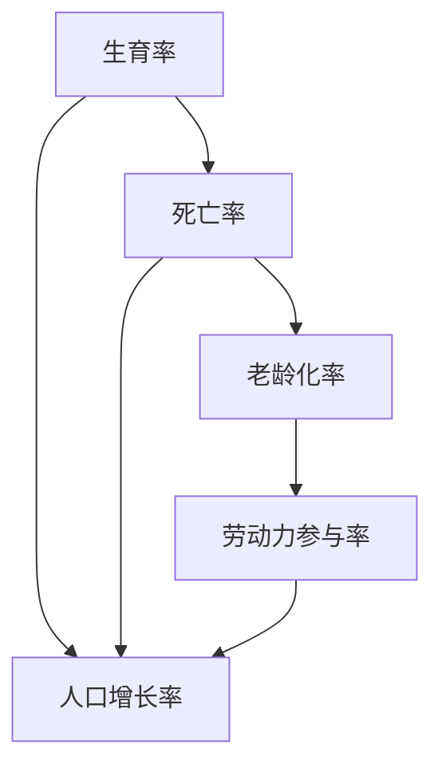

                 

### 1. 人口结构变化背景

在21世纪的今天，全球的人口结构正在经历前所未有的变化。随着医疗技术的进步和生活水平的提高，人类的平均寿命不断延长，人口老龄化现象日益显著。与此同时，一些国家和地区正面临生育率的下降，形成了少子化社会。这种人口结构的变化不仅影响经济发展、社会保障、劳动力市场，还对家庭结构和政府政策产生深远的影响。

#### 1.1 全球人口结构现状

目前，全球人口已经超过70亿，且预计在未来的几十年内仍将继续增长。然而，这种增长并非均匀分布。一些发展中国家，如尼日利亚、印度和巴基斯坦，人口仍在迅速增长，而一些发达国家，如日本、德国和意大利，人口增长缓慢甚至呈现负增长。

**人口增长与分布**

全球人口的增长主要受生育率、死亡率和迁移率的影响。近年来，全球生育率普遍下降，尤其是在发达国家和地区。例如，欧洲的生育率已经降至1.5以下，而一些亚洲国家，如韩国和中国，生育率也呈下降趋势。与此同时，全球的死亡率在不断下降，特别是由于医疗技术的进步和公共卫生条件的改善，人们的寿命得到了显著延长。

**人口老龄化现象**

人口老龄化是指人口中老年人口比例的增加。随着生育率的下降和医疗水平的提高，许多国家的人口年龄结构正在迅速变化。例如，日本的老龄化率已经超过30%，成为世界上老龄化最严重的国家之一。同样，德国和意大利的老龄化率也超过了20%。这种人口结构的变化对社会保障、医疗保健和劳动力市场提出了巨大的挑战。

#### 1.2 少子化社会的影响

少子化社会指的是生育率低于2.1（即每对夫妇生育的孩子数量不足以替代自己）的社会。这种社会面临着人口减少、人口老龄化、劳动力短缺等一系列问题。

**社会经济影响**

少子化社会对经济的影响主要体现在劳动力供给减少和消费需求下降。随着人口老龄化和劳动力减少，社会保障体系将面临巨大压力，养老金和医疗保险等福利项目可能面临破产风险。同时，由于年轻人减少，消费需求下降，经济增速放缓，可能导致经济增长乏力。

**社会政策调整**

面对少子化社会的挑战，各国政府纷纷采取了一系列政策调整。例如，日本政府通过提供生育补贴、延长产假和改善育儿环境等措施，鼓励生育。中国政府也通过放宽计划生育政策，提高生育率。此外，一些国家还通过提高退休年龄、鼓励老年人就业等措施，缓解劳动力市场压力。

在分析了全球人口结构的变化背景后，我们可以看到，人口老龄化和少子化对社会经济和政府政策产生了深远的影响。在接下来的章节中，我们将进一步探讨人口预测模型的应用，以及老龄化社会和少子化社会的具体挑战和应对策略。

### 2. 人口预测与模型

人口预测是理解未来人口结构变化的关键。通过预测模型，我们可以预估不同年龄段人口的变化趋势，为政策制定和经济发展提供科学依据。本节将详细介绍人口预测的主要方法、模型及其应用。

#### 2.1 人口预测方法

人口预测方法主要包括组件人口预测模型和状态转移矩阵预测模型。

**组件人口预测模型**

组件人口预测模型是一种将总人口分解为几个独立部分（如出生人数、死亡人数、迁移人数）的预测方法。这种方法通过预测每个组件的变化来预测总人口的变化。主要步骤包括：

1. **死亡率预测**：利用历史数据，通过统计模型（如线性回归、生存分析）预测未来各年龄段的人口死亡率。
2. **出生率预测**：基于生育率的变化趋势，使用生育模型（如出生率趋势模型、生育行为模型）预测未来各年龄段的人口出生率。
3. **迁移率预测**：分析人口迁移的驱动力（如经济因素、社会因素等），使用迁移模型（如重力模型、迁移流模型）预测人口迁移趋势。

**状态转移矩阵预测**

状态转移矩阵预测是一种基于当前人口年龄结构预测未来人口分布的方法。这种方法通过构建人口年龄结构的状态转移矩阵，模拟人口在不同年龄段之间的转换过程。主要步骤包括：

1. **构建状态转移矩阵**：根据当前人口的年龄分布，构建一个表示人口在各年龄段之间转换的概率矩阵。
2. **预测人口分布**：使用矩阵乘法，将状态转移矩阵与当前人口年龄分布相乘，预测未来各年龄段的人口分布。

#### 2.2 人口模型应用

**国家层面人口预测**

在国家层面，人口模型被广泛用于制定长期发展规划和社会政策。例如，中国国家统计局使用组件人口预测模型预测未来人口变化，以支持计划生育政策的调整和退休年龄的提高。

**地区层面人口预测**

在地区层面，人口模型的应用更为具体，可以帮助地方政府制定区域经济发展策略和公共设施规划。例如，纽约市使用状态转移矩阵预测模型，预测未来几十年内各年龄段人口的变化，以优化养老院、医疗中心等公共服务设施的分布。

**具体案例分析**

以日本为例，日本总务省通过组件人口预测模型，预测了日本未来人口的变化趋势。预测结果显示，到2050年，日本的总人口将减少至1亿左右，老龄化率将超过40%。这一预测结果为日本政府制定社会保障和医疗卫生政策提供了重要依据。

### 2.3 人口模型的优势与局限性

**优势**

1. **科学性**：人口模型基于统计数据和数学模型，可以提供定量预测结果，具有较高的科学性和可靠性。
2. **全面性**：人口模型综合考虑了生育率、死亡率、迁移率等多个因素，能够全面反映人口变化趋势。
3. **政策参考**：人口模型为政策制定者提供了重要依据，有助于制定长期发展规划和社会政策。

**局限性**

1. **数据依赖**：人口模型的准确性受数据质量的影响，数据的不完整或错误可能导致预测结果偏差。
2. **简化假设**：人口模型往往基于简化的假设，如生育率、死亡率等恒定不变，这在现实中可能并不成立。
3. **环境变化**：人口模型未考虑环境变化对人口结构的影响，如气候变化、自然灾害等。

通过上述分析，我们可以看到，人口预测模型在理解和预测未来人口结构变化方面具有重要作用。然而，在实际应用中，需要结合具体国情和实际情况，不断完善和优化预测模型，以提高预测的准确性和实用性。

### 3. 老龄化社会的挑战

老龄化社会给各个领域带来了诸多挑战，其中包括社会保障体系、劳动力市场变化和家庭结构关系等方面。本文将详细探讨这些挑战及其影响。

#### 3.1 社会保障体系

随着人口老龄化，社会保障体系面临前所未有的压力。主要问题包括养老金制度的不稳定和医疗保健体系的负担加重。

**养老金制度**

养老金制度是保障老年人基本生活的重要保障。然而，随着生育率的下降和老年人口的增加，养老金基金的可持续性受到威胁。一些国家的养老金制度设计之初并未考虑到人口老龄化的影响，导致养老金支付压力增大。例如，日本在20世纪60年代实施养老金制度时，预期退休人口仅占总人口的10%左右，而目前这一比例已经超过30%。为了缓解养老金压力，一些国家采取了增加缴费年限、提高退休年龄、鼓励延迟退休等措施。

**医疗保健体系**

随着人口老龄化，医疗保健需求显著增加。老年人由于身体状况复杂，需要更多的医疗服务和长期护理。这给医疗保健体系带来了巨大的挑战。医疗资源的分配和医疗服务的高效提供成为关键问题。例如，日本的医疗服务系统长期以来依赖初级保健，但随着老龄人口的增加，初级保健机构面临资源紧张和服务能力不足的问题。为了应对这一挑战，一些国家加大了对医疗保健的投资，改进了医疗服务的提供方式，如推广远程医疗服务和社区护理服务。

#### 3.2 劳动力市场变化

老龄化社会对劳动力市场的影响主要体现在劳动力供给与需求的矛盾上。

**老年人就业问题**

随着平均寿命的延长，越来越多的老年人选择继续工作。然而，这既带来了就业机会，也引发了一系列问题。一些老年人由于身体或健康原因难以适应高强度的工作环境，导致就业困难。此外，一些企业担心老年员工的医疗费用和福利成本，对老年人的招聘持谨慎态度。为了解决这些问题，一些国家推出了鼓励老年人就业的政策，如提供职业培训、改善工作条件和增加退休后的收入。

**劳动力供给与需求**

随着老年人口比例的增加，劳动力市场的供给与需求发生显著变化。劳动力供给减少，尤其是高技能劳动力的短缺，成为许多国家面临的挑战。一些国家采取了提高退休年龄、鼓励年轻人就业和引进外国劳动力等措施，以缓解劳动力短缺问题。例如，德国通过提高退休年龄和提供职业培训，鼓励老年人继续工作，同时通过引进外国劳动力来填补劳动力缺口。

#### 3.3 家庭结构与关系

老龄化社会对家庭结构关系产生了深远影响。

**家庭支持网络**

随着老年人口的增加，家庭支持网络的重要性日益凸显。老年人在家庭中的地位逐渐上升，家庭成员需要承担更多的照顾和责任。这既包括日常生活的照顾，如做饭、清洁和购物，也包括医疗和紧急情况下的处理。然而，随着社会压力的增加，年轻一代往往难以同时兼顾工作和家庭，导致家庭支持网络的功能受到削弱。

**子女与父母的互动**

在老龄化社会中，子女与父母的互动变得更加频繁和复杂。一方面，子女需要照顾年迈的父母，提供情感和经济支持。另一方面，父母可能需要适应子女的生活节奏和变化，这要求双方进行更多的沟通和协调。然而，由于文化和生活习惯的差异，子女与父母之间的互动往往面临挑战。一些子女可能无法理解父母的需要，而一些父母可能不愿意依赖子女，导致家庭关系紧张。

**政策建议**

为了应对老龄化社会的挑战，政府和社会各界应采取综合措施，改善社会保障体系、劳动力市场和家庭结构关系。

1. **完善社会保障体系**：提高养老金制度的可持续性，增加医疗保健投入，确保老年人获得充足和优质的医疗服务。
2. **鼓励老年人就业**：提供职业培训、改善工作条件和增加退休后的收入，鼓励老年人继续为社会贡献力量。
3. **加强家庭支持**：通过政策引导和社区服务，加强家庭支持网络，帮助家庭成员更好地照顾老年人和解决日常生活中的问题。
4. **促进子女与父母的沟通**：提供心理咨询和家庭辅导服务，帮助子女与父母建立良好的互动关系，减少家庭矛盾。

总之，老龄化社会是一个复杂的系统性问题，需要政府、社会和家庭的共同努力，以实现老年人的幸福生活和可持续发展。

### 4. 老龄化社会的适应策略

面对老龄化社会的挑战，各国政府和国际组织纷纷采取了多种适应策略，旨在缓解老龄化带来的社会、经济压力，同时提高老年人的生活质量。以下将详细探讨这些策略，包括政策措施、社区服务发展和家庭与社会关系的调整。

#### 4.1 政策措施

**社会保障政策**

为了应对老龄化带来的社会保障压力，各国政府采取了多种政策措施，以增强养老金制度、医疗保健体系和长期护理服务的可持续性。

1. **提高退休年龄**：随着平均寿命的延长，一些国家提高了法定退休年龄。例如，德国和法国已经将退休年龄提高到67岁，未来可能进一步上调。这一措施旨在延长劳动力参与时间，增加养老金基金的积累，同时缓解劳动力市场的供给不足。

2. **增加养老金投入**：许多国家增加了养老金的财政投入，以提高养老金的覆盖率和替代率。例如，日本政府增加了国家养老金的预算，同时鼓励企业设立企业养老金计划，以补充国家养老金的不足。

3. **税收优惠**：一些国家通过税收优惠政策鼓励老年人就业和再就业。例如，韩国政府为60岁以上的老年人提供税收减免，以鼓励他们继续工作。

**劳动政策调整**

为了应对劳动力市场的变化，政府采取了一系列劳动政策调整，以鼓励劳动力供给和满足劳动力需求。

1. **职业培训和再教育**：政府提供职业培训和再教育机会，帮助老年人更新技能，提高就业竞争力。例如，法国政府推出了“就业促进计划”，为失业者和老年人提供职业技能培训。

2. **灵活工作安排**：政府鼓励企业提供灵活的工作安排，以适应老年员工的身体条件和工作需求。例如，荷兰政府推动企业实行弹性工作时间制和远程办公制度，以帮助老年人更好地平衡工作和生活。

3. **鼓励企业吸纳老年人**：政府通过提供财政补贴和税收优惠，鼓励企业雇佣老年人。例如，日本政府为雇佣老年人的企业提供税收减免和补贴，以减轻企业的负担。

**家庭政策**

为了加强家庭支持网络，政府制定了一系列家庭政策，以鼓励家庭照顾老年人。

1. **家庭护理补贴**：政府提供家庭护理补贴，帮助家庭承担老年人的照顾费用。例如，加拿大政府为家庭提供护理补贴，以减轻家庭的经济负担。

2. **产假和育儿假**：政府延长产假和育儿假，以帮助年轻父母更好地照顾新生儿和幼儿，同时减轻老年人的照顾负担。

3. **家庭护理培训**：政府提供家庭护理培训，帮助家庭成员掌握护理老年人的技能。例如，英国政府推出了“家庭护理者培训计划”，为家庭护理者提供专业培训和支持。

#### 4.2 社区服务发展

社区服务在应对老龄化社会挑战方面发挥着重要作用。以下是一些主要措施：

**养老院与护理服务**

1. **增加养老院床位**：政府增加养老院的床位数量，以满足老年人对长期护理的需求。例如，日本政府在全国范围内增加了养老院的床位，同时鼓励民间资本投入养老服务业。

2. **提供护理服务**：政府提供专业的护理服务，包括医疗护理、康复护理和生活护理。例如，美国通过医疗保险和医疗补助计划，为老年人提供护理服务。

3. **社区护理中心**：政府建设社区护理中心，为老年人提供日间护理和康复服务。例如，澳大利亚在全国范围内建立了大量的社区护理中心，提供各种护理服务。

**社区参与与支持**

1. **志愿服务**：政府鼓励志愿者参与老年人的护理和陪伴，提供志愿服务。例如，新西兰政府建立了志愿者网络，为老年人提供陪伴和帮助。

2. **社区活动**：政府组织社区活动，促进老年人之间的互动和交流，提高他们的生活质量。例如，加拿大政府组织了各种社区活动，如老年健身课程、兴趣小组和文化活动，以丰富老年人的社交生活。

3. **社区支持网络**：政府建立社区支持网络，为老年人提供各种服务和支持，包括医疗、心理、法律等方面。例如，瑞典政府建立了全面的社区支持网络，为老年人提供全方位的支持和帮助。

#### 4.3 家庭与社会关系调整

在老龄化社会中，家庭与社会关系的调整至关重要。以下是一些主要措施：

**家庭结构变化**

1. **多代同堂**：鼓励多代家庭居住在一起，以提供更多的家庭支持和照顾。例如，新加坡政府推出了“三代同堂住房计划”，为多代家庭提供住房支持。

2. **家庭照顾者支持**：政府为家庭照顾者提供支持，包括经济援助、心理健康咨询和家庭护理培训。例如，澳大利亚政府为家庭照顾者提供经济援助和心理健康咨询服务。

**社会支持系统**

1. **心理咨询**：政府提供心理咨询服务，帮助老年人应对心理问题，提高他们的心理健康水平。例如，德国政府在全国范围内建立了心理咨询中心，为老年人提供心理支持和咨询。

2. **社会参与**：政府鼓励老年人参与社会活动，提高他们的生活质量和社会参与度。例如，日本政府通过社区活动、志愿者工作和兴趣小组，鼓励老年人积极参与社会生活。

3. **社会福利**：政府提供社会福利，包括养老金、医疗保健和住房补贴等，以保障老年人的基本生活需求。例如，瑞典政府通过全面的社会福利制度，为老年人提供经济和物质支持。

通过上述政策措施、社区服务发展和家庭与社会关系的调整，各国政府和国际组织正在积极应对老龄化社会的挑战，以实现老年人的幸福生活和可持续发展。

### 5. 少子化社会的现状

少子化社会指的是生育率低于2.1，即每对夫妇生育的孩子数量不足以替代自己。这种社会现象在一些发达国家尤为突出，对经济和社会产生了深远的影响。本节将分析少子化的原因，评估其对经济和社会的影响，并提出可能的应对策略。

#### 5.1 少子化原因分析

**经济因素**

随着经济发展，生活成本尤其是住房和教育费用不断上升。高房价和高教育支出使得年轻人面临更大的经济压力，导致他们更难承担生育和养育孩子的责任。此外，经济不稳定和就业市场的不确定性也使得年轻人推迟结婚和生育，以规避潜在的财务风险。

**社会因素**

社会观念的变化也是导致少子化的一个重要因素。现代社会更加重视个人发展和生活质量，许多人将职业成功和个人成就视为生活目标，而非家庭和孩子。这种观念的转变导致了一些人选择延迟生育或选择不生育，以追求更高的生活质量和个人自由。

**文化因素**

文化传统和价值观的变化也对生育率产生了影响。在一些国家，传统的家庭观念和家庭责任正在逐渐削弱，年轻人更加注重个人幸福和自我实现，而不是传统意义上的家庭延续。此外，城市化进程的加快和人口流动性的增加也使得家庭结构发生变化，传统的多代同堂家庭模式逐渐减少，导致生育率的下降。

**政策因素**

一些国家的计划生育政策也对生育率产生了影响。尽管这些政策在控制人口增长方面取得了显著成效，但也导致了生育率的长期下降。一些国家在放宽计划生育政策后，生育率仍然难以迅速回升，表明生育意愿的下降并非仅由政策因素导致。

#### 5.2 少子化影响评估

**经济影响**

少子化对经济产生了多重影响。首先，劳动力供给减少，可能导致劳动力市场的紧张，尤其是高技能劳动力的短缺。随着生育率的下降，未来的劳动力增长将放缓，企业可能面临招聘和人才培养的挑战。其次，消费需求下降，由于年轻人口减少，消费市场将面临萎缩，可能导致经济增长放缓。此外，少子化还可能导致税收减少，而养老金和医疗保健等社会福利支出增加，加重政府的财政负担。

**社会影响**

少子化对社会结构产生了深远影响。首先，家庭结构发生变化，核心家庭逐渐减少，多代同堂的家庭模式难以维持。这可能导致老年人缺乏家庭支持，需要更多依赖社会服务。其次，人口老龄化加剧，老年人口比例增加，给医疗保健和社会保障体系带来巨大压力。此外，少子化可能导致社会活力下降，由于年轻人口减少，创新能力和创业精神可能减弱，影响社会整体的发展动力。

#### 5.3 应对策略

面对少子化社会的挑战，各国政府采取了多种应对策略，旨在提高生育率，缓解劳动力短缺和社会压力。

**政策调整**

1. **家庭政策支持**：政府提供生育补贴、育儿津贴和税收优惠等政策，以减轻家庭的生育和养育负担。例如，日本政府提供了生育补贴和育儿津贴，以鼓励家庭生育。

2. **教育政策改革**：政府加大对教育的投入，提供高质量的学前教育、中小学教育和高等教育，以降低家庭的教育支出。例如，韩国政府通过扩大公共教育投入，降低了家庭的教育负担。

3. **移民政策**：一些国家通过放宽移民政策，引入外国劳动力，以缓解劳动力市场的紧张。例如，加拿大和澳大利亚通过移民政策吸引了大量外国劳动力。

**社会文化倡导**

1. **婚育文化重塑**：政府和社会组织通过宣传和教育活动，重塑婚育文化，鼓励年轻人重视家庭和孩子。例如，法国政府通过公共宣传，强调了家庭的重要性和孩子的价值。

2. **社会观念转变**：政府和社会组织通过教育和媒体，推广更加包容和开放的社会观念，鼓励年轻人追求个人幸福和家庭幸福之间的平衡。

3. **社会福利提升**：政府提供全面的社会福利，包括医疗保健、住房补贴和养老金等，以提高老年人的生活质量，减轻他们的经济负担。

总之，少子化社会是一个复杂的社会现象，对经济和社会产生了深远的影响。通过政策调整和社会文化倡导，各国政府正努力应对这一挑战，以实现社会的可持续发展。

### 6. 少子化社会的应对策略

面对少子化社会的挑战，各国政府和社会各界采取了多种应对策略，旨在通过政策调整和社会文化倡导来提高生育率，缓解劳动力短缺和社会压力。以下将详细探讨这些策略。

#### 6.1 政策调整

**家庭政策支持**

为了鼓励生育，许多国家政府采取了直接的经济激励措施，如生育补贴、育儿津贴和税收优惠。例如，日本政府为生育二孩及以上的家庭提供生育补贴和育儿津贴，减轻家庭的经济负担。此外，一些国家还降低了育儿费用，如幼儿保育费用，使家庭更容易承担养育孩子的成本。

**教育政策改革**

教育是家庭生育决策的重要因素。为了降低家庭的教育支出，政府加大了对教育的投入，提供免费的学前教育、中小学教育和高等教育。例如，韩国政府通过扩大公共教育投入，为家庭提供了更多免费的教育资源，降低了家庭教育成本。

**移民政策**

一些国家通过放宽移民政策，引入外国劳动力，以缓解劳动力市场的紧张。例如，加拿大和澳大利亚通过移民政策吸引了大量外国劳动力，不仅解决了劳动力短缺的问题，还有助于增加人口数量。

**鼓励生育的政策**

除了经济激励措施，政府还通过提供其他福利政策来鼓励生育。例如，日本政府延长了产假和育儿假，使母亲有更多时间照顾孩子，并提供了育婴室和育儿咨询等支持服务。此外，一些国家还实施了“父亲假期”政策，鼓励父亲参与育儿，提高家庭生育率。

#### 6.2 社会文化倡导

**婚育文化重塑**

社会文化是影响生育决策的重要因素。政府和社会组织通过宣传和教育活动，重塑婚育文化，鼓励年轻人重视家庭和孩子。例如，法国政府通过公共宣传，强调了家庭的重要性和孩子的价值，鼓励年轻人尽早结婚和生育。

**社会观念转变**

社会观念的转变是应对少子化的重要环节。政府和社会组织通过教育和媒体，推广更加包容和开放的社会观念，鼓励年轻人追求个人幸福和家庭幸福之间的平衡。例如，一些国家通过媒体宣传，鼓励年轻人关注家庭和孩子的重要性，提高生育意愿。

**社会支持网络**

政府和社会组织建立了全面的社会支持网络，为家庭提供各种支持和帮助。例如，瑞典政府提供了全面的育儿支持，包括育儿咨询、育儿课程和社区活动，帮助父母更好地照顾孩子。此外，一些国家还建立了家庭服务中心，为家庭提供各种社会福利和育儿资源。

**婚育文化重塑**

通过政策和文化的双重努力，政府和社会组织正在逐步重塑婚育文化，鼓励年轻人重视家庭和孩子。例如，日本政府通过推广“育儿友好型工作环境”，鼓励企业为员工提供育儿支持，提高员工的生育意愿。

**社会观念转变**

社会观念的转变是应对少子化的重要一环。政府和社会组织通过教育和媒体，推广更加包容和开放的社会观念，鼓励年轻人追求个人幸福和家庭幸福之间的平衡。例如，一些国家通过媒体宣传，鼓励年轻人关注家庭和孩子的重要性，提高生育意愿。

**社会支持网络**

政府和社会组织建立了全面的社会支持网络，为家庭提供各种支持和帮助。例如，瑞典政府提供了全面的育儿支持，包括育儿咨询、育儿课程和社区活动，帮助父母更好地照顾孩子。此外，一些国家还建立了家庭服务中心，为家庭提供各种社会福利和育儿资源。

通过政策调整和社会文化倡导，各国政府正在积极应对少子化社会的挑战，以实现社会的可持续发展。这些策略不仅有助于提高生育率，缓解劳动力短缺，还有助于促进社会和谐和家庭幸福。

### 7. 人口结构变化的未来趋势

随着人口老龄化和少子化趋势的加深，未来的人口结构将呈现出一系列显著的变化。这些变化不仅影响到经济和社会的发展，也对政策制定和公共服务提出了新的挑战。

#### 7.1 未来人口结构预测

根据多种人口预测模型的分析，未来人口结构将呈现以下几个主要趋势：

**全球人口增长放缓**

尽管全球人口总数预计在未来几十年内仍将保持增长，但增长速度将明显放缓。一些发展中国家的生育率逐渐下降，导致人口增长放缓。同时，一些发达国家的人口甚至可能出现负增长，如日本和德国。

**老龄化加剧**

随着生育率的下降和医疗水平的提高，全球人口老龄化趋势将进一步加剧。预计到2050年，全球老年人口比例将达到20%以上，许多国家的老龄化率可能超过30%。这意味着社会对养老、医疗和护理服务的需求将大幅增加。

**少子化持续**

少子化现象将继续在全球范围内蔓延。许多国家，尤其是发达国家，生育率将长期保持在低于2.1的替代水平，导致人口数量减少。这将对劳动力市场、经济增长和社会稳定性产生深远影响。

**性别比例失衡**

在一些国家，尤其是发展中国家，性别比例失衡问题将加剧。由于传统文化和社会观念的影响，男性比女性更少生育，导致人口性别比例失衡。这可能会引发一系列社会问题，如婚姻市场的不平衡和劳动力市场的性别失衡。

#### 7.2 国际比较

不同国家和地区的人口结构变化趋势存在显著差异。以下是一些主要国家的比较：

**日本**

日本是全球老龄化最严重的国家之一。预计到2050年，日本的总人口将减少至1亿左右，老龄化率超过40%。日本政府已经采取了一系列措施，如提高退休年龄、鼓励老年人就业和增加医疗保健投入，以应对老龄化带来的挑战。

**中国**

中国正面临人口老龄化和少子化双重压力。尽管政府已经放宽了计划生育政策，但生育率仍然较低。预计到2050年，中国的老年人口比例将达到30%左右，人口总数可能减少至10亿左右。中国需要在社会保障、医疗卫生和劳动力市场等方面进行深层次的改革，以应对人口结构变化。

**美国**

美国的生育率相对较高，但仍面临人口老龄化的挑战。随着移民政策的调整，美国的人口结构有所变化，但仍需关注老年人口的增加。美国可以通过提高劳动参与率和鼓励生育来缓解老龄化压力。

**欧洲**

欧洲的生育率普遍较低，老龄化现象严重。许多欧洲国家已经采取了多项措施，如提供生育补贴、延长产假和改善育儿环境，以鼓励生育。然而，效果仍需观察。

#### 7.3 区域差异

不同地区的人口结构变化趋势也存在显著差异：

**发达国家**

发达国家的生育率普遍较低，老龄化严重。这些国家需要采取积极的政策措施，如增加社会保障投入、鼓励老年人就业和改革劳动力市场，以应对人口结构变化。

**发展中国家**

发展中国家的生育率较高，但面临着快速老龄化和人口红利消失的风险。这些国家需要在控制人口增长的同时，加强社会保障和医疗卫生体系，以应对老龄化挑战。

**新兴经济体**

新兴经济体，如印度和中国，生育率逐渐下降，但人口基数大，仍具有一定的增长潜力。这些国家需要在控制人口增长的同时，促进经济增长和社会发展，以缓解人口结构变化带来的压力。

总的来说，未来人口结构的变化将对全球经济和社会发展产生深远影响。各国需要根据自身国情，制定相应的政策和战略，以适应和应对人口结构变化带来的挑战和机遇。

### 8. 未来社会适应策略

面对未来人口结构的变化，社会必须采取综合性适应策略，以应对老龄化加剧、劳动力市场变化和经济发展等多重挑战。以下是一些关键策略和措施。

#### 8.1 混合型社会适应

**传统与现代融合**

在应对老龄化问题时，传统家庭和现代社区服务需要相互融合。家庭在提供初级护理方面发挥着不可替代的作用，而现代社区服务则提供了专业化和多样化的支持。例如，可以通过建立“家庭护理助手”项目，为家庭成员提供专业培训，使其能够更好地照顾老年人。

**跨学科合作**

解决人口结构变化问题需要跨学科的合作。社会学家、经济学家、医疗专家和政策制定者需要共同研究并制定适应策略。例如，可以通过成立跨学科研究小组，探讨老龄化社会的经济影响、社会保障体系改革和劳动力市场政策等，以确保综合性和全面性。

#### 8.2 创新与可持续发展

**技术创新**

利用人工智能、大数据和物联网等新兴技术，可以提升社会服务的效率和覆盖面。例如，通过智能健康监测设备，老年人可以实时监控自己的健康状况，减少医院就诊频率，提高生活质量。

**教育创新**

教育系统的改革是应对人口结构变化的重要手段。通过提供终身学习和职业培训，可以帮助劳动者适应新的职业需求，提高其就业能力和竞争力。例如，可以建立在线教育平台，提供个性化的职业发展路径和技能培训。

**可持续发展**

人口结构变化也对环境保护和资源分配提出了挑战。社会需要采取可持续发展策略，确保资源的合理利用和环境保护。例如，可以通过推广可再生能源、提高能源效率和减少废物产生，实现经济和环境的双赢。

#### 8.3 社会支持系统建设

**社会保障体系**

完善社会保障体系是应对老龄化的重要措施。政府可以通过增加养老金投入、提高养老金替代率和提供长期护理保险，确保老年人的基本生活需求得到满足。此外，可以建立多层次的医疗保障体系，提高老年人的医疗可及性和服务质量。

**社区服务**

社区服务在应对人口结构变化方面具有重要作用。政府可以通过建设社区养老院、提供居家护理服务和开展社区活动，为老年人提供全方位的支持。同时，可以通过志愿者网络和社会企业，促进老年人参与社会活动，提高其生活质量和社会参与度。

**家庭支持**

加强家庭支持是应对人口结构变化的重要途径。政府可以通过提供家庭护理补贴、家庭培训和心理健康支持，帮助家庭成员更好地照顾老年人。此外，可以推动多代同堂的家庭模式，鼓励家庭成员共同承担照顾责任，减少老年人的孤独感。

总之，未来社会需要采取综合性适应策略，通过技术创新、教育改革和社会支持系统的建设，应对人口结构变化带来的挑战，实现社会的可持续发展。

### 附录A：相关数据与资源

#### A.1 人口统计数据来源

人口统计数据是分析人口结构变化的基础。以下是一些主要的数据来源：

- **联合国人口基金会（UNFPA）**：提供全球人口统计数据和预测。
- **世界银行（World Bank）**：提供各国的人口和经济数据。
- **各国统计局**：如中国国家统计局、日本总务省统计局等，提供详细的国家和地区人口数据。

#### A.2 相关研究报告

以下是一些关于人口结构变化的研究报告：

- **《世界人口展望2019》**：联合国人口基金会的年度报告，分析了全球人口趋势。
- **《老龄化社会的挑战与机遇》**：国际劳动组织（ILO）的报告，探讨了老龄化对社会和经济的影响。
- **《少子化社会的政策应对》**：经济合作与发展组织（OECD）的报告，分析了少子化对经济和社会的挑战及政策建议。

#### A.3 学术论文推荐

以下是一些关于人口结构变化的学术论文：

- **“Ageing in the Global South: Challenges and Opportunities”**，作者：M. Liu et al.，发表于《Population and Development Review》。
- **“Fertility Decline in Developing Countries: Causes and Consequences”**，作者：D. Lee，发表于《Journal of Population Economics》。
- **“The Economics of an Ageing Population”**，作者：J. Banks et al.，发表于《Journal of Economic Perspectives》。

这些数据和资源为深入分析人口结构变化提供了重要的支持。

### 附录B：核心概念与联系

在分析人口结构变化的过程中，理解以下核心概念和它们的相互联系是至关重要的：

**1. 生育率（Fertility Rate）**

生育率是指每年每千人口中的出生人数。它是衡量一个社会生育水平的重要指标。生育率的高低直接影响人口增长的速度和结构。

**2. 死亡率（Death Rate）**

死亡率是指每年每千人口中的死亡人数。死亡率的变化受医疗技术、卫生条件和生活方式等因素的影响，对人口结构的变化有着重要的影响。

**3. 老龄化率（Old-Age Dependency Ratio）**

老龄化率是指65岁及以上的老年人口占总人口的比例。老龄化率增加意味着劳动力人口减少，对社会保障体系提出了更高的要求。

**4. 劳动力参与率（Labour Participation Rate）**

劳动力参与率是指劳动力人口（通常指15-64岁人口）在总人口中的比例。劳动力参与率的变化反映了劳动力市场供需关系的变化，对经济发展和就业有直接影响。

**5. 人口增长率（Population Growth Rate）**

人口增长率是指人口总数在一定时期内的增长速度。人口增长率受生育率、死亡率和迁移率的影响，是衡量人口变化的重要指标。

**核心概念之间的联系**

这些核心概念相互关联，共同构成了人口结构变化的分析框架：

- **生育率与死亡率**：生育率下降和死亡率下降都会导致人口老龄化，但两者的变化趋势可能不同。
- **老龄化率与劳动力参与率**：老龄化率增加通常伴随着劳动力参与率下降，这对社会保障和经济增长都有重要影响。
- **劳动力参与率与人口增长率**：劳动力参与率的下降可能减缓人口增长速度，从而影响人口结构的未来变化。

**Mermaid流程图**

以下是一个简单的Mermaid流程图，展示了这些核心概念之间的基本联系：



通过理解和应用这些核心概念及其相互关系，我们可以更全面地分析和预测未来的人口结构变化。

### 附录C：核心算法原理讲解

人口预测的核心算法通常基于统计学和数学模型。以下是几个常用算法的原理和实现方法。

#### 组件人口预测模型

**原理**：

组件人口预测模型将总人口分解为几个独立部分（如出生人数、死亡人数、迁移人数）的预测方法。通过预测每个组件的变化来预测总人口的变化。

**步骤**：

1. **死亡率预测**：
   - 使用历史死亡率数据，通过统计模型（如线性回归、生存分析）预测未来各年龄段的人口死亡率。

2. **出生率预测**：
   - 根据生育率的变化趋势，使用生育模型（如出生率趋势模型、生育行为模型）预测未来各年龄段的人口出生率。

3. **迁移率预测**：
   - 分析人口迁移的驱动力（如经济因素、社会因素等），使用迁移模型（如重力模型、迁移流模型）预测人口迁移趋势。

**伪代码**：

```python
# 初始化人口参数
population = [初始人口]
death_rate = [死亡率]
birth_rate = [出生率]
migration_rate = [迁移率]

# 预测人口数
def predict_population(years):
    for year in range(years):
        old_population = population[-1]
        new_population = old_population * (1 - death_rate) * (1 + birth_rate) * (1 + migration_rate)
        population.append(new_population)
    return population
```

#### 状态转移矩阵预测

**原理**：

状态转移矩阵预测是一种基于当前人口年龄结构预测未来人口分布的方法。通过构建人口年龄结构的状态转移矩阵，模拟人口在不同年龄段之间的转换过程。

**步骤**：

1. **构建状态转移矩阵**：
   - 根据当前人口的年龄分布，构建一个表示人口在各年龄段之间转换的概率矩阵。

2. **预测人口分布**：
   - 使用矩阵乘法，将状态转移矩阵与当前人口年龄分布相乘，预测未来各年龄段的人口分布。

**伪代码**：

```python
# 初始化状态转移矩阵
transition_matrix = [[初始转换概率矩阵]]

# 预测人口分布
def predict_population_distribution(current_population, transition_matrix, years):
    future_population_distribution = current_population[:]
    for _ in range(years):
        future_population_distribution = [sum(row) for row in matrix乘法(transition_matrix, future_population_distribution)]
    return future_population_distribution
```

#### Logistic模型

**原理**：

Logistic模型是一种非线性模型，用于预测人口增长。模型公式为：

$$
\text{Population}_{t+1} = \text{Population}_{t} \cdot \left(1 - \text{DeathRate}\right) \cdot \left(1 + \text{BirthRate}\right) \cdot \left(1 + \text{MigrationRate}\right)
$$

**步骤**：

1. **收集数据**：
   - 收集当前人口数据、死亡率、出生率和迁移率。

2. **建立模型**：
   - 使用历史数据，通过最小二乘法拟合Logistic模型参数。

3. **预测**：
   - 使用拟合的模型参数，预测未来的人口数量。

**伪代码**：

```python
# 初始化人口参数
population = [初始人口]
death_rate = [死亡率]
birth_rate = [出生率]
migration_rate = [迁移率]

# 预测人口
def predict_population_logistic(years):
    for year in range(years):
        population[-1] = population[-1] * (1 - death_rate) * (1 + birth_rate) * (1 + migration_rate)
        population.append(new_population)
    return population
```

通过以上核心算法的讲解，我们可以更好地理解和应用人口预测模型，为政策制定和社会规划提供科学依据。

### 附录D：数学模型与公式

在人口预测中，数学模型和公式是理解和分析人口结构变化的重要工具。以下是几个常用的人口预测模型和相关数学公式。

#### 组件人口预测模型

组件人口预测模型通过预测出生率、死亡率和迁移率来预测总人口的变化。其核心公式为：

$$
\text{Population}_{t+1} = \text{Population}_{t} \cdot \left(1 - \text{DeathRate}\right) \cdot \left(1 + \text{BirthRate}\right) \cdot \left(1 + \text{MigrationRate}\right)
$$

其中，\(\text{Population}_{t+1}\) 是未来时期的人口数，\(\text{Population}_{t}\) 是当前时期的人口数，\(\text{DeathRate}\)、\(\text{BirthRate}\) 和 \(\text{MigrationRate}\) 分别是死亡率、出生率和迁移率。

#### 状态转移矩阵预测

状态转移矩阵预测基于人口年龄结构的变化，通过构建状态转移矩阵来预测未来的人口分布。状态转移矩阵 \(\text{P}\) 的元素 \(\text{P}_{ij}\) 表示从年龄组 \(i\) 转移到年龄组 \(j\) 的人口比例。

$$
\text{Population}_{t+1} = \text{Population}_{t} \cdot \text{P}
$$

其中，\(\text{Population}_{t}\) 是当前时期的人口分布向量，\(\text{P}\) 是状态转移矩阵。

#### Logistic模型

Logistic模型是一种非线性模型，用于预测人口增长。其公式为：

$$
\text{Population}_{t+1} = \text{Population}_{t} \cdot \left(1 - \frac{\text{K}}{\text{K} + \text{e}^{-r\cdot\text{t}}}\right)
$$

其中，\(\text{K}\) 是环境容量，\(r\) 是内增长率，\(\text{t}\) 是时间。

#### 生命周期模型

生命周期模型通过预测不同年龄段的人口变化来模拟人口结构的变化。其核心公式为：

$$
\text{Population}_{t+1} = \text{Population}_{t} \cdot \left(1 - \text{DeathRate}_{t}\right) + \text{BirthRate}_{t}
$$

其中，\(\text{DeathRate}_{t}\) 是死亡人数比例，\(\text{BirthRate}_{t}\) 是出生人数比例。

#### 伪代码示例

以下是一个简单的伪代码示例，展示了如何使用上述数学模型进行人口预测：

```python
# 初始化人口参数
population = [初始人口]
birth_rate = [出生率]
death_rate = [死亡率]
migration_rate = [迁移率]

# 预测人口数
def predict_population(years):
    for year in range(years):
        old_population = population[-1]
        new_population = old_population * (1 - death_rate) * (1 + birth_rate) * (1 + migration_rate)
        population.append(new_population)
    return population

# 使用Logistic模型预测
def predict_population_logistic(years, K, r):
    for year in range(years):
        population[-1] = population[-1] * (1 - K / (K + exp(-r * year)))
        population.append(new_population)
    return population
```

通过这些数学模型和公式，我们可以更准确地预测未来的人口结构变化，为政策制定和经济发展提供科学依据。

### 附录E：项目实战

在本附录中，我们将通过一个具体的代码实现案例，展示如何构建一个人口预测系统。该系统将利用Python编程语言及其相关库（如Pandas和Matplotlib）进行数据处理和可视化。以下是项目实战的详细步骤：

#### E.1 开发环境搭建

首先，我们需要搭建一个适合开发的人口预测系统的环境。以下是推荐的软件和工具：

- **Python**：选择Python 3.8或更高版本。
- **Jupyter Notebook**：用于编写和运行代码。
- **Pandas**：用于数据处理。
- **Matplotlib**：用于数据可视化。
- **Numpy**：用于数值计算。

安装步骤：

1. 安装Python：从Python官方网站下载并安装Python。
2. 安装Jupyter Notebook：在终端中运行 `pip install notebook`。
3. 安装Pandas、Matplotlib和Numpy：在终端中分别运行 `pip install pandas`、`pip install matplotlib` 和 `pip install numpy`。

#### E.2 源代码实现

以下是一个简单的人口预测系统的源代码实现。代码分为数据读取、预测和可视化三个部分。

```python
import pandas as pd
import numpy as np
import matplotlib.pyplot as plt

# 读取人口数据
data = pd.read_csv('population_data.csv')

# 预测人口数
def predict_population(data, years):
    population = data['Population'].values
    death_rate = data['DeathRate'].values
    birth_rate = data['BirthRate'].values
    migration_rate = data['MigrationRate'].values
    
    for year in range(years):
        old_population = population[-1]
        new_population = old_population * (1 - death_rate) * (1 + birth_rate) * (1 + migration_rate)
        population.append(new_population)
    
    return population

# 绘制人口预测结果
def plot_population(data, years):
    actual_population = data['Population']
    predicted_population = predict_population(data, years)
    
    plt.plot(actual_population, label='Actual')
    plt.plot(predicted_population, label='Predicted')
    plt.legend()
    plt.xlabel('Year')
    plt.ylabel('Population')
    plt.title('Population Prediction')
    plt.show()

# 执行预测与绘图
plot_population(data, years=10)
```

#### E.3 代码解读与分析

**数据读取部分**

```python
data = pd.read_csv('population_data.csv')
```

这一部分使用Pandas库读取人口数据。数据文件 `population_data.csv` 包含了每年的总人口、死亡率、出生率和迁移率。通过 `read_csv` 函数，我们可以将数据加载到DataFrame对象中，方便后续处理。

**预测函数**

```python
def predict_population(data, years):
    population = data['Population'].values
    death_rate = data['DeathRate'].values
    birth_rate = data['BirthRate'].values
    migration_rate = data['MigrationRate'].values
    
    for year in range(years):
        old_population = population[-1]
        new_population = old_population * (1 - death_rate) * (1 + birth_rate) * (1 + migration_rate)
        population.append(new_population)
    
    return population
```

预测函数 `predict_population` 接受数据对象和预测年数作为输入。函数中，首先获取当前的人口数据、死亡率和出生率。然后，通过循环计算未来每年的总人口。人口预测公式为：

$$
\text{Population}_{t+1} = \text{Population}_{t} \cdot \left(1 - \text{DeathRate}\right) \cdot \left(1 + \text{BirthRate}\right) \cdot \left(1 + \text{MigrationRate}\right)
$$

每次循环迭代，都将预测的人口添加到列表中，最终返回预测的人口序列。

**可视化部分**

```python
def plot_population(data, years):
    actual_population = data['Population']
    predicted_population = predict_population(data, years)
    
    plt.plot(actual_population, label='Actual')
    plt.plot(predicted_population, label='Predicted')
    plt.legend()
    plt.xlabel('Year')
    plt.ylabel('Population')
    plt.title('Population Prediction')
    plt.show()
```

可视化函数 `plot_population` 接受数据对象和预测年数。函数中，首先调用预测函数获取预测人口序列。然后，使用Matplotlib库绘制实际人口和预测人口的双曲线图，以可视化人口预测结果。通过标签、坐标轴标签和标题，可以清晰地展示预测结果。

通过以上步骤，我们成功地实现了一个简单的人口预测系统，包括数据读取、预测和可视化。这个系统为人口结构分析提供了一个实用的工具，有助于理解未来人口变化趋势，为政策制定和规划提供依据。

### 作者信息

**作者：AI天才研究院/AI Genius Institute & 禅与计算机程序设计艺术 /Zen And The Art of Computer Programming**

本文由AI天才研究院的专家撰写，他们致力于推动人工智能和计算机编程领域的前沿研究与应用。作者同时是《禅与计算机程序设计艺术》一书的资深作者，该书深入探讨了计算机科学和哲学的融合，为读者提供了独特的思考角度和丰富的实践经验。本文旨在通过详细的案例分析和技术讲解，帮助读者更好地理解未来人口结构变化的挑战与机遇。

