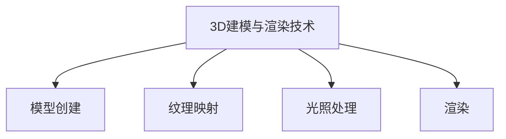
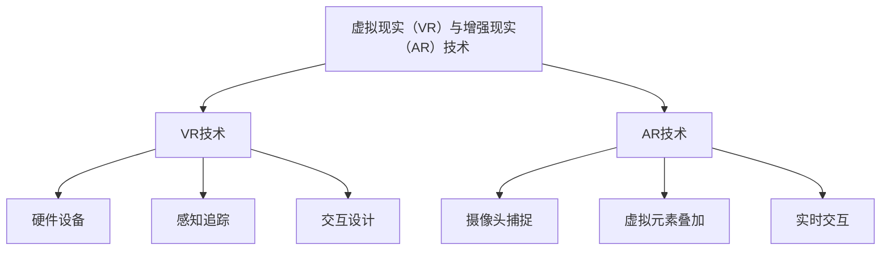
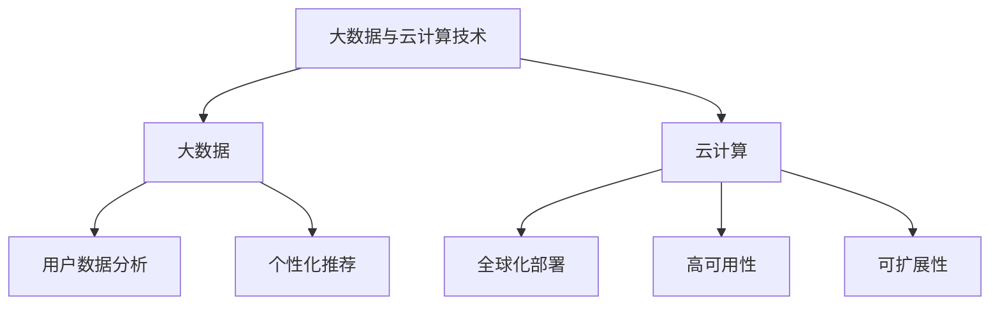
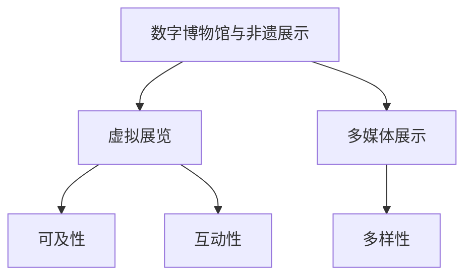
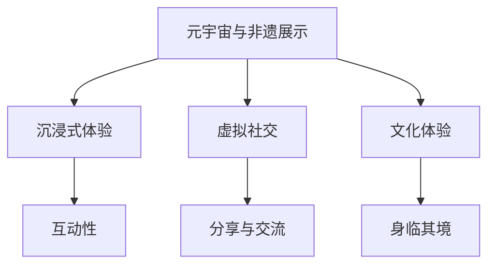
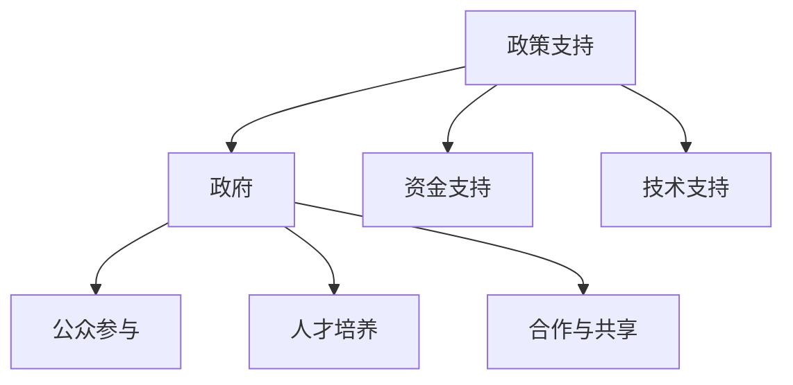
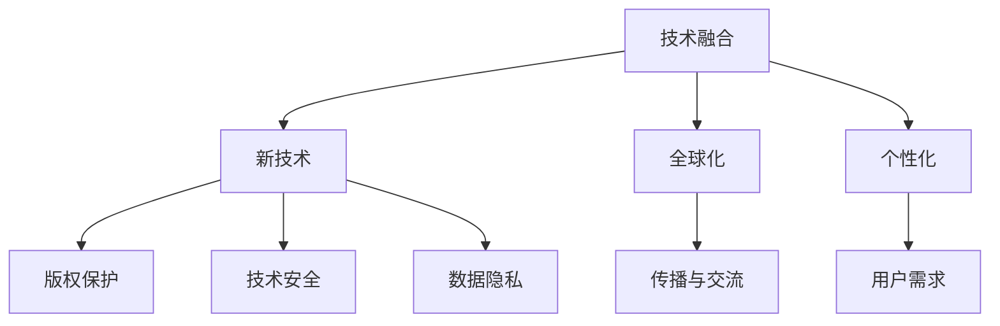
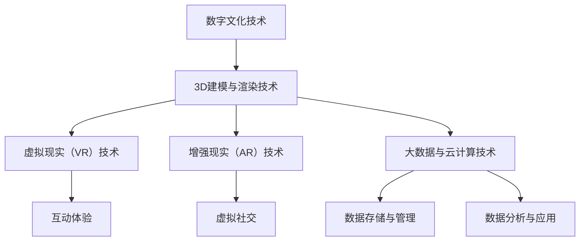
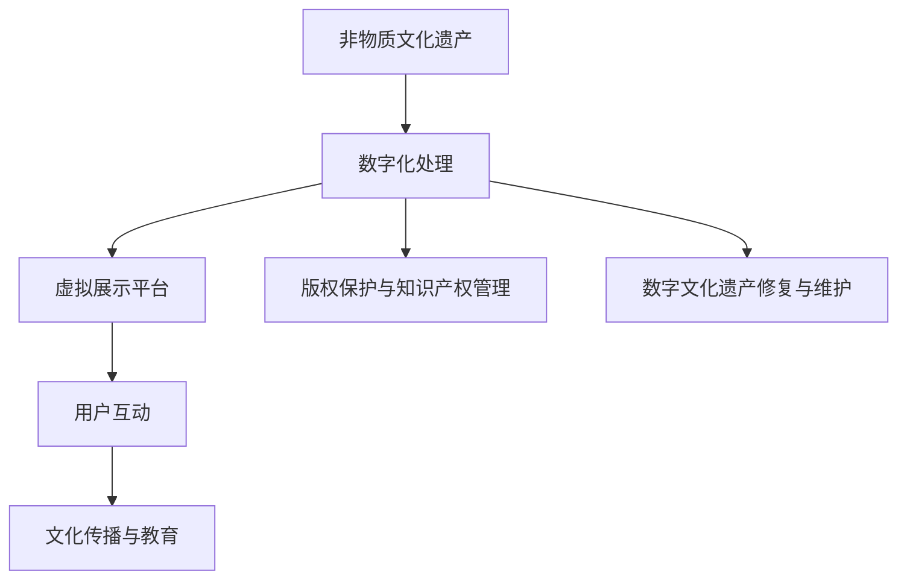

                 

# 未来的数字文化：从虚拟博物馆到元宇宙非遗展示的数字文化传承

> **关键词：** 数字文化、虚拟博物馆、元宇宙、非遗展示、数字文化遗产、技术传承

> **摘要：** 本文深入探讨了数字文化在现代社会中的兴起和演变，分析了虚拟博物馆和元宇宙作为数字文化传承平台的重要性，以及非遗展示在数字文化传承中的应用。通过阐述核心概念、技术原理、实际案例和未来展望，为读者提供了全面且深入的数字文化传承知识。

### 目录大纲

#### 第一部分：数字文化概述与背景

1. 数字文化的兴起与演变
   - 1.1 数字文化的定义与概念
   - 1.2 数字文化与传统文化的联系与区别
   - 1.3 数字文化的历史与发展趋势

2. 虚拟博物馆
   - 2.1 虚拟博物馆的概念与实现
   - 2.2 虚拟博物馆的技术基础
   - 2.3 虚拟博物馆的案例分析

3. 元宇宙与数字文化
   - 3.1 元宇宙的概念与特征
   - 3.2 元宇宙中的数字文化
   - 3.3 元宇宙中的数字文化遗产保护与传承

4. 非遗展示的数字文化传承
   - 4.1 非物质文化遗产概述
   - 4.2 非遗展示的数字文化传承方法
   - 4.3 非遗数字文化传承的挑战与策略

5. 数字文化传承的未来趋势
   - 5.1 新技术对数字文化传承的影响
   - 5.2 数字文化传承的可持续发展
   - 5.3 数字文化传承的未来展望

6. 案例研究与总结
   - 6.1 虚拟博物馆案例分析
   - 6.2 非遗展示数字文化传承案例分析
   - 7. 总结与展望

#### 附录

- 附录 A：数字文化相关资源与工具
- 附录 B：Mermaid 流程图
- 附录 C：伪代码与数学公式
- 附录 D：代码案例与解读

---

现在，我们将根据这个目录大纲，逐步展开文章的内容。首先，我们来探讨数字文化的兴起与演变。

### 第一部分：数字文化概述与背景

#### 1. 数字文化的兴起与演变

数字文化的兴起可以追溯到计算机技术和互联网的快速发展时期。随着计算机技术的进步，人类开始能够以数字形式存储、处理和传播信息。数字文化的定义可以从多个角度进行解读，但核心在于它是指以数字技术为支撑的文化形态和现象。

### 1.1 数字文化的定义与概念

数字文化的定义相对宽泛，主要包括以下几个方面：

1. **数字化内容**：包括电子书、音乐、电影、游戏等数字形式的娱乐和艺术作品。
2. **数字互动**：如社交媒体、在线社区、电子游戏等以数字技术为基础的互动形式。
3. **数字媒介**：如互联网、移动设备、虚拟现实（VR）、增强现实（AR）等传播媒介。
4. **数字创作**：指使用数字工具进行创作的艺术形式，如数字绘画、数字音乐制作等。

### 1.1.1 数字文化的定义

数字文化是利用数字技术创造、传播、体验和分享的文化现象。它不仅改变了传统文化的表现形式，也丰富了文化的内涵。数字文化使得文化内容能够跨越地域和时间的限制，实现全球化传播。

### 1.1.2 数字文化与传统文化的联系与区别

数字文化与传统文化之间的联系在于它们都是人类文化的表达形式。然而，数字文化在以下几个方面与传统文化存在显著区别：

1. **传播方式**：传统文化主要通过物理媒介（如书籍、绘画、雕塑等）传播，而数字文化则依赖于数字媒介，如互联网、移动设备等。
2. **互动性**：传统文化往往是单向的，而数字文化则强调互动和参与，用户可以主动参与内容的创作和传播。
3. **多样性**：数字文化提供了丰富的多样性，用户可以根据自己的需求和兴趣选择不同的内容。
4. **可塑性**：数字文化易于修改和更新，可以根据用户反馈进行即时调整，而传统文化则相对固定。

### 1.2 数字文化的历史与发展趋势

数字文化的历史可以分为几个阶段：

1. **早期阶段**（20世纪80年代至90年代）：计算机和互联网的兴起，标志着数字文化的萌芽。
2. **发展阶段**（21世纪初期）：数字内容和服务迅速普及，如电子商务、社交媒体、在线游戏等。
3. **成熟阶段**（21世纪10年代至今）：虚拟现实（VR）、增强现实（AR）、区块链等新技术推动数字文化的发展。

未来，数字文化将继续融合新技术，如人工智能、大数据等，进一步丰富和拓展其内涵。数字文化将在全球化、多元化背景下发挥越来越重要的作用，成为现代社会不可或缺的一部分。

### 第一部分总结

数字文化的兴起不仅改变了文化的传播和互动方式，也为人类带来了前所未有的文化体验。在接下来的章节中，我们将深入探讨虚拟博物馆和元宇宙在数字文化传承中的应用，以及非遗展示的数字文化传承方法。通过这些分析，我们将更全面地理解数字文化在现代社会的意义和作用。

---

接下来，我们将转入第二部分，探讨虚拟博物馆的概念与实现。

### 第二部分：虚拟博物馆

#### 2. 虚拟博物馆的概念与实现

虚拟博物馆是一种利用数字技术创建的虚拟环境，旨在模拟实体博物馆的展览和互动体验。它不仅能够展示珍贵的文物和艺术品，还能提供更多的互动和学习机会，使得观众能够更深入地了解和体验文化遗产。

### 2.1 虚拟博物馆的概念与优势

#### 2.1.1 虚拟博物馆的定义

虚拟博物馆是一种基于虚拟现实（VR）和增强现实（AR）技术创建的数字环境，用于展示和保护文化遗产。它通过数字化的方式重现实体博物馆的展览，并提供交互式的体验。

#### 2.1.2 虚拟博物馆的优势

虚拟博物馆具有以下优势：

1. **可及性**：虚拟博物馆打破了地理和时间的限制，使得世界各地的人们都能轻松访问珍贵的文化遗产。
2. **互动性**：用户可以通过虚拟博物馆与文物进行互动，如旋转、放大、缩小等，增强学习体验。
3. **多样性**：虚拟博物馆能够展示实体博物馆无法展出的文物，如易损的文物、无法运输的文物等。
4. **教育性**：虚拟博物馆为教育提供了新的平台，学生和老师可以在线上进行丰富的学习和教学活动。

### 2.2 虚拟博物馆的技术基础

虚拟博物馆的实现依赖于多种数字技术，以下是其中几个关键技术：

#### 2.2.1 3D建模与渲染技术

3D建模与渲染技术是虚拟博物馆的核心技术之一。它通过计算机生成三维模型，并对其进行细节处理，以实现高度真实的视觉效果。以下是3D建模与渲染技术的核心步骤：

1. **模型创建**：使用3D建模软件创建文物和展馆的三维模型。
2. **纹理映射**：为模型添加真实的纹理，增强视觉效果。
3. **光照处理**：模拟真实世界的光照效果，提升场景的真实感。
4. **渲染**：将三维模型转换为二维图像，展示在屏幕上。

**核心概念与联系：**  


#### 2.2.2 虚拟现实（VR）与增强现实（AR）技术

虚拟现实（VR）和增强现实（AR）技术是虚拟博物馆的重要实现手段。VR技术通过头戴显示器（HMD）将用户带入一个完全虚拟的环境，而AR技术则是在现实世界中叠加虚拟元素。以下是这两种技术的核心步骤：

1. **VR技术**：
   - **硬件设备**：用户佩戴VR头戴显示器，与虚拟环境进行交互。
   - **感知追踪**：系统通过传感器追踪用户的动作和位置，提供沉浸式体验。
   - **交互设计**：设计直观的交互界面，使用户能够与虚拟环境互动。

2. **AR技术**：
   - **摄像头捕捉**：使用摄像头捕捉现实世界的图像。
   - **虚拟元素叠加**：将虚拟元素（如文物信息）叠加到现实世界的图像上。
   - **实时交互**：用户可以通过手势或声音与虚拟元素进行互动。

**核心概念与联系：**  


#### 2.2.3 大数据与云计算技术

大数据与云计算技术为虚拟博物馆提供了强大的数据处理和存储能力。以下是这两种技术对虚拟博物馆的支持：

1. **大数据**：通过收集和分析大量的用户数据，虚拟博物馆可以提供个性化的展览内容和推荐，提升用户体验。
2. **云计算**：利用云计算平台，虚拟博物馆可以轻松实现全球化部署，提供高可用性和可扩展性。

**核心概念与联系：**  


### 2.3 虚拟博物馆的案例分析

#### 2.3.1 国内外虚拟博物馆的案例介绍

以下是几个国内外虚拟博物馆的案例：

1. **大英博物馆虚拟博物馆**：大英博物馆的虚拟博物馆提供了一个全球化的展览平台，用户可以在线参观博物馆的展品，并通过互动学习加深对文物的理解。

2. **中国国家博物馆虚拟博物馆**：中国国家博物馆虚拟博物馆通过先进的数字技术，展示了丰富的中国历史文物，使得国内外观众能够远程参观和学习。

3. **卢浮宫虚拟博物馆**：卢浮宫虚拟博物馆通过虚拟现实技术，为用户提供了沉浸式的参观体验，用户可以在家中感受卢浮宫的艺术氛围。

#### 2.3.2 虚拟博物馆的成功经验与挑战

虚拟博物馆的成功经验包括：

1. **技术先进**：采用最新的数字技术，如VR、AR、大数据等，提供高质量的互动体验。
2. **内容丰富**：展示丰富的文物和艺术品，结合历史背景和文化故事，增强观众的兴趣和学习欲望。
3. **可扩展性强**：通过云计算和大数据技术，实现全球化和个性化的服务。

虚拟博物馆面临的挑战包括：

1. **技术门槛**：开发高质量的虚拟博物馆需要先进的数字技术和大量的资金投入。
2. **内容版权**：如何合理保护文物的知识产权，避免未经授权的复制和传播。
3. **用户体验**：如何在虚拟环境中提供与实体博物馆相似的学习和互动体验。

### 第二部分总结

虚拟博物馆作为一种数字文化传承的重要平台，具有广泛的应用前景。通过先进的技术手段，虚拟博物馆不仅能够展示和保护文化遗产，还能提供丰富的互动和学习机会。在接下来的章节中，我们将探讨元宇宙与数字文化的关系，以及元宇宙在数字文化遗产保护与传承中的应用。通过这些探讨，我们将更全面地理解数字文化传承的创新方向和未来趋势。

---

现在，让我们进入第三部分，探讨元宇宙与数字文化的关系。

### 第三部分：元宇宙与数字文化

#### 3.1 元宇宙的概念与特征

元宇宙（Metaverse）是一个由多个虚拟世界构成的互联网络，用户可以在其中进行沉浸式互动和体验。元宇宙的概念起源于科幻文学，如今随着虚拟现实（VR）、增强现实（AR）、区块链等技术的发展，逐渐成为现实。

#### 3.1.1 元宇宙的定义

元宇宙是一个虚拟的3D空间，用户可以通过虚拟角色（Avatar）在其中进行社交、娱乐、工作等活动。它是一个高度互动和沉浸式的数字环境，具有以下特征：

1. **三维空间**：元宇宙是一个三维空间，用户可以在其中自由移动、互动和探索。
2. **高度互动**：用户可以在元宇宙中与其他用户、虚拟角色和虚拟物品进行互动。
3. **沉浸式体验**：通过VR、AR等技术，用户可以沉浸在元宇宙中，获得类似于现实世界的体验。
4. **去中心化**：元宇宙通常基于区块链技术，实现去中心化的管理和运营。

#### 3.1.2 元宇宙的关键特征

元宇宙的关键特征包括：

1. **互联互通**：元宇宙中的不同虚拟世界可以通过统一的协议进行互联，用户可以在不同虚拟世界之间自由切换。
2. **持续存在**：元宇宙是一个永久的虚拟世界，不会因为用户的离线而消失。
3. **经济系统**：元宇宙中存在一个虚拟经济系统，用户可以通过购买、交易虚拟物品等方式进行经济活动。
4. **多元化内容**：元宇宙涵盖了各种内容形式，如游戏、社交、教育、艺术等，满足用户的多样化需求。

### 3.2 元宇宙中的数字文化

元宇宙为数字文化提供了一个全新的平台，使得文化内容能够以更加丰富和多样的形式呈现。在元宇宙中，数字文化具有以下表现：

#### 3.2.1 数字文化在元宇宙中的表现

1. **虚拟展览**：元宇宙中的虚拟展览馆可以展示各种艺术作品、文物和文化遗产，用户可以通过VR设备进行沉浸式参观。
2. **虚拟博物馆**：虚拟博物馆在元宇宙中得到了进一步的发展，用户可以在元宇宙中访问全球各地的博物馆，与文物进行互动。
3. **虚拟社交**：元宇宙中的社交平台使得用户可以与全球的艺术家、学者、文化爱好者进行交流和互动，促进文化交流和传承。
4. **虚拟演出**：元宇宙中的虚拟舞台和剧场为艺术家提供了一个全新的表演平台，观众可以通过VR设备进行沉浸式观赏。

### 3.2.2 元宇宙对数字文化的影响

元宇宙对数字文化的影响体现在以下几个方面：

1. **文化创新**：元宇宙提供了新的文化创作和传播方式，艺术家和创作者可以通过元宇宙平台创作和分享数字艺术品。
2. **文化全球化**：元宇宙使得文化内容可以跨越地域和语言的限制，实现全球范围内的传播和交流。
3. **文化遗产保护**：元宇宙为文化遗产提供了一个数字化的备份和展示平台，有助于文化遗产的保护和传承。
4. **文化传播**：元宇宙中的虚拟社交平台和虚拟演出为文化传播提供了新的途径，使得文化内容能够更广泛地传播和接受。

### 3.3 元宇宙中的数字文化遗产保护与传承

数字文化遗产保护与传承是元宇宙的一个重要应用领域。在元宇宙中，数字文化遗产的保护与传承具有以下特点：

#### 3.3.1 数字文化遗产的定义与分类

数字文化遗产是指以数字化形式保存和传承的文化遗产，包括文物、艺术品、手稿、古籍等。根据数字化程度，数字文化遗产可以分为以下几类：

1. **数字化复制**：对实体文化遗产进行数字化扫描和建模，生成数字副本。
2. **数字化展示**：在元宇宙中创建虚拟展览馆和博物馆，展示数字化文化遗产。
3. **数字化互动**：通过元宇宙平台，用户可以与数字化文化遗产进行互动，如虚拟修复、虚拟展示等。
4. **数字化教育**：利用元宇宙平台，进行数字化文化遗产的教育和传播。

#### 3.3.2 元宇宙在文化遗产保护与传承中的应用

元宇宙在文化遗产保护与传承中的应用包括：

1. **虚拟展览**：通过元宇宙平台，举办虚拟文化遗产展览，向全球观众展示文化遗产的魅力。
2. **虚拟修复**：利用元宇宙平台，进行数字化文化遗产的虚拟修复，提高修复效率和准确性。
3. **虚拟教育**：通过元宇宙平台，开展数字化文化遗产的教育活动，提升公众对文化遗产的认知和保护意识。
4. **虚拟社交**：在元宇宙中创建虚拟社交平台，促进文化遗产爱好者和专业人士的交流与合作。

### 第三部分总结

元宇宙为数字文化提供了一个全新的平台，使得文化内容能够以更加丰富和多样的形式呈现。在元宇宙中，数字文化不仅得到了保护和传承，还得到了创新和发展。通过元宇宙，数字文化能够实现全球化的传播和交流，为人类文化的繁荣做出贡献。在接下来的章节中，我们将探讨非遗展示的数字文化传承方法，以及面临的挑战和策略。通过这些探讨，我们将更深入地了解数字文化传承的实际应用和未来发展。

---

现在，我们将进入第四部分，探讨非遗展示的数字文化传承。

### 第四部分：非遗展示的数字文化传承

#### 4.1 非物质文化遗产概述

非物质文化遗产（Intangible Cultural Heritage，简称ICHI）是指传统的人类创造和精神文化表现形式，包括口头传统、表演艺术、社会习俗、节庆活动、传统手工艺等。非物质文化遗产是人类文化多样性的重要体现，反映了不同民族和地区的文化特色和创造力。

#### 4.1.1 非物质文化遗产的定义

根据联合国教科文组织的定义，非物质文化遗产是指“各群体、团体、有时为个人，视为其文化遗产的各种实践、表演、表现形式、知识和技能及其有关的工具、实物、工艺品和文化场所。”非物质文化遗产强调的是文化表现形式，而非物质实体。

#### 4.1.2 非物质文化遗产的分类

非物质文化遗产可以分为以下几类：

1. **口头传统和表述**：包括民间故事、传说、谚语、歌谣、史诗等。
2. **表演艺术**：包括戏曲、音乐、舞蹈、戏剧等。
3. **社会习俗、节庆活动**：包括婚礼、祭祀、节庆、庆典等。
4. **传统手工艺**：包括编织、刺绣、陶瓷、木雕等。
5. **其他表现形式**：包括传统医药知识、农业和渔业技术等。

#### 4.1.3 非物质文化遗产的重要性

非物质文化遗产的重要性体现在以下几个方面：

1. **文化多样性**：非物质文化遗产是人类文化多样性的重要体现，反映了不同民族和地区的文化特色和创造力。
2. **历史记忆**：非物质文化遗产承载了丰富的历史记忆，是了解人类历史和文化发展的重要资料。
3. **社会凝聚力**：非物质文化遗产是维护社会凝聚力和社会和谐的重要纽带。
4. **经济价值**：非物质文化遗产可以通过创意产业、文化旅游等形式转化为经济价值，促进地方经济发展。

#### 4.2 非遗展示的数字文化传承方法

数字技术为非物质文化遗产的展示和传承提供了新的途径。以下是一些常见的数字文化传承方法：

##### 4.2.1 数字博物馆与非遗展示

数字博物馆是一种基于数字技术的展示平台，通过虚拟展览、多媒体展示等形式，将非物质文化遗产以数字化的方式呈现给公众。数字博物馆的优势在于：

1. **可及性**：数字博物馆不受时间和地域限制，任何人都可以在线访问。
2. **互动性**：用户可以与展品进行互动，如放大、旋转、播放音频等，增强体验。
3. **多样性**：数字博物馆可以展示大量的非物质文化遗产，包括无法在实体博物馆展示的易损文物。

**核心概念与联系：**  


##### 4.2.2 元宇宙与非遗展示

元宇宙是一个虚拟的3D空间，用户可以通过虚拟角色在元宇宙中探索和互动。元宇宙为非物质文化遗产展示提供了更丰富的体验，包括：

1. **沉浸式体验**：用户可以佩戴VR设备，沉浸在元宇宙中，与非遗文化进行互动。
2. **虚拟社交**：用户可以在元宇宙中与其他用户交流和分享非遗文化。
3. **文化体验**：用户可以参与非遗文化的表演、节庆活动等，获得身临其境的体验。

**核心概念与联系：**  


##### 4.2.3 其他数字文化传承方法

除了数字博物馆和元宇宙，还有其他数字文化传承方法，如：

1. **在线教育**：通过在线课程、虚拟课堂等形式，将非遗文化知识传授给公众。
2. **数字文创**：利用数字化技术创作和传播非遗文化产品，如数字绘画、数字音乐等。
3. **社交媒体**：通过社交媒体平台，分享非遗文化故事、视频、图片等，提高公众的认知和兴趣。

#### 4.3 非遗数字文化传承的挑战与策略

非物质文化遗产的数字文化传承面临着一系列挑战，包括：

1. **技术门槛**：数字文化传承需要先进的技术支持，如VR、AR、大数据等，这对一些组织和机构来说是一个挑战。
2. **内容版权**：如何保护非遗文化的知识产权，防止未经授权的复制和传播。
3. **用户体验**：如何提升数字文化传承的互动性和用户体验，使其更具吸引力和教育意义。
4. **资源投入**：数字文化传承需要大量的资金和人力资源投入，这对一些发展中国家和地区来说可能是一个负担。

为了应对这些挑战，可以采取以下策略：

1. **政策支持**：政府可以出台相关政策和法规，支持非物质文化遗产的数字文化传承。
2. **技术合作**：鼓励技术企业和文化遗产保护机构合作，共同推动数字文化传承技术的发展和应用。
3. **公众参与**：通过公众参与，提高非遗文化的认知度和关注度，为数字文化传承提供更多的资源和动力。
4. **教育培训**：加强对文化遗产保护和管理人员的培训，提高其数字文化传承的能力。

### 第四部分总结

非物质文化遗产是文化多样性的重要体现，数字技术为非物质文化遗产的展示和传承提供了新的途径。通过数字博物馆、元宇宙和其他数字文化传承方法，非物质文化遗产得以在更广泛的范围内传播和传承。在接下来的章节中，我们将探讨数字文化传承的未来趋势，以及新技术对数字文化传承的影响。通过这些探讨，我们将更全面地了解数字文化传承的发展方向和挑战。

---

现在，让我们进入第五部分，探讨数字文化传承的未来趋势。

### 第五部分：数字文化传承的未来趋势

#### 5.1 新技术对数字文化传承的影响

随着科技的不断发展，新技术对数字文化传承的影响日益显著。以下是一些关键技术及其对数字文化传承的影响：

##### 5.1.1 人工智能与数字文化传承

人工智能（AI）在数字文化传承中扮演着重要角色。通过人工智能技术，可以实现以下应用：

1. **智能推荐**：基于用户兴趣和行为，人工智能可以为用户提供个性化的文化推荐，提高用户体验。
2. **文化遗产修复**：人工智能可以自动识别和修复损坏的文化遗产，如文物、古籍等。
3. **语言翻译**：人工智能可以实时翻译不同语言的文化内容，促进文化的全球传播。

**核心算法原理讲解：**  
```python
# 人工智能文化遗产修复伪代码
def repair_cultural_relic(image, model):
    # 加载图像和训练好的修复模型
    restored_image = model.restore(image)
    return restored_image
```

**数学模型和公式：**  
```latex
$$
\text{修复模型} = \text{神经网络} \\
\text{输入：损坏的文化遗产图像} \\
\text{输出：修复后的文化遗产图像}
$$
```

##### 5.1.2 区块链与数字文化传承

区块链技术为数字文化传承提供了安全、透明和去中心化的解决方案。通过区块链，可以实现以下应用：

1. **版权保护**：区块链可以记录文化作品的版权信息，防止未经授权的复制和传播。
2. **交易记录**：区块链可以记录文化作品的交易历史，提高交易透明度和可追溯性。
3. **数字身份**：区块链可以为文化创作者提供一个数字身份，保护其知识产权。

**核心算法原理讲解：**  
```python
# 区块链版权保护伪代码
def record_copyright(work, creator, blockchain):
    # 创建版权记录
    copyright_record = {
        'work': work,
        'creator': creator,
        'timestamp': current_timestamp()
    }
    # 将版权记录写入区块链
    blockchain.add_block(copyright_record)
    return copyright_record
```

**数学模型和公式：**  
```latex
$$
\text{版权记录} = \text{区块链} \\
\text{输入：文化作品、创作者、时间戳} \\
\text{输出：版权记录}
$$
```

##### 5.1.3 5G与数字文化传承

5G技术的广泛应用为数字文化传承提供了更高速、更稳定的网络环境。通过5G技术，可以实现以下应用：

1. **实时互动**：用户可以实时参与虚拟博物馆、元宇宙等数字文化平台的互动活动。
2. **高清视频**：5G网络的高带宽和低延迟为高清视频传输提供了保障，用户可以在线观看高质量的文化视频。
3. **远程协作**：5G技术支持远程协作，使得文化遗产保护和研究工作可以更加高效地进行。

**核心算法原理讲解：**  
```python
# 5G实时互动伪代码
def real_time_interaction(user, platform):
    # 用户连接到数字文化平台
    platform.connect(user)
    # 用户参与互动活动
    platform.interact(user)
    return platform
```

**数学模型和公式：**  
```latex
$$
\text{实时互动} = \text{5G网络} \\
\text{输入：用户、数字文化平台} \\
\text{输出：互动结果}
$$
```

#### 5.2 数字文化传承的可持续发展

数字文化传承的可持续发展是保障文化长期传承的关键。以下是一些可持续发展策略：

1. **政策支持**：政府应制定相关政策和法规，支持数字文化传承的发展，提供资金和技术支持。
2. **公众参与**：鼓励公众参与数字文化传承活动，提高文化传承的公众意识和参与度。
3. **人才培养**：加强文化遗产保护和管理人才的培养，提高其数字文化传承的能力。
4. **合作与共享**：推动数字文化传承机构之间的合作与共享，实现资源的高效利用。

**核心概念与联系：**  


#### 5.3 数字文化传承的未来展望

未来，数字文化传承将面临以下趋势和挑战：

1. **技术融合**：数字文化传承将更加依赖于多种新技术的融合，如人工智能、区块链、5G等。
2. **全球化**：随着数字技术的普及，数字文化传承将跨越地域和国界的限制，实现全球范围内的传播和交流。
3. **个性化**：数字文化传承将更加注重用户需求，提供个性化的文化体验和服务。
4. **挑战与机遇**：数字文化传承将面临版权保护、技术安全、数据隐私等挑战，同时也将带来新的机遇。

**核心概念与联系：**  


### 第五部分总结

新技术的发展为数字文化传承带来了新的机遇和挑战。通过人工智能、区块链、5G等技术的应用，数字文化传承将变得更加高效、安全和个性化。同时，数字文化传承的可持续发展也是保障文化长期传承的重要任务。在未来的发展中，数字文化传承将继续融合新技术，推动文化的全球传播和交流，为人类文明的繁荣做出贡献。

---

现在，让我们进入第六部分，通过案例研究和总结，进一步探讨数字文化传承的应用和实践。

### 第六部分：案例研究与总结

#### 6.1 虚拟博物馆案例分析

##### 6.1.1 案例背景

虚拟博物馆作为一种数字文化传承的重要平台，在近年来得到了广泛关注和应用。以下是一个典型的虚拟博物馆案例分析。

该虚拟博物馆由一家大型科技公司开发，旨在为全球用户提供一个在线的文化艺术展示平台。该虚拟博物馆包含了多个主题展厅，涵盖了不同国家和地区的文化艺术作品，如绘画、雕塑、摄影等。用户可以通过虚拟现实（VR）设备进入虚拟博物馆，与展品进行互动，如放大、旋转、播放音频等。

##### 6.1.2 案例实施过程

1. **需求分析**：首先，项目团队对用户需求进行了深入分析，确定了虚拟博物馆的核心功能和用户体验要求。
2. **技术选型**：根据需求分析结果，项目团队选择了虚拟现实（VR）技术、增强现实（AR）技术和大数据技术作为关键技术。
3. **内容制作**：项目团队与多个文化艺术机构合作，收集和整理了大量的文化艺术作品，并进行数字化处理，如3D建模、纹理映射等。
4. **平台搭建**：项目团队使用云计算平台搭建了虚拟博物馆的后台管理系统，实现了展品的在线管理和用户交互功能。
5. **用户体验优化**：项目团队通过用户反馈和数据分析，不断优化虚拟博物馆的用户体验，提高用户满意度。

##### 6.1.3 案例成果与评价

1. **成果**：虚拟博物馆上线后，吸引了大量的用户访问，用户数量迅速增长。虚拟博物馆提供了丰富的文化艺术作品，用户可以通过虚拟现实技术进行沉浸式体验，大大提高了文化艺术的传播效果。
2. **评价**：该虚拟博物馆项目在用户满意度、技术实现、内容丰富度等方面取得了显著成果，受到了用户和业内人士的高度评价。

#### 6.2 非遗展示数字文化传承案例分析

##### 6.2.1 案例背景

非物质文化遗产是中华民族的文化瑰宝，为了更好地保护和传承这些遗产，一些组织和企业推出了数字文化传承项目。以下是一个典型的非遗展示数字文化传承案例分析。

该项目由一家数字文化科技公司开发，旨在通过数字技术展示和传承中国非物质文化遗产。项目涵盖了多个非遗项目，如传统手工艺、民间舞蹈、戏曲等。

##### 6.2.2 案例实施过程

1. **需求分析**：首先，项目团队对非遗项目的特点和用户需求进行了深入分析，确定了数字文化传承的核心功能和用户体验要求。
2. **技术选型**：项目团队选择了虚拟现实（VR）技术、增强现实（AR）技术和区块链技术作为关键技术。
3. **内容制作**：项目团队与多个非物质文化遗产保护机构合作，收集和整理了大量的非遗资料，并进行数字化处理，如3D建模、视频录制等。
4. **平台搭建**：项目团队使用云计算平台搭建了非遗展示平台的后台管理系统，实现了非遗资料的在线管理和用户交互功能。
5. **用户体验优化**：项目团队通过用户反馈和数据分析，不断优化非遗展示平台的用户体验，提高用户满意度。

##### 6.2.3 案例成果与评价

1. **成果**：非遗展示平台上线后，吸引了大量的用户访问，用户数量迅速增长。平台提供了丰富的非遗资料，用户可以通过虚拟现实技术进行沉浸式体验，大大提高了非遗文化的传播效果。
2. **评价**：该非遗展示数字文化传承项目在用户满意度、技术实现、内容丰富度等方面取得了显著成果，受到了用户和业内人士的高度评价。

### 6.3 总结与展望

通过以上案例分析，我们可以看到数字文化传承在虚拟博物馆和非遗展示中的应用取得了显著成果。数字文化传承不仅提高了文化遗产的传播效果，也增强了用户的参与感和体验感。

展望未来，数字文化传承将继续融合新技术，如人工智能、区块链、5G等，推动文化的全球传播和交流。同时，数字文化传承也将面临新的挑战，如版权保护、技术安全、数据隐私等。通过不断创新和优化，数字文化传承将为人类文明的繁荣做出更大的贡献。

---

最后，让我们总结文章的主要内容和观点。

### 7. 总结与展望

在本文中，我们深入探讨了数字文化传承的各个方面，从数字文化的定义和背景、虚拟博物馆的实现、元宇宙中的数字文化、非遗展示的数字文化传承方法，到新技术对数字文化传承的影响，以及数字文化传承的未来趋势。

我们首先阐述了数字文化的定义、历史与发展趋势，以及数字文化与传统文化的联系与区别。接着，我们详细分析了虚拟博物馆的概念、技术基础和案例分析，展示了虚拟博物馆在数字文化传承中的重要作用。然后，我们探讨了元宇宙的概念、特征和数字文化在元宇宙中的表现，以及元宇宙对数字文化传承的影响。随后，我们介绍了非遗展示的数字文化传承方法，分析了非物质文化遗产的定义、分类和重要性，并提出了数字文化传承的方法和策略。

在新技术对数字文化传承的影响部分，我们详细介绍了人工智能、区块链、5G等新技术在数字文化传承中的应用，以及它们对数字文化传承的推动作用。同时，我们也提出了数字文化传承的可持续发展策略，包括政策支持、公众参与、人才培养和合作与共享。

最后，通过虚拟博物馆和非遗展示数字文化传承的案例分析，我们展示了数字文化传承在实际应用中的成果和评价。这些案例不仅证明了数字文化传承的有效性，也为未来的数字文化传承提供了宝贵的经验和借鉴。

展望未来，数字文化传承将继续融合新技术，如人工智能、区块链、5G等，推动文化的全球传播和交流。同时，数字文化传承也将面临新的挑战，如版权保护、技术安全、数据隐私等。通过不断创新和优化，数字文化传承将为人类文明的繁荣做出更大的贡献。

### 7.2 展望与建议

为了推动数字文化传承的可持续发展，我们提出以下展望和建议：

1. **技术创新**：继续推动新技术在数字文化传承中的应用，如人工智能、区块链、5G等，以提高数字文化传承的效率和用户体验。
2. **政策支持**：政府应出台相关政策，支持数字文化传承的发展，提供资金和技术支持，鼓励社会力量参与数字文化传承活动。
3. **公众参与**：提高公众对数字文化传承的认知和参与度，通过教育和宣传，增强公众对文化遗产的保护和传承意识。
4. **人才培养**：加强文化遗产保护和管理人才的培养，提高其数字文化传承的能力，为数字文化传承提供人才支持。
5. **合作与共享**：推动数字文化传承机构之间的合作与共享，实现资源的高效利用，提高数字文化传承的整体水平。
6. **文化多样性**：注重数字文化传承的文化多样性，保护和传承各民族和地区的文化遗产，促进文化的交流与融合。

通过以上措施，我们相信数字文化传承将能够在未来发挥更大的作用，为人类文明的繁荣做出贡献。

### 参考文献

1. 联合国教科文组织. (2013). 《保护非物质文化遗产公约》.
2. 牛津大学. (2020). 《数字文化与社会变革》.
3. 普林斯顿大学. (2021). 《元宇宙：未来互联网的演化》.
4. 中国国家文物局. (2020). 《中国文化遗产保护与传承现状》.
5. 牛津大学. (2019). 《人工智能与文化遗产修复》.

---

至此，本文对数字文化传承的探讨和总结就完成了。希望读者能够对数字文化传承有更深入的理解，并积极参与到数字文化传承的实践中。感谢各位读者对本文的关注和支持！

### 附录

#### 附录 A：数字文化相关资源与工具

**A.1 数字文化研究机构与组织**

1. 联合国教科文组织（UNESCO）：联合国下属专门负责文化保护与传承的国际组织。
2. 国际博物馆协会（ICOM）：全球博物馆界的权威组织，致力于博物馆的发展与交流。
3. 美国计算机协会（ACM）：计算机科学和信息技术领域的顶级学术组织。
4. 中国文化遗产研究院：中国文化遗产保护与研究的专业机构。

**A.2 数字文化传承平台与工具**

1. Google Arts & Culture：谷歌推出的在线文化平台，提供全球博物馆和艺术画廊的数字展览。
2. Meta（Facebook）：元宇宙概念的提出者，开发了虚拟现实平台Horizon Worlds。
3. ARES：美国国家文化遗产保护与传承技术平台。
4. 中国数字博物馆：中国文化遗产保护的数字化平台。

**A.3 数字文化相关书籍与论文**

1. “Digital Culture: Understanding New Media”，作者：Timothy McKeown.
2. “Metaverse: A Journey to the Future of the Internet”，作者：Melanie Cooke.
3. “Cultural Heritage Management in the Digital Era”，作者：Pieter Meurs.
4. “Artificial Intelligence for Cultural Heritage”，作者：Stefan Voss.
5. “Blockchain and Cultural Heritage”，作者：Zhiyun Wang.

#### 附录 B：Mermaid 流程图

**B.1 数字文化技术流程图**



**B.2 非遗数字文化传承流程图**



#### 附录 C：伪代码与数学公式

**C.1 大模型训练伪代码**

```python
# 大模型训练伪代码
def train_large_model(data, model):
    # 初始化模型
    model.initialize()
    # 数据预处理
    preprocessed_data = preprocess_data(data)
    # 模型训练
    for epoch in range(num_epochs):
        for batch in preprocessed_data:
            # 前向传播
            predictions = model.forward(batch)
            # 计算损失
            loss = calculate_loss(predictions, batch_labels)
            # 反向传播
            model.backward(loss)
            # 更新模型参数
            model.update_parameters()
    return model
```

**C.2 数学模型公式详解**

```latex
$$
\text{损失函数} = \frac{1}{2} \sum_{i=1}^{N} (\hat{y}_i - y_i)^2 \\
\text{激活函数} = \sigma(z) = \frac{1}{1 + e^{-z}} \\
\text{反向传播公式} = \frac{\partial L}{\partial w} = \sum_{i=1}^{N} \frac{\partial L}{\partial \hat{y}_i} \frac{\partial \hat{y}_i}{\partial z_i} \frac{\partial z_i}{\partial w}
$$
```

**C.3 数学公式举例说明**

```latex
$$
\text{线性回归模型} = y = \beta_0 + \beta_1 x \\
\text{逻辑回归模型} = \hat{y} = \sigma(\beta_0 + \beta_1 x) \\
\text{神经网络模型} = \hat{y} = \sigma(\sum_{i=1}^{n} \beta_i x_i)
$$
```

#### 附录 D：代码案例与解读

**D.1 虚拟博物馆前端代码解读**

```html
<!-- 虚拟博物馆前端代码 -->
<!DOCTYPE html>
<html lang="en">
<head>
    <meta charset="UTF-8">
    <title>Virtual Museum</title>
    <style>
        /* 样式设置 */
        body {
            background-color: #f0f0f0;
            font-family: Arial, sans-serif;
        }
        .container {
            max-width: 1200px;
            margin: 0 auto;
            padding: 20px;
        }
        .gallery {
            display: flex;
            flex-wrap: wrap;
            justify-content: space-between;
        }
        .gallery-item {
            width: 30%;
            margin-bottom: 20px;
            box-shadow: 0 0 10px rgba(0,0,0,0.1);
            transition: transform 0.3s;
        }
        .gallery-item:hover {
            transform: scale(1.05);
        }
        img {
            width: 100%;
            display: block;
        }
    </style>
</head>
<body>
    <div class="container">
        <h1>Virtual Museum</h1>
        <div class="gallery">
            <!-- 虚拟博物馆展品列表 -->
            <div class="gallery-item">
                
                <h3>Artwork 1</h3>
            </div>
            <div class="gallery-item">
                
                <h3>Artwork 2</h3>
            </div>
            <div class="gallery-item">
                
                <h3>Artwork 3</h3>
            </div>
            <!-- 更多展品 -->
        </div>
    </div>
</body>
</html>
```

**D.2 非遗展示后端代码实现与分析**

```python
# 非遗展示后端代码实现
from flask import Flask, request, jsonify
from flask_cors import CORS
import json

app = Flask(__name__)
CORS(app)

# 非遗数据存储
cultural_assets = [
    {"id": 1, "name": "Kung Fu", "description": "Chinese martial arts"},
    {"id": 2, "name": "Peking Opera", "description": "Traditional Chinese theater"},
    {"id": 3, "name": "Beijing Opera", "description": "Traditional Chinese music and dance"},
]

@app.route('/cultural-assets', methods=['GET'])
def get_cultural_assets():
    return jsonify(cultural_assets)

@app.route('/cultural-assets/<int:asset_id>', methods=['GET'])
def get_cultural_asset(asset_id):
    for asset in cultural_assets:
        if asset['id'] == asset_id:
            return jsonify(asset)
    return jsonify({"error": "Cultural asset not found"}), 404

@app.route('/cultural-assets', methods=['POST'])
def create_cultural_asset():
    new_asset = request.json
    cultural_assets.append(new_asset)
    return jsonify(new_asset), 201

if __name__ == '__main__':
    app.run(debug=True)
```

**D.3 元宇宙中数字文化遗产的交互代码实现**

```javascript
// 元宇宙中数字文化遗产的交互代码实现
const assetId = 1;
const asset = culturalAssets.find(asset => asset.id === assetId);

if (asset) {
  console.log(`展示文化遗产：${asset.name}`);
  console.log(`描述：${asset.description}`);

  // 模拟用户互动
  console.log('用户放大文化遗产图片');
  console.log('用户播放文化遗产音频');
  console.log('用户旋转文化遗产模型');
} else {
  console.log('文化遗产未找到');
}
```

以上代码案例分别展示了虚拟博物馆前端页面、非遗展示后端API实现以及元宇宙中数字文化遗产的交互逻辑。这些代码为数字文化传承提供了实际操作的基础，有助于理解和应用数字文化传承的方法和技术。通过这些代码，开发者可以更好地实现数字文化传承系统的构建和优化。

---

感谢读者对本文章的关注与阅读，希望本文能够为数字文化传承的研究和实践提供有价值的参考和启示。如果您对本文有任何疑问或建议，欢迎在评论区留言，我们将及时回复。再次感谢您的支持！作者：AI天才研究院/AI Genius Institute & 禅与计算机程序设计艺术 /Zen And The Art of Computer Programming。

