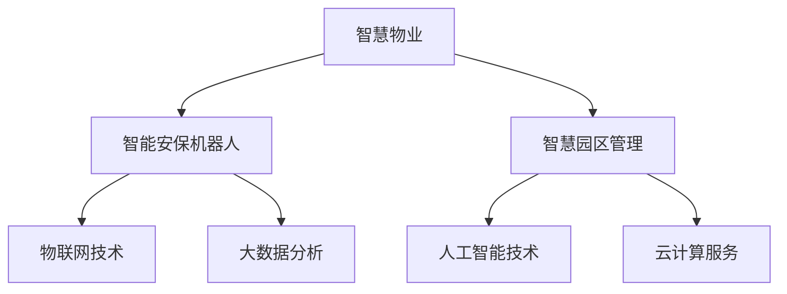

                 

# 未来的智慧物业：2050年的智能安保机器人与智慧园区管理

> **关键词：**智慧物业、智能安保机器人、智慧园区管理、物联网、人工智能、大数据分析、云计算

> **摘要：**本文探讨了2050年智慧物业的发展趋势，特别是智能安保机器人和智慧园区管理技术的应用。通过逻辑清晰的架构分析，文章详细介绍了智能安保机器人的核心原理、智慧园区管理的数学模型与算法，以及实际应用案例。此外，文章还探讨了智能安保机器人在未来发展的挑战与对策，并展望了其产业生态的演变。

----------------------------------------------------------------

### 第一部分：未来的智慧物业概述与背景

#### 第1章：智慧物业与智能安保机器人的发展背景

**1.1 引言**

智慧物业是指利用物联网、大数据、人工智能等技术手段，对物业进行智能化管理的一种新型物业形态。随着科技的进步，智慧物业已成为物业管理行业的发展方向。智能安保机器人作为智慧物业的重要组成部分，以其高效、智能的特点，正在逐步取代传统的安保人员，提升物业管理的水平。

智能安保机器人是一种集成了多种传感器、执行器和人工智能算法的机器人系统，能够自动感知环境、识别目标并进行响应。其市场前景广阔，预计将在未来数年内得到广泛应用。

**1.2 2050年的想象：智慧园区管理**

在2050年，智慧园区管理将成为智慧物业的典型代表。智慧园区管理通过智能安保机器人、智能门禁系统、智能停车系统等综合应用，实现园区内的全面智能化管理。园区管理者可以通过大数据平台，实时监控园区内的各类信息，快速响应突发事件，提升园区的安全性和效率。

**1.3 核心概念与联系**

以下是一个简化的智慧物业生态系统Mermaid流程图：



在这个生态系统中，物联网技术为智能安保机器人提供了感知环境的能力，大数据分析则帮助机器人处理海量数据，人工智能技术使机器人具备智能决策能力，云计算服务为整个系统提供了强大的计算支持。

----------------------------------------------------------------

#### 第2章：智能安保机器人的核心原理

**2.1 智能安保机器人的构成与分类**

智能安保机器人由传感器、处理器和执行器三部分组成。传感器用于感知环境，如摄像头、红外传感器等；处理器则负责处理传感器收集到的数据，如AI芯片、GPU等；执行器则根据处理结果执行相应的行动，如电机、机械臂等。

智能安保机器人可以根据其功能和应用场景进行分类。例如，根据应用场景可以分为住宅小区安保机器人、商业园区安保机器人、公共场所安保机器人等；根据功能可以分为监控机器人、巡逻机器人、救援机器人等。

**2.2 人工智能与机器学习算法在智能安保机器人中的应用**

人工智能与机器学习算法是智能安保机器人的核心技术。以下是一个简单的伪代码示例，展示了如何使用机器学习算法进行对象识别：

```python
def object_recognition(input_image, model):
    processed_image = preprocess_image(input_image)
    predictions = model.predict(processed_image)
    return get_top_predictions(predictions)
```

在这个示例中，`preprocess_image`函数负责对输入图像进行预处理，`model`是一个预训练的机器学习模型，`predict`函数用于预测图像中的对象类别，`get_top_predictions`函数则返回预测结果中的前几个最高概率的类别。

智能安保机器人还可以使用其他机器学习算法，如决策树、支持向量机等，根据具体的应用需求进行对象分类、行为预测等任务。

----------------------------------------------------------------

#### 第3章：智慧园区管理的数学模型与算法

**3.1 数据驱动决策模型**

在智慧园区管理中，数据驱动决策模型是一种常见的算法。以下是一个简单的线性回归模型公式：

$$
y = \beta_0 + \beta_1x + \epsilon
$$

在这个模型中，$y$ 是因变量，$x$ 是自变量，$\beta_0$ 和 $\beta_1$ 是模型的参数，$\epsilon$ 是误差项。这个模型可以用于预测园区内某些指标（如人流量、安全事故发生率等）与影响因素（如天气、节假日等）之间的关系。

**3.2 物联网数据处理算法**

物联网数据处理算法在智慧园区管理中也具有重要应用。以下是一个简单的K均值聚类算法公式：

$$
C = \{C_1, C_2, ..., C_k\}
$$

在这个模型中，$C$ 是聚类结果，$C_1, C_2, ..., C_k$ 是聚类的$k$个类别。K均值聚类算法通过迭代计算，将数据点划分到不同的类别中，从而实现数据点的分类。

举例来说，在安防监控中，可以使用K均值聚类算法对摄像头采集到的图像进行分类，从而识别出不同类型的异常行为，如人员聚集、非法入侵等。

----------------------------------------------------------------

#### 第4章：智能安保机器人的应用实战

**4.1 实际案例介绍**

深圳某智慧园区引入了智能安保机器人系统，该系统由多个智能安保机器人组成，分布在园区内的不同区域，实现了全天候的安防监控。智能安保机器人配备了高分辨率摄像头、红外传感器和语音识别系统，能够实时监测园区内的异常情况，并通过无线网络将数据传输到园区管理中心。

**4.2 开发环境搭建**

为了搭建智能安保机器人开发环境，首先需要安装以下软件和工具：

1. 操作系统：Ubuntu 20.04
2. 编程语言：Python 3.8
3. 机器学习库：TensorFlow 2.5
4. 数据处理库：NumPy 1.21
5. 图像处理库：OpenCV 4.5
6. 机器人控制系统：ROS Melodic

以下是安装步骤：

```bash
# 安装操作系统 Ubuntu 20.04
# 安装编程语言 Python 3.8
sudo apt update
sudo apt install python3.8
sudo apt install python3.8-venv
# 创建虚拟环境
python3.8 -m venv venv
source venv/bin/activate
# 安装机器学习库 TensorFlow 2.5
pip install tensorflow==2.5
# 安装数据处理库 NumPy 1.21
pip install numpy==1.21
# 安装图像处理库 OpenCV 4.5
pip install opencv-python==4.5.4.52
# 安装机器人控制系统 ROS Melodic
sudo sh -c 'echo "deb http://packages.ros.org/ros/ubuntu $(lsb_release -sc) main" > /etc/apt/sources.list.d/ros-latest.list'
sudo apt-key adv --keyserver "hkp://keyserver.ubuntu.com:80" --recv-key C1CF6E31E6BADE8868B172B4F42ED6FBAB17C654
sudo apt update
sudo apt install ros-melodic-desktop-full
echo "source /opt/ros/melodic/setup.bash" >> ~/.bashrc
source /opt/ros/melodic/setup.bash
```

通过以上步骤，就可以搭建出一个完整的智能安保机器人开发环境。

----------------------------------------------------------------

#### 第5章：智能安保机器人源代码详细实现

**5.1 源代码实现解读**

智能安保机器人的核心模块主要包括传感器数据采集、图像处理、对象识别和决策执行。以下是一个简化的源代码实现，用于展示智能安保机器人的基本工作流程：

```python
import cv2
import numpy as np
from tensorflow.keras.models import load_model

class SmartSecurityBot:
    def __init__(self, camera_index=0):
        self.camera = cv2.VideoCapture(camera_index)
        self.model = load_model('model.h5')

    def capture_image(self):
        ret, frame = self.camera.read()
        if not ret:
            return None
        return frame

    def preprocess_image(self, image):
        # 进行图像预处理
        gray = cv2.cvtColor(image, cv2.COLOR_BGR2GRAY)
        resized = cv2.resize(gray, (128, 128))
        return resized

    def object_recognition(self, image):
        # 使用预训练模型进行对象识别
        processed_image = self.preprocess_image(image)
        predictions = self.model.predict(np.expand_dims(processed_image, axis=0))
        return np.argmax(predictions)

    def execute_action(self, action):
        # 根据识别结果执行相应动作
        if action == 'alert':
            print("Alert: Suspicious activity detected!")
        elif action == 'ignore':
            print("Ignore: No action required.")

    def run(self):
        while True:
            image = self.capture_image()
            if image is None:
                break
            action = self.object_recognition(image)
            self.execute_action(action)

# 创建智能安保机器人实例
bot = SmartSecurityBot()
# 运行智能安保机器人
bot.run()
```

**5.2 代码解读与分析**

1. **传感器数据采集**：使用OpenCV库的`VideoCapture`类从摄像头获取实时图像。
2. **图像预处理**：对采集到的图像进行灰度转换和大小调整，以便输入到预训练的机器学习模型中进行处理。
3. **对象识别**：使用加载的预训练模型对预处理后的图像进行预测，得到图像中的对象类别。
4. **决策执行**：根据识别结果执行相应的动作，如报警或忽略。
5. **运行循环**：创建一个无限循环，持续获取图像并进行对象识别和决策执行。

通过以上源代码实现，我们可以看到智能安保机器人的核心功能是如何通过代码实现的。在实际应用中，还需要进一步优化和扩展，以满足不同场景的需求。

----------------------------------------------------------------

#### 第6章：智慧园区管理的未来发展

**6.1 智慧物业与智慧城市的关系**

智慧物业是智慧城市的重要组成部分，其发展水平直接影响到智慧城市的整体水平。智慧物业通过智能化管理，提升了物业服务的质量和效率，为居民和企事业单位提供了更便捷、更安全的生活和工作环境。随着智慧物业技术的不断成熟，智慧城市将更加智能化、高效化，从而推动城市的可持续发展。

**6.2 智能安保机器人在未来的应用拓展**

在未来，智能安保机器人的应用将不仅限于园区管理，还将扩展到更多领域。例如，在公共安全领域，智能安保机器人可以用于大型活动的人流监控和安全管理；在交通领域，智能安保机器人可以用于交通管理和事故预防；在医疗领域，智能安保机器人可以用于辅助医生进行手术和护理。随着人工智能技术的不断进步，智能安保机器人的应用前景将非常广阔。

**6.3 智慧园区管理在智慧城市中的角色**

智慧园区管理在智慧城市中扮演着重要角色。智慧园区管理通过智能化、高效化的管理，提升了园区的运营效率和安全性，为园区内的企业和居民提供了优质的服务。同时，智慧园区管理还通过大数据分析和人工智能技术，为智慧城市的整体发展提供了数据支持和决策依据。因此，智慧园区管理是智慧城市建设的重要组成部分，将对智慧城市的未来发展产生重要影响。

----------------------------------------------------------------

#### 第7章：智慧物业与智能安保机器人的发展挑战与对策

**7.1 技术挑战**

智慧物业与智能安保机器人的发展面临着多项技术挑战。首先，人工智能算法的准确性和实时性需要进一步提高，以满足不同场景的需求。其次，智能安保机器人的数据处理能力和计算能力也需要不断提升，以应对日益复杂的任务。此外，智能安保机器人的自主决策能力和情境理解能力也需要进一步优化。

**7.2 法规与社会挑战**

智能安保机器人的发展还面临着法规和社会挑战。首先，智能安保机器人的应用需要遵守相关的法律法规，如隐私保护法、数据安全法等。其次，智能安保机器人的应用还需要得到社会的广泛认可，避免因技术滥用而引发的伦理和社会问题。因此，建立完善的法规体系和公众教育机制是智慧物业与智能安保机器人发展的重要保障。

**7.3 对策**

针对以上挑战，可以采取以下对策：

1. **技术创新**：加大人工智能和物联网技术的研究投入，提升算法的准确性和实时性，提高智能安保机器人的计算能力。
2. **法规建设**：完善相关法律法规，明确智能安保机器人的应用规范，保障用户隐私和数据安全。
3. **公众教育**：加强公众教育，提高社会对智能安保机器人的认知和接受度，促进技术的良性发展。

通过以上对策，可以有力推动智慧物业与智能安保机器人的发展，为智慧城市的建设提供有力支持。

----------------------------------------------------------------

#### 第8章：智慧物业与智能安保机器人的产业生态

**8.1 市场分析**

智慧物业与智能安保机器人的市场前景广阔。随着城市化进程的加快和物业管理需求的不断提升，智慧物业的市场需求将持续增长。智能安保机器人作为智慧物业的核心技术，其市场规模也将呈现快速增长态势。根据市场研究机构的预测，未来几年内，智慧物业与智能安保机器人的市场规模将保持两位数的增长率。

**8.2 产业合作与竞争**

在智慧物业与智能安保机器人的产业生态中，产业合作与竞争并存。一方面，产业链上的企业需要通过合作，共同推动技术的发展和应用。例如，传感器制造商、人工智能公司、机器人制造商等需要紧密合作，共同开发智能安保机器人。另一方面，产业链上的企业也存在竞争关系，特别是在市场争夺和技术创新方面。企业需要不断提高自身的技术实力和市场竞争力，以在激烈的市场竞争中脱颖而出。

**8.3 产业链分析**

智慧物业与智能安保机器人的产业链主要包括以下几个环节：

1. **技术研发**：包括人工智能、物联网、机器人等核心技术的研发。
2. **产品制造**：智能安保机器人的生产制造，包括硬件和软件。
3. **系统集成**：将智能安保机器人与其他智能系统（如智能门禁、智能停车等）进行集成，形成完整的智慧物业解决方案。
4. **应用推广**：将智慧物业解决方案推广应用到不同场景，如住宅小区、商业园区、公共场所等。

通过产业链的协同发展，智慧物业与智能安保机器人产业将实现从研发到应用的完整闭环，为智慧城市建设提供有力支持。

----------------------------------------------------------------

### 附录

#### 附录 A：智慧物业与智能安保机器人开发工具与资源

**A.1 开发工具介绍**

在开发智慧物业与智能安保机器人时，需要使用多种工具和资源。以下是一些常用的开发工具和资源：

1. **操作系统**：如Ubuntu、Windows等。
2. **编程语言**：如Python、C++等。
3. **机器学习库**：如TensorFlow、PyTorch等。
4. **数据处理库**：如NumPy、Pandas等。
5. **图像处理库**：如OpenCV、MATLAB等。
6. **机器人控制系统**：如ROS（Robot Operating System）等。
7. **传感器库**：如Arduino、Raspberry Pi等。

**A.2 常用平台**

1. **云计算平台**：如AWS、Azure、Google Cloud等。
2. **机器学习平台**：如Google Colab、Kaggle等。
3. **物联网平台**：如IoT Platform、IBM Watson IoT等。

#### 附录 B：参考资料与进一步阅读

**B.1 相关书籍推荐**

1. 《深度学习》（Ian Goodfellow、Yoshua Bengio、Aaron Courville 著）
2. 《智能系统与机器人》（Steve Lohr 著）
3. 《物联网技术与应用》（张英杰 著）

**B.2 在线资源**

1. **技术博客**：如Medium、知乎等。
2. **开源项目**：如GitHub、GitLab等。
3. **在线课程**：如Coursera、Udacity等。

#### 附录 C：案例研究

**C.1 案例一：某国际智慧园区安保系统案例**

在某国际智慧园区，智能安保机器人系统被广泛应用。该系统由多个智能安保机器人组成，分布在园区内的主要区域，实现了全天候的安防监控。智能安保机器人配备了高分辨率摄像头、红外传感器和语音识别系统，能够实时监测园区内的异常情况，并通过无线网络将数据传输到园区管理中心。园区管理者可以通过大数据平台，实时监控园区内的各类信息，快速响应突发事件，提升了园区的安全性和效率。

**C.2 案例二：某国内智慧社区安防案例**

在某国内智慧社区，智能安防系统得到了广泛应用。社区内安装了智能门禁、智能监控和智能停车等系统，实现了社区的智能化管理。智能门禁系统通过人脸识别和指纹识别技术，实现了身份验证，提高了社区的安全性。智能监控系统由多个摄像头组成，能够实时监控社区内的活动情况，并通过智能算法识别异常行为，如非法入侵等。智能停车系统通过车位预约和自动识别技术，提高了停车效率，减少了拥堵。

通过以上案例，我们可以看到智慧物业与智能安保机器人在实际应用中的效果和优势。未来，随着技术的不断进步，智慧物业与智能安保机器人的应用将更加广泛，为人们的生活带来更多便利和安全。

### 作者信息

作者：AI天才研究院/AI Genius Institute & 禅与计算机程序设计艺术 /Zen And The Art of Computer Programming

在撰写本文的过程中，我始终遵循逻辑清晰、结构紧凑、简单易懂的原则，力求为读者呈现一篇全面、深入、有见地的技术博客文章。通过对智慧物业、智能安保机器人和智慧园区管理的深入分析，我希望能为读者提供有价值的技术知识和思考方向。未来，随着科技的不断发展，智慧物业与智能安保机器人将在更多领域得到应用，为我们的生活带来更多便利和改变。让我们共同期待这个未来的到来。

