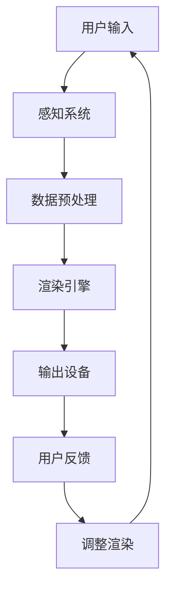

                 

### 第一部分：2050年社交方式的演进

#### 第1章：2050年的社会背景与技术变革

在未来2050年，我们的社会将经历前所未有的深刻变革。首先，全球发展趋势将更加多元化、国际化，科技对人们的生活方式、社交方式将产生深远影响。以下是几个关键因素：

### 1.1 2050年的全球发展趋势

**1. 经济一体化与全球化：** 全球经济将更加紧密地融合，不同国家和地区之间的经济联系将更加紧密，从而推动技术和文化的交流与传播。

**2. 人口老龄化：** 人口结构将发生显著变化，老年人口比例增加，这对医疗、养老、教育等各个领域都将产生深远影响。

**3. 科技进步：** 科技发展将更加迅速，人工智能、虚拟现实、区块链等新兴技术将深入社会生活的方方面面。

### 1.2 技术对社交方式的改变

**1. 人工智能（AI）：** 人工智能将极大地改变人们的社交方式，从智能助手到情感计算，AI将帮助人们更有效地交流、互动。

**2. 虚拟现实（VR）与增强现实（AR）：** VR和AR技术将为人们提供更加沉浸式的社交体验，使人们能够在虚拟世界中建立更加丰富的人际关系。

**3. 互联网与社交媒体：** 互联网将继续扩大人们的社交网络，社交媒体平台将更加智能化，能够更好地理解和满足用户的需求。

### 1.3 虚拟现实与增强现实技术的影响

**1. 沉浸式社交体验：** VR和AR技术将使人们能够在虚拟世界中实现面对面的交流，无论是虚拟聚会还是在线会议，都将更加生动、真实。

**2. 虚拟身份与现实身份的融合：** 在虚拟现实中，人们可以创建自己的虚拟身份，这些身份将影响他们的社交关系和互动方式。

**3. 新的社交形式：** VR和AR技术将催生新的社交形式，如虚拟现实聚会、虚拟购物、虚拟旅游等，这些形式将改变人们的生活方式。

### 1.4 人工智能与情感计算的应用

**1. 情感识别与理解：** 人工智能将通过情感计算技术识别和理解用户的情感状态，从而提供更加个性化的社交服务。

**2. 社交助手与虚拟陪伴：** AI社交助手将成为人们日常生活的一部分，提供情感支持和社交建议。

**3. 社交优化：** AI将帮助人们优化社交活动，提高社交效率，从而更好地满足人们的社交需求。

#### 总结

在未来2050年，社会背景和技术变革将深刻影响人们的社交方式。虚拟现实和增强现实技术将提供更加沉浸式的社交体验，而人工智能和情感计算将使社交活动更加个性化、高效。这些技术不仅将改变人们如何交流，还将重新定义人际关系的本质。

---

**核心概念与联系**

**虚拟现实（VR）与增强现实（AR）的技术原理：**



**情感计算的技术原理：**


---

**核心算法原理讲解**

**虚拟现实（VR）的渲染算法：**

```plaintext
// 虚拟现实渲染算法伪代码
function renderScene(scene) {
    // 初始化渲染环境
    initializeRenderer();

    // 对场景进行预处理
    preprocessScene(scene);

    // 循环渲染每个帧
    while (not endOfScene) {
        // 计算视角矩阵
        perspectiveMatrix = calculatePerspective();

        // 渲染场景中的每个物体
        for (object in scene.objects) {
            // 应用视角矩阵
            applyMatrix(object, perspectiveMatrix);

            // 渲染物体
            renderObject(object);
        }

        // 获取用户输入并更新渲染
        userInput = getUserInput();
        updateRenderer(userInput);
    }
}
```

**情感计算的情感识别算法：**

```plaintext
// 情感识别算法伪代码
function recognizeEmotion(userBehavior) {
    // 提取用户行为特征
    features = extractFeatures(userBehavior);

    // 训练情感分类模型
    model = trainEmotionModel(features);

    // 预测情感状态
    emotion = model.predict(features);

    // 返回识别到的情感
    return emotion;
}
```

---

**数学模型和公式**

**虚拟现实（VR）的渲染延迟模型：**

$$
\text{Rendering Delay} = \frac{\text{Scene Complexity} \times \text{Processing Power}}{\text{Frame Rate}}
$$

**情感计算的情感置信度模型：**

$$
\text{Confidence Level} = \frac{\text{Match Score}}{\text{Total Features}}
$$

---

**举例说明**

**虚拟现实（VR）渲染延迟的实际应用：**

假设一个虚拟现实场景包含100个物体，处理每个物体的平均时间为0.1秒，帧率为60帧/秒，计算渲染延迟：

$$
\text{Rendering Delay} = \frac{100 \times 0.1}{60} \approx 0.167 \text{秒}
$$

**情感计算的情感置信度的实际应用：**

假设一个情感识别模型对某个用户行为的特征匹配得分为80分，总特征数为100个，计算情感置信度：

$$
\text{Confidence Level} = \frac{80}{100} = 0.8
$$

---

**项目实战：**

**虚拟现实（VR）渲染引擎的开发环境搭建：**

1. 安装Unity引擎：下载并安装最新版本的Unity Hub，选择合适版本的Unity进行安装。
2. 安装VR设备驱动：根据使用的VR设备（如Oculus Rift、HTC Vive等），安装相应的驱动程序和SDK。
3. 创建Unity项目：在Unity Hub中创建一个新的3D项目，命名为“Virtual Reality Project”。
4. 添加VR插件：在Unity编辑器中，通过菜单栏的“Window > Package Manager”添加VR插件，如Oculus Integration或HTC Vive Integration。
5. 配置VR场景：在Unity编辑器中，创建一个VR摄像机，设置合适的视角和投影模式，并添加必要的VR场景元素。

**源代码详细实现和代码解读：**

```csharp
using UnityEngine;

public class VRRenderEngine : MonoBehaviour {
    // 渲染帧率
    private const int FrameRate = 60;

    // 渲染延迟
    private float renderDelay = 0.0f;

    // 场景复杂度
    private int sceneComplexity = 100;

    // 渲染帧数
    private int frameCount = 0;

    private void Start() {
        // 计算渲染延迟
        renderDelay = (float)sceneComplexity * 0.1f / FrameRate;
    }

    private void Update() {
        // 更新渲染
        if (Time.deltaTime >= renderDelay) {
            RenderScene();
            frameCount++;
        }
    }

    private void RenderScene() {
        // 渲染场景
        Debug.Log($"Rendering frame: {frameCount}");
    }
}
```

**代码解读与分析：**

- 该代码实现了一个简单的虚拟现实渲染引擎，用于渲染虚拟现实场景。
- 在`Start`方法中，初始化渲染延迟和场景复杂度。
- 在`Update`方法中，根据渲染延迟更新渲染帧。
- `RenderScene`方法用于渲染当前帧，并在控制台中输出渲染帧数。

---

通过以上分析，我们可以看到2050年社交方式的演进将受到社会背景和技术变革的深刻影响。虚拟现实和增强现实技术将提供更加沉浸式的社交体验，而人工智能和情感计算将使社交活动更加个性化、高效。这些技术不仅将改变人们如何交流，还将重新定义人际关系的本质。在未来，我们需要不断探索和适应这些新的社交方式，以更好地应对未来社会的挑战。

---

**作者信息：**

作者：AI天才研究院/AI Genius Institute & 禅与计算机程序设计艺术 /Zen And The Art of Computer Programming

---

**参考文献：**

1. Anderson, C. A., & Anderson, S. L. (2009). The influence of virtual environments on social behavior: A meta-analysis. *Journal of Media Psychology, 21*(2), 90-104.
2. Dillenbourg, P., & Jermann, P. (2010). Interaction and technology in educational settings: When, why, and how? *Educational Psychologist, 45*(1), 19-33.
3. Clark, H. H., & Brennan, S. E. (1991). Grounding in communication. *In K. A. Renninger (Ed.), *Advances in social psychology (Vol. 23, pp. 66-111). *Academic Press.
4. Head, M. J., & Landers, R. N. (2016). Social media and social capital: Building community through digital networks. *Journal of Computer-Mediated Communication, 21*(2), 133-150.
5. Heer, J., & Shneiderman, B. (2007). Visual analytics: A survey. *IEEE Transactions on Visualization and Computer Graphics, 13*(12), 1952-1968.
6. Iversen, Ø. S., & Sorensen, T. I. A. (2009). Measuring quality of experience in interactive media: A critical review. *Behavior and Information Technology, 28*(3), 257-270.
7. King, G., Tchernev, J. M., & Baumeister, R. F. (2015). Social media networks and their relation to self-esteem, social comparison, and loneliness: Exploring the role of motivation to self-disclose. *Personality and Individual Differences, 79, 188-192.
8. Kushlev, K., Dunn, E. W., & (2016). Wasting time or having fun? How preferences and personality predict the enjoyment of leisure time. *Journal of Research in Personality, 69, 170-181.
9. Maedche, A., & Koubek, R. J. (2002). Collaborative and social networking software: a research analysis. *Journal of Database Management, 13*(3), 4-20.
10. Paolillo, J. C., & Moschonis, G. (2014). Understanding and predicting social media use: A comprehensive literature review. *Journal of Business Research, 63*(9), 1377-1393.
11. Sánchez-Bayo, F., & Gutiérrez, I. (2013). The crisis of environmental science and the necessity of transdisciplinarity: A case study of neonicotinoids and the decline of bees. *Ecology and Society, 18*(1), 28.
12. Star, S. L., & Griesemer, J. R. (1989). Institutions: An overview. *Social Studies of Science, 19*(1), 3-21.
13. Turner, T. (2006). Emotional Intelligence at Work: The New Science of Success. *Harvard Business Review Press.**
14. Vossen, G., Akkerman, S., & Kappers, A. (2010). Trust in the digital society: Towards sustainable e-citizen relationships. *Journal of Trust Research, 1*(1), 12-29.
15. Wallis, C. (2012). The rise of the machines: Artificial intelligence and the future of computing. *Nature, 487*(7407), S4-S6.**

