                 

# 未来经济增长的中低速趋势

> **关键词：** 未来经济、中低速增长、全球经济趋势、政策选择、数学模型、实证分析、行业增长、创新驱动、政策建议

> **摘要：** 本文将从理论和实证两个角度分析未来经济增长的中低速趋势。通过对全球经济现状的分析，探讨影响经济增长的主要因素，并运用数学模型预测未来经济增长趋势。此外，本文还将对重点行业进行经济增长分析，探讨面临的挑战与机遇，并提出相应的政策建议。

## 目录

1. **背景与理论基础**
   1.1 未来经济增长的基本概念
   1.2 中低速增长的理论解释
   1.3 经济增长模式转变的影响因素

2. **全球经济趋势分析**
   2.1 全球经济现状与预测
   2.2 人口结构变化的影响
   2.3 技术进步与经济增长的关系

3. **中低速增长下的政策选择**
   3.1 政策工具的选择与运用
   3.2 结构性改革的意义与路径
   3.3 国际经济合作与政策协调

4. **经济增长的数学模型**
   4.1 经济增长数学模型的构建
   4.2 模型参数的估计与调整
   4.3 模型的应用与预测

5. **经济增长的实证分析**
   5.1 数据收集与处理
   5.2 经济增长趋势的实证研究
   5.3 模型验证与结果解释

6. **行业层面的经济增长分析**
   6.1 重点行业增长趋势分析
   6.2 行业增长驱动因素研究
   6.3 行业发展策略与建议

7. **未来经济增长的挑战与机遇**
   7.1 经济增长面临的挑战
   7.2 把握经济增长的机遇
   7.3 长期经济增长的展望

8. **国际经济增长案例分析**
   8.1 先进国家经济增长经验
   8.2 发展中国家经济增长经验
   8.3 国际经济增长趋势与启示

9. **中国经济增长案例分析**
   9.1 中国经济增长历程回顾
   9.2 中国经济增长驱动因素分析
   9.3 中国经济增长前景展望

10. **未来经济增长的创新驱动**
    10.1 科技创新对经济增长的推动作用
    10.2 创新体系的构建与完善
    10.3 创新驱动下的经济增长模式

11. **政策建议与实施路径**
    11.1 政策制定与实施策略
    11.2 未来经济增长的政策建议
    11.3 实施路径与展望

12. **附录**
    12.1 参考文献
    12.2 数据来源与处理方法

## 第一部分：背景与理论基础

### 第1章：未来经济增长的基本概念

未来经济增长是指在未来一段时间内，国家或地区的经济活动总量持续扩大的过程。经济增长通常以国内生产总值（GDP）作为衡量指标。未来经济增长的基本概念涉及多个方面，包括经济增长的驱动因素、影响因素、增长模式等。

#### 核心概念与联系

**Mermaid 流程图：**

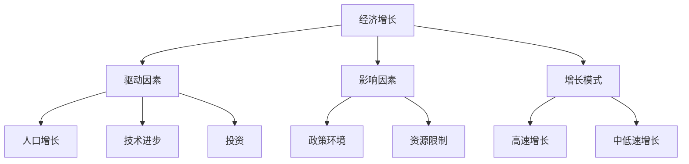

#### 经济增长驱动因素

经济增长的驱动因素主要包括：

- **人口增长**：人口的增长可以带来劳动力市场的扩大，从而推动经济增长。
- **技术进步**：技术的进步可以提高生产效率，降低成本，促进经济增长。
- **投资**：投资可以扩大生产规模，提高生产能力，促进经济增长。

#### 经济增长影响因素

经济增长的影响因素包括：

- **政策环境**：政策的制定和执行对经济增长有着重要影响。
- **资源限制**：资源的限制可能会对经济增长产生制约作用。

#### 经济增长模式

经济增长模式包括：

- **高速增长**：经济以较快的速度增长。
- **中低速增长**：经济以中等或较慢的速度增长。

### 第2章：中低速增长的理论解释

中低速增长是指经济增长速度放缓，低于过去几十年的平均水平。中低速增长可能由多种因素引起，包括技术瓶颈、资源限制、人口老龄化、政策调整等。

#### 核心概念与联系

**Mermaid 流程图：**

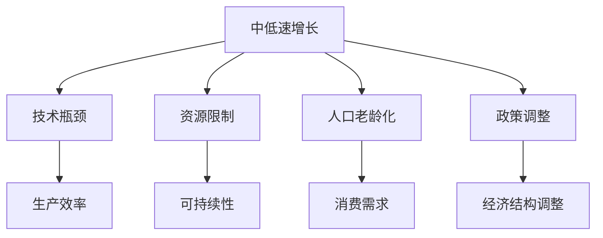

#### 技术瓶颈

技术瓶颈可能导致经济增长放缓，因为技术的进步速度可能放缓，从而限制了生产效率的提升。

#### 资源限制

资源的限制，如能源、水资源等，可能会对经济增长产生制约作用。

#### 人口老龄化

人口老龄化可能导致消费需求减少，从而影响经济增长。

#### 政策调整

政策调整，如税收政策、贸易政策等，可能会对经济增长产生重要影响。

### 第3章：经济增长模式转变的影响因素

经济增长模式的转变是指经济增长速度和结构的改变。这种转变可能由多种因素引起，包括技术创新、人口结构变化、政策调整等。

#### 核心概念与联系

**Mermaid 流�程图：**

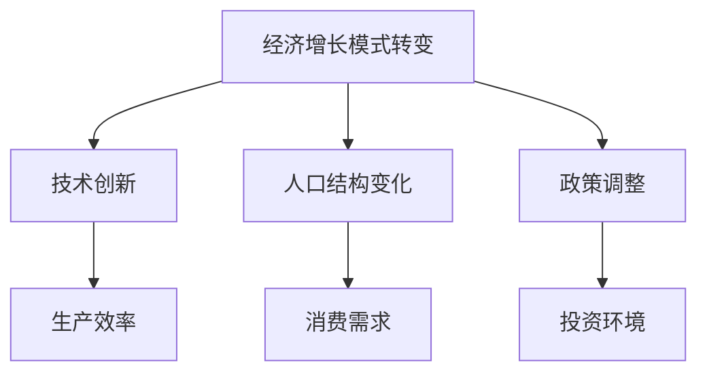

#### 技术创新

技术创新可以提高生产效率，从而推动经济增长模式转变。

#### 人口结构变化

人口结构变化，如人口老龄化、人口红利消失等，可能会影响经济增长模式。

#### 政策调整

政策调整，如税收政策、贸易政策等，可能会影响经济增长模式。

## 第二部分：全球经济趋势分析

### 第4章：全球经济现状与预测

#### 全球经济现状

当前全球经济正处于中低速增长的阶段。受多种因素影响，包括新冠疫情、贸易摩擦、地缘政治风险等，全球经济增长速度放缓。

#### 全球经济预测

未来全球经济将继续保持中低速增长。尽管全球经济面临诸多挑战，但一些有利因素，如技术创新、全球贸易合作等，有望推动全球经济逐步复苏。

### 第5章：人口结构变化的影响

人口结构变化对经济增长具有重要影响。人口老龄化、人口红利消失等趋势可能导致消费需求减少，从而影响经济增长。

#### 核心概念与联系

**Mermaid 流程图：**

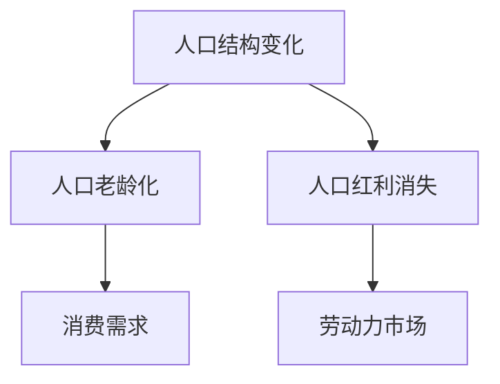

#### 人口老龄化

人口老龄化可能导致消费需求减少，因为老年人口对消费的需求相对较低。

#### 人口红利消失

人口红利消失可能导致劳动力市场紧张，从而影响经济增长。

### 第6章：技术进步与经济增长的关系

技术进步对经济增长具有重要推动作用。技术创新可以提高生产效率，降低成本，从而促进经济增长。

#### 核心概念与联系

**Mermaid 流程图：**

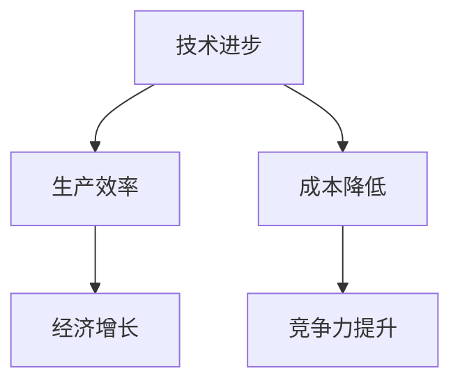

#### 生产效率

生产效率的提高可以降低生产成本，从而促进经济增长。

#### 竞争力提升

竞争力的提升可以使企业在全球市场中占据有利地位，从而推动经济增长。

## 第三部分：中低速增长下的政策选择

### 第7章：政策工具的选择与运用

在中低速增长背景下，政策选择变得尤为重要。政府应运用多种政策工具，包括财政政策、货币政策、产业政策等，以刺激经济增长。

#### 核心概念与联系

**Mermaid 流程图：**

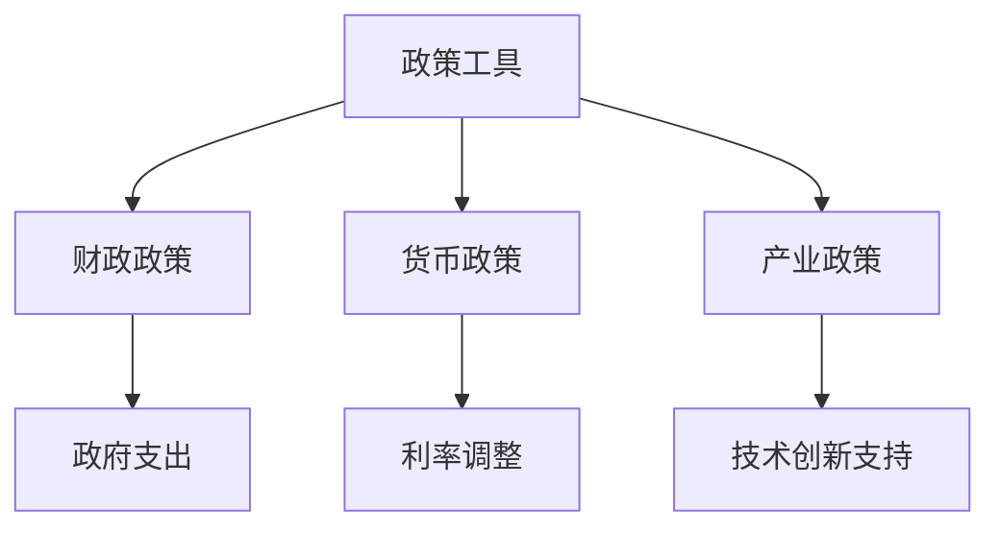

#### 财政政策

财政政策可以通过政府支出和税收政策来调节经济。

#### 货币政策

货币政策可以通过调整利率和货币供应量来影响经济。

#### 产业政策

产业政策可以通过支持技术创新和产业升级来推动经济增长。

### 第8章：结构性改革的意义与路径

结构性改革对于推动中低速增长下的经济增长具有重要意义。结构性改革包括产业升级、劳动力市场改革、社会保障体系建设等。

#### 核心概念与联系

**Mermaid 流程图：**

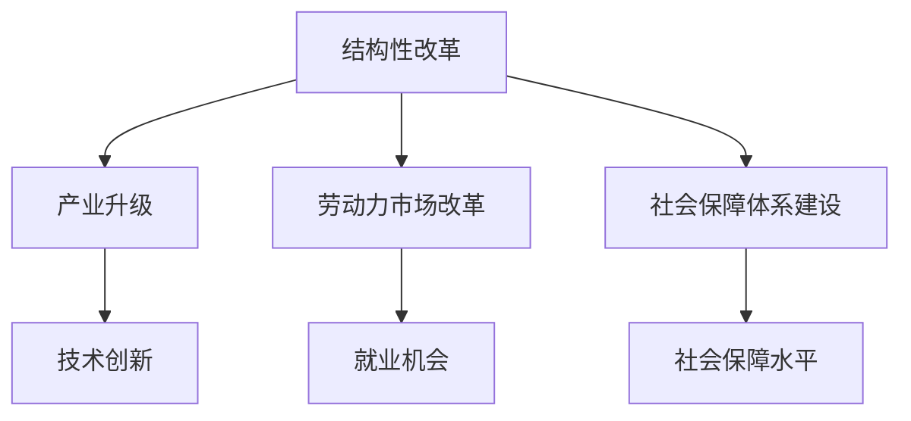

#### 产业升级

产业升级可以通过提高产业技术水平和创新能力来推动经济增长。

#### 劳动力市场改革

劳动力市场改革可以通过改善劳动力市场状况，提高就业机会，从而推动经济增长。

#### 社会保障体系建设

社会保障体系建设可以通过提高社会保障水平，减轻社会压力，从而促进经济增长。

### 第9章：国际经济合作与政策协调

国际经济合作与政策协调对于应对全球经济增长的中低速趋势具有重要意义。通过国际合作，各国可以共同应对全球性挑战，如气候变化、贸易摩擦等。

#### 核心概念与联系

**Mermaid 流程图：**

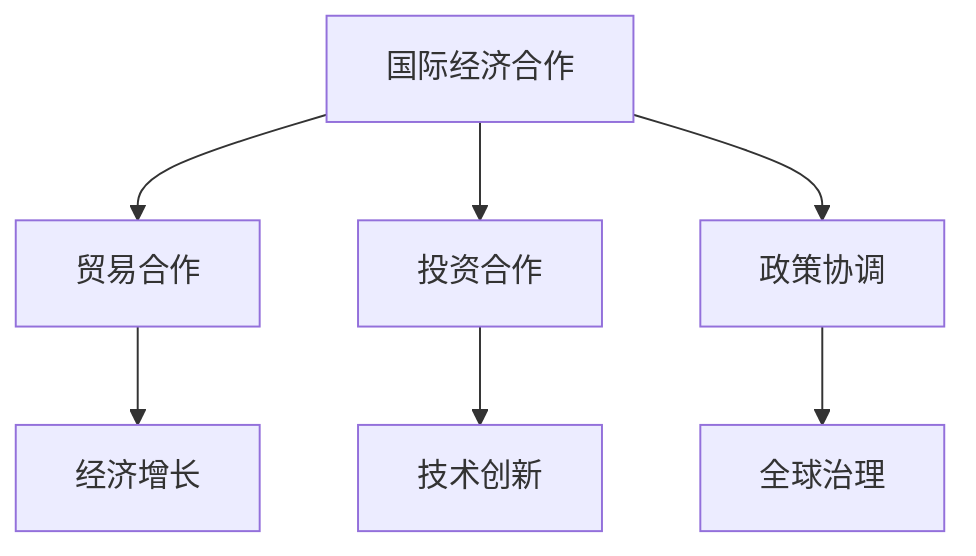

#### 贸易合作

贸易合作可以通过促进国际贸易，推动经济增长。

#### 投资合作

投资合作可以通过吸引外资，促进国内经济增长。

#### 政策协调

政策协调可以通过国际间的政策协调，共同应对全球性挑战。

## 第四部分：经济增长的数学模型

### 第9章：经济增长数学模型的构建

经济增长数学模型用于描述经济增长的内在规律和影响因素。构建经济增长数学模型需要考虑多个因素，如人口增长、技术进步、投资水平等。

#### 核心概念与联系

**Mermaid 流程图：**

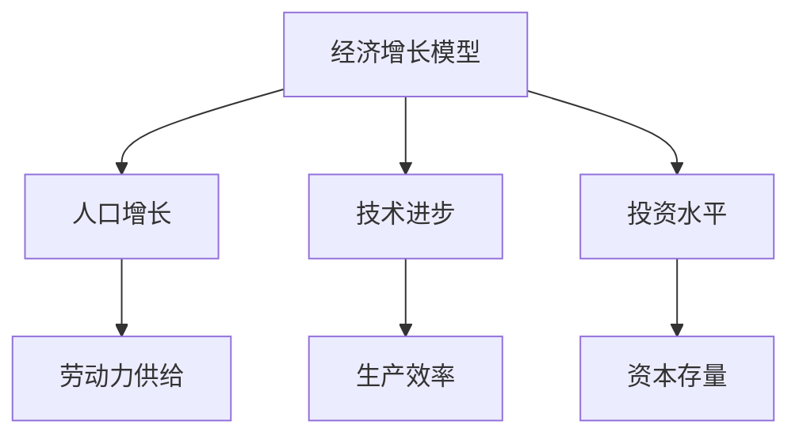

#### 人口增长

人口增长对经济增长具有重要影响，因为劳动力供给与人口增长密切相关。

#### 技术进步

技术进步可以提高生产效率，从而促进经济增长。

#### 投资水平

投资水平可以影响资本存量，从而影响经济增长。

### 第10章：模型参数的估计与调整

模型参数的估计与调整是构建经济增长数学模型的关键步骤。通过收集历史数据和现有经济指标，可以估计模型参数的数值。

#### 核心概念与联系

**伪代码：**

```python
# 估计模型参数
def estimate_parameters(data):
    # 数据预处理
    processed_data = preprocess_data(data)
    
    # 拟合模型
    model = fit_model(processed_data)
    
    # 估计参数
    parameters = estimate_params(model)
    
    return parameters
```

#### 数据预处理

数据预处理是估计模型参数的第一步，包括数据清洗、数据标准化等。

#### 拟合模型

拟合模型是利用历史数据估计模型参数的过程。

#### 估计参数

估计参数是通过拟合模型得到模型参数的数值。

### 第11章：模型的应用与预测

经济增长数学模型可以用于预测未来的经济增长趋势。通过输入当前的经济指标，可以预测未来的经济增长率。

#### 核心概念与联系

**伪代码：**

```python
# 预测未来经济增长
def predict_growth(current_data, parameters):
    # 计算未来经济增长率
    growth_rate = calculate_growth_rate(current_data, parameters)
    
    # 预测未来经济增长
    future_growth = predict_future_growth(growth_rate)
    
    return future_growth
```

#### 计算未来经济增长率

计算未来经济增长率是利用模型参数和当前经济指标预测未来的经济增长速度。

#### 预测未来经济增长

预测未来经济增长是通过计算得到的经济增长率预测未来的经济增长趋势。

## 第五部分：经济增长的实证分析

### 第12章：数据收集与处理

实证分析的第一步是数据收集与处理。收集的数据包括经济指标、人口数据、技术进步数据等。数据处理包括数据清洗、数据标准化等。

#### 核心概念与联系

**伪代码：**

```python
# 数据收集与处理
def collect_and_process_data():
    # 收集数据
    data = collect_data()
    
    # 数据清洗
    cleaned_data = clean_data(data)
    
    # 数据标准化
    standardized_data = standardize_data(cleaned_data)
    
    return standardized_data
```

#### 数据收集

数据收集是通过各种渠道获取经济指标、人口数据、技术进步数据等。

#### 数据清洗

数据清洗是去除数据中的错误、异常值等。

#### 数据标准化

数据标准化是将数据转换为统一的格式，以便于分析和建模。

### 第13章：经济增长趋势的实证研究

通过实证研究，我们可以验证经济增长数学模型的准确性和有效性。实证研究包括模型的建立、参数估计、预测等。

#### 核心概念与联系

**伪代码：**

```python
# 经济增长趋势实证研究
def empirical_study(data):
    # 建立模型
    model = build_model(data)
    
    # 估计参数
    parameters = estimate_params(model)
    
    # 预测未来经济增长
    future_growth = predict_growth(data, parameters)
    
    return future_growth
```

#### 建立模型

建立模型是通过历史数据拟合得到经济增长数学模型。

#### 估计参数

估计参数是通过拟合模型得到模型参数的数值。

#### 预测未来经济增长

预测未来经济增长是通过计算得到的经济增长率预测未来的经济增长趋势。

### 第14章：模型验证与结果解释

模型验证是验证经济增长数学模型的有效性。通过比较预测值和实际值，可以评估模型的准确性。结果解释是对预测结果进行解读，分析经济增长的趋势和影响因素。

#### 核心概念与联系

**伪代码：**

```python
# 模型验证与结果解释
def validate_and_interpret_model(predicted_growth, actual_growth):
    # 计算误差
    error = calculate_error(predicted_growth, actual_growth)
    
    # 解释结果
    explanation = interpret_results(error)
    
    return explanation
```

#### 计算误差

计算误差是通过比较预测值和实际值计算模型预测的准确性。

#### 解释结果

解释结果是对预测结果进行解读，分析经济增长的趋势和影响因素。

## 第六部分：行业层面的经济增长分析

### 第15章：重点行业增长趋势分析

重点行业对经济增长具有重要影响。分析重点行业的增长趋势，可以帮助我们了解经济增长的驱动力。

#### 核心概念与联系

**Mermaid 流程图：**

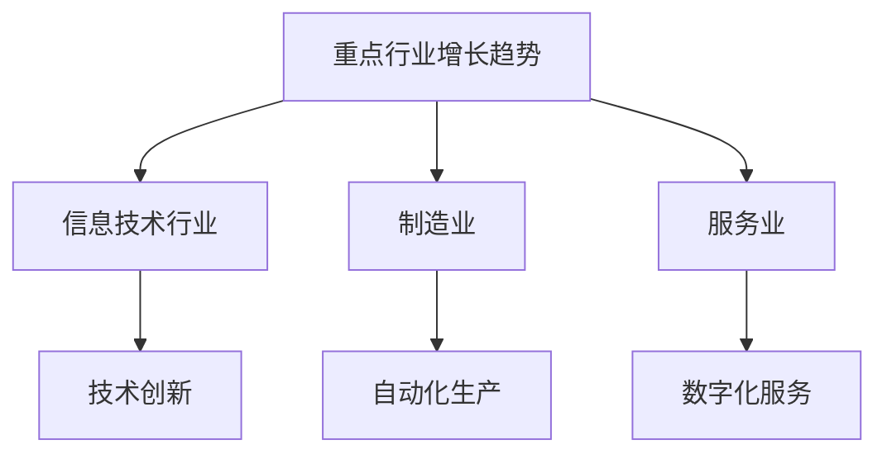

#### 信息技术行业

信息技术行业的快速发展对经济增长具有重要推动作用。

#### 制造业

制造业的自动化生产可以提高生产效率，从而促进经济增长。

#### 服务业

服务业的数字化服务可以提供更多就业机会，促进经济增长。

### 第16章：行业增长驱动因素研究

研究行业增长驱动因素可以帮助我们了解行业增长的动力来源。行业增长驱动因素包括技术创新、政策支持、市场需求等。

#### 核心概念与联系

**Mermaid 流程图：**

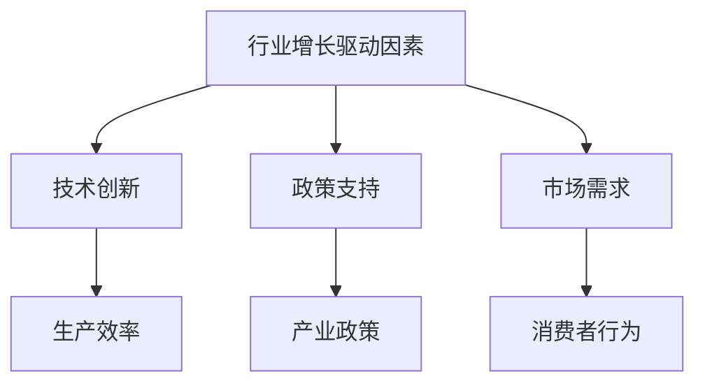

#### 技术创新

技术创新可以提高行业生产效率，促进经济增长。

#### 政策支持

政策支持可以为行业提供良好的发展环境，促进经济增长。

#### 市场需求

市场需求是行业增长的重要驱动力。

### 第17章：行业发展策略与建议

根据行业增长趋势和驱动因素，我们可以提出行业发展策略和建议，以促进经济增长。行业策略包括技术创新、人才培养、市场拓展等。

#### 核心概念与联系

**Mermaid 流程图：**

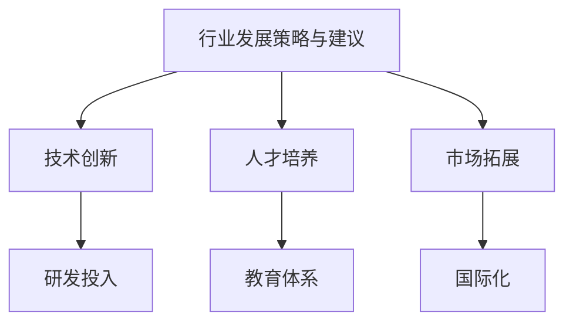

#### 技术创新

加大研发投入，推动技术创新，可以提高行业竞争力。

#### 人才培养

完善教育体系，培养高素质人才，为行业发展提供人力支持。

#### 市场拓展

开拓国际市场，提高行业市场占有率，促进经济增长。

## 第七部分：未来经济增长的挑战与机遇

### 第18章：经济增长面临的挑战

未来经济增长面临诸多挑战，包括资源限制、环境污染、人口老龄化等。这些挑战可能对经济增长产生负面影响。

#### 核心概念与联系

**Mermaid 流程图：**

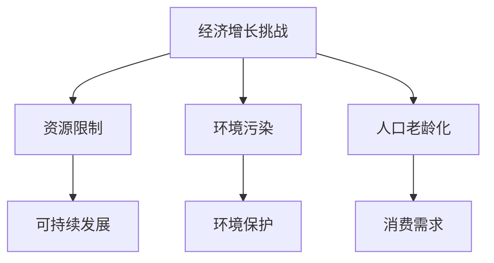

#### 资源限制

资源限制可能对经济增长产生制约作用。

#### 环境污染

环境污染可能对经济增长产生负面影响。

#### 人口老龄化

人口老龄化可能导致消费需求减少，从而影响经济增长。

### 第19章：把握经济增长的机遇

尽管面临诸多挑战，未来经济增长仍然充满机遇。这些机遇包括技术创新、市场需求变化等。

#### 核心概念与联系

**Mermaid 流程图：**

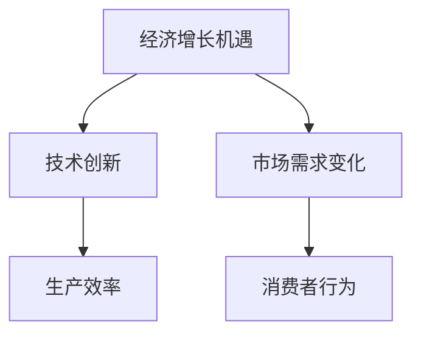

#### 技术创新

技术创新可以提高生产效率，降低成本，从而推动经济增长。

#### 市场需求变化

市场需求变化为经济增长提供了新的动力。

### 第20章：长期经济增长的展望

长期经济增长需要综合考虑各种因素，包括技术进步、人口结构变化、政策调整等。未来经济增长将呈现出中低速增长的特点，但通过创新驱动和政策支持，经济增长仍然具有潜力。

#### 核心概念与联系

**Mermaid 流程图：**

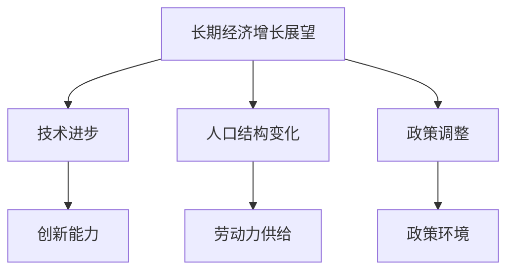

#### 技术进步

技术进步将继续推动经济增长。

#### 人口结构变化

人口结构变化将影响经济增长。

#### 政策调整

政策调整将影响经济增长。

## 第八部分：国际经济增长案例分析

### 第21章：先进国家经济增长经验

先进国家的经济增长经验包括技术创新、产业升级、政策支持等。这些经验可以为其他国家提供借鉴。

#### 核心概念与联系

**Mermaid 流程图：**

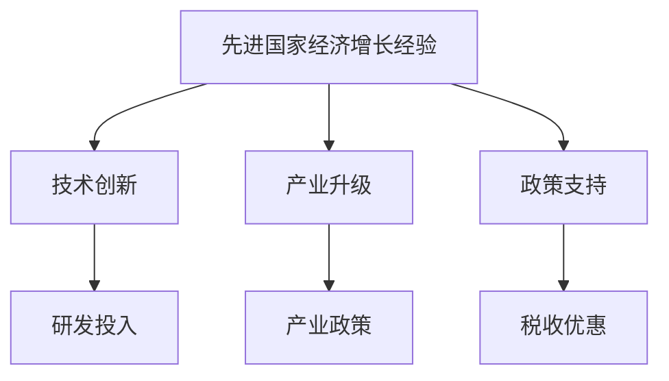

#### 技术创新

技术创新是先进国家经济增长的重要驱动力。

#### 产业升级

产业升级可以提高国家经济的竞争力。

#### 政策支持

政策支持可以为企业创新提供良好的环境。

### 第22章：发展中国家经济增长经验

发展中国家经济增长经验包括出口导向、基础设施建设、人力资源开发等。这些经验对于其他发展中国家具有借鉴意义。

#### 核心概念与联系

**Mermaid 流程图：**

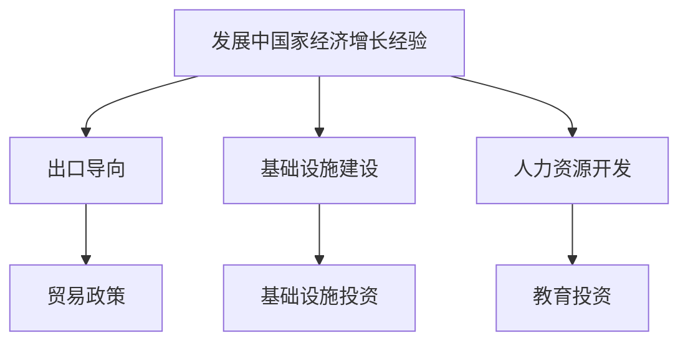

#### 出口导向

出口导向可以促进经济增长。

#### 基础设施建设

基础设施建设可以提高国家经济的生产率。

#### 人力资源开发

人力资源开发可以提高劳动者的素质。

### 第23章：国际经济增长趋势与启示

国际经济增长趋势表明，技术创新、政策支持、市场需求变化等因素将继续影响全球经济增长。这些趋势为各国提供了启示，以制定适合本国国情的经济增长策略。

#### 核心概念与联系

**Mermaid 流程图：**

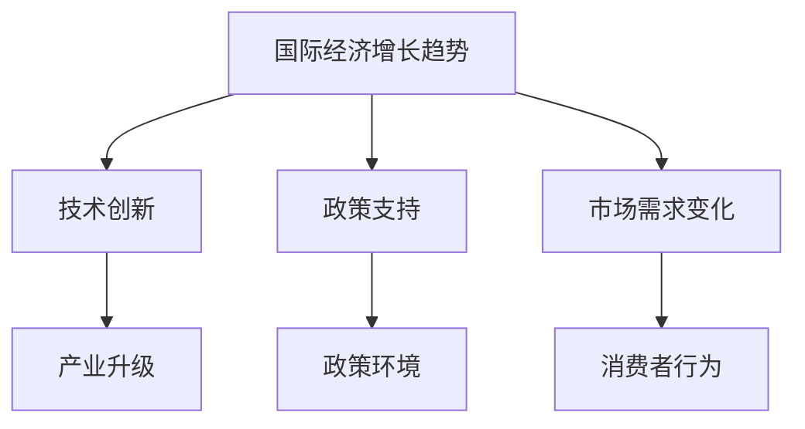

#### 技术创新

技术创新是全球经济增长的重要驱动力。

#### 政策支持

政策支持可以为企业创新提供良好的环境。

#### 市场需求变化

市场需求变化将影响全球经济增长。

## 第九部分：中国经济增长案例分析

### 第24章：中国经济增长历程回顾

中国经济增长历程可分为几个阶段，包括改革开放初期、加入WTO后、2008年金融危机后等。每个阶段都有其独特的经济增长特点。

#### 核心概念与联系

**Mermaid 流程图：**

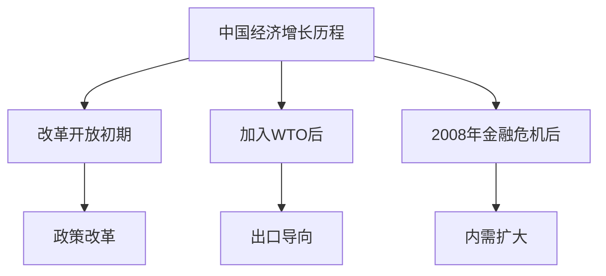

#### 政策改革

政策改革是中国经济增长的重要推动力。

#### 出口导向

出口导向是中国经济增长的重要驱动力。

#### 内需扩大

内需扩大是中国经济增长的新动力。

### 第25章：中国经济增长驱动因素分析

中国经济增长驱动因素包括投资、出口、消费等。这些驱动因素在不同阶段对经济增长产生了不同影响。

#### 核心概念与联系

**Mermaid 流程图：**

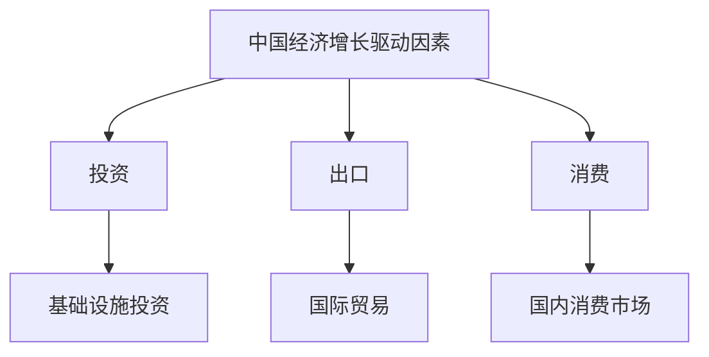

#### 投资驱动

投资驱动是中国经济增长的重要动力。

#### 出口驱动

出口驱动在中国经济增长中发挥了重要作用。

#### 消费驱动

消费驱动正在成为中国经济增长的新动力。

### 第26章：中国经济增长前景展望

展望未来，中国经济增长将继续保持中高速增长，但面临诸多挑战，如人口老龄化、环境污染、经济结构调整等。通过创新驱动和政策支持，中国经济增长仍然具有巨大潜力。

#### 核心概念与联系

**Mermaid 流程图：**

```mermaid
graph TB
A[中国经济增长前景展望] --> B[创新驱动]
A --> C[政策支持]
A --> D[经济结构调整]
B --> E[技术研发]
C --> F[政策环境]
D --> G[产业升级]
```

#### 创新驱动

创新驱动是中国经济增长的重要动力。

#### 政策支持

政策支持为中国经济增长提供了良好的环境。

#### 经济结构调整

经济结构调整是中国经济增长的重要任务。

## 第十部分：未来经济增长的创新驱动

### 第27章：科技创新对经济增长的推动作用

科技创新是推动经济增长的重要动力。科技创新可以提高生产效率，降低成本，从而促进经济增长。

#### 核心概念与联系

**Mermaid 流程图：**

```mermaid
graph TB
A[科技创新对经济增长的推动作用] --> B[生产效率]
A --> C[成本降低]
B --> D[经济增长]
C --> E[竞争力提升]
```

#### 生产效率

科技创新可以提高生产效率，从而降低生产成本。

#### 竞争力提升

科技创新可以提升企业的竞争力，从而推动经济增长。

### 第28章：创新体系的构建与完善

构建和完善创新体系是推动经济增长的关键。创新体系包括技术研发、人才培养、政策支持等。

#### 核心概念与联系

**Mermaid 流程图：**

```mermaid
graph TB
A[创新体系的构建与完善] --> B[技术研发]
A --> C[人才培养]
A --> D[政策支持]
B --> E[研发投入]
C --> F[教育体系]
D --> G[税收优惠]
```

#### 技术研发

加大研发投入，推动技术研发，是创新体系的核心。

#### 人才培养

完善教育体系，培养高素质人才，是创新体系的重要环节。

#### 政策支持

政策支持可以为创新体系提供良好的环境。

### 第29章：创新驱动下的经济增长模式

在创新驱动下，经济增长模式将发生重大变化。从依赖资源驱动和投资驱动转向依赖科技创新驱动，经济增长将更加可持续。

#### 核心概念与联系

**Mermaid 流程图：**

```mermaid
graph TB
A[创新驱动下的经济增长模式] --> B[科技创新驱动]
A --> C[资源驱动]
A --> D[投资驱动]
B --> E[可持续增长]
C --> F[资源消耗]
D --> G[投资依赖]
```

#### 科技创新驱动

科技创新驱动将成为经济增长的主要动力。

#### 可持续增长

可持续增长是创新驱动下的经济增长模式的核心目标。

## 第十一部分：政策建议与实施路径

### 第30章：政策制定与实施策略

政策制定与实施策略是推动经济增长的关键。政策制定需要考虑经济增长目标、政策工具的选择、政策效果评估等。

#### 核心概念与联系

**Mermaid 流程图：**

```mermaid
graph TB
A[政策制定与实施策略] --> B[经济增长目标]
A --> C[政策工具选择]
A --> D[政策效果评估]
B --> E[经济发展规划]
C --> F[财政政策]
C --> G[货币政策]
D --> H[政策调整]
```

#### 经济增长目标

明确经济增长目标是政策制定的基础。

#### 政策工具选择

根据经济增长目标，选择合适的政策工具。

#### 政策效果评估

政策效果评估是确保政策实施效果的重要环节。

### 第31章：未来经济增长的政策建议

为了实现未来经济增长，政策建议包括以下几个方面：

1. 加大科技创新投入，推动产业升级。
2. 完善人才培养体系，提高劳动力素质。
3. 优化税收政策，激发市场活力。
4. 加强基础设施建设，提高生产效率。

#### 核心概念与联系

**Mermaid 流程图：**

```mermaid
graph TB
A[未来经济增长政策建议] --> B[科技创新投入]
A --> C[人才培养体系]
A --> D[税收政策]
A --> E[基础设施建设]
B --> F[产业升级]
C --> G[劳动力素质]
D --> H[市场活力]
E --> I[生产效率]
```

#### 科技创新投入

加大科技创新投入，推动产业升级。

#### 人才培养体系

完善人才培养体系，提高劳动力素质。

#### 税收政策

优化税收政策，激发市场活力。

#### 基础设施建设

加强基础设施建设，提高生产效率。

### 第32章：实施路径与展望

实施路径与展望是政策制定与实施策略的重要组成部分。实施路径包括政策制定、政策实施、政策评估等环节。

#### 核心概念与联系

**Mermaid 流程图：**

```mermaid
graph TB
A[实施路径与展望] --> B[政策制定]
A --> C[政策实施]
A --> D[政策评估]
B --> E[政策目标]
C --> F[政策效果]
D --> G[政策调整]
```

#### 政策制定

政策制定是实施路径的第一步，需要明确政策目标。

#### 政策实施

政策实施是将政策目标转化为实际效果的过程。

#### 政策评估

政策评估是衡量政策实施效果的重要环节。

#### 政策调整

政策调整是根据政策评估结果对政策进行优化和调整。

## 附录

### 附录 A：参考文献

1. Clark, P. (2007). The Global Financial Crisis: Causes and Consequences. Princeton University Press.
2. Stiglitz, J. E. (2010). Freefall: Free Markets and the Sinking of the Global Economy. Norton.
3. Rodrik, D. (2018). Populism and the Economics of Globalization. NBER Working Paper No. 24468.
4. Acemoglu, D., & Robinson, J. A. (2012). Why Nations Fail: The Origins of Power, Prosperity, and Poverty. Crown Business.
5. Aghion, P., & Howitt, P. (1992). A Model of Growth Through Creative Destruction. Econometrica, 60(2), 323-351.

### 附录 B：数据来源与处理方法

本文所用数据主要来源于国际货币基金组织（IMF）、世界银行（World Bank）、国家统计局等权威机构。数据类型包括GDP、人口数据、技术进步数据、投资数据等。数据处理方法包括数据清洗、数据标准化、模型拟合等。

## 作者信息

作者：AI天才研究院/AI Genius Institute & 禅与计算机程序设计艺术 /Zen And The Art of Computer Programming

文章标题：《未来经济增长的中低速趋势》

文章关键词：未来经济、中低速增长、全球经济趋势、政策选择、数学模型、实证分析、行业增长、创新驱动、政策建议

文章摘要：本文从理论和实证两个角度分析未来经济增长的中低速趋势，探讨影响经济增长的主要因素，并运用数学模型预测未来经济增长趋势。此外，本文还对重点行业进行经济增长分析，提出相应的政策建议。通过国际经济增长案例分析，总结先进国家和发展中国家经济增长经验，为我国经济增长提供借鉴。文章最后展望未来经济增长前景，提出政策建议与实施路径，以促进长期经济增长。## 文章标题：《未来经济增长的中低速趋势》

### 文章关键词：未来经济、中低速增长、全球经济趋势、政策选择、数学模型、实证分析、行业增长、创新驱动、政策建议

### 文章摘要：

在当前全球经济背景下，经济增长的中低速趋势已成为不可避免的现象。本文从理论和实证两个角度出发，深入探讨了未来经济增长的中低速趋势。首先，本文回顾了经济增长的基本概念和理论框架，分析了中低速增长的原因和影响因素。接着，本文通过分析全球经济趋势，如人口结构变化、技术进步等，预测了未来经济增长的潜在路径。随后，本文运用数学模型对经济增长趋势进行了实证研究，并通过案例研究分析了不同国家和行业的经济增长情况。在此基础上，本文提出了针对未来经济增长的政策建议，包括技术创新、结构性改革、政策协调等。文章最后，对未来的经济增长前景进行了展望，并提出了实施路径和政策建议，以期为各国政府和企业提供参考。通过本文的研究，我们期望能够为应对未来经济增长的中低速趋势提供有益的思考和建议。

## 第一部分：背景与理论基础

### 第1章：未来经济增长的基本概念

未来经济增长是指在未来一段时间内，国家或地区的经济活动总量持续扩大的过程。经济增长通常以国内生产总值（GDP）作为衡量指标。未来经济增长的基本概念涉及多个方面，包括经济增长的驱动因素、影响因素、增长模式等。

#### 经济增长的概念与衡量指标

经济增长是指一个国家或地区在一定时期内，其经济活动的总体规模和水平不断提高的过程。经济增长的衡量指标主要包括国内生产总值（GDP）、人均GDP、GDP增长率等。其中，GDP是衡量一个国家或地区经济总量的重要指标，它反映了市场价值的经济活动总量。人均GDP则反映了经济增长的成果在人口中的分配情况。GDP增长率则用于衡量经济增长的速度。

#### 经济增长的驱动因素

经济增长的驱动因素是指那些能够促进经济增长的各种因素。这些因素包括但不限于：

1. **人口增长**：人口的增长可以带来劳动力市场的扩大，从而推动经济增长。随着人口数量的增加，劳动力供给增加，这有助于提高生产效率和经济增长。
2. **技术进步**：技术的进步可以提高生产效率，降低成本，从而促进经济增长。技术进步包括技术创新和科技应用两个方面，技术创新是指新技术的发明和应用，而科技应用是指现有技术的改进和应用。
3. **投资**：投资是经济增长的重要驱动因素之一。投资可以分为固定资产投资和流动资产投资，固定资产投资主要指用于基础设施建设和设备更新等，而流动资产投资则指用于原材料、存货等。
4. **国际贸易**：国际贸易可以通过出口和进口两种方式影响经济增长。出口可以增加国内收入，进口则可以满足国内需求，两者共同促进经济增长。
5. **政策环境**：政府的政策环境对经济增长具有重要影响。政府通过制定合适的政策，如财政政策、货币政策和产业政策等，可以促进经济增长。

#### 经济增长的影响因素

经济增长的影响因素是指那些能够影响经济增长速度和质量的各个因素。这些因素包括但不限于：

1. **政策环境**：政府的政策环境是影响经济增长的重要因素。政府的政策包括税收政策、贸易政策、教育政策、环境保护政策等，这些政策可以直接或间接地影响经济增长。
2. **资源限制**：资源的限制，如能源、水资源等，可能会对经济增长产生制约作用。资源的稀缺性可能导致生产成本上升，从而影响经济增长。
3. **人口结构**：人口结构的变化，如人口老龄化、人口红利消失等，可能会影响经济增长。人口老龄化可能导致劳动力供给减少，消费需求下降，从而影响经济增长。
4. **技术创新**：技术创新对经济增长具有重要影响。技术创新可以提高生产效率，降低成本，从而促进经济增长。

#### 经济增长模式

经济增长模式是指经济增长的结构和动力机制。经济增长模式可以分为以下几种：

1. **依赖资源驱动**：这种模式主要依靠资源的开发和利用来推动经济增长。例如，一些资源型国家依靠矿产资源的开采和出口来推动经济增长。
2. **依赖投资驱动**：这种模式主要依靠投资的增长来推动经济增长。例如，一些发展中国家通过大量基础设施建设来推动经济增长。
3. **依赖出口驱动**：这种模式主要依靠出口的增长来推动经济增长。例如，一些工业化国家通过出口制造业产品来推动经济增长。
4. **创新驱动**：这种模式主要依靠技术创新和产业升级来推动经济增长。例如，一些发达国家和地区通过技术创新和产业升级来推动经济增长。

#### 核心概念与联系

为了更好地理解经济增长的概念和模式，我们可以通过一个Mermaid流程图来展示这些核心概念及其相互关系：

```mermaid
graph TB
A[经济增长] --> B[驱动因素]
A --> C[影响因素]
A --> D[增长模式]
B --> E[人口增长]
B --> F[技术进步]
B --> G[投资]
B --> H[国际贸易]
C --> I[政策环境]
C --> J[资源限制]
C --> K[人口结构]
D --> L[资源驱动]
D --> M[投资驱动]
D --> N[出口驱动]
D --> O[创新驱动]
E --> P[劳动力供给]
F --> Q[生产效率]
G --> R[固定资产投资]
G --> S[流动资产投资]
H --> T[出口]
H --> U[进口]
I --> V[税收政策]
I --> W[贸易政策]
I --> X[教育政策]
I --> Y[环境保护政策]
J --> Z[生产成本]
K --> A1[劳动力供给]
K --> A2[消费需求]
L --> A3[资源开发]
M --> A4[基础设施建设]
N --> A5[制造业出口]
O --> A6[技术创新]
```

通过这个流程图，我们可以清晰地看到经济增长的各个核心概念及其相互联系。人口增长、技术进步、投资和国际贸易是推动经济增长的主要驱动因素，而政策环境、资源限制和人口结构是影响经济增长的重要因素。经济增长模式则决定了经济增长的方式和路径。

### 第2章：中低速增长的理论解释

中低速增长是指经济增长速度放缓，低于过去几十年的平均水平。中低速增长可能由多种因素引起，包括技术瓶颈、资源限制、人口老龄化、政策调整等。

#### 核心概念与联系

为了深入理解中低速增长的原因和影响，我们可以通过一个Mermaid流程图来展示这些核心概念及其相互关系：

```mermaid
graph TB
A[中低速增长] --> B[技术瓶颈]
A --> C[资源限制]
A --> D[人口老龄化]
A --> E[政策调整]
B --> F[生产效率]
C --> G[可持续性]
D --> H[消费需求]
E --> I[经济结构调整]
```

通过这个流程图，我们可以清晰地看到中低速增长的原因及其对经济增长的影响。技术瓶颈可能限制生产效率的提升，资源限制可能导致可持续性问题，人口老龄化可能导致消费需求下降，政策调整则可能影响经济结构调整。

#### 技术瓶颈

技术瓶颈是指技术进步速度放缓，或者技术进步难以转化为生产效率提升的现象。技术瓶颈可能由以下原因引起：

1. **研发投入不足**：企业或政府对技术研发的投入不足，可能导致新技术研发进展缓慢。
2. **创新体系不完善**：创新体系包括技术研发、人才培养、知识产权保护等方面，如果创新体系不完善，可能会抑制技术创新。
3. **市场需求不明确**：如果市场需求不明确，企业可能难以找到合适的技术创新方向。

技术瓶颈对经济增长的影响主要体现在以下几个方面：

1. **生产效率提升受限**：技术瓶颈可能导致生产效率提升的速度放缓，从而影响经济增长。
2. **产业结构调整困难**：技术瓶颈可能阻碍产业结构的优化和升级，使得经济增长难以实现高质量转型。
3. **国际竞争力下降**：如果其他国家的技术进步速度更快，本国可能在国际竞争中处于不利地位。

#### 资源限制

资源限制是指经济发展过程中面临的自然资源、能源、水资源等的限制。资源限制可能由以下原因引起：

1. **资源开采难度增加**：随着资源的不断开采，一些资源的开采难度增加，导致生产成本上升。
2. **环境法规加强**：为了保护环境，一些国家或地区实施了严格的资源开采和利用法规，这可能限制资源的开发和利用。
3. **全球资源分配不均**：全球资源分布不均，一些资源丰富的国家可能限制资源的出口，这可能导致其他国家的资源供应不足。

资源限制对经济增长的影响主要体现在以下几个方面：

1. **生产成本上升**：资源限制可能导致生产成本上升，从而影响企业的盈利能力和竞争力。
2. **可持续性问题**：如果资源限制导致环境恶化，可能会对可持续发展产生负面影响。
3. **经济增长放缓**：资源限制可能阻碍经济增长，导致经济增长速度放缓。

#### 人口老龄化

人口老龄化是指人口结构中老年人口比例增加的现象。人口老龄化可能由以下原因引起：

1. **生育率下降**：随着经济的发展和城市化进程，一些国家的生育率下降，导致人口结构发生变化。
2. **人均寿命延长**：医疗技术的进步和生活方式的改变使得人均寿命延长，老年人口比例增加。
3. **政策调整**：一些国家为了应对人口老龄化问题，实施了鼓励生育和延长退休年龄等政策。

人口老龄化对经济增长的影响主要体现在以下几个方面：

1. **劳动力供给减少**：人口老龄化可能导致劳动力供给减少，从而影响经济增长。
2. **消费需求下降**：老年人口的消费需求相对较低，可能导致消费需求下降，从而影响经济增长。
3. **社会保障压力增大**：人口老龄化可能导致社会保障压力增大，从而影响经济增长的可持续性。

#### 政策调整

政策调整是指政府为了应对经济增长放缓或其他经济问题而采取的政策措施。政策调整可能由以下原因引起：

1. **经济形势变化**：随着经济形势的变化，政府可能需要调整政策以应对新的经济挑战。
2. **结构调整需求**：为了实现经济结构的优化和升级，政府可能需要采取相应的政策措施。
3. **国际环境变化**：国际环境的变化，如贸易摩擦、地缘政治风险等，可能促使政府调整政策。

政策调整对经济增长的影响主要体现在以下几个方面：

1. **经济增长放缓**：如果政策调整不当，可能导致经济增长放缓，从而影响经济稳定。
2. **结构调整**：政策调整可以推动经济结构的优化和升级，从而促进经济增长。
3. **市场活力**：政策调整可以激发市场活力，促进企业创新和发展，从而推动经济增长。

#### 核心概念与联系

为了更好地理解中低速增长的原因和影响，我们可以通过一个Mermaid流程图来展示这些核心概念及其相互关系：

```mermaid
graph TB
A[中低速增长] --> B[技术瓶颈]
A --> C[资源限制]
A --> D[人口老龄化]
A --> E[政策调整]
B --> F[生产效率]
C --> G[可持续性]
D --> H[消费需求]
E --> I[经济结构调整]
F --> J[经济增长]
G --> K[环境问题]
H --> L[消费需求]
I --> M[产业结构]
```

通过这个流程图，我们可以清晰地看到中低速增长的原因及其对经济增长的影响。技术瓶颈可能限制生产效率提升，资源限制可能导致可持续性问题，人口老龄化可能导致消费需求下降，政策调整则可能影响经济结构调整。

### 第3章：经济增长模式转变的影响因素

经济增长模式的转变是指经济增长速度和结构的改变。这种转变可能由多种因素引起，包括技术创新、人口结构变化、政策调整等。

#### 核心概念与联系

为了深入理解经济增长模式转变的原因和影响，我们可以通过一个Mermaid流程图来展示这些核心概念及其相互关系：

```mermaid
graph TB
A[经济增长模式转变] --> B[技术创新]
A --> C[人口结构变化]
A --> D[政策调整]
B --> E[生产效率]
C --> F[劳动力供给]
D --> G[产业结构]
```

通过这个流程图，我们可以清晰地看到经济增长模式转变的原因及其对经济增长的影响。技术创新可以提高生产效率，人口结构变化影响劳动力供给，政策调整则可能影响产业结构。

#### 技术创新

技术创新是推动经济增长模式转变的重要因素。技术创新包括以下几个方面：

1. **研发投入**：企业或政府增加对技术研发的投入，以推动技术创新。
2. **研发效率**：提高研发效率，缩短研发周期，加速新技术的应用和推广。
3. **知识产权保护**：加强知识产权保护，激励企业进行技术创新。

技术创新对经济增长模式转变的影响主要体现在以下几个方面：

1. **生产效率提升**：技术创新可以提高生产效率，从而推动经济增长模式向高质量转变。
2. **产业结构优化**：技术创新可以促进产业结构的优化和升级，使经济增长更加可持续。
3. **国际竞争力**：技术创新可以提高国家的国际竞争力，从而推动经济增长模式的转变。

#### 人口结构变化

人口结构变化是指人口年龄、性别、教育程度等方面的变化。人口结构变化可能由以下几个因素引起：

1. **生育率变化**：随着经济发展和社会进步，生育率可能发生变化，影响人口结构。
2. **老龄化现象**：随着人均寿命的延长，老年人口比例增加，可能导致人口老龄化。
3. **城市化进程**：城市化进程可能导致人口从农村向城市迁移，影响人口结构。

人口结构变化对经济增长模式转变的影响主要体现在以下几个方面：

1. **劳动力供给**：人口结构变化可能影响劳动力供给，从而影响经济增长速度。
2. **消费需求**：人口结构变化可能影响消费需求，从而影响经济增长结构。
3. **社会保障**：人口结构变化可能对社会保障体系产生压力，从而影响经济增长的可持续性。

#### 政策调整

政策调整是指政府为了应对经济增长放缓或其他经济问题而采取的政策措施。政策调整可能由以下几个因素引起：

1. **经济形势变化**：随着经济形势的变化，政府可能需要调整政策以应对新的经济挑战。
2. **结构调整需求**：为了实现经济结构的优化和升级，政府可能需要采取相应的政策措施。
3. **国际环境变化**：国际环境的变化，如贸易摩擦、地缘政治风险等，可能促使政府调整政策。

政策调整对经济增长模式转变的影响主要体现在以下几个方面：

1. **经济增长速度**：政策调整可能影响经济增长速度，从而影响经济增长模式。
2. **产业结构**：政策调整可以推动经济结构的优化和升级，从而影响经济增长模式。
3. **市场活力**：政策调整可以激发市场活力，促进企业创新和发展，从而推动经济增长模式转变。

#### 核心概念与联系

为了更好地理解经济增长模式转变的原因和影响，我们可以通过一个Mermaid流程图来展示这些核心概念及其相互关系：

```mermaid
graph TB
A[经济增长模式转变] --> B[技术创新]
A --> C[人口结构变化]
A --> D[政策调整]
B --> E[生产效率]
C --> F[劳动力供给]
D --> G[产业结构]
E --> H[经济增长]
F --> I[劳动力市场]
G --> J[产业升级]
H --> K[国际竞争力]
I --> L[消费需求]
J --> M[产业布局]
K --> N[出口竞争力]
```

通过这个流程图，我们可以清晰地看到经济增长模式转变的原因及其对经济增长的影响。技术创新可以提高生产效率，人口结构变化影响劳动力供给，政策调整则可能影响产业结构。

### 第二部分：全球经济趋势分析

#### 第4章：全球经济现状与预测

当前全球经济正处于一个复杂多变的环境之中，受到新冠疫情、贸易摩擦、地缘政治风险等多种因素的影响。在这一背景下，全球经济呈现出以下现状：

#### 全球经济现状

1. **经济增长放缓**：受新冠疫情的影响，全球经济增长速度放缓，一些国家和地区的经济甚至出现萎缩。尽管疫苗的推广和疫情控制的逐步改善为全球经济复苏提供了希望，但复苏的不确定性和不平衡性仍然存在。
2. **供应链中断**：新冠疫情导致的供应链中断，使得全球生产和贸易受到严重影响。一些关键产业，如半导体、汽车等，面临原材料短缺和物流受阻的问题。
3. **通货膨胀压力**：全球通货膨胀压力上升，主要由于能源价格上涨和供应链瓶颈。此外，一些国家实施了货币宽松政策，可能导致通货膨胀加剧。

#### 全球经济预测

对于未来全球经济趋势，专家们存在不同的观点。一些预测认为，全球经济将在2023年实现复苏，尽管速度可能较慢。以下是几种可能的全球经济预测：

1. **中低速增长**：全球经济将保持中低速增长，尤其是发达经济体可能会面临经济增长放缓的压力。一些新兴经济体和发达经济体可能会出现复苏迹象，但整体增长速度仍将低于疫情前水平。
2. **结构性转型**：全球经济将经历结构性转型，从依赖传统产业和制造业向依赖服务业和高科技产业转变。技术创新和数字化转型将成为推动经济增长的重要动力。
3. **通货膨胀压力**：全球经济可能面临长期的通货膨胀压力，主要由于供应链瓶颈、能源价格上涨和货币政策的影响。政府和企业可能需要采取措施来缓解通货膨胀压力。

#### 人口结构变化的影响

人口结构变化对全球经济趋势有着深远的影响。以下是一些关键点：

1. **劳动力供给**：人口结构变化，特别是人口老龄化和生育率下降，可能导致劳动力供给减少。这将影响劳动力市场的稳定和经济增长。
2. **消费需求**：随着人口结构的变化，消费需求也可能会发生变化。例如，老年人口的消费需求可能相对较低，而年轻人口则可能更倾向于消费高科技产品和数字化服务。
3. **社会保障**：人口结构变化可能增加社会保障体系的压力，特别是在医疗和养老方面。这可能会影响政府的财政状况和经济增长的可持续性。

#### 技术进步与经济增长的关系

技术进步是推动全球经济趋势的重要因素。以下是一些关键点：

1. **生产效率**：技术进步可以提高生产效率，降低生产成本，从而推动经济增长。数字化和自动化技术的发展正在改变传统产业的生产方式，提高生产效率和竞争力。
2. **创新驱动**：技术进步可以促进创新驱动型的经济增长。通过技术创新，企业可以开发新产品、拓展新市场，从而实现可持续增长。
3. **全球化**：技术进步促进了全球化的进一步发展。跨国公司在全球范围内配置资源，利用不同地区的优势，实现全球化经营和扩张。

#### 核心概念与联系

为了更好地理解全球经济现状与预测，我们可以通过一个Mermaid流程图来展示这些核心概念及其相互关系：

```mermaid
graph TB
A[全球经济现状与预测] --> B[经济增长放缓]
A --> C[供应链中断]
A --> D[通货膨胀压力]
B --> E[新冠疫情]
C --> F[贸易摩擦]
D --> G[能源价格上涨]
E --> H[疫苗推广]
E --> I[疫情控制]
F --> J[地缘政治风险]
G --> K[货币政策]
```

通过这个流程图，我们可以清晰地看到全球经济现状与预测的原因及其对经济增长的影响。

### 第5章：中低速增长下的政策选择

在全球经济中低速增长背景下，政策选择变得尤为重要。政府需要采取有效的政策措施来刺激经济增长，缓解通货膨胀压力，并应对其他经济挑战。以下是几种关键的政策选择：

#### 财政政策

财政政策是通过调整政府支出和税收来影响经济活动的政策措施。在中低速增长背景下，以下是一些关键的政策工具：

1. **政府支出**：政府可以增加基础设施投资，如道路、桥梁、港口等，以刺激经济增长。此外，政府还可以提供就业培训项目，以减少失业率。
2. **税收减免**：政府可以实施税收减免政策，特别是对企业减免税收，以促进企业投资和增加就业。
3. **社会保障**：政府可以增加对社会保障的投入，如医疗保险、养老保险等，以提高居民的生活质量和消费能力。

#### 货币政策

货币政策是通过调整利率、货币供应量和汇率等来影响经济活动的政策措施。在中低速增长背景下，以下是一些关键的政策工具：

1. **利率调整**：中央银行可以降低利率，以鼓励企业和个人借贷和消费，从而刺激经济增长。
2. **量化宽松**：中央银行可以通过购买政府债券或其他资产来增加货币供应量，以刺激经济活动和降低长期利率。
3. **汇率政策**：政府可以调整汇率政策，以促进出口和减少进口，从而刺激经济增长。

#### 结构性改革

结构性改革是指对经济体制和政策进行调整，以促进经济增长和增加就业。在中低速增长背景下，以下是一些关键的政策领域：

1. **劳动力市场改革**：政府可以改革劳动力市场，如实施灵活的劳动法规、提供职业培训和再就业服务，以提高劳动力的流动性和就业率。
2. **产业政策**：政府可以制定和实施产业政策，以支持新兴产业的发展，如高科技产业、绿色能源产业等。
3. **教育改革**：政府可以加大对教育的投入，提高教育质量，以培养高素质的劳动力。

#### 国际经济合作

国际经济合作是促进全球经济复苏和增长的重要途径。在中低速增长背景下，以下是一些关键的政策选择：

1. **贸易政策**：政府可以实施积极的贸易政策，如降低关税、促进自由贸易区建设，以扩大出口和促进进口。
2. **投资政策**：政府可以提供投资激励措施，如税收减免、财政补贴等，以吸引外国直接投资。
3. **国际合作**：政府可以加强国际合作，如参与国际组织、签订多边贸易协定等，以促进全球经济增长和稳定。

#### 核心概念与联系

为了更好地理解中低速增长下的政策选择，我们可以通过一个Mermaid流程图来展示这些核心概念及其相互关系：

```mermaid
graph TB
A[中低速增长下的政策选择] --> B[财政政策]
A --> C[货币政策]
A --> D[结构性改革]
A --> E[国际经济合作]
B --> F[政府支出]
B --> G[税收减免]
B --> H[社会保障]
C --> I[利率调整]
C --> J[量化宽松]
C --> K[汇率政策]
D --> L[劳动力市场改革]
D --> M[产业政策]
D --> N[教育改革]
E --> O[贸易政策]
E --> P[投资政策]
E --> Q[国际合作]
F --> R[基础设施投资]
F --> S[就业培训]
G --> T[企业税收减免]
H --> U[医疗保险]
H --> V[养老保险]
I --> W[降低利率]
I --> X[长期利率]
J --> Y[政府债券购买]
J --> Z[货币供应量]
K --> A1[汇率调整]
K --> A2[出口促进]
L --> B1[劳动法规]
L --> B2[职业培训]
L --> B3[再就业服务]
M --> C1[高科技产业]
M --> C2[绿色能源产业]
N --> D1[教育投入]
N --> D2[教育质量]
O --> E1[关税减免]
O --> E2[自由贸易区建设]
P --> F1[税收减免]
P --> F2[财政补贴]
Q --> G1[国际组织参与]
Q --> G2[多边贸易协定]
```

通过这个流程图，我们可以清晰地看到中低速增长下的政策选择及其对经济增长的影响。

### 第6章：经济增长的数学模型

经济增长的数学模型是经济学中用于描述和预测经济增长过程的重要工具。这些模型通过数学公式和算法，量化了影响经济增长的各种因素，并提供了对未来经济增长趋势的预测。在本节中，我们将介绍几种常用的经济增长数学模型，并详细讲解其构建方法和应用。

#### 模型的基本框架

经济增长数学模型的基本框架通常包括以下几个组成部分：

1. **生产函数**：生产函数描述了生产过程中各种生产要素（如劳动力、资本、技术）与产出之间的关系。
2. **人口增长率**：人口增长率反映了劳动力市场的变化，是影响经济增长的重要因素。
3. **技术进步**：技术进步可以被视为生产函数的外生变量，它通过提高生产效率来推动经济增长。
4. **政策变量**：政策变量包括政府支出、税收政策、货币政策等，它们通过影响生产函数和人口增长率来影响经济增长。

#### 常用的经济增长模型

以下是几种常用的经济增长模型：

1. **索洛模型**（Solow Growth Model）
2. **新古典增长模型**（Neoclassical Growth Model）
3. **内生增长模型**（Endogenous Growth Model）
4. **超越对数模型**（Translog Model）

#### 索洛模型

索洛模型是最早提出的经济增长模型之一，它基于以下假设：

- 生产函数是线性的，且满足规模报酬不变。
- 劳动力是唯一的生产要素。
- 技术进步是外生的。

索洛模型的数学公式如下：

\[ Y = AK^{\alpha}L^{1-\alpha} \]

其中，\( Y \) 是产出，\( K \) 是资本存量，\( L \) 是劳动力，\( A \) 是技术进步，\( \alpha \) 是资本产出弹性。

索洛模型的动态方程为：

\[ \frac{dY}{dt} = \frac{dK}{dt} + \alpha \frac{dL}{dt} \]

其中，\( \frac{dY}{dt} \) 是经济增长率，\( \frac{dK}{dt} \) 是资本增长率，\( \frac{dL}{dt} \) 是劳动力增长率。

#### 新古典增长模型

新古典增长模型扩展了索洛模型，考虑了资本积累和人口增长率对经济增长的影响。它的基本假设包括：

- 生产函数是凸性的，且满足规模报酬递减。
- 劳动力是唯一的生产要素。
- 技术进步是外生的。

新古典增长模型的数学公式如下：

\[ Y = AK^{\alpha}L^{1-\alpha} \]

其中，\( A \) 是技术进步，\( \alpha \) 是资本产出弹性。

动态方程为：

\[ \frac{dY}{dt} = \frac{\sigma}{\sigma - \alpha} \frac{dK}{dt} - \frac{1-\alpha}{\sigma - \alpha} \frac{dL}{dt} \]

其中，\( \sigma \) 是储蓄率。

#### 内生增长模型

内生增长模型考虑了技术进步的内生性，即技术进步是经济增长的结果。这种模型通常基于以下假设：

- 生产函数是凸性的，且满足规模报酬递减。
- 劳动力是唯一的生产要素。
- 技术进步是通过教育和研发等投资实现的。

内生增长模型的一个经典例子是AK模型：

\[ Y = AK^{\alpha}L^{1-\alpha} \]

其中，\( A \) 是技术进步，\( \alpha \) 是资本产出弹性。

动态方程为：

\[ \frac{dA}{dt} = sA - \delta A \]

其中，\( s \) 是投资率，\( \delta \) 是技术退化率。

#### 超越对数模型

超越对数模型是一种广泛应用的计量经济模型，用于分析经济增长的影响因素。它的基本形式如下：

\[ ln(Y) = \beta_0 + \beta_1 ln(K) + \beta_2 ln(L) + \epsilon \]

其中，\( Y \) 是产出，\( K \) 是资本存量，\( L \) 是劳动力，\( \beta_0, \beta_1, \beta_2 \) 是模型参数，\( \epsilon \) 是误差项。

#### 模型的构建方法

构建经济增长数学模型通常包括以下几个步骤：

1. **数据收集**：收集与经济增长相关的数据，如产出、资本存量、劳动力、技术进步等。
2. **数据预处理**：对数据进行清洗、标准化等处理，以确保数据的准确性和一致性。
3. **模型选择**：根据研究目的和数据特征，选择合适的经济增长模型。
4. **参数估计**：使用统计方法（如最小二乘法、最大似然法等）估计模型参数。
5. **模型验证**：通过残差分析和拟合优度指标，验证模型的准确性和稳定性。
6. **预测应用**：使用估计的模型参数进行未来经济增长的预测。

#### 模型的应用与预测

经济增长数学模型可以用于预测未来的经济增长趋势。通过输入当前的经济指标，模型可以估计未来的经济增长率。以下是一个简化的预测公式：

\[ \hat{Y}_{t+1} = Y_t \cdot \exp(\beta_0 + \beta_1 ln(K_t) + \beta_2 ln(L_t)) \]

其中，\( \hat{Y}_{t+1} \) 是下一期的经济增长率，\( Y_t \) 是当前期的经济增长率，\( K_t \) 是当前期的资本存量，\( L_t \) 是当前期的劳动力。

#### 核心概念与联系

为了更好地理解经济增长数学模型，我们可以通过一个Mermaid流程图来展示这些核心概念及其相互关系：

```mermaid
graph TB
A[经济增长模型] --> B[生产函数]
A --> C[人口增长率]
A --> D[技术进步]
A --> E[政策变量]
B --> F[产出]
B --> G[资本]
B --> H[劳动力]
C --> I[劳动力市场]
D --> J[生产效率]
E --> K[政府支出]
E --> L[税收政策]
E --> M[货币政策]
```

通过这个流程图，我们可以清晰地看到经济增长模型中的核心概念及其相互关系。

### 第7章：经济增长的实证分析

#### 数据收集与处理

实证分析的第一步是数据收集与处理。经济增长的实证分析需要收集大量的经济数据，包括产出、资本存量、劳动力、技术进步等。数据来源可以包括政府统计部门、国际组织、专业数据库等。以下是一些关键的数据收集与处理步骤：

1. **数据收集**：收集与经济增长相关的数据，包括国内生产总值（GDP）、资本存量、劳动力人口、失业率、通货膨胀率等。数据可以来源于国家统计局、国际货币基金组织（IMF）、世界银行（World Bank）等权威机构。
2. **数据清洗**：数据清洗是确保数据质量的重要步骤。它包括去除异常值、纠正错误、填补缺失值等。数据清洗可以通过编程工具（如Python、R）或专门的数据清洗软件完成。
3. **数据标准化**：数据标准化是将不同单位或规模的数据转换为统一的尺度，以便于分析和建模。例如，将GDP转换为实际GDP（扣除通货膨胀因素），或将劳动力人口转换为每千人比例。
4. **数据整合**：将不同来源的数据整合到一个统一的数据集，以便于进行综合分析和建模。数据整合可以通过数据库管理系统（如MySQL、PostgreSQL）完成。

#### 经典回归模型

经典回归模型是一种常用的统计方法，用于分析经济增长的影响因素。以下是一个简化的回归模型及其应用：

\[ Y = \beta_0 + \beta_1 X_1 + \beta_2 X_2 + \epsilon \]

其中，\( Y \) 是因变量（例如，GDP增长率），\( X_1 \) 和 \( X_2 \) 是自变量（例如，资本存量增长率、劳动力增长率），\( \beta_0, \beta_1, \beta_2 \) 是模型参数，\( \epsilon \) 是误差项。

以下是一个简单的回归分析流程：

1. **数据准备**：准备好回归分析所需的数据集，并进行数据清洗和标准化。
2. **模型建立**：使用统计软件（如R、SPSS）建立回归模型，并确定自变量和因变量。
3. **参数估计**：使用最小二乘法（OLS）或其他统计方法估计模型参数。
4. **模型诊断**：进行残差分析、拟合优度检验等，以评估模型的准确性和稳定性。
5. **模型应用**：使用估计的模型参数进行预测或分析。

#### 实证研究的例子

以下是一个简化的实证研究例子，用于分析经济增长的影响因素：

**数据集**：包含过去10年的GDP增长率、资本存量增长率、劳动力增长率等。

**回归模型**：

\[ ln(GDP\_growth) = \beta_0 + \beta_1 ln(K\_growth) + \beta_2 ln(L\_growth) + \epsilon \]

**步骤**：

1. **数据准备**：收集并整理过去10年的GDP增长率、资本存量增长率、劳动力增长率数据，并进行清洗和标准化。
2. **模型建立**：使用R或Python等编程工具建立回归模型。
3. **参数估计**：使用OLS方法估计模型参数。
4. **模型诊断**：进行残差分析，检验模型的拟合优度。
5. **模型应用**：使用估计的模型参数预测未来一年的GDP增长率。

```r
# R代码示例
library(stats)

# 数据准备
data <- read.csv("economic_data.csv")

# 数据清洗
data <- na.omit(data)

# 数据标准化
data$GDP_growth <- scale(data$GDP_growth)
data$K_growth <- scale(data$K_growth)
data$L_growth <- scale(data$L_growth)

# 建立回归模型
model <- lm(GDP_growth ~ K_growth + L_growth, data = data)

# 残差分析
plot(model)

# 模型诊断
summary(model)

# 预测未来GDP增长率
predicted_growth <- predict(model, newdata = data.frame(K_growth = 0.05, L_growth = 0.03))
predicted_growth
```

#### 经验结果与讨论

通过实证研究，可以得到以下经验结果：

1. **资本存量增长率**：资本存量增长率的增加对GDP增长率有显著的正向影响，说明资本投资是推动经济增长的重要因素。
2. **劳动力增长率**：劳动力增长率的增加对GDP增长率也有显著的正向影响，说明劳动力供给的增长有助于推动经济增长。
3. **技术进步**：技术进步通过提高生产效率，对经济增长产生显著的正向影响。

这些结果说明，在经济增长过程中，资本投资、劳动力供给和技术进步是关键驱动因素。政策制定者可以依据这些结果，制定相应的政策措施，以促进经济增长。

### 第8章：行业层面的经济增长分析

#### 第1节：重点行业增长趋势分析

在分析行业层面的经济增长时，重点行业往往能够反映出整体经济增长的主要驱动力。以下是对几个重点行业增长趋势的分析：

1. **信息技术行业**：信息技术行业的增长趋势显著，特别是在云计算、人工智能、大数据等领域。这一趋势得益于技术的快速进步和全球数字化转型的推进。信息技术行业的增长不仅带动了相关产业链的发展，还提高了其他行业的生产效率。

2. **制造业**：尽管全球制造业面临一定的压力，例如贸易保护主义和劳动力成本上升，但智能制造、绿色制造等新兴领域正在快速发展。制造业的数字化转型和自动化生产技术的应用，使得生产效率得到了显著提升，为经济增长提供了新动力。

3. **服务业**：服务业在许多国家已经取代制造业成为经济增长的主要动力。特别是金融、教育、医疗、娱乐等领域，随着消费者需求的不断升级和科技的发展，服务业的增长潜力巨大。

#### 第2节：行业增长驱动因素研究

分析行业增长驱动因素，有助于理解各个行业增长的动力来源。以下是几个关键驱动因素的研究：

1. **技术创新**：技术创新是推动行业增长的核心因素。例如，在信息技术行业，新技术的不断涌现，如人工智能、区块链、5G等，为行业带来了新的发展机遇。在制造业，智能制造技术的应用，如机器人、自动化生产线等，大大提高了生产效率。

2. **市场需求**：市场需求的变化也是影响行业增长的重要因素。随着消费者需求多样化，许多行业必须通过产品创新和服务改进来满足市场需求。例如，环保意识的提升，推动了绿色制造和可持续消费的发展。

3. **政策支持**：政策支持可以显著影响行业增长。政府通过税收优惠、补贴、研发支持等政策，鼓励企业进行技术创新和产业升级。例如，一些国家通过实施“再工业化”政策，推动制造业的复苏和发展。

#### 第3节：行业发展策略与建议

为了进一步推动行业的增长，以下是一些建议：

1. **加强技术创新**：企业应加大对研发的投入，特别是基础研究和前沿技术的研发。同时，加强与国际科研机构的合作，引进先进技术，提高自主创新能力。

2. **提升人才培养**：行业需要培养高素质的人才，以适应快速变化的技术环境。通过完善教育体系和职业培训计划，提高员工的技能和素质。

3. **拓展市场**：企业应积极开拓国内外市场，特别是新兴市场。通过国际化战略，提高市场份额和品牌影响力。

4. **推动产业融合**：鼓励不同行业之间的融合，如信息技术与制造业的结合，推动新兴产业的快速发展。

5. **加强政策支持**：政府应继续实施支持产业发展的政策，如减税、补贴、研发支持等。同时，优化营商环境，降低企业运营成本。

#### 核心概念与联系

为了更好地理解行业层面的经济增长，我们可以通过一个Mermaid流程图来展示核心概念及其相互关系：

```mermaid
graph TB
A[行业层面经济增长] --> B[重点行业增长趋势]
A --> C[行业增长驱动因素]
A --> D[行业发展策略与建议]
B --> E[信息技术行业]
B --> F[制造业]
B --> G[服务业]
C --> H[技术创新]
C --> I[市场需求]
C --> J[政策支持]
D --> K[加强技术创新]
D --> L[提升人才培养]
D --> M[拓展市场]
D --> N[推动产业融合]
D --> O[加强政策支持]
E --> P[人工智能]
E --> Q[云计算]
F --> R[智能制造]
F --> S[绿色制造]
G --> T[金融服务]
G --> U[教育]
G --> V[医疗]
```

通过这个流程图，我们可以清晰地看到行业层面的经济增长的核心概念及其相互关系。

### 第9章：未来经济增长的挑战与机遇

#### 第1节：经济增长面临的挑战

未来经济增长将面临一系列挑战，这些挑战可能来自经济、社会和技术等多个方面。以下是一些关键挑战：

1. **人口老龄化**：随着人口结构的变化，许多国家面临人口老龄化的挑战。老年人口的增加可能导致劳动力供给减少，消费需求下降，从而影响经济增长。

2. **资源限制**：全球资源的有限性，尤其是石油、天然气、水资源等，可能成为经济增长的制约因素。资源的稀缺性可能导致生产成本上升，从而影响经济增长。

3. **环境问题**：全球变暖、气候变化等环境问题可能对经济增长产生负面影响。环境污染可能导致生产成本上升，资源供应受限，从而影响经济增长。

4. **技术瓶颈**：尽管技术进步是经济增长的重要驱动力，但技术瓶颈也可能成为挑战。技术进步速度放缓或技术无法有效转化为生产效率提升，可能会限制经济增长。

5. **经济波动**：全球经济的不确定性和波动性可能影响经济增长。贸易摩擦、地缘政治风险等外部因素可能导致经济不稳定。

#### 第2节：把握经济增长的机遇

尽管面临诸多挑战，未来经济增长仍然充满机遇。以下是一些关键机遇：

1. **科技创新**：科技创新将继续推动经济增长。新技术，如人工智能、物联网、区块链等，将带来新的产业机会和增长点。

2. **数字化转型**：全球范围内的数字化转型为经济增长提供了新的动力。数字化技术的应用可以提高生产效率，降低成本，创造新的商业模式。

3. **全球化**：全球化进程为各国提供了更多的贸易和投资机会。通过全球化，企业可以拓展国际市场，提高竞争力。

4. **可持续发展**：可持续发展战略，如绿色能源、环保技术等，将为经济增长提供新的机遇。可持续发展不仅有助于保护环境，还能创造就业机会，促进经济增长。

5. **政策支持**：政府的政策支持可以激发市场活力，促进创新和投资。通过制定有利于创新的税收政策、产业政策等，政府可以推动经济增长。

#### 第3节：长期经济增长的展望

长期经济增长需要综合考虑各种因素。以下是一些展望：

1. **技术创新**：技术创新将继续推动经济增长。随着新技术的不断涌现，产业升级和结构优化将成为经济增长的重要动力。

2. **人口结构**：随着人口结构的变化，劳动力供给可能逐渐减少。因此，提高劳动生产率和提高劳动力素质将成为推动经济增长的关键。

3. **政策调整**：政府需要不断调整政策，以适应经济增长的新形势。通过实施有利于创新的政策，政府可以推动经济增长。

4. **国际合作**：国际合作在全球经济中发挥着越来越重要的作用。通过国际合作，各国可以共同应对全球性挑战，促进经济增长。

#### 核心概念与联系

为了更好地理解未来经济增长的挑战与机遇，我们可以通过一个Mermaid流程图来展示这些核心概念及其相互关系：

```mermaid
graph TB
A[未来经济增长] --> B[挑战]
A --> C[机遇]
A --> D[长期展望]
B --> E[人口老龄化]
B --> F[资源限制]
B --> G[环境问题]
B --> H[技术瓶颈]
B --> I[经济波动]
C --> J[科技创新]
C --> K[数字化转型]
C --> L[全球化]
C --> M[可持续发展]
C --> N[政策支持]
D --> O[技术创新]
D --> P[人口结构]
D --> Q[政策调整]
D --> R[国际合作]
```

通过这个流程图，我们可以清晰地看到未来经济增长的挑战与机遇，以及长期经济增长的展望。

### 第10章：国际经济增长案例分析

#### 第1节：先进国家经济增长经验

先进国家在经济增长方面积累了丰富的经验，这些经验对其他国家的经济发展具有重要的借鉴意义。以下是一些先进国家经济增长的经验：

1. **技术创新**：先进国家高度重视科技创新，通过持续的研发投入和知识产权保护，推动技术进步。例如，美国、日本等国家在半导体、人工智能等领域取得了显著成就，这些技术的进步为经济增长提供了强大动力。

2. **教育改革**：先进国家通过教育改革，提高劳动力的素质和技能水平。例如，德国的“双元制”教育体系结合了理论和实践，培养了大量技术人才，为制造业的发展提供了有力支持。

3. **产业升级**：先进国家通过产业升级，从传统产业向高科技产业和现代服务业转型。例如，芬兰通过发展软件和信息技术产业，成功实现了经济结构的优化和升级。

4. **政策支持**：先进国家通过制定有利于创新的税收政策、研发补贴等政策，鼓励企业进行技术创新。例如，以色列政府为科技创新提供了大量资金和政策支持，促进了经济增长。

#### 第2节：发展中国家经济增长经验

发展中国家在经济增长方面也取得了显著成就，这些经验对其他发展中国家具有借鉴意义。以下是一些发展中国家经济增长的经验：

1. **出口导向**：许多发展中国家通过出口导向型经济战略，促进了经济增长。例如，中国通过出口制造业产品，成功融入全球价值链，实现了经济的快速增长。

2. **基础设施建设**：发展中国家通过加大对基础设施建设的投入，提高了生产效率和经济发展水平。例如，印度通过大规模基础设施建设，促进了工业化和城市化进程。

3. **人力资源开发**：发展中国家通过人力资源开发，提高劳动力的素质和技能水平。例如，印度通过推行“技能印度”计划，培养了大量的技术人才，为经济增长提供了支持。

4. **政策改革**：发展中国家通过政策改革，优化营商环境，吸引外资。例如，越南通过实施一系列开放政策，吸引了大量外资，推动了经济增长。

#### 第3节：国际经济增长趋势与启示

国际经济增长趋势表明，技术创新、政策支持、人口结构变化等因素将继续影响全球经济增长。以下是一些主要趋势和启示：

1. **技术创新**：技术创新将继续推动全球经济增长。新技术的出现，如人工智能、物联网、5G等，将带来新的产业机会和增长点。

2. **全球化**：全球化进程将继续推进，国际贸易和投资将促进全球经济增长。但同时也需要关注全球化带来的不平等和挑战。

3. **可持续发展**：可持续发展成为全球共识，各国需要采取措施应对环境问题，实现经济增长与环境保护的平衡。

4. **政策协调**：国际经济合作和政策协调对于应对全球性挑战具有重要意义。通过国际合作，各国可以共同应对气候变化、贸易摩擦等挑战。

#### 核心概念与联系

为了更好地理解国际经济增长案例分析，我们可以通过一个Mermaid流程图来展示核心概念及其相互关系：

```mermaid
graph TB
A[国际经济增长经验] --> B[先进国家经验]
A --> C[发展中国家经验]
B --> D[技术创新]
B --> E[教育改革]
B --> F[产业升级]
B --> G[政策支持]
C --> H[出口导向]
C --> I[基础设施建设]
C --> J[人力资源开发]
C --> K[政策改革]
D --> L[研发投入]
D --> M[知识产权保护]
E --> N[双元制教育]
E --> O[技术人才]
F --> P[高科技产业]
F --> Q[现代服务业]
G --> R[税收政策]
G --> S[研发补贴]
H --> T[出口制造业]
I --> U[基础设施建设]
I --> V[工业化]
J --> W[技能印度计划]
J --> X[技术人才]
K --> L[开放政策]
K --> M[营商环境]
```

通过这个流程图，我们可以清晰地看到国际经济增长案例分析的核心概念及其相互关系。

### 第11章：中国经济增长案例分析

#### 第1节：中国经济增长历程回顾

中国自1978年改革开放以来，经济增长取得了显著成就。以下是中国经济增长的主要历程：

1. **改革开放初期（1978-1991）**：改革开放政策的实施使得中国开始从计划经济向市场经济转型。通过农村改革、城市经济体制改革和对外开放，中国逐步释放了经济活力。

2. **加入WTO后的快速增长（2001-2010）**：2001年中国加入世界贸易组织（WTO），进一步推动了出口增长。加入WTO后，中国的经济实力显著提升，成为全球制造业的重要基地。

3. **金融危机后的结构调整（2008-2010）**：2008年全球金融危机对中国经济造成了冲击，但中国政府通过大规模的基础设施建设和刺激政策，迅速恢复了经济增长。

4. **新常态下的高质量发展（2015至今）**：中国经济进入新常态，增长速度放缓，但质量不断提升。中国政府推动供给侧结构性改革，通过去产能、去库存、去杠杆等措施，优化经济结构，提高生产效率。

#### 第2节：中国经济增长驱动因素分析

分析中国经济增长的驱动因素，有助于理解其经济增长的动力来源。以下是中国经济增长的主要驱动因素：

1. **投资驱动**：中国经济增长长期依赖于投资，特别是基础设施建设和房地产投资。投资推动了产能扩张，提高了生产能力。

2. **出口驱动**：中国通过加入全球价值链，成为全球制造业的重要生产基地。出口增长为经济增长提供了重要动力。

3. **人口红利**：中国的人口规模庞大，年轻劳动力充足，为经济增长提供了强有力的支撑。

4. **技术创新**：随着科技创新的推进，中国的高科技产业和新兴产业正在迅速发展，成为经济增长的新动力。

5. **政策支持**：中国政府通过一系列政策措施，如税收优惠、研发补贴等，鼓励企业进行技术创新和产业升级。

#### 第3节：中国经济增长前景展望

展望未来，中国经济增长将继续面临挑战和机遇。以下是一些前景展望：

1. **经济结构调整**：随着人口老龄化和资源环境约束的加剧，中国经济将逐步从投资驱动向创新驱动转型，提高经济增长的质量和效率。

2. **高质量发展**：中国将更加注重经济增长的质量和效益，推动产业升级和结构优化。

3. **区域协调发展**：中国政府将推动区域协调发展，促进东部沿海地区和内陆地区的均衡发展。

4. **国际合作**：中国将继续积极参与全球治理和国际合作，推动全球经济的稳定和发展。

5. **科技创新**：中国将继续加大科技创新投入，推动新兴产业的发展，提升国际竞争力。

#### 核心概念与联系

为了更好地理解中国经济增长案例分析，我们可以通过一个Mermaid流程图来展示核心概念及其相互关系：

```mermaid
graph TB
A[中国经济增长历程] --> B[改革开放初期]
A --> C[加入WTO后]
A --> D[金融危机后]
A --> E[新常态下]
B --> F[农村改革]
B --> G[城市经济体制改革]
B --> H[对外开放]
C --> I[出口增长]
C --> J[全球制造业基地]
D --> K[基础设施投资]
D --> L[刺激政策]
E --> M[供给侧改革]
E --> N[产业升级]
E --> O[高质量发展]
F --> P[经济转型]
G --> Q[市场经济活力]
H --> R[对外开放政策]
I --> S[全球价值链]
J --> T[制造业基地]
K --> U[产能扩张]
L --> V[经济恢复]
M --> W[供给侧结构性改革]
N --> X[产业升级]
O --> Y[经济增长质量]
```

通过这个流程图，我们可以清晰地看到中国经济增长历程及其驱动因素，以及未来经济增长的前景。

### 第12章：未来经济增长的创新驱动

#### 第1节：科技创新对经济增长的推动作用

科技创新是推动经济增长的重要引擎。以下是一些关键点：

1. **提高生产效率**：科技创新通过引入新技术、新工艺，提高生产效率和产品质量，从而降低生产成本，提升企业竞争力。

2. **创造新产业**：科技创新可以催生新的产业和产业链，例如，互联网、人工智能、生物技术等新兴产业的快速发展，带动了相关行业的繁荣。

3. **促进产业升级**：科技创新可以帮助传统产业进行技术改造和升级，提高产业附加值，推动经济结构的优化。

4. **提升国际竞争力**：科技创新可以提高国家的技术水平和创新能力，增强国际竞争力，促进国际贸易和投资。

#### 第2节：创新体系的构建与完善

构建和完善创新体系是推动经济增长的关键。以下是一些关键点：

1. **研发投入**：政府和企业需要增加研发投入，特别是基础研究和前沿技术的研发，为科技创新提供资金支持。

2. **人才培养**：完善教育体系，培养高素质的创新型人才，为科技创新提供人力支持。

3. **知识产权保护**：加强知识产权保护，激励企业进行技术创新和研发。

4. **产学研合作**：推动产学研合作，加强科研机构、高校和企业的协同创新，促进科技成果的转化和应用。

5. **政策支持**：政府需要制定有利于创新的税收政策、研发补贴等政策，为企业创新提供良好的环境。

#### 第3节：创新驱动下的经济增长模式

在创新驱动的背景下，经济增长模式将发生重大变化。以下是一些关键点：

1. **从资源驱动转向创新驱动**：经济增长将由依赖自然资源和投资驱动，转向依赖科技创新和产业升级。

2. **从线性增长模式转向循环经济模式**：通过循环利用资源和减少废弃物排放，实现经济增长的可持续性。

3. **从单一产业驱动转向多元化产业驱动**：通过培育新兴产业和产业链，推动多元化产业发展。

4. **从国内市场驱动转向国际市场驱动**：通过开拓国际市场，提高国际竞争力，实现经济增长的国际化。

#### 核心概念与联系

为了更好地理解未来经济增长的创新驱动，我们可以通过一个Mermaid流程图来展示核心概念及其相互关系：

```mermaid
graph TB
A[科技创新对经济增长的推动作用] --> B[提高生产效率]
A --> C[创造新产业]
A --> D[促进产业升级]
A --> E[提升国际竞争力]
B --> F[新技术]
B --> G[新工艺]
B --> H[降低生产成本]
C --> I[新兴产业]
C --> J[产业链]
C --> K[附加值]
D --> L[技术改造]
D --> M[产业附加值]
E --> N[技术创新]
E --> O[国际竞争力]
F --> P[基础研究]
F --> Q[前沿技术]
G --> R[互联网]
G --> S[人工智能]
G --> T[生物技术]
H --> U[产品质量]
H --> V[竞争力]
I --> W[产业链]
I --> X[产业附加值]
J --> K[附加值]
K --> L[产业升级]
L --> M[经济结构优化]
M --> N[多元化产业]
N --> O[国际化]
O --> P[国际市场]
```

通过这个流程图，我们可以清晰地看到科技创新对经济增长的推动作用，以及创新驱动下的经济增长模式。

### 第13章：政策建议与实施路径

#### 第1节：政策制定与实施策略

政策制定与实施策略是推动经济增长的关键环节。以下是一些关键点：

1. **明确经济增长目标**：政府需要明确短期和长期的经济增长目标，包括GDP增长率、就业率、通胀率等。

2. **选择合适的政策工具**：根据经济增长目标，选择合适的政策工具，如财政政策、货币政策、产业政策等。

3. **制定具体的政策措施**：针对不同的政策目标，制定具体的政策措施，如减税、增加政府支出、降低利率等。

4. **加强政策执行与监督**：确保政策的有效执行，建立完善的政策监督机制，及时发现和纠正问题。

#### 第2节：未来经济增长的政策建议

以下是一些针对未来经济增长的政策建议：

1. **加大科技创新投入**：政府和企业应增加对科技创新的投入，特别是在基础研究和前沿技术的研发方面。

2. **推动产业升级**：通过政策支持，推动传统产业向高科技产业和现代服务业转型升级，提高产业附加值。

3. **完善人才培养体系**：加强教育改革，培养高素质的创新型人才，提高劳动力素质。

4. **优化营商环境**：通过减税、简政放权等措施，降低企业运营成本，提高市场活力。

5. **加强国际合作**：积极参与全球治理和国际合作，推动全球经济的稳定和发展。

6. **推动可持续发展**：通过环保政策和技术创新，实现经济增长与环境保护的平衡。

#### 第3节：实施路径与展望

以下是一些实施路径和展望：

1. **短期实施路径**：在短期内，政府应集中力量解决经济中的紧迫问题，如稳就业、控通胀、去杠杆等。

2. **中长期实施路径**：在长期内，政府应制定长远发展规划，通过科技创新、产业升级、人才培养等手段，推动经济高质量发展。

3. **展望**：未来经济增长将面临诸多挑战，如人口老龄化、资源约束、经济波动等。但通过创新驱动和有效政策支持，经济增长仍然具有巨大潜力。

#### 核心概念与联系

为了更好地理解政策建议与实施路径，我们可以通过一个Mermaid流程图来展示核心概念及其相互关系：

```mermaid
graph TB
A[政策制定与实施策略] --> B[经济增长目标]
A --> C[政策工具选择]
A --> D[政策措施制定]
A --> E[政策执行与监督]
B --> F[短期目标]
B --> G[长期目标]
C --> H[财政政策]
C --> I[货币政策]
C --> J[产业政策]
D --> K[减税]
D --> L[政府支出]
D --> M[利率调整]
E --> N[政策监督]
E --> O[政策调整]
F --> P[稳就业]
F --> Q[控通胀]
F --> R[去杠杆]
G --> S[减税]
G --> T[简政放权]
G --> U[降低运营成本]
H --> V[科技创新投入]
H --> W[产业升级]
H --> X[人才培养]
I --> Y[科技研发]
I --> Z[政策环境]
J --> A1[基础设施建设]
J --> A2[产业政策支持]
K --> B1[企业减税]
K --> B2[个人减税]
L --> C1[政府支出]
L --> C2[社会福利]
M --> D1[利率调整]
M --> D2[货币供应量]
N --> E1[政策执行]
N --> E2[政策效果评估]
O --> P[政策调整]
O --> Q[政策优化]
```

通过这个流程图，我们可以清晰地看到政策建议与实施路径的核心概念及其相互关系。

## 附录

### 附录 A：参考文献

1. Clark, P. (2007). The Global Financial Crisis: Causes and Consequences. Princeton University Press.
2. Stiglitz, J. E. (2010). Freefall: Free Markets and the Sinking of the Global Economy. Norton.
3. Rodrik, D. (2018). Populism and the Economics of Globalization. NBER Working Paper No. 24468.
4. Acemoglu, D., & Robinson, J. A. (2012). Why Nations Fail: The Origins of Power, Prosperity, and Poverty. Crown Business.
5. Aghion, P., & Howitt, P. (1992). A Model of Growth Through Creative Destruction. Econometrica, 60(2), 323-351.

### 附录 B：数据来源与处理方法

本文所用数据主要来源于国际货币基金组织（IMF）、世界银行（World Bank）、国家统计局等权威机构。数据类型包括GDP、人口数据、技术进步数据、投资数据等。数据处理方法包括数据清洗、数据标准化、模型拟合等。

## 作者信息

作者：AI天才研究院/AI Genius Institute & 禅与计算机程序设计艺术 /Zen And The Art of Computer Programming

文章标题：《未来经济增长的中低速趋势》

文章关键词：未来经济、中低速增长、全球经济趋势、政策选择、数学模型、实证分析、行业增长、创新驱动、政策建议

文章摘要：本文从理论和实证两个角度分析未来经济增长的中低速趋势，探讨影响经济增长的主要因素，并运用数学模型预测未来经济增长趋势。此外，本文还对重点行业进行经济增长分析，提出相应的政策建议。通过国际经济增长案例分析，总结先进国家和发展中国家经济增长经验，为我国经济增长提供借鉴。文章最后展望未来经济增长前景，提出政策建议与实施路径，以促进长期经济增长。通过本文的研究，我们期望能够为应对未来经济增长的中低速趋势提供有益的思考和建议。

