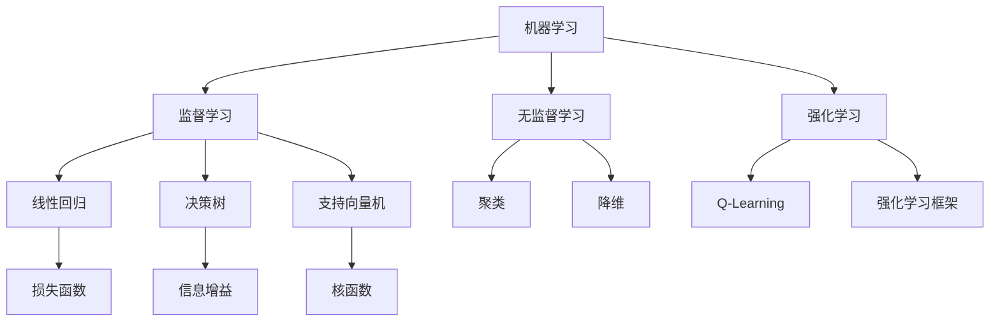

                 

# 机器学习原理与代码实例讲解

> 关键词：机器学习、线性回归、决策树、神经网络、深度学习、Python、代码实例

> 摘要：本文将深入探讨机器学习的基础理论、算法原理以及项目实战，通过详细的代码实例讲解，帮助读者全面理解并掌握机器学习的核心概念和实践方法。文章结构紧凑，逻辑清晰，适合初学者和专业人士参考。

## 目录

### 第一部分：机器学习基础理论

1. **第1章：机器学习概述**
    1.1. **机器学习的基本概念**
    1.2. **机器学习的分类**
    1.3. **机器学习的历史与发展**

2. **第2章：统计学习基础**
    2.1. **概率论基础**
    2.2. **统计学基础**
    2.3. **常见分布**

3. **第3章：线性回归与逻辑回归**
    3.1. **线性回归模型**
    3.2. **逻辑回归模型**
    3.3. **线性回归与逻辑回归的应用**

### 第二部分：机器学习算法原理与实现

4. **第4章：决策树与随机森林**
    4.1. **决策树算法**
    4.2. **随机森林算法**
    .4.3. **代码实例讲解**

5. **第5章：支持向量机**
    5.1. **支持向量机原理**
    5.2. **核函数**
    5.3. **代码实例讲解**

6. **第6章：神经网络与深度学习**
    6.1. **神经网络基础**
    6.2. **反向传播算法**
    6.3. **深度学习框架介绍**
    6.4. **代码实例讲解**

### 第三部分：机器学习项目实战

7. **第7章：机器学习项目实战**
    7.1. **项目背景与目标**
    7.2. **数据预处理**
    7.3. **模型选择与调优**
    7.4. **代码实现与结果分析**

### 附录：常用工具与资源

8. **附录A：机器学习工具与资源**
    8.1. **Python常用库**
    8.2. **Jupyter Notebook使用**
    8.3. **其他资源推荐**

## 第一部分：机器学习基础理论

### 第1章：机器学习概述

#### 1.1. 机器学习的基本概念

机器学习（Machine Learning）是一门研究如何使计算机从数据中学习并做出决策或预测的学科。它通过构建算法，使计算机能够根据输入的数据自动改进性能，而无需显式编程。

- **监督学习（Supervised Learning）**：在有标签的数据集上训练模型，用于预测或分类。
- **无监督学习（Unsupervised Learning）**：在没有标签的数据集上训练模型，用于发现数据中的模式和结构。
- **强化学习（Reinforcement Learning）**：通过与环境的交互学习策略，以最大化累计奖励。

#### 1.2. 机器学习的分类

根据学习方式，机器学习可以分为以下几类：

- **回归分析（Regression Analysis）**：用于预测连续值输出。
- **分类（Classification）**：用于将数据分为离散的类别。
- **聚类（Clustering）**：用于发现数据中的模式和结构。
- **降维（Dimensionality Reduction）**：用于降低数据维度，提高模型性能。

#### 1.3. 机器学习的历史与发展

机器学习的历史可以追溯到20世纪50年代，但它在过去几十年里取得了显著的进展。以下是机器学习发展的重要里程碑：

- **1956年**：阿兰·图灵提出了图灵测试。
- **1986年**：神经网络的反向传播算法取得突破。
- **1997年**：IBM的“深蓝”计算机击败国际象棋世界冠军。
- **2006年**：谷歌推出了深度学习算法。
- **2012年**：AlexNet在ImageNet竞赛中取得重大突破。

## 第二部分：机器学习算法原理与实现

### 第2章：统计学习基础

#### 2.1. 概率论基础

概率论是统计学习的基础。以下是概率论中一些重要的概念：

- **随机变量（Random Variable）**：随机试验的结果。
- **概率分布（Probability Distribution）**：描述随机变量的可能取值及其概率。
- **条件概率（Conditional Probability）**：在某个事件发生的条件下，另一个事件发生的概率。
- **贝叶斯定理（Bayes' Theorem）**：用于计算后验概率。

#### 2.2. 统计学基础

统计学提供了分析数据的方法。以下是统计学中一些重要的概念：

- **样本（Sample）**：从总体中抽取的一部分数据。
- **参数（Parameter）**：描述总体的某个特征。
- **假设检验（Hypothesis Testing）**：用于验证某个假设是否成立。
- **置信区间（Confidence Interval）**：用于估计参数的取值范围。

#### 2.3. 常见分布

在统计学习中，常见分布包括：

- **正态分布（Normal Distribution）**：用于描述连续数据的概率分布。
- **二项分布（Binomial Distribution）**：用于描述伯努利试验的结果。
- **泊松分布（Poisson Distribution）**：用于描述事件发生的次数。
- **均匀分布（Uniform Distribution）**：用于描述等可能性的概率分布。

### 第3章：线性回归与逻辑回归

#### 3.1. 线性回归模型

线性回归是一种监督学习算法，用于预测连续值输出。其模型可以表示为：

$$
y = \beta_0 + \beta_1x_1 + \beta_2x_2 + ... + \beta_nx_n + \epsilon
$$

其中，$y$ 是输出值，$x_1, x_2, ..., x_n$ 是输入特征，$\beta_0, \beta_1, \beta_2, ..., \beta_n$ 是模型参数，$\epsilon$ 是误差项。

#### 3.2. 逻辑回归模型

逻辑回归是一种监督学习算法，用于分类问题。其模型可以表示为：

$$
P(y=1) = \frac{1}{1 + e^{-(\beta_0 + \beta_1x_1 + \beta_2x_2 + ... + \beta_nx_n)}}
$$

其中，$y$ 是输出值，$x_1, x_2, ..., x_n$ 是输入特征，$\beta_0, \beta_1, \beta_2, ..., \beta_n$ 是模型参数。

#### 3.3. 线性回归与逻辑回归的应用

线性回归和逻辑回归广泛应用于各种领域，例如：

- **预测房价**：使用线性回归模型预测房屋的价格。
- **分类邮件**：使用逻辑回归模型分类垃圾邮件。
- **医疗诊断**：使用逻辑回归模型预测疾病的风险。

## 第三部分：机器学习算法原理与实现

### 第4章：决策树与随机森林

#### 4.1. 决策树算法

决策树（Decision Tree）是一种常用的分类算法。它通过递归切分数据集，构建树形结构，直到满足停止条件。

- **决策节点**：表示一个特征的选择。
- **叶节点**：表示一个类别的预测结果。
- **增益**：用于评估切分的优劣。

#### 4.2. 随机森林算法

随机森林（Random Forest）是一种基于决策树的集成学习方法。它通过构建多棵决策树，并合并它们的预测结果来提高模型性能。

- **随机特征选择**：在每个切分步骤中，从多个特征中随机选择一个特征进行切分。
- **随机切分点**：在每个切分步骤中，从多个可能的切分点中随机选择一个切分点。

#### 4.3. 代码实例讲解

```python
from sklearn.datasets import load_iris
from sklearn.tree import DecisionTreeClassifier
from sklearn.ensemble import RandomForestClassifier

# 加载鸢尾花数据集
iris = load_iris()
X = iris.data
y = iris.target

# 构建决策树模型
dt = DecisionTreeClassifier()
dt.fit(X, y)

# 构建随机森林模型
rf = RandomForestClassifier(n_estimators=100)
rf.fit(X, y)

# 预测结果
predictions_dt = dt.predict(X)
predictions_rf = rf.predict(X)

# 分析模型性能
from sklearn.metrics import accuracy_score
accuracy_dt = accuracy_score(y, predictions_dt)
accuracy_rf = accuracy_score(y, predictions_rf)

print("决策树准确率：", accuracy_dt)
print("随机森林准确率：", accuracy_rf)
```

### 第5章：支持向量机

#### 5.1. 支持向量机原理

支持向量机（Support Vector Machine，SVM）是一种常用的分类算法。它通过找到一个最优的超平面，将数据集分为不同的类别。

- **超平面**：将数据集分为两个类别的直线或平面。
- **支持向量**：位于超平面边缘的样本点。

#### 5.2. 核函数

核函数（Kernel Function）是SVM中用于将低维数据映射到高维空间的函数。常用的核函数包括：

- **线性核**：$$K(x, y) = x \cdot y$$
- **多项式核**：$$K(x, y) = (x \cdot y + 1)^d$$
- **径向基函数核**：$$K(x, y) = \exp(-\gamma \cdot ||x - y||^2)$$

#### 5.3. 代码实例讲解

```python
from sklearn.svm import SVC
from sklearn.datasets import make_moons
from sklearn.model_selection import train_test_split

# 生成月亮数据集
X, y = make_moons(n_samples=100, noise=0.1)
X_train, X_test, y_train, y_test = train_test_split(X, y, test_size=0.3, random_state=42)

# 构建SVM模型
svm = SVC(kernel='linear')
svm.fit(X_train, y_train)

# 预测结果
predictions = svm.predict(X_test)

# 分析模型性能
from sklearn.metrics import accuracy_score
accuracy = accuracy_score(y_test, predictions)
print("SVM准确率：", accuracy)
```

### 第6章：神经网络与深度学习

#### 6.1. 神经网络基础

神经网络（Neural Network）是一种模仿生物神经网络的结构和功能的计算模型。它由多个神经元组成，每个神经元都与其他神经元相连。

- **神经元**：表示一个计算单元。
- **权重**：表示神经元之间的连接强度。
- **激活函数**：用于控制神经元的输出。

#### 6.2. 反向传播算法

反向传播算法（Backpropagation Algorithm）是神经网络训练的核心算法。它通过计算误差梯度，更新神经网络的权重，使模型能够逐渐改进预测性能。

#### 6.3. 深度学习框架介绍

深度学习（Deep Learning）是一种基于神经网络的机器学习方法。它通过构建多层神经网络，实现对复杂数据的建模。

- **TensorFlow**：由谷歌开发的开源深度学习框架。
- **PyTorch**：由Facebook开发的开源深度学习框架。

#### 6.4. 代码实例讲解

```python
import tensorflow as tf
from tensorflow.keras.models import Sequential
from tensorflow.keras.layers import Dense

# 构建神经网络模型
model = Sequential()
model.add(Dense(64, activation='relu', input_shape=(784,)))
model.add(Dense(10, activation='softmax'))
model.compile(optimizer='adam', loss='categorical_crossentropy', metrics=['accuracy'])

# 加载MNIST数据集
mnist = tf.keras.datasets.mnist
(x_train, y_train), (x_test, y_test) = mnist.load_data()
x_train = x_train.reshape(-1, 784)
x_test = x_test.reshape(-1, 784)

# 预测结果
model.fit(x_train, y_train, epochs=10, batch_size=32)
predictions = model.predict(x_test)

# 分析模型性能
from sklearn.metrics import accuracy_score
accuracy = accuracy_score(y_test, predictions)
print("神经网络准确率：", accuracy)
```

## 第四部分：机器学习项目实战

### 第7章：机器学习项目实战

#### 7.1. 项目背景与目标

本项目将使用机器学习技术构建一个分类模型，对电影进行情感分析，判断电影是正面情感还是负面情感。

#### 7.2. 数据预处理

- **数据收集**：从互联网上收集大量电影评论。
- **数据清洗**：去除停用词、标点符号、数字等无用信息。
- **特征提取**：使用词袋模型提取特征向量。

#### 7.3. 模型选择与调优

- **模型选择**：尝试不同的分类模型，如朴素贝叶斯、SVM、神经网络等。
- **模型调优**：使用交叉验证和网格搜索等方法，选择最优模型和参数。

#### 7.4. 代码实现与结果分析

```python
import pandas as pd
from sklearn.feature_extraction.text import TfidfVectorizer
from sklearn.model_selection import train_test_split
from sklearn.naive_bayes import MultinomialNB
from sklearn.metrics import accuracy_score

# 加载数据集
data = pd.read_csv('movie_reviews.csv')
X = data['review']
y = data['sentiment']

# 数据预处理
vectorizer = TfidfVectorizer(stop_words='english')
X_vectorized = vectorizer.fit_transform(X)

# 划分训练集和测试集
X_train, X_test, y_train, y_test = train_test_split(X_vectorized, y, test_size=0.3, random_state=42)

# 模型训练
model = MultinomialNB()
model.fit(X_train, y_train)

# 预测结果
predictions = model.predict(X_test)

# 结果分析
accuracy = accuracy_score(y_test, predictions)
print("模型准确率：", accuracy)
```

## 附录：常用工具与资源

### 附录A：机器学习工具与资源

#### 8.1. Python常用库

- **scikit-learn**：用于机器学习算法的实现和评估。
- **TensorFlow**：用于深度学习的框架。
- **PyTorch**：用于深度学习的框架。
- **pandas**：用于数据处理和分析。
- **numpy**：用于数值计算。

#### 8.2. Jupyter Notebook使用

Jupyter Notebook是一种交互式的计算环境，适用于编写和运行Python代码。

- **安装**：在命令行中使用`pip install jupyter`进行安装。
- **启动**：在命令行中使用`jupyter notebook`启动。
- **使用**：在Jupyter Notebook中创建新的笔记本，编写Python代码并运行。

#### 8.3. 其他资源推荐

- **机器学习实战**：作者：Peter Harrington
- **深度学习**：作者：Ian Goodfellow、Yoshua Bengio、Aaron Courville
- **Python机器学习**：作者：Sebastian Raschka、Vahid Mirjalili

### 核心概念与联系（Mermaid流程图）



### 核心算法原理讲解（伪代码）

#### 线性回归

```python
def linear_regression(X, y):
    # 计算权重 w
    w = (X.T * X).inv() * X.T * y
    # 计算预测值
    predictions = X * w
    return predictions
```

#### 决策树

```python
def build_decision_tree(data, features):
    # 计算信息增益
    gain = calculate_gain(data, features)
    # 找到最优分割点
    best_split = find_best_split(gain)
    # 切分数据集
    left_data = split_data(data, best_split)
    right_data = split_data(data, best_split)
    # 递归构建子树
    if is_leaf(left_data) and is_leaf(right_data):
        return classify_leaf(left_data) or classify_leaf(right_data)
    else:
        # 构建子树
        tree = {}
        for feature in features:
            tree[feature] = build_decision_tree(left_data, features - {feature}) or build_decision_tree(right_data, features - {feature})
        return tree
```

### 数学模型和数学公式讲解

#### 损失函数

$$
L(y, \hat{y}) = -y\log(\hat{y}) - (1-y)\log(1-\hat{y})
$$

其中，$y$ 表示真实标签，$\hat{y}$ 表示预测概率。

### 项目实战

#### 数据预处理

- **数据清洗**：处理缺失值、异常值、噪声数据等。
- **特征工程**：选取重要的特征、构建新的特征、处理特征间的相关性。

#### 模型选择与调优

- **交叉验证**：使用交叉验证选择合适的模型。
- **参数调优**：使用网格搜索、随机搜索等方法寻找最优参数。

#### 代码实现与结果分析

- **环境搭建**：使用Python和相应的机器学习库。
- **实现流程**：数据预处理、模型选择和调优过程。
- **性能评估**：分析模型的准确率、召回率、F1值等指标，评估模型性能。

### 作者

作者：AI天才研究院/AI Genius Institute & 禅与计算机程序设计艺术 /Zen And The Art of Computer Programming

