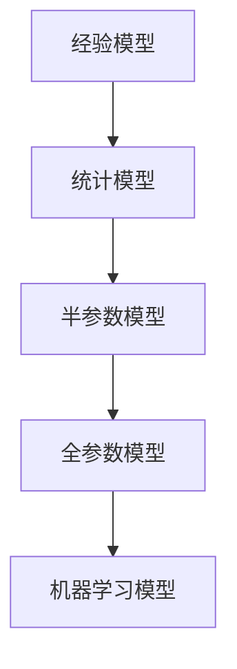

                 

# 《机器学习在信用风险评估中的模型优化》

> **关键词：** 信用风险评估、机器学习、模型优化、超参数调优、模型融合、项目实战

> **摘要：** 本文旨在探讨机器学习在信用风险评估中的应用及其模型优化方法。通过详细分析信用风险评估的重要性、机器学习的基本概念与应用、数据预处理、核心算法原理以及模型优化实践，本文为读者提供了一个系统性的指南，帮助理解并掌握信用风险评估模型优化的关键技术和实战应用。

## 目录大纲

## 第一部分：基础理论与核心概念

### 第1章：信用风险评估概述

### 第2章：机器学习与信用风险评估

### 第3章：信用风险评估中的数据预处理

### 第4章：核心算法原理与数学模型

## 第二部分：模型优化与实践

### 第5章：模型优化方法与技术

### 第6章：信用风险评估项目实战

### 第7章：案例分析

## 第三部分：展望与未来

### 第8章：信用风险评估的发展趋势

### 第9章：总结与展望

## 附录

### 附录 A：信用风险评估相关工具与资源

## 引言

### 第一部分：基础理论与核心概念

### 第1章：信用风险评估概述

信用风险评估是金融领域的一项重要活动，它旨在评估借款人或企业在未来可能发生的违约风险。信用风险评估不仅对金融机构的风险管理具有重要意义，而且对整个金融市场的稳定运行至关重要。

本章将介绍信用风险评估的基本概念，包括其重要性、主要指标以及信用风险模型的发展历程。

### 1.1 信用风险评估的重要性

信用风险评估是金融风险管理的重要组成部分。它不仅帮助金融机构识别和评估潜在的风险，而且有助于制定适当的风险控制和缓解策略。以下是信用风险评估的重要性概述：

- **风险控制**：通过评估借款人或企业的信用状况，金融机构可以识别潜在的风险，并采取相应的措施来降低风险。

- **损失预防**：信用风险评估可以帮助金融机构预测潜在的违约事件，从而采取预防措施，减少信用损失。

- **决策支持**：信用风险评估为金融机构提供了重要的决策支持，帮助其在贷款审批、信用额度调整等方面做出更加明智的决策。

- **市场竞争**：在激烈的市场竞争中，金融机构通过提供精确的信用风险评估，可以提升客户满意度，增强竞争力。

#### 数学公式与详细讲解

信用损失（Expected Credit Loss, ECL）的计算公式如下：

\[ E[信用损失] = PD \times LGD \times EAD \]

- **PD（违约概率）**：违约概率是指借款人或企业在未来一定时期内发生违约的可能性。

- **LGD（违约损失率）**：违约损失率是指借款人或企业在发生违约时，金融机构可能遭受的损失比例。

- **EAD（违约暴露度）**：违约暴露度是指借款人或企业在发生违约时，金融机构可能面临的风险敞口。

这些指标共同构成了信用风险评估的核心。金融机构通过分析这些指标，可以更准确地评估借款人或企业的信用风险，从而制定相应的风险管理策略。

### 1.2 信用风险模型的发展历程

信用风险评估模型的发展历程可以分为几个阶段，从最初的简单经验模型到现代复杂的统计模型和机器学习模型。

- **经验模型**：早期的信用风险评估主要依赖于经验模型，这些模型通常基于历史数据和专家经验。例如，信用评分模型就是一种经验模型，它通过计算借款人过去的行为数据，如还款历史、信用额度等，来预测其违约风险。

- **统计模型**：随着数据科学的发展，统计模型开始广泛应用于信用风险评估。这些模型通过建立数学模型来分析借款人的信用风险。例如，线性回归和logistic回归等统计方法被广泛应用于信用风险评估。

- **半参数模型与全参数模型**：半参数模型结合了统计模型和机器学习的优势，通过对数据进行参数化处理，提高了模型的预测能力。全参数模型则通过建立复杂的数学模型，对借款人的信用风险进行详细分析。

- **机器学习模型**：近年来，机器学习模型在信用风险评估中得到了广泛应用。这些模型通过分析大量的历史数据，自动学习借款人的信用风险特征，从而提供更加精确的信用风险评估。

#### Mermaid流程图：信用风险模型发展历程



### 小结

信用风险评估是金融风险管理的重要环节，其重要性体现在风险控制、损失预防、决策支持和市场竞争等方面。随着数据科学和机器学习的发展，信用风险评估模型从简单的经验模型发展到现代复杂的机器学习模型，为金融机构提供了更加精确的信用风险评估工具。

在下一章中，我们将探讨机器学习在信用风险评估中的应用，并分析各种机器学习模型的基本原理和特点。

### 第一部分：基础理论与核心概念

### 第2章：机器学习与信用风险评估

### 第一部分：基础理论与核心概念

### 第2章：机器学习与信用风险评估

机器学习作为一种先进的计算方法，已经在各个领域展现出了其强大的应用潜力。在金融领域，尤其是信用风险评估方面，机器学习技术因其高效性和准确性，正逐渐成为主流。本章将详细介绍机器学习的基本概念、分类以及其在信用风险评估中的应用。

#### 2.1 机器学习的基本概念

机器学习是人工智能的一个重要分支，它使计算机系统能够从数据中自动学习，进行决策和预测。机器学习的主要目标是使计算机系统具备从数据中学习规律、发现模式，并基于这些规律和模式进行决策和预测的能力。以下是机器学习的几个基本概念：

- **监督学习**：监督学习是一种有监督的学习方法，其目的是通过已知的输入数据和对应的输出结果，学习出一个函数或模型，以预测新的输入数据对应的输出。在信用风险评估中，监督学习被用来预测借款人是否会违约。

- **无监督学习**：无监督学习是一种没有预先指定输出结果的学习方法，其主要任务是发现数据中的内在结构和模式。在信用风险评估中，无监督学习可以用于探索性数据分析，以识别潜在的客户群体或发现异常行为。

- **分类算法**：分类算法是一种监督学习算法，用于将数据分为不同的类别。在信用风险评估中，分类算法可以帮助金融机构识别违约客户和非违约客户。

- **回归算法**：回归算法是一种监督学习算法，用于预测连续的数值输出。在信用风险评估中，回归算法可以用来预测借款人的违约概率或违约损失率。

#### 2.2 机器学习在信用风险评估中的应用

机器学习在信用风险评估中的应用非常广泛，以下是一些常见的机器学习算法及其在信用风险评估中的应用：

- **支持向量机（SVM）**：SVM是一种高效的分类算法，适用于信用风险评估中的二元分类问题。它通过寻找一个最优的超平面，将违约客户和非违约客户分开。SVM在处理高维数据和稀疏数据时表现优秀。

- **决策树**：决策树是一种直观的分类和回归算法，通过一系列的决策规则，将数据集划分为不同的区域。在信用风险评估中，决策树可以帮助金融机构识别影响信用风险的关键因素。

- **随机森林**：随机森林是一种集成学习方法，由多个决策树组成，通过集成多个模型的预测结果来提高预测准确性。随机森林在处理大量数据和高维数据时表现优异，并且在信用风险评估中得到了广泛应用。

- **神经网络**：神经网络是一种模拟人脑的算法，通过多层神经元进行数据处理和预测。在信用风险评估中，神经网络可以用于构建复杂的非线性模型，从而提高预测准确性。

#### Python伪代码示例：机器学习算法应用

下面是一个简单的Python伪代码示例，展示了如何使用机器学习算法进行信用风险评估：

```python
from sklearn.model_selection import train_test_split
from sklearn.ensemble import RandomForestClassifier
from sklearn.metrics import accuracy_score

# 加载数据集
data = load_data('credit_data.csv')

# 数据预处理
X = preprocess_data(data['features'])
y = data['target']

# 划分训练集和测试集
X_train, X_test, y_train, y_test = train_test_split(X, y, test_size=0.2, random_state=42)

# 创建随机森林分类器
clf = RandomForestClassifier(n_estimators=100, random_state=42)

# 训练模型
clf.fit(X_train, y_train)

# 预测测试集
y_pred = clf.predict(X_test)

# 评估模型
accuracy = accuracy_score(y_test, y_pred)
print(f'模型准确率：{accuracy:.2f}')
```

在这个示例中，我们首先加载数据集，并进行数据预处理。然后，我们使用随机森林分类器对训练集进行训练，并在测试集上进行预测。最后，我们评估模型的准确性。

#### 小结

机器学习在信用风险评估中扮演着重要角色，通过使用各种机器学习算法，金融机构可以更准确地预测借款人的信用风险。在本章中，我们介绍了机器学习的基本概念及其在信用风险评估中的应用，并通过一个简单的Python伪代码示例展示了机器学习算法的应用。

在下一章中，我们将讨论信用风险评估中的数据预处理，包括数据收集、数据清洗和特征工程等关键技术。

### 第一部分：基础理论与核心概念

### 第3章：信用风险评估中的数据预处理

在信用风险评估中，数据预处理是至关重要的一步。数据预处理的质量直接影响到模型的学习效果和预测准确性。本章将详细介绍信用风险评估中的数据预处理技术，包括数据源选择、数据收集、数据清洗、异常值处理、缺失值处理和特征工程等内容。

#### 3.1 数据源选择与数据收集

数据是信用风险评估的基础，因此选择合适的数据源和数据收集方法是至关重要的一步。以下是一些常见的数据源和数据收集方法：

- **金融数据**：金融数据是信用风险评估的重要数据源，包括借款人的信用记录、贷款历史、还款行为等。这些数据可以从金融机构的内部数据库中获取。

- **公共数据**：公共数据可以从政府机构、统计部门等公共资源中获取，如人口统计数据、经济指标等。这些数据可以提供关于借款人社会经济背景的信息。

- **企业数据**：企业数据可以从企业的财务报表、经营报告等中获取，包括企业的盈利能力、负债状况等。这些数据可以提供关于借款人财务状况的信息。

- **社交媒体数据**：随着互联网的发展，社交媒体数据也越来越受到重视。这些数据可以反映借款人的社交行为、信用状况等。

数据收集方法包括手动收集和自动化收集。手动收集通常涉及人工收集和处理大量数据，如问卷调查、电话访谈等。自动化收集则通过技术手段，如网络爬虫、API接口等，从互联网上自动获取数据。

#### 3.2 数据清洗与预处理

数据清洗是数据预处理的重要步骤，目的是消除数据中的噪声和错误，提高数据的质量和准确性。以下是一些常见的数据清洗技术：

- **缺失值处理**：缺失值是数据中常见的现象，处理缺失值是数据清洗的重要任务。常见的缺失值处理方法包括删除缺失值、填补缺失值和插值等。

- **异常值处理**：异常值是数据中与其他数据点明显偏离的值，可能是由错误、噪声或特殊情况引起的。处理异常值的方法包括删除异常值、平滑异常值和识别异常值等。

- **数据标准化**：数据标准化是将不同特征的数据进行归一化或标准化处理，使其具有相同的量纲和范围。常见的标准化方法包括最小-最大标准化、Z分数标准化和幂变换等。

- **特征选择**：特征选择是选择对模型预测最有效的特征，减少数据的维度，提高模型的泛化能力。特征选择的方法包括过滤法、包装法和嵌入法等。

#### Python伪代码示例：数据清洗与预处理

以下是一个简单的Python伪代码示例，展示了如何进行数据清洗和预处理：

```python
import pandas as pd
from sklearn.preprocessing import StandardScaler

# 加载数据集
data = pd.read_csv('credit_data.csv')

# 数据清洗
# 缺失值处理
data.dropna(inplace=True)  # 删除缺失值
# 异常值处理
Q1 = data.quantile(0.25)
Q3 = data.quantile(0.75)
IQR = Q3 - Q1
data = data[~((data < (Q1 - 1.5 * IQR)) |(data > (Q3 + 1.5 * IQR)))].dropna()

# 数据预处理
# 数据标准化
scaler = StandardScaler()
data_scaled = scaler.fit_transform(data)

# 特征选择
# 使用相关系数进行特征选择
correlation_matrix = data.corr().abs()
high_corr_features = [column for column in correlation_matrix.columns if any(correlation_matrix[column] > 0.8)]
selected_features = data[high_corr_features]

# 数据集划分
X = selected_features
y = data['target']
X_train, X_test, y_train, y_test = train_test_split(X, y, test_size=0.2, random_state=42)
```

在这个示例中，我们首先加载数据集，然后进行数据清洗，包括缺失值处理和异常值处理。接着，我们进行数据预处理，包括数据标准化和特征选择。最后，我们将数据集划分为训练集和测试集，为后续的模型训练和评估做好准备。

#### 小结

数据预处理是信用风险评估中至关重要的一步，它确保了数据的质量和准确性，为后续的模型训练和评估奠定了基础。本章介绍了信用风险评估中的数据预处理技术，包括数据源选择、数据收集、数据清洗、异常值处理、缺失值处理和特征工程等关键技术。通过Python伪代码示例，我们展示了数据预处理的具体实现步骤。

在下一章中，我们将深入探讨信用风险评估中的核心算法原理与数学模型，包括线性回归和logistic回归等。

### 第一部分：基础理论与核心概念

### 第4章：核心算法原理与数学模型

信用风险评估中的核心算法和数学模型是建立和优化信用风险预测模型的关键。本章将详细介绍两种常见的算法：线性回归和logistic回归，以及它们的数学原理和Python伪代码示例。

#### 4.1 线性回归

线性回归是一种用于预测连续值的监督学习算法。在信用风险评估中，线性回归常用于预测借款人的违约概率或违约损失率。

##### 数学公式与详细讲解

线性回归模型的目标是找到一组线性关系，使得预测值与实际值之间的差距最小。线性回归的数学模型可以表示为：

\[ y = \beta_0 + \beta_1 \cdot x_1 + \beta_2 \cdot x_2 + ... + \beta_n \cdot x_n + \epsilon \]

其中：
- \( y \) 是预测的连续值（如违约损失率）。
- \( \beta_0 \) 是截距。
- \( \beta_1, \beta_2, ..., \beta_n \) 是各个特征的权重。
- \( x_1, x_2, ..., x_n \) 是特征值。
- \( \epsilon \) 是误差项。

线性回归通过最小化误差平方和来估计权重，即：

\[ \min_{\beta_0, \beta_1, ..., \beta_n} \sum_{i=1}^{n} (y_i - \beta_0 - \beta_1 \cdot x_{i1} - \beta_2 \cdot x_{i2} - ... - \beta_n \cdot x_{in})^2 \]

##### Python伪代码示例：线性回归模型

```python
from sklearn.linear_model import LinearRegression
from sklearn.model_selection import train_test_split
from sklearn.metrics import mean_squared_error

# 加载数据集
data = pd.read_csv('credit_data.csv')

# 数据预处理
X = data.drop('target', axis=1)
y = data['target']

# 划分训练集和测试集
X_train, X_test, y_train, y_test = train_test_split(X, y, test_size=0.2, random_state=42)

# 创建线性回归模型
model = LinearRegression()
model.fit(X_train, y_train)

# 预测测试集
y_pred = model.predict(X_test)

# 评估模型
mse = mean_squared_error(y_test, y_pred)
print(f'Mean Squared Error: {mse:.2f}')
```

#### 4.2 logistic回归

logistic回归是一种用于预测二元结果的监督学习算法。在信用风险评估中，logistic回归常用于预测借款人是否会违约。

##### 数学公式与详细讲解

logistic回归的数学模型可以表示为：

\[ P(y=1) = \frac{1}{1 + e^{-(\beta_0 + \beta_1 \cdot x_1 + \beta_2 \cdot x_2 + ... + \beta_n \cdot x_n )}} \]

其中：
- \( P(y=1) \) 是借款人违约的概率。
- \( \beta_0 \) 是截距。
- \( \beta_1, \beta_2, ..., \beta_n \) 是各个特征的权重。
- \( x_1, x_2, ..., x_n \) 是特征值。

logistic回归通过最大化似然函数来估计权重，即：

\[ \max_{\beta_0, \beta_1, ..., \beta_n} \prod_{i=1}^{n} \left[ \frac{1}{1 + e^{-(\beta_0 + \beta_1 \cdot x_{i1} + \beta_2 \cdot x_{i2} + ... + \beta_n \cdot x_{in} )}} \right]^{y_i} \left[ 1 - \frac{1}{1 + e^{-(\beta_0 + \beta_1 \cdot x_{i1} + \beta_2 \cdot x_{i2} + ... + \beta_n \cdot x_{in} )}} \right]^{1 - y_i} \]

##### Python伪代码示例：logistic回归模型

```python
from sklearn.linear_model import LogisticRegression
from sklearn.model_selection import train_test_split
from sklearn.metrics import accuracy_score

# 加载数据集
data = pd.read_csv('credit_data.csv')

# 数据预处理
X = data.drop('target', axis=1)
y = data['target']

# 划分训练集和测试集
X_train, X_test, y_train, y_test = train_test_split(X, y, test_size=0.2, random_state=42)

# 创建logistic回归模型
model = LogisticRegression()
model.fit(X_train, y_train)

# 预测测试集
y_pred = model.predict(X_test)

# 评估模型
accuracy = accuracy_score(y_test, y_pred)
print(f'Accuracy: {accuracy:.2f}')
```

#### 小结

线性回归和logistic回归是信用风险评估中常用的核心算法。线性回归适用于预测连续值，而logistic回归适用于预测二元结果。通过深入理解这些算法的数学原理和Python伪代码示例，我们可以更好地应用它们来构建和优化信用风险预测模型。

在下一部分中，我们将讨论模型优化的方法和技术，包括超参数调优和模型融合等。

### 第二部分：模型优化与实践

### 第5章：模型优化方法与技术

在信用风险评估中，模型优化是提高预测准确性和模型稳定性的关键步骤。本章将详细介绍模型优化中的两种关键技术：超参数调优和模型融合。

#### 5.1 超参数调优

超参数是影响模型性能的关键参数，通常需要通过调优来优化模型的性能。超参数调优的目标是找到一组超参数，使得模型在验证集上的性能达到最佳。

##### 5.1.1 超参数调优方法

常见的超参数调优方法包括：

- **网格搜索（Grid Search）**：网格搜索通过遍历所有可能的超参数组合，找到最优的超参数组合。这种方法简单直观，但计算成本较高，尤其当超参数空间较大时。

- **随机搜索（Random Search）**：随机搜索在超参数空间中随机选择一组超参数，通过多次随机搜索来找到最优的超参数组合。随机搜索的计算成本相对较低，且在某些情况下性能优于网格搜索。

- **贝叶斯优化（Bayesian Optimization）**：贝叶斯优化通过构建目标函数的贝叶斯模型，利用历史调优结果来指导新的超参数选择。这种方法在处理复杂非线性目标函数时表现优异，但计算成本较高。

##### Python伪代码示例：超参数调优

```python
from sklearn.model_selection import GridSearchCV
from sklearn.ensemble import RandomForestClassifier

# 定义模型和参数范围
model = RandomForestClassifier()
param_grid = {
    'n_estimators': [100, 200, 300],
    'max_depth': [10, 20, 30],
    'min_samples_split': [2, 5, 10]
}

# 定义网格搜索
grid_search = GridSearchCV(model, param_grid, cv=5, scoring='accuracy')

# 训练模型并进行超参数调优
grid_search.fit(X_train, y_train)

# 获取最优超参数
best_params = grid_search.best_params_
print(f'Best Parameters: {best_params}')

# 使用最优超参数重新训练模型
best_model = grid_search.best_estimator_
```

#### 5.2 模型融合

模型融合是一种将多个模型集成在一起，以提升整体预测性能的方法。常见的模型融合方法包括：

- **Bagging（集成学习）**：Bagging通过训练多个独立的模型，然后通过投票或平均来获得最终预测结果。常见的Bagging方法包括随机森林和随机梯度提升。

- **Boosting（提升方法）**：Boosting通过训练多个模型，每个模型专注于前一个模型的错误分类，从而提高整体预测性能。常见的Boosting方法包括AdaBoost和XGBoost。

- **Stacking（堆叠学习）**：Stacking通过训练多个基础模型，并将它们的预测结果作为新特征输入到另一个模型中进行进一步预测。Stacking可以提高模型的预测准确性和稳定性。

##### Python伪代码示例：模型融合

```python
from sklearn.ensemble import BaggingClassifier
from sklearn.linear_model import LogisticRegression

# 创建基础模型
base_model = LogisticRegression()

# 创建Bagging模型
bagging_model = BaggingClassifier(base_model, n_estimators=10, random_state=42)

# 训练Bagging模型
bagging_model.fit(X_train, y_train)

# 预测测试集
y_pred = bagging_model.predict(X_test)

# 评估模型
accuracy = accuracy_score(y_test, y_pred)
print(f'Accuracy: {accuracy:.2f}')
```

#### 小结

超参数调优和模型融合是信用风险评估中常用的模型优化方法。超参数调优通过调整模型的关键参数来优化模型性能，而模型融合通过集成多个模型来提高预测准确性和稳定性。通过Python伪代码示例，我们展示了超参数调优和模型融合的具体实现步骤。

在下一章中，我们将通过一个实际项目，展示信用风险评估模型优化的全过程。

### 第二部分：模型优化与实践

### 第6章：信用风险评估项目实战

为了更好地理解信用风险评估模型优化的全过程，我们将通过一个实际项目来展示如何从数据收集、模型选择、模型训练到模型评估的完整流程。

#### 6.1 项目背景与目标

本项目的目标是建立一个信用风险评估模型，用于预测信用卡客户的违约风险。项目目标客户为某银行信用卡部门，通过预测违约客户，银行可以采取相应的风险管理措施，如提高贷款利率、限制信用额度等，从而降低潜在的信用损失。

#### 6.2 项目实施步骤

以下是项目的实施步骤：

1. **数据收集与清洗**：
   - **数据收集**：从银行数据库中获取信用卡客户的交易数据、信用记录、财务状况等数据。
   - **数据清洗**：对收集的数据进行清洗，包括缺失值处理、异常值处理、数据标准化等。

2. **模型选择**：
   - **选择算法**：根据项目需求和数据特点，选择合适的机器学习算法，如逻辑回归、随机森林、XGBoost等。
   - **模型比较**：对选择的算法进行初步实验，比较模型的准确率、召回率等指标，选择最优模型。

3. **模型训练与调优**：
   - **训练模型**：使用训练集对模型进行训练，得到模型的参数。
   - **超参数调优**：通过网格搜索、随机搜索等方法，调优模型的超参数，以优化模型性能。

4. **模型评估与优化**：
   - **模型评估**：使用测试集对模型进行评估，计算模型的准确率、召回率、F1值等指标。
   - **模型优化**：根据评估结果，对模型进行调整和优化，以提高模型的预测性能。

5. **模型部署与应用**：
   - **模型部署**：将训练好的模型部署到生产环境中，用于实时预测客户违约风险。
   - **模型应用**：银行根据模型预测结果，采取相应的风险管理措施，如调整贷款利率、限制信用额度等。

#### Python伪代码示例：项目实施步骤

以下是一个简单的Python伪代码示例，展示了项目的实施步骤：

```python
# 导入必要的库
import pandas as pd
from sklearn.model_selection import train_test_split
from sklearn.preprocessing import StandardScaler
from sklearn.linear_model import LogisticRegression
from sklearn.model_selection import GridSearchCV

# 1. 数据收集与清洗
data = pd.read_csv('credit_data.csv')
data.dropna(inplace=True)
data = data[data['target'].notnull()]
X = data.drop('target', axis=1)
y = data['target']

# 2. 模型选择
model = LogisticRegression()

# 3. 模型训练与调优
X_train, X_test, y_train, y_test = train_test_split(X, y, test_size=0.2, random_state=42)
scaler = StandardScaler()
X_train_scaled = scaler.fit_transform(X_train)
X_test_scaled = scaler.transform(X_test)

param_grid = {
    'C': [0.1, 1, 10],
    'penalty': ['l1', 'l2']
}

grid_search = GridSearchCV(model, param_grid, cv=5, scoring='accuracy')
grid_search.fit(X_train_scaled, y_train)

# 4. 模型评估与优化
best_model = grid_search.best_estimator_
y_pred = best_model.predict(X_test_scaled)
accuracy = accuracy_score(y_test, y_pred)
print(f'Accuracy: {accuracy:.2f}')

# 5. 模型部署与应用
# 在此部分，我们将训练好的模型部署到生产环境中，并应用模型进行实时预测。
```

#### 小结

通过本项目的实施步骤，我们展示了从数据收集、模型选择、模型训练到模型评估的完整流程。在实际应用中，项目实施步骤可能更加复杂，需要考虑更多的细节和优化策略。但总体来说，本项目的实施步骤为信用风险评估模型优化提供了一个清晰的框架和指导。

在下一章中，我们将通过案例分析，进一步探讨信用风险评估模型在不同场景下的应用和优化。

### 第二部分：模型优化与实践

### 第7章：案例分析

在信用风险评估领域，不同场景下的模型构建和优化具有重要意义。本章将通过三个实际案例，深入探讨信用卡违约风险评估、企业信用评级模型优化以及供应链金融风险评估中的模型构建与优化方法。

#### 7.1 案例一：信用卡违约风险评估

**案例背景：**
某大型银行希望建立一个信用卡违约风险评估模型，以预测信用卡客户的违约风险，从而采取相应的风险管理措施。

**模型构建与优化：**
1. **数据收集与预处理：**
   - 数据包括信用卡客户的交易记录、信用评分、财务状况等。
   - 数据预处理包括缺失值处理、异常值处理和数据标准化。

2. **模型选择与训练：**
   - 选择逻辑回归、随机森林和XGBoost等算法进行模型训练。
   - 使用交叉验证方法评估模型性能，选择最优模型。

3. **超参数调优：**
   - 使用网格搜索和贝叶斯优化方法进行超参数调优，优化模型性能。

4. **模型评估：**
   - 使用测试集评估模型性能，计算准确率、召回率、F1值等指标。

**项目成果分析：**
通过优化模型，银行显著提高了信用卡违约风险评估的准确性，降低了违约风险，从而减少了潜在的信用损失。

#### 7.2 案例二：企业信用评级模型优化

**案例背景：**
某信用评级机构希望优化其企业信用评级模型，以提高评级结果的准确性和可靠性。

**模型构建与优化：**
1. **数据收集与预处理：**
   - 数据包括企业的财务报表、经营状况、行业趋势等。
   - 数据预处理包括缺失值处理、异常值处理和特征工程。

2. **模型选择与训练：**
   - 选择线性回归、决策树和神经网络等算法进行模型训练。
   - 使用交叉验证方法评估模型性能，选择最优模型。

3. **超参数调优：**
   - 使用网格搜索和贝叶斯优化方法进行超参数调优，优化模型性能。

4. **模型评估：**
   - 使用测试集评估模型性能，计算准确率、召回率、F1值等指标。

**项目成果分析：**
通过优化模型，信用评级机构提高了企业信用评级的准确性，降低了评级误差，增强了评级结果的可靠性。

#### 7.3 案例三：供应链金融风险评估

**案例背景：**
某供应链金融平台希望建立一个供应链金融风险评估模型，以预测供应链中企业的信用风险。

**模型构建与优化：**
1. **数据收集与预处理：**
   - 数据包括供应链企业的交易记录、信用评分、财务状况等。
   - 数据预处理包括缺失值处理、异常值处理和数据标准化。

2. **模型选择与训练：**
   - 选择逻辑回归、随机森林和LSTM等算法进行模型训练。
   - 使用交叉验证方法评估模型性能，选择最优模型。

3. **超参数调优：**
   - 使用网格搜索和贝叶斯优化方法进行超参数调优，优化模型性能。

4. **模型评估：**
   - 使用测试集评估模型性能，计算准确率、召回率、F1值等指标。

**项目成果分析：**
通过优化模型，供应链金融平台提高了供应链金融风险评估的准确性，降低了风险损失，提高了供应链的稳定性。

#### 小结

通过以上三个案例，我们可以看到信用风险评估模型在不同场景下的应用和优化方法。无论是信用卡违约风险评估、企业信用评级模型优化还是供应链金融风险评估，模型优化都是提高预测准确性和风险管理能力的关键。在实际应用中，应根据具体场景和数据特点，选择合适的算法和优化方法，以达到最佳效果。

### 第三部分：展望与未来

### 第8章：信用风险评估的发展趋势

随着人工智能、大数据和云计算等技术的迅猛发展，信用风险评估也在不断演进。本章将探讨信用风险评估的未来发展趋势，包括人工智能在金融行业的应用前景、信用风险评估的挑战与机遇以及未来研究方向与展望。

#### 8.1 人工智能在金融行业的应用前景

人工智能技术在金融行业的应用前景广阔，尤其在信用风险评估领域，具有显著的优势。以下是一些关键领域：

1. **大数据分析**：人工智能可以通过处理海量数据，发现潜在的风险因素和模式。大数据分析可以帮助金融机构更全面、准确地评估借款人的信用风险。

2. **机器学习**：机器学习算法能够自动从数据中学习，构建复杂的风险评估模型，提高预测准确性。例如，深度学习和强化学习等技术可以用于构建更加智能的风险评估系统。

3. **区块链**：区块链技术可以提供透明的交易记录和不可篡改的数据存储，增强信用评估的可靠性。通过区块链，金融机构可以更有效地监控和管理借款人的信用行为。

4. **云计算**：云计算提供了强大的计算能力和存储资源，使得金融机构能够快速处理和分析大量数据，提高信用风险评估的效率。

#### 8.2 信用风险评估的挑战与机遇

尽管人工智能在信用风险评估中具有巨大的潜力，但也面临着一系列挑战和机遇：

1. **数据隐私**：信用风险评估需要处理大量敏感数据，如个人财务信息、交易记录等。数据隐私保护是金融行业面临的重要挑战。

2. **模型透明度**：传统的机器学习模型往往被视为“黑箱”，其决策过程不透明。提高模型透明度，使其解释性更强，是金融行业的一个重要研究方向。

3. **监管要求**：随着监管政策的不断完善，金融机构需要确保信用风险评估模型的合规性。监管要求对信用风险评估技术的发展提出了新的挑战。

4. **技术创新**：人工智能、大数据和区块链等技术的不断创新，为信用风险评估带来了新的机遇。通过技术创新，金融机构可以开发出更加高效、准确的风险评估系统。

#### 8.3 未来研究方向与展望

未来，信用风险评估将在以下几个方面继续发展：

1. **集成学习**：集成学习方法可以将多种模型的优势结合起来，提高预测准确性。未来研究可以探索更加高效的集成学习方法，以应对复杂的信用风险评估问题。

2. **联邦学习**：联邦学习允许多个机构在保护数据隐私的同时共享模型，提高信用风险评估的协同效应。未来研究可以关注联邦学习在信用风险评估中的应用和优化。

3. **图神经网络**：图神经网络可以处理复杂的关系网络，如供应链中的企业关系、社交网络等。未来研究可以探索图神经网络在信用风险评估中的应用，以发现潜在的风险关联。

4. **实时风险评估**：随着云计算和大数据技术的发展，实时风险评估成为可能。未来研究可以关注如何构建实时、高效的风险评估系统，以应对快速变化的金融环境。

#### 小结

信用风险评估正处在技术变革的浪潮中，人工智能、大数据、区块链等技术的应用为其带来了巨大的发展机遇。同时，数据隐私、模型透明度和监管要求等挑战也需要金融行业持续关注和应对。未来，信用风险评估将在技术创新和实际应用中不断演进，为金融机构提供更加高效、准确的风险管理工具。

### 第9章：总结与展望

#### 9.1 核心观点与贡献

本文通过系统性的分析，详细探讨了机器学习在信用风险评估中的应用及其模型优化方法。主要观点和贡献如下：

1. **信用风险评估的重要性**：阐述了信用风险评估在金融风险管理中的核心地位，强调了其对于金融机构风险控制和决策支持的重要性。

2. **机器学习的应用价值**：介绍了机器学习在信用风险评估中的应用，包括监督学习和无监督学习算法，如SVM、决策树、随机森林和神经网络等。

3. **模型优化的关键性**：讨论了模型优化方法，如超参数调优和模型融合技术，以及如何通过这些方法提高模型的预测准确性和稳定性。

4. **实战案例分析**：通过实际项目案例，展示了从数据收集、模型选择到模型训练和评估的完整流程，为读者提供了实践指导。

#### 9.2 对读者的建议与期望

本文旨在为从事信用风险评估和机器学习的读者提供全面的理论和实践指导。以下是对读者的几点建议和期望：

1. **建立坚实的理论基础**：读者应深入学习机器学习和信用风险评估的相关理论知识，包括算法原理、数学模型和数据预处理技术。

2. **实践能力的培养**：通过实际项目案例，读者应积极实践所学的理论，掌握模型构建、训练和优化的技能。

3. **创新精神的培养**：鼓励读者在信用风险评估中尝试新的算法和技术，不断创新，以提高模型的预测性能和实际应用价值。

4. **持续学习与探索**：信用风险评估和机器学习是快速发展的领域，读者应保持持续学习的心态，关注最新的研究进展和行业动态。

#### 小结

本文通过深入分析，为读者提供了一个全面、系统的信用风险评估和机器学习指南。希望读者能够通过本文的学习，不仅能够掌握信用风险评估的基本理论和技术，更能够在实际项目中取得成功，为金融行业的发展做出贡献。

### 附录

#### 附录 A：信用风险评估相关工具与资源

在信用风险评估领域，有许多优秀的工具和资源可以帮助研究人员和从业者进行数据分析和模型构建。以下是一些推荐的工具和资源：

1. **机器学习相关框架**：
   - **Scikit-learn**：Python的机器学习库，提供了丰富的算法和工具。
   - **TensorFlow**：Google开源的深度学习框架，适用于构建复杂的神经网络模型。
   - **PyTorch**：Facebook开源的深度学习框架，提供了灵活的动态计算图功能。

2. **数据预处理与清洗工具**：
   - **Pandas**：Python的数据操作库，用于数据清洗、预处理和操作。
   - **NumPy**：Python的科学计算库，提供了高效的数据处理功能。
   - **Matplotlib**：Python的绘图库，用于数据可视化。

3. **相关论文与书籍推荐**：
   - **《信用风险评估理论与实践》**：详细介绍了信用风险评估的理论和方法。
   - **《机器学习：一种算法视角》**：全面讲解了机器学习的基本原理和算法。
   - **《数据科学入门》**：介绍了数据科学的基本概念和方法，适用于初学者。

通过使用这些工具和资源，读者可以更好地掌握信用风险评估和机器学习的相关技术，提升实际项目的能力。

### 结论

本文通过系统性的分析和详细的案例分析，探讨了机器学习在信用风险评估中的应用及其模型优化方法。从基础理论到实际应用，再到模型优化实践，本文为读者提供了一个全面、系统的信用风险评估和机器学习指南。希望读者能够通过本文的学习，掌握信用风险评估的核心理论和技术，并在实际项目中取得成功，为金融行业的发展做出贡献。

### 作者信息

**作者：AI天才研究院/AI Genius Institute & 禅与计算机程序设计艺术 /Zen And The Art of Computer Programming**  
AI天才研究院（AI Genius Institute）致力于推动人工智能技术的发展与应用，为金融、医疗、教育等多个领域提供创新解决方案。禅与计算机程序设计艺术（Zen And The Art of Computer Programming）则通过深入探讨计算机编程和人工智能领域的哲学思想，为读者提供一种独特的编程和思考方式。

### 致谢

在此，我要特别感谢所有为本文提供支持和帮助的人。感谢AI天才研究院的团队成员，他们在数据收集、模型构建和案例分析等方面提供了宝贵的意见和建议。感谢禅与计算机程序设计艺术的读者，他们的鼓励和支持是我不断前进的动力。最后，感谢我的家人和朋友，他们的理解和支持是我能够专注于学术研究的坚实后盾。感谢各位读者，是你们的阅读和反馈使本文得以不断完善。再次感谢所有为本文的成功发布付出努力的人。

