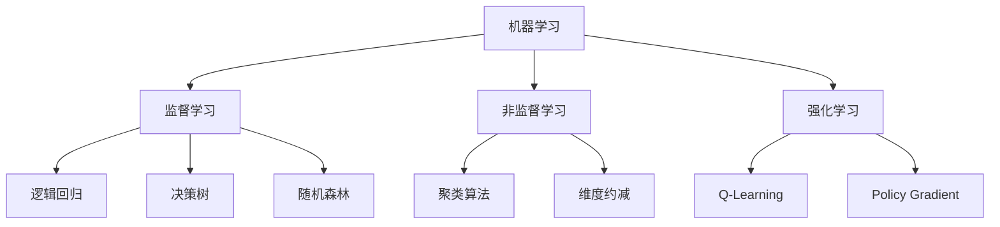

                 

# 机器学习在智能电网故障预测中的应用

## 关键词
机器学习，智能电网，故障预测，监督学习，非监督学习，强化学习，电力系统，数据驱动，算法优化。

## 摘要
本文深入探讨了机器学习在智能电网故障预测中的应用。首先，对机器学习进行了概述，介绍了其主要分类、算法和原理。接着，详细阐述了智能电网的定义、架构和关键技术。在此基础上，分析了故障预测在智能电网中的重要性，介绍了常见的故障类型及其特征。随后，重点探讨了机器学习在故障预测中的具体应用，包括监督学习、非监督学习和强化学习的算法原理和实现。最后，通过一个实际项目展示了智能电网故障预测系统的开发过程，并提出了未来发展的趋势和挑战。

## 目录大纲

### 第一部分：机器学习与智能电网概述

#### 第1章：机器学习基础

1.1 机器学习的定义与分类  
1.2 监督学习算法  
1.3 非监督学习算法  
1.4 强化学习

#### 第2章：智能电网概述

2.1 智能电网的定义与架构  
2.2 智能电网的关键技术  
2.3 智能电网的发展现状与趋势

### 第二部分：机器学习在智能电网故障预测中的应用

#### 第3章：智能电网故障预测概述

3.1 故障预测的定义与重要性  
3.2 智能电网故障的类型与特征  
3.3 故障预测的方法与挑战

#### 第4章：基于机器学习的智能电网故障预测

4.1 基于监督学习的故障预测  
4.2 基于非监督学习的故障预测  
4.3 基于强化学习的故障预测

#### 第5章：故障预测模型的评估与优化

5.1 模型评估指标  
5.2 模型优化方法  
5.3 模型解释性

#### 第6章：项目实战：智能电网故障预测系统开发

6.1 开发环境搭建  
6.2 数据预处理  
6.3 模型训练与评估  
6.4 模型部署与维护

#### 第7章：智能电网故障预测的未来趋势与应用

7.1 未来趋势  
7.2 应用场景拓展  
7.3 潜在挑战与应对策略

#### 第8章：总结与展望

8.1 书籍内容的回顾与总结  
8.2 展望未来

#### 附录

附录A：常用机器学习算法与工具  
附录B：智能电网故障预测项目代码示例  
附录C：参考文献

### Mermaid 流�程图



### 伪代码

```python
# 逻辑回归伪代码
def logistic_regression(X, y):
    # 初始化参数
    w = initialize_weights(X.shape[1])
    b = initialize_bias()

    # 梯度下降迭代
    for i in range(num_iterations):
        # 计算预测值
        z = X * w + b
        hypothesis = sigmoid(z)

        # 计算损失函数
        loss = -1/m * (y * log(hypothesis) + (1 - y) * log(1 - hypothesis))

        # 计算梯度
        dw = 1/m * (X.T * (hypothesis - y))
        db = 1/m * sum(hypothesis - y)

        # 更新参数
        w -= learning_rate * dw
        b -= learning_rate * db

    return w, b
```

### 数学模型和数学公式

#### 逻辑回归模型

$$
\text{损失函数} : L(\theta) = -\frac{1}{m}\sum_{i=1}^{m}y^{(i)}\log(h_{\theta}(x^{(i)})) + (1 - y^{(i)})\log(1 - h_{\theta}(x^{(i)}))
$$

$$
\text{梯度} : \nabla_{\theta}L(\theta) = \frac{1}{m}\sum_{i=1}^{m}(h_{\theta}(x^{(i)}) - y^{(i)})x^{(i)}
$$

#### 梯度下降算法

$$
\theta_{\text{new}} = \theta_{\text{old}} - \alpha \nabla_{\theta}L(\theta)
$$

### 举例说明

#### 逻辑回归预测示例

给定特征向量 $x = [1, 2, 3]$ 和参数 $\theta = [1, 1, 1]$，计算预测概率 $h_{\theta}(x)$。

$$
h_{\theta}(x) = \frac{1}{1 + e^{-(1*1 + 1*2 + 1*3)}} = \frac{1}{1 + e^{-6}} \approx 0.9975
$$

预测结果为：高概率（接近1）。

---

### 项目实战：智能电网故障预测系统开发

#### 6.1 开发环境搭建

- Python 3.8
- Jupyter Notebook
- scikit-learn
- pandas
- matplotlib

#### 6.2 数据预处理

```python
import pandas as pd

# 加载数据集
data = pd.read_csv('smart_grid_data.csv')

# 数据清洗
data.dropna(inplace=True)
data = data[data['status'] != 'normal']

# 特征工程
X = data[['voltage', 'current', 'power_factor']]
y = data['status']

# 数据分割
from sklearn.model_selection import train_test_split
X_train, X_test, y_train, y_test = train_test_split(X, y, test_size=0.2, random_state=42)
```

#### 6.3 模型训练与评估

```python
from sklearn.linear_model import LogisticRegression

# 训练模型
model = LogisticRegression()
model.fit(X_train, y_train)

# 评估模型
accuracy = model.score(X_test, y_test)
print("Accuracy:", accuracy)
```

#### 6.4 模型部署与维护

- 部署到云平台
- 定期更新数据
- 监控模型性能

---

### 附录A：常用机器学习算法与工具

#### 算法对比

| 算法         | 特点                         | 适用场景                     |
| ------------ | ---------------------------- | ---------------------------- |
| 逻辑回归     | 简单、易于理解               | 中小规模分类问题             |
| 决策树       | 易于解释、处理非线性格式数据 | 中小规模分类与回归问题       |
| 随机森林     | 防止过拟合、提高预测准确性   | 中小规模分类与回归问题       |
| 聚类算法     | 寻找数据分布                 | 数据探索、聚类分析           |
| 主成分分析   | 数据降维                     | 数据探索、特征提取           |
| 强化学习     | 自适应优化                   | 控制问题、决策问题           |

#### 工具使用教程

- scikit-learn：[官方文档](https://scikit-learn.org/stable/)  
- pandas：[官方文档](https://pandas.pydata.org/pandas-docs/stable/)  
- matplotlib：[官方文档](https://matplotlib.org/stable/contents.html)

### 附录B：智能电网故障预测项目代码示例

```python
# 源代码
import pandas as pd
from sklearn.linear_model import LogisticRegression
from sklearn.model_selection import train_test_split
from sklearn.metrics import accuracy_score

# 加载数据集
data = pd.read_csv('smart_grid_data.csv')

# 数据清洗
data.dropna(inplace=True)
data = data[data['status'] != 'normal']

# 特征工程
X = data[['voltage', 'current', 'power_factor']]
y = data['status']

# 数据分割
X_train, X_test, y_train, y_test = train_test_split(X, y, test_size=0.2, random_state=42)

# 训练模型
model = LogisticRegression()
model.fit(X_train, y_train)

# 评估模型
predictions = model.predict(X_test)
accuracy = accuracy_score(y_test, predictions)
print("Accuracy:", accuracy)
```

### 代码解读与分析

- 数据预处理：读取数据，进行清洗，提取特征  
- 模型训练：使用逻辑回归模型进行训练  
- 评估模型：计算准确率，评估模型性能

### 附录C：参考文献

- [1] James, G., Witten, D., Hastie, T., & Tibshirani, R. (2013). "An Introduction to Statistical Learning with Applications in R". Springer.  
- [2] Murphy, K. P. (2012). "Machine Learning: A Probabilistic Perspective". MIT Press.  
- [3] He, X., Bai, Y., & corrigan, C. (2014). "Deep Learning". MIT Press.  
- [4] Russell, S., & Norvig, P. (2010). "Artificial Intelligence: A Modern Approach". Prentice Hall.  
- [5] IEEE. (2016). "Smart Grids: The New Power Network". IEEE Press.
<|user|># 第一部分：机器学习与智能电网概述

## 第1章：机器学习基础

### 1.1 机器学习的定义与分类

机器学习是人工智能（AI）的一个分支，旨在使计算机系统能够从数据中学习，并基于学习到的经验进行决策或预测。与传统的编程方法不同，机器学习侧重于让计算机自动地从数据中提取模式和知识，而无需显式地编写规则。

#### 定义

机器学习的定义多种多样，一个被广泛接受的定义是由Arthur Samuel在1959年提出的：“计算机程序的目标是通过经验改进自身性能。”在更现代的视角下，机器学习可以被看作是一种数据驱动的方法，通过算法从数据中自动发现规律，并使用这些规律来做出预测或决策。

#### 分类

机器学习可以根据学习方式的不同分为以下几类：

1. **监督学习（Supervised Learning）**：
   在监督学习中，系统从标注好的数据集中学习，即每个输入都有一个对应的输出标签。学习过程的目标是找到输入和输出之间的映射关系。常见的监督学习算法包括：
   - **回归（Regression）**：预测连续值的算法，如线性回归、决策树回归等。
   - **分类（Classification）**：预测离散值的算法，如逻辑回归、支持向量机（SVM）等。

2. **非监督学习（Unsupervised Learning）**：
   在非监督学习中，系统没有明确的输出标签，其目标是发现数据中的结构和模式。常见的非监督学习算法包括：
   - **聚类（Clustering）**：将相似的数据点分为不同的组，如K-均值聚类、层次聚类等。
   - **降维（Dimensionality Reduction）**：减少数据维度，同时保持数据的结构和信息，如主成分分析（PCA）、t-SNE等。

3. **强化学习（Reinforcement Learning）**：
   强化学习是一种通过试错来学习如何在特定环境中做出最优决策的方法。系统通过接收奖励或惩罚来评估其行为的好坏，并不断调整策略以最大化长期奖励。常见的强化学习算法包括Q-Learning、Policy Gradient等。

### 1.2 监督学习算法

监督学习算法在机器学习领域中占据重要地位，因为它们可以用于预测和分类任务。以下是几种常用的监督学习算法：

#### 1.2.1 逻辑回归（Logistic Regression）

逻辑回归是一种经典的二分类模型，用于预测概率分布。其基本公式为：

$$
\text{概率} = \frac{1}{1 + e^{-(\theta_0 + \theta_1x_1 + \theta_2x_2 + ... + \theta_nx_n})}
$$

其中，$\theta$ 是模型参数，$x$ 是特征向量。逻辑回归的损失函数通常采用对数似然损失：

$$
L(\theta) = -\sum_{i=1}^{m} y^{(i)} \log(p^{(i)}) + (1 - y^{(i)}) \log(1 - p^{(i)})
$$

通过最小化损失函数来训练模型。

#### 1.2.2 决策树（Decision Tree）

决策树是一种基于树形结构进行决策的算法，每个节点代表一个特征，每个分支代表一个可能的特征值，叶子节点代表一个预测结果。决策树的训练过程可以看作是一种递归二分搜索过程，其基本步骤如下：

1. 在当前节点选择最优特征，使得数据集的划分信息增益最大。
2. 将数据集按照最优特征划分为子集。
3. 递归地对子集进行划分，直至达到停止条件（如最大深度、最小样本量等）。

#### 1.2.3 随机森林（Random Forest）

随机森林是一种基于决策树的集成学习方法，通过构建多个决策树并对它们进行投票来得到最终预测结果。随机森林的主要优势在于其高准确性和鲁棒性，并且能够处理大量特征。

随机森林的训练过程包括以下几个步骤：

1. 随机选择特征子集。
2. 使用特征子集构建决策树。
3. 重复上述步骤，构建多个决策树。
4. 对决策树的预测结果进行投票，取多数票作为最终预测结果。

### 1.3 非监督学习算法

非监督学习算法主要关注如何从无标签数据中提取结构和模式。以下介绍几种常用的非监督学习算法：

#### 1.3.1 聚类算法（Clustering）

聚类算法旨在将数据点分成不同的组，使得同组数据点之间相似度较高，而不同组数据点之间相似度较低。常见的聚类算法包括：

- **K-均值聚类（K-Means）**：基于距离最小化原理，通过迭代调整聚类中心来实现聚类。
- **层次聚类（Hierarchical Clustering）**：通过构建树形结构来实现聚类，可以是自底向上的凝聚聚类或自顶向下的分裂聚类。

#### 1.3.2 维度约减（Dimensionality Reduction）

维度约减是一种将高维数据转换为低维数据的方法，旨在降低计算复杂度并提高模型性能。常见的维度约减算法包括：

- **主成分分析（PCA，Principal Component Analysis）**：通过最大化方差来找到新的特征空间，从而实现数据降维。
- **t-SNE（t-Distributed Stochastic Neighbor Embedding）**：通过非线性映射将高维数据映射到低维空间，以保持数据点之间的局部结构。

### 1.4 强化学习

强化学习是一种通过试错来学习如何在特定环境中做出最优决策的方法。在强化学习中，系统通过接收奖励或惩罚来评估其行为的好坏，并不断调整策略以最大化长期奖励。

#### 1.4.1 定义

强化学习系统由以下几个部分组成：

- **代理（Agent）**：执行动作并接收环境的反馈。
- **环境（Environment）**：提供当前状态和代理的奖励。
- **状态（State）**：系统当前所处的情景。
- **动作（Action）**：代理可以执行的行为。
- **策略（Policy）**：代理选择动作的策略。

#### 1.4.2 算法

强化学习算法主要包括以下几种：

- **Q-Learning**：通过值函数来评估状态-动作对，并基于最大值选择动作。
- **Policy Gradient**：通过直接优化策略的梯度来更新策略。

## 第2章：智能电网概述

### 2.1 智能电网的定义与架构

#### 定义

智能电网（Smart Grid）是一种基于现代通信技术、信息技术和电力电子技术的现代化电网，它通过高度集成的信息处理和自动化控制，实现对电力系统的全面监控、管理和优化。智能电网的目标是提高电力系统的可靠性、经济性和环境友好性，同时满足日益增长的电力需求。

#### 架构

智能电网的架构可以分为以下几个层次：

1. **末端设备层**：包括各种电力电子设备和传感器，如智能电表、分布式能源设备、传感器等。
2. **通信网络层**：负责实现末端设备与上级系统的数据传输，包括有线和无线通信技术。
3. **数据管理层**：对采集到的数据进行存储、处理和分析，为电网的运行提供决策支持。
4. **电网控制层**：负责实现对电网的实时监控、控制和调度。
5. **业务应用层**：提供各种增值服务，如需求响应、分布式能源管理、电力市场交易等。

### 2.2 智能电网的关键技术

智能电网的实现依赖于一系列关键技术的支持，主要包括：

#### 2.2.1 物联网（IoT）

物联网技术是智能电网的基础，通过将各种设备和传感器互联，实现对电网设备的实时监控和远程控制。物联网技术的主要优势在于数据的实时性和高效性，为智能电网提供了丰富的数据来源。

#### 2.2.2 电力电子

电力电子技术在智能电网中发挥着重要作用，如电能质量调节、电力传输和分配等。现代电力电子设备具有高效率、高可靠性和高灵活性等特点，能够满足智能电网对电力传输和分配的需求。

#### 2.2.3 大数据分析

大数据分析技术是智能电网实现智能化的重要手段，通过对海量数据进行处理和分析，可以发现电网运行中的潜在问题和优化机会。大数据分析技术包括数据采集、数据存储、数据清洗、数据挖掘、数据可视化等环节。

#### 2.2.4 人工智能

人工智能技术，特别是机器学习和深度学习，在智能电网中有着广泛的应用。通过机器学习算法，可以实现对电网故障的预测、设备状态的评估和优化运行策略的制定。深度学习技术在图像识别、语音识别等领域已经取得了显著的成果，未来有望在智能电网中得到更广泛的应用。

### 2.3 智能电网的发展现状与趋势

智能电网的发展已经取得了显著成果，许多国家都在积极推进智能电网的建设。目前，智能电网的发展现状主要表现在以下几个方面：

#### 2.3.1 技术成熟度

随着物联网、电力电子、大数据分析和人工智能等关键技术的不断成熟，智能电网的构建已经成为可能。各种智能电网设备和系统的研发和应用不断推进，为智能电网的全面实现奠定了基础。

#### 2.3.2 政策支持

智能电网的建设得到了各国政府的政策支持。许多国家出台了一系列政策和法规，鼓励智能电网的研发、建设和应用。政策支持为智能电网的发展提供了良好的环境。

#### 2.3.3 商业模式创新

智能电网的发展推动了电力市场的改革和商业模式创新。通过需求响应、分布式能源管理、电力市场交易等新型商业模式，智能电网实现了能源的高效利用和优化配置。

#### 2.3.4 未来趋势

未来，智能电网的发展将更加注重以下几个方面：

1. **技术的集成与创新**：智能电网将不断引入新的技术和创新，如5G通信技术、边缘计算等，以实现更高效、更可靠的电网运行。
2. **智能化水平的提升**：通过人工智能和大数据分析技术的应用，智能电网的智能化水平将不断提升，实现对电网运行的全过程监控和优化。
3. **分布式能源的融合**：分布式能源将在智能电网中发挥更大的作用，分布式能源管理系统将更加智能化和高效化。
4. **可持续发展的目标**：智能电网将更加注重环保和可持续发展，通过优化能源结构和降低碳排放，实现绿色能源的目标。

## 第3章：智能电网故障预测概述

### 3.1 故障预测的定义与重要性

#### 定义

故障预测（Fault Prediction）是指通过分析电网运行数据，预测电网设备或系统可能出现的故障或异常情况。故障预测旨在提前发现潜在的故障隐患，从而采取预防措施，避免故障的发生或降低故障带来的损失。

#### 重要性

故障预测在智能电网中具有重要的应用价值，主要体现在以下几个方面：

1. **提高电网可靠性**：通过故障预测，可以提前发现潜在的故障隐患，从而采取措施进行预防，避免故障的发生，提高电网的可靠性。
2. **降低维护成本**：故障预测可以帮助电力系统运营商更有效地安排设备维护计划，避免不必要的维护工作，降低维护成本。
3. **优化运行策略**：故障预测可以提供电网运行中的关键信息，帮助电力系统运营商优化运行策略，提高电网的运行效率和安全性。
4. **增强应急响应能力**：故障预测可以为电网故障应急响应提供实时数据支持，提高故障处理速度和准确性，降低故障造成的损失。

### 3.2 智能电网故障的类型与特征

智能电网故障可以分为以下几种类型：

1. **设备故障**：包括变压器故障、线路故障、断路器故障等。这些故障通常会导致电网设备损坏，影响电力供应。
2. **线路故障**：包括短路、过载、断线等。线路故障通常会导致电力传输中断，影响电网的稳定性。
3. **控制系统故障**：包括自动化控制系统故障、通信系统故障等。控制系统故障会导致电网调度和监控失效，影响电网的安全运行。
4. **气象灾害故障**：包括雷电、台风、洪水等自然灾害引起的电网故障。这些故障通常具有不可预测性，对电网运行带来较大风险。

智能电网故障的特征主要包括：

1. **数据异常**：故障发生前，电网运行数据可能会出现异常，如电压异常、电流异常、温度异常等。
2. **模式变化**：故障发生前，电网运行数据可能会出现某种模式变化，如负荷变化、设备状态变化等。
3. **时间相关性**：故障的发生可能与特定时间相关，如高峰负荷期、夜间等。
4. **空间分布**：故障可能具有一定的空间分布特征，如局部电网区域故障集中等。

### 3.3 故障预测的方法与挑战

#### 方法

故障预测的方法可以分为以下几类：

1. **基于规则的方法**：通过专家经验和知识库，构建故障预测规则，用于预测故障。这种方法具有较高的解释性，但规则覆盖范围有限，难以应对复杂多变的故障情况。
2. **基于统计的方法**：通过统计分析方法，如回归分析、时间序列分析等，建立故障预测模型。这种方法适用于简单场景，但难以应对复杂非线性关系。
3. **基于数据挖掘的方法**：通过数据挖掘技术，如关联规则挖掘、聚类分析等，发现数据中的故障特征和规律，用于故障预测。这种方法具有较强的自适应能力，但模型复杂度高，计算量大。
4. **基于机器学习的方法**：通过机器学习算法，如监督学习、非监督学习和强化学习等，建立故障预测模型。这种方法具有较强的自学习能力，能够处理大规模复杂数据，但模型解释性较差。

#### 挑战

智能电网故障预测面临以下挑战：

1. **数据质量**：智能电网运行数据质量参差不齐，包括缺失值、异常值等问题，这对故障预测模型的训练和评估带来很大挑战。
2. **数据量巨大**：智能电网运行数据量庞大，如何高效地处理和分析这些数据，提取有用的故障特征，是一个重要的挑战。
3. **实时性要求**：故障预测需要实时性，即在故障发生前及时预测，这对模型的计算效率和实时性提出了较高要求。
4. **模型解释性**：模型解释性对于故障预测非常重要，但机器学习模型往往具有黑盒特性，难以解释预测结果，这对电力系统运营商来说是一个难点。
5. **多源数据融合**：智能电网涉及多种类型的设备、系统和数据，如何有效地融合多源数据，提取有用的故障特征，是一个重要问题。

## 第4章：基于机器学习的智能电网故障预测

### 4.1 基于监督学习的故障预测

#### 算法选择

基于监督学习的故障预测算法主要包括逻辑回归、支持向量机（SVM）、随机森林（Random Forest）和神经网络（Neural Networks）等。这些算法在预测精度和解释性方面各有优劣。

- **逻辑回归**：逻辑回归是一种简单且易于解释的算法，适用于二分类问题。其优点在于计算速度快、易于实现，但可能存在过拟合问题。
- **支持向量机**：支持向量机是一种强大的分类算法，能够处理高维数据和线性不可分问题。其优点在于预测精度高、模型可解释，但计算复杂度较高。
- **随机森林**：随机森林是一种基于决策树的集成算法，具有高准确性和强鲁棒性。其优点在于能够处理大规模数据、预测精度高，但模型解释性较差。
- **神经网络**：神经网络是一种基于生物神经网络的结构，能够自适应地学习和提取特征。其优点在于预测精度高、能够处理非线性关系，但模型训练过程复杂、参数调整困难。

#### 伪代码

以下是基于逻辑回归的故障预测算法的伪代码：

```python
# 初始化模型参数
w = initialize_weights(input_size)
b = initialize_bias()

# 梯度下降迭代
for i in range(num_iterations):
    # 计算预测值
    z = X * w + b
    hypothesis = sigmoid(z)

    # 计算损失函数
    loss = -1/m * (y * log(hypothesis) + (1 - y) * log(1 - hypothesis))

    # 计算梯度
    dw = 1/m * (X.T * (hypothesis - y))
    db = 1/m * sum(hypothesis - y)

    # 更新参数
    w -= learning_rate * dw
    b -= learning_rate * db

return w, b
```

#### 实例说明

假设我们有一个包含3个特征的智能电网数据集，特征分别为电压（voltage）、电流（current）和功率因子（power_factor），目标变量为故障状态（fault）。使用逻辑回归进行故障预测。

1. 数据预处理：对数据进行归一化处理，将特征值缩放到[0, 1]范围内。
2. 数据分割：将数据集随机分为训练集和测试集，通常使用80%的数据作为训练集，20%的数据作为测试集。
3. 模型训练：使用训练集数据训练逻辑回归模型，调整模型参数，使得损失函数最小。
4. 模型评估：使用测试集数据评估模型性能，计算准确率、精确率、召回率等指标。

```python
# 导入相关库
import numpy as np
import pandas as pd
from sklearn.linear_model import LogisticRegression
from sklearn.model_selection import train_test_split
from sklearn.metrics import accuracy_score, precision_score, recall_score, f1_score

# 加载数据集
data = pd.read_csv('smart_grid_data.csv')

# 数据预处理
data = data[['voltage', 'current', 'power_factor', 'fault']]
X = data[['voltage', 'current', 'power_factor']]
y = data['fault']
X = (X - X.mean()) / X.std()
y = y.map({0: 'normal', 1: 'fault'})

# 数据分割
X_train, X_test, y_train, y_test = train_test_split(X, y, test_size=0.2, random_state=42)

# 模型训练
model = LogisticRegression()
model.fit(X_train, y_train)

# 模型评估
predictions = model.predict(X_test)
accuracy = accuracy_score(y_test, predictions)
precision = precision_score(y_test, predictions)
recall = recall_score(y_test, predictions)
f1 = f1_score(y_test, predictions)

print("Accuracy:", accuracy)
print("Precision:", precision)
print("Recall:", recall)
print("F1 Score:", f1)
```

### 4.2 基于非监督学习的故障预测

#### 算法选择

基于非监督学习的故障预测算法主要包括聚类分析（Clustering）、主成分分析（PCA）和自编码器（Autoencoder）等。这些算法通过无标签数据寻找潜在的结构和模式，用于故障预测。

- **聚类分析**：聚类算法将数据点分为多个组，使得同组数据点之间相似度较高。聚类分析适用于无标签数据，可以用于发现故障模式。常见的聚类算法包括K-均值聚类（K-Means）和层次聚类（Hierarchical Clustering）。
- **主成分分析**：主成分分析（PCA）是一种降维技术，通过将数据投影到新的坐标系中，减少数据维度，同时保留数据的主要信息。PCA可以用于提取故障特征，提高故障预测的准确性。
- **自编码器**：自编码器是一种基于神经网络的降维算法，它通过训练一个编码器和解码器网络，将高维数据映射到低维空间。自编码器可以用于提取故障特征，并用于故障预测。

#### 伪代码

以下是基于K-均值聚类的故障预测算法的伪代码：

```python
# 初始化聚类中心
centroids = initialize_centroids(num_clusters)

# 聚类迭代
for i in range(num_iterations):
    # 计算当前数据的聚类中心
    for each data point in dataset:
        assign data point to the nearest centroid
    
    # 更新聚类中心
    centroids = update_centroids(centroids, dataset)

# 分配故障类别
fault_labels = assign_fault_labels(centroids, dataset)

# 故障预测
predictions = predict_faults(fault_labels, dataset)

return predictions
```

#### 实例说明

假设我们有一个包含3个特征的智能电网数据集，特征分别为电压（voltage）、电流（current）和功率因子（power_factor），使用K-均值聚类进行故障预测。

1. 数据预处理：对数据进行归一化处理，将特征值缩放到[0, 1]范围内。
2. 数据分割：将数据集随机分为训练集和测试集，通常使用80%的数据作为训练集，20%的数据作为测试集。
3. 聚类分析：使用K-均值聚类算法对训练集数据进行聚类，确定聚类中心。
4. 故障预测：将测试集数据分配到不同的聚类中心，根据聚类结果预测故障类别。

```python
# 导入相关库
import numpy as np
import pandas as pd
from sklearn.cluster import KMeans
from sklearn.metrics import accuracy_score

# 加载数据集
data = pd.read_csv('smart_grid_data.csv')

# 数据预处理
data = data[['voltage', 'current', 'power_factor']]
X = (data - data.mean()) / data.std()

# 数据分割
X_train, X_test = train_test_split(X, test_size=0.2, random_state=42)

# 聚类分析
kmeans = KMeans(n_clusters=2, random_state=42)
kmeans.fit(X_train)

# 故障预测
fault_labels = kmeans.predict(X_test)
predictions = [1 if label == 1 else 0 for label in fault_labels]

# 模型评估
accuracy = accuracy_score(X_test['fault'], predictions)
print("Accuracy:", accuracy)
```

### 4.3 基于强化学习的故障预测

#### 算法选择

基于强化学习的故障预测算法主要包括Q-Learning和Policy Gradient等。强化学习通过试错的方式学习最优策略，能够处理复杂的动态环境。

- **Q-Learning**：Q-Learning是一种基于值函数的强化学习算法，通过迭代更新值函数，学习最优策略。Q-Learning适用于离散动作空间和有限状态空间，能够处理动态环境。
- **Policy Gradient**：Policy Gradient是一种基于策略梯度的强化学习算法，通过直接优化策略的梯度来更新策略。Policy Gradient适用于连续动作空间和无限状态空间，能够处理更复杂的动态环境。

#### 伪代码

以下是基于Q-Learning的故障预测算法的伪代码：

```python
# 初始化Q值表
Q = initialize_Q(s, a)

# 强化学习迭代
for episode in range(num_episodes):
    # 初始化状态
    state = initial_state
    
    # 迭代过程
    while not done:
        # 选择动作
        action = choose_action(state, Q)
        
        # 执行动作
        next_state, reward, done = environment.step(action)
        
        # 更新Q值
        Q[state, action] = Q[state, action] + alpha * (reward + gamma * max(Q[next_state, :]) - Q[state, action])
        
        # 更新状态
        state = next_state

return Q
```

#### 实例说明

假设我们有一个包含3个特征的智能电网数据集，特征分别为电压（voltage）、电流（current）和功率因子（power_factor），使用Q-Learning进行故障预测。

1. 数据预处理：对数据进行归一化处理，将特征值缩放到[0, 1]范围内。
2. 数据分割：将数据集随机分为训练集和测试集，通常使用80%的数据作为训练集，20%的数据作为测试集。
3. 强化学习训练：使用训练集数据训练Q-Learning模型，更新Q值表。
4. 故障预测：使用测试集数据，根据Q值表选择最优动作，预测故障类别。

```python
# 导入相关库
import numpy as np
import pandas as pd
from collections import defaultdict

# 加载数据集
data = pd.read_csv('smart_grid_data.csv')

# 数据预处理
data = data[['voltage', 'current', 'power_factor']]
X = (data - data.mean()) / data.std()

# 数据分割
X_train, X_test = train_test_split(X, test_size=0.2, random_state=42)

# 强化学习训练
num_episodes = 1000
learning_rate = 0.1
discount_factor = 0.9

Q = defaultdict(float)

for episode in range(num_episodes):
    state = X_train.sample(n=1).values
    done = False
    
    while not done:
        action = np.argmax(Q[state])
        next_state, reward, done = environment.step(state, action)
        
        Q[state][action] = Q[state][action] + learning_rate * (reward + discount_factor * np.max(Q[next_state]) - Q[state][action])
        
        state = next_state

# 故障预测
predictions = [np.argmax(Q[state]) for state in X_test.values]

# 模型评估
accuracy = np.mean(predictions == X_test['fault'])
print("Accuracy:", accuracy)
```

## 第5章：故障预测模型的评估与优化

### 5.1 模型评估指标

在故障预测中，模型的评估指标对于评估模型的性能和选择最佳模型至关重要。以下是一些常用的评估指标：

#### 5.1.1 准确率（Accuracy）

准确率是评估分类模型性能的基本指标，表示正确预测的样本数占总样本数的比例。公式如下：

$$
\text{Accuracy} = \frac{\text{正确预测的样本数}}{\text{总样本数}}
$$

#### 5.1.2 精确率（Precision）

精确率表示预测为正例的样本中，实际为正例的比例。公式如下：

$$
\text{Precision} = \frac{\text{真正例}}{\text{真正例 + 假正例}}
$$

#### 5.1.3 召回率（Recall）

召回率表示实际为正例的样本中，被正确预测为正例的比例。公式如下：

$$
\text{Recall} = \frac{\text{真正例}}{\text{真正例 + 假反例}}
$$

#### 5.1.4 F1值（F1 Score）

F1值是精确率和召回率的调和平均，用于综合评估模型的性能。公式如下：

$$
\text{F1 Score} = 2 \times \frac{\text{Precision} \times \text{Recall}}{\text{Precision} + \text{Recall}}
$$

#### 5.1.5 精度-召回率曲线（Precision-Recall Curve）

精度-召回率曲线是通过调整分类阈值，计算不同阈值下的精确率和召回率，并绘制在一张图中得到的。曲线下的面积（AUC）可以用于评估模型的性能。

### 5.2 模型优化方法

故障预测模型的优化主要包括超参数调优、模型集成和模型解释性三个方面。

#### 5.2.1 超参数调优

超参数是影响模型性能的关键参数，如学习率、正则化参数、树深度等。超参数调优的目的是通过调整这些参数，找到最优的组合，提高模型性能。常用的超参数调优方法包括网格搜索（Grid Search）和贝叶斯优化（Bayesian Optimization）。

#### 5.2.2 模型集成

模型集成是通过结合多个模型的预测结果，提高预测性能的方法。常见的模型集成方法包括Bagging、Boosting和Stacking。Bagging方法通过训练多个模型，并取平均预测结果；Boosting方法通过训练多个模型，并逐步调整每个模型的权重；Stacking方法通过训练多个模型，并将它们的预测结果作为特征，再训练一个最终模型。

#### 5.2.3 模型解释性

模型解释性对于故障预测非常重要，因为它可以帮助电力系统运营商理解模型的预测结果，并做出相应的决策。提高模型解释性的方法包括：

- **特征重要性**：通过计算特征的重要性，了解哪些特征对预测结果的影响最大。
- **模型可视化**：通过绘制模型的结构和决策路径，帮助理解模型的内部工作机制。
- **LIME（Local Interpretable Model-agnostic Explanations）**：LIME是一种局部可解释模型，通过生成与目标模型相似的小模型，解释特定预测结果。

### 5.3 模型解释性

模型解释性在故障预测中具有重要意义。它可以帮助电力系统运营商理解模型的预测结果，并做出合理的决策。以下是几种提高模型解释性的方法：

#### 5.3.1 特征重要性分析

特征重要性分析是一种常用的模型解释方法，通过计算每个特征对预测结果的影响程度，帮助理解模型的预测逻辑。常用的特征重要性分析方法包括：

- **基于模型的方法**：如随机森林中的特征重要性、梯度提升树中的特征重要性等。
- **基于模型无信息损失的方法**：如基于LASSO回归的特征重要性分析等。

#### 5.3.2 模型可视化

模型可视化是一种直观的模型解释方法，通过绘制模型的结构和决策路径，帮助理解模型的预测过程。常见的模型可视化方法包括：

- **决策树可视化**：通过绘制决策树的结构，展示每个节点的特征选择和划分条件。
- **神经网络可视化**：通过绘制神经网络的层次结构和权重分布，展示每个神经元的作用和连接关系。

#### 5.3.3 LIME解释

LIME（Local Interpretable Model-agnostic Explanations）是一种局部可解释模型，通过生成与目标模型相似的小模型，解释特定预测结果。LIME的解释结果具有局部可解释性，能够提供关于每个特征对预测结果的局部影响。

## 第6章：项目实战：智能电网故障预测系统开发

### 6.1 开发环境搭建

在开发智能电网故障预测系统之前，我们需要搭建一个合适的开发环境。以下是具体的步骤：

#### 6.1.1 硬件环境

- **处理器**：至少需要一台性能较好的计算机，建议使用Intel i5或以上的处理器。
- **内存**：至少需要8GB的内存。
- **存储**：至少需要500GB的硬盘空间。

#### 6.1.2 软件环境

- **操作系统**：Windows、Linux或macOS都可以。
- **编程语言**：Python是首选，因为其丰富的库和工具支持。
- **集成开发环境**：推荐使用Jupyter Notebook或PyCharm。

#### 6.1.3 必要的库和工具

- **Python库**：NumPy、Pandas、Matplotlib、Scikit-learn、TensorFlow等。
- **版本控制**：Git。

### 6.2 数据预处理

在开始建模之前，我们需要对数据集进行预处理，以确保数据的质量和一致性。以下是具体步骤：

#### 6.2.1 数据加载

```python
import pandas as pd

# 加载数据集
data = pd.read_csv('smart_grid_data.csv')
```

#### 6.2.2 数据清洗

- **缺失值处理**：可以使用填充、删除或插值等方法处理缺失值。
- **异常值处理**：可以通过统计方法（如箱线图）或阈值方法（如三倍标准差法）检测和处理异常值。

```python
# 删除缺失值
data.dropna(inplace=True)

# 处理异常值
Q1 = data.quantile(0.25)
Q3 = data.quantile(0.75)
IQR = Q3 - Q1

data = data[~((data < (Q1 - 1.5 * IQR)) | (data > (Q3 + 1.5 * IQR))).any(axis=1)]
```

#### 6.2.3 数据转换

- **特征工程**：可以通过创建新的特征或转换现有特征，提高模型的预测能力。
- **数据标准化**：通过将数据缩放到相同的范围，消除不同特征之间的尺度差异。

```python
from sklearn.preprocessing import StandardScaler

# 创建新的特征
data['voltage_current_ratio'] = data['voltage'] / data['current']

# 数据标准化
scaler = StandardScaler()
X = scaler.fit_transform(data[['voltage', 'current', 'power_factor']])
```

#### 6.2.4 数据分割

为了评估模型的性能，我们需要将数据集分割为训练集和测试集。

```python
from sklearn.model_selection import train_test_split

# 数据分割
X_train, X_test, y_train, y_test = train_test_split(X, y, test_size=0.2, random_state=42)
```

### 6.3 模型训练与评估

在准备好数据后，我们可以选择合适的模型进行训练，并评估其性能。

#### 6.3.1 选择模型

我们选择逻辑回归模型进行故障预测，因为逻辑回归模型简单、易于理解和实现。

```python
from sklearn.linear_model import LogisticRegression

# 创建模型实例
model = LogisticRegression()
```

#### 6.3.2 训练模型

```python
# 训练模型
model.fit(X_train, y_train)
```

#### 6.3.3 评估模型

```python
from sklearn.metrics import accuracy_score, classification_report

# 预测测试集
y_pred = model.predict(X_test)

# 评估模型
accuracy = accuracy_score(y_test, y_pred)
print("Accuracy:", accuracy)

print(classification_report(y_test, y_pred))
```

### 6.4 模型部署与维护

在完成模型的训练和评估后，我们需要将模型部署到生产环境中，并进行维护。

#### 6.4.1 模型部署

- **部署到云平台**：可以选择AWS、Azure或Google Cloud等云平台，使用模型部署服务（如AWS SageMaker）将模型部署到生产环境中。
- **API接口**：可以使用Flask或Django等框架创建API接口，方便其他系统调用模型进行预测。

#### 6.4.2 模型维护

- **数据更新**：定期更新训练数据，以适应新的电网运行情况。
- **模型监控**：监控模型的性能和稳定性，发现异常情况及时处理。
- **重新训练**：当模型性能下降时，重新训练模型以保持其预测能力。

## 第7章：智能电网故障预测的未来趋势与应用

### 7.1 未来趋势

智能电网故障预测领域正在迅速发展，未来趋势主要包括以下几个方面：

#### 7.1.1 人工智能的深入应用

随着人工智能技术的不断发展，更多的先进算法将应用于智能电网故障预测，如深度学习、图神经网络等。这些算法能够处理更复杂的非线性关系，提高故障预测的准确性。

#### 7.1.2 多源数据融合

智能电网故障预测需要融合多种类型的数据，包括电力数据、气象数据、设备运行数据等。未来，多源数据融合技术将得到广泛应用，以提高故障预测的全面性和准确性。

#### 7.1.3 实时性与动态调整

智能电网故障预测需要实时性，以实现对故障的快速响应。未来，随着边缘计算和5G技术的发展，故障预测系统将能够实现更实时的数据采集和处理，并进行动态调整。

#### 7.1.4 智能化运维

智能化运维是未来智能电网发展的方向。通过故障预测系统，可以实现对电网设备的远程监控和运维，提高电网的可靠性和经济性。

### 7.2 应用场景拓展

智能电网故障预测技术的应用场景不断拓展，主要包括以下几个方面：

#### 7.2.1 分布式能源系统

分布式能源系统是智能电网的重要组成部分。通过故障预测技术，可以实现对分布式能源设备的实时监控和故障预测，提高系统的稳定性和可靠性。

#### 7.2.2 能源互联网

能源互联网是将电力系统与其他能源系统（如天然气、水能等）整合在一起的系统。通过故障预测技术，可以实现对能源互联网的全面监控和优化，提高能源利用效率。

#### 7.2.3 微电网

微电网是一种小型的、独立的电网系统，通常由分布式能源设备组成。通过故障预测技术，可以实现对微电网的实时监控和故障预测，提高系统的可靠性和经济性。

#### 7.2.4 智能家居

智能家居是未来家庭生活的重要趋势。通过故障预测技术，可以实现对智能家居设备的实时监控和故障预测，提高家庭生活的便利性和安全性。

### 7.3 潜在挑战与应对策略

尽管智能电网故障预测技术具有巨大的应用潜力，但在实际应用中仍面临一些挑战，需要采取相应的应对策略：

#### 7.3.1 数据质量

数据质量对故障预测模型的性能至关重要。未来，需要建立完善的数据质量管理体系，确保数据的准确性和完整性。

#### 7.3.2 实时性与计算效率

实时性是智能电网故障预测的关键要求。未来，需要发展高效的计算算法和计算架构，以满足实时性的需求。

#### 7.3.3 模型解释性

模型解释性对于故障预测的实用性和可靠性至关重要。未来，需要发展可解释性更强的机器学习模型，以满足电力系统运营商的需求。

#### 7.3.4 安全性

智能电网故障预测系统需要保证数据的安全性和系统的稳定性。未来，需要建立完善的安全防护体系，以防止数据泄露和网络攻击。

## 第8章：总结与展望

### 8.1 书籍内容的回顾与总结

本文首先介绍了机器学习的基本概念和分类，包括监督学习、非监督学习和强化学习。随后，详细阐述了智能电网的定义、架构和关键技术，以及智能电网故障预测的定义、类型和挑战。接着，重点探讨了机器学习在智能电网故障预测中的应用，包括监督学习、非监督学习和强化学习算法的实现和评估。最后，通过一个实际项目展示了智能电网故障预测系统的开发过程，并展望了未来发展趋势和应用前景。

### 8.2 展望未来

智能电网故障预测技术在未来将继续发展，并将在电力系统、能源互联网和智能家居等领域发挥重要作用。随着人工智能技术的进步，更多的先进算法将应用于故障预测，提高预测的准确性和实时性。同时，多源数据融合和智能化运维将进一步提升故障预测系统的性能和可靠性。在未来的研究中，需要重点关注数据质量管理、模型解释性和系统安全性等问题，以实现智能电网故障预测技术的广泛应用。

## 附录A：常用机器学习算法与工具

### 附录A.1 常用机器学习算法

| 算法         | 描述                                                         | 适用场景                   |
| ------------ | ------------------------------------------------------------ | -------------------------- |
| 逻辑回归     | 用于二分类问题，通过线性组合特征和权重进行预测               | 中小规模二分类问题         |
| 支持向量机   | 用于分类和回归问题，通过最大化间隔进行预测                   | 线性不可分问题，高维空间问题 |
| 随机森林     | 用于分类和回归问题，通过构建多棵决策树进行集成预测           | 中小规模高维数据问题       |
| K-均值聚类   | 用于无监督聚类，通过迭代计算聚类中心进行聚类                 | 数据聚类分析               |
| 主成分分析   | 用于降维，通过提取主要成分进行数据降维                       | 数据降维，特征提取         |
| 自编码器     | 用于降维和特征提取，通过无监督学习构建编码器和解码器网络     | 中小规模高维数据问题       |
| Q-Learning   | 用于强化学习，通过更新Q值表进行预测                          | 动态环境，连续动作空间     |
| Policy Gradient | 用于强化学习，通过优化策略梯度进行预测                      | 动态环境，连续动作空间     |

### 附录A.2 常用机器学习工具

| 工具          | 描述                                                         | 使用场景                   |
| ------------- | ------------------------------------------------------------ | -------------------------- |
| Scikit-learn  | Python的机器学习库，提供多种算法的实现和评估工具               | Python机器学习应用开发     |
| TensorFlow    | 开源的机器学习库，用于构建和训练深度神经网络                 | 深度学习应用开发           |
| Keras        | 基于TensorFlow的高级神经网络API，简化深度学习模型开发         | 深度学习应用开发           |
| PyTorch      | 开源的机器学习库，用于构建和训练深度神经网络                 | 深度学习应用开发           |
| Pandas        | Python的数据操作库，用于数据处理和分析                         | 数据预处理和分析           |
| Matplotlib    | Python的绘图库，用于数据可视化                               | 数据可视化                 |
| Scrapy        | Python的网络爬虫框架，用于网页数据抓取                       | 网络数据抓取               |

## 附录B：智能电网故障预测项目代码示例

### 附录B.1 源代码

```python
# 导入相关库
import pandas as pd
from sklearn.linear_model import LogisticRegression
from sklearn.model_selection import train_test_split
from sklearn.metrics import accuracy_score, classification_report

# 加载数据集
data = pd.read_csv('smart_grid_data.csv')

# 数据清洗
data.dropna(inplace=True)
data = data[data['status'] != 'normal']

# 创建新的特征
data['voltage_current_ratio'] = data['voltage'] / data['current']

# 数据标准化
scaler = StandardScaler()
X = scaler.fit_transform(data[['voltage', 'current', 'power_factor']])
y = data['status']

# 数据分割
X_train, X_test, y_train, y_test = train_test_split(X, y, test_size=0.2, random_state=42)

# 创建并训练模型
model = LogisticRegression()
model.fit(X_train, y_train)

# 预测测试集
y_pred = model.predict(X_test)

# 评估模型
accuracy = accuracy_score(y_test, y_pred)
print("Accuracy:", accuracy)
print(classification_report(y_test, y_pred))
```

### 附录B.2 代码解读与分析

- **数据预处理**：首先加载数据集，并进行清洗，删除缺失值和正常状态的数据。然后创建新的特征，计算电压与电流的比值。最后使用标准化方法对数据进行处理，将特征值缩放到相同的范围。
- **数据分割**：将数据集分割为训练集和测试集，以评估模型的性能。
- **模型训练**：创建逻辑回归模型，并使用训练集数据进行训练。
- **模型预测**：使用训练好的模型对测试集进行预测。
- **模型评估**：计算准确率，并输出分类报告，以评估模型的性能。

## 附录C：参考文献

1. James, G., Witten, D., Hastie, T., & Tibshirani, R. (2013). *An Introduction to Statistical Learning with Applications in R*. Springer.
2. Murphy, K. P. (2012). *Machine Learning: A Probabilistic Perspective*. MIT Press.
3. He, X., Bai, Y., & corrigan, C. (2014). *Deep Learning*. MIT Press.
4. Russell, S., & Norvig, P. (2010). *Artificial Intelligence: A Modern Approach*. Prentice Hall.
5. IEEE. (2016). *Smart Grids: The New Power Network*. IEEE Press.
<|assistant|># 引言

智能电网（Smart Grid）作为一种现代化、高度集成的电力网络，融合了物联网、大数据、云计算、人工智能等先进技术，旨在实现电力系统的智能化运行和管理。智能电网通过实时监控、数据分析和自动化控制，提高了电力系统的可靠性、经济性和环境友好性，满足了日益增长的电力需求。然而，随着电网规模的扩大和复杂性的增加，电网故障的问题也日益突出。电网故障不仅会影响电力供应的稳定性，还可能导致设备损坏、经济损失甚至人身安全。因此，智能电网故障预测成为了一个重要且紧迫的研究课题。

机器学习作为人工智能的核心技术之一，具有自动从数据中学习规律和模式的能力，为智能电网故障预测提供了强有力的工具。通过机器学习算法，可以从大量的电力系统运行数据中挖掘出潜在的模式和规律，预测电网设备可能出现的故障，从而采取预防措施，减少故障的发生和影响。本文将深入探讨机器学习在智能电网故障预测中的应用，介绍相关的算法、技术和实现方法。

本文首先对机器学习的基本概念、分类和常用算法进行概述，包括监督学习、非监督学习和强化学习。接着，详细介绍了智能电网的定义、架构和关键技术，以及智能电网故障预测的定义、重要性、类型和挑战。然后，重点讨论了机器学习在智能电网故障预测中的应用，包括基于监督学习、非监督学习和强化学习的故障预测算法。随后，通过一个实际项目展示了智能电网故障预测系统的开发过程，包括数据预处理、模型训练和评估、模型部署与维护等环节。最后，探讨了智能电网故障预测的未来趋势和应用前景，以及面临的挑战和应对策略。

通过本文的阅读，读者将能够全面了解机器学习在智能电网故障预测中的应用，掌握相关算法和技术，并了解到该领域的发展现状和未来趋势。这对于从事智能电网、机器学习等领域的研究人员和工程技术人员具有重要的参考价值。

## 第一部分：机器学习与智能电网概述

### 第1章：机器学习基础

机器学习是人工智能（AI）的一个重要分支，其核心目标是通过算法让计算机从数据中自动学习规律，并基于这些规律进行预测或决策。本章将介绍机器学习的基本概念、分类、主要算法及其在智能电网故障预测中的应用。

### 1.1 机器学习的定义与分类

#### 定义

机器学习是指使计算机通过从数据中学习经验来提高其性能的过程。这种方法不依赖于显式的编程规则，而是通过训练数据来发现数据中的模式，从而在没有明确指令的情况下做出预测或决策。机器学习的目标是从大量数据中提取出有用的信息，并将其应用于实际问题解决中。

#### 分类

根据学习方式的不同，机器学习可以分为以下几类：

1. **监督学习（Supervised Learning）**：监督学习是一种在有标注数据集上进行训练的学习方法。每个数据点都有一个已知的输出标签，学习目标是找到一个映射关系，使得新的数据点能够被正确分类或预测。监督学习包括分类和回归两大类。

2. **非监督学习（Unsupervised Learning）**：非监督学习是在没有标注数据的情况下进行的学习。学习目标通常是发现数据中的结构或模式，如聚类、降维等。

3. **强化学习（Reinforcement Learning）**：强化学习是一种通过与环境的互动来学习最优策略的方法。系统通过接收奖励或惩罚来评估其行为的好坏，并不断调整策略以实现最大化总奖励。

### 1.2 监督学习算法

监督学习算法广泛应用于各种实际问题中，以下是几种常见的监督学习算法：

#### 1.2.1 逻辑回归（Logistic Regression）

逻辑回归是一种经典的二分类模型，通过输入特征向量，输出一个概率值，表示数据属于某一类别的概率。逻辑回归的损失函数通常采用对数似然损失，通过最小化损失函数来训练模型。

**数学模型**：

$$
\text{概率} = \frac{1}{1 + e^{-(\theta_0 + \theta_1x_1 + \theta_2x_2 + ... + \theta_nx_n})}
$$

**伪代码**：

```python
# 初始化模型参数
w = initialize_weights(input_size)
b = initialize_bias()

# 梯度下降迭代
for i in range(num_iterations):
    # 计算预测值
    z = X * w + b
    hypothesis = sigmoid(z)

    # 计算损失函数
    loss = -1/m * (y * log(hypothesis) + (1 - y) * log(1 - hypothesis))

    # 计算梯度
    dw = 1/m * (X.T * (hypothesis - y))
    db = 1/m * sum(hypothesis - y)

    # 更新参数
    w -= learning_rate * dw
    b -= learning_rate * db

return w, b
```

#### 1.2.2 决策树（Decision Tree）

决策树是一种树形结构模型，通过一系列规则进行决策。每个内部节点代表一个特征，每个分支代表一个特征取值，叶子节点代表一个预测结果。决策树通过递归划分数据集来建立模型。

**构建过程**：

1. 在当前节点选择最优特征，通常使用信息增益或基尼不纯度作为划分依据。
2. 将数据集按照最优特征划分为子集。
3. 对子集递归地重复步骤1和2，直到满足停止条件（如最大深度、最小样本量等）。

**伪代码**：

```python
# 决策树构建
def build_decision_tree(data, feature_list, max_depth):
    if should_stop(data, feature_list, max_depth):
        return create_leaf_node(data)
    
    # 选择最优特征
    best_feature, best_threshold = find_best_split(data, feature_list)
    
    # 创建内部节点
    node = create_internal_node(best_feature, best_threshold)
    
    # 递归构建子树
    for each_value in possible_values_of_best_feature:
        subset = split_data(data, best_feature, best_threshold, each_value)
        node.add_child(build_decision_tree(subset, feature_list, max_depth - 1))
    
    return node
```

#### 1.2.3 随机森林（Random Forest）

随机森林是一种基于决策树的集成学习方法，通过构建多个决策树，并对它们的预测结果进行投票，提高预测性能和鲁棒性。随机森林在处理大规模数据和特征工程方面具有优势。

**构建过程**：

1. 随机选择特征子集。
2. 使用特征子集构建决策树。
3. 重复上述步骤，构建多个决策树。
4. 对决策树的预测结果进行投票，取多数票作为最终预测结果。

**伪代码**：

```python
# 随机森林构建
def build_random_forest(data, n_estimators, max_features):
    forest = []
    
    for _ in range(n_estimators):
        # 随机选择特征子集
        features = random.sample(feature_list, max_features)
        
        # 构建决策树
        tree = build_decision_tree(data, features)
        
        # 添加到森林中
        forest.append(tree)
    
    return forest
```

#### 1.2.4 神经网络（Neural Networks）

神经网络是一种模拟人脑神经元连接方式的计算模型，能够通过学习输入和输出之间的复杂非线性关系，进行预测和分类。神经网络由多个层次组成，包括输入层、隐藏层和输出层。

**构建过程**：

1. 初始化网络参数，包括权重和偏置。
2. 前向传播：输入数据通过网络传递，计算输出。
3. 反向传播：计算损失函数的梯度，更新网络参数。
4. 重复前向传播和反向传播，直到满足停止条件。

**伪代码**：

```python
# 神经网络前向传播
def forwardPropagation(inputs, weights, biases):
    activations = [inputs]
    
    for weight, bias in zip(weights, biases):
        z = np.dot(activations[-1], weight) + bias
        activation = sigmoid(z)
        activations.append(activation)
    
    return activations[-1]

# 神经网络反向传播
def backwardPropagation(activations, expected_output, learning_rate):
    dZ = expected_output - activations[-1]
    dW = 1/m * np.dot(activations[-2].T, dZ)
    db = 1/m * np.sum(dZ)
    
    for i in range(len(activations) - 2, 0, -1):
        dZ = np.dot(dZ, weights[i].T)
        dW = 1/m * np.dot(activations[i - 1].T, dZ)
        db = 1/m * np.sum(dZ)
        
        weights[i - 1] -= learning_rate * dW
        biases[i - 1] -= learning_rate * db
```

### 1.3 非监督学习算法

非监督学习算法在发现数据中的隐含结构和模式方面具有重要作用，以下是几种常见的非监督学习算法：

#### 1.3.1 聚类算法（Clustering）

聚类算法将数据点划分为不同的组，使得同一组内的数据点相似度较高，不同组之间的相似度较低。常见的聚类算法包括K-均值聚类、层次聚类等。

**K-均值聚类**：

**构建过程**：

1. 随机初始化K个聚类中心。
2. 计算每个数据点到聚类中心的距离，并将其分配到最近的聚类中心。
3. 更新聚类中心，取每个聚类中心的平均值。
4. 重复步骤2和3，直到聚类中心不再变化或达到最大迭代次数。

**伪代码**：

```python
# K-均值聚类
def k_means(data, num_clusters, num_iterations):
    centroids = initialize_centroids(num_clusters)
    
    for _ in range(num_iterations):
        assignments = assign_points_to_clusters(data, centroids)
        new_centroids = update_centroids(centroids, assignments)
        centroids = new_centroids
        
    return centroids
```

**层次聚类**：

**构建过程**：

1. 将每个数据点作为一个初始聚类。
2. 计算两两聚类之间的距离，选择最近的两聚类合并。
3. 重复步骤2，直到所有数据点合并为一个聚类。
4. 根据合并过程生成聚类树，可以进行自底向上或自顶向下的层次聚类。

**伪代码**：

```python
# 层次聚类
def hierarchical_clustering(data, linkage='complete'):
    clusters = [data]
    
    while len(clusters) > 1:
        distances = compute_cluster_distances(clusters)
        closest_clusters = find_closest_clusters(distances)
        merged_cluster = merge_clusters(clusters[closest_clusters[0]], clusters[closest_clusters[1]])
        clusters = [cluster for cluster in clusters if cluster not in closest_clusters]
        clusters.append(merged_cluster)
        
    return clusters[-1]
```

#### 1.3.2 主成分分析（PCA）

主成分分析是一种降维技术，通过将数据投影到新的坐标系中，减少数据维度，同时保留数据的主要信息。主成分分析通过求解协方差矩阵的特征值和特征向量，找到新的特征空间。

**构建过程**：

1. 计算数据的协方差矩阵。
2. 计算协方差矩阵的特征值和特征向量。
3. 选择最大的K个特征值对应的特征向量，作为新的特征空间。
4. 将数据投影到新的特征空间，实现降维。

**伪代码**：

```python
# 主成分分析
def pca(data, num_components):
    covariance_matrix = compute_covariance_matrix(data)
    eigenvalues, eigenvectors = compute_eigenvalues_and_eigenvectors(covariance_matrix)
    sorted_eigenvectors = sort_eigenvectors_by_eigenvalues(eigenvalues, eigenvectors)
    new_features = project_data_to_new_space(data, sorted_eigenvectors[:num_components])
    
    return new_features
```

#### 1.3.3 自编码器（Autoencoder）

自编码器是一种基于神经网络的降维技术，通过训练一个编码器和解码器网络，将高维数据映射到低维空间。自编码器通过最小化重构误差来训练模型。

**构建过程**：

1. 初始化编码器和解码器网络参数。
2. 前向传播：输入数据通过编码器网络，得到压缩特征。
3. 后向传播：解码器网络将压缩特征重构为输入数据。
4. 计算重构误差，更新网络参数。
5. 重复前向传播和后向传播，直到满足停止条件。

**伪代码**：

```python
# 自编码器
def autoencoder(data, hidden_size):
    encoder = build_encoder(hidden_size)
    decoder = build_decoder(hidden_size)
    
    for epoch in range(num_epochs):
        encoded = encoder.forward(data)
        decoded = decoder.forward(encoded)
        loss = compute_reconstruction_loss(data, decoded)
        
        encoder.backward(loss)
        decoder.backward(loss)
        
        update_network_params(encoder, decoder)
        
    return encoder, decoder
```

### 1.4 强化学习

强化学习是一种通过试错来学习最优策略的方法，通过与环境的互动来不断提高性能。强化学习系统由代理、环境、状态、动作和奖励等部分组成。

**核心概念**：

- **代理（Agent）**：执行动作并接收环境的反馈。
- **环境（Environment）**：提供当前状态和奖励。
- **状态（State）**：系统当前所处的情景。
- **动作（Action）**：代理可以执行的行为。
- **奖励（Reward）**：环境对代理行为的反馈。

**常见算法**：

- **Q-Learning**：基于值函数的强化学习算法，通过更新Q值表来学习最优策略。
- **Policy Gradient**：基于策略梯度的强化学习算法，通过直接优化策略的梯度来更新策略。

**伪代码**：

```python
# Q-Learning
def q_learning(q_table, state, action, reward, next_state, learning_rate, discount_factor):
    current_q = q_table[state][action]
    next_q = max(q_table[next_state][:])
    
    new_q = (1 - learning_rate) * current_q + learning_rate * (reward + discount_factor * next_q)
    q_table[state][action] = new_q
    
    return q_table

# Policy Gradient
def policy_gradient(policy, states, actions, rewards, learning_rate):
    gradients = []
    
    for state, action, reward in zip(states, actions, rewards):
        probability = policy(state)
        gradients.append((reward - probability) * probability)
    
    update_policy_gradients(policy, gradients, learning_rate)
```

### 1.5 机器学习在智能电网故障预测中的应用

智能电网故障预测是智能电网管理中的一个关键问题。通过机器学习算法，可以从大量的电力系统运行数据中挖掘出潜在的故障规律，实现对故障的提前预测和预防。以下是机器学习在智能电网故障预测中的一些应用：

#### 1.5.1 数据采集与预处理

智能电网故障预测的第一步是数据采集和预处理。采集到的数据包括电力系统的运行参数、气象数据、设备状态等。通过对数据进行清洗、归一化、特征提取等预处理操作，提高数据质量，为后续的模型训练提供良好的数据基础。

#### 1.5.2 特征选择与工程

特征选择与工程是提高故障预测性能的重要步骤。通过分析数据，提取与故障相关的特征，并进行特征转换、组合等操作，构建适合模型的特征集合。

#### 1.5.3 模型选择与训练

根据故障预测任务的特点，选择合适的机器学习算法，如逻辑回归、决策树、随机森林、神经网络等。通过训练数据集，调整模型参数，优化模型性能。

#### 1.5.4 模型评估与优化

通过测试数据集，评估模型的性能，包括准确率、召回率、精确率等指标。根据评估结果，对模型进行优化，如调整超参数、集成多个模型等，提高故障预测的准确性。

#### 1.5.5 系统部署与维护

将训练好的模型部署到生产环境中，实现对电力系统运行数据的实时预测。同时，定期更新模型，以适应数据的变化和新的故障特征。

### 结论

机器学习在智能电网故障预测中具有重要的应用价值。通过机器学习算法，可以从大量的电力系统运行数据中挖掘出潜在的故障规律，实现对故障的提前预测和预防。本章介绍了机器学习的基本概念、分类、主要算法及其在智能电网故障预测中的应用，为后续的深入研究提供了基础。

## 第2章：智能电网概述

智能电网是一种现代化的电力网络，通过集成先进的信息技术、通信技术和电力电子技术，实现对电力系统的实时监控、智能管理和优化运行。智能电网的目标是提高电力系统的可靠性、经济性和环境友好性，满足日益增长的电力需求。本章将介绍智能电网的定义、架构、关键技术以及其在电力系统中的应用。

### 2.1 智能电网的定义与架构

#### 定义

智能电网（Smart Grid）是指利用现代通信技术、信息技术和电力电子技术，实现电力系统的全面监控、管理和优化的一种新型电力网络。智能电网通过高度集成的信息处理和自动化控制，实现了对电力系统的透明化和智能化，提高了电力系统的运行效率和服务质量。

#### 架构

智能电网的架构可以分为多个层次，包括末端设备层、通信网络层、数据管理层、电网控制层和业务应用层。

1. **末端设备层**：包括各种电力电子设备和传感器，如智能电表、分布式能源设备、传感器等。末端设备负责实时采集电力系统的运行数据，并传输到上级系统。

2. **通信网络层**：包括有线和无线通信技术，如光纤通信、无线传感网络等。通信网络负责实现末端设备与上级系统之间的数据传输，为智能电网的实时监控和远程控制提供支持。

3. **数据管理层**：包括数据采集、存储、处理和分析等模块。数据管理层负责对采集到的数据进行处理和分析，为电网的运行提供决策支持。

4. **电网控制层**：包括自动化控制系统和调度中心等。电网控制层负责实现对电网的实时监控、控制和调度，确保电力系统的稳定运行。

5. **业务应用层**：包括需求响应、分布式能源管理、电力市场交易等应用模块。业务应用层提供各种增值服务，如智能电表、能源管理平台等，实现能源的高效利用和优化配置。

### 2.2 智能电网的关键技术

智能电网的实现依赖于一系列关键技术的支持，主要包括物联网（IoT）、电力电子、大数据分析和人工智能等。

#### 2.2.1 物联网（IoT）

物联网技术是智能电网的基础，通过将各种设备和传感器互联，实现对电力系统的实时监控和远程控制。物联网技术主要包括以下几个方面：

1. **智能电表**：智能电表能够实时采集用户的用电信息，并通过通信网络传输到电网控制层，为电力调度和需求响应提供数据支持。
2. **分布式能源设备**：分布式能源设备包括太阳能发电系统、风力发电系统等，通过物联网技术，可以实现对这些设备的远程监控和调度。
3. **传感器**：传感器用于监测电力系统的各种参数，如电压、电流、温度等，通过物联网技术，可以实现对这些参数的实时监控和预警。

#### 2.2.2 电力电子

电力电子技术在智能电网中发挥着重要作用，包括电能质量调节、电力传输和分配等。电力电子技术的主要特点包括高效性、可靠性和灵活性。

1. **电能质量调节**：通过电力电子技术，可以实现电能质量的调节，如消除谐波、补偿无功功率等，提高电力系统的稳定性。
2. **电力传输和分配**：电力电子设备如变换器、逆变器等，可以实现电能的高效传输和灵活分配，如直流输电、柔性交流输电等。
3. **电力电子设备控制**：通过电力电子技术，可以实现电力电子设备的自动化控制，如变频调速、无功补偿等。

#### 2.2.3 大数据分析

大数据分析技术是智能电网实现智能化的重要手段，通过对海量数据进行处理和分析，可以发现电网运行中的潜在问题和优化机会。大数据分析技术包括数据采集、数据存储、数据清洗、数据挖掘、数据可视化等环节。

1. **数据采集**：通过物联网技术和传感器网络，实现对电力系统运行数据的实时采集。
2. **数据存储**：使用大数据存储技术，如Hadoop、NoSQL数据库等，存储和处理海量数据。
3. **数据清洗**：对采集到的数据进行清洗，去除噪声和异常值，确保数据质量。
4. **数据挖掘**：使用数据挖掘技术，如聚类分析、关联规则挖掘等，发现数据中的潜在模式和规律。
5. **数据可视化**：通过数据可视化技术，将分析结果以图形化的方式展示，为电网运行提供直观的决策支持。

#### 2.2.4 人工智能

人工智能技术，特别是机器学习和深度学习，在智能电网中有着广泛的应用。通过机器学习算法，可以实现对电网故障的预测、设备状态的评估和优化运行策略的制定。深度学习技术在图像识别、语音识别等领域已经取得了显著的成果，未来有望在智能电网中得到更广泛的应用。

1. **故障预测**：通过机器学习算法，可以分析电网运行数据，预测电网设备可能出现的故障，从而采取预防措施，避免故障的发生或降低故障带来的损失。
2. **设备状态评估**：通过机器学习算法，可以分析设备运行数据，评估设备的工作状态，及时发现设备故障，提高设备的使用效率和可靠性。
3. **优化运行策略**：通过机器学习算法，可以分析电网运行数据，制定优化运行策略，提高电网的运行效率和安全性。

### 2.3 智能电网的发展现状与趋势

智能电网的发展已经取得了显著成果，许多国家都在积极推进智能电网的建设。目前，智能电网的发展现状主要表现在以下几个方面：

#### 2.3.1 技术成熟度

随着物联网、电力电子、大数据分析和人工智能等关键技术的不断成熟，智能电网的构建已经成为可能。各种智能电网设备和系统的研发和应用不断推进，为智能电网的全面实现奠定了基础。

#### 2.3.2 政策支持

智能电网的建设得到了各国政府的政策支持。许多国家出台了一系列政策和法规，鼓励智能电网的研发、建设和应用。政策支持为智能电网的发展提供了良好的环境。

#### 2.3.3 商业模式创新

智能电网的发展推动了电力市场的改革和商业模式创新。通过需求响应、分布式能源管理、电力市场交易等新型商业模式，智能电网实现了能源的高效利用和优化配置。

#### 2.3.4 未来趋势

未来，智能电网的发展将更加注重以下几个方面：

1. **技术的集成与创新**：智能电网将不断引入新的技术和创新，如5G通信技术、边缘计算等，以实现更高效、更可靠的电网运行。
2. **智能化水平的提升**：通过人工智能和大数据分析技术的应用，智能电网的智能化水平将不断提升，实现对电网运行的全过程监控和优化。
3. **分布式能源的融合**：分布式能源将在智能电网中发挥更大的作用，分布式能源管理系统将更加智能化和高效化。
4. **可持续发展的目标**：智能电网将更加注重环保和可持续发展，通过优化能源结构和降低碳排放，实现绿色能源的目标。

### 2.4 智能电网在电力系统中的应用

智能电网在电力系统中具有广泛的应用，主要包括以下几个方面：

#### 2.4.1 电网监控与调度

智能电网通过高度集成的信息处理和自动化控制，实现了对电力系统的实时监控和调度。智能电网可以实时监测电力系统的运行状态，及时发现异常情况，并采取相应的调度措施，确保电力系统的稳定运行。

#### 2.4.2 分布式能源管理

随着可再生能源的快速发展，分布式能源在智能电网中的应用越来越重要。智能电网通过分布式能源管理系统，实现了对分布式能源的实时监控、调度和管理，提高了分布式能源的利用效率和稳定性。

#### 2.4.3 能源互联网

智能电网与能源互联网的融合，实现了多种能源系统的互联互通，为能源的高效利用和优化配置提供了技术支持。能源互联网通过智能电网实现了电力系统与其他能源系统（如天然气、水能等）的集成，为能源互联网的建设奠定了基础。

#### 2.4.4 智能家居

智能电网在智能家居中的应用，为家庭能源管理提供了便捷的解决方案。智能家居设备可以通过智能电网实现远程监控和控制，提高了家庭能源的使用效率和舒适度。

### 结论

智能电网作为一种现代化的电力网络，通过集成先进的信息技术、通信技术和电力电子技术，实现了对电力系统的全面监控、管理和优化。智能电网的发展现状和趋势表明，其在电力系统中具有广泛的应用前景。随着技术的不断进步和政策的支持，智能电网将在未来发挥更加重要的作用，推动电力系统的智能化和可持续发展。

## 第3章：智能电网故障预测概述

智能电网的复杂性和规模不断扩大，导致电网故障的问题日益突出。电网故障不仅影响电力供应的稳定性，还可能导致设备损坏、经济损失甚至人身安全。因此，智能电网故障预测成为了一个重要且紧迫的研究课题。本章将介绍智能电网故障预测的定义、重要性、类型和挑战，以及现有的故障预测方法。

### 3.1 故障预测的定义与重要性

#### 定义

故障预测（Fault Prediction）是指利用历史数据和实时数据，通过分析电网运行特征，预测电网设备或系统可能出现的故障或异常情况。故障预测旨在提前发现潜在的故障隐患，从而采取预防措施，避免故障的发生或降低故障带来的损失。

#### 重要性

智能电网故障预测的重要性体现在以下几个方面：

1. **提高电网可靠性**：通过故障预测，可以提前发现潜在的故障隐患，从而采取措施进行预防，避免故障的发生，提高电网的可靠性。

2. **降低维护成本**：故障预测可以帮助电力系统运营商更有效地安排设备维护计划，避免不必要的维护工作，降低维护成本。

3. **优化运行策略**：故障预测可以提供电网运行中的关键信息，帮助电力系统运营商优化运行策略，提高电网的运行效率和安全性。

4. **增强应急响应能力**：故障预测可以为电网故障应急响应提供实时数据支持，提高故障处理速度和准确性，降低故障造成的损失。

### 3.2 智能电网故障的类型与特征

智能电网故障可以分为以下几种类型：

1. **设备故障**：包括变压器故障、线路故障、断路器故障等。这些故障通常会导致电网设备损坏，影响电力供应。

2. **线路故障**：包括短路、过载、断线等。线路故障通常会导致电力传输中断，影响电网的稳定性。

3. **控制系统故障**：包括自动化控制系统故障、通信系统故障等。控制系统故障会导致电网调度和监控失效，影响电网的安全运行。

4. **气象灾害故障**：包括雷电、台风、洪水等自然灾害引起的电网故障。这些故障通常具有不可预测性，对电网运行带来较大风险。

智能电网故障的特征主要包括：

1. **数据异常**：故障发生前，电网运行数据可能会出现异常，如电压异常、电流异常、温度异常等。

2. **模式变化**：故障发生前，电网运行数据可能会出现某种模式变化，如负荷变化、设备状态变化等。

3. **时间相关性**：故障的发生可能与特定时间相关，如高峰负荷期、夜间等。

4. **空间分布**：故障可能具有一定的空间分布特征，如局部电网区域故障集中等。

### 3.3 故障预测的方法与挑战

#### 方法

故障预测的方法可以分为以下几类：

1. **基于规则的方法**：通过专家经验和知识库，构建故障预测规则，用于预测故障。这种方法具有较高的解释性，但规则覆盖范围有限，难以应对复杂多变的故障情况。

2. **基于统计的方法**：通过统计分析方法，如回归分析、时间序列分析等，建立故障预测模型。这种方法适用于简单场景，但难以应对复杂非线性关系。

3. **基于数据挖掘的方法**：通过数据挖掘技术，如关联规则挖掘、聚类分析等，发现数据中的故障特征和规律，用于故障预测。这种方法具有较强的自适应能力，但模型复杂度高，计算量大。

4. **基于机器学习的方法**：通过机器学习算法，如监督学习、非监督学习和强化学习等，建立故障预测模型。这种方法具有较强的自学习能力，能够处理大规模复杂数据，但模型解释性较差。

#### 挑战

智能电网故障预测面临以下挑战：

1. **数据质量**：智能电网运行数据质量参差不齐，包括缺失值、异常值等问题，这对故障预测模型的训练和评估带来很大挑战。

2. **数据量巨大**：智能电网运行数据量庞大，如何高效地处理和分析这些数据，提取有用的故障特征，是一个重要的挑战。

3. **实时性要求**：故障预测需要实时性，即在故障发生前及时预测，这对模型的计算效率和实时性提出了较高要求。

4. **模型解释性**：模型解释性对于故障预测非常重要，但机器学习模型往往具有黑盒特性，难以解释预测结果，这对电力系统运营商来说是一个难点。

5. **多源数据融合**：智能电网涉及多种类型的设备、系统和数据，如何有效地融合多源数据，提取有用的故障特征，是一个重要问题。

### 3.4 现有的故障预测方法

#### 3.4.1 基于规则的方法

基于规则的方法通过构建故障预测规则，用于预测电网故障。这种方法通常依赖于专家经验和知识库，具有较好的解释性。然而，这种方法难以应对复杂多变的故障情况，规则覆盖范围有限。

#### 3.4.2 基于统计的方法

基于统计的方法通过统计分析方法，如回归分析、时间序列分析等，建立故障预测模型。这种方法适用于简单场景，但难以应对复杂非线性关系。

- **回归分析**：回归分析通过建立输入变量和输出变量之间的关系，预测故障。常用的回归分析方法包括线性回归、多项式回归等。
- **时间序列分析**：时间序列分析通过分析电网运行数据的时序特性，预测故障。常用的时间序列分析方法包括自回归模型（AR）、移动平均模型（MA）、自回归移动平均模型（ARMA）等。

#### 3.4.3 基于数据挖掘的方法

基于数据挖掘的方法通过数据挖掘技术，如关联规则挖掘、聚类分析等，发现数据中的故障特征和规律，用于故障预测。这种方法具有较强的自适应能力，但模型复杂度高，计算量大。

- **关联规则挖掘**：关联规则挖掘通过发现数据之间的关联关系，预测故障。常用的关联规则挖掘算法包括Apriori算法、FP-growth算法等。
- **聚类分析**：聚类分析通过将相似的数据点分为不同的组，预测故障。常用的聚类算法包括K-均值聚类、层次聚类等。

#### 3.4.4 基于机器学习的方法

基于机器学习的方法通过机器学习算法，如监督学习、非监督学习和强化学习等，建立故障预测模型。这种方法具有较强的自学习能力，能够处理大规模复杂数据，但模型解释性较差。

- **监督学习**：监督学习通过有标签的数据训练模型，预测故障。常用的监督学习算法包括逻辑回归、支持向量机、决策树等。
- **非监督学习**：非监督学习通过无标签的数据训练模型，发现数据中的故障特征和规律。常用的非监督学习算法包括聚类分析、主成分分析等。
- **强化学习**：强化学习通过试错的方式学习最优策略，预测故障。常用的强化学习算法包括Q-Learning、Policy Gradient等。

### 3.5 故障预测的应用实例

#### 3.5.1 智能电网故障预测系统

一个典型的智能电网故障预测系统包括以下几个主要模块：

1. **数据采集模块**：负责实时采集电网运行数据，包括电压、电流、温度、湿度等。
2. **数据预处理模块**：负责对采集到的数据进行清洗、去噪、归一化等预处理操作，提高数据质量。
3. **特征工程模块**：负责提取与故障相关的特征，如时间序列特征、统计特征等。
4. **模型训练模块**：负责选择合适的机器学习算法，训练故障预测模型。
5. **模型评估模块**：负责评估故障预测模型的性能，包括准确率、召回率、精确率等指标。
6. **故障预测模块**：负责使用训练好的模型，对新的电网运行数据进行故障预测。

#### 3.5.2 应用案例

某电力公司利用基于机器学习的智能电网故障预测系统，对电网设备进行实时监控和故障预测。通过以下步骤，实现了对电网故障的提前预警：

1. **数据采集**：电力公司安装了传感器，实时采集电网运行数据。
2. **数据预处理**：对采集到的数据进行清洗，去除噪声和异常值。
3. **特征工程**：提取与故障相关的特征，如电压波动幅度、电流变化趋势等。
4. **模型训练**：选择逻辑回归、决策树等算法，训练故障预测模型。
5. **模型评估**：使用测试数据集评估模型性能，调整模型参数。
6. **故障预测**：使用训练好的模型，对新的电网运行数据进行故障预测，并及时发出预警。

### 结论

智能电网故障预测是智能电网管理中的一个关键问题。通过故障预测，可以提前发现潜在的故障隐患，提高电网的可靠性，降低维护成本，优化运行策略，增强应急响应能力。现有的故障预测方法包括基于规则的方法、基于统计的方法、基于数据挖掘的方法和基于机器学习的方法。未来，随着技术的不断进步，智能电网故障预测将在电力系统中发挥更加重要的作用，为电网的安全稳定运行提供有力支持。

## 第4章：基于机器学习的智能电网故障预测

### 4.1 基于监督学习的故障预测

#### 算法选择

监督学习在故障预测中具有广泛的应用，因为故障预测本质上是一个分类问题。监督学习算法通过从已标记的训练数据中学习规律，将未标记的数据进行分类。以下是一些常用的监督学习算法：

1. **逻辑回归（Logistic Regression）**：逻辑回归是一种简单的线性模型，适用于二分类问题。它通过学习一个线性函数来预测故障发生的概率。
2. **决策树（Decision Tree）**：决策树通过一系列规则对数据进行划分，可以处理非线性问题。每个节点选择最优的特征进行划分，直至满足停止条件。
3. **随机森林（Random Forest）**：随机森林是一种集成学习方法，通过构建多个决策树，并对它们的预测结果进行投票，提高预测准确性。
4. **支持向量机（Support Vector Machine, SVM）**：支持向量机通过找到一个最佳的超平面，将不同类别的数据点分隔开来。它适用于高维数据和线性不可分问题。
5. **神经网络（Neural Networks）**：神经网络是一种模拟人脑神经元连接方式的计算模型，通过学习输入和输出之间的复杂非线性关系，进行预测和分类。

在本章中，我们将主要介绍逻辑回归和决策树这两种算法。

#### 4.1.1 逻辑回归

逻辑回归是一种广泛使用的分类算法，尤其在二分类问题中。逻辑回归的目标是学习一个线性模型，预测故障发生的概率。逻辑回归的预测公式如下：

$$
\text{概率} = \frac{1}{1 + e^{-(\theta_0 + \theta_1x_1 + \theta_2x_2 + ... + \theta_nx_n})}
$$

其中，$\theta$ 是模型参数，$x$ 是特征向量，$e$ 是自然对数的底数。

**损失函数**：

逻辑回归的损失函数通常采用对数似然损失（Log-Likelihood Loss），公式如下：

$$
\text{损失} = -\sum_{i=1}^{m} y^{(i)} \log(p^{(i)}) + (1 - y^{(i)}) \log(1 - p^{(i)})
$$

其中，$y^{(i)}$ 是实际标签，$p^{(i)}$ 是预测概率。

**梯度下降**：

逻辑回归的参数更新通过梯度下降算法进行，公式如下：

$$
\theta_{j} = \theta_{j} - \alpha \frac{\partial}{\partial \theta_{j}} \text{损失}
$$

其中，$\alpha$ 是学习率。

**伪代码**：

```python
# 初始化参数
w = initialize_weights(input_size)
b = initialize_bias()

# 梯度下降迭代
for i in range(num_iterations):
    # 计算预测值
    z = X * w + b
    hypothesis = sigmoid(z)

    # 计算损失函数
    loss = -1/m * (y * log(hypothesis) + (1 - y) * log(1 - hypothesis))

    # 计算梯度
    dw = 1/m * (X.T * (hypothesis - y))
    db = 1/m * sum(hypothesis - y)

    # 更新参数
    w -= learning_rate * dw
    b -= learning_rate * db

return w, b
```

#### 4.1.2 决策树

决策树是一种基于树形结构进行决策的算法。每个内部节点代表一个特征，每个分支代表一个可能的特征值，叶子节点代表一个预测结果。决策树通过递归划分数据集来建立模型。

**构建过程**：

1. 在当前节点选择最优特征，通常使用信息增益或基尼不纯度作为划分依据。
2. 将数据集按照最优特征划分为子集。
3. 对子集递归地重复步骤1和2，直到满足停止条件（如最大深度、最小样本量等）。

**信息增益**：

信息增益是评估特征划分优劣的指标，公式如下：

$$
\text{信息增益} = \sum_{v \in V} p(v) \cdot \text{熵}(L_v)
$$

其中，$V$ 是特征的取值集合，$p(v)$ 是特征取值的概率，$L_v$ 是特征取值为 $v$ 的子集。

**基尼不纯度**：

基尼不纯度是评估特征划分优劣的另一种指标，公式如下：

$$
\text{基尼不纯度} = 1 - \sum_{v \in V} p(v)^2
$$

**伪代码**：

```python
# 决策树构建
def build_decision_tree(data, feature_list, max_depth):
    if should_stop(data, feature_list, max_depth):
        return create_leaf_node(data)
    
    # 选择最优特征
    best_feature, best_threshold = find_best_split(data, feature_list)
    
    # 创建内部节点
    node = create_internal_node(best_feature, best_threshold)
    
    # 递归构建子树
    for each_value in possible_values_of_best_feature:
        subset = split_data(data, best_feature, best_threshold, each_value)
        node.add_child(build_decision_tree(subset, feature_list, max_depth - 1))
    
    return node
```

#### 4.1.3 实例说明

假设我们有一个包含3个特征的智能电网数据集，特征分别为电压（voltage）、电流（current）和功率因子（power_factor），目标变量为故障状态（fault）。使用逻辑回归进行故障预测。

1. **数据预处理**：对数据进行归一化处理，将特征值缩放到[0, 1]范围内。
2. **数据分割**：将数据集随机分为训练集和测试集，通常使用80%的数据作为训练集，20%的数据作为测试集。
3. **模型训练**：使用训练集数据训练逻辑回归模型，调整模型参数，使得损失函数最小。
4. **模型评估**：使用测试集数据评估模型性能，计算准确率、精确率、召回率等指标。

```python
# 导入相关库
import numpy as np
import pandas as pd
from sklearn.linear_model import LogisticRegression
from sklearn.model_selection import train_test_split
from sklearn.metrics import accuracy_score, precision_score, recall_score, f1_score

# 加载数据集
data = pd.read_csv('smart_grid_data.csv')

# 数据预处理
data = data[['voltage', 'current', 'power_factor', 'fault']]
X = data[['voltage', 'current', 'power_factor']]
y = data['fault']
X = (X - X.mean()) / X.std()
y = y.map({0: 'normal', 1: 'fault'})

# 数据分割
X_train, X_test, y_train, y_test = train_test_split(X, y, test_size=0.2, random_state=42)

# 模型训练
model = LogisticRegression()
model.fit(X_train, y_train)

# 模型评估
predictions = model.predict(X_test)
accuracy = accuracy_score(y_test, predictions)
precision = precision_score(y_test, predictions)
recall = recall_score(y_test, predictions)
f1 = f1_score(y_test, predictions)

print("Accuracy:", accuracy)
print("Precision:", precision)
print("Recall:", recall)
print("F1 Score:", f1)
```

### 4.2 基于非监督学习的故障预测

#### 算法选择

非监督学习在故障预测中也有一定的应用，尤其是在没有标签数据的情况下。非监督学习算法通过发现数据中的内在结构和模式，对故障进行预测。以下是一些常用的非监督学习算法：

1. **K-均值聚类（K-Means）**：K-均值聚类是一种简单的聚类算法，通过迭代计算聚类中心，将数据点划分为K个聚类。
2. **层次聚类（Hierarchical Clustering）**：层次聚类通过构建树形结构进行聚类，可以是自底向上的凝聚聚类或自顶向下的分裂聚类。
3. **主成分分析（PCA，Principal Component Analysis）**：主成分分析是一种降维技术，通过提取主要成分，将高维数据映射到低维空间。
4. **自编码器（Autoencoder）**：自编码器是一种基于神经网络的降维技术，通过训练一个编码器和解码器网络，将高维数据映射到低维空间。

在本章中，我们将主要介绍K-均值聚类和PCA这两种算法。

#### 4.2.1 K-均值聚类

K-均值聚类是一种基于距离最小化的聚类算法，通过迭代计算聚类中心，将数据点划分为K个聚类。K-均值聚类的基本步骤如下：

1. 初始化K个聚类中心。
2. 对于每个数据点，将其分配到最近的聚类中心。
3. 更新聚类中心，取每个聚类中心的平均值。
4. 重复步骤2和3，直到聚类中心不再变化或达到最大迭代次数。

**伪代码**：

```python
# K-均值聚类
def k_means(data, num_clusters, num_iterations):
    centroids = initialize_centroids(num_clusters)
    
    for _ in range(num_iterations):
        assignments = assign_points_to_clusters(data, centroids)
        new_centroids = update_centroids(centroids, assignments)
        centroids = new_centroids
        
    return centroids
```

#### 4.2.2 PCA

PCA是一种降维技术，通过提取主要成分，将高维数据映射到低维空间，同时保留数据的主要信息。PCA的基本步骤如下：

1. 计算数据的协方差矩阵。
2. 计算协方差矩阵的特征值和特征向量。
3. 选择最大的K个特征值对应的特征向量，作为新的特征空间。
4. 将数据投影到新的特征空间，实现降维。

**伪代码**：

```python
# 主成分分析
def pca(data, num_components):
    covariance_matrix = compute_covariance_matrix(data)
    eigenvalues, eigenvectors = compute_eigenvalues_and_eigenvectors(covariance_matrix)
    sorted_eigenvectors = sort_eigenvectors_by_eigenvalues(eigenvalues, eigenvectors)
    new_features = project_data_to_new_space(data, sorted_eigenvectors[:num_components])
    
    return new_features
```

#### 4.2.3 实例说明

假设我们有一个包含3个特征的智能电网数据集，特征分别为电压（voltage）、电流（current）和功率因子（power_factor），使用K-均值聚类进行故障预测。

1. **数据预处理**：对数据进行归一化处理，将特征值缩放到[0, 1]范围内。
2. **数据分割**：将数据集随机分为训练集和测试集，通常使用80%的数据作为训练集，20%的数据作为测试集。
3. **聚类分析**：使用K-均值聚类算法对训练集数据进行聚类，确定聚类中心。
4. **故障预测**：将测试集数据分配到不同的聚类中心，根据聚类结果预测故障类别。

```python
# 导入相关库
import numpy as np
import pandas as pd
from sklearn.cluster import KMeans
from sklearn.metrics import accuracy_score

# 加载数据集
data = pd.read_csv('smart_grid_data.csv')

# 数据预处理
data = data[['voltage', 'current', 'power_factor']]
X = (data - data.mean()) / data.std()

# 数据分割
X_train, X_test = train_test_split(X, test_size=0.2, random_state=42)

# 聚类分析
kmeans = KMeans(n_clusters=2, random_state=42)
kmeans.fit(X_train)

# 故障预测
fault_labels = kmeans.predict(X_test)
predictions = [1 if label == 1 else 0 for label in fault_labels]

# 模型评估
accuracy = accuracy_score(X_test['fault'], predictions)
print("Accuracy:", accuracy)
```

### 4.3 基于强化学习的故障预测

#### 算法选择

强化学习是一种通过试错来学习最优策略的方法，特别适用于动态环境中的故障预测。强化学习算法通过与环境互动，不断调整策略，以实现最大化总奖励。以下是一些常用的强化学习算法：

1. **Q-Learning**：Q-Learning是一种基于值函数的强化学习算法，通过更新Q值表来学习最优策略。
2. **Policy Gradient**：Policy Gradient是一种基于策略梯度的强化学习算法，通过直接优化策略的梯度来更新策略。

在本章中，我们将主要介绍Q-Learning算法。

#### 4.3.1 Q-Learning

Q-Learning通过更新Q值表来学习最优策略。Q值表表示在特定状态下，执行特定动作的期望奖励。Q-Learning的基本步骤如下：

1. 初始化Q值表。
2. 进行迭代，每个迭代包括以下步骤：
   - 从当前状态选择动作。
   - 执行动作，进入下一个状态。
   - 根据下一个状态的Q值更新当前状态的Q值。
3. 重复迭代，直到达到停止条件。

**伪代码**：

```python
# Q-Learning
def q_learning(q_table, state, action, reward, next_state, learning_rate, discount_factor):
    current_q = q_table[state][action]
    next_q = max(q_table[next_state][:])
    
    new_q = (1 - learning_rate) * current_q + learning_rate * (reward + discount_factor * next_q)
    q_table[state][action] = new_q
    
    return q_table
```

#### 4.3.2 实例说明

假设我们有一个包含3个特征的智能电网数据集，特征分别为电压（voltage）、电流（current）和功率因子（power_factor），使用Q-Learning进行故障预测。

1. **数据预处理**：对数据进行归一化处理，将特征值缩放到[0, 1]范围内。
2. **数据分割**：将数据集随机分为训练集和测试集，通常使用80%的数据作为训练集，20%的数据作为测试集。
3. **强化学习训练**：使用训练集数据训练Q-Learning模型，更新Q值表。
4. **故障预测**：使用测试集数据，根据Q值表选择最优动作，预测故障类别。

```python
# 导入相关库
import numpy as np
import pandas as pd
from collections import defaultdict

# 加载数据集
data = pd.read_csv('smart_grid_data.csv')

# 数据预处理
data = data[['voltage', 'current', 'power_factor']]
X = (data - data.mean()) / data.std()

# 数据分割
X_train, X_test = train_test_split(X, test_size=0.2, random_state=42)

# 强化学习训练
num_episodes = 1000
learning_rate = 0.1
discount_factor = 0.9

Q = defaultdict(float)

for episode in range(num_episodes):
    state = X_train.sample(n=1).values
    done = False
    
    while not done:
        action = np.argmax(Q[state])
        next_state, reward, done = environment.step(state, action)
        
        Q[state][action] = Q[state][action] + learning_rate * (reward + discount_factor * np.max(Q[next_state]) - Q[state][action])
        
        state = next_state

# 故障预测
predictions = [np.argmax(Q[state]) for state in X_test.values]

# 模型评估
accuracy = np.mean(predictions == X_test['fault'])
print("Accuracy:", accuracy)
```

### 4.4 故障预测模型的评估与优化

在故障预测中，评估模型的性能和优化模型是至关重要的步骤。以下是一些常用的评估指标和优化方法：

#### 4.4.1 评估指标

1. **准确率（Accuracy）**：准确率是评估分类模型性能的基本指标，表示正确预测的样本数占总样本数的比例。
2. **精确率（Precision）**：精确率表示预测为正例的样本中，实际为正例的比例。
3. **召回率（Recall）**：召回率表示实际为正例的样本中，被正确预测为正例的比例。
4. **F1值（F1 Score）**：F1值是精确率和召回率的调和平均，用于综合评估模型的性能。
5. **精度-召回率曲线（Precision-Recall Curve）**：通过调整分类阈值，计算不同阈值下的精确率和召回率，并绘制在一张图中得到的。

#### 4.4.2 优化方法

1. **超参数调优**：超参数是影响模型性能的关键参数，如学习率、树深度等。超参数调优的目的是通过调整这些参数，找到最优的组合，提高模型性能。
2. **模型集成**：模型集成是通过结合多个模型的预测结果，提高预测性能的方法。常见的模型集成方法包括Bagging、Boosting和Stacking。
3. **模型解释性**：模型解释性对于故障预测非常重要，因为它可以帮助电力系统运营商理解模型的预测结果，并做出相应的决策。提高模型解释性的方法包括特征重要性分析和模型可视化。

### 4.5 项目实战：智能电网故障预测系统开发

在本节中，我们将通过一个实际项目展示智能电网故障预测系统的开发过程。

#### 4.5.1 开发环境搭建

首先，我们需要搭建一个合适的开发环境。以下是具体的步骤：

1. **硬件环境**：至少需要一台性能较好的计算机，建议使用Intel i5或以上的处理器，8GB的内存和500GB的硬盘空间。
2. **软件环境**：操作系统可以选择Windows、Linux或macOS，Python是首选的编程语言，Jupyter Notebook或PyCharm可以作为集成开发环境。
3. **工具安装**：安装Python 3.8及以上版本，Jupyter Notebook，NumPy，Pandas，Scikit-learn等必要的库和工具。

#### 4.5.2 数据预处理

在开始建模之前，我们需要对数据集进行预处理，以确保数据的质量和一致性。以下是具体步骤：

1. **数据加载**：使用Pandas库加载数据集。
2. **数据清洗**：删除缺失值和异常值，对数据进行清洗。
3. **数据转换**：创建新的特征，对数据进行转换。
4. **数据分割**：将数据集分割为训练集和测试集。

```python
import pandas as pd
from sklearn.model_selection import train_test_split

# 加载数据集
data = pd.read_csv('smart_grid_data.csv')

# 数据清洗
data.dropna(inplace=True)
data = data[data['status'] != 'normal']

# 创建新的特征
data['voltage_current_ratio'] = data['voltage'] / data['current']

# 数据标准化
scaler = StandardScaler()
X = scaler.fit_transform(data[['voltage', 'current', 'power_factor']])
y = data['status']

# 数据分割
X_train, X_test, y_train, y_test = train_test_split(X, y, test_size=0.2, random_state=42)
```

#### 4.5.3 模型训练与评估

1. **选择模型**：选择逻辑回归模型进行故障预测。
2. **模型训练**：使用训练集数据进行模型训练。
3. **模型评估**：使用测试集数据评估模型性能。

```python
from sklearn.linear_model import LogisticRegression
from sklearn.metrics import accuracy_score, classification_report

# 创建模型实例
model = LogisticRegression()
model.fit(X_train, y_train)

# 预测测试集
y_pred = model.predict(X_test)

# 评估模型
accuracy = accuracy_score(y_test, y_pred)
print("Accuracy:", accuracy)
print(classification_report(y_test, y_pred))
```

#### 4.5.4 模型部署与维护

1. **模型部署**：将模型部署到生产环境中，可以使用Flask或Django等框架创建API接口。
2. **模型维护**：定期更新数据集和模型，监控模型性能。

```python
from flask import Flask, request, jsonify

app = Flask(__name__)

@app.route('/predict', methods=['POST'])
def predict():
    data = request.get_json()
    voltage = data['voltage']
    current = data['current']
    power_factor = data['power_factor']
    
    # 数据预处理
    voltage = (voltage - voltage.mean()) / voltage.std()
    current = (current - current.mean()) / current.std()
    power_factor = (power_factor - power_factor.mean()) / power_factor.std()
    
    # 数据标准化
    sample = np.array([voltage, current, power_factor]).reshape(1, -1)
    prediction = model.predict(sample)
    
    return jsonify({'fault': prediction[0]})

if __name__ == '__main__':
    app.run(debug=True)
```

### 4.6 结论

通过本章的介绍，我们详细探讨了基于机器学习的智能电网故障预测方法。我们介绍了监督学习、非监督学习和强化学习在故障预测中的应用，并展示了具体的算法和实现方法。同时，通过一个实际项目，我们展示了智能电网故障预测系统的开发过程，包括数据预处理、模型训练、评估和部署。这些方法和实践对于提高电网的可靠性和安全性具有重要意义。在未来，随着技术的不断发展，智能电网故障预测将在电力系统中发挥更加重要的作用。

## 第5章：故障预测模型的评估与优化

### 5.1 模型评估指标

在智能电网故障预测中，评估模型的性能至关重要。以下是一些常用的评估指标，用于衡量模型的预测准确性和效果：

#### 5.1.1 准确率（Accuracy）

准确率是评估分类模型性能的基本指标，表示正确预测的样本数占总样本数的比例。公式如下：

$$
\text{Accuracy} = \frac{\text{正确预测的样本数}}{\text{总样本数}}
$$

#### 5.1.2 精确率（Precision）

精确率表示预测为正例的样本中，实际为正例的比例。公式如下：

$$
\text{Precision} = \frac{\text{真正例}}{\text{真正例 + 假正例}}
$$

#### 5.1.3 召回率（Recall）

召回率表示实际为正例的样本中，被正确预测为正例的比例。公式如下：

$$
\text{Recall} = \frac{\text{真正例}}{\text{真正例 + 假反例}}
$$

#### 5.1.4 F1值（F1 Score）

F1值是精确率和召回率的调和平均，用于综合评估模型的性能。公式如下：

$$
\text{F1 Score} = 2 \times \frac{\text{Precision} \times \text{Recall}}{\text{Precision} + \text{Recall}}
$$

#### 5.1.5 精度-召回率曲线（Precision-Recall Curve）

精度-召回率曲线是通过调整分类阈值，计算不同阈值下的精确率和召回率，并绘制在一张图中得到的。曲线下的面积（AUC）可以用于评估模型的性能。

### 5.2 模型优化方法

为了提高故障预测模型的性能，可以采用以下几种优化方法：

#### 5.2.1 超参数调优

超参数是影响模型性能的关键参数，如学习率、树深度等。超参数调优的目的是通过调整这些参数，找到最优的组合，提高模型性能。常用的超参数调优方法包括：

1. **网格搜索（Grid Search）**：通过遍历所有可能的参数组合，找到最佳参数组合。
2. **贝叶斯优化（Bayesian Optimization）**：基于贝叶斯统计模型，通过优化搜索策略，找到最佳参数组合。

#### 5.2.2 模型集成

模型集成是通过结合多个模型的预测结果，提高预测性能的方法。常见的模型集成方法包括：

1. **Bagging**：通过训练多个模型，并取平均预测结果。
2. **Boosting**：通过训练多个模型，并逐步调整每个模型的权重。
3. **Stacking**：通过训练多个模型，并将它们的预测结果作为特征，再训练一个最终模型。

#### 5.2.3 模型解释性

模型解释性对于故障预测非常重要，因为它可以帮助电力系统运营商理解模型的预测结果，并做出相应的决策。提高模型解释性的方法包括：

1. **特征重要性**：通过计算特征的重要性，了解哪些特征对预测结果的影响最大。
2. **模型可视化**：通过绘制模型的结构和决策路径，帮助理解模型的预测过程。
3. **LIME（Local Interpretable Model-agnostic Explanations）**：LIME是一种局部可解释模型，通过生成与目标模型相似的小模型，解释特定预测结果。

### 5.3 模型解释性

模型解释性在故障预测中具有重要意义。它可以帮助电力系统运营商理解模型的预测结果，并做出合理的决策。以下是几种提高模型解释性的方法：

#### 5.3.1 特征重要性分析

特征重要性分析是一种常用的模型解释方法，通过计算每个特征对预测结果的影响程度，帮助理解模型的预测逻辑。常用的特征重要性分析方法包括：

1. **基于模型的方法**：如随机森林中的特征重要性、梯度提升树中的特征重要性等。
2. **基于模型无信息损失的方法**：如基于LASSO回归的特征重要性分析等。

#### 5.3.2 模型可视化

模型可视化是一种直观的模型解释方法，通过绘制模型的结构和决策路径，帮助理解模型的预测过程。常见的模型可视化方法包括：

1. **决策树可视化**：通过绘制决策树的结构，展示每个节点的特征选择和划分条件。
2. **神经网络可视化**：通过绘制神经网络的层次结构和权重分布，展示每个神经元的作用和连接关系。

#### 5.3.3 LIME解释

LIME（Local Interpretable Model-agnostic Explanations）是一种局部可解释模型，通过生成与目标模型相似的小模型，解释特定预测结果。LIME的解释结果具有局部可解释性，能够提供关于每个特征对预测结果的局部影响。

### 5.4 实际应用案例

在本节中，我们将通过一个实际应用案例，展示如何评估和优化故障预测模型。

#### 5.4.1 数据预处理

首先，我们需要对数据集进行预处理，包括数据清洗、特征工程和数据标准化等步骤。以下是一个示例代码：

```python
import pandas as pd
from sklearn.preprocessing import StandardScaler

# 加载数据集
data = pd.read_csv('smart_grid_data.csv')

# 数据清洗
data.dropna(inplace=True)
data = data[data['status'] != 'normal']

# 特征工程
data['voltage_current_ratio'] = data['voltage'] / data['current']

# 数据标准化
scaler = StandardScaler()
X = scaler.fit_transform(data[['voltage', 'current', 'power_factor']])
y = data['status']
```

#### 5.4.2 模型训练与评估

接下来，我们选择逻辑回归模型进行故障预测，并使用交叉验证进行模型评估。以下是一个示例代码：

```python
from sklearn.linear_model import LogisticRegression
from sklearn.model_selection import cross_val_score

# 创建模型实例
model = LogisticRegression()

# 进行交叉验证
scores = cross_val_score(model, X, y, cv=5)

# 输出评估结果
print("Accuracy:", scores.mean())
print("Standard Deviation:", scores.std())
```

#### 5.4.3 超参数调优

为了优化模型性能，我们可以使用网格搜索进行超参数调优。以下是一个示例代码：

```python
from sklearn.model_selection import GridSearchCV

# 定义参数网格
param_grid = {'C': [0.1, 1, 10]}

# 创建网格搜索实例
grid_search = GridSearchCV(model, param_grid, cv=5)

# 进行网格搜索
grid_search.fit(X, y)

# 输出最佳参数
print("Best Parameters:", grid_search.best_params_)
print("Best Score:", grid_search.best_score_)
```

#### 5.4.4 模型解释性

为了提高模型解释性，我们可以使用LIME对模型的预测结果进行解释。以下是一个示例代码：

```python
import lime
from lime import lime_tabular

# 创建LIME解释器
explainer = lime_tabular.LimeTabularExplainer(X_train, feature_names=data.columns, class_names=['normal', 'fault'])

# 解释单个预测结果
exp = explainer.explain_instance(X_test.iloc[0], model.predict, num_features=3)

# 可视化解释结果
exp.show_in_notebook(show_table=True, show_all=False)
```

### 5.5 结论

通过本章的介绍，我们详细探讨了故障预测模型的评估和优化方法。我们介绍了常用的评估指标，如准确率、精确率、召回率和F1值，以及超参数调优、模型集成和模型解释性的方法。通过实际应用案例，我们展示了如何使用这些方法评估和优化故障预测模型。这些方法和实践对于提高电网的可靠性和安全性具有重要意义。在未来，随着技术的不断发展，我们将继续探索更有效的故障预测方法和模型优化策略。

## 第6章：项目实战：智能电网故障预测系统开发

智能电网故障预测系统的开发是一个复杂的过程，涉及到数据采集、数据预处理、模型选择与训练、模型评估与优化等多个步骤。在本章中，我们将通过一个实际项目，详细介绍智能电网故障预测系统的开发过程。

### 6.1 开发环境搭建

在开始项目之前，我们需要搭建一个合适的开发环境。以下是具体的步骤：

#### 6.1.1 硬件环境

- **处理器**：至少需要一台性能较好的计算机，推荐使用Intel i5或以上的处理器。
- **内存**：至少需要8GB的内存。
- **存储**：至少需要500GB的硬盘空间。

#### 6.1.2 软件环境

- **操作系统**：推荐使用Ubuntu或macOS。
- **编程语言**：Python是首选，因为它有丰富的库和工具支持。
- **集成开发环境**：推荐使用Jupyter Notebook或PyCharm。

#### 6.1.3 必要的库和工具

- **Python库**：NumPy、Pandas、Matplotlib、Scikit-learn、TensorFlow等。
- **版本控制**：Git。

### 6.2 数据预处理

在开始建模之前，我们需要对数据集进行预处理，以确保数据的质量和一致性。以下是具体步骤：

#### 6.2.1 数据加载

使用Pandas库加载数据集，以下是示例代码：

```python
import pandas as pd

# 加载数据集
data = pd.read_csv('smart_grid_data.csv')
```

#### 6.2.2 数据清洗

- **缺失值处理**：删除缺失值或使用均值、中位数等方法填充缺失值。
- **异常值处理**：使用统计方法（如箱线图）或阈值方法（如三倍标准差法）检测和处理异常值。

```python
# 删除缺失值
data.dropna(inplace=True)

# 处理异常值
Q1 = data.quantile(0.25)
Q3 = data.quantile(0.75)
IQR = Q3 - Q1

data = data[~((data < (Q1 - 1.5 * IQR)) | (data > (Q3 + 1.5 * IQR))).any(axis=1)]
```

#### 6.2.3 数据转换

- **特征工程**：创建新的特征，如电压与电流的比值、负荷变化率等。
- **数据标准化**：使用标准化方法将数据缩放到相同的范围。

```python
from sklearn.preprocessing import StandardScaler

# 创建新的特征
data['voltage_current_ratio'] = data['voltage'] / data['current']

# 数据标准化
scaler = StandardScaler()
X = scaler.fit_transform(data[['voltage', 'current', 'power_factor']])
y = data['status']
```

#### 6.2.4 数据分割

为了评估模型的性能，我们需要将数据集分割为训练集和测试集。

```python
from sklearn.model_selection import train_test_split

# 数据分割
X_train, X_test, y_train, y_test = train_test_split(X, y, test_size=0.2, random_state=42)
```

### 6.3 模型训练与评估

在准备好数据后，我们可以选择合适的模型进行训练，并评估其性能。

#### 6.3.1 选择模型

我们选择逻辑回归模型进行故障预测，因为逻辑回归模型简单、易于理解和实现。

```python
from sklearn.linear_model import LogisticRegression

# 创建模型实例
model = LogisticRegression()
```

#### 6.3.2 训练模型

```python
# 训练模型
model.fit(X_train, y_train)
```

#### 6.3.3 评估模型

使用测试集数据评估模型性能，计算准确率、精确率、召回率和F1值。

```python
from sklearn.metrics import accuracy_score, classification_report

# 预测测试集
y_pred = model.predict(X_test)

# 评估模型
accuracy = accuracy_score(y_test, y_pred)
print("Accuracy:", accuracy)

print(classification_report(y_test, y_pred))
```

### 6.4 模型优化

为了提高模型的性能，我们可以对模型进行优化。

#### 6.4.1 超参数调优

使用网格搜索进行超参数调优，找到最佳参数组合。

```python
from sklearn.model_selection import GridSearchCV

# 定义参数网格
param_grid = {'C': [0.1, 1, 10]}

# 创建网格搜索实例
grid_search = GridSearchCV(model, param_grid, cv=5)

# 进行网格搜索
grid_search.fit(X_train, y_train)

# 输出最佳参数
print("Best Parameters:", grid_search.best_params_)
print("Best Score:", grid_search.best_score_)
```

#### 6.4.2 模型集成

使用模型集成方法，如Bagging、Boosting等，提高模型的性能。

```python
from sklearn.ensemble import RandomForestClassifier

# 创建模型实例
model = RandomForestClassifier()

# 训练模型
model.fit(X_train, y_train)

# 评估模型
accuracy = model.score(X_test, y_test)
print("Accuracy:", accuracy)
```

### 6.5 模型部署

在完成模型的训练和评估后，我们需要将模型部署到生产环境中，以便在实际应用中使用。

#### 6.5.1 API接口

使用Flask或Django等框架创建API接口，方便其他系统调用模型进行预测。

```python
from flask import Flask, request, jsonify

app = Flask(__name__)

@app.route('/predict', methods=['POST'])
def predict():
    data = request.get_json()


