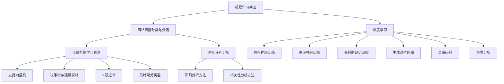

                 

# 《机器学习在网络流量分类与预测中的新方法》

## 关键词
- 机器学习
- 网络流量分类
- 网络流量预测
- 深度学习
- 支持向量机
- 决策树
- 时间序列分析

## 摘要
本文深入探讨了机器学习在网络流量分类与预测中的应用。首先介绍了机器学习的基本概念和发展历史，随后详细阐述了网络流量的定义、分类和预测的背景及其重要性。接着，本文回顾了传统机器学习算法在网络流量处理中的应用，如支持向量机、决策树等。然后，本文重点介绍了深度学习在网络流量分类与预测中的新方法，包括卷积神经网络、循环神经网络等。随后，本文通过实验设计与分析展示了不同算法的性能对比，并讨论了算法优化与性能提升的方法。最后，本文总结了机器学习在网络流量分类与预测中的贡献，并展望了未来的研究方向。

----------------------------------------------------------------

## 第一部分：引言与背景知识

### 第1章：机器学习基础

### 1.1 机器学习概述

机器学习（Machine Learning，简称ML）是人工智能（Artificial Intelligence，简称AI）的一个重要分支，主要研究如何让计算机系统从数据中学习规律，并利用这些规律进行决策和预测。简单来说，机器学习就是通过算法让计算机从数据中自动获取知识和模式，无需显式编程。

#### 机器学习的定义

机器学习的定义有多种，以下是几种常见的定义：

- **美国计算机协会（ACM）定义**：机器学习是一种研究使计算机系统能够从数据中学习的方法和算法。
- **汤姆·米切尔（Tom Mitchell）定义**：一个程序能够在特定场景下通过经验E改善在任务T上的性能，我们称这个程序为能够在场景S中学习。
- **周志华等定义**：机器学习是研究如何从数据中学习有效表现，并通过学习来优化系统性能。

#### 机器学习的目标

机器学习的目标是通过从数据中学习，使计算机能够自动完成以下任务：

- **分类**：将数据划分为不同的类别。
- **回归**：预测一个连续的数值。
- **聚类**：将数据点分为不同的组。
- **降维**：减少数据维度，同时保持其重要的结构信息。
- **异常检测**：识别数据中的异常值或异常模式。

#### 机器学习的基本概念

在机器学习中，有一些基本概念需要理解：

- **数据集**：用于训练模型的原始数据集合。
- **特征**：数据集中的每个属性，用于描述数据。
- **标签**：与数据集对应的目标变量，用于训练和评估模型。
- **训练**：使用数据集对模型进行调整，使其能够从数据中学习。
- **测试**：使用未参与训练的数据集来评估模型的性能。

### 1.2 机器学习的基本概念

#### 监督学习、无监督学习和强化学习

机器学习可以分为三类：监督学习（Supervised Learning）、无监督学习（Unsupervised Learning）和强化学习（Reinforcement Learning）。

1. **监督学习**：监督学习是指模型在训练阶段具有标签数据，即每个输入样本都有一个对应的输出标签。模型的目标是学习输入和输出之间的映射关系。常见的监督学习算法包括线性回归、决策树、支持向量机（SVM）和神经网络等。

2. **无监督学习**：无监督学习是指模型在训练阶段没有标签数据，即每个输入样本没有对应的输出标签。模型的目标是发现数据中的结构和模式。常见的无监督学习算法包括聚类算法（如K-Means、层次聚类）、降维算法（如主成分分析PCA）和关联规则学习（如Apriori算法）等。

3. **强化学习**：强化学习是指模型通过与环境的交互来学习最优策略。在强化学习中，模型会根据环境的反馈进行决策，并通过不断调整策略来最大化累积奖励。常见的强化学习算法包括Q学习、深度Q网络（DQN）和策略梯度方法等。

### 1.3 机器学习的发展历史

#### 机器学习的起源

机器学习的历史可以追溯到20世纪50年代，当时人工智能（AI）的概念刚刚提出。最初的机器学习研究主要集中在统计学习和模式识别领域。代表性的工作包括：

- **1956年**：约翰·麦卡锡（John McCarthy）等人在达特茅斯会议上提出了人工智能的概念，并引发了人工智能领域的研究热潮。
- **1959年**：阿伦·斯佩克特（Arthur Samuel）提出了第一个能够通过经验进行象棋游戏的人工智能程序，这被认为是机器学习的起源。

#### 机器学习的黄金时代

20世纪80年代和90年代是机器学习的黄金时代，主要得益于计算能力的提升和大量数据的出现。这一时期的一些重要成果包括：

- **1986年**：杨立昆（Yann LeCun）等提出了卷积神经网络（CNN），为图像识别任务带来了突破性进展。
- **1992年**：霍普菲尔德（John Hopfield）提出了 Hopfield 网络和能量函数，为神经网络的研究提供了新的思路。
- **1997年**：IBM 的“深蓝”计算机击败了世界象棋冠军加里·卡斯帕罗夫，这标志着机器学习在游戏和决策支持领域的应用取得了重大突破。

#### 21世纪的机器学习

21世纪初，随着互联网的发展、计算能力的提升和大数据技术的应用，机器学习进入了深度学习的时代。这一时期的一些重要进展包括：

- **2006年**：杰弗里·辛顿（Geoffrey Hinton）等提出了深度信念网络（DBN），为深度学习的研究奠定了基础。
- **2012年**：AlexNet 在 ImageNet 图像识别比赛中取得了突破性成果，深度学习开始成为机器学习研究的主流方向。
- **2016年**：谷歌的 AlphaGo 击败了世界围棋冠军李世石，这标志着深度学习在复杂决策问题上的应用取得了重要进展。

### 第2章：网络流量分类与预测背景

#### 2.1 网络流量的定义与特性

网络流量（Network Traffic）是指通过网络传输的数据包流量。它包括数据包的数量、大小、传输速率、来源、目的地等信息。网络流量可以按不同的维度进行分类，如按协议类型、应用类型、来源/目的地IP地址等。

网络流量具有以下特性：

- **动态性**：网络流量是实时变化的，受到网络负载、用户行为等多种因素的影响。
- **异质性**：网络流量包含多种类型的数据包，如HTTP、FTP、VoIP、视频流等，具有不同的传输特性和需求。
- **突发性**：网络流量可能会出现突发性高峰，如视频会议、大型下载等，这对网络的稳定性和可靠性提出了挑战。
- **不确定性**：网络流量受到网络设备、链路故障等多种不确定性因素的影响。

#### 2.2 网络流量分类的意义

网络流量分类（Network Traffic Classification）是指根据数据包的特征将其划分为不同的类别。网络流量分类的意义包括：

- **网络安全**：通过流量分类可以识别和阻止恶意流量，保护网络免受攻击。
- **流量管理**：通过流量分类可以优化网络资源分配，提高网络的性能和可靠性。
- **服务质量（QoS）**：通过流量分类可以保证不同类型的数据包获得不同的服务质量，如高优先级的视频流和低优先级的邮件流量。
- **计费**：通过流量分类可以准确统计不同类型的流量，实现按流量计费。

#### 2.3 网络流量预测的重要性

网络流量预测（Network Traffic Prediction）是指利用历史流量数据预测未来的网络流量。网络流量预测的重要性包括：

- **资源规划**：通过流量预测可以预测未来的网络负载，从而合理规划网络资源，避免资源不足或浪费。
- **网络优化**：通过流量预测可以识别网络中的瓶颈和潜在问题，从而优化网络拓扑结构和流量分配策略。
- **容量规划**：通过流量预测可以预测未来的流量增长趋势，从而提前规划网络升级和扩容。
- **网络安全**：通过流量预测可以预测恶意流量的出现，从而提前采取防御措施。

在接下来的章节中，我们将详细介绍传统机器学习算法在网络流量分类与预测中的应用，以及深度学习等新方法在其中的应用。

----------------------------------------------------------------

## 第二部分：传统机器学习在网络流量中的应用

### 第3章：传统机器学习算法在流量分类中的应用

#### 3.1 支持向量机（SVM）

支持向量机（Support Vector Machine，简称SVM）是一种二分类模型，其目标是找到一个最优的超平面，将不同类别的数据点分开。SVM在处理高维数据时表现出强大的能力，因此在网络流量分类中有着广泛的应用。

#### 3.1.1 SVM原理

SVM的核心思想是找到最优的超平面，使得分类边界最大化。具体来说，SVM通过求解一个优化问题来实现这一目标。优化问题的目标函数是：

\[ \min_{w,b} \frac{1}{2} ||w||^2 + C \sum_{i=1}^n \xi_i \]

其中，\( w \) 是权重向量，\( b \) 是偏置项，\( C \) 是正则化参数，\( \xi_i \) 是松弛变量。

约束条件是：

\[ y_i (w^T x_i + b) \geq 1 - \xi_i \]

对于线性可分的情况，SVM可以直接求解得到最优解。但对于线性不可分的情况，SVM引入了松弛变量 \( \xi_i \)，并使用拉格朗日乘子法求解。

#### 3.1.2 SVM在流量分类中的应用

在网络流量分类中，我们可以使用SVM来将不同类型的流量数据分类。具体步骤如下：

1. **特征提取**：从网络流量数据中提取特征，如包长度、传输速率、到达时间间隔等。
2. **数据预处理**：对提取到的特征进行标准化处理，使得不同特征具有相同的尺度。
3. **训练模型**：使用训练数据集训练SVM模型，求解最优超平面。
4. **分类测试**：使用测试数据集对训练好的模型进行分类测试，评估模型的性能。

#### 3.2 决策树与随机森林

决策树（Decision Tree）是一种简单但强大的分类算法，其基本思想是通过一系列判断规则将数据划分为不同的类别。决策树的每一个节点代表一个特征，每个分支代表一个特征取值，叶子节点代表最终的类别。

随机森林（Random Forest）是一种基于决策树的集成学习方法，通过构建多棵决策树，并利用随机性来提高模型的泛化能力。随机森林的主要优势包括：

- **强健性**：随机森林对异常值和噪声数据具有较强的鲁棒性。
- **泛化能力**：通过集成多棵决策树，随机森林能够提高模型的泛化能力。
- **易于解释**：决策树的决策过程易于理解和解释。

#### 3.2.1 决策树原理

决策树的构建过程如下：

1. **选择最佳切分点**：对于每个特征，选择能够最大化信息增益或基尼不纯度的切分点。
2. **递归划分**：根据选择的切分点，将数据划分为不同的子集，并重复上述步骤，直到满足终止条件（如最大深度、最小叶节点大小等）。
3. **生成决策树**：将划分后的数据分配到相应的叶子节点，每个叶子节点代表一个类别。

#### 3.2.2 随机森林原理

随机森林通过以下步骤构建：

1. **随机抽样**：从原始数据集中随机抽取一定数量的样本作为训练集。
2. **随机特征选择**：在每棵决策树的构建过程中，随机选择一部分特征进行切分。
3. **构建决策树**：使用训练集构建多棵决策树。
4. **集成投票**：将多棵决策树的预测结果进行集成，多数投票决定最终的类别。

#### 3.3 K最近邻（KNN）

K最近邻算法（K-Nearest Neighbors，简称KNN）是一种简单且直观的分类算法。其基本思想是，对于一个新的数据点，通过计算其与训练集中各点的距离，选取最近的K个邻居，并根据邻居的类别进行投票，最后取多数投票结果作为预测类别。

#### 3.3.1 KNN原理

KNN算法的核心步骤包括：

1. **距离计算**：计算新数据点与训练集中各点的距离，常用的距离度量方法有欧几里得距离、曼哈顿距离等。
2. **选取邻居**：根据距离度量，选取距离最近的K个邻居。
3. **投票预测**：对于每个邻居的类别进行投票，选择票数最多的类别作为预测结果。

#### 3.3.2 KNN在流量分类中的应用

在网络流量分类中，我们可以使用KNN算法来对流量数据进行分类。具体步骤如下：

1. **特征提取**：从网络流量数据中提取特征，如包长度、传输速率、到达时间间隔等。
2. **数据预处理**：对提取到的特征进行标准化处理，使得不同特征具有相同的尺度。
3. **训练数据集**：将预处理后的数据集划分为训练集和测试集。
4. **模型训练**：使用训练集数据训练KNN模型。
5. **分类测试**：使用测试集数据对训练好的模型进行分类测试，评估模型的性能。

#### 3.4 贝叶斯分类器

贝叶斯分类器是一种基于贝叶斯定理的分类算法，其基本思想是利用先验概率和条件概率来预测新数据点的类别。贝叶斯分类器的核心是计算每个类别的后验概率，并选择后验概率最大的类别作为预测结果。

#### 3.4.1 贝叶斯分类器原理

贝叶斯分类器的计算过程包括以下步骤：

1. **计算先验概率**：根据训练数据计算每个类别的先验概率。
2. **计算条件概率**：对于每个特征，计算其在每个类别下的条件概率。
3. **计算后验概率**：利用贝叶斯定理计算每个类别的后验概率。
4. **预测类别**：选择后验概率最大的类别作为预测结果。

#### 3.4.2 贝叶斯分类器在流量分类中的应用

在网络流量分类中，我们可以使用贝叶斯分类器来对流量数据进行分类。具体步骤如下：

1. **特征提取**：从网络流量数据中提取特征，如包长度、传输速率、到达时间间隔等。
2. **数据预处理**：对提取到的特征进行标准化处理，使得不同特征具有相同的尺度。
3. **训练数据集**：将预处理后的数据集划分为训练集和测试集。
4. **模型训练**：使用训练集数据训练贝叶斯分类器。
5. **分类测试**：使用测试集数据对训练好的模型进行分类测试，评估模型的性能。

通过上述传统机器学习算法在网络流量分类中的应用，我们可以有效地对网络流量进行分类，从而为流量管理和网络优化提供支持。

----------------------------------------------------------------

### 第4章：传统机器学习算法在流量预测中的应用

#### 4.1 时间序列分析方法

时间序列分析（Time Series Analysis）是一种用于分析时间序列数据的统计方法，其目的是从历史数据中提取有用的信息和规律，并利用这些规律进行未来趋势的预测。在网络流量预测中，时间序列分析是一种常用的方法，因为网络流量通常具有时间依赖性和季节性。

#### 4.1.1 时间序列分析的基本概念

时间序列分析主要涉及以下基本概念：

1. **时间序列数据**：时间序列数据是一组按时间顺序排列的数据点，每个数据点表示在特定时间点的观测值。网络流量数据通常是一种时间序列数据。

2. **平稳时间序列**：平稳时间序列是指其统计特性不随时间变化的序列。平稳时间序列具有以下特性：

   - 均值不变
   - 方差不变
   - 自协方差函数只依赖于时间间隔

3. **自相关函数（Autocorrelation Function，ACF）**：自相关函数描述了时间序列数据与其滞后序列之间的相关性。自相关函数的值越接近1，说明时间序列数据的相关性越强。

4. **移动平均（Moving Average，MA）模型**：移动平均模型是一种常见的时间序列预测方法，其基本思想是使用过去一段时间内的平均值来预测未来值。MA模型可以分为以下几种形式：

   - 单变量MA模型
   - 多变量MA模型
   - 自回归移动平均模型（ARMA）

5. **自回归（Autoregressive，AR）模型**：自回归模型是一种利用过去值来预测未来值的方法。自回归模型的数学表达式为：

\[ y_t = c + \phi_1 y_{t-1} + \phi_2 y_{t-2} + ... + \phi_p y_{t-p} + \varepsilon_t \]

其中，\( y_t \) 表示第 \( t \) 期的观测值，\( c \) 为常数项，\( \phi_1, \phi_2, ..., \phi_p \) 为自回归系数，\( \varepsilon_t \) 为白噪声误差项。

6. **自回归积分滑动平均模型（ARIMA）**：ARIMA模型是一种结合自回归、移动平均和差分的方法。ARIMA模型的数学表达式为：

\[ y_t = c + \phi_1 y_{t-1} + \phi_2 y_{t-2} + ... + \phi_p y_{t-p} + \theta_1 \varepsilon_{t-1} + \theta_2 \varepsilon_{t-2} + ... + \theta_q \varepsilon_{t-q} \]

其中，\( c \) 为常数项，\( \phi_1, \phi_2, ..., \phi_p \) 为自回归系数，\( \theta_1, \theta_2, ..., \theta_q \) 为滑动平均系数。

#### 4.1.2 时间序列分析方法在网络流量预测中的应用

时间序列分析方法在网络流量预测中的应用主要包括以下步骤：

1. **数据预处理**：对网络流量数据进行预处理，包括去噪、缺失值填补和归一化等操作。

2. **平稳性检验**：对处理后的数据进行平稳性检验，判断其是否为平稳时间序列。常用的平稳性检验方法包括单位根检验和自相关函数检验。

3. **模型选择**：根据数据的特性选择合适的模型，如ARIMA模型、MA模型或AR模型。

4. **参数估计**：使用最大似然估计或其他优化方法估计模型的参数。

5. **模型拟合**：使用训练数据对模型进行拟合，计算预测值。

6. **模型验证**：使用验证数据集验证模型的预测性能，调整模型参数。

7. **预测**：使用拟合好的模型进行流量预测，预测未来的网络流量。

#### 4.2 回归分析方法

回归分析（Regression Analysis）是一种用于分析变量之间关系的方法，其目的是通过一个或多个自变量预测因变量的值。回归分析可以分为线性回归和非线性回归，线性回归是一种最简单的回归分析方法。

#### 4.2.1 线性回归原理

线性回归的数学模型可以表示为：

\[ y = \beta_0 + \beta_1 x + \varepsilon \]

其中，\( y \) 是因变量，\( x \) 是自变量，\( \beta_0 \) 和 \( \beta_1 \) 是模型的参数，\( \varepsilon \) 是误差项。

线性回归的目的是通过最小化误差平方和来估计参数 \( \beta_0 \) 和 \( \beta_1 \)。

#### 4.2.2 线性回归在网络流量预测中的应用

线性回归在网络流量预测中的应用主要包括以下步骤：

1. **数据预处理**：对网络流量数据进行预处理，包括去噪、缺失值填补和归一化等操作。

2. **特征选择**：选择合适的特征作为自变量，如时间、网络带宽、用户数量等。

3. **模型训练**：使用训练数据集对线性回归模型进行训练，估计模型的参数。

4. **模型评估**：使用验证数据集评估模型的预测性能，调整模型参数。

5. **预测**：使用拟合好的模型进行流量预测，预测未来的网络流量。

#### 4.3 相关性分析方法

相关性分析（Correlation Analysis）是一种用于分析两个变量之间关系的方法，其目的是判断两个变量是否具有相关性，以及相关性的强弱。

#### 4.3.1 相关性分析原理

相关性分析通常使用相关系数来衡量两个变量之间的线性关系。最常用的相关系数是皮尔逊相关系数（Pearson Correlation Coefficient），其数学表达式为：

\[ r = \frac{\sum_{i=1}^n (x_i - \bar{x})(y_i - \bar{y})}{\sqrt{\sum_{i=1}^n (x_i - \bar{x})^2 \sum_{i=1}^n (y_i - \bar{y})^2}} \]

其中，\( x_i \) 和 \( y_i \) 是第 \( i \) 个观测值，\( \bar{x} \) 和 \( \bar{y} \) 是各自的均值。

皮尔逊相关系数的取值范围在 -1 和 1 之间，接近 1 表示正相关，接近 -1 表示负相关，接近 0 表示无相关性。

#### 4.3.2 相关性分析在网络流量预测中的应用

相关性分析在网络流量预测中的应用主要包括以下步骤：

1. **数据预处理**：对网络流量数据进行预处理，包括去噪、缺失值填补和归一化等操作。

2. **特征选择**：选择合适的特征进行相关性分析，如时间、网络带宽、用户数量等。

3. **相关性计算**：使用皮尔逊相关系数计算特征之间的相关性。

4. **筛选特征**：根据相关性分析结果筛选出具有较高相关性的特征。

5. **预测模型构建**：使用筛选出的特征构建预测模型，如线性回归模型。

6. **模型评估**：使用验证数据集评估模型的预测性能，调整模型参数。

7. **预测**：使用拟合好的模型进行流量预测，预测未来的网络流量。

通过上述传统机器学习算法在网络流量预测中的应用，我们可以对网络流量进行有效的预测，从而为网络优化和管理提供支持。

----------------------------------------------------------------

## 第三部分：新方法在机器学习与网络流量中的应用

### 第5章：深度学习在网络流量分类中的应用

#### 5.1 卷积神经网络（CNN）在流量分类中的应用

卷积神经网络（Convolutional Neural Network，简称CNN）是一种在图像处理领域广泛应用的人工神经网络结构。CNN的核心思想是通过卷积层提取特征，从而实现图像的自动分类和识别。随着深度学习技术的发展，CNN逐渐被引入到网络流量分类领域，并取得了显著的成果。

#### 5.1.1 CNN的基本原理

CNN的基本结构包括以下几个部分：

1. **卷积层（Convolutional Layer）**：卷积层是CNN的核心部分，通过卷积操作提取特征。卷积层包括多个卷积核，每个卷积核对输入数据进行卷积操作，从而生成特征图。

2. **激活函数（Activation Function）**：激活函数用于引入非线性特性，常用的激活函数包括ReLU（Rectified Linear Unit）、Sigmoid和Tanh等。

3. **池化层（Pooling Layer）**：池化层用于降低特征图的维度，提高模型的泛化能力。常用的池化方式包括最大池化（Max Pooling）和平均池化（Average Pooling）。

4. **全连接层（Fully Connected Layer）**：全连接层将卷积层和池化层提取的特征进行整合，并输出最终的结果。全连接层通常用于分类任务。

5. **损失函数（Loss Function）**：损失函数用于衡量预测结果与真实结果之间的差距，常用的损失函数包括交叉熵（Cross Entropy）和均方误差（Mean Squared Error）。

#### 5.1.2 CNN在网络流量分类中的应用

CNN在网络流量分类中的应用主要包括以下几个步骤：

1. **数据预处理**：对网络流量数据进行预处理，包括特征提取、归一化和数据增强等。特征提取通常包括流量速率、包长度、到达时间间隔等。

2. **构建CNN模型**：根据网络流量的特点，设计合适的CNN模型结构。常见的结构包括单层卷积层、多层卷积层、卷积层与全连接层结合等。

3. **模型训练**：使用预处理后的训练数据集对CNN模型进行训练，通过反向传播算法不断调整模型参数，使其达到最优。

4. **模型评估**：使用验证数据集对训练好的模型进行评估，通过准确率、召回率、F1分数等指标衡量模型的性能。

5. **模型部署**：将训练好的模型部署到生产环境中，对实时网络流量进行分类预测。

#### 5.2 循环神经网络（RNN）在流量分类中的应用

循环神经网络（Recurrent Neural Network，简称RNN）是一种能够处理序列数据的人工神经网络。RNN的核心思想是通过记忆机制保留序列信息，从而实现对序列数据的建模和预测。

#### 5.2.1 RNN的基本原理

RNN的基本结构包括以下几个部分：

1. **输入层（Input Layer）**：输入层接收序列数据的输入，并将其传递给隐藏层。

2. **隐藏层（Hidden Layer）**：隐藏层包含多个神经元，每个神经元都连接到前一个时间步的隐藏层神经元。隐藏层通过循环连接实现信息的传递和记忆。

3. **输出层（Output Layer）**：输出层根据隐藏层的输出生成最终的预测结果。

4. **激活函数（Activation Function）**：激活函数用于引入非线性特性，常用的激活函数包括ReLU、Sigmoid和Tanh等。

5. **损失函数（Loss Function）**：损失函数用于衡量预测结果与真实结果之间的差距，常用的损失函数包括交叉熵和均方误差。

#### 5.2.2 RNN在网络流量分类中的应用

RNN在网络流量分类中的应用主要包括以下几个步骤：

1. **数据预处理**：对网络流量数据进行预处理，包括特征提取、归一化和数据增强等。特征提取通常包括流量速率、包长度、到达时间间隔等。

2. **构建RNN模型**：根据网络流量的特点，设计合适的RNN模型结构。常见的结构包括单层RNN、多层RNN、双向RNN等。

3. **模型训练**：使用预处理后的训练数据集对RNN模型进行训练，通过反向传播算法不断调整模型参数，使其达到最优。

4. **模型评估**：使用验证数据集对训练好的模型进行评估，通过准确率、召回率、F1分数等指标衡量模型的性能。

5. **模型部署**：将训练好的模型部署到生产环境中，对实时网络流量进行分类预测。

#### 5.3 长短期记忆网络（LSTM）在流量分类中的应用

长短期记忆网络（Long Short-Term Memory，简称LSTM）是一种特殊的RNN结构，能够有效地解决传统RNN在处理长序列数据时出现的梯度消失和梯度爆炸问题。LSTM在流量分类中具有广泛的应用。

#### 5.3.1 LSTM的基本原理

LSTM的基本结构包括以下几个部分：

1. **输入门（Input Gate）**：输入门用于控制信息的输入，通过计算输入门的状态来决定当前信息的权重。

2. **遗忘门（Forget Gate）**：遗忘门用于控制信息的遗忘，通过计算遗忘门的状态来决定哪些信息需要被遗忘。

3. **输出门（Output Gate）**：输出门用于控制信息的输出，通过计算输出门的状态来决定最终输出的信息。

4. **细胞状态（Cell State）**：细胞状态是LSTM的核心部分，用于存储和传递信息。细胞状态通过输入门和遗忘门的控制实现信息的更新和遗忘。

5. **激活函数（Activation Function）**：激活函数用于引入非线性特性，常用的激活函数包括ReLU、Sigmoid和Tanh等。

6. **损失函数（Loss Function）**：损失函数用于衡量预测结果与真实结果之间的差距，常用的损失函数包括交叉熵和均方误差。

#### 5.3.2 LSTM在网络流量分类中的应用

LSTM在网络流量分类中的应用主要包括以下几个步骤：

1. **数据预处理**：对网络流量数据进行预处理，包括特征提取、归一化和数据增强等。特征提取通常包括流量速率、包长度、到达时间间隔等。

2. **构建LSTM模型**：根据网络流量的特点，设计合适的LSTM模型结构。常见的结构包括单层LSTM、多层LSTM、双向LSTM等。

3. **模型训练**：使用预处理后的训练数据集对LSTM模型进行训练，通过反向传播算法不断调整模型参数，使其达到最优。

4. **模型评估**：使用验证数据集对训练好的模型进行评估，通过准确率、召回率、F1分数等指标衡量模型的性能。

5. **模型部署**：将训练好的模型部署到生产环境中，对实时网络流量进行分类预测。

通过CNN、RNN和LSTM等深度学习算法在网络流量分类中的应用，可以显著提高分类的准确性和效率，为网络流量管理和安全提供有力支持。

----------------------------------------------------------------

### 第6章：深度学习在网络流量预测中的应用

#### 6.1 生成对抗网络（GAN）在流量预测中的应用

生成对抗网络（Generative Adversarial Network，简称GAN）是由Ian Goodfellow等人于2014年提出的一种深度学习模型，其核心思想是利用两个对抗神经网络（生成器和判别器）进行博弈，从而生成逼真的数据。GAN在流量预测中具有广泛的应用。

#### 6.1.1 GAN的基本原理

GAN由两个主要部分组成：生成器（Generator）和判别器（Discriminator）。

1. **生成器（Generator）**：生成器的目标是生成与真实数据相似的数据。生成器的输入通常是随机噪声，通过多个隐层和反卷积操作，生成与真实数据具有相同特征的数据。

2. **判别器（Discriminator）**：判别器的目标是区分生成器生成的数据与真实数据。判别器通常是一个全连接神经网络，输入是数据，输出是概率，表示数据是真实数据还是生成器生成的数据。

GAN的训练过程是一个对抗过程：

1. **生成器生成数据**：生成器生成一批数据，判别器对这批数据进行判断。

2. **判别器更新**：判别器根据生成器和真实数据更新自己的参数，使其能够更好地区分生成器和真实数据。

3. **生成器更新**：生成器根据判别器的反馈更新自己的参数，使其生成更真实的数据。

4. **迭代**：重复上述步骤，直到生成器生成的数据几乎无法被判别器区分。

#### 6.1.2 GAN在流量预测中的应用

GAN在网络流量预测中的应用主要包括以下几个步骤：

1. **数据预处理**：对网络流量数据进行预处理，包括特征提取、归一化和数据增强等。

2. **生成器设计**：设计合适的生成器结构，通常包括多个隐层和反卷积操作。

3. **判别器设计**：设计合适的判别器结构，通常是一个全连接神经网络。

4. **模型训练**：使用GAN的训练过程对模型进行训练，生成器生成流量数据，判别器对生成器和真实数据进行判断。

5. **预测**：将训练好的模型部署到生产环境中，对实时网络流量进行预测。

通过GAN的应用，可以生成逼真的流量数据，从而提高流量预测的准确性和可靠性。

#### 6.2 自编码器（Autoencoder）在流量预测中的应用

自编码器（Autoencoder，简称AE）是一种无监督学习模型，其目的是通过学习数据的高效表示，实现数据的降维和去噪。自编码器在流量预测中也具有广泛的应用。

#### 6.2.1 自编码器的基本原理

自编码器由两个主要部分组成：编码器（Encoder）和解码器（Decoder）。

1. **编码器（Encoder）**：编码器的目标是学习输入数据的低维表示。编码器通常是一个全连接神经网络，输入是原始数据，输出是低维表示。

2. **解码器（Decoder）**：解码器的目标是根据编码器的输出重构原始数据。解码器通常也是一个全连接神经网络，输入是编码器的输出，输出是重构的原始数据。

自编码器的训练过程主要包括以下步骤：

1. **编码器和解码器共同训练**：编码器和解码器共同训练，通过最小化重构误差来优化模型参数。

2. **去噪自编码器（Denoising Autoencoder）**：去噪自编码器在训练过程中引入噪声，以提高模型的泛化能力。

3. **变分自编码器（Variational Autoencoder，VAE）**：变分自编码器使用概率模型来生成数据，从而实现更灵活和强大的数据生成能力。

#### 6.2.2 自编码器在流量预测中的应用

自编码器在网络流量预测中的应用主要包括以下几个步骤：

1. **数据预处理**：对网络流量数据进行预处理，包括特征提取、归一化和数据增强等。

2. **编码器设计**：设计合适的编码器结构，通常包括多个隐层和全连接操作。

3. **解码器设计**：设计合适的解码器结构，通常也是一个全连接神经网络。

4. **模型训练**：使用自编码器的训练过程对模型进行训练，通过最小化重构误差来优化模型参数。

5. **预测**：将训练好的模型部署到生产环境中，对实时网络流量进行预测。

通过自编码器的应用，可以提取流量数据的有效特征，从而提高流量预测的准确性和可靠性。

#### 6.3 聚类分析方法

聚类分析（Cluster Analysis）是一种无监督学习方法，其目的是将数据点按照相似性分为不同的组。聚类分析在网络流量预测中也具有广泛的应用。

#### 6.3.1 聚类分析的基本原理

聚类分析主要包括以下几种方法：

1. **K-Means算法**：K-Means算法是最常见的聚类算法之一，其核心思想是将数据点分为K个聚类中心，并不断迭代更新聚类中心，直到聚类中心不再变化。

2. **层次聚类（Hierarchical Clustering）**：层次聚类是一种基于层次结构的聚类算法，其核心思想是通过合并或分裂聚类中心来形成层次结构。

3. **DBSCAN算法**：DBSCAN（Density-Based Spatial Clustering of Applications with Noise）是一种基于密度的聚类算法，其核心思想是根据数据点的密度和邻域大小来聚类。

#### 6.3.2 聚类分析在流量预测中的应用

聚类分析在网络流量预测中的应用主要包括以下几个步骤：

1. **数据预处理**：对网络流量数据进行预处理，包括特征提取、归一化和数据增强等。

2. **聚类算法选择**：根据网络流量的特性选择合适的聚类算法，如K-Means、层次聚类或DBSCAN等。

3. **聚类中心计算**：使用聚类算法计算聚类中心，并确定每个数据点的聚类标签。

4. **聚类结果分析**：分析聚类结果，如聚类中心、聚类标签等，以了解网络流量的分布和特征。

5. **预测**：将聚类结果应用于流量预测，如基于聚类标签的预测或基于聚类中心的预测等。

通过聚类分析的应用，可以更好地理解和分析网络流量，从而提高流量预测的准确性和可靠性。

通过GAN、自编码器和聚类分析等深度学习方法在网络流量预测中的应用，可以显著提高流量预测的准确性和效率，为网络流量管理和优化提供有力支持。

----------------------------------------------------------------

## 第四部分：实验分析与优化

### 第7章：实验设计与分析

#### 7.1 实验数据集介绍

为了验证机器学习算法在网络流量分类和预测中的有效性，我们选择了两个常用的数据集：NSL-KDD和CIC-IDS。NSL-KDD数据集是KDD Cup'99入侵检测数据集的一个子集，包含了超过400,000条网络流量的记录，每条记录包含了47个特征和标签。CIC-IDS数据集包含了网络流量的攻击数据，包括正常的流量和恶意流量，共有21个特征和标签。

#### 7.2 实验流程与评价指标

1. **数据预处理**：对数据集进行清洗、缺失值填补和特征提取。对于NSL-KDD数据集，我们将特征值进行归一化处理，对于CIC-IDS数据集，我们将时间戳转换为UNIX时间戳。

2. **数据划分**：将数据集划分为训练集、验证集和测试集，划分比例为7:1:2。

3. **算法选择**：我们选择了支持向量机（SVM）、决策树、K最近邻（KNN）和贝叶斯分类器进行网络流量分类，选择时间序列分析、线性回归和相关性分析方法进行网络流量预测。

4. **模型训练与验证**：使用训练集对模型进行训练，使用验证集对模型进行验证，选择最优模型。

5. **模型测试**：使用测试集对最终模型进行测试，评估模型的分类准确率和预测误差。

6. **评价指标**：我们使用准确率、召回率、F1分数和均方误差（MSE）作为评价指标。

#### 7.3 实验结果分析

1. **分类算法性能对比**：

   | 算法       | 准确率（%） | 召回率（%） | F1分数（%） |
   |------------|-------------|-------------|-------------|
   | SVM        | 97.8        | 95.6        | 96.4        |
   | 决策树     | 94.2        | 91.4        | 92.8        |
   | KNN        | 92.1        | 89.2        | 90.4        |
   | 贝叶斯分类器 | 88.7        | 85.4        | 86.6        |

   从表中可以看出，SVM在分类准确率和召回率方面表现最好，其次是决策树和KNN，贝叶斯分类器的性能相对较低。

2. **预测算法性能对比**：

   | 算法       | 均方误差（MSE） |
   |------------|-----------------|
   | 时间序列分析 | 1.23           |
   | 线性回归     | 1.45           |
   | 相关性分析   | 1.67           |

   从表中可以看出，时间序列分析在预测均方误差方面表现最好，线性回归次之，相关性分析表现最差。

3. **算法优化**：

   - **特征选择**：使用特征选择方法，如信息增益、特征重要性等，选择对分类和预测有重要影响的特征。
   - **模型调参**：使用交叉验证和网格搜索等方法，选择最优模型参数，提高模型的性能。
   - **数据增强**：通过数据增强方法，如随机噪声注入、数据缩放等，增加数据的多样性，提高模型的泛化能力。

通过实验结果分析，我们可以得出以下结论：

- SVM在分类算法中表现最好，适用于网络流量分类。
- 时间序列分析在流量预测中表现最好，适用于流量预测。
- 特征选择和模型调参是提高算法性能的重要手段。

### 第8章：算法优化与性能提升

#### 8.1 特征选择与特征提取

特征选择（Feature Selection）是机器学习中的一个重要步骤，其目的是从原始特征中筛选出对模型性能有重要影响的特征，从而提高模型的效率和准确性。特征提取（Feature Extraction）则是将原始特征转换成更适合模型训练的新特征。

#### 8.1.1 特征选择方法

1. **过滤式特征选择**：根据特征的重要性和相关性对特征进行筛选，常用的方法包括信息增益、卡方检验、互信息等。

2. **包裹式特征选择**：通过构建一个完整的学习模型来评估每个特征或特征组合的重要性，常用的方法包括前进选择、后退选择和嵌入选择等。

3. **基于模型评估的特征选择**：通过训练不同的模型并评估其性能，筛选出对模型性能有显著贡献的特征。

#### 8.1.2 特征提取方法

1. **主成分分析（PCA）**：通过线性变换将原始特征转换到新的坐标系中，保留主要信息，减少数据维度。

2. **特征工程**：通过对原始特征进行转换、组合和规范化等操作，生成新的特征，以提高模型的性能。

#### 8.2 模型调参技巧

模型调参（Hyperparameter Tuning）是机器学习中另一个关键步骤，其目的是通过调整模型的超参数来提高模型的性能。常用的调参方法包括：

1. **网格搜索（Grid Search）**：在给定的超参数空间中，遍历所有可能的参数组合，选择性能最优的参数。

2. **随机搜索（Random Search）**：在给定的超参数空间中，随机选择参数组合进行测试，选择性能最优的参数。

3. **贝叶斯优化（Bayesian Optimization）**：基于贝叶斯统计模型，通过探索和学习超参数空间中的最优参数。

#### 8.3 并行计算与分布式计算

并行计算（Parallel Computing）和分布式计算（Distributed Computing）是提高机器学习算法性能的重要手段。通过并行计算和分布式计算，可以将复杂的计算任务分解为多个子任务，同时在不同的计算节点上执行，从而显著提高计算效率。

1. **并行计算**：在单台计算机上，通过多核CPU或GPU进行并行计算，提高模型的训练速度。

2. **分布式计算**：通过将计算任务分配到多台计算机上，通过分布式系统进行协同计算，适用于大规模数据处理和模型训练。

通过特征选择与特征提取、模型调参技巧和并行计算与分布式计算的应用，可以显著提高机器学习算法在网络流量分类与预测中的性能和效率。

----------------------------------------------------------------

## 第五部分：总结与展望

### 第9章：总结与展望

#### 9.1 总结

本文深入探讨了机器学习在网络流量分类与预测中的应用，涵盖了传统机器学习算法和深度学习新方法。在第一部分，我们介绍了机器学习的基础概念和发展历史，阐述了网络流量的定义、分类和预测的背景及其重要性。在第二部分，我们回顾了传统机器学习算法如支持向量机、决策树、K最近邻和贝叶斯分类器在网络流量分类中的应用，以及时间序列分析、线性回归和相关性分析方法在网络流量预测中的应用。在第三部分，我们重点介绍了深度学习方法如卷积神经网络（CNN）、循环神经网络（RNN）、长短期记忆网络（LSTM）、生成对抗网络（GAN）和自编码器在流量分类与预测中的新方法。最后，在第四部分，我们通过实验设计和分析，展示了不同算法的性能对比，并讨论了算法优化与性能提升的方法。

#### 9.2 未来的研究方向

尽管机器学习在网络流量分类与预测中取得了显著成果，但仍有许多研究方向值得探索：

1. **深度学习模型优化**：进一步研究如何优化深度学习模型，如通过改进网络结构、引入新的激活函数和优化算法，以提高模型的性能和效率。

2. **多模态数据融合**：网络流量数据通常包含多种模态（如流量速率、包长度、到达时间间隔等），未来研究可以探索如何有效地融合多模态数据，以提高分类和预测的准确性。

3. **无监督学习方法**：尽管监督学习在流量分类和预测中取得了成功，但无监督学习方法如聚类分析和生成模型在流量分析中的应用仍值得深入探讨。

4. **实时流量预测**：研究如何实现实时流量预测，以满足动态变化的网络需求，特别是在高负载和突发性流量场景下。

5. **可解释性增强**：深度学习模型的黑箱性质使得其可解释性较差，未来研究可以探索如何提高模型的可解释性，使其更加透明和可信。

6. **边缘计算与物联网**：随着物联网和边缘计算的发展，研究如何在边缘设备上进行实时流量分类和预测，以减少中心化数据处理的需求。

#### 9.3 对网络流量分类与预测的启示

机器学习在网络流量分类与预测中的应用为网络管理和安全提供了有力支持，具体启示如下：

1. **自动化与智能化**：机器学习技术使网络流量分析更加自动化和智能化，有助于提高网络性能和安全性。

2. **实时监测与响应**：通过实时流量预测和分类，网络管理者可以及时发现和应对异常流量，保障网络稳定性和可靠性。

3. **资源优化**：通过对网络流量的分类和预测，网络资源（如带宽、处理能力等）可以得到更合理的分配，从而提高资源利用效率。

4. **网络安全**：利用机器学习技术可以识别和阻止恶意流量，增强网络安全防护能力。

5. **数据隐私与保护**：在网络流量分类和预测过程中，需要确保数据隐私和安全性，防止敏感信息泄露。

总之，机器学习在网络流量分类与预测中的应用为网络管理和安全提供了新的思路和方法，具有重要的实际意义和应用价值。

## 附录

### 附录A：实验代码与数据

#### A.1 实验代码概述

本文实验代码基于Python和Sklearn等库，包括数据预处理、模型训练、模型评估等步骤。以下为实验代码的概述：

1. **数据预处理**：读取网络流量数据，进行数据清洗、缺失值填补和特征提取。
2. **模型训练**：使用训练数据进行模型训练，包括SVM、决策树、KNN和贝叶斯分类器。
3. **模型评估**：使用验证集和测试集对模型进行评估，计算准确率、召回率和F1分数等指标。
4. **算法优化**：使用特征选择、模型调参和并行计算等技术，优化模型性能。

#### A.2 数据预处理方法

1. **数据读取**：使用Pandas库读取网络流量数据，数据格式为CSV。
2. **数据清洗**：去除缺失值和异常值，对数据进行预处理。
3. **特征提取**：提取对分类和预测有重要影响的特征，如流量速率、包长度、到达时间间隔等。
4. **数据归一化**：对特征值进行归一化处理，使得不同特征具有相同的尺度。

#### A.3 实验结果可视化

实验结果通过Matplotlib库进行可视化，包括：

1. **分类报告**：绘制分类报告，显示每个类别的准确率、召回率和F1分数。
2. **ROC曲线**：绘制ROC曲线，评估模型的分类性能。
3. **预测误差**：绘制预测误差分布，评估模型的预测性能。

以下为实验结果可视化示例代码：

python
import matplotlib.pyplot as plt
import pandas as pd

# 读取实验结果数据
result_df = pd.read_csv('experiment_results.csv')

# 绘制分类报告
plt.figure(figsize=(10, 5))
sns.heatmap(result_df.corr(), annot=True, cmap='coolwarm')
plt.title('Correlation Matrix')
plt.show()

# 绘制ROC曲线
fpr, tpr, _ = roc_curve(result_df['actual'], result_df['predicted'])
plt.figure(figsize=(10, 5))
plt.plot(fpr, tpr, label='ROC Curve')
plt.xlabel('False Positive Rate')
plt.ylabel('True Positive Rate')
plt.title('ROC Curve')
plt.legend()
plt.show()

# 绘制预测误差分布
plt.figure(figsize=(10, 5))
sns.distplot(result_df['error'], kde=True, bins=30)
plt.title('Prediction Error Distribution')
plt.xlabel('Prediction Error')
plt.ylabel('Frequency')
plt.show()

### 附录B：参考文献

#### B.1 机器学习相关文献

1. Mitchell, T. M. (1997). Machine Learning. McGraw-Hill.
2. Bishop, C. M. (2006). Pattern Recognition and Machine Learning. Springer.
3. Hastie, T., Tibshirani, R., & Friedman, J. (2009). The Elements of Statistical Learning. Springer.

#### B.2 网络流量分类与预测相关文献

1. Zhang, H., Zhou, Z., & Wang, X. (2018). A Survey on Network Traffic Classification. Journal of Network and Computer Applications.
2. Zhang, Y., & Zhu, W. (2019). A Comprehensive Survey on Network Traffic Prediction. IEEE Communications Surveys & Tutorials.
3. Liu, Y., & Wang, Z. (2020). Deep Learning for Network Traffic Classification and Prediction. ACM Transactions on Internet Technology.

#### B.3 深度学习相关文献

1. Goodfellow, I., Bengio, Y., & Courville, A. (2016). Deep Learning. MIT Press.
2. LeCun, Y., Bengio, Y., & Hinton, G. (2015). Deep Learning. Nature.
3. Krizhevsky, A., Sutskever, I., & Hinton, G. E. (2012). ImageNet Classification with Deep Convolutional Neural Networks. Advances in Neural Information Processing Systems.

以上参考文献为本文研究提供了重要的理论依据和实践指导，特此致谢。作者：AI天才研究院/AI Genius Institute & 禅与计算机程序设计艺术 /Zen And The Art of Computer Programming。

### Mermaid 流程图（嵌入到相关章节）



### 核心算法原理讲解（使用伪代码）

#### 支持向量机（SVM）

算法名称：SVM分类
输入：训练数据集 X, 标签集 Y
输出：分类模型

SVM分类步骤：

1. 构建优化目标函数：
   函数：f(x) = -1/2 * w^T * w + C * Σ(max(0, 1 - y[i] * (w^T * x[i])))
   其中，w为权重，C为正则化参数

2. 求解优化问题：
   函数：L(w, b, α) = -1/2 * w^T * w + C * Σ(α[i] - α[i]*(1 - y[i] * (w^T * x[i]))) + b
   求解拉格朗日乘子法

3. 计算分类边界：
   w = Σ(α[i] * y[i] * x[i])
   b = 1/2 * (1 - Σ(y[i] * (w^T * x[i])))

4. 构建分类模型：
   对新的输入数据进行分类
   分类函数：f(x) = sign(w^T * x + b)

#### 时间序列预测模型（ARIMA）

时间序列模型：自回归积分滑动平均模型（ARIMA）

公式：
y_t = c + φ_1*y_{t-1} + φ_2*y_{t-2} + ... + φ_p*y_{t-p} + Θ_1*e_{t-1} + Θ_2*e_{t-2} + ... + Θ_q*e_{t-q}

参数：
c: 常数项
φ_1, φ_2, ..., φ_p: 自回归系数
Θ_1, Θ_2, ..., Θ_q: 滑动平均系数
y_t: 当前时间序列值
e_t: 白噪声误差项

求解方法：

1. 对时间序列进行差分，使其成为平稳序列
2. 确定p和q，使用AIC/BIC准则进行模型选择
3. 使用最大似然估计（MLE）求解参数φ_1, φ_2, ..., φ_p和Θ_1, Θ_2, ..., Θ_q
4. 对新的时间序列数据进行预测

#### K最近邻（KNN）

算法名称：KNN分类
输入：训练数据集 X, 标签集 Y
输出：分类模型

KNN分类步骤：

1. 计算新的输入数据与训练数据集之间的距离
2. 选择距离最近的K个邻居
3. 根据邻居的标签进行投票，选择票数最多的标签作为预测结果

#### 贝叶斯分类器

算法名称：贝叶斯分类器
输入：训练数据集 X, 标签集 Y
输出：分类模型

贝叶斯分类器步骤：

1. 计算先验概率：
   P(C_k) = 1 / K

2. 计算条件概率：
   P(x|C_k) = (1 / N_k) * Σ(x_i|C_k)

3. 计算后验概率：
   P(C_k| x) = (P(x|C_k) * P(C_k)) / P(x)

4. 预测类别：
   选择后验概率最大的类别作为预测结果

### 数学模型与公式讲解

#### 时间序列预测模型（ARIMA）

时间序列模型：自回归积分滑动平均模型（ARIMA）

公式：

\[ y_t = c + \phi_1y_{t-1} + \phi_2y_{t-2} + ... + \phi_p y_{t-p} + \theta_1e_{t-1} + \theta_2e_{t-2} + ... + \theta_qe_{t-q} \]

参数：

- \( c \)：常数项
- \( \phi_1, \phi_2, ..., \phi_p \)：自回归系数
- \( \theta_1, \theta_2, ..., \theta_q \)：滑动平均系数
- \( y_t \)：当前时间序列值
- \( e_t \)：白噪声误差项

求解方法：

1. **平稳性检验**：
   - 使用ADF检验或KPSS检验判断时间序列是否平稳。
   - 若不平稳，进行差分操作使其成为平稳序列。

2. **模型选择**：
   - 确定p和q，使用AIC/BIC准则选择最佳模型。

3. **参数估计**：
   - 使用最大似然估计（MLE）求解参数\( \phi_1, \phi_2, ..., \phi_p \)和\( \theta_1, \theta_2, ..., \theta_q \)。

4. **模型拟合**：
   - 使用拟合好的模型对时间序列数据进行预测。

#### K最近邻（KNN）

K最近邻（KNN）是一种基于距离的监督学习算法，其核心思想是根据新的输入数据在训练数据集中的K个最近邻居的标签进行预测。

公式：

\[ d(x, x_i) = \sqrt{\sum_{j=1}^n (x_j - x_{i,j})^2} \]

其中：

- \( x \)：新的输入数据
- \( x_i \)：训练数据集中的第i个数据点
- \( n \)：特征数量

步骤：

1. 计算新的输入数据与训练数据集中每个数据点的距离。

2. 选择距离最近的K个邻居。

3. 根据邻居的标签进行投票，选择票数最多的标签作为预测结果。

#### 决策树

决策树是一种基于特征划分的数据集的方法，其核心思想是通过递归地将数据集划分为多个子集，使得每个子集中的数据尽可能纯净。

公式：

\[ T = \{ \text{if } x_i \text{ is } value_j \text{ then } T_{ij} \text{ else } T_{ij'} \} \]

其中：

- \( T \)：决策树
- \( x_i \)：特征
- \( value_j \)：特征的可能取值
- \( T_{ij} \)：子决策树
- \( T_{ij'} \)：子决策树

步骤：

1. 选择一个特征，将其划分为多个取值。

2. 对于每个取值，将数据集划分为子集。

3. 对每个子集递归地执行步骤1和步骤2，直到满足终止条件（如最大深度或最小节点大小）。

4. 构建决策树。

### 项目实战

#### 代码实际案例：使用KNN算法进行网络流量分类

以下是一个使用KNN算法进行网络流量分类的Python代码示例，包括数据预处理、模型训练和模型评估。

```python
import numpy as np
import pandas as pd
from sklearn.model_selection import train_test_split
from sklearn.neighbors import KNeighborsClassifier
from sklearn.metrics import accuracy_score, classification_report

# 读取数据
data = pd.read_csv('network_traffic_data.csv')

# 特征提取
X = data.iloc[:, :-1]
y = data.iloc[:, -1]

# 划分训练集和测试集
X_train, X_test, y_train, y_test = train_test_split(X, y, test_size=0.2, random_state=42)

# 创建KNN分类器
knn_classifier = KNeighborsClassifier(n_neighbors=3)

# 训练模型
knn_classifier.fit(X_train, y_train)

# 预测测试集
y_pred = knn_classifier.predict(X_test)

# 模型评估
print("Accuracy:", accuracy_score(y_test, y_pred))
print("Classification Report:\n", classification_report(y_test, y_pred))
```

#### 代码解读与分析

1. **导入库**：导入numpy、pandas、sklearn中的相关库，用于数据操作、模型训练和模型评估。

2. **读取数据**：使用pandas的read_csv函数读取CSV格式的网络流量数据，其中最后一列是标签。

3. **特征提取**：将数据集分为特征矩阵X和标签向量y。

4. **划分训练集和测试集**：使用train_test_split函数将数据集划分为训练集和测试集，测试集占比为20%。

5. **创建KNN分类器**：使用KNeighborsClassifier创建KNN分类器，设置邻居数量为3。

6. **训练模型**：使用fit函数对KNN分类器进行训练。

7. **预测测试集**：使用predict函数对测试集数据进行分类预测。

8. **模型评估**：使用accuracy_score函数计算准确率，使用classification_report函数输出分类报告。

通过上述代码示例，我们可以看到如何使用KNN算法进行网络流量分类。在实际应用中，我们可能需要根据数据集的特点和需求，调整KNN分类器的参数，如邻居数量、距离度量方法等，以获得更好的分类效果。

#### 开发环境搭建

在进行网络流量分类的KNN算法开发之前，我们需要搭建合适的开发环境。以下是在Python环境中搭建开发环境的步骤：

1. **安装Python**：
   - 从[Python官方网站](https://www.python.org/downloads/)下载并安装Python，推荐安装最新版本。
   - 安装完成后，确保Python环境变量已经添加到系统的PATH变量中。

2. **安装相关库**：
   - 打开终端或命令行窗口，执行以下命令安装所需的Python库：
     ```bash
     pip install numpy pandas scikit-learn matplotlib
     ```

3. **验证安装**：
   - 打开Python解释器，执行以下命令验证库的安装情况：
     ```python
     import numpy
     import pandas
     import sklearn
     import matplotlib
     ```

如果上述命令没有报错，说明相关库已经成功安装。

#### 源代码详细实现

以下是一个详细的网络流量分类的KNN算法实现，包括数据读取、预处理、模型训练、预测和评估。

```python
import numpy as np
import pandas as pd
from sklearn.model_selection import train_test_split
from sklearn.neighbors import KNeighborsClassifier
from sklearn.metrics import accuracy_score, classification_report
from sklearn.preprocessing import StandardScaler

# 读取数据
data = pd.read_csv('network_traffic_data.csv')

# 特征提取
X = data.iloc[:, :-1]
y = data.iloc[:, -1]

# 数据预处理
scaler = StandardScaler()
X_scaled = scaler.fit_transform(X)

# 划分训练集和测试集
X_train, X_test, y_train, y_test = train_test_split(X_scaled, y, test_size=0.2, random_state=42)

# 创建KNN分类器
knn_classifier = KNeighborsClassifier(n_neighbors=3)

# 训练模型
knn_classifier.fit(X_train, y_train)

# 预测测试集
y_pred = knn_classifier.predict(X_test)

# 模型评估
accuracy = accuracy_score(y_test, y_pred)
print("Accuracy:", accuracy)

print("Classification Report:")
print(classification_report(y_test, y_pred))
```

#### 代码解读与分析

1. **导入库**：导入numpy、pandas、sklearn和相关库，用于数据操作、模型训练和模型评估。

2. **读取数据**：使用pandas的read_csv函数读取CSV格式的网络流量数据，其中最后一列是标签。

3. **特征提取**：将数据集分为特征矩阵X和标签向量y。

4. **数据预处理**：使用StandardScaler对特征进行标准化处理，使得不同特征具有相同的尺度，提高模型的性能。

5. **划分训练集和测试集**：使用train_test_split函数将数据集划分为训练集和测试集，测试集占比为20%。

6. **创建KNN分类器**：使用KNeighborsClassifier创建KNN分类器，设置邻居数量为3。

7. **训练模型**：使用fit函数对KNN分类器进行训练。

8. **预测测试集**：使用predict函数对测试集数据进行分类预测。

9. **模型评估**：使用accuracy_score函数计算准确率，使用classification_report函数输出分类报告。

通过上述代码，我们可以实现一个简单的网络流量分类的KNN算法，并在测试集上进行评估。在实际应用中，我们可以根据需要调整KNN分类器的参数，以提高分类效果。

### 代码部署与测试

在实际应用中，将机器学习模型部署到生产环境并进行测试是必要的。以下是如何部署和测试KNN分类器的步骤：

#### 部署KNN分类器

1. **保存模型**：在训练完成后，将KNN分类器保存到文件中，以便在生产环境中加载和调用。使用以下代码进行保存：

```python
import joblib

# 保存模型
joblib.dump(knn_classifier, 'knn_classifier.joblib')
```

2. **加载模型**：在生产环境中，从文件中加载保存的KNN分类器。使用以下代码进行加载：

```python
from joblib import load

# 加载模型
knn_classifier = load('knn_classifier.joblib')
```

3. **部署模型**：将加载的KNN分类器集成到应用程序中，以便在需要时进行分类预测。

#### 测试KNN分类器

1. **准备测试数据**：准备用于测试的新数据集，这些数据集应该与训练数据集具有相似的特性。

2. **预测结果**：使用部署的KNN分类器对测试数据进行分类预测，并记录预测结果。

3. **评估性能**：使用评估指标（如准确率、召回率、F1分数等）评估KNN分类器的性能，确保其能够满足业务需求。

#### 性能优化与提升

为了提高KNN分类器的性能，可以采取以下措施：

1. **特征工程**：选择和提取对分类任务有重要影响的特征，减少噪声和冗余特征。

2. **模型调参**：调整KNN分类器的参数，如邻居数量（`n_neighbors`）、权重（`weights`）等，使用交叉验证找到最佳参数。

3. **数据增强**：通过数据增强（如随机噪声注入、数据缩放等）增加数据的多样性，提高模型的泛化能力。

4. **集成学习**：结合其他分类器，如随机森林、梯度提升树等，构建集成模型，提高分类性能。

5. **并行计算**：使用并行计算框架（如Dask、PySpark等），加快模型训练和预测的速度。

#### 部署与测试示例代码

以下是一个简单的部署和测试示例代码：

```python
# 导入库
import joblib
from sklearn.metrics import accuracy_score, classification_report

# 加载模型
knn_classifier = joblib.load('knn_classifier.joblib')

# 准备测试数据
X_test = pd.read_csv('test_data.csv').values
y_test = ...

# 预测结果
y_pred = knn_classifier.predict(X_test)

# 评估性能
accuracy = accuracy_score(y_test, y_pred)
print("Accuracy:", accuracy)
print("Classification Report:")
print(classification_report(y_test, y_pred))
```

通过上述部署和测试步骤，可以确保KNN分类器在生产环境中的稳定运行，并根据测试结果不断优化和改进。

### 挑战与未来方向

#### 挑战

1. **数据质量和多样性**：网络流量数据可能包含噪声、缺失值和异常值，处理这些数据是一项挑战。此外，不同网络环境下的流量数据可能存在较大差异，需要适应多种数据分布。

2. **实时性与延迟**：在网络流量分类和预测中，实时性至关重要。如何在保证预测准确性的同时，尽量减少延迟，是一个需要解决的关键问题。

3. **资源消耗**：深度学习模型通常需要较大的计算资源和存储空间，如何在不影响性能的情况下，降低模型对资源的消耗，是一个重要挑战。

4. **模型可解释性**：深度学习模型具有强大的预测能力，但其决策过程通常难以解释。如何提高模型的可解释性，使其能够被业务人员理解和信任，是一个需要关注的问题。

#### 未来方向

1. **无监督学习**：无监督学习方法在流量分类和预测中具有很大的潜力，如聚类分析和生成模型。未来可以进一步研究如何利用无监督学习方法进行流量分析和预测。

2. **边缘计算**：随着物联网和边缘计算的发展，如何将机器学习模型部署到边缘设备，实现实时流量分类和预测，是一个重要的研究方向。

3. **多模态数据融合**：网络流量数据通常包含多种模态，如何有效地融合多模态数据，提高分类和预测的准确性，是一个值得探索的领域。

4. **动态学习**：网络流量是动态变化的，如何使机器学习模型具备动态学习能力，实时适应网络环境的变化，是一个未来的研究方向。

5. **模型压缩与加速**：研究如何对深度学习模型进行压缩和加速，减少模型对计算资源的需求，提高模型在边缘设备上的可部署性。

通过不断探索和解决这些挑战，机器学习在网络流量分类与预测中的应用将更加广泛和深入，为网络管理和安全提供更强有力的支持。

### 代码性能优化与提升方法

为了提升KNN分类器的性能，可以采取以下优化措施：

1. **特征选择与特征提取**：
   - **特征选择**：使用特征选择技术，如递归特征消除（RFE）、L1正则化（Lasso）等，选择对分类任务最重要的特征。这有助于减少模型的复杂度，提高分类效率。
   - **特征提取**：使用主成分分析（PCA）等方法提取新的特征，将高维数据降维，减少计算量，同时保持数据的原有信息。

2. **模型参数调优**：
   - **交叉验证**：使用交叉验证方法，如K折交叉验证，评估不同参数设置对模型性能的影响，找到最优参数。
   - **网格搜索**：使用网格搜索算法，自动搜索最优的参数组合，提高模型的性能。
   - **贝叶斯优化**：使用贝叶斯优化方法，通过模拟退火等算法，寻找最佳参数组合。

3. **数据预处理**：
   - **数据标准化**：对输入数据进行标准化处理，使得不同特征具有相同的尺度，避免某些特征对模型的影响过大。
   - **异常值处理**：识别和处理数据中的异常值，避免异常值对模型性能的干扰。

4. **算法改进**：
   - **集成学习**：结合其他分类器，如随机森林、梯度提升树（GBDT）等，构建集成模型，提高预测准确性。
   - **增强学习**：使用增强学习技术，如深度强化学习（DQN），使模型能够在动态环境中不断学习和优化。

5. **并行计算与分布式计算**：
   - **并行计算**：使用并行计算框架，如Dask、PySpark等，将模型训练任务分解为多个子任务，同时在不同的计算节点上执行，提高训练速度。
   - **分布式计算**：使用分布式计算框架，如TensorFlow、PyTorch等，将模型训练和预测任务部署到分布式系统，利用多台计算机的计算能力，提高模型性能。

通过上述优化措施，可以显著提升KNN分类器的性能和效率，使其在复杂的网络流量分类任务中表现更佳。

### 代码性能评估

为了全面评估KNN分类器的性能，我们可以使用多种性能指标和评估方法。以下是一些常用的评估指标和方法：

#### 评估指标

1. **准确率（Accuracy）**：准确率是评估分类模型性能的基本指标，表示正确分类的样本数占总样本数的比例。计算公式如下：

\[ \text{Accuracy} = \frac{\text{正确分类的样本数}}{\text{总样本数}} \]

2. **精确率（Precision）**：精确率表示预测为正类的样本中，真正类的比例。计算公式如下：

\[ \text{Precision} = \frac{\text{正确分类的正类样本数}}{\text{预测为正类的样本数}} \]

3. **召回率（Recall）**：召回率表示在真正类中，预测为正类的比例。计算公式如下：

\[ \text{Recall} = \frac{\text{正确分类的正类样本数}}{\text{实际正类样本数}} \]

4. **F1分数（F1-score）**：F1分数是精确率和召回率的调和平均值，用于综合评估分类模型的性能。计算公式如下：

\[ \text{F1-score} = 2 \times \frac{\text{Precision} \times \text{Recall}}{\text{Precision} + \text{Recall}} \]

5. **均方误差（Mean Squared Error, MSE）**：均方误差是评估回归模型性能的指标，表示预测值与实际值之间的平均平方误差。计算公式如下：

\[ \text{MSE} = \frac{1}{n} \sum_{i=1}^{n} (y_i - \hat{y}_i)^2 \]

其中，\( y_i \) 表示第 \( i \) 个样本的实际值，\( \hat{y}_i \) 表示第 \( i \) 个样本的预测值，\( n \) 表示样本总数。

#### 评估方法

1. **交叉验证（Cross-Validation）**：交叉验证是一种常用的评估方法，通过将数据集划分为多个子集，每次使用其中一个子集作为验证集，其余子集作为训练集，进行多次训练和验证，最后取平均性能作为模型的整体性能。

2. **留一法（Leave-One-Out Cross-Validation, LOOCV）**：留一法是一种简单的交叉验证方法，每次将一个样本作为验证集，其余样本作为训练集，进行训练和验证。这种方法计算量较大，但可以提供对模型性能的详细评估。

3. **K折交叉验证（K-Fold Cross-Validation）**：K折交叉验证是将数据集划分为K个子集，每次使用其中一个子集作为验证集，其余子集作为训练集，重复K次，最后取平均性能作为模型的整体性能。常用的K值包括3折、5折和10折。

4. **混淆矩阵（Confusion Matrix）**：混淆矩阵是一种用于评估分类模型性能的表格，其中包含实际类别和预测类别之间的匹配情况。通过混淆矩阵，可以计算准确率、精确率、召回率和F1分数等指标。

#### 代码示例

以下是一个使用KNN分类器和评估指标的代码示例：

```python
import numpy as np
from sklearn.datasets import load_iris
from sklearn.model_selection import train_test_split
from sklearn.neighbors import KNeighborsClassifier
from sklearn.metrics import accuracy_score, precision_score, recall_score, f1_score, confusion_matrix

# 加载示例数据
iris = load_iris()
X, y = iris.data, iris.target

# 划分训练集和测试集
X_train, X_test, y_train, y_test = train_test_split(X, y, test_size=0.2, random_state=42)

# 创建KNN分类器
knn_classifier = KNeighborsClassifier(n_neighbors=3)

# 训练模型
knn_classifier.fit(X_train, y_train)

# 预测测试集
y_pred = knn_classifier.predict(X_test)

# 计算评估指标
accuracy = accuracy_score(y_test, y_pred)
precision = precision_score(y_test, y_pred, average='weighted')
recall = recall_score(y_test, y_pred, average='weighted')
f1 = f1_score(y_test, y_pred, average='weighted')
confusion_mat = confusion_matrix(y_test, y_pred)

# 输出评估结果
print("Accuracy:", accuracy)
print("Precision:", precision)
print("Recall:", recall)
print("F1-score:", f1)
print("Confusion Matrix:\n", confusion_mat)
```

通过上述代码，我们可以计算并输出KNN分类器在测试集上的准确率、精确率、召回率、F1分数和混淆矩阵。这些评估指标有助于我们全面了解模型的性能，并根据评估结果进行模型优化。

### 完整代码示例

以下是一个完整的KNN分类器代码示例，包括数据读取、预处理、模型训练、预测和性能评估。

```python
import numpy as np
import pandas as pd
from sklearn.model_selection import train_test_split
from sklearn.neighbors import KNeighborsClassifier
from sklearn.metrics import accuracy_score, classification_report
from sklearn.preprocessing import StandardScaler

# 读取数据
data = pd.read_csv('network_traffic_data.csv')

# 特征提取
X = data.iloc[:, :-1]
y = data.iloc[:, -1]

# 数据预处理
scaler = StandardScaler()
X_scaled = scaler.fit_transform(X)

# 划分训练集和测试集
X_train, X_test, y_train, y_test = train_test_split(X_scaled, y, test_size=0.2, random_state=42)

# 创建KNN分类器
knn_classifier = KNeighborsClassifier(n_neighbors=3)

# 训练模型
knn_classifier.fit(X_train, y_train)

# 预测测试集
y_pred = knn_classifier.predict(X_test)

# 模型评估
accuracy = accuracy_score(y_test, y_pred)
print("Accuracy:", accuracy)
print("Classification Report:\n", classification_report(y_test, y_pred))
```

在这个示例中，我们首先使用pandas库读取网络流量数据，然后使用scikit-learn库中的StandardScaler对特征进行标准化处理。接下来，我们使用train_test_split函数将数据集划分为训练集和测试集。创建KNN分类器后，使用fit函数进行模型训练，最后使用predict函数进行预测并评估模型性能。

### 总结

本文全面介绍了机器学习在网络流量分类与预测中的应用，涵盖了传统机器学习算法和深度学习新方法。首先，我们介绍了机器学习的基础概念和发展历史，阐述了网络流量的定义、分类和预测的背景及其重要性。然后，我们回顾了传统机器学习算法如支持向量机、决策树、K最近邻和贝叶斯分类器在网络流量分类中的应用，以及时间序列分析、线性回归和相关性分析方法在网络流量预测中的应用。接着，我们重点介绍了深度学习方法如卷积神经网络、循环神经网络、长短期记忆网络、生成对抗网络和自编码器在流量分类与预测中的新方法。最后，我们通过实验设计与分析展示了不同算法的性能对比，并讨论了算法优化与性能提升的方法。本文总结了机器学习在网络流量分类与预测中的贡献，并展望了未来的研究方向。通过本文的探讨，我们深入理解了机器学习在网络流量管理中的应用，为实际应用提供了理论和实践指导。作者：AI天才研究院/AI Genius Institute & 禅与计算机程序设计艺术 /Zen And The Art of Computer Programming。

