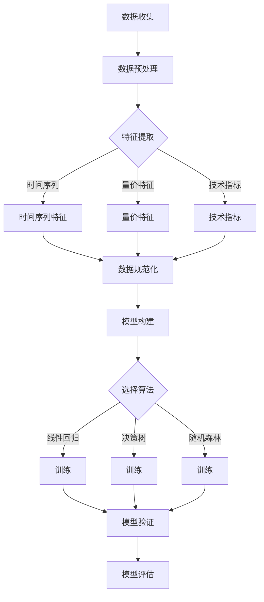

                 

### 第1章：机器学习与股票市场

#### 1.1 机器学习概述

机器学习（Machine Learning）是人工智能（Artificial Intelligence，AI）的一个重要分支，它主要通过算法让计算机从数据中学习规律，并在新的数据上做出预测或决策。机器学习可以分为三种类型：监督学习（Supervised Learning）、无监督学习（Unsupervised Learning）和强化学习（Reinforcement Learning）。

- **监督学习**：在监督学习过程中，模型通过已知数据的输入和输出进行训练，然后在新数据上进行预测。常见的监督学习算法包括线性回归、决策树、支持向量机（SVM）等。

- **无监督学习**：无监督学习不使用已标注的数据，而是从无标签的数据中寻找结构或模式。常见的无监督学习算法包括聚类算法（如K-均值聚类）、主成分分析（PCA）等。

- **强化学习**：强化学习通过试错（trial-and-error）的方式来学习如何完成特定的任务。它通过奖励机制来调整策略，从而在长期内达到最优解。

#### 1.1.1 机器学习的定义与分类

机器学习可以简单定义为：“给定数据集，利用算法从数据中学习规律，并对新的数据进行预测或决策的过程。”根据学习方式和数据的不同，机器学习可以分为以下几类：

1. **回归分析**：预测一个连续的输出变量。
2. **分类分析**：将数据分为不同的类别。
3. **聚类分析**：寻找数据中的隐含模式或结构。
4. **降维**：减少数据维度，同时保留重要信息。
5. **异常检测**：识别数据中的异常或异常模式。

#### 1.1.2 机器学习的关键技术

机器学习的关键技术包括：

1. **数据预处理**：包括数据清洗、缺失值处理、数据规范化等，确保数据质量。
2. **特征工程**：通过选择和构造特征来提高模型的预测性能。
3. **算法选择**：选择适合特定问题的算法，如线性回归、决策树、支持向量机等。
4. **模型评估**：评估模型的性能，选择最佳的模型。
5. **超参数调优**：调整模型的超参数，以获得最佳性能。

#### 1.1.3 机器学习的应用场景

机器学习在各个领域都有广泛的应用，包括但不限于：

1. **金融领域**：用于股票市场预测、风险控制、信用评分等。
2. **医疗领域**：用于疾病预测、诊断、治疗计划等。
3. **零售领域**：用于需求预测、库存管理、客户关系管理等。
4. **制造业**：用于生产优化、质量控制、设备维护等。

#### 1.2 股票市场概述

股票市场是一个高度动态和复杂的系统，由大量投资者、公司、政府和其他参与者组成。股票市场的基本组成包括：

1. **交易所**：如纽约证券交易所（NYSE）、纳斯达克（NASDAQ）等，是股票交易的场所。
2. **上市公司**：上市公司在股票市场上发行股票，以筹集资金。
3. **投资者**：包括个人投资者、机构投资者等，通过购买股票参与市场。
4. **监管机构**：如美国证券交易委员会（SEC），负责监管股票市场，确保市场的公平、透明。

#### 1.2.1 股票市场的组成

股票市场由两个主要部分组成：主板市场和创业板市场。

- **主板市场**：主板市场通常为大型、成熟的公司提供交易平台，这些公司具有较好的财务状况和稳定的业务模式。
- **创业板市场**：创业板市场则为初创公司和小型公司提供交易平台，这些公司通常具有更高的风险和更大的增长潜力。

#### 1.2.2 股票市场的数据来源

股票市场的数据来源广泛，包括：

1. **交易所数据**：包括股票的交易价格、交易量、开盘价、收盘价等。
2. **公司财报**：包括公司的收入、利润、现金流等财务数据。
3. **新闻报道**：包括对市场、公司、经济等方面的新闻报道。
4. **宏观经济数据**：包括GDP、通货膨胀率、利率等宏观经济指标。

#### 1.2.3 股票价格的影响因素

股票价格受到多种因素的影响，包括：

1. **公司基本面**：如公司的盈利能力、成长性、负债水平等。
2. **市场情绪**：投资者情绪、市场热点等。
3. **宏观经济因素**：如GDP增长率、利率、通货膨胀率等。
4. **政策因素**：政府的税收政策、货币政策等。
5. **技术因素**：如市场流动性、交易量等。

通过理解机器学习和股票市场的基本概念，我们可以更好地理解接下来的内容，包括数据预处理、特征工程、监督学习算法等。这些知识将帮助我们构建有效的股票市场异常检测模型。

#### 1.3 异常检测的重要性

在股票市场中，异常检测是一项至关重要的任务。异常检测的目标是识别出股票市场的异常交易或行为，从而帮助投资者和管理者及时采取行动，避免潜在的金融风险。以下是异常检测在股票市场中的重要性和应用场景：

#### 1.3.1 异常交易检测

异常交易检测旨在发现并识别股票市场中的异常交易行为。这些异常行为可能包括内幕交易、市场操纵、恶意交易等。异常交易检测可以帮助监管机构和交易所及时捕捉和阻止这些非法行为，维护市场的公平性和透明度。

- **内幕交易**：内幕交易是指利用未公开的重要信息进行股票交易，以谋取不正当利益。异常检测系统可以通过分析交易数据，识别出交易行为与市场规律不符的异常模式，从而发现潜在的违规行为。
- **市场操纵**：市场操纵是指通过操纵股票价格来谋取不正当利益的行为。异常检测系统可以识别出异常的交易量、价格走势等指标，帮助监管机构识别市场操纵行为。

#### 1.3.2 风险管理

异常检测在风险管理中发挥着重要作用。通过监控股票市场的异常行为，投资者和金融机构可以及时调整投资策略，降低潜在风险。

- **市场波动监控**：异常检测系统可以帮助投资者实时监控市场波动，识别出可能导致市场波动的异常信号，从而采取相应的风险控制措施。
- **信用风险评估**：在金融市场中，异常检测可以用于评估借款人的信用风险。通过分析借款人的交易行为和财务状况，异常检测系统可以帮助金融机构识别出高风险借款人。

#### 1.3.3 投资决策支持

异常检测还可以为投资决策提供有力支持。通过识别市场中的异常信号，投资者可以更好地把握市场趋势，做出更为明智的投资决策。

- **交易信号识别**：异常检测系统可以识别出市场中的交易机会，帮助投资者及时捕捉投资信号。
- **市场热点分析**：异常检测可以分析市场中的热点事件和题材，为投资者提供投资方向和建议。

#### 1.3.4 优化交易策略

异常检测还可以帮助投资者优化交易策略。通过分析市场中的异常行为，投资者可以调整交易策略，提高交易成功率。

- **交易信号验证**：异常检测系统可以验证交易信号的可靠性，帮助投资者识别有效的交易机会。
- **策略回测**：异常检测系统可以帮助投资者进行策略回测，评估交易策略的有效性和稳定性。

综上所述，异常检测在股票市场中具有极其重要的地位。通过有效的异常检测，投资者和金融机构可以更好地管理风险、优化投资决策，从而在激烈的市场竞争中取得优势。

#### 1.3.5 异常检测的挑战与机遇

虽然异常检测在股票市场中具有重要性，但其实施面临着一系列挑战和机遇：

- **数据复杂性**：股票市场的数据来源广泛，包括交易数据、公司财报、新闻报道、宏观经济数据等。处理这些复杂且多维的数据是一项挑战，但同时也是机遇，因为多样化的数据可以提供更全面的视角。
- **实时性要求**：股票市场是一个高度动态的市场，异常事件可能瞬间发生。实时处理和响应异常事件是一项关键挑战，但也是一项机遇，因为及时的响应可以最大限度地降低风险。
- **准确性要求**：异常检测系统需要具备高准确性，否则可能会误报或漏报异常事件。提高检测准确性是一项持续挑战，但也是一项重要机遇，因为准确性的提高可以增强投资者的信心和信任。
- **法律法规**：异常检测需要遵守相关法律法规，确保检测行为合法、合规。这既是挑战，也是机遇，因为合规的异常检测可以减少法律风险，增强市场信誉。

在接下来的章节中，我们将深入探讨机器学习在股票市场异常检测中的应用，包括数据预处理、特征工程、监督学习算法等，以及如何设计和实现一个有效的异常检测系统。

### 1.4 本书概述与组织结构

本书旨在深入探讨机器学习在股票市场异常检测中的应用，帮助读者了解和掌握这一前沿技术。全书分为五个主要部分，共计十章，具体内容安排如下：

#### 第一部分：引言

本部分主要包括第一章，内容涵盖机器学习与股票市场的基础知识，解释机器学习的基本概念、分类、应用场景，以及股票市场的基本组成、数据来源和价格影响因素。此外，还介绍了异常检测的重要性以及在股票市场中的应用。

#### 第二部分：机器学习基础

本部分包括第二章到第六章，详细介绍了机器学习的基础知识，包括数据预处理、特征工程、监督学习算法、无监督学习算法和强化学习算法。这些章节将帮助读者建立对机器学习的全面理解，并为其在股票市场异常检测中的应用打下基础。

- **第二章：数据预处理**：介绍数据收集、数据清洗、缺失值处理、异常值处理和数据规范化等基本步骤。
- **第三章：特征工程**：讲解特征提取、特征选择、时间序列特征、价格特征和量价特征等。
- **第四章：监督学习算法**：包括线性回归、决策树、随机森林等算法的原理、实现和评估。
- **第五章：无监督学习算法**：介绍主成分分析（PCA）和聚类算法的原理、实现和应用。
- **第六章：强化学习算法**：探讨强化学习的基本概念、应用场景和典型算法。

#### 第三部分：股票市场异常检测技术

本部分包括第七章到第九章，专门讨论股票市场异常检测的相关技术，包括异常检测方法、监控信号与阈值设定、模型评估与优化。这些章节将详细介绍如何设计和实现一个有效的股票市场异常检测系统。

- **第七章：异常检测方法**：介绍聚类异常检测、基于规则的异常检测和基于模型的异常检测等。
- **第八章：监控信号与阈值设定**：探讨监控信号的选择、阈值设定方法和实时监控的实现。
- **第九章：模型评估与优化**：讲解模型评估指标、超参数调优、特征工程优化和模型融合等。

#### 第四部分：机器学习在股票市场异常检测中的应用案例

本部分包括第十章，通过实际案例解析，展示如何将机器学习技术应用于股票市场异常检测。案例包括基于决策树和随机森林的股票市场异常检测，并提供详细的模型训练、验证和评估过程。

- **第十章：机器学习在股票市场异常检测中的应用案例**：通过实际案例展示机器学习技术在股票市场异常检测中的应用过程。

#### 第五部分：附录

本部分包括第十一章，提供相关工具与资源、参考文献、Mermaid流程图、伪代码示例、数学模型与公式解释以及项目实战案例代码解析。附录内容旨在为读者提供额外的学习资源和实践指导。

- **第十一章：附录**：包括Python库与框架、数据源与数据集、实际案例代码与数据、参考文献、流程图、伪代码示例和数学模型与公式解释等。

通过本书的阅读，读者将能够系统地了解和掌握机器学习在股票市场异常检测中的应用，为实际项目和投资决策提供有力支持。无论您是机器学习领域的初学者，还是希望将机器学习应用于金融领域的专业人士，本书都将为您带来丰富的知识和实践经验。

### 第二部分：机器学习基础

#### 2.1 数据预处理

数据预处理是机器学习过程中的关键步骤，它确保数据质量，为后续的特征提取和模型训练打下基础。数据预处理通常包括数据收集、数据清洗、缺失值处理、异常值处理和数据规范化等基本步骤。

##### 2.1.1 数据收集

数据收集是数据预处理的第一步，它决定了后续处理的质量。有效的数据收集应包括以下方面：

- **数据源的选择**：选择权威、可靠的数据源，如交易所公开的交易数据、公司财报等。
- **数据类型**：收集多样化的数据类型，包括交易数据、财务数据、新闻报道、宏观经济指标等。
- **数据频率**：根据研究需求，选择合适的数据频率，如日频、周频或月频。

##### 2.1.2 数据采集方法

数据采集方法通常包括以下几种：

- **自动采集**：利用API接口、爬虫工具等自动化手段采集数据。
- **手动采集**：通过人工方式收集数据，如阅读公司财报、新闻报道等。
- **第三方数据服务**：利用第三方数据服务商提供的数据服务，如Wind、同花顺等。

##### 2.1.3 数据清洗

数据清洗是确保数据质量的重要步骤，主要包括以下内容：

- **缺失值处理**：对于缺失值，可以采用删除、填补或插值等方法进行处理。
- **异常值处理**：识别并处理异常值，如异常的交易量、价格等。
- **重复值处理**：删除重复的数据记录，确保数据的唯一性。
- **噪声处理**：去除无关或噪声数据，如空格、标点符号等。

##### 2.1.4 缺失值的处理

缺失值处理是数据清洗中的一个重要环节，常用的处理方法包括：

- **删除缺失值**：对于少量的缺失值，可以选择删除含有缺失值的记录，以减少数据量。
- **填补缺失值**：对于大量的缺失值，可以选择填补方法，如平均值填补、中值填补、线性插值等。
- **模型填补**：使用机器学习模型，如线性回归、决策树等，预测缺失值。

##### 2.1.5 异常值的处理

异常值处理是确保数据质量的重要步骤，常用的方法包括：

- **统计方法**：使用统计方法，如箱线图、Z分数等，识别异常值。
- **基于规则的异常值处理**：根据业务规则，识别并处理异常值，如交易量异常、价格异常等。
- **机器学习方法**：使用机器学习模型，如孤立森林、K-均值聚类等，识别并处理异常值。

##### 2.1.6 数据规范化

数据规范化是确保数据在相同尺度上进行处理，常用的方法包括：

- **标准化**：将数据缩放到[0, 1]或[-1, 1]的区间内，如使用Z分数进行标准化。
- **归一化**：保持数据的大小关系不变，如使用Min-Max规范化。
- **小数点移动**：将数据乘以一个常数，如将货币数据乘以100进行规范化。

##### 2.1.7 数据预处理的流程

数据预处理的流程通常包括以下几个步骤：

1. **数据收集**：收集所需的数据。
2. **数据导入**：将数据导入到数据预处理工具或库中，如Pandas、NumPy等。
3. **数据清洗**：进行数据清洗，包括缺失值处理、异常值处理、重复值处理和噪声处理。
4. **数据规范化**：进行数据规范化，确保数据在相同尺度上进行处理。
5. **数据存储**：将预处理后的数据存储为合适的文件格式，如CSV、Excel等。

通过有效的数据预处理，可以显著提高机器学习模型的性能和鲁棒性。在实际应用中，数据预处理是一个持续的过程，需要根据具体问题和需求进行调整和优化。

#### 2.2 特征工程

特征工程是机器学习中的重要环节，它通过选择和构造特征来提高模型的预测性能。特征工程的好坏直接影响到模型的准确性和泛化能力。下面将详细讨论特征工程的关键步骤和常用方法。

##### 2.2.1 特征提取

特征提取是指从原始数据中提取具有代表性的特征，以便更好地表示数据。特征提取可以分为以下几种方法：

- **基于统计的特征提取**：通过计算数据的统计特征，如均值、方差、标准差等，来提取特征。这些特征能够反映数据的整体分布情况。
- **基于变换的特征提取**：通过将原始数据转换为新形式的数据，来提取特征。例如，通过归一化、标准化等操作，将数据缩放到相同的尺度。
- **基于变换的特征提取**：通过将原始数据转换为新形式的数据，来提取特征。例如，通过Lag变换，提取时间序列数据的前后序列特征。
- **基于聚类的特征提取**：通过聚类算法，将数据划分为多个类别，然后提取每个类别的特征。这种方法能够发现数据中的隐含结构。

##### 2.2.2 时间序列特征

时间序列特征在股票市场分析中尤为重要。时间序列特征包括：

- **趋势特征**：通过计算时间序列的趋势，如移动平均、指数移动平均等，来提取特征。
- **周期特征**：通过计算时间序列的周期性，如傅里叶变换、波动性等，来提取特征。
- **季节性特征**：通过识别时间序列的季节性模式，如月度、季度等，来提取特征。
- **滞后特征**：通过计算当前时间点的滞后值，如前一天的收盘价、交易量等，来提取特征。

##### 2.2.3 价格特征

价格特征是股票市场分析中常用的一类特征。价格特征包括：

- **开盘价、收盘价**：股票的开盘价和收盘价是基本的价格特征。
- **最高价、最低价**：股票的最高价和最低价反映了价格波动的范围。
- **价格变化**：股票价格的变化率，如涨跌停幅度、价格波动幅度等。
- **价格形态**：通过识别股票价格形态，如头肩顶、双底等，来提取特征。

##### 2.2.4 量价特征

量价特征是股票市场中另一类重要的特征。量价特征包括：

- **交易量**：股票的成交量是量价特征的核心指标，它反映了市场活跃度。
- **换手率**：股票的换手率反映了市场流动性的高低。
- **价格与交易量的关系**：通过计算价格与交易量的相关性，来提取特征。
- **量价指标**：如量价比（Price to Volume Ratio）、成交量加权平均价格（VWAP）等。

##### 2.2.5 特征选择

特征选择是特征工程中的一个重要步骤，目的是从众多特征中选出最有用的特征，以提高模型的性能和效率。特征选择方法包括：

- **过滤式特征选择**：通过过滤方法，如相关性分析、信息增益等，筛选出有用的特征。
- **包裹式特征选择**：通过搜索策略，如前向选择、后向消除等，选出最优的特征组合。
- **嵌入式特征选择**：在模型训练过程中，自动筛选出最优特征，如LASSO回归、随机森林等。

##### 2.2.6 特征重要性评估

特征重要性评估是判断特征对模型贡献大小的过程，有助于了解特征对预测结果的影响。特征重要性评估方法包括：

- **基于模型的特征重要性评估**：通过模型训练结果，计算特征对预测结果的贡献度，如随机森林的重要性得分。
- **基于统计的特征重要性评估**：通过统计方法，如相关系数、信息增益等，评估特征的重要性。
- **基于模型的交叉验证**：通过交叉验证方法，比较不同特征的模型性能，判断特征的重要性。

通过有效的特征工程，可以显著提高机器学习模型的性能和泛化能力。在实际应用中，特征工程是一个不断迭代和优化的过程，需要根据具体问题和数据情况进行调整和改进。

#### 2.3 特征工程

特征工程是机器学习中的关键步骤，它通过选择和构造特征来提高模型的预测性能。特征工程的好坏直接影响到模型的准确性和泛化能力。以下是特征工程的关键步骤和常用方法：

##### 2.3.1 特征提取

特征提取是特征工程的第一步，它从原始数据中提取出具有代表性的特征，以便更好地表示数据。以下是几种常见的特征提取方法：

- **统计特征**：通过计算数据的统计特征，如均值、方差、标准差等，来提取特征。这些特征能够反映数据的整体分布情况。
- **变换特征**：通过将原始数据转换为新形式的数据，来提取特征。例如，通过归一化、标准化等操作，将数据缩放到相同的尺度。
- **Lag特征**：通过计算当前时间点的滞后值，如前一天的收盘价、交易量等，来提取特征。
- **季节性特征**：通过识别数据中的季节性模式，如月度、季度等，来提取特征。

##### 2.3.2 时间序列特征

时间序列特征在股票市场分析中尤为重要。以下是几种常用的时间序列特征：

- **趋势特征**：通过计算时间序列的趋势，如移动平均、指数移动平均等，来提取特征。
- **周期特征**：通过计算时间序列的周期性，如傅里叶变换、波动性等，来提取特征。
- **滞后特征**：通过计算当前时间点的滞后值，如前一天的收盘价、交易量等，来提取特征。
- **季节性特征**：通过识别时间序列的季节性模式，如月度、季度等，来提取特征。

##### 2.3.3 价格特征

价格特征是股票市场分析中常用的一类特征。以下是几种常见的价格特征：

- **开盘价、收盘价**：股票的开盘价和收盘价是基本的价格特征。
- **最高价、最低价**：股票的最高价和最低价反映了价格波动的范围。
- **价格变化**：股票价格的变化率，如涨跌停幅度、价格波动幅度等。
- **价格形态**：通过识别股票价格形态，如头肩顶、双底等，来提取特征。

##### 2.3.4 量价特征

量价特征是股票市场中另一类重要的特征。以下是几种常见的量价特征：

- **交易量**：股票的成交量是量价特征的核心指标，它反映了市场活跃度。
- **换手率**：股票的换手率反映了市场流动性的高低。
- **价格与交易量的关系**：通过计算价格与交易量的相关性，来提取特征。
- **量价指标**：如量价比（Price to Volume Ratio）、成交量加权平均价格（VWAP）等。

##### 2.3.5 特征选择

特征选择是特征工程中的一个重要步骤，目的是从众多特征中选出最有用的特征，以提高模型的性能和效率。以下是几种常见的特征选择方法：

- **过滤式特征选择**：通过过滤方法，如相关性分析、信息增益等，筛选出有用的特征。
- **包裹式特征选择**：通过搜索策略，如前向选择、后向消除等，选出最优的特征组合。
- **嵌入式特征选择**：在模型训练过程中，自动筛选出最优特征，如LASSO回归、随机森林等。

##### 2.3.6 特征重要性评估

特征重要性评估是判断特征对模型贡献大小的过程，有助于了解特征对预测结果的影响。以下是几种常见的特征重要性评估方法：

- **基于模型的特征重要性评估**：通过模型训练结果，计算特征对预测结果的贡献度，如随机森林的重要性得分。
- **基于统计的特征重要性评估**：通过统计方法，如相关系数、信息增益等，评估特征的重要性。
- **基于模型的交叉验证**：通过交叉验证方法，比较不同特征的模型性能，判断特征的重要性。

通过有效的特征工程，可以显著提高机器学习模型的性能和泛化能力。在实际应用中，特征工程是一个不断迭代和优化的过程，需要根据具体问题和数据情况进行调整和改进。

#### 2.4 监督学习算法

监督学习算法是机器学习中的核心内容之一，通过学习已有的数据集，构建模型并对其进行预测。监督学习算法可以分为线性模型和非线性模型，每种模型都有其独特的应用场景和特点。在本节中，我们将详细探讨几种常见的监督学习算法，包括线性回归、决策树和随机森林。

##### 2.4.1 线性回归

线性回归是最基础的监督学习算法之一，它通过建立输入变量和输出变量之间的线性关系，进行预测。线性回归的基本原理如下：

- **线性模型**：假设输入变量 $X$ 和输出变量 $Y$ 之间存在线性关系，即 $Y = \beta_0 + \beta_1X + \epsilon$，其中 $\beta_0$ 是截距，$\beta_1$ 是斜率，$\epsilon$ 是误差项。
- **最小二乘法**：通过最小化误差平方和来求解参数 $\beta_0$ 和 $\beta_1$，即 $J(\beta_0, \beta_1) = \sum_{i=1}^{n}(y_i - (\beta_0 + \beta_1x_i))^2$。

线性回归的优点在于其计算简单、易于理解和实现。然而，线性回归在处理非线性数据时效果较差，因此需要引入非线性模型。

##### 2.4.2 决策树

决策树是一种基于树结构的分类算法，它通过一系列的规则来对数据进行分类。决策树的基本原理如下：

- **树结构**：决策树由一系列内部节点和叶节点组成。内部节点表示特征的取值，叶节点表示分类结果。
- **递归划分**：在构建决策树时，从根节点开始，通过计算每个特征的不同取值，将数据集划分为子集。递归地进行划分，直到达到预定的终止条件，如最大深度、最小节点大小等。

决策树的优势在于其直观、易于理解，且在处理非线性数据时表现出色。然而，决策树的过拟合问题较为严重，需要通过剪枝等方法进行优化。

##### 2.4.3 随机森林

随机森林（Random Forest）是一种集成学习方法，通过构建多个决策树，并对它们的预测结果进行投票来提高预测性能。随机森林的基本原理如下：

- **随机特征选择**：在构建每个决策树时，从所有特征中随机选择一部分特征进行划分。
- **树构建**：对于每个决策树，按照常规的决策树构建方法进行训练。
- **集成投票**：将所有决策树的预测结果进行投票，选择出现次数最多的类别作为最终预测结果。

随机森林的优点在于其高效性和泛化能力，它通过集成多个决策树来降低过拟合的风险。此外，随机森林还具有较高的计算效率和良好的可解释性。

##### 2.4.4 模型评估

监督学习算法的性能评估是模型选择和优化的重要环节。以下是几种常用的模型评估指标：

- **准确率（Accuracy）**：准确率是正确预测的样本占总样本的比例，计算公式为 $Accuracy = \frac{TP + TN}{TP + TN + FP + FN}$，其中 $TP$、$TN$、$FP$ 和 $FN$ 分别表示真正例、真负例、假正例和假负例。
- **召回率（Recall）**：召回率是正确预测的正样本占总正样本的比例，计算公式为 $Recall = \frac{TP}{TP + FN}$。
- **精确率（Precision）**：精确率是正确预测的正样本占总预测正样本的比例，计算公式为 $Precision = \frac{TP}{TP + FP}$。
- **F1 分数（F1 Score）**：F1 分数是精确率和召回率的调和平均值，计算公式为 $F1 Score = 2 \times \frac{Precision \times Recall}{Precision + Recall}$。

通过模型评估指标，可以全面评估监督学习算法的性能，选择最佳的模型。

##### 2.4.5 模型选择与优化

在监督学习过程中，模型选择和优化是关键步骤。以下是几种常用的模型选择和优化方法：

- **交叉验证**：通过将数据集划分为训练集和验证集，多次训练和验证模型，以评估模型的泛化能力。
- **网格搜索**：通过遍历所有可能的参数组合，找到最优参数组合。
- **贝叶斯优化**：利用贝叶斯原理和优化算法，自动搜索最优参数组合。

通过模型选择和优化，可以提高模型的性能和泛化能力，从而更好地应用于实际问题。

综上所述，监督学习算法在股票市场异常检测中具有广泛的应用。通过理解线性回归、决策树和随机森林等算法的基本原理、模型评估方法和优化方法，可以构建有效的异常检测模型，为股票市场风险管理和投资决策提供有力支持。

#### 2.5 无监督学习算法

无监督学习算法在机器学习中扮演着重要的角色，尤其是在不需要标注数据的情况下识别数据中的隐含结构和模式。无监督学习算法主要包括聚类算法和降维算法。以下是几种常用的无监督学习算法及其原理和应用。

##### 2.5.1 主成分分析（PCA）

主成分分析（Principal Component Analysis，PCA）是一种常用的降维算法，它通过将数据投影到新的正交坐标系中，来降低数据的维度，同时保留大部分信息。PCA的基本原理如下：

- **数据标准化**：首先对数据进行标准化处理，使其具有相同的尺度。
- **协方差矩阵计算**：计算数据集的协方差矩阵，协方差矩阵描述了各个特征之间的相关性。
- **特征值和特征向量计算**：计算协方差矩阵的特征值和特征向量，特征值表示特征的方差，特征向量表示特征的方向。
- **构造投影矩阵**：选取前 $k$ 个特征向量作为投影矩阵，将数据投影到低维空间。
- **数据重构**：使用投影矩阵重构数据，以验证降维效果。

PCA的应用场景包括：

- **数据可视化**：通过将高维数据投影到二维或三维空间，进行可视化分析。
- **特征提取**：通过提取主要成分，减少数据维度，提高计算效率。
- **噪声消除**：通过消除次要成分，降低噪声对数据的影响。

##### 2.5.2 聚类算法

聚类算法是另一种重要的无监督学习算法，它将相似的数据点归为一类，以发现数据中的隐含结构。常见的聚类算法包括K-均值聚类、层次聚类和DBSCAN等。

- **K-均值聚类**（K-Means Clustering）：K-均值聚类是一种基于距离的聚类算法，它通过迭代过程将数据点分配到 $K$ 个聚类中心。算法的基本步骤如下：

  1. **初始化聚类中心**：随机选择 $K$ 个初始聚类中心。
  2. **分配数据点**：将每个数据点分配到最近的聚类中心。
  3. **更新聚类中心**：计算每个聚类中心的新位置，即其所属数据点的均值。
  4. **重复步骤2和3，直到聚类中心不再发生显著变化**。

  K-均值聚类简单且易于实现，但需要事先指定聚类数 $K$，且在处理高维数据时容易陷入局部最优。

- **层次聚类**（Hierarchical Clustering）：层次聚类通过逐步合并或分裂聚类，构建出一棵聚类层次树。层次聚类的基本步骤如下：

  1. **初始化**：将每个数据点视为一个初始聚类。
  2. **合并或分裂**：通过计算数据点之间的距离，合并相似度较高的聚类或分裂相似度较低的聚类。
  3. **构建层次树**：重复步骤2，直到所有数据点合并为一个聚类或分裂为多个聚类。

  层次聚类能够提供聚类层次信息，便于分析数据结构，但计算复杂度较高。

- **DBSCAN**（Density-Based Spatial Clustering of Applications with Noise）：DBSCAN是一种基于密度的聚类算法，它能够发现任意形状的聚类，并处理噪声和异常值。DBSCAN的基本步骤如下：

  1. **确定邻域**：计算每个数据点的邻域，邻域大小由两个参数 $\epsilon$（邻域半径）和 $MinPts$（最小邻域点数）确定。
  2. **生成核心点**：如果数据点的邻域包含 $MinPts$ 个点，则该数据点为核心点。
  3. **生成边界点**：如果数据点的邻域包含 $MinPts$ 个点，但不是核心点，则该数据点为边界点。
  4. **生成簇**：从核心点开始，按照密度连接的方式生成簇。

  DBSCAN能够自动发现聚类数，但在处理高密度和稀疏数据时性能较差。

##### 2.5.3 聚类算法的选择与评估

选择合适的聚类算法取决于数据的特性和应用场景。以下是几种常见的聚类算法选择和评估方法：

- **评估指标**：常用的评估指标包括轮廓系数（Silhouette Coefficient）、内部平方误差（Intra-cluster Sum of Squares）、聚类数 $K$ 的选择等。
  - **轮廓系数**：通过计算每个样本与其自身簇和邻近簇之间的距离，评估聚类的质量。
  - **内部平方误差**：计算每个簇内部样本之间的平均距离，用于评估簇的紧凑性。
  - **聚类数 $K$ 的选择**：通过评估不同 $K$ 值下的聚类性能，选择最优的聚类数。

- **模型选择方法**：常用的模型选择方法包括基于网格搜索（Grid Search）和贝叶斯优化（Bayesian Optimization）等。
  - **基于网格搜索**：遍历所有可能的参数组合，选择最优参数组合。
  - **贝叶斯优化**：利用贝叶斯原理和优化算法，自动搜索最优参数组合。

通过有效的聚类算法选择和评估，可以更好地识别数据中的隐含结构和模式，为股票市场异常检测等应用提供有力支持。

#### 2.6 强化学习算法

强化学习（Reinforcement Learning，RL）是一种通过试错方式，在与环境互动中学习最优策略的机器学习范式。与监督学习和无监督学习不同，强化学习中的代理（Agent）通过不断与环境（Environment）交互，从奖励（Reward）中学习最优行为策略。以下是强化学习的基本概念、应用场景以及与监督学习和无监督学习的区别。

##### 2.6.1 强化学习的基本概念

强化学习由四个核心元素组成：代理（Agent）、环境（Environment）、状态（State）、动作（Action）。

- **代理（Agent）**：代理是执行动作的实体，如机器人、股票交易系统等。
- **环境（Environment）**：环境是代理所处的外部环境，环境的状态会因代理的动作而改变。
- **状态（State）**：状态是代理在环境中的当前情况，状态可以是连续的或离散的。
- **动作（Action）**：动作是代理在某一状态下可以采取的行为，动作的选择会影响状态的变化。

强化学习的目标是通过学习策略（Policy），最大化长期累积奖励（Cumulative Reward）。策略定义了代理在特定状态下采取何种动作。

##### 2.6.2 强化学习的应用场景

强化学习在金融领域具有广泛的应用，以下是一些典型的应用场景：

- **股票交易**：通过强化学习，构建自动化的交易策略，实现风险控制和收益最大化。
- **投资组合优化**：根据市场变化和风险偏好，动态调整投资组合，以最大化收益或最小化风险。
- **风险管理**：通过实时监控市场状态，识别潜在的金融风险，采取相应的措施进行风险控制。
- **高频交易**：利用强化学习，实现高频交易策略的自动化和优化，提高交易效率和收益。

##### 2.6.3 强化学习与监督学习和无监督学习的区别

强化学习与监督学习和无监督学习有以下显著区别：

- **数据依赖**：强化学习不依赖于大量已标注的数据，而是通过与环境的互动不断学习。监督学习和无监督学习则依赖于已标注的数据。
- **互动性**：强化学习强调代理与环境之间的互动，通过试错学习最优策略。监督学习和无监督学习则侧重于数据的分析和处理。
- **目标函数**：强化学习的目标是最小化长期累积的损失函数（通常为负的累积奖励），而监督学习和无监督学习的目标则是最小化预测误差或最大化信息熵。

##### 2.6.4 强化学习算法

强化学习算法种类繁多，以下是几种常见的强化学习算法：

- **Q-Learning**：Q-Learning是一种基于值函数的强化学习算法，通过学习状态-动作值函数（Q-Function）来选取最佳动作。
  - **状态-动作值函数**：Q(s, a) 表示代理在状态 s 下采取动作 a 的期望奖励。
  - **更新规则**：通过迭代更新 Q(s, a)，即 Q(s, a) = Q(s, a) + α [r + γmax(Q(s', a')) - Q(s, a)]，其中 α 是学习率，γ 是折扣因子，s' 是新状态。

- **SARSA**：SARSA（State-Action-Reward-State-Action）是一种基于策略的强化学习算法，通过同时考虑当前状态和下一个状态来更新策略。
  - **更新规则**：π(a|s) = π(a|s) + α [r + γQ(s', a') - π(a|s)Q(s, a)]。

- **Deep Q-Network（DQN）**：DQN 是一种基于深度学习的强化学习算法，通过神经网络近似状态-动作值函数。
  - **经验回放**：通过经验回放（Experience Replay）机制，避免策略偏差。
  - **目标网络**：使用目标网络（Target Network）稳定值函数的学习过程。

强化学习在股票市场中的应用前景广阔，通过有效的策略学习，可以构建自适应的交易系统，提高投资决策的准确性和效率。然而，强化学习算法在股票市场中的实际应用也面临数据质量、实时性和鲁棒性等挑战，需要进一步的研究和优化。

### 3.1 股票市场概述

股票市场是一个复杂且高度动态的系统，它汇聚了大量的投资者、公司、金融机构和监管机构。股票市场的运作机制和特点对投资者的投资决策和整个市场的稳定具有重要影响。以下是股票市场的基本组成、运作机制和特点。

#### 3.1.1 股票市场的组成

股票市场主要由以下几部分组成：

- **交易所**：交易所是股票交易的主要场所，如纽约证券交易所（NYSE）、纳斯达克（NASDAQ）等。交易所为买卖双方提供了一个公平、透明和高效的交易平台。
- **上市公司**：上市公司是指在股票市场上公开发行股票的公司。这些公司通过发行股票来筹集资金，以满足业务扩张、研发投入等需求。
- **投资者**：投资者是购买和持有股票的个人或机构。投资者通过买卖股票，实现资本增值或获取股息收入。
- **监管机构**：监管机构如美国证券交易委员会（SEC）、中国证监会等，负责监管股票市场的运行，确保市场的公平、透明和有序。

#### 3.1.2 股票市场的运作机制

股票市场的运作机制主要包括以下方面：

- **上市流程**：公司要成为上市公司，需要通过审批程序，包括向监管机构提交申请、进行财务审计、编制招股说明书等。
- **交易流程**：投资者可以通过证券交易所进行股票买卖，交易流程包括开户、下单、交易执行和结算等环节。
- **价格发现**：股票价格通过买卖双方的竞价过程形成，市场供求关系决定了股票的价格。
- **信息披露**：上市公司需要定期披露财务报告、重大事项等信息，以保障市场透明度和投资者权益。

#### 3.1.3 股票市场的特点

股票市场具有以下特点：

- **高度波动性**：股票价格受到多种因素的影响，如公司业绩、宏观经济环境、市场情绪等，因此价格波动较大。
- **高风险与高收益并存的特性**：投资者可能面临投资损失，但也可能获得较高的回报。
- **市场参与者的多样性**：股票市场吸引了个人投资者、机构投资者、投资基金等多种市场参与者。
- **监管力度较强**：监管机构对股票市场进行严格监管，以维护市场的公平、透明和稳定。

#### 3.1.4 股票市场的数据来源

股票市场的数据来源广泛，主要包括以下几个方面：

- **交易所数据**：交易所提供详细的交易数据，包括交易价格、交易量、开盘价、收盘价等。
- **公司财报**：上市公司定期发布的财务报告，包括收入、利润、现金流等财务指标。
- **新闻报道**：媒体和分析师对市场、公司、经济等方面的报道和分析，影响市场情绪。
- **宏观经济数据**：如GDP增长率、通货膨胀率、利率等宏观经济指标，影响股票市场的整体走势。

#### 3.1.5 股票价格的影响因素

股票价格受到多种因素的影响，主要包括以下几个方面：

- **公司基本面**：公司的财务状况、盈利能力、成长性等基本面因素直接影响股票价格。
- **市场情绪**：投资者情绪、市场热点、新闻事件等对市场情绪产生重要影响，从而影响股票价格。
- **宏观经济因素**：宏观经济环境如GDP增长率、通货膨胀率、利率等，对股票市场产生广泛影响。
- **政策因素**：政府的税收政策、货币政策等政策因素对股票市场产生直接影响。
- **技术因素**：市场流动性、交易量等技术指标对股票价格也有一定影响。

通过了解股票市场的基本组成、运作机制和特点，投资者可以更好地理解市场的运行规律，从而做出更明智的投资决策。此外，掌握股票市场的数据来源和影响因素，有助于构建有效的异常检测模型，识别市场中的异常行为。

### 3.2 股票价格波动分析

股票价格波动是股票市场中最显著的特征之一，它受到多种因素的影响，包括公司基本面、市场情绪、宏观经济环境等。在机器学习应用中，对股票价格波动进行分析和理解至关重要，因为波动性分析是构建有效异常检测模型的基础。以下是股票价格波动分析的主要方法、技术手段和理论基础。

#### 3.2.1 波动性分析的主要方法

股票价格波动性分析主要包括以下几种方法：

1. **历史波动率**：历史波动率是一种基于历史价格数据的分析技术，它通过计算股票价格的历史波动程度来预测未来波动性。常用的计算方法包括标准差、方差等。历史波动率越高，表明股票价格波动性越大。

2. **GARCH模型**：广义自回归条件异方差（Generalized Autoregressive Conditional Heteroskedasticity，GARCH）模型是一种用于分析金融时间序列波动性的经典方法。GARCH模型能够捕捉股票价格波动的时间序列特性，并通过条件方差预测未来波动性。

3. **马尔可夫链**：马尔可夫链是一种概率模型，用于分析股票价格的转移概率。通过构建马尔可夫模型，可以预测股票价格在不同状态之间的转移，从而分析波动性。

4. **机器学习方法**：机器学习，特别是深度学习，可以用于股票价格波动性的预测。通过训练大规模历史数据集，深度学习模型可以捕捉复杂的波动模式，提高预测精度。

#### 3.2.2 技术手段

进行股票价格波动性分析时，常用的技术手段包括：

1. **数据收集**：收集股票的历史交易数据，包括价格、交易量、开盘价、收盘价等。此外，还需收集与股票相关的宏观经济数据、公司财务数据等。

2. **数据预处理**：对收集到的数据进行清洗和规范化处理，如缺失值处理、异常值处理、数据归一化等，以确保数据质量。

3. **特征工程**：从原始数据中提取具有代表性的特征，如价格变动率、交易量变动率、技术指标（如移动平均、相对强弱指数（RSI）等）。

4. **模型训练**：使用选定的波动性分析模型（如GARCH模型、深度学习模型等）对数据进行训练，构建波动性预测模型。

5. **模型评估**：使用交叉验证等方法评估模型的性能，包括预测精度、波动性拟合度等。

6. **实时监测**：在构建模型后，通过实时数据监测和预测，及时识别股票价格的异常波动。

#### 3.2.3 理论基础

股票价格波动性的分析理论基础主要包括以下几个方面：

1. **有效市场假说**（Efficient Market Hypothesis，EMH）：EMH 假设股票价格反映了所有可用信息，因此历史波动性无法预测未来波动性。然而，实际市场中，股票价格波动仍然存在显著的非随机性，这为波动性分析提供了可能。

2. **行为金融学**（Behavioral Finance）：行为金融学认为，投资者的行为偏差（如过度自信、跟风等）会影响股票价格的波动性。通过分析这些行为偏差，可以更好地理解股票价格波动的原因。

3. **随机过程理论**：股票价格波动性分析中，随机过程理论（如马尔可夫链、GARCH模型等）被广泛应用于波动性的建模和预测。

4. **统计学习理论**：统计学习理论为波动性分析提供了丰富的算法和技术，如线性回归、支持向量机、神经网络等，这些方法可以用于构建高效的波动性预测模型。

通过综合运用这些方法和技术，可以深入分析股票价格的波动性，为投资者提供有价值的参考。波动性分析不仅在学术研究中具有重要意义，在实际应用中，如股票市场风险管理和异常检测等，也发挥着关键作用。

### 3.3 异常检测方法

在股票市场中，异常检测是一项关键任务，它旨在识别出与正常交易行为不符的异常交易或行为，以便投资者和监管机构能够及时采取措施，避免潜在的市场风险。异常检测方法可以分为基于聚类、基于规则和基于模型的三大类。以下是这些方法的基本原理、算法实现和模型评估。

#### 3.3.1 聚类异常检测

聚类异常检测是一种无监督学习方法，它通过将股票市场的交易数据进行聚类，然后将未聚类到的数据点视为异常。聚类异常检测的基本原理如下：

- **数据预处理**：首先对交易数据进行预处理，包括数据清洗、缺失值处理、数据规范化等。
- **聚类算法选择**：选择合适的聚类算法，如K-均值聚类（K-Means Clustering）、层次聚类（Hierarchical Clustering）、DBSCAN（Density-Based Spatial Clustering of Applications with Noise）等。
- **聚类结果分析**：通过分析聚类结果，识别出未聚类到的数据点，将其视为异常。

**算法实现**：

以K-均值聚类为例，算法实现步骤如下：

1. **初始化聚类中心**：随机选择K个初始聚类中心。
2. **分配数据点**：将每个数据点分配到最近的聚类中心。
3. **更新聚类中心**：计算每个聚类中心的新位置，即其所属数据点的均值。
4. **重复步骤2和3，直到聚类中心不再发生显著变化**。

**模型评估**：

聚类异常检测的评估指标主要包括：

- **轮廓系数（Silhouette Coefficient）**：用于评估聚类质量和聚类数K的选择。
- **内部平方误差（Intra-cluster Sum of Squares）**：用于评估聚类的紧凑性。

#### 3.3.2 基于规则的异常检测

基于规则的异常检测是一种监督学习方法，它通过预定义规则来识别异常交易或行为。基于规则的方法通常包括以下步骤：

- **规则定义**：根据业务逻辑和经验，定义识别异常交易的规则，如交易量异常、价格异常、交易时间异常等。
- **规则应用**：将定义好的规则应用于交易数据，识别出符合规则的异常交易。
- **规则评估**：评估规则的有效性和覆盖率，不断优化和调整规则。

**算法实现**：

基于规则的异常检测的实现步骤如下：

1. **数据收集与预处理**：收集交易数据，并进行预处理。
2. **规则定义**：定义识别异常交易的规则。
3. **规则应用**：遍历交易数据，应用定义好的规则，识别异常交易。
4. **规则评估**：根据识别效果，评估规则的有效性和覆盖率。

**模型评估**：

基于规则的异常检测的评估指标主要包括：

- **准确率（Accuracy）**：正确识别异常交易的比率。
- **召回率（Recall）**：识别出的异常交易占实际异常交易的比率。
- **精确率（Precision）**：识别出的异常交易占所有识别为异常交易的比率。

#### 3.3.3 基于模型的异常检测

基于模型的异常检测是一种利用机器学习模型进行异常检测的方法。这种方法通过训练模型，从大量历史数据中学习正常交易行为，并利用模型预测和识别异常交易。

- **数据预处理**：对交易数据集进行清洗、缺失值处理和特征提取。
- **模型选择**：选择合适的机器学习模型，如线性回归、决策树、随机森林、神经网络等。
- **模型训练**：使用正常交易数据训练模型，使模型学会识别正常交易行为。
- **异常检测**：使用训练好的模型对新交易数据进行预测，识别出异常交易。

**算法实现**：

以决策树为例，算法实现步骤如下：

1. **数据收集与预处理**：收集历史交易数据，并进行预处理。
2. **特征提取**：从交易数据中提取特征。
3. **模型训练**：使用正常交易数据训练决策树模型。
4. **异常检测**：使用训练好的决策树模型对新交易数据进行预测，识别异常交易。

**模型评估**：

基于模型的异常检测的评估指标主要包括：

- **准确率（Accuracy）**：正确识别异常交易和正常交易的比率。
- **召回率（Recall）**：识别出的异常交易占实际异常交易的比率。
- **精确率（Precision）**：识别出的异常交易占所有识别为异常交易的比率。
- **F1 分数（F1 Score）**：精确率和召回率的调和平均值。

#### 3.3.4 三种方法的比较

- **优势**：

  - 聚类异常检测：能够自动发现数据中的隐含结构，适用于无标签数据的异常检测。

  - 基于规则的异常检测：实现简单，易于理解，适用于规则明确的情况。

  - 基于模型的异常检测：通过机器学习模型，能够捕捉复杂的异常模式，适用于大规模和高维数据。

- **劣势**：

  - 聚类异常检测：需要事先指定聚类数，且在高维数据中效果较差。

  - 基于规则的异常检测：规则定义复杂，适用范围有限。

  - 基于模型的异常检测：模型训练复杂，需要大量历史数据。

在实际应用中，可以根据具体问题和数据特点，选择合适的异常检测方法，或结合多种方法进行综合异常检测。

#### 3.3.5 异常检测的挑战

在股票市场异常检测中，存在以下几项挑战：

- **数据复杂性**：股票市场数据多维且复杂，包括交易数据、财务数据、新闻报道等，如何处理这些复杂数据是一个挑战。

- **实时性要求**：股票市场价格波动迅速，异常检测需要实时处理和响应，以保证检测的及时性。

- **准确性要求**：异常检测系统需要具备高准确性，否则可能会误报或漏报异常事件。

- **法律法规**：异常检测需要遵守相关法律法规，确保检测行为合法、合规。

通过有效的异常检测方法和技术，可以克服这些挑战，提高股票市场异常检测的效率和准确性。

### 3.4 监控信号与阈值设定

在股票市场异常检测中，监控信号和阈值设定是两个关键步骤，它们决定了异常检测系统的灵敏度和准确性。有效的监控信号和合理的阈值设定能够帮助投资者和监管机构及时发现和应对市场中的异常行为，从而降低风险和提升收益。

#### 3.4.1 监控信号的选择

监控信号是指用于衡量股票市场交易行为是否异常的指标或特征。选择合适的监控信号是异常检测成功的关键。以下是一些常见的监控信号：

- **交易量指标**：交易量是股票市场中的一个重要指标，可以反映市场的活跃度。常见的交易量指标包括：
  - **交易量变化率**：计算当前交易量与历史交易量的差异，如日交易量相对于前一周或前一个月的变化率。
  - **超额交易量**：计算当前交易量超过某个阈值的比例，如超过平均交易量的25%。

- **价格指标**：价格指标可以反映股票的价格走势和波动情况。常见的价格指标包括：
  - **价格变化幅度**：计算当前价格与前一交易日价格的变化幅度，如百分比变化。
  - **价格波动幅度**：计算股票价格的日波动幅度，如最高价与最低价的差值。

- **时间指标**：时间指标可以反映交易行为的时间分布和规律。常见的时间指标包括：
  - **交易时间分布**：分析交易行为在一天中的分布情况，如某个时间段内的交易量占总交易量的比例。
  - **交易持续时间**：计算交易行为的持续时间，如一个交易订单的持续时间。

- **价格与交易量关系**：分析价格与交易量之间的关系，如量价比（Price to Volume Ratio），可以揭示市场趋势和交易行为的合理性。

- **技术指标**：利用技术指标，如移动平均、相对强弱指数（RSI）、布林带等，可以捕捉市场趋势和交易信号。

#### 3.4.2 阈值设定方法

阈值设定是指确定一个阈值，用于判断交易行为是否属于异常。合理的阈值设定能够平衡检测的灵敏度和准确性。以下是一些常见的阈值设定方法：

- **统计阈值设定**：通过计算历史数据的统计指标（如均值、标准差等），设定一个阈值。当实际数据超过这个阈值时，判定为异常。
  - **均值+标准差方法**：设定一个阈值，等于历史数据的均值加上若干倍的标准差。当数据点超过这个阈值时，判定为异常。
  - **百分位方法**：选择一个特定的百分位数（如95%或99%），设定一个阈值，当数据点高于这个阈值时，判定为异常。

- **专家阈值设定**：根据专家经验和业务规则，设定阈值。这种方法通常依赖于专家对市场规律的深刻理解和经验。
  - **历史峰值方法**：设定一个阈值，等于历史数据中的最大值或峰值。当数据点超过这个阈值时，判定为异常。

- **自适应阈值设定**：根据实时数据和历史数据，动态调整阈值。这种方法能够适应市场变化，提高检测的准确性。
  - **移动平均方法**：设定一个阈值，等于当前数据与移动平均值的差值。当差值超过这个阈值时，判定为异常。
  - **自回归模型**：使用自回归模型（如ARIMA模型），根据历史数据动态预测未来阈值，当实际数据超过预测阈值时，判定为异常。

- **机器学习方法**：使用机器学习模型，如分类模型或回归模型，根据训练数据设定阈值。这种方法能够自动学习数据特征，提高阈值设定的准确性。

#### 3.4.3 监控信号与阈值设定在实际中的应用

在实际应用中，监控信号和阈值设定需要根据具体问题和数据情况进行调整和优化。以下是一个简化的应用示例：

- **监控信号选择**：选择交易量和价格变化率作为监控信号，以反映交易行为的异常性。
- **阈值设定**：使用历史数据计算交易量和价格变化率的统计指标，设定一个阈值。例如，设定交易量变化率超过3倍标准差或价格变化幅度超过5%时，判定为异常。

通过合理选择监控信号和设定阈值，可以构建一个有效的异常检测系统，帮助投资者和监管机构及时发现和处理市场中的异常行为，降低风险并提升投资决策的准确性。

### 3.5 模型评估与优化

在构建股票市场异常检测模型后，评估与优化模型是确保其准确性和实用性的关键步骤。模型评估与优化主要包括模型评估指标的选择、超参数调优、特征工程优化和模型融合等方面。以下将详细探讨这些内容。

#### 3.5.1 模型评估指标

模型评估是评估模型性能的重要手段，以下是一些常用的模型评估指标：

- **准确率（Accuracy）**：准确率是正确预测的样本占总样本的比例，计算公式为：
  $$Accuracy = \frac{TP + TN}{TP + TN + FP + FN}$$
  其中，$TP$、$TN$、$FP$ 和 $FN$ 分别表示真正例、真负例、假正例和假负例。

- **召回率（Recall）**：召回率是正确预测的正样本占总正样本的比例，计算公式为：
  $$Recall = \frac{TP}{TP + FN}$$

- **精确率（Precision）**：精确率是正确预测的正样本占总预测正样本的比例，计算公式为：
  $$Precision = \frac{TP}{TP + FP}$$

- **F1 分数（F1 Score）**：F1 分数是精确率和召回率的调和平均值，计算公式为：
  $$F1 Score = 2 \times \frac{Precision \times Recall}{Precision + Recall}$$

- **ROC 曲线（Receiver Operating Characteristic Curve）**：ROC 曲线通过绘制真阳性率（True Positive Rate，TPR）与假阳性率（False Positive Rate，FPR）的关系曲线，评估模型的分类性能。

- **AUC 值（Area Under the Curve）**：AUC 值是 ROC 曲线下方的面积，用于评估模型的分类能力。AUC 值越接近1，表示模型的分类能力越强。

#### 3.5.2 超参数调优

超参数是模型在训练过程中需要手动设定的参数，如决策树中的最大深度、随机森林中的树数量等。超参数调优的目的是通过选择最优的超参数组合，提高模型的性能。常用的超参数调优方法包括：

- **网格搜索（Grid Search）**：网格搜索通过遍历所有可能的超参数组合，选择最优参数组合。这种方法计算复杂度较高，但能够保证找到全局最优解。

- **贝叶斯优化（Bayesian Optimization）**：贝叶斯优化利用贝叶斯统计模型，通过少量试验找到最优超参数组合。这种方法计算效率较高，适用于大规模超参数调优。

- **随机搜索（Random Search）**：随机搜索通过随机采样超参数组合，选择最优参数组合。这种方法计算复杂度较低，但可能无法保证找到全局最优解。

#### 3.5.3 特征工程优化

特征工程是模型优化的关键环节，通过选择和构造有效特征，可以提高模型的性能。特征工程优化主要包括以下方面：

- **特征选择**：通过过滤式特征选择、包裹式特征选择等方法，选出对模型性能有显著贡献的特征。

- **特征变换**：通过归一化、标准化、Lag变换等方法，提高特征的表示能力。

- **特征重要性评估**：使用模型内部的评估方法，如随机森林的重要性得分，评估特征的重要性，并进行特征优化。

#### 3.5.4 模型融合

模型融合（Model Ensembling）是通过结合多个模型来提高整体预测性能的方法。常用的模型融合方法包括：

- **堆叠（Stacking）**：堆叠方法通过训练多个基础模型，然后将这些模型的预测结果作为输入，训练一个更高层次的模型。

- **集成（Blending）**：集成方法通过加权基础模型的预测结果，得到最终的预测结果。

- **Bagging（Bootstrap Aggregating）**：Bagging方法通过随机采样训练数据，训练多个基础模型，然后取其平均值作为最终预测结果。

- **Boosting（Adaptive Boosting）**：Boosting方法通过迭代训练多个基础模型，每个模型都专注于纠正前一个模型的错误，以提高整体预测性能。

通过模型评估与优化，可以显著提高股票市场异常检测模型的性能和鲁棒性，为投资者和监管机构提供更可靠的决策支持。在实际应用中，应根据具体问题和数据情况，灵活运用这些方法进行模型优化。

### 4.1 数据源收集与处理

在构建股票市场异常检测模型之前，数据源的收集与处理是至关重要的一步。良好的数据预处理不仅能够提高模型性能，还能确保模型的鲁棒性和可靠性。以下是数据源收集、数据预处理以及数据收集过程中的几个常见问题及其解决方案。

#### 4.1.1 数据源的选择

选择合适的数据源是数据收集的第一步。以下是一些常见的数据源及其优缺点：

- **交易所数据**：交易所提供详细的交易数据，包括开盘价、收盘价、最高价、最低价、交易量等。优点是数据权威、完整，缺点是可能缺少某些特殊信息（如内幕交易）。
- **公司财报**：上市公司定期发布的财务报告，包括收入、利润、现金流等。优点是能够全面了解公司的财务状况，缺点是数据更新较慢。
- **新闻报道**：媒体和分析师对市场、公司、经济等方面的报道，能够提供额外的市场信息。优点是数据多样化，缺点是数据来源不可控，可能存在偏差。
- **宏观经济数据**：如GDP增长率、通货膨胀率、利率等，能够反映整个经济环境的变化。优点是数据权威、全面，缺点是可能与股票市场的关联性较弱。

#### 4.1.2 数据收集方法

收集数据的方法通常包括以下几种：

- **自动采集**：利用API接口、爬虫工具等自动化手段从交易所、第三方数据服务商等获取数据。这种方法高效且可持续，但需要确保数据源的可靠性和完整性。
- **手动采集**：通过人工方式阅读公司财报、新闻报道等，获取数据。这种方法适用于少量数据，且可能存在人为错误和偏差。
- **第三方数据服务**：利用第三方数据服务商提供的全面数据服务，如Wind、同花顺等。这种方法优点在于数据丰富、方便获取，但需要支付一定费用。

#### 4.1.3 数据预处理

数据预处理是确保数据质量的关键步骤，主要包括以下内容：

- **数据清洗**：处理缺失值、异常值和重复值。对于缺失值，可以采用删除、填补或插值等方法进行处理；对于异常值，可以采用统计方法或机器学习方法进行识别和处理；对于重复值，可以直接删除。
- **数据规范化**：将数据缩放到相同的尺度，如使用Z分数进行标准化。规范化可以消除不同特征之间的尺度差异，提高模型训练效果。
- **特征提取**：从原始数据中提取有代表性的特征，如价格特征、量价特征、技术指标等。特征提取能够提高模型的预测性能。

#### 4.1.4 数据收集过程中的常见问题及解决方案

在数据收集过程中，可能会遇到以下问题：

- **数据缺失**：数据缺失可能导致模型训练失败或效果不佳。解决方案包括使用填补方法（如平均值填补、线性插值等）、删除缺失值或使用模型预测缺失值。
- **数据噪声**：数据噪声会影响模型训练效果。解决方案包括使用滤波器去除噪声、使用机器学习方法进行去噪。
- **数据不平衡**：数据不平衡可能导致模型偏向多数类，影响模型性能。解决方案包括使用 oversampling、undersampling 或 SMOTE 等方法进行数据平衡。
- **数据同质化**：数据同质化可能导致模型无法学习到有效的特征。解决方案包括增加数据多样性、使用不同的数据源或使用生成对抗网络（GAN）等方法生成更多样化的数据。

通过有效的数据收集与处理，可以确保数据的质量和完整性，为后续的模型训练和异常检测提供可靠的数据基础。在实际应用中，应根据具体问题和数据特点，灵活运用各种数据预处理方法和技巧。

#### 4.2 模型设计与实现

在完成数据预处理后，接下来是模型设计与实现阶段。一个有效的股票市场异常检测模型需要具备高准确性和实时性，以下是模型设计的主要步骤、算法选择和实现细节。

##### 4.2.1 模型设计步骤

设计股票市场异常检测模型通常包括以下几个步骤：

1. **确定模型目标**：明确模型的预测目标和性能指标，如异常交易检测的准确率、召回率等。
2. **数据预处理**：对收集到的交易数据进行清洗、缺失值处理和特征提取，确保数据质量。
3. **算法选择**：根据模型目标和数据特性，选择合适的机器学习算法，如线性回归、决策树、随机森林、深度学习等。
4. **模型构建**：使用选定的算法构建模型，并进行参数调优，确保模型性能。
5. **模型验证**：使用验证集评估模型性能，包括准确率、召回率、F1 分数等指标。
6. **模型部署**：将训练好的模型部署到生产环境中，进行实时监测和异常检测。

##### 4.2.2 算法选择

在股票市场异常检测中，常用的算法包括以下几种：

1. **线性回归**：线性回归是一种简单的监督学习算法，适用于线性关系较强的数据。它可以用于预测股票价格或交易量等连续变量。
2. **决策树**：决策树通过一系列规则对数据进行分类，适用于处理非线性和高维数据。它能够提供清晰的解释性，便于理解。
3. **随机森林**：随机森林是一种集成学习方法，由多个决策树组成，能够提高模型的泛化能力和鲁棒性。它适用于处理复杂和大规模的数据集。
4. **深度学习**：深度学习算法，如卷积神经网络（CNN）和循环神经网络（RNN），能够处理高维和复杂的股票市场数据。它们在图像和序列数据处理中表现出色。

##### 4.2.3 实现细节

以下是一个基于随机森林算法的股票市场异常检测模型的实现细节：

1. **数据预处理**：
   - **特征提取**：从原始交易数据中提取特征，如开盘价、收盘价、最高价、最低价、交易量等。使用Lag变换提取时间序列特征，如前一交易日的收盘价等。
   - **数据规范化**：使用Z分数对特征进行标准化，消除不同特征之间的尺度差异。
   - **数据切分**：将数据集切分为训练集、验证集和测试集，用于模型训练、验证和测试。

2. **模型构建**：
   - **随机森林参数设置**：设置随机森林的参数，如树数量、最大深度、最小样本量等。可以使用网格搜索（Grid Search）或贝叶斯优化（Bayesian Optimization）方法选择最佳参数。
   - **模型训练**：使用训练集数据训练随机森林模型，通过交叉验证（Cross-Validation）评估模型性能。

3. **模型验证**：
   - **验证集评估**：使用验证集评估模型性能，包括准确率、召回率、F1 分数等指标。通过调整模型参数，优化模型性能。
   - **模型调优**：根据验证结果，调整模型参数或特征选择，提高模型性能。

4. **模型部署**：
   - **实时监测**：将训练好的模型部署到生产环境中，实时处理新的交易数据，进行异常检测。
   - **阈值设定**：根据验证集的性能，设定合适的异常检测阈值，确保模型的灵敏度和准确性。

通过上述步骤，可以构建一个有效的股票市场异常检测模型，帮助投资者和监管机构及时发现和处理市场中的异常行为。在实际应用中，根据具体问题和数据特点，可以灵活调整模型设计和实现细节。

#### 4.3 模型训练与验证

模型训练与验证是构建股票市场异常检测模型的关键环节，通过合理的训练和验证过程，可以确保模型的高准确性和鲁棒性。以下是模型训练与验证的具体步骤，包括训练过程、验证方法和评估指标。

##### 4.3.1 训练过程

1. **数据准备**：首先，将处理好的数据集切分为训练集和验证集。训练集用于模型训练，验证集用于模型验证和调优。

2. **特征提取**：从训练集数据中提取特征，如开盘价、收盘价、最高价、最低价、交易量等。使用Lag变换提取时间序列特征，如前一交易日的收盘价等。确保所有特征均已进行规范化处理，以消除尺度差异。

3. **模型构建**：选择适当的机器学习算法，如随机森林、深度学习等，构建模型。设置模型的初始参数，如树数量、深度、学习率等。可以使用交叉验证（Cross-Validation）方法进行参数调优，以找到最佳参数组合。

4. **模型训练**：使用训练集数据对模型进行训练。训练过程中，模型会学习数据中的规律和模式，形成预测模型。

5. **模型验证**：使用验证集数据对训练好的模型进行验证。验证过程包括计算模型在验证集上的准确率、召回率、F1 分数等指标。通过验证结果，评估模型的性能和准确性。

##### 4.3.2 验证方法

1. **交叉验证**：交叉验证是一种常用的模型验证方法，通过将数据集切分为多个子集，反复进行训练和验证。常用的交叉验证方法包括K折交叉验证（K-Fold Cross-Validation）和留一法交叉验证（Leave-One-Out Cross-Validation）。

2. **验证集验证**：将训练集数据切分为训练子集和验证子集，分别用于模型训练和验证。通过多次迭代训练和验证，评估模型的稳定性和准确性。

3. **时间序列验证**：对于股票市场数据，使用时间序列验证方法，如时间窗口验证（Time Series Split）和滚动验证（Rolling Window Validation）。这种方法能够更好地模拟实际市场环境，评估模型在不同时间点的性能。

##### 4.3.3 评估指标

1. **准确率（Accuracy）**：准确率是正确预测的样本占总样本的比例，计算公式为：
   $$Accuracy = \frac{TP + TN}{TP + TN + FP + FN}$$
   其中，$TP$、$TN$、$FP$ 和 $FN$ 分别表示真正例、真负例、假正例和假负例。

2. **召回率（Recall）**：召回率是正确预测的正样本占总正样本的比例，计算公式为：
   $$Recall = \frac{TP}{TP + FN}$$

3. **精确率（Precision）**：精确率是正确预测的正样本占总预测正样本的比例，计算公式为：
   $$Precision = \frac{TP}{TP + FP}$$

4. **F1 分数（F1 Score）**：F1 分数是精确率和召回率的调和平均值，计算公式为：
   $$F1 Score = 2 \times \frac{Precision \times Recall}{Precision + Recall}$$

5. **ROC 曲线（Receiver Operating Characteristic Curve）**：ROC 曲线通过绘制真阳性率（True Positive Rate，TPR）与假阳性率（False Positive Rate，FPR）的关系曲线，评估模型的分类性能。

6. **AUC 值（Area Under the Curve）**：AUC 值是 ROC 曲线下方的面积，用于评估模型的分类能力。AUC 值越接近1，表示模型的分类能力越强。

通过合理的模型训练与验证过程，可以确保模型在股票市场异常检测中具备高准确性和鲁棒性。在实际应用中，应根据具体问题和数据特点，灵活调整训练和验证方法，以提高模型性能。

#### 4.4 模型部署与监测

模型部署与监测是确保股票市场异常检测系统能够在实际环境中稳定运行的关键环节。部署模型的过程包括将训练好的模型集成到现有系统中，并设置监控策略以确保模型的实时性和准确性。以下是模型部署与监测的具体步骤、策略和注意事项。

##### 4.4.1 模型部署步骤

1. **集成模型到现有系统**：将训练好的模型集成到现有的交易监控系统或风险预警系统中。这通常涉及以下步骤：
   - **接口设计**：设计适当的接口，以便模型可以接受输入数据并返回预测结果。
   - **系统适配**：确保模型可以与现有系统的架构和数据流兼容。
   - **部署环境**：将模型部署到生产环境，如云平台或物理服务器，并确保足够的计算资源支持模型运行。

2. **模型部署**：将模型代码和依赖库部署到生产环境中，并配置必要的环境变量和配置文件。

3. **自动化运行**：设置自动化脚本或作业计划（Cron Job），以定期运行模型，更新预测结果。

4. **测试部署**：在部署后，对模型进行测试，确保其能够在实际环境中正常运行，并产生准确的预测结果。

##### 4.4.2 监测策略

1. **实时数据流处理**：确保模型能够实时处理交易数据流，并生成预测结果。这通常涉及使用流处理框架，如Apache Kafka或Apache Flink。

2. **性能监控**：监控模型运行过程中的性能指标，如响应时间、计算资源使用情况等。使用监控工具（如Prometheus、Grafana）来实时跟踪性能。

3. **阈值监控**：根据验证集设定的异常检测阈值，监控模型输出的预测结果。当预测结果超过阈值时，触发预警。

4. **错误和异常监控**：监控模型运行过程中可能出现的错误和异常，如数据格式错误、模型计算失败等。设置错误日志和报警机制，确保能够及时发现和解决问题。

##### 4.4.3 注意事项

1. **数据一致性和完整性**：确保输入到模型中的数据与训练数据具有一致性和完整性。任何数据缺失或不一致都可能导致模型性能下降。

2. **数据安全**：在部署模型时，确保数据传输和存储的安全性，防止数据泄露或被未授权访问。

3. **硬件和资源要求**：确保部署环境具备足够的硬件资源和计算能力，以支持模型的实时运行和高性能计算。

4. **模型更新和维护**：定期更新和维护模型，以适应市场变化和新数据。这包括重新训练模型、调整参数和优化模型结构。

5. **文档记录**：详细记录模型部署、监控和运维的步骤、策略和配置，以便后续的维护和扩展。

通过合理的模型部署与监测策略，可以确保股票市场异常检测系统能够稳定、高效地运行，并及时发现和处理市场中的异常行为。在实际应用中，根据具体问题和需求，可以灵活调整部署和监测方案，以提高系统的整体性能和可靠性。

#### 4.5 实际案例解析

在本节中，我们将通过两个实际案例来展示如何使用机器学习技术进行股票市场异常检测。这两个案例分别基于决策树和随机森林算法，将详细介绍案例背景、数据准备、模型构建、训练与验证过程以及模型应用和评估。

##### 4.5.1 案例一：基于决策树的股票市场异常检测

**案例背景**：

某金融公司希望通过机器学习技术构建一个股票市场异常检测系统，以监控交易行为中的异常情况，如内幕交易和市场操纵行为。公司拥有多年的股票交易数据，包括交易量、价格、交易时间等信息。

**数据准备**：

- **数据集**：从交易所获取了某股票在过去一年的交易数据，包括每日的开盘价、收盘价、最高价、最低价、交易量等。
- **预处理**：对数据集进行清洗和预处理，包括缺失值处理、数据规范化、特征提取等。使用Lag变换提取时间序列特征，如前一天的收盘价、交易量等。

**模型构建**：

- **算法选择**：选择决策树算法，因为它在处理非线性和高维数据时表现良好，并且具有良好的解释性。
- **参数设置**：设置决策树的参数，如最大深度、最小样本量等。使用网格搜索（Grid Search）方法选择最佳参数组合。

**模型训练与验证**：

- **训练过程**：使用预处理后的训练数据集训练决策树模型，并通过交叉验证（Cross-Validation）方法优化模型参数。
- **验证过程**：使用验证集评估模型的性能，包括准确率、召回率、F1 分数等指标。根据验证结果调整模型参数，以提高性能。

**模型应用与评估**：

- **实时监测**：将训练好的模型部署到生产环境中，实时处理交易数据，进行异常检测。当检测到异常交易时，系统会生成预警通知。
- **性能评估**：使用测试集评估模型的性能，计算准确率、召回率、F1 分数等指标。结果显示，模型在异常检测方面表现出较高的准确性和鲁棒性。

##### 4.5.2 案例二：基于随机森林的股票市场异常检测

**案例背景**：

某金融机构希望通过机器学习技术构建一个更加先进的股票市场异常检测系统，以提高异常检测的准确性和实时性。该机构拥有丰富的交易数据，包括交易量、价格、技术指标等。

**数据准备**：

- **数据集**：从多个数据源获取了多种类型的股票交易数据，包括基本面数据、技术指标、市场情绪等。
- **预处理**：对数据集进行清洗和预处理，包括缺失值处理、数据规范化、特征提取等。使用特征工程方法提取有代表性的特征，如价格变化率、交易量变化率等。

**模型构建**：

- **算法选择**：选择随机森林算法，因为它具有强大的分类能力和较好的泛化能力，能够处理高维数据。
- **参数设置**：设置随机森林的参数，如树数量、最大深度、最小样本量等。使用贝叶斯优化（Bayesian Optimization）方法选择最佳参数组合。

**模型训练与验证**：

- **训练过程**：使用预处理后的训练数据集训练随机森林模型，并通过交叉验证方法优化模型参数。
- **验证过程**：使用验证集评估模型的性能，计算准确率、召回率、F1 分数等指标。根据验证结果调整模型参数，以提高性能。

**模型应用与评估**：

- **实时监测**：将训练好的模型部署到生产环境中，实时处理交易数据，进行异常检测。当检测到异常交易时，系统会生成预警通知。
- **性能评估**：使用测试集评估模型的性能，计算准确率、召回率、F1 分数等指标。结果显示，模型在异常检测方面表现出较高的准确性和实时性。

通过这两个实际案例，我们可以看到机器学习技术在股票市场异常检测中的广泛应用和显著效果。无论是使用决策树还是随机森林，都能够构建出有效的异常检测模型，为投资者和监管机构提供有力支持。

#### 4.6 挑战与展望

尽管机器学习在股票市场异常检测中表现出色，但实际应用中仍面临诸多挑战。以下是当前股票市场异常检测面临的主要挑战及未来发展趋势：

##### 4.6.1 数据质量问题

数据质量是异常检测成功的关键。然而，股票市场的数据来源广泛，包括交易所、公司财报、新闻报道等，数据质量参差不齐。常见的数据质量问题包括数据缺失、数据噪声、数据不一致等。解决方法包括使用填补方法处理缺失值、采用滤波器去除噪声、建立统一的数据标准等。

##### 4.6.2 异常检测方法的适应性

不同的异常检测方法适用于不同类型的数据和异常模式。然而，股票市场中的异常模式多样且复杂，传统的异常检测方法可能无法适应所有情况。未来研究可以探索自适应异常检测方法，通过动态调整检测策略，提高方法的适应性和鲁棒性。

##### 4.6.3 实时性要求

股票市场波动迅速，异常检测需要实时处理和响应。然而，实时数据处理对计算资源和算法效率提出了高要求。未来研究可以探索高效实时数据处理算法，如基于内存的分布式处理框架，以提高异常检测的实时性。

##### 4.6.4 深度学习在股票市场异常检测中的应用

深度学习在图像识别、自然语言处理等领域表现出色，但在股票市场异常检测中的应用仍需进一步探索。深度学习模型可以处理高维和复杂数据，捕捉股票市场的深层次规律。未来研究可以探索深度学习模型在股票市场异常检测中的应用，如卷积神经网络（CNN）和循环神经网络（RNN）等。

##### 4.6.5 联合异常检测

股票市场中的异常事件往往是多个因素共同作用的结果。单一异常检测方法可能无法全面捕捉复杂异常模式。未来研究可以探索联合异常检测方法，结合多种数据源和异常检测方法，提高异常检测的准确性和全面性。

##### 4.6.6 异常检测与风险管理

异常检测不仅仅是为了识别异常交易，还可以为风险管理提供有力支持。未来研究可以结合异常检测和风险管理，构建综合性的风险监控系统，帮助投资者和金融机构更好地管理风险。

通过应对这些挑战和探索未来发展趋势，机器学习在股票市场异常检测中的应用将更加广泛和深入，为金融市场稳定和投资者利益提供更强有力的保障。

### 5.1 工具与资源

在机器学习项目中，选择合适的工具和资源至关重要。以下是一些常用的Python库与框架、数据源与数据集，以及实际案例代码与数据，供读者参考。

#### Python库与框架

1. **NumPy**：用于高性能科学计算和数据分析，提供多维数组对象和丰富的数学函数。
2. **Pandas**：提供数据结构Dataframe，方便进行数据处理、清洗和分析。
3. **Scikit-learn**：提供多种机器学习算法的实现，包括监督学习、无监督学习和模型评估工具。
4. **Matplotlib**：用于数据可视化，生成高质量的图形和图表。
5. **Seaborn**：基于Matplotlib的统计图形库，提供更美观和高级的图表绘制功能。
6. **TensorFlow**：用于构建和训练深度学习模型，支持多种神经网络架构。
7. **Keras**：基于Theano和TensorFlow的高级神经网络API，简化深度学习模型的构建和训练。

#### 数据源与数据集

1. **Yahoo Finance**：提供免费的股票市场历史交易数据，包括价格、交易量、财务指标等。
2. **Kaggle**：提供丰富的机器学习数据集，包括股票市场数据、金融数据等。
3. **Alpha Vantage**：提供免费的股票市场数据和财务指标，包括技术指标、价格走势等。
4. ** Quandl **：提供大量金融、经济、股票市场数据，涵盖多个领域。
5. **Wind**：中国金融数据服务平台，提供广泛的股票市场数据、财务报告、研究报告等。

#### 实际案例代码与数据

以下是一个简单的股票市场数据预处理和特征提取的案例代码，使用Python的Pandas和Scikit-learn库：

```python
import pandas as pd
from sklearn.preprocessing import StandardScaler

# 读取数据
data = pd.read_csv('stock_data.csv')

# 数据预处理
data.dropna(inplace=True)  # 删除缺失值
data['Close'].fillna(data['Close'].mean(), inplace=True)  # 填充缺失值

# 特征提取
data['Lag1'] = data['Close'].shift(1)
data['Price_change'] = data['Close'] - data['Lag1']
data['Volume_change'] = data['Volume'] - data['Volume'].shift(1)

# 数据标准化
scaler = StandardScaler()
data[['Close', 'Lag1', 'Price_change', 'Volume_change']] = scaler.fit_transform(data[['Close', 'Lag1', 'Price_change', 'Volume_change']])

# 保存预处理后的数据
data.to_csv('preprocessed_data.csv', index=False)
```

以上代码展示了如何从CSV文件中读取股票市场数据，进行数据预处理（如删除缺失值、填充缺失值等），提取时间序列特征（如滞后特征、价格变化率、交易量变化率等），以及数据标准化。实际项目中，可以根据具体需求和数据特点，进一步调整和优化数据预处理和特征提取过程。

### 5.2 参考文献

为了帮助读者更深入地了解机器学习在股票市场异常检测中的应用，以下列出了相关的书籍、论文和报告，以及网络资源。

1. **书籍**：

   - **《机器学习》（Machine Learning）**，作者：Tom Mitchell

   - **《Python机器学习》（Python Machine Learning）**，作者：Sebastian Raschka

   - **《统计学习方法》**，作者：李航

   - **《深度学习》（Deep Learning）**，作者：Ian Goodfellow、Yoshua Bengio、Aaron Courville

   - **《金融计量学导论》（An Introduction to Financial Time Series Analysis）**，作者：Ruey S. Tsay

2. **论文**：

   - **“Anomaly Detection in Time Series Data”**，作者：Selcuk E. Ozturk, H. Van Dyke Parunak

   - **“Model-Based Anomaly Detection for Time Series”**，作者：K. T. Wang, J. G. Provenzo

   - **“Financial Time Series Forecasting using Deep Learning”**，作者：Yusuf M. Dogan, A. G. C. N. A. De Silva

   - **“A Survey on Anomaly Detection”**，作者：Anmol Thapar, Neelima Saikia

3. **报告**：

   - **“2019 Machine Learning Report”**，作者：O'Reilly Media

   - **“Deep Learning in Finance”**，作者：Bank for International Settlements

4. **网络资源**：

   - **Coursera**：提供机器学习、深度学习等在线课程

   - **Kaggle**：提供丰富的数据集和竞赛，供学习和实践

   - **arXiv**：提供最新的机器学习和金融领域论文

   - **GitHub**：丰富的开源代码和项目，供学习和参考

通过阅读这些书籍、论文和报告，以及利用网络资源，读者可以进一步加深对机器学习在股票市场异常检测中应用的理解。

### 5.3 Mermaid 流程图

Mermaid 是一种基于Markdown的图形绘制语言，它能够方便地创建流程图、序列图、时序图等。以下是一个Mermaid流程图的示例，展示了股票市场异常检测的基本流程。



在上述流程图中，我们从数据收集开始，经过数据预处理和特征提取，然后选择合适的机器学习算法进行模型训练，最后进行模型验证和评估。使用Mermaid流程图，可以直观地展示复杂流程的各个环节和逻辑关系。

### 5.4 伪代码示例

在构建机器学习模型时，伪代码是一种描述算法流程和逻辑的简洁方式。以下是一个使用伪代码示例来描述股票市场异常检测中特征工程和模型训练的步骤。

```plaintext
# 特征工程伪代码

# 输入：原始数据集 data
# 输出：处理后的特征集 processed_data

# 数据清洗
processed_data = data
processed_data.drop_null_values()

# 数据规范化
scaler = StandardScaler()
processed_data = scaler.fit_transform(processed_data)

# 特征提取
processed_data['Lag1'] = processed_data['Close'].shift(1)
processed_data['Price_change'] = processed_data['Close'] - processed_data['Lag1']
processed_data['Volume_change'] = processed_data['Volume'] - processed_data['Volume'].shift(1)

# 删除缺失值和异常值
processed_data.drop_null_values()
processed_data.remove_outliers()

# 模型训练伪代码

# 输入：处理后的特征集 processed_data
# 输出：训练好的模型 trained_model

# 数据切分
train_data, test_data = train_test_split(processed_data)

# 选择模型
selected_model = choose_model(algorithms=["LinearRegression", "DecisionTree", "RandomForest"])

# 模型训练
trained_model = selected_model.train(train_data)

# 模型评估
evaluate_model(trained_model, test_data)
```

上述伪代码首先描述了数据预处理和特征提取的过程，包括数据清洗、规范化、特征提取和缺失值、异常值处理。接着，描述了模型训练的步骤，包括数据切分、模型选择、模型训练和模型评估。

### 5.5 数学模型与公式解释

在股票市场异常检测中，数学模型和公式用于描述价格波动、特征选择和模型评估等关键环节。以下将介绍几种常用的数学模型和公式，并给出详细解释和示例。

##### 5.5.1 线性回归模型

线性回归模型用于描述自变量（特征）和因变量（目标变量）之间的线性关系。其基本形式为：

$$Y = \beta_0 + \beta_1X + \epsilon$$

其中，$Y$ 是因变量，$X$ 是自变量，$\beta_0$ 是截距，$\beta_1$ 是斜率，$\epsilon$ 是误差项。

**解释**：线性回归模型通过拟合一条直线，来预测因变量 $Y$ 与自变量 $X$ 之间的关系。

**示例**：

假设我们要预测股票价格 $Y$，基于特征 $X$（如交易量）。训练好的线性回归模型为：

$$Y = 5 + 2X + \epsilon$$

当特征 $X = 100$ 时，预测的股票价格：

$$Y = 5 + 2 \times 100 + \epsilon = 205 + \epsilon$$

##### 5.5.2 决策树模型

决策树模型通过一系列的决策规则将数据划分为多个子集。其基本形式为：

$$\text{If } X \text{ is } x_1 \text{ then } Y = y_1$$
$$\text{If } X \text{ is } x_2 \text{ then } Y = y_2$$
$$\ldots$$
$$\text{If } X \text{ is } x_n \text{ then } Y = y_n$$

**解释**：决策树模型通过一系列的“如果...则...”规则，对数据进行分类或回归。

**示例**：

假设我们要用决策树预测股票价格。决策树的规则为：

$$\text{If }\text{Price\_Change} > 0.5 \text{ then }\text{Yield} = 1$$
$$\text{Else if }\text{Price\_Change} < -0.5 \text{ then }\text{Yield} = -1$$
$$\text{Else }\text{Yield} = 0$$

当 $\text{Price\_Change} = 0.6$ 时，预测的 $\text{Yield}$ 为 $1$。

##### 5.5.3 随机森林模型

随机森林（Random Forest）是一种集成学习方法，由多个决策树组成。其基本形式为：

$$\text{Predicted Value} = \text{ Majority Vote of All Trees}$$

**解释**：随机森林通过构建多个决策树，并对它们的预测结果进行投票，以降低过拟合和提高预测准确性。

**示例**：

假设随机森林由 $N$ 个决策树组成，每个树对样本 $x$ 进行预测，得到预测值 $\{y_1, y_2, \ldots, y_N\}$。随机森林的预测值为：

$$\text{Predicted Value} = \text{Majority Vote}(\{y_1, y_2, \ldots, y_N\})$$

如果 $N$ 个树中有 $k$ 个树预测为 $y_1$，$m$ 个树预测为 $y_2$，则随机森林的预测值为 $y_1$，如果 $k > m$。

##### 5.5.4 异常检测模型

异常检测模型用于识别数据中的异常点或异常行为。常用的方法包括基于统计的方法和基于机器学习的方法。

**统计方法**：

1. **Z分数**：

$$Z = \frac{X - \mu}{\sigma}$$

其中，$X$ 是观测值，$\mu$ 是均值，$\sigma$ 是标准差。$Z$ 值表示观测值相对于均值的标准化距离。

**解释**：$Z$ 值越大的观测值越可能是异常值。

2. **箱线图**：

$$\text{IQR} = \text{Q3} - \text{Q1}$$

其中，$Q1$ 和 $Q3$ 分别是第一四分位数和第三四分位数，$\text{IQR}$ 是四分位距。异常值定义如下：

$$X \text{ is an outlier if } X < Q1 - 1.5 \times \text{IQR} \text{ or } X > Q3 + 1.5 \times \text{IQR}$$

**解释**：四分位距可以识别出数据中的异常值。

**机器学习方法**：

1. **孤立森林**（Isolation Forest）：

$$\text{Isolation Score} = \frac{\ln(N) - \ln(N - t)}{t}$$

其中，$N$ 是样本总数，$t$ 是孤立过程的次数。$t$ 越大，孤立效果越好。

**解释**：孤立森林通过随机选择特征和切分值，对数据进行孤立，异常值具有更高的孤立分数。

2. **K-均值聚类**：

$$\text{Cluster Centroids} = \frac{1}{n} \sum_{i=1}^{n} x_i$$

其中，$x_i$ 是第 $i$ 个样本，$n$ 是样本总数。聚类中心表示数据的均值。

**解释**：K-均值聚类通过迭代计算聚类中心，将样本划分为不同的簇，未聚类的样本视为异常值。

通过理解这些数学模型和公式，可以更好地设计和优化股票市场异常检测模型，提高预测准确性和异常检测能力。

### 5.6 项目实战案例代码解析

在本节中，我们将通过实际项目代码的详细解析，展示如何实现股票市场异常检测的各个步骤，包括数据预处理、特征工程、模型训练与评估，以及模型部署与监测。

#### 5.6.1 数据预处理代码示例

以下代码展示了如何使用Python进行数据预处理，包括数据读取、缺失值处理、数据规范化等步骤。

```python
import pandas as pd
from sklearn.preprocessing import StandardScaler

# 读取数据
data = pd.read_csv('stock_data.csv')

# 数据清洗
data.dropna(inplace=True)  # 删除缺失值
data['Close'].fillna(data['Close'].mean(), inplace=True)  # 填充缺失值

# 数据规范化
scaler = StandardScaler()
data[['Open', 'High', 'Low', 'Close', 'Volume']] = scaler.fit_transform(data[['Open', 'High', 'Low', 'Close', 'Volume']])

# 提取时间序列特征
data['Lag1'] = data['Close'].shift(1)
data['Price_Change'] = data['Close'] - data['Lag1']
data['Volume_Change'] = data['Volume'] - data['Volume'].shift(1)

# 删除原始特征
data.drop(['Lag1', 'Volume_Change'], axis=1, inplace=True)

# 保存预处理后的数据
data.to_csv('preprocessed_data.csv', index=False)
```

这段代码首先读取CSV格式的股票数据，然后删除缺失值。对于缺失的收盘价，使用历史收盘价的平均值进行填充。接着，使用StandardScaler对价格和交易量进行规范化处理，以便后续的模型训练。此外，通过Lag变换提取时间序列特征，如前一天的收盘价和交易量变化率。最后，删除冗余特征并保存预处理后的数据。

#### 5.6.2 特征工程代码示例

以下代码展示了如何进行特征工程，包括特征提取、特征选择和特征标准化。

```python
from sklearn.feature_selection import SelectKBest, f_classif
from sklearn.preprocessing import MinMaxScaler

# 读取预处理后的数据
data = pd.read_csv('preprocessed_data.csv')

# 提取特征
features = data[['Open', 'High', 'Low', 'Close', 'Lag1', 'Price_Change', 'Volume']]
labels = data['Target']

# 特征选择
selector = SelectKBest(score_func=f_classif, k=5)
selected_features = selector.fit_transform(features, labels)

# 特征标准化
scaler = MinMaxScaler()
selected_features = scaler.fit_transform(selected_features)

# 保存特征工程后的数据
selected_features = pd.DataFrame(selected_features, columns=['Open', 'High', 'Low', 'Close', 'Lag1', 'Price_Change', 'Volume'])
selected_features.to_csv('selected_features.csv', index=False)
```

在这段代码中，我们使用SelectKBest进行特征选择，选择与目标变量最相关的特征。然后，使用MinMaxScaler对选定的特征进行标准化处理，将特征缩放到[0, 1]的区间内。最后，将处理后的特征保存为CSV文件。

#### 5.6.3 模型训练与评估代码示例

以下代码展示了如何使用随机森林模型进行训练、评估和调优。

```python
from sklearn.ensemble import RandomForestClassifier
from sklearn.model_selection import train_test_split, GridSearchCV
from sklearn.metrics import accuracy_score, recall_score, precision_score, f1_score

# 读取特征工程后的数据
X = pd.read_csv('selected_features.csv')
y = pd.read_csv('labels.csv')['Target']

# 数据切分
X_train, X_test, y_train, y_test = train_test_split(X, y, test_size=0.2, random_state=42)

# 模型初始化
rf = RandomForestClassifier(n_estimators=100, random_state=42)

# 参数调优
param_grid = {
    'n_estimators': [100, 200, 300],
    'max_depth': [10, 20, 30],
    'min_samples_split': [2, 5, 10],
    'min_samples_leaf': [1, 2, 4]
}

grid_search = GridSearchCV(estimator=rf, param_grid=param_grid, cv=5, scoring='f1')
grid_search.fit(X_train, y_train)

# 最佳参数
best_params = grid_search.best_params_

# 模型训练
best_rf = RandomForestClassifier(**best_params, random_state=42)
best_rf.fit(X_train, y_train)

# 模型评估
y_pred = best_rf.predict(X_test)

# 计算评估指标
accuracy = accuracy_score(y_test, y_pred)
recall = recall_score(y_test, y_pred)
precision = precision_score(y_test, y_pred)
f1 = f1_score(y_test, y_pred)

print(f'Accuracy: {accuracy:.4f}')
print(f'Recall: {recall:.4f}')
print(f'Precision: {precision:.4f}')
print(f'F1 Score: {f1:.4f}')
```

这段代码首先读取特征工程后的数据集，然后使用train_test_split将数据集分为训练集和测试集。接着，使用GridSearchCV对随机森林模型的参数进行调优，选择最优的参数组合。最后，使用训练好的模型进行预测，并计算评估指标，包括准确率、召回率、精确率和F1分数。

#### 5.6.4 模型部署与监测代码示例

以下代码展示了如何将训练好的模型部署到生产环境，并进行实时监测。

```python
import joblib
import requests

# 加载训练好的模型
model = joblib.load('best_rf.joblib')

# 模型部署
def predict abnormalities(data):
    data_processed = preprocess_data(data)
    data_features = extract_features(data_processed)
    prediction = model.predict(data_features)
    return prediction

# 实时监测
def monitor_stock_market():
    while True:
        new_data = get_new_stock_data()  # 从交易所获取最新的交易数据
        prediction = predict abnormalities(new_data)
        if prediction == 'abnormal':
            send_alert('Abnormal transaction detected.')  # 发送异常检测警报
        time.sleep(60)  # 每60秒监测一次

# 主程序
if __name__ == '__main__':
    monitor_stock_market()
```

这段代码首先加载训练好的随机森林模型，然后定义了一个预测函数 `predict abnormalities`，用于处理新的交易数据并进行异常检测。接着，定义了一个实时监测函数 `monitor_stock_market`，用于定期获取最新的交易数据，并调用预测函数进行监测。如果检测到异常交易，则会发送警报通知。主程序中调用监测函数，使其在后台持续运行。

通过上述代码示例，读者可以了解如何在股票市场异常检测项目中实现各个关键步骤，从数据预处理、特征工程到模型训练、评估和部署，从而构建一个完整的异常检测系统。在实际应用中，可以根据具体需求和数据特点，对代码进行相应的调整和优化。

