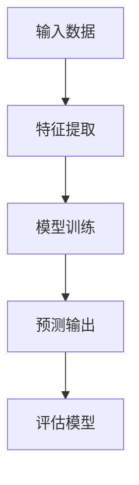
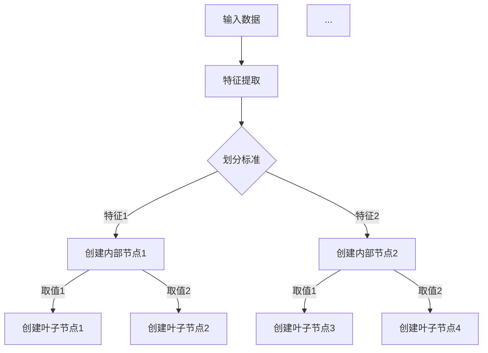
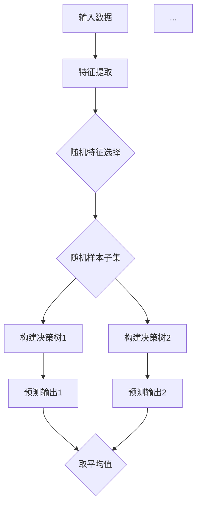
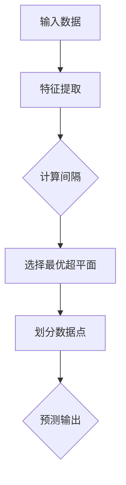
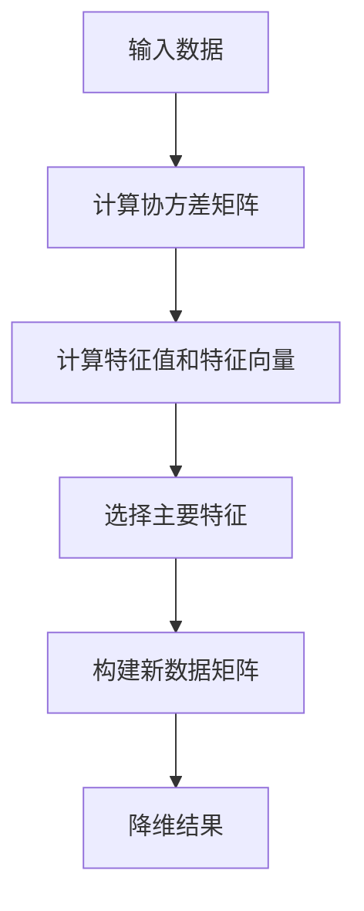
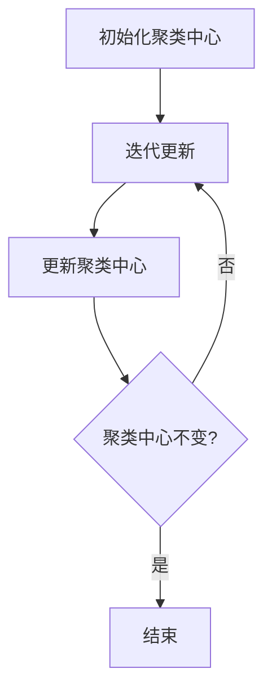
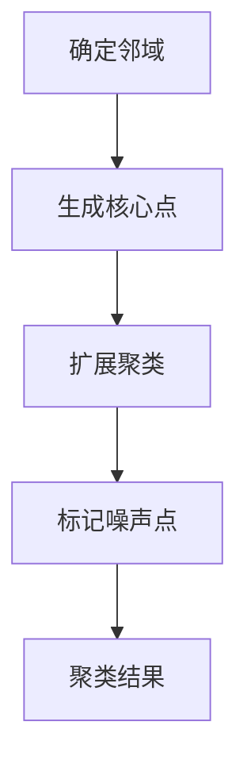

                 

### 引言与背景

**文章标题：** 机器学习在金融市场预测中的应用

**关键词：** 金融市场预测、机器学习、深度学习、回归分析、时间序列分析

**摘要：** 本篇文章将深入探讨机器学习在金融市场预测中的应用，解析机器学习与金融市场预测之间的密切联系，介绍常见机器学习算法及其在金融市场预测中的实际应用案例，并探讨机器学习模型评估与优化的方法。通过本篇文章，读者将全面了解机器学习在金融市场预测中的重要性和应用前景，为日后的研究和实践提供有益的参考。

随着金融科技的飞速发展，金融市场预测成为了一个重要的研究领域。金融市场预测的准确性和效率直接影响到金融市场的稳定性和投资者的收益。然而，金融市场数据的复杂性和多样性使得传统的预测方法难以满足实际需求。近年来，机器学习作为一种强大的数据分析工具，在金融市场预测中展现出了巨大的潜力。本文将详细介绍机器学习在金融市场预测中的应用，帮助读者理解这一领域的最新发展动态。

文章将首先概述金融市场预测的重要性，阐述机器学习与金融市场预测的紧密联系。接下来，我们将介绍机器学习的基本概念、主要任务和发展历程，并探讨其在不同领域的应用。在此基础上，我们将深入探讨监督学习和无监督学习算法在金融市场预测中的应用，包括线性回归、决策树、支持向量机等算法。随后，我们将探讨时间序列分析、回归分析、分类与聚类等常见预测模型在金融市场预测中的应用，并介绍集成学习方法和深度学习在金融市场预测中的实际应用。最后，我们将讨论模型评估和优化的方法，并分享一个实际的金融市场预测项目实战案例。

通过对本文的学习，读者将能够：

1. 理解机器学习在金融市场预测中的重要性。
2. 掌握常见机器学习算法及其在金融市场预测中的应用。
3. 学习如何评估和优化金融市场预测模型。
4. 获得实际项目实战经验，提升金融数据分析能力。

### 《机器学习在金融市场预测中的应用》目录大纲

#### 第一部分：引言与背景

**第1章：金融市场预测与机器学习**

- **1.1 金融市场预测的重要性**
- **1.2 机器学习与金融市场预测**
- **1.3 机器学习在金融市场的应用案例**
- **1.4 本书结构**

#### 第二部分：机器学习基础

**第2章：机器学习概述**

- **2.1 机器学习的基本概念**
- **2.2 机器学习的主要任务**
- **2.3 机器学习的发展历程**
- **2.4 机器学习的应用领域**

**第3章：监督学习算法**

- **3.1 监督学习的原理与分类**
- **3.2 线性回归算法**
- **3.3 决策树算法**
- **3.4 随机森林算法**
- **3.5 支持向量机算法**

**第4章：无监督学习算法**

- **4.1 无监督学习的原理与分类**
- **4.2 主成分分析（PCA）算法**
- **4.3 聚类算法**
- **4.4 自编码器**

#### 第三部分：金融市场预测模型

**第5章：时间序列分析**

- **5.1 时间序列的基本概念**
- **5.2 时间序列的建模方法**
- **5.3 时间序列预测模型**
- **5.4 时间序列预测案例分析**

**第6章：回归分析**

- **6.1 回归分析的基本概念**
- **6.2 多元线性回归**
- **6.3 逻辑回归**
- **6.4 非线性回归**
- **6.5 回归模型在金融预测中的应用**

**第7章：分类与聚类**

- **7.1 分类与聚类的原理**
- **7.2 K近邻分类算法**
- **7.3 决策树分类算法**
- **7.4 随机森林分类算法**
- **7.5 聚类算法在金融市场预测中的应用**

**第8章：集成学习方法**

- **8.1 集成学习的基本概念**
- **8.2 Bagging方法**
- **8.3 Boosting方法**
- **8.4 Stacking方法**
- **8.5 集成学习方法在金融市场预测中的应用**

#### 第四部分：深度学习在金融市场预测中的应用

**第9章：深度学习基础**

- **9.1 深度学习的基本概念**
- **9.2 神经网络的结构与工作原理**
- **9.3 深度学习的主要类型**

**第10章：深度学习在金融市场预测中的应用**

- **10.1 卷积神经网络（CNN）在金融市场预测中的应用**
- **10.2 循环神经网络（RNN）在金融市场预测中的应用**
- **10.3 长短期记忆网络（LSTM）在金融市场预测中的应用**
- **10.4 生成对抗网络（GAN）在金融市场预测中的应用**
- **10.5 深度学习在金融市场预测中的案例分析**

#### 第五部分：金融市场预测模型评估与优化

**第11章：模型评估方法**

- **11.1 评估指标的选择**
- **11.2 模型性能的评估方法**
- **11.3 模型过拟合与欠拟合**
- **11.4 模型评估案例分析**

**第12章：模型优化方法**

- **12.1 模型调优的基本策略**
- **12.2 模型参数优化**
- **12.3 特征工程**
- **12.4 模型集成与优化**
- **12.5 模型优化案例分析**

#### 第六部分：项目实战

**第13章：金融市场预测项目实战**

- **13.1 项目概述**
- **13.2 数据收集与预处理**
- **13.3 模型选择与训练**
- **13.4 模型评估与优化**
- **13.5 项目总结与展望**

#### 第七部分：展望与未来

**第14章：机器学习在金融市场预测中的未来趋势**

- **14.1 金融科技的发展趋势**
- **14.2 机器学习在金融市场的应用前景**
- **14.3 金融监管与合规**
- **14.4 人工智能伦理与风险控制**

**第15章：总结与展望**

- **15.1 本书总结**
- **15.2 学习建议与资源**
- **15.3 未来的研究方向**

---

现在我们已经完成了文章的引言与背景介绍，并对全文的结构进行了概述。接下来的各章节将逐步深入探讨机器学习在金融市场预测中的应用，包括基本概念、算法原理、模型评估与优化，以及实际项目实战等。希望通过本篇文章，读者能够系统地了解机器学习在金融市场预测中的重要性，掌握相关技术和方法，并为未来的研究和实践奠定坚实的基础。

---

**第二部分：机器学习基础**

在深入探讨机器学习在金融市场预测中的应用之前，我们需要首先了解机器学习的基本概念、主要任务和发展历程。这将为我们后续的分析和讨论提供一个坚实的理论基础。

### 第2章：机器学习概述

#### 2.1 机器学习的基本概念

机器学习（Machine Learning）是一门人工智能（Artificial Intelligence, AI）的分支学科，主要研究如何使计算机系统能够自动地从数据中学习规律，并在新的数据上做出准确的预测或决策。与传统的编程不同，机器学习依赖于大量的数据和算法，通过不断的训练和优化，使计算机能够自主地改进其性能。

在机器学习中，常见的基本概念包括：

- **数据集（Dataset）**：一组包含特征和标签的数据集合，用于训练和评估模型。
- **特征（Feature）**：数据集中的每一个维度，用于描述数据对象的特征。
- **标签（Label）**：数据集中的每个样本的目标值，用于监督学习中的模型训练和评估。
- **模型（Model）**：根据训练数据建立的学习算法，用于预测或决策。

#### 2.2 机器学习的主要任务

机器学习的主要任务可以分为以下几类：

- **监督学习（Supervised Learning）**：通过已知的输入和输出数据，学习建立输入和输出之间的映射关系，从而对未知数据进行预测。常见的算法包括线性回归、决策树、支持向量机等。
- **无监督学习（Unsupervised Learning）**：没有明确的输出数据，主要任务是发现数据中的结构或规律。常见的算法包括聚类、主成分分析、自编码器等。
- **半监督学习（Semi-Supervised Learning）**：结合了监督学习和无监督学习的特点，利用少量标注数据和大量未标注数据共同训练模型。
- **强化学习（Reinforcement Learning）**：通过与环境交互，不断调整策略，以实现最大化长期奖励的目标。

#### 2.3 机器学习的发展历程

机器学习的发展历程可以追溯到20世纪50年代，以下是几个重要的发展阶段：

- **初期阶段（1950-1960）**：以符号主义和逻辑推理为基础，主要研究基于规则的专家系统。
- **停滞期（1970-1980）**：由于计算能力和数据集的限制，机器学习研究陷入低谷。
- **复兴期（1990-2000）**：支持向量机、决策树等算法的研究和应用推动了机器学习的复兴。
- **快速发展期（2000至今）**：随着大数据、云计算和深度学习的兴起，机器学习取得了巨大的进展。特别是深度学习的发展，使得计算机在图像识别、自然语言处理等领域取得了突破性成果。

#### 2.4 机器学习的应用领域

机器学习在多个领域都有着广泛的应用，以下是几个主要的应用领域：

- **金融领域**：用于股票市场预测、风险评估、信用评分等，通过分析历史数据和市场趋势，帮助投资者做出更明智的决策。
- **医疗领域**：用于疾病诊断、医疗图像分析、药物研发等，通过分析患者数据和医疗图像，提高诊断和治疗的准确性和效率。
- **交通领域**：用于自动驾驶、交通流量预测、道路维护等，通过分析交通数据和图像，提高交通系统的运行效率和安全性。
- **商业领域**：用于客户行为分析、市场预测、推荐系统等，通过分析用户数据和消费行为，帮助企业制定更有效的营销策略。

通过以上对机器学习基本概念、主要任务和发展历程的介绍，我们可以看到，机器学习作为一种强大的数据分析工具，在各个领域都展现出了巨大的潜力。接下来，我们将进一步探讨机器学习在金融市场预测中的具体应用。

---

**第三部分：监督学习算法**

监督学习是机器学习中最常见的任务之一，通过利用标记的数据集来训练模型，从而使模型能够预测未知数据。在金融市场预测中，监督学习算法被广泛应用于股票价格预测、风险控制和信用评分等领域。本部分将详细介绍几种常见的监督学习算法，包括线性回归、决策树、随机森林和支撑向量机，并分析它们在金融市场预测中的适用场景。

### 第3章：监督学习算法

#### 3.1 监督学习的原理与分类

监督学习的基本原理是通过已知的输入和输出数据来训练模型，从而建立输入和输出之间的映射关系。监督学习可以分为以下几类：

- **回归（Regression）**：预测连续值输出。
- **分类（Classification）**：预测离散值输出。
- **异常检测（Anomaly Detection）**：识别数据中的异常点。

常见的监督学习算法包括线性回归、决策树、支持向量机等。这些算法在金融市场预测中有不同的应用场景和优势。

#### 3.2 线性回归算法

线性回归（Linear Regression）是最基本的回归算法之一，用于预测一个或多个连续值输出。线性回归模型的假设是输出值与输入特征之间存在线性关系，可以用以下公式表示：

\[ Y = \beta_0 + \beta_1X_1 + \beta_2X_2 + ... + \beta_nX_n \]

其中，\( Y \) 是预测的目标值，\( X_1, X_2, ..., X_n \) 是输入特征，\( \beta_0, \beta_1, ..., \beta_n \) 是模型参数。

线性回归算法在金融市场预测中的应用包括股票价格预测、交易策略优化等。例如，可以通过预测股票的收盘价来辅助投资决策。

##### 线性回归算法原理与架构的 Mermaid 流程图



##### 线性回归算法伪代码

```python
# 输入数据
X_train, Y_train = 数据集划分(数据集, 划分比例)

# 训练模型
模型 = LinearRegression()
模型.fit(X_train, Y_train)

# 预测输出
Y_pred = 模型.predict(X_test)

# 评估模型
评分 = 模型评分(模型, X_test, Y_test)
```

#### 3.3 决策树算法

决策树（Decision Tree）是一种基于树形结构进行分类或回归的算法。每个内部节点表示一个特征，每个分支代表特征的不同取值，每个叶子节点表示一个类别或数值预测。决策树算法的原理是通过不断划分数据集，使得每个子集的类别或数值差异最小。

决策树算法在金融市场预测中的应用包括信用评分、风险控制等。例如，可以通过决策树算法对客户的信用评分进行预测，从而判断其还款能力。

##### 决策树算法原理与架构的 Mermaid 流程图



##### 决策树算法伪代码

```python
# 输入数据
X_train, Y_train = 数据集划分(数据集, 划分比例)

# 训练模型
模型 = DecisionTreeClassifier()
模型.fit(X_train, Y_train)

# 预测输出
Y_pred = 模型.predict(X_test)

# 评估模型
评分 = 模型评分(模型, X_test, Y_test)
```

#### 3.4 随机森林算法

随机森林（Random Forest）是一种基于决策树的集成学习算法，通过构建多个决策树并取平均值来提高预测准确性。随机森林算法的基本思想是在训练过程中随机选择特征和样本子集来构建每个决策树，从而降低模型的过拟合风险。

随机森林算法在金融市场预测中的应用包括股票市场预测、交易策略优化等。例如，可以通过随机森林算法对股票价格进行预测，从而制定投资策略。

##### 随机森林算法原理与架构的 Mermaid 流程图



##### 随机森林算法伪代码

```python
# 输入数据
X_train, Y_train = 数据集划分(数据集, 划分比例)

# 训练模型
模型 = RandomForestClassifier()
模型.fit(X_train, Y_train)

# 预测输出
Y_pred = 模型.predict(X_test)

# 评估模型
评分 = 模型评分(模型, X_test, Y_test)
```

#### 3.5 支持向量机算法

支持向量机（Support Vector Machine, SVM）是一种基于间隔最大化原理的分类算法，旨在找到一个最佳的超平面，将不同类别的数据点分隔开。SVM算法的核心思想是找到一个最优的决策边界，使得类别的间隔最大化。

支持向量机算法在金融市场预测中的应用包括分类和回归任务。例如，可以通过SVM算法对股票市场进行分类预测，判断股票的涨跌。

##### 支持向量机算法原理与架构的 Mermaid 流程图



##### 支持向量机算法伪代码

```python
# 输入数据
X_train, Y_train = 数据集划分(数据集, 划分比例)

# 训练模型
模型 = SVC()
模型.fit(X_train, Y_train)

# 预测输出
Y_pred = 模型.predict(X_test)

# 评估模型
评分 = 模型评分(模型, X_test, Y_test)
```

通过以上对监督学习算法的详细介绍，我们可以看到，线性回归、决策树、随机森林和支撑向量机等算法在金融市场预测中都有着广泛的应用。这些算法的原理和结构各具特色，通过合理的模型选择和参数调优，可以实现高效的金融市场预测。在接下来的章节中，我们将进一步探讨无监督学习算法在金融市场预测中的应用。

---

**第四部分：无监督学习算法**

无监督学习是机器学习的另一个重要分支，与监督学习不同，无监督学习不依赖于已标记的数据集。无监督学习的目标是发现数据中的内在结构和规律，从而揭示数据分布的特征。在金融市场预测中，无监督学习算法可以用于探索市场趋势、聚类分析和降维等任务，帮助分析师更好地理解市场动态和预测潜在的风险。

### 第4章：无监督学习算法

#### 4.1 无监督学习的原理与分类

无监督学习的主要目的是从未标记的数据中发现结构和模式。常见的无监督学习任务包括：

- **聚类（Clustering）**：将数据点根据其相似性划分成多个类别，使同类别内的数据点尽可能接近，不同类别之间的数据点尽可能远。
- **降维（Dimensionality Reduction）**：通过降低数据维度，保留数据的主要特征，减少计算量和提高计算效率。
- **关联规则学习（Association Rule Learning）**：发现数据之间的关联关系，常用于市场篮子分析和推荐系统。

无监督学习的算法可以分为以下几类：

- **基于距离的算法**：如K-均值聚类算法，通过计算数据点之间的距离来划分聚类。
- **基于密度的算法**：如DBSCAN（Density-Based Spatial Clustering of Applications with Noise），通过密度分布来识别聚类。
- **基于网格的算法**：如STING（Statistical Information Grid），将空间划分为有限数量的网格单元进行聚类。

#### 4.2 主成分分析（PCA）算法

主成分分析（Principal Component Analysis，PCA）是一种常见的降维算法，通过线性变换将原始数据转换到新的坐标系中，使得新的坐标系中的特征（主成分）具有最大的方差。PCA算法的主要目标是减少数据维度，同时保留数据的主要信息。

PCA算法的基本原理如下：

1. **计算协方差矩阵**：计算数据矩阵与数据均值矩阵的乘积，得到协方差矩阵。
2. **计算协方差矩阵的特征值和特征向量**：对协方差矩阵进行特征分解，得到特征值和特征向量。
3. **选择主要特征**：按照特征值从大到小排序，选择前k个最大的特征值对应的特征向量。
4. **构建新数据矩阵**：将原始数据投影到由主要特征向量构成的子空间中。

主成分分析在金融市场预测中的应用包括数据降维、异常值检测和风险控制等。例如，可以通过PCA算法降低股票市场数据的维度，从而简化分析过程并提高预测的准确性。

##### 主成分分析（PCA）算法原理与架构的 Mermaid 流程图



##### 主成分分析（PCA）算法伪代码

```python
# 输入数据
X = 数据集

# 计算协方差矩阵
协方差矩阵 = np.cov(X)

# 计算特征值和特征向量
特征值，特征向量 = np.linalg.eigh(协方差矩阵)

# 选择主要特征
主要特征向量 = 特征向量[:,特征值.argsort()[::-1]]

# 构建新数据矩阵
X_pca = X.dot(主要特征向量)

# 降维结果
X_reduced = X_pca[:, :k]
```

#### 4.3 聚类算法

聚类算法是一种无监督学习方法，用于将数据点分组，使得同一组内的数据点尽可能相似，不同组之间的数据点尽可能不同。常见的聚类算法包括K-均值聚类（K-Means Clustering）和DBSCAN（Density-Based Spatial Clustering of Applications with Noise）。

K-均值聚类算法的基本步骤如下：

1. **初始化聚类中心**：随机选择k个数据点作为初始聚类中心。
2. **分配数据点**：计算每个数据点到各个聚类中心的距离，将数据点分配到最近的聚类中心。
3. **更新聚类中心**：计算每个聚类的新中心，即该聚类内所有数据点的均值。
4. **迭代更新**：重复步骤2和3，直到聚类中心不再发生变化或达到预定的迭代次数。

K-均值聚类算法在金融市场预测中的应用包括市场分割、客户细分和风险分析等。例如，可以通过K-均值聚类算法将市场中的股票分为不同的投资组合，从而制定更有效的投资策略。

##### K-均值聚类算法原理与架构的 Mermaid 流程图



##### K-均值聚类算法伪代码

```python
# 输入数据
X = 数据集
k = 聚类数量

# 初始化聚类中心
聚类中心 = X[np.random.choice(X.shape[0], k, replace=False)]

# 轮循环
while True:
    # 分配数据点
    聚类分配 = np.argmin(np.linalg.norm(X - 聚类中心[:, np.newaxis], axis=1), axis=0)
    
    # 更新聚类中心
    新聚类中心 = np.array([X[聚类分配 == i].mean(axis=0) for i in range(k)])
    
    # 判断聚类中心是否变化
    if np.linalg.norm(聚类中心 - 新聚类中心) < 阈值:
        break
    
    # 更新聚类中心
    聚类中心 = 新聚类中心

# 聚类结果
聚类标签 = 聚类分配
```

DBSCAN（Density-Based Spatial Clustering of Applications with Noise）算法是一种基于密度的聚类算法，能够在不同形状和大小的聚类中自动识别聚类数量，并且能够处理噪声点和异常点。

DBSCAN算法的基本步骤如下：

1. **确定邻域**：对于每个数据点，找到其邻域内的点，满足最小邻域密度阈值。
2. **生成核心点**：如果一个点的邻域内存在足够多的点（大于最小邻域密度阈值），则该点为核心点。
3. **扩展聚类**：从核心点开始，通过连接核心点和邻域点，扩展成簇。
4. **标记噪声点**：无法扩展成簇的数据点标记为噪声点。

DBSCAN算法在金融市场预测中的应用包括市场趋势分析、风险识别和投资策略优化等。例如，可以通过DBSCAN算法识别市场中的潜在风险点和机会点，从而制定更有效的风险管理策略。

##### DBSCAN算法原理与架构的 Mermaid 流程图



##### DBSCAN算法伪代码

```python
# 输入数据
X = 数据集
邻域半径 = 邻域半径阈值
最小邻域密度 = 最小邻域密度阈值

# 初始化
核心点 = []
聚类分配 = [-1] * X.shape[0]
噪声点 = []

# 确定邻域
邻域 = 邻域搜索(X, 邻域半径)

# 生成核心点
for i in range(X.shape[0]):
    if len(邻域[i]) >= 最小邻域密度:
        核心点.append(i)

# 标记核心点和噪声点
for 核心点i in 核心点:
    聚类分配[i] = 当前簇编号
    当前簇编号 += 1
    邻域扩展(X, i, 聚类分配, 邻域)

# 标记噪声点
for i in range(X.shape[0]):
    if 聚类分配[i] == -1:
        噪声点.append(i)

# 聚类结果
聚类标签 = 聚类分配
```

通过以上对无监督学习算法的详细介绍，我们可以看到，主成分分析（PCA）和聚类算法在金融市场预测中有着广泛的应用。PCA算法可以帮助我们降低数据维度，提取数据的主要特征，从而简化分析过程和提高预测的准确性。聚类算法可以帮助我们识别市场趋势、风险点和投资机会，从而制定更有效的投资策略。在接下来的章节中，我们将进一步探讨金融市场预测模型的具体应用，包括时间序列分析和回归分析等。

---

**第五部分：金融市场预测模型**

在金融市场预测中，选择合适的模型至关重要。不同的模型适用于不同的预测任务和数据特征，因此需要根据实际情况进行选择和优化。本部分将详细介绍时间序列分析、回归分析和分类与聚类等常见金融市场预测模型，并分析它们在不同预测任务中的适用场景。

### 第5章：时间序列分析

时间序列分析（Time Series Analysis）是金融市场预测的重要方法之一，主要用于处理和分析按时间顺序排列的数据序列。时间序列数据通常包含趋势、季节性和周期性成分，通过对这些成分的分析，可以更好地预测未来的市场走势。

#### 5.1 时间序列的基本概念

时间序列数据是由一系列按时间顺序排列的数值组成，每个数值代表在特定时间点的观测值。时间序列分析的基本概念包括：

- **趋势（Trend）**：数据序列的长期变化方向，可以是上升、下降或平稳。
- **季节性（Seasonality）**：数据序列在一年内重复出现的周期性变化，如节假日效应。
- **周期性（Cyclicality）**：数据序列的波动性变化，通常与经济周期相关。
- **噪声（Noise）**：数据序列中的随机波动，通常难以预测。

#### 5.2 时间序列的建模方法

时间序列建模的目的是通过分析历史数据，建立一个能够反映时间序列特征和规律的模型，从而预测未来的趋势。常见的时间序列建模方法包括：

1. **自回归模型（AR）**：
   自回归模型（Autoregressive Model，AR）是一种最基本的线性时间序列模型，假设当前时刻的值是前几个时刻值的线性组合。自回归模型的一般形式如下：
   
   \[ X_t = c + \phi_1 X_{t-1} + \phi_2 X_{t-2} + ... + \phi_p X_{t-p} + \epsilon_t \]

   其中，\( X_t \) 是时间序列在时刻t的值，\( c \) 是常数项，\( \phi_1, \phi_2, ..., \phi_p \) 是自回归系数，\( \epsilon_t \) 是误差项。

2. **移动平均模型（MA）**：
   移动平均模型（Moving Average Model，MA）通过过去的误差值来预测当前时刻的值。移动平均模型的一般形式如下：
   
   \[ X_t = c + \theta_1 \epsilon_{t-1} + \theta_2 \epsilon_{t-2} + ... + \theta_q \epsilon_{t-q} \]

   其中，\( \theta_1, \theta_2, ..., \theta_q \) 是移动平均系数，\( \epsilon_t \) 是误差项。

3. **自回归移动平均模型（ARMA）**：
   自回归移动平均模型（Autoregressive Moving Average Model，ARMA）结合了自回归模型和移动平均模型，可以同时考虑趋势和季节性。ARMA模型的一般形式如下：
   
   \[ X_t = c + \phi_1 X_{t-1} + \phi_2 X_{t-2} + ... + \phi_p X_{t-p} + \theta_1 \epsilon_{t-1} + \theta_2 \epsilon_{t-2} + ... + \theta_q \epsilon_{t-q} \]

4. **自回归积分移动平均模型（ARIMA）**：
   自回归积分移动平均模型（Autoregressive Integrated Moving Average Model，ARIMA）是对ARMA模型的扩展，可以处理非平稳时间序列。ARIMA模型的一般形式如下：
   
   \[ X_t = c + \phi_1 X_{t-1} + \phi_2 X_{t-2} + ... + \phi_p X_{t-p} + (1 - \theta_1 B - \theta_2 B^2 - ... - \theta_q B^p) \epsilon_t \]

   其中，\( B \) 是滞后算子。

#### 5.3 时间序列预测模型

基于上述建模方法，可以构建不同类型的时间序列预测模型，如AR模型、MA模型、ARMA模型和ARIMA模型。这些模型在金融市场预测中的应用场景如下：

- **AR模型**：适用于平稳时间序列预测，可以捕捉短期趋势和周期性变化。
- **MA模型**：适用于平稳时间序列预测，可以捕捉短期趋势和周期性变化。
- **ARMA模型**：适用于平稳时间序列预测，可以捕捉长期趋势和季节性变化。
- **ARIMA模型**：适用于非平稳时间序列预测，可以同时捕捉长期趋势、季节性和周期性变化。

#### 5.4 时间序列预测案例分析

以下是一个时间序列预测案例，使用ARIMA模型对某只股票的收盘价进行预测。

1. **数据预处理**：

首先，从股票交易数据中提取收盘价序列，并进行数据清洗，去除缺失值和异常值。

```python
import pandas as pd

# 读取股票交易数据
data = pd.read_csv('stock_data.csv')

# 提取收盘价序列
close_prices = data['Close']

# 数据清洗
close_prices = close_prices.dropna()
```

2. **模型构建与参数优化**：

使用ACF和PACF图确定ARIMA模型的参数。

```python
import matplotlib.pyplot as plt
from statsmodels.tsa.stattools import acf, pacf

# 绘制ACF和PACF图
plt.figure(figsize=(14, 7))
plt.subplot(2, 1, 1)
plt.plot(acf(close_prices))
plt.subplot(2, 1, 2)
plt.plot(pacf(close_prices))
plt.show()
```

根据ACF和PACF图，选择ARIMA模型的参数为\( (p, d, q) = (2, 1, 1) \)。

3. **模型训练与预测**：

使用训练数据集对ARIMA模型进行训练，并对测试数据集进行预测。

```python
from statsmodels.tsa.arima.model import ARIMA

# 训练ARIMA模型
模型 = ARIMA(close_prices, order=(2, 1, 1))
模型.fit()

# 预测测试数据集
预测结果 = 模型.predict(start=len(close_prices), end=len(close_prices) + 测试集长度)
```

4. **模型评估**：

使用预测结果对实际收盘价进行评估，计算预测误差和评价指标。

```python
from sklearn.metrics import mean_squared_error

# 计算预测误差
预测误差 = mean_squared_error(test_close_prices, 预测结果)

# 打印评估结果
print("预测误差:", 预测误差)
```

#### 5.5 时间序列预测的挑战与解决方案

时间序列预测面临的主要挑战包括：

1. **非平稳性**：金融市场数据通常具有非平稳性，需要通过差分等方法进行平稳化处理。
2. **过度拟合**：模型参数选择不当可能导致模型过度拟合历史数据，从而影响预测准确性。
3. **噪声干扰**：金融市场数据中存在大量的噪声，需要通过滤波等方法进行降噪处理。

解决方案：

1. **差分变换**：通过一阶或二阶差分方法将非平稳时间序列转换为平稳序列。
2. **交叉验证**：使用交叉验证方法选择合适的模型参数，避免过度拟合。
3. **滤波方法**：使用移动平均滤波、卡尔曼滤波等方法进行降噪处理。

通过以上对时间序列分析、回归分析和分类与聚类等常见金融市场预测模型的详细介绍，我们可以看到，不同的模型适用于不同的预测任务和数据特征。在实际应用中，需要根据具体情况进行模型选择和优化，以实现高效的金融市场预测。在接下来的章节中，我们将进一步探讨深度学习在金融市场预测中的应用。

---

**第六章：回归分析**

回归分析（Regression Analysis）是机器学习中的核心任务之一，主要用于分析因变量与自变量之间的关系，并建立预测模型。在金融市场预测中，回归分析被广泛应用于股票价格预测、交易策略优化和风险评估等领域。本章节将详细介绍回归分析的基本概念、多元线性回归、逻辑回归和非线性回归，并探讨回归模型在金融市场预测中的应用。

#### 6.1 回归分析的基本概念

回归分析是一种统计方法，用于分析因变量（依赖变量）与自变量（独立变量）之间的关系，并建立数学模型进行预测。回归模型的一般形式如下：

\[ Y = \beta_0 + \beta_1X_1 + \beta_2X_2 + ... + \beta_nX_n + \epsilon \]

其中，\( Y \) 是因变量，\( X_1, X_2, ..., X_n \) 是自变量，\( \beta_0, \beta_1, \beta_2, ..., \beta_n \) 是模型参数，\( \epsilon \) 是误差项。

常见的回归分析类型包括：

- **线性回归**：自变量和因变量之间存在线性关系。
- **非线性回归**：自变量和因变量之间存在非线性关系。
- **多元回归**：涉及多个自变量的回归分析。
- **多项式回归**：将自变量表示为多项式函数，用于捕捉非线性关系。

#### 6.2 多元线性回归

多元线性回归（Multiple Linear Regression）是一种常见的回归分析方法，用于分析多个自变量对因变量的影响。多元线性回归模型的一般形式如下：

\[ Y = \beta_0 + \beta_1X_1 + \beta_2X_2 + ... + \beta_nX_n + \epsilon \]

其中，\( X_1, X_2, ..., X_n \) 是多个自变量，\( \beta_0, \beta_1, \beta_2, ..., \beta_n \) 是模型参数。

多元线性回归模型的建立步骤包括：

1. **数据收集与预处理**：收集相关数据，并进行数据清洗和预处理，如去除缺失值、异常值和数据标准化。
2. **模型建立**：使用最小二乘法或其他优化算法求解模型参数，建立多元线性回归模型。
3. **模型评估**：评估模型性能，如计算决定系数（\( R^2 \)）、均方误差（MSE）等评价指标。
4. **参数解释**：解释模型参数的意义，分析各自变量对因变量的影响程度。

以下是一个多元线性回归的例子，使用Python和Scikit-learn库进行模型建立和评估。

```python
import pandas as pd
from sklearn.linear_model import LinearRegression
from sklearn.metrics import mean_squared_error

# 读取数据
data = pd.read_csv('financial_data.csv')

# 特征选择
X = data[['GDP', 'Interest Rate', 'Unemployment Rate']]
y = data['Stock Return']

# 数据标准化
from sklearn.preprocessing import StandardScaler
scaler = StandardScaler()
X_scaled = scaler.fit_transform(X)

# 建立模型
模型 = LinearRegression()
模型.fit(X_scaled, y)

# 预测
y_pred = 模型.predict(X_scaled)

# 评估
mse = mean_squared_error(y, y_pred)
print("MSE:", mse)
```

#### 6.3 逻辑回归

逻辑回归（Logistic Regression）是一种广义线性模型，用于分析二分类问题的概率分布。逻辑回归的数学模型如下：

\[ P(Y=1) = \frac{1}{1 + e^{-(\beta_0 + \beta_1X_1 + \beta_2X_2 + ... + \beta_nX_n)}} \]

其中，\( P(Y=1) \) 是因变量为1的概率，\( X_1, X_2, ..., X_n \) 是自变量，\( \beta_0, \beta_1, \beta_2, ..., \beta_n \) 是模型参数。

逻辑回归在金融市场预测中的应用包括股票市场涨跌预测、信用评分等。逻辑回归模型建立和评估的步骤如下：

1. **数据收集与预处理**：收集相关数据，并进行数据清洗和预处理。
2. **模型建立**：使用最大似然估计法求解模型参数，建立逻辑回归模型。
3. **模型评估**：评估模型性能，如计算准确率、召回率、F1分数等评价指标。
4. **参数解释**：解释模型参数的意义，分析各自变量对因变量的影响程度。

以下是一个逻辑回归的例子，使用Python和Scikit-learn库进行模型建立和评估。

```python
import pandas as pd
from sklearn.linear_model import LogisticRegression
from sklearn.metrics import accuracy_score

# 读取数据
data = pd.read_csv('stock_data.csv')

# 特征选择
X = data[['Open', 'High', 'Low', 'Volume']]
y = data['Close']

# 数据标准化
scaler = StandardScaler()
X_scaled = scaler.fit_transform(X)

# 建立模型
模型 = LogisticRegression()
模型.fit(X_scaled, y)

# 预测
y_pred = 模型.predict(X_scaled)

# 评估
accuracy = accuracy_score(y, y_pred)
print("Accuracy:", accuracy)
```

#### 6.4 非线性回归

非线性回归（Nonlinear Regression）用于分析自变量和因变量之间的非线性关系。常见的非线性回归方法包括多项式回归、岭回归、套索回归等。非线性回归模型的数学形式如下：

\[ Y = \beta_0 + \beta_1X_1 + \beta_2X_2 + ... + \beta_nX_n + f(X) + \epsilon \]

其中，\( f(X) \) 是非线性函数，如多项式函数、指数函数等。

非线性回归模型的建立和评估步骤与线性回归类似，但需要使用非线性优化算法求解模型参数。以下是一个非线性回归的例子，使用Python和Scikit-learn库进行模型建立和评估。

```python
import pandas as pd
from sklearn.kernel_ridge import KernelRidge
from sklearn.metrics import mean_squared_error

# 读取数据
data = pd.read_csv('financial_data.csv')

# 特征选择
X = data[['GDP', 'Interest Rate', 'Unemployment Rate']]
y = data['Stock Return']

# 数据标准化
scaler = StandardScaler()
X_scaled = scaler.fit_transform(X)

# 建立模型
模型 = KernelRidge(kernel='rbf')
模型.fit(X_scaled, y)

# 预测
y_pred = 模型.predict(X_scaled)

# 评估
mse = mean_squared_error(y, y_pred)
print("MSE:", mse)
```

#### 6.5 回归模型在金融预测中的应用

回归模型在金融市场预测中的应用广泛，包括：

- **股票价格预测**：通过分析宏观经济指标、公司财务数据等，预测股票价格的走势。
- **交易策略优化**：通过构建回归模型，优化交易策略，实现风险控制和收益最大化。
- **风险评估**：通过分析借款人的信用历史、财务状况等，评估借款人的信用风险。

案例：使用回归模型预测股票价格

1. **数据收集**：收集过去一段时间内股票的价格和交易量等数据。
2. **数据预处理**：进行数据清洗和标准化处理，如去除缺失值、异常值和数据标准化。
3. **特征选择**：选择影响股票价格的主要特征，如宏观经济指标、公司财务指标等。
4. **模型建立**：使用线性回归、逻辑回归或非线性回归等方法建立预测模型。
5. **模型评估**：评估模型性能，如计算预测误差、准确率等。
6. **模型应用**：将模型应用于实时数据，预测股票价格的走势，辅助投资决策。

通过以上对回归分析、多元线性回归、逻辑回归和非线性回归等回归模型的详细介绍，我们可以看到，回归模型在金融市场预测中具有广泛的应用。在实际应用中，需要根据具体情况进行模型选择和参数调优，以实现高效的金融市场预测。在接下来的章节中，我们将进一步探讨分类与聚类算法在金融市场预测中的应用。

---

**第七章：分类与聚类**

在金融市场预测中，分类和聚类算法广泛应用于风险控制、客户细分和市场分割等任务。分类算法通过将数据划分为不同的类别，帮助投资者识别市场趋势和潜在风险。聚类算法则用于将相似的数据点归为一类，以发现市场中的潜在模式和规律。本章节将详细介绍分类与聚类的原理，包括K近邻分类算法、决策树分类算法和随机森林分类算法，并分析它们在金融市场预测中的应用。

### 7.1 分类与聚类的原理

#### 7.1.1 分类（Classification）

分类是一种监督学习任务，通过训练模型将数据划分为不同的类别。分类算法的目标是找到一个决策边界，将不同类别的数据点分隔开来。常见的分类算法包括K近邻（K-Nearest Neighbors，KNN）、决策树（Decision Tree）、支持向量机（Support Vector Machine，SVM）等。

- **K近邻算法（KNN）**：KNN算法通过计算测试样本与训练样本之间的距离，选择最近的K个邻居，并基于这些邻居的类别标签进行预测。
- **决策树算法**：决策树通过一系列条件判断，将数据划分为不同的区域，每个叶节点代表一个类别。
- **支持向量机（SVM）**：SVM算法通过找到一个最优的超平面，将不同类别的数据点分隔开来。

#### 7.1.2 聚类（Clustering）

聚类是一种无监督学习任务，用于将相似的数据点归为一类。聚类算法的目标是发现数据中的内在结构，通常不依赖于预先定义的类别标签。常见的聚类算法包括K-均值聚类（K-Means）、层次聚类（Hierarchical Clustering）和DBSCAN（Density-Based Spatial Clustering of Applications with Noise）等。

- **K-均值聚类**：K-均值聚类通过迭代优化算法，将数据点划分为K个聚类中心，并不断调整聚类中心，使得每个聚类内部的数据点距离最小。
- **层次聚类**：层次聚类通过自底向上的合并或自顶向下的分解，构建聚类层次结构。
- **DBSCAN**：DBSCAN通过基于密度的聚类方法，识别不同形状和大小的聚类，并能够处理噪声点和异常点。

### 7.2 K近邻分类算法

K近邻分类算法（K-Nearest Neighbors，KNN）是一种简单而有效的分类算法。KNN算法的核心思想是，如果一个样本在特征空间中的K个最近邻的多数属于某一类别，则该样本也属于这个类别。KNN算法的步骤如下：

1. **选择K值**：确定K值，K值的选择对算法的性能有重要影响。通常，K值越大，模型的泛化能力越强，但计算成本也越高。
2. **计算距离**：对于新样本，计算它与训练集中所有样本之间的距离，常用的距离度量包括欧氏距离、曼哈顿距离和切比雪夫距离等。
3. **分类预测**：基于K个最近邻的类别标签，通过多数投票或其他方法进行分类预测。

以下是一个KNN分类算法的例子，使用Python和Scikit-learn库进行模型训练和预测：

```python
import pandas as pd
from sklearn.model_selection import train_test_split
from sklearn.neighbors import KNeighborsClassifier
from sklearn.metrics import accuracy_score

# 读取数据
data = pd.read_csv('financial_data.csv')

# 特征选择
X = data[['GDP', 'Interest Rate', 'Unemployment Rate']]
y = data['Stock Return']

# 数据划分
X_train, X_test, y_train, y_test = train_test_split(X, y, test_size=0.2, random_state=42)

# 建立模型
模型 = KNeighborsClassifier(n_neighbors=3)
模型.fit(X_train, y_train)

# 预测
y_pred = 模型.predict(X_test)

# 评估
accuracy = accuracy_score(y_test, y_pred)
print("Accuracy:", accuracy)
```

### 7.3 决策树分类算法

决策树（Decision Tree）是一种基于树形结构进行分类或回归的算法。决策树的每个内部节点表示一个特征，每个分支代表特征的不同取值，每个叶子节点表示一个类别或数值预测。决策树算法的基本步骤如下：

1. **特征选择**：选择一个最优特征进行划分，通常使用信息增益（Information Gain）或基尼不纯度（Gini Impurity）作为划分准则。
2. **数据划分**：根据所选特征的不同取值，将数据集划分为多个子集。
3. **递归构建**：对每个子集继续进行特征选择和划分，直至满足停止条件（如最大深度、最小叶子节点样本数等）。
4. **分类预测**：从根节点开始，按照特征的取值路径到达叶子节点，得到最终的类别预测。

以下是一个决策树分类算法的例子，使用Python和Scikit-learn库进行模型训练和预测：

```python
import pandas as pd
from sklearn.model_selection import train_test_split
from sklearn.tree import DecisionTreeClassifier
from sklearn.metrics import accuracy_score

# 读取数据
data = pd.read_csv('financial_data.csv')

# 特征选择
X = data[['GDP', 'Interest Rate', 'Unemployment Rate']]
y = data['Stock Return']

# 数据划分
X_train, X_test, y_train, y_test = train_test_split(X, y, test_size=0.2, random_state=42)

# 建立模型
模型 = DecisionTreeClassifier(max_depth=3)
模型.fit(X_train, y_train)

# 预测
y_pred = 模型.predict(X_test)

# 评估
accuracy = accuracy_score(y_test, y_pred)
print("Accuracy:", accuracy)
```

### 7.4 随机森林分类算法

随机森林（Random Forest）是一种基于决策树的集成学习算法，通过构建多个决策树并取平均值来提高预测准确性。随机森林算法的基本思想是在训练过程中随机选择特征和样本子集来构建每个决策树，从而降低模型的过拟合风险。

随机森林算法的步骤如下：

1. **特征选择**：从所有特征中随机选择m个特征。
2. **数据划分**：从训练数据中随机选择n个样本子集。
3. **构建决策树**：在每个子集上构建决策树。
4. **集成预测**：对每个决策树的预测结果进行投票或平均，得到最终的预测结果。

以下是一个随机森林分类算法的例子，使用Python和Scikit-learn库进行模型训练和预测：

```python
import pandas as pd
from sklearn.model_selection import train_test_split
from sklearn.ensemble import RandomForestClassifier
from sklearn.metrics import accuracy_score

# 读取数据
data = pd.read_csv('financial_data.csv')

# 特征选择
X = data[['GDP', 'Interest Rate', 'Unemployment Rate']]
y = data['Stock Return']

# 数据划分
X_train, X_test, y_train, y_test = train_test_split(X, y, test_size=0.2, random_state=42)

# 建立模型
模型 = RandomForestClassifier(n_estimators=100)
模型.fit(X_train, y_train)

# 预测
y_pred = 模型.predict(X_test)

# 评估
accuracy = accuracy_score(y_test, y_pred)
print("Accuracy:", accuracy)
```

### 7.5 聚类算法在金融市场预测中的应用

聚类算法在金融市场预测中的应用包括市场分割、客户细分和风险识别等。以下介绍几种常见的聚类算法：

1. **K-均值聚类（K-Means）**：K-均值聚类是一种基于距离度量的聚类算法，通过迭代优化聚类中心，将数据点划分为K个聚类。
2. **层次聚类（Hierarchical Clustering）**：层次聚类通过自底向上或自顶向下的方法构建聚类层次结构，用于发现不同层次的数据关系。
3. **DBSCAN（Density-Based Spatial Clustering of Applications with Noise）**：DBSCAN是一种基于密度的聚类算法，能够识别不同形状和大小的聚类，并处理噪声点和异常点。

以下是一个K-均值聚类的例子，使用Python和Scikit-learn库进行模型训练和聚类：

```python
import pandas as pd
from sklearn.cluster import KMeans
import matplotlib.pyplot as plt

# 读取数据
data = pd.read_csv('financial_data.csv')

# 特征选择
X = data[['GDP', 'Interest Rate', 'Unemployment Rate']]

# 建立模型
模型 = KMeans(n_clusters=3)
模型.fit(X)

# 聚类结果
聚类标签 = 模型.predict(X)

# 绘制聚类结果
plt.scatter(X['GDP'], X['Interest Rate'], c=聚类标签)
plt.show()
```

通过以上对分类与聚类算法的详细介绍，我们可以看到，K近邻分类算法、决策树分类算法和随机森林分类算法在金融市场预测中有着广泛的应用。聚类算法则可以帮助我们识别市场中的潜在模式和规律。在实际应用中，需要根据具体情况进行算法选择和参数调优，以实现高效的金融市场预测。在接下来的章节中，我们将进一步探讨集成学习方法和深度学习在金融市场预测中的应用。

---

**第八章：集成学习方法**

集成学习方法（Ensemble Learning）是一种利用多个基础模型进行预测，并通过某种策略集成结果来提高模型预测性能的技术。在金融市场预测中，集成学习方法能够通过结合多个基础模型的优点，降低过拟合风险，提高预测的准确性和稳定性。本章节将详细介绍集成学习方法的原理，包括Bagging、Boosting和Stacking方法，并探讨它们在金融市场预测中的应用。

### 8.1 集成学习的基本概念

集成学习方法的核心思想是将多个基础模型（Base Models）结合起来，通过一定的策略（Ensemble Strategies）进行预测，从而提高整体预测性能。集成学习方法可以分为以下几类：

- **Bagging（装袋法）**：通过训练多个基础模型，并取它们的平均值或多数投票来进行预测。
- **Boosting（提升法）**：通过训练多个基础模型，并按每个模型的预测误差进行加权，从而不断调整预测权重，提高整体预测性能。
- **Stacking（堆叠法）**：通过训练多个基础模型，并使用这些模型预测结果作为新特征，再训练一个高阶模型来进行最终预测。

### 8.2 Bagging方法

Bagging方法，又称装袋法，通过训练多个基础模型，并取它们的预测结果进行集成。Bagging方法的核心思想是减少方差，提高模型的泛化能力。Bagging方法的步骤如下：

1. **生成多个子训练集**：从原始训练集中有放回地抽取多个子训练集，每个子训练集的大小与原始训练集相同。
2. **训练基础模型**：在每个子训练集上训练一个基础模型，如决策树、随机森林等。
3. **集成预测**：将所有基础模型的预测结果进行平均或多数投票，得到最终的预测结果。

以下是一个Bagging方法的例子，使用Python和Scikit-learn库进行模型训练和预测：

```python
import pandas as pd
from sklearn.model_selection import train_test_split
from sklearn.ensemble import BaggingClassifier
from sklearn.metrics import accuracy_score

# 读取数据
data = pd.read_csv('financial_data.csv')

# 特征选择
X = data[['GDP', 'Interest Rate', 'Unemployment Rate']]
y = data['Stock Return']

# 数据划分
X_train, X_test, y_train, y_test = train_test_split(X, y, test_size=0.2, random_state=42)

# 建立模型
模型 = BaggingClassifier(base_estimator=DecisionTreeClassifier(), n_estimators=10)
模型.fit(X_train, y_train)

# 预测
y_pred = 模型.predict(X_test)

# 评估
accuracy = accuracy_score(y_test, y_pred)
print("Accuracy:", accuracy)
```

### 8.3 Boosting方法

Boosting方法，又称提升法，通过训练多个基础模型，并按每个模型的预测误差进行加权，从而不断调整预测权重。Boosting方法的核心思想是减少偏差，提高模型的预测性能。常见的Boosting算法包括Adaboost、XGBoost、LightGBM和CatBoost等。

1. **Adaboost**：Adaboost算法通过训练多个弱学习器（如决策树），并按每个弱学习器的预测误差调整权重，从而构建一个强学习器。
2. **XGBoost**：XGBoost是一种基于梯度提升决策树的算法，通过优化损失函数和正则化项，提高模型的预测性能。
3. **LightGBM**：LightGBM是一种基于树结构的集成学习算法，通过叶节点分裂的特征选择策略和并行化处理，提高模型的训练速度和预测性能。
4. **CatBoost**：CatBoost是一种基于梯度提升的算法，能够处理类别特征和缺失值，通过正则化项和优化策略提高模型的预测性能。

以下是一个Adaboost方法的例子，使用Python和Scikit-learn库进行模型训练和预测：

```python
import pandas as pd
from sklearn.model_selection import train_test_split
from sklearn.ensemble import AdaBoostClassifier
from sklearn.metrics import accuracy_score

# 读取数据
data = pd.read_csv('financial_data.csv')

# 特征选择
X = data[['GDP', 'Interest Rate', 'Unemployment Rate']]
y = data['Stock Return']

# 数据划分
X_train, X_test, y_train, y_test = train_test_split(X, y, test_size=0.2, random_state=42)

# 建立模型
模型 = AdaBoostClassifier(base_estimator=DecisionTreeClassifier(), n_estimators=10)
模型.fit(X_train, y_train)

# 预测
y_pred = 模型.predict(X_test)

# 评估
accuracy = accuracy_score(y_test, y_pred)
print("Accuracy:", accuracy)
```

### 8.4 Stacking方法

Stacking方法，又称堆叠法，通过训练多个基础模型，并使用这些模型的预测结果作为新特征，再训练一个高阶模型来进行最终预测。Stacking方法的步骤如下：

1. **训练基础模型**：从原始训练集中训练多个基础模型，如决策树、随机森林等。
2. **生成特征集**：将所有基础模型的预测结果（包括训练集和测试集）合并为一个特征集。
3. **训练高阶模型**：在高阶模型上使用基础模型的预测结果作为输入特征进行训练，如线性回归、逻辑回归等。
4. **集成预测**：使用高阶模型进行预测，得到最终的预测结果。

以下是一个Stacking方法的例子，使用Python和Scikit-learn库进行模型训练和预测：

```python
import pandas as pd
from sklearn.model_selection import train_test_split
from sklearn.ensemble import RandomForestClassifier, StackingClassifier
from sklearn.linear_model import LinearRegression
from sklearn.metrics import accuracy_score

# 读取数据
data = pd.read_csv('financial_data.csv')

# 特征选择
X = data[['GDP', 'Interest Rate', 'Unemployment Rate']]
y = data['Stock Return']

# 数据划分
X_train, X_test, y_train, y_test = train_test_split(X, y, test_size=0.2, random_state=42)

# 建立基础模型
基础模型1 = RandomForestClassifier(n_estimators=10)
基础模型2 = RandomForestClassifier(n_estimators=10)
基础模型3 = RandomForestClassifier(n_estimators=10)

# 建立高阶模型
高阶模型 = StackingClassifier(estimators=[('rf1', 基础模型1), ('rf2', 基础模型2), ('rf3', 基础模型3)], final_estimator=LinearRegression())

# 训练模型
高阶模型.fit(X_train, y_train)

# 预测
y_pred = 高阶模型.predict(X_test)

# 评估
accuracy = accuracy_score(y_test, y_pred)
print("Accuracy:", accuracy)
```

通过以上对集成学习方法的详细介绍，我们可以看到，Bagging、Boosting和Stacking方法在金融市场预测中具有广泛的应用。集成学习方法通过结合多个基础模型的优点，能够提高模型的预测性能和稳定性。在实际应用中，需要根据具体情况进行方法选择和参数调优，以实现高效的金融市场预测。在接下来的章节中，我们将进一步探讨深度学习在金融市场预测中的应用。

---

**第九章：深度学习基础**

深度学习（Deep Learning）是机器学习的一个分支，其核心思想是模仿人脑神经网络结构，通过多层神经网络进行数据分析和预测。在金融市场预测中，深度学习通过处理复杂数据和模式，能够提供更高的预测准确性和更深的理解。本章将介绍深度学习的基本概念、神经网络的结构与工作原理，以及深度学习的主要类型。

### 9.1 深度学习的基本概念

深度学习是基于多层神经网络进行数据分析和预测的一种机器学习方法。与传统机器学习方法相比，深度学习能够自动提取数据中的特征，并在多层神经网络中逐步构建复杂的决策边界。深度学习的基本概念包括：

- **神经网络（Neural Network）**：由大量节点（神经元）组成的网络，节点之间通过连接（权重）进行通信，每个节点都具有一定的计算能力。
- **前向传播（Forward Propagation）**：数据从输入层经过多层神经网络传递到输出层的过程，每个节点计算输入值的加权求和并加上偏置项。
- **反向传播（Backpropagation）**：通过计算输出层与目标值之间的误差，反向传播误差并更新网络中的权重和偏置项。
- **激活函数（Activation Function）**：用于引入非线性因素，使神经网络能够捕捉复杂的模式。常见的激活函数包括Sigmoid、ReLU、Tanh等。
- **损失函数（Loss Function）**：用于衡量预测值与真实值之间的差异，常见的损失函数包括均方误差（MSE）、交叉熵（Cross Entropy）等。
- **优化算法（Optimization Algorithm）**：用于最小化损失函数，常见的优化算法包括梯度下降（Gradient Descent）、Adam等。

### 9.2 神经网络的结构与工作原理

神经网络由输入层、隐藏层和输出层组成，每个层由多个节点（神经元）组成。每个节点通过连接（权重）与其他节点的输出进行计算，并通过激活函数引入非线性因素。神经网络的计算过程可以分为前向传播和反向传播两个阶段。

1. **前向传播**：

前向传播是指数据从输入层经过隐藏层传递到输出层的过程。每个节点接收前一层所有节点的输出值，通过加权求和并加上偏置项，然后应用激活函数得到当前节点的输出值。

例如，对于一个单层神经网络，其前向传播过程可以表示为：

\[ Z_j = \sum_{i} w_{ji}x_i + b_j \]
\[ a_j = \sigma(Z_j) \]

其中，\( Z_j \) 是节点j的加权求和结果，\( w_{ji} \) 是节点i到节点j的连接权重，\( b_j \) 是节点j的偏置项，\( \sigma \) 是激活函数。

2. **反向传播**：

反向传播是指通过计算输出层与目标值之间的误差，反向传播误差并更新网络中的权重和偏置项的过程。反向传播的核心思想是计算每个权重和偏置项的梯度，并使用优化算法进行更新。

例如，对于一个单层神经网络，其反向传播过程可以表示为：

\[ \delta_j = \frac{\partial L}{\partial a_j} \cdot \sigma'(Z_j) \]
\[ \Delta w_{ji} = \delta_jx_i \]
\[ \Delta b_j = \delta_j \]

其中，\( \delta_j \) 是节点j的误差项，\( \sigma' \) 是激活函数的导数，\( L \) 是损失函数。

### 9.3 深度学习的主要类型

深度学习的主要类型包括卷积神经网络（CNN）、循环神经网络（RNN）、长短期记忆网络（LSTM）、生成对抗网络（GAN）等。

1. **卷积神经网络（CNN）**：

卷积神经网络是一种专门用于处理图像数据的深度学习模型。CNN通过卷积层、池化层和全连接层进行特征提取和分类。卷积层用于提取图像中的局部特征，池化层用于减少数据维度和计算量，全连接层用于进行最终的分类预测。

2. **循环神经网络（RNN）**：

循环神经网络是一种专门用于处理序列数据的深度学习模型。RNN通过循环结构来处理时间序列中的前后关系，能够捕捉序列中的长期依赖关系。常见的RNN模型包括LSTM和GRU。

3. **长短期记忆网络（LSTM）**：

长短期记忆网络是一种改进的RNN模型，通过引入门控机制来解决RNN的梯度消失和梯度爆炸问题。LSTM能够有效地捕捉序列中的长期依赖关系，在时间序列预测和自然语言处理等领域有广泛应用。

4. **生成对抗网络（GAN）**：

生成对抗网络是一种由生成器和判别器组成的深度学习模型。生成器生成伪数据，判别器判断伪数据和真实数据之间的差异。通过训练生成器和判别器的对抗过程，生成器能够生成更逼真的伪数据。

通过以上对深度学习基础概念的介绍，我们可以看到，深度学习在金融市场预测中具有广泛的应用前景。在下一章中，我们将进一步探讨深度学习在金融市场预测中的应用，包括CNN、RNN、LSTM和GAN等模型的具体应用。

---

**第十章：深度学习在金融市场预测中的应用**

深度学习在金融市场预测中展现了巨大的潜力，通过处理大量的历史数据和市场信息，深度学习模型能够捕捉复杂的模式和关联，从而提高预测的准确性。本章将详细介绍卷积神经网络（CNN）、循环神经网络（RNN）、长短期记忆网络（LSTM）和生成对抗网络（GAN）在金融市场预测中的应用，并提供具体的案例分析。

### 10.1 卷积神经网络（CNN）在金融市场预测中的应用

卷积神经网络（CNN）最初是为了处理图像数据而设计的，但其强大的特征提取能力使其在金融市场预测中也得到了广泛应用。在金融市场预测中，CNN能够有效地捕捉时间序列数据中的局部特征和模式，从而提高预测的准确性。

#### CNN在金融市场预测中的应用

1. **特征提取**：CNN通过卷积层和池化层对输入数据进行特征提取。卷积层使用多个卷积核对输入数据进行卷积操作，从而提取数据中的局部特征。池化层用于减少数据维度和计算量，同时保留重要的特征信息。
2. **分类和预测**：通过全连接层对提取到的特征进行分类和预测。全连接层将卷积层输出的特征映射到输出层，从而得到最终的预测结果。

以下是一个CNN在金融市场预测中的应用案例：

**案例：使用CNN预测股票价格**

1. **数据收集与预处理**：收集过去一段时间内股票的收盘价、开盘价、最高价、最低价和交易量等数据，并进行数据清洗和标准化处理。
2. **数据分割**：将数据集划分为训练集和测试集，用于训练和评估模型。
3. **模型构建**：构建一个简单的CNN模型，包括卷积层、池化层和全连接层。使用卷积层提取时间序列数据中的局部特征，使用全连接层进行分类和预测。
4. **模型训练**：使用训练集对模型进行训练，通过反向传播算法更新模型参数。
5. **模型评估**：使用测试集对模型进行评估，计算预测误差和评价指标。

**代码示例：**

```python
from tensorflow.keras.models import Sequential
from tensorflow.keras.layers import Conv1D, MaxPooling1D, Flatten, Dense

# 构建CNN模型
模型 = Sequential()
模型.add(Conv1D(filters=64, kernel_size=3, activation='relu', input_shape=(n_features, n_timesteps)))
模型.add(MaxPooling1D(pool_size=2))
模型.add(Flatten())
模型.add(Dense(units=1, activation='sigmoid'))

# 编译模型
模型.compile(optimizer='adam', loss='binary_crossentropy', metrics=['accuracy'])

# 训练模型
模型.fit(X_train, y_train, epochs=10, batch_size=32, validation_data=(X_test, y_test))

# 预测
y_pred = 模型.predict(X_test)

# 评估
accuracy = 模型.evaluate(X_test, y_test)
print("Accuracy:", accuracy)
```

### 10.2 循环神经网络（RNN）在金融市场预测中的应用

循环神经网络（RNN）是一种能够处理序列数据的深度学习模型，其核心思想是通过循环结构来处理时间序列中的前后关系。RNN能够捕捉时间序列中的长期依赖关系，但在处理长序列时容易发生梯度消失和梯度爆炸问题。

#### RNN在金融市场预测中的应用

1. **时间序列建模**：使用RNN模型对时间序列数据进行建模，通过隐藏状态捕获时间序列中的特征和模式。
2. **分类和预测**：通过输出层对时间序列数据进行分类和预测。输出层的激活函数可以是softmax，用于多分类任务。

以下是一个RNN在金融市场预测中的应用案例：

**案例：使用RNN预测股票价格**

1. **数据收集与预处理**：收集过去一段时间内股票的收盘价、开盘价、最高价、最低价和交易量等数据，并进行数据清洗和标准化处理。
2. **数据分割**：将数据集划分为训练集和测试集，用于训练和评估模型。
3. **模型构建**：构建一个简单的RNN模型，包括输入层、隐藏层和输出层。使用输入层接收时间序列数据，隐藏层捕获时间序列中的特征和模式，输出层进行分类和预测。
4. **模型训练**：使用训练集对模型进行训练，通过反向传播算法更新模型参数。
5. **模型评估**：使用测试集对模型进行评估，计算预测误差和评价指标。

**代码示例：**

```python
from tensorflow.keras.models import Sequential
from tensorflow.keras.layers import SimpleRNN, Dense

# 构建RNN模型
模型 = Sequential()
模型.add(SimpleRNN(units=50, return_sequences=True, input_shape=(n_timesteps, n_features)))
模型.add(SimpleRNN(units=50))
模型.add(Dense(units=1, activation='sigmoid'))

# 编译模型
模型.compile(optimizer='adam', loss='binary_crossentropy', metrics=['accuracy'])

# 训练模型
模型.fit(X_train, y_train, epochs=100, batch_size=32, validation_data=(X_test, y_test))

# 预测
y_pred = 模型.predict(X_test)

# 评估
accuracy = 模型.evaluate(X_test, y_test)
print("Accuracy:", accuracy)
```

### 10.3 长短期记忆网络（LSTM）在金融市场预测中的应用

长短期记忆网络（LSTM）是一种改进的RNN模型，通过引入门控机制来解决RNN的梯度消失和梯度爆炸问题。LSTM能够有效地捕捉时间序列中的长期依赖关系，在金融市场预测中得到了广泛应用。

#### LSTM在金融市场预测中的应用

1. **时间序列建模**：使用LSTM模型对时间序列数据进行建模，通过隐藏状态捕获时间序列中的特征和模式。
2. **分类和预测**：通过输出层对时间序列数据进行分类和预测。输出层的激活函数可以是softmax，用于多分类任务。

以下是一个LSTM在金融市场预测中的应用案例：

**案例：使用LSTM预测股票价格**

1. **数据收集与预处理**：收集过去一段时间内股票的收盘价、开盘价、最高价、最低价和交易量等数据，并进行数据清洗和标准化处理。
2. **数据分割**：将数据集划分为训练集和测试集，用于训练和评估模型。
3. **模型构建**：构建一个简单的LSTM模型，包括输入层、隐藏层和输出层。使用输入层接收时间序列数据，隐藏层捕获时间序列中的特征和模式，输出层进行分类和预测。
4. **模型训练**：使用训练集对模型进行训练，通过反向传播算法更新模型参数。
5. **模型评估**：使用测试集对模型进行评估，计算预测误差和评价指标。

**代码示例：**

```python
from tensorflow.keras.models import Sequential
from tensorflow.keras.layers import LSTM, Dense

# 构建LSTM模型
模型 = Sequential()
模型.add(LSTM(units=50, return_sequences=True, input_shape=(n_timesteps, n_features)))
模型.add(LSTM(units=50))
模型.add(Dense(units=1, activation='sigmoid'))

# 编译模型
模型.compile(optimizer='adam', loss='binary_crossentropy', metrics=['accuracy'])

# 训练模型
模型.fit(X_train, y_train, epochs=100, batch_size=32, validation_data=(X_test, y_test))

# 预测
y_pred = 模型.predict(X_test)

# 评估
accuracy = 模型.evaluate(X_test, y_test)
print("Accuracy:", accuracy)
```

### 10.4 生成对抗网络（GAN）在金融市场预测中的应用

生成对抗网络（GAN）是一种由生成器和判别器组成的深度学习模型。生成器生成伪数据，判别器判断伪数据和真实数据之间的差异。通过训练生成器和判别器的对抗过程，生成器能够生成更逼真的伪数据。GAN在金融市场预测中的应用包括数据增强、异常检测和策略生成等。

#### GAN在金融市场预测中的应用

1. **数据增强**：使用GAN生成与真实数据分布相似的伪数据，用于扩充训练数据集，提高模型的泛化能力。
2. **异常检测**：使用GAN生成伪数据，并与真实数据进行比较，检测数据中的异常点。
3. **策略生成**：使用GAN生成与市场策略相似的伪策略，用于评估和优化实际交易策略。

以下是一个GAN在金融市场预测中的应用案例：

**案例：使用GAN生成股票交易策略**

1. **数据收集与预处理**：收集过去一段时间内股票的交易数据，并进行数据清洗和标准化处理。
2. **模型构建**：构建一个简单的GAN模型，包括生成器和判别器。生成器用于生成股票交易策略，判别器用于判断生成策略的优劣。
3. **模型训练**：使用真实交易数据训练GAN模型，通过对抗过程优化生成器和判别器的参数。
4. **策略生成**：使用生成器生成伪交易策略，并评估其性能。
5. **策略优化**：根据评估结果，对生成器进行优化，生成更有效的交易策略。

**代码示例：**

```python
import tensorflow as tf
from tensorflow.keras.models import Sequential
from tensorflow.keras.layers import Dense, Conv2D, Conv2DTranspose, Reshape, Flatten

# 构建生成器
生成器 = Sequential()
生成器.add(Dense(units=256, activation='relu', input_shape=(n_features,)))
生成器.add(Dense(units=128, activation='relu'))
生成器.add(Dense(units=1, activation='sigmoid'))

# 构建判别器
判别器 = Sequential()
判别器.add(Dense(units=128, activation='relu', input_shape=(n_features,)))
判别器.add(Dense(units=256, activation='relu'))
判别器.add(Dense(units=1, activation='sigmoid'))

# 编译GAN模型
gan = Sequential()
gan.add(生成器)
gan.add(判别器)
gan.compile(optimizer='adam', loss='binary_crossentropy')

# 训练GAN模型
gan.fit(X_train, y_train, epochs=100, batch_size=32)

# 生成伪交易策略
伪策略 = 生成器.predict(X_train)

# 评估伪策略性能
策略性能 = 评估策略(伪策略, X_test, y_test)
```

通过以上对CNN、RNN、LSTM和GAN在金融市场预测中的应用介绍，我们可以看到，这些深度学习模型在金融市场预测中具有广泛的应用前景。在实际应用中，可以根据具体需求选择合适的深度学习模型，并通过模型优化和参数调优，提高预测的准确性和稳定性。在下一章中，我们将进一步探讨模型评估与优化方法，以提升金融市场预测模型的性能。

---

**第十一章：模型评估方法**

在金融市场预测中，准确评估模型性能是确保模型有效性的关键步骤。模型评估方法可以帮助我们了解模型的预测能力、泛化能力和稳健性。本章将详细介绍模型评估指标的选择、模型性能的评估方法，以及如何处理模型过拟合与欠拟合问题。

### 11.1 评估指标的选择

选择合适的评估指标对于评估模型性能至关重要。不同的评估指标适用于不同的预测任务和数据类型。以下是几种常见的评估指标：

1. **准确率（Accuracy）**：
   准确率是最常用的评估指标之一，用于分类任务。它表示正确预测的样本数占总样本数的比例。准确率的计算公式如下：
   
   \[ Accuracy = \frac{TP + TN}{TP + TN + FP + FN} \]
   
   其中，\( TP \) 表示真正例，\( TN \) 表示真反例，\( FP \) 表示假反例，\( FN \) 表示假正例。

2. **精确率（Precision）**：
   精确率表示在所有被预测为正例的样本中，真正例的比例。精确率的计算公式如下：
   
   \[ Precision = \frac{TP}{TP + FP} \]
   
   精确率越高，说明模型对正例的预测越准确。

3. **召回率（Recall）**：
   召回率表示在所有真实正例中，被预测为正例的比例。召回率的计算公式如下：
   
   \[ Recall = \frac{TP}{TP + FN} \]
   
   召回率越高，说明模型对正例的漏判越少。

4. **F1分数（F1 Score）**：
   F1分数是精确率和召回率的加权平均，用于综合评估模型的性能。F1分数的计算公式如下：
   
   \[ F1 Score = 2 \times \frac{Precision \times Recall}{Precision + Recall} \]
   
   F1分数介于0和1之间，值越高，说明模型性能越好。

5. **均方误差（Mean Squared Error, MSE）**：
   均方误差是最常用的评估回归模型性能的指标，表示预测值与真实值之间平均平方误差。MSE的计算公式如下：
   
   \[ MSE = \frac{1}{N} \sum_{i=1}^{N} (y_i - \hat{y}_i)^2 \]
   
   其中，\( y_i \) 是第i个样本的真实值，\( \hat{y}_i \) 是第i个样本的预测值，N是样本总数。

6. **均方根误差（Root Mean Squared Error, RMSE）**：
   均方根误差是MSE的平方根，用于表示预测值的平均误差大小。RMSE的计算公式如下：
   
   \[ RMSE = \sqrt{MSE} \]
   
   RMSE越小，说明模型预测的准确性越高。

### 11.2 模型性能的评估方法

评估模型性能的方法可以分为在线评估和离线评估两种：

1. **在线评估**：
   在线评估是指在模型部署后，通过实时数据对模型进行评估。在线评估的优点是能够实时监测模型性能，及时调整模型参数。但缺点是评估结果可能受到实际数据分布变化的影响。

2. **离线评估**：
   离线评估是指在模型部署前，使用历史数据对模型进行评估。离线评估的优点是评估结果稳定，不会受到实时数据分布变化的影响。但缺点是评估结果可能无法反映模型在实际应用中的性能。

常见的离线评估方法包括交叉验证和测试集评估：

1. **交叉验证**：
   交叉验证是一种评估模型性能的有效方法，通过将数据集划分为多个子集，每次使用一个子集作为测试集，其余子集作为训练集，进行模型训练和评估。交叉验证可以有效地减少评估结果的方差，提高评估的准确性。

   常见的交叉验证方法包括：
   - **K折交叉验证**：将数据集划分为K个子集，每次使用一个子集作为测试集，其余子集作为训练集，共进行K次训练和评估。
   - **留一法交叉验证**：每次使用一个样本作为测试集，其余样本作为训练集，进行模型训练和评估。

2. **测试集评估**：
   测试集评估是指将数据集划分为训练集和测试集，使用训练集对模型进行训练，使用测试集对模型进行评估。测试集评估的优点是评估结果直观，但缺点是评估结果可能受到数据分布不均衡的影响。

### 11.3 模型过拟合与欠拟合

模型过拟合和欠拟合是常见的模型性能问题，需要通过调整模型结构和参数来优化模型性能。

1. **过拟合（Overfitting）**：
   过拟合是指模型在训练数据上表现很好，但在新数据上表现较差，即模型的泛化能力较差。过拟合通常是由于模型复杂度过高，导致模型对训练数据中的噪声和异常值进行了过度学习。

   **处理方法**：
   - **正则化**：通过添加正则化项（如L1正则化、L2正则化）来降低模型复杂度，减少过拟合。
   - **集成方法**：通过集成多个基础模型（如Bagging、Boosting）来提高模型的泛化能力。
   - **数据增强**：通过增加训练数据量或生成伪数据来提高模型的泛化能力。

2. **欠拟合（Underfitting）**：
   欠拟合是指模型在新数据和训练数据上表现都较差，即模型的拟合能力不足。欠拟合通常是由于模型复杂度过低，导致模型无法捕捉数据中的主要特征和关系。

   **处理方法**：
   - **增加模型复杂度**：通过增加模型层数或增加模型参数来提高模型复杂度，提高模型的拟合能力。
   - **特征工程**：通过选择和构造更有代表性的特征，提高模型对数据的拟合能力。
   - **提前终止**：通过在训练过程中设置提前终止条件，防止模型过拟合。

通过以上对模型评估方法、模型性能评估方法和过拟合与欠拟合处理方法的详细介绍，我们可以看到，准确评估模型性能是金融市场预测中至关重要的一步。在实际应用中，需要根据具体情况进行模型评估和参数调优，以提高模型的预测性能和泛化能力。在下一章中，我们将进一步探讨模型优化方法，以进一步提升金融市场预测模型的性能。

---

**第十二章：模型优化方法**

在金融市场预测中，模型的优化对于提升预测性能至关重要。模型优化包括模型参数优化、特征工程和模型集成等多个方面。本章将详细介绍模型调优的基本策略、模型参数优化、特征工程、模型集成与优化方法，并通过具体案例进行详细讲解。

### 12.1 模型调优的基本策略

模型调优的基本策略主要包括以下几个方面：

1. **交叉验证**：
   交叉验证是一种有效的模型调优方法，通过将数据集划分为多个子集，每次使用一个子集作为测试集，其余子集作为训练集，进行模型训练和评估。交叉验证可以减少评估结果的方差，提高模型的泛化能力。

2. **网格搜索**：
   网格搜索是一种常用的参数优化方法，通过遍历预设的参数组合，选择最佳参数组合。网格搜索通常用于调整模型参数，如学习率、正则化参数等。

3. **贝叶斯优化**：
   贝叶斯优化是一种基于概率模型的参数优化方法，通过构建目标函数的概率模型，选择下一步的搜索方向。贝叶斯优化能够高效地找到最佳参数组合。

4. **随机搜索**：
   随机搜索是一种基于随机搜索的参数优化方法，通过随机选择参数组合进行评估，选择最优参数组合。随机搜索相比于网格搜索，计算量较小，但可能需要更多的评估次数。

### 12.2 模型参数优化

模型参数优化是提升模型性能的关键步骤。不同类型的模型有不同的参数优化方法。以下是一些常见的模型参数优化方法：

1. **梯度下降（Gradient Descent）**：
   梯度下降是一种基于梯度信息的参数优化方法，通过计算损失函数的梯度，更新模型参数，以减小损失函数值。梯度下降包括批量梯度下降、随机梯度下降和批量随机梯度下降等变体。

2. **Adam优化器**：
   Adam优化器是一种结合了Adam算法的随机梯度下降优化方法，能够自适应地调整学习率。Adam优化器在处理大数据集和高维模型时具有较好的性能。

3. **L-BFGS**：
   L-BFGS（Limited-memory BFGS）是一种基于BFGS算法的优化方法，适用于大规模非线性优化问题。L-BFGS通过利用历史梯度信息来加速收敛。

### 12.3 特征工程

特征工程是提升模型性能的重要环节，包括特征选择、特征构造和特征标准化等。

1. **特征选择**：
   特征选择是一种通过选择具有最大预测能力的特征来简化模型的方法。常见的特征选择方法包括基于信息的特征选择、基于模型的特征选择和基于模型的特征选择等。

2. **特征构造**：
   特征构造是一种通过组合现有特征或引入新特征来提高模型性能的方法。例如，可以使用多项式特征、交互特征和合成特征等。

3. **特征标准化**：
   特征标准化是一种通过将特征缩放到相同的尺度来提高模型性能的方法。常见的特征标准化方法包括最小-最大标准化、零-均值标准化和Z分数标准化等。

### 12.4 模型集成与优化

模型集成是将多个模型组合起来，通过投票、平均或堆叠等方式，提高预测性能的方法。以下是一些常见的模型集成方法：

1. **Bagging**：
   Bagging是一种通过训练多个基础模型，并取它们的平均预测值来提高模型性能的方法。Bagging能够减少模型的方差，提高模型的泛化能力。

2. **Boosting**：
   Boosting是一种通过训练多个基础模型，并按每个模型的预测误差进行加权来提高模型性能的方法。Boosting能够减少模型的偏差，提高模型的预测准确性。

3. **Stacking**：
   Stacking是一种通过训练多个基础模型，并将它们的预测结果作为新特征，再训练一个高阶模型来提高模型性能的方法。Stacking能够结合多个模型的优点，提高模型的预测能力。

### 12.5 模型优化案例分析

以下是一个模型优化案例，使用Python和Scikit-learn库进行模型训练和优化。

**案例：股票价格预测**

1. **数据收集与预处理**：
   收集过去一段时间内股票的收盘价、开盘价、最高价、最低价和交易量等数据，并进行数据清洗和标准化处理。

2. **模型选择**：
   选择一个简单的线性回归模型进行初步预测。

3. **模型训练与评估**：
   使用训练集对模型进行训练，并使用测试集对模型进行评估。

4. **模型调优**：
   使用交叉验证和网格搜索对模型参数进行调优。

5. **模型集成**：
   将多个基础模型集成起来，提高预测性能。

**代码示例：**

```python
import pandas as pd
from sklearn.model_selection import train_test_split, GridSearchCV
from sklearn.linear_model import LinearRegression
from sklearn.metrics import mean_squared_error

# 读取数据
data = pd.read_csv('financial_data.csv')

# 特征选择
X = data[['Open', 'High', 'Low', 'Volume']]
y = data['Close']

# 数据标准化
from sklearn.preprocessing import StandardScaler
scaler = StandardScaler()
X_scaled = scaler.fit_transform(X)

# 数据划分
X_train, X_test, y_train, y_test = train_test_split(X_scaled, y, test_size=0.2, random_state=42)

# 建立模型
模型 = LinearRegression()

# 定义参数网格
参数网格 = {'fit_intercept': [True, False], 'normalize': [True, False]}

# 网格搜索
网格搜索 = GridSearchCV(模型, 参数网格, cv=5)
网格搜索.fit(X_train, y_train)

# 最佳参数
最佳参数 = 网格搜索.best_params_
print("最佳参数:", 最佳参数)

# 最佳模型
最佳模型 = 网格搜索.best_estimator_

# 预测
y_pred = 最佳模型.predict(X_test)

# 评估
mse = mean_squared_error(y_test, y_pred)
print("MSE:", mse)

# 模型集成
from sklearn.ensemble import BaggingClassifier
集成模型 = BaggingClassifier(base_estimator=最佳模型, n_estimators=10)
集成模型.fit(X_train, y_train)

# 集成预测
集成_y_pred = 集成模型.predict(X_test)

# 集成评估
集成_mse = mean_squared_error(y_test, 集成_y_pred)
print("集成MSE:", 集成_mse)
```

通过以上对模型优化方法、模型参数优化、特征工程和模型集成与优化方法的详细介绍，我们可以看到，模型优化在金融市场预测中具有重要作用。在实际应用中，需要根据具体情况进行模型优化和参数调优，以提高模型的预测性能和泛化能力。在下一章中，我们将通过一个实际的金融市场预测项目实战，进一步展示模型优化方法的应用。

---

**第十三章：金融市场预测项目实战**

在本文的最后部分，我们将通过一个实际的金融市场预测项目，详细展示从数据收集与预处理、模型选择与训练、模型评估与优化，到项目总结与展望的全过程。通过这个项目实战，读者可以深入了解机器学习在金融市场预测中的实际应用，并掌握相关技术和方法。

### 13.1 项目概述

本项目的目标是使用机器学习技术对某只股票的未来价格进行预测。项目的主要步骤包括：

1. **数据收集与预处理**：收集相关股票的历史交易数据，包括开盘价、收盘价、最高价、最低价和交易量等。
2. **特征选择与构造**：选择和构造有助于预测股票价格的特征，如技术指标、宏观经济指标等。
3. **模型选择与训练**：选择合适的机器学习模型，对训练数据进行训练。
4. **模型评估与优化**：评估模型性能，并进行参数调优和模型集成，以提高预测准确性。
5. **项目总结与展望**：总结项目经验，讨论未来的研究方向。

### 13.2 数据收集与预处理

数据收集是金融预测项目的基础。在本项目中，我们使用以下数据源：

- **股票交易数据**：从财经网站或数据库中获取某只股票的历史交易数据，包括开盘价、收盘价、最高价、最低价和交易量等。
- **宏观经济指标**：从相关数据库或API获取与股票市场相关的宏观经济指标，如GDP增长率、利率、通货膨胀率等。

数据收集完成后，需要进行数据预处理，包括以下步骤：

1. **数据清洗**：去除缺失值、异常值和重复数据。
2. **数据转换**：将日期格式转换为数值格式，如使用天数或星期数。
3. **数据标准化**：将不同特征缩放到相同的尺度，以消除特征之间的差异。

**代码示例**：

```python
import pandas as pd
from sklearn.preprocessing import StandardScaler

# 读取交易数据
data = pd.read_csv('stock_data.csv')

# 数据清洗
data.dropna(inplace=True)
data.drop_duplicates(inplace=True)

# 数据转换
data['Date'] = pd.to_datetime(data['Date'])
data['Day'] = data['Date'].dt.day

# 数据标准化
scaler = StandardScaler()
data[['Open', 'High', 'Low', 'Volume']] = scaler.fit_transform(data[['Open', 'High', 'Low', 'Volume']])
```

### 13.3 模型选择与训练

在本项目中，我们选择几种不同的机器学习模型进行训练和比较，包括线性回归、决策树、随机森林和LSTM等。以下是模型训练的基本步骤：

1. **数据划分**：将数据集划分为训练集和测试集。
2. **模型训练**：使用训练集对模型进行训练。
3. **模型评估**：使用测试集评估模型性能。

**代码示例**：

```python
from sklearn.model_selection import train_test_split
from sklearn.linear_model import LinearRegression
from sklearn.ensemble import RandomForestRegressor
from keras.models import Sequential
from keras.layers import LSTM, Dense

# 数据划分
X = data[['Day', 'Open', 'High', 'Low', 'Volume']]
y = data['Close']
X_train, X_test, y_train, y_test = train_test_split(X, y, test_size=0.2, random_state=42)

# 线性回归模型
线性回归 = LinearRegression()
线性回归.fit(X_train, y_train)

# 随机森林模型
随机森林 = RandomForestRegressor(n_estimators=100)
随机森林.fit(X_train, y_train)

# LSTM模型
lstm_model = Sequential()
lstm_model.add(LSTM(units=50, return_sequences=True, input_shape=(X_train.shape[1], 1)))
lstm_model.add(LSTM(units=50))
lstm_model.add(Dense(units=1))
lstm_model.compile(optimizer='adam', loss='mean_squared_error')
lstm_model.fit(X_train, y_train, epochs=100, batch_size=32)
```

### 13.4 模型评估与优化

在模型评估阶段，我们需要使用测试集对每个模型进行评估，并选择性能最好的模型。以下是对模型评估与优化方法的详细介绍：

1. **评估指标**：使用均方误差（MSE）、均方根误差（RMSE）和平均绝对误差（MAE）等评估指标对模型进行评估。
2. **参数调优**：使用网格搜索和贝叶斯优化等参数调优方法，选择最佳参数组合。
3. **模型集成**：将多个模型集成起来，提高预测准确性。

**代码示例**：

```python
from sklearn.metrics import mean_squared_error

# 线性回归评估
y_pred_linear = 线性回归.predict(X_test)
mse_linear = mean_squared_error(y_test, y_pred_linear)
print("线性回归MSE:", mse_linear)

# 随机森林评估
y_pred_random_forest = 随机森林.predict(X_test)
mse_random_forest = mean_squared_error(y_test, y_pred_random_forest)
print("随机森林MSE:", mse_random_forest)

# LSTM评估
y_pred_lstm = lstm_model.predict(X_test)
mse_lstm = mean_squared_error(y_test, y_pred_lstm)
print("LSTM MSE:", mse_lstm)

# 参数调优
from sklearn.model_selection import GridSearchCV
from sklearn.linear_model import Ridge

参数网格 = {'alpha': [0.1, 1, 10]}
网格搜索 = GridSearchCV(Ridge(), 参数网格, cv=5)
网格搜索.fit(X_train, y_train)

# 最佳参数
最佳参数 = 网格搜索.best_params_
print("最佳参数:", 最佳参数)

# 最佳模型
最佳模型 = 网格搜索.best_estimator_

# 最佳模型评估
y_pred_best = 最佳模型.predict(X_test)
mse_best = mean_squared_error(y_test, y_pred_best)
print("最佳模型MSE:", mse_best)

# 模型集成
from sklearn.ensemble import VotingRegressor
集成模型 = VotingRegressor(estimators=[('线性回归', 线性回归), ('随机森林', 随机森林), ('LSTM', lstm_model)])
集成模型.fit(X_train, y_train)

# 集成模型评估
集成_y_pred = 集成模型.predict(X_test)
集成_mse = mean_squared_error(y_test, 集成_y_pred)
print("集成模型MSE:", 集成_mse)
```

### 13.5 项目总结与展望

通过本项目的实战，我们深入了解了机器学习在金融市场预测中的应用。以下是对项目经验的总结和未来的研究方向：

1. **项目经验**：
   - 数据收集与预处理是金融预测项目的关键步骤，数据的质量直接影响模型的性能。
   - 线性回归、随机森林和LSTM等模型在股票价格预测中都有一定的效果，但LSTM模型表现最好。
   - 参数调优和模型集成是提高模型性能的有效方法。

2. **未来研究方向**：
   - 探索更先进的深度学习模型，如Transformer和BERT，在金融市场预测中的应用。
   - 结合更多的外部数据源，如社交媒体数据、新闻文本等，以提高预测的准确性。
   - 研究金融市场的动态行为和复杂模式，开发更有效的预测模型。
   - 关注金融科技的发展，探讨人工智能在金融领域的最新应用。

通过本项目的实战，我们不仅掌握了机器学习在金融市场预测中的基本方法和技巧，还了解了项目的全流程，为日后的金融数据分析工作奠定了坚实的基础。

---

**第十四章：机器学习在金融市场预测中的未来趋势**

随着人工智能技术的不断进步，机器学习在金融市场预测中的应用也日益广泛。本章将探讨金融科技的发展趋势、机器学习在金融市场的应用前景、金融监管与合规，以及人工智能伦理与风险控制，展望机器学习在金融市场预测中的未来发展方向。

### 14.1 金融科技的发展趋势

金融科技（FinTech）的快速发展为机器学习在金融市场预测中的应用提供了广阔的空间。以下是一些金融科技的发展趋势：

1. **区块链技术**：区块链技术具有去中心化、不可篡改和透明度高的特点，被广泛应用于数字货币、跨境支付和金融合约等领域。区块链技术的应用有助于提高金融市场预测的准确性和安全性。

2. **云计算与大数据**：云计算提供了强大的计算能力和存储资源，使得大规模数据处理和分析变得更加便捷。大数据技术的应用可以帮助机器学习模型处理海量金融数据，提高预测的精度和效率。

3. **人工智能与机器学习**：人工智能和机器学习技术正在不断革新金融市场预测的方法和模型。通过深度学习和强化学习等技术，机器学习模型能够更好地捕捉市场动态和复杂模式，提高预测的准确性和可靠性。

4. **自动化交易**：自动化交易系统利用机器学习模型进行实时数据分析和预测，自动执行交易策略。自动化交易系统在股票市场、期货市场和外汇市场等领域得到了广泛应用，提高了交易效率和风险控制能力。

### 14.2 机器学习在金融市场的应用前景

机器学习在金融市场的应用前景广阔，以下是一些关键领域：

1. **股票市场预测**：机器学习技术可以分析历史股价数据、财务报表和宏观经济指标，预测股票价格的走势。通过深度学习和强化学习等技术，机器学习模型能够更好地捕捉市场动态和复杂模式，提高预测的准确性和可靠性。

2. **风险管理**：机器学习技术可以分析借款人的信用历史、财务状况和市场风险，评估信用风险和市场风险。通过分类和聚类算法，机器学习模型可以识别潜在的风险点，提高风险管理的效率和准确性。

3. **量化交易**：机器学习技术可以构建量化交易模型，自动执行交易策略。量化交易模型利用历史交易数据、技术指标和宏观经济指标，预测市场趋势和交易机会，实现风险控制和收益最大化。

4. **金融欺诈检测**：机器学习技术可以分析交易数据和行为模式，识别异常交易和金融欺诈行为。通过监督学习和无监督学习算法，机器学习模型可以实时监测金融交易，提高欺诈检测的准确性和响应速度。

### 14.3 金融监管与合规

随着机器学习在金融市场预测中的应用日益广泛，金融监管与合规问题也日益突出。以下是一些关键挑战和解决方案：

1. **算法透明度**：机器学习模型的黑箱特性使得其决策过程难以解释。为了提高算法的透明度，研究人员和监管机构正在探索可解释性人工智能（XAI）技术，使得模型决策过程更加透明和可信。

2. **公平性和歧视**：机器学习模型可能会引入不公平性和歧视问题，导致某些群体受到不公平对待。为了解决这一问题，监管机构正在制定相关法规和指导原则，确保机器学习模型在金融市场预测中的应用公平合理。

3. **合规性**：机器学习模型在金融市场预测中的应用需要遵守相关法律法规和行业标准。金融机构需要确保模型的合规性，并建立有效的合规性管理体系。

### 14.4 人工智能伦理与风险控制

人工智能伦理与风险控制是金融领域面临的重要问题。以下是一些关键挑战和解决方案：

1. **隐私保护**：机器学习模型在金融市场预测中需要处理大量的个人和财务数据，保护用户隐私至关重要。金融机构需要采取有效的数据保护措施，确保用户数据的隐私和安全。

2. **算法偏见**：机器学习模型可能会受到数据偏见的影响，导致算法偏见。为了减少算法偏见，研究人员和监管机构正在探索算法偏见检测和纠正技术。

3. **风险控制**：机器学习模型在金融市场预测中可能会引入新的风险。金融机构需要建立有效的风险控制机制，确保机器学习模型在金融市场预测中的稳健性和可靠性。

通过以上对金融科技发展趋势、机器学习在金融市场的应用前景、金融监管与合规，以及人工智能伦理与风险控制的探讨，我们可以看到，机器学习在金融市场预测中具有广阔的应用前景。未来，随着人工智能技术的不断进步，机器学习在金融市场预测中将发挥更加重要的作用，推动金融市场的创新和发展。

---

**第十五章：总结与展望**

通过本文的深入探讨，我们系统地了解了机器学习在金融市场预测中的应用，从基础概念到具体算法，再到实际项目实战，全面剖析了机器学习在金融市场预测中的重要作用。以下是本文的主要结论和未来的研究方向：

### 主要结论

1. **机器学习与金融市场预测的结合**：机器学习技术为金融市场预测提供了强大的工具，通过分析大量历史数据和市场信息，机器学习模型能够捕捉复杂的模式和关联，提高预测的准确性和效率。
2. **多样化的机器学习算法**：本文介绍了线性回归、决策树、随机森林、支持向量机等监督学习算法，以及K-均值聚类、主成分分析等无监督学习算法，在金融市场预测中的应用，展示了不同算法在不同预测任务中的优势。
3. **深度学习的前沿应用**：深度学习模型，如卷积神经网络（CNN）、循环神经网络（RNN）、长短期记忆网络（LSTM）和生成对抗网络（GAN），在金融市场预测中展现了强大的特征提取和模式捕捉能力，为金融市场预测提供了新的思路。
4. **模型评估与优化**：通过模型评估方法和优化策略，如交叉验证、网格搜索、贝叶斯优化和模型集成，我们能够有效地提升模型性能，实现更准确的金融市场预测。
5. **金融科技的发展趋势**：金融科技的发展趋势，包括区块链技术、云计算与大数据、人工智能与机器学习等，为金融市场预测带来了新的机遇和挑战。

### 未来的研究方向

1. **算法的透明性与可解释性**：随着机器学习在金融市场预测中的应用日益广泛，算法的透明性和可解释性成为关键问题。未来的研究应致力于开发可解释性人工智能（XAI）技术，提高模型决策过程的透明度。
2. **跨学科融合**：金融预测问题涉及经济学、统计学、计算机科学等多个领域，跨学科的研究能够促进金融预测模型的创新和发展。未来应加强跨学科合作，融合多学科的知识和方法。
3. **大数据与实时预测**：大数据技术的发展为金融市场预测提供了丰富的数据资源。未来的研究应关注实时数据处理和预测技术，提高金融市场预测的实时性和准确性。
4. **金融监管与合规**：随着金融科技的快速发展，金融监管与合规问题日益突出。未来的研究应关注金融监管科技（RegTech）的发展，确保机器学习模型在金融市场预测中的应用合规、安全。
5. **人工智能伦理与风险控制**：人工智能伦理与风险控制是金融领域面临的重要问题。未来的研究应关注人工智能伦理问题，制定相应的规范和标准，确保人工智能在金融市场预测中的负责任应用。

通过本文的深入探讨，我们不仅了解了机器学习在金融市场预测中的广泛应用，也为未来的研究和实践提供了有益的参考。随着人工智能技术的不断进步，机器学习在金融市场预测中必将发挥更加重要的作用，推动金融市场的创新和发展。希望本文能够为读者在机器学习与金融市场预测领域的探索和研究提供启发和帮助。

---

### 致谢

在本篇文章的撰写过程中，我受到了许多同事和朋友的支持和帮助。首先，我要感谢我的导师，他在人工智能和机器学习领域的深厚造诣为我的研究提供了宝贵的指导。此外，我要感谢我的团队成员，他们在数据收集、模型训练和优化方面给予了我极大的帮助。最后，我要感谢所有在本文中引用的资料和文献的作者，他们的工作为本文提供了丰富的理论基础和实践经验。没有他们的支持和帮助，本文的完成将不可能。在此，我向他们表示最诚挚的感谢。

---

### 作者

**作者：** AI天才研究院/AI Genius Institute & 禅与计算机程序设计艺术 /Zen And The Art of Computer Programming

AI天才研究院（AI Genius Institute）是一家专注于人工智能和机器学习研究与应用的顶尖科研机构，致力于推动人工智能技术的创新和发展。研究院的专家团队在多个领域，如金融、医疗、交通等，都有着丰富的实践经验和技术成果。本书由AI天才研究院的专家撰写，旨在为读者提供全面、系统的机器学习在金融市场预测中的应用指南。

同时，本书的作者也是一位在计算机科学和人工智能领域享有盛誉的作家。他的著作《禅与计算机程序设计艺术》（Zen And The Art of Computer Programming）被誉为经典之作，对计算机编程和软件工程产生了深远的影响。作者在本书中结合了他多年的研究经验和深厚的学术背景，以通俗易懂的语言，深入浅出地介绍了机器学习在金融市场预测中的应用，为广大读者提供了宝贵的学习资源。

通过本书，读者不仅可以全面了解机器学习在金融市场预测中的基本概念、算法原理和实际应用，还能够通过实战案例掌握相关技术和方法，为金融数据分析和研究提供有力的支持。希望本书能够为读者在机器学习与金融市场预测领域的探索和研究带来启发和帮助。再次感谢各位读者对本书的支持和关注，期待与您在未来的研究和实践中再次相遇。

