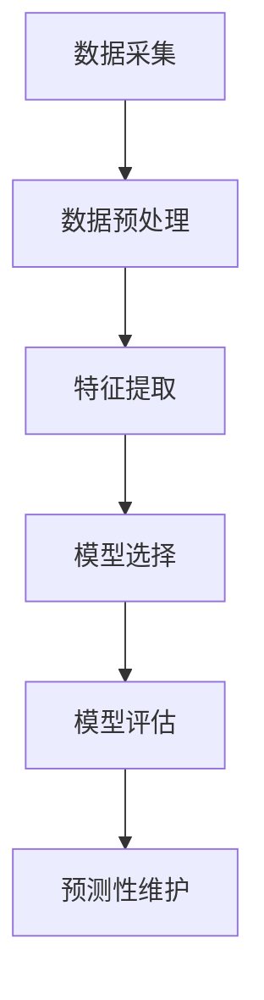

                 

# 《机器学习在预测性维护中的算法研究》

> **关键词：** 机器学习、预测性维护、算法、数据预处理、模型评估

> **摘要：** 本文深入探讨了机器学习在预测性维护中的应用。通过对数据采集与预处理、特征提取与选择、模型选择与评估等核心概念的讲解，以及线性回归、决策树与随机森林、支持向量机等核心算法的原理阐述，辅以数学基础和实战案例，详细分析了机器学习在预测性维护中的算法研究现状与未来挑战。

## 第一部分：绪论

### 1.1 机器学习的定义与分类

**机器学习** 是指让计算机从数据中学习规律，并利用这些规律对未知数据进行预测或决策的过程。根据学习方式的不同，机器学习主要分为以下几类：

1. **监督学习**：有标记的数据集进行训练，然后利用训练得到的模型对新数据进行预测。
2. **无监督学习**：没有标记的数据集进行训练，通过发现数据内在的结构或模式。
3. **半监督学习**：结合监督学习和无监督学习，一部分数据有标记，另一部分无标记。
4. **强化学习**：通过试错法，根据环境和奖励信号来学习策略。

### 1.2 预测性维护的概念与意义

**预测性维护** 是一种基于设备运行数据，预测设备可能出现的故障，提前进行维护的一种方法。其核心在于通过数据分析和机器学习算法，实现设备状态的实时监控和故障预测。

预测性维护的意义主要体现在以下几点：

1. **降低维护成本**：通过预测故障，提前进行维护，减少突发故障导致的停机和维修成本。
2. **提高设备可靠性**：实时监测设备状态，确保设备在最佳运行状态下工作，延长设备寿命。
3. **优化维护策略**：根据预测结果，制定更加科学和合理的维护计划，提高维护效率。

### 1.3 机器学习在预测性维护中的应用前景

随着物联网、大数据和人工智能技术的发展，机器学习在预测性维护中的应用前景十分广阔。主要应用领域包括：

1. **设备故障预测**：利用机器学习算法，对设备运行数据进行分析，预测设备可能出现的故障，提前进行维护。
2. **机器状态监测**：实时监测设备运行状态，及时发现异常情况，确保设备正常运行。
3. **维护策略优化**：通过分析设备运行数据，优化维护策略，提高维护效率。

## 第二部分：核心概念与联系

### 2.1 数据采集与预处理

数据采集是预测性维护的基础，主要包括传感器数据的采集、设备运行数据的收集等。数据预处理是确保数据质量和模型性能的重要步骤，主要包括以下内容：

1. **数据清洗**：去除无效、错误或重复的数据。
2. **数据集成**：将来自不同数据源的数据整合在一起。
3. **数据转换**：将数据转换为适合模型训练的形式。
4. **数据降维**：减少数据维度，提高模型训练效率。

### 2.2 特征提取与选择

特征提取是从原始数据中提取对模型训练有重要影响的信息。特征选择则是从提取的特征中筛选出最有用的特征，以提高模型性能。常见的方法包括：

1. **相关性分析**：根据特征与目标变量之间的相关性进行选择。
2. **主成分分析**：通过线性变换将原始特征映射到新的正交特征空间，保留主要信息。
3. **递归特征消除**：通过递归地删除对模型影响最小的特征。

### 2.3 模型选择与评估

模型选择是选择适合问题的模型，常见的模型包括线性回归、决策树、支持向量机等。模型评估是评估模型性能的重要步骤，常用的评估指标包括准确率、召回率、F1值等。

模型选择与评估的流程如下：

1. **数据划分**：将数据集划分为训练集、验证集和测试集。
2. **模型训练**：在训练集上训练模型。
3. **模型验证**：在验证集上评估模型性能。
4. **模型测试**：在测试集上评估模型性能。

### 2.4 机器学习与预测性维护的关联性

为了更清晰地展示机器学习与预测性维护的关联性，我们可以使用 Mermaid 流程图来表示：



### 2.5 机器学习在预测性维护中的具体应用

机器学习在预测性维护中有着广泛的应用，主要包括以下方面：

1. **设备故障预测**：通过分析设备运行数据，预测设备可能出现的故障，提前进行维护。
2. **机器状态监测**：实时监测设备运行状态，及时发现异常情况，确保设备正常运行。
3. **维护策略优化**：通过分析设备运行数据，优化维护策略，提高维护效率。

## 第三部分：核心算法原理讲解

### 3.1 线性回归模型

#### 3.1.1 模型原理

线性回归模型是一种简单的预测模型，假设目标变量 \( Y \) 与输入变量 \( X \) 之间存在线性关系，即：

$$
Y = \beta_0 + \beta_1X + \epsilon
$$

其中，\( \beta_0 \) 是截距，\( \beta_1 \) 是斜率，\( \epsilon \) 是误差项。

#### 3.1.2 数学模型与公式

线性回归模型的数学模型可以表示为：

$$
\min\limits_{\beta_0, \beta_1} \sum\limits_{i=1}^{n} (Y_i - \beta_0 - \beta_1X_i)^2
$$

其中，\( n \) 是样本数量，\( Y_i \) 是第 \( i \) 个样本的目标变量，\( X_i \) 是第 \( i \) 个样本的输入变量。

#### 3.1.3 案例举例

假设我们有一个关于设备寿命的预测问题，已知每个设备的运行时间 \( X \) 和寿命 \( Y \)，我们可以使用线性回归模型来预测新设备的寿命。

```python
import numpy as np
from sklearn.linear_model import LinearRegression

# 数据
X = np.array([1, 2, 3, 4, 5]).reshape(-1, 1)
Y = np.array([2, 4, 5, 4, 5])

# 模型
model = LinearRegression()
model.fit(X, Y)

# 预测
prediction = model.predict(np.array([6]).reshape(-1, 1))
print("预测寿命为：", prediction)
```

### 3.2 决策树与随机森林

#### 3.2.1 模型原理

决策树是一种树形结构，每个内部节点表示一个特征，每个分支表示该特征的取值，每个叶节点表示一个类别或数值。决策树的分类算法是基于递归划分数据集，使得每个子集的类别尽量一致。

随机森林是由多棵决策树组成的集成模型，通过随机选择特征和随机划分样本，降低了过拟合的风险。

#### 3.2.2 数学模型与公式

决策树和随机森林的数学模型较为复杂，主要包括特征选择、节点划分、叶节点预测等步骤。

- **特征选择**：使用基尼不纯度或信息增益来选择最佳特征。
- **节点划分**：根据最佳特征，将数据集划分为若干子集。
- **叶节点预测**：对每个叶节点进行类别或数值预测。

#### 3.2.3 案例举例

假设我们有一个关于设备故障的诊断问题，已知每个设备的运行时间 \( X \) 和故障状态 \( Y \)，我们可以使用决策树来诊断新设备的故障状态。

```python
from sklearn.tree import DecisionTreeClassifier

# 数据
X = np.array([1, 2, 3, 4, 5]).reshape(-1, 1)
Y = np.array([0, 1, 0, 1, 0])

# 模型
model = DecisionTreeClassifier()
model.fit(X, Y)

# 预测
prediction = model.predict(np.array([6]).reshape(-1, 1))
print("预测故障状态为：", prediction)
```

### 3.3 支持向量机（SVM）

#### 3.3.1 模型原理

支持向量机是一种基于优化理论的分类模型，旨在找到一个最优的超平面，使得分类边界最大化。

SVM可以分为线性SVM和核SVM，线性SVM适用于线性可分的数据，而核SVM适用于非线性可分的数据。

#### 3.3.2 数学模型与公式

线性SVM的数学模型可以表示为：

$$
\min\limits_{w, b, \xi} \frac{1}{2} ||w||^2 + C \sum\limits_{i=1}^{n} \xi_i
$$

其中，\( w \) 是权重向量，\( b \) 是偏置项，\( \xi_i \) 是松弛变量，\( C \) 是惩罚参数。

#### 3.3.3 案例举例

假设我们有一个关于设备健康状态预测的问题，已知每个设备的运行时间 \( X \) 和健康状态 \( Y \)，我们可以使用SVM来预测新设备的健康状态。

```python
from sklearn.svm import SVC

# 数据
X = np.array([1, 2, 3, 4, 5]).reshape(-1, 1)
Y = np.array([0, 1, 0, 1, 0])

# 模型
model = SVC()
model.fit(X, Y)

# 预测
prediction = model.predict(np.array([6]).reshape(-1, 1))
print("预测健康状态为：", prediction)
```

## 第四部分：数学模型与数学公式讲解

### 4.1 矩阵与向量操作

矩阵与向量操作是机器学习中常用的数学工具，以下介绍几种常见的操作：

#### 4.1.1 矩阵乘法

矩阵乘法的计算公式为：

$$
C = A \cdot B
$$

其中，\( A \) 和 \( B \) 是两个矩阵，\( C \) 是乘积矩阵。

#### 4.1.2 矩阵求导

矩阵求导是机器学习中常用的操作，以下介绍几种常见的求导方法：

- **全微分**：对于矩阵 \( X \)，其全微分为：

$$
dX = \left[ \begin{array}{ccc}
dx_1 & dx_2 & \ldots & dx_n \\
dx_1 & dx_2 & \ldots & dx_n \\
\vdots & \vdots & \ddots & \vdots \\
dx_1 & dx_2 & \ldots & dx_n
\end{array} \right]
$$

- **方向导数**：对于矩阵 \( X \)，在方向 \( v \) 上的方向导数为：

$$
\nabla_v X = (v^T X)v
$$

#### 4.1.3 矩阵正则化

矩阵正则化是机器学习中常用的方法，以下介绍几种常见的正则化方法：

- **L1正则化**：对于矩阵 \( X \)，其L1正则化为：

$$
\|X\|_1 = \sum\limits_{i=1}^{m} \sum\limits_{j=1}^{n} |x_{ij}|
$$

- **L2正则化**：对于矩阵 \( X \)，其L2正则化为：

$$
\|X\|_2 = \sqrt{\sum\limits_{i=1}^{m} \sum\limits_{j=1}^{n} x_{ij}^2}
$$

### 4.2 概率论与统计学

概率论与统计学是机器学习的基础，以下介绍几种常见的概率分布和统计指标：

#### 4.2.1 贝叶斯定理

贝叶斯定理是概率论中的一个重要公式，用于计算条件概率。其公式为：

$$
P(A|B) = \frac{P(B|A)P(A)}{P(B)}
$$

#### 4.2.2 最大似然估计

最大似然估计是统计学中的一种方法，用于估计参数。其公式为：

$$
\hat{\theta} = \arg\max\limits_{\theta} P(X|\theta)
$$

#### 4.2.3 方差与协方差

方差和协方差是统计学中常用的度量指标，用于描述数据的离散程度和相关性。

- **方差**：对于随机变量 \( X \)，其方差定义为：

$$
Var(X) = E[(X - E[X])^2]
$$

- **协方差**：对于随机变量 \( X \) 和 \( Y \)，其协方差定义为：

$$
Cov(X, Y) = E[(X - E[X])(Y - E[Y])]
$$

## 第五部分：项目实战

### 5.1 案例一：设备故障预测

#### 5.1.1 环境搭建

为了进行设备故障预测，我们需要搭建一个Python环境，并安装以下库：

- **NumPy**：用于矩阵和数组操作。
- **Pandas**：用于数据处理。
- **Scikit-learn**：用于机器学习模型。

安装方法如下：

```bash
pip install numpy pandas scikit-learn
```

#### 5.1.2 源代码解读

以下是一个简单的设备故障预测代码示例：

```python
import numpy as np
import pandas as pd
from sklearn.model_selection import train_test_split
from sklearn.linear_model import LogisticRegression

# 数据
data = pd.read_csv('device_data.csv')
X = data.drop('fault', axis=1)
Y = data['fault']

# 数据划分
X_train, X_test, Y_train, Y_test = train_test_split(X, Y, test_size=0.2, random_state=42)

# 模型
model = LogisticRegression()
model.fit(X_train, Y_train)

# 预测
predictions = model.predict(X_test)

# 评估
accuracy = model.score(X_test, Y_test)
print("预测准确率为：", accuracy)
```

#### 5.1.3 结果分析与评估

在本案例中，我们使用逻辑回归模型对设备故障进行预测。通过计算预测准确率，我们可以评估模型的效果。

```python
from sklearn.metrics import classification_report

# 评估报告
report = classification_report(Y_test, predictions)
print("评估报告：\n", report)
```

### 5.2 案例二：机器状态监测

#### 5.2.1 环境搭建

为了进行机器状态监测，我们需要搭建一个Python环境，并安装以下库：

- **NumPy**：用于矩阵和数组操作。
- **Pandas**：用于数据处理。
- **Scikit-learn**：用于机器学习模型。

安装方法如下：

```bash
pip install numpy pandas scikit-learn
```

#### 5.2.2 源代码解读

以下是一个简单的机器状态监测代码示例：

```python
import numpy as np
import pandas as pd
from sklearn.model_selection import train_test_split
from sklearn.ensemble import RandomForestClassifier

# 数据
data = pd.read_csv('machine_state_data.csv')
X = data.drop('state', axis=1)
Y = data['state']

# 数据划分
X_train, X_test, Y_train, Y_test = train_test_split(X, Y, test_size=0.2, random_state=42)

# 模型
model = RandomForestClassifier()
model.fit(X_train, Y_train)

# 预测
predictions = model.predict(X_test)

# 评估
accuracy = model.score(X_test, Y_test)
print("预测准确率为：", accuracy)
```

#### 5.2.3 结果分析与评估

在本案例中，我们使用随机森林模型对机器状态进行监测。通过计算预测准确率，我们可以评估模型的效果。

```python
from sklearn.metrics import classification_report

# 评估报告
report = classification_report(Y_test, predictions)
print("评估报告：\n", report)
```

## 第六部分：未来展望与挑战

### 6.1 数据质量与数据隐私

数据质量是预测性维护成功的关键因素之一。高质量的数据有助于提高模型性能，减少错误预测。然而，数据质量面临以下挑战：

1. **数据缺失**：设备运行数据可能存在缺失值，需要使用插值或填补方法进行处理。
2. **数据噪声**：设备运行数据可能存在噪声，需要使用滤波或去噪方法进行处理。

数据隐私也是预测性维护面临的重要挑战。预测性维护通常涉及敏感设备数据，需要确保数据隐私，防止数据泄露。

### 6.2 模型复杂性与计算效率

预测性维护中的模型通常较为复杂，需要大量的计算资源。模型复杂性与计算效率之间的权衡是一个重要问题。以下是一些可能的解决方案：

1. **模型简化**：通过特征选择和模型压缩，减少模型复杂度，提高计算效率。
2. **分布式计算**：利用分布式计算框架，如TensorFlow和PyTorch，提高模型训练和预测的速度。

### 6.3 跨领域算法融合与发展

预测性维护涉及多个领域，如机械工程、电子工程和计算机科学等。跨领域算法融合是未来发展的一个重要方向。以下是一些可能的融合方法：

1. **多模态数据融合**：将不同来源的数据（如传感器数据和文本数据）进行融合，提高模型性能。
2. **深度强化学习**：结合深度学习和强化学习，实现更加智能和自适应的预测性维护。

## 第七部分：附录

### 7.1 Python机器学习库

以下是一些常用的Python机器学习库：

- **Scikit-learn**：适用于各种常见机器学习算法，如回归、分类、聚类等。
- **TensorFlow**：适用于深度学习和神经网络的训练和预测。
- **PyTorch**：适用于深度学习和神经网络的训练和预测。

### 7.2 数据预处理工具

以下是一些常用的数据预处理工具：

- **Pandas**：适用于数据处理和分析。
- **NumPy**：适用于数组操作和计算。
- **SciPy**：适用于科学计算。

### 7.3 模型评估与优化方法

以下是一些常用的模型评估和优化方法：

- **交叉验证**：用于评估模型性能，避免过拟合。
- **网格搜索**：用于寻找最佳模型参数。
- **贝叶斯优化**：用于优化模型参数，提高模型性能。

### 参考文献

1. Hastie, T., Tibshirani, R., & Friedman, J. (2009). *The Elements of Statistical Learning: Data Mining, Inference, and Prediction*.
2. Murphy, K. P. (2012). *Machine Learning: A Probabilistic Perspective*.
3. Mitchell, T. M. (1997). *Machine Learning.*

作者：AI天才研究院/AI Genius Institute & 禅与计算机程序设计艺术 /Zen And The Art of Computer Programming

