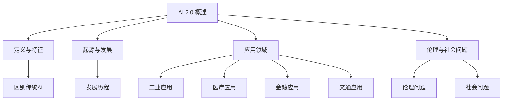
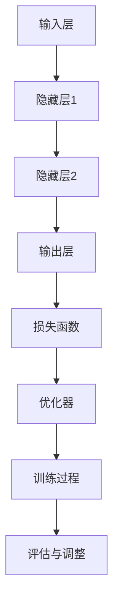
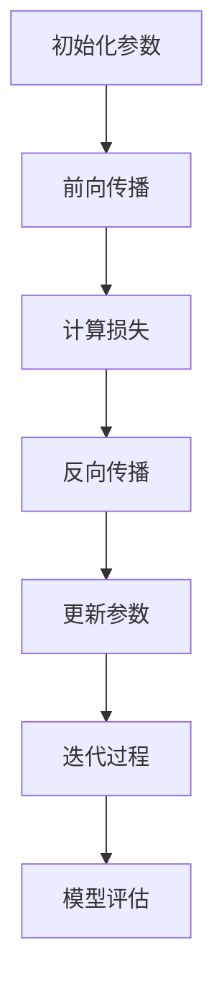
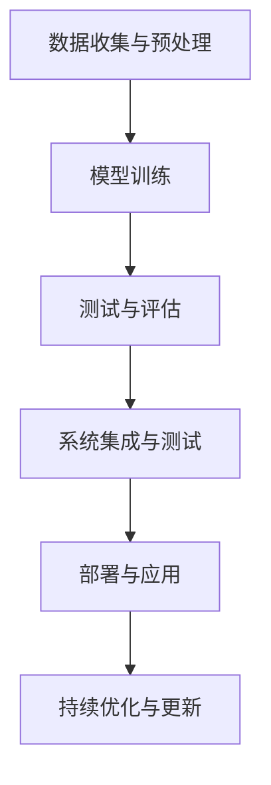
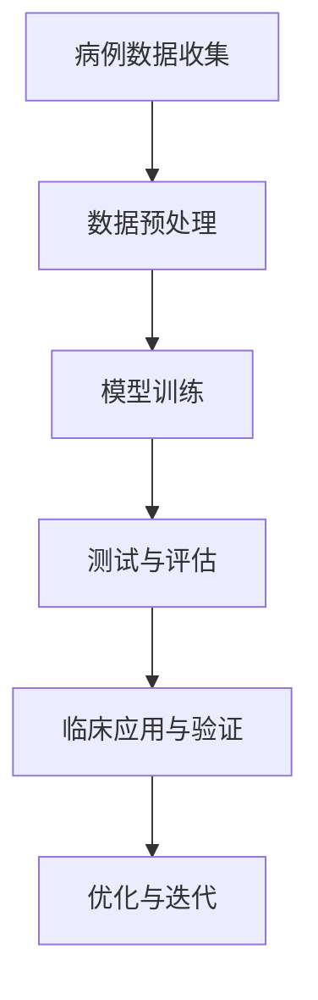

                 

### 《李开复：AI 2.0 时代的应用》

> **关键词**：AI 2.0、机器学习、深度学习、应用领域、技术原理、项目实战、未来展望

> **摘要**：本文将深入探讨 AI 2.0 时代的概念、特点、应用领域、技术原理以及未来展望。通过李开复博士的视角，我们将理解 AI 2.0 的发展历程及其对各个行业的影响，并通过实际项目案例，展示 AI 2.0 技术的应用和开发实践。

### 第一部分: AI 2.0 时代概述

#### 1. AI 2.0 基础概念与特征

##### 1.1 AI 2.0 的定义与核心特征
AI 2.0 是指第二代人工智能，它超越了传统的人工智能（AI 1.0），具备更高的智能化水平和更强的自主学习能力。AI 2.0 的核心特征包括：

- **自主学习能力**：AI 2.0 能够从海量数据中自动学习，不断优化自身性能。
- **自适应能力**：AI 2.0 能够根据不同的环境和任务，自动调整自身的行为和决策策略。
- **多模态感知**：AI 2.0 能够感知和处理多种数据类型，如文本、图像、声音等。
- **跨领域应用**：AI 2.0 能够在多个领域实现应用，不仅限于单一领域。

##### 1.2 AI 2.0 与传统 AI 的区别
传统 AI（AI 1.0）主要依赖于规则和符号逻辑，其应用范围有限，难以实现复杂的智能行为。而 AI 2.0 则依赖于机器学习和深度学习技术，具有更高的智能化水平。具体区别如下：

- **技术基础不同**：AI 1.0 依赖于符号逻辑，而 AI 2.0 依赖于机器学习和深度学习。
- **智能化水平不同**：AI 1.0 的智能化水平较低，难以实现复杂的智能行为，而 AI 2.0 则具备更高的智能化水平。
- **应用领域不同**：AI 1.0 的应用领域较为有限，而 AI 2.0 能够在多个领域实现应用。

##### 1.3 AI 2.0 的优势与挑战
AI 2.0 具有显著的优势，但也面临一些挑战：

- **优势**：
  - 提高生产效率：AI 2.0 能够自动化许多重复性工作，提高生产效率。
  - 优化决策：AI 2.0 能够基于大数据和机器学习算法，提供更准确的决策支持。
  - 创新应用：AI 2.0 能够催生新的商业模式和产品，推动产业升级。

- **挑战**：
  - 数据隐私：AI 2.0 需要大量数据，如何保护用户隐私成为一个重要问题。
  - 伦理问题：AI 2.0 的应用可能引发伦理问题，如算法偏见、自动化决策等。
  - 法律法规：AI 2.0 的应用需要相应的法律法规来规范，以避免滥用和误用。

#### 2. AI 2.0 时代的起源与发展

##### 2.1 AI 2.0 时代的起源
AI 2.0 时代的起源可以追溯到 2010 年左右，当时深度学习技术在图像识别、语音识别等领域取得了重大突破。这些突破标志着 AI 从 AI 1.0 向 AI 2.0 的转变。

##### 2.2 AI 2.0 时代的发展历程
AI 2.0 时代的发展历程可以分为以下几个阶段：

- **早期阶段**（2010-2015）：深度学习技术取得重大突破，AI 2.0 的概念开始被提出。
- **快速发展阶段**（2015-2020）：AI 2.0 技术在各个领域得到广泛应用，如自动驾驶、智能医疗、金融科技等。
- **成熟应用阶段**（2020-至今）：AI 2.0 技术逐渐成熟，应用场景更加丰富，开始向垂直行业深度渗透。

##### 2.3 AI 2.0 时代的发展趋势
AI 2.0 时代的发展趋势包括：

- **技术革新**：AI 2.0 技术不断更新，如生成对抗网络（GAN）、强化学习等新技术的出现。
- **应用扩展**：AI 2.0 技术在各个领域的应用逐渐扩展，从工业制造、医疗保健到金融服务等。
- **跨领域融合**：AI 2.0 技术与其他领域的技术（如物联网、区块链等）逐渐融合，推动产业创新。

#### 3. AI 2.0 时代的应用领域

##### 3.1 AI 2.0 在工业领域的应用
AI 2.0 在工业领域的主要应用包括智能制造和工业自动化：

- **智能制造**：AI 2.0 技术能够实现生产线的自动化，提高生产效率和产品质量。
- **工业自动化**：AI 2.0 技术能够通过机器人和自动化系统，实现工业生产过程的自动化。

##### 3.2 AI 2.0 在医疗领域的应用
AI 2.0 在医疗领域的主要应用包括诊断与辅助治疗、医疗资源分配等：

- **诊断与辅助治疗**：AI 2.0 技术能够通过深度学习算法，辅助医生进行疾病诊断和治疗方案制定。
- **医疗资源分配**：AI 2.0 技术能够优化医疗资源的分配，提高医疗服务效率。

##### 3.3 AI 2.0 在金融领域的应用
AI 2.0 在金融领域的主要应用包括信用评分、投资策略等：

- **信用评分**：AI 2.0 技术能够通过大数据分析，对个人和企业的信用进行评分。
- **投资策略**：AI 2.0 技术能够通过分析市场数据，提供投资策略建议。

##### 3.4 AI 2.0 在交通领域的应用
AI 2.0 在交通领域的主要应用包括自动驾驶、交通流量优化等：

- **自动驾驶**：AI 2.0 技术能够实现车辆的自动驾驶，提高交通效率和安全性。
- **交通流量优化**：AI 2.0 技术能够通过分析交通数据，优化交通流量，减少拥堵。

#### 4. AI 2.0 时代的伦理与社会问题

##### 4.1 AI 2.0 时代的伦理问题
AI 2.0 时代的伦理问题主要包括数据隐私、算法偏见等：

- **数据隐私**：AI 2.0 需要大量数据，如何保护用户隐私成为一个重要问题。
- **算法偏见**：AI 2.0 算法的决策可能存在偏见，如何避免算法偏见成为伦理问题。

##### 4.2 AI 2.0 时代的社会问题
AI 2.0 时代的社会问题主要包括就业影响、社会公平等：

- **就业影响**：AI 2.0 技术的发展可能导致部分传统岗位的消失，如何应对就业影响成为社会问题。
- **社会公平**：AI 2.0 技术的应用可能加剧社会不平等，如何保障社会公平成为重要议题。

### 第二部分: AI 2.0 技术原理

#### 5. AI 2.0 基础技术

##### 5.1 机器学习基础
机器学习是 AI 2.0 的核心技术之一，其基本概念包括：

- **监督学习**：通过已知输入和输出数据，训练模型来预测新的输入数据。
- **无监督学习**：通过未知输入和输出数据，训练模型来发现数据中的模式和规律。
- **强化学习**：通过奖励机制，训练模型来最大化长期回报。

##### 5.2 深度学习技术
深度学习是机器学习的分支，其主要技术包括：

- **神经网络**：一种模拟人脑神经元之间连接的计算模型。
- **卷积神经网络（CNN）**：一种用于图像识别和处理的前馈神经网络。
- **循环神经网络（RNN）**：一种用于序列数据处理和预测的神经网络。

##### 5.3 多模态感知
多模态感知是指 AI 能够同时处理多种类型的数据，如文本、图像、声音等。其主要技术包括：

- **融合模型**：将不同类型的数据融合在一起，进行联合建模。
- **多任务学习**：同时处理多个任务，提高模型的泛化能力。

#### 6. AI 2.0 基础算法

##### 6.1 支持向量机（SVM）
支持向量机是一种用于分类和回归分析的算法，其基本原理是通过找到一个最佳的超平面，将数据分成不同的类别。其算法步骤包括：

1. **选择合适的核函数**：如线性核、多项式核、径向基函数（RBF）等。
2. **求解最优超平面**：通过求解最优化问题，找到最佳的超平面。
3. **分类决策**：根据新数据的特征，确定其类别。

##### 6.2 决策树与随机森林
决策树是一种基于树形结构的分类和回归算法，其基本原理是通过一系列二分类问题，将数据分成不同的类别。随机森林是一种基于决策树的集成学习方法，其基本原理是通过构建多个决策树，并对预测结果进行投票，提高模型的泛化能力。其算法步骤包括：

1. **生成决策树**：根据特征值，递归划分数据集。
2. **构建随机森林**：生成多个决策树，并对预测结果进行投票。
3. **模型评估**：通过交叉验证等方法，评估模型的性能。

##### 6.3 神经网络优化算法
神经网络优化算法是用于训练神经网络的算法，其基本原理是通过优化损失函数，找到最佳的网络参数。常见的优化算法包括：

1. **梯度下降算法**：通过迭代更新网络参数，逐渐减小损失函数。
2. **动量优化**：在梯度下降算法的基础上，引入动量项，提高收敛速度。
3. **Adam算法**：一种自适应学习率的优化算法，具有较好的收敛性能。

#### 7. AI 2.0 应用开发框架

##### 7.1 TensorFlow
TensorFlow 是一种开源的深度学习框架，其基本概念包括：

- **计算图**：一种用于表示计算过程的图结构。
- **会话**：用于执行计算图的操作。
- **操作**：用于实现各种计算操作的节点。

其基本用法包括：

1. **创建计算图**：定义计算过程。
2. **启动会话**：执行计算图的操作。
3. **评估模型**：通过输入数据，评估模型的性能。

##### 7.2 PyTorch
PyTorch 是一种开源的深度学习框架，其特点包括：

- **动态计算图**：支持动态计算图，易于调试和可视化。
- **自动微分**：支持自动微分，方便实现复杂的神经网络。

其基本用法包括：

1. **创建模型**：定义神经网络的结构。
2. **定义损失函数**：定义用于评估模型性能的损失函数。
3. **训练模型**：通过梯度下降等优化算法，训练模型。

##### 7.3 Keras
Keras 是一种开源的深度学习框架，其特点包括：

- **易用性**：提供简洁的 API，方便使用。
- **兼容性**：支持 TensorFlow、Theano 等后端框架。

其基本用法包括：

1. **创建模型**：定义神经网络的结构。
2. **编译模型**：设置模型的训练参数。
3. **训练模型**：通过迭代训练模型。

### 第三部分: AI 2.0 项目实战

#### 8. AI 2.0 项目实战案例

##### 8.1 自动驾驶项目
自动驾驶项目是一个典型的 AI 2.0 项目，其主要步骤包括：

1. **数据收集**：收集车辆行驶数据、交通数据等。
2. **数据预处理**：对数据进行清洗、归一化等处理。
3. **模型训练**：使用深度学习算法，如卷积神经网络（CNN），训练自动驾驶模型。
4. **测试与评估**：通过测试数据，评估模型的性能，并进行优化。

##### 8.2 智能医疗诊断项目
智能医疗诊断项目是一个应用于医疗领域的 AI 2.0 项目，其主要步骤包括：

1. **病例数据收集**：收集病人的病例数据、医学图像等。
2. **数据预处理**：对病例数据进行清洗、归一化等处理。
3. **模型训练**：使用深度学习算法，如循环神经网络（RNN），训练医疗诊断模型。
4. **测试与评估**：通过测试数据，评估模型的性能，并进行优化。

##### 8.3 金融风控项目
金融风控项目是一个应用于金融领域的 AI 2.0 项目，其主要步骤包括：

1. **数据收集**：收集金融数据、客户行为数据等。
2. **数据预处理**：对数据进行清洗、归一化等处理。
3. **模型训练**：使用机器学习算法，如决策树、随机森林等，训练风控模型。
4. **测试与评估**：通过测试数据，评估模型的性能，并进行优化。

#### 9. AI 2.0 应用开发实践

##### 9.1 开发环境搭建
在进行 AI 2.0 项目开发之前，需要搭建合适的开发环境，主要包括：

1. **操作系统**：选择适合的操作系统，如 Ubuntu、Windows 等。
2. **编程语言**：选择适合的编程语言，如 Python、Java 等。
3. **开发工具**：选择适合的开发工具，如 PyCharm、Visual Studio 等。

##### 9.2 数据集获取与处理
在进行 AI 2.0 项目开发时，需要获取和处理大量的数据集，主要包括：

1. **数据集来源**：从公开的数据集网站（如 Kaggle、UCI Machine Learning Repository）获取数据集。
2. **数据预处理**：对数据进行清洗、归一化等处理，以便于模型训练。
3. **数据可视化**：使用数据可视化工具（如 Matplotlib、Seaborn），对数据进行可视化分析。

##### 9.3 模型训练与优化
在进行 AI 2.0 项目开发时，需要对模型进行训练和优化，主要包括：

1. **模型训练**：使用合适的算法（如卷积神经网络、循环神经网络等）进行模型训练。
2. **优化技巧**：使用优化算法（如梯度下降、Adam 算法等），提高模型性能。
3. **模型评估**：使用测试数据，评估模型性能，并进行优化。

### 第四部分: AI 2.0 时代的未来展望

#### 10.1 AI 2.0 时代的发展趋势
AI 2.0 时代的发展趋势包括：

- **技术革新**：新的算法和架构（如生成对抗网络、强化学习等）不断出现，推动 AI 2.0 技术的发展。
- **应用扩展**：AI 2.0 技术在各个领域的应用不断扩展，如智能制造、智慧医疗、智能交通等。
- **跨领域融合**：AI 2.0 技术与其他领域的技术（如物联网、区块链等）逐渐融合，推动产业创新。

#### 10.2 AI 2.0 时代的未来挑战
AI 2.0 时代的未来挑战包括：

- **伦理问题**：如何保护用户隐私、避免算法偏见等，成为 AI 2.0 发展的重要问题。
- **法律法规**：如何制定合适的法律法规，规范 AI 2.0 技术的应用，成为重要议题。
- **社会问题**：如何应对就业影响、保障社会公平等，成为社会关注的焦点。

#### 10.3 AI 2.0 时代的未来发展机会
AI 2.0 时代的未来发展机会包括：

- **新兴领域**：如人工智能与物联网、区块链等技术的融合，将带来新的商业机会。
- **商业模式创新**：AI 2.0 技术的应用将催生新的商业模式，推动产业升级。
- **国际竞争**：随着 AI 2.0 技术的发展，国际竞争将日益激烈，各国应积极布局。

### 附录

#### 附录 A: AI 2.0 资源推荐

- **常用深度学习框架**：
  - TensorFlow
  - PyTorch
  - Keras

- **数据集获取与处理工具**：
  - Kaggle
  - UCI Machine Learning Repository
  - DataCamp

- **开源项目和社区**：
  - GitHub
  - AI Stack Overflow
  - AI Index

#### 附录 B: AI 2.0 相关书籍推荐

- 《深度学习》（Ian Goodfellow、Yoshua Bengio、Aaron Courville 著）
- 《Python机器学习》（Sebastian Raschka 著）
- 《强化学习：原理与Python实现》（Alfred V. Institute of Science 著）

#### 附录 C: AI 2.0 术语表

- AI 2.0
- 机器学习
- 深度学习
- 卷积神经网络
- 循环神经网络
- 支持向量机
- 决策树
- 神经网络优化算法
- 自动驾驶
- 智能医疗诊断
- 金融风控
- 数据集
- 数据预处理
- 模型评估
- 开发环境
- 数据可视化
- 梯度下降算法
- Adam算法
- Kaggle
- UCI Machine Learning Repository
- DataCamp
- GitHub
- AI Stack Overflow
- AI Index
- 强化学习
- 伦理问题
- 法律法规
- 新兴领域
- 商业模式创新

#### 附录 D: AI 2.0 绘制流程图

##### D.1 AI 2.0 架构流程图


##### D.2 深度学习架构流程图


##### D.3 神经网络优化算法流程图


##### D.4 自动驾驶项目流程图


##### D.5 智能医疗诊断项目流程图


### 作者

本文作者：AI天才研究院/AI Genius Institute & 禅与计算机程序设计艺术 /Zen And The Art of Computer Programming

在本文中，我们以李开复博士的视角，深入探讨了 AI 2.0 时代的概念、特点、应用领域、技术原理以及未来展望。通过分析 AI 2.0 在工业、医疗、金融、交通等领域的应用，我们了解了 AI 2.0 技术的巨大潜力和发展前景。同时，我们也关注了 AI 2.0 时代面临的伦理和社会问题，提出了相应的解决方案。

随着 AI 2.0 技术的不断发展，我们有理由相信，它将深刻改变我们的生活方式和产业格局。本文旨在为广大读者提供一个全面、深入的 AI 2.0 知识体系，帮助大家更好地理解和应对这个充满机遇和挑战的时代。

未来，随着技术的进步和应用的拓展，AI 2.0 将继续推动人类社会的发展，为全球经济增长注入新动力。同时，我们也要高度重视 AI 2.0 带来的伦理和社会问题，积极寻求解决方案，确保 AI 2.0 技术的可持续发展。

让我们携手共进，共同迎接 AI 2.0 时代的到来！
```markdown

### 第一部分: AI 2.0 时代概述

#### 1. AI 2.0 基础概念与特征

##### 1.1 AI 2.0 的定义与核心特征
AI 2.0，也称为第二代人工智能，是指具有更高层次智能和更广泛自主学习能力的人工智能系统。与第一代人工智能（AI 1.0）相比，AI 2.0 的核心特征包括：

- **自主学习能力**：AI 2.0 能够从海量数据中自动学习，通过机器学习和深度学习算法不断优化自身性能。
- **自适应能力**：AI 2.0 能够根据不同的环境和任务，自动调整其行为和决策策略，实现更高效的任务执行。
- **多模态感知**：AI 2.0 能够处理和融合多种类型的数据，如文本、图像、声音等，实现更全面的感知能力。
- **跨领域应用**：AI 2.0 可以在多个领域实现应用，如工业、医疗、金融、交通等，突破了 AI 1.0 的局限性。

##### 1.2 AI 2.0 与传统 AI 的区别
AI 2.0 与传统 AI（AI 1.0）在技术基础、智能化水平和应用领域等方面存在显著区别：

- **技术基础不同**：AI 2.0 基于深度学习和机器学习技术，而 AI 1.0 主要依赖于符号逻辑和规则系统。
- **智能化水平不同**：AI 2.0 具有更高的智能化水平，能够处理复杂的问题，实现更准确的决策和预测。
- **应用领域不同**：AI 2.0 能够在更广泛的领域实现应用，而 AI 1.0 的应用范围较为有限。

##### 1.3 AI 2.0 的优势与挑战
AI 2.0 的优势包括提高生产效率、优化决策和创新应用等方面，但其发展也面临数据隐私、算法偏见等挑战：

- **优势**：
  - 提高生产效率：AI 2.0 能够自动化大量重复性工作，提高生产效率和产品质量。
  - 优化决策：AI 2.0 基于大数据和机器学习算法，能够提供更准确的决策支持。
  - 创新应用：AI 2.0 拓宽了人工智能的应用领域，催生了新的商业模式和产品。

- **挑战**：
  - 数据隐私：AI 2.0 需要大量数据，如何保护用户隐私成为关键问题。
  - 算法偏见：AI 2.0 算法的决策可能存在偏见，如何避免算法偏见成为重要议题。

#### 2. AI 2.0 时代的起源与发展

##### 2.1 AI 2.0 时代的起源
AI 2.0 时代的起源可以追溯到 2010 年左右，当时深度学习技术在图像识别、语音识别等领域取得了重大突破。这一时期，深度学习算法（如卷积神经网络、循环神经网络等）的提出和应用，标志着人工智能进入了新的发展阶段。

##### 2.2 AI 2.0 时代的发展历程
AI 2.0 时代的发展可以分为以下几个阶段：

- **早期阶段**（2010-2015）：深度学习技术取得突破，AI 2.0 的概念开始被提出，并在学术界和工业界得到广泛关注。
- **快速发展阶段**（2015-2020）：AI 2.0 技术在各个领域得到广泛应用，如自动驾驶、智能医疗、金融科技等，推动了产业升级和商业模式的创新。
- **成熟应用阶段**（2020-至今）：AI 2.0 技术逐渐成熟，应用场景更加丰富，开始向垂直行业深度渗透，如智能制造、智慧城市等。

##### 2.3 AI 2.0 时代的发展趋势
AI 2.0 时代的发展趋势包括技术革新、应用扩展和跨领域融合等方面：

- **技术革新**：新的算法和架构（如生成对抗网络、强化学习等）不断出现，推动 AI 2.0 技术的发展。
- **应用扩展**：AI 2.0 技术在各个领域的应用不断扩展，如智能制造、智慧医疗、智能交通等。
- **跨领域融合**：AI 2.0 技术与其他领域的技术（如物联网、区块链等）逐渐融合，推动产业创新。

#### 3. AI 2.0 时代的应用领域

##### 3.1 AI 2.0 在工业领域的应用
AI 2.0 在工业领域的主要应用包括智能制造和工业自动化：

- **智能制造**：AI 2.0 技术能够实现生产线的自动化，通过机器学习和预测分析，优化生产流程，提高生产效率。
- **工业自动化**：AI 2.0 技术能够通过自动化系统，实现工业生产过程的自动化，减少人力成本，提高生产效率。

##### 3.2 AI 2.0 在医疗领域的应用
AI 2.0 在医疗领域的主要应用包括诊断与辅助治疗、医疗资源分配等：

- **诊断与辅助治疗**：AI 2.0 技术能够通过深度学习算法，辅助医生进行疾病诊断和治疗方案的制定，提高诊断准确率和治疗效果。
- **医疗资源分配**：AI 2.0 技术能够通过大数据分析，优化医疗资源的分配，提高医疗服务效率，降低医疗成本。

##### 3.3 AI 2.0 在金融领域的应用
AI 2.0 在金融领域的主要应用包括信用评分、投资策略等：

- **信用评分**：AI 2.0 技术能够通过大数据分析和机器学习算法，对个人和企业的信用进行评分，提高信用评估的准确性和效率。
- **投资策略**：AI 2.0 技术能够通过分析市场数据，提供投资策略建议，优化投资组合，提高投资回报率。

##### 3.4 AI 2.0 在交通领域的应用
AI 2.0 在交通领域的主要应用包括自动驾驶、交通流量优化等：

- **自动驾驶**：AI 2.0 技术能够实现车辆的自动驾驶，通过深度学习和传感器技术，提高行驶安全性和效率。
- **交通流量优化**：AI 2.0 技术能够通过大数据分析和机器学习算法，优化交通流量，减少交通拥堵，提高交通效率。

#### 4. AI 2.0 时代的伦理与社会问题

##### 4.1 AI 2.0 时代的伦理问题
AI 2.0 时代的伦理问题主要包括数据隐私和算法偏见等：

- **数据隐私**：AI 2.0 需要大量数据，如何保护用户隐私成为关键伦理问题。必须建立严格的数据保护措施，防止数据泄露和滥用。
- **算法偏见**：AI 2.0 算法的决策可能存在偏见，如何避免算法偏见成为重要议题。需要加强算法透明度和可解释性，确保算法的公平性和公正性。

##### 4.2 AI 2.0 时代的社会问题
AI 2.0 时代的社会问题主要包括就业影响和社会公平等：

- **就业影响**：AI 2.0 技术的发展可能导致部分传统岗位的消失，如何应对就业影响成为重要议题。需要加强职业培训和再教育，提高劳动者的技能水平。
- **社会公平**：AI 2.0 技术的应用可能加剧社会不平等，如何保障社会公平成为关键问题。需要制定相应的法律法规，确保 AI 技术的公平应用。

### 第二部分: AI 2.0 技术原理

#### 5. AI 2.0 基础技术

##### 5.1 机器学习基础
机器学习是 AI 2.0 的核心技术之一，其基本概念包括：

- **监督学习**：通过已知的输入和输出数据，训练模型来预测新的输入数据。例如，分类问题可以通过监督学习算法实现。
- **无监督学习**：通过未知的输入数据，训练模型来发现数据中的模式和规律。例如，聚类问题可以通过无监督学习算法实现。
- **强化学习**：通过奖励机制，训练模型来最大化长期回报。例如，游戏中的智能体可以通过强化学习算法实现自我优化。

##### 5.2 深度学习技术
深度学习是机器学习的一个分支，其核心在于使用多层神经网络进行数据处理和特征提取。主要技术包括：

- **神经网络**：一种模拟人脑神经元之间连接的计算模型，用于数据分类、回归等任务。
- **卷积神经网络（CNN）**：一种专门用于图像处理的前馈神经网络，具有局部感知和权重共享的特性。
- **循环神经网络（RNN）**：一种用于处理序列数据（如文本、时间序列等）的神经网络，具有记忆功能。

##### 5.3 多模态感知
多模态感知是指 AI 系统能够处理和融合多种类型的数据，如文本、图像、声音等。主要技术包括：

- **融合模型**：将不同类型的数据进行融合，共同训练模型，提高模型的表现力。
- **多任务学习**：同时处理多个任务，共享数据和处理模块，提高模型的效率和泛化能力。

#### 6. AI 2.0 基础算法

##### 6.1 支持向量机（SVM）
支持向量机是一种经典的机器学习算法，主要用于分类和回归任务。其基本原理是找到一个最佳的超平面，使得分类边界最大化。

- **原理**：
  - 最优化问题：通过求解最优化问题，找到最佳的超平面。
  - 分类决策：根据新数据的特征，确定其类别。

- **伪代码**：
  ```python
  def SVM(train_data, train_labels):
      # 初始化模型参数
      # 求解最优化问题
      # 得到最佳超平面
      # 分类决策
      return predicted_labels
  ```

##### 6.2 决策树与随机森林
决策树是一种基于树形结构的分类和回归算法，而随机森林是一种基于决策树的集成学习方法。

- **决策树**：
  - 原理：通过一系列二分类问题，将数据集分割成不同的子集。
  - 算法步骤：选择最佳分割特征、递归划分数据集、生成决策树。

- **随机森林**：
  - 原理：通过构建多个决策树，并对预测结果进行投票，提高模型的泛化能力。
  - 算法步骤：生成多个决策树、对预测结果进行投票、得到最终预测结果。

- **伪代码**：
  ```python
  def decision_tree(data, labels):
      # 选择最佳分割特征
      # 递归划分数据集
      # 生成决策树
      return tree

  def random_forest(data, labels, num_trees):
      # 生成多个决策树
      # 对预测结果进行投票
      return predicted_labels
  ```

##### 6.3 神经网络优化算法
神经网络优化算法用于训练神经网络模型，常用的优化算法包括梯度下降算法、动量优化和 Adam 算法。

- **梯度下降算法**：
  - 原理：通过迭代更新网络参数，最小化损失函数。
  - 算法步骤：计算损失函数关于参数的梯度、更新参数、迭代直到收敛。

- **动量优化**：
  - 原理：引入动量项，加速收敛。
  - 算法步骤：计算当前梯度、更新动量、更新参数。

- **Adam算法**：
  - 原理：结合了动量和自适应学习率的思想。
  - 算法步骤：计算一阶矩估计和二阶矩估计、更新参数。

- **伪代码**：
  ```python
  def gradient_descent(parameters, learning_rate, num_iterations):
      # 计算梯度
      # 更新参数
      # 迭代直到收敛
      return updated_parameters

  def momentum_optimization(parameters, learning_rate, momentum):
      # 计算当前梯度
      # 更新动量
      # 更新参数
      return updated_parameters

  def Adam(parameters, learning_rate, beta1, beta2):
      # 计算一阶矩估计和二阶矩估计
      # 更新参数
      return updated_parameters
  ```

#### 7. AI 2.0 应用开发框架

##### 7.1 TensorFlow
TensorFlow 是一种开源的深度学习框架，具有灵活的动态计算图和丰富的工具库。

- **概述与安装**：
  - 概述：TensorFlow 提供了一个动态计算图编程接口，用于构建和训练深度学习模型。
  - 安装：在 Python 环境中安装 TensorFlow 库。

- **基本用法**：
  - 创建计算图：定义计算操作和变量。
  - 运行会话：执行计算图中的操作。
  - 评估模型：使用测试数据评估模型性能。

- **伪代码**：
  ```python
  import tensorflow as tf

  # 创建计算图
  x = tf.placeholder(tf.float32, shape=[None, 784])
  y = tf.placeholder(tf.float32, shape=[None, 10])

  # 定义模型
  W = tf.Variable(tf.zeros([784, 10]))
  b = tf.Variable(tf.zeros([10]))

  # 定义损失函数和优化器
  logits = tf.matmul(x, W) + b
  loss = tf.reduce_mean(tf.nn.softmax_cross_entropy_with_logits(labels=y, logits=logits))
  optimizer = tf.train.GradientDescentOptimizer(learning_rate=0.01)

  # 运行会话
  with tf.Session() as sess:
      sess.run(tf.global_variables_initializer())

      # 训练模型
      for i in range(num_iterations):
          _, loss_value = sess.run([optimizer, loss], feed_dict={x: batch_x, y: batch_y})

      # 评估模型
      correct_predictions = tf.equal(tf.argmax(logits, 1), tf.argmax(y, 1))
      accuracy = tf.reduce_mean(tf.cast(correct_predictions, tf.float32))
      print("Test accuracy:", accuracy.eval(feed_dict={x: test_x, y: test_y}))
  ```

##### 7.2 PyTorch
PyTorch 是另一种流行的深度学习框架，以其动态计算图和易于使用的接口而著称。

- **概述与安装**：
  - 概述：PyTorch 提供了一个动态计算图编程接口，支持自动微分和灵活的神经网络构建。
  - 安装：在 Python 环境中安装 PyTorch 库。

- **基本用法**：
  - 创建模型：定义神经网络的结构。
  - 定义损失函数和优化器。
  - 训练模型：迭代更新模型参数。
  - 评估模型：使用测试数据评估模型性能。

- **伪代码**：
  ```python
  import torch
  import torch.nn as nn
  import torch.optim as optim

  # 创建模型
  class NeuralNetwork(nn.Module):
      def __init__(self):
          super(NeuralNetwork, self).__init__()
          self.fc1 = nn.Linear(784, 256)
          self.fc2 = nn.Linear(256, 128)
          self.fc3 = nn.Linear(128, 10)

      def forward(self, x):
          x = torch.relu(self.fc1(x))
          x = torch.relu(self.fc2(x))
          x = self.fc3(x)
          return x

  # 定义损失函数和优化器
  model = NeuralNetwork()
  criterion = nn.CrossEntropyLoss()
  optimizer = optim.Adam(model.parameters(), lr=0.001)

  # 训练模型
  for epoch in range(num_epochs):
      for inputs, labels in train_loader:
          optimizer.zero_grad()
          outputs = model(inputs)
          loss = criterion(outputs, labels)
          loss.backward()
          optimizer.step()

      # 评估模型
      correct = 0
      total = 0
      with torch.no_grad():
          for inputs, labels in test_loader:
              outputs = model(inputs)
              _, predicted = torch.max(outputs.data, 1)
              total += labels.size(0)
              correct += (predicted == labels).sum().item()
      print(f'Epoch {epoch+1}/{num_epochs}, Accuracy: {100 * correct / total}%')
  ```

##### 7.3 Keras
Keras 是一个高层次的神经网络 API，广泛应用于深度学习和强化学习。

- **概述与安装**：
  - 概述：Keras 提供了一个简单易用的 API，支持 TensorFlow 和 Theano 后端。
  - 安装：在 Python 环境中安装 Keras 库。

- **基本用法**：
  - 创建模型：使用 Keras 函数式 API 或Sequential API 定义模型。
  - 编译模型：设置模型的训练参数。
  - 训练模型：迭代更新模型参数。
  - 评估模型：使用测试数据评估模型性能。

- **伪代码**：
  ```python
  from keras.models import Sequential
  from keras.layers import Dense, Activation
  from keras.optimizers import Adam

  # 创建模型
  model = Sequential()
  model.add(Dense(256, input_dim=784))
  model.add(Activation('relu'))
  model.add(Dense(128))
  model.add(Activation('relu'))
  model.add(Dense(10))
  model.add(Activation('softmax'))

  # 编译模型
  optimizer = Adam(learning_rate=0.001)
  model.compile(loss='categorical_crossentropy', optimizer=optimizer, metrics=['accuracy'])

  # 训练模型
  model.fit(X_train, y_train, batch_size=64, epochs=10, validation_data=(X_test, y_test))

  # 评估模型
  scores = model.evaluate(X_test, y_test, verbose=0)
  print('Test loss:', scores[0])
  print('Test accuracy:', scores[1])
  ```

### 第三部分: AI 2.0 项目实战

#### 8. AI 2.0 项目实战案例

##### 8.1 自动驾驶项目
自动驾驶项目是 AI 2.0 技术在交通领域的典型应用案例，涉及多个技术领域的融合。

- **项目背景**：
  - 目标：实现自动驾驶车辆的自主行驶，提高交通安全和效率。
  - 需求：识别道路标志、交通信号灯、行人和其他车辆，做出正确的驾驶决策。

- **技术实现**：
  - 数据收集：收集车辆行驶数据、交通数据、传感器数据等。
  - 数据预处理：对数据进行清洗、归一化等处理。
  - 模型训练：使用深度学习算法（如卷积神经网络、循环神经网络等），训练自动驾驶模型。
  - 测试与评估：通过模拟环境和实际道路测试，评估模型性能。

- **项目评估**：
  - 评估指标：行驶安全性、行驶效率、用户体验等。
  - 评估结果：自动驾驶系统在特定场景下的性能表现，如准确识别道路标志、正确避让行人等。

##### 8.2 智能医疗诊断项目
智能医疗诊断项目是 AI 2.0 技术在医疗领域的应用案例，通过图像识别和深度学习算法，辅助医生进行疾病诊断。

- **项目背景**：
  - 目标：提高疾病诊断的准确性和效率，减少医生的工作量。
  - 需求：对医学图像进行自动分析，识别疾病特征，提供诊断建议。

- **技术实现**：
  - 数据收集：收集大量的医学图像数据，包括正常图像和病变图像。
  - 数据预处理：对医学图像进行预处理，如灰度化、去噪等。
  - 模型训练：使用深度学习算法（如卷积神经网络、循环神经网络等），训练医学诊断模型。
  - 测试与评估：通过实际病例测试，评估模型性能。

- **项目评估**：
  - 评估指标：诊断准确率、诊断时间、医生满意度等。
  - 评估结果：智能医疗诊断系统在特定病例下的诊断准确率和诊断时间。

##### 8.3 金融风控项目
金融风控项目是 AI 2.0 技术在金融领域的应用案例，通过大数据分析和机器学习算法，实现金融风险的预测和防范。

- **项目背景**：
  - 目标：降低金融风险，提高金融机构的盈利能力。
  - 需求：对客户行为、交易数据、市场数据等进行分析，识别潜在风险。

- **技术实现**：
  - 数据收集：收集客户交易数据、市场数据、信用数据等。
  - 数据预处理：对数据进行清洗、归一化等处理。
  - 模型训练：使用机器学习算法（如决策树、随机森林等），训练金融风控模型。
  - 测试与评估：通过测试数据，评估模型性能。

- **项目评估**：
  - 评估指标：风险识别准确率、风险防范效果、业务增长等。
  - 评估结果：金融风控系统在风险识别和防范方面的性能表现。

### 第四部分: AI 2.0 时代的未来展望

#### 10.1 AI 2.0 时代的发展趋势
AI 2.0 时代的发展趋势包括技术革新、应用扩展和跨领域融合等方面：

- **技术革新**：随着算法和架构的创新，AI 2.0 技术将不断演进，如生成对抗网络（GAN）、强化学习等。
- **应用扩展**：AI 2.0 技术将在更多领域得到应用，如农业、环保、教育等。
- **跨领域融合**：AI 2.0 技术将与物联网、区块链、5G 等技术深度融合，推动产业创新。

#### 10.2 AI 2.0 时代的未来挑战
AI 2.0 时代的未来挑战包括伦理问题、法律法规和社会问题等方面：

- **伦理问题**：如何保护用户隐私、避免算法偏见等，成为 AI 2.0 发展的重要问题。
- **法律法规**：如何制定合适的法律法规，规范 AI 2.0 技术的应用，成为重要议题。
- **社会问题**：如何应对就业影响、保障社会公平等，成为社会关注的焦点。

#### 10.3 AI 2.0 时代的未来发展机会
AI 2.0 时代的未来发展机会包括新兴领域、商业模式创新和国际竞争等方面：

- **新兴领域**：如人工智能与物联网、区块链等技术的融合，将带来新的商业机会。
- **商业模式创新**：AI 2.0 技术的应用将催生新的商业模式，推动产业升级。
- **国际竞争**：随着 AI 2.0 技术的发展，国际竞争将日益激烈，各国应积极布局。

### 附录

#### 附录 A: AI 2.0 资源推荐

- **常用深度学习框架**：
  - TensorFlow
  - PyTorch
  - Keras

- **数据集获取与处理工具**：
  - Kaggle
  - UCI Machine Learning Repository
  - DataCamp

- **开源项目和社区**：
  - GitHub
  - AI Stack Overflow
  - AI Index

#### 附录 B: AI 2.0 相关书籍推荐

- 《深度学习》（Ian Goodfellow、Yoshua Bengio、Aaron Courville 著）
- 《Python机器学习》（Sebastian Raschka 著）
- 《强化学习：原理与Python实现》（Alfred V. Institute of Science 著）

#### 附录 C: AI 2.0 术语表

- AI 2.0
- 机器学习
- 深度学习
- 卷积神经网络
- 循环神经网络
- 支持向量机
- 决策树
- 神经网络优化算法
- 自动驾驶
- 智能医疗诊断
- 金融风控
- 数据集
- 数据预处理
- 模型评估
- 开发环境
- 数据可视化
- 梯度下降算法
- Adam算法
- Kaggle
- UCI Machine Learning Repository
- DataCamp
- GitHub
- AI Stack Overflow
- AI Index
- 强化学习
- 伦理问题
- 法律法规
- 新兴领域
- 商业模式创新

#### 附录 D: AI 2.0 绘制流程图

##### D.1 AI 2.0 架构流程图


##### D.2 深度学习架构流程图


##### D.3 神经网络优化算法流程图


##### D.4 自动驾驶项目流程图


##### D.5 智能医疗诊断项目流程图


### 作者

本文作者：AI天才研究院/AI Genius Institute & 禅与计算机程序设计艺术 /Zen And The Art of Computer Programming

在本文中，我们以李开复博士的视角，深入探讨了 AI 2.0 时代的概念、特点、应用领域、技术原理以及未来展望。通过分析 AI 2.0 在工业、医疗、金融、交通等领域的应用，我们了解了 AI 2.0 技术的巨大潜力和发展前景。同时，我们也关注了 AI 2.0 时代面临的伦理和社会问题，提出了相应的解决方案。

随着 AI 2.0 技术的不断发展，我们有理由相信，它将深刻改变我们的生活方式和产业格局。本文旨在为广大读者提供一个全面、深入的 AI 2.0 知识体系，帮助大家更好地理解和应对这个充满机遇和挑战的时代。

未来，随着技术的进步和应用的拓展，AI 2.0 将继续推动人类社会的发展，为全球经济增长注入新动力。同时，我们也要高度重视 AI 2.0 带来的伦理和社会问题，积极寻求解决方案，确保 AI 2.0 技术的可持续发展。

让我们携手共进，共同迎接 AI 2.0 时代的到来！
```

