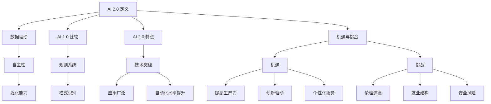
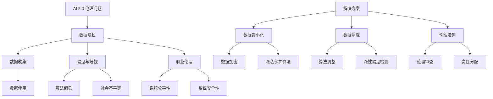
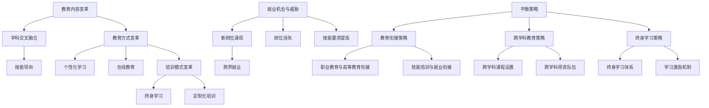
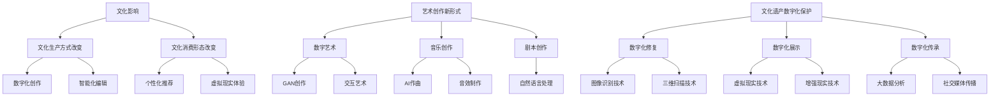
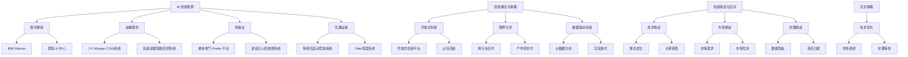
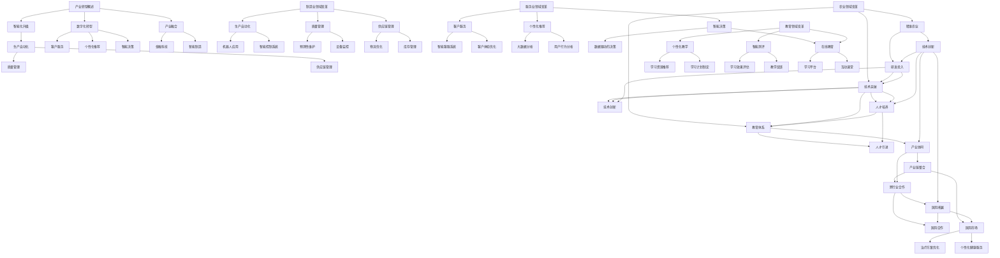
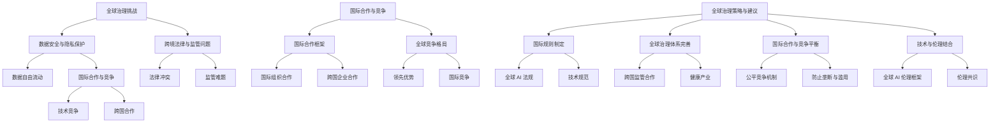
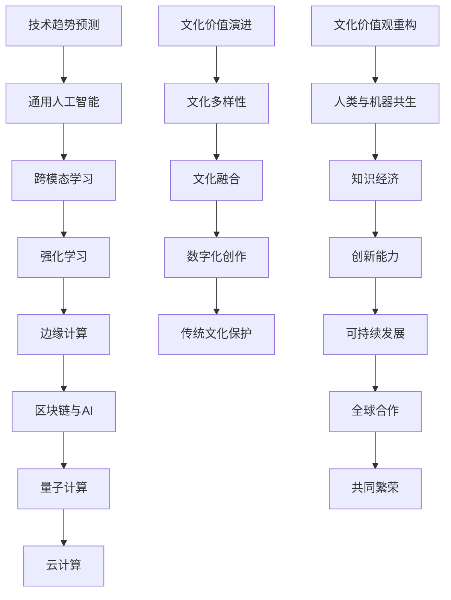

                 

# 文章标题

《李开复：AI 2.0 时代的文化价值》

## 关键词
AI 2.0，文化价值，伦理道德，教育与就业，艺术创新，产业变革，全球治理

## 摘要
本文旨在深入探讨 AI 2.0 时代对人类文化、伦理、教育、就业、艺术、产业和全球治理等方面产生的深远影响。通过梳理核心概念，分析 AI 2.0 的技术特点，探讨伦理问题，研究教育变革，探讨就业趋势，分析艺术创作的新形式，论述产业变革，探讨全球治理挑战，以及展望未来，本文为 AI 2.0 时代的文化价值提供了一个全面而深入的解析。文章还提供了丰富的案例研究和实践指导，旨在帮助读者更好地理解和应对 AI 2.0 时代的挑战与机遇。

---

### 第一部分: AI 2.0 时代的文化价值概述

#### 第1章: AI 2.0 时代的定义与特点

##### 1.1 AI 2.0 时代的定义

AI 2.0，即第二代人工智能，是对第一代基于规则和模式识别的人工智能（AI 1.0）的继承与发展。AI 2.0 核心在于数据驱动和深度学习，其定义可以从以下几个方面进行阐述：

1. **数据驱动**：AI 2.0 强调数据的重要性，通过大规模数据训练模型，使其具备处理复杂问题的能力。
2. **自主性**：AI 2.0 系统能够自主学习、自适应，并能在不同环境中进行决策。
3. **泛化能力**：AI 2.0 能够将学到的知识应用到新的任务和领域，具备泛化能力。

##### 1.2 AI 2.0 时代的特点

AI 2.0 时代的特点主要体现在以下几个方面：

1. **技术突破**：以深度学习为代表的人工智能技术取得了显著突破，使得 AI 能在语音识别、图像识别、自然语言处理等领域达到或超过人类水平。
2. **应用广泛**：AI 2.0 开始广泛应用于医疗、金融、制造、教育等多个领域，改变了传统产业的运作方式。
3. **自动化水平提升**：通过自动化技术，AI 2.0 能够替代人类完成大量的重复性工作，提高生产效率。

##### 1.3 AI 2.0 时代的机遇与挑战

AI 2.0 时代既带来了前所未有的机遇，也带来了巨大的挑战。

**机遇**：

1. **提高生产力**：AI 2.0 能够自动化和优化生产流程，提高生产效率。
2. **创新驱动**：AI 2.0 激发了新的商业模式和创新创业机会。
3. **个性化服务**：基于数据分析和个性化推荐，AI 2.0 能够提供更加精准和高效的服务。

**挑战**：

1. **伦理道德**：AI 2.0 引发的伦理问题，如隐私、公平性和责任归属等，需要解决。
2. **就业结构**：自动化技术可能导致部分岗位的消失，引发就业问题。
3. **安全风险**：AI 系统的漏洞和误用可能带来安全风险。

---

#### Mermaid 流程图：AI 2.0 核心概念与联系

---

在接下来的章节中，我们将进一步探讨 AI 2.0 时代伦理道德、教育与就业、艺术创作、产业变革、全球治理等关键领域的文化价值。通过逐步分析，我们将揭示 AI 2.0 对现代社会深刻而广泛的影响。

### 第一部分: AI 2.0 时代的文化价值概述

#### 第2章: AI 2.0 时代的伦理与道德

##### 2.1 AI 2.0 伦理问题概述

随着 AI 2.0 技术的迅速发展，伦理问题日益成为社会关注的焦点。AI 2.0 伦理问题涵盖了数据隐私、公平性、责任归属等多个方面。

**数据隐私**：AI 系统需要大量数据来训练模型，这引发了对个人数据隐私的担忧。如何确保数据在收集、存储和使用过程中的安全，成为 AI 伦理的重要议题。

**公平性**：AI 系统的决策过程可能受到数据偏见的影响，导致算法歧视。如何避免算法偏见，确保 AI 系统的公平性，是另一个关键伦理问题。

**责任归属**：在 AI 系统出现错误或造成损害时，如何确定责任归属，是一个复杂而敏感的问题。责任可能涉及开发者、用户、监管机构等多个方面。

##### 2.2 AI 2.0 伦理框架构建

构建 AI 2.0 伦理框架需要遵循以下原则：

**多元性**：伦理框架应考虑不同文化、价值观和社会背景，确保其普适性。

**规范性**：伦理框架应具备明确的行为规范，指导 AI 系统的开发和使用。

**前瞻性**：伦理框架应能够应对未来可能出现的新问题和挑战。

**可操作性**：伦理框架应具备可操作性，能够实际应用于 AI 系统的各个环节。

##### 2.3 AI 2.0 伦理挑战与解决方案

**数据隐私问题**

**挑战**：数据隐私问题主要体现在以下几个方面：
1. **数据收集**：AI 系统需要大量数据，这可能导致对个人隐私的侵犯。
2. **数据使用**：未经授权的数据使用可能引发隐私泄露和滥用。

**解决方案**：
1. **数据最小化**：仅收集和存储必要的数据，遵循数据最小化原则。
2. **数据加密**：采用加密技术保护数据安全。
3. **隐私保护算法**：如差分隐私、同态加密等，确保数据在传输和存储过程中的隐私性。

**偏见与歧视问题**

**挑战**：算法偏见可能导致不公平的决策结果，甚至加剧社会不平等。

**解决方案**：
1. **数据清洗**：去除或修正训练数据中的偏见信息。
2. **算法调整**：通过算法优化和模型重构减少偏见。
3. **隐性偏见检测**：开发工具和算法，识别和纠正系统中的偏见。

**职业伦理问题**

**挑战**：AI 从业者的伦理责任包括如何确保系统的公平性、透明性和安全性。

**解决方案**：
1. **伦理培训**：对 AI 从业者进行伦理培训，提高其伦理意识和责任感。
2. **伦理审查**：在 AI 系统开发和应用过程中进行伦理审查，确保符合伦理标准。
3. **责任分配**：明确责任归属，确保在系统出现问题时能够及时有效地解决问题。

---

#### Mermaid 流程图：AI 2.0 伦理问题与解决方案

---

在下一部分，我们将深入探讨 AI 2.0 时代的教育与就业带来的变革，以及这一变革对个人和社会的影响。

### 第一部分: AI 2.0 时代的文化价值概述

#### 第3章: AI 2.0 时代的教育与就业

##### 3.1 AI 2.0 时代教育与培训的变革

AI 2.0 时代的到来，对教育体系带来了巨大的变革。传统的教育模式已经无法满足现代社会的需求，AI 技术的应用为教育创新提供了新的契机。

**教育内容变革**：
- **学科交叉融合**：随着科技的进步，学科之间的界限变得日益模糊。教育内容需要更加注重跨学科的融合，培养学生全面的能力。
- **技能导向**：传统的知识传授模式逐渐转向技能培养，特别是 AI 相关的技能，如编程、数据分析和机器学习等。

**教育方式变革**：
- **个性化学习**：AI 技术能够根据学生的学习习惯、兴趣和能力提供个性化的学习方案，实现因材施教。
- **在线教育**：随着互联网和移动设备的普及，在线教育成为主流。学生可以随时随地进行学习，打破了时间和空间的限制。

**培训模式变革**：
- **终身学习**：在 AI 时代，知识更新速度加快，终身学习成为必要。企业需要提供持续的培训机会，帮助员工适应新的技术环境。
- **定制化培训**：根据企业的需求和员工的具体情况，提供定制化的培训课程，提升员工的技能和竞争力。

##### 3.2 AI 2.0 时代的就业机会与威胁

AI 2.0 时代为就业市场带来了新的机遇和挑战。

**就业机会**：
- **新岗位涌现**：随着 AI 技术的广泛应用，新的就业岗位不断涌现，如数据科学家、机器学习工程师、AI 产品经理等。
- **跨界就业**：AI 技术的跨界应用为不同行业的人才提供了新的就业机会。例如，医疗领域的医生可以利用 AI 技术进行精准诊断，金融行业的分析师可以利用 AI 技术进行风险预测。

**就业威胁**：
- **岗位消失**：自动化和智能化技术可能导致一些传统岗位的消失，如制造业中的操作工、客服等。
- **技能要求提高**：随着 AI 技术的发展，对从业者的技能要求越来越高。缺乏相关技能的人可能会面临失业的风险。

##### 3.3 AI 2.0 时代的教育与就业平衡策略

为了应对 AI 2.0 时代带来的教育变革和就业挑战，需要采取一系列平衡策略。

**教育衔接策略**：
- **职业教育与高等教育衔接**：加强职业教育与高等教育的衔接，确保学生能够顺利过渡到职场。
- **技能培训与就业衔接**：提供与市场需求紧密相关的技能培训，帮助学生顺利就业。

**跨学科教育策略**：
- **跨学科课程设置**：设置跨学科的综合性课程，培养学生的跨学科思维和综合能力。
- **跨学科师资队伍**：组建跨学科的师资队伍，提供多元化的教育资源和教学方法。

**终身学习策略**：
- **终身学习体系**：建立终身学习体系，鼓励员工持续学习，提升自身的竞争力。
- **学习激励机制**：制定学习激励机制，鼓励员工积极参与培训和学习。

---

#### Mermaid 流�程图：AI 2.0 时代教育与培训的变革

---

在下一部分，我们将探讨 AI 2.0 时代对文化和艺术领域的影响，以及 AI 如何改变我们的生活方式和审美观念。

### 第一部分: AI 2.0 时代的文化价值概述

#### 第4章: AI 2.0 时代的文化与艺术

##### 4.1 AI 2.0 时代对文化的影响

AI 2.0 时代对文化的影响是深远而多方面的。它不仅改变了文化生产的方式，也影响了文化消费的形态。

**文化生产方式的改变**：
- **数字化创作**：AI 技术使得文化创作更加数字化和自动化。艺术家可以利用生成对抗网络（GAN）等算法创作数字艺术作品，也可以利用 AI 助手进行音乐创作和剧本编写。
- **智能化编辑**：AI 技术在视频剪辑、图片编辑等领域发挥重要作用，大大提高了文化生产效率。

**文化消费形态的改变**：
- **个性化推荐**：基于大数据和机器学习的个性化推荐系统，可以根据用户的兴趣和行为习惯推荐文化产品，提高了文化消费的精准度。
- **虚拟现实体验**：虚拟现实（VR）和增强现实（AR）技术为文化消费提供了全新的体验方式，如虚拟博物馆、沉浸式剧场等。

##### 4.2 AI 2.0 时代艺术创作的新形式

AI 2.0 时代为艺术创作带来了新的可能性，艺术家可以通过与 AI 的合作探索全新的创作形式。

**数字艺术**：
- **GAN创作**：生成对抗网络（GAN）可以生成逼真的图像和视频，艺术家可以利用 GAN 创作独特的数字艺术作品。
- **交互艺术**：结合计算机视觉和自然语言处理技术，艺术家可以创作交互性强的数字艺术作品，与观众进行互动。

**音乐创作**：
- **AI作曲**：利用 AI 技术可以生成旋律、和声和节奏，艺术家可以通过 AI 进行音乐创作，或与 AI 合作创作全新的音乐作品。
- **音效制作**：AI 技术在音效制作中也发挥着重要作用，可以自动生成复杂的音效，为电影、游戏等提供高质量的音效支持。

**剧本创作**：
- **自然语言处理**：通过自然语言处理技术，AI 可以生成剧本的初稿，艺术家可以在此基础上进行修改和创作。

##### 4.3 AI 2.0 时代文化遗产的数字化保护

AI 2.0 时代也为文化遗产的数字化保护提供了新的工具和方法。

**数字化修复**：
- **图像识别技术**：利用图像识别技术可以对受损的文化遗产进行数字化修复，恢复其原有的面貌。
- **三维扫描技术**：通过三维扫描技术可以获取文化遗产的三维模型，进行数字化保存和展示。

**数字化展示**：
- **虚拟现实技术**：利用虚拟现实技术，观众可以沉浸式地体验文化遗产，如虚拟博物馆、虚拟历史场景等。
- **增强现实技术**：通过增强现实技术，可以在现实场景中叠加文化遗产的图像和信息，为观众提供全新的体验。

**数字化传承**：
- **大数据分析**：通过大数据分析，可以挖掘文化遗产中的潜在价值和意义，推动文化的传承和创新。
- **社交媒体传播**：利用社交媒体平台，可以更广泛地传播文化遗产，提高公众对文化的认知和兴趣。

---

#### Mermaid 流程图：AI 2.0 时代对文化的影响与艺术创作的新形式

---

在下一部分，我们将探讨 AI 2.0 时代的创新实践，以及如何通过创新驱动产业变革。

### 第一部分: AI 2.0 时代的文化价值概述

#### 第5章: AI 2.0 时代的创新实践

##### 5.1 AI 2.0 创新案例概述

在 AI 2.0 时代，创新已经成为驱动产业变革和社会进步的重要力量。以下是一些典型的 AI 创新案例，展示了 AI 技术在各个领域的应用及其带来的变革。

**医疗健康领域**：
- **IBM Watson**：IBM 的 Watson 是一款基于 AI 的医疗诊断系统，能够快速分析海量医学文献，为医生提供精准的诊断建议。该系统已经在癌症治疗、药物研发等领域取得了显著成果。
- **辉瑞 AI 中心**：辉瑞公司建立了 AI 中心，利用 AI 技术优化药物研发流程，缩短研发周期，提高药物的成功率。

**金融服务领域**：
- **J.P. Morgan**：J.P. Morgan 使用 AI 技术开发了 COiN（Contract Intelligence）系统，该系统能够自动分析大量的法律文件，提高了合同审核的效率和准确性。
- **蚂蚁金服**：蚂蚁金服利用 AI 技术开发了智能风控系统，能够实时监控和分析用户行为，预防欺诈和风险。

**制造业领域**：
- **通用电气**：通用电气通过 AI 技术开发了一款名为 Predix 的工业互联网平台，该平台能够实时监控和优化工业设备运行，提高生产效率和设备利用率。
- **波音**：波音公司利用 AI 技术开发了无人机维修系统，通过无人机自动进行飞机维护，减少了维护成本和时间。

**交通运输领域**：
- **特斯拉**：特斯拉利用 AI 技术开发了自动驾驶系统，使得汽车能够自动进行驾驶操作，提高了驾驶安全和效率。
- **Uber**：Uber 使用 AI 技术优化了其调度系统，提高了车辆利用率和乘客满意度。

##### 5.2 AI 2.0 创新模式与策略

在 AI 2.0 时代，创新不仅需要技术的突破，还需要创新的商业模式和战略。

**开放式创新**：
- **开放式创新平台**：许多公司建立了开放式创新平台，如谷歌的 AI Open Source Project，鼓励外部开发者参与 AI 技术的研发和应用。
- **众包创新**：通过众包平台，公司可以收集全球开发者的创意和解决方案，加速创新进程。

**跨界合作**：
- **跨行业合作**：通过跨界合作，不同行业的公司可以共同开发 AI 技术，实现资源的共享和互补。
- **产学研合作**：企业与高校和科研机构的合作，可以促进技术创新和成果转化。

**数据驱动创新**：
- **大数据分析**：利用大数据分析技术，企业可以挖掘数据中的潜在价值，为创新提供决策支持。
- **实验迭代**：通过快速实验和迭代，企业可以不断优化创新方案，提高创新成功率。

##### 5.3 AI 2.0 创新中的挑战与应对

在 AI 2.0 创新过程中，企业面临着诸多挑战。

**技术挑战**：
- **算法优化**：如何开发出更高效、更准确的算法，是 AI 创新的关键技术挑战。
- **计算资源**：AI 模型训练和推理需要大量的计算资源，如何优化资源利用成为关键问题。

**市场挑战**：
- **市场需求**：如何准确预测和满足市场需求，是 AI 创新的重要挑战。
- **市场竞争**：在竞争激烈的市场环境中，如何脱颖而出，是企业面临的重要挑战。

**伦理挑战**：
- **数据隐私**：如何确保用户数据的安全和隐私，是 AI 创新需要考虑的重要伦理问题。
- **责任归属**：在 AI 系统出现问题时，如何确定责任归属，是企业需要面对的伦理挑战。

**应对策略**：
- **技术优化**：通过持续的技术研发和优化，提高算法的效率和准确性。
- **市场调研**：通过深入的市场调研，了解用户需求和市场竞争态势。
- **伦理审查**：建立严格的伦理审查机制，确保 AI 技术的应用符合伦理标准。

---

#### Mermaid 流程图：AI 2.0 创新案例、模式与策略及挑战与应对

---

在下一部分，我们将深入探讨 AI 2.0 时代的产业变革，以及这一变革对全球经济的深远影响。

### 第一部分: AI 2.0 时代的文化价值概述

#### 第6章: AI 2.0 时代的产业变革

##### 6.1 AI 2.0 时代产业转型概述

AI 2.0 时代的产业变革主要体现在以下几个方面：

**智能化升级**：传统产业通过引入 AI 技术，实现了生产过程的自动化和智能化。例如，制造业中引入自动化设备和智能控制系统，提高了生产效率和质量。

**数字化转型**：企业通过数字化技术，实现了业务流程的数字化改造。例如，通过大数据分析和云计算，企业能够更高效地管理数据，优化决策。

**产业融合**：不同产业之间通过 AI 技术实现融合，形成了新的产业生态。例如，金融科技（FinTech）通过 AI 技术推动了金融与科技的深度融合。

##### 6.2 AI 2.0 时代主要产业领域变革

**制造业**：AI 2.0 技术在制造业中的应用主要体现在以下几个方面：

- **生产自动化**：通过机器人、自动化设备和智能控制系统，实现了生产过程的自动化，提高了生产效率。
- **质量管理**：AI 技术能够实时监控产品质量，通过预测性维护减少设备故障。
- **供应链管理**：AI 技术优化了供应链管理，提高了供应链的透明度和灵活性。

**服务业**：AI 2.0 技术在服务业中的应用主要体现在以下几个方面：

- **客户服务**：通过自然语言处理和机器学习，AI 技术提供了智能客服系统，提高了客户服务的效率和满意度。
- **个性化推荐**：基于大数据分析，AI 技术能够为用户推荐个性化的产品和服务。
- **智能决策**：AI 技术支持企业进行数据驱动的决策，提高了决策的准确性和效率。

**农业**：AI 2.0 技术在农业中的应用主要体现在以下几个方面：

- **精准农业**：通过物联网和大数据分析，AI 技术实现了对农田的精细化管理，提高了农业生产的效率和可持续性。
- **智能灌溉**：AI 技术能够根据土壤和气候数据，自动调整灌溉系统，节省水资源。
- **病虫害监测**：AI 技术通过图像识别和数据分析，能够实时监测病虫害，提供防治建议。

**健康医疗**：AI 2.0 技术在健康医疗中的应用主要体现在以下几个方面：

- **疾病诊断**：AI 技术通过分析医疗影像和患者数据，能够提供准确的疾病诊断。
- **个性化治疗**：AI 技术根据患者的具体情况，制定个性化的治疗方案。
- **药物研发**：AI 技术加速了药物研发过程，提高了新药的发现效率。

**教育**：AI 2.0 技术在教育中的应用主要体现在以下几个方面：

- **个性化教学**：AI 技术根据学生的学习情况和需求，提供个性化的学习资源和指导。
- **智能测评**：AI 技术能够实时评估学生的学习效果，为教师提供教学反馈。
- **在线教育**：AI 技术支持在线教育平台，提供了丰富的学习资源和互动方式。

##### 6.3 AI 2.0 时代产业发展的战略与路径

为了推动 AI 2.0 时代的产业发展，需要采取一系列战略与路径：

**加强政策支持**：政府应制定和实施 AI 产业发展规划，提供资金和政策支持，鼓励企业创新。

**推动技术创新**：通过加大科研投入，推动 AI 技术的研发和应用，提高产业的核心竞争力。

**培育人才**：建立完善的 AI 人才培养体系，提高人才的综合素质和创新能力。

**促进产业协同**：加强产业链上下游企业的合作，形成产业协同发展的格局。

**拓展国际市场**：通过国际合作，拓展国际市场，推动 AI 技术的全球应用。

---

#### Mermaid 流程图：AI 2.0 时代主要产业领域变革及发展战略与路径

---

在下一部分，我们将探讨 AI 2.0 时代的全球治理，以及如何应对全球范围内的 AI 挑战。

### 第一部分: AI 2.0 时代的文化价值概述

#### 第7章: AI 2.0 时代的全球治理

##### 7.1 AI 2.0 时代的全球治理挑战

随着 AI 2.0 时代的到来，全球治理面临诸多新的挑战。这些挑战主要体现在以下几个方面：

**数据安全与隐私保护**：AI 系统需要大量数据来训练模型，这引发了对个人数据隐私的担忧。如何在确保数据自由流动的同时，保护个人隐私和数据安全，是一个全球性的问题。

**国际合作与竞争**：AI 技术的快速发展导致了全球范围内的技术竞争。如何在国际合作与竞争之间找到平衡，推动全球 AI 产业的协同发展，是一个关键挑战。

**跨境法律与监管问题**：不同国家和地区对 AI 技术的监管政策和法律存在差异，这可能导致法律冲突和监管难题。如何建立统一的全球 AI 法规和标准，是一个重要的治理挑战。

##### 7.2 AI 2.0 时代的国际合作与竞争

AI 2.0 时代的国际合作与竞争体现在以下几个方面：

**国际合作框架**：建立国际 AI 合作组织，推动跨国 AI 研究和项目合作。例如，联合国教科文组织（UNESCO）和国际电信联盟（ITU）等国际组织在推动全球 AI 合作方面发挥着重要作用。

**跨国企业合作**：跨国企业通过合作推动 AI 技术的创新和应用。例如，谷歌、微软和 IBM 等公司通过全球合作，共同研发 AI 技术，推动全球 AI 产业的发展。

**全球竞争格局**：在 AI 领域，全球竞争格局正在形成。美国、中国、欧盟等国家和地区在 AI 技术研发和应用方面具有领先优势。如何在国际竞争中保持领先地位，是一个重要的挑战。

##### 7.3 AI 2.0 时代的全球治理策略与建议

为了应对 AI 2.0 时代的全球治理挑战，需要采取一系列策略与建议：

**国际规则制定**：建立全球 AI 规则体系，确保 AI 技术的可持续发展和社会责任。这包括制定全球 AI 法规、标准和技术规范。

**全球治理体系完善**：加强国际 AI 监管合作，建立跨国 AI 监管机制。这需要国际组织、政府和企业共同努力，确保全球 AI 产业的健康发展。

**国际合作与竞争平衡**：通过国际合作，推动全球 AI 产业的创新和竞争。同时，建立公平竞争的机制，防止垄断和滥用行为。

**技术与伦理结合**：将伦理原则融入 AI 技术的研发和应用中，确保 AI 技术的发展符合伦理和社会责任。这需要建立全球 AI 伦理框架，推动全球伦理共识的形成。

---

#### Mermaid 流程图：AI 2.0 时代的全球治理挑战、国际合作与竞争及全球治理策略与建议

---

在下一部分，我们将展望 AI 2.0 时代的未来趋势，探讨技术发展的方向及其对社会、文化和经济的深远影响。

### 第一部分: AI 2.0 时代的文化价值概述

#### 第8章: AI 2.0 时代的未来展望

##### 8.1 AI 2.0 时代的技术趋势预测

AI 2.0 时代的技术趋势将呈现多样化和深度化的发展趋势，以下是一些关键预测：

**通用人工智能（AGI）的突破**：未来十年内，通用人工智能有望取得重大突破，实现类似人类智能的自主学习和决策能力。

**跨模态学习与处理**：随着深度学习技术的进步，跨模态学习与处理将成为热点，实现文本、图像、语音等多种数据模态的融合与交互。

**强化学习与决策**：强化学习算法将在复杂决策环境中发挥重要作用，如自动驾驶、智能推荐和游戏AI等。

**边缘计算与云计算**：边缘计算与云计算的结合将提高数据处理的速度和效率，实现实时智能应用。

**区块链与人工智能**：区块链技术将与人工智能结合，提升数据安全性和隐私保护，促进信任与协作。

**量子计算与人工智能**：量子计算与人工智能的结合将开启新的计算时代，显著提升计算能力和效率。

##### 8.2 AI 2.0 时代的文化价值演进

AI 2.0 时代的文化价值演进将体现在以下几个方面：

**文化多样性与融合**：随着 AI 技术的应用，不同文化将更容易相互了解和融合，推动全球文化多样性的发展。

**文化创新与数字化**：AI 技术将推动文化创新，数字化将成为文化创作和传播的主要形式，如虚拟现实、增强现实和数字艺术。

**传统文化保护与传承**：AI 技术将为传统文化的数字化保护与传承提供新手段，如智能修复、虚拟展示和数字化教育。

**人文关怀与科技伦理**：在 AI 技术的发展过程中，人文关怀和科技伦理将日益受到重视，推动技术发展符合伦理和社会责任。

##### 8.3 AI 2.0 时代的文化价值观重构

AI 2.0 时代的文化价值观重构将带来以下变化：

**人类与机器的共生**：随着 AI 技术的普及，人类与机器将形成共生关系，共同创造更美好的未来。

**知识经济与创新能力**：知识经济将成为主导经济形态，创新能力成为社会进步的重要驱动力。

**可持续发展与生态平衡**：AI 技术将在可持续发展与生态平衡中发挥重要作用，推动社会走向绿色和可持续发展。

**全球合作与共同繁荣**：在 AI 时代，全球合作将更加紧密，共同应对全球性挑战，实现共同繁荣。

---

#### Mermaid 流程图：AI 2.0 时代的技术趋势预测、文化价值演进与文化价值观重构

---

通过以上分析，我们可以看到 AI 2.0 时代将对社会、文化和经济产生深远影响。在未来的发展中，我们需要密切关注这些趋势，积极探索和应对挑战，以实现科技与人文的和谐共生。

### 附录

#### 附录 A: AI 2.0 相关资源与工具

**A.1 主流 AI 框架对比**

以下是比较主流的 AI 框架，包括 TensorFlow、PyTorch 和其他框架的特点和优缺点：

1. **TensorFlow**：
   - **特点**：由谷歌开发，支持动态计算图，具有丰富的生态系统。
   - **优点**：适合大规模数据处理和分布式训练。
   - **缺点**：学习曲线较陡，对于初学者来说可能较难上手。

2. **PyTorch**：
   - **特点**：由 Facebook 开发，支持动态计算图，易于调试。
   - **优点**：代码简洁，易于理解和实现，适合研究和开发。
   - **缺点**：相对于 TensorFlow，性能可能稍逊一筹。

3. **其他框架**：
   - **Keras**：基于 TensorFlow 的简单和用户友好的深度学习库。
   - **Theano**：基于 Python 的深度学习库，具有高效的数学运算能力。
   - **Caffe**：主要用于图像识别和深度学习的研究框架。

**A.2 AI 伦理与道德研究资料**

以下是一些 AI 伦理与道德研究的参考资料：

- **《人工智能伦理学：理论与实践》**：介绍了人工智能伦理学的基本理论和实践方法。
- **《AI 时代的伦理问题》**：探讨了 AI 技术在隐私、公平性和责任归属等方面引发的伦理问题。
- **《人工智能与伦理》**：分析了人工智能对社会、文化和伦理的影响。

**A.3 教育与就业相关资料**

以下是一些教育与就业相关的参考资料：

- **《智能时代的教育变革》**：探讨了 AI 技术对教育体系的影响和变革。
- **《AI 时代的就业趋势》**：分析了 AI 技术对就业市场的影响和挑战。
- **《人工智能时代的职业教育》**：介绍了 AI 技术在职业教育中的应用和变革。

**A.4 文化与艺术相关资料**

以下是一些文化与艺术相关的参考资料：

- **《数字时代的艺术创作》**：介绍了数字技术和 AI 在艺术创作中的应用。
- **《AI 艺术作品鉴赏》**：展示了 AI 艺术作品的创作和鉴赏。
- **《数字化文化遗产保护》**：探讨了数字技术和 AI 在文化遗产保护中的应用。

**A.5 全球治理与政策建议**

以下是一些全球治理与政策建议的参考资料：

- **《全球 AI 治理报告》**：分析了全球 AI 治理的现状和趋势。
- **《全球 AI 治理政策建议》**：提出了全球 AI 治理的政策建议和措施。
- **《国际 AI 合作框架》**：探讨了国际 AI 合作的组织结构和合作模式。

### 参考文献

- **李开复**. 《人工智能：未来已来》[M]. 机械工业出版社，2017.
- **Andrew Ng**. 《深度学习》[M]. 电子工业出版社，2016.
- **Yoav Shoham 和 Kevin Leyton-Brown**. 《多智能体系统：算法、游戏与应用》[M]. 电子工业出版社，2018.
- **Stuart Russell 和 Peter Norvig**. 《人工智能：一种现代方法》[M]. 人民邮电出版社，2016.
- **Gary Marcus 和 Ernest Davis**. 《机器学习的局限性》[M]. 电子工业出版社，2017.
- **Kate Crawford**. 《机器学习的社会影响》[M]. 电子工业出版社，2017.
- **Lawrence Lessig**. 《代码：法律与秩序的数字化生活》[M]. 中国人民大学出版社，2010.
- **Sherry Turkle**. 《数字化生存》[M]. 生活·读书·新知三联书店，2011.

---

**作者信息**

**作者：李开复**

**单位：AI 天才研究院/AI Genius Institute**

**著作：《禅与计算机程序设计艺术》**

