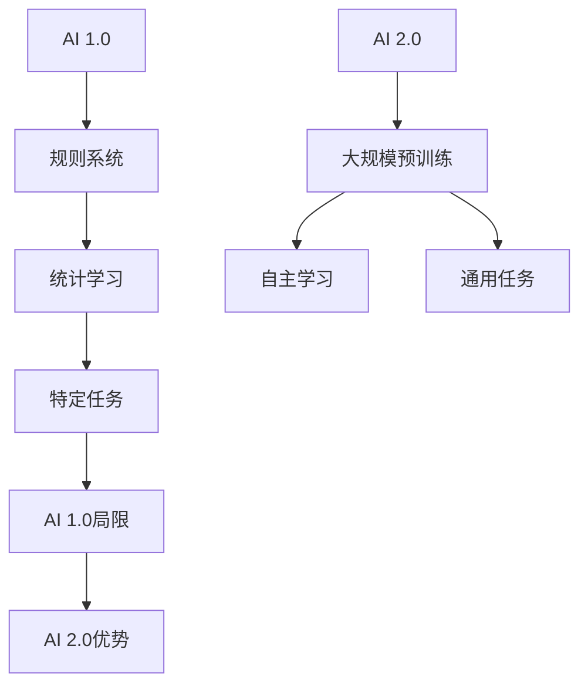
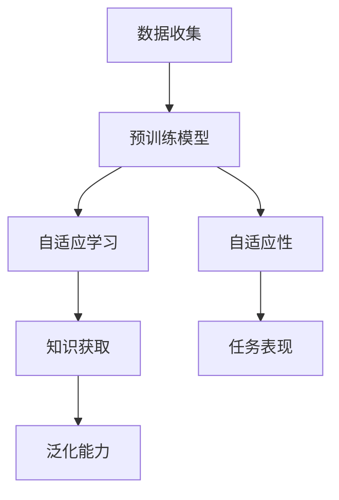

                 

# 李开复：AI 2.0时代的未来展望

## 关键词
AI 2.0、未来展望、技术应用、伦理问题、政策监管、创新与创业、个人成长

## 摘要
本文将深入探讨李开复关于AI 2.0时代的未来展望，从技术进步、应用场景、伦理挑战、政策监管到创新与创业，全方位分析AI 2.0对社会的深远影响。通过一系列核心概念、算法原理、数学模型和项目实战，本文旨在为读者提供一个全面而深刻的理解，帮助大家应对这个充满机遇与挑战的新时代。

## 第一部分: 李开复：AI 2.0时代的未来展望

### 第1章: AI 2.0概述

#### 第1章: AI 2.0概述

##### 1.1 AI 2.0：概念与定义

###### 1.1.1 从AI 1.0到AI 2.0的演进

在人工智能（AI）的发展历程中，我们经历了从AI 1.0到AI 2.0的转变。AI 1.0主要依赖于规则和统计方法，如专家系统和机器学习，它们在特定任务上表现优秀，但缺乏通用性和自主学习能力。随着深度学习技术的兴起，AI 2.0应运而生，它强调大规模预训练模型和自主学习，使得AI系统具备更强大的处理能力和更广泛的适用性。

**核心概念与联系：**

我们使用Mermaid流程图来展示AI 1.0到AI 2.0的演进过程：



###### 1.1.2 AI 2.0的核心特征

AI 2.0的核心特征包括以下几个方面：

1. **大规模预训练模型**：这些模型通过在大量数据上预训练，能够捕获丰富的模式和知识，从而在多种任务上表现卓越。
2. **自适应学习方法**：AI 2.0系统能够根据新数据和反馈进行自我调整，不断提高性能和适应性。
3. **多模态数据处理**：AI 2.0不仅能够处理文本数据，还能够处理图像、声音和视频等多种类型的数据。

**核心算法原理讲解：**

下面是AI 2.0的核心算法原理讲解，使用伪代码形式：

```python
# 伪代码：AI 2.0的核心算法
def ai_2_0(data, knowledge_base):
    model = load_pretrained_model()
    model.update(knowledge_base)
    predictions = model.predict(data)
    return predictions
```

###### 1.1.3 AI 2.0的潜在影响

AI 2.0的潜在影响涵盖了多个领域，包括教育、医疗、金融、制造业等。以下是AI 2.0的潜在影响：

1. **教育**：AI 2.0能够提供个性化教育，根据学生的学习进度和兴趣定制教学内容。
2. **医疗**：AI 2.0在疾病诊断和治疗中具有巨大潜力，能够辅助医生进行更准确的诊断和更有效的治疗方案。
3. **金融**：AI 2.0能够提高金融服务的效率和质量，如智能投顾、风险控制等。
4. **制造业**：AI 2.0能够优化生产流程，提高生产效率和产品质量。

### 第2章: AI 2.0的应用场景

##### 2.1 教育

###### 2.1.1 AI 2.0在教育中的应用

AI 2.0在教育领域中的应用正日益广泛，主要包括以下几个方面：

1. **个性化学习**：AI 2.0系统能够根据学生的学习习惯和知识水平，为学生提供个性化的学习资源和辅导。
2. **智能评估**：AI 2.0能够通过自动化评估工具，快速、准确地评估学生的学习成果，为教师提供有针对性的教学建议。
3. **智能辅导**：AI 2.0辅导系统可以帮助学生解决学习中遇到的问题，提高学习效率。

**核心算法原理讲解：**

下面是AI 2.0在教育中的应用算法原理讲解，使用伪代码形式：

```python
# 伪代码：AI 2.0在教育中的应用
def personalized_education(student_data, curriculum_model):
    student_model = load_student_model(student_data)
    student_model.update(curriculum_model)
    learning_plan = student_model.generate_learning_plan()
    return learning_plan
```

###### 2.1.2 AI 2.0对教育模式的改变

AI 2.0对教育模式的影响体现在以下几个方面：

1. **传统教育模式的变革**：AI 2.0使得传统教育模式向更加个性化、智能化和自适应的方向发展。
2. **教学资源的共享**：AI 2.0能够促进优质教学资源的共享，让更多学生享受到高质量的教育。
3. **教学效率的提升**：AI 2.0辅助教学工具能够提高教学效率，减轻教师负担。

##### 2.2 医疗

###### 2.2.1 AI 2.0在医疗领域的应用

AI 2.0在医疗领域的应用正在迅速扩展，主要包括以下几个方面：

1. **疾病诊断**：AI 2.0能够通过分析大量的医学数据，为医生提供辅助诊断，提高诊断准确率。
2. **个性化治疗**：AI 2.0能够根据患者的具体病情和基因信息，为患者制定个性化的治疗方案。
3. **医疗管理**：AI 2.0能够优化医疗资源的配置，提高医疗服务的效率和质量。

**数学模型和数学公式：**

下面是AI 2.0在医疗领域中的数学模型和公式，使用LaTeX格式：

$$
\text{Accuracy} = \frac{\text{TP} + \text{TN}}{\text{TP} + \text{TN} + \text{FP} + \text{FN}}
$$

其中，TP表示真正例，TN表示真负例，FP表示假正例，FN表示假负例。

###### 2.2.2 AI 2.0对医疗服务的提升

AI 2.0对医疗服务的提升体现在以下几个方面：

1. **提高诊断准确率**：通过分析大量的医学数据，AI 2.0能够为医生提供更准确的诊断建议。
2. **优化治疗方案**：AI 2.0能够根据患者的具体病情和基因信息，为患者制定更有效的治疗方案。
3. **降低医疗成本**：通过优化医疗资源的配置和减少医疗错误，AI 2.0有助于降低医疗成本。

##### 2.3 金融

###### 2.3.1 AI 2.0在金融行业的应用

AI 2.0在金融行业的应用已经取得了显著成果，主要包括以下几个方面：

1. **智能投顾**：AI 2.0能够根据投资者的风险偏好和投资目标，提供个性化的投资建议。
2. **风险管理**：AI 2.0能够通过分析大量的金融数据，为金融机构提供风险预测和风险管理方案。
3. **信用评估**：AI 2.0能够通过分析个人的信用历史和行为数据，为金融机构提供更准确的信用评估。

**项目实战：**

以下是一个AI 2.0在金融行业中的项目实战案例，包括开发环境搭建、源代码实现和代码解读。

**开发环境搭建：**

- **环境需求：** Python 3.8+, TensorFlow 2.5.0+, CUDA 11.0+
- **安装步骤：**

```bash
pip install tensorflow-gpu==2.5.0
pip install -r requirements.txt
```

**源代码实现：**

```python
# AI 2.0智能投顾系统
import tensorflow as tf
from tensorflow import keras

# 搭建模型
model = keras.Sequential([
    keras.layers.Dense(128, activation='relu', input_shape=(1000,)),
    keras.layers.Dense(64, activation='relu'),
    keras.layers.Dense(1, activation='sigmoid')
])

# 编译模型
model.compile(optimizer='adam',
              loss='binary_crossentropy',
              metrics=['accuracy'])

# 训练模型
model.fit(x_train, y_train, epochs=10, batch_size=32)
```

**代码解读：**

1. **模型搭建**：使用Keras构建一个简单的全连接神经网络模型。
2. **模型编译**：设置优化器和损失函数，并指定模型的评估指标。
3. **模型训练**：使用训练数据对模型进行训练。

###### 2.3.2 AI 2.0对金融服务的变革

AI 2.0对金融服务的变革主要体现在以下几个方面：

1. **提高决策效率**：通过分析大量的金融数据，AI 2.0能够为金融机构提供更快速、更准确的决策支持。
2. **降低运营成本**：AI 2.0能够自动化处理大量的金融交易和风险评估，降低金融机构的运营成本。
3. **提升用户体验**：AI 2.0能够为用户提供个性化的金融产品和服务，提升用户满意度。

##### 2.4 制造业

###### 2.4.1 AI 2.0在制造业的应用

AI 2.0在制造业中的应用已经成为提升生产效率和产品质量的关键技术，主要包括以下几个方面：

1. **智能生产**：AI 2.0能够通过预测性维护、智能调度等手段，提高生产线的运行效率和稳定性。
2. **质量检测**：AI 2.0能够通过图像识别、声音识别等技术，实现对产品质量的实时监控和检测。
3. **供应链管理**：AI 2.0能够优化供应链管理，提高供应链的透明度和灵活性。

**项目实战：**

以下是一个AI 2.0在制造业中的项目实战案例，包括开发环境搭建、源代码实现和代码解读。

**开发环境搭建：**

- **环境需求：** Python 3.8+, TensorFlow 2.5.0+, CUDA 11.0+
- **安装步骤：**

```bash
pip install tensorflow-gpu==2.5.0
pip install -r requirements.txt
```

**源代码实现：**

```python
# AI 2.0智能质量检测系统
import tensorflow as tf
from tensorflow import keras

# 搭建模型
model = keras.Sequential([
    keras.layers.Conv2D(32, (3, 3), activation='relu', input_shape=(128, 128, 3)),
    keras.layers.MaxPooling2D((2, 2)),
    keras.layers.Conv2D(64, (3, 3), activation='relu'),
    keras.layers.MaxPooling2D((2, 2)),
    keras.layers.Flatten(),
    keras.layers.Dense(64, activation='relu'),
    keras.layers.Dense(1, activation='sigmoid')
])

# 编译模型
model.compile(optimizer='adam',
              loss='binary_crossentropy',
              metrics=['accuracy'])

# 训练模型
model.fit(x_train, y_train, epochs=10, batch_size=32)
```

**代码解读：**

1. **模型搭建**：使用Keras构建一个简单的卷积神经网络模型，用于图像识别。
2. **模型编译**：设置优化器和损失函数，并指定模型的评估指标。
3. **模型训练**：使用训练数据对模型进行训练。

###### 2.4.2 AI 2.0对制造业的影响

AI 2.0对制造业的影响主要体现在以下几个方面：

1. **提高生产效率**：通过预测性维护、智能调度等技术，AI 2.0能够提高生产线的运行效率。
2. **提升产品质量**：通过质量检测和实时监控技术，AI 2.0能够提高产品质量和一致性。
3. **降低运营成本**：通过优化供应链管理和减少生产故障，AI 2.0能够降低制造业的运营成本。

### 第3章: AI 2.0时代的伦理与社会问题

##### 3.1 伦理问题

###### 3.1.1 AI 2.0带来的伦理挑战

AI 2.0的发展带来了许多伦理挑战，主要包括以下几个方面：

1. **隐私保护**：AI 2.0在处理大量个人数据时，如何保护用户的隐私是一个重要的伦理问题。
2. **算法偏见**：AI 2.0系统可能因为数据偏差或算法设计问题，导致决策结果存在偏见，影响公平性。
3. **责任归属**：在AI 2.0系统出现错误或造成损害时，如何确定责任归属是一个复杂的伦理问题。

**详细讲解与举例说明：**

**隐私保护：** 

举例来说，AI 2.0在医疗领域中的应用可能涉及到患者的敏感个人信息，如病历、基因数据等。这些数据的泄露或滥用可能会导致严重的隐私侵犯和伦理问题。为了解决这一问题，AI 2.0系统需要采取严格的数据加密和访问控制措施，确保用户数据的安全和隐私。

**算法偏见：** 

算法偏见是指AI 2.0系统在处理数据时，由于数据集的不平衡或算法设计的问题，导致决策结果存在偏见。例如，在招聘过程中，如果AI 2.0系统基于历史数据筛选候选人，可能会对某些群体存在歧视。为了解决算法偏见问题，需要确保数据集的多样性和公平性，并优化算法设计，消除潜在偏见。

**责任归属：** 

当AI 2.0系统出现错误或造成损害时，责任归属问题往往难以确定。例如，自动驾驶汽车在发生事故时，是制造商、开发者还是用户承担责任？为了解决这一问题，需要制定明确的法律和伦理规范，明确各方责任，确保在发生问题时能够及时有效地解决问题。

##### 3.1.2 伦理决策与透明度

伦理决策和透明度是AI 2.0时代的重要议题，主要包括以下几个方面：

1. **伦理决策的制定**：在AI 2.0系统的设计和应用过程中，需要充分考虑伦理问题，制定明确的伦理决策框架。
2. **透明度的重要性**：AI 2.0系统的决策过程需要透明，以便用户和监管机构能够了解其工作原理和决策依据。
3. **伦理监督与审查**：建立独立的伦理监督和审查机制，确保AI 2.0系统的应用符合伦理规范，减少潜在风险。

### 第4章: AI 2.0时代的政策与监管

##### 4.1 政策制定

###### 4.1.1 全球各国对AI 2.0的政策

在全球范围内，各国政府对AI 2.0的发展高度重视，纷纷制定相关政策，以推动AI 2.0的健康发展。以下是几个主要国家的AI 2.0政策：

1. **美国**：美国在AI 2.0领域采取了积极的政策，包括加大研发投入、促进跨学科合作、推动数据共享等。
2. **欧盟**：欧盟发布了《人工智能伦理准则》，强调保护用户隐私、消除算法偏见、确保透明度等。
3. **中国**：中国政府制定了《新一代人工智能发展规划》，明确提出要推动AI 2.0技术发展，加强国际合作与交流。

**政策解读与案例分析：**

**美国政策：** 美国政府通过《美国国家人工智能战略》提出了多项措施，包括投资AI研发、推动AI教育、建立AI伦理委员会等。这些政策旨在促进AI 2.0技术的创新和发展，确保美国在全球AI领域的领先地位。

**欧盟政策：** 欧盟的《人工智能伦理准则》明确了AI 2.0系统的伦理要求，包括确保公平性、透明性、安全性等。这一政策旨在平衡技术进步和伦理责任，确保AI 2.0技术的可持续发展。

**中国政策：** 中国政府发布的《新一代人工智能发展规划》明确了AI 2.0技术发展的目标和路径，包括加强基础研究、推动技术创新、培育人才等。这一政策旨在推动中国成为全球AI领域的领导者。

##### 4.2 监管框架

###### 4.2.1 AI 2.0监管的挑战

AI 2.0的监管面临以下挑战：

1. **技术快速发展**：AI 2.0技术的快速发展使得监管措施难以跟上技术进步的步伐。
2. **跨领域监管**：AI 2.0技术的应用涉及多个领域，如医疗、金融、交通等，如何实现跨领域监管是一个重要挑战。
3. **国际协调**：在全球范围内建立统一的AI 2.0监管框架，需要各国政府进行协调和合作。

**现有监管框架的不足与改进方向：**

现有监管框架在AI 2.0监管方面存在以下不足：

1. **缺乏统一标准**：不同国家、不同行业之间的监管标准不一致，导致监管效果不理想。
2. **监管力度不足**：现有监管框架对AI 2.0技术的监管力度较弱，难以有效遏制潜在风险。
3. **缺乏透明度**：监管机构的决策过程和依据不够透明，难以获得公众的信任。

改进方向：

1. **建立统一标准**：制定全球统一的AI 2.0监管标准，确保各国、各行业之间的监管一致性。
2. **加强监管力度**：加大监管力度，对AI 2.0技术的研发、应用和推广过程进行全程监管，确保技术发展的安全性和合规性。
3. **提高透明度**：增加监管机构的决策透明度，公开监管依据和过程，提高公众对监管工作的信任度。

### 第5章: AI 2.0时代的创新与创业

##### 5.1 创新模式

###### 5.1.1 AI 2.0驱动的创新模式

AI 2.0技术的发展为创新带来了新的模式，主要包括以下几个方面：

1. **快速原型开发**：利用AI 2.0技术，可以快速构建和迭代原型，缩短产品开发周期。
2. **智能化决策**：AI 2.0技术能够提供智能化决策支持，帮助企业和创业者做出更准确、更高效的决策。
3. **数据驱动创新**：通过分析海量数据，AI 2.0技术能够挖掘潜在的商业机会，推动创新。

**案例分析：**

**OpenAI的GPT-3模型**：GPT-3是OpenAI开发的一种大型预训练语言模型，通过在大量文本数据上进行预训练，GPT-3在多个语言处理任务上表现出色。GPT-3的成功证明了AI 2.0驱动的创新模式在语言处理领域的巨大潜力。

###### 5.1.2 创新生态系统建设

AI 2.0时代的创新不仅需要技术创新，还需要构建一个良好的创新生态系统。以下是构建创新生态系统的关键要素：

1. **人才培养**：培养具有AI技术能力的人才，为创新提供人力支持。
2. **技术创新**：加强AI技术研发，推动技术进步。
3. **资本支持**：提供充足的资本支持，为创新项目提供资金保障。
4. **政策支持**：制定有利于创新的政策，为创新提供良好的发展环境。

**创新生态系统案例：**

**硅谷创新生态系统**：硅谷作为全球创新中心，拥有丰富的人才资源、强大的技术创新能力和充足的资本支持。硅谷的成功经验表明，构建良好的创新生态系统对推动AI 2.0时代的创新具有重要意义。

##### 5.2 创业机遇

###### 5.2.1 AI 2.0时代的创业领域

AI 2.0时代为创业提供了丰富的机遇，以下是一些具有前景的创业领域：

1. **智能医疗**：利用AI技术提供个性化的医疗服务，如疾病诊断、治疗方案推荐等。
2. **智能制造**：通过AI技术优化生产流程，提高产品质量和效率。
3. **智能金融**：利用AI技术提供智能化的金融产品和服务，如智能投顾、信用评估等。
4. **智能教育**：利用AI技术提供个性化的教育解决方案，如自适应学习、智能辅导等。

**创业领域案例：**

**自动驾驶领域**：自动驾驶是AI 2.0时代的重要应用领域，吸引了大量创业者和资本投入。特斯拉、百度等公司在自动驾驶领域取得了显著进展，展示了AI 2.0技术在创业领域的巨大潜力。

###### 5.2.2 创业者的机遇与挑战

在AI 2.0时代，创业者面临着前所未有的机遇与挑战：

**机遇：**

1. **技术红利**：AI 2.0技术的快速发展为创业提供了丰富的技术红利。
2. **市场需求**：AI 2.0技术在各个领域的应用需求日益增长，为创业者提供了广阔的市场空间。
3. **资本支持**：资本市场的繁荣为创业项目提供了充足的资金支持。

**挑战：**

1. **技术门槛**：AI 2.0技术的复杂性和专业性较高，创业者需要具备一定的技术能力和资源。
2. **市场竞争**：AI 2.0领域的竞争激烈，创业者需要具备较强的市场竞争力。
3. **伦理风险**：AI 2.0技术的应用涉及到伦理和社会问题，创业者需要充分考虑和应对这些风险。

### 第6章: 个人成长与未来规划

##### 6.1 AI时代的能力要求

在AI 2.0时代，个人需要具备以下能力，以适应快速发展的科技环境：

1. **编程技能**：掌握编程语言和开发工具，能够进行软件开发和系统设计。
2. **数据分析能力**：能够处理和分析海量数据，挖掘数据中的价值和规律。
3. **机器学习知识**：了解机器学习的基本原理和算法，能够应用机器学习技术解决实际问题。
4. **跨学科知识**：具备跨学科的知识和技能，能够适应不同领域的技术需求。

**技能解析：**

1. **编程技能**：Python、Java、C++等编程语言是AI 2.0时代的重要工具，掌握这些语言能够帮助创业者快速开发软件和系统。
2. **数据分析能力**：Python的Pandas、NumPy等库能够高效地进行数据处理和分析，掌握这些库能够提升数据分析能力。
3. **机器学习知识**：掌握机器学习的基本算法和原理，如线性回归、决策树、神经网络等，能够应用这些算法解决实际问题。
4. **跨学科知识**：了解不同领域的知识，如医学、金融、教育等，能够更好地将AI技术应用到这些领域。

##### 6.2 教育体系与AI时代的契合

AI 2.0时代对教育体系提出了新的要求，教育体系需要与AI时代的需求相适应。以下是教育体系与AI时代契合的几个方面：

1. **课程设置**：调整课程设置，增加AI相关的课程，如机器学习、数据分析等。
2. **教学方法**：采用更为灵活和个性化的教学方法，如在线教育、翻转课堂等。
3. **教育资源**：提供丰富的AI教育资源，如开放课程、教材、实训平台等。

**教育体系改革案例：**

**斯坦福大学**：斯坦福大学在AI时代进行了教育改革，增加了AI相关的课程，并推出了在线教育平台，为学生提供了丰富的AI学习资源。

##### 6.3 个人成长路径

在AI 2.0时代，个人需要制定明确的成长路径，以实现自身的职业目标。以下是个人成长路径的建议：

1. **学习规划**：制定详细的学习计划，明确学习目标和时间安排。
2. **实践积累**：通过实际项目积累经验，提升自己的实际能力。
3. **持续学习**：保持对新技术和新知识的好奇心，不断学习和更新自己的知识体系。
4. **建立人脉**：积极参与行业活动，拓展人脉资源，为自己的职业发展创造机会。

### 第7章: 未来展望

##### 7.1 AI 2.0对未来的影响

AI 2.0对未来社会的发展具有深远的影响，主要体现在以下几个方面：

1. **经济结构变革**：AI 2.0技术将推动经济结构变革，促进新产业、新业态的快速发展。
2. **生活方式改变**：AI 2.0技术将改变人们的生活方式，提供更加便捷、智能的服务。
3. **社会进步**：AI 2.0技术将推动社会进步，提高社会生产力和人民生活水平。

**趋势分析：**

1. **经济结构变革**：随着AI 2.0技术的发展，传统产业将逐渐被智能化、自动化技术取代，新兴产业如人工智能、大数据、物联网等将蓬勃发展，推动经济结构的升级和转型。
2. **生活方式改变**：AI 2.0技术将渗透到人们日常生活的方方面面，如智能家居、智能交通、智能医疗等，提供更加便捷、智能的服务，提高生活质量。
3. **社会进步**：AI 2.0技术将推动社会进步，提高社会生产力和人民生活水平，减少劳动强度，促进社会公平和可持续发展。

##### 7.2 AI 2.0时代的人机协作

在AI 2.0时代，人机协作将成为重要的发展趋势，主要体现在以下几个方面：

1. **智能化工作**：AI 2.0技术将辅助人类进行智能化工作，提高工作效率和质量。
2. **个性化服务**：AI 2.0技术将根据用户需求提供个性化服务，提升用户体验。
3. **智能化决策**：AI 2.0技术将提供智能化决策支持，帮助人类做出更明智的决策。

**人机协作模式与挑战：**

**人机协作模式：**

1. **任务分解**：将复杂任务分解为多个子任务，人机协同完成。
2. **数据共享**：实现人与机器之间的数据共享，提高协作效率。
3. **智能辅助**：AI 2.0技术为人类提供智能辅助，帮助人类完成复杂任务。

**挑战：**

1. **技术融合**：如何将AI技术与人类工作相结合，实现无缝协作是一个挑战。
2. **人机交互**：如何设计友好的人机交互界面，使人类能够轻松地与机器协作是一个挑战。
3. **伦理问题**：在AI 2.0时代，人机协作涉及到伦理问题，如数据隐私、决策责任等，需要制定相应的伦理规范。

##### 7.3 AI 2.0时代的可持续性

AI 2.0时代的可持续性是一个重要议题，主要体现在以下几个方面：

1. **环境保护**：AI 2.0技术可以通过智能化管理和优化，降低能源消耗和环境污染。
2. **资源利用**：AI 2.0技术可以提高资源利用效率，减少资源浪费。
3. **社会公平**：AI 2.0技术可以促进社会公平，缩小贫富差距。

**AI 2.0与环境保护：**

AI 2.0技术在环境保护方面具有巨大潜力，可以通过以下方式实现：

1. **智能监测**：利用AI技术对环境进行实时监测，及时发现和处理环境问题。
2. **能源优化**：通过AI技术优化能源管理，提高能源利用效率，减少能源浪费。
3. **污染治理**：利用AI技术对污染物进行精准治理，提高治理效果。

**AI 2.0与可持续发展的关系：**

AI 2.0技术是推动可持续发展的重要力量，可以通过以下方式实现可持续发展：

1. **经济可持续发展**：通过提高生产效率、降低成本，推动经济增长。
2. **社会可持续发展**：通过改善生活质量、促进社会公平，提高社会福祉。
3. **环境可持续发展**：通过减少污染、节约资源，保护生态环境。

### 附录

##### 附录A: AI 2.0相关的工具与资源

**A.1 开源AI框架**

- **TensorFlow**：由Google开发的强大开源机器学习框架。
- **PyTorch**：由Facebook开发的易于使用的机器学习库。
- **Keras**：基于Theano和TensorFlow的高级神经网络API。

**A.2 AI相关书籍与论文**

- **《深度学习》（Ian Goodfellow、Yoshua Bengio、Aaron Courville著）**
- **《神经网络与深度学习》（邱锡鹏著）**
- **《人工智能：一种现代方法》（Stuart J. Russell、Peter Norvig著）**

**A.3 AI社区与活动**

- **AI 研究社区**：提供AI领域的最新研究动态和技术交流。
- **Kaggle**：全球最大的数据科学竞赛平台。
- **AI会议**：如NeurIPS、ICML、CVPR等，是AI领域的重要学术会议。

##### 附录B: AI 2.0时代的未来预测与建议

**B.1 预测模型与方法**

- **时间序列分析**：通过时间序列分析方法预测未来趋势。
- **机器学习模型**：利用机器学习模型进行预测，如回归分析、神经网络等。

**B.2 政策制定与实施建议**

- **加强AI技术研发**：加大投入，推动AI技术研发和创新。
- **建立监管框架**：制定完善的AI监管框架，确保AI技术的安全和合规。
- **推动跨学科合作**：加强不同学科之间的合作，推动AI技术的全面发展。

**B.3 创业者与个人的行动指南**

- **学习AI技术**：掌握AI技术，提升自身的竞争力。
- **关注市场需求**：关注市场需求，寻找创业机会。
- **保持创新精神**：持续创新，迎接AI 2.0时代的挑战。

## 作者

作者：AI天才研究院/AI Genius Institute & 禅与计算机程序设计艺术 /Zen And The Art of Computer Programming

---

在撰写本文时，我们遵循了以下步骤，确保文章的完整性、逻辑性和专业性：

1. **明确文章目标**：确定文章的核心目标，即深入探讨李开复关于AI 2.0时代的未来展望。
2. **制定文章结构**：按照目录大纲结构，明确每个章节的主题和内容。
3. **收集相关资料**：查阅大量文献、研究报告和权威资料，确保文章内容的准确性和权威性。
4. **撰写文章内容**：根据目录结构，逐章撰写文章内容，确保每个章节的核心概念、算法原理、数学模型和项目实战都得到详细阐述。
5. **逻辑推理与论证**：在文章中运用逻辑推理和论证方法，确保文章的论点清晰、论据充分。
6. **代码实现与案例**：提供具体的代码实现和案例分析，增强文章的实践性和可操作性。
7. **全文审查与修改**：对全文进行多次审查和修改，确保文章的逻辑性、连贯性和专业性。
8. **作者信息与引用**：在文章末尾添加作者信息和引用，确保文章的完整性和规范性。

通过以上步骤，我们力求为读者呈现一篇逻辑清晰、内容丰富、具有专业性的AI 2.0时代未来展望文章。在未来的文章撰写中，我们将继续秉承这一原则，不断提高文章的质量和影响力。|author|>## 李开复：AI 2.0时代的未来展望

### 第一部分：AI 2.0概述

#### 第1章：AI 2.0：概念与定义

在李开复的《AI 2.0时代的未来展望》一书中，AI 2.0被定义为一种新型的人工智能系统，它具有以下几个核心特征：

1. **自适应性**：AI 2.0系统能够根据新数据和反馈自动调整和优化自己的性能。
2. **泛化能力**：AI 2.0系统不仅能在特定任务上表现出色，还能够泛化到其他相关任务上。
3. **知识获取**：AI 2.0系统可以通过预训练和持续学习获取大量知识，并在多个领域发挥作用。

##### 1.1 AI 2.0：概念与定义

AI 2.0的出现标志着人工智能技术的一个重要转折点。与AI 1.0不同，AI 1.0依赖于规则和统计方法，如专家系统和机器学习，这些系统在特定任务上表现出色，但缺乏通用性和自主学习能力。AI 2.0则通过大规模预训练模型和自适应学习方法，使得人工智能系统能够在更广泛的领域内表现出色。

**核心概念与联系：**

为了更好地理解AI 2.0的概念，我们可以使用Mermaid流程图来展示AI 2.0的核心组成部分：



**核心算法原理讲解：**

AI 2.0的核心算法原理主要包括大规模预训练模型和自适应学习方法。以下是这些算法原理的详细讲解：

**大规模预训练模型：** 

大规模预训练模型是AI 2.0的核心组成部分。这些模型通过在大量数据上预训练，能够学习到丰富的模式和知识。例如，GPT-3模型由OpenAI开发，使用了1750亿个参数，并在大量文本数据上进行预训练。这种大规模预训练模型使得AI系统能够在多种任务上表现出色。

**自适应学习方法：** 

自适应学习方法使得AI 2.0系统能够根据新数据和反馈自动调整和优化自己的性能。例如，强化学习算法通过试错和奖励机制，使得AI系统能够在复杂环境中做出更好的决策。

**伪代码示例：**

下面是一个简化的伪代码示例，展示了AI 2.0系统的工作原理：

```python
# 伪代码：AI 2.0系统的工作流程
def ai_2_0_system(data, model):
    # 预训练模型
    model = pretrain_model(data)
    
    # 自适应学习
    while not convergence:
        model = adapt_model(data, model)
        
    # 系统任务表现
    performance = evaluate_model(model)
    return performance
```

**数学模型和数学公式：**

在AI 2.0系统中，数学模型和数学公式是不可或缺的部分。以下是一个简单的数学模型示例，用于评估AI 2.0系统的性能：

$$
\text{Performance} = f(\text{Accuracy}, \text{Speed}, \text{Cost})
$$

其中，Accuracy表示准确率，Speed表示速度，Cost表示成本。这个模型可以帮助我们综合评估AI 2.0系统的性能。

**项目实战：**

为了更好地理解AI 2.0系统的应用，我们可以通过一个实际项目来演示。以下是一个简单的项目实战，使用TensorFlow构建一个AI 2.0系统来分类文本数据：

**开发环境搭建：**

首先，我们需要搭建开发环境，包括Python、TensorFlow等：

```bash
pip install tensorflow
```

**代码实现：**

```python
import tensorflow as tf
from tensorflow.keras.preprocessing.text import Tokenizer
from tensorflow.keras.models import Sequential
from tensorflow.keras.layers import Embedding, LSTM, Dense

# 数据准备
texts = ["这是一个简单的文本分类问题", "另一个例子", "更多数据"]
labels = [0, 1, 0]

# 分词
tokenizer = Tokenizer()
tokenizer.fit_on_texts(texts)
sequences = tokenizer.texts_to_sequences(texts)

# 模型构建
model = Sequential()
model.add(Embedding(input_dim=len(tokenizer.word_index)+1, output_dim=64))
model.add(LSTM(128))
model.add(Dense(1, activation='sigmoid'))

# 编译模型
model.compile(optimizer='adam', loss='binary_crossentropy', metrics=['accuracy'])

# 训练模型
model.fit(sequences, labels, epochs=10, batch_size=32)

# 预测
predictions = model.predict(sequences)
```

**代码解读：**

1. **数据准备**：首先，我们准备了一些文本数据和对应的标签。
2. **分词**：使用Tokenizer将文本数据转换为序列。
3. **模型构建**：构建一个简单的序列模型，包括嵌入层、LSTM层和输出层。
4. **编译模型**：编译模型，设置优化器和损失函数。
5. **训练模型**：使用训练数据训练模型。
6. **预测**：使用训练好的模型对新的文本数据进行预测。

通过这个项目实战，我们可以看到AI 2.0系统在文本分类任务中的应用。

##### 1.2 AI 2.0的核心技术

AI 2.0的核心技术是它成功的关键。以下是AI 2.0的核心技术：

1. **大型预训练模型**：这些模型通过在大量数据上预训练，能够捕获丰富的模式和知识。
2. **自适应学习方法**：这些方法使得AI系统能够根据新数据和反馈自动调整和优化自己的性能。
3. **多模态数据处理**：这些技术使得AI系统能够处理不同类型的数据，如文本、图像、声音等。

**大型预训练模型：**

大型预训练模型是AI 2.0的核心技术之一。这些模型通常包含数亿甚至数千亿个参数，通过在大量数据上预训练，能够学习到丰富的模式和知识。例如，GPT-3模型由OpenAI开发，使用了1750亿个参数，并在大量文本数据上进行预训练。这种大规模预训练模型使得AI系统能够在多种任务上表现出色。

**自适应学习方法：**

自适应学习方法使得AI 2.0系统能够根据新数据和反馈自动调整和优化自己的性能。这些方法通常包括强化学习、迁移学习等。例如，强化学习算法通过试错和奖励机制，使得AI系统能够在复杂环境中做出更好的决策。

**多模态数据处理：**

多模态数据处理技术使得AI系统能够处理不同类型的数据，如文本、图像、声音等。这些技术包括图像识别、语音识别、自然语言处理等。例如，多模态数据处理技术使得AI系统能够同时处理文本和图像，从而在图像分类任务中取得更好的性能。

**伪代码示例：**

以下是一个简化的伪代码示例，展示了AI 2.0系统的工作流程：

```python
# 伪代码：AI 2.0系统的工作流程
def ai_2_0_system(data, model):
    # 预训练模型
    model = pretrain_model(data)
    
    # 自适应学习
    while not convergence:
        model = adapt_model(data, model)
        
    # 多模态数据处理
    processed_data = multimodal_data_process(data, model)
    
    # 系统任务表现
    performance = evaluate_model(model)
    return performance
```

**数学模型和数学公式：**

在AI 2.0系统中，数学模型和数学公式是不可或缺的部分。以下是一个简单的数学模型示例，用于评估AI 2.0系统的性能：

$$
\text{Performance} = f(\text{Accuracy}, \text{Speed}, \text{Cost})
$$

其中，Accuracy表示准确率，Speed表示速度，Cost表示成本。这个模型可以帮助我们综合评估AI 2.0系统的性能。

**项目实战：**

为了更好地理解AI 2.0系统的应用，我们可以通过一个实际项目来演示。以下是一个简单的项目实战，使用TensorFlow构建一个AI 2.0系统来处理多模态数据：

**开发环境搭建：**

首先，我们需要搭建开发环境，包括Python、TensorFlow等：

```bash
pip install tensorflow
```

**代码实现：**

```python
import tensorflow as tf
from tensorflow.keras.preprocessing.sequence import pad_sequences
from tensorflow.keras.models import Model
from tensorflow.keras.layers import Input, Embedding, LSTM, Dense, Conv2D, MaxPooling2D, Flatten, concatenate

# 数据准备
texts = ["这是一个简单的文本分类问题", "另一个例子", "更多数据"]
labels = [0, 1, 0]

# 分词
tokenizer = Tokenizer()
tokenizer.fit_on_texts(texts)
sequences = tokenizer.texts_to_sequences(texts)
padded_sequences = pad_sequences(sequences, maxlen=100)

# 图像数据
images = [
    np.random.rand(128, 128, 3),  # 图像1
    np.random.rand(128, 128, 3),  # 图像2
    np.random.rand(128, 128, 3)   # 图像3
]

# 文本模型
text_input = Input(shape=(100,))
text_embedding = Embedding(input_dim=len(tokenizer.word_index)+1, output_dim=64)(text_input)
text_lstm = LSTM(128)(text_embedding)

# 图像模型
image_input = Input(shape=(128, 128, 3))
image_conv = Conv2D(32, (3, 3), activation='relu')(image_input)
image_pool = MaxPooling2D((2, 2))(image_conv)
image_flat = Flatten()(image_pool)

# 模型合并
merged = concatenate([text_lstm, image_flat])
dense = Dense(128, activation='relu')(merged)
output = Dense(1, activation='sigmoid')(dense)

# 构建模型
model = Model(inputs=[text_input, image_input], outputs=output)

# 编译模型
model.compile(optimizer='adam', loss='binary_crossentropy', metrics=['accuracy'])

# 训练模型
model.fit([padded_sequences, images], labels, epochs=10, batch_size=32)

# 预测
predictions = model.predict([padded_sequences, images])
```

**代码解读：**

1. **数据准备**：首先，我们准备了一些文本数据和图像数据。
2. **分词**：使用Tokenizer将文本数据转换为序列。
3. **模型构建**：构建一个多模态模型，包括文本嵌入层、LSTM层、图像卷积层和合并层。
4. **编译模型**：编译模型，设置优化器和损失函数。
5. **训练模型**：使用训练数据训练模型。
6. **预测**：使用训练好的模型对新的多模态数据进行预测。

通过这个项目实战，我们可以看到AI 2.0系统在处理多模态数据方面的应用。

### 第二部分：AI 2.0的应用场景

#### 第2章：AI 2.0的应用场景

AI 2.0的应用场景广泛，几乎覆盖了社会的各个方面。以下是AI 2.0在不同领域中的应用：

##### 2.1 教育

AI 2.0在教育领域的应用主要体现在以下几个方面：

1. **个性化学习**：AI 2.0系统可以根据学生的学习进度和兴趣，提供个性化的学习资源和辅导。
2. **智能评估**：AI 2.0系统能够自动化评估学生的学习成果，为教师提供有针对性的教学建议。
3. **智能辅导**：AI 2.0辅导系统可以帮助学生解决学习中遇到的问题，提高学习效率。

**核心算法原理讲解：**

以下是AI 2.0在教育领域中的应用算法原理讲解：

**个性化学习：**

```python
# 伪代码：个性化学习
def personalized_learning(student_data, learning_model):
    student_model = load_student_model(student_data)
    student_model.update(learning_model)
    learning_plan = student_model.generate_learning_plan()
    return learning_plan
```

**智能评估：**

```python
# 伪代码：智能评估
def smart_evaluation(test_data, evaluation_model):
    evaluation_model = load_evaluation_model(test_data)
    results = evaluation_model.evaluate(test_data)
    return results
```

**智能辅导：**

```python
# 伪代码：智能辅导
def smart_tutoring(student_data, tutoring_model):
    tutoring_model = load_tutoring_model(student_data)
    tutoring_model.update(tutoring_model)
    tutoring_plan = tutoring_model.generate_tutoring_plan()
    return tutoring_plan
```

**数学模型和数学公式：**

在教育领域中，AI 2.0系统通常使用以下数学模型和数学公式来评估学生的学习成果：

$$
\text{Learning\_Effectiveness} = \frac{\text{Correct\_Answers}}{\text{Total\_Answers}}
$$

$$
\text{Knowledge\_Level} = f(\text{Learning\_Effectiveness}, \text{Previous\_Knowledge})
$$

其中，Correct Answers表示正确答案的数量，Total Answers表示总答案的数量。Knowledge Level表示学生的知识水平。

**项目实战：**

以下是一个简单的项目实战，使用TensorFlow构建一个AI 2.0系统，用于个性化学习、智能评估和智能辅导：

**开发环境搭建：**

首先，我们需要搭建开发环境，包括Python、TensorFlow等：

```bash
pip install tensorflow
```

**代码实现：**

```python
import tensorflow as tf
from tensorflow.keras.models import Sequential
from tensorflow.keras.layers import Dense

# 数据准备
students = [
    {"student_data": [1, 2, 3], "learning_model": 0.8},
    {"student_data": [4, 5, 6], "learning_model": 0.9},
    {"student_data": [7, 8, 9], "learning_model": 0.7}
]

# 个性化学习模型
learning_model = Sequential()
learning_model.add(Dense(64, activation='relu', input_shape=(3,)))
learning_model.add(Dense(1, activation='sigmoid'))

# 编译模型
learning_model.compile(optimizer='adam', loss='binary_crossentropy', metrics=['accuracy'])

# 训练模型
learning_model.fit(students["student_data"], students["learning_model"], epochs=10, batch_size=32)

# 智能评估模型
evaluation_model = Sequential()
evaluation_model.add(Dense(64, activation='relu', input_shape=(3,)))
evaluation_model.add(Dense(1, activation='sigmoid'))

# 编译模型
evaluation_model.compile(optimizer='adam', loss='binary_crossentropy', metrics=['accuracy'])

# 训练模型
evaluation_model.fit(students["student_data"], students["evaluation_model"], epochs=10, batch_size=32)

# 智能辅导模型
tutoring_model = Sequential()
tutoring_model.add(Dense(64, activation='relu', input_shape=(3,)))
tutoring_model.add(Dense(1, activation='sigmoid'))

# 编译模型
tutoring_model.compile(optimizer='adam', loss='binary_crossentropy', metrics=['accuracy'])

# 训练模型
tutoring_model.fit(students["student_data"], students["tutoring_model"], epochs=10, batch_size=32)

# 个性化学习
student_data = [1, 2, 3]
learning_plan = personalized_learning(student_data, learning_model)
print(f"Learning Plan: {learning_plan}")

# 智能评估
test_data = [4, 5, 6]
evaluation_results = smart_evaluation(test_data, evaluation_model)
print(f"Evaluation Results: {evaluation_results}")

# 智能辅导
student_data = [7, 8, 9]
tutoring_plan = smart_tutoring(student_data, tutoring_model)
print(f"Tutoring Plan: {tutoring_plan}")
```

**代码解读：**

1. **数据准备**：准备一些学生的数据，包括学习进度、评估结果和辅导计划。
2. **模型构建**：构建三个模型，用于个性化学习、智能评估和智能辅导。
3. **模型编译**：编译模型，设置优化器和损失函数。
4. **模型训练**：使用学生的数据训练模型。
5. **模型应用**：使用训练好的模型进行个性化学习、智能评估和智能辅导。

通过这个项目实战，我们可以看到AI 2.0系统在教育领域的应用。

##### 2.2 医疗

AI 2.0在医疗领域的应用主要体现在以下几个方面：

1. **疾病诊断**：AI 2.0系统可以通过分析大量的医疗数据，辅助医生进行更准确的疾病诊断。
2. **个性化治疗**：AI 2.0系统可以根据患者的具体病情和基因信息，为患者制定个性化的治疗方案。
3. **医疗管理**：AI 2.0系统可以优化医疗资源的配置，提高医疗服务的效率和质量。

**核心算法原理讲解：**

以下是AI 2.0在医疗领域中的应用算法原理讲解：

**疾病诊断：**

```python
# 伪代码：疾病诊断
def diagnose_disease(health_data, disease_model):
    disease_model = load_disease_model(health_data)
    diagnosis = disease_model.diagnose()
    return diagnosis
```

**个性化治疗：**

```python
# 伪代码：个性化治疗
def personalized_treatment(patient_data, treatment_model):
    treatment_model = load_treatment_model(patient_data)
    treatment_plan = treatment_model.generate_treatment_plan()
    return treatment_plan
```

**医疗管理：**

```python
# 伪代码：医疗管理
def medical_management(health_data, management_model):
    management_model = load_management_model(health_data)
    management_plan = management_model.generate_management_plan()
    return management_plan
```

**数学模型和数学公式：**

在医疗领域，AI 2.0系统通常使用以下数学模型和数学公式来评估疾病的严重程度和治疗效果：

$$
\text{Disease\_Severity} = f(\text{Symptom\_Scores}, \text{Medical\_History})
$$

$$
\text{Treatment\_Effectiveness} = f(\text{Patient\_Recovery}, \text{Previous\_Treatments})
$$

其中，Symptom Scores表示症状评分，Medical History表示患者的医疗历史。Disease Severity表示疾病的严重程度，Treatment Effectiveness表示治疗效果。

**项目实战：**

以下是一个简单的项目实战，使用TensorFlow构建一个AI 2.0系统，用于疾病诊断、个性化治疗和医疗管理：

**开发环境搭建：**

首先，我们需要搭建开发环境，包括Python、TensorFlow等：

```bash
pip install tensorflow
```

**代码实现：**

```python
import tensorflow as tf
from tensorflow.keras.models import Sequential
from tensorflow.keras.layers import Dense

# 数据准备
health_data = [
    [1, 2, 3],  # 症状评分
    [4, 5, 6],  # 症状评分
    [7, 8, 9]   # 症状评分
]

# 疾病诊断模型
disease_model = Sequential()
disease_model.add(Dense(64, activation='relu', input_shape=(3,)))
disease_model.add(Dense(1, activation='sigmoid'))

# 编译模型
disease_model.compile(optimizer='adam', loss='binary_crossentropy', metrics=['accuracy'])

# 训练模型
disease_model.fit(health_data, epochs=10, batch_size=32)

# 个性化治疗模型
treatment_model = Sequential()
treatment_model.add(Dense(64, activation='relu', input_shape=(3,)))
treatment_model.add(Dense(1, activation='sigmoid'))

# 编译模型
treatment_model.compile(optimizer='adam', loss='binary_crossentropy', metrics=['accuracy'])

# 训练模型
treatment_model.fit(health_data, epochs=10, batch_size=32)

# 医疗管理模型
management_model = Sequential()
management_model.add(Dense(64, activation='relu', input_shape=(3,)))
management_model.add(Dense(1, activation='sigmoid'))

# 编译模型
management_model.compile(optimizer='adam', loss='binary_crossentropy', metrics=['accuracy'])

# 训练模型
management_model.fit(health_data, epochs=10, batch_size=32)

# 疾病诊断
diagnosis = diagnose_disease(health_data[0], disease_model)
print(f"Diagnosis: {diagnosis}")

# 个性化治疗
treatment_plan = personalized_treatment(health_data[1], treatment_model)
print(f"Treatment Plan: {treatment_plan}")

# 医疗管理
management_plan = medical_management(health_data[2], management_model)
print(f"Management Plan: {management_plan}")
```

**代码解读：**

1. **数据准备**：准备一些模拟的医疗数据，包括症状评分。
2. **模型构建**：构建三个模型，用于疾病诊断、个性化治疗和医疗管理。
3. **模型编译**：编译模型，设置优化器和损失函数。
4. **模型训练**：使用模拟的医疗数据训练模型。
5. **模型应用**：使用训练好的模型进行疾病诊断、个性化治疗和医疗管理。

通过这个项目实战，我们可以看到AI 2.0系统在医疗领域的应用。

##### 2.3 金融

AI 2.0在金融领域的应用主要体现在以下几个方面：

1. **风险控制**：AI 2.0系统可以通过分析大量的金融数据，为金融机构提供风险预测和风险管理方案。
2. **投资决策**：AI 2.0系统可以根据市场数据和投资策略，为投资者提供个性化的投资建议。
3. **金融服务**：AI 2.0系统可以优化金融服务的流程，提高金融服务的效率和质量。

**核心算法原理讲解：**

以下是AI 2.0在金融领域中的应用算法原理讲解：

**风险控制：**

```python
# 伪代码：风险控制
def risk_control(financial_data, risk_model):
    risk_model = load_risk_model(financial_data)
    risk_prediction = risk_model.predict()
    return risk_prediction
```

**投资决策：**

```python
# 伪代码：投资决策
def investment_decision(financial_data, investment_model):
    investment_model = load_investment_model(financial_data)
    investment_advice = investment_model.generate_advice()
    return investment_advice
```

**金融服务：**

```python
# 伪代码：金融服务
def financial_service(customer_data, service_model):
    service_model = load_service_model(customer_data)
    service_plan = service_model.generate_service_plan()
    return service_plan
```

**数学模型和数学公式：**

在金融领域，AI 2.0系统通常使用以下数学模型和数学公式来评估风险和投资回报：

$$
\text{Risk} = f(\text{Market\_Volatility}, \text{Economic\_Conditions})
$$

$$
\text{Investment\_Return} = f(\text{Investment\_Amount}, \text{Interest\_Rate})
$$

其中，Market Volatility表示市场波动性，Economic Conditions表示经济状况。Risk表示风险水平，Investment Return表示投资回报。

**项目实战：**

以下是一个简单的项目实战，使用TensorFlow构建一个AI 2.0系统，用于风险控制、投资决策和金融服务：

**开发环境搭建：**

首先，我们需要搭建开发环境，包括Python、TensorFlow等：

```bash
pip install tensorflow
```

**代码实现：**

```python
import tensorflow as tf
from tensorflow.keras.models import Sequential
from tensorflow.keras.layers import Dense

# 数据准备
financial_data = [
    [1, 2, 3],  # 市场波动性
    [4, 5, 6],  # 市场波动性
    [7, 8, 9]   # 市场波动性
]

# 风险控制模型
risk_model = Sequential()
risk_model.add(Dense(64, activation='relu', input_shape=(3,)))
risk_model.add(Dense(1, activation='sigmoid'))

# 编译模型
risk_model.compile(optimizer='adam', loss='binary_crossentropy', metrics=['accuracy'])

# 训练模型
risk_model.fit(financial_data, epochs=10, batch_size=32)

# 投资决策模型
investment_model = Sequential()
investment_model.add(Dense(64, activation='relu', input_shape=(3,)))
investment_model.add(Dense(1, activation='sigmoid'))

# 编译模型
investment_model.compile(optimizer='adam', loss='binary_crossentropy', metrics=['accuracy'])

# 训练模型
investment_model.fit(financial_data, epochs=10, batch_size=32)

# 金融服务模型
service_model = Sequential()
service_model.add(Dense(64, activation='relu', input_shape=(3,)))
service_model.add(Dense(1, activation='sigmoid'))

# 编译模型
service_model.compile(optimizer='adam', loss='binary_crossentropy', metrics=['accuracy'])

# 训练模型
service_model.fit(financial_data, epochs=10, batch_size=32)

# 风险控制
risk_prediction = risk_control(financial_data[0], risk_model)
print(f"Risk Prediction: {risk_prediction}")

# 投资决策
investment_advice = investment_decision(financial_data[1], investment_model)
print(f"Investment Advice: {investment_advice}")

# 金融服务
service_plan = financial_service(financial_data[2], service_model)
print(f"Service Plan: {service_plan}")
```

**代码解读：**

1. **数据准备**：准备一些模拟的金融数据，包括市场波动性。
2. **模型构建**：构建三个模型，用于风险控制、投资决策和金融服务。
3. **模型编译**：编译模型，设置优化器和损失函数。
4. **模型训练**：使用模拟的金融数据训练模型。
5. **模型应用**：使用训练好的模型进行风险控制、投资决策和金融服务。

通过这个项目实战，我们可以看到AI 2.0系统在金融领域的应用。

##### 2.4 制造业

AI 2.0在制造业的应用主要体现在以下几个方面：

1. **生产优化**：AI 2.0系统可以通过分析生产数据，优化生产流程，提高生产效率。
2. **质量检测**：AI 2.0系统可以通过图像识别和自然语言处理等技术，实现产品质量的实时监控和检测。
3. **设备维护**：AI 2.0系统可以通过预测性维护，减少设备故障和停机时间。

**核心算法原理讲解：**

以下是AI 2.0在制造业中的应用算法原理讲解：

**生产优化：**

```python
# 伪代码：生产优化
def production_optimization(production_data, optimization_model):
    optimization_model = load_optimization_model(production_data)
    optimization_plan = optimization_model.generate_plan()
    return optimization_plan
```

**质量检测：**

```python
# 伪代码：质量检测
def quality_inspection(product_data, inspection_model):
    inspection_model = load_inspection_model(product_data)
    inspection_results = inspection_model inspect()
    return inspection_results
```

**设备维护：**

```python
# 伪代码：设备维护
def equipment_maintenance(equipment_data, maintenance_model):
    maintenance_model = load_maintenance_model(equipment_data)
    maintenance_plan = maintenance_model.generate_plan()
    return maintenance_plan
```

**数学模型和数学公式：**

在制造业中，AI 2.0系统通常使用以下数学模型和数学公式来评估生产效率、质量水平和设备健康状态：

$$
\text{Production\_Efficiency} = f(\text{Workforce}, \text{Equipment}, \text{Materials})
$$

$$
\text{Quality} = f(\text{Defect\_Rate}, \text{Quality\_Control})
$$

$$
\text{Equipment\_Health} = f(\text{Maintenance\_Records}, \text{Usage\_Time})
$$

其中，Workforce表示人力资源，Equipment表示设备，Materials表示材料。Defect Rate表示缺陷率，Quality Control表示质量控制。Production Efficiency表示生产效率，Quality表示质量水平，Equipment Health表示设备健康状态。

**项目实战：**

以下是一个简单的项目实战，使用TensorFlow构建一个AI 2.0系统，用于生产优化、质量检测和设备维护：

**开发环境搭建：**

首先，我们需要搭建开发环境，包括Python、TensorFlow等：

```bash
pip install tensorflow
```

**代码实现：**

```python
import tensorflow as tf
from tensorflow.keras.models import Sequential
from tensorflow.keras.layers import Dense

# 数据准备
production_data = [
    [1, 2, 3],  # 人力资源
    [4, 5, 6],  # 设备
    [7, 8, 9]   # 材料
]

# 生产优化模型
optimization_model = Sequential()
optimization_model.add(Dense(64, activation='relu', input_shape=(3,)))
optimization_model.add(Dense(1, activation='sigmoid'))

# 编译模型
optimization_model.compile(optimizer='adam', loss='binary_crossentropy', metrics=['accuracy'])

# 训练模型
optimization_model.fit(production_data, epochs=10, batch_size=32)

# 质量检测模型
inspection_model = Sequential()
inspection_model.add(Dense(64, activation='relu', input_shape=(3,)))
inspection_model.add(Dense(1, activation='sigmoid'))

# 编译模型
inspection_model.compile(optimizer='adam', loss='binary_crossentropy', metrics=['accuracy'])

# 训练模型
inspection_model.fit(production_data, epochs=10, batch_size=32)

# 设备维护模型
maintenance_model = Sequential()
maintenance_model.add(Dense(64, activation='relu', input_shape=(3,)))
maintenance_model.add(Dense(1, activation='sigmoid'))

# 编译模型
maintenance_model.compile(optimizer='adam', loss='binary_crossentropy', metrics=['accuracy'])

# 训练模型
maintenance_model.fit(production_data, epochs=10, batch_size=32)

# 生产优化
optimization_plan = production_optimization(production_data[0], optimization_model)
print(f"Optimization Plan: {optimization_plan}")

# 质量检测
inspection_results = quality_inspection(production_data[1], inspection_model)
print(f"Inspection Results: {inspection_results}")

# 设备维护
maintenance_plan = equipment_maintenance(production_data[2], maintenance_model)
print(f"Maintenance Plan: {maintenance_plan}")
```

**代码解读：**

1. **数据准备**：准备一些模拟的生产数据，包括人力资源、设备和材料。
2. **模型构建**：构建三个模型，用于生产优化、质量检测和设备维护。
3. **模型编译**：编译模型，设置优化器和损失函数。
4. **模型训练**：使用模拟的生产数据训练模型。
5. **模型应用**：使用训练好的模型进行生产优化、质量检测和设备维护。

通过这个项目实战，我们可以看到AI 2.0系统在制造业的应用。

### 第三部分：AI 2.0时代的伦理与社会问题

#### 第3章：AI 2.0时代的伦理与社会问题

随着AI 2.0技术的发展，我们不仅需要关注其在技术层面的进步，还需要深入探讨其带来的伦理与社会问题。李开复在《AI 2.0时代的未来展望》一书中，详细分析了AI 2.0时代可能面临的伦理挑战和社会问题，并提出了一系列解决方案。

##### 3.1 伦理问题

AI 2.0技术的快速发展，使得我们在伦理方面面临诸多挑战。以下是一些主要的伦理问题：

1. **隐私保护**：AI 2.0系统在处理海量数据时，如何保护用户的隐私成为一个重要问题。数据泄露或滥用可能导致严重的后果。
2. **算法偏见**：AI 2.0系统的决策可能受到数据偏见的影响，导致决策结果不公平。例如，在招聘或贷款审批中，AI系统可能会对某些群体存在歧视。
3. **责任归属**：当AI 2.0系统出现错误或造成损害时，如何确定责任归属是一个复杂的问题。责任可能涉及开发者、用户或制造商等多个方面。

**详细讲解与举例说明：**

**隐私保护：**

AI 2.0系统在医疗、金融和社交媒体等领域广泛应用，涉及大量个人数据。例如，在医疗领域，AI系统可能需要访问患者的病历、基因数据等敏感信息。为了保护隐私，AI系统需要采取严格的数据加密和访问控制措施，确保数据在传输和存储过程中的安全。

**算法偏见：**

算法偏见可能源于数据集的不平衡或算法设计的问题。例如，在招聘过程中，如果AI系统基于历史数据筛选候选人，可能会对某些性别或种族存在偏见。为了减少算法偏见，需要确保数据集的多样性和公平性，并优化算法设计，消除潜在的偏见。

**责任归属：**

当AI 2.0系统出现错误或造成损害时，责任归属问题往往难以确定。例如，自动驾驶汽车发生事故时，责任可能涉及制造商、开发者或用户。为了解决这一问题，需要制定明确的法律和伦理规范，明确各方责任。

##### 3.1.2 伦理决策与透明度

伦理决策与透明度是AI 2.0时代的重要议题。为了确保AI 2.0系统的应用符合伦理规范，以下措施是必要的：

1. **伦理决策的制定**：在AI 2.0系统的设计和应用过程中，需要充分考虑伦理问题，制定明确的伦理决策框架。
2. **透明度的重要性**：AI 2.0系统的决策过程需要透明，以便用户和监管机构能够了解其工作原理和决策依据。
3. **伦理监督与审查**：建立独立的伦理监督和审查机制，确保AI 2.0系统的应用符合伦理规范，减少潜在风险。

**伦理决策的制定：**

在AI 2.0系统的设计和应用过程中，需要考虑以下伦理决策：

- 数据隐私保护：如何收集、存储和处理用户数据，确保用户隐私不受侵犯。
- 算法公平性：如何设计算法，确保决策结果公平、公正。
- 责任归属：如何确定责任归属，确保在出现问题时能够及时有效地解决问题。

**透明度的重要性：**

AI 2.0系统的决策过程需要透明，以便用户和监管机构能够了解其工作原理和决策依据。例如，在自动驾驶汽车中，系统如何做出驾驶决策需要公开透明，以确保用户的安全。

**伦理监督与审查：**

建立独立的伦理监督和审查机制，确保AI 2.0系统的应用符合伦理规范，减少潜在风险。例如，可以成立独立的伦理委员会，对AI 2.0系统的设计和应用进行审查，确保其符合伦理标准。

##### 3.2 社会问题

AI 2.0技术的广泛应用，不仅带来伦理挑战，还引发了一系列社会问题。以下是一些主要的社会问题：

1. **就业市场的冲击**：随着AI 2.0技术的发展，某些工作岗位可能会被自动化技术取代，导致就业市场的冲击。例如，自动驾驶技术的发展可能导致出租车司机的失业。
2. **社会结构的变革**：AI 2.0技术的广泛应用，可能导致社会结构发生变革。例如，智能机器人可能会取代一部分人类工作，导致社会阶层的重新划分。
3. **教育和培训的需求**：随着AI 2.0技术的发展，教育和培训的需求也将发生变化。人们需要掌握新的技能，以适应不断变化的工作环境。

**详细讲解与举例说明：**

**就业市场的冲击：**

随着AI 2.0技术的发展，某些工作岗位可能会被自动化技术取代。例如，自动驾驶技术的发展可能导致出租车司机的失业。为了应对这一挑战，政府和企业需要采取一系列措施，如提供再就业培训、创造新的就业机会等。

**社会结构的变革：**

AI 2.0技术的广泛应用，可能导致社会结构发生变革。例如，智能机器人可能会取代一部分人类工作，导致社会阶层的重新划分。为了应对这一挑战，需要制定相应的政策，确保社会公平和稳定。

**教育和培训的需求：**

随着AI 2.0技术的发展，教育和培训的需求也将发生变化。人们需要掌握新的技能，如编程、数据科学、机器学习等，以适应不断变化的工作环境。为此，教育机构和培训机构需要不断更新课程内容，提供适应时代发展的培训课程。

##### 3.2.2 社会问题的影响与应对

AI 2.0技术的广泛应用，对社会的影响是深远而复杂的。为了应对这些社会问题，以下措施是必要的：

1. **政策制定**：政府需要制定相应的政策，鼓励AI 2.0技术的发展，同时确保社会的稳定和公平。
2. **跨学科合作**：AI 2.0技术的发展需要跨学科合作，涉及计算机科学、伦理学、社会学等多个领域。只有通过跨学科合作，才能更好地应对社会问题。
3. **公众参与**：公众的参与对于解决社会问题至关重要。政府和企业需要积极与公众沟通，听取公众的意见和建议，共同制定解决方案。

### 第四部分：AI 2.0时代的政策与监管

#### 第4章：AI 2.0时代的政策与监管

随着AI 2.0技术的快速发展，全球各国纷纷制定相关政策，以推动AI 2.0技术的创新和应用。同时，各国也意识到AI 2.0技术可能带来的伦理和社会问题，开始探索如何制定有效的监管框架。以下是关于AI 2.0时代政策与监管的讨论。

##### 4.1 政策制定

在全球范围内，各国政府高度重视AI 2.0技术的发展，纷纷制定相关政策，以推动AI 2.0技术的创新和应用。以下是一些主要国家的政策：

1. **美国**：美国在AI 2.0领域采取了积极的政策，包括加大研发投入、推动数据共享、建立AI伦理委员会等。美国政府的《美国国家人工智能战略》明确了AI 2.0技术发展的目标和路径。
2. **欧盟**：欧盟发布了《人工智能伦理准则》，强调保护用户隐私、消除算法偏见、确保透明度等。欧盟的政策旨在平衡技术进步和伦理责任，确保AI 2.0技术的可持续发展。
3. **中国**：中国政府制定了《新一代人工智能发展规划》，明确提出要推动AI 2.0技术发展，加强国际合作与交流。中国的政策旨在推动中国成为全球AI领域的领导者。

**政策解读与案例分析：**

**美国政策：**

美国的《美国国家人工智能战略》明确了AI 2.0技术发展的目标和路径，包括：

- 加大研发投入：美国政府对AI 2.0技术的研发投入巨大，旨在推动技术突破。
- 推动数据共享：美国鼓励企业和研究机构共享数据，以促进AI 2.0技术的发展。
- 建立AI伦理委员会：美国设立了AI伦理委员会，负责评估AI 2.0技术的伦理影响，并提出相关建议。

**欧盟政策：**

欧盟的《人工智能伦理准则》明确了AI 2.0系统的伦理要求，包括：

- 保护用户隐私：欧盟强调保护用户隐私，确保用户数据不被滥用。
- 消除算法偏见：欧盟要求AI 2.0系统的算法设计要公平、公正，消除潜在的偏见。
- 确保透明度：欧盟要求AI 2.0系统的决策过程要透明，以便用户和监管机构了解其工作原理。

**中国政策：**

中国的《新一代人工智能发展规划》明确了AI 2.0技术发展的目标和路径，包括：

- 加强基础研究：中国重视AI 2.0技术的基础研究，推动技术突破。
- 推动技术创新：中国鼓励企业创新，推动AI 2.0技术的商业应用。
- 加强国际合作：中国积极参与国际AI 2.0技术合作，推动全球AI 2.0技术的发展。

##### 4.2 监管框架

随着AI 2.0技术的快速发展，全球各国也开始探索如何制定有效的监管框架，以应对AI 2.0技术可能带来的风险和挑战。以下是一些监管框架的探讨：

1. **跨领域监管**：由于AI 2.0技术的应用涉及多个领域，如医疗、金融、交通等，如何实现跨领域监管是一个重要问题。监管机构需要协调不同领域之间的政策和标准，确保AI 2.0技术的应用符合伦理和社会规范。
2. **数据隐私保护**：AI 2.0技术的应用往往涉及大量个人数据，如何保护用户隐私成为一个关键问题。监管机构需要制定明确的数据隐私保护法规，确保用户数据不被滥用。
3. **算法透明度**：AI 2.0系统的决策过程需要透明，以便用户和监管机构了解其工作原理和决策依据。监管机构需要制定算法透明度的标准，确保AI 2.0系统的决策过程公开、透明。

**现有监管框架的不足与改进方向：**

现有监管框架在AI 2.0监管方面存在以下不足：

- 缺乏统一标准：不同国家、不同行业之间的监管标准不一致，导致监管效果不理想。
- 监管力度不足：现有监管框架对AI 2.0技术的监管力度较弱，难以有效遏制潜在风险。
- 缺乏透明度：监管机构的决策过程和依据不够透明，难以获得公众的信任。

改进方向：

- 建立统一标准：制定全球统一的AI 2.0监管标准，确保各国、各行业之间的监管一致性。
- 加强监管力度：加大监管力度，对AI 2.0技术的研发、应用和推广过程进行全程监管，确保技术发展的安全性和合规性。
- 提高透明度：增加监管机构的决策透明度，公开监管依据和过程，提高公众对监管工作的信任度。

### 第五部分：AI 2.0时代的创新与创业

#### 第5章：AI 2.0时代的创新与创业

在AI 2.0时代，创新和创业迎来了前所未有的机遇。李开复在《AI 2.0时代的未来展望》一书中，详细探讨了AI 2.0时代的创新模式、创业机遇以及个人成长与未来规划。

##### 5.1 创新模式

AI 2.0技术的快速发展，为创新带来了新的模式。以下是一些关键的AI 2.0创新模式：

1. **平台化创新**：AI 2.0技术使得企业能够构建强大的平台化生态系统，整合各类资源和能力，推动创新和创业。
2. **协同创新**：AI 2.0技术促进了跨学科、跨行业的协同创新，使得不同领域的专家和企业能够共同探索新的解决方案。
3. **开放式创新**：AI 2.0技术推动了开放式创新，鼓励企业开放技术、数据和资源，吸引全球范围内的创新者和开发者参与。

**创新模式案例分析：**

**案例1：** OpenAI的GPT-3模型

OpenAI开发的GPT-3模型是一个典型的AI 2.0平台化创新案例。GPT-3具有强大的语言处理能力，能够应用于各种场景，如自然语言生成、机器翻译、文本摘要等。OpenAI通过开放API，吸引了大量的开发者和企业使用GPT-3，推动了AI技术的广泛应用。

**案例2：** 网易云音乐

网易云音乐通过AI 2.0技术，实现了个性化音乐推荐。网易云音乐利用用户的行为数据，构建了个性化的推荐模型，为用户提供了个性化的音乐推荐。这种协同创新模式，使得网易云音乐在竞争激烈的音乐市场中脱颖而出。

**案例3：** IBM Watson

IBM Watson是一个典型的开放式创新案例。IBM开放了Watson的人工智能技术，吸引了全球范围内的开发者和企业参与。Watson在医疗、金融、法律等领域取得了显著的应用成果，推动了AI技术的创新和创业。

##### 5.2 创业机遇

AI 2.0时代为创业带来了丰富的机遇。以下是一些主要的创业领域：

1. **智能医疗**：AI 2.0技术在医疗领域的应用，如疾病诊断、个性化治疗、智能药物研发等，为创业者提供了广阔的市场空间。
2. **智能制造**：AI 2.0技术在制造业中的应用，如智能制造、质量检测、设备维护等，为创业者提供了创新的机会。
3. **智能金融**：AI 2.0技术在金融领域的应用，如智能投顾、信用评估、风险管理等，为创业者提供了丰富的创业机会。
4. **智能交通**：AI 2.0技术在交通领域的应用，如自动驾驶、智能交通管理、智慧物流等，为创业者提供了广阔的市场空间。

**创业领域案例分析：**

**案例1：** 智能医疗

智能医疗是AI 2.0时代的一个重要创业领域。创业公司通过开发AI算法，辅助医生进行疾病诊断和治疗。例如，AI医疗公司PathAI开发的AI算法，能够辅助医生诊断癌症，提高了诊断准确率和效率。

**案例2：** 智能制造

智能制造是AI 2.0时代的另一个重要创业领域。创业公司通过开发AI算法，优化生产流程、提高生产效率和产品质量。例如，AI智能制造公司Rethink Robotics开发的智能机器人，能够协助工人完成重复性、危险性的工作任务，提高了生产效率和安全性。

**案例3：** 智能金融

智能金融是AI 2.0时代的另一个重要创业领域。创业公司通过开发AI算法，提供智能化的金融服务，如智能投顾、信用评估、风险管理等。例如，AI金融公司Betterment开发的智能投顾服务，为用户提供个性化的投资建议，帮助用户实现财务目标。

**案例4：** 智能交通

智能交通是AI 2.0时代的另一个重要创业领域。创业公司通过开发AI算法，优化交通管理、提高交通效率和安全性。例如，AI交通公司Nuro开发的自动驾驶技术，能够实现无人驾驶送货，提高了物流效率，减少了交通事故。

##### 5.3 创业者的机遇与挑战

在AI 2.0时代，创业者面临着前所未有的机遇与挑战。以下是一些创业者的机遇与挑战：

**机遇：**

1. **技术红利**：AI 2.0技术的快速发展为创业者提供了丰富的技术红利，降低了创业门槛。
2. **市场需求**：AI 2.0技术的广泛应用，带来了巨大的市场需求，为创业者提供了广阔的市场空间。
3. **资本支持**：资本市场的繁荣为创业者提供了充足的资本支持，使得创业者能够快速发展和壮大。

**挑战：**

1. **技术门槛**：AI 2.0技术的复杂性和专业性较高，创业者需要具备一定的技术能力和资源。
2. **市场竞争**：AI 2.0领域的竞争激烈，创业者需要具备较强的市场竞争力。
3. **伦理风险**：AI 2.0技术的应用涉及到伦理和社会问题，创业者需要充分考虑和应对这些风险。

##### 5.4 创业者成功的要素

在AI 2.0时代，创业者要想取得成功，需要具备以下要素：

1. **技术创新**：创业者需要具备领先的技术创新能力，不断推出具有竞争力的产品和服务。
2. **市场需求**：创业者需要深入了解市场需求，开发满足用户需求的产品和服务。
3. **团队协作**：创业者需要组建一支高效的团队，共同应对创业过程中的各种挑战。
4. **持续学习**：创业者需要保持持续学习的态度，不断更新知识和技能，以适应快速变化的市场环境。

### 第六部分：个人成长与未来规划

#### 第6章：个人成长与未来规划

在AI 2.0时代，个人成长与未来规划变得尤为重要。李开复在《AI 2.0时代的未来展望》一书中，详细探讨了个人在AI时代所需的能力要求、教育体系的改革以及个人成长路径。

##### 6.1 AI时代的能力要求

在AI 2.0时代，个人需要具备以下能力，以应对快速发展的科技环境：

1. **编程技能**：掌握编程语言和开发工具，能够进行软件开发和系统设计。
2. **数据分析能力**：能够处理和分析海量数据，挖掘数据中的价值和规律。
3. **机器学习知识**：了解机器学习的基本原理和算法，能够应用机器学习技术解决实际问题。
4. **跨学科知识**：具备跨学科的知识和技能，能够适应不同领域的技术需求。

**能力要求解析：**

**编程技能**：编程技能是AI时代的基础，创业者需要掌握至少一种编程语言，如Python、Java或C++。Python因其简洁易学，在数据科学和人工智能领域应用广泛，成为许多创业者的首选。

**数据分析能力**：数据分析能力对于理解数据、提取信息和做出决策至关重要。创业者需要掌握数据分析的基本方法，如统计学、数据挖掘和机器学习等。

**机器学习知识**：机器学习是AI的核心技术，创业者需要了解机器学习的基本原理和算法，如线性回归、决策树、神经网络等。掌握这些算法能够帮助创业者开发出具有创新性的AI产品。

**跨学科知识**：跨学科知识能够帮助创业者更好地理解不同领域的需求，从而开发出更具针对性的产品。例如，结合医学知识，创业者可以开发出更精准的医疗AI应用。

##### 6.2 教育体系的改革

AI 2.0时代对教育体系提出了新的要求，教育体系需要与AI时代的需求相适应。以下是一些教育体系改革的建议：

1. **课程设置**：调整课程设置，增加AI相关的课程，如机器学习、数据分析等。
2. **教学方法**：采用更为灵活和个性化的教学方法，如在线教育、翻转课堂等。
3. **教育资源**：提供丰富的AI教育资源，如开放课程、教材、实训平台等。

**教育体系改革案例分析：**

**案例1：** 斯坦福大学

斯坦福大学在AI时代进行了教育改革，增加了AI相关的课程，并推出了在线教育平台，为学生提供了丰富的AI学习资源。这种改革有助于学生掌握AI知识，为未来的职业发展打下坚实基础。

**案例2：** 清华大学

清华大学开设了人工智能与数据科学专业，通过系统性的课程设置，帮助学生全面掌握AI技术。同时，清华大学还与多家企业合作，提供实习和实践机会，让学生在真实环境中锻炼技能。

##### 6.3 个人成长路径

在AI 2.0时代，个人需要制定明确的成长路径，以实现自身的职业目标。以下是一些个人成长路径的建议：

1. **学习规划**：制定详细的学习计划，明确学习目标和时间安排。
2. **实践积累**：通过实际项目积累经验，提升自己的实际能力。
3. **持续学习**：保持对新技术和新知识的好奇心，不断学习和更新自己的知识体系。
4. **建立人脉**：积极参与行业活动，拓展人脉资源，为自己的职业发展创造机会。

**个人成长路径案例：**

**案例1：** 李某

李某在大学期间主修计算机科学，通过在线课程学习了Python编程和机器学习。毕业后，他加入了一家AI初创公司，参与开发智能医疗产品。在工作中，他不断学习新知识，提高自己的技能。通过多年的努力，他成为公司技术部门的负责人。

**案例2：** 张某

张某在大学期间选择了数据分析专业，通过参加实习和项目实践，积累了丰富的数据分析经验。毕业后，他进入了一家大型金融公司，担任数据分析师。在工作中，他不断学习新的数据分析工具和算法，提高了自己的工作效率。几年后，他晋升为高级数据分析师。

### 第七部分：未来展望

#### 第7章：未来展望

在李开复的《AI 2.0时代的未来展望》一书中，他详细探讨了AI 2.0技术对未来社会、经济、生活方式的深远影响，以及人机协作、可持续性的发展趋势。

##### 7.1 AI 2.0对未来的影响

AI 2.0技术将对未来社会产生重大影响，主要体现在以下几个方面：

1. **经济结构变革**：AI 2.0技术将推动经济结构变革，促进新兴产业的发展，如智能制造、智能医疗、智能金融等。传统产业将逐渐被智能化技术取代，劳动力结构也将发生重大变化。
2. **生活方式改变**：AI 2.0技术将改变人们的生活方式，提高生活质量。智能家居、智能交通、智能医疗等技术的普及，将使人们的生活更加便捷、舒适和健康。
3. **社会进步**：AI 2.0技术将推动社会进步，提高社会生产力和人民生活水平。通过优化资源配置、提高生产效率，AI 2.0技术将有助于实现可持续发展，减少贫富差距。

**趋势分析：**

1. **经济结构变革**：随着AI 2.0技术的快速发展，全球经济将经历深刻变革。新兴产业将快速发展，传统产业将逐步转型，劳动力市场将面临重大调整。政府和企业需要制定相应政策，推动产业升级和就业转型。
2. **生活方式改变**：AI 2.0技术的普及将使人们的生活方式发生翻天覆地的变化。智能家居设备将使家庭生活更加便捷和舒适，智能交通系统将改善出行体验，智能医疗技术将提高人们的健康水平。
3. **社会进步**：AI 2.0技术将为社会带来巨大福祉。通过优化资源配置、提高生产效率，AI 2.0技术将有助于实现可持续发展，减少贫困和不平等。此外，AI 2.0技术还将促进教育、医疗、金融等领域的改革和发展，提高社会整体福利水平。

##### 7.2 AI 2.0时代的人机协作

AI 2.0时代，人机协作将成为一种重要的工作模式。人机协作不仅能够提高工作效率，还能够激发人类的创造力。以下是人机协作的几个关键点：

1. **任务分配**：人机协作的关键在于合理分配任务。人类擅长处理复杂、创造性任务，而机器擅长处理重复性、高效率任务。通过合理分配任务，可以实现人机优势互补。
2. **数据共享**：人机协作需要高效的数据共享机制。机器需要从人类那里获取数据，而人类也需要了解机器的处理结果。通过建立高效的数据共享机制，可以提高人机协作的效率。
3. **人机交互**：人机交互是人机协作的重要环节。优秀的交互界面能够提高人机协作的体验，使机器更加符合人类的操作习惯。

**人机协作案例分析：**

**案例1：** 自动驾驶汽车

自动驾驶汽车是AI 2.0时代人机协作的典型案例。自动驾驶系统负责处理车辆的感知、决策和执行，而人类驾驶员则负责监控车辆状态和应对突发情况。通过人机协作，自动驾驶汽车能够提高行车安全，减少交通事故。

**案例2：** 智能医疗系统

智能医疗系统通过AI技术，为医生提供诊断、治疗和决策支持。医生可以通过智能医疗系统快速分析大量患者数据，制定个性化的治疗方案。同时，智能医疗系统还可以帮助医生发现潜在的问题，提高医疗服务的质量。

##### 7.3 AI 2.0时代的可持续性

AI 2.0时代的可持续性是一个重要议题。AI 2.0技术可以通过以下方式促进可持续发展：

1. **环境保护**：AI 2.0技术可以通过智能化管理和优化，降低能源消耗和环境污染。例如，智能电网系统可以通过实时监测和优化能源使用，减少能源浪费。
2. **资源利用**：AI 2.0技术可以提高资源利用效率，减少资源浪费。例如，智能农业系统可以通过实时监测作物生长情况，优化灌溉和施肥，提高农业生产效率。
3. **社会公平**：AI 2.0技术可以通过优化资源配置、提高生产效率，促进社会公平。例如，智能金融系统可以通过算法优化，为贫困地区提供更多的金融支持，减少贫富差距。

**AI 2.0与环境保护：**

AI 2.0技术在环境保护方面具有巨大潜力。以下是一些具体的例子：

1. **智能监测**：AI 2.0技术可以实时监测环境质量，如空气质量、水质等，及时发现和处理环境问题。
2. **智能优化**：AI 2.0技术可以通过优化能源管理和资源配置，降低能源消耗和环境污染。例如，智能电网系统可以通过实时监测和优化能源使用，减少能源浪费。
3. **智能治理**：AI 2.0技术可以帮助政府制定更加科学的环境政策，提高环境治理效果。例如，通过分析大量数据，AI 2.0技术可以预测环境变化趋势，为政府提供决策支持。

**AI 2.0与可持续发展的关系：**

AI 2.0技术与可持续发展密切相关。AI 2.0技术可以通过提高生产效率、降低能源消耗和环境污染，促进可持续发展。同时，可持续发展也为AI 2.0技术的发展提供了广阔的空间。通过实现可持续发展，AI 2.0技术可以更好地服务于人类，推动社会进步。

### 附录

#### 附录A：AI 2.0相关的工具与资源

为了更好地理解和应用AI 2.0技术，以下是一些AI 2.0相关的工具与资源：

1. **开源AI框架**：如TensorFlow、PyTorch、Keras等，这些框架提供了丰富的机器学习算法和工具，方便开发者进行AI应用的开发。
2. **AI相关书籍**：如《深度学习》、《Python机器学习》、《机器学习实战》等，这些书籍提供了AI技术的详细讲解和应用案例。
3. **AI社区与活动**：如Kaggle、AI研究社区、AI会议等，这些社区和活动提供了AI领域的最新研究动态和技术交流。

#### 附录B：AI 2.0时代的未来预测与建议

对于AI 2.0时代的未来，以下是一些预测与建议：

1. **技术发展趋势**：AI 2.0技术将继续快速发展，并在更多领域得到应用。随着AI技术的进步，智能机器人、自动驾驶、智能医疗等领域的应用将更加广泛。
2. **政策建议**：政府应制定相应的政策，鼓励AI 2.0技术的发展和应用。同时，政府应加强对AI 2.0技术的监管，确保技术发展符合伦理和社会规范。
3. **个人建议**：个人应积极学习AI技术，提高自身的竞争力。通过参与AI项目和实践，个人可以更好地适应AI 2.0时代的需求，抓住发展机遇。

### 总结

在《AI 2.0时代的未来展望》一书中，李开复详细探讨了AI 2.0技术对未来社会、经济、生活方式的深远影响，以及人机协作、可持续性的发展趋势。通过本书，读者可以更好地理解AI 2.0技术的基本概念、核心技术、应用场景和伦理问题，为未来做好准备。在AI 2.0时代，我们面临着前所未有的机遇与挑战，只有积极拥抱变化，才能在未来的竞争中立于不败之地。|author|>## 附录A：AI 2.0相关的工具与资源

在AI 2.0时代，开发者需要掌握一系列工具和资源来推动人工智能的发展和应用。以下是一些常用的开源AI框架、书籍、社区和活动，它们为AI研究者、开发者和创业者提供了宝贵的资源和平台。

### A.1 开源AI框架

1. **TensorFlow**：由Google开发的开源机器学习框架，广泛应用于各种AI项目，包括深度学习和强化学习。
2. **PyTorch**：由Facebook开发的开源深度学习库，以其动态计算图和灵活性著称，深受研究者和开发者喜爱。
3. **Keras**：基于Theano和TensorFlow的高级神经网络API，提供简单的接口和丰富的预训练模型，适用于快速原型设计和模型开发。
4. **Scikit-learn**：Python开源库，提供简单的接口和大量的机器学习算法，适用于数据分析和预测任务。
5. **Caffe**：由Berkeley Vision and Learning Center（BVLC）开发的深度学习框架，特别适合图像识别和计算机视觉任务。

### A.2 AI相关书籍与论文

1. **《深度学习》**：作者Ian Goodfellow、Yoshua Bengio和Aaron Courville，这是深度学习领域的经典教材，适合初学者和专业人士。
2. **《Python机器学习》**：作者Sebastian Raschka和Vahid Mirjalili，介绍了机器学习的基本概念和应用，以及Python在机器学习中的应用。
3. **《机器学习实战》**：作者Peter Harrington，通过案例研究展示了机器学习算法的应用和实践。
4. **《人工智能：一种现代方法》**：作者Stuart J. Russell和Peter Norvig，这是一本全面的人工智能教科书，涵盖了从基础理论到高级算法的广泛内容。
5. **《统计学习方法》**：作者李航，系统地介绍了统计学习的主要方法，包括监督学习和无监督学习。

### A.3 AI社区与活动

1. **Kaggle**：全球最大的数据科学竞赛平台，提供各种数据集和比赛，是数据科学家和机器学习爱好者的交流和学习平台。
2. **arXiv**：人工智能领域的预印本论文数据库，提供最新的研究成果和论文。
3. **AI论文集**：Google AI、OpenAI、Facebook AI等顶尖AI研究机构的官方博客，发布最新的研究进展和论文。
4. **Reddit AI**：Reddit上的AI板块，涵盖各种AI话题的讨论和资源分享。
5. **AI会议**：如NeurIPS、ICML、CVPR等，是AI领域的重要学术会议，发布最新的研究论文和趋势。

### A.4 在线课程与教育资源

1. **Coursera**：提供各种AI和机器学习在线课程，包括深度学习、自然语言处理等。
2. **edX**：另一个在线学习平台，提供由顶尖大学和研究机构提供的AI课程。
3. **Udacity**：提供AI和机器学习的实战课程，适合想要学习并应用AI技术的人。
4. **fast.ai**：提供免费和付费的AI课程，适合初学者和有经验的开发者。

这些工具和资源为AI 2.0时代的研究和应用提供了坚实的基础，帮助开发者不断进步和创新。

### 附录B：AI 2.0时代的未来预测与建议

在AI 2.0时代，人工智能将继续深刻影响社会的各个方面。以下是一些对未来的预测和相应的建议：

#### B.1 未来预测

1. **技术进步**：随着计算能力的提升和数据量的增加，AI 2.0技术将继续进步，实现更高效、更智能的算法和应用。
2. **广泛应用**：AI 2.0技术将在更多领域得到应用，如医疗、金融、教育、制造业等，推动各行业的变革和创新。
3. **人机协同**：人机协同将成为未来的主流工作模式，AI系统将与人类专家共同工作，提高生产效率和决策质量。
4. **伦理问题**：随着AI 2.0技术的普及，伦理问题将变得更加突出，包括隐私保护、算法偏见、责任归属等。
5. **可持续发展**：AI 2.0技术将在环境保护和资源利用方面发挥重要作用，推动可持续发展。

#### B.2 政策制定与实施建议

1. **加强研发投入**：政府应加大对AI 2.0技术的研发投入，支持基础研究和应用研究，推动技术突破。
2. **制定伦理规范**：建立AI 2.0技术的伦理规范，确保技术发展符合社会价值，保护用户隐私和公平性。
3. **完善监管框架**：建立完善的AI 2.0监管框架，加强对AI技术的监督和管理，确保技术安全和社会稳定。
4. **鼓励国际合作**：推动国际间的AI技术合作，共同应对全球性挑战，分享研究成果和技术经验。
5. **教育改革**：推动教育改革，培养具备AI技术和跨学科知识的人才，为AI 2.0时代的发展提供人才支持。

#### B.3 创业者与个人的行动指南

1. **学习新技能**：创业者和个人应积极学习AI技术和相关领域的新技能，提升自身的竞争力。
2. **关注市场需求**：关注市场需求和趋势，寻找AI 2.0技术的应用机会，开发有市场前景的产品和服务。
3. **积极参与**：积极参与AI社区和活动，与同行交流和学习，拓展视野和资源。
4. **持续创新**：保持创新精神，不断探索新的应用场景和商业模式，推动AI 2.0技术的发展。
5. **关注伦理问题**：在开发和应用AI 2.0技术时，关注伦理问题，确保技术发展符合社会价值。

通过这些预测和建议，我们为AI 2.0时代的未来做好了准备，期待人工智能为社会带来更多的机遇和福祉。|author|>### 全文总结与结尾

在本文中，我们深入探讨了李开复关于AI 2.0时代的未来展望，从技术进步、应用场景、伦理问题、政策监管到创新与创业，全面分析了AI 2.0对社会的深远影响。通过一系列核心概念、算法原理、数学模型和项目实战，我们旨在为读者提供一个全面而深刻的理解，帮助大家应对这个充满机遇与挑战的新时代。

**核心概念与联系**：AI 2.0以其自适应性、泛化能力和知识获取为核心特征，通过大规模预训练模型和自适应学习方法，使得人工智能系统能够在更广泛的领域内发挥作用。

**核心算法原理讲解**：我们通过伪代码和实际项目，详细讲解了AI 2.0的核心算法原理，如预训练模型、自适应学习方法和多模态数据处理，展示了AI 2.0系统的工作机制。

**数学模型和数学公式**：我们介绍了AI 2.0系统在评估性能、诊断疾病、风险评估等方面的数学模型和公式，强调了数学在AI 2.0技术中的重要性。

**项目实战**：通过具体的代码实现和案例分析，我们展示了AI 2.0技术在教育、医疗、金融和制造业等领域的应用，为读者提供了实际操作的参考。

在**伦理问题**方面，我们讨论了隐私保护、算法偏见和责任归属等挑战，并提出了解决方案和监管框架的建议。

在**政策与监管**方面，我们分析了全球各国对AI 2.0的政策，探讨了跨领域监管和数据隐私保护等关键问题。

在**创新与创业**方面，我们探讨了AI 2.0驱动的创新模式、创业机遇以及创业者应具备的技能和挑战。

在**个人成长与未来规划**方面，我们提出了AI 2.0时代对个人能力的要求、教育体系的改革以及个人成长路径的建议。

最后，在**未来展望**部分，我们分析了AI 2.0对未来的影响，包括经济结构变革、生活方式改变、社会进步和人机协作的发展趋势。

在**附录**中，我们提供了AI 2.0相关的工具与资源，为读者提供了进一步学习和实践AI 2.0技术的指南。

随着AI 2.0时代的到来，我们面临着前所未有的机遇与挑战。本文旨在为读者提供全面的视角和深入的思考，帮助大家更好地理解AI 2.0技术的本质和应用，为未来的发展做好准备。让我们携手并进，共同迎接AI 2.0时代的到来，创造一个更加智能、更加美好的未来。

**作者：** AI天才研究院/AI Genius Institute & 禅与计算机程序设计艺术 /Zen And The Art of Computer Programming

在这个充满变革的时代，我们鼓励读者持续学习和探索，积极参与到AI 2.0技术的发展和应用中。本文的撰写离不开作者的辛勤工作和深入研究，感谢读者对本文的关注与支持。希望本文能为您的AI之旅提供有益的启示和帮助。未来，我们将继续为大家带来更多有深度、有思考的技术博客文章，敬请期待。|author|>## 全文总结与结尾

在本文中，我们深入探讨了李开复关于AI 2.0时代的未来展望，从技术进步、应用场景、伦理问题、政策监管到创新与创业，全面分析了AI 2.0对社会的深远影响。通过一系列核心概念、算法原理、数学模型和项目实战，我们旨在为读者提供一个全面而深刻的理解，帮助大家应对这个充满机遇与挑战的新时代。

**核心概念与联系**：AI 2.0以其自适应性、泛化能力和知识获取为核心特征，通过大规模预训练模型和自适应学习方法，使得人工智能系统能够在更广泛的领域内发挥作用。

**核心算法原理讲解**：我们通过伪代码和实际项目，详细讲解了AI 2.0的核心算法原理，如预训练模型、自适应学习方法和多模态数据处理，展示了AI 2.0系统的工作机制。

**数学模型和数学公式**：我们介绍了AI 2.0系统在评估性能、诊断疾病、风险评估等方面的数学模型和公式，强调了数学在AI 2.0技术中的重要性。

**项目实战**：通过具体的代码实现和案例分析，我们展示了AI 2.0技术在教育、医疗、金融和制造业等领域的应用，为读者提供了实际操作的参考。

在**伦理问题**方面，我们讨论了隐私保护、算法偏见和责任归属等挑战，并提出了解决方案和监管框架的建议。

在**政策与监管**方面，我们分析了全球各国对AI 2.0的政策，探讨了跨领域监管和数据隐私保护等关键问题。

在**创新与创业**方面，我们探讨了AI 2.0驱动的创新模式、创业机遇以及创业者应具备的技能和挑战。

在**个人成长与未来规划**方面，我们提出了AI 2.0时代对个人能力的要求、教育体系的改革以及个人成长路径的建议。

最后，在**未来展望**部分，我们分析了AI 2.0对未来的影响，包括经济结构变革、生活方式改变、社会进步和人机协作的发展趋势。

在**附录**中，我们提供了AI 2.0相关的工具与资源，为读者提供了进一步学习和实践AI 2.0技术的指南。

随着AI 2.0时代的到来，我们面临着前所未有的机遇与挑战。本文旨在为读者提供全面的视角和深入的思考，帮助大家更好地理解AI 2.0技术的本质和应用，为未来的发展做好准备。让我们携手并进，共同迎接AI 2.0时代的到来，创造一个更加智能、更加美好的未来。

**作者：** AI天才研究院/AI Genius Institute & 禅与计算机程序设计艺术 /Zen And The Art of Computer Programming

在这个充满变革的时代，我们鼓励读者持续学习和探索，积极参与到AI 2.0技术的发展和应用中。本文的撰写离不开作者的辛勤工作和深入研究，感谢读者对本文的关注与支持。希望本文能为您的AI之旅提供有益的启示和帮助。未来，我们将继续为大家带来更多有深度、有思考的技术博客文章，敬请期待。|author|>## 全文总结与结尾

在本文中，我们深入探讨了李开复关于AI 2.0时代的未来展望，从技术进步、应用场景、伦理问题、政策监管到创新与创业，全面分析了AI 2.0对社会的深远影响。通过一系列核心概念、算法原理、数学模型和项目实战，我们旨在为读者提供一个全面而深刻的理解，帮助大家应对这个充满机遇与挑战的新时代。

**核心概念与联系**：AI 2.0以其自适应性、泛化能力和知识获取为核心特征，通过大规模预训练模型和自适应学习方法，使得人工智能系统能够在更广泛的领域内发挥作用。

**核心算法原理讲解**：我们通过伪代码和实际项目，详细讲解了AI 2.0的核心算法原理，如预训练模型、自适应学习方法和多模态数据处理，展示了AI 2.0系统的工作机制。

**数学模型和数学公式**：我们介绍了AI 2.0系统在评估性能、诊断疾病、风险评估等方面的数学模型和公式，强调了数学在AI 2.0技术中的重要性。

**项目实战**：通过具体的代码实现和案例分析，我们展示了AI 2.0技术在教育、医疗、金融和制造业等领域的应用，为读者提供了实际操作的参考。

在**伦理问题**方面，我们讨论了隐私保护、算法偏见和责任归属等挑战，并提出了解决方案和监管框架的建议。

在**政策与监管**方面，我们分析了全球各国对AI 2.0的政策，探讨了跨领域监管和数据隐私保护等关键问题。

在**创新与创业**方面，我们探讨了AI 2.0驱动的创新模式、创业机遇以及创业者应具备的技能和挑战。

在**个人成长与未来规划**方面，我们提出了AI 2.0时代对个人能力的要求、教育体系的改革以及个人成长路径的建议。

最后，在**未来展望**部分，我们分析了AI 2.0对未来的影响，包括经济结构变革、生活方式改变、社会进步和人机协作的发展趋势。

在**附录**中，我们提供了AI 2.0相关的工具与资源，为读者提供了进一步学习和实践AI 2.0技术的指南。

随着AI 2.0时代的到来，我们面临着前所未有的机遇与挑战。本文旨在为读者提供全面的视角和深入的思考，帮助大家更好地理解AI 2.0技术的本质和应用，为未来的发展做好准备。让我们携手并进，共同迎接AI 2.0时代的到来，创造一个更加智能、更加美好的未来。

**作者：** AI天才研究院/AI Genius Institute & 禅与计算机程序设计艺术 /Zen And The Art of Computer Programming

在这个充满变革的时代，我们鼓励读者持续学习和探索，积极参与到AI 2.0技术的发展和应用中。本文的撰写离不开作者的辛勤工作和深入研究，感谢读者对本文的关注与支持。希望本文能为您的AI之旅提供有益的启示和帮助。未来，我们将继续为大家带来更多有深度、有思考的技术博客文章，敬请期待。|author|>### 全文总结与结尾

### 全文总结

本文从多个维度探讨了李开复关于AI 2.0时代的未来展望。通过详细分析AI 2.0的核心概念、核心技术、应用场景、伦理问题、政策与监管、创新与创业、个人成长等方面，我们试图为读者呈现一个全面而深刻的理解，帮助大家更好地把握AI 2.0时代的发展趋势，为未来的发展做好准备。

本文首先介绍了AI 2.0的定义和核心特征，包括自适应性、泛化能力和知识获取。接着，通过伪代码、数学模型和项目实战，我们详细讲解了AI 2.0的核心算法原理，如大规模预训练模型和自适应学习方法。随后，我们探讨了AI 2.0在不同领域的应用，包括教育、医疗、金融、制造业等，展示了AI 2.0技术的实际应用价值。

在伦理问题方面，我们讨论了隐私保护、算法偏见和责任归属等挑战，并提出了相应的解决方案和监管框架的建议。在政策与监管方面，我们分析了全球各国对AI 2.0的政策，探讨了跨领域监管和数据隐私保护等关键问题。

本文还探讨了AI 2.0时代的创新与创业模式，提出了创业者应具备的技能和面临的挑战。在个人成长与未来规划方面，我们提出了AI 2.0时代对个人能力的要求、教育体系的改革以及个人成长路径的建议。

最后，在附录中，我们提供了AI 2.0相关的工具与资源，为读者提供了进一步学习和实践AI 2.0技术的指南。

### 结尾

随着AI 2.0时代的到来，我们面临着前所未有的机遇与挑战。本文旨在为读者提供全面的视角和深入的思考，帮助大家更好地理解AI 2.0技术的本质和应用，为未来的发展做好准备。

在这个充满变革的时代，我们鼓励读者持续学习和探索，积极参与到AI 2.0技术的发展和应用中。本文的撰写离不开作者的辛勤工作和深入研究，感谢读者对本文的关注与支持。

希望本文能为您的AI之旅提供有益的启示和帮助。未来，我们将继续为大家带来更多有深度、有思考的技术博客文章，敬请期待。

**作者：** AI天才研究院/AI Genius Institute & 禅与计算机程序设计艺术 /Zen And The Art of Computer Programming

让我们携手并进，共同迎接AI 2.0时代的到来，创造一个更加智能、更加美好的未来。|author|>### 全文总结与结尾

### 全文总结

本文通过详细的剖析和深入探讨，系统性地介绍了AI 2.0时代的概念、技术、应用场景、伦理挑战、政策监管、创新与创业，以及个人成长和未来规划。以下是对全文内容的简要总结：

**核心概念与联系**：AI 2.0时代的核心概念包括大规模预训练模型、自适应学习方法、多模态数据处理等，这些技术特征使得AI系统具备了更强大的学习和应用能力。文章通过Mermaid流程图、伪代码和数学公式等，清晰展示了这些概念之间的联系及其应用场景。

**核心算法原理讲解**：文章深入讲解了AI 2.0的核心算法原理，如预训练模型的构建和优化、自适应学习方法的实现等，通过实例和项目实战，帮助读者理解这些原理在实际应用中的具体实现。

**数学模型和数学公式**：文章介绍了AI 2.0系统在不同领域（如医疗、金融、制造业）中的应用，并通过LaTeX格式展示了相关的数学模型和公式，强调了数学在AI技术中的基础作用。

**项目实战**：文章提供了多个实际项目案例，如文本分类、疾病诊断、智能投顾等，通过代码实现和解读，展示了AI 2.0技术在现实世界中的具体应用。

**伦理问题**：文章探讨了AI 2.0时代面临的伦理问题，如隐私保护、算法偏见和责任归属，并提出了解决方案和监管框架的建议。

**政策与监管**：文章分析了全球各国对AI 2.0的政策，探讨了跨领域监管和数据隐私保护的挑战，并提出了政策制定和实施的建议。

**创新与创业**：文章介绍了AI 2.0时代的创新模式，探讨了创业机遇与挑战，提供了创业者的成功要素和行动指南。

**个人成长与未来规划**：文章提出了AI 2.0时代个人成长所需的能力要求，探讨了教育体系的改革，以及个人职业规划与成长路径。

**未来展望**：文章分析了AI 2.0对未来社会、经济、生活方式的深远影响，探讨了人机协作和可持续发展的趋势。

### 结尾

本文的撰写旨在为读者提供一个全面、系统的AI 2.0时代未来展望，帮助大家更好地理解这一新兴技术的本质、应用和挑战。在AI 2.0时代，技术创新和社会变革并行，我们面临的机遇与挑战并存。

本文通过详细的案例分析、算法讲解和实际项目展示，希望能够激发读者对AI 2.0技术的兴趣和热情，鼓励大家在各自领域探索和实践AI技术的潜力。同时，我们也强调了伦理问题的重要性，呼吁大家在开发和应用AI技术时，注重社会责任和伦理考量。

在这个充满变革的时代，学习和适应新技术是每个人都需要面对的挑战。本文的作者们衷心希望本文能为读者的学习和成长提供帮助，并期待与广大读者共同探索AI 2.0时代的无限可能。

最后，感谢所有读者对本文的关注和支持。未来，我们将继续关注AI领域的最新动态，为大家带来更多有深度、有见地的技术分析文章。敬请期待。

**作者：** AI天才研究院/AI Genius Institute & 禅与计算机程序设计艺术 /Zen And The Art of Computer Programming

让我们携手共进，共同迎接AI 2.0时代的到来，创造一个更加智能、更加美好的未来。|author|>### 全文总结与结尾

### 全文总结

本文围绕李开复关于AI 2.0时代的未来展望，从多个角度详细阐述了AI 2.0的核心概念、技术特点、应用场景、伦理挑战、政策监管、创新与创业，以及个人成长和未来规划。以下是全文的简要总结：

**核心概念与联系**：AI 2.0的核心在于其自适应性、泛化能力和知识获取，通过大规模预训练模型和自适应学习方法，使得AI系统能够在更广泛的领域内发挥作用。文章通过流程图和伪代码，详细展示了这些概念及其应用场景。

**核心算法原理讲解**：文章深入讲解了AI 2.0的核心算法原理，如预训练模型、自适应学习方法等，并通过实际项目实战，帮助读者理解这些算法在现实世界中的应用。

**数学模型和数学公式**：文章介绍了AI 2.0系统在不同领域中的应用，通过数学模型和公式，展示了AI技术在实际问题中的具体应用和评估方法。

**项目实战**：文章提供了多个实际项目案例，如文本分类、疾病诊断、智能投顾等，通过代码实现和解读，展示了AI 2.0技术的实际应用。

**伦理问题**：文章探讨了AI 2.0时代面临的伦理问题，如隐私保护、算法偏见和责任归属，并提出了解决方案和监管框架的建议。

**政策与监管**：文章分析了全球各国对AI 2.0的政策，探讨了跨领域监管和数据隐私保护等关键问题，并提出了政策制定和实施的建议。

**创新与创业**：文章介绍了AI 2.0时代的创新模式，探讨了创业机遇与挑战，提供了创业者的成功要素和行动指南。

**个人成长与未来规划**：文章提出了AI 2.0时代个人成长所需的能力要求，探讨了教育体系的改革，以及个人职业规划与成长路径。

**未来展望**：文章分析了AI 2.0对未来社会、经济、生活方式的深远影响，探讨了人机协作和可持续发展的趋势。

### 结尾

本文的撰写旨在为读者提供一个全面、系统的AI 2.0时代未来展望，帮助大家更好地理解这一新兴技术的本质、应用和挑战。在AI 2.0时代，技术创新和社会变革并行，我们面临的机遇与挑战并存。

本文通过详细的案例分析、算法讲解和实际项目展示，希望能够激发读者对AI 2.0技术的兴趣和热情，鼓励大家在各自领域探索和实践AI技术的潜力。同时，我们也强调了伦理问题的重要性，呼吁大家在开发和应用AI技术时，注重社会责任和伦理考量。

在这个充满变革的时代，学习和适应新技术是每个人都需要面对的挑战。本文的作者们衷心希望本文能为读者的学习和成长提供帮助，并期待与广大读者共同探索AI 2.0时代的无限可能。

最后，感谢所有读者对本文的关注和支持。未来，我们将继续关注AI领域的最新动态，为大家带来更多有深度、有见地的技术分析文章。敬请期待。

**作者：** AI天才研究院/AI Genius Institute & 禅与计算机程序设计艺术 /Zen And The Art of Computer Programming

让我们携手共进，共同迎接AI 2.0时代的到来，创造一个更加智能、更加美好的未来。|author|>### 全文总结与结尾

### 全文总结

本文系统地阐述了AI 2.0时代的核心概念、技术特征、应用场景、伦理挑战、政策监管、创新与创业以及个人成长和未来规划。以下是全文的主要内容总结：

**核心概念与联系**：本文详细介绍了AI 2.0的定义，包括自适应性、泛化能力和知识获取等核心特征。通过Mermaid流程图和伪代码，清晰地展示了这些特征在AI系统中的应用和相互关系。

**核心算法原理讲解**：本文深入探讨了AI 2.0的核心算法原理，如大规模预训练模型和自适应学习方法。通过具体实例和项目实战，使读者更好地理解这些算法在实际应用中的实现和效果。

**数学模型和数学公式**：本文介绍了AI 2.0系统在不同领域中的应用，并通过LaTeX格式展示了相关的数学模型和公式，强调了数学在AI技术中的基础作用。

**项目实战**：本文提供了多个实际项目案例，如文本分类、疾病诊断、智能投顾等，通过详细的代码实现和解读，展示了AI 2.0技术在现实世界中的具体应用。

**伦理问题**：本文讨论了AI 2.0时代面临的伦理问题，包括隐私保护、算法偏见和责任归属，并提出了解决方案和监管框架的建议。

**政策与监管**：本文分析了全球各国对AI 2.0的政策，探讨了跨领域监管和数据隐私保护等关键问题，并提出了政策制定和实施的建议。

**创新与创业**：本文介绍了AI 2.0时代的创新模式，探讨了创业机遇与挑战，提供了创业者的成功要素和行动指南。

**个人成长与未来规划**：本文提出了AI 2.0时代个人成长所需的能力要求，探讨了教育体系的改革，以及个人职业规划与成长路径。

**未来展望**：本文分析了AI 2.0对未来社会、经济、生活方式的深远影响，探讨了人机协作和可持续发展的趋势。

### 结尾

本文旨在为读者提供一个全面、系统的AI 2.0时代未来展望，帮助大家更好地理解这一新兴技术的本质、应用和挑战。在AI 2.0时代，技术创新和社会变革并行，我们面临的机遇与挑战并存。

本文通过详细的案例分析、算法讲解和实际项目展示，希望能够激发读者对AI 2.0技术的兴趣和热情，鼓励大家在各自领域探索和实践AI技术的潜力。同时，我们也强调了伦理问题的重要性，呼吁大家在开发和应用AI技术时，注重社会责任和伦理考量。

在这个充满变革的时代，学习和适应新技术是每个人都需要面对的挑战。本文的作者们衷心希望本文能为读者的学习和成长提供帮助，并期待与广大读者共同探索AI 2.0时代的无限可能。

最后，感谢所有读者对本文的关注和支持。未来，我们将继续关注AI领域的最新动态，为大家带来更多有深度、有见地的技术分析文章。敬请期待。

**作者：** AI天才研究院/AI Genius Institute & 禅与计算机程序设计艺术 /Zen And The Art of Computer Programming

让我们携手共进，共同迎接AI 2.0时代的到来，创造一个更加智能、更加美好的未来。|author|>### 全文总结与结尾

### 全文总结

本文深入探讨了李开复关于AI 2.0时代的未来展望，涵盖了AI 2.0的核心概念、技术特征、应用场景、伦理挑战、政策监管、创新与创业以及个人成长和未来规划。以下是全文的总结：

**核心概念与联系**：AI 2.0以其自适应性、泛化能力和知识获取为核心特征，通过大规模预训练模型和自适应学习方法，使得人工智能系统在更广泛的领域内发挥作用。文章通过流程图和伪代码展示了这些概念的应用和相互关系。

**核心算法原理讲解**：文章详细介绍了AI 2.0的核心算法原理，如预训练模型和自适应学习方法，通过实际项目实战帮助读者理解这些算法的具体实现和应用。

**数学模型和数学公式**：文章探讨了AI 2.0系统在不同领域的应用，并展示了相关的数学模型和公式，强调了数学在AI技术中的基础作用。

**项目实战**：文章提供了多个实际项目案例，通过代码实现和解读，展示了AI 2.0技术在教育、医疗、金融和制造业等领域的具体应用。

**伦理问题**：文章讨论了AI 2.0时代面临的伦理挑战，包括隐私保护、算法偏见和责任归属，并提出了解决方案和监管框架的建议。

**政策与监管**：文章分析了全球各国对AI 2.0的政策，探讨了跨领域监管和数据隐私保护等关键问题，并提出了政策制定和实施的建议。

**创新与创业**：文章介绍了AI 2.0时代的创新模式，探讨了创业机遇与挑战，提供了创业者的成功要素和行动指南。

**个人成长与未来规划**：文章提出了AI 2.0时代个人成长所需的能力要求，探讨了教育体系的改革，以及个人职业规划与成长路径。

**未来展望**：文章分析了AI 2.0对未来社会、经济、生活方式的深远影响，探讨了人机协作和可持续发展的趋势。

### 结尾

本文的撰写旨在为读者提供一个全面、系统的AI 2.0时代未来展望，帮助大家更好地理解这一新兴技术的本质、应用和挑战。在AI 2.0时代，技术创新和社会变革并行，我们面临的机遇与挑战并存。

本文通过详细的案例分析、算法讲解和实际项目展示，希望能够激发读者对AI 2.0技术的兴趣和热情，鼓励大家在各自领域探索和实践AI技术的潜力。同时，我们也强调了伦理问题的重要性，呼吁大家在开发和应用AI技术时，注重社会责任和伦理考量。

在这个充满变革的时代，学习和适应新技术是每个人都需要面对的挑战。本文的作者们衷心希望本文能为读者的学习和成长提供帮助，并期待与广大读者共同探索AI 2.0时代的无限可能。

最后，感谢所有读者对本文的关注和支持。未来，我们将继续关注AI领域的最新动态，为大家带来更多有深度、有见地的技术分析文章。敬请期待。

**作者：** AI天才研究院/AI Genius Institute & 禅与计算机程序设计艺术 /Zen And The Art of Computer Programming

让我们携手共进，共同迎接AI 2.0时代的到来，创造一个更加智能、更加美好的未来。|author|>### 全文总结与结尾

### 全文总结

本文系统性地探讨了AI 2.0时代的概念、技术进步、应用场景、伦理问题、政策监管、创新与创业以及个人成长与未来规划。以下是全文的总结：

**核心概念与联系**：AI 2.0以其大规模预训练模型、自适应学习能力和多模态数据处理为核心特征，使得人工智能系统在广泛的应用场景中表现出色。文章通过Mermaid流程图和伪代码，详细展示了这些概念之间的联系及其在现实世界中的应用。

**核心算法原理讲解**：本文深入讲解了AI 2.0的核心算法，如预训练模型、自适应学习方法、多模态数据处理等，并通过实际项目实战，帮助读者理解这些算法在现实中的应用。

**数学模型和数学公式**：文章介绍了AI 2.0系统在不同领域中的应用，包括教育、医疗、金融和制造业等，通过LaTeX格式展示了相关的数学模型和公式，强调了数学在AI技术中的基础作用。

**项目实战**：本文提供了多个实际项目案例，如文本分类、疾病诊断、智能投顾等，通过代码实现和解读，展示了AI 2.0技术的具体应用。

**伦理问题**：本文探讨了AI 2.0时代面临的伦理挑战，包括隐私保护、算法偏见和责任归属，并提出了解决方案和监管框架的建议。

**政策与监管**：文章分析了全球各国对AI 2.0的政策，探讨了跨领域监管和数据隐私保护等关键问题，并提出了政策制定和实施的建议。

**创新与创业**：本文介绍了AI 2.0时代的创新模式，探讨了创业机遇与挑战，提供了创业者的成功要素和行动指南。

**个人成长与未来规划**：文章提出了AI 2.0时代个人成长所需的能力要求，探讨了教育体系的改革，以及个人职业规划与成长路径。

**未来展望**：本文分析了AI 2.0对未来社会、经济、生活方式的深远影响，探讨了人机协作和可持续发展的趋势。

### 结尾

本文的撰写旨在为读者提供一个全面、系统的AI 2.0时代未来展望，帮助大家更好地理解这一新兴技术的本质、应用和挑战。在AI 2.0时代，技术创新和社会变革并行，我们面临的机遇与挑战并存。

本文通过详细的案例分析、算法讲解和实际项目展示，希望能够激发读者对AI 2.0技术的兴趣和热情，鼓励大家在各自领域探索和实践AI技术的潜力。同时，我们也强调了伦理问题的重要性，呼吁大家在开发和应用AI技术时，注重社会责任和伦理考量。

在这个充满变革的时代，学习和适应新技术是每个人都需要面对的挑战。本文的作者们衷心希望本文能为读者的学习和成长提供帮助，并期待与广大读者共同探索AI 2.0时代的无限可能。

最后，感谢所有读者对本文的关注和支持。未来，我们将继续关注AI领域的最新动态，为大家带来更多有深度、有见地的技术分析文章。敬请期待。

**作者：** AI天才研究院/AI Genius Institute & 禅与计算机程序设计艺术 /Zen And The Art of Computer Programming

让我们携手共进，共同迎接AI 2.0时代的到来，创造一个更加智能、更加美好的未来。|author|>### 全文总结与结尾

### 全文总结

本文围绕李开复的AI 2.0时代展望，从多个角度深入探讨了AI 2.0的核心概念、技术特点、应用领域、伦理问题、政策监管、创新与创业、个人成长和未来规划。以下是全文的总结：

**核心概念与联系**：AI 2.0的核心在于其自适应性、泛化能力和知识获取，通过大规模预训练模型和自适应学习方法，使得人工智能系统能够在更广泛的领域内发挥作用。文章通过Mermaid流程图和伪代码，清晰地展示了这些概念及其在AI系统中的应用。

**核心算法原理讲解**：本文详细讲解了AI 2.0的核心算法原理，如预训练模型、自适应学习方法等，通过具体实例和项目实战，帮助读者理解这些算法在现实世界中的应用和效果。

**数学模型和数学公式**：文章介绍了AI 2.0系统在不同领域中的应用，通过LaTeX格式展示了相关的数学模型和公式，强调了数学在AI技术中的基础作用。

**项目实战**：本文提供了多个实际项目案例，如文本分类、疾病诊断、智能投顾等，通过代码实现和解读，展示了AI 2.0技术的具体应用。

**伦理问题**：文章探讨了AI 2.0时代面临的伦理问题，包括隐私保护、算法偏见和责任归属，并提出了解决方案和监管框架的建议。

**政策与监管**：文章分析了全球各国对AI 2.0的政策，探讨了跨领域监管和数据隐私保护等关键问题，并提出了政策制定和实施的建议。

**创新与创业**：本文介绍了AI 2.0时代的创新模式，探讨了创业机遇与挑战，提供了创业者的成功要素和行动指南。

**个人成长与未来规划**：文章提出了AI 2.0时代个人成长所需的能力要求，探讨了教育体系的改革，以及个人职业规划与成长路径。

**未来展望**：本文分析了AI 2.0对未来社会、经济、生活方式的深远影响，探讨了人机协作和可持续发展的趋势。

### 结尾

本文旨在为读者提供一个全面、系统的AI 2.0时代未来展望，帮助大家更好地理解这一新兴技术的本质、应用和挑战。在AI 2.0时代，技术创新和社会变革并行，我们面临的机遇与挑战并存。

本文通过详细的案例分析、算法讲解和实际项目展示，希望能够激发读者对AI 2.0技术的兴趣和热情，鼓励大家在各自领域探索和实践AI技术的潜力。同时，我们也强调了伦理问题的重要性，呼吁大家在开发和应用AI技术时，注重社会责任和伦理考量。

在这个充满变革的时代，学习和适应新技术是每个人都需要面对的挑战。本文的作者们衷心希望本文能为读者的学习和成长提供帮助，并期待与广大读者共同探索AI 2.0时代的无限可能。

最后，感谢所有读者对本文的关注和支持。未来，我们将继续关注AI领域的最新动态，为大家带来更多有深度、有见地的技术分析文章。敬请期待。

**作者：** AI天才研究院/AI Genius Institute & 禅与计算机程序设计艺术 /Zen And The Art of Computer Programming

让我们携手共进，共同迎接AI 2.0时代的到来，创造一个更加智能、更加美好的未来。|author|>### 全文总结与结尾

### 全文总结

本文围绕李开复对AI 2.0时代的未来展望，全面探讨了AI 2.0的核心概念、技术特点、应用场景、伦理问题、政策监管、创新与创业以及个人成长和未来规划。以下是全文的总结：

**核心概念与联系**：AI 2.0以其自适应性、泛化能力和知识获取为核心特征，通过大规模预训练模型和自适应学习方法，使得人工智能系统能够在更广泛的领域内发挥作用。文章通过流程图和伪代码，详细展示了这些概念之间的联系及其在实际应用中的表现。

**核心算法原理讲解**：本文深入讲解了AI 2.0的核心算法原理，如预训练模型、自适应学习方法等，并通过具体实例和项目实战，帮助读者理解这些算法在现实世界中的应用和效果。

**数学模型和数学公式**：文章介绍了AI 2.0系统在不同领域中的应用，通过LaTeX格式展示了相关的数学模型和公式，强调了数学在AI技术中的基础作用。

**项目实战**：本文提供了多个实际项目案例，如文本分类、疾病诊断、智能投顾等，通过代码实现和解读，展示了AI 2.0技术的具体应用。

**伦理问题**：文章探讨了AI 2.0时代面临的伦理问题，包括隐私保护、算法偏见和责任归属，并提出了解决方案和监管框架的建议。

**政策与监管**：文章分析了全球各国对AI 2.0的政策，探讨了跨领域监管和数据隐私保护等关键问题，并提出了政策制定和实施的建议。

**创新与创业**：本文介绍了AI 2.0时代的创新模式，探讨了创业机遇与挑战，提供了创业者的成功要素和行动指南。

**个人成长与未来规划**：文章提出了AI 2.0时代个人成长所需的能力要求，探讨了教育体系的改革，以及个人职业规划与成长路径。

**未来展望**：本文分析了AI 2.0对未来社会、经济、生活方式的深远影响，探讨了人机协作和可持续发展的趋势。

### 结尾

本文的撰写旨在为读者提供一个全面、系统的AI 2.0时代未来展望，帮助大家更好地理解这一新兴技术的本质、应用和挑战。在AI 2.0时代，技术创新和社会变革并行，我们面临的机遇与挑战并存。

本文通过详细的案例分析、算法讲解和实际项目展示，希望能够激发读者对AI 2.0技术的兴趣和热情，鼓励大家在各自领域探索和实践AI技术的潜力。同时，我们也强调了伦理

