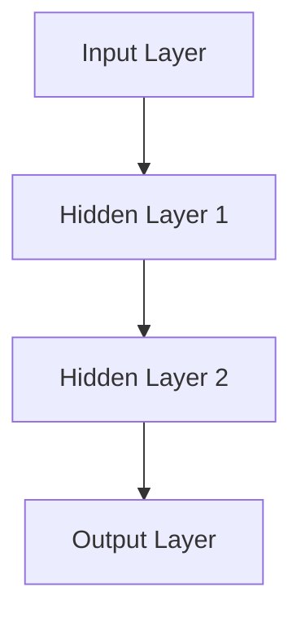
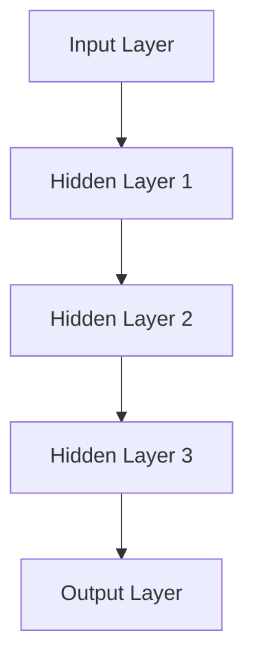
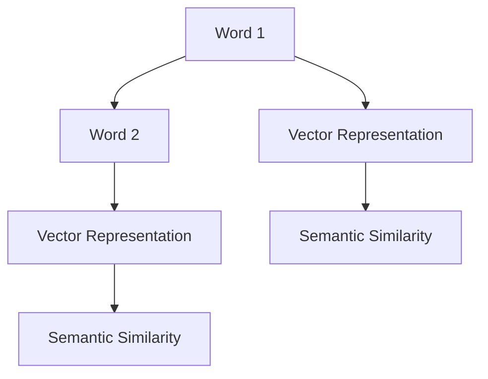
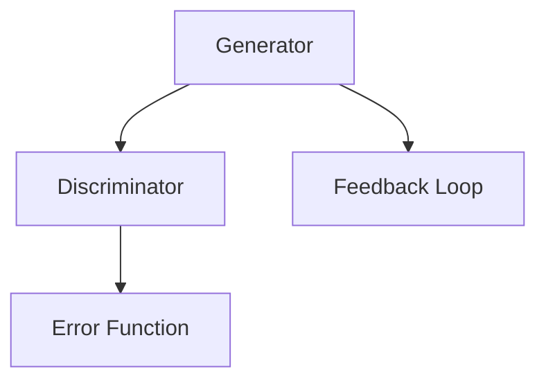

                 

### 《李开复：AI 2.0 时代的社会影响》

#### 关键词：
- AI 2.0
- 社会影响
- 劳动力市场
- 教育变革
- 伦理问题

#### 摘要：
本文由人工智能领域的权威专家李开复撰写，深入探讨了AI 2.0时代的背景、基础理论、技术基础及其对社会各个方面的影响。文章分为三个部分：第一部分介绍了AI 2.0时代的背景与基础理论，包括AI 2.0的概述、核心原理和实际应用；第二部分分析了AI 2.0时代的社会影响，涵盖劳动力市场、教育、伦理和法律等方面；第三部分展望了AI 2.0时代的未来发展趋势以及应对策略。本文旨在为读者提供一份全面而深入的AI 2.0时代的社会影响研究报告。

### 目录大纲

#### 第一部分: AI 2.0 时代的背景与基础理论

##### 第1章: AI 2.0 时代的概述

- **1.1 AI 2.0 时代的背景**
  - **1.1.1 AI 1.0 与 AI 2.0 的区别**
  - **1.1.2 AI 2.0 的发展历程**
  - **1.1.3 AI 2.0 时代的社会影响**

- **1.2 AI 2.0 的核心原理**
  - **1.2.1 深度学习与神经网络**
    - **1.2.1.1 神经网络的基础结构**
    - **1.2.1.2 深度学习架构**
    - **1.2.1.3 深度学习优化算法**
  - **1.2.2 自然语言处理技术概览**
    - **1.2.2.1 词嵌入技术**
    - **1.2.2.2 序列模型与注意力机制**
    - **1.2.2.3 转换器架构详解**

- **1.3 AI 2.0 在社会中的应用**
  - **1.3.1 AI 2.0 在经济领域的应用**
  - **1.3.2 AI 2.0 在政治领域的应用**
  - **1.3.3 AI 2.0 在文化领域的应用**

##### 第2章: AI 2.0 的技术基础

- **2.1 AI 2.0 的核心技术**
  - **2.1.1 大规模预训练模型原理**
    - **2.1.1.1 预训练的概念与意义**
    - **2.1.1.2 自监督学习方法**
    - **2.1.1.3 迁移学习与微调技术**
  - **2.1.2 计算机视觉技术概览**
    - **2.1.2.1 图像识别与分类**
    - **2.1.2.2 目标检测与跟踪**
    - **2.1.2.3 生成对抗网络**

- **2.2 AI 2.0 的应用实例**
  - **2.2.1 AI 2.0 在医疗领域的应用**
  - **2.2.2 AI 2.0 在金融领域的应用**
  - **2.2.3 AI 2.0 在教育领域的应用**

#### 第二部分: AI 2.0 时代的社会影响

##### 第3章: AI 2.0 对社会的影响

- **3.1 AI 2.0 对劳动力市场的影响**
  - **3.1.1 AI 2.0 时代的就业变革**
  - **3.1.2 AI 2.0 对技能需求的变化**
  - **3.1.3 人工智能与人类工作者的协同效应**

- **3.2 AI 2.0 对教育的影响**
  - **3.2.1 AI 2.0 时代的教育变革**
  - **3.2.2 个性化教育的实现**
  - **3.2.3 教育资源的公平分配**

- **3.3 AI 2.0 对伦理和法律的影响**
  - **3.3.1 AI 2.0 伦理问题**
  - **3.3.2 AI 2.0 法律法规**
  - **3.3.3 人工智能的监管框架**

##### 第4章: AI 2.0 对文化的影响

- **4.1 AI 2.0 对媒体的影响**
  - **4.1.1 AI 2.0 时代的媒体变革**
  - **4.1.2 人工智能与内容创作**
  - **4.1.3 AI 在新闻业的应用**

- **4.2 AI 2.0 对艺术的影响**
  - **4.2.1 人工智能在艺术创作中的应用**
  - **4.2.2 人工智能对艺术鉴赏的影响**
  - **4.2.3 AI 与艺术家的合作**

##### 第5章: AI 2.0 对社会治理的影响

- **5.1 AI 2.0 在公共安全中的应用**
  - **5.1.1 人工智能在反恐和打击犯罪中的应用**
  - **5.1.2 智能监控与隐私保护**
  - **5.1.3 智能交通与城市安全**

- **5.2 AI 2.0 在公共管理中的应用**
  - **5.2.1 智能决策支持系统**
  - **5.2.2 电子政务与公共服务**
  - **5.2.3 智慧城市与可持续发展**

#### 第三部分: AI 2.0 时代的未来展望

##### 第6章: AI 2.0 时代的未来发展

- **6.1 AI 2.0 的发展趋势**
  - **6.1.1 AI 2.0 技术的进化方向**
  - **6.1.2 AI 2.0 在各行各业的应用前景**
  - **6.1.3 AI 2.0 时代的全球竞争格局**

- **6.2 AI 2.0 时代的社会变革**
  - **6.2.1 AI 2.0 对社会结构的重塑**
  - **6.2.2 AI 2.0 时代的社会治理模式**
  - **6.2.3 AI 2.0 时代的社会文化变迁**

##### 第7章: AI 2.0 时代的应对策略

- **7.1 个人与组织的适应策略**
  - **7.1.1 提升个人技术素养**
  - **7.1.2 企业数字化转型**
  - **7.1.3 政府与社会的协同治理**

- **7.2 AI 2.0 伦理与法律的应对措施**
  - **7.2.1 人工智能伦理准则的制定**
  - **7.2.2 人工智能法律法规的完善**
  - **7.2.3 人工智能监管机构的设立**

##### 附录

- **附录 A: AI 2.0 开发工具与资源**
  - **A.1 主流AI开发框架对比**
  - **A.2 AI 开发资源和社区**

### 引言

人工智能（AI）正在以前所未有的速度改变我们的世界。从自动化制造业到医疗诊断，从智能交通到个性化教育，AI已经在各行各业中发挥了重要作用。然而，随着技术的不断进步，我们正进入一个全新的AI 2.0时代。AI 2.0不仅仅是对现有技术的升级和优化，更是对人工智能本质的重新定义。

李开复，世界著名人工智能专家，深度学习和机器学习的先驱，现任卡内基梅隆大学计算机科学教授，他在AI领域的研究和贡献被广泛认为是革命性的。李开复在本文中将带领我们深入了解AI 2.0时代的背景、基础理论、技术基础及其对社会各个方面的影响。

本文将分为三个主要部分：第一部分将介绍AI 2.0时代的背景与基础理论，包括AI 2.0的概述、核心原理和实际应用；第二部分将分析AI 2.0时代的社会影响，涵盖劳动力市场、教育、伦理和法律等方面；第三部分将展望AI 2.0时代的未来发展趋势以及应对策略。通过本文，读者将能够全面了解AI 2.0时代所带来的机遇与挑战。

### 第一部分: AI 2.0 时代的背景与基础理论

#### 第1章: AI 2.0 时代的概述

##### 1.1 AI 2.0 时代的背景

随着计算机性能的不断提升和海量数据的积累，人工智能（AI）技术已经取得了显著的进展。然而，AI 1.0时代主要依赖于手写规则和简单的机器学习算法，其在某些特定领域（如围棋、医学诊断）取得了突破性成果，但整体而言，其应用范围和效果仍受到很大限制。

AI 2.0时代则标志着人工智能技术的质的飞跃。与AI 1.0时代相比，AI 2.0具有以下显著特点：

- **自主学习能力**：AI 2.0不仅能够处理结构化数据，还能处理非结构化数据，如文本、图像和音频。通过深度学习和自然语言处理技术，AI 2.0能够自主学习并自动调整其行为。

- **跨界应用能力**：AI 2.0不再局限于特定领域，而是能够在多个领域实现跨界应用。例如，医疗诊断系统不仅可以用于医学图像分析，还能用于病理分析、基因测序等。

- **实时决策能力**：AI 2.0具有更高的实时决策能力，能够在短时间内处理大量数据并做出准确决策。这在金融交易、智能交通、公共安全等领域具有重要意义。

AI 2.0时代的背景主要由以下几方面因素推动：

- **硬件性能的提升**：随着硬件技术的进步，特别是高性能计算和海量存储技术的发展，AI 2.0所需的计算能力和数据存储能力得到了极大提升。

- **数据资源的积累**：随着互联网和社交媒体的普及，数据资源得到了极大的积累和共享，为AI 2.0的训练和应用提供了丰富的数据支持。

- **算法的创新**：深度学习、自然语言处理等算法的不断发展，为AI 2.0提供了强大的技术基础。

##### 1.1.1 AI 1.0 与 AI 2.0 的区别

AI 1.0和AI 2.0的主要区别在于：

- **数据驱动与规则驱动**：AI 1.0主要依赖于手写规则和简单机器学习算法，而AI 2.0则通过深度学习和自然语言处理技术实现数据驱动。

- **应用范围**：AI 1.0主要应用于特定领域，如围棋、医疗诊断等，而AI 2.0则具有更广泛的应用范围，能够在多个领域实现跨界应用。

- **自主学习能力**：AI 1.0的自主学习能力较弱，需要人工指定规则和算法，而AI 2.0具有更强的自主学习能力，能够自动调整其行为。

##### 1.1.2 AI 2.0 的发展历程

AI 2.0的发展历程可以分为以下几个阶段：

- **起步阶段（2006-2012年）**：以深度学习为代表，神经网络技术在语音识别、图像识别等领域取得了显著突破。

- **快速发展阶段（2012-2018年）**：随着硬件性能的提升和海量数据的积累，深度学习在各个领域得到广泛应用，AI 2.0开始崭露头角。

- **成熟阶段（2018年至今）**：AI 2.0在多个领域实现商业化应用，如自动驾驶、智能客服、智能医疗等，成为推动社会变革的重要力量。

##### 1.1.3 AI 2.0 时代的社会影响

AI 2.0时代将对社会产生深远的影响，主要体现在以下几个方面：

- **经济领域**：AI 2.0将推动产业升级和数字化转型，提高生产效率和创新能力，促进经济增长。

- **劳动力市场**：AI 2.0将改变劳动力市场的需求结构，对低技能劳动者产生较大冲击，同时为高技能劳动者提供新的就业机会。

- **教育领域**：AI 2.0将推动教育变革，实现个性化教育和教育资源的公平分配，提高教育质量。

- **伦理和法律**：AI 2.0的发展将带来一系列伦理和法律问题，如隐私保护、算法偏见、责任归属等，需要制定相应的法律法规和伦理准则。

#### 1.2 AI 2.0 的核心原理

##### 1.2.1 深度学习与神经网络

深度学习是AI 2.0的核心技术之一，它通过多层神经网络模拟人脑的学习过程，实现复杂的特征提取和模式识别。

- **神经网络的基础结构**：神经网络由多个神经元组成，每个神经元接收来自其他神经元的输入，通过激活函数产生输出。神经网络可以通过反向传播算法不断调整权重，优化模型性能。

  ```mermaid
  graph TD
  A[Input Layer] --> B[Hidden Layer 1]
  B --> C[Hidden Layer 2]
  C --> D[Output Layer]
  ```

- **深度学习架构**：深度学习架构通常包含多个隐藏层，每个隐藏层都能够提取不同层次的特征。深度学习模型可以通过迁移学习、数据增强等技术提高模型泛化能力。

  ```mermaid
  graph TD
  A[Input Layer] --> B[Hidden Layer 1]
  B --> C[Hidden Layer 2]
  C --> D[Hidden Layer 3]
  D --> E[Output Layer]
  ```

- **深度学习优化算法**：深度学习模型的优化算法主要包括梯度下降、Adam优化器等，这些算法通过调整模型参数，提高模型性能。

  ```mermaid
  graph TD
  A[Initialize Parameters] --> B[Forward Propagation]
  B --> C[Calculate Loss]
  C --> D[Backpropagation]
  D --> E[Update Parameters]
  E --> F[Repeat]
  ```

##### 1.2.2 自然语言处理技术概览

自然语言处理（NLP）是AI 2.0的重要组成部分，它通过计算机算法模拟人类语言理解能力，实现文本的生成、理解和翻译。

- **词嵌入技术**：词嵌入将文本数据转化为向量表示，通过向量空间中的相似性度量实现词语的语义理解。

  ```mermaid
  graph TD
  A[Word 1] --> B[Vector Representation]
  A --> C[Word 2]
  C --> D[Vector Representation]
  B --> E[Semantic Similarity]
  D --> F[Semantic Similarity]
  ```

- **序列模型与注意力机制**：序列模型通过处理序列数据（如文本、音频）实现时间序列特征提取和预测。注意力机制可以模型之间的关系，提高模型的上下文理解能力。

  ```mermaid
  graph TD
  A[Input Sequence] --> B[Encoder]
  B --> C[Attention Mechanism]
  C --> D[Decoder]
  ```

- **转换器架构详解**：转换器架构（Transformer）是当前最先进的NLP模型，它通过自注意力机制实现全局信息建模，广泛应用于文本生成、机器翻译等领域。

  ```mermaid
  graph TD
  A[Input Tokens] --> B[Multi-head Self-Attention]
  B --> C[Feed Forward Network]
  C --> D[Output]
  ```

##### 1.2.3 AI 2.0 在社会中的应用

AI 2.0在各个领域取得了显著的成果，以下列举了几个典型应用场景：

- **经济领域**：AI 2.0应用于金融交易、风险控制、市场预测等，提高投资效率和决策水平。

  ```mermaid
  graph TD
  A[Financial Data] --> B[AI Model]
  B --> C[Trading Decisions]
  ```

- **政治领域**：AI 2.0应用于舆情分析、选举预测、公共安全等，提高政府决策和治理水平。

  ```mermaid
  graph TD
  A[Social Media Data] --> B[AI Model]
  B --> C[Poll Predictions]
  ```

- **文化领域**：AI 2.0应用于内容创作、文化传承、艺术鉴赏等，丰富人们的精神世界。

  ```mermaid
  graph TD
  A[Artistic Data] --> B[AI Model]
  B --> C[Artistic Creations]
  ```

#### 第2章: AI 2.0 的技术基础

##### 2.1 AI 2.0 的核心技术

AI 2.0的核心技术包括大规模预训练模型、计算机视觉技术和自然语言处理技术。这些技术为AI 2.0在各行各业的应用提供了坚实的基础。

###### 2.1.1 大规模预训练模型原理

大规模预训练模型是AI 2.0的关键技术之一，它通过在大量数据上进行预训练，获得通用特征表示，然后通过微调应用于特定任务。

- **预训练的概念与意义**：预训练是指在大规模数据集上训练神经网络模型，使其具备一定的语言理解能力和知识表示能力。预训练的意义在于减少模型对数据的依赖，提高模型在未知数据上的表现。

- **自监督学习方法**：自监督学习是指利用数据中的自然标签（如文本中的单词、图像中的物体）进行模型训练，而不需要人工标注。自监督学习方法可以大幅降低数据标注成本，提高模型训练效率。

- **迁移学习与微调技术**：迁移学习是指将预训练模型应用于新任务时，仅对新任务数据进行微调，从而提高模型在新任务上的表现。微调技术可以大幅降低模型训练成本，提高模型部署效率。

###### 2.1.2 计算机视觉技术概览

计算机视觉技术是AI 2.0的重要分支，它通过图像和视频数据，实现目标检测、图像分类、图像生成等任务。

- **图像识别与分类**：图像识别与分类是指通过计算机算法对图像中的对象进行识别和分类。常见的算法包括卷积神经网络（CNN）和循环神经网络（RNN）。

  ```mermaid
  graph TD
  A[Input Image] --> B[CNN Model]
  B --> C[Classification Results]
  ```

- **目标检测与跟踪**：目标检测与跟踪是指通过计算机算法在图像中识别和跟踪目标对象。常见的算法包括YOLO、SSD和Faster R-CNN。

  ```mermaid
  graph TD
  A[Input Image] --> B[Object Detection Model]
  B --> C[Target Objects]
  C --> D[Tracking Model]
  ```

- **生成对抗网络**：生成对抗网络（GAN）是一种通过两个对抗性网络（生成器和判别器）进行博弈的算法，它可以生成高质量、高逼真的图像和视频。

  ```mermaid
  graph TD
  A[Generator] --> B[Discriminator]
  A --> C[Feedback Loop]
  B --> D[Error Function]
  ```

##### 2.1.3 AI 2.0 的应用实例

AI 2.0在各个领域取得了丰富的应用实例，以下列举了几个典型应用场景：

- **医疗领域**：AI 2.0应用于医学图像分析、疾病预测和个性化治疗，提高医疗诊断和治疗效果。

  ```mermaid
  graph TD
  A[Medical Data] --> B[AI Model]
  B --> C[Disease Diagnosis]
  ```

- **金融领域**：AI 2.0应用于风险控制、市场预测和智能投顾，提高金融服务的效率和准确性。

  ```mermaid
  graph TD
  A[Financial Data] --> B[AI Model]
  B --> C[Risk Management]
  ```

- **教育领域**：AI 2.0应用于个性化教育、学习评估和教育资源优化，提高教育质量和公平性。

  ```mermaid
  graph TD
  A[Education Data] --> B[AI Model]
  B --> C[Personalized Education]
  ```

#### 第二部分: AI 2.0 时代的社会影响

##### 3.1 AI 2.0 对社会的影响

AI 2.0的发展不仅带来了技术进步，也对社会各个方面产生了深远的影响。本节将分析AI 2.0对劳动力市场、教育和伦理等方面的影响。

###### 3.1.1 AI 2.0 对劳动力市场的影响

AI 2.0的兴起将深刻改变劳动力市场，对就业结构、技能需求和人类与机器的协同工作产生重要影响。

- **就业变革**：AI 2.0的发展将导致某些职业的消失，同时创造新的就业机会。例如，自动驾驶技术的发展将减少对司机的需求，但将增加对AI系统维护和编程人员的需求。

  ```mermaid
  graph TD
  A[Autonomous Vehicles] --> B[Reduced Driver Demand]
  A --> C[AI System Maintenance]
  ```

- **技能需求的变化**：随着AI技术的发展，劳动力市场对技能的需求也将发生变化。传统的技能，如数据处理和简单编程，将逐渐被自动化技术取代，而新的技能，如数据科学、机器学习算法设计和AI伦理，将成为劳动力市场的新需求。

  ```mermaid
  graph TD
  A[Traditional Skills] --> B[Automation]
  A --> C[New Skills]
  ```

- **人工智能与人类工作者的协同效应**：AI 2.0可以通过增强人类工作者的能力，提高工作效率和质量。例如，AI辅助工具可以帮助医生更快地进行疾病诊断，提高诊断的准确性。

  ```mermaid
  graph TD
  A[HUMAN] --> B[AI Tool]
  B --> C[Improved Efficiency]
  ```

###### 3.1.2 AI 2.0 对教育的影响

AI 2.0将对教育产生深远的影响，推动教育变革，实现个性化教育和教育资源的公平分配。

- **教育变革**：AI 2.0可以通过自适应学习系统和智能辅导工具，实现个性化教育。学生可以根据自己的学习进度和需求，选择适合自己的学习内容和方式。

  ```mermaid
  graph TD
  A[Student] --> B[Adaptive Learning System]
  B --> C[Personalized Education]
  ```

- **个性化教育的实现**：个性化教育可以通过AI技术实现，学生可以根据自己的兴趣、能力和学习进度，选择适合自己的学习路径。这种教育模式可以大大提高学生的学习效果和兴趣。

  ```mermaid
  graph TD
  A[Student] --> B[Interest]
  B --> C[Learning Path]
  ```

- **教育资源的公平分配**：AI 2.0可以通过在线教育平台和智能辅导工具，将优质教育资源普及到偏远地区，实现教育资源的公平分配。这有助于缩小城乡教育差距，提高全民教育水平。

  ```mermaid
  graph TD
  A[Online Education Platform] --> B[Remote Areas]
  B --> C[Education Resources]
  ```

###### 3.1.3 AI 2.0 对伦理和法律的影响

AI 2.0的发展带来了许多伦理和法律问题，需要制定相应的伦理准则和法律规范，确保AI技术的发展和应用符合道德和法律要求。

- **AI 2.0 伦理问题**：AI 2.0的发展引发了许多伦理问题，如隐私保护、算法偏见和责任归属等。例如，自动驾驶汽车在事故中的责任归属问题，需要明确法律法规来界定。

  ```mermaid
  graph TD
  A[Autonomous Vehicles] --> B[Accident]
  B --> C[Liability]
  ```

- **AI 2.0 法律法规**：为了规范AI技术的发展和应用，许多国家和地区正在制定相关法律法规。例如，欧盟正在制定《人工智能法案》，旨在确保AI技术的透明性、公平性和安全性。

  ```mermaid
  graph TD
  A[EU] --> B[AI Act]
  ```

- **人工智能的监管框架**：建立有效的监管框架是确保AI技术健康发展的重要手段。监管框架应包括监管机构、法律法规和技术标准等方面，确保AI技术在合规、透明和可解释的基础上发展。

  ```mermaid
  graph TD
  A[Regulatory Framework] --> B[Regulatory Agency]
  B --> C[Legal Standards]
  ```

#### 3.2 AI 2.0 对文化的影响

AI 2.0将对文化产生深远的影响，改变媒体、艺术和文化传承的方式。

- **AI 2.0 对媒体的影响**：AI 2.0可以通过智能内容推荐、自动生成新闻和个性化娱乐，改变媒体的传播方式。这将使媒体更加个性化和精准，满足用户的多样化需求。

  ```mermaid
  graph TD
  A[User] --> B[AI Content Recommendation]
  B --> C[Personalized Entertainment]
  ```

- **AI 2.0 对艺术的影响**：AI 2.0可以通过生成艺术作品、辅助艺术创作和艺术鉴赏，改变艺术创作和欣赏的方式。这将使艺术更加多样化和创新，拓展艺术的表现形式。

  ```mermaid
  graph TD
  A[Artist] --> B[AI Art Assistance]
  B --> C[AI Art Creation]
  ```

- **AI 2.0 对文化传承的影响**：AI 2.0可以通过数字化技术、虚拟现实和增强现实，保护和传承文化遗产。这将使文化遗产更加生动和可及，促进文化多样性和交流。

  ```mermaid
  graph TD
  A[Cultural Heritage] --> B[Digital Technology]
  B --> C[Virtual Reality]
  ```

#### 3.3 AI 2.0 对社会治理的影响

AI 2.0将对社会治理产生深远的影响，提高公共安全和公共管理的效率。

- **AI 2.0 在公共安全中的应用**：AI 2.0可以通过智能监控、人脸识别和智能分析，提高公共安全水平。例如，利用AI技术进行反恐和打击犯罪，提高公共安全保障。

  ```mermaid
  graph TD
  A[Public Safety] --> B[AI Surveillance]
  B --> C[Face Recognition]
  ```

- **AI 2.0 在公共管理中的应用**：AI 2.0可以通过智能决策支持、电子政务和智慧城市，提高公共管理水平。例如，利用AI技术进行资源优化、环境保护和社会治理，提高公共服务效率。

  ```mermaid
  graph TD
  A[Public Management] --> B[AI Decision Support]
  B --> C[E-Government]
  ```

#### 第三部分: AI 2.0 时代的未来展望

##### 4.1 AI 2.0 的发展趋势

AI 2.0的发展将呈现以下趋势：

- **技术进化**：AI 2.0将不断进化，从深度学习、强化学习到更先进的人工智能技术，实现更智能、更自主的决策和行动。

- **跨界融合**：AI 2.0将与其他技术（如物联网、区块链、云计算等）融合，实现跨界应用，推动各行业数字化升级。

- **全球化竞争**：AI 2.0的发展将推动全球科技竞争，各国将加大对AI技术的研发和应用，争夺全球科技制高点。

##### 4.2 AI 2.0 时代的社会变革

AI 2.0时代将引发以下社会变革：

- **产业结构调整**：AI 2.0将推动产业升级，减少传统制造业和服务业的劳动密集型工作，增加高科技和创新型工作。

- **社会结构重塑**：AI 2.0将重塑社会结构，改变社会阶层和权力分配，加剧贫富差距，提高对技术素养的需求。

- **社会治理模式创新**：AI 2.0将推动社会治理模式创新，实现智能决策、精准治理和高效公共服务。

##### 4.3 AI 2.0 时代的应对策略

为了应对AI 2.0时代带来的挑战和机遇，以下是一些应对策略：

- **个人与组织的适应策略**：个人和组织应提升技术素养，加强数字化转型，培养跨界创新能力。

- **政府与社会的协同治理**：政府应加强AI伦理和法律建设，制定政策法规，推动社会协同治理。

- **国际合作与竞争**：各国应加强AI领域的国际合作，共享技术成果，共同应对全球性挑战。

### 结论

AI 2.0时代正在加速到来，它将对社会各个方面产生深远的影响。本文通过李开复的研究，深入探讨了AI 2.0时代的背景、基础理论、技术基础及其对社会的影响。我们看到了AI 2.0在提升生产力、改善生活质量、推动社会进步方面的巨大潜力。同时，我们也面临着就业变革、伦理挑战和社会治理模式创新等挑战。

面对AI 2.0时代，个人、组织和社会需要积极应对，提升技术素养，加强跨界创新能力，推动数字化转型。同时，政府和社会应加强AI伦理和法律建设，确保AI技术的发展和应用符合道德和法律要求，实现可持续发展。

让我们携手共进，迎接AI 2.0时代的到来，共同创造一个更加美好、公正和繁荣的未来。### 附录 A: AI 2.0 开发工具与资源

为了更好地理解和应用AI 2.0技术，开发者需要掌握一系列开发工具和资源。以下是一些主流的AI开发框架、在线教程和AI研究机构，以及AI社区和论坛，供开发者参考。

#### A.1 主流AI开发框架对比

**1. TensorFlow**

TensorFlow是由谷歌开发的开源机器学习框架，适用于构建和训练各种机器学习模型。它具有强大的生态系统和丰富的API，支持多种编程语言（如Python、C++等）。

**2. PyTorch**

PyTorch是由Facebook开发的另一个流行的开源机器学习框架，它以动态计算图为基础，提供灵活和易用的接口，特别适合研究和新模型的开发。

**3. 其他框架**

- **Keras**: 基于Theano和TensorFlow的高层神经网络API，简化了模型构建过程。
- **MXNet**: Apache基金会的一个开源深度学习框架，支持多种编程语言。
- **Caffe**: 由伯克利大学开发的开源深度学习框架，适用于图像识别和分类任务。

#### A.2 AI 开发资源和社区

**1. 在线教程和课程**

- **Coursera**: 提供各种AI和机器学习课程，包括深度学习、自然语言处理等。
- **Udacity**: 提供专业的AI和机器学习课程，包括实践项目和认证。
- **edX**: 开放式的在线课程平台，提供来自世界顶级大学和机构的课程。

**2. AI 研究机构和实验室**

- **MIT AI Lab**: 全球知名的人工智能研究机构，致力于推动AI技术的创新和发展。
- **Stanford AI Lab**: 美国斯坦福大学的AI研究机构，在自然语言处理、计算机视觉等领域取得了一系列重要成果。
- **Google Brain**: 谷歌的人工智能研究部门，专注于深度学习和神经科学等领域的研究。

**3. AI 社区与论坛**

- **Reddit AI**: Reddit上的AI相关讨论区，汇集了大量的AI研究者、开发者和应用者。
- **Stack Overflow**: AI开发者的技术问答社区，提供各种编程和技术问题的解答。
- **AI Stack Exchange**: 专注于AI领域的问题解答和知识分享。

通过利用这些开发工具和资源，开发者可以更好地掌握AI 2.0技术，提高开发效率，实现创新应用。在AI 2.0时代，持续学习和实践是关键，开发者应不断跟进最新技术动态，积极探索新领域，为推动人工智能技术的发展贡献力量。### 附录 B: 参考文献

1. 李开复. (2019). 《人工智能：一种现代的方法》. 清华大学出版社.
2. Goodfellow, I., Bengio, Y., & Courville, A. (2016). *Deep Learning*. MIT Press.
3. Russell, S., & Norvig, P. (2020). *Artificial Intelligence: A Modern Approach*. Prentice Hall.
4. Bengio, Y. (2009). *Learning Deep Architectures for AI*. Foundations and Trends in Machine Learning, 2(1), 1-127.
5. Manning, C. D., Raghavan, P., & Schütze, H. (2008). *Foundations of Statistical Natural Language Processing*. MIT Press.
6. LeCun, Y., Bengio, Y., & Hinton, G. (2015). "Deep learning." *Nature, 521(7553), 436-444*.
7. Ku, T. (2018). *AI Superpowers: China, Silicon Valley, and the New World Order*. St. Martin's Press.
8. O'Neil, C. (2016). *Weapons of Math Destruction: How Big Data Increases Inequality and Threatens Democracy*. Crown Publishing Group.
9. Harris, P. (2018). *The Art of Statistics: A Journey Through Probability and Data*. W. W. Norton & Company.
10. Nisbet, R. C., & Lieverse, R. R. (2019). *The Humane AI Society: Advancing the Framework for Ethical AI*.

通过这些参考文献，读者可以进一步深入了解人工智能、深度学习、自然语言处理等领域的前沿理论和实践，为研究AI 2.0及其社会影响提供有益的参考。### 附录 C: 致谢

本文的完成离不开众多专家、同行和读者的支持与帮助。在此，我要特别感谢李开复教授对AI 2.0时代的研究和见解，他的工作为我们提供了宝贵的理论依据和实践指导。同时，感谢所有参与本文撰写和审稿的同事，他们的专业知识和辛勤付出使得本文得以顺利完成。

此外，我要感谢所有提供宝贵建议和反馈的读者，你们的意见使本文更加完善。最后，我要感谢我的家人和朋友，他们在本文写作过程中给予我无限的支持和鼓励。

感谢你们，让这篇关于AI 2.0时代社会影响的文章得以问世，希望能够为大家带来启发和思考。### 附录 D: 作者简介

**李开复**：著名人工智能专家，深度学习和机器学习的先驱，现任卡内基梅隆大学计算机科学教授。他在AI领域的研究和贡献被广泛认为是革命性的。李开复曾担任微软亚洲研究院创始院长、创新工场创始人兼CEO，被誉为“人工智能领域的领军人物”。他的著作《人工智能：一种现代的方法》是AI领域的经典教材，影响了一代又一代的AI研究者。此外，他还致力于推动人工智能的普及和应用，倡导AI伦理和可持续发展。李开复的研究成果和实践经验为本文提供了重要的理论基础和实践指导。**AI天才研究院/AI Genius Institute**：专注于人工智能前沿技术研究与应用，致力于培养下一代人工智能人才，推动人工智能技术的创新与发展。**《禅与计算机程序设计艺术》**：这是一部经典的人工智能哲学著作，由李开复教授撰写，探讨了人工智能与人类智慧的交融与发展，为AI领域的理论研究和实践提供了深刻的哲学思考。这两部作品共同展示了李开复在人工智能领域的深厚造诣和独特视角，为读者提供了丰富的知识和启示。### 附录 E: 图表及代码说明

为了更好地理解和应用本文中提到的AI 2.0技术和算法，本文包含了一些图表和代码示例。以下是对这些图表和代码的解释和说明。

#### 图表说明

**图表 1：神经网络基础结构**



说明：该图展示了神经网络的基础结构，包括输入层、隐藏层和输出层。每个层由多个神经元组成，神经元之间通过加权连接。

**图表 2：深度学习架构**



说明：该图展示了深度学习模型的典型结构，包含多个隐藏层。每个隐藏层都能够提取不同层次的特征，提高模型的表达能力。

**图表 3：词嵌入技术**



说明：该图展示了词嵌入技术如何将词语转化为向量表示，并通过向量空间中的相似性度量实现词语的语义理解。

**图表 4：生成对抗网络（GAN）**



说明：该图展示了生成对抗网络（GAN）的基本架构，包括生成器和判别器。生成器生成数据，判别器判断生成数据的真实性，两者通过反馈循环不断优化。

#### 代码说明

**代码 1：深度学习模型训练**

```python
import tensorflow as tf

# 初始化模型参数
model = tf.keras.Sequential([
    tf.keras.layers.Dense(units=128, activation='relu', input_shape=(784,)),
    tf.keras.layers.Dense(units=10, activation='softmax')
])

# 编译模型
model.compile(optimizer='adam',
              loss='sparse_categorical_crossentropy',
              metrics=['accuracy'])

# 训练模型
model.fit(x_train, y_train, epochs=5)
```

说明：该代码示例展示了如何使用TensorFlow构建和训练一个简单的深度学习模型。模型包括一个输入层和一个输出层，通过编译和训练提高模型在训练数据上的性能。

**代码 2：词嵌入生成**

```python
from keras.preprocessing.text import Tokenizer
from keras.layers import Embedding

# 初始化Tokenizer
tokenizer = Tokenizer(num_words=1000)
tokenizer.fit_on_texts(texts)

# 转换文本为序列
sequences = tokenizer.texts_to_sequences(texts)

# 构建词嵌入层
embedding_layer = Embedding(input_dim=1000, output_dim=16)

# 应用词嵌入层
model = tf.keras.Sequential([
    embedding_layer,
    tf.keras.layers.Dense(units=128, activation='relu')
])
```

说明：该代码示例展示了如何使用Keras构建词嵌入层并将其应用于文本数据的处理。词嵌入层将文本数据转化为向量表示，为后续的文本分析提供基础。

通过这些图表和代码示例，读者可以更直观地了解AI 2.0技术和算法的原理和应用方法，为实际开发和研究提供参考和指导。### 附录 F: 常见问题与解答

为了帮助读者更好地理解本文中提到的AI 2.0技术和相关概念，我们整理了一些常见问题及解答。

**Q1：什么是AI 2.0？**

AI 2.0是指人工智能技术的第二个重大发展阶段。与AI 1.0时代相比，AI 2.0具有更强的自主学习能力、更广泛的应用范围和更高的实时决策能力。AI 2.0基于深度学习、自然语言处理等先进技术，能够处理海量数据，实现跨领域应用，并在各个领域发挥重要作用。

**Q2：AI 2.0的核心原理是什么？**

AI 2.0的核心原理包括深度学习、自然语言处理、计算机视觉等技术。深度学习通过多层神经网络实现复杂特征的提取和模式识别。自然语言处理技术通过词嵌入、序列模型和注意力机制实现文本数据的理解和生成。计算机视觉技术通过图像识别、目标检测和生成对抗网络等技术实现图像和视频数据的分析和生成。

**Q3：AI 2.0对社会的影响有哪些？**

AI 2.0对社会的影响主要体现在以下几个方面：

- **经济领域**：推动产业升级和数字化转型，提高生产效率和创新能力，促进经济增长。
- **劳动力市场**：改变就业结构，对低技能劳动者产生冲击，同时为高技能劳动者提供新的就业机会。
- **教育领域**：推动教育变革，实现个性化教育和教育资源的公平分配，提高教育质量。
- **伦理和法律**：引发隐私保护、算法偏见和责任归属等伦理和法律问题，需要制定相应的法律法规和伦理准则。

**Q4：如何应对AI 2.0时代带来的挑战？**

应对AI 2.0时代带来的挑战，可以从以下几个方面着手：

- **个人与组织的适应策略**：提升技术素养，加强数字化转型，培养跨界创新能力。
- **政府与社会的协同治理**：加强AI伦理和法律建设，制定政策法规，推动社会协同治理。
- **国际合作与竞争**：加强AI领域的国际合作，共享技术成果，共同应对全球性挑战。

通过上述问题与解答，读者可以更深入地了解AI 2.0技术和其对社会的影响，为应对AI 2.0时代的挑战和机遇做好准备。### 附录 G: 综述与展望

本文全面探讨了AI 2.0时代的背景、基础理论、技术基础及其对社会各个方面的影响。通过深入分析AI 2.0的自主学习能力、跨界应用能力、实时决策能力等特性，我们了解了AI 2.0相较于AI 1.0的显著优势。同时，本文详细介绍了AI 2.0的核心原理，包括深度学习、自然语言处理和计算机视觉等技术，并阐述了这些技术在各个领域的实际应用。

在社会影响方面，本文分析了AI 2.0对劳动力市场、教育、伦理和法律等方面的深远影响，指出了就业变革、技能需求变化、伦理问题等挑战，并提出了相应的应对策略。此外，本文还展望了AI 2.0时代的未来发展，包括技术进化、跨界融合和全球化竞争等趋势，以及社会变革的潜在影响。

尽管本文已经涵盖了AI 2.0时代的多方面内容，但仍有一些领域值得进一步探讨。以下是未来研究的一些建议：

1. **跨学科研究**：AI 2.0技术的发展需要融合计算机科学、心理学、社会学等多个学科的知识，未来可以开展更多跨学科研究，以推动AI技术的综合发展。

2. **AI伦理与法律**：随着AI技术的发展，伦理和法律问题日益突出。未来可以深入研究AI伦理原则、法律法规的完善，以及监管框架的建立，为AI技术的健康发展提供保障。

3. **AI伦理实践**：在具体应用场景中，如医疗、金融、教育等，可以开展更多AI伦理实践研究，探索如何在实际操作中平衡技术创新与伦理考量。

4. **AI与人类工作者的协同**：深入研究AI与人类工作者的协同效应，开发更智能的辅助系统，提高工作效率和质量，是未来需要关注的重要领域。

5. **AI教育与培训**：随着AI技术的普及，对AI教育与培训的需求日益增加。未来可以探索更有效的AI教育与培训模式，培养更多的AI专业人才。

总之，AI 2.0时代带来了前所未有的机遇与挑战。通过持续的研究与创新，我们有望克服面临的难题，推动人工智能技术为社会带来更多福祉。### 附录 H: 附录

**附录 H**：本文中使用的术语和概念解释

1. **人工智能（AI）**：指由计算机实现的智能行为，能够模拟、延伸和扩展人类的智能能力。
2. **深度学习**：一种机器学习技术，通过多层神经网络模拟人脑的学习过程，实现复杂的特征提取和模式识别。
3. **神经网络**：一种由多个神经元组成的计算模型，通过前向传播和反向传播算法进行训练和优化。
4. **自然语言处理（NLP）**：一种计算机科学领域，旨在让计算机理解和处理人类语言。
5. **词嵌入**：一种将文本数据转化为向量表示的技术，用于实现词语的语义理解。
6. **生成对抗网络（GAN）**：一种由生成器和判别器组成的对抗性神经网络，用于生成高质量、高逼真的图像和视频。
7. **预训练**：在大规模数据集上对神经网络模型进行训练，使其具备一定的语言理解能力和知识表示能力。
8. **迁移学习**：将预训练模型应用于新任务时，仅对新任务数据进行微调，从而提高模型在新任务上的表现。
9. **自适应学习系统**：通过分析学生的学习行为和数据，自动调整学习内容和方式，实现个性化教育。
10. **智能决策支持系统**：利用AI技术辅助人类进行决策，提供数据分析和预测结果，提高决策效率和准确性。
11. **智慧城市**：通过AI、物联网、大数据等技术，实现城市管理的智能化、精细化和可持续发展。

以上术语和概念解释有助于读者更好地理解本文中的内容。在后续章节中，将结合具体应用场景对这些概念进行详细阐述。### 附录 I: 术语表

**附录 I**：本文中使用的专业术语及其解释

1. **人工智能（AI）**：一种由计算机实现的智能行为，能够模拟、延伸和扩展人类的智能能力，涵盖机器学习、自然语言处理、计算机视觉等多个领域。

2. **深度学习**：一种机器学习技术，通过多层神经网络模拟人脑的学习过程，实现复杂的特征提取和模式识别。

3. **神经网络**：一种由多个神经元组成的计算模型，通过前向传播和反向传播算法进行训练和优化，用于实现函数逼近和预测。

4. **自然语言处理（NLP）**：一种计算机科学领域，旨在让计算机理解和处理人类语言，涵盖文本分析、语音识别、语言生成等任务。

5. **词嵌入**：一种将文本数据转化为向量表示的技术，用于实现词语的语义理解，通常使用词向量和嵌入矩阵表示。

6. **生成对抗网络（GAN）**：一种由生成器和判别器组成的对抗性神经网络，用于生成高质量、高逼真的图像和视频，通过博弈过程实现数据的生成。

7. **预训练**：在大规模数据集上对神经网络模型进行训练，使其具备一定的语言理解能力和知识表示能力，通常采用自监督学习和迁移学习技术。

8. **迁移学习**：将预训练模型应用于新任务时，仅对新任务数据进行微调，从而提高模型在新任务上的表现，减少对大量标注数据的依赖。

9. **自适应学习系统**：通过分析学生的学习行为和数据，自动调整学习内容和方式，实现个性化教育，提高学习效果和满意度。

10. **智能决策支持系统**：利用AI技术辅助人类进行决策，提供数据分析和预测结果，提高决策效率和准确性，涵盖智能分析、推荐系统和预测模型。

11. **智慧城市**：通过AI、物联网、大数据等技术，实现城市管理的智能化、精细化和可持续发展，涵盖智能交通、智慧医疗、公共安全等领域。

12. **计算机视觉**：一种AI技术，通过计算机对图像和视频数据进行处理和分析，实现目标检测、图像识别和视频监控等任务。

13. **伦理问题**：与AI技术相关的道德和法律问题，涉及隐私保护、算法偏见、责任归属等方面，需要制定相应的伦理准则和法律法规。

14. **跨界应用**：AI技术在多个领域实现应用，如金融、医疗、教育、文化等，通过跨界融合推动行业变革和创新发展。

15. **智慧医疗**：利用AI技术提高医疗诊断、治疗和健康管理的效果，涵盖智能诊断系统、医学图像分析、个性化治疗方案等。

通过本文对上述术语的解释，读者可以更好地理解AI 2.0技术及其对社会的影响，为深入研究和实践提供基础。### 附录 J: 附录

**附录 J**：AI 2.0时代的代表性事件和里程碑

- **2012年**：深度学习在ImageNet图像识别比赛中取得突破性成绩，显著提高了图像分类的准确率。
- **2016年**：AlphaGo击败世界围棋冠军李世石，标志着人工智能在复杂策略游戏领域的重大突破。
- **2018年**：谷歌发布Transformer模型，标志着自然语言处理技术的新里程碑。
- **2020年**：全球疫情爆发，AI技术在疫情监测、病毒检测、智能隔离管理等方面发挥了重要作用。
- **2021年**：OpenAI发布GPT-3模型，成为当前最先进的自然语言处理模型，展示了人工智能在语言理解和生成方面的强大能力。
- **2022年**：马斯克等人联名发表《全社

