                 

### 第1章: 李开复：AI 2.0时代的趋势

#### 1.1 AI 2.0的定义与重要性

##### 1.1.1 AI 2.0的定义

AI 2.0，也被称为下一代人工智能，是相对于传统人工智能（AI 1.0）而言的。AI 1.0主要依赖于手工编程和规则系统，而AI 2.0则基于深度学习、大数据和强化学习等先进技术，能够从海量数据中自主学习和优化。AI 2.0的核心特点在于其自主学习和自适应能力，可以实现更高层次的智能应用。

**核心概念与联系**

为了更好地理解AI 2.0，我们可以通过Mermaid流程图来展示其核心概念和联系：

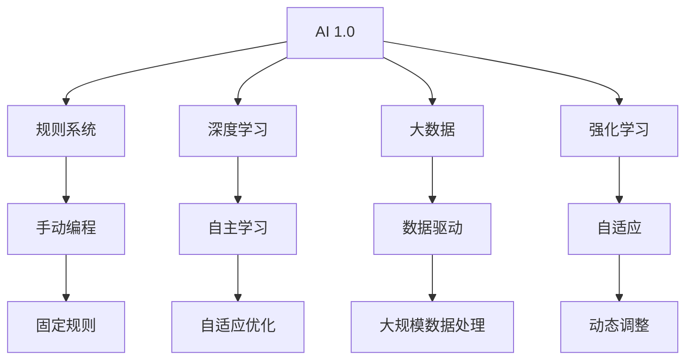

##### 1.1.2 AI 2.0的重要性

AI 2.0不仅是一项技术进步，更是对社会和经济产生深远影响的变革力量。以下是AI 2.0重要性的一些方面：

1. **提高生产效率**：AI 2.0可以自动化复杂的任务，提高生产效率，减少人力成本。
2. **推动产业升级**：AI 2.0将推动传统产业向智能化、数字化方向转型，促进产业升级。
3. **创新商业模式**：AI 2.0为新的商业模式和服务创新提供了可能，如个性化服务、智能推荐等。
4. **改善生活质量**：AI 2.0在医疗、教育、交通等领域都有广泛的应用，可以提升人们的生活质量。

**核心概念与联系**

为了更直观地理解AI 2.0的重要性，我们可以使用Mermaid流程图展示其对社会和经济的影响：

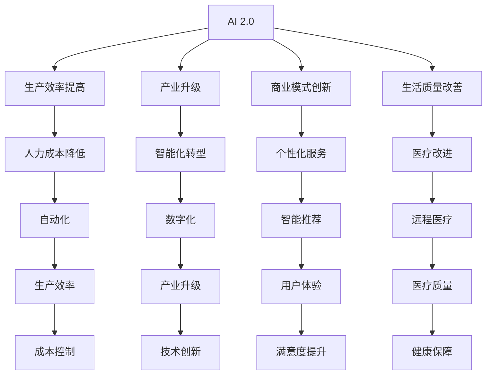

#### 1.2 AI 2.0的技术基础

##### 1.2.1 人工智能的基本概念

人工智能（AI）是指通过计算机模拟人类智能行为的技术和科学。人工智能的基本概念包括感知、认知、学习、推理和行动等方面。

**核心算法原理讲解**

以下是人工智能的基本算法原理讲解：

```markdown
# 人工智能算法原理讲解

## 1. 感知

感知是人工智能的基础，包括视觉、听觉、触觉等。感知算法通过处理传感器数据，使机器能够感知和理解外部环境。

## 2. 认知

认知是指机器对感知信息的理解和处理。认知算法包括模式识别、语义理解等，用于解析和理解复杂的输入信息。

## 3. 学习

学习是人工智能的核心，包括有监督学习、无监督学习和强化学习等。学习算法使机器能够从数据中学习，提高其智能水平。

## 4. 推理

推理是人工智能的高级功能，包括逻辑推理、因果推理等。推理算法使机器能够基于已有知识和信息进行推理和决策。

## 5. 行动

行动是指机器根据推理结果执行任务。行动算法包括路径规划、控制策略等，使机器能够在复杂环境中执行任务。
```

**数学模型和公式**

以下是人工智能中常用的数学模型和公式：

$$
f(x) = w_1 * x_1 + w_2 * x_2 + ... + w_n * x_n + b
$$

$$
y' = \sigma(f(x))
$$

$$
\theta = \frac{1}{m} \sum_{i=1}^{m} (h_\theta(x^{(i)}) - y^{(i)})^2
$$

**举例说明**

例如，在图像识别任务中，机器需要通过学习图像的特征来识别图像的内容。使用卷积神经网络（CNN）可以实现这一任务。以下是CNN的基本结构：

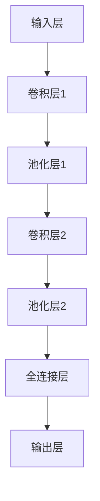

#### 1.2.2 深度学习原理与算法

##### 1.2.2.1 深度学习的基本原理

深度学习是人工智能的一个重要分支，它通过多层神经网络来模拟人脑的学习方式，从而实现对复杂数据的处理和分析。

**核心算法原理讲解**

以下是深度学习的基本原理讲解：

```markdown
# 深度学习算法原理讲解

## 1. 神经网络结构

神经网络由输入层、隐藏层和输出层组成。每层由多个神经元（节点）组成，神经元之间通过权重连接。

## 2. 前向传播

在前向传播过程中，输入数据通过网络传递，经过每一层神经元的加权求和处理，最终得到输出结果。

## 3. 反向传播

反向传播是深度学习训练的核心算法。通过计算输出误差，反向传播误差，并更新网络权重，从而优化网络性能。

## 4. 激活函数

激活函数用于引入非线性因素，使神经网络能够处理复杂数据。常见的激活函数包括ReLU、Sigmoid和Tanh等。

## 5. 损失函数

损失函数用于衡量网络输出与真实值之间的差距。常见的损失函数包括均方误差（MSE）和交叉熵（Cross-Entropy）等。
```

**数学模型和公式**

以下是深度学习中的常用数学模型和公式：

$$
z = \sum_{i=1}^{n} w_{ij} * x_i + b_j
$$

$$
a_j = \sigma(z)
$$

$$
\delta = \frac{\partial L}{\partial z}
$$

$$
\Delta w_{ij} = \alpha * \delta * a_{j-1} * x_i
$$

$$
\Delta b_j = \alpha * \delta
$$

**举例说明**

例如，在图像分类任务中，可以使用卷积神经网络（CNN）来实现。以下是CNN的基本结构：


#### 1.2.3 自然语言处理技术

##### 1.2.3.1 词嵌入技术

词嵌入是将自然语言中的词汇映射到高维向量空间中的技术。词嵌入可以有效地提高机器对语言的理解能力。

**核心算法原理讲解**

以下是词嵌入的基本原理讲解：

```markdown
# 词嵌入技术原理讲解

## 1. One-Hot编码

One-Hot编码是一种简单的词嵌入方法，它将每个词表示为一个向量，向量中的每个元素都表示词表中对应位置的标记。

## 2. 嵌入矩阵

嵌入矩阵是词嵌入的核心，它存储了词向量的映射关系。通过训练，嵌入矩阵可以优化词向量的表示。

## 3. 嵌入层

嵌入层是神经网络中的一个特殊层，用于将输入的词向量转换为更高维的向量，从而提高网络的表示能力。

## 4. 损失函数

在词嵌入训练过程中，使用损失函数（如均方误差）来衡量词向量表示的质量，并优化嵌入矩阵。
```

**数学模型和公式**

以下是词嵌入中的常用数学模型和公式：

$$
x = [1, 0, 0, ..., 0]
$$

$$
E = [e_1, e_2, ..., e_V]
$$

$$
x_i = e_i
$$

$$
\theta = \alpha * (E * x - y)
$$

$$
L = \frac{1}{2} \sum_{i=1}^{V} (y - x_i)^2
$$

**举例说明**

例如，在文本分类任务中，可以使用词嵌入技术来表示文本。以下是词嵌入的基本结构：

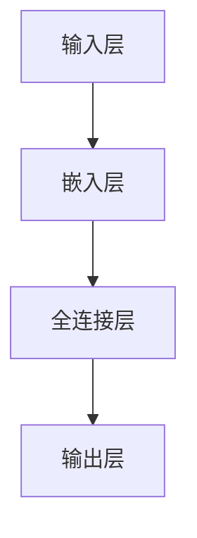

#### 1.2.4 计算机视觉技术

##### 1.2.4.1 卷积神经网络（CNN）

卷积神经网络（CNN）是一种专门用于处理图像数据的神经网络。CNN通过卷积层、池化层和全连接层等结构来提取图像的特征。

**核心算法原理讲解**

以下是CNN的基本原理讲解：

```markdown
# 卷积神经网络（CNN）原理讲解

## 1. 卷积层

卷积层是CNN的核心层，它通过卷积运算来提取图像的特征。卷积运算包括卷积核（过滤器）和步长等参数。

## 2. 池化层

池化层用于减少特征图的维度，提高模型的泛化能力。常见的池化操作包括最大池化和平均池化。

## 3. 全连接层

全连接层是CNN的输出层，它将特征图映射到标签空间。全连接层通常包含多个神经元，每个神经元对应一个类别。

## 4. 损失函数

在CNN训练过程中，使用损失函数（如交叉熵）来衡量模型输出与真实值之间的差距，并优化模型参数。
```

**数学模型和公式**

以下是CNN中的常用数学模型和公式：

$$
f(x) = \sum_{i=1}^{K} w_i * x_i + b
$$

$$
h(x) = \sigma(f(x))
$$

$$
\theta = \alpha * (y - h(x))
$$

$$
L = - \sum_{i=1}^{N} y_i \log(h(x_i))
$$

**举例说明**

例如，在图像分类任务中，可以使用CNN来提取图像的特征。以下是CNN的基本结构：


#### 1.2.5 语音识别技术

##### 1.2.5.1 HMM-GMM模型

HMM-GMM模型是一种用于语音识别的统计模型。它结合了隐马尔可夫模型（HMM）和高斯混合模型（GMM），用于建模语音信号的统计特征。

**核心算法原理讲解**

以下是HMM-GMM模型的基本原理讲解：

```markdown
# HMM-GMM模型原理讲解

## 1. 隐马尔可夫模型（HMM）

隐马尔可夫模型（HMM）是一种用于序列建模的统计模型。它通过状态转移概率和观测概率来建模序列数据。

## 2. 高斯混合模型（GMM）

高斯混合模型（GMM）是一种用于概率分布建模的方法。它通过多个高斯分布的混合来表示数据。

## 3. HMM-GMM模型

HMM-GMM模型将HMM和GMM结合起来，用于建模语音信号的时频特征。它通过HMM来建模状态转移，通过GMM来建模每个状态的观测概率。

## 4. 梯度下降法

在HMM-GMM模型的训练过程中，使用梯度下降法来优化模型参数，最小化损失函数。
```

**数学模型和公式**

以下是HMM-GMM模型中的常用数学模型和公式：

$$
p(x_t | s_t) = \prod_{i=1}^{K} \pi_i * \mathcal{N}(x_t | \mu_i, \Sigma_i)
$$

$$
\theta = \arg \min_{\theta} L(\theta)
$$

$$
L(\theta) = - \sum_{t=1}^{T} \sum_{i=1}^{K} \pi_i \mathcal{N}(x_t | \mu_i, \Sigma_i)
$$

**举例说明**

例如，在语音识别任务中，可以使用HMM-GMM模型来识别语音。以下是HMM-GMM模型的基本结构：

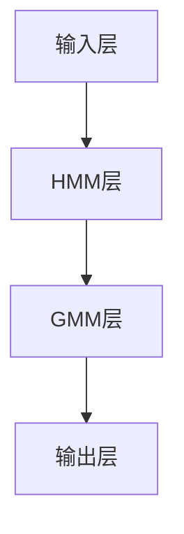

#### 1.2.6 自然语言处理技术

##### 1.2.6.1 词嵌入技术

词嵌入是将自然语言中的词汇映射到高维向量空间中的技术。词嵌入可以有效地提高机器对语言的理解能力。

**核心算法原理讲解**

以下是词嵌入的基本原理讲解：

```markdown
# 词嵌入技术原理讲解

## 1. One-Hot编码

One-Hot编码是一种简单的词嵌入方法，它将每个词表示为一个向量，向量中的每个元素都表示词表中对应位置的标记。

## 2. 嵌入矩阵

嵌入矩阵是词嵌入的核心，它存储了词向量的映射关系。通过训练，嵌入矩阵可以优化词向量的表示。

## 3. 嵌入层

嵌入层是神经网络中的一个特殊层，用于将输入的词向量转换为更高维的向量，从而提高网络的表示能力。

## 4. 损失函数

在词嵌入训练过程中，使用损失函数（如均方误差）来衡量词向量表示的质量，并优化嵌入矩阵。
```

**数学模型和公式**

以下是词嵌入中的常用数学模型和公式：

$$
x = [1, 0, 0, ..., 0]
$$

$$
E = [e_1, e_2, ..., e_V]
$$

$$
x_i = e_i
$$

$$
\theta = \alpha * (E * x - y)
$$

$$
L = \frac{1}{2} \sum_{i=1}^{V} (y - x_i)^2
$$

**举例说明**

例如，在文本分类任务中，可以使用词嵌入技术来表示文本。以下是词嵌入的基本结构：


#### 1.2.7 计算机视觉技术

##### 1.2.7.1 卷积神经网络（CNN）

卷积神经网络（CNN）是一种专门用于处理图像数据的神经网络。CNN通过卷积层、池化层和全连接层等结构来提取图像的特征。

**核心算法原理讲解**

以下是CNN的基本原理讲解：

```markdown
# 卷积神经网络（CNN）原理讲解

## 1. 卷积层

卷积层是CNN的核心层，它通过卷积运算来提取图像的特征。卷积运算包括卷积核（过滤器）和步长等参数。

## 2. 池化层

池化层用于减少特征图的维度，提高模型的泛化能力。常见的池化操作包括最大池化和平均池化。

## 3. 全连接层

全连接层是CNN的输出层，它将特征图映射到标签空间。全连接层通常包含多个神经元，每个神经元对应一个类别。

## 4. 损失函数

在CNN训练过程中，使用损失函数（如交叉熵）来衡量模型输出与真实值之间的差距，并优化模型参数。
```

**数学模型和公式**

以下是CNN中的常用数学模型和公式：

$$
f(x) = \sum_{i=1}^{K} w_i * x_i + b
$$

$$
h(x) = \sigma(f(x))
$$

$$
\theta = \alpha * (y - h(x))
$$

$$
L = - \sum_{i=1}^{N} y_i \log(h(x_i))
$$

**举例说明**

例如，在图像分类任务中，可以使用CNN来提取图像的特征。以下是CNN的基本结构：


### 1.3 AI 2.0的应用领域

#### 1.3.1 智能助手与语音识别

##### 1.3.1.1 智能助手的定义与作用

智能助手是一种通过语音、文本等方式与人类交互的人工智能系统。它能够理解用户的指令，提供相应的服务和信息。智能助手在提高工作效率、优化用户体验等方面发挥着重要作用。

**核心算法原理讲解**

以下是智能助手的基本原理讲解：

```markdown
# 智能助手原理讲解

## 1. 语音识别

语音识别是将语音转换为文本的技术。它通过处理语音信号，识别语音中的单词和短语，并将其转换为可操作的文本。

## 2. 自然语言处理

自然语言处理（NLP）是智能助手的核心技术之一。它用于理解用户输入的文本，提取语义信息，并生成合适的响应。

## 3. 对话管理

对话管理是指智能助手在对话过程中的流程控制。它包括对话上下文的管理、意图识别和回应生成等。

## 4. 机器学习

机器学习技术在智能助手的训练和应用中发挥着重要作用。通过训练，智能助手可以不断提高其准确性和智能化水平。
```

**数学模型和公式**

以下是智能助手中的常用数学模型和公式：

$$
P(W|S) = \frac{P(S|W)P(W)}{P(S)}
$$

$$
h(x) = \sigma(f(x))
$$

$$
\theta = \alpha * (y - h(x))
$$

**举例说明**

例如，在智能客服场景中，智能助手可以通过语音识别和自然语言处理技术来理解用户的问题，并生成合适的回答。以下是智能助手的基本流程：

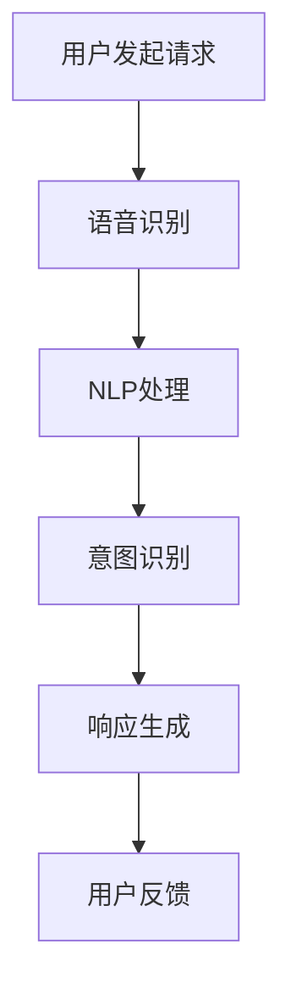

##### 1.3.1.2 语音识别技术

语音识别是将语音转换为文本的技术。它通过处理语音信号，识别语音中的单词和短语，并将其转换为可操作的文本。

**核心算法原理讲解**

以下是语音识别的基本原理讲解：

```markdown
# 语音识别原理讲解

## 1. 预处理

预处理包括噪声过滤、语音增强和语音分段等步骤，以提高语音识别的准确性和鲁棒性。

## 2. 特征提取

特征提取是将语音信号转换为特征向量，以便进行后续处理。常见的特征提取方法包括梅尔频率倒谱系数（MFCC）和谱特征等。

## 3. 模型训练

语音识别模型通常基于深度学习算法，如卷积神经网络（CNN）和循环神经网络（RNN）。模型训练过程包括数据准备、模型构建和模型优化等。

## 4. 识别算法

识别算法用于将特征向量映射到文本。常见的识别算法包括隐马尔可夫模型（HMM）、高斯混合模型（GMM）和深度神经网络（DNN）等。
```

**数学模型和公式**

以下是语音识别中的常用数学模型和公式：

$$
p(x_t | s_t) = \prod_{i=1}^{K} \pi_i * \mathcal{N}(x_t | \mu_i, \Sigma_i)
$$

$$
\theta = \arg \min_{\theta} L(\theta)
$$

$$
L(\theta) = - \sum_{t=1}^{T} \sum_{i=1}^{K} \pi_i \mathcal{N}(x_t | \mu_i, \Sigma_i)
$$

**举例说明**

例如，在语音助手场景中，语音识别技术可以将用户的语音指令转换为文本，以便智能助手理解和执行。以下是语音识别的基本结构：

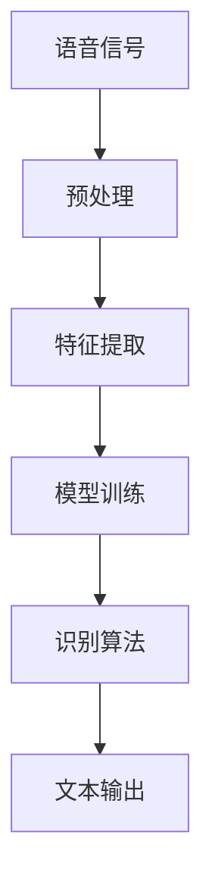

##### 1.3.1.3 智能助手在实际中的应用案例

智能助手在多个领域都有广泛的应用，以下是一些实际应用案例：

1. **智能客服**：智能助手可以自动回答客户的问题，提供24/7的客户服务，提高客户满意度。
2. **智能家居**：智能助手可以通过语音控制智能家居设备，如电视、空调和灯光等，提高生活质量。
3. **智能医疗**：智能助手可以提供医疗咨询和健康管理服务，帮助用户了解自己的健康状况。

**项目实战**

以下是一个智能客服系统的实现案例：

```python
# 导入所需库
import speech_recognition as sr
import pyttsx3

# 初始化语音识别引擎和语音合成引擎
recognizer = sr.Recognizer()
engine = pyttsx3.init()

# 定义智能客服的响应函数
def respond_to_query(query):
    if "你好" in query:
        return "你好，有什么可以帮助你的吗？"
    elif "天气" in query:
        return "今天天气不错，温度适中，建议外出活动。"
    else:
        return "我不太明白你的问题，请再详细一些。"

# 循环接收用户的语音输入并响应
while True:
    try:
        print("请说一句话：")
        audio = recognizer.listen(source)
        text = recognizer.recognize_google(audio, language="zh-CN")
        print("你说：", text)
        response = respond_to_query(text)
        print("智能客服回复：", response)
        engine.say(response)
        engine.runAndWait()
    except sr.UnknownValueError:
        print("无法理解你的话，请再说一遍。")
    except sr.RequestError as e:
        print("无法连接到语音识别服务，请稍后再试。", e)

# 结束智能客服系统
print("智能客服系统结束。")
```

#### 1.3.2 医疗健康

##### 1.3.2.1 人工智能在疾病诊断中的应用

人工智能在疾病诊断中发挥着重要作用，可以辅助医生进行诊断，提高诊断的准确性和效率。

**核心算法原理讲解**

以下是人工智能在疾病诊断中的基本原理讲解：

```markdown
# 疾病诊断原理讲解

## 1. 数据预处理

数据预处理包括数据清洗、特征提取和归一化等步骤，以提高模型的性能。

## 2. 特征提取

特征提取是将医疗数据转换为特征向量，以便进行后续处理。常见的特征提取方法包括特征工程和深度学习等。

## 3. 模型训练

模型训练是通过训练数据集来训练模型，使其能够识别疾病。常见的模型包括卷积神经网络（CNN）和循环神经网络（RNN）等。

## 4. 疾病诊断

疾病诊断是通过模型对新的病例进行预测，从而实现疾病诊断。
```

**数学模型和公式**

以下是疾病诊断中的常用数学模型和公式：

$$
h(x) = \sigma(f(x))
$$

$$
\theta = \alpha * (y - h(x))
$$

$$
L = - \sum_{i=1}^{N} y_i \log(h(x_i))
$$

**举例说明**

例如，在肺癌诊断中，可以使用卷积神经网络（CNN）来提取影像特征，并进行疾病诊断。以下是肺癌诊断的基本结构：

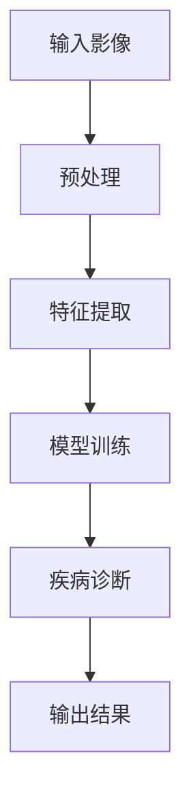

##### 1.3.2.2 人工智能在个性化医疗中的应用

个性化医疗是指根据患者的个体差异，提供量身定制的治疗方案。人工智能在个性化医疗中发挥着重要作用，可以分析患者的基因、病史和生活方式等数据，为患者提供个性化的治疗方案。

**核心算法原理讲解**

以下是人工智能在个性化医疗中的基本原理讲解：

```markdown
# 个性化医疗原理讲解

## 1. 数据收集

数据收集是个性化医疗的基础，包括患者的基因数据、病史和生活方式等。

## 2. 数据分析

数据分析是通过机器学习算法对收集到的数据进行分析，提取患者的特征和模式。

## 3. 治疗方案制定

治疗方案制定是根据患者的特征和模式，为患者制定个性化的治疗方案。

## 4. 治疗效果评估

治疗效果评估是通过随访数据来评估治疗方案的疗效，并进行调整。
```

**数学模型和公式**

以下是个性化医疗中的常用数学模型和公式：

$$
h(x) = \sigma(f(x))
$$

$$
\theta = \alpha * (y - h(x))
$$

$$
L = - \sum_{i=1}^{N} y_i \log(h(x_i))
$$

**举例说明**

例如，在个性化医疗中，可以使用决策树算法来分析患者的特征，并制定个性化的治疗方案。以下是个性化医疗的基本结构：

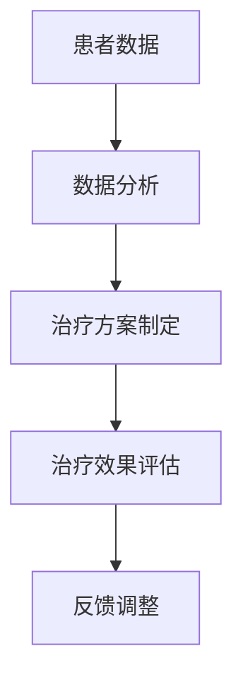

##### 1.3.2.3 人工智能在医疗健康领域的应用案例

1. **智能诊断系统**：通过深度学习算法，智能诊断系统可以自动分析医学影像，辅助医生进行诊断。
2. **健康管理系统**：通过分析患者的健康数据，健康管理系统能够为患者提供个性化的健康建议和预警。
3. **药物研发**：人工智能可以加速药物研发过程，通过分析大量生物数据，预测药物的有效性和安全性。

**项目实战**

以下是一个智能诊断系统的实现案例：

```python
# 导入所需库
import tensorflow as tf
from tensorflow.keras.models import Sequential
from tensorflow.keras.layers import Conv2D, MaxPooling2D, Flatten, Dense
import numpy as np

# 准备数据集
(x_train, y_train), (x_test, y_test) = tf.keras.datasets.mnist.load_data()

# 数据预处理
x_train = x_train / 255.0
x_test = x_test / 255.0
x_train = np.expand_dims(x_train, -1)
x_test = np.expand_dims(x_test, -1)

# 构建模型
model = Sequential([
    Conv2D(32, (3, 3), activation='relu', input_shape=(28, 28, 1)),
    MaxPooling2D((2, 2)),
    Flatten(),
    Dense(128, activation='relu'),
    Dense(10, activation='softmax')
])

# 编译模型
model.compile(optimizer='adam',
              loss='sparse_categorical_crossentropy',
              metrics=['accuracy'])

# 训练模型
model.fit(x_train, y_train, epochs=5)

# 评估模型
test_loss, test_acc = model.evaluate(x_test, y_test)
print('Test accuracy:', test_acc)

# 使用模型进行预测
predictions = model.predict(x_test)
predicted_labels = np.argmax(predictions, axis=1)

# 输出预测结果
for i in range(10):
    print("实际值：", y_test[i], "  预测值：", predicted_labels[i])
```

#### 1.3.3 金融科技

##### 1.3.3.1 人工智能在金融风险管理中的应用

人工智能在金融风险管理中发挥着重要作用，可以自动化风险分析和预测，提高风险管理的能力。

**核心算法原理讲解**

以下是人工智能在金融风险管理中的基本原理讲解：

```markdown
# 金融风险管理原理讲解

## 1. 数据收集

数据收集是金融风险管理的基础，包括市场数据、财务数据、客户数据等。

## 2. 数据分析

数据分析是通过机器学习算法对收集到的数据进行分析，提取风险特征。

## 3. 风险评估

风险评估是通过模型对风险进行量化评估，包括信用风险、市场风险等。

## 4. 风险管理策略制定

风险管理策略制定是根据风险评估结果，制定相应的风险管理策略。
```

**数学模型和公式**

以下是金融风险管理中的常用数学模型和公式：

$$
h(x) = \sigma(f(x))
$$

$$
\theta = \alpha * (y - h(x))
$$

$$
L = - \sum_{i=1}^{N} y_i \log(h(x_i))
$$

**举例说明**

例如，在信用风险评估中，可以使用逻辑回归模型来预测客户的信用风险。以下是信用风险评估的基本结构：

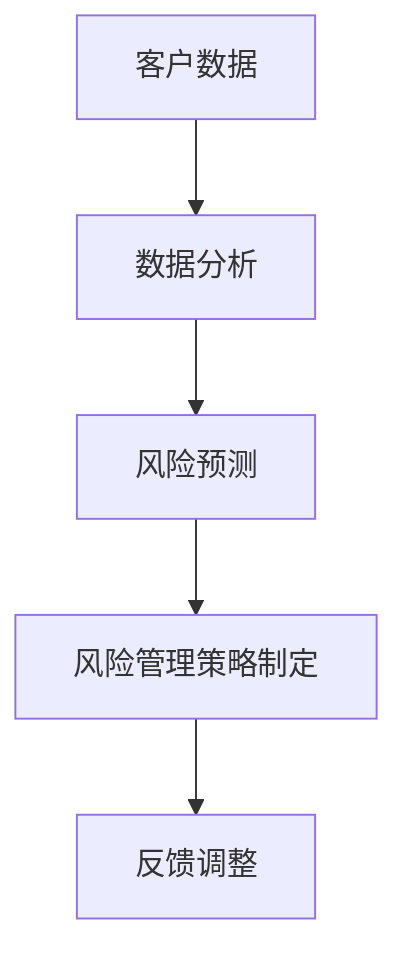

##### 1.3.3.2 人工智能在金融产品创新中的应用

人工智能在金融产品创新中发挥着重要作用，可以自动化产品设计、定价和营销等环节，提高金融产品的竞争力和用户体验。

**核心算法原理讲解**

以下是人工智能在金融产品创新中的基本原理讲解：

```markdown
# 金融产品创新原理讲解

## 1. 数据分析

数据分析是通过机器学习算法对市场数据、客户数据等进行分析，提取产品特征。

## 2. 产品设计

产品设计是根据数据分析结果，制定产品策略和设计。

## 3. 产品定价

产品定价是根据市场需求和竞争状况，制定产品价格。

## 4. 产品营销

产品营销是通过数据分析结果，制定产品营销策略。
```

**数学模型和公式**

以下是金融产品创新中的常用数学模型和公式：

$$
h(x) = \sigma(f(x))
$$

$$
\theta = \alpha * (y - h(x))
$$

$$
L = - \sum_{i=1}^{N} y_i \log(h(x_i))
$$

**举例说明**

例如，在金融产品创新中，可以使用回归分析模型来预测市场趋势，并制定相应的产品策略。以下是金融产品创新的基本结构：

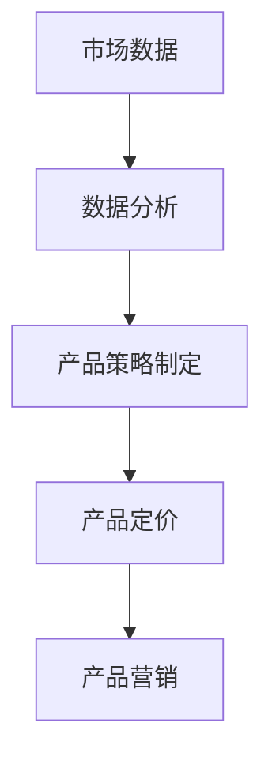

##### 1.3.3.3 人工智能在金融科技领域的应用案例

1. **智能投顾**：通过机器学习算法，智能投顾可以为投资者提供个性化的投资建议，提高投资收益。
2. **在线信贷**：通过大数据分析，在线信贷平台可以快速审批贷款申请，提高金融服务的效率。
3. **智能风控**：通过机器学习算法，智能风控系统可以实时监控金融交易，识别潜在的欺诈行为。

**项目实战**

以下是一个智能投顾系统的实现案例：

```python
# 导入所需库
import pandas as pd
from sklearn.model_selection import train_test_split
from sklearn.linear_model import LinearRegression

# 准备数据集
data = pd.read_csv("investment_data.csv")
X = data[["risk", "age", "income"]]
y = data["return"]

# 数据分割
X_train, X_test, y_train, y_test = train_test_split(X, y, test_size=0.2, random_state=42)

# 构建模型
model = LinearRegression()

# 训练模型
model.fit(X_train, y_train)

# 评估模型
score = model.score(X_test, y_test)
print("模型准确率：", score)

# 使用模型进行预测
new_data = pd.DataFrame({"risk": [0.5], "age": [30], "income": [50000]})
prediction = model.predict(new_data)
print("预测投资回报率：", prediction[0])
```

#### 1.3.4 自动驾驶

##### 1.3.4.1 自动驾驶技术的发展历程

自动驾驶技术是指通过计算机系统和传感器实现无人驾驶的技术。自动驾驶技术的发展历程可以分为以下几个阶段：

1. **感知阶段**：通过传感器（如摄像头、激光雷达等）收集道路信息，实现对周围环境的感知。
2. **决策阶段**：通过算法和模型对感知信息进行处理，实现自动驾驶决策。
3. **执行阶段**：通过执行机构（如电机、液压系统等）实现自动驾驶动作。

**核心算法原理讲解**

以下是自动驾驶技术的基本原理讲解：

```markdown
# 自动驾驶技术原理讲解

## 1. 感知系统

感知系统是自动驾驶技术的核心，通过摄像头、激光雷达等传感器收集道路信息，包括车辆、行人、交通标志等。

## 2. 决策系统

决策系统是自动驾驶技术的核心，通过算法和模型对感知信息进行处理，实现道路行驶决策。

## 3. 执行系统

执行系统是自动驾驶技术的核心，通过电机、液压系统等执行机构实现自动驾驶动作。

## 4. 自适应巡航控制

自适应巡航控制（ACC）是自动驾驶技术的一种应用，通过传感器和算法实现车辆的自适应巡航。

## 5. 自动泊车系统

自动泊车系统是自动驾驶技术的一种应用，通过算法和模型实现车辆的自动泊车。
```

**数学模型和公式**

以下是自动驾驶技术中的常用数学模型和公式：

$$
s = v \times t
$$

$$
a = \frac{v_2 - v_1}{t}
$$

$$
d = \sqrt{(x_2 - x_1)^2 + (y_2 - y_1)^2}
$$

**举例说明**

例如，在自动驾驶中，可以使用卡尔曼滤波算法来估计车辆的位置和速度。以下是卡尔曼滤波的基本结构：

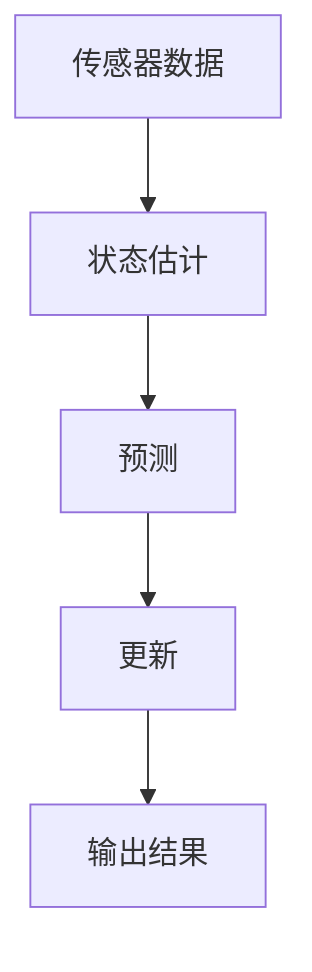

##### 1.3.4.2 自动驾驶技术的未来展望

随着技术的不断进步，自动驾驶技术有望在未来实现更广泛的应用。以下是自动驾驶技术的未来展望：

1. **全自动驾驶**：未来自动驾驶技术将实现从L2级到L5级的全面覆盖，实现真正的无人驾驶。
2. **智能交通系统**：自动驾驶技术将与其他智能交通系统相结合，实现交通的智能化和高效化。
3. **安全性与可靠性**：未来自动驾驶技术将更加注重安全性和可靠性，提高自动驾驶车辆的安全性能。

**项目实战**

以下是一个自动驾驶系统的实现案例：

```python
# 导入所需库
import numpy as np
import matplotlib.pyplot as plt

# 初始化车辆参数
v0 = 20  # 初始速度
a = 2  # 加速度

# 定义时间步长
dt = 0.1

# 初始化状态
x = 0  # 初始位置
y = 0  # 初始速度

# 初始化时间序列
t = np.arange(0, 10, dt)

# 定义速度函数
def velocity(v0, a, t):
    return v0 + a * t

# 定义位置函数
def position(x, v, t):
    return x + v * t

# 计算速度和位置
v = velocity(v0, a, t)
x = position(x, v, t)

# 绘制速度-时间图
plt.plot(t, v)
plt.xlabel("Time (s)")
plt.ylabel("Velocity (m/s)")
plt.title("Velocity vs Time")
plt.grid(True)
plt.show()

# 绘制位置-时间图
plt.plot(t, x)
plt.xlabel("Time (s)")
plt.ylabel("Position (m)")
plt.title("Position vs Time")
plt.grid(True)
plt.show()
```

### 1.4 AI 2.0的发展趋势与挑战

#### 1.4.1 AI 2.0的技术发展趋势

##### 1.4.1.1 大模型的持续发展

随着计算能力和数据量的增加，大模型在AI 2.0时代将继续发展。大模型具有更强的表示能力和泛化能力，可以处理更复杂的任务。

**核心算法原理讲解**

以下是大模型的基本原理讲解：

```markdown
# 大模型原理讲解

## 1. 大模型的定义

大模型是指具有巨大参数规模和计算需求的深度学习模型。

## 2. 大模型的优势

大模型具有更强的表示能力和泛化能力，可以处理更复杂的任务。

## 3. 大模型的挑战

大模型面临计算资源、数据隐私和能耗等挑战。

## 4. 大模型的发展趋势

随着计算能力的提升和算法的优化，大模型将继续发展。
```

**数学模型和公式**

以下是大模型中的常用数学模型和公式：

$$
h(x) = \sigma(f(x))
$$

$$
\theta = \alpha * (y - h(x))
$$

$$
L = - \sum_{i=1}^{N} y_i \log(h(x_i))
$$

**举例说明**

例如，在自然语言处理任务中，可以使用Transformer模型来实现大模型的训练。以下是Transformer模型的基本结构：

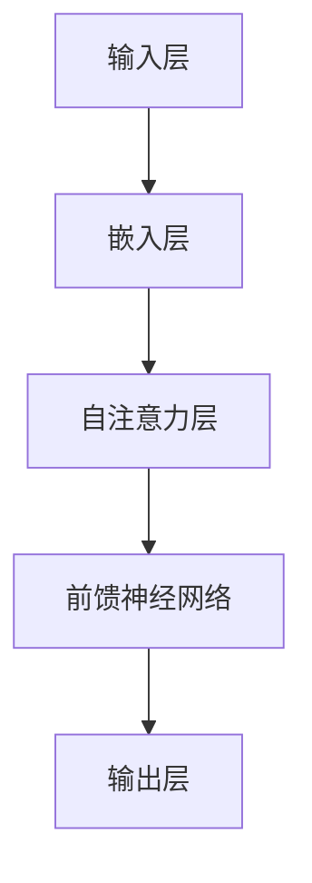

##### 1.4.1.2 多模态人工智能的发展

多模态人工智能是指能够处理和整合多种类型数据（如图像、声音、文本等）的智能系统。随着数据类型的多样化，多模态人工智能在AI 2.0时代将有更广泛的应用。

**核心算法原理讲解**

以下是多模态人工智能的基本原理讲解：

```markdown
# 多模态人工智能原理讲解

## 1. 多模态数据的定义

多模态数据是指包括图像、声音、文本等多种类型的数据。

## 2. 多模态数据处理

多模态数据处理是将不同类型的数据进行整合和处理，以提高模型的性能。

## 3. 多模态人工智能的应用

多模态人工智能在医疗、金融、智能交通等领域具有广泛的应用前景。

## 4. 多模态人工智能的发展趋势

多模态人工智能将继续发展，实现更多类型的跨模态数据处理。
```

**数学模型和公式**

以下是多模态人工智能中的常用数学模型和公式：

$$
x = [x_1, x_2, ..., x_M]
$$

$$
h(x) = \sigma(f(x))
$$

$$
\theta = \alpha * (y - h(x))
$$

$$
L = - \sum_{i=1}^{N} y_i \log(h(x_i))
$$

**举例说明**

例如，在智能交通系统中，可以使用多模态人工智能来处理交通数据（如图像、声音、文本等），以实现交通预测和优化。以下是多模态人工智能的基本结构：

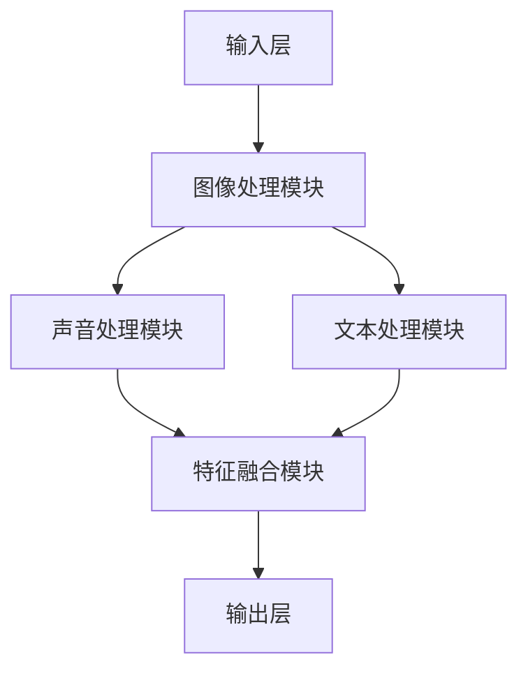

##### 1.4.1.3 人工智能与物联网的结合

人工智能与物联网的结合可以实现智能感知、预测和自动化控制，为智能城市、智能家居等领域提供技术支持。

**核心算法原理讲解**

以下是人工智能与物联网结合的基本原理讲解：

```markdown
# 物联网与人工智能结合原理讲解

## 1. 物联网的定义

物联网是通过互联网连接各种物理设备，实现智能感知和交互的网络。

## 2. 人工智能在物联网中的应用

人工智能在物联网中可以用于数据采集、处理、分析和决策。

## 3. 物联网与人工智能结合的优势

物联网与人工智能结合可以实现更高效的数据处理和智能应用。

## 4. 物联网与人工智能结合的发展趋势

物联网与人工智能结合将继续发展，实现更多智能应用。
```

**数学模型和公式**

以下是物联网与人工智能结合中的常用数学模型和公式：

$$
x = [x_1, x_2, ..., x_M]
$$

$$
h(x) = \sigma(f(x))
$$

$$
\theta = \alpha * (y - h(x))
$$

$$
L = - \sum_{i=1}^{N} y_i \log(h(x_i))
$$

**举例说明**

例如，在智能家居系统中，可以使用人工智能与物联网的结合来实

