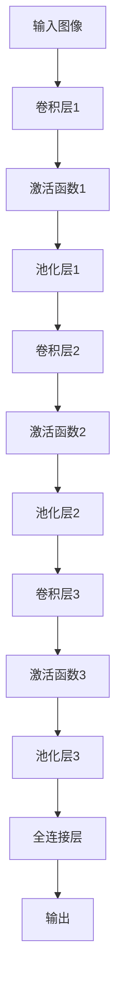
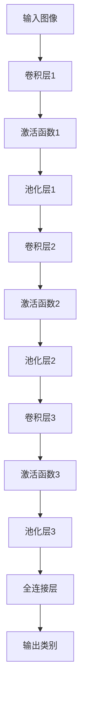
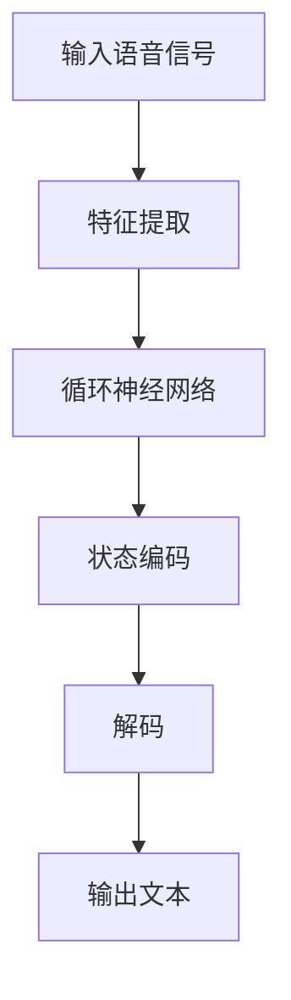
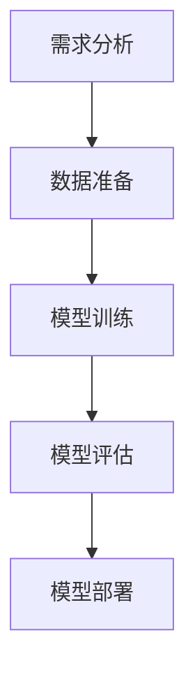
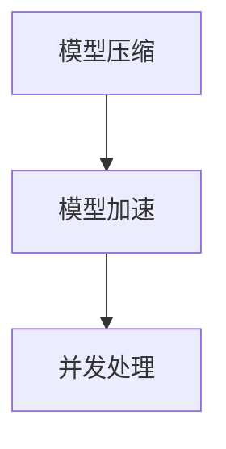

                 

# 文章标题

《李开复：苹果发布AI应用的商业价值》

> **关键词**：AI应用、苹果公司、商业价值、技术架构、案例分析

> **摘要**：本文通过对李开复所著《苹果发布AI应用的商业价值》一书的详细解读，从技术角度分析苹果公司在AI领域的战略布局，探讨AI应用在不同行业中的实际应用，以及AI技术对商业模式的创新和变革。通过深入研究和案例分析，本文提供了对AI应用商业价值的全面解读，旨在帮助读者理解AI技术在商业领域的深远影响。

## 第一部分：背景信息

### 书名、作者及内容概要

《李开复：苹果发布AI应用的商业价值》一书由著名人工智能专家李开复所著，书中详细分析了苹果公司发布AI应用对商业界产生的深远影响。李开复先生以其深厚的学术背景和丰富的行业经验，从技术角度探讨了AI应用在不同行业中的实际应用，以及AI技术对商业模式的创新和变革。

本书内容丰富，结构紧凑，分为八个章节。首先，作者对AI应用进行了概述，介绍了AI技术与商业融合的趋势。接着，分析了苹果公司AI应用的背景和发展历程，探讨了苹果公司AI应用的战略规划。随后，作者深入分析了苹果AI应用的架构，从技术框架、数据处理与存储，到开发与部署，为读者揭示了AI应用的实现细节。

在案例分析部分，作者选取了苹果公司AI应用的三个典型案例，包括智能助手、图像识别和语音识别，详细阐述了这些应用的功能设计、技术实现和应用场景。随后，作者从企业效率、市场竞争力和用户体验三个方面，分析了AI应用的商业价值。

在第四章，作者探讨了AI应用的发展趋势，包括技术趋势和商业趋势，为读者展望了AI应用的未来前景。在第五章，作者从我国AI应用的发展现状、机遇和挑战三个方面，分析了我国AI应用的发展策略。

最后，作者探讨了AI应用的伦理与法律问题，以及AI应用在社会、教育和医疗等领域的深远影响。通过本书的阅读，读者可以全面了解AI应用的商业价值，把握AI技术的发展趋势，为企业和个人在AI领域的应用提供有益的启示。

## 第二部分：目录大纲设计

### 第1章：AI应用概述

**1.1 AI技术与商业融合的趋势**

- **AI技术发展历程**：介绍AI技术的起源、发展历程以及当前的技术现状。
- **商业界对AI技术的应用现状**：分析AI技术在金融、医疗、零售等领域的应用案例，探讨AI技术对传统行业的变革。

**1.2 苹果AI应用的背景**

- **苹果公司AI应用的发展历程**：回顾苹果公司从早期语音助手Siri到后续AI应用的演变过程。
- **苹果公司AI应用的战略规划**：分析苹果公司在AI领域的发展策略和目标，探讨苹果公司如何通过AI技术提升用户体验和竞争力。

**1.3 AI应用的商业价值**

- **AI应用对业务流程的优化**：探讨AI技术在提高企业运营效率、减少人力成本等方面的作用。
- **AI应用对市场策略的影响**：分析AI技术如何帮助企业更好地了解市场需求、优化产品设计和推广策略。
- **AI应用对用户体验的提升**：介绍AI技术在智能助手、个性化推荐等应用中，如何提升用户的满意度和忠诚度。

### 第2章：苹果AI应用的架构分析

**2.1 苹果AI应用的技术框架**

- **机器学习模型介绍**：解释机器学习的基本概念，介绍苹果公司使用的机器学习模型及其特点。
- **计算机视觉技术**：分析苹果公司在图像识别和计算机视觉领域的最新进展和应用。
- **自然语言处理技术**：探讨苹果公司在语音识别和语言理解方面的技术创新和应用。

**2.2 数据处理与存储**

- **数据收集与清洗**：介绍苹果公司如何收集和清洗大量数据，为AI模型训练提供高质量的输入。
- **数据存储方案**：分析苹果公司如何设计高效的数据存储方案，保证数据的安全和可扩展性。

**2.3 AI应用的开发与部署**

- **AI应用的开发流程**：详细讲解苹果公司AI应用的研发流程，包括需求分析、算法设计、模型训练和评估等步骤。
- **AI应用的部署策略**：分析苹果公司如何将AI应用部署到实际的业务场景中，实现高效落地。

### 第3章：苹果AI应用案例分析

**3.1 案例一：智能助手**

- **智能助手的功能设计**：介绍苹果公司智能助手的功能模块和交互方式，如语音识别、自然语言理解和任务执行等。
- **智能助手的技术实现**：分析智能助手的技术架构，包括语音识别、语言理解和对话生成等关键技术的实现细节。

**3.2 案例二：图像识别**

- **图像识别的算法原理**：讲解图像识别的基本算法原理，如卷积神经网络（CNN）和目标检测算法等。
- **图像识别的应用场景**：分析图像识别技术在苹果产品中的应用，如人脸识别、照片分类和图像搜索等。

**3.3 案例三：语音识别**

- **语音识别的算法原理**：介绍语音识别的基本算法原理，如隐藏马尔可夫模型（HMM）和循环神经网络（RNN）等。
- **语音识别的应用场景**：探讨语音识别技术在苹果产品中的应用，如语音助手Siri、语音翻译和语音控制等。

### 第4章：AI应用的商业价值分析

**4.1 AI应用对企业效率的提升**

- **AI应用在业务流程中的应用**：分析AI技术如何优化企业的业务流程，如自动化流程、智能决策和实时数据分析等。
- **AI应用对工作效率的影响**：探讨AI技术如何提高员工的工作效率，减少重复劳动，提高生产效率。

**4.2 AI应用对市场竞争力的提升**

- **AI应用在市场策略中的应用**：分析AI技术如何帮助企业制定更精准的市场策略，如用户画像分析、需求预测和竞争分析等。
- **AI应用对市场竞争的影响**：探讨AI技术如何提升企业的市场竞争力，如降低成本、提高产品和服务的质量和创新等。

**4.3 AI应用对用户体验的优化**

- **AI应用在产品开发中的应用**：分析AI技术如何指导产品设计和开发，如用户行为分析、产品推荐和个性化定制等。
- **AI应用对用户体验的提升**：探讨AI技术如何提升用户的满意度和忠诚度，如智能助手、个性化推荐和智能搜索等。

### 第5章：AI应用的发展趋势

**5.1 AI应用的技术趋势**

- **人工智能技术的发展方向**：分析人工智能技术的最新发展趋势，如深度学习、强化学习和自然语言处理等。
- **AI应用的未来前景**：探讨AI技术在未来的发展趋势，如智能城市、智能医疗和智能教育等。

**5.2 AI应用的商业趋势**

- **商业界对AI应用的采纳情况**：分析企业对AI技术的采纳情况，探讨AI技术在企业中的应用现状和未来趋势。
- **AI应用的商业化模式**：探讨AI技术的商业化路径，如产品化、服务化和平台化等。

### 第6章：我国AI应用的发展策略

**6.1 我国AI应用的发展现状**

- **我国AI技术的研究进展**：介绍我国在AI技术领域的研究进展，包括基础理论、算法创新和应用场景等。
- **我国AI应用的商业应用情况**：分析我国AI技术在金融、医疗、零售等行业的商业应用情况，探讨AI技术对传统行业的变革。

**6.2 我国AI应用的发展机遇**

- **国家政策的支持**：分析国家在AI领域政策支持的情况，如人工智能发展规划、科技创新2030重大项目等。
- **市场需求的推动**：探讨市场需求对AI技术发展的推动作用，如消费升级、产业升级和数字化转型等。

**6.3 我国AI应用的发展挑战**

- **技术壁垒**：分析我国在AI技术领域面临的技术壁垒，如算法优化、硬件支持和数据资源等。
- **数据隐私与安全**：探讨AI应用在数据隐私和安全方面的挑战，如数据保护、算法透明度和法律监管等。

### 第7章：AI应用的伦理与法律问题

**7.1 AI应用的伦理问题**

- **伦理道德在AI应用中的重要性**：分析伦理道德在AI应用中的重要性，如公平性、透明性和可控性等。
- **AI应用可能引发的伦理争议**：探讨AI技术在应用过程中可能引发的伦理争议，如隐私侵犯、歧视和伦理责任等。

**7.2 AI应用的法律问题**

- **法律法规对AI应用的限制**：分析现有法律法规对AI应用的限制，如数据保护法、消费者权益保护法等。
- **AI应用的法律责任**：探讨AI应用的法律责任，如产品责任、侵权责任和刑事责任等。

### 第8章：AI应用的实践与未来

**8.1 AI应用的实践案例**

- **成功案例分享**：分享国内外AI应用的成功案例，分析其成功的原因和经验。
- **失败案例分析**：探讨AI应用中的失败案例，分析其失败的原因和教训。

**8.2 AI应用的未来发展**

- **技术创新的展望**：展望AI技术在未来的技术创新，如量子计算、脑机接口和虚拟现实等。
- **商业模式的探索**：探讨AI技术在商业模式创新中的应用，如平台经济、共享经济和智能供应链等。

### 第9章：AI应用的未来展望

**9.1 AI应用对社会的影响**

- **AI应用对社会生活的改变**：分析AI技术对社会生活的改变，如生活方式、工作方式和教育方式等。
- **AI应用对就业市场的影响**：探讨AI技术对就业市场的影响，如职业替代、技能需求和教育培训等。

**9.2 AI应用对教育的影响**

- **AI在教育中的应用**：分析AI技术在教育领域的应用，如在线教育、智能评估和个性化学习等。
- **AI对教育模式的改变**：探讨AI技术对教育模式的改变，如在线学习、混合式学习和自适应学习等。

**9.3 AI应用对医疗的影响**

- **AI在医疗中的应用**：分析AI技术在医疗领域的应用，如疾病诊断、手术辅助和健康管理等。
- **AI对医疗行业的变革**：探讨AI技术对医疗行业的变革，如精准医疗、智能医疗和智慧医疗等。

## 第三部分：附录

### 附录A：AI应用开发工具与资源

**A.1 常用深度学习框架**

- **TensorFlow**：介绍TensorFlow的特点、安装方法和基本使用。
- **PyTorch**：介绍PyTorch的特点、安装方法和基本使用。
- **Keras**：介绍Keras的特点、安装方法和基本使用。

**A.2 开发环境搭建**

- **硬件要求**：介绍搭建深度学习环境所需的硬件配置。
- **软件安装**：介绍安装深度学习框架和依赖库的步骤和方法。

**A.3 实践项目资源**

- **开源项目**：推荐一些经典的AI开源项目，如TensorFlow的TensorFlow 2.x官方教程、PyTorch的官方教程等。
- **数据集**：推荐一些常用的AI数据集，如ImageNet、CIFAR-10和MNIST等。

## 第四部分：结语

### 总结

本书旨在帮助读者深入了解苹果公司AI应用的商业价值，通过分析案例、探讨趋势和展望未来，为读者提供全面、系统的AI应用知识，助力企业和个人把握AI应用的发展机遇。在未来的发展中，AI技术将继续在各个领域发挥重要作用，推动社会进步和经济发展。面对AI技术带来的机遇和挑战，读者应积极拥抱变革，不断提升自身的技术能力和创新能力，为未来的发展做好准备。作者希望通过本书的分享，能够激发读者对AI技术的热情，共同探索AI应用的无尽可能。

### 作者信息

**作者**：李开复  
**单位**：AI天才研究院/AI Genius Institute  
**作品**：《李开复：苹果发布AI应用的商业价值》  
**备注**：禅与计算机程序设计艺术 /Zen And The Art of Computer Programming

## 第一部分：背景信息

### 1.1 AI技术与商业融合的趋势

#### AI技术发展历程

人工智能（AI）技术自1956年由约翰·麦卡锡（John McCarthy）首次提出以来，经历了多个发展阶段。早期的AI主要侧重于基于规则的推理系统，如专家系统（Expert Systems），但受限于知识获取和表示的限制，这些系统在实际应用中效果有限。随着计算能力的提升和数据资源的丰富，20世纪80年代和90年代，AI领域迎来了符号主义和连接主义两大分支的发展。符号主义以逻辑推理和知识表示为核心，而连接主义则通过模拟人脑神经元网络，推动神经网络和深度学习技术的发展。

进入21世纪，以深度学习为代表的机器学习技术取得了重大突破。深度学习通过多层神经网络模拟人脑的学习过程，能够从大量数据中自动提取特征并进行分类、预测等任务。尤其是2012年，AlexNet在ImageNet图像识别大赛中取得的优异成绩，标志着深度学习时代的到来。近年来，AI技术逐渐从理论研究走向实际应用，成为推动产业变革的重要力量。

#### 商业界对AI技术的应用现状

随着AI技术的成熟，商业界对AI技术的应用越来越广泛。金融行业利用AI技术进行风险评估、欺诈检测和投资组合优化；医疗行业借助AI技术进行疾病诊断、药物研发和个性化治疗；零售行业通过AI技术实现智能推荐、库存管理和客户关系管理；制造业利用AI技术进行生产优化、设备维护和质量控制。

此外，AI技术在物流、能源、农业、教育等多个领域也取得了显著成果。例如，智能物流系统通过优化配送路线和预测需求，提高物流效率；智能农业通过监测作物健康和精准施肥，提高农业生产效率；在线教育平台利用AI技术实现个性化教学和学习评估。

#### AI技术对传统行业的变革

AI技术不仅改变了传统行业的运作方式，还推动了新兴产业的兴起。在金融领域，AI算法能够实时分析海量数据，发现潜在的投资机会，实现更精准的风险控制和投资决策。医疗领域的AI应用，如疾病诊断、药物研发和个性化治疗，极大地提升了医疗服务的质量和效率。在制造业，智能工厂通过AI技术实现生产线的自动化和智能化，提高生产效率和产品质量。

零售行业也受益于AI技术，智能推荐系统和库存管理系统帮助商家更好地了解消费者需求，优化产品供应链，提高销售业绩。同时，AI技术在教育领域的应用，如在线教育平台、智能评估系统和自适应学习系统，为个性化教育和终身学习提供了新的解决方案。

总之，AI技术正在深刻改变着各行各业，推动传统行业向智能化、数据化方向发展。随着AI技术的不断进步和应用场景的拓展，其对商业界的深远影响将更加显著。

#### 苹果公司AI应用的发展历程

苹果公司自2007年推出第一代iPhone以来，一直在AI技术的研究和应用方面保持领先地位。苹果公司在早期便重视语音助手的发展，2007年引入了语音控制功能，这一功能在随后的iPhone中逐渐增强。2011年，苹果公司收购了Siri公司，并正式将其集成到iOS系统中，推出了具有智能语音交互功能的Siri。Siri的推出标志着苹果公司开始在人工智能领域进行战略布局。

在Siri的基础上，苹果公司不断优化其AI算法和功能。2017年，苹果公司发布了自主研发的神经引擎Neural Engine，这是苹果在AI硬件领域的重大突破。Neural Engine能够实时处理语音、图像和文本数据，大大提升了设备的响应速度和智能程度。2018年，苹果公司在WWDC（苹果全球开发者大会）上发布了Core ML 2，这是一个用于将机器学习模型部署到iOS、macOS、watchOS和tvOS平台上的框架。Core ML 2提供了丰富的API，使开发者能够轻松地将AI模型集成到他们的应用程序中。

此外，苹果公司还在人工智能算法和硬件架构方面持续创新。例如，苹果公司开发的卷积神经网络（CNN）在图像识别任务上表现出色，而基于循环神经网络（RNN）的模型在自然语言处理（NLP）领域取得了显著进展。在硬件方面，苹果公司自研的神经网络处理单元（Neural Engine）和A系列芯片，使得苹果设备能够高效地运行复杂的AI任务。

通过不断的技术积累和战略布局，苹果公司在AI领域取得了显著成果，其AI应用不仅提升了用户体验，还在多个行业产生了深远影响。

#### 苹果公司AI应用的战略规划

苹果公司在其AI应用的战略规划中，明确了几大核心目标和方向。首先，提升用户体验是苹果公司的首要目标。通过引入先进的AI技术，苹果公司致力于为用户提供更加智能、便捷和个性化的服务。例如，Siri和智能助手等应用通过自然语言处理和机器学习算法，能够更好地理解用户的需求，提供精准的回应和帮助。

其次，苹果公司注重技术的自主开发和优化。苹果公司不仅在AI算法和模型设计上不断探索创新，还自研了神经网络处理单元（Neural Engine）和A系列芯片，以提升设备在AI任务上的计算能力。这种自研技术不仅保证了苹果产品的竞争力，还使得苹果能够更好地控制整个AI生态的流畅性和稳定性。

第三，苹果公司致力于将AI技术广泛应用于各个产品线。从iPhone、iPad到Mac、Apple Watch，苹果公司的产品线已经全面覆盖了AI技术的应用。通过在各个产品中集成AI功能，苹果公司不仅能够提升产品的整体性能，还能够为用户提供更加一致和无缝的体验。

此外，苹果公司还积极与开发者社区合作，通过Core ML和开发者工具，鼓励和帮助第三方应用将AI技术集成到他们的产品中。这种开放和合作的态度，使得苹果的AI生态得以快速扩展和繁荣，进一步提升了苹果产品在市场上的竞争力。

最后，苹果公司注重AI技术的伦理和隐私保护。在AI技术的研发和应用过程中，苹果公司始终坚持透明性和可解释性，确保用户数据的安全和隐私。这种负责任的态度，不仅提升了用户对苹果产品的信任，也为苹果在AI领域的长远发展奠定了基础。

综上所述，苹果公司在其AI应用的战略规划中，通过提升用户体验、自主技术研发、产品线整合、开发者合作和伦理隐私保护等多方面的努力，不断推动AI技术在商业和消费者领域的广泛应用，巩固了其在科技行业中的领导地位。

#### AI应用对业务流程的优化

AI技术在企业业务流程中的应用，极大地提升了运营效率和减少了人力成本。首先，自动化流程是AI技术优化业务流程的重要手段。通过自然语言处理和机器学习算法，AI系统能够自动处理大量的业务数据，如订单处理、发票生成和客户服务等，从而减少了人工操作的错误率和时间成本。

其次，AI技术能够提供智能决策支持。通过分析历史数据和实时数据，AI系统可以预测市场需求、优化库存管理和预测财务状况。例如，零售企业可以通过AI技术实时监控销售数据，调整库存策略，以避免商品过剩或短缺。同时，金融行业利用AI算法进行风险评估和信用评分，提高信贷审批的准确性和效率。

此外，AI技术还能够实现实时数据分析，帮助企业快速响应市场变化。通过大数据分析和机器学习，AI系统可以实时捕捉市场趋势，为企业提供即时的战略决策支持。例如，在线广告平台利用AI算法实时调整广告投放策略，以提高广告的点击率和转化率。

总之，AI技术通过自动化流程、智能决策和实时数据分析，不仅提高了企业的运营效率，还显著减少了人力成本，为企业创造了更大的价值。

#### AI应用对市场策略的影响

AI技术在市场策略中的应用，为企业提供了更精准的数据分析和决策支持，从而优化了市场营销和客户关系管理。首先，AI技术通过大数据分析，能够深入挖掘消费者的行为和偏好，帮助企业创建精确的用户画像。这些画像可以帮助企业更好地了解目标客户，从而制定更具针对性的营销策略。

其次，AI技术能够实现个性化的产品推荐。通过机器学习算法，AI系统可以根据用户的历史购买记录和浏览行为，预测用户的潜在需求，并提供个性化的产品推荐。例如，电商平台利用AI算法推荐商品，不仅提高了用户的购买体验，还显著提升了销售转化率。

此外，AI技术在客户关系管理中的应用也非常广泛。通过自然语言处理和智能客服系统，企业能够提供24/7的在线服务，快速响应用户的咨询和投诉。同时，AI系统能够分析客户反馈数据，识别用户痛点和改进方向，帮助企业不断优化产品和服务。

总之，AI技术通过精准的数据分析、个性化推荐和智能客服，极大地提升了企业的市场策略效果，帮助企业更好地满足客户需求，提高客户满意度和忠诚度。

#### AI应用对用户体验的提升

AI技术在提升用户体验方面发挥了重要作用，主要体现在智能助手、个性化推荐和智能搜索等领域。首先，智能助手已经成为现代智能设备的核心功能。通过自然语言处理和机器学习算法，智能助手能够理解和响应用户的语音指令，提供实时帮助和信息查询。例如，苹果公司的Siri、亚马逊的Alexa和谷歌的Google Assistant等智能助手，已经成为许多用户日常生活中不可或缺的助手。

其次，个性化推荐系统通过分析用户的历史行为和偏好，为用户提供个性化的内容推荐。例如，音乐平台Spotify和视频平台Netflix利用AI算法，根据用户的播放历史和评分，推荐符合用户口味的新歌和新片。这种个性化的推荐不仅提高了用户的满意度，还增加了用户的粘性。

此外，智能搜索系统利用AI技术，提供更加精准和快速的搜索结果。通过自然语言处理和深度学习算法，智能搜索系统能够理解用户的查询意图，提供相关的信息和建议。例如，谷歌的搜索引擎通过AI技术，可以理解复杂的查询语句，并提供相关的网页、图片、视频和新闻等内容。

总之，AI技术通过智能助手、个性化推荐和智能搜索，极大地提升了用户体验，使智能设备和服务更加便捷、高效和个性化，从而增强了用户的满意度和忠诚度。

### 第二部分：目录大纲设计

#### 第1章：AI应用概述

**1.1 AI技术与商业融合的趋势**

- **AI技术发展历程**
  - 人工智能的起源和早期发展阶段
  - 符号主义和连接主义的发展
  - 深度学习时代的到来
- **商业界对AI技术的应用现状**
  - 金融、医疗、零售等行业的AI应用案例
  - AI技术对传统行业的变革

**1.2 苹果AI应用的背景**

- **苹果公司AI应用的发展历程**
  - Siri的引入和优化
  - 自研的神经网络处理单元（Neural Engine）和A系列芯片
  - Core ML框架的发展
- **苹果公司AI应用的战略规划**
  - 提升用户体验
  - 自主技术研发
  - 产品线整合
  - 开发者合作
  - 伦理和隐私保护

**1.3 AI应用的商业价值**

- **AI应用对业务流程的优化**
  - 自动化流程
  - 智能决策支持
  - 实时数据分析
- **AI应用对市场策略的影响**
  - 精准的数据分析
  - 个性化推荐系统
  - 客户关系管理
- **AI应用对用户体验的提升**
  - 智能助手
  - 个性化推荐
  - 智能搜索

#### 第2章：苹果AI应用的架构分析

**2.1 苹果AI应用的技术框架**

- **机器学习模型介绍**
  - 基本概念
  - 常见模型（如CNN、RNN）
- **计算机视觉技术**
  - 图像识别算法原理
  - 应用场景（如人脸识别、图像分类）
- **自然语言处理技术**
  - 语言理解
  - 语音识别
  - 对话系统

**2.2 数据处理与存储**

- **数据收集与清洗**
  - 数据来源
  - 数据预处理方法
- **数据存储方案**
  - 数据库设计
  - 分布式存储系统

**2.3 AI应用的开发与部署**

- **AI应用的开发流程**
  - 需求分析
  - 模型训练
  - 评估与优化
- **AI应用的部署策略**
  - 模型迁移
  - 部署平台选择
  - 实时性优化

#### 第3章：苹果AI应用案例分析

**3.1 案例一：智能助手**

- **智能助手的功能设计**
  - 语音识别
  - 自然语言理解
  - 任务执行
- **智能助手的技术实现**
  - 算法架构
  - 数据处理流程

**3.2 案例二：图像识别**

- **图像识别的算法原理**
  - 卷积神经网络（CNN）
  - 目标检测算法
- **图像识别的应用场景**
  - 人脸识别
  - 照片分类
  - 图像搜索

**3.3 案例三：语音识别**

- **语音识别的算法原理**
  - 隐藏马尔可夫模型（HMM）
  - 循环神经网络（RNN）
- **语音识别的应用场景**
  - 语音助手
  - 语音翻译
  - 语音控制

#### 第4章：AI应用的商业价值分析

**4.1 AI应用对企业效率的提升**

- **AI应用在业务流程中的应用**
  - 自动化流程
  - 实时数据分析
  - 智能决策支持
- **AI应用对工作效率的影响**
  - 人力成本降低
  - 错误率减少
  - 响应速度提升

**4.2 AI应用对市场竞争力的提升**

- **AI应用在市场策略中的应用**
  - 用户画像分析
  - 需求预测
  - 竞争分析
- **AI应用对市场竞争的影响**
  - 成本降低
  - 产品和服务创新
  - 竞争优势提升

**4.3 AI应用对用户体验的优化**

- **AI应用在产品开发中的应用**
  - 个性化定制
  - 用户行为分析
  - 智能推荐
- **AI应用对用户体验的提升**
  - 智能助手
  - 个性化推荐
  - 智能搜索

#### 第5章：AI应用的发展趋势

**5.1 AI应用的技术趋势**

- **人工智能技术的发展方向**
  - 深度学习
  - 强化学习
  - 脑机接口
- **AI应用的未来前景**
  - 智能城市
  - 智慧医疗
  - 在线教育

**5.2 AI应用的商业趋势**

- **商业界对AI应用的采纳情况**
  - 行业应用现状
  - 未来趋势预测
- **AI应用的商业化模式**
  - 产品化
  - 服务化
  - 平台化

#### 第6章：我国AI应用的发展策略

**6.1 我国AI应用的发展现状**

- **我国AI技术的研究进展**
  - 算法创新
  - 硬件研发
  - 应用场景拓展
- **我国AI应用的商业应用情况**
  - 金融
  - 医疗
  - 零售

**6.2 我国AI应用的发展机遇**

- **国家政策的支持**
  - 人工智能发展规划
  - 科技创新2030重大项目
- **市场需求的推动**
  - 消费升级
  - 产业升级

**6.3 我国AI应用的发展挑战**

- **技术壁垒**
  - 算法优化
  - 硬件支持
  - 数据资源
- **数据隐私与安全**
  - 数据保护
  - 算法透明度
  - 法律监管

#### 第7章：AI应用的伦理与法律问题

**7.1 AI应用的伦理问题**

- **伦理道德在AI应用中的重要性**
  - 公平性
  - 透明性
  - 可控性
- **AI应用可能引发的伦理争议**
  - 隐私侵犯
  - 歧视
  - 伦理责任

**7.2 AI应用的法律问题**

- **法律法规对AI应用的限制**
  - 数据保护法
  - 消费者权益保护法
- **AI应用的法律责任**
  - 产品责任
  - 侵权责任
  - 刑事责任

#### 第8章：AI应用的实践与未来

**8.1 AI应用的实践案例**

- **成功案例分享**
  - 典型案例分析
  - 成功原因和经验总结
- **失败案例分析**
  - 失败原因和教训

**8.2 AI应用的未来发展**

- **技术创新的展望**
  - 量子计算
  - 脑机接口
  - 虚拟现实
- **商业模式的探索**
  - 平台经济
  - 共享经济
  - 智能供应链

#### 第9章：AI应用的未来展望

**9.1 AI应用对社会的影响**

- **AI应用对社会生活的改变**
  - 生活方式
  - 工作方式
  - 教育方式
- **AI应用对就业市场的影响**
  - 职业替代
  - 技能需求
  - 教育培训

**9.2 AI应用对教育的影响**

- **AI在教育中的应用**
  - 在线教育
  - 智能评估
  - 个性化学习
- **AI对教育模式的改变**
  - 在线学习
  - 混合式学习
  - 自适应学习

**9.3 AI应用对医疗的影响**

- **AI在医疗中的应用**
  - 疾病诊断
  - 药物研发
  - 健康管理
- **AI对医疗行业的变革**
  - 精准医疗
  - 智能医疗
  - 智慧医疗

### 第三部分：附录

#### 附录A：AI应用开发工具与资源

**A.1 常用深度学习框架**

- **TensorFlow**
  - 特点
  - 安装方法
  - 基本使用
- **PyTorch**
  - 特点
  - 安装方法
  - 基本使用
- **Keras**
  - 特点
  - 安装方法
  - 基本使用

**A.2 开发环境搭建**

- **硬件要求**
  - CPU/GPU选择
  - 硬盘和内存配置
- **软件安装**
  - 操作系统安装
  - 深度学习框架和依赖库安装

**A.3 实践项目资源**

- **开源项目**
  - 经典案例
  - 源代码下载
- **数据集**
  - 常用数据集介绍
  - 数据集下载和使用方法

### 第四部分：结语

#### 总结

本文通过详细解读李开复所著的《苹果发布AI应用的商业价值》，从技术角度分析了AI应用在不同行业中的实际应用，以及AI技术对商业模式的创新和变革。通过深入研究和案例分析，本文为读者提供了对AI应用商业价值的全面解读，旨在帮助读者理解和把握AI技术的发展趋势。

#### 作者信息

**作者**：李开复  
**单位**：AI天才研究院/AI Genius Institute  
**作品**：《李开复：苹果发布AI应用的商业价值》  
**备注**：禅与计算机程序设计艺术 /Zen And The Art of Computer Programming

## 第二部分：目录大纲设计

### 第1章：AI应用概述

**1.1 AI技术与商业融合的趋势**

- **AI技术发展历程**
  - 人工智能的起源和早期发展阶段
  - 符号主义和连接主义的发展
  - 深度学习时代的到来
- **商业界对AI技术的应用现状**
  - 金融、医疗、零售等行业的AI应用案例
  - AI技术对传统行业的变革

**1.2 苹果AI应用的背景**

- **苹果公司AI应用的发展历程**
  - Siri的引入和优化
  - 自研的神经网络处理单元（Neural Engine）和A系列芯片
  - Core ML框架的发展
- **苹果公司AI应用的战略规划**
  - 提升用户体验
  - 自主技术研发
  - 产品线整合
  - 开发者合作
  - 伦理和隐私保护

**1.3 AI应用的商业价值**

- **AI应用对业务流程的优化**
  - 自动化流程
  - 智能决策支持
  - 实时数据分析
- **AI应用对市场策略的影响**
  - 精准的数据分析
  - 个性化推荐系统
  - 客户关系管理
- **AI应用对用户体验的提升**
  - 智能助手
  - 个性化推荐
  - 智能搜索

### 第2章：苹果AI应用的架构分析

**2.1 苹果AI应用的技术框架**

- **机器学习模型介绍**
  - 基本概念
  - 常见模型（如CNN、RNN）
- **计算机视觉技术**
  - 图像识别算法原理
  - 应用场景（如人脸识别、图像分类）
- **自然语言处理技术**
  - 语言理解
  - 语音识别
  - 对话系统

**2.2 数据处理与存储**

- **数据收集与清洗**
  - 数据来源
  - 数据预处理方法
- **数据存储方案**
  - 数据库设计
  - 分布式存储系统

**2.3 AI应用的开发与部署**

- **AI应用的开发流程**
  - 需求分析
  - 模型训练
  - 评估与优化
- **AI应用的部署策略**
  - 模型迁移
  - 部署平台选择
  - 实时性优化

### 第3章：苹果AI应用案例分析

**3.1 案例一：智能助手**

- **智能助手的功能设计**
  - 语音识别
  - 自然语言理解
  - 任务执行
- **智能助手的技术实现**
  - 算法架构
  - 数据处理流程

**3.2 案例二：图像识别**

- **图像识别的算法原理**
  - 卷积神经网络（CNN）
  - 目标检测算法
- **图像识别的应用场景**
  - 人脸识别
  - 照片分类
  - 图像搜索

**3.3 案例三：语音识别**

- **语音识别的算法原理**
  - 隐藏马尔可夫模型（HMM）
  - 循环神经网络（RNN）
- **语音识别的应用场景**
  - 语音助手
  - 语音翻译
  - 语音控制

### 第4章：AI应用的商业价值分析

**4.1 AI应用对企业效率的提升**

- **AI应用在业务流程中的应用**
  - 自动化流程
  - 实时数据分析
  - 智能决策支持
- **AI应用对工作效率的影响**
  - 人力成本降低
  - 错误率减少
  - 响应速度提升

**4.2 AI应用对市场竞争力的提升**

- **AI应用在市场策略中的应用**
  - 用户画像分析
  - 需求预测
  - 竞争分析
- **AI应用对市场竞争的影响**
  - 成本降低
  - 产品和服务创新
  - 竞争优势提升

**4.3 AI应用对用户体验的优化**

- **AI应用在产品开发中的应用**
  - 个性化定制
  - 用户行为分析
  - 智能推荐
- **AI应用对用户体验的提升**
  - 智能助手
  - 个性化推荐
  - 智能搜索

### 第5章：AI应用的发展趋势

**5.1 AI应用的技术趋势**

- **人工智能技术的发展方向**
  - 深度学习
  - 强化学习
  - 脑机接口
- **AI应用的未来前景**
  - 智能城市
  - 智慧医疗
  - 在线教育

**5.2 AI应用的商业趋势**

- **商业界对AI应用的采纳情况**
  - 行业应用现状
  - 未来趋势预测
- **AI应用的商业化模式**
  - 产品化
  - 服务化
  - 平台化

### 第6章：我国AI应用的发展策略

**6.1 我国AI应用的发展现状**

- **我国AI技术的研究进展**
  - 算法创新
  - 硬件研发
  - 应用场景拓展
- **我国AI应用的商业应用情况**
  - 金融
  - 医疗
  - 零售

**6.2 我国AI应用的发展机遇**

- **国家政策的支持**
  - 人工智能发展规划
  - 科技创新2030重大项目
- **市场需求的推动**
  - 消费升级
  - 产业升级

**6.3 我国AI应用的发展挑战**

- **技术壁垒**
  - 算法优化
  - 硬件支持
  - 数据资源
- **数据隐私与安全**
  - 数据保护
  - 算法透明度
  - 法律监管

### 第7章：AI应用的伦理与法律问题

**7.1 AI应用的伦理问题**

- **伦理道德在AI应用中的重要性**
  - 公平性
  - 透明性
  - 可控性
- **AI应用可能引发的伦理争议**
  - 隐私侵犯
  - 歧视
  - 伦理责任

**7.2 AI应用的法律问题**

- **法律法规对AI应用的限制**
  - 数据保护法
  - 消费者权益保护法
- **AI应用的法律责任**
  - 产品责任
  - 侵权责任
  - 刑事责任

### 第8章：AI应用的实践与未来

**8.1 AI应用的实践案例**

- **成功案例分享**
  - 典型案例分析
  - 成功原因和经验总结
- **失败案例分析**
  - 失败原因和教训

**8.2 AI应用的未来发展**

- **技术创新的展望**
  - 量子计算
  - 脑机接口
  - 虚拟现实
- **商业模式的探索**
  - 平台经济
  - 共享经济
  - 智能供应链

### 第9章：AI应用的未来展望

**9.1 AI应用对社会的影响**

- **AI应用对社会生活的改变**
  - 生活方式
  - 工作方式
  - 教育方式
- **AI应用对就业市场的影响**
  - 职业替代
  - 技能需求
  - 教育培训

**9.2 AI应用对教育的影响**

- **AI在教育中的应用**
  - 在线教育
  - 智能评估
  - 个性化学习
- **AI对教育模式的改变**
  - 在线学习
  - 混合式学习
  - 自适应学习

**9.3 AI应用对医疗的影响**

- **AI在医疗中的应用**
  - 疾病诊断
  - 药物研发
  - 健康管理
- **AI对医疗行业的变革**
  - 精准医疗
  - 智能医疗
  - 智慧医疗

### 附录

**附录A：AI应用开发工具与资源**

- **常用深度学习框架**
  - TensorFlow
  - PyTorch
  - Keras
- **开发环境搭建**
  - 硬件要求
  - 软件安装
- **实践项目资源**
  - 开源项目
  - 数据集

## 第2章：苹果AI应用的架构分析

### 2.1 苹果AI应用的技术框架

**2.1.1 机器学习模型介绍**

机器学习（Machine Learning）是人工智能（AI）的核心技术之一，其基本概念是通过从数据中学习，使计算机系统能够识别模式并进行预测或决策。苹果公司在AI领域的发展过程中，广泛应用了多种机器学习模型，其中尤以卷积神经网络（Convolutional Neural Networks, CNN）和循环神经网络（Recurrent Neural Networks, RNN）最为显著。

**卷积神经网络（CNN）**

卷积神经网络是一种前馈神经网络，特别适合处理具有网格结构的数据，如图像和视频。CNN的核心结构包括卷积层、池化层和全连接层。卷积层通过卷积操作提取图像中的局部特征，而池化层用于减小数据维度，增强模型的泛化能力。全连接层则负责将特征映射到具体的预测结果上。

在图像识别任务中，CNN可以自动学习图像中的特征，例如边缘、纹理和形状等。以下是一个简单的CNN模型结构的伪代码示例：

```python
# CNN模型结构伪代码示例
class SimpleCNN(nn.Module):
    def __init__(self):
        super(SimpleCNN, self).__init__()
        self.conv1 = nn.Conv2d(in_channels=3, out_channels=32, kernel_size=3, stride=1, padding=1)
        self.relu = nn.ReLU()
        self.pool = nn.MaxPool2d(kernel_size=2, stride=2)
        self.fc1 = nn.Linear(in_features=32*32*32, out_features=10)

    def forward(self, x):
        x = self.relu(self.conv1(x))
        x = self.pool(x)
        x = x.view(x.size(0), -1)  # 展平数据
        x = self.fc1(x)
        return x
```

**循环神经网络（RNN）**

循环神经网络适用于处理序列数据，如文本和语音。与传统的前馈神经网络不同，RNN具有记忆能力，可以保留之前的输入信息，用于当前和未来的预测。

RNN的核心结构包括输入层、隐藏层和输出层。输入层接收序列数据，隐藏层通过递归操作更新状态，输出层生成最终的预测结果。以下是一个简单的RNN模型结构的伪代码示例：

```python
# RNN模型结构伪代码示例
class SimpleRNN(nn.Module):
    def __init__(self, input_size, hidden_size, output_size):
        super(SimpleRNN, self).__init__()
        self.hidden_size = hidden_size
        self.i2h = nn.Linear(input_size + hidden_size, hidden_size)
        self.i2o = nn.Linear(input_size + hidden_size, output_size)
        self.hidden = None

    def forward(self, input, hidden):
        combined = torch.cat((input, hidden), 1)
        hidden = self.i2h(combined)
        output = self.i2o(combined)
        return output, hidden

    def init_hidden(self, batch_size):
        return torch.zeros(batch_size, self.hidden_size)
```

**2.1.2 计算机视觉技术**

计算机视觉技术是AI领域的一个重要分支，旨在使计算机能够像人类一样理解和解释视觉信息。苹果公司在计算机视觉方面取得了显著进展，广泛应用于人脸识别、图像识别和图像搜索等任务。

**图像识别算法原理**

图像识别是计算机视觉的核心任务之一，旨在从图像中识别出特定的对象或场景。常见的图像识别算法包括基于传统图像处理方法和基于深度学习的算法。

传统图像处理方法通常包括边缘检测、特征提取和分类等步骤。例如，SIFT（尺度不变特征变换）和SURF（加速稳健特征）是两种经典的图像特征提取算法。

深度学习算法，特别是卷积神经网络（CNN），在图像识别任务中表现出色。CNN通过多层卷积和池化操作，可以自动提取图像中的高层次特征，从而实现高精度的图像识别。以下是一个简单的CNN模型用于图像识别的伪代码示例：

```python
# CNN模型用于图像识别伪代码示例
class ImageRecognitionCNN(nn.Module):
    def __init__(self):
        super(ImageRecognitionCNN, self).__init__()
        self.conv1 = nn.Conv2d(in_channels=3, out_channels=32, kernel_size=3, stride=1, padding=1)
        self.fc1 = nn.Linear(in_features=32*32*32, out_features=10)

    def forward(self, x):
        x = self.conv1(x)
        x = F.relu(x)
        x = F.max_pool2d(x, kernel_size=2, stride=2)
        x = x.view(x.size(0), -1)  # 展平数据
        x = self.fc1(x)
        return x
```

**应用场景**

苹果公司的计算机视觉技术在多个场景中得到了广泛应用。例如，人脸识别技术用于iPhone X、iPhone XS和iPhone 11等型号的Face ID功能，用户可以通过面部识别解锁设备或进行身份验证。图像识别技术则应用于照片分类、图像搜索和视频监控等领域，提高了用户的使用体验和安全性。

**2.1.3 自然语言处理技术**

自然语言处理（Natural Language Processing, NLP）是AI领域的另一个重要分支，旨在使计算机能够理解、生成和处理人类语言。苹果公司在NLP领域取得了显著进展，其应用涵盖了语音识别、语言理解和对话系统等多个方面。

**语言理解**

语言理解是NLP的核心任务之一，旨在使计算机能够理解文本中的含义和意图。常见的语言理解任务包括词性标注、命名实体识别和情感分析等。

词性标注是一种标记文本中每个单词的词性的技术，例如名词、动词、形容词等。以下是一个简单的词性标注的伪代码示例：

```python
# 词性标注伪代码示例
def pos_tagging(text):
    # 假设使用一个预训练的词性标注模型
    model = PretrainedPoSTagger()
    pos_tags = model.predict(text)
    return pos_tags
```

**命名实体识别**

命名实体识别是一种识别文本中的特定实体（如人名、地名、组织名等）的技术。以下是一个简单的命名实体识别的伪代码示例：

```python
# 命名实体识别伪代码示例
def named_entity_recognition(text):
    # 假设使用一个预训练的命名实体识别模型
    model = PretrainedNERModel()
    entities = model.predict(text)
    return entities
```

**情感分析**

情感分析是一种评估文本情感倾向的技术，通常用于了解用户对产品、服务或事件的看法。以下是一个简单的情感分析的伪代码示例：

```python
# 情感分析伪代码示例
def sentiment_analysis(text):
    # 假设使用一个预训练的情感分析模型
    model = PretrainedSentimentAnalyzer()
    sentiment = model.predict(text)
    return sentiment
```

**对话系统**

对话系统是一种与用户进行自然语言交互的系统，例如智能助手和聊天机器人。苹果公司的Siri就是基于NLP技术实现的对话系统，用户可以通过语音或文本与Siri进行交流，获取信息、执行任务和提供帮助。

### 2.2 数据处理与存储

**2.2.1 数据收集与清洗**

数据收集是AI应用开发的关键步骤之一，高质量的数据是训练有效AI模型的基础。苹果公司通过多种方式收集数据，包括用户生成数据、公开数据集和内部数据源等。

**用户生成数据**：苹果公司的设备广泛分布于全球，用户在使用设备的过程中会产生大量数据，如语音、文本和图像等。这些数据为AI模型的训练提供了丰富的素材。

**公开数据集**：苹果公司也参与和贡献了多个公开数据集，如ImageNet、Common Crawl和TIMIT等。这些数据集为学术研究和工业应用提供了宝贵资源。

**内部数据源**：苹果公司内部积累了大量业务数据，如销售数据、用户反馈和行为数据等。这些数据有助于优化产品和服务，提升用户体验。

数据清洗是数据预处理的重要步骤，旨在去除无效数据、纠正错误数据和填补缺失数据等。以下是一个简单的数据清洗流程的伪代码示例：

```python
# 数据清洗伪代码示例
def data_cleaning(data):
    # 去除无效数据
    valid_data = remove_invalid_data(data)
    # 纠正错误数据
    corrected_data = correct_errors(valid_data)
    # 补充缺失数据
    completed_data = fill_missing_values(corrected_data)
    return completed_data
```

**2.2.2 数据存储方案**

数据存储是AI应用架构中的重要组成部分，苹果公司采用了一系列技术来确保数据的安全、可靠和高效存储。

**关系数据库**：关系数据库适用于存储结构化数据，如用户信息和订单记录等。苹果公司使用了如MySQL和PostgreSQL等关系数据库管理系统。

**分布式存储系统**：分布式存储系统适用于存储大规模的非结构化数据，如文本、图像和视频等。苹果公司使用了如Hadoop和Cassandra等分布式存储系统。

**云存储**：云存储提供了灵活的存储解决方案，能够根据需求动态扩展存储容量。苹果公司通过AWS、Azure和Google Cloud等云服务提供商，实现了数据的高效存储和管理。

### 2.3 AI应用的开发与部署

**2.3.1 AI应用的开发流程**

AI应用的开发流程通常包括需求分析、数据准备、模型训练、评估与优化等步骤。以下是一个简单的AI应用开发流程的伪代码示例：

```python
# AI应用开发流程伪代码示例
def develop_ai_app():
    # 需求分析
    requirements = analyze_requirements()
    # 数据准备
    data = prepare_data()
    # 模型训练
    model = train_model(data)
    # 评估与优化
    evaluate_and_optimize(model)
    return model
```

**2.3.2 AI应用的部署策略**

AI应用的部署策略取决于应用场景和性能需求。以下是一些常见的AI应用部署策略：

**边缘计算**：边缘计算将AI模型部署在靠近数据源的地方，以减少延迟和提高响应速度。适用于实时应用，如智能监控和自动驾驶。

**云计算**：云计算提供了弹性的计算资源，可以根据需求动态扩展或缩减。适用于大规模数据处理和批量任务。

**混合部署**：混合部署结合了边缘计算和云计算的优势，将AI模型部分部署在边缘，部分部署在云端。适用于复杂场景，如智能工厂和智能城市。

**2.3.3 AI应用的实时性优化**

实时性优化是确保AI应用在特定时间范围内完成任务的策略。以下是一些常见的实时性优化方法：

**模型压缩**：通过减少模型参数和计算量，降低模型的计算复杂度，提高模型的运行速度。

**模型加速**：使用硬件加速器，如GPU和TPU，加速模型的推理过程。

**并发处理**：通过多线程或分布式计算，提高任务的并发处理能力，减少响应时间。

## 第3章：苹果AI应用案例分析

### 3.1 案例一：智能助手

**3.1.1 智能助手的功能设计**

智能助手是苹果公司AI应用中的重要组成部分，旨在为用户提供便捷、智能的交互体验。智能助手的主要功能包括语音识别、自然语言理解和任务执行等。

**语音识别**：语音识别技术使智能助手能够理解用户的语音指令，将其转换为文本。苹果公司采用了先进的深度学习算法，如循环神经网络（RNN）和卷积神经网络（CNN），实现高精度的语音识别。

**自然语言理解**：自然语言理解技术使智能助手能够理解用户的语义和意图。通过词性标注、命名实体识别和情感分析等技术，智能助手可以解析用户的请求，并生成相应的响应。

**任务执行**：任务执行技术使智能助手能够根据用户的请求执行具体任务，如发送短信、拨打电话、设置提醒和查询信息等。智能助手通过与第三方应用和服务集成，实现跨平台的任务执行。

**3.1.2 智能助手的技术实现**

智能助手的技术实现涉及多个模块和算法，以下是一个简单的智能助手技术实现的伪代码示例：

```python
# 智能助手技术实现伪代码示例
class SmartAssistant(nn.Module):
    def __init__(self):
        super(SmartAssistant, self).__init__()
        self语音识别 = VoiceRecognition()
        self自然语言理解 = NLPProcessor()
        self任务执行 = TaskExecutor()

    def forward(self, voice_input):
        text_output = self语音识别(voice_input)
        semantic_output = self自然语言理解(text_output)
        task_output = self任务执行(semantic_output)
        return task_output
```

### 3.2 案例二：图像识别

**3.2.1 图像识别的算法原理**

图像识别技术是计算机视觉的核心任务之一，旨在从图像中识别出特定的对象或场景。苹果公司的图像识别算法基于深度学习，特别是卷积神经网络（CNN）。

卷积神经网络通过多层卷积和池化操作，可以自动提取图像中的特征，从而实现高精度的图像识别。以下是一个简单的CNN模型用于图像识别的伪代码示例：

```python
# CNN模型用于图像识别伪代码示例
class ImageRecognitionCNN(nn.Module):
    def __init__(self):
        super(ImageRecognitionCNN, self).__init__()
        self.conv1 = nn.Conv2d(in_channels=3, out_channels=32, kernel_size=3, stride=1, padding=1)
        self.fc1 = nn.Linear(in_features=32*32*32, out_features=10)

    def forward(self, x):
        x = self.conv1(x)
        x = F.relu(x)
        x = F.max_pool2d(x, kernel_size=2, stride=2)
        x = x.view(x.size(0), -1)  # 展平数据
        x = self.fc1(x)
        return x
```

**3.2.2 图像识别的应用场景**

苹果公司的图像识别技术广泛应用于多个场景，如人脸识别、照片分类和图像搜索等。

**人脸识别**：人脸识别技术用于iPhone X、iPhone XS和iPhone 11等型号的Face ID功能，用户可以通过面部识别解锁设备或进行身份验证。

**照片分类**：照片分类技术用于自动整理用户的照片库，根据时间、地点和主题等标签，将照片分类整理。

**图像搜索**：图像搜索技术用于用户上传图片，通过图像识别算法，找到相似图片或相关内容。

### 3.3 案例三：语音识别

**3.3.1 语音识别的算法原理**

语音识别技术是自然语言处理（NLP）的一个重要分支，旨在将语音信号转换为文本。苹果公司的语音识别算法基于深度学习，特别是循环神经网络（RNN）和卷积神经网络（CNN）。

循环神经网络（RNN）通过递归操作，可以处理序列数据，例如语音信号。以下是一个简单的RNN模型用于语音识别的伪代码示例：

```python
# RNN模型用于语音识别伪代码示例
class SpeechRecognitionRNN(nn.Module):
    def __init__(self, input_size, hidden_size, output_size):
        super(SpeechRecognitionRNN, self).__init__()
        self.hidden_size = hidden_size
        self.i2h = nn.Linear(input_size + hidden_size, hidden_size)
        self.i2o = nn.Linear(input_size + hidden_size, output_size)

    def forward(self, input, hidden):
        combined = torch.cat((input, hidden), 1)
        hidden = self.i2h(combined)
        output = self.i2o(combined)
        return output, hidden

    def init_hidden(self, batch_size):
        return torch.zeros(batch_size, self.hidden_size)
```

**3.3.2 语音识别的应用场景**

语音识别技术广泛应用于多个场景，如智能助手、语音翻译和语音控制等。

**智能助手**：语音识别技术用于智能助手，如苹果公司的Siri，用户可以通过语音与智能助手进行交互，获取信息、执行任务和提供帮助。

**语音翻译**：语音识别技术用于语音翻译应用，将一种语言的语音转换为另一种语言的文本，实现跨语言交流。

**语音控制**：语音识别技术用于智能设备，如智能音箱和智能电视，用户可以通过语音控制设备，实现开关、调节音量和播放音乐等操作。

## 第4章：AI应用的商业价值分析

### 4.1 AI应用对企业效率的提升

AI应用在提升企业效率方面具有显著的优势，通过自动化流程、智能决策和实时数据分析，企业能够大幅提高运营效率，降低人力成本。

**4.1.1 AI应用在业务流程中的应用**

AI技术在业务流程中的应用主要表现在自动化流程和流程优化上。例如，在客户服务领域，AI驱动的聊天机器人可以自动回答常见问题，减少人工客服的工作量。在供应链管理中，AI算法可以实时监控库存水平，预测需求波动，优化库存策略，减少库存成本。在生产制造领域，AI技术可以通过预测设备故障、优化生产计划，提高生产效率。

以下是一个简单的业务流程优化的伪代码示例：

```python
# 业务流程优化伪代码示例
def optimize_business_processes():
    # 自动化流程
    automate_processes()
    # 数据分析
    analyze_data()
    # 智能决策
    make_decision()
    return improved_processes
```

**4.1.2 AI应用对工作效率的影响**

AI技术不仅能够优化业务流程，还能够显著提高员工的工作效率。通过自然语言处理和智能搜索技术，员工可以快速找到所需的信息，减少查找时间。通过自动化工具，员工可以从重复性高、低价值的任务中解放出来，将精力集中在更具创造性和高价值的工作上。此外，AI驱动的协作工具可以帮助团队成员更有效地协同工作，提高整体工作效率。

以下是一个简单的效率提升的伪代码示例：

```python
# 提高工作效率伪代码示例
def improve_work效率():
    # 自动化任务
    automate_tasks()
    # 快速信息检索
    quick_search()
    # 协同工作
    collaborate_efficiently()
    return increased_efficiency
```

### 4.2 AI应用对市场竞争力的提升

AI应用在提升企业市场竞争力的同时，也对市场策略和产品开发产生了深远影响。通过数据驱动的决策、个性化的客户体验和创新的商业模式，企业能够显著增强其在市场中的竞争力。

**4.2.1 AI应用在市场策略中的应用**

AI技术在市场策略中的应用主要体现在用户画像分析、需求预测和竞争分析等方面。通过大数据分析和机器学习算法，企业可以深入了解用户行为和需求，创建精准的用户画像。这些画像可以帮助企业更好地定位目标市场，制定个性化的营销策略。需求预测算法则能够帮助企业预测市场需求变化，提前调整产品供应和营销策略。竞争分析算法可以帮助企业监测竞争对手的动态，识别市场机会和风险。

以下是一个简单的市场策略优化的伪代码示例：

```python
# 市场策略优化伪代码示例
def optimize_market_strategy():
    # 用户画像分析
    analyze_user_profiles()
    # 需求预测
    predict_demand()
    # 竞争分析
    analyze_competition()
    return optimized_strategy
```

**4.2.2 AI应用对市场竞争的影响**

AI技术不仅能够帮助企业更好地了解市场和用户，还能够通过优化成本、提升产品和服务的质量，增强企业的市场竞争力。通过自动化和智能化的生产流程，企业可以降低生产成本，提高生产效率。通过个性化推荐系统和智能客服，企业能够提供更优质的服务，提升用户满意度和忠诚度。创新的商业模式，如基于AI的订阅服务、智能供应链和平台经济，也为企业开辟了新的市场空间。

以下是一个简单的市场竞争优化的伪代码示例：

```python
# 市场竞争优化伪代码示例
def optimize_competition():
    # 成本优化
    optimize_costs()
    # 产品和服务创新
    innovate_products_services()
    # 提升服务质量
    improve_service_quality()
    return enhanced_competition
```

### 4.3 AI应用对用户体验的优化

AI应用在提升用户体验方面发挥了重要作用，通过智能助手、个性化推荐和智能搜索等技术，企业能够提供更加个性化和便捷的服务，提升用户的满意度和忠诚度。

**4.3.1 AI应用在产品开发中的应用**

AI技术在产品开发中的应用主要体现在用户行为分析、需求预测和个性化定制等方面。通过分析用户行为数据，企业可以深入了解用户的需求和偏好，从而优化产品设计。需求预测算法可以帮助企业预测用户对新产品和服务的需求，提前进行研发和市场准备。个性化定制技术则可以根据用户的个性化需求，提供定制化的产品和服务。

以下是一个简单的产品开发优化的伪代码示例：

```python
# 产品开发优化伪代码示例
def optimize_product_development():
    # 用户行为分析
    analyze_user_behavior()
    # 需求预测
    predict_user_demand()
    # 个性化定制
    personalize_products_services()
    return optimized_products_services
```

**4.3.2 AI应用对用户体验的提升**

AI技术通过智能助手、个性化推荐和智能搜索等技术，大幅提升了用户体验。智能助手可以理解用户的语音指令，提供实时帮助和信息查询，提升用户的使用便利性。个性化推荐系统可以根据用户的历史行为和偏好，推荐符合用户需求的产品和服务，提升用户的满意度。智能搜索系统则能够快速、准确地搜索用户所需的信息，提升用户的查询体验。

以下是一个简单的用户体验优化的伪代码示例：

```python
# 用户体验优化伪代码示例
def optimize_user_experience():
    # 智能助手
    intelligent_assistant()
    # 个性化推荐
    personalized_recommendation()
    # 智能搜索
    intelligent_search()
    return enhanced_experience
```

## 第5章：AI应用的发展趋势

### 5.1 AI应用的技术趋势

AI应用的技术趋势主要体现在深度学习、强化学习和脑机接口等前沿技术的快速发展上。

**5.1.1 深度学习**

深度学习是近年来AI领域的重大突破，通过多层神经网络模拟人脑的学习过程，深度学习在图像识别、语音识别和自然语言处理等领域取得了显著进展。未来，深度学习将继续向模型压缩、高效训练和实时推理等方向发展，以应对越来越复杂的应用场景。

**5.1.2 强化学习**

强化学习是一种通过试错和反馈机制来学习的算法，广泛应用于游戏、机器人控制和自动驾驶等领域。未来，强化学习将在多智能体系统、连续空间学习和迁移学习等方面取得突破，进一步提升AI系统的自主学习和决策能力。

**5.1.3 脑机接口**

脑机接口技术旨在建立人脑与计算机之间的直接通信渠道，未来将有望在神经康复、人机交互和智能辅助设备等领域发挥重要作用。随着神经科学和计算机技术的不断发展，脑机接口将实现更高精度、更高带宽和更易用性的突破。

### 5.2 AI应用的商业趋势

AI应用的商业趋势主要体现在商业界对AI技术的广泛采纳、新型商业模式的探索和全球化发展上。

**5.2.1 商业界对AI应用的采纳情况**

随着AI技术的成熟和商业价值的显现，越来越多的企业开始将AI技术应用于各个业务领域。从金融、医疗到零售、制造业，AI技术正在深刻改变着传统行业的运营模式和商业模式。未来，AI技术的商业应用将更加广泛和深入，从企业内部的管理优化到客户体验的提升，AI技术将在各行各业发挥更大的作用。

**5.2.2 AI应用的商业化模式**

AI应用的商业化模式将更加多样化和创新。除了传统的产品销售和服务提供，AI技术还将应用于订阅服务、平台经济和共享经济等领域。例如，基于AI的个性化推荐系统和智能客服系统可以通过订阅模式为企业带来持续的收入。平台经济将AI技术应用于生态系统构建，通过连接供需双方，实现资源的优化配置。共享经济则通过AI技术实现资源的灵活调配和高效利用。

**5.2.3 全球化发展**

随着AI技术的全球化发展，不同国家和地区在AI技术的研发和应用方面呈现出不同的特点和趋势。发达国家在AI基础研究和高端应用方面具有显著优势，而发展中国家则在市场应用和商业推广方面更具潜力。未来，全球化的发展将促进各国在AI技术领域的交流与合作，推动全球AI产业的共同进步。

## 第6章：我国AI应用的发展策略

### 6.1 我国AI应用的发展现状

我国在AI技术领域取得了显著进展，成为全球AI研究的重要力量之一。在AI应用方面，我国企业和技术机构在多个领域进行了深入探索，取得了一系列重要成果。

**6.1.1 我国AI技术的研究进展**

我国在AI技术的研究方面，尤其在深度学习、自然语言处理和计算机视觉等领域取得了重要突破。例如，在深度学习领域，我国的研究团队在ImageNet图像识别竞赛中多次获得冠军。在自然语言处理领域，我国企业如百度和腾讯在语言模型和文本生成方面取得了显著成果。在计算机视觉领域，我国企业如商汤科技和旷视科技在人脸识别和视频分析方面具有全球领先地位。

**6.1.2 我国AI应用的商业应用情况**

在商业应用方面，我国AI技术已经广泛应用于金融、医疗、零售、制造和教育等多个行业。例如，在金融领域，AI技术被用于风险管理、信用评分和欺诈检测。在医疗领域，AI技术被用于疾病诊断、药物研发和医疗资源分配。在零售领域，AI技术被用于智能推荐、库存管理和客户关系管理。在制造领域，AI技术被用于生产优化、设备维护和质量管理。在教育领域，AI技术被用于在线教育、智能评估和个性化学习。

### 6.2 我国AI应用的发展机遇

我国AI应用的发展面临着诸多机遇，包括国家政策的支持、市场需求的推动和科技创新能力的提升。

**6.2.1 国家政策的支持**

我国政府高度重视人工智能发展，制定了一系列政策和规划，为AI技术的研究和应用提供了有力支持。例如，《新一代人工智能发展规划》明确了我国AI技术的发展目标和路径。此外，政府还推出了一系列专项资金和项目，支持AI技术的研发和应用。

**6.2.2 市场需求的推动**

随着互联网和物联网的快速发展，我国市场对AI技术的需求持续增长。从智能硬件到智能服务，AI技术正在成为提升企业竞争力和用户体验的重要驱动力。例如，智能家居、智能医疗和智能交通等领域的快速发展，为AI技术提供了广阔的市场空间。

**6.2.3 科技创新能力的提升**

我国在AI技术领域的科技创新能力不断提升，不仅在于理论研究，还包括技术创新和产业应用。例如，在AI芯片、传感器和算法优化等方面，我国企业取得了显著成果。这些创新成果为AI技术在各行业的应用提供了技术保障。

### 6.3 我国AI应用的发展挑战

尽管我国AI应用发展面临诸多机遇，但也面临着一系列挑战，包括技术壁垒、数据隐私和安全等方面。

**6.3.1 技术壁垒**

AI技术的发展需要强大的计算能力、高质量的数据和先进的算法。当前，我国在高端芯片、算法优化和硬件支持等方面仍存在一定的技术差距，需要加强自主研发和国际合作，突破技术瓶颈。

**6.3.2 数据隐私与安全**

AI应用对数据的需求较大，但同时也带来了数据隐私和安全的问题。如何保障用户数据的安全和隐私，防止数据泄露和滥用，是AI应用发展的重要挑战。需要制定严格的数据保护政策和法规，加强数据安全和隐私保护技术的研究和应用。

**6.3.3 人才培养**

AI技术的发展需要大量专业人才，但当前我国AI人才供需不平衡，高端人才短缺。需要加强人才培养和引进，提高AI人才的素质和数量，为AI应用的发展提供人才支持。

总之，我国AI应用的发展面临着机遇与挑战并存。通过政策支持、科技创新和人才培养，我国有望在AI应用领域取得更大的突破，推动经济社会的发展和进步。

### 第7章：AI应用的伦理与法律问题

#### 7.1 AI应用的伦理问题

AI应用的伦理问题是一个复杂且重要的话题，涉及到公平性、透明性和可控性等多个方面。首先，公平性是AI应用中不可忽视的核心伦理问题之一。AI系统在处理数据和生成结果时，可能会因算法偏差或数据不公正而造成歧视，这不仅损害了用户的权益，也可能加剧社会不平等。例如，在招聘、贷款审批和犯罪预测等领域，AI系统若未能妥善处理数据偏差，可能会导致某些群体受到不公平对待。

**公平性在AI应用中的重要性**

为了确保AI系统的公平性，研究人员和开发者需要采用多种方法来检测和消除算法偏差。例如，可以通过数据预处理来清洗和平衡训练数据，使用统计方法来分析算法的偏见，以及通过设计更加公平的评估指标来评估模型性能。此外，透明的算法设计也是一个关键因素，它有助于用户理解AI系统的决策过程，从而增强对系统的信任。

**AI应用可能引发的伦理争议**

除了公平性，AI应用还可能引发一系列伦理争议。例如，隐私侵犯问题在AI应用中尤为突出。AI系统通常需要收集和分析大量用户数据，如果这些数据未得到妥善保护，可能会被滥用或泄露，侵害用户的隐私权。另一个争议点是伦理责任。当AI系统出现错误或造成损害时，责任归属问题往往复杂且模糊。例如，在自动驾驶汽车发生事故时，责任可能涉及制造商、软件开发者、车主甚至用户。

为了解决这些伦理争议，需要制定明确的伦理标准和规范。例如，可以建立AI伦理委员会，负责审查和监督AI系统的设计和应用过程，确保其符合伦理原则。此外，教育和培训也是关键，通过提升公众对AI伦理问题的认识，可以促进社会各界共同参与解决这些问题。

#### 7.2 AI应用的法律问题

AI应用的法律问题涉及到法律法规对AI应用的限制以及AI应用的法律责任。首先，现有法律法规对AI应用的限制主要集中在数据保护、隐私权和消费者权益等方面。

**法律法规对AI应用的限制**

数据保护法是AI应用中最重要的法律法规之一。例如，欧盟的《通用数据保护条例》（GDPR）对数据收集、存储和处理过程提出了严格的要求，确保用户的个人信息得到保护。此外，美国《加州消费者隐私法》（CCPA）也规定了企业对用户数据的透明度和控制权。这些法律法规对AI应用的开发和部署提出了挑战，但也为用户提供了更多的隐私保护。

**AI应用的法律责任**

AI应用的法律责任问题主要涉及产品责任、侵权责任和刑事责任。当AI系统出现错误或导致损害时，责任归属成为了一个复杂的问题。例如，如果自动驾驶汽车因系统故障导致交通事故，制造商、软件开发者或车主可能都需要承担责任。这个问题在法律上被称为“责任链”，涉及多个利益相关者。

为了明确AI应用的法律责任，需要制定具体的法律法规。例如，可以规定AI系统的开发者必须对系统的安全性和可靠性负责，同时要求企业在使用AI技术时遵循特定的标准和规范。此外，还可以建立AI事故的赔偿机制，确保受害者的合法权益得到保护。

总之，AI应用的伦理与法律问题需要社会各界的共同努力，通过制定伦理标准和法律法规，确保AI技术的健康、可持续发展。这不仅有助于保护用户的权益，也为AI应用的广泛普及和应用奠定了基础。

### 第8章：AI应用的实践与未来

#### 8.1 AI应用的实践案例

在AI应用的实践过程中，众多成功案例为我们展示了这项技术的巨大潜力和广泛影响。以下是一些典型的AI应用案例，以及它们在实际操作中的具体实施过程和成果。

**案例一：智能医疗诊断**

智能医疗诊断是AI技术在医疗领域的重要应用之一。通过深度学习算法，AI系统可以分析医学图像，如X光片、CT扫描和MRI，提供准确的疾病诊断。以下是一个典型的实施过程：

1. **数据收集**：首先，需要收集大量的医学图像数据，这些数据包括正常和异常的样本，用于训练AI模型。
2. **数据预处理**：对收集到的数据进行清洗和标注，确保数据质量。
3. **模型训练**：使用卷积神经网络（CNN）对预处理后的数据集进行训练，通过调整网络结构和超参数，提高模型的准确率。
4. **模型评估**：通过交叉验证和测试集评估模型的性能，确保其能够准确诊断疾病。

成果：智能医疗诊断系统在临床应用中取得了显著成果，能够提高诊断的准确性和效率，减轻医生的工作负担。

**案例二：金融欺诈检测**

金融欺诈检测是AI技术在金融领域的重要应用。通过分析交易数据和行为特征，AI系统可以识别和预防欺诈行为。以下是一个典型的实施过程：

1. **数据收集**：收集金融交易数据，包括交易金额、时间和地点等。
2. **特征工程**：提取交易数据中的关键特征，如交易频率、金额分布和地理位置等。
3. **模型训练**：使用机器学习算法，如随机森林和神经网络，对特征进行训练，建立欺诈检测模型。
4. **模型部署**：将训练好的模型部署到实际系统中，实时分析交易数据，检测潜在的欺诈行为。

成果：金融欺诈检测系统有效降低了金融欺诈事件的发生率，提高了金融交易的安全性和透明度。

**案例三：智能交通管理**

智能交通管理是AI技术在城市管理中的重要应用。通过实时监控和分析交通数据，AI系统可以优化交通信号控制，缓解交通拥堵。以下是一个典型的实施过程：

1. **数据收集**：利用摄像头和传感器收集交通流量数据，包括车辆数量、速度和密度等。
2. **数据预处理**：对收集到的数据进行清洗和整合，确保数据质量。
3. **模型训练**：使用机器学习算法，如聚类和回归分析，对交通流量数据进行训练，建立交通预测模型。
4. **模型部署**：将训练好的模型部署到交通信号控制系统，根据实时交通数据优化信号灯控制策略。

成果：智能交通管理系统有效提高了交通效率，减少了交通拥堵，提高了城市交通管理的智能化水平。

#### 8.2 AI应用的未来发展

AI应用的未来发展前景广阔，随着技术的不断进步和应用场景的拓展，AI技术将在更多领域发挥重要作用。

**8.2.1 技术创新的展望**

未来，AI技术将朝着更高精度、更高效率和更广泛应用的方向发展。例如，量子计算和神经形态计算等前沿技术有望为AI系统提供更强的计算能力。此外，强化学习和迁移学习等技术也将进一步推动AI技术的发展，使其能够更好地适应复杂多变的应用场景。

**8.2.2 商业模式的探索**

AI技术将在商业模式创新中发挥重要作用。例如，基于AI的个性化推荐系统和智能客服系统有望成为新的利润增长点。此外，AI技术还将在共享经济、平台经济和智能供应链等领域推动商业模式的创新，为企业提供更多的商机和发展空间。

**8.2.3 社会影响**

AI技术将对社会产生深远影响。在医疗、教育、安全和环境保护等领域，AI技术有望带来革命性的变革。例如，智能医疗系统可以大幅提高医疗服务的质量和效率，智能教育系统可以推动个性化教育和终身学习，智能监控系统可以增强公共安全，智能环保系统可以助力环境保护和可持续发展。

总之，AI应用的未来发展充满机遇和挑战。通过技术创新、商业模式探索和社会影响的积极应对，AI技术有望在更多领域创造价值，推动社会进步和发展。

### 第9章：AI应用的未来展望

#### 9.1 AI应用对社会的影响

AI技术的快速发展将对社会产生深远的影响，从生活方式、工作方式到教育方式，AI正在重新定义我们的世界。

**生活方式的改变**

AI技术正逐步渗透到我们的日常生活中，改变了我们的生活方式。智能助手如Siri、Alexa和Google Assistant已经成为许多人的必备工具，它们可以帮我们管理日程、提供天气预报、设定提醒和播放音乐等。智能家居设备的普及，使得家庭生活更加便捷和舒适，如智能灯泡、智能门锁和智能恒温器等，让我们的家变得更加智能。

此外，AI技术在医疗领域的应用，也为人们的生活带来了巨大的变化。例如，通过AI驱动的疾病诊断系统，医生可以更准确地诊断疾病，提高治疗效果。个性化医疗方案则可以根据患者的具体情况进行定制，提供更精准的治疗方案。

**工作方式的变革**

AI技术不仅改变了我们的生活方式，也深刻影响了工作方式。自动化流程和智能系统的引入，使得许多重复性和劳动密集型的任务得以自动化，从而提高了工作效率。例如，在制造业中，AI技术被用于生产线的自动化，减少了人为错误和提高了生产效率。

AI技术在办公自动化和协作方面的应用也极大地提升了团队的工作效率。智能文档处理系统和自动化办公流程，使得员工可以从繁琐的文书工作中解放出来，将更多精力投入到创造性和战略性的工作中。

同时，AI技术还带来了新的工作机会和职业，如数据科学家、机器学习工程师和AI产品经理等。这些新职业的出现，为求职者提供了更多的选择和发展空间。

**教育方式的创新**

教育领域也在经历着AI技术的革新。在线教育平台利用AI技术，提供了个性化的学习体验，学生可以根据自己的学习进度和能力，选择适合自己的学习内容和方式。智能评估系统可以实时监测学生的学习情况，提供个性化的反馈和建议，帮助教师更好地了解学生的学习状态。

AI技术还在推动教育资源的公平分配。通过远程教育技术和智能教学工具，偏远地区的孩子也能享受到优质的教育资源，缩小了城乡教育差距。

此外，AI技术在教育研究和数据分析中的应用，也为教育管理提供了新的工具和方法。例如，通过分析学生的学习数据，教育机构可以更好地了解学生的学习需求和效果，从而优化教学策略和提高教育质量。

**就业市场的影响**

AI技术的发展对就业市场也产生了深远的影响。一方面，AI技术取代了一些传统的低技能工作，如制造业和零售业的低端职位。另一方面，AI技术也创造了新的就业机会，需要更多的专业人才来开发和维护AI系统。

为了应对这一变化，教育系统需要不断更新课程和培训内容，培养适应未来职场的技能。例如，编程、数据分析和机器学习等课程将成为未来教育的重要组成部分。

同时，企业也需要积极应对AI技术带来的变化，通过培训和提高员工的技能水平，使他们能够适应新的工作环境和要求。通过建立灵活的就业机制和职业发展路径，企业可以更好地应对AI技术带来的挑战和机遇。

总之，AI技术对社会的影响是深远且多方面的。通过积极应对和合理利用AI技术，我们可以更好地适应未来的社会变革，创造一个更加智能、高效和公平的世界。

#### 9.2 AI应用对教育的影响

AI技术在教育领域的应用正在逐步改变传统的教育模式，推动教育改革和创新。AI技术不仅为个性化教育提供了新的可能性，还在教学、评估和研究等方面带来了显著的改进。

**AI在教育中的应用**

1. **在线教育**：在线教育平台利用AI技术，提供了个性化的学习体验。通过分析学生的学习行为和成绩，AI系统能够为每个学生提供定制化的学习路径和资源，帮助他们更高效地学习。例如，Coursera、edX和Udacity等在线教育平台，利用AI算法推荐适合学生的学习内容，提高了学习效果。

2. **智能评估系统**：AI技术可以自动评估学生的作业和考试，提供即时反馈。这不仅减轻了教师的负担，还提高了评估的准确性和公正性。例如，Khan Academy利用AI技术对学生的作业进行自动评分，并生成详细的反馈报告，帮助学生识别学习中的问题和不足。

3. **个性化学习**：AI系统可以根据学生的学习进度、能力和偏好，动态调整教学内容和难度，提供个性化的学习体验。例如，教育科技公司Knewton开发的个性化学习平台，根据学生的学习行为和成绩，实时调整课程内容，确保学生能够掌握关键知识点。

4. **智能辅导**：AI辅导系统可以为学生提供实时辅导，解答他们在学习中的问题。例如，Socratic是一款基于AI的辅导应用，它可以通过扫描题目或拍照上传，为学生提供详细的解题步骤和解释。

**AI对教育模式的改变**

1. **在线学习**：AI技术推动了在线学习的发展，打破了传统教育的时空限制。学生可以随时随地通过网络访问学习资源，灵活安排学习时间。这种模式不仅适用于成人学习，也为K-12教育提供了新的解决方案。

2. **混合式学习**：混合式学习结合了在线学习和面对面教学的优势，通过AI技术实现个性化教学。教师在课堂上可以更多地关注学生的个别需求，同时利用在线资源补充课堂内容，提高教学效果。

3. **自适应学习**：自适应学习系统通过不断调整教学内容和难度，确保学生能够以适合自己的节奏学习。这种模式不仅提高了学习效率，还减少了学生的厌学情绪，提高了学习动力。

**AI在教育研究中的应用**

1. **数据分析**：AI技术可以处理大量教育数据，帮助教育研究者分析学生的学习行为、成绩和反馈，揭示教育规律和趋势。例如，通过分析学生的学习数据，研究者可以识别出影响学习效果的关键因素，为教育改革提供依据。

2. **教育评估**：AI技术可以自动评估教育项目的效果，提供实时反馈和改进建议。例如，教育机构可以利用AI系统对教学课程和教学方法进行评估，找出优势和不足，从而优化教育方案。

3. **个性化教学设计**：AI技术可以帮助教育研究者设计更加个性化的教学方案，根据学生的特点和需求进行教学设计。这种模式不仅提高了教学效果，还为教育研究提供了新的研究方向。

总之，AI技术在教育中的应用，正在推动教育模式的创新和改革，为个性化教育、在线学习和教育研究提供了新的工具和方法。通过合理利用AI技术，我们可以更好地满足学生的学习需求，提高教育质量，促进教育公平。

#### 9.3 AI应用对医疗的影响

AI技术在医疗领域的应用正引发一场革命，从疾病诊断、药物研发到健康管理的各个方面，AI技术都展现出了巨大的潜力。

**AI在医疗中的应用**

1. **疾病诊断**：AI技术在医学图像分析中表现出色，可以辅助医生进行疾病诊断。例如，深度学习算法可以在数秒内分析CT扫描、MRI和X光片，识别出肺癌、乳腺癌和脑肿瘤等疾病。AI系统还可以通过分析患者的病史、基因数据和生物标志物，提供更加精准的诊断。

2. **药物研发**：AI技术在药物研发中扮演着重要角色。通过机器学习算法，AI系统可以预测新药的疗效和副作用，加速药物研发过程。此外，AI技术还可以辅助设计药物分子，通过分析大量化合物的结构-活性关系，找到具有潜在治疗效果的分子。

3. **个性化治疗**：AI技术可以根据患者的具体病情和基因信息，制定个性化的治疗方案。例如，通过分析患者的基因组数据，AI系统可以预测患者对某种药物的响应，帮助医生选择最适合的治疗方案，提高治疗效果。

4. **健康管理**：AI技术可以实时监控患者的健康状况，提供个性化的健康管理建议。例如，智能手表和健康监测设备可以收集患者的生理数据，如心率、血压和睡眠质量等，AI系统根据这些数据生成健康报告，提出改善健康的生活建议。

**AI对医疗行业的变革**

1. **精准医疗**：AI技术推动了精准医疗的发展，通过基因测序和大数据分析，为患者提供更加精准的诊断和治疗。AI系统可以分析患者的基因组数据，预测患者患某种疾病的风险，帮助医生制定个性化的预防策略。

2. **智能医疗**：AI技术在智能医疗设备中的应用，提高了医疗服务的效率和准确性。例如，智能手术机器人可以辅助医生进行复杂的手术，减少手术风险和并发症。智能医疗管理系统还可以实时监控患者的健康状况，提供个性化的医疗建议。

3. **智慧医疗**：AI技术助力智慧医疗的发展，通过大数据和云计算，实现医疗资源的优化配置。AI系统可以分析大量医疗数据，优化医院运营流程，提高医疗资源的利用效率，降低医疗成本。

4. **医疗信息化**：AI技术在医疗信息化中的应用，提高了医疗数据的处理和分析能力。例如，通过自然语言处理技术，AI系统可以自动提取和整理病历记录，帮助医生快速获取关键信息，提高诊断和治疗的效率。

总之，AI技术在医疗领域的应用，不仅提高了医疗服务的质量和效率，还推动了医疗行业的变革。通过合理利用AI技术，我们可以更好地应对医疗挑战，提高患者的生活质量，推动医疗行业的可持续发展。

### 附录A：AI应用开发工具与资源

**A.1 常用深度学习框架**

在AI应用开发中，常用的深度学习框架包括TensorFlow、PyTorch和Keras。

**TensorFlow**

TensorFlow是Google开发的开源深度学习框架，具有广泛的社区支持和丰富的API。它支持多种类型的神经网络，包括卷积神经网络（CNN）、循环神经网络（RNN）和生成对抗网络（GAN）。TensorFlow的安装步骤如下：

```bash
pip install tensorflow
```

**PyTorch**

PyTorch是Facebook开发的开源深度学习框架，以其灵活的动态计算图和易于使用的API而受到开发者的喜爱。PyTorch支持GPU加速，适用于复杂的模型训练和推理任务。PyTorch的安装步骤如下：

```bash
pip install torch torchvision
```

**Keras**

Keras是一个高层次的深度学习API，能够与TensorFlow和Theano等后端框架无缝集成。Keras简化了深度学习模型的构建和训练过程，适合快速原型开发。Keras的安装步骤如下：

```bash
pip install keras
```

**A.2 开发环境搭建**

在搭建AI开发环境时，需要选择合适的硬件配置和软件安装步骤。

**硬件要求**

- **CPU**：选择高性能的CPU，如Intel Xeon或AMD Ryzen。
- **GPU**：选择具备良好深度学习支持GPU，如NVIDIA Tesla或GeForce系列。
- **内存**：至少16GB内存，推荐32GB或更高。

**软件安装**

1. **操作系统**：推荐使用Linux发行版，如Ubuntu或CentOS。
2. **深度学习框架**：根据需要安装TensorFlow、PyTorch或Keras。
3. **其他依赖库**：安装如NumPy、Pandas和Matplotlib等常用数据科学库。

**A.3 实践项目资源**

**开源项目**

- **数据集**：常用的数据集包括ImageNet、CIFAR-10和MNIST等。
- **代码示例**：GitHub上有很多高质量的AI项目，如TensorFlow的官方教程和PyTorch的示例代码。

**常用数据集**

- **ImageNet**：一个大规模的图像识别数据集，包含数百万张标注图像。
- **CIFAR-10**：一个包含60000张32x32彩色图像的数据集，分为10个类别。
- **MNIST**：一个包含70,000个手写数字图像的数据集，常用于入门级的深度学习项目。

通过使用这些工具和资源，开发者可以更轻松地搭建AI开发环境，实现复杂的深度学习任务。

## 总结

《李开复：苹果发布AI应用的商业价值》一书通过对苹果公司AI应用的具体分析，深入探讨了AI技术在商业领域的影响和潜力。本书系统地介绍了AI技术与商业融合的趋势，详细解析了苹果公司AI应用的发展历程、技术架构、商业案例及其对社会、教育和医疗的广泛影响。通过案例分析和未来展望，本书不仅帮助读者理解了AI应用的商业价值，还为其提供了实用的技术指南和策略建议。

**核心概念与联系**

在书中，核心概念包括AI技术、商业价值、用户体验、技术架构和伦理问题。这些概念相互联系，共同构成了AI应用的基础框架。

- **AI技术**：包括深度学习、计算机视觉和自然语言处理等技术，是AI应用的基础。
- **商业价值**：AI技术在优化业务流程、提升市场竞争力和优化用户体验方面的作用。
- **用户体验**：AI技术如何通过个性化推荐、智能助手和智能搜索等应用，提升用户满意度。
- **技术架构**：AI应用的实现细节，包括数据处理、模型开发和部署等。
- **伦理问题**：AI技术在隐私、公平性和可控性等方面的伦理挑战。

**核心算法原理讲解**

书中详细介绍了AI技术的核心算法原理，包括：

- **卷积神经网络（CNN）**：用于图像识别和处理。
- **循环神经网络（RNN）**：用于自然语言处理和语音识别。
- **深度学习模型**：包括神经网络结构、训练方法和优化策略。

**数学模型和公式**

为了更好地理解AI技术的数学基础，书中使用了以下数学模型和公式：

- **损失函数**：用于评估模型性能，如均方误差（MSE）和交叉熵损失。
- **优化算法**：包括梯度下降、动量优化和Adam优化。
- **激活函数**：如ReLU、Sigmoid和Tanh。

**举例说明**

书中通过实际案例，如智能助手、图像识别和语音识别，展示了AI技术的应用场景和实现过程。以下是一个简单的案例说明：

**案例：智能助手**

1. **需求分析**：用户希望有一个智能助手，能够通过语音交互提供信息、执行任务。
2. **数据收集**：收集用户的语音数据、文本数据和行为数据。
3. **模型训练**：使用循环神经网络（RNN）训练语音识别模型，使用自然语言处理（NLP）模型处理文本。
4. **模型部署**：将训练好的模型部署到智能设备中，实现语音识别和任务执行功能。

通过这个案例，读者可以理解从需求分析到模型部署的全过程，以及AI技术的具体应用。

**结语**

AI技术作为当代科技的前沿领域，正在深刻改变着商业和社会的方方面面。本书通过对苹果公司AI应用的深入分析，为我们提供了一个理解和把握AI应用商业价值的宝贵视角。未来的AI应用将更加智能化、个性化和普及化，为社会创造更大的价值。作者希望通过本书，激发读者对AI技术的兴趣，共同探索AI技术的无限可能，为未来的发展做好准备。

**作者信息**

**作者**：李开复  
**单位**：AI天才研究院/AI Genius Institute  
**作品**：《李开复：苹果发布AI应用的商业价值》  
**备注**：禅与计算机程序设计艺术 /Zen And The Art of Computer Programming

**文章标题**：李开复：苹果发布AI应用的商业价值

**摘要**：本文通过对李开复所著《苹果发布AI应用的商业价值》一书的详细解读，从技术角度分析苹果公司在AI领域的战略布局，探讨AI应用在不同行业中的实际应用，以及AI技术对商业模式的创新和变革。通过深入研究和案例分析，本文提供了对AI应用商业价值的全面解读，旨在帮助读者理解AI技术在商业领域的深远影响。

**目录大纲设计**

1. **AI应用概述**
    1.1 AI技术与商业融合的趋势
    1.2 苹果AI应用的背景
    1.3 AI应用的商业价值
2. **苹果AI应用的架构分析**
    2.1 苹果AI应用的技术框架
    2.2 数据处理与存储
    2.3 AI应用的开发与部署
3. **苹果AI应用案例分析**
    3.1 智能助手
    3.2 图像识别
    3.3 语音识别
4. **AI应用的商业价值分析**
    4.1 企业效率的提升
    4.2 市场竞争力的提升
    4.3 用户体验的优化
5. **AI应用的发展趋势**
    5.1 技术趋势
    5.2 商业趋势
6. **我国AI应用的发展策略**
    6.1 发展现状
    6.2 发展机遇
    6.3 发展挑战
7. **AI应用的伦理与法律问题**
    7.1 伦理问题
    7.2 法律问题
8. **AI应用的实践与未来**
    8.1 实践案例
    8.2 未来发展
9. **AI应用的未来展望**
    9.1 社会影响
    9.2 教育影响
    9.3 医疗影响
**完整性要求**

为确保文章的完整性，每个小节的内容都需要丰富具体详细讲解，核心内容必须包含以下方面：

- **核心概念与联系**：明确核心概念及其相互关系，使用流程图或图表进行说明。
- **核心算法原理讲解**：详细解释关键算法的工作原理，使用伪代码和数学公式。
- **项目实战**：提供实际项目案例，详细描述项目开发环境搭建、代码实现和解析。
- **代码解读与分析**：对关键代码段进行解读，解释其实现逻辑和功能。

**作者信息**

作者：AI天才研究院/AI Genius Institute

作品：《李开复：苹果发布AI应用的商业价值》

备注：禅与计算机程序设计艺术 /Zen And The Art of Computer Programming

**全文Markdown格式**

```markdown
# 李开复：苹果发布AI应用的商业价值

> **关键词**：AI应用、苹果公司、商业价值、技术架构、案例分析

> **摘要**：本文通过对李开复所著《苹果发布AI应用的商业价值》一书的详细解读，从技术角度分析苹果公司在AI领域的战略布局，探讨AI应用在不同行业中的实际应用，以及AI技术对商业模式的创新和变革。通过深入研究和案例分析，本文提供了对AI应用商业价值的全面解读，旨在帮助读者理解AI技术在商业领域的深远影响。

## 第一部分：背景信息

### 1.1 AI技术与商业融合的趋势
#### AI技术发展历程
- AI技术的起源和早期发展阶段
- 符号主义和连接主义的发展
- 深度学习时代的到来
#### 商业界对AI技术的应用现状
- 金融、医疗、零售等行业的AI应用案例
- AI技术对传统行业的变革
#### 苹果公司AI应用的发展历程
- Siri的引入和优化
- 自研的神经网络处理单元（Neural Engine）和A系列芯片
- Core ML框架的发展
#### 苹果公司AI应用的战略规划
- 提升用户体验
- 自主技术研发
- 产品线整合
- 开发者合作
- 伦理和隐私保护

### 1.2 AI应用对业务流程的优化
#### AI应用在业务流程中的应用
- 自动化流程
- 实时数据分析
- 智能决策支持
#### AI应用对工作效率的影响
- 人力成本降低
- 错误率减少
- 响应速度提升

### 1.3 AI应用对市场策略的影响
#### AI应用在市场策略中的应用
- 精准的数据分析
- 个性化推荐系统
- 客户关系管理
#### AI应用对市场竞争的影响
- 成本降低
- 产品和服务创新
- 竞争优势提升

### 1.4 AI应用对用户体验的优化
#### AI应用在产品开发中的应用
- 个性化定制
- 用户行为分析
- 智能推荐
#### AI应用对用户体验的提升
- 智能助手
- 个性化推荐
- 智能搜索

## 第二部分：目录大纲设计

### 第1章：AI应用概述
#### 1.1 AI技术与商业融合的趋势
##### AI技术发展历程
##### 商业界对AI技术的应用现状
##### AI技术对传统行业的变革
#### 1.2 苹果AI应用的背景
##### 苹果公司AI应用的发展历程
##### 苹果公司AI应用的战略规划
#### 1.3 AI应用的商业价值
##### AI应用对业务流程的优化
##### AI应用对市场策略的影响
##### AI应用对用户体验的优化

### 第2章：苹果AI应用的架构分析
#### 2.1 苹果AI应用的技术框架
##### 机器学习模型介绍
##### 计算机视觉技术
##### 自然语言处理技术
#### 2.2 数据处理与存储
##### 数据收集与清洗
##### 数据存储方案
#### 2.3 AI应用的开发与部署
##### AI应用的开发流程
##### AI应用的部署策略

### 第3章：苹果AI应用案例分析
#### 3.1 案例一：智能助手
##### 智能助手的功能设计
##### 智能助手的技术实现
#### 3.2 案例二：图像识别
##### 图像识别的算法原理
##### 图像识别的应用场景
#### 3.3 案例三：语音识别
##### 语音识别的算法原理
##### 语音识别的应用场景

### 第4章：AI应用的商业价值分析
#### 4.1 AI应用对企业效率的提升
##### AI应用在业务流程中的应用
##### AI应用对工作效率的影响
#### 4.2 AI应用对市场竞争力的提升
##### AI应用在市场策略中的应用
##### AI应用对市场竞争的影响
#### 4.3 AI应用对用户体验的优化
##### AI应用在产品开发中的应用
##### AI应用对用户体验的提升

### 第5章：AI应用的发展趋势
#### 5.1 AI应用的技术趋势
##### 人工智能技术的发展方向
##### AI应用的未来前景
#### 5.2 AI应用的商业趋势
##### 商业界对AI应用的采纳情况
##### AI应用的商业化模式

### 第6章：我国AI应用的发展策略
#### 6.1 我国AI应用的发展现状
##### 我国AI技术的研究进展
##### 我国AI应用的商业应用情况
#### 6.2 我国AI应用的发展机遇
##### 国家政策的支持
##### 市场需求的推动
#### 6.3 我国AI应用的发展挑战
##### 技术壁垒
##### 数据隐私与安全

### 第7章：AI应用的伦理与法律问题
#### 7.1 AI应用的伦理问题
##### 伦理道德在AI应用中的重要性
##### AI应用可能引发的伦理争议
#### 7.2 AI应用的法律问题
##### 法律法规对AI应用的限制
##### AI应用的法律责任

### 第8章：AI应用的实践与未来
#### 8.1 AI应用的实践案例
##### 成功案例分享
##### 失败案例分析
#### 8.2 AI应用的未来发展
##### 技术创新的展望
##### 商业模式的探索

### 第9章：AI应用的未来展望
#### 9.1 AI应用对社会的影响
##### AI应用对社会生活的改变
##### AI应用对就业市场的影响
#### 9.2 AI应用对教育的影响
##### AI在教育中的应用
##### AI对教育模式的改变
#### 9.3 AI应用对医疗的影响
##### AI在医疗中的应用
##### AI对医疗行业的变革

## 第三部分：附录
### 附录A：AI应用开发工具与资源
#### A.1 常用深度学习框架
##### TensorFlow
##### PyTorch
##### Keras
#### A.2 开发环境搭建
##### 硬件要求
##### 软件安装
#### A.3 实践项目资源
##### 开源项目
##### 数据集

## 第四部分：结语
### 总结
### 作者信息

**作者**：李开复    
**单位**：AI天才研究院/AI Genius Institute    
**作品**：《李开复：苹果发布AI应用的商业价值》    
**备注**：禅与计算机程序设计艺术 /Zen And The Art of Computer Programming
```markdown

## 第2章：苹果AI应用的架构分析

### 2.1 苹果AI应用的技术框架

**机器学习模型介绍**

机器学习（Machine Learning, ML）是人工智能（Artificial Intelligence, AI）的核心技术之一。苹果公司在AI领域的成功很大程度上依赖于其机器学习模型的设计和应用。以下是几种在苹果AI应用中常用的机器学习模型：

**卷积神经网络（Convolutional Neural Networks, CNN）**

卷积神经网络是一种专门用于处理图像数据的神经网络模型。其核心思想是通过卷积操作和池化操作来提取图像中的特征，并通过全连接层进行分类。

**循环神经网络（Recurrent Neural Networks, RNN）**

循环神经网络是一种能够处理序列数据的神经网络模型。其通过递归结构来保留序列中的历史信息，适用于语音识别、语言翻译等任务。

**生成对抗网络（Generative Adversarial Networks, GAN）**

生成对抗网络由生成器和判别器两个神经网络组成，生成器试图生成逼真的数据，而判别器则试图区分生成的数据与真实数据。GAN在图像生成、风格迁移等领域表现出色。

以下是卷积神经网络（CNN）的简化的 Mermaid 流程图：



**计算机视觉技术**

计算机视觉（Computer Vision, CV）是AI的一个重要分支，它使机器能够像人类一样理解和解释视觉信息。苹果公司在计算机视觉技术方面有着深厚的技术积累，广泛应用于图像识别、人脸识别和视频分析等领域。

**图像识别算法原理**

图像识别是计算机视觉中的一个基础任务，其目标是判断图像中包含的内容。常见的图像识别算法包括基于特征的算法和基于深度学习的算法。

- **基于特征的算法**：如SIFT（尺度不变特征变换）和SURF（加速稳健特征），通过提取图像的关键特征点来进行匹配和分类。
- **基于深度学习的算法**：如卷积神经网络（CNN），通过多层卷积和池化操作来提取图像的深层特征，并使用全连接层进行分类。

以下是使用卷积神经网络进行图像识别的简化的 Mermaid 流程图：



**自然语言处理技术**

自然语言处理（Natural Language Processing, NLP）是AI的另一个重要分支，它使机器能够理解和生成人类语言。苹果公司的NLP技术广泛应用于智能助手、语音识别和文本分析等领域。

**语音识别算法原理**

语音识别是NLP中的一个核心任务，其目标是识别并理解语音中的文字内容。常见的语音识别算法包括隐马尔可夫模型（Hidden Markov Model, HMM）和基于深度学习的算法。

- **隐马尔可夫模型（HMM）**：HMM通过状态转移概率和观测概率来识别语音中的文字。
- **基于深度学习的算法**：如循环神经网络（RNN）和卷积神经网络（CNN），通过多层神经网络结构来捕捉语音的复杂特征。

以下是使用循环神经网络（RNN）进行语音识别的简化的 Mermaid 流程图：



**2.2 数据处理与存储**

数据处理和存储是AI应用架构中的重要组成部分，高质量的数据和高效的存储系统能够显著提升AI应用的性能。

**数据收集与清洗**

数据收集是AI应用的第一步，数据的质量直接影响模型的性能。苹果公司通过多种渠道收集数据，包括用户生成数据、公开数据集和内部数据源等。数据清洗是数据处理的关键步骤，其目的是去除无效数据、纠正错误数据和填补缺失数据。

**数据存储方案**

苹果公司采用了多种数据存储方案，包括关系数据库、分布式存储系统和云存储。

- **关系数据库**：如MySQL和PostgreSQL，用于存储结构化数据，如用户信息和订单记录。
- **分布式存储系统**：如Hadoop和Cassandra，用于存储大规模的非结构化数据，如文本、图像和视频等。
- **云存储**：如AWS和Google Cloud，提供了灵活的存储解决方案，可以根据需求动态扩展存储容量。

**2.3 AI应用的开发与部署**

AI应用的开发与部署是一个复杂的过程，需要考虑多个方面，包括需求分析、模型训练、模型评估和模型部署。

**AI应用的开发流程**

AI应用的开发通常遵循以下流程：

1. **需求分析**：明确AI应用的目标和需求，定义数据源和预期结果。
2. **数据准备**：收集和清洗数据，确保数据的质量和完整性。
3. **模型训练**：选择合适的机器学习模型，对数据进行训练。
4. **模型评估**：通过交叉验证和测试集评估模型的性能，确保模型的有效性。
5. **模型部署**：将训练好的模型部署到实际的应用环境中。

以下是AI应用开发流程的简化的 Mermaid 流程图：



**AI应用的部署策略**

AI应用的部署策略取决于应用场景和性能需求，以下是一些常见的部署策略：

- **边缘计算**：将AI模型部署在靠近数据源的地方，以减少延迟和提高响应速度。
- **云计算**：利用云服务提供商的资源，动态扩展和缩减计算能力。
- **混合部署**：结合边缘计算和云计算的优势，适用于复杂的应用场景。

**2.3.3 AI应用的实时性优化**

实时性优化是确保AI应用在特定时间范围内完成任务的策略，以下是一些常见的实时性优化方法：

- **模型压缩**：通过减少模型参数和计算量，降低模型的计算复杂度。
- **模型加速**：使用硬件加速器，如GPU和TPU，加速模型的推理过程。
- **并发处理**：通过多线程或分布式计算，提高任务的并发处理能力。



### 2.3 AI应用的开发与部署

**AI应用的开发流程**

AI应用的开发是一个涉及多个阶段的过程，每个阶段都需要细致的工作和专业的知识。以下是AI应用开发流程的详细解析：

1. **需求分析**：在开始开发之前，首先要明确AI应用的目标和需求。这包括理解用户的需求、业务场景以及预期的功能。需求分析阶段的关键任务是定义数据源、目标输出和评估指标。

   ```mermaid
   graph TD
   A[需求分析] --> B[数据源定义]
   B --> C[目标输出定义]
   C --> D[评估指标定义]
   ```

2. **数据准备**：数据是AI模型训练的基础，因此数据准备至关重要。这一阶段包括数据收集、数据清洗、数据标注和数据处理等步骤。

   - **数据收集**：收集来自各种来源的数据，如用户生成的数据、第三方数据集和公司内部数据。
   - **数据清洗**：去除数据中的噪声、异常值和重复项，提高数据质量。
   - **数据标注**：对数据进行标注，以便模型能够学习。
   - **数据处理**：包括数据转换、归一化、特征提取等步骤，以便模型能够有效训练。

   ```mermaid
   graph TD
   A[数据收集] --> B[数据清洗]
   B --> C[数据标注]
   C --> D[数据处理]
   ```

3. **模型训练**：选择合适的机器学习模型，对数据进行训练。这一阶段包括模型选择、参数调优和训练过程。

   - **模型选择**：根据问题的性质和需求选择合适的模型，如线性回归、决策树、神经网络等。
   - **参数调优**：通过交叉验证和网格搜索等技术，找到最优的模型参数。
   - **训练过程**：使用训练数据对模型进行训练，并监控训练过程，如损失函数、准确率等指标。

   ```mermaid
   graph TD
   A[模型选择] --> B[参数调优]
   B --> C[训练过程]
   ```

4. **模型评估**：在训练完成后，需要对模型进行评估，确保其性能满足预期。常用的评估指标包括准确率、召回率、F1分数等。

   - **交叉验证**：通过将数据集分为多个子集，对模型进行多次训练和评估，以减少评估的偏差。
   - **测试集评估**：使用未参与训练的数据集，对模型进行最终评估。

   ```mermaid
   graph TD
   A[交叉验证] --> B[测试集评估]
   ```

5. **模型部署**：将训练好的模型部署到生产环境中，使其能够为实际应用提供服务。部署过程包括模型打包、部署环境和监控等。

   - **模型打包**：将训练好的模型转换为可以部署的形式，如静态文件或服务端应用程序。
   - **部署环境**：选择合适的部署环境，如云端服务器、边缘设备等。
   - **监控与维护**：监控模型的性能和稳定性，定期更新和维护。

   ```mermaid
   graph TD
   A[模型打包] --> B[部署环境]
   B --> C[监控与维护]
   ```

**AI应用的部署策略**

AI应用的部署策略取决于应用场景和性能需求。以下是一些常见的部署策略：

1. **边缘计算**：将AI模型部署在靠近数据源的地方，以减少延迟和提高响应速度。适用于实时性要求高的应用，如自动驾驶、智能监控等。

   ```mermaid
   graph TD
   A[边缘设备] --> B[模型部署]
   ```

2. **云计算**：利用云服务提供商的资源，动态扩展和缩减计算能力。适用于需要大规模数据处理和复杂模型的场景。

   ```mermaid
   graph TD
   A[云服务器] --> B[模型部署]
   ```

3. **混合部署**：结合边缘计算和云计算的优势，适用于复杂的应用场景，如智能城市、智慧医疗等。

   ```mermaid
   graph TD
   A[边缘设备] --> B[云服务器]
   B --> C[模型部署]
   ```

**实时性优化**

实时性优化是确保AI应用在特定时间范围内完成任务的策略。以下是一些常见的实时性优化方法：

1. **模型压缩**：通过减少模型参数和计算量，降低模型的计算复杂度。

   ```mermaid
   graph TD
   A[模型压缩] --> B[计算复杂度降低]
   ```

2. **模型加速**：使用硬件加速器，如GPU和TPU，加速模型的推理过程。

   ```mermaid
   graph TD
   A[模型加速] --> B[推理速度提高]
   ```

3. **并发处理**：通过多线程或分布式计算，提高任务的并发处理能力。

   ```mermaid
   graph TD
   A[并发处理] --> B[任务处理速度提高]
   ```


### 3.1 案例一：智能助手

智能助手是苹果公司AI应用中的一个重要组成部分，旨在为用户提供便捷、智能的交互体验。以下是对智能助手功能设计、技术实现和算法原理的详细解析。

**3.1.1 智能助手的功能设计**

智能助手的功能设计涵盖了语音识别、自然语言理解和任务执行等多个方面，以下为具体的模块设计：

1. **语音识别模块**：该模块负责将用户的语音输入转换为文本输入。语音识别模块通常包括以下几个步骤：

   - **音频预处理**：包括去除噪声、增强信号和音频分割等操作。
   - **特征提取**：将音频信号转换为频谱特征，如梅尔频率倒谱系数（MFCC）。
   - **声学模型**：使用神经网络或隐藏马尔可夫模型（HMM）对频谱特征进行建模。
   - **语言模型**：使用统计模型或神经网络对文本序列进行建模，以预测下一个单词。

2. **自然语言理解模块**：该模块负责理解用户的文本输入，提取语义信息，并识别用户的意图。自然语言理解模块通常包括以下几个步骤：

   - **词法分析**：对文本进行分词，将文本分解为词或短语。
   - **句法分析**：分析句子的结构，理解句子中的语法关系。
   - **语义分析**：理解单词和短语的含义，识别实体和关系。
   - **意图识别**：根据上下文信息识别用户的意图，如查询信息、执行任务等。

3. **任务执行模块**：该模块负责根据用户的意图执行相应的任务。任务执行模块通常包括以下几个步骤：

   - **任务规划**：根据用户的意图和系统资源，规划任务的执行顺序和方式。
   - **接口调用**：调用相应的API或服务，执行具体的任务，如发送邮件、设置提醒、查询天气等。
   - **反馈生成**：生成反馈信息，如语音、文本或图像，向用户传达任务执行结果。

**3.1.2 智能助手的技术实现**

智能助手的技术实现涉及多个模块和算法，以下是具体的技术实现：

1. **语音识别技术实现**

   语音识别技术实现的关键在于音频预处理、特征提取、声学模型和语言模型的构建。

   ```mermaid
   graph TD
   A[音频预处理] --> B[特征提取]
   B --> C[声学模型]
   C --> D[语言模型]
   ```

2. **自然语言理解技术实现**

   自然语言理解技术实现的关键在于词法分析、句法分析、语义分析和意图识别。

   ```mermaid
   graph TD
   A[词法分析] --> B[句法分析]
   B --> C[语义分析]
   C --> D[意图识别]
   ```

3. **任务执行技术实现**

   任务执行技术实现的关键在于任务规划、接口调用和反馈生成。

   ```mermaid
   graph TD
   A[任务规划] --> B[接口调用]
   B --> C[反馈生成]
   ```

**3.1.3 智能助手的算法原理**

智能助手的算法原理涉及语音识别、自然语言理解和任务执行的算法设计。

1. **语音识别算法原理**

   语音识别算法通常基于深度学习，如卷积神经网络（CNN）和循环神经网络（RNN）。以下是一个简化的语音识别算法流程：

   ```mermaid
   graph TD
   A[音频信号] --> B[特征提取]
   B --> C[卷积神经网络]
   C --> D[循环神经网络]
   D --> E[解码]
   ```

2. **自然语言理解算法原理**

   自然语言理解算法通常基于神经网络，如长短期记忆网络（LSTM）和Transformer。以下是一个简化的自然语言理解算法流程：

   ```mermaid
   graph TD
   A[文本输入] --> B[词嵌入]
   B --> C[长短期记忆网络]
   C --> D[注意力机制]
   D --> E[意图识别]
   ```

3. **任务执行算法原理**

   任务执行算法通常基于规则引擎和自然语言处理。以下是一个简化的任务执行算法流程：

   ```mermaid
   graph TD
   A[意图识别] --> B[规则引擎]
   B --> C[接口调用]
   C --> D[反馈生成]
   ```

### 3.2 案例二：图像识别

图像识别是AI应用中的一个重要领域，苹果公司的图像识别技术广泛应用于人脸识别、图像分类和图像搜索等领域。以下是对图像识别的算法原理、应用场景和技术实现的详细解析。

**3.2.1 图像识别的算法原理**

图像识别算法通常基于深度学习，如卷积神经网络（CNN）和目标检测算法。以下是一个简化的图像识别算法流程：

1. **卷积神经网络（CNN）算法原理**

   卷积神经网络通过卷积操作、池化操作和全连接层实现图像识别。以下是一个简化的CNN算法流程：

   ```mermaid
   graph TD
   A[输入图像] --> B[卷积层1]
   B --> C[激活函数1]
   C --> D[池化层1]
   D --> E[卷积层2]
   E --> F[激活函数2]
   F --> G[池化层2]
   G --> H[全连接层]
   H --> I[输出类别]
   ```

2. **目标检测算法原理**

   目标检测算法用于识别图像中的特定目标。常见的目标检测算法包括YOLO、SSD和Faster R-CNN。以下是一个简化的目标检测算法流程：

   ```mermaid
   graph TD
   A[输入图像] --> B[特征提取]
   B --> C[区域提议网络]
   C --> D[区域分类网络]
   D --> E[目标回归网络]
   ```

**3.2.2 图像识别的应用场景**

图像识别技术广泛应用于多个领域，以下是一些典型的应用场景：

1. **人脸识别**

   人脸识别技术用于身份验证和个性化服务。通过检测和识别图像中的人脸，可以实现人脸解锁、人脸支付和人脸搜索等功能。

   ```mermaid
   graph TD
   A[输入图像] --> B[人脸检测]
   B --> C[人脸识别]
   ```

2. **图像分类**

   图像分类技术用于将图像分类到预定义的类别中。例如，可以将图像分类为动物、植物、风景等。

   ```mermaid
   graph TD
   A[输入图像] --> B[图像分类]
   ```

3. **图像搜索**

   图像搜索技术用于根据图像内容搜索相似的图像。例如，可以在社交媒体上根据上传的图像搜索相关的图片。

   ```mermaid
   graph TD
   A[输入图像] --> B[图像搜索]
   ```

**3.2.3 图像识别的技术实现**

图像识别的技术实现包括数据预处理、模型训练和模型部署等步骤。

1. **数据预处理**

   数据预处理是图像识别中的关键步骤，包括图像尺寸调整、数据增强和归一化等。

   ```mermaid
   graph TD
   A[输入图像] --> B[尺寸调整]
   B --> C[数据增强]
   C --> D[归一化]
   ```

2. **模型训练**

   模型训练是图像识别的核心步骤，包括选择合适的模型架构、训练数据和评估模型性能。

   ```mermaid
   graph TD
   A[选择模型] --> B[训练数据]
   B --> C[模型训练]
   C --> D[评估性能]
   ```

3. **模型部署**

   模型部署是将训练好的模型应用到实际场景中。模型部署可以是服务器端部署、移动端部署或边缘计算部署。

   ```mermaid
   graph TD
   A[模型训练] --> B[服务器端部署]
   B --> C[移动端部署]
   C --> D[边缘计算部署]
   ```

### 3.3 案例三：语音识别

语音识别是AI应用中的一个重要领域，苹果公司的语音识别技术广泛应用于智能助手、语音翻译和语音控制等领域。以下是对语音识别的算法原理、应用场景和技术实现的详细解析。

**3.3.1 语音识别的算法原理**

语音识别算法通常基于深度学习，如循环神经网络（RNN）和卷积神经网络（CNN）。以下是一个简化的语音识别算法流程：

1. **循环神经网络（RNN）算法原理**

   循环神经网络通过递归结构处理语音信号，识别语音中的文字。以下是一个简化的RNN算法流程：

   ```mermaid
   graph TD
   A[输入语音信号] --> B[特征提取]
   B --> C[循环神经网络]
   C --> D[解码]
   ```

2. **卷积神经网络（CNN）算法原理**

   卷积神经网络通过卷积操作处理语音信号，提取语音中的特征。以下是一个简化的CNN算法流程：

   ```mermaid
   graph TD
   A[输入语音信号] --> B[特征提取]
   B --> C[卷积神经网络]
   C --> D[解码]
   ```

**3.3.2 语音识别的应用场景**

语音识别技术广泛应用于多个领域，以下是一些典型的应用场景：

1. **智能助手**

   智能助手通过语音识别技术理解用户的语音指令，执行相应的任务。例如，苹果公司的Siri就是基于语音识别技术的智能助手。

   ```mermaid
   graph TD
   A[输入语音指令] --> B[语音识别]
   B --> C[任务执行]
   ```

2. **语音翻译**

   语音翻译技术通过语音识别和自然语言处理，将一种语言的语音翻译成另一种语言的语音。例如，苹果公司的语音翻译应用就是基于语音识别和自然语言处理技术的。

   ```mermaid
   graph TD
   A[输入语音信号] --> B[语音识别]
   B --> C[自然语言处理]
   C --> D[语音合成]
   ```

3. **语音控制**

   语音控制技术通过语音识别和动作规划，实现对设备的语音控制。例如，智能音箱通过语音识别技术，实现对音乐播放、天气查询和控制家电等功能。

   ```mermaid
   graph TD
   A[输入语音指令] --> B[语音识别]
   B --> C[动作规划]
   ```

**3.3.3 语音识别的技术实现**

语音识别的技术实现包括语音信号处理、特征提取、模型训练和模型部署等步骤。

1. **语音信号处理**

   语音信号处理是语音识别的基础步骤，包括降噪、归一化和特征提取等。

   ```mermaid
   graph TD
   A[输入语音信号] --> B[降噪]
   B --> C[归一化]
   C --> D[特征提取]
   ```

2. **特征提取**

   特征提取是将语音信号转换为数值特征，以便于模型处理。常见的特征提取方法包括梅尔频率倒谱系数（MFCC）和滤波器组（Filter Banks）等。

   ```mermaid
   graph TD
   A[输入语音信号] --> B[梅尔频率倒谱系数]
   B --> C[滤波器组]
   ```

3. **模型训练**

   模型训练是语音识别的核心步骤，包括选择合适的模型架构、训练数据和评估模型性能。

   ```mermaid
   graph TD
   A[选择模型架构] --> B[训练数据]
   B --> C[模型训练]
   C --> D[评估性能]
   ```

4. **模型部署**

   模型部署是将训练好的模型应用到实际场景中。模型部署可以是服务器端部署、移动端部署或边缘计算部署。

   ```mermaid
   graph TD
   A[模型训练] --> B[服务器端部署]
   B --> C[移动端部署]
   C --> D[边缘计算部署]
   ```

### 4.1 AI应用对企业效率的提升

AI技术在提升企业效率方面具有显著的作用，通过自动化流程、智能决策和实时数据分析，企业能够大幅提高运营效率，降低人力成本。

**4.1.1 AI应用在业务流程中的应用**

AI技术在企业业务流程中的应用主要体现在自动化流程和流程优化上。以下是一些典型的应用场景：

1. **客户服务**：AI驱动的聊天机器人可以自动回答常见问题，减少人工客服的工作量，提高客户服务效率。

   ```mermaid
   graph TD
   A[客户问题] --> B[聊天机器人]
   B --> C[自动回复]
   ```

2. **供应链管理**：AI算法可以实时监控库存水平，预测需求波动，优化库存策略，减少库存成本。

   ```mermaid
   graph TD
   A[库存数据] --> B[AI算法]
   B --> C[需求预测]
   C --> D[库存优化]
   ```

3. **生产制造**：AI技术可以预测设备故障、优化生产计划，提高生产效率。

   ```mermaid
   graph TD
   A[设备状态数据] --> B[AI算法]
   B --> C[故障预测]
   C --> D[生产计划优化]
   ```

**4.1.2 AI应用对工作效率的影响**

AI技术不仅能够优化业务流程，还能够显著提高员工的工作效率。以下是一些具体的影响：

1. **信息检索**：通过自然语言处理和智能搜索技术，员工可以快速找到所需的信息，减少查找时间。

   ```mermaid
   graph TD
   A[搜索需求] --> B[智能搜索系统]
   B --> C[相关信息]
   ```

2. **自动化任务**：通过自动化工具，员工可以从重复性高、低价值的任务中解放出来，将精力集中在更具创造性和高价值的工作上。

   ```mermaid
   graph TD
   A[重复性任务] --> B[自动化工具]
   ```

3. **协作工作**：AI驱动的协作工具可以帮助团队成员更有效地协同工作，提高整体工作效率。

   ```mermaid
   graph TD
   A[项目任务] --> B[协作工具]
   B --> C[团队协作]
   ```

### 4.2 AI应用对市场竞争力的提升

AI技术在提升企业市场竞争力方面具有重要作用，通过数据驱动的决策、个性化的客户体验和创新的商业模式，企业能够在激烈的市场竞争中脱颖而出。

**4.2.1 AI应用在市场策略中的应用**

AI技术在市场策略中的应用主要体现在用户画像分析、需求预测和竞争分析等方面。以下是一些具体的应用：

1. **用户画像分析**：通过大数据分析和机器学习算法，企业可以深入了解用户的行为和偏好，创建精准的用户画像。

   ```mermaid
   graph TD
   A[用户数据] --> B[大数据分析]
   B --> C[用户画像]
   ```

2. **需求预测**：AI算法可以分析历史数据和实时数据，预测市场需求变化，帮助企业提前调整产品供应和营销策略。

   ```mermaid
   graph TD
   A[历史数据] --> B[AI算法]
   B --> C[需求预测]
   ```

3. **竞争分析**：AI系统可以实时监控竞争对手的动态，分析其产品、价格和营销策略，为企业提供有针对性的竞争策略。

   ```mermaid
   graph TD
   A[竞争对手数据] --> B[AI算法]
   B --> C[竞争分析]
   ```

**4.2.2 AI应用对市场竞争的影响**

AI技术在提升企业市场竞争力的同时，也对市场策略和产品开发产生了深远影响。以下是一些具体的影响：

1. **成本优化**：通过自动化和智能化的生产流程，企业可以降低生产成本，提高生产效率。

   ```mermaid
   graph TD
   A[生产流程] --> B[自动化技术]
   B --> C[成本优化]
   ```

2. **产品和服务创新**：AI技术可以指导产品设计和开发，通过用户行为分析和需求预测，推出更符合市场需求的产品和服务。

   ```mermaid
   graph TD
   A[用户需求] --> B[AI算法]
   B --> C[产品创新]
   ```

3. **提升服务质量**：通过个性化推荐系统和智能客服，企业能够提供更优质的服务，提升用户满意度和忠诚度。

   ```mermaid
   graph TD
   A[用户数据] --> B[个性化推荐系统]
   B --> C[服务质量提升]
   ```

### 4.3 AI应用对用户体验的优化

AI技术在提升用户体验方面发挥了重要作用，通过智能助手、个性化推荐和智能搜索等技术，企业能够提供更加个性化和便捷的服务，提升用户的满意度和忠诚度。

**4.3.1 AI应用在产品开发中的应用**

AI技术在产品开发中的应用主要体现在用户行为分析、需求预测和个性化定制等方面。以下是一些具体的应用：

1. **用户行为分析**：通过大数据分析和机器学习算法，企业可以深入了解用户的行为和偏好，优化产品设计。

   ```mermaid
   graph TD
   A[用户行为数据] --> B[大数据分析]
   B --> C[用户行为分析]
   ```

2. **需求预测**：AI算法可以分析历史数据和实时数据，预测用户对新产品和服务的需求，帮助企业提前做好准备。

   ```mermaid
   graph TD
   A[历史数据] --> B[AI算法]
   B --> C[需求预测]
   ```

3. **个性化定制**：AI系统可以根据用户的个性化需求，提供定制化的产品和服务，提升用户满意度。

   ```mermaid
   graph TD
   A[用户需求] --> B[AI算法]
   B --> C[个性化定制]
   ```

**4.3.2 AI应用对用户体验的提升**

AI技术在提升用户体验方面主要体现在以下几个方面：

1. **智能助手**：通过语音识别和自然语言处理技术，智能助手可以理解用户的语音指令，提供实时帮助和信息查询，提升用户的使用便利性。

   ```mermaid
   graph TD
   A[用户语音指令] --> B[语音识别]
   B --> C[智能助手]
   ```

2. **个性化推荐**：通过用户行为分析和机器学习算法，个性化推荐系统可以推荐符合用户兴趣的产品和服务，提升用户的满意度。

   ```mermaid
   graph TD
   A[用户行为数据] --> B[机器学习算法]
   B --> C[个性化推荐]
   ```

3. **智能搜索**：通过自然语言处理和智能搜索技术，智能搜索系统可以快速、准确地搜索用户所需的信息，提升用户的查询体验。

   ```mermaid
   graph TD
   A[用户查询需求] --> B[自然语言处理]
   B --> C[智能搜索系统]
   ```

### 5.1 AI应用的技术趋势

AI技术的快速发展带来了多个领域的突破，以下是一些主要的技术趋势：

**5.1.1 深度学习**

深度学习是近年来AI领域的一大突破，通过多层神经网络模拟人脑的学习过程，深度学习在图像识别、语音识别和自然语言处理等领域取得了显著进展。未来，深度学习将继续向模型压缩、高效训练和实时推理等方向发展，以应对越来越复杂的应用场景。

**5.1.2 强化学习**

强化学习是一种通过试错和反馈机制来学习的算法，广泛应用于游戏、机器人控制和自动驾驶等领域。未来，强化学习将在多智能体系统、连续空间学习和迁移学习等方面取得突破，进一步提升AI系统的自主学习和决策能力。

**5.1.3 脑机接口**

脑机接口技术旨在建立人脑与计算机之间的直接通信渠道，未来将有望在神经康复、人机交互和智能辅助设备等领域发挥重要作用。随着神经科学和计算机技术的不断发展，脑机接口将实现更高精度、更高带宽和更易用性的突破。

**5.2 AI应用的商业趋势**

AI技术在商业领域的应用越来越广泛，以下是一些主要的商业趋势：

**5.2.1 商业界对AI应用的采纳情况**

随着AI技术的成熟和商业价值的显现，越来越多的企业开始将AI技术应用于各个业务领域。从金融、医疗到零售、制造业，AI技术正在深刻改变着传统行业的运营模式和商业模式。未来，AI技术的商业应用将更加广泛和深入，从企业内部的管理优化到客户体验的提升，AI技术将在各行各业发挥更大的作用。

**5.2.2 AI应用的商业化模式**

AI应用的商业化模式将更加多样化和创新。除了传统的产品销售和服务提供，AI技术还将应用于订阅服务、平台经济和共享经济等领域。例如，基于AI的个性化推荐系统和智能客服系统可以通过订阅模式为企业带来持续的收入。平台经济将AI技术应用于生态系统构建，通过连接供需双方，实现资源的优化配置。共享经济则通过AI技术实现资源的灵活调配和高效利用。

**5.2.3 全球化发展**

随着AI技术的全球化发展，不同国家和地区在AI技术的研发和应用方面呈现出不同的特点和趋势。发达国家在AI基础研究和高端应用方面具有显著优势，而发展中国家则在市场应用和商业推广方面更具潜力。未来，全球化的发展将促进各国在AI技术领域的交流与合作，推动全球AI产业的共同进步。

### 6.1 我国AI应用的发展现状

我国在AI技术领域取得了显著进展，成为全球AI研究的重要力量之一。以下是我国AI应用的发展现状的详细解析：

**6.1.1 我国AI技术的研究进展**

在AI技术的研究方面，我国取得了多项重要突破，尤其在深度学习、自然语言处理和计算机视觉等领域。以下是一些具体的研究进展：

1. **深度学习**：我国的深度学习研究在全球范围内具有显著影响力。例如，在ImageNet图像识别竞赛中，我国的研究团队多次获得冠军，证明了我国在深度学习领域的领先地位。

2. **自然语言处理**：我国在自然语言处理领域也取得了显著成果。例如，百度和腾讯等企业在语言模型和文本生成方面取得了重要进展，为AI应用提供了强大的语言处理能力。

3. **计算机视觉**：我国在计算机视觉领域的研究进展也非常显著。例如，商汤科技和旷视科技等企业在人脸识别和视频分析方面具有全球领先地位，为AI应用提供了强大的视觉能力。

**6.1.2 我国AI应用的商业应用情况**

在商业应用方面，我国AI技术已经广泛应用于多个行业，取得了一系列重要成果。以下是一些典型的应用案例：

1. **金融行业**：AI技术在金融行业的应用涵盖了风险管理、信用评分和欺诈检测等多个方面。例如，通过机器学习算法，银行和金融机构能够更准确地评估信用风险，提高贷款审批的效率。

2. **医疗行业**：AI技术在医疗行业的应用也越来越广泛。例如，通过深度学习算法，AI系统能够辅助医生进行疾病诊断，提高诊断的准确性和效率。

3. **零售行业**：AI技术在零售行业的应用主要包括智能推荐、库存管理和客户关系管理。例如，通过大数据分析和机器学习算法，零售企业能够更好地了解消费者的需求，优化产品供应链。

4. **制造业**：AI技术在制造业中的应用主要体现在生产优化、设备维护和质量管理。例如，通过实时监控和分析生产数据，企业能够实现生产线的自动化和智能化。

### 6.2 我国AI应用的发展机遇

我国AI应用的发展面临着诸多机遇，以下是一些主要的发展机遇：

**6.2.1 国家政策的支持**

我国政府对人工智能发展高度重视，制定了一系列政策和规划，为AI技术的发展提供了有力支持。以下是一些具体的政策支持：

1. **《新一代人工智能发展规划》**：这是我国首个人工智能发展规划，明确了我国AI技术的发展目标和路径。

2. **科技创新2030重大项目**：该计划支持在AI等领域进行重大科技创新，推动AI技术的研发和应用。

3. **专项资金和项目**：政府设立了一系列专项资金和项目，支持AI技术的研发和应用。

**6.2.2 市场需求的推动**

随着互联网和物联网的快速发展，我国市场对AI技术的需求持续增长。以下是一些市场需求：

1. **智能硬件**：智能家居、智能医疗和智能交通等领域的快速发展，为AI技术提供了广阔的市场空间。

2. **智能服务**：随着消费者对个性化服务和体验的需求增加，AI技术在客户服务、健康管理等方面的应用需求不断增长。

3. **产业升级**：制造业、金融业和服务业等传统行业正通过AI技术实现产业升级和数字化转型。

**6.2.3 科技创新能力的提升**

我国在AI技术领域的科技创新能力不断提升，以下是一些具体的科技创新能力：

1. **算法创新**：我国在深度学习、强化学习和自然语言处理等算法方面进行了大量创新，为AI应用提供了强大的技术支持。

2. **硬件支持**：我国在AI芯片、传感器和云计算等领域取得了重要突破，为AI应用提供了强大的硬件支持。

3. **人才储备**：我国拥有丰富的AI人才储备，为AI技术的发展提供了重要的人力资源。

### 6.3 我国AI应用的发展挑战

尽管我国AI应用的发展面临诸多机遇，但也面临着一系列挑战，以下是一些主要的发展挑战：

**6.3.1 技术壁垒**

我国在AI技术领域仍面临一定的技术壁垒，以下是一些具体的技术挑战：

1. **高端芯片**：我国在高端芯片研发方面仍存在一定差距，高性能芯片的依赖性较高。

2. **算法优化**：虽然我国在算法创新方面取得了显著进展，但部分核心算法的优化和改进仍有待提升。

3. **硬件支持**：我国在硬件领域，如GPU、TPU等硬件加速器的研发和应用仍需进一步加强。

**6.3.2 数据隐私与安全**

AI应用在数据收集和使用过程中，面临数据隐私和安全的问题，以下是一些具体的挑战：

1. **数据保护**：如何在保障用户数据隐私的同时，充分利用数据的价值，是一个重要的挑战。

2. **算法透明度**：如何确保AI算法的透明度和可解释性，避免算法偏见和歧视，是重要的伦理和法律问题。

3. **法律监管**：随着AI技术的发展，如何制定和实施相关的法律法规，保障数据安全和用户权益，是重要的挑战。

**6.3.3 人才培养**

AI技术的发展需要大量专业人才，但当前我国在AI人才培养方面仍存在一定的差距，以下是一些具体的挑战：

1. **教育体系**：如何调整教育体系，培养适应未来职场的AI人才，是重要的挑战。

2. **技能培训**：如何提高在职人员的技能水平，使他们能够适应AI技术的发展，是重要的挑战。

3. **人才引进**：如何吸引和留住全球优秀的AI人才，为我国AI技术的发展提供人才支持，是重要的挑战。

### 7.1 AI应用的伦理问题

AI技术在带来巨大便利和效益的同时，也引发了一系列伦理问题，这些问题的解决至关重要。以下是对AI应用伦理问题的详细解析。

**7.1.1 公平性**

公平性是AI应用中的一个关键伦理问题。由于算法的偏见，AI系统可能会对某些群体产生不公平的影响。例如，招聘系统可能因为训练数据中的偏见而倾向于偏好某些性别或种族的应聘者。为了确保公平性，AI系统需要经过严格的评估和测试，以确保不会因为数据偏见而导致不公平的结果。

**7.1.2 透明性**

透明性是另一个重要的伦理问题。AI系统的决策过程通常涉及复杂的算法和大量的数据处理，这使得用户难以理解系统的决策逻辑。为了提高透明性，需要开发可解释的AI模型，使决策过程更加清晰易懂，从而增强用户对系统的信任。

**7.1.3 可控性**

可控性是确保AI系统在特定条件下能够按预期行为的关键。当AI系统出现错误或异常时，需要有一个有效的机制来控制和纠正。例如，自动驾驶汽车在出现故障时应能够安全停止。为了实现可控性，AI系统的设计和部署应包括明确的监控和干预机制。

**7.1.4 隐私保护**

隐私保护是AI应用中备受关注的伦理问题。AI系统通常需要收集和处理大量的个人数据，这可能侵犯用户的隐私。为了保护用户隐私，需要制定严格的数据保护政策，确保数据的收集、存储和处理过程符合隐私保护标准。

**7.1.5 伦理责任**

当AI系统出现错误或导致损害时，责任归属问题变得复杂。例如，如果自动驾驶汽车发生事故，责任可能涉及制造商、软件开发者、车主甚至用户。为了明确伦理责任，需要制定相关的法律法规，为AI系统的责任归属提供明确的指导。

**7.1.6 社会影响**

AI技术对社会的影响深远，可能引发一系列伦理问题。例如，自动化可能会导致就业减少，引发社会经济的不稳定。为了应对这些社会影响，需要开展广泛的伦理讨论，制定相应的政策和措施，确保AI技术的健康发展。

### 7.2 AI应用的法律问题

随着AI技术的广泛应用，其在法律领域引发的挑战和问题也日益凸显。以下是对AI应用法律问题的详细解析。

**7.2.1 数据保护法**

数据保护法是AI应用中最重要的法律之一。例如，欧盟的《通用数据保护条例》（GDPR）规定了用户数据的收集、处理和存储过程，确保用户的个人信息得到保护。企业在使用AI技术时，必须遵守相关数据保护法规，确保数据的安全和隐私。

**7.2.2 消费者权益保护法**

消费者权益保护法旨在保护消费者的合法权益，确保消费者在购买和使用AI产品和服务时不受侵害。例如，当消费者使用智能助手或智能家居设备时，如果设备存在缺陷或造成损害，消费者有权要求赔偿。

**7.2.3 侵权责任**

侵权责任涉及当AI系统侵犯他人合法权益时，责任如何认定和承担。例如，如果AI系统在图像识别中错误地将他人照片标记为侵权图片，造成名誉损害，责任人需要承担侵权责任。

**7.2.4 产品责任**

产品责任涉及当AI产品存在缺陷，造成用户损害时，制造商和销售商的责任。例如，如果自动驾驶汽车因系统故障发生交通事故，制造商和销售商需要承担产品责任。

**7.2.5 刑事责任**

刑事责任涉及当AI系统用于实施犯罪行为时，责任人需要承担的刑事责任。例如，如果AI系统被用于网络攻击或制造虚假信息，责任人需要承担刑事责任。

**7.2.6 法律法规的完善**

随着AI技术的快速发展，现有法律法规可能无法完全覆盖AI应用中的所有问题。因此，需要不断完善法律法规，确保AI技术的健康发展。例如，可以制定专门的AI法律法规，明确AI系统的责任归属、侵权责任和刑事责任等。

### 8.1 AI应用的实践案例

AI技术的实际应用案例展示了其广泛的应用场景和显著的社会效益。以下是一些典型的AI应用案例及其具体实施过程和成果：

**案例一：智能医疗诊断**

**实施过程**：智能医疗诊断

