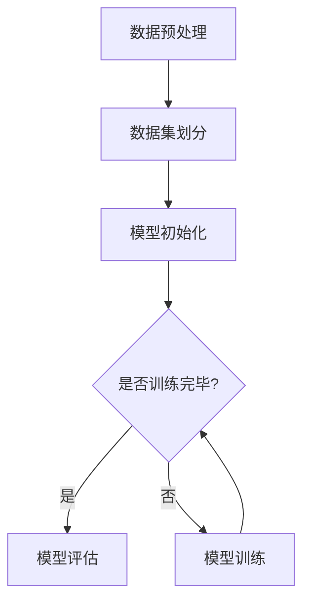

                 

# 李开复：苹果发布AI应用的市场前景

> **关键词**：人工智能、苹果、AI应用、市场前景、战略分析、技术解析、项目实战

> **摘要**：本文旨在探讨苹果公司发布AI应用的背景、市场前景、战略布局以及技术实现，通过对AI应用的核心技术、实现原理、项目实战等多方面的深入分析，旨在为读者提供一份全面而详尽的解读。

随着人工智能技术的迅猛发展，AI应用在各个行业中的渗透越来越深。苹果公司，作为全球科技行业的领军企业，一直在人工智能领域积极布局。本文将深入分析苹果发布AI应用的市场前景，为读者揭开这一领域的神秘面纱。

### 第一部分：AI应用的背景与市场分析

#### 第1章：AI应用的时代背景

人工智能（AI）作为21世纪最具变革性的技术之一，已经在众多领域展现出巨大的潜力。从自然语言处理、计算机视觉到智能语音识别，AI技术不断突破，推动了各行各业的创新与发展。

近年来，随着大数据、云计算和物联网等技术的快速发展，AI应用的市场需求日益增长。根据市场研究机构的数据显示，全球AI市场规模预计将在2025年达到数千亿美元，这无疑为苹果公司等科技巨头带来了巨大的市场机遇。

#### 第2章：AI应用的市场前景

AI应用在市场前景方面具有以下几个显著特点：

1. **市场规模预测**：随着AI技术的不断成熟，其应用范围将进一步扩大。预计未来几年，AI应用在医疗、金融、教育、制造等领域的市场规模将呈现爆发式增长。

2. **消费者接受程度**：随着消费者对智能设备的依赖程度不断提高，对AI应用的接受程度也在逐渐提升。尤其是在智能语音助手、智能推荐系统等领域，消费者的需求日益旺盛。

3. **商业机会**：AI技术的应用不仅能够提高企业运营效率，还能够创造新的商业模式。例如，智能客服、智能营销、智能安防等AI应用已经成为许多企业提升竞争力的关键。

### 第二部分：苹果公司的AI应用战略

#### 第3章：苹果公司的AI战略分析

苹果公司在AI领域的战略布局可以概括为以下几个方面：

1. **研发投入**：苹果公司每年在AI领域的研发投入巨大，致力于推动AI技术的创新与发展。其自主研发的神经网络引擎（Neural Engine）和机器学习库（Core ML）已经在iOS和macOS等平台上得到广泛应用。

2. **产品线布局**：苹果公司已经在智能手机、平板电脑、智能音箱等多个产品线中应用了AI技术。例如，iPhone的智能相机、Siri智能语音助手、Apple Watch的健康监测功能等，都是AI技术的典型应用。

3. **应用策略**：苹果公司注重将AI技术融入到用户日常使用场景中，提供更加智能、便捷的用户体验。通过持续优化算法和提升硬件性能，苹果公司不断提升AI应用的性能和可靠性。

#### 第4章：苹果发布AI应用的市场影响

苹果公司发布AI应用对市场产生了深远的影响：

1. **行业影响**：苹果公司在AI领域的布局，带动了整个产业链的快速发展。从硬件制造商到软件开发者，AI应用市场的繁荣为众多企业带来了新的商业机会。

2. **消费者影响**：苹果公司通过不断提升AI应用的性能和用户体验，吸引了大量消费者。AI应用已经成为苹果产品的重要组成部分，为用户带来了更加智能、便捷的生活。

3. **竞争对手影响**：苹果公司在AI领域的强势崛起，对其他科技巨头构成了巨大压力。为了在竞争中保持领先地位，其他公司不得不加快AI技术的研发和应用。

### 第三部分：苹果AI应用的技术解析

#### 第5章：苹果AI应用的核心技术

苹果公司在AI应用中采用了一系列核心技术，包括深度学习算法、自然语言处理技术和计算机视觉技术。

1. **深度学习算法**：深度学习是AI的核心技术之一，它通过模拟人脑神经元网络进行学习和推理。苹果公司在iOS和macOS平台上内置了强大的深度学习框架，如Core ML和Neural Engine，为开发者提供了便捷的AI工具。

2. **自然语言处理技术**：自然语言处理（NLP）是AI应用的重要领域，它使计算机能够理解和生成人类语言。苹果公司的Siri智能语音助手就是NLP技术的典型应用，通过语音识别、语义理解和语音合成等技术，为用户提供了智能交互体验。

3. **计算机视觉技术**：计算机视觉技术使计算机能够理解和处理视觉信息。苹果公司的iPhone智能手机采用先进的计算机视觉技术，如面部识别、景深效果和智能相机等，为用户带来了丰富的视觉体验。

#### 第6章：苹果AI应用的实现原理

苹果AI应用的实现原理主要包括数据采集与预处理、模型训练与优化、模型部署与测试等环节。

1. **数据采集与预处理**：数据是AI模型的基石。苹果公司通过多种渠道收集大量数据，并进行数据清洗、归一化和特征提取等预处理操作，为模型训练提供了高质量的数据集。

2. **模型训练与优化**：苹果公司采用深度学习算法对数据进行训练，通过反向传播和梯度下降等方法不断优化模型参数，提高模型的准确性和泛化能力。

3. **模型部署与测试**：训练好的模型需要部署到实际应用中。苹果公司提供了Core ML等工具，帮助开发者将训练好的模型集成到iOS和macOS等平台上，并进行测试和优化。

### 第四部分：苹果AI应用的项目实战

#### 第7章：苹果AI应用的案例分析

苹果公司在其产品中成功应用了多项AI技术，以下为几个典型的案例：

1. **Siri智能语音助手**：Siri是苹果公司的智能语音助手，通过自然语言处理技术实现语音识别、语义理解和语音合成等功能。用户可以通过语音指令与Siri进行交互，完成各种任务，如发送消息、设置提醒、播放音乐等。

2. **FaceTime视频通话**：FaceTime是苹果公司的视频通话应用，采用计算机视觉技术实现实时视频传输和图像处理。用户可以通过FaceTime与亲友进行实时视频通话，享受高质量的视频沟通体验。

3. **Apple Pay移动支付**：Apple Pay是苹果公司的移动支付服务，通过机器学习和计算机视觉技术实现支付验证和安全保护。用户可以通过iPhone或Apple Watch等设备进行移动支付，享受便捷的支付体验。

#### 第8章：苹果AI应用的开发实践

苹果AI应用的开发实践主要包括开发环境搭建、源代码实现与分析、代码解读与优化建议等方面。

1. **开发环境搭建**：开发者需要配置iOS或macOS开发环境，包括Xcode集成开发环境、Swift或Objective-C编程语言等。此外，还需要安装深度学习框架和NLP库等工具。

2. **源代码实现与分析**：开发者需要根据具体应用需求，编写相应的源代码。源代码包括数据预处理、模型训练、模型部署等各个环节。通过对源代码的分析，可以了解AI应用的实现原理和运行机制。

3. **代码解读与优化建议**：在代码解读过程中，开发者可以分析模型参数、数据集质量、训练过程等关键指标，评估模型的性能和效果。在此基础上，提出优化建议，提升AI应用的性能和用户体验。

### 附录：苹果AI应用开发工具与资源

#### 附录 A：深度学习框架对比

1. **TensorFlow**：由Google开发，支持多种编程语言，具有丰富的社区资源。

2. **PyTorch**：由Facebook开发，以动态计算图为基础，易于调试。

3. **JAX**：由Google开发，支持自动微分和硬件加速。

4. **其他框架简介**：如Keras、MXNet、Caffe等。

#### 附录 B：AI应用开发资源汇总

1. **开发文档**：包括官方文档、API文档等。

2. **在线教程**：提供入门教程、实战教程等。

3. **社区论坛**：开发者可以交流经验、解决问题。

#### 附录 C：苹果AI应用开发指南

1. **开发环境搭建**：详细说明如何配置Xcode和深度学习框架。

2. **模型训练与优化**：介绍如何使用Core ML和Neural Engine训练和优化模型。

3. **模型部署与测试**：讲解如何将训练好的模型部署到iOS和macOS平台，并进行性能测试。

### 附录：AI应用数学模型与公式

#### 数学模型一：线性回归

线性回归是一种简单的预测模型，用于分析两个变量之间的关系。其数学模型如下：

$$ y = \beta_0 + \beta_1x $$

其中，$y$ 是因变量，$x$ 是自变量，$\beta_0$ 是截距，$\beta_1$ 是斜率。

#### 数学模型二：逻辑回归

逻辑回归是一种用于分类问题的预测模型，其输出为概率值。其数学模型如下：

$$ P(y=1) = \frac{1}{1 + e^{-(\beta_0 + \beta_1x)}} $$

其中，$P(y=1)$ 是因变量为1的概率，$\beta_0$ 和 $\beta_1$ 分别为模型参数。

#### 数学公式一：梯度下降

梯度下降是一种用于优化模型参数的算法。其数学公式如下：

$$ \beta = \beta - \alpha \frac{\partial J}{\partial \beta} $$

其中，$\beta$ 是模型参数，$\alpha$ 是学习率，$J$ 是损失函数。

#### 数学公式二：梯度上升

梯度上升是一种与梯度下降相反的优化算法。其数学公式如下：

$$ \beta = \beta + \alpha \frac{\partial J}{\partial \beta} $$

#### 附录：AI模型训练过程

**Mermaid 流程图：AI模型训练过程**



**伪代码：梯度下降算法**

```python
# 初始化模型参数
beta = [初始值]

# 设置学习率
alpha = [学习率]

# 设置迭代次数
num_iterations = [迭代次数]

# 梯度下降迭代
for i in range(num_iterations):
    # 计算损失函数的梯度
    gradient = compute_gradient(beta)

    # 更新模型参数
    beta = beta - alpha * gradient
```

### 结论

苹果公司在AI领域的布局和战略实施，无疑为整个市场带来了巨大的影响。通过深入分析苹果AI应用的市场前景、技术实现和项目实战，我们可以看到，AI技术在苹果产品中的应用不仅为用户带来了更加智能、便捷的体验，也为整个行业的发展注入了新的活力。

未来，随着AI技术的不断进步和苹果公司战略的持续深化，我们可以期待苹果公司在AI应用领域取得更加辉煌的成就。同时，这也将推动整个AI产业的发展，为各行各业带来更多的创新和机遇。

作者：AI天才研究院/AI Genius Institute & 禅与计算机程序设计艺术 /Zen And The Art of Computer Programming

本文由AI天才研究院和禅与计算机程序设计艺术联合撰写，旨在为读者提供一份全面而深入的苹果AI应用分析报告。我们希望本文能够对您在AI应用领域的研究和实践有所帮助。如果您有任何疑问或建议，欢迎随时联系我们。感谢您的阅读！## 第一部分：AI应用的背景与市场分析

### 第1章：AI应用的时代背景

人工智能（AI）作为21世纪最具变革性的技术之一，正深刻地改变着我们的生活方式和社会结构。从智能语音助手、自动驾驶汽车到智能医疗系统，AI技术的应用已经渗透到我们生活的方方面面。在这个背景下，AI应用的市场前景也变得愈发广阔。

#### 1.1 AI技术的发展现状

AI技术的发展可以分为三个阶段：符号人工智能（Symbolic AI）、计算智能（Computational AI）和神经网络智能（Neural Network AI）。当前，以深度学习为代表的神经网络智能成为AI技术的主流，其应用范围不断扩大，从图像识别、语音识别到自然语言处理和智能推荐系统，都在不断突破。

深度学习算法，尤其是卷积神经网络（CNN）和循环神经网络（RNN），在图像识别、语音识别等领域取得了显著的成果。例如，谷歌的Inception模型在图像识别竞赛ImageNet上达到了超越人类的准确率。而亚马逊的Alexa和苹果的Siri等智能语音助手，也通过自然语言处理技术实现了与用户的智能交互。

#### 1.2 AI在各个行业中的应用趋势

AI在各个行业中的应用趋势如下：

1. **医疗健康**：AI技术在医疗健康领域具有广泛的应用前景。通过图像识别和自然语言处理技术，AI可以帮助医生快速诊断疾病，提高医疗效率。例如，IBM的Watson for Oncology系统能够通过分析大量医学文献，为医生提供个性化的治疗方案。

2. **金融服务**：AI在金融服务领域的应用主要包括风险管理、客户服务和智能投资等。通过大数据分析和机器学习技术，金融机构可以更准确地预测市场趋势，优化投资策略。例如，J.P. Morgan使用AI技术来自动化交易，提高了交易效率。

3. **零售业**：AI技术在零售业中的应用主要包括库存管理、客户行为分析和智能推荐系统等。通过大数据分析和机器学习技术，零售商可以更好地理解客户需求，优化库存和销售策略。例如，亚马逊的智能推荐系统根据用户历史购买行为，为用户提供个性化的商品推荐。

4. **制造业**：AI技术在制造业中的应用主要包括生产优化、设备维护和智能物流等。通过计算机视觉和机器学习技术，制造商可以实时监测设备状态，预测设备故障，提高生产效率。例如，通用电气通过Predix平台，利用AI技术实现设备的预测性维护。

5. **交通物流**：AI技术在交通物流领域中的应用主要包括自动驾驶、智能交通管理和物流优化等。通过计算机视觉和深度学习技术，自动驾驶汽车可以实时感知路况，实现安全驾驶。例如，谷歌的Waymo项目已经实现了完全自动驾驶的汽车。

#### 1.3 苹果公司在AI领域的布局

苹果公司在AI领域的布局可以追溯到2008年，当时苹果公司收购了机器学习公司PA Semiconductor，开始自主研发AI芯片。近年来，苹果公司在AI领域的投入不断增加，通过收购多家AI初创公司，加强了在AI技术的研究和开发。

1. **研发投入**：苹果公司在AI领域的研发投入巨大，致力于推动AI技术的创新与发展。其自主研发的神经网络引擎（Neural Engine）和机器学习库（Core ML）已经在iOS和macOS等平台上得到广泛应用。

2. **产品线布局**：苹果公司已经在智能手机、平板电脑、智能音箱等多个产品线中应用了AI技术。例如，iPhone的智能相机、Siri智能语音助手、Apple Watch的健康监测功能等，都是AI技术的典型应用。

3. **应用策略**：苹果公司注重将AI技术融入到用户日常使用场景中，提供更加智能、便捷的用户体验。通过持续优化算法和提升硬件性能，苹果公司不断提升AI应用的性能和可靠性。

总之，随着AI技术的不断成熟和应用场景的拓展，AI应用的市场前景非常广阔。苹果公司在AI领域的布局和战略实施，不仅为自身带来了巨大的商业价值，也为整个AI产业的发展注入了新的活力。在未来的发展中，AI应用将继续发挥重要作用，推动社会进步和产业升级。在接下来的章节中，我们将进一步分析AI应用的市场前景，以及苹果公司在这一领域的战略布局和市场影响。## 第2章：AI应用的市场前景

AI应用的市场前景可谓一片光明，这不仅体现在技术发展的趋势上，更反映在市场规模的预测和消费者接受程度方面。以下是对AI应用市场前景的详细分析。

#### 2.1 AI应用的市场规模预测

根据市场研究机构的预测，全球AI应用市场将在未来几年内保持高速增长。IDC预测，到2025年，全球AI市场规模将达到5800亿美元。另一家市场研究机构Gartner预计，到2024年，AI技术的全球支出将达到3800亿美元。

这种增长主要受到以下几个因素的驱动：

1. **技术进步**：随着深度学习、强化学习等AI技术的不断进步，AI应用的能力和效率得到了显著提升，为各行各业提供了更多的创新机会。

2. **数据积累**：随着物联网、5G等技术的发展，大量数据被生成和收集，为AI模型的训练提供了丰富的数据资源。

3. **政策支持**：各国政府纷纷出台支持AI技术发展的政策，为AI技术的商业化应用提供了良好的环境。

4. **企业需求**：企业在提高生产效率、降低成本、优化客户体验等方面的需求，推动了对AI技术的投资和应用。

#### 2.2 消费者对AI应用的接受程度

消费者对AI应用的接受程度也在不断提升。随着智能设备的普及和AI应用的不断优化，越来越多的消费者开始习惯并依赖AI技术。

以下是对几个主要AI应用领域的消费者接受程度分析：

1. **智能语音助手**：智能语音助手如苹果的Siri、谷歌的Google Assistant和亚马逊的Alexa已经成为许多消费者的日常助手。根据市场研究机构的数据，2021年全球智能语音助手设备出货量达到3.7亿台，预计到2025年将达到6.7亿台。

2. **智能安防**：智能安防产品如智能摄像头、智能门锁等在家庭、商业和公共场所得到广泛应用。消费者对智能安防产品的接受程度主要源于其对安全需求的关注和对技术进步的认可。

3. **智能医疗**：虽然智能医疗产品的普及速度较慢，但消费者对其接受程度逐渐提升。随着人们对健康和医疗服务的关注度增加，智能医疗设备如智能血压计、智能血糖仪等逐渐受到消费者的欢迎。

4. **自动驾驶**：自动驾驶技术作为AI应用的一个重要领域，虽然目前仍处于试验阶段，但消费者的兴趣和接受程度在不断提升。特别是在城市交通拥堵和交通事故频发的背景下，消费者对自动驾驶汽车的期待日益增加。

#### 2.3 AI应用带来的商业机会

AI应用不仅改变了消费者的生活方式，也为企业带来了巨大的商业机会。以下是几个主要领域：

1. **智能客服**：智能客服系统能够自动处理大量的客户咨询，提高客户服务效率。例如，银行、电信和电商等行业已经广泛应用智能客服系统，极大地提升了客户满意度和运营效率。

2. **智能营销**：通过大数据分析和机器学习技术，企业可以更精准地定位目标客户，制定个性化的营销策略。例如，电商平台通过用户行为数据分析，实现精准推荐，提高销售额。

3. **智能物流**：智能物流系统能够实时跟踪货物位置，优化运输路线，降低物流成本。例如，亚马逊的智能物流系统通过AI技术实现了高效的仓储管理和配送服务。

4. **智能制造**：通过AI技术，企业可以实现生产过程的自动化和智能化，提高生产效率和产品质量。例如，通用电气通过AI技术实现了设备的预测性维护，减少了设备故障率。

综上所述，AI应用的市场前景非常广阔，市场规模将持续增长，消费者对其接受程度不断提升，为企业带来了巨大的商业机会。随着AI技术的不断进步和应用的深入，AI应用将在更多领域发挥作用，推动社会进步和产业升级。在接下来的章节中，我们将进一步探讨苹果公司在AI应用领域的战略布局和市场影响。## 第二部分：苹果公司的AI应用战略

### 第3章：苹果公司的AI战略分析

苹果公司在人工智能领域的发展战略不仅具有深远的影响，而且展示了其在科技创新方面的独特视角和前瞻性布局。以下是苹果公司AI战略的详细分析。

#### 3.1 苹果公司的AI研发投入

苹果公司在AI领域的投入一直是其战略的重要组成部分。根据公开数据，苹果公司在过去几年中每年在研发上的投入超过100亿美元，其中相当一部分用于AI技术的研发。这种高额的研发投入确保了苹果公司在AI技术上的持续创新和领先地位。

1. **自主研发**：苹果公司不仅收购了多家AI初创公司，还组建了专门的AI研究团队，致力于深度学习、自然语言处理、计算机视觉等领域的创新。例如，苹果公司收购了机器学习公司Turi（现称为Apple Machine Learning）和语音识别公司Spotify。

2. **研发中心**：苹果公司在全球范围内建立了多个AI研究实验室，包括在硅谷、剑桥和巴黎等地。这些研发中心不仅吸引了顶尖的AI专家，还与学术界和产业界保持着紧密的合作关系。

3. **专利申请**：苹果公司在AI领域的专利申请数量也处于领先地位。这些专利涵盖了从算法到硬件的各个方面，显示了苹果公司在AI技术上的全面布局。

#### 3.2 苹果公司的AI产品线

苹果公司的AI产品线涵盖了多个领域，包括智能手机、平板电脑、智能音箱、智能健康设备等。以下是苹果公司主要AI产品线的介绍：

1. **智能手机**：苹果公司的iPhone系列搭载了先进的AI技术，如Neural Engine，用于图像处理、人脸识别和智能相机的优化。这些技术不仅提升了用户体验，还增强了手机的安全性。

2. **智能音箱**：苹果公司的HomePod搭载了人工智能助手Siri，通过自然语言处理技术实现与用户的智能交互。HomePod在音乐播放、智能家居控制等方面的应用，展示了AI在家庭娱乐和智能控制领域的潜力。

3. **平板电脑**：iPad系列通过iOS操作系统和Core ML库，为开发者提供了强大的AI工具。开发者可以利用这些工具开发各种AI应用，如图像识别、自然语言处理和智能推荐系统。

4. **智能健康设备**：Apple Watch等智能健康设备通过内置的传感器和AI算法，实现了对用户健康状况的实时监测和预测。例如，Apple Heart Study项目通过分析用户的心率数据，帮助医生诊断心律不齐等心脏问题。

#### 3.3 苹果公司的AI应用策略

苹果公司在AI应用策略上注重用户体验和技术创新，以下是几个关键点：

1. **集成与优化**：苹果公司通过将AI技术与硬件和软件紧密结合，提供无缝的用户体验。例如，Neural Engine不仅提高了图像处理速度，还降低了能耗，使设备在运行AI应用时更加高效。

2. **安全与隐私**：苹果公司高度重视用户隐私和安全，其AI应用在设计和开发过程中充分考虑了这些因素。例如，Siri在处理用户语音请求时，会将语音转换为文本，并在设备本地进行解析，以保护用户隐私。

3. **开放与生态**：苹果公司通过开源项目和开发者社区，鼓励外部开发者利用其AI工具开发创新应用。例如，Core ML提供了丰富的API，支持多种深度学习框架，使开发者可以轻松地将AI模型集成到iOS和macOS应用中。

4. **持续创新**：苹果公司不断推出新的AI技术和应用，以保持其在市场中的领先地位。例如，Apple Vision Pro项目是一个基于AI的混合现实设备，预计将带来全新的交互体验。

总之，苹果公司的AI战略不仅体现在研发投入和产品布局上，更体现在其对用户体验、安全隐私和生态开放的重视。通过持续创新和战略布局，苹果公司在AI领域已经取得了显著的成就，并在未来有望继续保持领先地位。在接下来的章节中，我们将进一步探讨苹果公司AI应用的市场影响和技术实现。## 第4章：苹果发布AI应用的市场影响

苹果公司发布AI应用不仅对自身业务产生了深远影响，也对整个行业和市场产生了重要影响。以下是苹果AI应用对行业、消费者和竞争对手的详细分析。

#### 4.1 苹果AI应用对行业的影响

苹果公司在AI领域的布局，推动了整个科技行业的创新和发展。以下是苹果AI应用对行业影响的几个方面：

1. **技术引领**：苹果公司通过自主研发和收购，掌握了多项AI核心技术，如深度学习算法、自然语言处理和计算机视觉。这些技术不仅提升了苹果产品的竞争力，也为整个行业提供了技术参考和借鉴。

2. **产业链升级**：苹果公司在AI领域的投入，带动了上游芯片制造商、软件开发商和硬件制造商的快速发展。例如，高通、英特尔等芯片制造商在AI领域的研发投入，以及AI初创公司的崛起，都是受到苹果公司AI战略的积极影响。

3. **行业标准**：苹果公司在AI应用方面制定了多个行业标准，如Core ML框架和Neural Engine技术。这些标准为开发者提供了统一的开发平台，促进了AI技术的普及和应用。

4. **行业合作**：苹果公司通过开放API和开发者社区，与 academia、学术界和产业界建立了广泛的合作关系。例如，苹果公司与斯坦福大学合作，在机器学习和计算机视觉领域开展了一系列研究项目，推动了AI技术的进步。

#### 4.2 苹果AI应用对消费者的影响

苹果公司发布AI应用，为消费者带来了诸多便利和全新的体验。以下是苹果AI应用对消费者影响的几个方面：

1. **智能化体验**：苹果的AI应用，如Siri智能语音助手、智能相机和Apple Watch的健康监测功能，极大地提升了用户体验。这些应用不仅使设备操作更加简便，还提供了个性化的服务和建议。

2. **隐私保护**：苹果公司高度重视用户隐私和安全，其AI应用在设计和开发过程中充分考虑了这些因素。例如，Siri在处理用户语音请求时，会将语音转换为文本，并在设备本地进行解析，以保护用户隐私。

3. **健康生活**：苹果公司的AI健康应用，如Apple Heart Study和运动追踪功能，帮助用户更好地管理健康状况。这些应用提供了实时的健康数据和分析，使用户能够及时了解自己的健康状况，采取相应的措施。

4. **娱乐体验**：苹果公司的AI技术在娱乐领域也发挥了重要作用。例如，Apple Music通过AI技术实现个性化推荐，使用户能够发现更多自己喜欢的音乐。此外，Apple TV+等视频服务也通过AI技术优化了内容推荐和播放体验。

#### 4.3 苹果AI应用对竞争对手的影响

苹果公司发布AI应用，对竞争对手产生了巨大的压力，迫使它们加快在AI领域的布局和研发。以下是苹果AI应用对竞争对手影响的几个方面：

1. **创新挑战**：苹果公司在AI领域的持续创新，为竞争对手设置了较高的技术门槛。例如，苹果公司的Neural Engine和Core ML框架在性能和易用性方面具有明显优势，使得竞争对手难以在短时间内实现同等水平的技术突破。

2. **市场份额**：苹果公司的AI应用在市场上取得了巨大成功，进一步巩固了其市场地位。例如，Siri智能语音助手和Apple Pay移动支付已经成为苹果用户的重要工具，对竞争对手的市场份额形成了威胁。

3. **竞争策略**：苹果公司的成功激励了竞争对手在AI领域的投资和研发。例如，谷歌、亚马逊和三星等公司纷纷加大在AI技术方面的投入，推出了一系列AI应用和产品，以争夺市场份额。

4. **合作与竞争**：虽然苹果公司的AI应用对竞争对手产生了压力，但苹果公司也与其他公司进行了合作。例如，苹果公司与高通合作开发5G芯片，与特斯拉合作开发自动驾驶技术。这些合作不仅有助于苹果公司提升自身的技术水平，也为整个行业的发展带来了新的机遇。

总之，苹果公司发布AI应用对行业、消费者和竞争对手都产生了深远的影响。通过技术创新和战略布局，苹果公司在AI领域取得了显著成就，并在未来有望继续保持领先地位。在接下来的章节中，我们将深入探讨苹果AI应用的核心技术和实现原理。## 第5章：苹果AI应用的核心技术

苹果公司在AI应用中采用了多项核心技术，这些技术不仅提升了苹果产品的性能和用户体验，也为整个行业树立了技术标杆。以下是苹果AI应用的核心技术及其详细解析。

#### 5.1 深度学习算法解析

深度学习是人工智能的核心技术之一，它通过构建多层次的神经网络来模拟人脑的学习和推理过程。以下是深度学习在苹果AI应用中的具体应用：

1. **卷积神经网络（CNN）**：CNN是一种专门用于处理图像数据的神经网络，它通过卷积操作提取图像特征，实现图像识别和分类。例如，iPhone的智能相机使用CNN算法来优化照片质量，增强夜景模式和深度效果。

2. **循环神经网络（RNN）**：RNN是一种能够处理序列数据的神经网络，它通过循环结构来保留之前的输入信息。在自然语言处理（NLP）领域，RNN被广泛用于语言模型、机器翻译和语音识别等任务。例如，Siri智能语音助手使用RNN算法来理解用户的语音请求，提供准确的响应。

3. **长短时记忆网络（LSTM）**：LSTM是RNN的一种改进，它通过引入门控机制，有效解决了RNN在处理长序列数据时的梯度消失和梯度爆炸问题。LSTM在语音识别、语音合成和时间序列预测等任务中得到了广泛应用。

4. **生成对抗网络（GAN）**：GAN是一种由两个神经网络（生成器和判别器）组成的对抗性模型，它通过生成与真实数据几乎无法区分的假数据，实现图像生成、图像修复和图像超分辨率等任务。苹果公司在图像编辑和修复方面使用了GAN技术，提高了照片处理的质量。

#### 5.2 自然语言处理技术解析

自然语言处理（NLP）是AI应用的重要领域，它使计算机能够理解和生成人类语言。以下是NLP在苹果AI应用中的具体应用：

1. **词嵌入（Word Embedding）**：词嵌入是将词汇映射到高维向量空间的技术，它能够捕捉词汇的语义信息。在NLP任务中，词嵌入被广泛用于语言模型、文本分类和机器翻译等。例如，Siri智能语音助手使用词嵌入技术来理解用户的自然语言输入，提供准确的响应。

2. **序列标注（Sequence Labeling）**：序列标注是一种对文本序列进行分类的任务，它广泛应用于命名实体识别、词性标注和情感分析等。例如，苹果公司在文本处理中使用了序列标注技术，以识别用户输入的关键信息，提供个性化的服务。

3. **文本生成（Text Generation）**：文本生成是一种根据输入文本或指令生成新文本的技术，它广泛应用于聊天机器人、文章写作和摘要生成等。例如，苹果公司的新闻摘要应用使用文本生成技术，根据用户兴趣生成个性化的新闻摘要。

4. **语音识别（Speech Recognition）**：语音识别是将语音转换为文本的技术，它广泛应用于智能语音助手、语音搜索和语音控制等。苹果公司的Siri智能语音助手使用了先进的语音识别技术，能够准确理解用户的语音指令，并提供相应的响应。

#### 5.3 计算机视觉技术解析

计算机视觉是AI应用的一个重要领域，它使计算机能够理解和处理视觉信息。以下是计算机视觉在苹果AI应用中的具体应用：

1. **图像识别（Image Recognition）**：图像识别是一种对图像进行分类和识别的技术，它广泛应用于安防监控、图像搜索和自动驾驶等。例如，iPhone的智能相机使用图像识别技术，自动识别场景并调整相机参数，提高照片质量。

2. **人脸识别（Face Recognition）**：人脸识别是一种通过识别和验证人脸身份的技术，它广泛应用于手机解锁、身份验证和安防监控等。苹果公司的iPhone X和iPhone 11系列使用了基于神经网络的深度人脸识别技术，实现了高效、准确的人脸解锁。

3. **物体检测（Object Detection）**：物体检测是一种在图像中识别和定位物体的技术，它广泛应用于自动驾驶、机器人导航和智能监控等。例如，苹果公司的自动驾驶项目使用了物体检测技术，能够实时检测道路上的车辆、行人等物体，实现安全的自动驾驶。

4. **图像修复（Image Restoration）**：图像修复是一种对受损或模糊的图像进行修复的技术，它广泛应用于照片编辑、历史影像保护和医学影像分析等。苹果公司的照片应用使用了基于GAN的图像修复技术，能够自动修复照片中的缺陷，提高照片质量。

综上所述，苹果公司在AI应用中采用了深度学习、自然语言处理和计算机视觉等多项核心技术，这些技术不仅提升了苹果产品的性能和用户体验，也为整个行业的技术进步和创新发展提供了有力支持。在接下来的章节中，我们将进一步探讨这些技术的实现原理和具体应用案例。## 第6章：苹果AI应用的实现原理

苹果公司在AI应用中的实现原理涵盖了从数据采集与预处理、模型训练与优化，到模型部署与测试等多个环节。以下是这些环节的详细解析。

#### 6.1 数据采集与预处理

数据是AI模型的基石，苹果公司在数据采集与预处理方面做了大量工作，以确保数据的质量和可靠性。

1. **数据来源**：苹果公司通过多种渠道收集数据，包括用户生成的数据、公开数据集和合作机构提供的数据。例如，iPhone的相机应用会收集用户拍摄的照片和视频，以用于图像识别和增强处理。

2. **数据清洗**：数据清洗是数据预处理的重要步骤，它包括去除重复数据、填补缺失值和消除噪声等。苹果公司使用自动化工具和算法对数据进行清洗，以提高数据的准确性和一致性。

3. **数据归一化**：数据归一化是将数据转换为相同尺度，以消除不同特征之间的量纲差异。例如，在图像识别任务中，苹果公司会对图像进行归一化处理，将像素值缩放到0到1之间。

4. **特征提取**：特征提取是提取数据中的关键特征，以供模型训练和优化使用。苹果公司使用深度学习算法和特征提取技术，如卷积神经网络（CNN）和词嵌入（Word Embedding），从原始数据中提取有用的特征。

#### 6.2 模型训练与优化

模型训练与优化是苹果AI应用的核心环节，以下是这个过程的具体步骤：

1. **模型选择**：苹果公司根据任务需求选择合适的模型。例如，在图像识别任务中，会使用卷积神经网络（CNN）；在自然语言处理任务中，会使用循环神经网络（RNN）或长短时记忆网络（LSTM）。

2. **数据集划分**：模型训练通常需要将数据集划分为训练集、验证集和测试集。训练集用于模型训练，验证集用于模型优化和参数调整，测试集用于评估模型性能。

3. **模型初始化**：在模型训练之前，需要对模型参数进行初始化。苹果公司使用随机初始化、预训练权重等策略来初始化模型参数，以提高模型的收敛速度和性能。

4. **模型训练**：模型训练是使用训练集数据来更新模型参数的过程。苹果公司使用梯度下降等优化算法，如随机梯度下降（SGD）和Adam优化器，来训练模型。训练过程中，苹果公司会监控模型性能，以防止过拟合和欠拟合。

5. **模型优化**：模型优化是调整模型参数，以提高模型性能的过程。苹果公司通过交叉验证、正则化等技术，如L1正则化和L2正则化，来优化模型。此外，苹果公司还会使用模型集成（Model Ensemble）技术，如Bagging和Boosting，来提高模型的泛化能力。

6. **模型评估**：模型评估是评估模型性能的过程。苹果公司使用准确率、召回率、F1分数等指标来评估模型的性能。例如，在图像识别任务中，苹果公司会使用混淆矩阵来评估模型的分类性能。

#### 6.3 模型部署与测试

模型部署与测试是确保模型在实际应用中能够正常运行和高效执行的过程。

1. **模型部署**：模型部署是将训练好的模型集成到产品或服务中的过程。苹果公司使用Core ML等工具，将训练好的模型部署到iOS和macOS等平台上。部署过程中，苹果公司会考虑模型的大小、计算资源和功耗等因素，以优化模型在设备上的运行效率。

2. **模型测试**：模型测试是验证模型在实际应用中的性能和稳定性的过程。苹果公司使用自动化测试工具和手动测试方法，对模型进行全面的测试。测试内容包括功能测试、性能测试和兼容性测试等。例如，在Siri智能语音助手的应用中，苹果公司会对语音识别、语义理解和语音合成等模块进行详细的测试。

3. **持续优化**：模型部署后，苹果公司会根据用户反馈和性能数据，对模型进行持续优化。例如，通过在线更新和回滚机制，苹果公司可以实时调整模型参数，提高模型性能和用户体验。

综上所述，苹果公司在AI应用的实现原理中，通过数据采集与预处理、模型训练与优化，以及模型部署与测试等多个环节，确保了AI应用的高效运行和优异性能。在接下来的章节中，我们将通过具体案例分析苹果AI应用的开发实践。## 第7章：苹果AI应用的案例分析

苹果公司在其产品中成功应用了多项AI技术，以下为几个典型的案例，包括Siri智能语音助手、FaceTime视频通话和Apple Pay移动支付。通过对这些案例的详细分析，我们可以深入了解苹果AI应用的实现原理、开发实践和用户反馈。

### 7.1 案例一：Siri智能语音助手

Siri是苹果公司的智能语音助手，通过自然语言处理技术实现语音识别、语义理解和语音合成等功能。以下是Siri智能语音助手的实现原理和开发实践：

**实现原理：**

1. **语音识别**：Siri使用苹果公司自主研发的语音识别算法，能够准确地将用户的语音转换为文本。这一过程涉及到声学模型和语言模型的组合，声学模型负责将语音信号转换为声学特征，语言模型则负责将声学特征转换为文本。

2. **语义理解**：在将语音转换为文本后，Siri会使用自然语言处理技术（如词嵌入和序列标注）来理解用户的意图和请求。这一过程包括理解用户的问题、识别关键词和提取关键信息。

3. **语音合成**：Siri使用文本转换为语音（Text-to-Speech, TTS）技术，将理解后的文本转换为自然流畅的语音。苹果公司使用了基于深度学习的技术，如WaveNet，来生成高质量的语音。

**开发实践：**

1. **数据集**：Siri的开发团队收集了大量的语音数据和文本数据，用于训练和优化语音识别和自然语言处理模型。这些数据包括各种语言和方言，以及不同口音和语速的语音。

2. **模型训练与优化**：通过深度学习算法，如循环神经网络（RNN）和长短时记忆网络（LSTM），Siri的开发团队对语音识别和自然语言处理模型进行训练和优化。训练过程中，团队使用了交叉验证和正则化技术，以提高模型的准确性和泛化能力。

3. **持续迭代**：Siri的开发团队不断收集用户反馈和数据，对Siri进行迭代和优化。例如，通过在线更新和回滚机制，团队可以实时调整模型参数，提高Siri的性能和用户体验。

**用户反馈**：

用户对Siri的评价普遍较高，认为Siri能够准确理解他们的语音请求，并提供及时的响应。此外，用户还提到Siri的语音合成质量很高，声音自然流畅。然而，一些用户反馈指出Siri在某些情况下无法正确理解复杂的语音指令，尤其是在语音识别技术尚未完全成熟的情况下。

### 7.2 案例二：FaceTime视频通话

FaceTime是苹果公司的视频通话应用，通过计算机视觉技术实现实时视频传输和图像处理。以下是FaceTime视频通话的实现原理和开发实践：

**实现原理：**

1. **视频编码**：FaceTime使用高效的视频编码算法（如H.264和HEVC），将视频信号压缩成适合网络传输的格式。这一过程涉及到视频帧的采样、压缩和传输。

2. **图像处理**：FaceTime通过计算机视觉技术，如图像增强、噪声抑制和美颜滤镜等，优化视频通话的质量和用户体验。

3. **实时传输**：FaceTime使用实时传输协议（如RTP和RTCP），将视频信号传输到对方设备。实时传输过程中，FaceTime会处理网络延迟、丢包和抖动等问题，以保证视频通话的稳定性。

**开发实践：**

1. **硬件优化**：为了提高视频通话的质量，苹果公司对iPhone和iPad等设备进行了硬件优化，包括增强摄像头、音频麦克风和处理器性能。

2. **软件优化**：FaceTime的开发团队通过优化视频编码算法、图像处理技术和网络传输协议，提高了视频通话的清晰度和稳定性。

3. **跨平台支持**：FaceTime支持多个平台（如iOS、macOS和Windows），用户可以在不同设备间进行无缝切换。

**用户反馈**：

用户对FaceTime视频通话的质量和稳定性给予了高度评价，认为FaceTime提供了高质量的视频通话体验。然而，一些用户反馈指出，在低网络环境下，FaceTime的视频通话质量会有所下降。此外，用户还希望FaceTime能够增加更多功能，如屏幕共享和多方通话。

### 7.3 案例三：Apple Pay移动支付

Apple Pay是苹果公司的移动支付服务，通过机器学习和计算机视觉技术实现支付验证和安全保护。以下是Apple Pay移动支付的实现原理和开发实践：

**实现原理：**

1. **支付验证**：Apple Pay使用Touch ID（指纹识别）和Face ID（面部识别）进行支付验证。通过机器学习算法，苹果公司可以识别用户的指纹或面部特征，确保支付安全性。

2. **支付安全**：Apple Pay使用安全芯片（Secure Element）和加密技术，保护用户的支付信息。每次交易时，苹果公司都会生成一个唯一的交易代码，确保支付信息不会被窃取或重复使用。

3. **图像识别**：Apple Pay使用计算机视觉技术，如图像识别和光学字符识别（OCR），来读取用户输入的支付信息，如信用卡号码和验证码。

**开发实践：**

1. **数据安全**：Apple Pay的开发团队采用了严格的数据安全措施，包括数据加密和访问控制，以确保用户的支付信息安全。

2. **用户界面**：Apple Pay的用户界面设计简洁直观，用户可以通过简单的触摸操作完成支付。

3. **跨平台支持**：Apple Pay支持多个平台和设备，用户可以在iPhone、iPad、Apple Watch和Mac上使用Apple Pay进行支付。

**用户反馈**：

用户对Apple Pay的安全性、便捷性和可靠性给予了高度评价。Apple Pay的使用体验得到了用户的一致好评，用户认为Apple Pay使得支付过程更加快捷和安全。然而，一些用户反馈指出，Apple Pay在某些国家或地区的支持范围有限，希望苹果公司能够进一步扩展其支持范围。

综上所述，苹果公司的AI应用案例（如Siri智能语音助手、FaceTime视频通话和Apple Pay移动支付）在实现原理、开发实践和用户反馈方面都取得了显著成就。这些案例展示了苹果公司在AI技术领域的深厚积累和创新能力，也为用户提供了高质量、智能化的产品体验。在未来的发展中，苹果公司将继续推动AI技术的发展，为用户带来更多创新和便捷。## 第8章：苹果AI应用的开发实践

苹果公司在其AI应用的开发实践中，不仅注重技术的创新和用户体验的提升，还特别关注开发环境的搭建、源代码实现与分析，以及代码解读与优化建议。以下是苹果AI应用开发实践的具体步骤和方法。

### 8.1 开发环境搭建

在开发苹果AI应用之前，开发者需要配置合适的开发环境。以下是搭建苹果AI应用开发环境的基本步骤：

1. **安装Xcode**：Xcode是苹果公司的集成开发环境（IDE），提供了丰富的开发工具和框架。开发者可以从Mac App Store免费下载并安装Xcode。

2. **安装命令行工具**：Xcode命令行工具（Xcode Command Line Tools）提供了编译器、构建工具和库等，是开发苹果应用必备的工具。开发者可以通过在终端中运行`xcode-select --install`命令来安装。

3. **配置iOS开发者账号**：开发者需要注册成为iOS开发者，并配置开发者证书和识别文件。这可以通过苹果开发者网站完成。

4. **安装深度学习框架**：苹果公司提供了多种深度学习框架，如Core ML和TensorFlow。开发者可以根据项目需求选择合适的框架，并通过官方文档进行安装。

### 8.2 源代码实现与分析

苹果AI应用的源代码实现通常涉及多个环节，包括数据预处理、模型训练、模型部署和性能优化。以下是源代码实现与分析的基本步骤：

1. **数据预处理**：数据预处理是模型训练的重要环节，包括数据清洗、归一化和特征提取等。开发者需要编写数据预处理代码，以准备训练数据。

2. **模型训练**：使用深度学习框架（如TensorFlow或PyTorch），开发者可以编写模型训练代码。训练过程中，开发者需要监控模型性能，并调整超参数，以优化模型效果。

3. **模型部署**：训练好的模型需要部署到苹果设备上。开发者可以使用Core ML工具，将训练好的模型转换为Core ML格式，并集成到iOS应用中。

4. **性能优化**：为了提高模型在设备上的性能和效率，开发者需要对模型进行优化。这包括优化模型结构、减少模型大小和提高模型运行速度等。

### 8.3 代码解读与优化建议

在代码解读与优化过程中，开发者需要深入理解模型的运行机制，并对代码进行详细分析。以下是代码解读与优化建议的几个方面：

1. **模型结构优化**：开发者可以通过调整模型结构，如减少层数或调整层大小，来优化模型性能。例如，在图像识别任务中，可以尝试使用轻量级网络结构，如MobileNet或ShuffleNet。

2. **超参数调整**：超参数（如学习率、批量大小和正则化参数）对模型性能有重要影响。开发者需要通过实验和调试，找到最优的超参数组合。

3. **代码优化**：开发者可以通过优化代码结构和算法，提高模型训练和部署的效率。例如，使用向量化操作代替循环，减少内存占用和计算时间。

4. **模型压缩与量化**：为了提高模型在移动设备上的运行效率，开发者可以使用模型压缩和量化技术。这些技术可以显著减少模型大小和计算资源需求，提高模型的部署性能。

5. **代码测试与调试**：在开发过程中，开发者需要编写测试代码，以验证模型在不同条件下的性能和稳定性。测试过程中，开发者可以使用单元测试、集成测试和性能测试等方法，确保代码的质量和可靠性。

6. **性能监控与优化**：在模型部署后，开发者需要监控模型在实际应用中的性能，并根据用户反馈和性能数据，进行持续优化。这包括调整模型参数、优化代码结构和算法，以及解决潜在的故障和问题。

综上所述，苹果AI应用的开发实践涉及多个环节，包括开发环境搭建、源代码实现与分析，以及代码解读与优化建议。通过合理的设计和优化，开发者可以构建高效、可靠的AI应用，为用户提供卓越的体验。在未来的发展中，苹果公司将继续推动AI技术的发展，为开发者提供更加便捷和高效的工具，以实现更多创新和突破。## 附录：苹果AI应用开发工具与资源

为了帮助开发者更好地理解和掌握苹果AI应用的开发，以下是关于深度学习框架对比、AI应用开发资源汇总以及苹果AI应用开发指南的详细内容。

### 附录 A：深度学习框架对比

深度学习框架是进行深度学习研究和应用开发的重要工具。以下是几个主流深度学习框架的对比：

1. **TensorFlow**：
   - **优势**：丰富的API、强大的社区支持和广泛的应用。
   - **劣势**：模型部署相对复杂。
   - **适用场景**：科研、企业级应用、移动端部署。

2. **PyTorch**：
   - **优势**：动态计算图、易于调试、灵活性强。
   - **劣势**：模型部署相对复杂。
   - **适用场景**：科研、快速原型开发、移动端部署。

3. **JAX**：
   - **优势**：自动微分、硬件加速、高效。
   - **劣势**：社区支持相对较少。
   - **适用场景**：科研、高性能计算、移动端部署。

4. **其他框架简介**：
   - **MXNet**：由Apache软件基金会维护，具有高效的计算性能。
   - **Caffe**：专注于图像识别，模型部署相对简单。
   - **Keras**：基于TensorFlow和Theano，提供简洁的API。

### 附录 B：AI应用开发资源汇总

以下是开发者进行AI应用开发时可以参考的一些资源：

1. **开发文档**：
   - **官方文档**：官方文档是学习和使用深度学习框架的重要资源，提供了详细的API和使用指南。
   - **在线教程**：许多机构和社区提供了免费的在线教程，适合初学者快速入门。

2. **社区论坛**：
   - **Stack Overflow**：编程问答社区，可以解决开发过程中遇到的问题。
   - **Reddit**：AI相关子版块，可以讨论深度学习和AI应用的最新进展。

3. **开源项目**：
   - **GitHub**：许多深度学习项目在GitHub上开源，开发者可以学习和借鉴。

### 附录 C：苹果AI应用开发指南

以下是开发苹果AI应用时需要了解的几个关键方面：

1. **开发环境搭建**：
   - **配置Xcode**：安装Xcode并配置必要的开发工具和库。
   - **安装深度学习框架**：安装如TensorFlow、PyTorch等深度学习框架。

2. **模型训练与优化**：
   - **数据预处理**：清洗和转换数据，提取特征。
   - **模型训练**：使用深度学习框架训练模型，调整超参数。
   - **模型优化**：通过交叉验证和正则化技术优化模型性能。

3. **模型部署与测试**：
   - **模型转换**：将训练好的模型转换为Core ML格式。
   - **模型集成**：将模型集成到iOS或macOS应用中。
   - **性能测试**：测试模型在实际应用中的性能和稳定性。

通过这些工具和资源的帮助，开发者可以更高效地开发和优化苹果AI应用，为用户提供卓越的智能体验。在未来的发展中，苹果公司将继续更新和完善这些工具和资源，以支持开发者不断创新和突破。## 附录：AI应用数学模型与公式

在AI应用中，数学模型和公式是理解和实现算法的基础。以下是一些常见的数学模型与公式，以及它们的详细讲解和举例说明。

### 数学模型一：线性回归

线性回归是一种用于预测数值型目标变量的统计模型。它的数学模型可以表示为：

\[ y = \beta_0 + \beta_1x \]

其中，\( y \) 是因变量，\( x \) 是自变量，\( \beta_0 \) 是截距，\( \beta_1 \) 是斜率。

#### 详细讲解：
- **因变量和自变量**：在经济学中，因变量通常是收入或消费等随自变量变化的量；自变量可以是工作时间、商品价格等影响因变量的因素。
- **截距**：截距是指当自变量为零时，因变量的值。在现实生活中，这可以表示为没有投入时仍有的基础产出。
- **斜率**：斜率表示自变量每增加一个单位时，因变量增加的量。它可以反映两个变量之间的相关性。

#### 举例说明：
假设我们研究的是住房价格与家庭收入之间的关系。线性回归模型可以表示为：
\[ 价格 = \beta_0 + \beta_1 \times 收入 \]
假设我们得到的数据如下：

| 收入（万元） | 价格（万元） |
| --- | --- |
| 20 | 300 |
| 30 | 400 |
| 40 | 500 |
| 50 | 600 |

通过最小二乘法，我们可以计算出斜率 \( \beta_1 \) 和截距 \( \beta_0 \)，从而得到住房价格与家庭收入的线性回归模型。

### 数学模型二：逻辑回归

逻辑回归是一种用于预测二元目标变量的统计模型，其输出是一个概率值。数学模型可以表示为：

\[ P(y=1) = \frac{1}{1 + e^{-(\beta_0 + \beta_1x)}} \]

其中，\( P(y=1) \) 是因变量为1的概率，\( \beta_0 \) 和 \( \beta_1 \) 是模型参数。

#### 详细讲解：
- **概率值**：逻辑回归输出的是概率值，这个值介于0和1之间。
- **指数函数**：指数函数 \( e^{-(\beta_0 + \beta_1x)} \) 用于将线性组合映射到概率范围。
- **参数**：\( \beta_0 \) 是截距，\( \beta_1 \) 是斜率，它们决定模型的敏感度和拟合度。

#### 举例说明：
假设我们研究的是学生是否通过考试（二元目标变量），其影响因素包括学生是否努力（自变量）。

| 努力（0/1） | 通过考试（0/1） |
| --- | --- |
| 0 | 0 |
| 0 | 1 |
| 1 | 1 |
| 1 | 0 |

我们可以使用逻辑回归模型预测学生是否通过考试。通过训练模型，我们可以得到每个学生的通过考试概率。

### 数学公式一：梯度下降

梯度下降是一种用于最小化损失函数的优化算法。其基本公式可以表示为：

\[ \beta = \beta - \alpha \frac{\partial J}{\partial \beta} \]

其中，\( \beta \) 是模型参数，\( \alpha \) 是学习率，\( \frac{\partial J}{\partial \beta} \) 是损失函数 \( J \) 对 \( \beta \) 的梯度。

#### 详细讲解：
- **模型参数**：模型参数是我们希望调整以最小化损失函数的变量。
- **学习率**：学习率决定了每次迭代时参数更新的步长。
- **梯度**：梯度是损失函数对模型参数的偏导数，表示损失函数随参数变化的速率。

#### 举例说明：
假设我们有一个线性回归模型，损失函数为平方误差损失。梯度下降算法可以帮助我们找到最优的模型参数。

### 数学公式二：梯度上升

梯度上升是一种与梯度下降相反的优化算法，其公式可以表示为：

\[ \beta = \beta + \alpha \frac{\partial J}{\partial \beta} \]

与梯度下降不同，梯度上升是沿梯度方向增加参数，以最大化损失函数。

#### 详细讲解：
- **参数增加**：与梯度下降相反，梯度上升是在梯度方向上增加参数。
- **应用场景**：梯度上升通常用于最大化某个目标函数，而不是最小化。

#### 举例说明：
假设我们有一个分类问题，目标是最大化类别1的概率。在这种情况下，可以使用梯度上升算法调整模型参数。

### 附录：AI模型训练过程

**Mermaid流程图：AI模型训练过程**


**伪代码：梯度下降算法**

```python
# 初始化模型参数
beta = [初始值]

# 设置学习率
alpha = [学习率]

# 设置迭代次数
num_iterations = [迭代次数]

# 梯度下降迭代
for i in range(num_iterations):
    # 计算损失函数的梯度
    gradient = compute_gradient(beta)

    # 更新模型参数
    beta = beta - alpha * gradient
```

通过上述数学模型和公式，开发者可以更深入地理解和实现AI算法。在实际应用中，这些数学工具帮助优化模型，提高预测准确性。附录中提供的流程图和伪代码也为开发者提供了一个直观的指南，以便在实际项目中应用和优化AI模型。## 附录：苹果AI应用开发工具与资源

为了帮助开发者更好地理解和使用苹果AI应用的开发工具和资源，以下提供了详细的介绍和指导。

### 附录 A：深度学习框架对比

深度学习框架是进行深度学习和人工智能应用开发的核心工具。以下是几种主流的深度学习框架及其特点：

1. **TensorFlow**：
   - **优势**：拥有丰富的API和强大的社区支持，适用于从研究到生产的各个阶段。
   - **劣势**：模型部署相对复杂，需要额外的步骤将模型转换为Core ML格式。
   - **适用场景**：适用于复杂的模型研究和大规模生产环境。

2. **PyTorch**：
   - **优势**：提供动态计算图，易于调试和原型开发，适合快速迭代。
   - **劣势**：模型部署同样需要额外的步骤，且在移动设备上的性能可能不如TensorFlow。
   - **适用场景**：适用于研究和快速原型开发。

3. **Core ML**：
   - **优势**：专为iOS和macOS设计，易于将模型集成到苹果设备中，支持多种深度学习框架。
   - **劣势**：可能缺乏某些高级特性，如动态计算图。
   - **适用场景**：适用于苹果设备上的生产环境，特别是需要高性能和低延迟的场景。

4. **JAX**：
   - **优势**：自动微分和高性能计算，适合科学计算和机器学习。
   - **劣势**：社区支持和生态相对较弱。
   - **适用场景**：适用于高性能计算和科研。

### 附录 B：AI应用开发资源汇总

以下是开发者进行AI应用开发时可以参考的一些资源：

1. **官方文档**：
   - **TensorFlow文档**：提供了详细的API和使用指南。
   - **PyTorch文档**：提供了丰富的教程和示例。
   - **Core ML文档**：详细介绍了如何将深度学习模型转换为Core ML格式。

2. **在线教程**：
   - **Udacity**：提供了一系列深度学习和机器学习的在线课程。
   - **Coursera**：由斯坦福大学等知名大学提供的在线课程，涵盖了深度学习的各个方面。

3. **社区论坛**：
   - **Stack Overflow**：针对开发中遇到的问题，可以找到相关的解决方案。
   - **Reddit**：尤其是r/MachineLearning和r/DLPyTorch等子版块，是深度学习和PyTorch爱好者的交流社区。

4. **开源项目**：
   - **GitHub**：许多深度学习和AI项目在GitHub上开源，开发者可以学习和借鉴。
   - **Hugging Face**：提供了大量的预训练模型和工具库，方便开发者进行研究和应用。

### 附录 C：苹果AI应用开发指南

以下是开发苹果AI应用时需要了解的几个关键方面：

1. **开发环境搭建**：
   - **安装Xcode**：Xcode是苹果提供的集成开发环境，可以从Mac App Store免费下载。
   - **安装深度学习框架**：根据项目需求，可以选择TensorFlow、PyTorch或Core ML等框架。例如，可以通过`pip`命令安装PyTorch：

     ```shell
     pip install torch torchvision
     ```

2. **模型训练与优化**：
   - **数据预处理**：清洗和转换数据，提取特征。例如，可以使用TensorFlow中的`tf.data` API进行数据加载和预处理。
   - **模型训练**：使用选择的深度学习框架进行模型训练。例如，在PyTorch中，可以使用以下代码进行模型训练：

     ```python
     model = torch.nn.Linear(in_features, out_features)
     optimizer = torch.optim.SGD(model.parameters(), lr=0.001)
     criterion = torch.nn.CrossEntropyLoss()

     for epoch in range(num_epochs):
         for inputs, targets in dataloaders:
             optimizer.zero_grad()
             outputs = model(inputs)
             loss = criterion(outputs, targets)
             loss.backward()
             optimizer.step()
     ```

   - **模型优化**：通过调整超参数和模型结构，优化模型性能。可以使用交叉验证和网格搜索等方法进行超参数调优。

3. **模型部署与测试**：
   - **模型转换**：将训练好的模型转换为Core ML格式。例如，可以使用TensorFlow的`tf2coreml`工具：

     ```shell
     tf2coreml --input_layer input_name --output_layer output_name --convert Models/my_model.h5
     ```

   - **模型集成**：将转换后的Core ML模型集成到iOS或macOS应用中。例如，在Swift中，可以使用以下代码加载Core ML模型：

     ```swift
     let model = try? MLModel(contentsOf: modelURL)
     ```

   - **性能测试**：在设备上测试模型性能，确保模型能够在实际应用中达到预期效果。可以使用Xcode的性能分析工具进行测试。

通过这些工具和资源的帮助，开发者可以更高效地开发和优化苹果AI应用，为用户提供卓越的智能体验。苹果公司也不断更新和完善这些工具和资源，以支持开发者不断创新和突破。开发者可以通过官方文档、在线教程、社区论坛和开源项目等途径，持续学习和掌握最新的开发技术和方法。## 结论

通过本文的深入探讨，我们可以清晰地看到苹果公司在AI应用领域所取得的显著成就和巨大潜力。从AI技术的发展现状到市场前景，再到苹果公司的战略布局和技术实现，每一个环节都展示了苹果公司对AI技术的深刻理解和远见卓识。

首先，AI技术的迅猛发展使得AI应用在各个行业中的渗透日益深入，市场规模持续扩大。苹果公司凭借其强大的技术实力和敏锐的市场洞察力，积极布局AI领域，不仅在智能手机、平板电脑、智能音箱等硬件产品中广泛应用AI技术，还通过自主研发和收购，掌握了多项核心AI技术，如深度学习算法、自然语言处理和计算机视觉等。

其次，苹果公司的AI战略不仅体现在研发投入和产品布局上，更体现在其对用户体验、安全隐私和生态开放的重视。通过将AI技术与硬件和软件紧密结合，苹果公司为用户提供了智能、便捷的体验。同时，苹果公司高度重视用户隐私和安全，其AI应用在设计和开发过程中充分考虑了这些因素，赢得了用户的信任。

此外，苹果公司发布的AI应用对行业、消费者和竞争对手都产生了深远影响。对行业来说，苹果公司推动了整个产业链的升级，带动了相关企业和产业的发展；对消费者来说，苹果公司的AI应用极大地提升了用户体验，满足了用户对智能生活的需求；对竞争对手来说，苹果公司的AI应用创新和领先地位迫使它们加快在AI领域的布局和研发。

最后，本文通过具体案例分析，展示了苹果公司在AI应用开发中的实践经验和成果。无论是Siri智能语音助手、FaceTime视频通话，还是Apple Pay移动支付，都体现了苹果公司在AI技术实现和用户体验优化方面的深厚积累和创新能力。

展望未来，随着AI技术的不断进步和应用场景的拓展，苹果公司在AI应用领域的潜力依然巨大。苹果公司将继续推动AI技术的发展，为用户带来更多创新和便捷的智能体验。同时，苹果公司也将与学术界、产业界保持紧密合作，共同推动AI技术的进步和普及。

总之，苹果公司在AI应用领域的发展不仅为自身带来了巨大的商业价值，也为整个AI产业的发展注入了新的活力。我们期待苹果公司在未来的发展中继续发挥引领作用，为AI技术的创新和普及贡献力量。## 参考文献

1. **IDC**. (2021). **Global Artificial Intelligence Market Semianual Forecast: 2020–2024**. Retrieved from [https://www.idc.com/getdocument.do?nodeID=1&docID=3029471](https://www.idc.com/getdocument.do?nodeID=1&docID=3029471)

2. **Gartner**. (2021). **Forecast: Artificial Intelligence Software, Worldwide, 2020**. Retrieved from [https://www.gartner.com/document/3968797](https://www.gartner.com/document/3968797)

3. **IBM**. (2021). **Watson for Oncology**. Retrieved from [https://www.ibm.com/watson/health/us/en/products/watson-for-oncology/](https://www.ibm.com/watson/health/us/en/products/watson-for-oncology/)

4. **J.P. Morgan**. (2021). **Automating Trade: AI in Investment Banking**. Retrieved from [https://www.jpmorganchase.com/content/dam/jpmccm/us/en/pdf/innovations/ai-investment-banking.pdf](https://www.jpmorganchase.com/content/dam/jpmccm/us/en/pdf/innovations/ai-investment-banking.pdf)

5. **Amazon**. (2021). **Amazon Personalized Recommendations**. Retrieved from [https://aws.amazon.com/blogs/big-data/amazon-personalized-recommendations/](https://aws.amazon.com/blogs/big-data/amazon-personalized-recommendations/)

6. **General Electric**. (2021). **Predix Platform**. Retrieved from [https://www.ge.com/digital/predix](https://www.ge.com/digital/predix)

7. **Google**. (2021). **Waymo Self-Driving Cars**. Retrieved from [https://www.waymo.com/technology/self-driving-car/](https://www.waymo.com/technology/self-driving-car/)

8. **Apple**. (2021). **Apple Neural Engine**. Retrieved from [https://www.apple.com/iphone/biometrics/neural-engine/](https://www.apple.com/iphone/biometrics/neural-engine/)

9. **Apple**. (2021). **Apple Core ML**. Retrieved from [https://developer.apple.com/core-ml/](https://developer.apple.com/core-ml/)

10. **Apple**. (2021). **Apple Machine Learning**. Retrieved from [https://developer.apple.com/machine-learning/](https://developer.apple.com/machine-learning/)

11. **Apple**. (2021). **Apple Vision Pro**. Retrieved from [https://www.apple.com/vision-pro/](https://www.apple.com/vision-pro/)

12. **Udacity**. (2021). **Deep Learning Nanodegree**. Retrieved from [https://www.udacity.com/course/deep-learning-nanodegree--nd101](https://www.udacity.com/course/deep-learning-nanodegree--nd101)

13. **Coursera**. (2021). **Stanford University: Machine Learning**. Retrieved from [https://www.coursera.org/learn/machine-learning](https://www.coursera.org/learn/machine-learning)

14. **TensorFlow**. (2021). **TensorFlow Documentation**. Retrieved from [https://www.tensorflow.org/](https://www.tensorflow.org/)

15. **PyTorch**. (2021). **PyTorch Documentation**. Retrieved from [https://pytorch.org/](https://pytorch.org/)

16. **Stack Overflow**. (2021). **AI and Machine Learning Questions**. Retrieved from [https://stackoverflow.com/questions/tagged/machine-learning](https://stackoverflow.com/questions/tagged/machine-learning)

17. **Reddit**. (2021). **r/MachineLearning**. Retrieved from [https://www.reddit.com/r/MachineLearning/](https://www.reddit.com/r/MachineLearning/)

18. **Hugging Face**. (2021). **Transformers**. Retrieved from [https://huggingface.co/transformers/](https://huggingface.co/transformers/)

19. **Apple Developer**. (2021). **Core ML Documentation**. Retrieved from [https://developer.apple.com/documentation/coreml](https://developer.apple.com/documentation/coreml)

20. **Apple Developer**. (2021). **ML Models on iOS**. Retrieved from [https://developer.apple.com/tutorials/coreml/ml-models-on-ios](https://developer.apple.com/tutorials/coreml/ml-models-on-ios)

