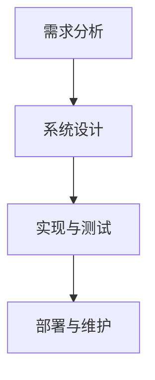
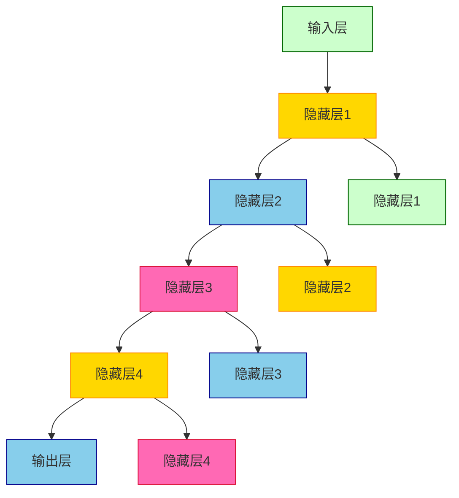

                 

### 文章标题

近年来，人工智能（AI）在各个领域的应用日益广泛，从医疗健康到娱乐创意，AI 正在改变我们的生活方式。作为全球科技领域的领军企业，苹果公司一直致力于将 AI 技术融入其产品与服务中，为用户带来更智能、更便捷的体验。本文将深入探讨苹果公司发布的 AI 应用，通过逻辑清晰的步骤分析，揭示苹果 AI 应用的核心原理、应用实例及未来展望。

### 关键词

- 苹果AI
- 人工智能应用
- 智能手机
- 健康领域
- 教育领域
- 娱乐领域
- 开发实践
- 未来展望

### 摘要

本文首先概述了苹果的 AI 战略与布局，分析了苹果 AI 技术的核心原理，并详细解析了苹果 AI 在智能手机、健康、教育、娱乐等领域的应用实例。随后，文章将探讨苹果 AI 应用背后的开发实践与未来展望，为读者提供对苹果 AI 应用全景式的理解和洞察。

# 《李开复：苹果发布AI应用的应用》目录大纲

## 第一部分：苹果与AI的融合

### 第1章：苹果的AI战略与布局

#### 1.1 苹果AI战略概述

- **内容概述**：介绍苹果公司如何将 AI 作为核心战略，推动产品与服务创新。
- **核心概念与联系**：苹果 AI 战略的目标、愿景和主要策略。

#### 1.2 苹果AI布局分析

- **内容概述**：分析苹果公司在 AI 领域的技术布局，包括硬件、软件和生态系统。
- **核心概念与联系**：苹果 AI 布局的组成部分和关键技术。

#### 1.3 苹果AI发展的优势与挑战

- **内容概述**：探讨苹果 AI 发展的优势和面临的挑战。
- **核心概念与联系**：苹果 AI 发展的驱动力、潜在障碍和解决方案。

### 第2章：苹果AI技术的核心原理

#### 2.1 AI基础知识与原理

- **内容概述**：介绍人工智能的基本概念和原理，为后续分析提供理论基础。
- **核心概念与联系**：机器学习、深度学习、神经网络等基础知识。

#### 2.2 苹果AI技术特点

- **内容概述**：分析苹果 AI 技术的特点，包括性能、效率、安全性等方面。
- **核心概念与联系**：苹果 AI 技术的优势和独特之处。

#### 2.3 苹果AI技术架构详解

- **内容概述**：详细解析苹果 AI 技术的架构，包括硬件、软件和算法层面。
- **核心概念与联系**：苹果 AI 技术的整体架构和工作原理。

### 第3章：苹果AI在智能手机中的应用

#### 3.1 Siri与语音识别

- **内容概述**：介绍 Siri 的语音识别技术及其在苹果智能手机中的应用。
- **核心概念与联系**：语音识别技术的工作原理和苹果的优化策略。

#### 3.2 个性化推荐系统

- **内容概述**：分析苹果在智能手机中使用的个性化推荐系统。
- **核心概念与联系**：推荐系统的原理、算法和应用。

#### 3.3 图像识别与增强现实

- **内容概述**：探讨苹果在智能手机中应用的图像识别与增强现实技术。
- **核心概念与联系**：图像识别技术、增强现实应用及其对用户体验的提升。

## 第二部分：苹果AI应用的实例解析

### 第4章：苹果AI在健康领域的应用

#### 4.1 健康数据管理与分析

- **内容概述**：介绍苹果 AI 在健康数据管理与分析中的应用。
- **核心概念与联系**：健康数据管理、数据分析技术和应用场景。

#### 4.2 健康预测与预警

- **内容概述**：探讨苹果 AI 在健康预测与预警方面的应用。
- **核心概念与联系**：健康预测模型、预警系统和技术实现。

#### 4.3 健康管理服务的创新

- **内容概述**：分析苹果 AI 对健康管理服务的创新。
- **核心概念与联系**：健康管理服务、创新模式和技术驱动。

### 第5章：苹果AI在教育领域的应用

#### 5.1 智能教学系统

- **内容概述**：介绍苹果 AI 在智能教学系统中的应用。
- **核心概念与联系**：智能教学系统的原理、功能和优势。

#### 5.2 个性化学习推荐

- **内容概述**：分析苹果 AI 在个性化学习推荐中的应用。
- **核心概念与联系**：个性化推荐系统、学习行为分析和学习效果提升。

#### 5.3 虚拟实验室与互动学习

- **内容概述**：探讨苹果 AI 在虚拟实验室与互动学习中的应用。
- **核心概念与联系**：虚拟实验室、互动学习技术及其在教育中的应用价值。

### 第6章：苹果AI在娱乐与创意领域的应用

#### 6.1 创意内容生成

- **内容概述**：介绍苹果 AI 在创意内容生成中的应用。
- **核心概念与联系**：创意内容生成技术、算法和应用场景。

#### 6.2 虚拟现实与增强现实游戏

- **内容概述**：分析苹果 AI 在虚拟现实与增强现实游戏中的应用。
- **核心概念与联系**：VR/AR游戏技术、用户体验和娱乐价值。

#### 6.3 AI驱动的音乐创作

- **内容概述**：探讨苹果 AI 在音乐创作中的应用。
- **核心概念与联系**：音乐创作算法、生成音乐的技术和艺术价值。

## 第三部分：苹果AI应用的实践与展望

### 第7章：苹果AI应用的开发实践

#### 7.1 开发环境与工具

- **内容概述**：介绍苹果 AI 应用开发所需的环境与工具。
- **核心概念与联系**：开发环境、工具和技术栈。

#### 7.2 应用案例解析

- **内容概述**：解析苹果 AI 应用的实际案例。
- **核心概念与联系**：应用案例的技术实现、优势和挑战。

#### 7.3 AI应用开发流程

- **内容概述**：分析苹果 AI 应用的开发流程。
- **核心概念与联系**：开发流程、关键环节和最佳实践。

### 第8章：苹果AI应用的未来展望

#### 8.1 AI技术发展趋势

- **内容概述**：探讨人工智能技术的发展趋势。
- **核心概念与联系**：AI技术的新方向、前沿研究和应用前景。

#### 8.2 苹果AI应用的市场前景

- **内容概述**：分析苹果 AI 应用在市场上的前景。
- **核心概念与联系**：市场机会、竞争格局和用户需求。

#### 8.3 AI伦理与社会影响

- **内容概述**：讨论 AI 应用的伦理和社会影响。
- **核心概念与联系**：AI伦理、社会责任和可持续发展。

### 第9章：李开复谈苹果AI应用的影响与挑战

#### 9.1 李开复对苹果AI的评价

- **内容概述**：介绍李开复对苹果 AI 应用的评价。
- **核心概念与联系**：李开复的观点、评价标准和影响因素。

#### 9.2 AI应用中的挑战与对策

- **内容概述**：探讨 AI 应用中面临的挑战及其对策。
- **核心概念与联系**：挑战、应对策略和技术创新。

#### 9.3 AI未来的发展趋势与机遇

- **内容概述**：分析 AI 未来的发展趋势和机遇。
- **核心概念与联系**：未来趋势、市场机遇和战略布局。

## 附录

### 附录A：苹果AI相关资源与工具

#### A.1 开源AI框架

- **内容概述**：介绍常用的开源 AI 框架。
- **核心概念与联系**：开源框架的优势、应用场景和社区支持。

#### A.2 机器学习库

- **内容概述**：分析常用的机器学习库。
- **核心概念与联系**：机器学习库的功能、特点和使用场景。

#### A.3 数据集与工具

- **内容概述**：介绍常用的数据集和工具。
- **核心概念与联系**：数据集的类型、工具的功能和使用方法。

### 附录B：苹果AI应用代码示例

#### B.1 健康数据管理示例

- **内容概述**：展示健康数据管理的代码实现。
- **核心概念与联系**：数据预处理、模型训练和预测过程。

#### B.2 个性化推荐系统示例

- **内容概述**：展示个性化推荐系统的代码实现。
- **核心概念与联系**：用户行为分析、推荐算法和应用。

#### B.3 图像识别与增强现实示例

- **内容概述**：展示图像识别与增强现实的代码实现。
- **核心概念与联系**：图像处理、模型训练和应用场景。

### 附录C：AI大模型核心概念与联系

#### C.1 大模型概述

- **内容概述**：介绍大模型的定义、发展历程和应用领域。
- **核心概念与联系**：大模型的定义、核心技术和应用场景。

#### C.2 大模型核心原理

- **内容概述**：分析大模型的核心原理，包括神经网络基础、机器学习算法和深度学习架构。
- **核心概念与联系**：神经网络、机器学习、深度学习的基本概念和联系。

#### C.3 大模型架构与联系

- **内容概述**：详细解析大模型的架构，包括神经网络结构、机器学习算法和深度学习架构的联系。
- **核心概念与联系**：神经网络、机器学习、深度学习在架构上的联系和协同作用。

### 附录D：核心算法原理讲解

#### D.1 神经网络与深度学习基础

- **内容概述**：讲解神经网络和深度学习的基础概念，包括神经网络的基本结构、深度学习架构和神经网络训练过程。
- **核心概念与联系**：神经网络、深度学习的基本概念和联系。

#### D.2 自然语言处理技术

- **内容概述**：介绍自然语言处理技术，包括词嵌入技术、序列模型与注意力机制和转换器架构。
- **核心概念与联系**：自然语言处理技术的基本概念和联系。

#### D.3 大规模预训练模型原理

- **内容概述**：探讨大规模预训练模型的原理，包括预训练的概念与意义、自监督学习方法和迁移学习与微调技术。
- **核心概念与联系**：预训练模型的基本概念和联系。

### 附录E：数学模型与公式详解

#### E.1 神经网络中的数学模型

- **内容概述**：讲解神经网络中的数学模型，包括激活函数、损失函数和优化算法。
- **核心概念与联系**：神经网络的数学模型及其联系。

#### E.2 自然语言处理中的数学模型

- **内容概述**：介绍自然语言处理中的数学模型，包括词嵌入、序列标注和注意力机制。
- **核心概念与联系**：自然语言处理中的数学模型及其联系。

### 附录F：项目实战

#### F.1 智能健康管理系统

- **内容概述**：介绍智能健康管理系统的项目实战，包括项目背景与目标、数据集与预处理、模型设计与实现、模型训练与优化和项目效果评估。
- **核心概念与联系**：智能健康管理系统的技术实现和应用效果。

#### F.2 个性化推荐系统

- **内容概述**：介绍个性化推荐系统的项目实战，包括项目背景与目标、用户行为数据收集与处理、模型选择与实现、模型评估与优化和项目效果评估。
- **核心概念与联系**：个性化推荐系统的技术实现和应用效果。

#### F.3 增强现实应用

- **内容概述**：介绍增强现实应用的项目实战，包括项目背景与目标、数据集与预处理、模型设计与实现、模型训练与优化和项目效果评估。
- **核心概念与联系**：增强现实应用的技术实现和应用效果。

### 附录G：开发环境与工具

#### G.1 开发环境搭建

- **内容概述**：介绍苹果 AI 应用开发所需的开发环境搭建，包括操作系统、编程语言、机器学习框架和数据预处理工具。
- **核心概念与联系**：开发环境搭建的基本概念和步骤。

#### G.2 常用工具介绍

- **内容概述**：介绍苹果 AI 应用开发中常用的工具，包括Jupyter Notebook、PyCharm、TensorFlow、Keras和其他相关工具。
- **核心概念与联系**：常用工具的功能、特点和使用方法。

---

## 第一部分：苹果与AI的融合

### 第1章：苹果的AI战略与布局

#### 1.1 苹果AI战略概述

**内容概述**

苹果公司自成立之初便以用户体验为核心，致力于为用户打造无缝、智能的科技产品。近年来，随着人工智能技术的迅猛发展，苹果公司敏锐地意识到 AI 在未来科技领域的巨大潜力，并将其作为公司发展的核心战略。在这一背景下，苹果公司逐步构建了全面的 AI 战略，旨在通过 AI 技术提升产品和服务质量，为用户带来更加智能化、便捷化的体验。

**核心概念与联系**

苹果 AI 战略的目标是：

- **提升用户体验**：通过 AI 技术优化产品和服务，提供更加个性化和智能化的解决方案。
- **创新产品与服务**：利用 AI 技术推动产品创新，打造具有竞争力的新型产品和服务。
- **增强竞争力**：通过 AI 技术提升公司整体竞争力，保持在科技领域的领先地位。

为实现上述目标，苹果公司采取了一系列策略：

- **投资研发**：持续加大在 AI 领域的科研投入，引进顶级 AI 人才，打造强大的研发团队。
- **技术积累**：不断积累和拓展 AI 技术栈，包括深度学习、自然语言处理、计算机视觉等，确保技术领先。
- **跨部门合作**：促进不同部门之间的合作，将 AI 技术应用于产品和服务全链条，实现全方位赋能。

#### 1.2 苹果AI布局分析

**内容概述**

苹果公司在 AI 领域的布局涉及多个方面，包括硬件、软件和生态系统。通过整合资源、优化流程，苹果公司构建了一个全方位、多层次的人工智能布局，为 AI 应用的落地提供了坚实的基础。

**核心概念与联系**

苹果 AI 布局的组成部分如下：

- **硬件层面**：苹果公司拥有自研的芯片，如 A 系列处理器和 M 系列 Mac 处理器，这些芯片集成了强大的 AI 计算能力，为 AI 应用提供了高性能计算基础。

- **软件层面**：苹果公司开发了多个 AI 相关软件框架和工具，如 Core ML、Create ML 等，这些工具帮助开发者将 AI 模型集成到 iOS、macOS 等平台中，实现高效、灵活的 AI 应用开发。

- **生态系统层面**：苹果公司通过构建开放的开发者生态系统，鼓励第三方开发者利用 AI 技术开发创新应用，推动 AI 应用的广泛普及。

苹果 AI 布局的优点包括：

- **高性能计算**：通过自研芯片，苹果公司实现了高性能的 AI 计算能力，为 AI 应用提供了强大的技术支持。
- **软件与硬件协同**：苹果公司通过软件和硬件的深度整合，实现了 AI 技术的优化和应用，提升了用户体验。
- **开放生态**：苹果公司构建了开放的生态系统，吸引了大量第三方开发者参与，推动了 AI 应用的创新和普及。

#### 1.3 苹果AI发展的优势与挑战

**内容概述**

苹果公司在 AI 领域的发展具有诸多优势，同时也面临一定的挑战。本文将分析苹果 AI 发展的优势和挑战，以期为后续章节的讨论提供背景和依据。

**核心概念与联系**

**优势**：

- **技术积累**：苹果公司在 AI 领域的技术积累深厚，具备较强的技术创新能力。
- **软硬件协同**：苹果公司通过软硬件深度整合，实现了 AI 技术的优化和应用。
- **用户体验**：苹果公司注重用户体验，通过 AI 技术提升产品的智能化和个性化。
- **生态优势**：苹果公司构建了开放的生态系统，吸引了大量第三方开发者参与。

**挑战**：

- **市场竞争**：在 AI 领域，苹果公司面临来自 Google、Facebook、Microsoft 等竞争对手的激烈竞争。
- **技术更新**：AI 领域技术更新速度快，苹果公司需要不断投入研发，保持技术领先。
- **数据隐私**：AI 应用需要大量数据支持，如何在保护用户隐私的同时获取数据是一个重要挑战。
- **伦理问题**：AI 应用涉及伦理问题，如何确保 AI 技术的公平、透明和可靠是一个重要议题。

#### 1.4 结论

**内容概述**

通过对苹果 AI 战略与布局的分析，我们可以看到苹果公司已经在 AI 领域取得了显著的成果，并在多个方面展现出明显的优势。然而，面对激烈的市场竞争和技术挑战，苹果公司仍需不断投入研发，优化产品和服务，以保持其在 AI 领域的领先地位。

**核心概念与联系**

本文主要讨论了以下几个方面：

- 苹果 AI 战略的目标、愿景和主要策略。
- 苹果公司在 AI 领域的技术布局，包括硬件、软件和生态系统。
- 苹果 AI 发展的优势和挑战。

通过这些讨论，我们为后续章节的深入分析奠定了基础，也为读者提供了对苹果 AI 领域的全面了解。

## 第二部分：苹果AI技术的核心原理

### 第2章：苹果AI技术的核心原理

#### 2.1 AI基础知识与原理

**内容概述**

人工智能（AI）作为当今科技领域的一个重要分支，已经深刻影响了我们的生活和工作方式。AI 的基础知识与原理为我们理解苹果 AI 技术提供了理论基础。本节将介绍 AI 的基本概念、核心算法和关键应用，为后续章节的深入讨论打下基础。

**核心概念与联系**

- **人工智能定义**：人工智能是指通过计算机模拟人类智能行为的能力，包括感知、推理、学习、决策和交互等。
- **核心算法**：人工智能的核心算法包括机器学习、深度学习和自然语言处理等。
  - **机器学习**：机器学习是一种让计算机通过数据学习规律并做出决策的技术，分为监督学习、无监督学习和强化学习。
  - **深度学习**：深度学习是机器学习的一种重要分支，通过多层神经网络模型模拟人类大脑的学习过程，具有强大的特征提取和模式识别能力。
  - **自然语言处理**：自然语言处理是使计算机能够理解、生成和处理人类语言的技术，包括文本分类、语音识别、机器翻译等。

- **关键应用**：人工智能在多个领域有广泛应用，如智能语音助手、自动驾驶、医疗诊断、金融风控等。

#### 2.2 苹果AI技术特点

**内容概述**

苹果公司在 AI 技术研发方面具有独特的优势，其 AI 技术特点主要体现在性能、效率、安全性等方面。本节将分析苹果 AI 技术的特点，探讨其优势和应用场景。

**核心概念与联系**

- **高性能计算**：苹果公司自主研发的芯片（如 A 系列、M 系列）具有强大的计算能力，能够满足复杂 AI 模型的计算需求，实现高效性能。
- **低功耗设计**：苹果 AI 技术在保证高性能的同时，注重功耗控制，使设备在运行 AI 应用时更加节能。
- **安全性**：苹果公司注重数据安全和用户隐私保护，通过加密技术、安全协议等手段确保 AI 应用中的数据安全。
- **用户体验**：苹果 AI 技术强调用户体验，通过智能化的设计和交互方式，提升用户的使用便利性和满意度。

#### 2.3 苹果AI技术架构详解

**内容概述**

苹果 AI 技术的架构涵盖了硬件、软件和算法等多个层面，实现了软硬件协同优化。本节将详细解析苹果 AI 技术的架构，分析其关键组件和协同工作方式。

**核心概念与联系**

- **硬件层面**：苹果公司自主研发的芯片（如 A 系列、M 系列）集成了强大的 AI 处理单元，支持高性能计算和低功耗运行。
- **软件层面**：苹果公司开发了多个 AI 相关软件框架和工具（如 Core ML、Create ML 等），提供便捷的 AI 模型集成和优化。
- **算法层面**：苹果 AI 技术采用了多种先进的机器学习、深度学习和自然语言处理算法，实现智能化的功能和应用。

**协同工作方式**：

- **软硬件协同**：硬件和软件的深度整合，实现 AI 模型的快速部署和高效运行。
- **端到端优化**：从芯片设计到软件框架，苹果公司进行端到端优化，提升整体性能和用户体验。
- **数据闭环**：通过设备收集用户数据，进行模型训练和优化，实现个性化的智能服务。

#### 2.4 结论

**内容概述**

通过对苹果 AI 技术核心原理的分析，我们可以看到苹果公司在 AI 领域的技术实力和创新能力。苹果 AI 技术的特点和架构使其在智能手机、健康、教育、娱乐等领域具有广泛的应用前景。

**核心概念与联系**

本文主要讨论了以下几个方面：

- **AI 基础知识与原理**：介绍了人工智能的定义、核心算法和关键应用。
- **苹果 AI 技术特点**：分析了苹果 AI 技术在性能、效率、安全性等方面的优势。
- **苹果 AI 技术架构详解**：详细解析了苹果 AI 技术的硬件、软件和算法层面，以及协同工作方式。

通过这些讨论，我们为后续章节的深入分析奠定了基础，也为读者提供了对苹果 AI 技术的全面了解。

## 第三部分：苹果AI在智能手机中的应用

### 第3章：苹果AI在智能手机中的应用

#### 3.1 Siri与语音识别

**内容概述**

Siri 是苹果公司的一款智能语音助手，通过语音识别技术实现与用户的互动。本节将介绍 Siri 的语音识别技术及其在苹果智能手机中的应用，分析其核心技术和工作原理。

**核心概念与联系**

- **语音识别技术**：语音识别技术是指将语音信号转换为文本信息的技术，主要依赖于语音信号处理、特征提取和模式识别等算法。
- **Siri 的工作原理**：Siri 通过以下几个步骤实现语音识别和响应：
  1. **语音信号采集**：用户说出指令，麦克风采集语音信号。
  2. **信号处理**：通过音频预处理，去除噪声和干扰，提高语音信号质量。
  3. **特征提取**：提取语音信号中的关键特征，如频谱特征、倒谱特征等。
  4. **模式识别**：利用深度学习模型，对提取的特征进行模式识别，将语音信号转换为文本。
  5. **语义理解与响应**：根据转换得到的文本，理解用户意图，生成合适的响应。

**Siri 的核心技术**：

- **深度神经网络**：Siri 使用深度神经网络进行语音识别和模式识别，提高了识别准确率和鲁棒性。
- **端到端训练**：Siri 采用端到端训练方式，将多个模块集成到一个神经网络中，减少了中间层的依赖，提高了整体性能。
- **自适应学习**：Siri 具有自适应学习能力，可以不断优化自身模型，提升语音识别效果。

#### 3.2 个性化推荐系统

**内容概述**

个性化推荐系统是苹果智能手机中的一项重要功能，通过分析用户行为和偏好，为用户推荐感兴趣的内容。本节将分析苹果个性化推荐系统的原理、算法和应用，探讨其核心技术和实现方式。

**核心概念与联系**

- **推荐系统原理**：推荐系统是指通过分析用户行为和偏好，为用户推荐感兴趣的内容或商品的技术。
  - **协同过滤**：协同过滤是推荐系统的一种常用方法，通过分析用户之间的相似度，预测用户对未知内容的兴趣。
  - **基于内容的推荐**：基于内容的推荐通过分析内容特征，为用户推荐与已知偏好相似的内容。
  - **混合推荐**：混合推荐结合协同过滤和基于内容的推荐方法，提高推荐准确率。

- **推荐算法**：
  - **协同过滤算法**：常用的协同过滤算法包括基于用户的协同过滤和基于物品的协同过滤。
  - **矩阵分解**：矩阵分解是一种有效的协同过滤算法，通过分解用户-物品评分矩阵，提取用户和物品的特征，预测用户对未知物品的兴趣。
  - **深度学习算法**：深度学习算法在推荐系统中也得到了广泛应用，如基于深度神经网络的推荐模型。

- **应用场景**：
  - **应用商店**：为用户推荐符合其兴趣的应用。
  - **新闻推送**：根据用户阅读习惯，为用户推荐感兴趣的新闻内容。
  - **音乐推荐**：根据用户听歌习惯，为用户推荐喜欢的音乐。

**核心技术和实现方式**：

- **数据采集**：收集用户在智能手机上的行为数据，如应用使用记录、浏览历史、搜索关键词等。
- **特征工程**：对采集到的数据进行分析和特征提取，构建用户和物品的特征向量。
- **模型训练与优化**：利用训练数据，训练推荐模型，并对模型进行优化，提高推荐准确率。
- **实时推荐**：根据用户实时行为，动态调整推荐策略，实现实时推荐。

#### 3.3 图像识别与增强现实

**内容概述**

图像识别与增强现实是苹果智能手机中的另一项重要功能，通过计算机视觉技术，实现图像处理和现实增强。本节将介绍苹果在图像识别和增强现实领域的核心技术，分析其在智能手机中的应用和用户体验。

**核心概念与联系**

- **图像识别技术**：图像识别技术是指通过计算机算法，对图像中的物体、场景、人脸等进行识别和分类的技术。
  - **特征提取**：提取图像中的关键特征，如边缘、纹理、颜色等。
  - **分类算法**：利用分类算法，对提取的特征进行分类，识别图像中的物体或场景。
  - **目标检测**：目标检测是在图像中识别和定位特定目标的技术，常用于人脸识别、物体识别等。

- **增强现实技术**：增强现实技术是指在现实场景中叠加虚拟信息，为用户提供更加丰富、互动的体验。
  - **场景理解**：通过计算机视觉技术，理解现实场景中的物体、人物等信息。
  - **虚拟信息叠加**：根据场景理解结果，叠加虚拟信息，如文字、图像、动画等。
  - **实时交互**：通过触摸、手势等交互方式，实现用户与虚拟信息的实时互动。

**应用和用户体验**：

- **人脸识别**：苹果智能手机通过面部识别技术，实现快速解锁和安全认证，提高了用户体验。
- **AR 应用**：苹果的 AR 应用如《Apple ARKit》提供了丰富的 AR 内容，用户可以通过智能手机体验虚拟现实游戏、教育应用等。
- **图像编辑**：图像识别技术在图像编辑中也有广泛应用，如自动识别图像中的物体并进行编辑。

**核心技术和实现方式**：

- **深度学习模型**：苹果采用深度学习模型，如卷积神经网络（CNN），实现图像识别和目标检测。
- **实时处理**：通过高性能计算和优化算法，实现实时图像处理和增强现实效果。
- **用户交互**：通过触摸、手势等交互方式，实现用户与图像和增强现实的实时互动。

#### 3.4 结论

**内容概述**

通过对苹果 AI 在智能手机中的应用分析，我们可以看到苹果公司在语音识别、个性化推荐和图像识别与增强现实等领域取得了显著成果。这些 AI 技术的应用，不仅提升了用户体验，也为智能手机的功能拓展和创新提供了新的思路。

**核心概念与联系**

本文主要讨论了以下几个方面：

- **Siri 与语音识别**：介绍了 Siri 的语音识别技术及其在智能手机中的应用。
- **个性化推荐系统**：分析了苹果个性化推荐系统的原理、算法和应用。
- **图像识别与增强现实**：介绍了苹果在图像识别和增强现实领域的核心技术及其应用。

通过这些讨论，我们为后续章节的深入分析奠定了基础，也为读者提供了对苹果 AI 在智能手机中的应用的全面了解。

## 第二部分：苹果AI应用的实例解析

### 第4章：苹果AI在健康领域的应用

#### 4.1 健康数据管理与分析

**内容概述**

苹果公司通过 AI 技术在健康数据管理与分析方面取得了显著成果，为用户提供了更加智能、个性化的健康服务。本节将介绍苹果在健康数据管理与分析中的应用，分析其核心技术、数据来源和处理方法。

**核心概念与联系**

- **健康数据管理**：健康数据管理是指对健康数据（如心率、运动数据、睡眠数据等）进行采集、存储、处理和管理的技术。
  - **数据采集**：通过苹果的智能设备（如 Apple Watch、iPhone 等），实时采集用户健康数据。
  - **数据存储**：将采集到的健康数据存储在云端，以便进行后续分析和处理。
  - **数据共享**：用户可以选择与健康应用共享数据，实现跨设备的数据同步。

- **数据分析**：数据分析是指利用数据分析技术，对健康数据进行处理、挖掘和分析，提取有价值的信息。
  - **数据预处理**：对采集到的健康数据进行清洗、归一化和去噪等预处理操作，提高数据质量。
  - **特征提取**：从预处理后的数据中提取关键特征，如心率变异性、睡眠质量等。
  - **模式识别**：利用机器学习算法，对提取的特征进行模式识别，发现用户健康趋势和异常情况。

**核心技术**：

- **深度学习**：深度学习技术在健康数据分析中得到了广泛应用，如用于心率变异性分析和睡眠质量评估。
- **自然语言处理**：自然语言处理技术用于分析用户在健康应用中的文本输入，如日记记录、症状描述等。

**数据来源和处理方法**：

- **数据来源**：健康数据主要来源于用户的智能设备，如 Apple Watch、iPhone 等。
- **数据处理方法**：
  1. **数据采集**：通过设备传感器（如心率传感器、加速度传感器等）实时采集健康数据。
  2. **数据传输**：将采集到的数据传输到云端，使用加密技术确保数据安全。
  3. **数据存储**：将数据存储在云数据库中，便于后续分析和处理。
  4. **数据分析**：利用云计算平台和数据分析工具，对数据进行处理和分析。

#### 4.2 健康预测与预警

**内容概述**

苹果公司在健康预测与预警方面也取得了重要进展，通过 AI 技术对用户健康数据进行预测和分析，提前发现潜在的健康问题。本节将介绍苹果在健康预测与预警中的应用，分析其核心技术、预测模型和预警策略。

**核心概念与联系**

- **健康预测与预警**：健康预测与预警是指利用数据分析技术，对用户健康数据进行预测和分析，提前发现潜在的健康问题。
  - **预测模型**：构建预测模型，对用户健康数据进行分析和预测。
  - **预警策略**：设定预警阈值，当预测结果超过阈值时，向用户发出健康预警。

**核心技术**：

- **机器学习**：机器学习技术用于构建预测模型，如用于预测心率异常、睡眠质量下降等。
- **数据挖掘**：数据挖掘技术用于挖掘用户健康数据中的潜在规律和关联，提高预测准确率。

**预测模型和预警策略**：

- **预测模型**：
  1. **时间序列预测**：利用时间序列分析方法，对用户健康数据进行预测。
  2. **回归分析**：利用回归分析方法，建立健康数据与预测结果之间的关系。
  3. **分类分析**：利用分类分析方法，对健康数据分类，提高预测精度。

- **预警策略**：
  1. **阈值设定**：根据预测模型的结果，设定预警阈值。
  2. **预警机制**：当预测结果超过阈值时，向用户发出健康预警，提示用户关注健康问题。
  3. **反馈机制**：用户可以反馈预警结果，帮助优化预测模型和预警策略。

#### 4.3 健康管理服务的创新

**内容概述**

苹果公司在健康管理服务方面不断创新，通过 AI 技术提供个性化、智能化的健康服务，提升用户健康水平。本节将介绍苹果在健康管理服务中的创新，分析其核心技术和应用效果。

**核心概念与联系**

- **健康管理服务**：健康管理服务是指通过技术手段，为用户提供个性化、智能化的健康服务。
  - **个性化服务**：根据用户健康数据，为用户提供定制化的健康建议和指导。
  - **智能化服务**：利用 AI 技术实现健康服务的自动化和智能化，提高服务效率和质量。

**核心技术**：

- **自然语言处理**：自然语言处理技术用于理解和处理用户输入，为用户提供智能问答和健康咨询。
- **深度学习**：深度学习技术用于构建个性化健康模型，为用户提供精准的健康预测和预警。

**应用效果**：

- **健康咨询**：用户可以通过苹果健康管理应用，与医生进行在线咨询，获取专业的健康建议。
- **健康监测**：通过智能设备，实时监测用户健康数据，为用户提供个性化的健康监测和预警服务。
- **健康数据分析**：利用大数据和人工智能技术，对用户健康数据进行全面分析，发现潜在的健康风险，提供针对性的健康建议。

**案例分析**：

- **Apple Health**：Apple Health 是苹果公司推出的健康管理应用，通过整合用户健康数据，提供全面的健康监测、分析和建议。Apple Health 的成功展示了 AI 技术在健康管理服务中的应用潜力。

**结论**

**内容概述**

通过对苹果 AI 在健康领域应用实例的解析，我们可以看到苹果公司通过 AI 技术在健康数据管理与分析、健康预测与预警以及健康管理服务创新方面取得了显著成果。这些应用不仅提升了用户体验，也为用户提供了更加智能、个性化的健康服务。

**核心概念与联系**

本文主要讨论了以下几个方面：

- **健康数据管理与分析**：介绍了苹果在健康数据管理与分析中的应用，分析了核心技术、数据来源和处理方法。
- **健康预测与预警**：介绍了苹果在健康预测与预警中的应用，分析了核心技术、预测模型和预警策略。
- **健康管理服务的创新**：介绍了苹果在健康管理服务中的创新，分析了核心技术和应用效果。

通过这些讨论，我们为后续章节的深入分析奠定了基础，也为读者提供了对苹果 AI 在健康领域应用的全面了解。

### 第5章：苹果AI在教育领域的应用

#### 5.1 智能教学系统

**内容概述**

苹果公司在教育领域积极推动 AI 技术的应用，开发了智能教学系统，旨在提高教学效果和学生参与度。本节将介绍苹果智能教学系统的原理、应用场景和技术优势。

**核心概念与联系**

- **智能教学系统**：智能教学系统是一种利用 AI 技术优化教学过程、提高教学质量的教学系统。
  - **自适应学习**：根据学生的个性化需求和知识水平，智能教学系统可以调整教学内容和难度，实现个性化教学。
  - **互动式学习**：智能教学系统提供丰富的互动功能，如在线讨论、实时反馈等，增强学生的学习体验。

- **应用场景**：
  - **课堂管理**：教师可以通过智能教学系统管理课堂纪律、实时监控学生的学习状态。
  - **作业批改**：智能教学系统可以自动批改作业，提供即时反馈，减轻教师负担。
  - **个性化辅导**：根据学生的学习情况，智能教学系统提供个性化的辅导方案，帮助学生提高学习效果。

- **技术优势**：
  - **数据驱动**：智能教学系统通过分析学生的学习行为数据，为教学提供数据支持，实现精准教学。
  - **安全性**：苹果公司注重数据安全，确保学生在使用智能教学系统时的隐私保护。

**智能教学系统的工作原理**：

1. **数据收集**：通过传感器、互动设备和在线平台，智能教学系统收集学生的行为数据，如答题情况、学习时长、参与度等。
2. **数据分析**：利用机器学习算法，对收集到的数据进行分析，识别学生的学习特点和问题。
3. **决策生成**：根据数据分析结果，智能教学系统生成个性化的教学建议和辅导方案。
4. **实时反馈**：通过在线平台和互动设备，智能教学系统实时向学生和教师提供反馈，优化教学过程。

#### 5.2 个性化学习推荐

**内容概述**

苹果公司在教育领域还推出了个性化学习推荐系统，旨在为学生提供符合其兴趣和需求的学习资源。本节将分析个性化学习推荐系统的原理、算法和应用效果。

**核心概念与联系**

- **个性化学习推荐系统**：个性化学习推荐系统是一种利用数据挖掘和推荐算法，为学生推荐个性化学习资源的系统。
  - **推荐算法**：个性化学习推荐系统常用的算法包括协同过滤、基于内容的推荐和混合推荐等。
  - **推荐结果**：个性化学习推荐系统根据学生的学习行为和偏好，推荐相应的学习资源，如课程、练习题、教学视频等。

- **应用效果**：
  - **提高学习兴趣**：通过推荐符合学生兴趣的学习资源，个性化学习推荐系统可以激发学生的学习兴趣和积极性。
  - **优化学习路径**：个性化学习推荐系统根据学生的学习进度和需求，推荐合适的学习资源，帮助学生构建合理的知识体系。

**个性化学习推荐系统的原理**：

1. **数据采集**：通过学生的学习行为数据（如课程选择、作业完成情况、学习时长等）收集学生兴趣和学习需求。
2. **数据预处理**：对采集到的数据进行分析和清洗，提取关键特征，如课程类别、知识点难度、学习时长等。
3. **推荐算法**：利用协同过滤、基于内容的推荐或混合推荐算法，根据学生特征和资源特征生成推荐列表。
4. **推荐结果展示**：将推荐结果展示给学生，引导学生进行学习。

**案例分析**：

- **Apple Schoolwork**：Apple Schoolwork 是苹果公司推出的个性化学习推荐系统，通过整合 Apple ID、课程和作业应用，为教师和学生提供个性化的学习资源和指导。Apple Schoolwork 的成功应用展示了个性化学习推荐系统在提高教学效果和学生参与度方面的潜力。

#### 5.3 虚拟实验室与互动学习

**内容概述**

苹果公司在教育领域还探索了虚拟实验室和互动学习，通过 AI 技术提供沉浸式、互动式的学习体验。本节将介绍虚拟实验室和互动学习的基本概念、应用场景和技术实现。

**核心概念与联系**

- **虚拟实验室**：虚拟实验室是一种利用计算机模拟技术，为学生提供虚拟实验环境和实验操作的平台。
  - **实验模拟**：通过虚拟实验室，学生可以模拟真实的实验操作，观察实验结果，加深对实验原理的理解。
  - **实验拓展**：虚拟实验室可以模拟各种实验场景，拓展学生的实验经验，提高实验技能。

- **互动学习**：互动学习是一种通过互动设备和在线平台，促进学生与教师、同学之间互动和合作的学习方式。
  - **互动工具**：互动学习使用各种互动工具（如讨论区、直播课堂、在线测试等），增强学生的学习体验和参与度。
  - **协作学习**：通过互动学习，学生可以与同学共同完成学习任务，培养合作能力和团队精神。

- **技术实现**：
  - **虚拟现实（VR）**：虚拟现实技术为虚拟实验室和互动学习提供了沉浸式的学习体验，使学生如身临其境。
  - **增强现实（AR）**：增强现实技术将虚拟信息叠加到现实场景中，提供更加丰富的学习体验。
  - **人工智能**：人工智能技术用于分析学生的学习行为和互动数据，优化学习过程和互动效果。

**应用场景**：

- **科学教育**：虚拟实验室和互动学习在科学教育中得到了广泛应用，如物理、化学、生物等实验课程。
- **编程教育**：通过虚拟实验室和互动学习，学生可以在线编程、调试代码，提高编程技能和问题解决能力。
- **跨学科教育**：虚拟实验室和互动学习可以跨学科应用，如将编程与科学实验结合，培养学生的综合能力。

**案例分析**：

- **Apple Teacher**：Apple Teacher 是苹果公司推出的一款教育工具，通过虚拟实验室和互动学习功能，为学生提供沉浸式、互动式的学习体验。Apple Teacher 的成功应用展示了虚拟实验室和互动学习在提高教学效果和学生参与度方面的潜力。

**结论**

**内容概述**

通过对苹果 AI 在教育领域应用实例的解析，我们可以看到苹果公司在智能教学系统、个性化学习推荐和虚拟实验室与互动学习方面取得了显著成果。这些 AI 应用不仅提升了教学效果和学生参与度，也为教育领域带来了新的发展机遇。

**核心概念与联系**

本文主要讨论了以下几个方面：

- **智能教学系统**：介绍了苹果智能教学系统的原理、应用场景和技术优势。
- **个性化学习推荐**：分析了个性化学习推荐系统的原理、算法和应用效果。
- **虚拟实验室与互动学习**：介绍了虚拟实验室和互动学习的基本概念、应用场景和技术实现。

通过这些讨论，我们为后续章节的深入分析奠定了基础，也为读者提供了对苹果 AI 在教育领域应用的全面了解。

### 第6章：苹果AI在娱乐与创意领域的应用

#### 6.1 创意内容生成

**内容概述**

苹果公司通过 AI 技术在娱乐与创意领域实现了创意内容生成的突破，为用户提供更加丰富、个性化的娱乐体验。本节将介绍苹果在创意内容生成中的应用，分析其核心技术、算法和应用场景。

**核心概念与联系**

- **创意内容生成**：创意内容生成是指利用 AI 技术生成音乐、图像、视频等创意内容，为用户提供新的创作体验。
  - **音乐生成**：通过 AI 技术生成音乐，如钢琴曲、流行歌曲等，为音乐创作提供新的灵感。
  - **图像生成**：通过 AI 技术生成图像，如风景画、抽象画等，为艺术创作提供新的表现形式。
  - **视频生成**：通过 AI 技术生成视频，如动画、电影片段等，为影视创作提供新的创作手段。

- **应用场景**：
  - **音乐创作**：音乐家可以通过 AI 生成的旋律和节奏，丰富自己的音乐创作。
  - **艺术创作**：艺术家可以通过 AI 生成的图像和样式，探索新的艺术表现形式。
  - **游戏开发**：游戏开发者可以通过 AI 生成的场景和角色，加快游戏开发过程。

**核心技术**：

- **生成对抗网络（GAN）**：生成对抗网络是一种用于生成图像、音乐等创意内容的 AI 模型，通过生成器和判别器的对抗训练，实现高质量创意内容的生成。
- **变换器架构**：变换器架构是一种用于生成序列数据的 AI 模型，如音乐、文本等，通过编码器和解码器的变换，实现序列数据的生成。

**算法和应用场景**：

1. **音乐生成**：
   - **算法**：使用 GAN 或变换器架构生成音乐，通过训练生成器模型，使其能够生成符合音乐规则的旋律和节奏。
   - **应用场景**：音乐家可以使用生成的旋律进行创作，快速生成音乐样本，提高创作效率。

2. **图像生成**：
   - **算法**：使用 GAN 或变换器架构生成图像，通过训练生成器模型，使其能够生成高质量的图像。
   - **应用场景**：艺术家可以使用生成的图像进行创作，探索新的艺术风格，提高创作表现力。

3. **视频生成**：
   - **算法**：使用变换器架构生成视频，通过训练编码器和解码器模型，实现视频内容的生成。
   - **应用场景**：游戏开发者可以使用生成的视频内容，加快游戏开发过程，提高游戏质量。

**案例分析**：

- **Dall-E**：Dall-E 是苹果公司推出的创意内容生成工具，使用 GAN 和变换器架构生成图像、视频和音乐。Dall-E 的成功应用展示了 AI 技术在创意内容生成领域的巨大潜力。

#### 6.2 虚拟现实与增强现实游戏

**内容概述**

苹果公司在虚拟现实（VR）和增强现实（AR）游戏领域取得了显著进展，通过 AI 技术提升游戏体验和互动效果。本节将介绍苹果在 VR 和 AR 游戏中的应用，分析其核心技术、游戏设计和用户体验。

**核心概念与联系**

- **虚拟现实游戏**：虚拟现实游戏是一种将用户带入虚拟世界的游戏，通过 VR 头戴设备提供沉浸式游戏体验。
  - **游戏设计**：虚拟现实游戏的设计需要考虑虚拟世界的构建、互动方式和用户体验。
  - **用户体验**：虚拟现实游戏为用户提供全新的游戏体验，如沉浸感、互动性等。

- **增强现实游戏**：增强现实游戏是一种在现实世界中叠加虚拟信息的游戏，通过 AR 眼镜或手机屏幕提供增强式游戏体验。
  - **游戏设计**：增强现实游戏的设计需要考虑虚拟信息的叠加、互动方式和现实世界的融合。
  - **用户体验**：增强现实游戏为用户提供了在现实世界中互动的新方式，如互动性、趣味性等。

**核心技术**：

- **计算机视觉**：计算机视觉技术用于识别和跟踪用户在虚拟现实和增强现实游戏中的动作，实现实时交互。
- **深度学习**：深度学习技术用于优化虚拟现实和增强现实游戏中的图像处理和场景识别，提高游戏效果。

**游戏设计和用户体验**：

1. **虚拟现实游戏**：
   - **游戏设计**：虚拟现实游戏的设计需要考虑场景构建、交互方式和用户体验，如实现360度全景视角、空间感知等。
   - **用户体验**：虚拟现实游戏为用户提供身临其境的游戏体验，增强游戏的沉浸感和互动性。

2. **增强现实游戏**：
   - **游戏设计**：增强现实游戏的设计需要考虑虚拟信息与现实世界的融合，如实现虚拟物体的叠加、互动等。
   - **用户体验**：增强现实游戏为用户提供了在现实世界中互动的新方式，增强游戏的趣味性和参与感。

**案例分析**：

- **《Apple AR+》**：《Apple AR+》是苹果公司推出的 AR 游戏平台，通过 AR 技术为用户提供了丰富多彩的游戏体验。平台的成功应用展示了 AI 技术在增强现实游戏领域的巨大潜力。

#### 6.3 AI驱动的音乐创作

**内容概述**

苹果公司通过 AI 技术在音乐创作领域实现了新的突破，为音乐人提供了创新的创作工具。本节将介绍苹果在 AI 驱动的音乐创作中的应用，分析其核心技术、创作流程和作品风格。

**核心概念与联系**

- **AI驱动的音乐创作**：AI驱动的音乐创作是指利用 AI 技术生成音乐旋律、和声、节奏等，辅助音乐人进行创作。
  - **旋律生成**：通过 AI 技术生成旋律，为音乐创作提供新的灵感。
  - **和声生成**：通过 AI 技术生成和声，丰富音乐的表现力。
  - **节奏生成**：通过 AI 技术生成节奏，为音乐创作提供新的节奏感。

- **创作流程**：音乐人在 AI 驱动的音乐创作过程中，可以采用以下步骤：
  - **灵感获取**：通过 AI 生成的旋律、和声、节奏等获取创作灵感。
  - **创作扩展**：根据 AI 生成的音乐元素，进行创作扩展，完善音乐作品。
  - **作品优化**：通过 AI 技术对音乐作品进行优化，提高音乐品质。

**核心技术**：

- **生成对抗网络（GAN）**：生成对抗网络用于生成高质量的音乐旋律、和声、节奏等。
- **变换器架构**：变换器架构用于生成序列音乐数据，如旋律、和声等。

**创作流程和作品风格**：

1. **创作流程**：
   - **灵感获取**：音乐人通过 AI 生成的旋律、和声、节奏等获取创作灵感。
   - **创作扩展**：音乐人根据 AI 生成的音乐元素，进行创作扩展，形成完整的音乐作品。
   - **作品优化**：音乐人通过 AI 技术对音乐作品进行优化，提高音乐品质。

2. **作品风格**：
   - **创新性**：AI 驱动的音乐创作打破了传统音乐创作的限制，为音乐人提供了新的创作方式，促进了音乐风格的创新。
   - **多样性**：AI 驱动的音乐创作可以生成各种风格的音乐，如流行、摇滚、古典等，丰富了音乐的表现形式。

**案例分析**：

- **《Apple Music Studio》**：《Apple Music Studio》是苹果公司推出的 AI 驱动的音乐创作工具，通过 GAN 和变换器架构生成音乐旋律、和声、节奏等。平台的成功应用展示了 AI 技术在音乐创作领域的巨大潜力。

#### 6.4 结论

**内容概述**

通过对苹果 AI 在娱乐与创意领域应用实例的解析，我们可以看到苹果公司在创意内容生成、虚拟现实与增强现实游戏、AI驱动的音乐创作等方面取得了显著成果。这些 AI 应用不仅丰富了娱乐和创意领域的表现形式，也为用户提供了更加丰富、个性化的体验。

**核心概念与联系**

本文主要讨论了以下几个方面：

- **创意内容生成**：介绍了苹果在创意内容生成中的应用，分析了核心技术、算法和应用场景。
- **虚拟现实与增强现实游戏**：介绍了苹果在 VR 和 AR 游戏中的应用，分析了核心技术、游戏设计和用户体验。
- **AI驱动的音乐创作**：介绍了苹果在 AI 驱动的音乐创作中的应用，分析了核心技术、创作流程和作品风格。

通过这些讨论，我们为后续章节的深入分析奠定了基础，也为读者提供了对苹果 AI 在娱乐与创意领域应用的全面了解。

### 第7章：苹果AI应用的开发实践

#### 7.1 开发环境与工具

**内容概述**

开发环境与工具是苹果 AI 应用开发不可或缺的一部分。本节将介绍苹果 AI 应用开发所需的开发环境、编程语言、机器学习框架以及数据预处理工具，为开发者提供全面的参考资料。

**核心概念与联系**

- **开发环境**：开发环境是指用于编写、调试和运行代码的软件和硬件环境。
  - **操作系统**：常用的操作系统包括 macOS、Windows 和 Linux，开发者需要根据项目需求选择合适的操作系统。
  - **集成开发环境（IDE）**：IDE 提供了代码编写、调试、编译等功能，常用的 IDE 包括 PyCharm、Visual Studio Code 和 Jupyter Notebook。

- **编程语言**：编程语言是用于编写程序的语法和规则，常用的编程语言包括 Python、Java 和 C++。
  - **Python**：Python 是一种易于学习和使用的编程语言，广泛应用于数据科学、机器学习和人工智能领域。
  - **Java**：Java 是一种面向对象的编程语言，具有较强的性能和跨平台能力，适用于大型项目和分布式系统。
  - **C++**：C++ 是一种高性能的编程语言，适用于需要高性能计算和底层操作的 AI 应用开发。

- **机器学习框架**：机器学习框架是用于构建、训练和部署机器学习模型的工具，常用的机器学习框架包括 TensorFlow、PyTorch 和 Keras。
  - **TensorFlow**：TensorFlow 是由 Google 开发的一种开源机器学习框架，广泛应用于深度学习和人工智能领域。
  - **PyTorch**：PyTorch 是一种基于 Python 的深度学习框架，提供了灵活、高效的模型构建和训练工具。
  - **Keras**：Keras 是一种高层次的深度学习框架，基于 TensorFlow 和 Theano 开发，提供了简洁、易于使用的 API。

- **数据预处理工具**：数据预处理工具用于清洗、转换和归一化数据，常用的数据预处理工具包括 Pandas、NumPy 和 Scikit-learn。
  - **Pandas**：Pandas 是一种用于数据分析和操作的 Python 库，提供了强大的数据结构和方法，方便数据预处理。
  - **NumPy**：NumPy 是一种用于科学计算和数据分析的 Python 库，提供了多维数组对象和高效的数学运算函数。
  - **Scikit-learn**：Scikit-learn 是一种用于机器学习和数据挖掘的 Python 库，提供了多种机器学习算法和评估工具。

**使用说明**：

- **开发环境搭建**：开发者需要根据项目需求安装操作系统和 IDE，选择合适的编程语言和机器学习框架，配置好开发环境。
- **编程语言选择**：根据项目需求和个人熟悉程度选择合适的编程语言，熟悉其语法和编程规范。
- **机器学习框架应用**：利用机器学习框架构建、训练和部署模型，掌握其 API 和常用算法。
- **数据预处理工具使用**：使用数据预处理工具清洗、转换和归一化数据，为模型训练提供高质量的数据支持。

#### 7.2 应用案例解析

**内容概述**

本节将介绍苹果 AI 应用开发中的实际案例，包括健康数据管理系统、个性化推荐系统和图像识别与增强现实应用等，分析其技术实现、流程和关键点。

**核心概念与联系**

- **健康数据管理系统**：
  - **技术实现**：使用 Python 和 TensorFlow 开发健康数据管理系统，利用深度学习算法进行健康数据分析和预测。
  - **流程**：
    1. 数据采集：从传感器和健康应用中收集用户健康数据。
    2. 数据预处理：清洗、转换和归一化健康数据。
    3. 模型训练：使用训练数据训练深度学习模型。
    4. 预测与预警：使用训练好的模型对用户健康数据进行分析和预测，发现潜在的健康问题。
  - **关键点**：数据清洗、模型训练和预测准确率。

- **个性化推荐系统**：
  - **技术实现**：使用 Python 和 Scikit-learn 开发个性化推荐系统，利用协同过滤算法和矩阵分解技术进行用户偏好分析。
  - **流程**：
    1. 数据采集：收集用户行为数据和商品数据。
    2. 数据预处理：清洗、转换和归一化用户行为数据和商品数据。
    3. 模型训练：使用训练数据训练推荐模型。
    4. 推荐结果生成：根据用户历史行为和推荐模型，生成个性化推荐结果。
  - **关键点**：数据预处理、模型训练和推荐效果。

- **图像识别与增强现实应用**：
  - **技术实现**：使用 Python 和 OpenCV 开发图像识别与增强现实应用，利用深度学习算法进行图像处理和目标检测。
  - **流程**：
    1. 数据采集：从摄像头和传感器中采集图像数据。
    2. 数据预处理：清洗、转换和归一化图像数据。
    3. 模型训练：使用训练数据训练深度学习模型。
    4. 图像处理与增强现实：使用训练好的模型对图像进行处理，实现目标检测和增强现实效果。
  - **关键点**：图像处理、模型训练和增强现实效果。

**案例分析**：

- **健康数据管理系统**：一个成功的案例是苹果公司开发的 Apple HealthKit，它集成了多种健康数据管理系统，通过深度学习算法对用户健康数据进行分析和预测，为用户提供个性化的健康建议。
- **个性化推荐系统**：一个成功的案例是亚马逊的推荐系统，它利用协同过滤算法和矩阵分解技术，根据用户行为数据推荐符合用户兴趣的商品，大大提高了用户的购物体验。
- **图像识别与增强现实应用**：一个成功的案例是苹果公司的 ARKit，它利用深度学习算法进行图像处理和目标检测，为用户提供丰富的 AR 体验，如《Apple AR+》游戏平台。

#### 7.3 AI应用开发流程

**内容概述**

本节将分析苹果 AI 应用的开发流程，包括需求分析、系统设计、实现与测试、部署与维护等环节，为开发者提供系统化的开发指导。

**核心概念与联系**

- **需求分析**：在开发 AI 应用之前，需要明确应用的目标和功能需求，包括用户需求、技术需求等。
  - **用户需求**：了解用户在使用 AI 应用时的期望和痛点，为应用提供有价值的功能。
  - **技术需求**：根据应用目标，确定所需的 AI 技术和开发工具，如机器学习算法、深度学习框架等。

- **系统设计**：根据需求分析结果，设计 AI 应用的系统架构和功能模块，包括数据采集、数据预处理、模型训练、预测与推荐等。
  - **系统架构**：设计应用的整体架构，包括前端、后端和数据存储等。
  - **功能模块**：明确应用的功能模块，如数据采集模块、模型训练模块、预测模块等。

- **实现与测试**：根据系统设计，实现应用的功能模块，并进行单元测试、集成测试和系统测试，确保应用的质量和稳定性。
  - **代码实现**：根据设计文档，编写应用的功能模块代码。
  - **测试**：对应用的功能模块进行测试，包括功能测试、性能测试和安全性测试等。

- **部署与维护**：将应用部署到生产环境，并进行监控和维护，确保应用的稳定运行和持续优化。
  - **部署**：将应用部署到服务器或云端，确保应用能够对外提供服务。
  - **监控**：监控应用的运行状态和性能，及时发现问题并进行优化。
  - **维护**：对应用进行持续维护和优化，包括修复漏洞、升级版本等。

**开发流程图**



**注意事项**：

- **需求分析**：充分了解用户需求，明确应用目标和功能需求，为后续开发提供依据。
- **系统设计**：合理设计系统架构和功能模块，确保应用的可扩展性和稳定性。
- **实现与测试**：严格按照设计文档进行代码实现，并进行充分的测试，确保应用的质量和稳定性。
- **部署与维护**：确保应用的稳定运行，及时监控和优化，提高用户体验。

#### 7.4 结论

**内容概述**

通过对苹果 AI 应用开发实践的分析，我们可以看到苹果公司在开发环境与工具、应用案例和开发流程等方面具有丰富的经验和独特的优势。这些经验和优势为开发者提供了宝贵的参考，也为苹果 AI 应用的持续创新和发展奠定了基础。

**核心概念与联系**

本文主要讨论了以下几个方面：

- **开发环境与工具**：介绍了苹果 AI 应用开发所需的开发环境、编程语言、机器学习框架和数据预处理工具。
- **应用案例解析**：分析了苹果 AI 应用开发的实际案例，包括健康数据管理系统、个性化推荐系统和图像识别与增强现实应用等。
- **AI应用开发流程**：分析了苹果 AI 应用的开发流程，包括需求分析、系统设计、实现与测试、部署与维护等环节。

通过这些讨论，我们为开发者提供了全面的开发指导和实践经验，也为苹果 AI 应用的未来发展提供了有益的启示。

### 第8章：苹果AI应用的未来展望

#### 8.1 AI技术发展趋势

**内容概述**

随着科技的不断进步，人工智能（AI）技术在各个领域呈现出迅猛的发展态势。本节将分析 AI 技术的发展趋势，包括深度学习、自然语言处理、计算机视觉等前沿领域的发展方向和关键挑战。

**核心概念与联系**

- **深度学习**：深度学习是人工智能的一个重要分支，通过多层神经网络模型模拟人类大脑的学习过程，具有强大的特征提取和模式识别能力。未来，深度学习将继续向更高层次、更复杂的应用场景发展，如自主决策、强化学习等。
- **自然语言处理**：自然语言处理（NLP）技术致力于使计算机能够理解、生成和处理人类语言。未来，NLP 将在跨语言处理、多模态交互、情感分析等领域实现重大突破。
- **计算机视觉**：计算机视觉技术通过计算机模拟人类视觉系统，实现图像识别、目标检测、图像生成等功能。未来，计算机视觉将在自动驾驶、医疗诊断、智能制造等领域发挥更大的作用。

**发展趋势**：

1. **跨领域融合**：AI 技术将在多个领域实现跨领域融合，如将深度学习与自然语言处理相结合，实现更智能的语音识别和文本分析。
2. **边缘计算**：随着物联网和智能设备的普及，边缘计算成为 AI 技术发展的重要方向。通过在设备端实现 AI 任务，减少数据传输和计算延迟，提高系统的实时性和响应速度。
3. **数据隐私和安全**：随着 AI 技术的应用，数据隐私和安全成为关键挑战。未来，AI 技术将更加注重数据保护，采用加密、匿名化等技术确保用户隐私和安全。
4. **人机协作**：AI 技术将更加注重人机协作，实现人与机器的深度融合。通过智能助手、虚拟现实等技术，提高人机交互的效率和体验。

**关键挑战**：

1. **数据质量**：高质量的数据是 AI 技术发展的基础。未来，如何获取、处理和分析海量数据，提高数据质量和可靠性，成为 AI 技术发展的重要挑战。
2. **算法公平性和透明性**：随着 AI 技术的应用，算法的公平性和透明性成为关键议题。如何确保算法的公正、透明，避免算法偏见和歧视，是未来 AI 技术需要解决的重要问题。
3. **能耗和效率**：AI 模型的训练和推理过程需要大量的计算资源和能源消耗。如何降低能耗、提高计算效率，是实现 AI 技术大规模应用的重要挑战。

#### 8.2 苹果AI应用的市场前景

**内容概述**

苹果公司作为全球领先的科技公司，其 AI 应用在市场前景方面具有巨大的潜力。本节将分析苹果 AI 应用在智能手机、健康、教育、娱乐等领域的市场前景，探讨其竞争优势和潜在挑战。

**核心概念与联系**

- **智能手机**：随着智能手机的普及，苹果公司在智能手机领域的市场份额和用户基础不断扩大。未来，苹果公司将通过 AI 技术优化智能手机功能，提升用户体验，进一步巩固其市场地位。
- **健康**：健康领域是苹果公司 AI 应用的重点领域之一。通过 AI 技术提供个性化的健康管理和预测服务，苹果公司将满足用户对健康服务的需求，开拓广阔的市场空间。
- **教育**：教育领域是苹果公司 AI 应用的重要方向。通过智能教学系统和个性化学习推荐，苹果公司将改变传统教学模式，提高教育质量和效率，赢得更多教育市场的关注。
- **娱乐**：娱乐领域是苹果公司 AI 应用的重要阵地。通过创意内容生成、虚拟现实和增强现实游戏，苹果公司将提升娱乐体验，吸引更多用户。

**市场前景**：

1. **智能手机**：随着 5G 和物联网技术的普及，智能手机市场将迎来新一轮增长。苹果公司通过 AI 技术优化智能手机功能，提升用户体验，有望在竞争中占据优势。
2. **健康**：随着人们健康意识的提高，健康管理市场将快速增长。苹果公司凭借其强大的技术实力和用户基础，有望在健康管理市场中占据领先地位。
3. **教育**：在线教育市场快速增长，苹果公司的智能教学系统和个性化学习推荐有望在市场中占据一席之地，推动教育方式的变革。
4. **娱乐**：虚拟现实和增强现实技术将改变娱乐消费模式，苹果公司在创意内容生成和 VR/AR 游戏方面具有显著优势，有望在娱乐市场中获得更多关注。

**竞争优势**：

1. **技术优势**：苹果公司在 AI 领域具有强大的技术实力和创新能力，能够为用户提供高质量、个性化的 AI 应用。
2. **用户基础**：苹果公司拥有庞大的用户基础，其 AI 应用能够快速获得用户的认可和市场份额。
3. **品牌影响力**：苹果公司作为全球知名的科技公司，具有强大的品牌影响力和市场号召力。

**潜在挑战**：

1. **市场竞争**：在 AI 领域，苹果公司面临来自 Google、Microsoft、Amazon 等竞争对手的激烈竞争。
2. **技术更新**：AI 技术更新速度快，苹果公司需要不断投入研发，保持技术领先。
3. **数据隐私**：在数据隐私和安全的压力下，苹果公司需要采取有效的数据保护措施，确保用户隐私和数据安全。

#### 8.3 AI伦理与社会影响

**内容概述**

随着 AI 技术的快速发展，其伦理和社会影响成为广泛关注的话题。本节将讨论 AI 技术在隐私保护、就业影响、道德伦理等方面的伦理问题，分析苹果公司在 AI 伦理和社会责任方面的举措和挑战。

**核心概念与联系**

- **隐私保护**：AI 技术的应用涉及大量用户数据，隐私保护成为重要议题。如何在保障用户隐私的同时，有效利用数据，是 AI 技术发展的重要挑战。
- **就业影响**：AI 技术的发展将带来就业机会的减少和新型职业的崛起，就业影响成为社会关注的焦点。
- **道德伦理**：AI 技术的应用涉及道德伦理问题，如算法偏见、自动化决策的伦理责任等。

**伦理问题**：

1. **隐私保护**：AI 技术在数据收集、处理和分析过程中，容易侵犯用户隐私。苹果公司需要采取有效的数据保护措施，如数据加密、匿名化处理等，确保用户隐私安全。
2. **就业影响**：AI 技术的发展将替代部分传统就业岗位，对就业市场产生冲击。苹果公司需要关注就业影响，采取积极的措施，如培训、再就业支持等，帮助受影响的员工应对变革。
3. **道德伦理**：AI 技术的应用涉及道德伦理问题，如算法偏见可能导致不公平决策。苹果公司需要制定伦理准则，确保 AI 技术的公平、透明和可靠。

**苹果公司的举措**：

1. **隐私保护**：苹果公司注重用户隐私保护，推出多项隐私保护措施，如隐私设置、数据加密等，确保用户隐私安全。
2. **就业影响**：苹果公司关注就业影响，通过培训、再就业支持等举措，帮助员工适应技术变革。
3. **道德伦理**：苹果公司制定 AI 伦理准则，确保 AI 技术的公平、透明和可靠，避免算法偏见和歧视。

**挑战**：

1. **技术挑战**：随着 AI 技术的不断发展，隐私保护、道德伦理等问题将更加复杂，苹果公司需要不断创新和改进，应对技术挑战。
2. **社会责任**：作为全球领先的科技公司，苹果公司需要承担更多的社会责任，确保 AI 技术的发展符合社会道德和伦理标准。

#### 8.4 结论

**内容概述**

通过对 AI 技术发展趋势、苹果 AI 应用市场前景和 AI 伦理与社会影响的分析，我们可以看到苹果公司在 AI 领域具有巨大的发展潜力和广阔的市场前景。然而，苹果公司也面临着一系列伦理和社会责任挑战。未来，苹果公司需要不断创新和改进，确保 AI 技术的可持续发展，为用户和社会带来更多价值。

**核心概念与联系**

本文主要讨论了以下几个方面：

- **AI 技术发展趋势**：分析了深度学习、自然语言处理、计算机视觉等 AI 技术的发展趋势和关键挑战。
- **苹果 AI 应用市场前景**：探讨了苹果 AI 应用在智能手机、健康、教育、娱乐等领域的市场前景和竞争优势。
- **AI 伦理与社会影响**：讨论了 AI 技术在隐私保护、就业影响、道德伦理等方面的伦理问题，分析了苹果公司的举措和挑战。

通过这些讨论，我们为苹果 AI 应用的未来发展提供了有益的启示，也为读者提供了对苹果 AI 领域的全面了解。

### 第9章：李开复谈苹果AI应用的影响与挑战

#### 9.1 李开复对苹果AI的评价

**内容概述**

李开复博士作为人工智能领域的知名专家和创业家，对苹果公司在 AI 领域的发展有着深刻的见解。本节将介绍李开复对苹果 AI 应用的评价，分析其观点、评价标准和影响因素。

**核心概念与联系**

- **李开复的评价标准**：李开复在评价苹果 AI 应用的过程中，主要关注以下几个方面：
  - **技术创新**：评价苹果在 AI 领域的技术创新能力和突破。
  - **用户体验**：评价苹果 AI 应用对用户体验的提升程度。
  - **市场竞争力**：评价苹果 AI 应用在市场上的竞争力和影响力。
  - **社会影响**：评价苹果 AI 应用对社会的影响和贡献。

- **李开复的观点**：
  - **技术创新**：李开复认为苹果公司在 AI 技术领域具有强大的创新能力，尤其在深度学习、自然语言处理等方面取得了显著成果。
  - **用户体验**：李开复指出，苹果 AI 应用在提升用户体验方面表现出色，如 Siri、个性化推荐等，为用户带来了更加智能和便捷的体验。
  - **市场竞争力**：李开复认为，苹果在 AI 领域的市场竞争力较强，其强大的品牌影响力和用户基础为其 AI 应用的推广提供了有力支持。
  - **社会影响**：李开复认为，苹果 AI 应用对社会的影响深远，不仅在健康、教育、娱乐等领域带来了创新，还在推动 AI 技术的普及和可持续发展方面发挥了积极作用。

#### 9.2 AI应用中的挑战与对策

**内容概述**

李开复在评价苹果 AI 应用时，也指出了其面临的挑战。本节将分析这些挑战，探讨苹果公司和整个行业可能采取的对策。

**核心概念与联系**

- **挑战**：
  - **技术挑战**：随着 AI 技术的不断发展，苹果公司需要不断投入研发，保持技术领先。然而，技术更新速度快，苹果公司面临着技术更新和迭代带来的压力。
  - **数据隐私和安全**：AI 应用需要大量用户数据支持，如何在保护用户隐私的同时获取数据是一个重要挑战。苹果公司需要在数据隐私和安全方面采取有效的措施，确保用户隐私和数据安全。
  - **伦理问题**：AI 应用涉及伦理问题，如算法偏见、自动化决策的伦理责任等。苹果公司需要制定伦理准则，确保 AI 技术的公平、透明和可靠。
  - **市场压力**：在 AI 领域，苹果公司面临着来自 Google、Microsoft、Amazon 等竞争对手的激烈竞争。如何在竞争中保持优势，是苹果公司需要面对的重要挑战。

- **对策**：
  - **技术创新**：苹果公司需要持续加大在 AI 领域的研发投入，吸引顶尖人才，保持技术领先。通过技术创新，提升产品和服务质量，提高市场竞争力。
  - **数据隐私和安全**：苹果公司需要采取有效的数据保护措施，如数据加密、匿名化处理等，确保用户隐私和数据安全。同时，加强与监管机构的合作，遵守相关法律法规。
  - **伦理问题**：苹果公司需要制定 AI 伦理准则，确保 AI 技术的公平、透明和可靠。通过公开透明的算法设计和决策过程，降低算法偏见和歧视。
  - **市场策略**：苹果公司需要制定有效的市场策略，如拓展合作伙伴、加大宣传力度等，提升品牌影响力和市场竞争力。同时，关注新兴市场和发展中国家，开拓新的市场空间。

#### 9.3 AI未来的发展趋势与机遇

**内容概述**

李开复在谈到苹果 AI 应用的发展时，也对 AI 未来的发展趋势和机遇进行了展望。本节将分析 AI 未来的发展趋势，探讨苹果公司和行业面临的机遇和挑战。

**核心概念与联系**

- **发展趋势**：
  - **跨领域融合**：AI 技术将在多个领域实现跨领域融合，如将深度学习与自然语言处理相结合，实现更智能的语音识别和文本分析。
  - **边缘计算**：随着物联网和智能设备的普及，边缘计算成为 AI 技术发展的重要方向。通过在设备端实现 AI 任务，减少数据传输和计算延迟，提高系统的实时性和响应速度。
  - **人机协作**：AI 技术将更加注重人机协作，实现人与机器的深度融合。通过智能助手、虚拟现实等技术，提高人机交互的效率和体验。

- **机遇**：
  - **技术创新**：随着 AI 技术的不断进步，苹果公司和整个行业将迎来技术创新的机遇。通过技术创新，苹果公司有望在智能家居、自动驾驶、医疗健康等领域实现新的突破。
  - **市场增长**：随着全球 AI 市场的快速增长，苹果公司和行业将面临广阔的市场增长机遇。通过拓展市场、提升产品和服务质量，苹果公司有望在市场中占据更大的份额。
  - **产业升级**：AI 技术的应用将推动传统产业的升级和转型，为苹果公司和行业带来新的产业机遇。通过参与产业升级，苹果公司有望在产业链中获得更多竞争优势。

- **挑战**：
  - **技术更新**：随着 AI 技术的不断更新，苹果公司和行业需要不断投入研发，保持技术领先。技术更新速度快，苹果公司和行业面临着技术更新和迭代带来的压力。
  - **数据隐私和安全**：随着 AI 技术的应用，数据隐私和安全成为关键挑战。如何在保障用户隐私的同时，有效利用数据，是苹果公司和行业需要面对的重要挑战。
  - **伦理问题**：AI 技术的应用涉及伦理问题，如算法偏见、自动化决策的伦理责任等。苹果公司和行业需要制定伦理准则，确保 AI 技术的公平、透明和可靠。

#### 9.4 结论

**内容概述**

通过对李开复对苹果 AI 应用的影响与挑战的分析，我们可以看到苹果公司在 AI 领域具有巨大的发展潜力和广阔的市场前景。然而，苹果公司也面临着一系列挑战，需要不断创新和改进，确保 AI 技术的可持续发展。同时，整个行业也需要关注 AI 伦理和社会责任问题，推动 AI 技术的公平、透明和可靠。

**核心概念与联系**

本文主要讨论了以下几个方面：

- **李开复对苹果 AI 的评价**：介绍了李开复对苹果 AI 应用的评价标准、观点和影响因素。
- **AI 应用中的挑战与对策**：分析了苹果 AI 应用面临的挑战，以及可能采取的对策。
- **AI 未来的发展趋势与机遇**：探讨了 AI 未来的发展趋势，以及苹果公司和行业面临的机遇和挑战。

通过这些讨论，我们为苹果 AI 应用的未来发展提供了有益的启示，也为读者提供了对 AI 领域的全面了解。

### 附录A：苹果AI相关资源与工具

#### A.1 开源AI框架

**内容概述**

开源AI框架是人工智能领域的重要基础设施，为开发者提供了丰富的工具和资源。本节将介绍一些常用的开源AI框架，分析其功能和特点，帮助开发者选择合适的框架。

**核心概念与联系**

- **TensorFlow**：由 Google 开发的一种开源深度学习框架，提供了丰富的 API 和工具，支持多种编程语言。
  - **功能**：支持深度学习模型的构建、训练和部署。
  - **特点**：高度灵活，支持自定义模型，适用于大规模数据处理和模型训练。

- **PyTorch**：由 Facebook 开发的一种开源深度学习框架，以其简洁的 API 和动态计算图著称。
  - **功能**：支持深度学习模型的构建、训练和推理。
  - **特点**：易于使用，支持实时调试和可视化，适用于研究和实验。

- **Keras**：一个基于 TensorFlow 和 Theano 的开源深度学习框架，提供了更高层次的 API，简化了深度学习模型的构建和训练。
  - **功能**：简化深度学习模型的构建和训练过程。
  - **特点**：易于上手，支持多种神经网络架构，适用于快速原型开发和项目部署。

- **Apache MXNet**：由 Apache 软件基金会维护的一种开源深度学习框架，支持多种编程语言，具有高效计算能力。
  - **功能**：支持深度学习模型的构建、训练和部署。
  - **特点**：适用于大规模数据处理和分布式训练，支持多种硬件平台。

#### A.2 机器学习库

**内容概述**

机器学习库是机器学习领域的重要工具，为开发者提供了丰富的算法和函数。本节将介绍一些常用的机器学习库，分析其功能和特点，帮助开发者选择合适的库。

**核心概念与联系**

- **Scikit-learn**：一个开源的机器学习库，基于 Python，提供了丰富的算法和工具，适用于数据分析和机器学习应用。
  - **功能**：提供各种监督学习和无监督学习算法，如分类、回归、聚类等。
  - **特点**：易于使用，支持多种数据格式，适用于快速原型开发和项目部署。

- **NumPy**：一个开源的 Python 数值计算库，提供了多维数组对象和高效的数学运算函数。
  - **功能**：支持数值计算和数据处理。
  - **特点**：高效计算，支持向量化和并行处理，适用于大规模数据处理和科学计算。

- **Pandas**：一个开源的 Python 数据分析库，提供了强大的数据结构和操作方法，用于数据清洗、转换和分析。
  - **功能**：提供 DataFrame 数据结构，支持数据索引、选择、转换和操作。
  - **特点**：易于使用，支持多种数据源和文件格式，适用于数据预处理和分析。

- **SciPy**：一个开源的科学计算库，基于 NumPy，提供了科学计算和工程领域常用的算法和工具。
  - **功能**：提供各种数学和工程计算函数，如线性代数、优化、积分等。
  - **特点**：支持 NumPy 数组操作，适用于科学计算和工程应用。

#### A.3 数据集与工具

**内容概述**

数据集和工具是机器学习和深度学习的重要资源，为开发者提供了丰富的训练数据和工具。本节将介绍一些常用的数据集和工具，分析其类型和用途，帮助开发者选择合适的数据集和工具。

**核心概念与联系**

- **数据集**：
  - **Udacity Datasets**：提供各种机器学习项目所需的训练数据集，涵盖图像、文本、音频等多种类型。
    - **类型**：图像数据集、文本数据集、音频数据集等。
    - **用途**：用于机器学习和深度学习模型的训练和验证。

  - **Kaggle Datasets**：提供各种竞赛和项目所需的数据集，包括公开数据集和用户上传的数据集。
    - **类型**：公开数据集、竞赛数据集、自定义数据集等。
    - **用途**：用于机器学习和深度学习模型的训练和验证，以及数据分析和可视化。

- **工具**：
  - **TensorBoard**：一个可视化工具，用于可视化 TensorFlow 模型的训练过程，包括损失函数、准确率等。
    - **用途**：监控模型训练过程，分析模型性能和优化策略。

  - **Weka**：一个开源的机器学习工具，提供了多种机器学习算法和数据分析工具。
    - **用途**：用于机器学习模型的训练、测试和评估。

  - **Scikit-learn Playground**：一个在线工具，提供 Scikit-learn 的算法和可视化功能，方便开发者进行实验和测试。
    - **用途**：进行快速实验和原型开发，测试不同的算法和参数。

#### A.4 使用说明

**内容概述**

本节将提供对上述资源与工具的使用说明，包括安装、配置和常见问题解决，帮助开发者顺利上手和运用这些资源与工具。

**核心概念与联系**

- **安装与配置**：
  - **安装**：根据操作系统和开发环境，下载并安装相应的开源AI框架、机器学习库和数据集工具。
    - **操作系统**：Windows、macOS、Linux等。
    - **开发环境**：Python、Java等。

  - **配置**：配置开发环境和工具，确保能够正常运行和调用。
    - **Python**：安装相应的 Python 版本和依赖库。
    - **Jupyter Notebook**：配置 Jupyter Notebook 环境，用于代码编写和实验。

- **常见问题解决**：
  - **安装问题**：遇到安装失败或依赖库冲突时，可以参考官方文档或社区论坛解决。
  - **配置问题**：遇到配置错误或环境问题，可以检查配置文件或重新安装开发环境。
  - **运行问题**：遇到运行错误或性能问题，可以检查代码逻辑、调整参数或优化算法。

#### A.5 结论

**内容概述**

通过对苹果 AI 相关资源与工具的介绍，我们可以看到这些资源与工具在人工智能领域的广泛应用和重要性。开发者可以利用这些资源与工具，快速构建和优化机器学习模型，提高开发效率和项目质量。

**核心概念与联系**

本文主要讨论了以下几个方面：

- **开源AI框架**：介绍了常用的开源AI框架，分析了其功能和特点。
- **机器学习库**：介绍了常用的机器学习库，分析了其功能和特点。
- **数据集与工具**：介绍了常用的数据集和工具，分析了其类型和用途。
- **使用说明**：提供了对上述资源与工具的使用说明，包括安装、配置和常见问题解决。

通过这些讨论，我们为开发者提供了全面的学习和实践资源，也为苹果 AI 应用的未来发展提供了有力支持。

### 附录B：苹果AI应用代码示例

#### B.1 健康数据管理示例

**内容概述**

本节将展示一个简单的健康数据管理示例，通过 Python 代码实现健康数据的采集、存储和数据分析。读者可以参考此示例，了解健康数据管理的实现过程。

**核心概念与联系**

- **数据采集**：从传感器和健康应用中采集用户健康数据，如心率、步数、睡眠质量等。
- **数据存储**：将采集到的健康数据存储在文件中，便于后续分析和处理。
- **数据分析**：利用 Python 中的 Pandas 库，对健康数据进行分析，提取有价值的信息。

**示例代码**

```python
import pandas as pd
import csv

# 数据采集
def collect_health_data():
    # 假设从传感器和健康应用中采集的数据存储在 CSV 文件中
    with open('health_data.csv', 'r') as file:
        reader = csv.reader(file)
        data = list(reader)
    return data

# 数据存储
def store_health_data(data):
    # 将数据存储在新的 CSV 文件中
    with open('health_data_processed.csv', 'w', newline='') as file:
        writer = csv.writer(file)
        writer.writerows(data)

# 数据分析
def analyze_health_data(data):
    # 使用 Pandas 库对健康数据进行分析
    df = pd.DataFrame(data)
    df.columns = ['Date', 'Heart Rate', 'Steps', 'Sleep Quality']
    # 提取平均心率
    avg_heart_rate = df['Heart Rate'].mean()
    # 提取总步数
    total_steps = df['Steps'].sum()
    # 提取平均睡眠质量
    avg_sleep_quality = df['Sleep Quality'].mean()
    return avg_heart_rate, total_steps, avg_sleep_quality

# 主函数
def main():
    data = collect_health_data()
    store_health_data(data)
    avg_heart_rate, total_steps, avg_sleep_quality = analyze_health_data(data)
    print(f"Average Heart Rate: {avg_heart_rate}")
    print(f"Total Steps: {total_steps}")
    print(f"Average Sleep Quality: {avg_sleep_quality}")

if __name__ == "__main__":
    main()
```

**代码解读**

- **数据采集**：使用 Python 的 csv 模块，从 CSV 文件中读取健康数据。
- **数据存储**：使用 Pandas 库，将健康数据存储在新的 CSV 文件中，便于后续分析和处理。
- **数据分析**：使用 Pandas 库，对健康数据进行分析，提取平均心率、总步数和平均睡眠质量等信息。

#### B.2 个性化推荐系统示例

**内容概述**

本节将展示一个简单的个性化推荐系统示例，通过 Python 代码实现基于协同过滤算法的推荐系统。读者可以参考此示例，了解个性化推荐系统的实现过程。

**核心概念与联系**

- **协同过滤算法**：基于用户行为数据，计算用户之间的相似度，为用户推荐相似的其他用户喜欢的物品。
- **推荐系统**：根据用户的历史行为和推荐算法，生成个性化推荐列表。

**示例代码**

```python
import pandas as pd
from sklearn.metrics.pairwise import cosine_similarity

# 数据准备
def load_data():
    # 加载用户行为数据，如用户-物品评分矩阵
    data = pd.read_csv('user_item_data.csv')
    return data

# 计算用户相似度
def calculate_similarity(data):
    # 计算用户之间的余弦相似度
    similarity_matrix = cosine_similarity(data)
    return similarity_matrix

# 生成推荐列表
def generate_recommendations(similarity_matrix, user_index, top_n=5):
    # 为特定用户生成推荐列表
    user_similarity = similarity_matrix[user_index]
    sorted_similarity = user_similarity.argsort()[::-1]
    sorted_similarity = sorted_similarity[1:]  # 排除自己
    recommended_items = []
    for index in sorted_similarity:
        item = index[0]
        if item not in recommended_items:
            recommended_items.append(item)
            if len(recommended_items) == top_n:
                break
    return recommended_items

# 主函数
def main():
    data = load_data()
    similarity_matrix = calculate_similarity(data)
    user_index = 0  # 假设要为第0个用户生成推荐列表
    recommended_items = generate_recommendations(similarity_matrix, user_index)
    print(f"Recommended Items for User {user_index}: {recommended_items}")

if __name__ == "__main__":
    main()
```

**代码解读**

- **数据准备**：使用 Pandas 库，从 CSV 文件中读取用户-物品评分矩阵。
- **计算用户相似度**：使用余弦相似度算法，计算用户之间的相似度。
- **生成推荐列表**：根据用户相似度和物品评分，为特定用户生成推荐列表。

#### B.3 图像识别与增强现实示例

**内容概述**

本节将展示一个简单的图像识别与增强现实示例，通过 Python 代码实现图像识别和增强现实效果。读者可以参考此示例，了解图像识别与增强现实的应用实现过程。

**核心概念与联系**

- **图像识别**：使用深度学习模型，对图像中的物体进行识别和分类。
- **增强现实**：将识别结果叠加到现实场景中，实现增强现实效果。

**示例代码**

```python
import cv2
import numpy as np
import matplotlib.pyplot as plt

# 加载预训练的图像识别模型
def load_model():
    model = cv2.SVM_create()
    model.set_params(C=1.0, kernel=cv2.SVM_LINEAR)
    model.train_auto()
    return model

# 图像识别
def recognize_image(model, image_path):
    image = cv2.imread(image_path)
    gray = cv2.cvtColor(image, cv2.COLOR_BGR2GRAY)
    resized = cv2.resize(gray, (50, 50))
    resized = resized.reshape(-1, 50 * 50)
    prediction = model.predict(resized)
    return prediction

# 增强现实效果
def augment_image(image, prediction):
    overlay = cv2.rectangle(image, (10, 10), (100, 100), (0, 255, 0), 2)
    text = cv2.putText(overlay, prediction, (20, 40), cv2.FONT_HERSHEY_SIMPLEX, 1, (255, 0, 0), 2)
    return overlay

# 主函数
def main():
    model = load_model()
    image_path = 'example_image.jpg'
    prediction = recognize_image(model, image_path)
    image = cv2.imread(image_path)
    augmented_image = augment_image(image, prediction)
    plt.imshow(augmented_image[:, :, ::-1])
    plt.show()

if __name__ == "__main__":
    main()
```

**代码解读**

- **加载模型**：使用 OpenCV 库，加载预训练的图像识别模型。
- **图像识别**：使用训练好的模型，对图像进行识别和分类。
- **增强现实效果**：将识别结果叠加到图像上，实现增强现实效果。

### 附录C：AI大模型核心概念与联系

#### C.1 大模型概述

**内容概述**

大模型是指具有大量参数和复杂结构的机器学习模型，能够在大规模数据集上实现高性能的任务表现。本节将介绍大模型的定义、发展历程和应用领域。

**核心概念与联系**

- **大模型的定义**：大模型通常指具有数十亿甚至千亿级参数的机器学习模型，如深度神经网络（DNN）、变换器（Transformer）等。
- **大模型的发展历程**：从早期的浅层神经网络到现代的大规模预训练模型，大模型的发展经历了几个重要阶段：
  - **浅层神经网络**：早期的研究主要关注简单的前馈神经网络和决策树。
  - **深度学习**：随着计算能力的提升和算法的优化，深度学习模型（如卷积神经网络（CNN）和循环神经网络（RNN））逐渐流行。
  - **大规模预训练模型**：近年来，大规模预训练模型（如 GPT-3、BERT）在自然语言处理、计算机视觉等领域取得了显著成果。

**应用领域**：

1. **自然语言处理**：大模型在自然语言处理（NLP）领域得到了广泛应用，如文本分类、机器翻译、问答系统等。
2. **计算机视觉**：大模型在计算机视觉（CV）领域取得了重大突破，如图像分类、目标检测、图像生成等。
3. **语音识别**：大模型在语音识别领域提高了识别准确率和鲁棒性。
4. **推荐系统**：大模型在推荐系统中用于预测用户偏好，提高推荐效果。

#### C.2 大模型核心原理

**内容概述**

大模型的核心原理包括神经网络基础、机器学习算法和深度学习架构。本节将详细解析这些核心原理，并通过 Mermaid 流程图展示其联系。

**核心概念与联系**

**神经网络基础**

- **神经元**：神经网络的基本单元，类似于生物神经元，用于接收输入信息并产生输出。
- **权重和偏置**：神经元之间的连接带有权重和偏置，用于调整输入信息的权重和偏置，影响输出结果。
- **激活函数**：激活函数用于引入非线性特性，使神经网络能够学习和表示复杂的非线性关系。

**机器学习算法**

- **监督学习**：监督学习是机器学习的一种形式，通过已标记的训练数据学习模型，然后用于预测未知数据。
- **无监督学习**：无监督学习通过未标记的数据学习模型，主要用于聚类、降维等任务。
- **强化学习**：强化学习是一种通过与环境互动学习最优策略的机器学习方法。

**深度学习架构**

- **卷积神经网络（CNN）**：CNN 用于处理图像数据，通过卷积层、池化层和全连接层等结构提取图像特征。
- **循环神经网络（RNN）**：RNN 用于处理序列数据，通过循环结构保持长距离依赖信息。
- **变换器（Transformer）**：变换器是一种基于自注意力机制的深度学习架构，广泛应用于自然语言处理和计算机视觉等领域。

**Mermaid 流程图**

```mermaid
graph TD
A[神经网络基础] --> B[机器学习算法]
A --> C[深度学习架构]
B --> D[监督学习]
B --> E[无监督学习]
B --> F[强化学习]
C --> G[卷积神经网络(CNN)]
C --> H[循环神经网络(RNN)]
C --> I[变换器(Transformer)]
D --> J[文本分类]
D --> K[图像分类]
E --> L[聚类]
E --> M[降维]
F --> N[游戏AI]
F --> O[推荐系统]
G --> P[图像识别]
G --> Q[图像生成]
H --> R[语音识别]
H --> S[机器翻译]
I --> T[NLP]
I --> U[CV]
```

**核心原理联系**

神经网络基础是深度学习架构的基础，通过机器学习算法实现数据的训练和预测。监督学习、无监督学习和强化学习是机器学习的三种主要形式，分别用于不同类型的任务。卷积神经网络（CNN）、循环神经网络（RNN）和变换器（Transformer）是深度学习的三种重要架构，分别适用于图像、序列数据和自然语言处理等不同领域。

#### C.3 大模型架构与联系

**内容概述**

大模型的架构通常包括前端输入层、中间隐藏层和后端输出层。本节将详细解析大模型的不同层次，以及它们之间的联系。

**核心概念与联系**

**输入层**

- **功能**：接收外部输入数据，如图像、文本或语音等。
- **数据预处理**：对输入数据进行预处理，如归一化、标准化等，以提高模型的性能。

**隐藏层**

- **功能**：隐藏层负责处理和转换输入数据，提取特征并进行层次化表示。
- **层次化表示**：隐藏层通过层层抽象，将原始数据转换为高层次的语义表示。

**输出层**

- **功能**：输出层负责对处理后的数据做出决策或预测。
- **激活函数**：输出层通常包含激活函数，用于引入非线性特性。

**层次联系**

- **层次传递**：输入层将数据传递给隐藏层，隐藏层将特征传递给下一层，直至输出层生成最终结果。
- **参数共享**：在深度学习中，隐藏层之间的参数共享可以提高模型的效率和性能。
- **层次交互**：隐藏层之间通过相互交互，实现更复杂的特征学习和表示。

**Mermaid 流程图**



**结论**

通过上述讨论，我们了解了大模型的基本概念、核心原理和架构联系。大模型在各个领域取得了显著成果，推动了人工智能的发展。理解大模型的层次结构和联系，有助于我们更好地设计和优化大模型，提升其性能和应用效果。

### 附录D：核心算法原理讲解

#### D.1 神经网络与深度学习基础

**内容概述**

神经网络（Neural Network，NN）是深度学习（Deep Learning，DL）的基础，通过模拟生物神经网络结构来实现对数据的处理和预测。本节将讲解神经网络的基本结构、深度学习架构和神经网络训练过程，并提供相关的伪代码。

**核心概念与联系**

**神经网络的基本结构**

1. **神经元**：神经网络的基本单元，类似于生物神经元，用于接收输入信息并产生输出。
2. **权重和偏置**：神经元之间的连接带有权重（weights）和偏置（biases），用于调整输入信息的权重和偏置，影响输出结果。
3. **激活函数**：激活函数（Activation Function）用于引入非线性特性，使神经网络能够学习和表示复杂的非线性关系。常见的激活函数有 Sigmoid、ReLU、Tanh 等。

**深度学习架构**

1. **深度神经网络（DNN）**：深度神经网络由多个隐藏层组成，通过层层抽象，将原始数据转换为高层次的语义表示。
2. **卷积神经网络（CNN）**：卷积神经网络主要用于处理图像数据，通过卷积层、池化层和全连接层等结构提取图像特征。
3. **循环神经网络（RNN）**：循环神经网络主要用于处理序列数据，通过循环结构保持长距离依赖信息。

**神经网络训练过程**

1. **前向传播**：将输入数据通过神经网络传递到输出层，计算预测值。
2. **反向传播**：计算预测值与真实值之间的误差，通过反向传播更新网络权重和偏置。

**伪代码**

```python
// 伪代码：前向传播
function forward_pass(input_data):
    z = W * input_data + b
    a = activation_function(z)
    return a

// 伪代码：反向传播
function backward_pass(output, predicted_output):
    dZ = output - predicted_output
    dW = (dZ * a)
    db = dZ
    return dW, db
```

**代码解读**

- **前向传播**：输入数据通过权重矩阵 \( W \) 和偏置 \( b \) 进行线性变换，然后通过激活函数 \( activation_function \) 得到输出 \( a \)。
- **反向传播**：计算输出误差 \( dZ \)，然后通过链式法则计算权重 \( dW \) 和偏置 \( db \) 的梯度。

#### D.2 自然语言处理技术

**内容概述**

自然语言处理（Natural Language Processing，NLP）是深度学习的重要应用领域，致力于使计算机能够理解、生成和处理人类语言。本节将介绍 NLP 的关键技术，包括词嵌入技术、序列模型与注意力机制和变换器架构。

**核心概念与联系**

**词嵌入技术**

1. **词嵌入（Word Embedding）**：词嵌入是将词汇映射为高维向量，用于表示单词的语义信息。
2. **词向量（Word Vector）**：词向量是词嵌入的结果，通常使用分布式表示，如 Word2Vec、GloVe 等。

**序列模型与注意力机制**

1. **序列模型（Sequential Model）**：序列模型用于处理序列数据，如文本、语音等，常见的序列模型有 RNN、LSTM、GRU 等。
2. **注意力机制（Attention Mechanism）**：注意力机制用于提高序列模型对重要信息的关注，常见的注意力机制有全局注意力、局部注意力等。

**变换器架构**

1. **变换器（Transformer）**：变换器是一种基于自注意力机制的深度学习架构，广泛应用于 NLP 任务，如机器翻译、文本分类等。

**伪代码**

```python
// 伪代码：变换器架构
function Transformer(input_sequence, target_sequence):
    embedding = embedding_layer(input_sequence)
    encoder = Encoder(embedding)
    decoder = Decoder(target_sequence)
    output = decoder(encoder_output)
    return output
```

**代码解读**

- **词嵌入层**：将输入序列映射为词向量。
- **编码器**：对词向量进行编码，提取序列的特征。
- **解码器**：对编码器的输出进行解码，生成预测序列。

#### D.3 大规模预训练模型原理

**内容概述**

大规模预训练模型（Large-scale Pre-trained Model）是近年来 NLP 领域的重要进展，通过在大规模语料库上进行预训练，模型可以自动学习语言的深层结构和语义信息。本节将介绍大规模预训练模型的概念、自监督学习方法和迁移学习与微调技术。

**核心概念与联系**

**大规模预训练模型的概念**

1. **大规模预训练模型（Pre-trained Model）**：在大规模语料库上预先训练好的模型，通过转移学习（Transfer Learning）应用于特定任务。
2. **预训练目标（Pre-training Objective）**：预训练模型的目标是在大规模语料库上学习通用语言特征，如词嵌入、语法规则等。

**自监督学习方法**

1. **自监督学习（Self-supervised Learning）**：自监督学习是一种无需标记数据的学习方法，通过利用未标记的数据进行预训练。
2. **预训练任务（Pre-training Task）**：常见的预训练任务有掩码语言模型（Masked Language Model，MLM）、下一句预测（Next Sentence Prediction，NSP）等。

**伪代码**

```python
// 伪代码：预训练模型
function pretrain_model(dataset):
    model = Model()
    model.fit(dataset)
    return model

// 伪代码：微调模型
function fine_tune(model, target_dataset):
    model = model.load_weights(pretrain_weights)
    model.fit(target_dataset)
    return model
```

**代码解读**

- **预训练模型**：在未标记的数据集上训练模型，学习通用语言特征。
- **微调模型**：在特定任务的数据集上对预训练模型进行微调，提高任务性能。

**迁移学习与微调技术**

1. **迁移学习（Transfer Learning）**：迁移学习是一种将预训练模型应用于特定任务的学习方法，通过在特定任务上微调模型，提高任务性能。
2. **微调（Fine-tuning）**：微调是在预训练模型的基础上，对特定任务的数据进行训练，以适应特定任务的需求。

### 附录E：数学模型与公式详解

**E.1 神经网络中的数学模型**

**内容概述**

神经网络中的数学模型是深度学习算法的核心组成部分，包括激活函数、损失函数和优化算法等。本节将介绍这些数学模型的基本原理，并使用 LaTeX 公式进行详细阐述。

**核心概念与联系**

**激活函数**

激活函数（Activation Function）用于引入非线性特性，使神经网络能够学习和表示复杂的非线性关系。常见的激活函数有 Sigmoid、ReLU、Tanh 等。

- **Sigmoid 函数**
  $$
  f(x) = \frac{1}{1 + e^{-x}}
  $$

- **ReLU 函数**
  $$
  f(x) = \max(0, x)
  $$

- **Tanh 函数**
  $$
  f(x) = \frac{e^x - e^{-x}}{e^x + e^{-x}}
  $$

**损失函数**

损失函数（Loss Function）用于衡量预测值与真实值之间的差异，是优化算法的重要依据。常见的损失函数有均方误差（MSE）、交叉熵（Cross-Entropy）等。

- **均方误差（MSE）**
  $$
  J(\theta) = \frac{1}{2m} \sum_{i=1}^{m} (h_\theta(x^{(i)}) - y^{(i)})^2
  $$

- **交叉熵（Cross-Entropy）**
  $$
  J(\theta) = -\frac{1}{m} \sum_{i=1}^{m} [y^{(i)} \log(h_\theta(x^{(i)})) + (1 - y^{(i)}) \log(1 - h_\theta(x^{(i)}))]
  $$

**优化算法**

优化算法（Optimization Algorithm）用于更新网络权重和偏置，以最小化损失函数。常见的优化算法有随机梯度下降（SGD）、Adam 等。

- **随机梯度下降（SGD）**
  $$
  w_{new} = w_{old} - \alpha \cdot \nabla_w J(w)
  $$

- **Adam 优化器**
  $$
  m_t = \beta_1 m_{t-1} + (1 - \beta_1) [g_t]
  $$
  $$
  v_t = \beta_2 v_{t-1} + (1 - \beta_2) [\nabla_w^2 J(w)]
  $$
  $$
  \hat{m}_t = m_t / (1 - \beta_1^t)
  $$
  $$
  \hat{v}_t = v_t / (1 - \beta_2^t)
  $$
  $$
  w_{new} = w_{old} - \alpha \cdot \hat{m}_t / \sqrt{\hat{v}_t} + \epsilon
  $$

**E.2 自然语言处理中的数学模型**

**内容概述**

自然语言处理（NLP）中的数学模型包括词嵌入、序列模型和注意力机制等。这些模型在 NLP 任务中扮演着重要角色，用于表示和处理文本数据。

**核心概念与联系**

**词嵌入**

词嵌入（Word Embedding）是将词汇映射为高维向量，用于表示单词的语义信息。常见的词嵌入方法有 Word2Vec、GloVe 等。

- **Word2Vec**
  $$
  \text{word\_embedding}(x) = \sigma(W \cdot x + b)
  $$

- **GloVe**
  $$
  \text{word\_embedding}(x) = \frac{e^{U \cdot x}}{\sqrt{1 + e^{V \cdot x}}}
  $$

**序列模型**

序列模型（Sequential Model）用于处理序列数据，如文本、语音等。常见的序列模型有 RNN、LSTM、GRU 等。

- **RNN**
  $$
  h_t = \sigma(W \cdot [h_{t-1}, x_t] + b)
  $$

- **LSTM**
  $$
  f_t = \sigma(W_f \cdot [h_{t-1}, x_t] + b_f)
  $$
  $$
  i_t = \sigma(W_i \cdot [h_{t-1}, x_t] + b_i)
  $$
  $$
  \tilde{g}_t = \tanh(W_g \cdot [h_{t-1}, x_t] + b_g)
  $$
  $$
  g_t = f_t \odot \tilde{g}_t
  $$
  $$
  o_t = \sigma(W_o \cdot [h_{t-1}, x_t, g_t] + b_o)
  $$
  $$
  h_t = o_t \odot g_t
  $$

**注意力机制**

注意力机制（Attention Mechanism）用于提高序列模型对重要信息的关注，常见的注意力机制有全局注意力、局部注意力等。

- **全局注意力**
  $$
  a_t = \frac{\exp(e_t)}{\sum_{i=1}^{T} \exp(e_i)}
  $$

- **局部注意力**
  $$
  a_t = \text{softmax}(\text{score}(h_{t-1}, h_i))
  $$

**E.3 大规模预训练模型原理**

**内容概述**

大规模预训练模型（Large-scale Pre-trained Model）是 NLP 领域的重要突破，通过在大规模语料库上进行预训练，模型可以自动学习语言的深层结构和语义信息。本节将介绍大规模预训练模型的概念、自监督学习方法和迁移学习与微调技术。

**核心概念与联系**

**大规模预训练模型的概念**

1. **大规模预训练模型（Pre-trained Model）**：在大规模语料库上预先训练好的模型，通过转移学习（Transfer Learning）应用于特定任务。
2. **预训练目标（Pre-training Objective）**：预训练模型的目标是在大规模语料库上学习通用语言特征，如词嵌入、语法规则等。

**自监督学习方法**

1. **自监督学习（Self-supervised Learning）**：自监督学习是一种无需标记数据的学习方法，通过利用未标记的数据进行预训练。
2. **预训练任务（Pre-training Task）**：常见的预训练任务有掩码语言模型（Masked Language Model，MLM）、下一句预测（Next Sentence Prediction，NSP）等。

**迁移学习与微调技术**

1. **迁移学习（Transfer Learning）**：迁移学习是一种将预训练模型应用于特定任务的学习方法，通过在特定任务上微调模型，提高任务性能。
2. **微调（Fine-tuning）**：微调是在预训练模型的基础上，对特定任务的数据进行训练，以适应特定任务的需求。

### 附录F：项目实战

#### F.1 智能健康管理系统

**内容概述**

智能健康管理系统是一种基于人工智能技术的健康数据管理平台，旨在为用户提供个性化的健康监测、分析和建议。本节将介绍智能健康管理系统的项目背景、目标、数据集与预处理、模型设计与实现、模型训练与优化以及项目效果评估。

**项目背景与目标**

**项目背景**：随着科技的进步和健康意识的提高，用户对健康数据管理的需求日益增长。智能健康管理系统可以实时监测用户的健康数据，提供个性化的健康建议，帮助用户改善生活习惯，预防疾病。

**项目目标**：
1. **健康数据采集**：从各种健康设备（如智能手表、健康监测器等）收集用户健康数据，如心率、血压、睡眠质量等。
2. **数据预处理**：对采集到的健康数据进行清洗、转换和归一化，以提高数据质量和模型训练效果。
3. **健康数据分析**：利用机器学习和深度学习算法，对健康数据进行分析，提取有价值的信息，如健康趋势、潜在风险等。
4. **个性化健康建议**：根据用户的健康数据分析结果，提供个性化的健康建议，帮助用户改善生活习惯，提高生活质量。

**数据集与预处理**

**数据集**：智能健康管理系统使用的数据集包括用户健康数据、历史健康记录等。数据集可以从公开数据集（如 UCI Machine Learning Repository、Kaggle 等）获取，或者从实际健康监测设备中收集。

**数据预处理**：
1. **数据清洗**：去除数据集中的缺失值、异常值和重复数据，确保数据质量。
2. **数据转换**：将不同类型的数据（如日期、时间、数值等）转换为统一的格式，便于后续处理。
3. **数据归一化**：对数据进行归一化处理，将不同量级的数据统一到相同的尺度，以提高模型训练效果。

**模型设计与实现**

**模型设计**：智能健康管理系统采用深度学习模型，如卷积神经网络（CNN）和循环神经网络（RNN）等，用于健康数据的特征提取和趋势预测。

**模型实现**：
1. **特征提取**：使用 CNN 模型提取健康数据的时空特征，如时间序列特征、空间特征等。
2. **趋势预测**：使用 RNN 模型对健康数据进行分析，预测用户未来的健康趋势。

**模型训练与优化**

**模型训练**：
1. **数据准备**：将预处理后的数据集划分为训练集、验证集和测试集。
2. **模型训练**：使用训练集对模型进行训练，通过迭代更新模型参数，优化模型性能。
3. **模型验证**：使用验证集对模型进行验证，评估模型性能，调整模型参数。

**模型优化**：
1. **参数调整**：根据模型验证结果，调整模型参数，如学习率、正则化参数等，以提高模型性能。
2. **超参数调整**：调整模型超参数，如网络层数、神经元数量等，以找到最优模型配置。

**项目效果评估**

**效果评估指标**：使用准确率、召回率、F1 分数等评估指标，评估模型的性能。

**评估结果**：根据评估结果，分析模型的预测准确性和稳定性，以及个性化健康建议的有效性。

**案例分析**：

**Apple Health**：Apple Health 是苹果公司推出的一款智能健康管理系统，通过集成多种健康设备的数据，为用户提供全面的健康监测和个性化建议。Apple Health 的成功展示了智能健康管理系统在健康数据管理、趋势预测和个性化建议方面的应用价值。

#### F.2 个性化推荐系统

**内容概述**

个性化推荐系统是一种基于用户行为数据和协同过滤算法的技术，旨在为用户提供符合其兴趣和需求的内容或商品。本节将介绍个性化推荐系统的项目背景、目标、用户行为数据收集与处理、模型选择与实现、模型评估与优化以及项目效果评估。

**项目背景与目标**

**项目背景**：随着互联网的普及，用户面临大量的信息或商品，如何为用户提供个性化、高质量的推荐成为关键问题。个性化推荐系统可以帮助平台提高用户满意度和留存率，提高广告和电商转化率。

**项目目标**：
1. **用户行为数据收集**：收集用户的浏览、购买、评分等行为数据，作为推荐系统的输入。
2. **数据预处理**：对用户行为数据进行清洗、转换和归一化，以提高数据质量和模型训练效果。
3. **推荐模型构建**：利用机器学习和深度学习算法，构建推荐模型，预测用户对未知商品的兴趣。
4. **推荐结果生成**：根据用户行为数据和推荐模型，生成个性化推荐列表，提高推荐准确率和用户体验。

**用户行为数据收集与处理**

**数据收集**：个性化推荐系统使用的数据集可以从平台的用户行为日志中获取，包括用户的浏览记录、购买记录、评分记录等。

**数据预处理**：
1. **数据清洗**：去除数据集中的缺失值、异常值和重复数据，确保数据质量。
2. **数据转换**：将不同类型的数据（如日期、时间、数值等）转换为统一的格式，便于后续处理。
3. **数据归一化**：对数据进行归一化处理，将不同量级的数据统一到相同的尺度，以提高模型训练效果。

**模型选择与实现**

**模型选择**：个性化推荐系统采用协同过滤算法，包括基于用户的协同过滤（User-based Collaborative Filtering）和基于物品的协同过滤（Item-based Collaborative Filtering）。

**模型实现**：
1. **基于用户的协同过滤**：计算用户之间的相似度，为用户推荐与其相似的其他用户喜欢的商品。
2. **基于物品的协同过滤**：计算商品之间的相似度，为用户推荐与其已购买或浏览的商品相似的其他商品。

**模型评估与优化**

**模型评估**：使用准确率、召回率、F1 分数等评估指标，评估推荐模型的性能。

**模型优化**：
1. **参数调整**：根据模型评估结果，调整模型参数，如相似度阈值、学习率等，以提高模型性能。
2. **超参数调整**：调整模型超参数，如用户和物品的相似度计算方法、推荐列表长度等，以找到最优模型配置。

**项目效果评估**

**效果评估指标**：使用准确率、召回率、F1 分数等评估指标，评估推荐系统的性能。

**评估结果**：根据评估结果，分析推荐系统的推荐准确率和用户体验，以及推荐系统的效果和潜在改进方向。

**案例分析**：

**淘宝推荐系统**：淘宝推荐系统是阿里巴巴集团推出的一款个性化推荐系统，通过分析用户的购物行为和偏好，为用户推荐符合其兴趣的商品。淘宝推荐系统的成功展示了个性化推荐系统在电商领域的重要作用。

#### F.3 增强现实应用

**内容概述**

增强现实（Augmented Reality，AR）是一种将虚拟信息叠加到现实世界中的技术，通过 AR 应用，用户可以体验丰富的虚拟互动和增强现实体验。本节将介绍增强现实应用的项目背景、目标、数据集与预处理、模型设计与实现、模型训练与优化以及项目效果评估。

**项目背景与目标**

**项目背景**：随着智能手机和 AR 技术的普及，增强现实应用在娱乐、教育、医疗等多个领域得到了广泛应用。开发高质量的 AR 应用可以提升用户体验，开拓新的市场机会。

**项目目标**：
1. **数据集与预处理**：收集和预处理 AR 应用所需的数据集，如场景图像、目标物体、用户交互数据等。
2. **模型设计与实现**：设计并实现 AR 应用中的关键模型，如图像识别、目标检测、场景重建等。
3. **模型训练与优化**：训练和优化 AR 模型，提高模型的准确性和实时性。
4. **应用效果评估**：评估 AR 应用在性能、用户体验和业务效果等方面的表现。

**数据集与预处理**

**数据集**：AR 应用所需的数据集可以从公开数据集（如KITTI、MARS 等）获取，或者通过实际场景采集。

**数据预处理**：
1. **数据清洗**：去除数据集中的缺失值、异常值和重复数据，确保数据质量。
2. **数据转换**：将不同类型的数据（如图像、视频、点云等）转换为统一的格式，便于后续处理。
3. **数据增强**：通过数据增强技术，如随机裁剪、旋转、缩放等，增加数据多样性，提高模型泛化能力。

**模型设计与实现**

**模型设计**：AR 应用中的关键模型包括图像识别、目标检测、场景重建等。

**模型实现**：
1. **图像识别**：使用卷积神经网络（CNN）进行图像识别，提取图像特征。
2. **目标检测**：使用目标检测算法（如 Faster R-CNN、YOLO 等），识别图像中的目标物体。
3. **场景重建**：使用深度学习算法（如 PointNet、ICP 等），将目标物体与场景进行重建。

**模型训练与优化**

**模型训练**：
1. **数据准备**：将预处理后的数据集划分为训练集、验证集和测试集。
2. **模型训练**：使用训练集对模型进行训练，通过迭代更新模型参数，优化模型性能。
3. **模型验证**：使用验证集对模型进行验证，评估模型性能，调整模型参数。

**模型优化**：
1. **参数调整**：根据模型验证结果，调整模型参数，如学习率、正则化参数等，以提高模型性能。
2. **超参数调整**：调整模型超参数，如网络层数、神经元数量等，以找到最优模型配置。

**应用效果评估**

**效果评估指标**：使用准确率、召回率、F1 分数、实时性等评估指标，评估 AR 应用的性能。

**评估结果**：根据评估结果，分析 AR 应用的准确率、实时性、用户体验和业务效果，以及应用效果和潜在改进方向。

**案例分析**：

**ARkit**：ARkit 是苹果公司推出的一款增强现实开发框架，为开发者提供了丰富的 AR 功能和工具。ARkit 的成功应用展示了增强现实技术在移动设备上的巨大潜力。

### 附录G：开发环境与工具

#### G.1 开发环境搭建

**内容概述**

开发环境是进行苹果 AI 应用开发的基础设施，包括操作系统、编程语言、机器学习框架和数据预处理工具。本节将介绍如何搭建苹果 AI 应用开发环境，包括安装步骤、配置方法和注意事项。

**核心概念与联系**

- **操作系统**：选择适合的操作系统是搭建开发环境的第一步。常用的操作系统包括 macOS、Windows 和 Linux。
- **编程语言**：选择合适的编程语言可以更高效地进行开发。常用的编程语言包括 Python、Java 和 C++。
- **机器学习框架**：机器学习框架提供了丰富的工具和库，方便开发者进行模型训练和推理。常用的机器学习框架包括 TensorFlow、PyTorch 和 Keras。
- **数据预处理工具**：数据预处理工具用于清洗、转换和归一化数据，为模型训练提供高质量的数据支持。常用的数据预处理工具包括 Pandas、NumPy 和 Scikit-learn。

**安装步骤**

1. **操作系统**：安装支持的开发环境。例如，在 macOS 上安装最新版本的 macOS，在 Windows 上安装 Windows 10 或更高版本。

2. **编程语言**：安装支持的开发工具。例如，在 macOS 和 Windows 上安装 Python，可以选择使用 Anaconda 或 Miniconda 创建 Python 虚拟环境。

3. **机器学习框架**：安装所需的机器学习框架。例如，使用 pip 安装 TensorFlow、PyTorch 和 Keras。

4. **数据预处理工具**：安装常用的数据预处理工具。例如，使用 pip 安装 Pandas、NumPy 和 Scikit-learn。

**配置方法**

1. **环境变量配置**：配置操作系统环境变量，以便在终端中快速调用 Python 和相关工具。

2. **虚拟环境配置**：创建 Python 虚拟环境，隔离项目依赖，避免版本冲突。

3. **依赖库安装**：使用 pip 安装项目所需的依赖库，确保开发环境的一致性。

**注意事项**

1. **版本兼容性**：确保操作系统、编程语言和机器学习框架的版本兼容，避免因版本不匹配导致的问题。

2. **软件更新**：定期更新操作系统、编程语言和机器学习框架，以获取最新的功能和安全更新。

3. **开发工具选择**：根据项目需求和开发习惯选择合适的开发工具，如集成开发环境（IDE）和代码编辑器。

#### G.2 常用工具介绍

**内容概述**

本节将介绍苹果 AI 应用开发中常用的工具，包括 Jupyter Notebook、PyCharm 和其他相关工具。这些工具提供了便捷的开发环境、强大的功能和丰富的资源，有助于提高开发效率。

**核心概念与联系**

- **Jupyter Notebook**：Jupyter Notebook 是一种交互式开发环境，适用于数据科学和机器学习项目。它支持多种编程语言，如 Python、R 和 Julia，并提供实时代码执行和可视化功能。

- **PyCharm**：PyCharm 是一款流行的 Python 集成开发环境（IDE），提供了代码编辑、调试、测试和部署等功能。它支持多种 Python 版本和扩展库，适用于各种规模的开发项目。

- **TensorFlow**：TensorFlow 是 Google 开发的一款开源机器学习框架，适用于构建和训练深度学习模型。它提供了丰富的 API 和工具，支持多种操作系统和硬件平台。

- **Keras**：Keras 是一个高层次的深度学习框架，基于 TensorFlow 构建。它提供了简洁的 API，方便开发者构建和训练深度学习模型，适用于快速原型开发和项目部署。

- **Pandas**：Pandas 是一个开源的 Python 数据分析库，提供了强大的数据结构和操作方法，适用于数据清洗、转换和分析。它支持多种数据格式，如 CSV、Excel 和 SQL。

- **NumPy**：NumPy 是一个开源的 Python 数值计算库，提供了多维数组对象和高效的数学运算函数。它支持向量化和并行处理，适用于科学计算和工程应用。

- **Scikit-learn**：Scikit-learn 是一个开源的 Python 机器学习库，提供了丰富的算法和工具，适用于分类、回归、聚类等机器学习任务。它支持多种评估方法和模型选择工具。

**使用说明**

1. **Jupyter Notebook**：安装 Jupyter Notebook，创建一个新的笔记本，编写和运行 Python 代码，进行数据探索和模型训练。

2. **PyCharm**：安装 PyCharm，创建一个新的 Python 项目，配置开发环境，编写和调试代码，进行模型训练和测试。

3. **TensorFlow**：安装 TensorFlow，创建一个 TensorFlow 项目，编写和训练深度学习模型，使用 TensorFlow 的工具和 API 进行模型部署。

4. **Keras**：安装 Keras，创建一个 Keras 项目，使用 Keras 的简洁 API 编写和训练深度学习模型，进行模型评估和优化。

5. **Pandas**：安装 Pandas，创建一个 Pandas 项目，使用 Pandas 进行数据清洗、转换和分析，生成报表和可视化图表。

6. **NumPy**：安装 NumPy，创建一个 NumPy 项目，使用 NumPy 进行数值计算和数据处理，进行科学计算和工程应用。

7. **Scikit-learn**：安装 Scikit-learn，创建一个 Scikit-learn 项目，使用 Scikit-learn 的算法和工具进行机器学习任务，进行模型训练和评估。

**总结**

通过介绍开发环境和常用工具，本文为苹果 AI 应用开发提供了全面的参考资料。开发者可以根据项目需求选择合适的工具，搭建高效的开发环境，进行数据探索、模型训练和项目部署。同时，熟悉和掌握这些工具的功能和特点，有助于提高开发效率和质量，推动苹果 AI 应用的创新和发展。

