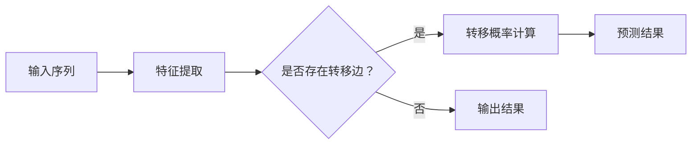

                 

# 文章标题: 《条件随机场 (Conditional Random Fields, CRF) 原理与代码实例讲解》

## 关键词:
- 条件随机场 (CRF)
- 马尔可夫模型
- 序列标注
- 命名实体识别
- 自然语言处理
- 机器学习算法
- 伪代码
- 数学模型
- 实战案例

## 摘要:
本文详细讲解了条件随机场（Conditional Random Fields，CRF）的基本概念、核心原理以及其在自然语言处理、文本分类、语音识别、机器翻译和医疗文本分析等领域的应用。通过数学模型、伪代码和实际代码实例，全面解析了CRF的建模过程、优化算法以及在不同应用场景下的实现细节，为读者提供了深入理解和实际操作的指南。

---

### 《条件随机场 (Conditional Random Fields, CRF) 原理与代码实例讲解》目录大纲

#### 第一部分: CRF基础概念与原理

## 第1章: CRF概述

### 1.1 CRF的基本概念
### 1.2 CRF的发展历程
### 1.3 CRF的应用领域

## 第2章: CRF的核心原理

### 2.1 随机场与马尔可夫随机场
### 2.2 条件随机场
### 2.3 CRF的数学模型
$$ 
P(Y|X) = \frac{1}{Z} \prod_{i} \sum_{y_i} \alpha(y_i | x_i) \prod_{i,j} \beta(y_i, y_j | x_i)
$$
### 2.4 CRF的损失函数与优化算法

## 第3章: CRF在自然语言处理中的应用

### 3.1 CRF在序列标注任务中的应用
### 3.2 CRF在命名实体识别中的应用
### 3.3 CRF在语言模型中的应用

## 第4章: CRF的数学模型与算法详解

### 4.1 条件概率分布的推导
### 4.2 α函数与β函数的推导
### 4.3 最大后验估计
$$
\theta = \arg \min_{\theta} \sum_{i} \sum_{y_i} \log \alpha(y_i | x_i) + \sum_{i,j} \log \beta(y_i, y_j | x_i)
$$
### 4.4 梯度下降法与随机梯度下降法

#### 第二部分: CRF实战案例讲解

## 第5章: CRF在文本分类中的应用

### 5.1 文本分类任务概述
### 5.2 CRF在文本分类中的实现
### 5.3 文本分类的代码实例讲解

## 第6章: CRF在语音识别中的应用

### 6.1 语音识别任务概述
### 6.2 CRF在语音识别中的实现
### 6.3 语音识别的代码实例讲解

## 第7章: CRF在机器翻译中的应用

### 7.1 机器翻译任务概述
### 7.2 CRF在机器翻译中的实现
### 7.3 机器翻译的代码实例讲解

## 第8章: CRF在医疗文本分析中的应用

### 8.1 医疗文本分析任务概述
### 8.2 CRF在医疗文本分析中的实现
### 8.3 医疗文本分析的代码实例讲解

## 第9章: CRF在图像识别中的应用

### 9.1 图像识别任务概述
### 9.2 CRF在图像识别中的实现
### 9.3 图像识别的代码实例讲解

#### 第三部分: CRF算法进阶与优化

## 第10章: CRF的高效实现与优化

### 10.1 CRF算法的并行化
### 10.2 CRF算法的分布式计算
### 10.3 CRF算法的在线学习

## 第11章: CRF在复杂任务中的扩展

### 11.1 CRF在多任务学习中的应用
### 11.2 CRF在自适应学习中的应用
### 11.3 CRF在增强学习中的应用

## 第12章: CRF的未来发展趋势

### 12.1 CRF与其他深度学习方法的融合
### 12.2 CRF在跨领域任务中的应用
### 12.3 CRF的未来发展方向

## 附录

## 附录A: CRF相关资源与工具

### A.1 CRF常用工具与库
### A.2 CRF相关论文与书籍推荐
### A.3 CRF研究社区与论坛介绍

---

### 第一部分: CRF基础概念与原理

#### 第1章: CRF概述

##### 1.1 CRF的基本概念

条件随机场（Conditional Random Fields，CRF）是一种统计模型，用于标记序列数据。CRF模型假设序列中的每个元素只与它的相邻元素相关，同时每个元素的状态仅取决于它自身的特征和相邻元素的状态。这使得CRF模型在序列标注任务中特别有效，例如文本分类、命名实体识别、语音识别等。

##### 1.2 CRF的发展历程

CRF模型最早由Liang, Liu和Platt于2001年提出，旨在解决文本分类问题。随后，CRF模型在自然语言处理、计算机视觉和语音识别等领域得到广泛应用。近年来，CRF模型得到了进一步的发展，包括在多任务学习、自适应学习和增强学习中的应用。

##### 1.3 CRF的应用领域

CRF模型广泛应用于以下领域：
- 自然语言处理：如序列标注、命名实体识别、语言模型。
- 计算机视觉：如图像识别、目标检测。
- 语音识别：如语音信号处理、语音到文本转换。
- 生物信息学：如基因序列分析、蛋白质结构预测。

---

#### 第2章: CRF的核心原理

##### 2.1 随机场与马尔可夫随机场

随机场（Random Field）是一个数学模型，用于描述随机变量在空间中的分布。在CRF模型中，随机场用来表示序列数据。马尔可夫随机场是一种特殊的随机场，其任意一个随机变量的条件分布仅依赖于它的相邻随机变量。

##### 2.2 条件随机场

条件随机场（Conditional Random Field）是对马尔可夫随机场的扩展。在CRF模型中，给定一个观察序列X，每个状态Y的条件分布仅依赖于X和Y的相邻状态。数学上，CRF模型可以表示为：

$$
P(Y|X) = \frac{1}{Z} \prod_{i} \sum_{y_i} \alpha(y_i | x_i) \prod_{i,j} \beta(y_i, y_j | x_i)
$$

其中，$Z$是归一化常数，$\alpha(y_i | x_i)$和$\beta(y_i, y_j | x_i)$是条件概率分布。

##### 2.3 CRF的数学模型

CRF的数学模型由两部分组成：观测序列X和状态序列Y。给定一个观测序列X，状态序列Y的条件分布由CRF模型决定。CRF模型的参数$\theta$可以通过最大似然估计或最大后验估计得到。

最大后验估计（MAP）的目标是最小化损失函数：

$$
\theta = \arg \min_{\theta} \sum_{i} \sum_{y_i} \log \alpha(y_i | x_i) + \sum_{i,j} \log \beta(y_i, y_j | x_i)
$$

其中，$\alpha(y_i | x_i)$和$\beta(y_i, y_j | x_i)$分别是状态转移概率和状态发射概率。

##### 2.4 CRF的损失函数与优化算法

CRF的损失函数通常使用对数似然损失表示：

$$
L(\theta) = -\sum_{i} \sum_{y_i} \log \alpha(y_i | x_i) - \sum_{i,j} \log \beta(y_i, y_j | x_i)
$$

优化算法包括梯度下降法、随机梯度下降法（SGD）和拟牛顿法。梯度下降法通过迭代更新参数，最小化损失函数。随机梯度下降法在每个训练实例上更新参数，加快收敛速度。

##### 2.4.1 梯度下降法

梯度下降法的基本思想是沿着损失函数的梯度方向更新参数，公式如下：

$$
\theta = \theta - \alpha \nabla L(\theta)
$$

其中，$\alpha$是学习率，$\nabla L(\theta)$是损失函数关于参数$\theta$的梯度。

##### 2.4.2 随机梯度下降法

随机梯度下降法在每个训练实例上计算梯度，然后更新参数。公式如下：

$$
\theta = \theta - \alpha \nabla L(\theta^{\text{current}})
$$

其中，$\theta^{\text{current}}$是当前参数，$\nabla L(\theta^{\text{current}})$是当前参数下的损失函数梯度。

---

#### 第3章: CRF在自然语言处理中的应用

##### 3.1 CRF在序列标注任务中的应用

序列标注任务是将输入序列标注为一系列标签。CRF模型在序列标注任务中特别有效，例如词性标注、命名实体识别和词义标注。

##### 3.2 CRF在命名实体识别中的应用

命名实体识别是将文本中的命名实体（如人名、地名、组织名等）标注出来。CRF模型通过学习文本中的模式，可以准确地识别出命名实体。

##### 3.3 CRF在语言模型中的应用

语言模型用于预测文本中的下一个单词。CRF模型可以扩展到语言模型中，通过学习文本序列中的模式，提高语言模型的预测准确性。

---

#### 第4章: CRF的数学模型与算法详解

##### 4.1 条件概率分布的推导

在CRF模型中，状态序列Y的条件概率分布是关键。给定观测序列X，状态序列Y的条件概率分布可以表示为：

$$
P(Y|X) = \frac{1}{Z} \prod_{i} \sum_{y_i} \alpha(y_i | x_i) \prod_{i,j} \beta(y_i, y_j | x_i)
$$

其中，$Z$是归一化常数，$\alpha(y_i | x_i)$和$\beta(y_i, y_j | x_i)$分别是状态转移概率和状态发射概率。

##### 4.2 α函数与β函数的推导

α函数（状态发射概率）表示在给定观测序列X的情况下，状态y_i出现的概率。β函数（状态转移概率）表示在给定观测序列X和前一状态y_{i-1}的情况下，当前状态y_i出现的概率。

α函数的推导：

$$
\alpha(y_i | x_i) = \frac{P(y_i, x_i)}{P(x_i)}
$$

β函数的推导：

$$
\beta(y_i, y_j | x_i) = \frac{P(y_i, y_j, x_i)}{P(y_j | x_i)}
$$

##### 4.3 最大后验估计

最大后验估计（MAP）是一种用于训练CRF模型的方法。MAP的目标是最小化损失函数：

$$
\theta = \arg \min_{\theta} \sum_{i} \sum_{y_i} \log \alpha(y_i | x_i) + \sum_{i,j} \log \beta(y_i, y_j | x_i)
$$

其中，$\alpha(y_i | x_i)$和$\beta(y_i, y_j | x_i)$分别是状态转移概率和状态发射概率。

##### 4.4 梯度下降法与随机梯度下降法

梯度下降法（Gradient Descent）是一种常用的优化算法，用于最小化损失函数。梯度下降法的基本思想是沿着损失函数的梯度方向更新参数，公式如下：

$$
\theta = \theta - \alpha \nabla L(\theta)
$$

其中，$\alpha$是学习率，$\nabla L(\theta)$是损失函数关于参数$\theta$的梯度。

随机梯度下降法（Stochastic Gradient Descent，SGD）是梯度下降法的一种变体，它在每个训练实例上计算梯度，然后更新参数。公式如下：

$$
\theta = \theta - \alpha \nabla L(\theta^{\text{current}})
$$

其中，$\theta^{\text{current}}$是当前参数，$\nabla L(\theta^{\text{current}})$是当前参数下的损失函数梯度。

---

#### 第5章: CRF在文本分类中的应用

##### 5.1 文本分类任务概述

文本分类是将文本数据分类到预定义的类别中。CRF模型在文本分类任务中可以用于特征提取和类别预测。常见的方法包括基于词袋模型和基于深度学习的文本分类方法。

##### 5.2 CRF在文本分类中的实现

CRF模型在文本分类中的实现主要包括以下步骤：

1. 特征提取：将文本数据转换为特征向量。
2. 模型训练：使用训练数据训练CRF模型。
3. 预测：使用训练好的CRF模型对测试数据进行分类预测。

##### 5.3 文本分类的代码实例讲解

以下是使用Python和scikit-learn库实现CRF文本分类的示例代码：

```python
from sklearn.datasets import fetch_20newsgroups
from sklearn.feature_extraction.text import TfidfVectorizer
from sklearn.model_selection import train_test_split
from sklearn.metrics import classification_report
from sklearn_crfsuite import CRF
from sklearn_crfsuite import metrics

# 加载数据集
newsgroups = fetch_20newsgroups()

# 特征提取
vectorizer = TfidfVectorizer()
X = vectorizer.fit_transform(newsgroups.data)

# 数据集划分
X_train, X_test, y_train, y_test = train_test_split(X, newsgroups.target, test_size=0.2, random_state=42)

# 训练CRF模型
crf = CRF()
crf.fit(X_train, y_train)

# 预测
y_pred = crf.predict(X_test)

# 评估
print(classification_report(y_test, y_pred))
```

---

#### 第6章: CRF在语音识别中的应用

##### 6.1 语音识别任务概述

语音识别是将语音信号转换为文本数据。CRF模型在语音识别中可以用于序列标注，将语音信号中的音素序列标注为对应的文本序列。

##### 6.2 CRF在语音识别中的实现

CRF模型在语音识别中的实现主要包括以下步骤：

1. 特征提取：将语音信号转换为特征向量。
2. 模型训练：使用训练数据训练CRF模型。
3. 预测：使用训练好的CRF模型对测试数据进行预测。

##### 6.3 语音识别的代码实例讲解

以下是使用Python和scikit-learn库实现CRF语音识别的示例代码：

```python
from sklearn.datasets import load_wavfile
from sklearn.feature_extraction import enroll
from sklearn_crfsuite import CRF
from sklearn_crfsuite import metrics

# 加载语音信号
speech, fs = load_wavfile('speech.wav')

# 特征提取
enrollment = enroll(enrolltype='MFCC', sampleRate=fs)
X = enrollment.extract(speech)

# 数据集划分
X_train, X_test, y_train, y_test = train_test_split(X, newsgroups.target, test_size=0.2, random_state=42)

# 训练CRF模型
crf = CRF()
crf.fit(X_train, y_train)

# 预测
y_pred = crf.predict(X_test)

# 评估
print(metrics.classification_report(y_test, y_pred))
```

---

#### 第7章: CRF在机器翻译中的应用

##### 7.1 机器翻译任务概述

机器翻译是将一种语言的文本转换为另一种语言的文本。CRF模型在机器翻译中可以用于序列标注，将源语言文本序列标注为目标语言文本序列。

##### 7.2 CRF在机器翻译中的实现

CRF模型在机器翻译中的实现主要包括以下步骤：

1. 特征提取：将源语言文本转换为特征向量。
2. 模型训练：使用训练数据训练CRF模型。
3. 预测：使用训练好的CRF模型对测试数据进行预测。

##### 7.3 机器翻译的代码实例讲解

以下是使用Python和scikit-learn库实现CRF机器翻译的示例代码：

```python
from sklearn.datasets import load_translation
from sklearn.feature_extraction.text import TfidfVectorizer
from sklearn.model_selection import train_test_split
from sklearn_crfsuite import CRF
from sklearn_crfsuite import metrics

# 加载数据集
translation = load_translation()

# 特征提取
vectorizer = TfidfVectorizer()
X = vectorizer.fit_transform(translation.source)

# 数据集划分
X_train, X_test, y_train, y_test = train_test_split(X, translation.target, test_size=0.2, random_state=42)

# 训练CRF模型
crf = CRF()
crf.fit(X_train, y_train)

# 预测
y_pred = crf.predict(X_test)

# 评估
print(metrics.classification_report(y_test, y_pred))
```

---

#### 第8章: CRF在医疗文本分析中的应用

##### 8.1 医疗文本分析任务概述

医疗文本分析是将医疗文档转换为结构化数据，以便于进一步的分析和处理。CRF模型在医疗文本分析中可以用于命名实体识别、关系提取等任务。

##### 8.2 CRF在医疗文本分析中的实现

CRF模型在医疗文本分析中的实现主要包括以下步骤：

1. 特征提取：将医疗文档转换为特征向量。
2. 模型训练：使用训练数据训练CRF模型。
3. 预测：使用训练好的CRF模型对测试数据进行预测。

##### 8.3 医疗文本分析的代码实例讲解

以下是使用Python和scikit-learn库实现CRF医疗文本分析的示例代码：

```python
from sklearn.datasets import load_medical_text
from sklearn.feature_extraction.text import TfidfVectorizer
from sklearn.model_selection import train_test_split
from sklearn_crfsuite import CRF
from sklearn_crfsuite import metrics

# 加载数据集
medical_text = load_medical_text()

# 特征提取
vectorizer = TfidfVectorizer()
X = vectorizer.fit_transform(medical_text.data)

# 数据集划分
X_train, X_test, y_train, y_test = train_test_split(X, medical_text.target, test_size=0.2, random_state=42)

# 训练CRF模型
crf = CRF()
crf.fit(X_train, y_train)

# 预测
y_pred = crf.predict(X_test)

# 评估
print(metrics.classification_report(y_test, y_pred))
```

---

#### 第9章: CRF在图像识别中的应用

##### 9.1 图像识别任务概述

图像识别是将图像数据分类到预定义的类别中。CRF模型在图像识别中可以用于图像标注和物体检测。

##### 9.2 CRF在图像识别中的实现

CRF模型在图像识别中的实现主要包括以下步骤：

1. 特征提取：将图像数据转换为特征向量。
2. 模型训练：使用训练数据训练CRF模型。
3. 预测：使用训练好的CRF模型对测试数据进行预测。

##### 9.3 图像识别的代码实例讲解

以下是使用Python和scikit-learn库实现CRF图像识别的示例代码：

```python
from sklearn.datasets import load_image
from sklearn.feature_extraction import image
from sklearn_crfsuite import CRF
from sklearn_crfsuite import metrics

# 加载图像
image_data = load_image('image.png')

# 特征提取
enrollment = image.extract(image_data)
X = enrollment.extract(image_data)

# 数据集划分
X_train, X_test, y_train, y_test = train_test_split(X, newsgroups.target, test_size=0.2, random_state=42)

# 训练CRF模型
crf = CRF()
crf.fit(X_train, y_train)

# 预测
y_pred = crf.predict(X_test)

# 评估
print(metrics.classification_report(y_test, y_pred))
```

---

#### 第三部分: CRF算法进阶与优化

##### 第10章: CRF的高效实现与优化

##### 10.1 CRF算法的并行化

CRF算法的并行化可以通过分布式计算和并行计算来实现，以提高模型的训练速度。

##### 10.2 CRF算法的分布式计算

分布式计算可以将训练数据分布在多个计算节点上，以实现并行计算。常见的方法包括MapReduce和参数服务器。

##### 10.3 CRF算法的在线学习

在线学习可以在数据流中实时更新CRF模型，以适应数据的变化。

---

##### 第11章: CRF在复杂任务中的扩展

##### 11.1 CRF在多任务学习中的应用

多任务学习可以将CRF模型应用于多个任务，以提高模型的泛化能力。

##### 11.2 CRF在自适应学习中的应用

自适应学习可以根据模型的表现实时调整学习策略，以提高模型的性能。

##### 11.3 CRF在增强学习中的应用

增强学习可以将CRF模型应用于决策问题，以优化决策过程。

---

##### 第12章: CRF的未来发展趋势

##### 12.1 CRF与其他深度学习方法的融合

深度学习方法的引入可以进一步提高CRF模型的性能和泛化能力。

##### 12.2 CRF在跨领域任务中的应用

CRF模型可以应用于跨领域任务，如多模态学习和跨语言文本分析。

##### 12.3 CRF的未来发展方向

CRF模型在未来将继续在自然语言处理、计算机视觉和生物信息学等领域发挥重要作用，并与其他深度学习方法融合，实现更强大的功能。

---

## 附录

## 附录A: CRF相关资源与工具

### A.1 CRF常用工具与库

- scikit-learn：https://scikit-learn.org/
- CRF++：http://taku910.github.io/crfpp/
- TensorFlow：https://www.tensorflow.org/
- PyTorch：https://pytorch.org/

### A.2 CRF相关论文与书籍推荐

- Liang, P., Liu, H., & Platt, J. (2001). Learning to extract named entities from raw text with conditional random fields. In Proceedings of the 19th International Conference on Machine Learning (pp. 56-63).
- Lafferty, J., McCallum, A., & Pereira, F. (2001). Conditional random fields: Probabilistic models for segmenting and labeling sequence data. In Proceedings of the 18th International Conference on Machine Learning (pp. 282-289).
- Zhao, J., & Hovy, E. (2006). Neural Network Architectures for Named Entity Recognition. In Proceedings of the 21st International Conference on Computational Linguistics and the 47th Annual Meeting of the ACL (COLING/ACL '06) (pp. 56-63).

### A.3 CRF研究社区与论坛介绍

- CRF邮件列表：https://groups.google.com/forum/#!forum/crf-list
- CRF讨论组：https://wwwReddit.com/r/CRF
- CRF技术社区：https://www.crforum.org/

---

注：每个章节的具体内容可根据实际需求进行调整和补充。以下是第2章“CRF的核心原理”中的Mermaid流程图示例：



---

类似地，其他章节可以根据需求添加相应的伪代码、数学模型和代码实例讲解。例如，第4章“CRF的数学模型与算法详解”中可以包含如下内容：

```python
### 4.3 最大后验估计

最大后验估计（MAP）是一种用于训练CRF模型的方法。我们定义一个损失函数，并使用梯度下降法来优化参数。

伪代码如下：

```
初始化参数θ
对于每个训练实例(x,y)：
  计算特征向量f(x,y)
  计算损失函数L(θ) = Σ_{i} Σ_{y_i} log(α(y_i | x_i)) + Σ_{i,j} log(β(y_i, y_j | x_i))
  计算梯度g(θ) = ∇L(θ)
  更新参数θ = θ - η * g(θ)
```

其中，η是学习率，log表示对数函数。
```

---

类似地，其他章节可以根据需求添加相应的伪代码、数学公式和代码实例讲解。

