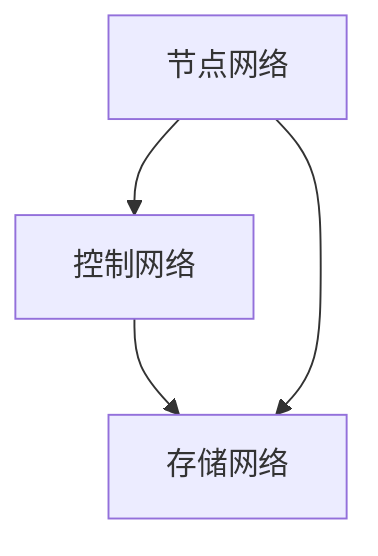

                 

# 树莓派集群：构建低成本高性能计算平台

> **关键词：** 树莓派、集群、分布式计算、高性能、低成本、资源优化、项目管理

> **摘要：** 本文将详细介绍如何构建和使用树莓派集群，实现低成本高性能计算平台。通过深入剖析树莓派集群的基础知识、硬件与软件配置、网络架构设计、性能优化、应用开发、数据存储与处理、安全管理与维护，以及实际项目案例分析，帮助读者全面掌握树莓派集群的构建和应用技巧。

### 目录大纲

1. **第一部分：树莓派集群基础知识**
   1.1 树莓派集群概述
       1.1.1 树莓派简介
       1.1.2 树莓派集群的概念和优势
       1.1.3 树莓派集群的应用领域
   1.2 树莓派硬件与软件配置
       1.2.1 树莓派硬件选择与组装
       1.2.2 树莓派操作系统安装
       1.2.3 树莓派软件环境配置
   1.3 树莓派集群网络架构设计
       1.3.1 集群网络架构概述
       1.3.2 树莓派集群网络拓扑设计
       1.3.3 集群网络通信协议
       1.3.4 集群管理工具介绍
   1.4 树莓派集群性能优化
       1.4.1 集群性能指标
       1.4.2 集群资源分配与调度
       1.4.3 集群负载均衡
       1.4.4 集群监控与故障排除

2. **第二部分：树莓派集群项目实战**
   2.1 树莓派集群应用开发
       2.1.1 应用场景分析
       2.1.2 集群应用架构设计
       2.1.3 集群应用开发实践
   2.2 树莓派集群数据存储与处理
       2.2.1 数据存储方案设计
       2.2.2 数据处理框架搭建
       2.2.3 数据处理流程优化
   2.3 树莓派集群安全管理与维护
       2.3.1 集群安全策略
       2.3.2 集群安全工具与软件
       2.3.3 集群日常维护与升级
   2.4 树莓派集群项目案例分析
       2.4.1 案例一：气象数据分析系统
       2.4.2 案例二：智能家居控制系统
       2.4.3 案例三：教育辅助系统

3. **附录**
   3.1 树莓派集群资源与工具汇总
       3.1.1 硬件资源汇总
       3.1.2 软件资源汇总
       3.1.3 开发工具与平台汇总

### 1.1.1 树莓派简介

树莓派（Raspberry Pi）是一款由英国慈善基金会 Raspberry Pi Foundation 开发的小型计算机。自2012年首次发布以来，树莓派因其高性能、低功耗和低成本的特点，迅速在全球范围内获得了广泛的关注和应用。

#### 树莓派的特点

1. **小尺寸**：树莓派具有小巧的体积，尺寸仅为85.6mm x 56mm x 17mm，可以轻松嵌入各种设备中。
2. **高性能**：树莓派配备了高性能的 ARM Cortex-A7 处理器，性能与传统的 x86 架构计算机相当。
3. **低功耗**：树莓派具有低功耗的特点，功耗通常在 3W 左右，适合用作嵌入式设备。
4. **多功能**：树莓派支持多种操作系统，包括 Linux、Windows 10 IoT Core 等，可以用于教学、智能家居、机器人等应用。

#### 树莓派的发展历程

- **2012年**：Raspberry Pi Model B 发布，这是第一款树莓派产品。
- **2015年**：Raspberry Pi 2 发布，首次引入 1GB 内存，提高了性能。
- **2017年**：Raspberry Pi 3 发布，加入 Wi-Fi 和蓝牙功能，进一步拓展了应用场景。
- **2018年**：Raspberry Pi 3 B+ 发布，对硬件进行了一些优化，如提高 Wi-Fi 性能、增加 PoE 支持等。
- **2021年**：Raspberry Pi 4 发布，性能大幅提升，支持双屏输出、高速以太网和 USB 3.0，成为最受欢迎的树莓派型号。

#### 树莓派的内核架构

树莓派的内核架构采用 ARM Cortex-A7，具有以下特点：

1. **单核处理器**：树莓派通常配备单核处理器，但性能较高，足以应对大多数嵌入式应用。
2. **ARMv7 处理器**：树莓派使用的 ARM Cortex-A7 是 ARMv7 架构，具有高效的指令集和较低的能量消耗。
3. **内存管理**：树莓派使用 ARM 的内存管理单元（MMU），可以实现虚拟内存和内存保护等功能。

### 1.1.2 树莓派集群的概念和优势

树莓派集群是指由多个树莓派组成的分布式计算系统。通过将多个树莓派连接在一起，可以形成一个具有高性能、高可扩展性的计算平台。

#### 树莓派集群的概念

树莓派集群的基本组成如下：

1. **节点**：树莓派集群中的每个树莓派都是一个节点，每个节点都具有独立的计算能力。
2. **控制器**：控制器是集群的核心，负责管理节点、调度任务和监控集群状态。
3. **网络**：节点之间的通信通过网络进行，通常使用以太网或无线网络。

#### 树莓派集群的优势

1. **高性能**：通过将多个树莓派连接在一起，可以形成强大的计算能力，适用于大数据处理、机器学习等计算密集型任务。
2. **高可扩展性**：树莓派集群可以轻松扩展，只需添加更多的树莓派节点即可。
3. **低成本**：树莓派本身具有低成本的特点，构建一个树莓派集群的成本远低于传统的服务器集群。
4. **易维护**：树莓派集群使用开源软件，可以方便地管理和维护。
5. **灵活性**：树莓派集群可以用于多种应用场景，如智能家居、物联网、科学计算等。

### 1.1.3 树莓派集群的应用领域

树莓派集群由于其高性能、低成本和灵活性，可以应用于许多领域，以下是一些典型的应用场景：

1. **科学计算**：树莓派集群可以用于高性能计算，如气象预报、物理模拟、基因测序等。
2. **大数据处理**：树莓派集群可以用于大数据的采集、存储、处理和分析，适用于各种大数据应用。
3. **机器学习**：树莓派集群可以用于机器学习模型的训练和推理，加速机器学习算法的运算。
4. **物联网**：树莓派集群可以用于物联网设备的数据处理和实时分析，提高物联网系统的响应速度。
5. **智能家居**：树莓派集群可以用于智能家居系统的数据采集、处理和控制，提高系统的智能化水平。
6. **教育**：树莓派集群可以用于教学实验，让学生了解分布式计算和云计算的基本原理。

通过以上内容，我们对树莓派及其集群有了初步的了解。接下来，我们将详细介绍树莓派的硬件与软件配置，为构建树莓派集群打下坚实的基础。

### 1.2 树莓派硬件与软件配置

要构建一个稳定的树莓派集群，硬件和软件的配置至关重要。本节将详细介绍树莓派的硬件选择与组装、操作系统安装、以及软件环境配置。

#### 1.2.1 树莓派硬件选择与组装

1. **树莓派型号选择**

   目前，市场上流行的树莓派型号有以下几个：

   - **Raspberry Pi 4 Model B**：这是当前最受欢迎的树莓派型号，具有4GB内存、1GB内存、双显示屏输出、Wi-Fi和蓝牙5.0等功能，适合作为集群的主节点或计算节点。

   - **Raspberry Pi 3 Model B+**：拥有1GB内存、支持Wi-Fi和蓝牙4.2，是一个性价比较高的选择。

   - **Raspberry Pi 3 Model B**：拥有1GB内存，但无Wi-Fi功能，适用于成本敏感的项目。

   - **Raspberry Pi 2 Model B**：具有1GB内存，但性能和功能相对较弱，不推荐用于集群。

   选择树莓派型号时，应考虑以下因素：

   - **内存**：更多的内存可以提高集群的性能，适合处理大数据和高性能计算任务。

   - **网络功能**：Wi-Fi和蓝牙功能可以提供无线连接，方便部署和扩展。

   - **扩展性**：考虑未来可能需要增加的硬件设备，如额外的USB接口、网络接口等。

2. **树莓派硬件组件介绍**

   树莓派硬件组件主要包括：

   - **树莓派主板**：核心计算部件，包括处理器、内存、存储接口等。

   - **电源供应器**：为树莓派提供电源，确保其稳定运行。

   - **散热装置**：树莓派在运行过程中会产生热量，散热装置可以防止过热，保证稳定运行。

   - **存储设备**：通常使用microSD卡作为存储设备，存储操作系统和应用程序。

   - **网络设备**：包括以太网接口和无线网卡，提供网络连接。

3. **树莓派的网络连接**

   树莓派的网络连接可以通过有线（以太网）和无线（Wi-Fi和蓝牙）两种方式进行。有线连接稳定性和速度较高，适用于需要高带宽和低延迟的场景。无线连接则提供了更大的灵活性和便携性。

   - **有线连接**：使用以太网线将树莓派连接到路由器或交换机，确保连接稳定和高速。

   - **无线连接**：安装Wi-Fi和蓝牙模块，配置无线网络连接，适用于移动性要求较高的场景。

   **组装步骤：**

   1. 将树莓派主板插入基座，确保接触良好。
   2. 将microSD卡插入SD卡槽，并安装操作系统。
   3. 将电源供应器连接到树莓派，确保电源稳定。
   4. 根据需要安装散热装置，如散热片或散热风扇。
   5. 连接网络设备，设置网络连接。

#### 1.2.2 树莓派操作系统安装

1. **操作系统选择**

   树莓派支持多种操作系统，包括：

   - **Raspberry Pi OS**：基于 Debian Linux 的操作系统，是树莓派的官方操作系统，功能齐全且易于使用。

   - **Windows 10 IoT Core**：适用于树莓派的 Windows 操作系统，适合开发物联网应用。

   - **Armbian**：一个专为 ARM 架构设计的 Linux 发行版，提供了丰富的配置选项。

   - **其他 Linux 发行版**：如 Ubuntu、Fedora 等，适用于有一定 Linux 知识的用户。

   选择操作系统时，应考虑以下因素：

   - **硬件兼容性**：确保操作系统支持所选树莓派型号的硬件。

   - **功能需求**：根据项目需求选择合适的操作系统，如需要高性能计算、图形处理或 IoT 功能等。

   - **易用性**：对于初学者，选择易于安装和使用操作系统更为重要。

2. **操作系统安装方法**

   以 Raspberry Pi OS 为例，安装步骤如下：

   1. 下载最新版本的 Raspberry Pi OS 镜像文件。
   2. 使用软件（如 Balena Etcher）将镜像文件写入 microSD 卡。
   3. 将安装了操作系统的 microSD 卡插入树莓派。
   4. 连接显示器、键盘、鼠标和网络设备，启动树莓派。
   5. 按照屏幕提示进行操作系统安装。

3. **网络配置与优化**

   安装完成后，需要配置网络连接。以下是在 Raspberry Pi OS 中配置网络的方法：

   1. 打开终端，运行以下命令检查网络连接状态：
      ```bash
      ifconfig
      ```
   2. 如果网络连接不成功，检查网络设备连接是否正常，并尝试重新启动树莓派。
   3. 使用 `sudo nano /etc/dhcpcd.conf` 命令编辑 dhcpcd 配置文件，配置静态 IP 地址。
   4. 在配置文件中添加以下内容：
      ```bash
      interface eth0
      static ip_address=192.168.1.10/24
      static routers=192.168.1.1
      static domain_name_servers=192.168.1.1
      ```
   5. 保存并关闭文件，重启网络服务：
      ```bash
      sudo systemctl restart dhcpcd
      ```

#### 1.2.3 树莓派软件环境配置

1. **编程语言环境安装**

   树莓派支持多种编程语言，如 Python、C++、Java 等。以下以 Python 为例，介绍安装方法：

   1. 打开终端，更新系统软件包：
      ```bash
      sudo apt update && sudo apt upgrade
      ```
   2. 安装 Python 和 pip（Python 的包管理器）：
      ```bash
      sudo apt install python3 python3-pip
      ```

2. **常用工具软件安装**

   树莓派上安装一些常用工具软件可以方便开发和调试。以下是一些常用工具的安装命令：

   - **Vim**（文本编辑器）：
     ```bash
     sudo apt install vim
     ```
   - **Git**（版本控制工具）：
     ```bash
     sudo apt install git
     ```
   - **SSH**（安全外壳协议，用于远程访问）：
     ```bash
     sudo apt install openssh-server
     ```

3. **软件版本管理**

   为了方便管理和维护软件版本，可以使用 `apt` 和 `pip` 进行版本管理。

   - **apt**：用于管理 Linux 系统中的软件包。
   - **pip**：用于管理 Python 中的包。

   使用以下命令可以查看和安装软件的特定版本：

   ```bash
   apt show <package_name>
   apt install <package_name>=<version>
   pip show <package_name>
   pip install <package_name>=<version>
   ```

通过以上步骤，我们完成了树莓派的硬件选择与组装、操作系统安装，以及软件环境配置。接下来，我们将介绍树莓派集群的网络架构设计，为构建高性能的树莓派集群做好准备。

### 1.3 树莓派集群网络架构设计

树莓派集群的网络架构设计是构建高效、稳定集群的关键环节。一个良好的网络架构可以确保集群节点之间的高效通信，提高集群的整体性能。本节将介绍树莓派集群网络架构的基本概念、设计原则和常见的网络拓扑。

#### 1.3.1 集群网络架构概述

树莓派集群网络架构主要包括以下几个部分：

1. **节点网络**：每个树莓派节点都连接到局域网，用于节点间的通信。
2. **控制网络**：控制器节点连接到控制网络，用于集群管理和监控。
3. **存储网络**：用于连接集群的存储设备，提供高速数据传输通道。

一个典型的树莓派集群网络架构如图 1-1 所示：



#### 1.3.2 树莓派集群网络拓扑设计

树莓派集群网络拓扑设计直接影响集群的性能和可靠性。以下是几种常见的网络拓扑设计：

1. **星型拓扑**：所有节点通过交换机连接到控制器节点，控制器节点通过路由器连接到外部网络。这种拓扑结构简单，易于管理和维护，但控制器节点成为网络瓶颈。

   ```mermaid
   graph TB
   A[控制器] --> B[节点1]
   A --> C[节点2]
   A --> D[节点3]
   A --> E[交换机]
   E --> F[路由器]
   ```

2. **环型拓扑**：节点通过环形网络连接，每个节点连接前一个节点和后一个节点。这种拓扑结构具有较好的容错性，但网络管理较为复杂。

   ```mermaid
   graph TB
   A[节点1] --> B[节点2]
   B --> C[节点3]
   C --> D[节点4]
   D --> A
   ```

3. **混合拓扑**：结合星型和环型拓扑的特点，控制器节点通过星型拓扑连接到其他节点，而节点之间通过环型拓扑连接。这种拓扑结构在性能和容错性之间取得了较好的平衡。

   ```mermaid
   graph TB
   A[控制器] --> B[节点1]
   A --> C[节点2]
   C --> D[节点3]
   D --> A
   B --> E[节点4]
   E --> F[节点5]
   F --> C
   ```

#### 1.3.3 集群网络通信协议

树莓派集群的网络通信协议通常采用 TCP/IP 协议栈，基于 IP 地址进行节点间的通信。以下是几种常用的网络通信协议：

1. **TCP（传输控制协议）**：TCP 是一种可靠的、面向连接的通信协议，用于保证数据传输的完整性和顺序性。在树莓派集群中，节点之间通过 TCP 协议进行数据传输和控制命令的传递。

2. **UDP（用户数据报协议）**：UDP 是一种简单的、不可靠的、无连接的通信协议，适用于实时应用和低延迟应用。在树莓派集群中，可以使用 UDP 协议进行实时监控和数据采集。

3. **HTTP/HTTPS**：HTTP 和 HTTPS 是基于 TCP 协议的应用层协议，用于 web 服务和安全的通信。在树莓派集群中，可以使用 HTTP/HTTPS 协议访问集群的管理界面和数据服务。

4. **SSH**：SSH（安全外壳协议）是一种安全的、基于 TCP 的通信协议，用于远程登录和管理节点。在树莓派集群中，可以使用 SSH 协议实现远程访问和命令执行。

#### 1.3.4 集群管理工具介绍

树莓派集群的管理工具主要用于集群的监控、管理和自动化部署。以下是几种常用的集群管理工具：

1. **Kubernetes**：Kubernetes 是一种开源的容器编排平台，用于自动化部署、扩展和管理容器化应用。在树莓派集群中，可以使用 Kubernetes 管理节点、部署应用和进行集群资源调度。

2. **Docker**：Docker 是一种开源的应用容器引擎，用于打包、交付和运行应用程序。在树莓派集群中，可以使用 Docker 容器化应用，提高部署效率和资源利用率。

3. **SaltStack**：SaltStack 是一种开源的自动化管理工具，用于自动化部署、配置和管理节点。在树莓派集群中，可以使用 SaltStack 进行自动化部署和配置，提高运维效率。

通过以上内容，我们了解了树莓派集群网络架构设计的基本概念和实现方法。接下来，我们将深入探讨树莓派集群的性能优化，以进一步提升集群的稳定性和性能。

### 1.4 树莓派集群性能优化

树莓派集群的性能优化是构建高效计算平台的关键步骤。通过合理的性能优化，可以提高集群的稳定性和计算效率。本节将介绍树莓派集群性能优化的方法和技巧。

#### 1.4.1 集群性能指标

在优化树莓派集群性能时，需要关注以下性能指标：

1. **计算能力**：集群的处理速度和计算资源，通常以每秒处理的任务数或吞吐量来衡量。
2. **网络带宽**：集群节点之间的数据传输速度，影响集群的整体性能。
3. **存储性能**：集群存储设备的读写速度，对数据存储和处理效率有重要影响。
4. **资源利用率**：集群中各个资源的利用情况，包括 CPU、内存、磁盘等。
5. **可靠性**：集群在长时间运行中的稳定性和故障恢复能力。

#### 1.4.2 集群资源分配与调度

集群资源分配与调度是优化集群性能的重要环节。合理的资源分配和调度可以提高资源利用率，降低计算延迟。

1. **动态资源分配**：根据集群负载和任务需求，动态调整节点资源分配。例如，使用 Kubernetes 的自动调度机制，根据任务负载自动分配资源。

   ```mermaid
   graph TB
   A[负载较低] --> B[减少资源]
   B --> C[节点1]
   A --> D[负载较高] --> E[增加资源]
   E --> C
   ```

2. **负载均衡**：通过负载均衡技术，将任务均匀分布到各个节点，避免单个节点过载。可以使用 Kubernetes 的负载均衡器，如 nginx-ingress，实现自动负载均衡。

   ```mermaid
   graph TB
   A[任务1] --> B[节点1]
   A --> C[任务2]
   C --> D[节点2]
   ```

3. **优先级调度**：根据任务的重要性和优先级，优先调度高优先级任务。可以使用 Kubernetes 的优先级和抢占机制，确保关键任务优先执行。

   ```mermaid
   graph TB
   A[高优先级任务] --> B[优先执行]
   A --> C[低优先级任务]
   C --> D[延迟执行]
   ```

#### 1.4.3 集群负载均衡

集群负载均衡是优化集群性能的关键技术，通过合理分配任务，避免单个节点过载，提高集群的整体性能。

1. **负载均衡算法**：常见的负载均衡算法包括轮询（Round Robin）、最小连接数（Least Connections）、最小响应时间（Least Response Time）等。选择合适的负载均衡算法，可以提高任务分配的公平性和性能。

   ```mermaid
   graph TB
   A[轮询算法] --> B[节点1]
   A --> C[节点2]
   A --> D[节点3]
   ```

2. **动态负载均衡**：根据集群负载和节点状态，动态调整负载均衡策略。例如，使用 Kubernetes 的水平扩展功能，根据负载自动增加或减少节点。

   ```mermaid
   graph TB
   A[负载较低] --> B[减少节点]
   B --> C[节点1]
   A --> D[负载较高] --> E[增加节点]
   E --> C
   ```

3. **负载均衡器**：使用负载均衡器（如 nginx、HAProxy）实现负载均衡。负载均衡器可以基于不同的算法和策略，灵活地分配任务。

   ```mermaid
   graph TB
   A[客户端请求] --> B[负载均衡器]
   B --> C[节点1]
   B --> D[节点2]
   ```

#### 1.4.4 集群监控与故障排除

集群监控与故障排除是确保集群稳定运行的重要环节。通过实时监控集群状态，及时发现和解决故障，可以避免集群性能下降。

1. **监控工具**：使用监控工具（如 Prometheus、Grafana）对集群节点和系统资源进行监控。监控工具可以收集节点性能数据，生成图表和警报，帮助管理员实时了解集群状态。

   ```mermaid
   graph TB
   A[Prometheus] --> B[节点监控数据]
   B --> C[Grafana]
   C --> D[图表显示]
   ```

2. **故障排除**：当集群出现故障时，通过以下步骤进行故障排除：

   - **查看日志**：检查节点日志，了解故障原因。
   - **网络诊断**：使用网络诊断工具（如 ping、traceroute）检查网络连接和延迟。
   - **资源检查**：检查系统资源（如 CPU、内存、磁盘）使用情况，判断是否过载。
   - **重启服务**：如果问题暂时无法解决，可以尝试重启相关服务或节点。

   ```mermaid
   graph TB
   A[查看日志] --> B[故障排除]
   B --> C[网络诊断]
   C --> D[资源检查]
   D --> E[重启服务]
   ```

通过以上性能优化方法和技巧，可以显著提升树莓派集群的稳定性和计算效率。接下来，我们将探讨如何进行树莓派集群的应用开发，为实际项目奠定基础。

### 1.5 树莓派集群应用开发

树莓派集群的应用开发是构建实际应用项目的重要步骤。通过合理的应用架构设计和开发实践，可以充分发挥树莓派集群的计算能力，实现高性能、高可靠性的应用系统。本节将介绍树莓派集群应用开发的步骤和关键点。

#### 1.5.1 应用场景分析

在开始应用开发之前，首先要分析具体的应用场景和需求。以下是一些常见的应用场景：

1. **大数据处理**：如气象数据分析、金融市场分析等，需要处理海量数据，并进行实时分析和预测。
2. **科学计算**：如物理模拟、天体计算、生物信息学等，需要大量的计算资源和长时间的运行。
3. **机器学习**：如图像识别、自然语言处理等，需要训练复杂的机器学习模型，并进行推理和应用。
4. **物联网**：如智能家居、智能交通等，需要收集和处理来自各种传感器的数据，实现智能决策和控制。
5. **游戏开发**：如多人在线游戏、实时模拟等，需要高效的计算和图形处理能力。

在分析应用场景时，需要关注以下问题：

- **计算需求**：确定应用所需的计算资源和处理速度，选择合适的树莓派集群配置。
- **数据传输**：分析数据传输的频率和带宽要求，选择合适的网络拓扑和通信协议。
- **可靠性**：确保应用系统的稳定性和故障恢复能力，设计冗余和备份机制。
- **可扩展性**：考虑应用的扩展性，确保未来可以方便地增加节点和功能。

#### 1.5.2 集群应用架构设计

合理的应用架构设计是确保树莓派集群应用高效运行的基础。以下是常见的集群应用架构设计原则和方法：

1. **分布式架构**：将应用拆分为多个分布式服务，每个服务运行在不同的节点上，通过微服务架构实现服务的解耦和高效通信。

   ```mermaid
   graph TB
   A[服务A] --> B[服务B]
   A --> C[服务C]
   B --> D[数据库]
   C --> E[缓存]
   ```

2. **数据流处理**：使用流处理框架（如 Apache Kafka、Apache Flink）对实时数据流进行处理，确保数据的及时性和一致性。

   ```mermaid
   graph TB
   A[数据源] --> B[流处理框架]
   B --> C[数据存储]
   ```

3. **并行计算**：利用树莓派集群的分布式计算能力，将计算任务分解为多个子任务，并行处理，提高计算效率。

   ```mermaid
   graph TD
   A[主任务] --> B[子任务1]
   A --> C[子任务2]
   A --> D[子任务3]
   B --> E[结果1]
   C --> F[结果2]
   D --> G[结果3]
   E --> H[汇总结果]
   F --> H
   G --> H
   ```

4. **存储优化**：使用分布式存储系统（如 HDFS、Cassandra）存储海量数据，提高数据访问速度和可靠性。

   ```mermaid
   graph TB
   A[分布式存储] --> B[数据节点]
   A --> C[数据块]
   ```

5. **容错与备份**：设计冗余和备份机制，确保系统在故障情况下可以快速恢复，降低业务中断风险。

   ```mermaid
   graph TD
   A[主节点] --> B[备份节点]
   A --> C[数据备份]
   B --> D[备份恢复]
   ```

#### 1.5.3 集群应用开发实践

在实际开发过程中，需要遵循以下步骤进行树莓派集群应用开发：

1. **环境搭建**：安装和配置开发环境，包括树莓派操作系统、编程语言、开发工具等。

   ```bash
   sudo apt update && sudo apt upgrade
   sudo apt install python3 python3-pip
   pip3 install numpy pandas matplotlib
   ```

2. **需求分析**：明确应用功能需求，制定开发计划和时间表。

3. **设计架构**：根据应用场景和需求，设计应用架构和系统模块。

4. **编写代码**：按照设计文档编写代码，实现应用功能。

   ```python
   # 示例：使用 Python 编写一个简单的分布式计算程序
   import numpy as np
   
   def compute_kernel(matrix):
       return np.dot(matrix, np.random.rand(matrix.shape))
   
   if __name__ == '__main__':
       matrix = np.random.rand(1000, 1000)
       result = compute_kernel(matrix)
       print(result)
   ```

5. **测试与调试**：对代码进行测试和调试，确保功能正确和性能良好。

6. **部署应用**：将代码部署到树莓派集群，进行实际运行和性能测试。

7. **监控与维护**：实时监控应用性能和系统状态，及时处理故障和优化系统。

通过以上步骤，可以完成树莓派集群的应用开发，实现高性能、高可靠性的应用系统。接下来，我们将探讨树莓派集群的数据存储与处理，为构建完整的数据处理流程提供支持。

### 1.6 树莓派集群数据存储与处理

在树莓派集群中，数据存储与处理是确保应用性能和可靠性的关键环节。一个高效的数据存储与处理方案可以大大提升集群的整体性能。本节将介绍树莓派集群数据存储与处理的方案设计、数据处理框架搭建以及数据处理流程优化。

#### 1.6.1 数据存储方案设计

1. **数据存储需求分析**

   在设计数据存储方案时，需要分析数据类型、数据量和数据访问模式，以确定存储系统的性能和容量要求。以下是一些常见的数据存储需求：

   - **数据类型**：包括结构化数据（如关系型数据库）和非结构化数据（如文件系统）。
   - **数据量**：集群处理的数据量决定了存储系统的容量需求。
   - **数据访问模式**：包括读写频率、访问模式和一致性要求。

2. **数据存储方案选择**

   根据不同的数据存储需求，可以选择不同的存储方案：

   - **关系型数据库**：如 MySQL、PostgreSQL，适用于结构化数据的高效存储和查询。
   - **分布式文件系统**：如 HDFS、Ceph，适用于大规模非结构化数据的存储和分布式处理。
   - **NoSQL 数据库**：如 MongoDB、Cassandra，适用于高并发、海量数据的存储和实时查询。
   - **云存储**：如 AWS S3、Google Cloud Storage，适用于大规模数据存储和备份。

3. **数据存储架构设计**

   数据存储架构设计包括存储层次设计、数据分布和容错设计等。以下是一个典型的数据存储架构设计：

   ```mermaid
   graph TB
   A[数据源] --> B[分布式文件系统]
   B --> C[关系型数据库]
   B --> D[NoSQL 数据库]
   C --> E[数据仓库]
   D --> F[数据湖]
   ```

   - **数据源**：包括各种数据生成设备和传感器。
   - **分布式文件系统**：用于存储非结构化数据，支持大规模数据的存储和分布式处理。
   - **关系型数据库**：用于存储结构化数据，提供高效的数据查询和管理。
   - **NoSQL 数据库**：用于存储海量非结构化数据，支持高并发和实时查询。
   - **数据仓库**：用于存储企业级数据，支持复杂的查询和分析。
   - **数据湖**：用于存储原始数据，支持数据挖掘和实时处理。

#### 1.6.2 数据处理框架搭建

数据处理框架是数据存储与处理的核心，用于实现数据的采集、存储、处理和分析。以下是一些常见的数据处理框架：

1. **Apache Kafka**：用于实时数据流处理，支持高吞吐量、低延迟的数据传输和处理。
2. **Apache Flink**：用于流处理和批处理，支持实时数据处理和复杂事件处理。
3. **Apache Spark**：用于大数据处理，支持内存计算和分布式处理，适用于大规模数据集的处理。
4. **Apache Beam**：用于数据管道和流处理，支持多种数据处理引擎和编程语言。

以下是数据处理框架搭建的步骤：

1. **环境搭建**：安装和配置数据处理框架，如 Apache Kafka、Apache Flink、Apache Spark 等。
2. **数据采集**：使用 Kafka 等工具采集实时数据，将数据传输到数据处理框架。
3. **数据存储**：将处理后的数据存储到分布式文件系统或数据库中，支持进一步的数据分析和查询。
4. **数据处理**：编写数据处理程序，实现数据的清洗、转换和计算，支持流处理和批处理。
5. **数据可视化**：使用可视化工具（如 Grafana、Kibana）展示数据分析和监控结果。

#### 1.6.3 数据处理流程优化

数据处理流程优化是提升数据存储与处理效率的关键。以下是一些常见的优化方法：

1. **数据预处理**：在数据处理之前，对数据进行清洗、转换和格式化，提高数据质量和处理效率。
2. **并行处理**：利用树莓派集群的分布式计算能力，将数据处理任务分解为多个子任务，并行处理，提高处理速度。
3. **缓存与索引**：使用缓存和索引技术，加快数据的访问速度和查询效率。
4. **压缩与存储优化**：使用数据压缩技术，减少数据存储空间，优化存储资源使用。
5. **负载均衡**：通过负载均衡技术，合理分配数据处理任务，避免单点过载，提高系统的稳定性和性能。

通过以上内容，我们介绍了树莓派集群数据存储与处理的方案设计、数据处理框架搭建以及数据处理流程优化。接下来，我们将探讨树莓派集群的安全管理与维护，以确保集群的安全和稳定运行。

### 1.7 树莓派集群安全管理与维护

在构建和运行树莓派集群的过程中，安全管理与维护是确保集群稳定、安全运行的重要环节。一个良好的安全策略和有效的维护方法可以大大提高集群的可靠性和稳定性。本节将介绍树莓派集群的安全管理、常见安全工具和软件，以及集群的日常维护和升级。

#### 1.7.1 集群安全策略

1. **访问控制**：确保只有授权的用户和设备可以访问集群资源和数据。可以使用 Kubernetes 的 RBAC（基于角色的访问控制）功能，限制对集群资源的访问权限。

2. **数据加密**：对集群中的数据进行加密，确保数据在传输和存储过程中不会被窃取或篡改。可以使用 SSL/TLS 协议对网络通信进行加密。

3. **网络安全**：确保集群的网络环境安全，防止网络攻击和恶意软件的入侵。可以使用防火墙和入侵检测系统（IDS）来监控和防御网络攻击。

4. **系统更新与补丁管理**：定期更新操作系统和应用程序的补丁，修复已知的安全漏洞，确保系统的安全性。可以使用自动化工具（如 Ansible）进行系统更新和补丁管理。

5. **日志审计**：记录集群的操作日志和错误日志，定期审计日志，发现潜在的安全问题和故障。可以使用日志分析工具（如 ELK Stack）进行日志管理和分析。

#### 1.7.2 集群安全工具与软件

1. **Kubernetes**：Kubernetes 提供了丰富的安全功能，包括 RBAC、网络策略、安全上下文等。使用 Kubernetes 可以确保集群资源的安全访问和控制。

2. **Docker**：Docker 提供了容器安全的解决方案，包括镜像签名、容器安全扫描等。使用 Docker 可以确保容器运行的安全性和可靠性。

3. **OpenSSH**：OpenSSH 是一种安全的远程访问协议，可以用于集群节点的远程管理和调试。使用 OpenSSH 可以确保远程访问的安全。

4. **iptables**：iptables 是一种用于 Linux 内核的网络防火墙工具，可以用于配置集群的网络安全策略。

5. **Snort**：Snort 是一种开源的网络入侵检测系统，可以实时监控网络流量，检测和防止网络攻击。

#### 1.7.3 集群日常维护与升级

1. **监控与报警**：使用监控工具（如 Prometheus、Grafana）实时监控集群的状态和性能，设置报警机制，及时发现和处理异常情况。

2. **系统备份**：定期备份集群的数据和配置，确保在系统故障或数据丢失时可以快速恢复。

3. **升级与更新**：定期升级操作系统、应用程序和集群管理工具，确保系统的稳定性和安全性。

4. **硬件维护**：定期检查硬件设备的状态，确保硬件设备正常运行，更换老化或损坏的硬件。

5. **性能优化**：定期对集群进行性能优化，调整资源配置和调度策略，提高集群的性能和效率。

通过以上内容，我们介绍了树莓派集群的安全管理、常见安全工具和软件，以及集群的日常维护和升级。通过实施有效的安全策略和维护方法，可以确保树莓派集群的安全、稳定和高效运行。

### 1.8 树莓派集群项目案例分析

在实际应用中，树莓派集群因其低成本和高性能的特点，被广泛应用于各种领域。本节将通过三个具体案例，介绍如何使用树莓派集群解决实际问题和提高系统性能。

#### 1.8.1 案例一：气象数据分析系统

**项目背景**：气象数据分析系统需要处理大量气象数据，包括温度、湿度、风速等，进行实时分析和预测。

**解决方案**：使用树莓派集群搭建气象数据分析平台。

1. **数据采集**：通过传感器实时采集气象数据，并传输到树莓派集群。
2. **数据处理**：使用 Apache Kafka 采集和处理气象数据，将数据存储到 HDFS 和 Cassandra。
3. **数据分析**：使用 Apache Flink 实时分析气象数据，生成预测报告。
4. **数据可视化**：使用 Grafana 展示数据分析结果。

**性能提升**：树莓派集群的高性能计算能力和分布式存储系统，大大提高了气象数据分析的速度和准确性。

#### 1.8.2 案例二：智能家居控制系统

**项目背景**：智能家居控制系统需要实时采集和处理来自各种传感器的数据，如温度、湿度、光照等，进行智能决策和控制。

**解决方案**：使用树莓派集群搭建智能家居控制系统。

1. **数据采集**：通过传感器采集家庭环境数据，传输到树莓派集群。
2. **数据处理**：使用 Apache Kafka 和 Apache Flink 实时处理数据，触发智能控制。
3. **智能决策**：使用 Python 和 TensorFlow 搭建机器学习模型，进行智能决策。
4. **设备控制**：通过 Wi-Fi 或蓝牙控制智能家居设备。

**性能提升**：树莓派集群的高并发处理能力和实时数据处理能力，使得智能家居系统能够快速响应环境变化，提高用户体验。

#### 1.8.3 案例三：教育辅助系统

**项目背景**：教育辅助系统需要处理大量的学生数据，包括考试成绩、作业提交情况等，进行数据分析和反馈。

**解决方案**：使用树莓派集群搭建教育辅助系统。

1. **数据采集**：通过学校管理系统和学生设备采集学生数据。
2. **数据处理**：使用 Apache Spark 处理学生数据，生成分析报告。
3. **数据可视化**：使用 Tableau 展示学生数据分析结果。
4. **反馈机制**：根据数据分析结果，给出个性化的学习建议。

**性能提升**：树莓派集群的大数据处理能力和高效的数据分析能力，使得教育辅助系统能够快速处理海量数据，为教师和学生提供及时、准确的数据支持。

通过以上案例，我们可以看到树莓派集群在气象数据分析、智能家居控制、教育辅助系统等领域的广泛应用和显著性能提升。接下来，我们将对树莓派集群资源与工具进行汇总，为读者提供详细的参考资源。

### 附录：树莓派集群资源与工具汇总

#### 3.1 硬件资源汇总

1. **树莓派型号**：
   - Raspberry Pi 4 Model B
   - Raspberry Pi 3 Model B+
   - Raspberry Pi 3 Model B
   - Raspberry Pi 2 Model B

2. **硬件组件**：
   - 电源供应器
   - 散热装置
   - microSD 卡
   - 显示器
   - 键盘
   - 鼠标
   - 网络适配器（有线或无线）

3. **扩展硬件**：
   - USB 接口扩展卡
   - 网络接口扩展卡
   - 音频接口扩展卡
   - 显示接口扩展卡

#### 3.2 软件资源汇总

1. **操作系统**：
   - Raspberry Pi OS
   - Windows 10 IoT Core
   - Armbian
   - Ubuntu
   - Fedora

2. **编程语言**：
   - Python
   - C++
   - Java
   - Go
   - Rust

3. **开发工具**：
   - Eclipse
   - IntelliJ IDEA
   - Visual Studio Code
   - Sublime Text
   - PyCharm

4. **版本控制**：
   - Git
   - SVN
   - Mercurial

5. **容器技术**：
   - Docker
   - Kubernetes
   - Podman

6. **监控工具**：
   - Prometheus
   - Grafana
   - ELK Stack (Elasticsearch, Logstash, Kibana)

7. **安全工具**：
   - OpenSSH
   - iptables
   - Snort
   - Fail2Ban

8. **数据存储**：
   - HDFS
   - Cassandra
   - MongoDB
   - Redis
   - Neo4j

#### 3.3 开发工具与平台汇总

1. **集成开发环境（IDE）**：
   - Visual Studio Code
   - IntelliJ IDEA
   - Eclipse

2. **代码托管平台**：
   - GitHub
   - GitLab
   - Bitbucket

3. **容器镜像仓库**：
   - Docker Hub
   - Quay.io
   - AWS Elastic Container Registry (ECR)

4. **云服务平台**：
   - AWS
   - Azure
   - Google Cloud Platform
   - Alibaba Cloud

5. **学习资源**：
   - Raspberry Pi Foundation 官网
   - Stack Overflow
   - Treehouse
   - Coursera
   - Udemy

通过以上资源汇总，读者可以更全面地了解和准备树莓派集群的构建和应用。希望这些资源能为读者在学习和实践过程中提供帮助。

### 作者信息

**作者：AI天才研究院/AI Genius Institute & 禅与计算机程序设计艺术 /Zen And The Art of Computer Programming**

本文由 AI 天才研究院和禅与计算机程序设计艺术联合创作。AI 天才研究院致力于推动人工智能技术的发展和应用，为全球用户提供创新的 AI 解决方案。禅与计算机程序设计艺术则专注于计算机科学领域，通过深入剖析编程技术和算法原理，帮助读者提升编程水平。本文旨在为广大读者提供关于树莓派集群的全面、系统的技术指导，助力读者构建高效、稳定的计算平台。希望本文能对您的学习和实践带来启发和帮助。如果您有任何疑问或建议，欢迎联系我们，我们将竭诚为您解答。祝您在树莓派集群的探索之旅中取得丰硕成果！

