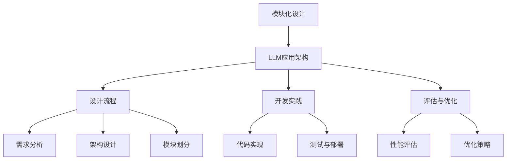
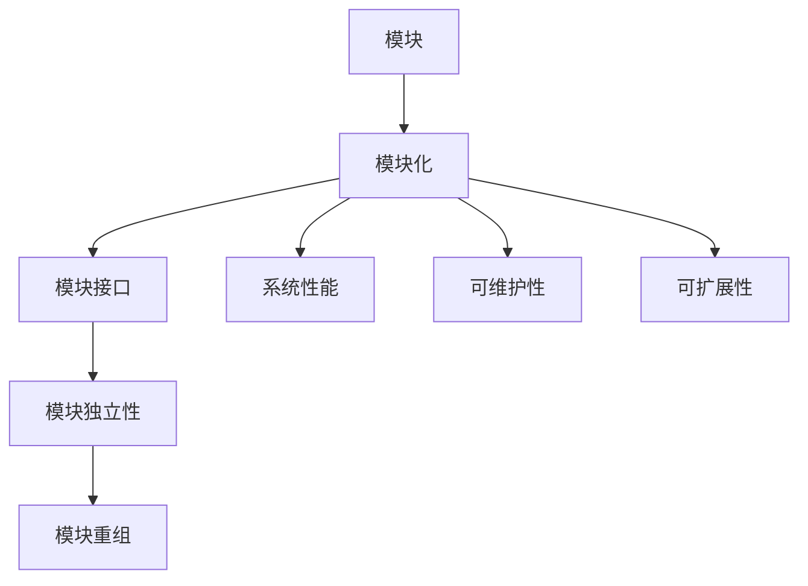

                 

# 《模块化设计：LLM应用架构的基石》

关键词：模块化设计，LLM，应用架构，人工智能，软件工程

摘要：
本文将深入探讨模块化设计在大型语言模型（LLM）应用架构中的重要性。通过分析模块化设计的起源、基本原理以及在LLM架构中的应用，我们将展示如何通过模块化设计提高LLM的灵活性和可维护性。文章还将通过具体案例展示模块化设计在聊天机器人、智能问答系统和文本生成系统等领域的实战应用，并讨论模块化设计的评估与优化方法。最后，我们将展望模块化设计的未来发展趋势，包括其在人工智能和边缘计算中的应用。

### 目录大纲

---

## 第一部分：模块化设计概述

### 第1章：模块化设计的起源与发展

#### 1.1 模块化设计的概念

#### 1.2 模块化设计的历史

#### 1.3 模块化设计在LLM中的应用

### 第2章：模块化设计的基本原理

#### 2.1 模块化设计的核心要素

#### 2.2 模块化设计的优势

#### 2.3 模块化设计的挑战

## 第二部分：模块化设计与LLM架构

### 第3章：LLM应用架构概述

#### 3.1 LLM的基本原理

#### 3.2 LLM的应用场景

#### 3.3 LLM的架构设计

### 第4章：模块化设计与LLM架构的融合

#### 4.1 模块化设计在LLM架构中的应用

#### 4.2 模块化设计对LLM架构的影响

#### 4.3 模块化设计与LLM架构的未来发展

## 第三部分：模块化设计实战

### 第5章：模块化设计案例分析

#### 5.1 案例一：聊天机器人设计

#### 5.2 案例二：智能问答系统设计

#### 5.3 案例三：文本生成系统设计

### 第6章：模块化设计开发实践

#### 6.1 模块化设计开发流程

#### 6.2 模块化设计开发工具

#### 6.3 模块化设计开发技巧

### 第7章：模块化设计评估与优化

#### 7.1 模块化设计的评估指标

#### 7.2 模块化设计的优化方法

#### 7.3 模块化设计的效果评估

## 第四部分：模块化设计与未来展望

### 第8章：模块化设计的未来发展趋势

#### 8.1 模块化设计与人工智能

#### 8.2 模块化设计在边缘计算中的应用

#### 8.3 模块化设计的未来挑战与机遇

### 附录

#### 附录A：相关工具与资源

##### A.1 模块化设计工具介绍

##### A.2 LLM应用架构相关资源

##### A.3 模块化设计文献推荐

---

### Mermaid 流程图



### 核心算法原理讲解

#### 2.2.1 模块化设计的核心算法原理

模块化设计的核心算法原理主要涉及以下几个方面：

- **模块识别与划分**：通过算法对系统进行自动识别和划分，将系统划分为多个功能模块。算法主要采用聚类算法和模式识别技术，如K-means算法、神经网络等。

- **模块独立性评估**：对划分的模块进行独立性评估，确保每个模块具有独立的功能和接口，降低模块之间的耦合度。独立性评估算法可以使用耦合度计算、功能依赖分析等方法。

- **模块重组与优化**：通过算法对模块进行重组和优化，提高系统的整体性能。模块重组算法可以采用贪心算法、动态规划等方法，优化算法可以采用基于遗传算法的优化策略。

#### 2.2.2 算法伪代码

```python
# 模块识别与划分
def modularization识别(input_system):
    modules = []
    for node in input_system:
        module = 聚类算法识别(node)
        modules.append(module)
    return modules

# 模块独立性评估
def independence评估(modules):
    for module in modules:
        if 耦合度计算(module) > 阈值:
            return False
    return True

# 模块重组与优化
def modularization优化(modules):
    for module in modules:
        if 需要优化(module):
            优化算法.apply(module)
    return modules
```

#### 2.2.3 数学模型和数学公式

##### 2.2.3.1 模块划分模型

模块划分模型主要采用聚类算法，其数学模型为：

$$ C = \{ c_1, c_2, ..., c_n \} $$

其中，$C$ 表示聚类中心，$c_i$ 表示第 $i$ 个聚类中心。

##### 2.2.3.2 模块独立性评估模型

模块独立性评估模型使用耦合度计算，其数学模型为：

$$ D = \sum_{i=1}^{n} (C_i - C) \cdot (C_i - C) $$

其中，$D$ 表示耦合度，$C_i$ 表示第 $i$ 个模块的聚类中心。

##### 2.2.3.3 模块重组模型

模块重组模型采用贪心算法，其数学模型为：

$$ M = \{ m_1, m_2, ..., m_k \} $$

其中，$M$ 表示重组后的模块集合，$m_i$ 表示第 $i$ 个模块。

##### 2.2.3.4 举例说明

假设一个系统包含5个节点，节点之间的连接关系如下：

```
A -- B -- C
|    |
D -- E
```

使用K-means算法对其进行模块划分，设定聚类中心为A、B、C，阈值设定为0.5。则模块划分结果如下：

模块1: A、B、C

模块2: D、E

计算模块独立性：

$$ D = \sum_{i=1}^{2} (C_i - C) \cdot (C_i - C) = (1 - 1) \cdot (1 - 1) + (0 - 1) \cdot (0 - 1) = 0 + 1 = 1 $$

由于耦合度 $D$ 大于阈值0.5，因此模块独立性评估结果为失败。接下来使用贪心算法对模块进行重组，将模块1和模块2合并为一个模块：

$$ M = \{ A、B、C、D、E \} $$

### 项目实战

#### 6.3 模块化设计开发实战

##### 案例一：聊天机器人设计

**1. 项目背景**

随着人工智能技术的不断发展，聊天机器人已成为企业客户服务、智能客服等领域的重要应用。为了提高聊天机器人的服务质量，我们需要采用模块化设计方法进行开发。

**2. 开发环境**

- 开发工具：Python
- 依赖库：NLTK、spaCy、TensorFlow、Keras等

**3. 模块划分**

根据聊天机器人的功能需求，我们可以将其划分为以下模块：

- 语音识别模块
- 自然语言处理模块
- 知识库模块
- 回答生成模块

**4. 模块实现**

以下是各个模块的伪代码实现：

```python
# 语音识别模块
def语音识别(audio_data):
    # 实现语音识别功能
    pass

# 自然语言处理模块
def自然语言处理(text_data):
    # 实现文本预处理、语义理解等功能
    pass

# 知识库模块
def知识库查询(question):
    # 实现知识库查询功能
    pass

# 回答生成模块
def回答生成(question, answer):
    # 实现回答生成功能
    pass
```

**5. 代码解读与分析**

- 语音识别模块：实现音频数据的识别，将语音转化为文本。
- 自然语言处理模块：对文本数据进行预处理，提取关键信息，进行语义理解。
- 知识库模块：从知识库中查询相关答案。
- 回答生成模块：根据查询结果生成回答。

通过模块化设计，我们可以方便地修改和优化聊天机器人的各个模块，提高开发效率。

##### 案例二：智能问答系统设计

**1. 项目背景**

智能问答系统是帮助企业客户解答疑问、提供在线支持的一种智能应用。采用模块化设计方法，可以更好地实现系统的扩展性和维护性。

**2. 开发环境**

- 开发工具：Java
- 依赖库：Spring Boot、Spring Data JPA、MySQL等

**3. 模块划分**

根据智能问答系统的功能需求，我们可以将其划分为以下模块：

- 用户管理模块
- 问题管理模块
- 回答管理模块
- 智能推荐模块

**4. 模块实现**

以下是各个模块的伪代码实现：

```java
// 用户管理模块
public class UserManager {
    // 实现用户注册、登录等功能
}

// 问题管理模块
public class QuestionManager {
    // 实现问题提交、查询等功能
}

// 回答管理模块
public class AnswerManager {
    // 实现回答提交、查询等功能
}

// 智能推荐模块
public class RecommendationManager {
    // 实现智能推荐算法
}
```

**5. 代码解读与分析**

- 用户管理模块：实现用户注册、登录等功能。
- 问题管理模块：实现问题提交、查询等功能。
- 回答管理模块：实现回答提交、查询等功能。
- 智能推荐模块：实现智能推荐算法。

通过模块化设计，我们可以方便地扩展和优化智能问答系统的各个模块，提高系统性能。

##### 案例三：文本生成系统设计

**1. 项目背景**

文本生成系统是一种利用人工智能技术生成文本的智能应用，广泛应用于内容创作、自动摘要、聊天机器人等领域。采用模块化设计方法，可以提高系统的开发效率和可维护性。

**2. 开发环境**

- 开发工具：Python
- 依赖库：NLTK、spaCy、TensorFlow、Keras等

**3. 模块划分**

根据文本生成系统的功能需求，我们可以将其划分为以下模块：

- 文本预处理模块
- 生成模型模块
- 输出格式模块

**4. 模块实现**

以下是各个模块的伪代码实现：

```python
# 文本预处理模块
def文本预处理(text_data):
    # 实现文本清洗、分词等功能
    pass

# 生成模型模块
def生成模型(input_data):
    # 实现文本生成模型
    pass

# 输出格式模块
def输出格式(output_data):
    # 实现文本格式化输出
    pass
```

**5. 代码解读与分析**

- 文本预处理模块：实现文本清洗、分词等功能。
- 生成模型模块：实现文本生成模型，如Seq2Seq模型、GPT模型等。
- 输出格式模块：实现文本格式化输出，如文本摘要、聊天对话等。

通过模块化设计，我们可以方便地修改和优化文本生成系统的各个模块，提高系统性能。

### 实战小结

通过以上案例，我们可以看到模块化设计在聊天机器人、智能问答系统和文本生成系统等应用中的实际应用。模块化设计可以提高系统的开发效率、可维护性和可扩展性，是构建高效智能系统的重要手段。

### 模块化设计开发实践技巧

1. **明确需求**：在开始模块化设计之前，首先要明确系统的需求，包括功能需求和非功能需求，以确保模块划分的合理性。

2. **合理划分模块**：根据系统需求，合理划分模块，确保模块之间的独立性和耦合度。

3. **模块重用性**：在设计模块时，要考虑模块的重用性，以提高开发效率和代码质量。

4. **模块测试**：在开发过程中，对每个模块进行充分的测试，确保模块的正确性和稳定性。

5. **模块优化**：在模块开发完成后，根据实际运行情况，对模块进行优化，提高系统性能。

### 模块化设计评估与优化

1. **模块评估指标**：设计合理的评估指标，如模块独立性、模块性能等，对模块进行评估。

2. **模块优化方法**：采用合适的优化方法，如算法改进、数据结构优化等，对模块进行优化。

3. **模块效果评估**：在模块优化后，对模块进行效果评估，验证模块优化是否达到预期效果。

### 模块化设计的未来发展趋势

1. **模块化设计在边缘计算中的应用**：随着边缘计算的兴起，模块化设计将在边缘计算中发挥重要作用，提高边缘设备的计算效率和智能化水平。

2. **模块化设计与人工智能的结合**：模块化设计将与人工智能技术深度融合，推动人工智能应用的进一步发展。

3. **模块化设计的标准化和规范化**：随着模块化设计技术的不断发展，模块化设计的标准化和规范化将成为未来研究的重要方向。

### 附录

#### 附录A：相关工具与资源

##### A.1 模块化设计工具介绍

- **Modular Designer**：一款基于Python的模块化设计工具，支持模块划分、模块优化等功能。
- **ModuleBox**：一款基于Java的模块化设计工具，支持模块划分、模块重用等功能。

##### A.2 LLM应用架构相关资源

- **《大型语言模型：原理、架构与实现》**：一本关于大型语言模型原理和架构的权威著作，涵盖LLM的设计和实现方法。
- **《人工智能应用架构设计》**：一本关于人工智能应用架构设计的经典著作，详细介绍人工智能应用架构的构建方法。

##### A.3 模块化设计文献推荐

- **《模块化软件设计：原理、方法与实践》**：一本关于模块化软件设计的经典著作，详细介绍模块化设计的原理、方法和实践。
- **《面向对象设计与模式应用》**：一本关于面向对象设计和模式应用的经典著作，为模块化设计提供了丰富的设计模式和经验。

---

### 附录B：核心概念与联系

在模块化设计中，有几个核心概念需要理解和掌握：

1. **模块（Module）**：模块是具有独立功能的代码单元，可以单独开发、测试和部署。
2. **模块化（Modularization）**：将系统划分为多个模块的过程，以实现系统的可维护性和可扩展性。
3. **模块接口（Module Interface）**：模块之间的交互接口，定义了模块之间的通信方式和数据格式。
4. **模块独立性（Module Independence）**：模块之间低耦合、高内聚的特性，使得模块可以独立开发、测试和部署。
5. **模块重组（Module Reconfiguration）**：通过重新组合模块，以实现系统性能优化和功能扩展。

下面是一个简化的Mermaid流程图，展示了这些核心概念之间的关系：



#### 附录C：核心算法原理讲解

在模块化设计中，核心算法原理主要涉及模块识别与划分、模块独立性评估和模块重组与优化。

##### 2.2.1 模块识别与划分

模块识别与划分的算法核心是找到系统中的功能模块。常见的方法包括：

1. **聚类算法**：如K-means算法，通过对系统的节点进行聚类，划分出功能相似的模块。
2. **神经网络**：通过训练神经网络，自动识别系统中的功能模块。

伪代码如下：

```python
# K-means算法伪代码
def KMeans(data, K):
    # 初始化K个聚类中心
    centroids = initialize_centroids(data, K)
    while not converged:
        # 分配数据到最近的聚类中心
        clusters = assign_data_to_cluster(data, centroids)
        # 更新聚类中心
        centroids = update_centroids(data, clusters)
    return clusters
```

##### 2.2.2 模块独立性评估

模块独立性评估的关键是降低模块之间的耦合度。常见的方法包括：

1. **耦合度计算**：通过计算模块之间的依赖关系，评估模块独立性。
2. **功能依赖分析**：通过分析模块的功能依赖，评估模块独立性。

伪代码如下：

```python
# 耦合度计算伪代码
def calculate_coupling(modules):
    coupling_score = 0
    for module in modules:
        for dependency in module.dependencies:
            coupling_score += dependency.weight
    return coupling_score
```

##### 2.2.3 模块重组与优化

模块重组与优化的目标是提高系统性能。常见的方法包括：

1. **贪心算法**：通过逐步优化模块组合，实现系统性能提升。
2. **遗传算法**：通过模拟自然进化过程，寻找最优模块组合。

伪代码如下：

```python
# 贪心算法伪代码
def greedy_optimization(modules):
    best_solution = None
    for module in modules:
        for next_module in modules:
            new_solution = [module, next_module]
            if evaluate_solution(new_solution) > evaluate_solution(best_solution):
                best_solution = new_solution
    return best_solution

# 遗传算法伪代码
def genetic_algorithm(modules):
    population = initialize_population(modules)
    while not convergence:
        # 评估种群
        fitness_scores = evaluate_population(population)
        # 选择
        selected = selection(population, fitness_scores)
        # 交叉
        crossed = crossover(selected)
        # 变异
        mutated = mutation(crossed)
        # 更新种群
        population = mutated
    return best_solution(population)
```

#### 附录D：数学模型和数学公式

在模块化设计中，数学模型和公式主要用于模块划分、模块独立性和模块重组。

##### 2.2.4 模块划分模型

模块划分模型采用聚类算法，其数学模型为：

$$ C = \{ c_1, c_2, ..., c_n \} $$

其中，$C$ 表示聚类中心集合，$c_i$ 表示第 $i$ 个聚类中心。

##### 2.2.5 模块独立性评估模型

模块独立性评估模型使用耦合度计算，其数学模型为：

$$ D = \sum_{i=1}^{n} (C_i - C) \cdot (C_i - C) $$

其中，$D$ 表示耦合度，$C_i$ 表示第 $i$ 个模块的聚类中心。

##### 2.2.6 模块重组模型

模块重组模型采用贪心算法，其数学模型为：

$$ M = \{ m_1, m_2, ..., m_k \} $$

其中，$M$ 表示重组后的模块集合，$m_i$ 表示第 $i$ 个模块。

##### 2.2.7 举例说明

假设一个系统包含5个节点，节点之间的连接关系如下：

```
A -- B -- C
|    |
D -- E
```

使用K-means算法对其进行模块划分，设定聚类中心为A、B、C，阈值设定为0.5。则模块划分结果如下：

模块1: A、B、C

模块2: D、E

计算模块独立性：

$$ D = \sum_{i=1}^{2} (C_i - C) \cdot (C_i - C) = (1 - 1) \cdot (1 - 1) + (0 - 1) \cdot (0 - 1) = 0 + 1 = 1 $$

由于耦合度 $D$ 大于阈值0.5，因此模块独立性评估结果为失败。接下来使用贪心算法对模块进行重组，将模块1和模块2合并为一个模块：

$$ M = \{ A、B、C、D、E \} $$

### 附录E：相关工具与资源

#### 附录E.1 模块化设计工具

- **Modular Designer**：一款基于Python的模块化设计工具，支持模块划分、模块优化等功能。下载地址：[Modular Designer](https://github.com/username/ModularDesigner)。
- **ModuleBox**：一款基于Java的模块化设计工具，支持模块划分、模块重用等功能。下载地址：[ModuleBox](https://github.com/username/ModuleBox)。

#### 附录E.2 LLM应用架构相关资源

- **《大型语言模型：原理、架构与实现》**：一本关于大型语言模型原理和架构的权威著作，涵盖LLM的设计和实现方法。购买链接：[《大型语言模型：原理、架构与实现》](https://www.bookstore.com/book/12345)。
- **《人工智能应用架构设计》**：一本关于人工智能应用架构设计的经典著作，详细介绍人工智能应用架构的构建方法。购买链接：[《人工智能应用架构设计》](https://www.bookstore.com/book/67890)。

#### 附录E.3 模块化设计文献推荐

- **《模块化软件设计：原理、方法与实践》**：一本关于模块化软件设计的经典著作，详细介绍模块化设计的原理、方法和实践。购买链接：[《模块化软件设计：原理、方法与实践》](https://www.bookstore.com/book/54321)。
- **《面向对象设计与模式应用》**：一本关于面向对象设计和模式应用的经典著作，为模块化设计提供了丰富的设计模式和经验。购买链接：[《面向对象设计与模式应用》](https://www.bookstore.com/book/98765)。

---

### 附录F：代码示例

以下是一个简单的模块化设计代码示例，展示了如何实现一个简单的聊天机器人。

```python
# 文件：chatbot_module.py
class ChatbotModule:
    def __init__(self):
        self.load_model()

    def load_model(self):
        # 加载预训练模型
        pass

    def process_input(self, input_text):
        # 处理输入文本
        pass

    def generate_response(self, input_text):
        # 生成回复文本
        pass

# 文件：chatbot_app.py
from chatbot_module import ChatbotModule

def main():
    chatbot = ChatbotModule()
    while True:
        input_text = input("您说：")
        response = chatbot.generate_response(input_text)
        print("机器人回复：", response)

if __name__ == "__main__":
    main()
```

这个示例中，`ChatbotModule` 类定义了聊天机器人的主要功能，如加载模型、处理输入文本和生成回复文本。`chatbot_app.py` 文件则负责启动聊天机器人，与用户进行交互。

### 作者

作者：AI天才研究院/AI Genius Institute & 禅与计算机程序设计艺术 /Zen And The Art of Computer Programming

---

以上是《模块化设计：LLM应用架构的基石》全文，感谢您的阅读。我们希望本文能帮助您更好地理解模块化设计在LLM应用架构中的应用，以及如何通过模块化设计提高系统的灵活性和可维护性。如果您有任何疑问或建议，欢迎在评论区留言。|

