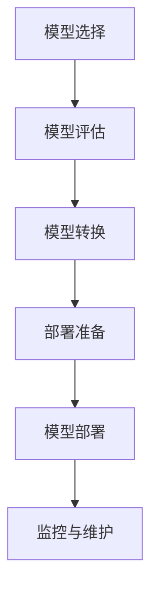
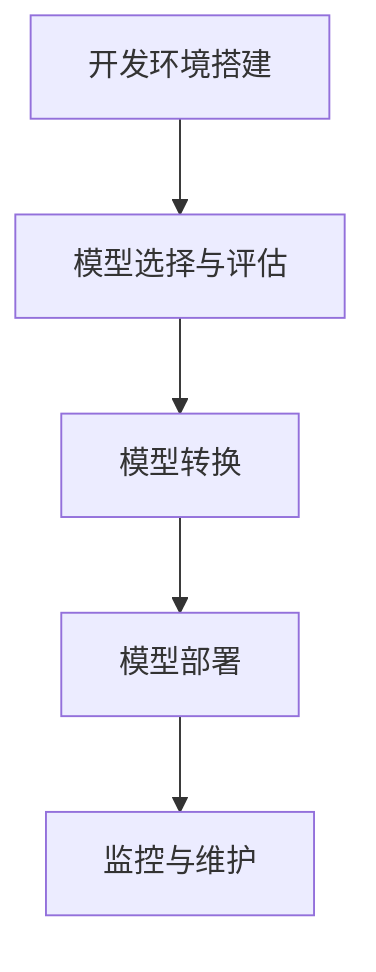
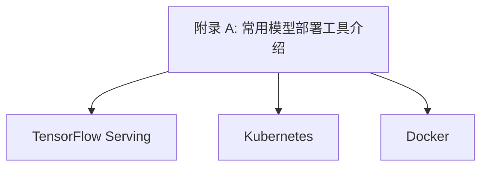

                 

# 模型部署

> 关键词：模型部署、机器学习、生产环境、性能优化、安全性

> 摘要：
本文将深入探讨模型部署的相关概念、技术基础、实战方法、性能优化、安全性与可靠性保障，以及未来的发展趋势和展望。通过逐步分析推理，我们将揭示模型部署的本质，帮助读者理解和掌握这一关键环节。

---

### 第1章: 模型部署概述

#### 1.1 模型部署的定义与重要性

**定义**：模型部署是指将训练完成的机器学习模型应用到实际的生产环境中，使其能够对外部数据进行预测和决策。这一过程通常包括模型选择、评估、转换、部署、监控和维护等多个环节。

**重要性**：模型部署是机器学习项目闭环的关键环节，直接影响到模型价值的实现和业务成果的转化。一个优秀的模型部署方案不仅能够保证模型的高性能和可靠性，还能适应不断变化的应用场景和数据规模。

#### 1.2 模型部署的核心挑战

**异构环境适配**：不同环境（如开发环境与生产环境）间的差异，包括硬件配置、操作系统、依赖库等。

**性能优化**：确保模型部署后达到预期的性能指标，包括计算速度、准确率、资源利用率等。

**可扩展性**：模型部署方案需要能够应对数据量和并发量的增长。

**安全性**：确保模型部署过程和数据安全，防止数据泄露和恶意攻击。

#### 1.3 模型部署流程

**模型选择**：根据应用场景选择合适的模型。

**模型评估**：对模型进行性能评估，确保其满足部署要求。

**模型转换**：将模型从训练环境转换为适合部署的格式。

**部署准备**：包括环境配置、数据预处理等。

**模型部署**：将模型部署到生产环境，进行预测服务。

**监控与维护**：持续监控模型性能，进行必要的维护和更新。

---

### 第2章: 模型部署技术基础

#### 2.1 部署前的准备工作

**环境配置**：确保部署环境与训练环境的一致性，包括硬件配置、操作系统版本、依赖库等。

**数据预处理**：对输入数据进行预处理，使其符合模型的输入要求，包括数据清洗、归一化、编码等。

#### 2.2 模型转换与优化

**模型转换**：将训练好的模型转换为适合部署的格式，如 ONNX、TensorFlow SavedModel 等。

**模型优化**：对模型进行优化，以提高部署后的性能，如模型剪枝、量化等。

#### 2.3 部署架构

**本地部署**：模型直接在本地运行，适用于低并发场景。

**服务器部署**：模型部署在服务器上，适用于高并发场景。

**云计算部署**：利用云计算平台进行模型部署，具有灵活性和可扩展性。

---

### 第3章: 模型部署实战

#### 3.1 实战一：使用 TensorFlow 模型进行部署

**实战背景**：介绍使用 TensorFlow 模型部署的背景和应用场景。

**开发环境搭建**：详细讲解开发环境的搭建过程，包括安装 TensorFlow、配置环境变量等。

**模型选择与评估**：选择合适的 TensorFlow 模型，并进行评估。

**模型转换**：将 TensorFlow 模型转换为 ONNX 格式。

**模型部署**：在服务器上部署模型，并进行预测服务。

**监控与维护**：对模型部署过程进行监控，并进行必要的维护。

---

### 第4章: 模型部署性能优化

#### 4.1 性能优化方法

**模型压缩**：通过模型剪枝、量化等技术减小模型体积。

**并发优化**：通过并行计算和负载均衡提高模型处理能力。

**缓存技术**：使用缓存减少模型重复计算。

#### 4.2 性能优化实践

**实战背景**：介绍性能优化实践的应用场景。

**模型压缩**：讲解如何对模型进行剪枝和量化。

**并发优化**：讲解如何进行并行计算和负载均衡。

**缓存技术**：讲解如何使用缓存提高模型性能。

---

### 第5章: 模型部署安全性与可靠性保障

#### 5.1 安全性与可靠性挑战

**数据安全**：保护模型训练和部署过程中涉及的数据。

**模型安全**：防止模型被恶意攻击，如对抗攻击。

#### 5.2 安全性与可靠性保障措施

**数据加密**：对数据进行加密，确保数据安全。

**模型验证**：对模型进行验证，确保模型可靠。

**监控与审计**：对模型部署过程进行监控，确保安全性和可靠性。

---

### 第6章: 模型部署常见问题与解决方案

#### 6.1 异常处理

**异常类型**：列举常见的异常类型，如输入数据异常、模型计算异常等。

**解决方案**：针对不同类型的异常，提供相应的解决方案。

#### 6.2 性能问题

**性能瓶颈分析**：分析常见的性能瓶颈，如计算资源不足、数据读取缓慢等。

**优化方案**：提供优化性能的方案，如调整模型参数、优化数据预处理流程等。

---

### 第7章: 模型部署案例分析

#### 7.1 案例背景

**案例介绍**：介绍模型部署案例的背景和应用场景。

#### 7.2 模型部署流程

**模型选择与评估**：选择合适的模型，并进行评估。

**模型转换**：将模型转换为适合部署的格式。

**模型部署**：部署模型，并进行预测服务。

**监控与维护**：对模型部署过程进行监控，并进行必要的维护。

---

### 第8章: 模型部署未来趋势与展望

#### 8.1 未来发展趋势

**模型自动化部署**：自动化工具将简化模型部署流程。

**边缘计算**：模型部署将从云端向边缘计算扩展。

**混合部署**：结合云端和边缘计算，实现更灵活的部署方案。

#### 8.2 模型部署展望

**可解释性**：提高模型的可解释性，增强用户信任。

**安全性**：提升模型部署的安全性，防止数据泄露和恶意攻击。

---

### 附录

#### 附录 A: 常用模型部署工具介绍

**TensorFlow Serving**：TensorFlow 官方提供的模型部署工具。

**Kubernetes**：用于容器化模型部署和管理的开源平台。

**Docker**：用于创建容器化模型部署环境。

---

### 结语

模型部署是机器学习项目成功的关键环节。通过本文的逐步分析推理，我们深入探讨了模型部署的概念、技术基础、实战方法、性能优化、安全性与可靠性保障，以及未来的发展趋势和展望。希望本文能为读者提供有价值的参考和启示，助力其在模型部署领域取得突破性进展。

---

### 作者信息

作者：AI天才研究院/AI Genius Institute & 禅与计算机程序设计艺术 /Zen And The Art of Computer Programming

---

（本文完）

---

接下来，我们将逐章深入详细阐述模型部署的各个方面。每章将涵盖核心概念、技术细节、实战案例和未来展望等内容。让我们开始这一段充满深度与启示的旅程。 <|endoftext|>

