                 

### 模式识别

#### 关键词
- 模式识别
- 特征提取
- 监督学习
- 非监督学习
- 深度学习

#### 摘要
模式识别是计算机科学和人工智能领域中一个重要的分支，旨在通过分析数据中的模式来识别对象和分类。本文将从基础概念、算法原理、应用实例等多个角度全面解析模式识别，探讨其在图像识别、语音识别、生物特征识别等领域的应用，并展望其未来发展方向。

### 《模式识别》目录大纲

#### 第一部分：模式识别基础

##### 第1章：模式识别概述
- **1.1 模式识别的定义与分类**
- **1.2 模式识别的基本概念**
- **1.3 模式识别的应用领域**

##### 第2章：特征提取与选择
- **2.1 特征提取方法**
- **2.2 特征选择技术**
- **2.3 特征降维技术**

##### 第3章：监督学习算法
- **3.1 线性分类器**
- **3.2 决策树**
- **3.3 支持向量机**
- **3.4 随机森林**
- **3.5 神经网络**

#### 第二部分：非监督学习算法

##### 第4章：聚类算法
- **4.1 K均值聚类**
- **4.2 层次聚类**
- **4.3 密度聚类**

##### 第5章：降维与嵌入
- **5.1 主成分分析（PCA）**
- **5.2 局部线性嵌入（LLE）**
- **5.3 t-SNE**

#### 第三部分：模式识别应用

##### 第6章：图像识别
- **6.1 图像特征提取**
- **6.2 视觉皮层模型**
- **6.3 卷积神经网络（CNN）**

##### 第7章：语音识别
- **7.1 语音特征提取**
- **7.2 声学模型**
- **7.3 语言模型**
- **7.4 声学与语言模型的结合**

##### 第8章：生物特征识别
- **8.1 虹膜识别**
- **8.2 指纹识别**
- **8.3 语音识别**

##### 第9章：模式识别的未来发展
- **9.1 深度学习在模式识别中的应用**
- **9.2 模式识别在人工智能中的应用前景**
- **9.3 模式识别技术的挑战与机遇**

#### 附录

##### 附录A：常用算法公式与理论
- **A.1 线性分类器公式**
- **A.2 支持向量机（SVM）公式**
- **A.3 主成分分析（PCA）公式**

##### 附录B：项目实战
- **B.1 图像识别项目实战**
- **B.2 语音识别项目实战**
- **B.3 生物特征识别项目实战**
- **B.4 实际案例分析与代码解读**

##### 附录C：参考资源与扩展阅读
- **C.1 相关书籍推荐**
- **C.2 开源项目与数据集**
- **C.3 学术论文精选**
- **C.4 在线课程与论坛**

### 第1章：模式识别概述

#### 1.1 模式识别的定义与分类

模式识别是指通过建立数学模型或算法，从数据中提取模式和特征，以实现对对象或事件的分类、识别和预测。模式识别的方法可以分为以下几类：

1. **统计模式识别**：基于统计学理论，通过建立概率模型来识别数据中的模式。
2. **结构模式识别**：基于结构或几何特征，通过分析数据的几何形状、拓扑结构等来识别模式。
3. **人工智能模式识别**：结合机器学习、深度学习等技术，通过学习数据中的特征和规律来实现模式识别。

##### Mermaid 流程图

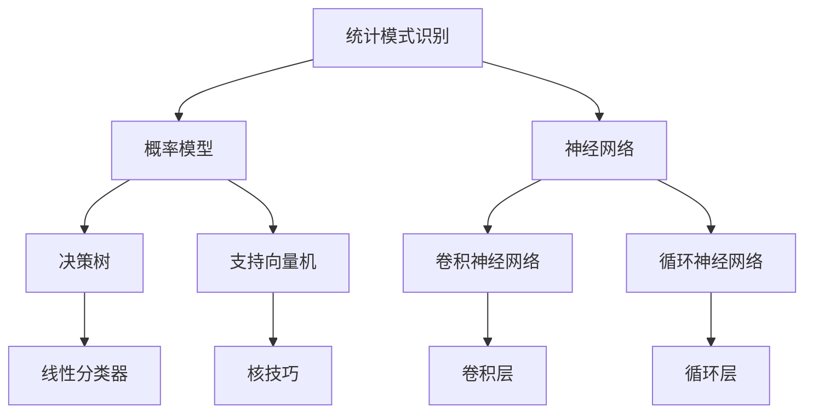

#### 1.2 模式识别的基本概念

模式识别涉及以下几个基本概念：

- **特征**：描述对象或数据的属性或度量，用于区分不同对象或数据。
- **样本**：代表对象或数据的实例，通常是一个多维向量。
- **模型**：描述数据中潜在模式的数学结构，用于预测或分类。

##### 数学模型

$$
\text{特征向量} = [x_1, x_2, ..., x_n]
$$

$$
\text{样本} = \{x_1, x_2, ..., x_n\}
$$

$$
\text{模型} = f(\text{特征向量})
$$

#### 1.3 模式识别的应用领域

模式识别在各个领域都有广泛的应用，主要包括：

- **图像处理**：包括图像分类、目标检测、图像分割等。
- **语音处理**：包括语音识别、语音合成、说话人识别等。
- **生物特征识别**：包括指纹识别、面部识别、虹膜识别等。
- **自然语言处理**：包括情感分析、文本分类、机器翻译等。
- **金融风控**：包括欺诈检测、风险评级等。
- **智能交通**：包括车辆检测、交通流量分析等。

##### Mermaid 流程图

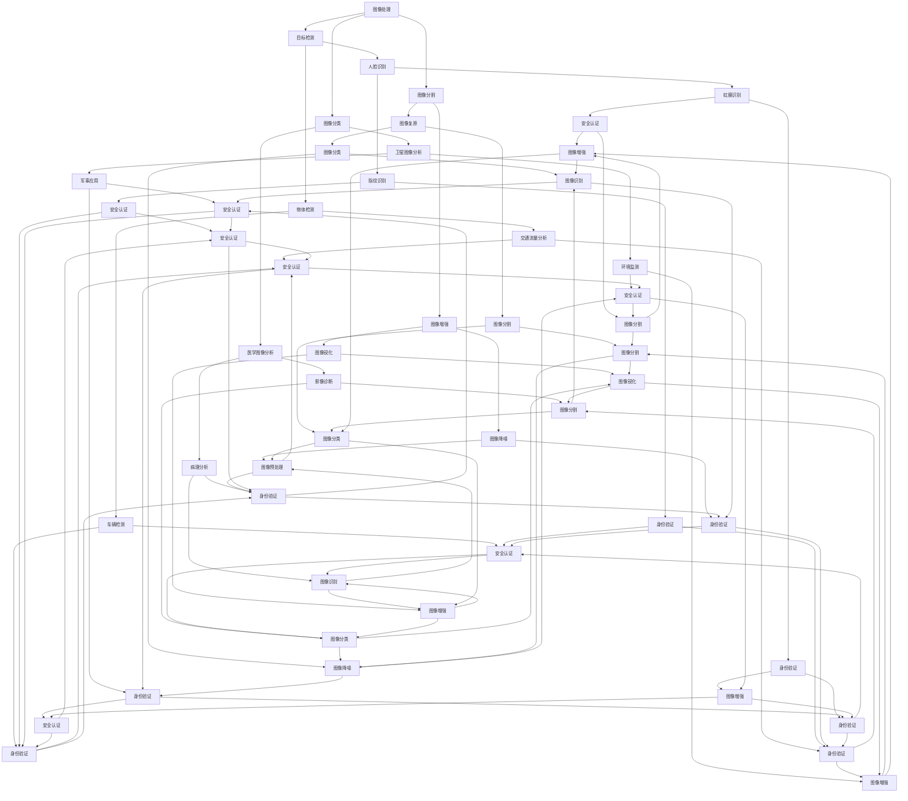

### 第2章：特征提取与选择

#### 2.1 特征提取方法

特征提取是将原始数据转换为对模式识别任务有用的特征表示的过程。以下是一些常用的特征提取方法：

- **图像特征提取**：用于提取图像的特征，如边缘检测、纹理分析、颜色特征等。
- **语音特征提取**：用于提取语音的特征，如梅尔频率倒谱系数（MFCC）、感知线性预测（PLP）等。
- **文本特征提取**：用于提取文本的特征，如词袋模型、TF-IDF、词嵌入等。

##### Mermaid 流程图

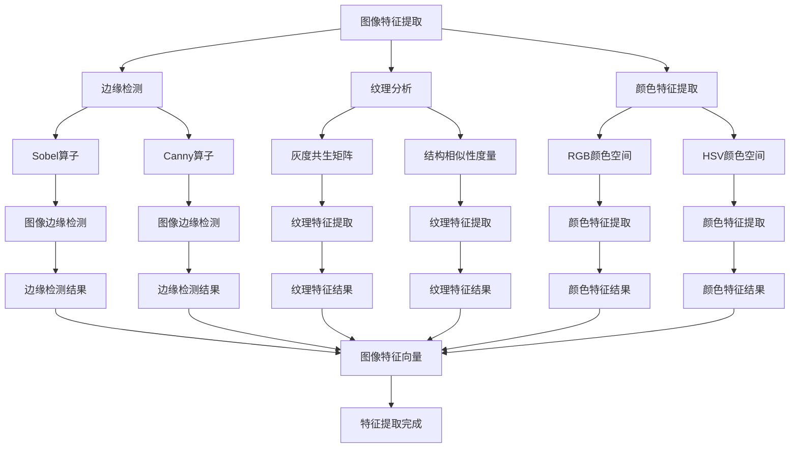

##### 数学模型

$$
\text{特征向量} = [f_1, f_2, ..., f_n]
$$

其中，$f_i$ 是第 $i$ 个特征。

#### 2.2 特征选择技术

特征选择是在特征提取之后进行的一项重要步骤，目的是从大量的特征中选择出最有用的特征，以提高模式识别的性能。以下是一些常用的特征选择技术：

- **过滤法**：通过计算每个特征的统计值（如方差、互信息等）来选择特征。
- **包裹法**：通过迭代选择特征，每次选择后重新训练模型，并根据模型性能选择下一个特征。
- **嵌入式方法**：在模型训练过程中嵌入特征选择，如 Lasso 正则化。

##### Mermaid 流�程图

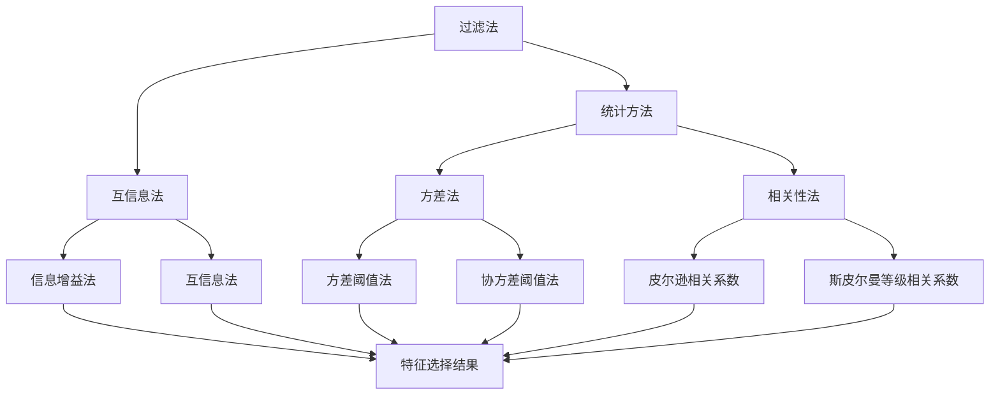

##### 数学模型

$$
\text{特征选择评分} = s_i = \frac{1}{n}\sum_{j=1}^{n} w_{ij} f_j
$$

其中，$s_i$ 是第 $i$ 个特征的评分，$w_{ij}$ 是第 $i$ 个特征对第 $j$ 个样本的权重，$f_j$ 是第 $j$ 个样本的特征值。

#### 2.3 特征降维技术

特征降维是将高维特征空间映射到低维空间，以减少数据维度，提高计算效率。以下是一些常用的特征降维技术：

- **主成分分析（PCA）**：通过保留主要变化，将高维数据映射到低维空间。
- **线性判别分析（LDA）**：通过最大化类内散度，最小化类间散度，将数据映射到低维空间。
- **局部线性嵌入（LLE）**：通过保持局部几何结构，将高维数据映射到低维空间。
- **t-Distributed Stochastic Neighbor Embedding（t-SNE）**：通过保持局部邻域结构，将高维数据映射到低维空间。

##### Mermaid 流程图

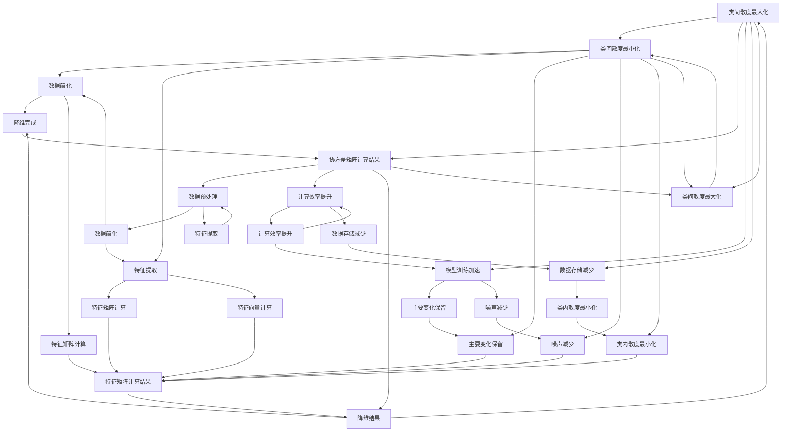

##### 数学模型

**主成分分析（PCA）**

$$
\text{协方差矩阵} = \frac{1}{n-1}\sum_{i=1}^{n}(x_i - \mu)(x_i - \mu)^T
$$

$$
\text{特征值，特征向量} = \lambda, \text{eigen vectors}
$$

$$
\text{主成分} = X\text{特征向量}
$$

**线性判别分析（LDA）**

$$
\text{协方差矩阵} = \frac{1}{n}\sum_{i=1}^{n}(x_i - \mu_c)(x_i - \mu_c)^T
$$

$$
\text{特征值，特征向量} = \lambda, \text{eigen vectors}
$$

$$
\text{主成分} = X\text{特征向量}
$$

**局部线性嵌入（LLE）**

$$
J = \sum_{i=1}^{n}\frac{1}{k}\sum_{j=1}^{k}||x_i - x_j||^2
$$

$$
W = \text{最小二乘解}
$$

$$
\text{嵌入空间} = XW
$$

**t-Distributed Stochastic Neighbor Embedding（t-SNE）**

$$
\text{高斯分布参数} = \exp{\left(-\frac{||x_i - x_j||^2}{2\sigma^2}\right)}
$$

$$
\text{高斯分布} = q_{ij}
$$

$$
\text{概率矩阵} = P = \text{softmax}(Q)
$$

$$
\text{梯度下降} = \nabla_{x_i}\ell = -\sum_{j}\left(P_{ij} - q_{ij}\right)x_j
$$

$$
\text{优化目标} = \ell = -\sum_{i,j}\left(P_{ij} - q_{ij}\right)\ln{q_{ij}}
$$

### 第3章：监督学习算法

监督学习算法是模式识别中的重要方法之一，通过已知的输入和输出对模型进行训练，以便能够对新数据进行预测。本章将介绍几种常见的监督学习算法，包括线性分类器、决策树、支持向量机、随机森林和神经网络。

#### 3.1 线性分类器

线性分类器是一种基于线性模型的分类算法，通过计算输入特征向量与模型权重的内积来进行分类决策。常见的线性分类器包括感知机、线性回归和线性判别分析。

**感知机算法**

感知机算法是一种简单的线性分类算法，其目标是找到一个最佳的超平面来将数据分为不同的类别。感知机算法使用以下步骤：

1. 初始化权重向量 $w$ 和偏置项 $b$。
2. 对于每个训练样本 $(x_i, y_i)$，计算预测标签 $y_{\hat{i}} = \text{sign}(w \cdot x_i + b)$。
3. 如果 $y_{\hat{i}} \neq y_i$，则更新权重向量 $w$ 和偏置项 $b$。

**线性回归**

线性回归是一种用于预测连续值的线性模型，其目标是最小化预测值与真实值之间的误差。线性回归的模型公式为：

$$
y = w_0 + w_1x_1 + w_2x_2 + ... + w_nx_n
$$

其中，$w_0$ 是截距，$w_1, w_2, ..., w_n$ 是权重。

**线性判别分析**

线性判别分析（Linear Discriminant Analysis，LDA）是一种用于分类的线性模型，其目标是最小化类内散度，最大化类间散度。LDA 的模型公式为：

$$
y = w_0 + w_1x_1 + w_2x_2 + ... + w_nx_n + b
$$

其中，$w_0$ 是截距，$w_1, w_2, ..., w_n$ 是权重，$b$ 是偏置项。

##### Mermaid 流程图

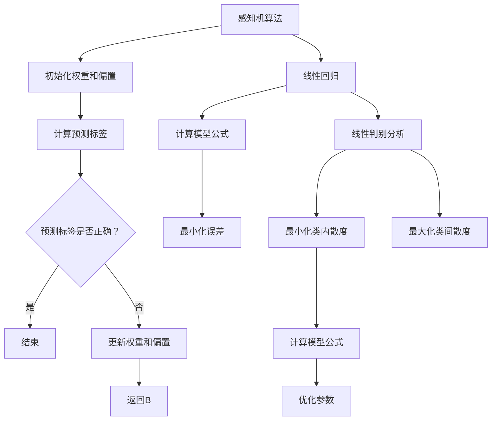

##### 数学模型

**感知机算法**

$$
y_{\hat{i}} = \text{sign}(w \cdot x_i + b)
$$

$$
w_{new} = w + \eta y_i x_i
$$

$$
b_{new} = b + \eta y_i
$$

**线性回归**

$$
y = w_0 + w_1x_1 + w_2x_2 + ... + w_nx_n
$$

$$
\min_{w} \sum_{i=1}^{n} (y_i - \hat{y}_i)^2
$$

**线性判别分析**

$$
\text{协方差矩阵} = \frac{1}{n}\sum_{i=1}^{n}(x_i - \mu_c)(x_i - \mu_c)^T
$$

$$
\text{特征值，特征向量} = \lambda, \text{eigen vectors}
$$

$$
w = \sum_{k=1}^{c} \mu_{c,k}\text{eigen vectors}_{k}
$$

#### 3.2 决策树

决策树是一种基于树形结构的分类算法，通过一系列的测试来划分数据集，每个测试都基于一个特征，并且将数据划分为两个或更多的子集。决策树的叶节点表示最终的分类结果，内部节点表示测试特征。

**ID3算法**

ID3（Iterative Dichotomiser 3）算法是一种基于信息增益的决策树构建算法。信息增益定义为：

$$
\text{信息增益} = \sum_{v \in V} p(v) \cdot \log_2 p(v)
$$

其中，$V$ 是特征的所有可能取值集合，$p(v)$ 是在特征取值为 $v$ 时类别 $c$ 的概率。

**C4.5算法**

C4.5算法是对ID3算法的改进，它不仅考虑信息增益，还考虑了增益率（gain ratio），以减少过拟合。增益率的计算公式为：

$$
\text{增益率} = \frac{\text{信息增益}}{\text{特征熵}}
$$

其中，特征熵定义为：

$$
\text{特征熵} = -\sum_{v \in V} p(v) \cdot \log_2 p(v)
$$

##### Mermaid 流程图

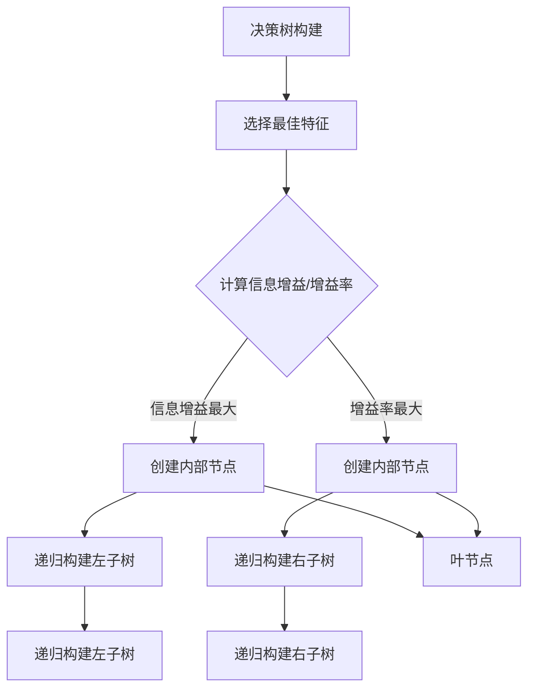

##### 数学模型

**信息增益**

$$
\text{信息增益} = \sum_{v \in V} p(v) \cdot \log_2 p(v)
$$

**特征熵**

$$
\text{特征熵} = -\sum_{v \in V} p(v) \cdot \log_2 p(v)
$$

**增益率**

$$
\text{增益率} = \frac{\text{信息增益}}{\text{特征熵}}
$$

#### 3.3 支持向量机

支持向量机（Support Vector Machine，SVM）是一种基于边界最大化的分类算法，其目标是找到一个最佳的超平面，使得不同类别的数据点之间的距离最大化。

**线性SVM**

线性SVM的目标是最小化一个二次损失函数，同时满足KKT条件：

$$
\min_{w, b} \frac{1}{2}w^Tw + C\sum_{i=1}^{n}\xi_i
$$

$$
s.t. y_i(w \cdot x_i + b) \geq 1 - \xi_i, \xi_i \geq 0
$$

其中，$C$ 是正则化参数，$\xi_i$ 是松弛变量。

**核SVM**

当数据是非线性的时，可以使用核函数将数据映射到高维空间，然后在高维空间中找到最佳的超平面。常用的核函数包括线性核、多项式核和径向基函数核（RBF）。

$$
K(x_i, x_j) = \phi(x_i)^T \phi(x_j)
$$

其中，$\phi$ 是映射函数，$K$ 是核函数。

##### Mermaid 流程图

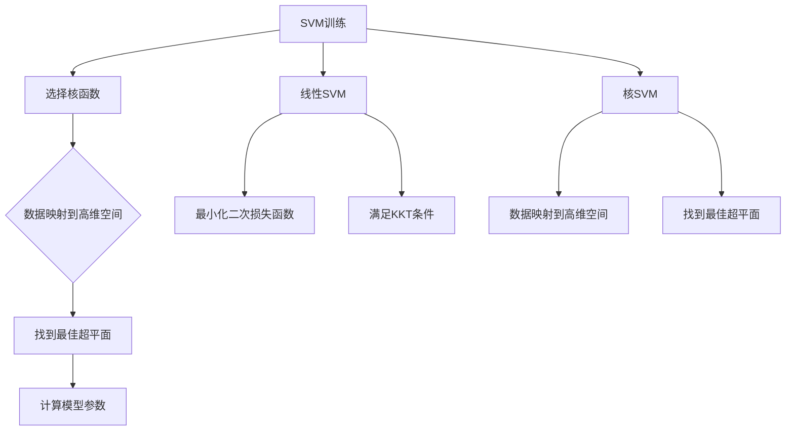

##### 数学模型

**线性SVM**

$$
\min_{w, b} \frac{1}{2}w^Tw + C\sum_{i=1}^{n}\xi_i
$$

$$
s.t. y_i(w \cdot x_i + b) \geq 1 - \xi_i, \xi_i \geq 0
$$

**核SVM**

$$
\min_{w, b} \frac{1}{2}w^TWw + C\sum_{i=1}^{n}\xi_i
$$

$$
s.t. y_i(w^T Kx_i + b) \geq 1 - \xi_i, \xi_i \geq 0
$$

其中，$W$ 是核矩阵。

#### 3.4 随机森林

随机森林（Random Forest）是一种基于决策树的集成学习方法，通过构建多个决策树并对它们的结果进行投票来提高模型的泛化能力。

**随机森林算法**

随机森林算法的主要步骤包括：

1. 随机选择特征子集。
2. 构建单个决策树。
3. 对每个树进行分类，并计算每个类的投票。
4. 选择投票最多的类别作为最终分类结果。

##### Mermaid 流程图

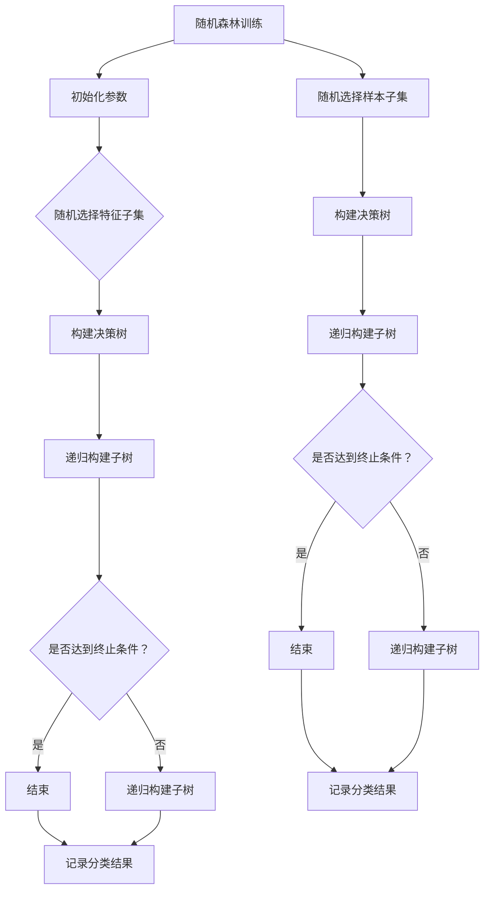

##### 数学模型

随机森林没有明确的数学模型，因为它是基于多个决策树的集成。然而，可以使用统计方法来分析随机森林的性能，如节点分裂的选择概率、特征的重要性等。

#### 3.5 神经网络

神经网络是一种模拟人脑神经元连接的结构，通过多层神经元节点组成的网络进行计算。神经网络的核心是神经元之间的连接权重和激活函数。

**神经网络结构**

神经网络通常由输入层、隐藏层和输出层组成。每个层包含多个神经元，神经元之间通过权重进行连接。

- **输入层**：接收外部输入数据。
- **隐藏层**：对输入数据进行变换和处理。
- **输出层**：产生输出结果。

**激活函数**

激活函数是神经网络中的一个关键组成部分，用于引入非线性特性。常见的激活函数包括：

- **sigmoid 函数**：$f(x) = \frac{1}{1 + e^{-x}}$
- **ReLU 函数**：$f(x) = \max(0, x)$
- **Tanh 函数**：$f(x) = \frac{e^x - e^{-x}}{e^x + e^{-x}}$

**反向传播算法**

反向传播算法是一种用于训练神经网络的方法，通过计算输出层的误差，反向传播到隐藏层和输入层，并更新各层的权重。

**数学模型**

神经网络中的每个神经元可以表示为：

$$
z_j = \sum_{i=1}^{n} w_{ij}x_i + b_j
$$

$$
a_j = f(z_j)
$$

其中，$z_j$ 是神经元的输入，$a_j$ 是神经元的输出，$w_{ij}$ 是连接权重，$b_j$ 是偏置项，$f$ 是激活函数。

反向传播算法的更新规则为：

$$
\Delta w_{ij} = \eta \cdot a_j \cdot (1 - a_j) \cdot x_i \cdot \Delta z_j
$$

$$
\Delta b_j = \eta \cdot a_j \cdot (1 - a_j) \cdot \Delta z_j
$$

其中，$\eta$ 是学习率，$\Delta z_j$ 是隐藏层神经元的误差。

### 第4章：非监督学习算法

非监督学习算法是在没有明确标签的数据上进行训练，目的是发现数据中的内在结构和规律。本章将介绍几种常见的非监督学习算法，包括聚类算法和降维算法。

#### 4.1 聚类算法

聚类算法是将数据分为多个类别，使同一类别内的数据尽可能相似，而不同类别之间的数据尽可能不同。聚类算法可以分为基于距离的聚类和基于密度的聚类。

**K均值聚类**

K均值聚类是一种基于距离的聚类算法，通过迭代优化聚类中心来划分数据点。K均值算法的步骤如下：

1. 随机选择 $K$ 个初始聚类中心。
2. 对于每个数据点，计算其与每个聚类中心的距离，并将其分配到距离最近的聚类中心。
3. 更新每个聚类中心为该聚类内所有数据点的平均值。
4. 重复步骤2和3，直到聚类中心不再发生变化或满足其他终止条件。

**层次聚类**

层次聚类是一种基于层次结构的聚类算法，通过逐步合并或分裂聚类来构建层次结构。层次聚类可以分为凝聚层次聚类和分裂层次聚类。

- **凝聚层次聚类**：从单个数据点开始，逐步合并相似的数据点，直到满足终止条件。
- **分裂层次聚类**：从单个大数据点开始，逐步分裂数据点，直到每个数据点都成为单独的聚类。

**密度聚类**

密度聚类是一种基于密度的聚类算法，通过识别高密度区域并将它们合并成聚类。最常用的密度聚类算法是DBSCAN（Density-Based Spatial Clustering of Applications with Noise）。

DBSCAN算法的步骤如下：

1. 选择一个初始点作为核心点，并将其标记为已访问。
2. 扩展核心点，直到形成一个核心点簇。
3. 对于边界点，判断其是否属于一个核心点簇或一个新的聚类。
4. 重复步骤1-3，直到所有数据点都被访问。

##### Mermaid 流程图

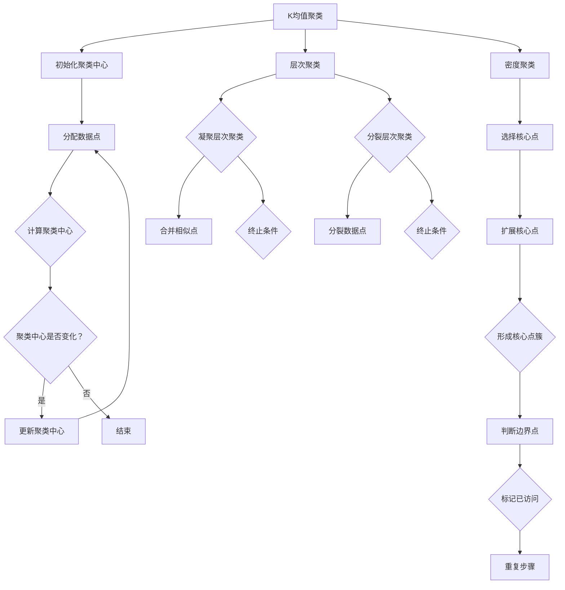

##### 数学模型

**K均值聚类**

$$
\text{聚类中心} = \frac{1}{k}\sum_{i=1}^{k} x_i
$$

$$
\text{距离} = \sqrt{\sum_{i=1}^{k} (x_i - \text{聚类中心})^2}
$$

**层次聚类**

$$
\text{相似度} = \frac{\sum_{i=1}^{k} d(x_i, y_i)}{k}
$$

$$
\text{合并} = \min_{i, j} \text{相似度}
$$

**DBSCAN**

$$
\text{核心点密度} = \frac{1}{\text{邻域半径}} \sum_{i=1}^{n} \delta(x_i, y_i)
$$

$$
\text{邻域半径} = \frac{1}{\text{邻域半径}} \sum_{i=1}^{n} \delta(x_i, y_i)
$$

其中，$\delta(x_i, y_i)$ 是点 $x_i$ 和 $y_i$ 之间的距离。

#### 4.2 降维与嵌入

降维是将高维数据映射到低维空间，以减少数据维度和计算成本。降维算法可以分为线性降维和非线性降维。

**主成分分析（PCA）**

主成分分析是一种线性降维算法，通过保留主要变化来简化数据。PCA的步骤如下：

1. 计算协方差矩阵。
2. 计算协方差矩阵的特征值和特征向量。
3. 选择最大的 $k$ 个特征向量作为主成分。
4. 将数据投影到主成分空间。

**局部线性嵌入（LLE）**

局部线性嵌入是一种非线性降维算法，通过保持局部几何结构来简化数据。LLE的步骤如下：

1. 选择邻域，计算邻域内的线性关系。
2. 使用最小二乘法求解线性关系。
3. 将数据投影到低维空间。

**t-Distributed Stochastic Neighbor Embedding（t-SNE）**

t-SNE是一种非线性降维算法，通过保持局部邻域结构来简化数据。t-SNE的步骤如下：

1. 计算高维数据点之间的高斯分布。
2. 计算低维数据点之间的高斯分布。
3. 使用梯度下降法优化低维数据点的位置。

##### Mermaid 流程图

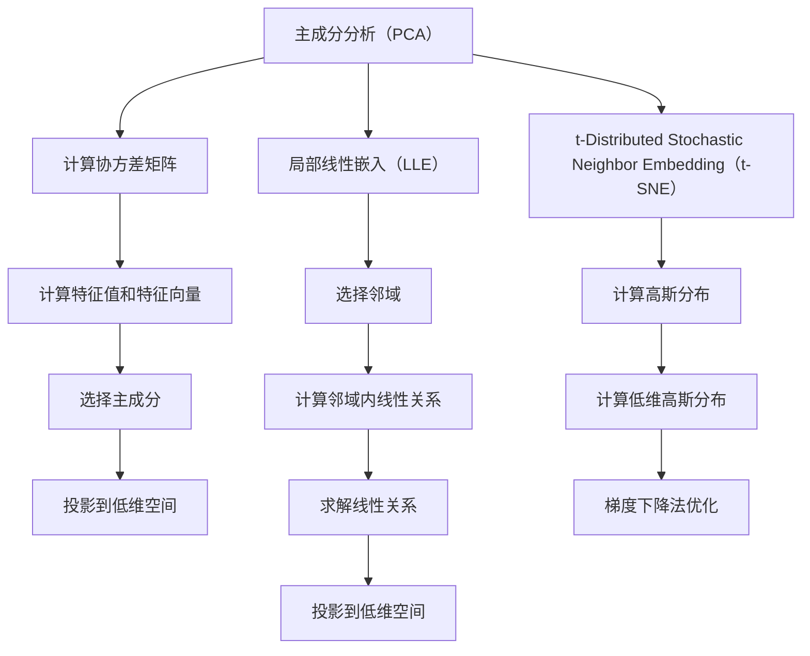

##### 数学模型

**主成分分析（PCA）**

$$
\text{协方差矩阵} = \frac{1}{n-1}XX^T
$$

$$
\text{特征值，特征向量} = \lambda, \text{eigen vectors}
$$

$$
\text{主成分} = X\text{特征向量}
$$

**局部线性嵌入（LLE）**

$$
J = \sum_{i=1}^{n}\frac{1}{k}\sum_{j=1}^{k}||x_i - x_j||^2
$$

$$
W = \text{最小二乘解}
$$

$$
\text{嵌入空间} = XW
$$

**t-Distributed Stochastic Neighbor Embedding（t-SNE）**

$$
\text{高斯分布参数} = \exp{\left(-\frac{||x_i - x_j||^2}{2\sigma^2}\right)}
$$

$$
\text{高斯分布} = q_{ij}
$$

$$
\text{概率矩阵} = P = \text{softmax}(Q)
$$

$$
\text{梯度下降} = \nabla_{x_i}\ell = -\sum_{j}\left(P_{ij} - q_{ij}\right)x_j
$$

$$
\text{优化目标} = \ell = -\sum_{i,j}\left(P_{ij} - q_{ij}\right)\ln{q_{ij}}
$$

### 第5章：降维与嵌入

降维与嵌入技术是数据科学和机器学习中的重要工具，用于简化数据集并揭示数据中的潜在结构。本章将详细介绍两种常见的降维技术——主成分分析（PCA）和局部线性嵌入（LLE），以及一种非线性嵌入技术——t-SNE。

#### 5.1 主成分分析（PCA）

主成分分析（PCA）是一种线性降维技术，它通过将数据投影到新的正交坐标系中，从而降低数据的维度。PCA的核心理念是找到一组新的基向量，这些基向量能够最大化数据中的方差。

**基本原理**

1. **标准化数据**：为了消除不同特征之间的缩放差异，首先对数据进行标准化处理。

   $$
   z_i = \frac{x_i - \mu_i}{\sigma_i}
   $$

   其中，$x_i$ 是原始特征，$\mu_i$ 是特征 $i$ 的均值，$\sigma_i$ 是特征 $i$ 的标准差。

2. **计算协方差矩阵**：计算数据点的协方差矩阵，该矩阵描述了数据点之间的线性关系。

   $$
   S = \frac{1}{N-1}XX^T
   $$

   其中，$X$ 是标准化后的数据矩阵，$N$ 是数据点的数量。

3. **求解特征值和特征向量**：求解协方差矩阵的特征值和特征向量，特征值越大，对应的特征向量对数据的解释能力越强。

   $$
   \lambda, \text{vectors} = \text{eig}(S)
   $$

4. **选择主成分**：选择前 $k$ 个具有最大特征值的特征向量作为主成分，并将数据投影到这些主成分上。

   $$
   Y = X\text{vectors}[:k]
   $$

**伪代码**

```python
def pca(X, k):
    # X 是输入数据矩阵，k 是要保留的主成分数量
    
    # 标准化数据
    X_mean = np.mean(X, axis=0)
    X_std = np.std(X, axis=0)
    X standardized = (X - X_mean) / X_std
    
    # 计算协方差矩阵
    S = (X standardized).T @ X standardized
    
    # 求解特征值和特征向量
    eigenvalues, eigenvectors = np.linalg.eigh(S)
    
    # 选择主成分
    k_eigenvectors = eigenvectors[:, np.argsort(eigenvalues)[::-1]][:k]
    
    # 投影到主成分
    Y = X @ k_eigenvectors
    
    return Y
```

**应用案例**

PCA广泛应用于图像处理、文本降维、生物信息学等领域。例如，在图像处理中，PCA可以用于图像压缩，通过保留主要成分来大幅度减少图像的数据量。

#### 5.2 局部线性嵌入（LLE）

局部线性嵌入（LLE）是一种基于局部几何结构的非线性降维技术。LLE的目标是在低维空间中保持数据点的局部线性结构。

**基本原理**

1. **选择邻域**：为每个数据点选择一个邻域，通常使用K最近邻算法。

   $$
   k = \text{int}(n / r)
   $$
   
   其中，$n$ 是数据点的数量，$r$ 是邻域半径。

2. **计算邻域内的线性关系**：对于每个数据点 $x_i$，计算其邻域点的线性组合，使其与数据点之间的距离最小化。

   $$
   J = \sum_{i=1}^{n}\frac{1}{k}\sum_{j=1}^{k}||x_i - \beta_j(x_i) - x_j||^2
   $$
   
   其中，$\beta_j(x_i)$ 是邻域点 $x_j$ 的线性组合系数。

3. **求解线性关系**：使用最小二乘法求解线性关系。

   $$
   \beta = \text{argmin}_{\beta} J
   $$

4. **投影到低维空间**：使用求得的线性关系将数据点投影到低维空间。

   $$
   y_i = \beta(x_i)
   $$

**伪代码**

```python
from sklearn.neighbors import NearestNeighbors

def lle(X, k, n_components):
    # X 是输入数据矩阵，k 是邻域大小，n_components 是要保留的维度
    
    # 选择邻域
    nn = NearestNeighbors(n_neighbors=k)
    nn.fit(X)
    distances, indices = nn.kneighbors(X)
    
    # 计算邻域内的线性关系
    N = np.eye(X.shape[0]) - np.eye(X.shape[0]) / k
    W = N @ X @ np.linalg.inv((N @ X).T @ N @ X)
    
    # 求解线性关系
    beta = np.linalg.solve(W, X)
    
    # 投影到低维空间
    Y = beta @ X
    
    return Y
```

**应用案例**

LLE广泛应用于图像处理、生物信息学、推荐系统等领域。例如，在图像处理中，LLE可以用于图像压缩和图像去噪。

#### 5.3 t-Distributed Stochastic Neighbor Embedding（t-SNE）

t-SNE是一种用于降维和可视化的非线性技术，它通过保持局部邻域结构来降低数据的维度。t-SNE在可视化高维数据时特别有效，因为它能够揭示数据点之间的局部相似性。

**基本原理**

1. **计算高斯分布参数**：对于每个数据点，计算其在高维空间中的高斯分布参数。

   $$
   q_{ij} = \exp{\left(-\frac{||x_i - x_j||^2}{2\sigma^2}\right)}
   $$

   其中，$\sigma$ 是高斯分布的参数。

2. **构建概率矩阵**：使用高斯分布参数构建概率矩阵 $P$。

   $$
   P = \text{softmax}(Q)
   $$

3. **优化低维空间**：使用梯度下降法优化低维空间中数据点的位置，使其概率矩阵近似于高斯分布参数矩阵。

   $$
   \nabla_{x_i}\ell = -\sum_{j}\left(P_{ij} - q_{ij}\right)x_j
   $$

   其中，$\ell$ 是优化目标函数。

4. **迭代优化**：重复梯度下降迭代，直到收敛。

**伪代码**

```python
def tsne(X, n_components=2, learning_rate=10, perplexity=30):
    # X 是输入数据矩阵，n_components 是要保留的维度，learning_rate 是学习率，perplexity 是高斯分布的参数
    
    # 计算高斯分布参数
    distances = -np.linalg.norm(X[:, None] - X[None, :], axis=2)
    q_matrix = np.exp(-perplexity * distances**2)
    q_matrix /= q_matrix.sum(axis=1)[:, None]
    
    # 构建概率矩阵
    p_matrix = softmax(q_matrix)
    
    # 初始化低维空间
    Y = X.copy()
    
    # 梯度下降法优化
    for iteration in range(1000):
        # 计算梯度
        gradients = -1 / perplexity * (p_matrix - q_matrix) * Y
        
        # 更新低维空间
        Y -= learning_rate * gradients
        
        # 检查收敛
        if np.linalg.norm(gradients) < 1e-6:
            break
            
    return Y
```

**应用案例**

t-SNE广泛应用于图像处理、生物信息学、社交网络分析等领域。例如，在图像处理中，t-SNE可以用于图像去噪和图像增强。

### 第6章：图像识别

图像识别是模式识别中的一个重要领域，它涉及到从图像中提取有用信息并用于分类、检测和其他应用。本章将介绍图像识别的基本概念、特征提取方法、视觉皮层模型以及卷积神经网络（CNN）在图像识别中的应用。

#### 6.1 图像特征提取

图像特征提取是将原始图像数据转换为一组数值特征的过程，这些特征可以用于后续的分类和识别任务。常见的图像特征提取方法包括：

- **边缘检测**：用于检测图像中的边缘，常用的算法有Sobel算子、Canny算子和Prewitt算子。
- **纹理分析**：用于检测图像中的纹理模式，常用的算法有灰度共生矩阵和Gabor变换。
- **颜色特征提取**：用于提取图像的颜色信息，常用的特征有颜色直方图、颜色矩和颜色通道的统计特征。
- **形状特征提取**：用于检测图像中的形状特征，常用的算法有霍夫变换和轮廓分析。

**边缘检测**

边缘检测是图像处理中的基本步骤，它用于检测图像中的边缘和轮廓。以下是一些常用的边缘检测算法：

- **Sobel算子**：使用Sobel算子进行边缘检测，通过计算图像的水平和垂直梯度来检测边缘。

  $$
  G_x = \frac{1}{2}\left[\begin{array}{cc}
  -1 & 0 & 1 \\
  -2 & 0 & 2 \\
  -1 & 0 & 1
  \end{array}\right]
  $$

  $$
  G_y = \frac{1}{2}\left[\begin{array}{cc}
  -1 & -2 & -1 \\
  0 & 0 & 0 \\
  1 & 2 & 1
  \end{array}\right]
  $$

- **Canny算子**：Canny算子是一种更先进的边缘检测算法，它结合了高斯滤波、非极大值抑制和双阈值算法。

- **Prewitt算子**：Prewitt算子通过计算图像的水平和垂直梯度来检测边缘。

  $$
  G_x = \left[\begin{array}{cc}
  1 & 0 & -1 \\
  1 & 0 & -1 \\
  1 & 0 & -1
  \end{array}\right]
  $$

  $$
  G_y = \left[\begin{array}{cc}
  1 & 1 & 1 \\
  0 & 0 & 0 \\
  -1 & -1 & -1
  \end{array}\right]
  $$

**纹理分析**

纹理分析是图像识别中的重要方法，它通过检测图像中的纹理模式来识别对象。以下是一些常用的纹理分析方法：

- **灰度共生矩阵**：灰度共生矩阵是一种用于描述图像纹理模式的统计方法，它通过计算图像中像素点对之间的灰度相关性来描述纹理。

  $$
  R(i, j) = \sum_{x, y} p(x, y) \cdot \cos(\theta_i - \theta_j)
  $$

  其中，$i$ 和 $j$ 是灰度值，$\theta_i$ 和 $\theta_j$ 是像素点对之间的方向。

- **Gabor变换**：Gabor变换是一种用于提取图像纹理特征的小波变换，它通过模拟人类视觉系统中的Gabor滤波器来提取纹理特征。

**颜色特征提取**

颜色特征提取是图像识别中的重要步骤，它通过提取图像的颜色信息来识别对象。以下是一些常用的颜色特征提取方法：

- **颜色直方图**：颜色直方图是一种用于表示图像颜色分布的方法，它通过计算每个颜色通道的像素数量来生成直方图。

- **颜色矩**：颜色矩是一种用于描述图像颜色分布的统计方法，它通过计算颜色通道的均值、方差和协方差来描述颜色分布。

- **颜色通道的统计特征**：颜色通道的统计特征包括颜色通道的平均值、标准差和互相关系数，这些特征可以用于描述图像的颜色分布。

**形状特征提取**

形状特征提取是图像识别中的重要步骤，它通过提取图像的形状特征来识别对象。以下是一些常用的形状特征提取方法：

- **霍夫变换**：霍夫变换是一种用于检测图像中形状特征的变换方法，它通过将图像中的直线和圆转换为参数方程来检测形状。

- **轮廓分析**：轮廓分析是一种用于提取图像轮廓特征的方法，它通过计算图像的外部和内部轮廓来提取形状特征。

#### 6.2 视觉皮层模型

视觉皮层模型是模拟人类视觉系统的计算机模型，它通过模仿人类大脑中的视觉处理过程来识别图像。视觉皮层模型可以分为多个层次，每个层次都负责处理不同的视觉信息。

- **视觉皮层V1层**：视觉皮层V1层是视觉处理的最外层，它负责检测图像中的边缘和角点。

- **视觉皮层V2层**：视觉皮层V2层位于V1层之上，它负责整合V1层的信息，并检测图像中的简单形状。

- **视觉皮层V3层**：视觉皮层V3层位于V2层之上，它负责检测图像中的复杂形状和纹理。

- **视觉皮层V4层**：视觉皮层V4层位于V3层之上，它负责检测图像中的颜色信息。

- **视觉皮层V5层**：视觉皮层V5层也称为视觉皮层MT层，它负责处理运动信息，如运动方向和速度。

**视觉皮层模型的应用**

视觉皮层模型在计算机视觉和图像识别领域有广泛的应用。以下是一些应用示例：

- **图像分类**：视觉皮层模型可以用于图像分类任务，如将图像分为动物、植物、车辆等类别。

- **目标检测**：视觉皮层模型可以用于目标检测任务，如检测图像中的行人、车辆和交通标志。

- **图像分割**：视觉皮层模型可以用于图像分割任务，如将图像分割为前景和背景。

- **图像增强**：视觉皮层模型可以用于图像增强任务，如提高图像的清晰度和对比度。

#### 6.3 卷积神经网络（CNN）

卷积神经网络（Convolutional Neural Network，CNN）是一种专门用于处理图像数据的神经网络，它通过卷积操作、池化和全连接层来提取图像特征并进行分类。CNN在图像识别、目标检测、图像分割等领域有出色的表现。

**CNN的基本结构**

- **卷积层**：卷积层通过卷积操作提取图像的局部特征，卷积核的大小和深度决定了特征的尺度。

- **池化层**：池化层用于减少图像的空间维度，常用的池化方式有最大池化和平均池化。

- **全连接层**：全连接层用于将提取的特征映射到分类结果，它将上一层的所有特征连接到本层的每个神经元。

**CNN在图像识别中的应用**

- **AlexNet**：AlexNet是第一个在图像识别任务中取得突破性成果的CNN模型，它由5个卷积层、3个最大池化层和2个全连接层组成。

- **VGGNet**：VGGNet是一个深层CNN模型，它由多个卷积层和池化层组成，特点是使用多个大小相同的卷积核。

- **ResNet**：ResNet是一个引入了残差块的深层CNN模型，它通过跳过某些卷积层来避免梯度消失问题，从而训练更深的网络。

- **InceptionNet**：InceptionNet是一个基于多尺度卷积层的CNN模型，它通过使用多个不同的卷积核来提取多尺度的特征。

- **MobileNet**：MobileNet是一个轻量级CNN模型，它通过使用深度可分离卷积来减少计算量和参数数量，适用于移动设备和嵌入式系统。

**CNN在图像识别中的实战案例**

以下是一个使用CNN进行图像识别的Python代码示例，使用的是TensorFlow和Keras框架：

```python
import tensorflow as tf
from tensorflow.keras.models import Sequential
from tensorflow.keras.layers import Conv2D, MaxPooling2D, Flatten, Dense

# 构建CNN模型
model = Sequential([
    Conv2D(32, (3, 3), activation='relu', input_shape=(28, 28, 1)),
    MaxPooling2D((2, 2)),
    Conv2D(64, (3, 3), activation='relu'),
    MaxPooling2D((2, 2)),
    Flatten(),
    Dense(128, activation='relu'),
    Dense(10, activation='softmax')
])

# 编译模型
model.compile(optimizer='adam',
              loss='sparse_categorical_crossentropy',
              metrics=['accuracy'])

# 加载数据
mnist = tf.keras.datasets.mnist
(train_images, train_labels), (test_images, test_labels) = mnist.load_data()

# 预处理数据
train_images = train_images.reshape((60000, 28, 28, 1))
train_images = train_images / 255.0
test_images = test_images.reshape((10000, 28, 28, 1))
test_images = test_images / 255.0

# 训练模型
model.fit(train_images, train_labels, epochs=5)

# 评估模型
test_loss, test_acc = model.evaluate(test_images, test_labels)
print(f'\nTest accuracy: {test_acc:.4f}')
```

通过训练和评估，模型能够以较高的准确率识别手写数字。

### 第7章：语音识别

语音识别是模式识别领域的一个重要分支，旨在将语音信号转换为文本或命令。本章将详细介绍语音识别的基本原理、语音特征提取、声学模型和语言模型，以及它们在实际应用中的结合。

#### 7.1 语音特征提取

语音特征提取是将语音信号转换为数字信号并提取具有区分性的特征的过程。这些特征用于后续的声学模型和语言模型处理。常见的语音特征提取方法包括：

- **梅尔频率倒谱系数（MFCC）**：MFCC是一种广泛应用于语音识别的特征提取方法，它通过计算声音信号在不同频率上的能量分布来表示语音。

- **感知线性预测（PLP）**：PLP是一种基于人耳听觉感知的语音特征提取方法，它通过线性预测分析来提取语音特征。

- **线性预测编码（LPC）**：LPC是一种基于线性预测分析的语音特征提取方法，它通过计算语音信号的线性预测系数来提取特征。

- **波列谱图（LPCC）**：LPCC是一种基于LPC的语音特征提取方法，它通过计算语音信号的谱图来提取特征。

**梅尔频率倒谱系数（MFCC）**

MFCC的提取步骤如下：

1. **预处理**：对语音信号进行预处理，包括去噪、加窗和傅里叶变换。

2. **频谱分析**：计算语音信号的频谱图。

3. **梅尔滤波器组**：使用梅尔滤波器组对频谱图进行滤波，得到频带能量。

4. **对数变换**：对每个频带的能量进行对数变换，得到对数频谱。

5. **倒谱变换**：对对数频谱进行离散余弦变换（DCT），得到MFCC系数。

6. **维数降低**：通常需要对MFCC系数进行维数降低，以减少计算量和数据存储。

**感知线性预测（PLP）**

PLP的提取步骤如下：

1. **预处理**：对语音信号进行预处理，包括去噪、加窗和傅里叶变换。

2. **线性预测分析**：通过最小均方误差（MMSE）或最大后验概率（MAP）方法计算线性预测系数。

3. **共振峰滤波器**：使用线性预测系数构建共振峰滤波器，并对语音信号进行滤波。

4. **特征提取**：从滤波后的语音信号中提取PLP特征，包括共振峰频率、共振峰幅度和共振峰带宽。

**线性预测编码（LPC）**

LPC的提取步骤如下：

1. **预处理**：对语音信号进行预处理，包括去噪、加窗和傅里叶变换。

2. **线性预测分析**：通过最小均方误差（MMSE）或最大后验概率（MAP）方法计算线性预测系数。

3. **特征提取**：从线性预测系数中提取LPC特征，包括预测误差、反射系数或预测增益。

**波列谱图（LPCC）**

LPCC的提取步骤如下：

1. **预处理**：对语音信号进行预处理，包括去噪、加窗和傅里叶变换。

2. **线性预测分析**：通过最小均方误差（MMSE）或最大后验概率（MAP）方法计算线性预测系数。

3. **谱图计算**：使用线性预测系数计算语音信号的谱图。

4. **特征提取**：从谱图中提取特征，包括谱中心频率、谱带宽和谱形状。

#### 7.2 声学模型

声学模型是语音识别系统中的核心模块，它负责将语音特征映射到时间序列的声学概率分布。声学模型通常基于隐藏马尔可夫模型（HMM）或深度神经网络（DNN）。

**隐藏马尔可夫模型（HMM）**

HMM是一种统计模型，用于描述语音信号的时间序列特征。HMM由状态、状态转移概率、观测概率和初始状态概率组成。

- **状态**：HMM中的状态表示语音的音素或音节。
- **状态转移概率**：表示从一个状态转移到另一个状态的概率。
- **观测概率**：表示给定状态的语音特征的概率分布。
- **初始状态概率**：表示初始状态的概率分布。

**深度神经网络（DNN）**

DNN是一种基于多层前馈神经网络的深度学习模型，它通过多个隐藏层来提取复杂的特征表示。DNN在语音识别中用于构建声学模型，通常采用以下结构：

- **输入层**：接收语音特征向量。
- **隐藏层**：通过多层非线性变换提取特征。
- **输出层**：输出声学概率分布。

**声学模型的应用**

声学模型在语音识别中用于计算给定语音特征的时间序列概率分布，并与语言模型结合，实现语音到文本的转换。

#### 7.3 语言模型

语言模型是语音识别系统中的另一个关键模块，它负责将声学模型输出的声学概率分布转换为文本。语言模型通常基于统计方法或神经网络。

**N元语法模型**

N元语法模型是一种基于统计的语言模型，它通过计算单词序列的概率分布来表示语言。N元语法模型的概率计算公式如下：

$$
P(w_1, w_2, ..., w_n) = \frac{1}{n} \prod_{i=1}^{n} P(w_i | w_{i-1}, ..., w_{i-n+1})
$$

其中，$w_i$ 表示第 $i$ 个单词，$P(w_i | w_{i-1}, ..., w_{i-n+1})$ 表示给定前 $n-1$ 个单词时第 $n$ 个单词的概率。

**循环神经网络（RNN）**

RNN是一种基于序列数据的神经网络，它通过递归结构来处理序列数据。RNN在语音识别中用于构建语言模型，能够捕获长距离依赖关系。

**长短期记忆网络（LSTM）**

LSTM是一种特殊的RNN结构，它通过引入门控机制来缓解梯度消失问题。LSTM在语音识别中用于构建语言模型，能够有效处理长序列数据。

**变压器（Transformer）**

变压器是一种基于自注意力机制的神经网络结构，它在语音识别中用于构建语言模型。变压器通过多头注意力机制和前馈神经网络来捕获序列间的依赖关系。

**语言模型的应用**

语言模型在语音识别中用于计算给定声学模型输出的概率分布的文本概率分布，并与声学模型结合，实现语音到文本的转换。

#### 7.4 声学与语言模型的结合

声学与语言模型的结合是实现语音识别的关键，它通过将声学模型和语言模型的结果进行整合，实现语音到文本的转换。以下是一种常见的结合方法：

1. **联合训练**：将声学模型和语言模型联合训练，通过最小化联合损失函数来优化模型参数。

2. **解码器**：使用声学模型和语言

