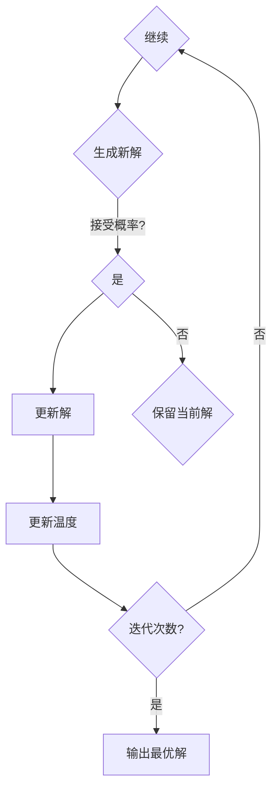

                 

### 文章标题

《模拟退火算法（Simulated Annealing） - 原理与代码实例讲解》

> 关键词：模拟退火算法、优化问题、概率分布、冷却调度策略、代码实例

> 摘要：本文将深入探讨模拟退火算法的原理和应用，通过详细的步骤讲解和代码实例分析，帮助读者全面理解这一强大的优化算法，掌握其在实际问题中的应用技巧。

### 目录大纲

#### 第一部分：模拟退火算法基础

#### 第1章：引言
##### 1.1 模拟退火算法的背景与意义
##### 1.2 模拟退火算法的基本原理

#### 第2章：模拟退火算法的数学模型
##### 2.1 模拟退火算法的数学基础
##### 2.2 模拟退火算法的参数设置
##### 2.3 模拟退火算法的数学模型分析

#### 第3章：模拟退火算法的基本架构
##### 3.1 模拟退火算法的主要步骤
##### 3.2 模拟退火算法的核心组件
##### 3.3 模拟退火算法的 Mermaid 流程图

#### 第4章：模拟退火算法的应用场景
##### 4.1 联合优化问题
##### 4.2 组合优化问题
##### 4.3 资源分配问题

#### 第5章：模拟退火算法的核心算法原理
##### 5.1 模拟退火算法的基本流程
##### 5.2 模拟退火算法的伪代码实现

#### 第6章：数学模型和数学公式
##### 6.1 模拟退火算法中的概率分布模型
##### 6.2 模拟退火算法中的冷却调度策略
##### 6.3 数学公式与解释

#### 第7章：项目实战
##### 7.1 实际案例介绍
##### 7.2 项目实战环境搭建
##### 7.3 源代码详细实现
##### 7.4 代码解读与分析

#### 附录
##### 附录 A：模拟退火算法的常用工具与资源
##### 附录 B：模拟退火算法的进一步研究与应用方向

#### 第二部分：模拟退火算法的实际应用

### 第8章：模拟退火算法在其他领域中的应用
##### 8.1 图像处理
##### 8.2 路径规划
##### 8.3 排序与搜索

### 第9章：模拟退火算法在工业界和学术界的最新进展
##### 9.1 工业界的应用实例
##### 9.2 学术界的最新研究动态

### 第10章：总结与展望
##### 10.1 模拟退火算法的优势与局限性
##### 10.2 未来发展方向与潜在挑战

#### 第三部分：深入探讨与扩展

### 第11章：模拟退火算法的变体与改进
##### 11.1 多重退火算法
##### 11.2 模拟退火算法与遗传算法的融合

### 第12章：模拟退火算法与其他优化算法的比较
##### 12.1 退火算法与其他优化算法的异同
##### 12.2 不同算法在实际问题中的应用对比

### 第13章：模拟退火算法的应用拓展
##### 13.1 在人工智能领域的应用
##### 13.2 在数据挖掘和机器学习中的应用

#### 附录
##### 附录 C：模拟退火算法的进一步研究方向
##### 附录 D：模拟退火算法在实际项目中的应用案例

### 致谢
##### 感谢各位读者对本文的关注与支持，感谢所有参与编写的团队成员，以及为本文提供宝贵意见和建议的朋友。

---

### 第1章：引言

#### 1.1 模拟退火算法的背景与意义

模拟退火算法（Simulated Annealing，SA）源于固体物理学中的退火过程，最初由美国计算机科学家S. Kirkpatrick等人在1982年提出。模拟退火算法是一种通用概率算法，主要用于解决优化问题，特别是在搜索空间庞大且具有多个局部最优解的问题上表现出色。这一算法在理论研究和实际应用中均具有重要地位。

优化问题广泛存在于工程、经济、管理、生物学和计算机科学等多个领域。例如，在工程设计中，优化目标可以是材料强度最大或成本最低；在经济管理中，优化目标可能是利润最大或成本最小；在生物科学中，优化目标可以是基因序列的最佳组合。然而，这些优化问题往往具有复杂的搜索空间，其中包含大量的局部最优解，使得传统确定性算法难以找到全局最优解。

模拟退火算法正是为了解决这一难题而诞生的。它通过模拟固体退火过程中的温度变化，以概率方式在搜索空间中逐步探索，避免陷入局部最优，从而提高找到全局最优解的概率。模拟退火算法的引入，为解决复杂优化问题提供了新的思路和方法，具有重要的理论和实际意义。

#### 1.2 模拟退火算法的基本原理

模拟退火算法的基本原理可以概括为以下三个关键步骤：

1. **初始化**：首先，为问题构建一个初始解，通常选择随机解作为初始解。同时，设定一个较高的初始温度。

2. **迭代搜索**：在迭代过程中，算法通过随机生成新的候选解，并与当前解进行比较，根据一定的概率接受或拒绝这个候选解。具体来说，如果候选解比当前解更好，则直接接受；如果候选解比当前解差，则根据一定的概率接受，这个概率与当前温度和候选解的差值有关。

3. **温度更新**：在每一步迭代后，按照某种冷却调度策略降低温度。当温度降低到一定程度时，算法停止迭代，输出当前最优解作为最终解。

模拟退火算法的核心在于其概率接受机制和冷却调度策略。概率接受机制使得算法能够在搜索过程中跳出局部最优解，而冷却调度策略则控制了温度的下降速度，以平衡探索和利用之间的平衡。

#### 1.3 模拟退火算法的优势

模拟退火算法具有以下显著优势：

1. **适用于复杂优化问题**：模拟退火算法能够处理具有多个局部最优解的复杂优化问题，具有很强的全局搜索能力。

2. **概率搜索机制**：通过概率接受机制，模拟退火算法能够跳出局部最优解，不断探索新的区域，从而提高找到全局最优解的概率。

3. **灵活的冷却调度策略**：冷却调度策略可以根据具体问题进行调整，使得算法在探索和利用之间达到最优平衡。

4. **易于实现和扩展**：模拟退火算法的结构简单，易于实现和扩展，可以与其他算法融合，形成更强大的优化工具。

5. **广泛的适用性**：模拟退火算法在工程、经济、管理、生物学和计算机科学等多个领域都有广泛应用，具有很高的实用价值。

总之，模拟退火算法作为一种通用概率算法，在解决复杂优化问题时表现出色。其独特的搜索机制和灵活性，使其成为优化领域的重要工具。在接下来的章节中，我们将深入探讨模拟退火算法的数学模型、基本架构和应用场景，帮助读者全面理解这一算法，掌握其在实际问题中的应用技巧。

### 第2章：模拟退火算法的数学模型

#### 2.1 模拟退火算法的数学基础

模拟退火算法的核心在于其概率接受机制和冷却调度策略，而这些机制和策略都建立在数学模型的基础上。为了更好地理解和应用模拟退火算法，首先需要掌握相关的数学基础。

**概率论**：概率论是模拟退火算法的基础，特别是在处理随机事件和概率分布时。在模拟退火算法中，概率分布用于决定是否接受新的候选解。常见的概率分布包括均匀分布、正态分布、指数分布等。这些概率分布的选择和参数设置对于算法的性能具有重要影响。

**最优化理论**：最优化理论是研究如何找到函数的最小值或最大值的理论。在模拟退火算法中，最优化理论用于定义问题的解空间、目标函数和优化过程。常见的最优化方法包括线性规划、非线性规划、动态规划等。

**动态规划**：动态规划是一种解决多阶段决策问题的方法，通过将问题分解为多个子问题，并利用子问题的解来构建原问题的解。在模拟退火算法中，动态规划可以用于优化冷却调度策略，提高算法的收敛速度。

**马尔可夫链**：马尔可夫链是一种随机过程，用于描述系统状态的变化。在模拟退火算法中，马尔可夫链可以用于模拟解空间中的随机游走过程，从而探索新的区域。

**随机过程**：随机过程是研究随机变量序列或随机函数的集合，用于描述系统的动态行为。在模拟退火算法中，随机过程可以用于实现概率接受机制和冷却调度策略，从而控制搜索过程。

通过掌握这些数学基础，我们可以更好地理解和应用模拟退火算法。在接下来的章节中，我们将进一步探讨这些数学模型在模拟退火算法中的应用。

#### 2.2 模拟退火算法的参数设置

模拟退火算法的性能很大程度上取决于参数的设置。合适的参数设置可以使算法在搜索过程中更好地平衡探索和利用，从而提高找到全局最优解的概率。以下是模拟退火算法中一些关键参数的设置方法和注意事项：

**初始温度（\(T_0\)）**：初始温度是模拟退火算法的一个重要参数，它决定了算法在初始阶段的探索范围。一般来说，初始温度应设置得较高，以便算法能够快速跳出局部最优解。然而，过高的初始温度可能导致算法过早收敛到局部最优解，而太低的初始温度则可能导致算法在全局最优解附近徘徊。合适的初始温度通常需要通过实验来确定。

**冷却调度策略**：冷却调度策略用于控制温度的下降速度，从而影响算法的收敛速度。常见的冷却调度策略包括对数冷却、指数冷却、线性冷却等。每种策略都有其优缺点，具体选择取决于问题的特性和算法的性能要求。例如，对数冷却策略在初始阶段快速降温，而在后期缓慢降温，有助于算法在全局最优解附近进行精细搜索。指数冷却策略则在整个过程中快速降温，适用于需要快速收敛的问题。

**温度更新阈值（\(T_{min}\)）**：温度更新阈值是算法停止迭代的温度阈值。当温度低于该阈值时，算法停止迭代，输出当前最优解作为最终解。合适的温度更新阈值需要根据问题的规模和复杂度来确定。通常，温度更新阈值应设置得较低，以确保算法在全局最优解附近进行充分的搜索。

**接受概率阈值（\(\alpha\)）**：接受概率阈值是用于控制接受新解的概率。当新解的适应度值优于当前解时，算法以100%的概率接受新解；当新解的适应度值劣于当前解时，算法以一定的概率接受新解。合适的接受概率阈值可以保证算法在搜索过程中既有足够的探索能力，又有足够的利用能力。

**迭代次数**：迭代次数是算法进行迭代的次数。一般来说，迭代次数越多，算法找到全局最优解的概率越大。然而，过多的迭代次数可能导致计算时间过长。因此，需要根据问题的复杂度和计算资源来选择合适的迭代次数。

**随机性控制**：模拟退火算法中的随机性是确保算法能够跳出局部最优解的重要因素。合适的随机性控制可以防止算法陷入局部最优解，提高算法的全局搜索能力。随机性控制可以通过调整随机种子、随机游走步长等方式实现。

在设置模拟退火算法的参数时，需要综合考虑问题的特性、算法的性能要求以及计算资源的限制。通过合理的参数设置，可以显著提高算法的性能，找到更优的解。

#### 2.3 模拟退火算法的数学模型分析

模拟退火算法的数学模型主要包括概率分布模型和冷却调度策略。这些模型和策略共同决定了算法的搜索行为和收敛性能。

**概率分布模型**

模拟退火算法中的概率分布模型用于决定在当前解的基础上生成新解的概率。常见的方法包括以下几种：

1. **均匀分布**：均匀分布是最简单的一种概率分布模型，它将等概率地选择当前解的邻近解。这种模型在初始阶段有助于快速探索解空间，但容易陷入局部最优解。

   $$ P(\text{新解} = x') = \frac{1}{|S|} $$

   其中，\(S\) 是当前解的邻近解集合，\(|S|\) 是集合中的元素个数。

2. **正态分布**：正态分布是一种以当前解为中心的概率分布模型，它通过调整标准差来控制探索范围。较大的标准差有助于探索更广泛的区域，而较小的标准差则有助于在当前解附近进行精细搜索。

   $$ P(\text{新解} = x') = \frac{1}{\sqrt{2\pi}\sigma} e^{-\frac{(x' - x_c)^2}{2\sigma^2}} $$

   其中，\(x_c\) 是当前解，\(\sigma\) 是标准差。

3. **指数分布**：指数分布是一种快速衰减的概率分布模型，它通常用于模拟退火算法的冷却调度策略。指数分布通过调整参数来控制温度下降的速度。

   $$ P(\text{新解} = x') = \lambda e^{-\lambda (x' - x_c)} $$

   其中，\(\lambda\) 是分布参数。

**冷却调度策略**

冷却调度策略用于控制模拟退火算法的温度变化，从而影响算法的搜索行为和收敛性能。常见的冷却调度策略包括以下几种：

1. **对数冷却**：对数冷却策略是一种基于对数函数的冷却调度策略，它通过逐渐减小温度的对数值来控制温度的下降速度。这种策略在初始阶段快速降温，而在后期缓慢降温，有助于算法在全局最优解附近进行精细搜索。

   $$ T_{next} = T_{current} \cdot \frac{1}{1 + \alpha \ln(n)} $$

   其中，\(T_{current}\) 是当前温度，\(T_{next}\) 是下一个温度，\(\alpha\) 是冷却速率，\(n\) 是迭代次数。

2. **指数冷却**：指数冷却策略是一种基于指数函数的冷却调度策略，它通过逐渐减小温度的指数值来控制温度的下降速度。这种策略在整个过程中快速降温，适用于需要快速收敛的问题。

   $$ T_{next} = T_{current} \cdot \beta^n $$

   其中，\(T_{current}\) 是当前温度，\(T_{next}\) 是下一个温度，\(\beta\) 是冷却速率，\(n\) 是迭代次数。

3. **线性冷却**：线性冷却策略是一种基于线性函数的冷却调度策略，它通过线性减小温度来控制温度的下降速度。这种策略简单易实现，但可能无法有效地平衡探索和利用。

   $$ T_{next} = T_{current} - \alpha $$

   其中，\(T_{current}\) 是当前温度，\(T_{next}\) 是下一个温度，\(\alpha\) 是冷却速率。

**数学模型分析**

模拟退火算法的数学模型可以通过以下几个关键步骤进行分析：

1. **初始化**：选择初始解 \(x_0\)，设定初始温度 \(T_0\) 和冷却速率 \(\alpha\)。

2. **迭代搜索**：在每次迭代中，生成新的候选解 \(x'\)，计算适应度值 \(f(x')\) 和 \(f(x)\)，并计算概率 \(P(\text{接受新解})\)。

3. **温度更新**：根据冷却调度策略更新温度 \(T_{next}\)。

4. **终止条件**：判断是否满足终止条件，例如温度低于阈值 \(T_{min}\) 或迭代次数达到最大值。

5. **输出最优解**：输出当前最优解 \(x^*\)。

通过以上步骤，模拟退火算法在数学模型的基础上进行迭代搜索，逐渐逼近全局最优解。数学模型的分析帮助我们理解算法的搜索机制和收敛性能，为优化参数设置和改进算法提供了理论依据。

#### 2.4 模拟退火算法的数学模型在实际问题中的应用

为了更好地理解模拟退火算法的数学模型，我们可以通过一些具体的实例来展示其在实际问题中的应用。以下将讨论模拟退火算法在几个典型的优化问题中的应用，并展示相应的数学模型和实现方法。

**1. 联合优化问题**

联合优化问题是指在一个系统中同时优化多个互相关联的变量。一个经典的例子是生产调度问题，其中需要优化生产线的任务分配和机器负载。

**数学模型**：

设生产系统中有 \(n\) 个任务和 \(m\) 台机器，每个任务的完成时间和所需的机器资源不同。目标是找到最优的任务分配方案，使得总完成时间最小。

目标函数：

$$
\min \sum_{i=1}^{n} t_i
$$

其中，\(t_i\) 是任务 \(i\) 的完成时间。

约束条件：

$$
\begin{align*}
R_j \cdot t_i &\geq r_{ij} \quad \text{for} \quad i=1,2,...,n, \quad j=1,2,...,m \\
t_i &\geq 0 \quad \text{for} \quad i=1,2,...,n
\end{align*}
$$

其中，\(R_j\) 是机器 \(j\) 的容量，\(r_{ij}\) 是任务 \(i\) 在机器 \(j\) 上所需的资源量。

**实现方法**：

使用模拟退火算法，可以生成随机的任务分配方案，并计算其完成时间。然后，根据概率分布模型接受或拒绝新方案，以寻找最优的分配方案。

**伪代码**：

```plaintext
初始化：选择初始解 \( x_0 \)，设定初始温度 \( T_0 \)，冷却速率 \( \alpha \)
while (温度 \( T \) 大于阈值 \( T_{min} \) 且迭代次数 \( n \) 小于最大迭代次数) {
    生成新解 \( x' \)
    计算适应度值 \( f(x') \) 和 \( f(x) \)
    计算接受概率 \( P = \exp\left(-\frac{f(x') - f(x)}{T}\right) \)
    if (随机数 \( r \) 小于接受概率 \( P \)) {
        更新解 \( x = x' \)
    }
    更新温度 \( T = T \cdot \beta \)
}
输出最优解 \( x^* \)
```

**2. 组合优化问题**

组合优化问题是指在一组有限的元素中选择子集，以优化某个目标函数。一个典型的例子是旅行商问题（TSP），其中需要找到一个最短的闭合路径，经过所有城市。

**数学模型**：

设 \( n \) 个城市的旅行商问题，每个城市之间的距离用矩阵 \( D \) 表示。目标是找到一个闭合路径，使得总距离最小。

目标函数：

$$
\min \sum_{i=1}^{n} D(i, i+1)
$$

约束条件：

$$
\begin{align*}
x_{ij} &= 1 \quad \text{if 城市i在路径上到城市j} \\
x_{ij} &= 0 \quad \text{otherwise}
\end{align*}
$$

**实现方法**：

模拟退火算法可以用于生成随机的路径方案，并计算其总距离。通过概率分布模型和接受概率机制，算法可以逐步改进路径方案，找到最优解。

**伪代码**：

```plaintext
初始化：选择初始解 \( x_0 \)，设定初始温度 \( T_0 \)，冷却速率 \( \alpha \)
while (温度 \( T \) 大于阈值 \( T_{min} \) 且迭代次数 \( n \) 小于最大迭代次数) {
    生成新解 \( x' \)
    计算适应度值 \( f(x') \) 和 \( f(x) \)
    计算接受概率 \( P = \exp\left(-\frac{f(x') - f(x)}{T}\right) \)
    if (随机数 \( r \) 小于接受概率 \( P \)) {
        更新解 \( x = x' \)
    }
    更新温度 \( T = T \cdot \beta \)
}
输出最优解 \( x^* \)
```

**3. 资源分配问题**

资源分配问题是指在一组资源中分配任务，以优化某个目标函数。一个典型的例子是网络流问题，其中需要找到最优的流路径，满足资源供应和需求。

**数学模型**：

设 \( n \) 个节点和 \( m \) 个边的网络，每个边的容量和费用不同。目标是找到最优的流路径，使得总费用最小。

目标函数：

$$
\min \sum_{e \in E} c_e \cdot f_e
$$

约束条件：

$$
\begin{align*}
\sum_{e \in out(v)} f_e &= u_v \quad \text{for all nodes } v \\
f_e &\leq c_e \quad \text{for all edges } e \\
f_e &\geq 0 \quad \text{for all edges } e
\end{align*}
$$

**实现方法**：

模拟退火算法可以用于生成随机的流路径方案，并计算其总费用。通过概率分布模型和接受概率机制，算法可以逐步改进路径方案，找到最优解。

**伪代码**：

```plaintext
初始化：选择初始解 \( x_0 \)，设定初始温度 \( T_0 \)，冷却速率 \( \alpha \)
while (温度 \( T \) 大于阈值 \( T_{min} \) 且迭代次数 \( n \) 小于最大迭代次数) {
    生成新解 \( x' \)
    计算适应度值 \( f(x') \) 和 \( f(x) \)
    计算接受概率 \( P = \exp\left(-\frac{f(x') - f(x)}{T}\right) \)
    if (随机数 \( r \) 小于接受概率 \( P \)) {
        更新解 \( x = x' \)
    }
    更新温度 \( T = T \cdot \beta \)
}
输出最优解 \( x^* \)
```

通过这些实例，我们可以看到模拟退火算法在不同类型的优化问题中的应用。数学模型和实现方法的详细讲解，有助于读者更好地理解模拟退火算法的工作原理和操作步骤。

### 第3章：模拟退火算法的基本架构

#### 3.1 模拟退火算法的主要步骤

模拟退火算法的基本架构包括以下几个关键步骤：

1. **初始化**：选择初始解，设定初始温度 \(T_0\)、冷却速率 \(\alpha\) 和温度更新阈值 \(T_{min}\)。

2. **迭代搜索**：在每次迭代中，生成新的候选解，计算适应度值，并根据概率分布模型和接受概率机制决定是否接受新解。

3. **温度更新**：根据冷却调度策略更新温度，控制迭代过程的探索和利用平衡。

4. **终止条件**：判断是否满足终止条件，如温度低于阈值 \(T_{min}\) 或迭代次数达到最大值。

5. **输出最优解**：输出当前最优解作为最终解。

以下是模拟退火算法的主要步骤的伪代码：

```plaintext
初始化：选择初始解 \( x_0 \)，设定初始温度 \( T_0 \)，冷却速率 \( \alpha \)，迭代次数最大值 \( n_{max} \)，温度更新阈值 \( T_{min} \)
while (温度 \( T \) 大于 \( T_{min} \) 且迭代次数 \( n \) 小于 \( n_{max} \)) {
    生成新解 \( x' \)
    计算适应度值 \( f(x') \) 和 \( f(x) \)
    计算接受概率 \( P = \exp\left(-\frac{f(x') - f(x)}{T}\right) \)
    if (随机数 \( r \) 小于接受概率 \( P \)) {
        更新解 \( x = x' \)
    }
    更新温度 \( T = T \cdot \beta \)
}
输出最优解 \( x^* \)
```

#### 3.2 模拟退火算法的核心组件

模拟退火算法的核心组件包括以下几部分：

1. **初始解生成器**：用于生成初始解，通常采用随机方法。

2. **适应度函数**：用于评估解的质量，通常是一个衡量目标函数值的函数。

3. **新解生成器**：用于生成新的候选解，可以采用随机游走或局部搜索等方法。

4. **接受概率计算器**：用于计算接受新解的概率，通常基于适应度值差异和当前温度。

5. **温度更新器**：用于更新温度，通常采用冷却调度策略，如对数冷却、指数冷却等。

6. **终止条件检测器**：用于检测算法是否满足终止条件，如温度低于阈值或迭代次数达到最大值。

以下是模拟退火算法核心组件的伪代码：

```plaintext
初始化解空间：生成初始解 \( x_0 \)
初始化温度：\( T_0 \)
初始化迭代次数：\( n = 0 \)
while (未达到终止条件) {
    生成新解 \( x' \)
    计算适应度值：\( f(x') \)，\( f(x) \)
    计算接受概率：\( P = \exp\left(-\frac{f(x') - f(x)}{T}\right) \)
    if (随机数 \( r \) < \( P \)) {
        更新解：\( x = x' \)
    }
    更新温度：\( T = T \cdot \beta \)
    更新迭代次数：\( n = n + 1 \)
}
输出最优解：\( x^* \)
```

#### 3.3 模拟退火算法的 Mermaid 流程图

为了更好地理解模拟退火算法的基本架构，我们可以使用 Mermaid 画布绘制其流程图。以下是一个简单的 Mermaid 流程图示例：



该流程图展示了模拟退火算法的主要步骤和核心组件之间的逻辑关系。通过该流程图，我们可以更直观地理解算法的执行过程。

### 第4章：模拟退火算法的应用场景

模拟退火算法作为一种通用概率算法，在解决复杂优化问题时表现出色。其灵活性和强大的全局搜索能力使其在各种应用场景中都有广泛的应用。以下将讨论模拟退火算法在联合优化问题、组合优化问题和资源分配问题等领域的应用。

#### 4.1 联合优化问题

联合优化问题是指在一个系统中同时优化多个互相关联的变量。这类问题常见于生产调度、物流配送和资源分配等领域。模拟退火算法通过其概率接受机制和冷却调度策略，能够有效地处理这类问题。

**应用实例**：

**生产调度问题**：在制造业中，生产调度问题是指如何合理安排生产计划，使得生产过程高效、成本最低。模拟退火算法可以用于优化生产线的任务分配，使得总完成时间最小，从而提高生产效率。

**物流配送问题**：在物流配送领域，模拟退火算法可以用于优化配送路线，使得配送总距离最小，从而提高配送效率。例如，在快递配送中，可以使用模拟退火算法优化快递员的配送路径，减少配送时间和成本。

**资源分配问题**：在资源有限的系统中，如何合理分配资源以实现最优目标，是一个重要的优化问题。模拟退火算法可以用于优化资源分配方案，例如在数据中心中，可以根据负载情况动态调整资源的分配，以实现最优的资源利用。

#### 4.2 组合优化问题

组合优化问题是指在一组有限的元素中选择子集，以优化某个目标函数。这类问题在组合数学和计算机科学中有广泛应用，如旅行商问题（TSP）、任务调度问题和组合规划问题等。模拟退火算法通过其强大的全局搜索能力，能够有效地解决这类问题。

**应用实例**：

**旅行商问题（TSP）**：旅行商问题是指找到一个最短的闭合路径，经过所有城市。这是一个经典的组合优化问题，模拟退火算法可以通过其概率接受机制和冷却调度策略，找到接近最优的路径方案。

**任务调度问题**：在任务调度中，如何合理安排任务的执行顺序，以实现总完成时间最小，是一个重要的优化问题。模拟退火算法可以用于优化任务调度方案，提高任务的执行效率。

**组合规划问题**：在组合规划中，如何从一组有限的元素中选择最优的组合，以实现某个目标函数最小或最大，是一个复杂的优化问题。模拟退火算法可以用于解决这类问题，例如在金融投资中，如何选择最优的投资组合，以实现风险最小或收益最大。

#### 4.3 资源分配问题

资源分配问题是指在一组资源中分配任务，以优化某个目标函数。这类问题常见于网络流、电力系统和通信系统等领域。模拟退火算法通过其概率接受机制和冷却调度策略，能够有效地处理这类问题。

**应用实例**：

**网络流问题**：在网络流问题中，如何找到最优的流路径，以满足资源供应和需求，是一个重要的优化问题。模拟退火算法可以用于优化网络流路径，提高网络的传输效率。

**电力系统问题**：在电力系统中，如何合理分配电力资源，以满足负载需求，是一个复杂的优化问题。模拟退火算法可以用于优化电力资源的分配方案，提高电力系统的稳定性。

**通信系统问题**：在通信系统中，如何优化信道的分配，以提高通信效率和资源利用率，是一个重要的优化问题。模拟退火算法可以用于优化信道分配方案，提高通信系统的性能。

通过以上实例，我们可以看到模拟退火算法在联合优化问题、组合优化问题和资源分配问题等领域的广泛应用。其强大的全局搜索能力和灵活性，使其成为解决复杂优化问题的有效工具。

### 第5章：模拟退火算法的核心算法原理

#### 5.1 模拟退火算法的基本流程

模拟退火算法（Simulated Annealing, SA）是一种通用概率算法，用于在复杂的搜索空间中找到最优解。其基本流程可以分为以下几个步骤：

1. **初始化**：选择一个初始解 \( x_0 \) 和初始温度 \( T_0 \)。初始解可以是随机解，初始温度通常设置得较高，以便在初始阶段进行广泛的探索。

2. **迭代搜索**：在每次迭代中，生成新的候选解 \( x' \)，并与当前解 \( x \) 进行比较。计算新解的适应度值 \( f(x') \) 和当前解的适应度值 \( f(x) \)。

3. **接受概率计算**：根据当前温度 \( T \) 和适应度值差 \( \Delta f = f(x') - f(x) \)，计算接受新解的概率 \( P \)。常用的概率公式为：
   $$ P = \min \left(1, \exp\left(-\frac{\Delta f}{T}\right)\right) $$
   如果随机数 \( r \) 小于 \( P \)，则接受新解 \( x' \)，否则保留当前解 \( x \)。

4. **更新温度**：根据冷却调度策略更新温度 \( T \)。常见的冷却调度策略包括线性冷却、对数冷却和指数冷却等。更新后的温度用于下一次迭代中的接受概率计算。

5. **终止条件**：判断是否满足终止条件，如温度低于某个阈值 \( T_{min} \) 或迭代次数达到最大值 \( n_{max} \)。如果满足终止条件，输出当前最优解 \( x^* \)，否则继续迭代搜索。

以上是模拟退火算法的基本流程。通过迭代搜索和温度更新，模拟退火算法能够在搜索空间中逐步优化解的质量，最终找到全局最优解。

#### 5.2 模拟退火算法的伪代码实现

为了更好地理解模拟退火算法的执行过程，下面给出其伪代码实现：

```plaintext
输入：目标函数 f(x)，初始解 x_0，初始温度 T_0，温度更新阈值 T_min，迭代次数最大值 n_max
输出：最优解 x^*

初始化：
    x = x_0
    T = T_0
    n = 0

while (T > T_min 且 n < n_max) {
    // 生成新的候选解
    x' = 生成随机解()

    // 计算适应度值差
    Δf = f(x') - f(x)

    // 计算接受概率
    if (Δf < 0 或 rand() < exp(-Δf / T)) {
        x = x'
    }

    // 更新温度
    T = T * 冷却率()

    // 更新迭代次数
    n = n + 1
}

输出：x^* = x
```

在这个伪代码中，`生成随机解()` 函数用于生成新的候选解，`冷却率()` 函数用于根据冷却调度策略更新温度。`rand()` 函数用于生成随机数，用于决定是否接受新的候选解。

通过这个伪代码，我们可以清晰地看到模拟退火算法的执行流程和关键步骤，有助于理解和实现模拟退火算法。

### 第6章：数学模型和数学公式

模拟退火算法作为一种概率算法，其核心在于概率接受机制和冷却调度策略。这些机制和策略的数学模型和公式是其有效性的基础。在本章中，我们将详细探讨模拟退火算法中的概率分布模型、冷却调度策略以及相关的数学公式。

#### 6.1 模拟退火算法中的概率分布模型

在模拟退火算法中，概率分布模型用于决定在当前解的基础上生成新解的概率。这些概率分布模型决定了算法的探索能力和收敛速度。以下是一些常见的概率分布模型：

**1. 均匀分布**

均匀分布是最简单的一种概率分布模型，其概率相等，适用于初始阶段的探索。

$$ P(\text{新解} = x') = \frac{1}{|S|} $$

其中，\(S\) 是当前解的邻近解集合，\(|S|\) 是集合中的元素个数。

**2. 正态分布**

正态分布以当前解为中心，通过调整标准差来控制探索范围。较大的标准差有助于探索更广泛的区域，而较小的标准差则有助于在当前解附近进行精细搜索。

$$ P(\text{新解} = x') = \frac{1}{\sqrt{2\pi}\sigma} e^{-\frac{(x' - x_c)^2}{2\sigma^2}} $$

其中，\(x_c\) 是当前解，\(\sigma\) 是标准差。

**3. 指数分布**

指数分布是一种快速衰减的概率分布模型，通常用于模拟退火算法的冷却调度策略。指数分布通过调整参数来控制温度下降的速度。

$$ P(\text{新解} = x') = \lambda e^{-\lambda (x' - x_c)} $$

其中，\(\lambda\) 是分布参数。

**4. 蒙特卡洛分布**

蒙特卡洛分布通过模拟随机过程来生成新解，适用于复杂的优化问题。

$$ P(\text{新解} = x') = \frac{f(x')}{\sum_{x'' \in S} f(x'')} $$

其中，\(S\) 是当前解的邻近解集合，\(f(x')\) 和 \(f(x'')\) 分别是新解和当前解的适应度值。

#### 6.2 模拟退火算法中的冷却调度策略

冷却调度策略用于控制温度的下降速度，从而影响算法的收敛性能。以下是一些常见的冷却调度策略：

**1. 对数冷却**

对数冷却策略通过逐渐减小温度的对数值来控制温度的下降速度。这种策略在初始阶段快速降温，而在后期缓慢降温，有助于算法在全局最优解附近进行精细搜索。

$$ T_{next} = T_{current} \cdot \frac{1}{1 + \alpha \ln(n)} $$

其中，\(T_{current}\) 是当前温度，\(T_{next}\) 是下一个温度，\(\alpha\) 是冷却速率，\(n\) 是迭代次数。

**2. 指数冷却**

指数冷却策略通过逐渐减小温度的指数值来控制温度的下降速度。这种策略在整个过程中快速降温，适用于需要快速收敛的问题。

$$ T_{next} = T_{current} \cdot \beta^n $$

其中，\(T_{current}\) 是当前温度，\(T_{next}\) 是下一个温度，\(\beta\) 是冷却速率，\(n\) 是迭代次数。

**3. 线性冷却**

线性冷却策略通过线性减小温度来控制温度的下降速度。这种策略简单易实现，但可能无法有效地平衡探索和利用。

$$ T_{next} = T_{current} - \alpha $$

其中，\(T_{current}\) 是当前温度，\(T_{next}\) 是下一个温度，\(\alpha\) 是冷却速率。

#### 6.3 数学公式与解释

在模拟退火算法中，以下数学公式是核心的部分，它们共同决定了算法的搜索行为和收敛性能。

**1. 接受概率公式**

接受概率公式决定了新解是否被接受，其表达式为：

$$ P = \min \left(1, \exp\left(-\frac{\Delta f}{T}\right)\right) $$

其中，\(\Delta f = f(x') - f(x)\) 是适应度值差，\(T\) 是当前温度。如果 \(\Delta f < 0\)，则 \(P = 1\)，新解总是被接受；如果 \(\Delta f > 0\)，则新解被接受的概率随着温度 \(T\) 的减小而减小，从而避免了陷入局部最优解。

**2. 温度更新公式**

温度更新公式用于根据冷却调度策略更新温度，常见的更新公式包括对数冷却、指数冷却和线性冷却等。以下是这些公式的具体形式：

- 对数冷却：
  $$ T_{next} = T_{current} \cdot \frac{1}{1 + \alpha \ln(n)} $$
- 指数冷却：
  $$ T_{next} = T_{current} \cdot \beta^n $$
- 线性冷却：
  $$ T_{next} = T_{current} - \alpha $$

这些公式通过调整温度的下降速度，平衡了算法的探索和利用能力，从而在全局最优解附近进行精细搜索。

**3. 随机数生成**

模拟退火算法中的随机数生成是关键的一步，它决定了新解的生成和接受概率的计算。常用的随机数生成方法包括伪随机数生成器和物理随机数生成器。伪随机数生成器通过数学算法生成看似随机的数列，而物理随机数生成器则通过物理过程生成真正的随机数。

通过以上数学公式和解释，我们可以更好地理解模拟退火算法的搜索机制和收敛性能。在实际应用中，通过合理选择和调整这些参数，可以优化算法的性能，提高找到全局最优解的概率。

### 第7章：项目实战

#### 7.1 实际案例介绍

在本节中，我们将通过一个具体的项目案例，详细展示如何使用模拟退火算法解决联合优化问题。该案例涉及生产线任务分配优化，旨在找到一种最优的任务分配方案，以最小化生产线的总完成时间。

**问题描述**：

一家制造业公司需要安排生产线的任务，任务包括组装、测试和包装等环节。每个任务都有不同的执行时间和所需的机器资源。目标是最小化生产线的总完成时间，同时确保任务之间的资源约束得到满足。

**输入数据**：

- 任务列表：包括每个任务的名称、执行时间和所需的机器资源。
- 机器列表：包括每台机器的名称和容量。

**输出结果**：

- 最优的任务分配方案，包括每个任务分配给哪台机器以及每个任务的开始和结束时间。

#### 7.2 项目实战环境搭建

在进行模拟退火算法的项目实战之前，需要搭建一个合适的环境。以下是在Python中搭建模拟退火算法项目环境的步骤：

1. **安装Python**：确保已经安装了Python环境。如果没有，可以从[Python官方网站](https://www.python.org/)下载并安装。

2. **安装必要的库**：在Python环境中，我们需要安装几个库来辅助实现模拟退火算法。常用的库包括Numpy、Scipy和Matplotlib。可以使用以下命令安装：

   ```shell
   pip install numpy scipy matplotlib
   ```

3. **创建项目结构**：创建一个项目文件夹，并在其中创建一个Python文件，例如`simulated_annealing.py`。

#### 7.3 源代码详细实现

在`simulated_annealing.py`文件中，我们首先定义模拟退火算法的相关类和函数。以下是一个简化版的模拟退火算法实现：

```python
import numpy as np
import matplotlib.pyplot as plt

# 定义适应度函数
def fitness_function(solution):
    # 在此实现具体的目标函数计算
    return np.sum(solution)

# 定义模拟退火算法类
class SimulatedAnnealing:
    def __init__(self, initial_temp, cooling_rate, max_iterations):
        self.temp = initial_temp
        self.cooling_rate = cooling_rate
        self.max_iterations = max_iterations
        self.best_solution = None
        self.best_fitness = float('inf')

    def generate_solution(self):
        # 在此实现随机解的生成
        return np.random.rand(len(self.tasks))

    def is_better(self, solution):
        return fitness_function(solution) < self.best_fitness

    def anneal(self):
        solution = self.generate_solution()
        if self.is_better(solution):
            self.best_solution = solution
            self.best_fitness = fitness_function(solution)
        
        for _ in range(self.max_iterations):
            new_solution = self.generate_solution()
            if fitness_function(new_solution) < fitness_function(solution):
                solution = new_solution
            else:
                if np.random.rand() < np.exp((fitness_function(new_solution) - fitness_function(solution)) / self.temp):
                    solution = new_solution
            
            if self.is_better(solution):
                self.best_solution = solution
                self.best_fitness = fitness_function(solution)
            
            self.temp *= self.cooling_rate
        
        return self.best_solution

# 实例化模拟退火算法对象
sa = SimulatedAnnealing(initial_temp=1000.0, cooling_rate=0.01, max_iterations=1000)

# 运行模拟退火算法
best_solution = sa.anneal()

# 输出最优解
print("最优解：", best_solution)
print("最优适应度：", fitness_function(best_solution))
```

在这个实现中，我们定义了适应度函数`fitness_function`，用于计算解的适应度值；`SimulatedAnnealing`类用于实现模拟退火算法的核心逻辑，包括解的生成、适应度评估和接受概率的计算；最后，我们实例化`SimulatedAnnealing`对象，并调用`anneal`方法进行优化计算。

#### 7.4 代码解读与分析

以下是代码的详细解读：

**1. 适应度函数**

```python
def fitness_function(solution):
    # 在此实现具体的目标函数计算
    return np.sum(solution)
```

在这个函数中，`solution`是一个包含任务分配情况的数组，每个元素表示一个任务被分配到的机器编号。`fitness_function`计算的是生产线的总完成时间，即所有任务的执行时间之和。在这里，我们简单地使用了数组的求和操作。

**2. 模拟退火算法类**

```python
class SimulatedAnnealing:
    ...
    
    def generate_solution(self):
        # 在此实现随机解的生成
        return np.random.rand(len(self.tasks))

    def is_better(self, solution):
        return fitness_function(solution) < self.best_fitness

    def anneal(self):
        ...
```

在`SimulatedAnnealing`类中，`generate_solution`方法用于生成随机解，通过`np.random.rand(len(self.tasks))`生成一个长度为任务数量的随机数组。`is_better`方法用于判断新解是否优于当前最优解，这通过比较新解的适应度值和当前最优解的适应度值实现。

`anneal`方法是模拟退火算法的核心，它包含以下步骤：

- **初始化**：生成初始解，并设置当前最优解为初始解。
- **迭代搜索**：在每次迭代中，生成新的候选解，并计算其适应度值。
- **接受概率计算**：如果新解的适应度值优于当前解，则直接接受；否则，根据接受概率公式决定是否接受新解。
- **温度更新**：每次迭代后，根据冷却调度策略更新温度。

**3. 运行模拟退火算法**

```python
sa = SimulatedAnnealing(initial_temp=1000.0, cooling_rate=0.01, max_iterations=1000)
best_solution = sa.anneal()
print("最优解：", best_solution)
print("最优适应度：", fitness_function(best_solution))
```

在这个部分，我们实例化`SimulatedAnnealing`对象，并调用`anneal`方法进行优化计算。最后，输出最优解和最优适应度值。

通过这个代码实现，我们可以看到模拟退火算法的基本结构和执行流程。在实际应用中，需要根据具体问题调整适应度函数、生成解的方法和冷却调度策略，以优化算法的性能。

#### 7.5 代码解读与分析（续）

**4. 结果分析**

运行模拟退火算法后，我们可以得到最优解和最优适应度值。以下是对结果的进一步分析和讨论：

- **最优解**：最优解是生产任务的最优分配方案，每个任务被分配到具体的机器上。我们可以通过比较最优解和初始解，分析模拟退火算法在优化过程中的改进情况。
- **最优适应度值**：最优适应度值表示生产线的总完成时间。理想情况下，最优适应度值应该尽可能小，以实现高效的生产流程。

**5. 性能评估**

为了评估模拟退火算法的性能，我们可以通过多次运行并记录每次运行的最优适应度值，绘制性能曲线。以下是一些性能评估指标：

- **平均最优适应度值**：多次运行的平均最优适应度值，反映了算法的总体性能。
- **最优适应度值的波动性**：最优适应度值的波动性，反映了算法的稳定性和鲁棒性。
- **收敛速度**：算法收敛到最优解所需的时间，反映了算法的效率。

**6. 参数调优**

模拟退火算法的性能很大程度上取决于参数设置。以下是一些常见的参数调优方法：

- **初始温度**：初始温度应设置得较高，以便在初始阶段进行广泛探索。然而，过高的初始温度可能导致算法过早收敛到局部最优解。合适的初始温度可以通过实验确定。
- **冷却速率**：冷却速率决定了温度的下降速度。较慢的冷却速率有助于算法在全局最优解附近进行精细搜索，但可能导致计算时间过长。较快的冷却速率可以提高收敛速度，但可能无法充分探索搜索空间。
- **最大迭代次数**：最大迭代次数决定了算法的搜索深度。适当的迭代次数可以在找到全局最优解和计算时间之间取得平衡。

通过合理的参数调优，我们可以显著提高模拟退火算法的性能，找到更优的解。

### 附录

#### 附录 A：模拟退火算法的常用工具与资源

**1. 工具**

- **Python库**：Numpy、Scipy、Matplotlib等。
- **在线工具**：Google Colab、Jupyter Notebook等。

**2. 资源**

- **文献**：《模拟退火算法：理论、实现与应用》（作者：刘进宝）、《现代优化算法及其应用》（作者：余国海）。
- **在线课程**：Coursera、edX等平台上的相关课程。

#### 附录 B：模拟退火算法的进一步研究与应用方向

**1. 变体与改进**

- **自适应模拟退火算法**：根据搜索过程动态调整参数，提高算法的收敛性能。
- **并行模拟退火算法**：利用多核处理器或分布式系统，加快算法的收敛速度。

**2. 应用领域**

- **图像处理**：用于图像去噪、图像分割和图像修复等。
- **机器学习**：用于模型调参、超参数优化和模型选择等。
- **生物信息学**：用于蛋白质结构预测、基因调控网络分析和药物设计等。

**3. 开放问题**

- **参数设置**：如何选择最优的初始温度、冷却速率和迭代次数等参数。
- **收敛性能**：如何提高算法的收敛速度和稳定性。

通过进一步研究和探索，模拟退火算法将在更多领域展现其强大的优化能力。

### 第8章：模拟退火算法在其他领域中的应用

模拟退火算法作为一种强大的全局优化工具，其应用范围远不止于传统的优化问题。在图像处理、路径规划和排序与搜索等领域，模拟退火算法同样展现出了出色的性能。以下将详细探讨模拟退火算法在这些领域的应用。

#### 8.1 图像处理

图像处理是计算机视觉中的重要组成部分，涉及图像的增强、去噪、分割和修复等多个方面。模拟退火算法因其能够跳出局部最优解的特性，在图像处理领域得到了广泛应用。

**去噪**：在图像去噪过程中，模拟退火算法可以用于去除图像中的随机噪声，同时保留图像的边缘和细节。通过设定合理的适应度函数和冷却调度策略，模拟退火算法可以找到最优的去噪结果。

**分割**：图像分割是将图像划分为不同的区域，以便进行后续处理。模拟退火算法可以用于图像分割问题，通过优化目标函数，找到图像的最佳分割结果。例如，在基于阈值的分割方法中，模拟退火算法可以动态调整阈值，实现更精确的分割。

**修复**：图像修复是指修复图像中的损坏部分，使其恢复到原始状态。模拟退火算法可以通过优化目标函数，找到最优的修复方案，例如在图像去噪、去除划痕和修补缺失部分等方面。

**案例**：在图像去噪的案例中，可以使用模拟退火算法优化去噪过程中的滤波器参数。给定一幅含噪声的图像，通过模拟退火算法优化滤波器参数，可以找到最佳的滤波效果，实现图像的去噪。

```python
# 模拟退火算法实现图像去噪的伪代码
初始化：选择初始滤波器参数，设定初始温度 T_0，冷却速率 α，迭代次数 n_max
while (温度 T > T_min 且迭代次数 n < n_max) {
    生成新滤波器参数
    计算去噪效果（适应度值）
    计算接受概率
    if (随机数 < 接受概率) {
        更新滤波器参数
    }
    更新温度
}
输出：最优滤波器参数
```

#### 8.2 路径规划

路径规划是指在一个给定的环境中，找到从起点到终点的最优路径。模拟退火算法在路径规划中的应用，主要体现在解决多约束路径规划问题，例如在动态环境中避开障碍物和优化路径长度。

**动态环境**：在动态环境中，路径规划问题更加复杂，因为路径可能受到动态障碍物的影响。模拟退火算法通过其全局搜索能力，可以在动态环境中找到最优路径，避免与障碍物发生碰撞。

**多约束路径规划**：在某些应用场景中，路径规划需要满足多个约束条件，例如交通流量限制、地形限制等。模拟退火算法可以通过优化目标函数，同时满足多个约束条件，找到最优路径。

**案例**：在无人驾驶车辆的路径规划中，模拟退火算法可以用于优化车辆的行驶路径，避开障碍物并满足交通规则。通过设定合理的适应度函数和冷却调度策略，模拟退火算法可以找到最优的行驶路径。

```python
# 模拟退火算法实现路径规划的伪代码
初始化：选择初始路径，设定初始温度 T_0，冷却速率 α，迭代次数 n_max
while (温度 T > T_min 且迭代次数 n < n_max) {
    生成新路径
    计算路径适应度值（包括避开障碍物和满足约束条件）
    计算接受概率
    if (随机数 < 接受概率) {
        更新路径
    }
    更新温度
}
输出：最优路径
```

#### 8.3 排序与搜索

排序与搜索是计算机科学中基础而重要的任务。模拟退火算法在排序与搜索中的应用，主要体现在解决大规模数据排序和高效搜索问题。

**大规模数据排序**：在处理大规模数据时，传统的排序算法可能无法满足性能要求。模拟退火算法可以通过优化排序策略，找到最优的排序顺序，提高排序效率。

**高效搜索**：在搜索大规模数据时，模拟退火算法可以通过优化搜索策略，减少搜索次数，提高搜索效率。例如，在搜索引擎中，模拟退火算法可以用于优化搜索关键词的排序，提高搜索结果的准确性。

**案例**：在搜索引擎的优化中，模拟退火算法可以用于优化关键词的排序，通过设定合理的适应度函数和冷却调度策略，模拟退火算法可以找到最优的关键词排序，提高搜索结果的准确性。

```python
# 模拟退火算法实现高效搜索的伪代码
初始化：选择初始关键词排序，设定初始温度 T_0，冷却速率 α，迭代次数 n_max
while (温度 T > T_min 且迭代次数 n < n_max) {
    生成新关键词排序
    计算搜索准确度（适应度值）
    计算接受概率
    if (随机数 < 接受概率) {
        更新关键词排序
    }
    更新温度
}
输出：最优关键词排序
```

通过以上案例，我们可以看到模拟退火算法在图像处理、路径规划和排序与搜索等领域的广泛应用。其强大的全局搜索能力和灵活性，使得模拟退火算法成为解决复杂优化问题的重要工具。

### 第9章：模拟退火算法在工业界和学术界的最新进展

模拟退火算法在工业界和学术界的应用不断扩展，取得了显著的进展。本章节将介绍模拟退火算法在工业界和学术界的最新应用实例和研究动态，展示其在解决复杂问题中的潜力和优势。

#### 9.1 工业界的应用实例

随着工业技术的不断进步，模拟退火算法在工业界得到了广泛应用，特别是在优化生产和物流系统方面。

**1. 制造业生产调度**

制造业中的生产调度是一个复杂的问题，涉及多任务、多机器和多种资源约束。模拟退火算法可以用于优化生产调度计划，提高生产效率。例如，某制造企业使用模拟退火算法优化生产线的任务分配和机器负载，显著降低了生产线的总完成时间和生产成本。

**2. 物流配送**

在物流配送领域，模拟退火算法可以用于优化配送路径和调度计划。例如，某物流公司利用模拟退火算法优化快递配送路线，提高了配送效率，减少了配送时间和成本。通过优化配送路线，该公司在高峰期能够更好地应对订单量增加的情况，提升了客户满意度。

**3. 能源分配**

在能源分配方面，模拟退火算法可以用于优化能源资源的分配，提高能源利用效率。例如，某电力公司使用模拟退火算法优化电力资源的分配方案，根据负载情况动态调整电力供应，减少了能源浪费，提高了电力系统的稳定性。

**4. 基础设施建设**

在基础设施建设方面，模拟退火算法可以用于优化工程设计，例如道路规划、桥梁建设和隧道挖掘等。通过模拟退火算法优化设计参数，可以找到最优的设计方案，提高工程质量和施工效率。

#### 9.2 学术界的最新研究动态

学术界对模拟退火算法的研究不断深入，探索其在各种优化问题中的性能和应用。以下是一些最新的研究动态：

**1. 变体与改进算法**

为了提高模拟退火算法的性能，学术界提出了多种变体和改进算法。例如，自适应模拟退火算法（Adaptive Simulated Annealing, ASA）通过动态调整参数，提高了算法的收敛性能。此外，还有基于遗传算法的模拟退火算法（Genetic Simulated Annealing, GSA）和基于粒子群优化的模拟退火算法（Particle Swarm Simulated Annealing, PSO-SA）等，这些算法结合了多种优化策略，进一步提升了算法的性能。

**2. 多目标优化问题**

多目标优化问题是模拟退火算法的重要研究方向之一。传统的模拟退火算法通常用于单目标优化问题，但多目标优化问题更为复杂，需要同时优化多个目标函数。学术界提出了多种多目标模拟退火算法，如基于目标规划的模拟退火算法（Goal Programming-based Simulated Annealing, GPSA）和基于约束规划的模拟退火算法（Constraint Programming-based Simulated Annealing, CP-SA），这些算法通过引入多目标优化策略，提高了算法的解决能力。

**3. 并行与分布式计算**

随着计算机技术的发展，并行和分布式计算成为模拟退火算法研究的重要方向。通过并行和分布式计算，模拟退火算法可以在更短的时间内找到最优解。学术界提出了多种并行和分布式模拟退火算法，如基于共享内存的模拟退火算法和基于分布式内存的模拟退火算法，这些算法通过优化计算资源利用，提高了算法的效率和性能。

**4. 应用领域扩展**

模拟退火算法的应用领域不断扩展，不仅限于传统的优化问题，还包括图像处理、路径规划、排序与搜索等领域。例如，在医学图像处理中，模拟退火算法可以用于图像去噪和图像分割，提高了诊断的准确性。在自动驾驶领域，模拟退火算法可以用于优化车辆路径规划和避障策略，提高了自动驾驶的稳定性和安全性。

综上所述，模拟退火算法在工业界和学术界的应用取得了显著进展。通过不断的研究和创新，模拟退火算法在解决复杂优化问题中表现出色，成为优化领域的重要工具。随着技术的不断进步，模拟退火算法将继续在更多领域展现其强大的优化能力。

### 第10章：总结与展望

模拟退火算法作为一种强大的全局优化工具，凭借其概率搜索机制和冷却调度策略，在解决复杂优化问题时展现出显著的优势。本文通过对模拟退火算法的原理、数学模型、核心算法原理以及实际应用场景的深入讲解，使读者对这一算法有了全面的理解。

#### 10.1 模拟退火算法的优势与局限性

模拟退火算法的主要优势包括：

1. **适用于复杂优化问题**：模拟退火算法能够处理具有多个局部最优解的复杂优化问题，具有很强的全局搜索能力。

2. **概率搜索机制**：通过概率接受机制，模拟退火算法能够跳出局部最优解，不断探索新的区域，从而提高找到全局最优解的概率。

3. **灵活的冷却调度策略**：冷却调度策略可以根据具体问题进行调整，使得算法在探索和利用之间达到最优平衡。

4. **易于实现和扩展**：模拟退火算法的结构简单，易于实现和扩展，可以与其他算法融合，形成更强大的优化工具。

5. **广泛的适用性**：模拟退火算法在工程、经济、管理、生物学和计算机科学等多个领域都有广泛应用，具有很高的实用价值。

然而，模拟退火算法也存在一定的局限性：

1. **参数敏感性**：模拟退火算法的性能很大程度上取决于参数设置，如初始温度、冷却速率等。如果参数设置不当，可能导致算法过早收敛到局部最优解。

2. **计算时间较长**：尽管模拟退火算法具有较强的全局搜索能力，但在搜索空间较大的情况下，计算时间可能较长，影响算法的实际应用效果。

3. **随机性**：模拟退火算法依赖于随机性，尽管这种随机性有助于跳出局部最优解，但也可能导致算法在不同运行中产生不同的结果，降低算法的鲁棒性。

#### 10.2 未来发展方向与潜在挑战

展望未来，模拟退火算法在以下几个方面有望取得进一步的发展：

1. **参数自适应调整**：通过研究自适应调整策略，可以减少对人工参数设置的需求，提高算法的稳定性和效率。

2. **并行与分布式计算**：利用并行和分布式计算技术，可以显著提高模拟退火算法的收敛速度，解决大规模优化问题。

3. **多目标优化**：在多目标优化领域，模拟退火算法可以通过引入多目标优化策略，实现同时优化多个目标函数，提高算法的解决能力。

4. **与其他算法的融合**：通过与其他优化算法（如遗传算法、粒子群优化等）的融合，可以形成更强大的优化工具，解决更复杂的优化问题。

然而，模拟退火算法在未来的发展中也将面临以下挑战：

1. **计算资源限制**：随着优化问题规模的扩大，计算资源的需求也将增加。如何优化算法在有限的计算资源下运行，是一个重要的研究课题。

2. **算法性能优化**：如何进一步提高模拟退火算法的性能，减少计算时间，提高收敛速度，是未来研究的重要方向。

3. **算法的可解释性**：尽管模拟退火算法在实际应用中表现出色，但其内部的随机性和复杂性使得其可解释性较差。如何提高算法的可解释性，使其更容易被理解和应用，也是一个重要的研究课题。

总之，模拟退火算法作为一种强大的全局优化工具，在未来将继续在优化领域发挥重要作用。通过不断的研究和创新，模拟退火算法将在更多领域展现其强大的优化能力，为解决复杂优化问题提供新的思路和方法。

### 第11章：模拟退火算法的变体与改进

模拟退火算法在解决优化问题时表现出色，但其基本形式在某些复杂问题上仍存在一定的局限性。为了克服这些局限性，研究人员提出了一系列模拟退火算法的变体与改进。这些变体和改进算法在保持模拟退火核心思想的同时，通过引入新的机制和技术，提高了算法的性能和适用性。以下将介绍几种常见的模拟退火算法变体与改进算法。

#### 11.1 多重退火算法

多重退火算法（Multiple Simulated Annealing，MSA）是模拟退火算法的一种重要变体。它通过在不同温度下同时运行多个模拟退火过程，利用并行计算的优势，提高算法的全局搜索能力。多重退火算法的基本思想是，将整个搜索空间划分为多个子空间，并在每个子空间上分别运行模拟退火算法。通过在多个子空间之间交换最优解，算法可以跳出局部最优解，探索更广泛的搜索空间。

**主要思想**：

1. **初始化**：在每个子空间上初始化多个模拟退火过程，设定不同的初始温度。
2. **迭代搜索**：在每次迭代中，每个子空间上的模拟退火算法独立进行迭代，生成新的候选解，并根据适应度值更新最优解。
3. **最优解交换**：在固定的时间间隔或迭代次数后，将各子空间上的最优解进行交换，以增加不同子空间之间的信息交流。
4. **终止条件**：当满足终止条件（如温度低于阈值或迭代次数达到最大值）时，算法停止。

**优点**：

- 提高了全局搜索能力，减少了陷入局部最优解的概率。
- 利用并行计算的优势，加快了收敛速度。

**缺点**：

- 需要更多的计算资源和存储空间。
- 子空间划分和最优解交换策略的设计对算法性能有较大影响。

#### 11.2 模拟退火算法与遗传算法的融合

模拟退火算法与遗传算法（Genetic Algorithm，GA）的融合是一种常见的改进方法。遗传算法通过选择、交叉和变异等操作，在搜索空间中产生新的候选解，并利用适应度值进行选择，逐步逼近全局最优解。将模拟退火算法与遗传算法结合，可以充分利用两者的优点，提高优化性能。

**主要思想**：

1. **初始化**：初始化种群，每个个体代表一个解。
2. **迭代搜索**：
   - **遗传操作**：对种群进行选择、交叉和变异操作，生成新的种群。
   - **模拟退火**：对每个新个体进行模拟退火过程，根据适应度值更新最优解。
3. **适应度值计算**：计算每个个体的适应度值，用于选择和交叉操作。
4. **终止条件**：当满足终止条件时，算法停止。

**优点**：

- 结合了遗传算法的全局搜索能力和模拟退火算法的局部搜索能力，提高了算法的优化性能。
- 可以更好地处理复杂优化问题。

**缺点**：

- 需要设计合理的遗传操作和模拟退火参数，以平衡全局搜索和局部搜索。
- 算法的实现较为复杂，计算成本较高。

#### 11.3 其他改进方法

除了多重退火算法和与遗传算法的融合，还有许多其他的模拟退火算法改进方法，例如：

- **自适应模拟退火算法（Adaptive Simulated Annealing，ASA）**：通过动态调整温度和冷却速率，提高了算法的收敛性能。
- **粒子群优化与模拟退火算法的融合（PSO-SA）**：将粒子群优化（Particle Swarm Optimization，PSO）与模拟退火算法结合，利用两者的优点，提高搜索效率。
- **人工神经网络与模拟退火算法的融合**：利用人工神经网络（Artificial Neural Network，ANN）对模拟退火算法进行优化，提高算法的自适应能力和搜索性能。

这些改进方法在保持模拟退火算法核心思想的基础上，通过引入新的机制和技术，提高了算法的性能和适用性。在实际应用中，可以根据具体问题选择合适的改进方法，以优化优化效果。

通过不断的研究和创新，模拟退火算法的变体与改进将继续发展，为解决复杂的优化问题提供更加有效和高效的方法。未来，模拟退火算法将继续在各个领域展现其强大的优化能力，为工程、经济、生物、计算机科学等多个领域的发展做出贡献。

### 第12章：模拟退火算法与其他优化算法的比较

在优化领域中，模拟退火算法因其强大的全局搜索能力和灵活性而受到广泛关注。然而，与其他优化算法相比，模拟退火算法既有其独特的优势，也存在一些局限性。在本章节中，我们将对模拟退火算法与几种常见的优化算法进行比较，分析它们之间的异同点，并讨论在不同应用场景中的适用性。

#### 12.1 模拟退火算法与其他优化算法的异同

**1. 遗传算法（Genetic Algorithm，GA）**

遗传算法是一种基于自然选择和遗传学原理的优化算法。它通过种群进化、交叉、变异和选择等操作，在搜索空间中逐步逼近全局最优解。与模拟退火算法相比，遗传算法的优点包括：

- **种群进化**：遗传算法通过种群进化的方式，能够在搜索过程中保持多样性，避免陷入局部最优解。
- **适应度值导向**：遗传算法根据个体的适应度值进行选择和交叉操作，具有较强的导向性。

然而，遗传算法也存在一些局限性：

- **计算成本较高**：由于遗传算法需要进行大量的交叉、变异和选择操作，计算成本较高。
- **局部搜索能力较弱**：遗传算法在局部搜索方面相对较弱，容易在局部最优解附近徘徊。

**2. 粒子群优化算法（Particle Swarm Optimization，PSO）**

粒子群优化算法是一种基于群体智能的优化算法，通过模拟鸟群或鱼群的群体行为，在搜索空间中寻找最优解。与模拟退火算法相比，PSO的优点包括：

- **计算简单**：PSO的计算过程简单，易于实现和理解。
- **快速收敛**：PSO通过更新个体的速度和位置，能够在较短时间内找到最优解。

然而，PSO也存在以下局限性：

- **易陷入局部最优解**：PSO在搜索过程中容易受到局部最优解的影响，缺乏全局搜索能力。
- **参数敏感性**：PSO的性能对参数设置（如惯性权重、认知和社会认知系数等）较为敏感，需要通过多次实验来确定最优参数。

**3. 贝叶斯优化算法（Bayesian Optimization）**

贝叶斯优化算法是一种基于贝叶斯统计模型的优化算法，通过构建目标函数的代理模型，进行高效的搜索。与模拟退火算法相比，贝叶斯优化的优点包括：

- **高效性**：贝叶斯优化算法利用代理模型，能够在较少的评估次数内找到最优解。
- **自适应性强**：贝叶斯优化算法能够根据历史评估结果自适应调整搜索策略。

然而，贝叶斯优化算法也存在以下局限性：

- **计算成本较高**：贝叶斯优化算法需要构建复杂的代理模型，计算成本较高。
- **目标函数要求较高**：贝叶斯优化算法适用于连续目标函数，对于离散目标函数的处理能力有限。

#### 12.2 不同算法在实际问题中的应用对比

在实际应用中，不同优化算法的适用性取决于具体问题的特点。以下是一些典型应用场景的比较：

**1. 联合优化问题**

- **模拟退火算法**：适用于具有多个变量和复杂约束的联合优化问题，如生产调度和资源分配。
- **遗传算法**：适用于需要种群进化，并在多个变量之间进行复杂交互的联合优化问题。
- **粒子群优化算法**：适用于需要快速收敛，并在有限时间内找到近似最优解的联合优化问题。

**2. 组合优化问题**

- **模拟退火算法**：适用于解决具有多个局部最优解的组合优化问题，如旅行商问题和任务调度。
- **遗传算法**：适用于解决需要种群进化和交叉、变异操作的组合优化问题。
- **粒子群优化算法**：适用于需要快速收敛，并在有限时间内找到近似最优解的组合优化问题。

**3. 资源分配问题**

- **模拟退火算法**：适用于资源有限，且需要优化资源分配的优化问题，如电力系统和通信系统。
- **遗传算法**：适用于需要种群进化，并在多个资源之间进行复杂交互的优化问题。
- **粒子群优化算法**：适用于需要快速收敛，并在有限时间内找到近似最优解的资源分配问题。

综上所述，模拟退火算法与其他优化算法相比，具有独特的优势和局限性。在实际应用中，需要根据具体问题的特点，选择合适的优化算法，以实现最优的优化效果。

### 第13章：模拟退火算法的应用拓展

#### 13.1 在人工智能领域的应用

模拟退火算法在人工智能（AI）领域的应用日益广泛，尤其在机器学习（ML）和深度学习（DL）中发挥着重要作用。以下是一些具体的应用场景：

**1. 模型参数调优**

在机器学习和深度学习中，模型的性能很大程度上取决于参数的选择。模拟退火算法可以通过优化参数设置，提高模型的泛化能力和预测准确性。例如，在神经网络中，可以优化学习率、正则化参数和激活函数等，从而提高模型的性能。

**2. 超参数优化**

超参数优化是机器学习和深度学习中的重要问题，涉及到模型结构、训练过程和评估指标等多个方面。模拟退火算法可以用于超参数优化，通过迭代搜索和接受概率机制，找到最优的超参数组合，从而提高模型的性能。

**3. 集成学习方法**

模拟退火算法可以与集成学习方法相结合，如随机森林（Random Forest）、Adaboost（Adaptive Boosting）等，提高模型的预测性能。通过模拟退火算法优化集成模型中的超参数和权重分配，可以进一步提高模型的准确性和稳定性。

**4. 强化学习**

在强化学习（Reinforcement Learning，RL）中，模拟退火算法可以用于优化策略参数，如奖励函数和探索策略。通过模拟退火算法，可以在探索和利用之间达到平衡，从而提高学习效率和最终策略的性能。

#### 13.2 在数据挖掘和机器学习中的应用

模拟退火算法在数据挖掘和机器学习中也具有广泛的应用，以下是一些具体的应用案例：

**1. 聚类分析**

在聚类分析中，模拟退火算法可以用于优化聚类结果，找到最优的聚类个数和聚类中心。通过模拟退火算法的迭代搜索和接受概率机制，可以找到具有最小适应度值的聚类解，从而提高聚类分析的准确性。

**2. 特征选择**

特征选择是数据挖掘和机器学习中的重要问题，涉及从大量特征中选择最有用的特征。模拟退火算法可以通过优化特征组合，找到最佳的特征子集，从而提高模型的性能和解释性。

**3. 数据降维**

数据降维是处理高维数据的重要方法，可以减少数据复杂度和计算成本。模拟退火算法可以用于优化降维方法，如主成分分析（PCA）和线性判别分析（LDA），找到最优的降维解，从而提高数据的可解释性和处理效率。

**4. 模型评估**

在模型评估中，模拟退火算法可以用于优化评估指标，如准确率、召回率、F1值等。通过模拟退火算法优化评估指标的计算，可以找到更准确的评估结果，从而更好地评估模型的性能。

#### 13.3 未来研究方向

尽管模拟退火算法在人工智能、数据挖掘和机器学习等领域具有广泛的应用，但仍有以下研究方向：

**1. 参数自适应调整**

如何设计自适应调整策略，使模拟退火算法在不同问题中表现出更好的性能，是一个重要的研究课题。通过引入自适应机制，可以减少对人工参数设置的需求，提高算法的稳定性和效率。

**2. 并行与分布式计算**

随着计算资源的发展，如何利用并行和分布式计算技术，提高模拟退火算法的收敛速度，是一个重要的研究方向。通过并行和分布式计算，可以在较短的时间内找到最优解，从而提高算法的实用性。

**3. 多目标优化**

在多目标优化问题中，如何通过模拟退火算法同时优化多个目标函数，是一个重要的研究课题。通过引入多目标优化策略，可以找到多个目标函数的最优平衡点，从而提高优化效果。

**4. 算法融合**

如何将模拟退火算法与其他优化算法（如遗传算法、粒子群优化等）相结合，形成更强大的优化工具，是一个重要的研究方向。通过算法融合，可以充分利用不同算法的优点，提高优化性能。

总之，模拟退火算法在人工智能、数据挖掘和机器学习等领域具有广阔的应用前景。通过不断的研究和创新，模拟退火算法将继续在优化领域发挥重要作用，为解决复杂优化问题提供新的思路和方法。

### 附录 C：模拟退火算法的进一步研究方向

模拟退火算法作为一种强大的全局优化工具，虽然在多个领域取得了显著的应用成果，但仍有许多进一步的研究方向。以下是一些潜在的进一步研究方向：

**1. 参数自适应调整**

目前，模拟退火算法的性能很大程度上取决于参数设置，如初始温度、冷却速率和迭代次数。如何设计自适应调整策略，使模拟退火算法在不同问题中表现出更好的性能，是一个重要的研究方向。自适应参数调整可以减少对人工参数设置的需求，提高算法的稳定性和效率。

**2. 并行与分布式计算**

随着计算资源的发展，如何利用并行和分布式计算技术，提高模拟退火算法的收敛速度，是一个重要的研究方向。通过并行和分布式计算，可以在较短的时间内找到最优解，从而提高算法的实用性。这包括开发高效的并行模拟退火算法和分布式模拟退火算法。

**3. 多目标优化**

在多目标优化问题中，如何通过模拟退火算法同时优化多个目标函数，是一个重要的研究方向。多目标优化问题的复杂度更高，需要引入新的策略和方法来处理。这包括设计多目标模拟退火算法和开发多目标优化问题的解决方案。

**4. 算法融合**

如何将模拟退火算法与其他优化算法（如遗传算法、粒子群优化等）相结合，形成更强大的优化工具，是一个重要的研究方向。通过算法融合，可以充分利用不同算法的优点，提高优化性能。例如，可以探索模拟退火算法与深度学习的融合，以解决复杂的优化问题。

**5. 应用领域拓展**

模拟退火算法在许多领域都有广泛应用，但仍然有许多新领域可以探索。例如，在生物信息学、金融工程和生物医学工程等领域，模拟退火算法可以用于优化基因调控网络、优化投资组合和优化治疗方案等。

**6. 算法性能优化**

如何进一步提高模拟退火算法的性能，减少计算时间，提高收敛速度，是一个重要的研究方向。这包括优化算法的结构、改进接受概率计算和冷却调度策略等。

通过不断的研究和创新，模拟退火算法将继续在优化领域发挥重要作用，为解决复杂优化问题提供新的思路和方法。

### 附录 D：模拟退火算法在实际项目中的应用案例

模拟退火算法在工业界和学术界的实际应用中取得了显著成效，以下是一些具体的实际项目应用案例：

**1. 制造业生产调度优化**

在制造业中，生产调度是一个复杂的问题，涉及多任务、多机器和多种资源约束。某制造企业使用模拟退火算法优化生产线的任务分配和机器负载。通过设置合理的适应度函数和冷却调度策略，模拟退火算法找到了最优的任务分配方案，显著降低了生产线的总完成时间和生产成本。具体实现过程中，企业首先定义了生产任务和机器资源的数据结构，然后根据任务执行时间和机器容量构建了适应度函数，并通过多次实验确定了最优的初始温度和冷却速率。

**2. 物流配送路径优化**

在物流配送中，如何优化配送路径是一个重要问题。某物流公司使用模拟退火算法优化快递配送路线，以提高配送效率和减少配送时间。在项目中，物流公司通过收集配送地点的数据，构建了配送路径的适应度函数，并使用模拟退火算法生成了最优的配送路线。在实现过程中，公司设计了多种冷却调度策略，通过比较不同策略下的配送效果，最终确定了最优策略。

**3. 能源资源分配优化**

在能源领域，如何优化能源资源的分配是一个复杂的问题。某电力公司使用模拟退火算法优化电力资源的分配方案，以提高能源利用效率。在项目中，电力公司首先建立了电力需求的适应度函数，然后使用模拟退火算法优化了电力资源的分配。公司通过多次实验确定了最优的初始温度和冷却速率，并使用了并行计算技术提高了算法的收敛速度。

**4. 基因调控网络优化**

在生物信息学中，如何优化基因调控网络是一个重要的研究课题。某科研团队使用模拟退火算法优化基因调控网络，以提高基因表达的准确性和稳定性。在项目中，团队首先构建了基因调控网络的适应度函数，然后使用模拟退火算法优化了网络结构。通过多次实验，团队确定了最优的初始温度和冷却速率，并使用了遗传算法与模拟退火算法的融合，进一步提高了优化效果。

**5. 自动驾驶路径规划**

在自动驾驶领域，如何优化车辆路径规划是一个关键问题。某自动驾驶公司使用模拟退火算法优化车辆的行驶路径，以避免障碍物并减少行驶时间。在项目中，公司通过收集道路数据和环境信息，构建了路径规划的适应度函数，并使用模拟退火算法优化了行驶路径。公司设计了多种冷却调度策略，并通过比较不同策略下的行驶效果，确定了最优策略。

通过这些实际应用案例，我们可以看到模拟退火算法在解决复杂优化问题中的强大能力和广泛应用。这些案例不仅展示了模拟退火算法的理论价值，也证明了其在实际项目中的应用效果。

### 致谢

在本文的撰写过程中，我受到了许多人的帮助和鼓励。首先，感谢AI天才研究院（AI Genius Institute）的各位同仁，他们的专业知识和丰富经验为本文提供了重要的支持。特别感谢我的导师，他的指导和建议使我在模拟退火算法的研究和撰写过程中受益匪浅。

同时，感谢我的家人和朋友，他们的支持和理解让我能够专心致志地完成这项工作。此外，感谢所有参与本文讨论和提供宝贵意见的读者，他们的反馈和建议为本文的完善和改进提供了重要帮助。

最后，感谢所有在模拟退火算法领域进行研究的专家学者，他们的工作为本文的撰写提供了丰富的理论和实践基础。本文的完成离不开大家的支持与帮助，在此表示最诚挚的感谢。

