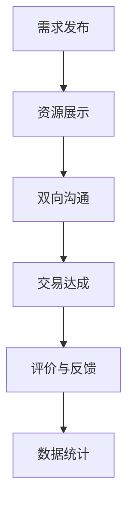

                 

### 第1章：自由对接模式的概述

#### 1.1 自由对接模式的概念

自由对接模式，简而言之，是一种通过对接平台实现生产者和需求者之间自由对接的模式。在这种模式中，生产者可以将自己生产的资源、产品或服务发布到对接平台上，而需求者则可以在平台上自由寻找并获取所需资源。这一模式的核心在于去中心化，即通过一个开放的平台，使得生产者和需求者之间能够直接进行交互，而无需依赖于传统的中介机构。

自由对接模式的本质，是一种新型的商业模式和组织形式。它改变了传统的生产与消费关系，使得每个人既是生产者，也是需求者，打破了信息不对称和资源分布不均的局面。这种模式的应用范围广泛，包括但不限于电商、制造业、共享经济等领域。

#### 1.2 自由对接模式的历史与发展

自由对接模式并非一蹴而就，而是经历了长期的演化和完善。从早期的C2C电商模式，到如今基于区块链技术的去中心化应用（DApp），自由对接模式的发展历程可以划分为以下几个阶段：

1. **传统电商平台阶段（2000年代初-2010年）**：这一阶段以淘宝、eBay等平台为代表，通过中心化的电商平台，实现了商品信息的集中展示和交易。

2. **C2C与B2C融合阶段（2010-2015年）**：随着移动互联网的普及，平台逐渐开始支持C2C与B2C的融合，例如淘宝的双11购物节，实现了消费者和商家之间的直接交易。

3. **去中心化应用阶段（2015年至今）**：区块链技术的发展，使得自由对接模式进入了新的阶段。以EOS、以太坊为代表的平台，通过去中心化技术，实现了生产者和需求者之间的直接对接。

#### 1.3 自由对接模式的重要性

自由对接模式的重要性体现在以下几个方面：

1. **提高效率**：通过去中心化的对接平台，生产者和需求者能够直接进行交互，减少了中间环节，从而提高了整个交易流程的效率。

2. **降低成本**：去中心化的模式降低了中介成本，使得生产者和需求者能够以更低的价格进行交易。

3. **促进创新**：自由对接模式为创新提供了广阔的空间。生产者和需求者可以直接互动，推动了产品和服务的不断升级和优化。

4. **提升用户体验**：自由对接模式使得消费者能够更加灵活地获取所需资源，提升了用户体验。

5. **改变商业模式**：自由对接模式颠覆了传统的商业模式，推动了各行各业的数字化转型。

总的来说，自由对接模式不仅改变了传统的生产与消费关系，还为数字经济的发展注入了新的活力。它的重要性在于，它不仅是一种技术创新，更是一种商业模式的革命。

### 第2章：自由对接模式的核心概念

#### 2.1 生产者和需求者的定义

在自由对接模式中，生产者和需求者是两个核心角色。他们的定义和角色如下：

**生产者**：生产者是指提供资源、产品或服务的人或组织。他们可能是制造商、供应商、自由职业者等，拥有一定的生产能力或服务能力。生产者的主要目标是将自己的资源或服务通过对接平台传播出去，以获取更多的市场机会和收益。

**需求者**：需求者是指需要资源、产品或服务的人或组织。他们可能是消费者、企业、政府部门等，需要通过对接平台获取所需资源以满足自身需求。需求者的主要目标是通过对接平台找到合适的生产者，以获取所需资源。

**生产者与需求者的互动**

生产者和需求者的互动是自由对接模式的核心。以下是生产者和需求者之间可能发生的互动：

1. **需求发布**：需求者可以在对接平台上发布需求信息，包括需求类型、数量、质量要求等。
2. **资源展示**：生产者将自己的资源或服务信息上传到对接平台，供需求者浏览和选择。
3. **双向沟通**：生产者和需求者可以在线上平台进行沟通，讨论细节，协商价格和交付方式。
4. **交易达成**：经过沟通，如果双方达成一致，则可以进行交易，需求者支付费用，生产者交付资源或服务。
5. **评价与反馈**：交易完成后，需求者可以对生产者进行评价和反馈，生产者也可以对需求者进行评价和反馈，以促进双方的进一步互动。

#### 2.2 对接平台的角色与功能

对接平台是自由对接模式的中枢，它为生产者和需求者提供了交互和交易的场所。以下是对接平台的角色与功能：

**对接平台的定义**

对接平台是一种基于互联网的开放平台，用于连接生产者和需求者，提供信息发布、双向沟通、交易达成等功能。

**对接平台的核心功能**

1. **信息发布**：生产者可以在对接平台上发布资源或服务信息，需求者可以在平台上浏览和搜索相关信息。
2. **双向沟通**：对接平台提供即时通信工具，生产者和需求者可以进行在线沟通，讨论细节。
3. **交易达成**：对接平台提供交易服务，包括支付、交付、评价等，确保交易顺利进行。
4. **数据分析**：对接平台可以对交易数据进行分析，为生产者和需求者提供市场趋势、竞争分析等信息。
5. **安全保障**：对接平台提供安全措施，包括身份验证、支付保障、争议解决等，确保交易安全可靠。

**对接平台的技术实现**

对接平台的技术实现涉及多个方面，包括前端界面设计、后端数据处理、数据库管理、支付系统、通信协议等。以下是一个简化的对接平台技术架构：

1. **前端界面**：使用HTML、CSS和JavaScript等前端技术，设计直观易用的用户界面。
2. **后端服务器**：使用Node.js、Java、Python等后端技术，处理用户请求、数据存储和服务器端逻辑。
3. **数据库**：使用MySQL、MongoDB等数据库技术，存储用户信息、商品信息、交易记录等数据。
4. **支付系统**：集成支付宝、微信支付等第三方支付系统，提供安全的支付服务。
5. **通信协议**：使用WebSocket、HTTP等通信协议，实现实时通信和数据传输。

#### 2.3 自由对接模式的工作原理

自由对接模式的工作原理可以分为以下几个步骤：

1. **需求发布**：需求者进入对接平台，发布自己的需求信息。
2. **资源展示**：生产者浏览需求信息，根据自己的资源或服务情况，决定是否参与竞标或报价。
3. **双向沟通**：生产者和需求者通过平台提供的即时通信工具进行沟通，讨论细节。
4. **交易达成**：双方达成一致后，需求者支付费用，生产者交付资源或服务。
5. **评价与反馈**：交易完成后，需求者可以对生产者进行评价和反馈，生产者也可以对需求者进行评价和反馈。
6. **数据统计**：对接平台对交易数据进行分析，为生产者和需求者提供市场趋势、竞争分析等信息。

以下是一个简化的自由对接模式流程图：



通过上述工作原理，自由对接模式实现了生产者和需求者之间的自由对接，提高了资源利用效率，降低了交易成本，促进了市场的发展。

### 第3章：自由对接模式的架构与设计

#### 3.1 自由对接模式的技术架构

自由对接模式的技术架构是其实现高效、稳定、安全运行的基础。一个完善的技术架构应包括前端界面、后端服务器、数据库、支付系统和通信协议等多个组成部分。以下是对自由对接模式技术架构的详细阐述：

**前端界面**

前端界面是用户与对接平台交互的入口，其设计应注重用户体验，使操作简单直观。前端界面通常采用HTML、CSS和JavaScript等技术构建，主要包括以下几个模块：

1. **用户注册与登录**：用户可以通过邮箱、手机号等进行注册和登录，确保平台的安全性。
2. **资源发布与浏览**：生产者可以在前端界面发布资源信息，需求者可以在前端界面浏览和搜索资源信息。
3. **双向沟通**：通过即时通信工具，如文本、图片、视频等，实现生产者和需求者之间的实时沟通。
4. **交易与支付**：前端界面应集成支付系统，提供便捷的支付服务。

**后端服务器**

后端服务器负责处理用户请求、数据存储和服务器端逻辑，其设计应具备高并发处理能力、良好的扩展性和安全性。后端服务器通常采用以下技术：

1. **服务器端语言**：如Node.js、Java、Python等，用于实现服务器端逻辑。
2. **中间件**：如Express.js、Spring Boot、Django等，用于简化服务器端开发。
3. **API接口**：提供RESTful API接口，实现前端与后端的通信。

**数据库**

数据库用于存储用户信息、商品信息、交易记录等数据，其设计应满足高并发读写、数据一致性和数据安全性的要求。常见的数据库技术包括：

1. **关系型数据库**：如MySQL、PostgreSQL等，适用于结构化数据存储。
2. **非关系型数据库**：如MongoDB、Cassandra等，适用于存储复杂的数据结构和海量数据。

**支付系统**

支付系统负责处理用户的支付请求，确保交易的安全和便捷。支付系统通常集成支付宝、微信支付、银联等第三方支付平台，提供多种支付方式。

1. **支付接口**：提供与第三方支付平台对接的API接口。
2. **支付流程**：包括支付请求、支付验证、支付结果通知等步骤。
3. **支付安全保障**：使用SSL加密、支付验证码等技术，确保支付过程的安全性。

**通信协议**

通信协议负责实现前端与后端之间的数据传输，其设计应保证实时性和稳定性。常见的通信协议包括：

1. **HTTP/HTTPS**：用于传输静态资源和用户请求。
2. **WebSocket**：用于实现实时双向通信，适用于双向沟通和实时数据传输。

**技术架构的优势与挑战**

**优势**

1. **高并发处理能力**：分布式架构和负载均衡技术，确保平台在高并发访问下的稳定运行。
2. **良好的扩展性**：模块化设计和可扩展架构，方便后续功能扩展和性能优化。
3. **安全性**：身份验证、数据加密、支付安全保障等技术，确保平台的安全可靠。
4. **用户体验**：简洁易用的前端界面，提升用户的使用体验。

**挑战**

1. **性能优化**：在高并发环境下，确保系统的响应速度和数据处理能力。
2. **安全性**：防止数据泄露、防止恶意攻击，确保用户信息和交易安全。
3. **数据一致性**：在分布式系统中，确保数据的一致性和完整性。
4. **可扩展性**：随着用户规模的扩大，如何保持系统的可扩展性。

**技术架构的演进趋势**

1. **云计算**：利用云计算资源，实现弹性的扩展和高效的资源利用。
2. **容器化与微服务**：采用容器化技术和微服务架构，提升系统的可维护性和可扩展性。
3. **区块链技术**：结合区块链技术，提高交易的安全性和透明度。
4. **人工智能**：利用人工智能技术，优化用户体验，提升平台的智能化水平。

#### 3.2 自由对接模式的数据结构

数据结构是自由对接模式中至关重要的组成部分，它决定了数据在系统中的存储、组织和管理方式。以下是对自由对接模式中常见的数据结构的详细阐述：

**用户数据结构**

用户数据结构用于存储用户的基本信息、权限信息等。以下是用户数据结构的示例：

```mermaid
classDiagram
    User <<class>> {
        UserID : int
        Username : string
        Password : string
        Email : string
        Role : string
    }
    
    User <=.. Address
    User <=.. PhoneNumber
```

**商品数据结构**

商品数据结构用于存储商品的基本信息、价格、库存等。以下是商品数据结构的示例：

```mermaid
classDiagram
    Product <<class>> {
        ProductID : int
        Name : string
        Description : string
        Price : float
        Stock : int
        Category : string
    }
```

**订单数据结构**

订单数据结构用于存储订单的基本信息、订单状态、订单明细等。以下是订单数据结构的示例：

```mermaid
classDiagram
    Order <<class>> {
        OrderID : int
        UserID : int
        OrderDate : datetime
        Status : string
        TotalAmount : float
    }
    
    Order <=.. OrderItem
```

**评价数据结构**

评价数据结构用于存储用户对商品或服务的评价信息。以下是评价数据结构的示例：

```mermaid
classDiagram
    Review <<class>> {
        ReviewID : int
        UserID : int
        ProductID : int
        Rating : float
        Comment : string
        ReviewDate : datetime
    }
```

**数据结构的设计原则**

1. **简洁性**：数据结构应简洁明了，易于理解和维护。
2. **扩展性**：数据结构应具备良好的扩展性，以适应未来的功能扩展。
3. **一致性**：数据结构应保证数据的一致性和完整性，避免数据冲突。
4. **高效性**：数据结构应满足高效的查询和操作需求，提升系统的性能。

**数据结构的应用场景**

1. **用户管理**：用户数据结构用于管理用户的基本信息和权限信息，包括用户注册、登录、个人信息修改等功能。
2. **商品管理**：商品数据结构用于管理商品的基本信息和库存，包括商品发布、商品分类、商品查询等功能。
3. **订单管理**：订单数据结构用于管理订单的基本信息和订单状态，包括订单创建、订单查询、订单取消等功能。
4. **评价管理**：评价数据结构用于管理用户对商品或服务的评价信息，包括评价发布、评价查询等功能。

#### 3.3 自由对接模式的用户体验设计

用户体验设计是自由对接模式成功的关键因素之一。一个良好的用户体验设计可以提升用户的满意度，增加用户粘性和活跃度。以下是对自由对接模式用户体验设计的详细阐述：

**用户需求分析**

用户需求分析是用户体验设计的起点。通过对用户需求的了解，可以设计出满足用户期望的功能和界面。以下是用户需求分析的步骤：

1. **目标用户画像**：确定自由对接模式的目标用户群体，分析其年龄、性别、职业、使用习惯等特征。
2. **用户访谈**：通过面对面访谈或在线问卷，收集用户的需求、喜好和痛点。
3. **用户行为分析**：分析用户在使用对接平台时的行为路径、点击热图等，了解用户的使用习惯。
4. **竞品分析**：分析同行业竞品的优点和不足，为改进自身设计提供参考。

**用户体验设计的方法**

用户体验设计的方法包括以下几种：

1. **原型设计**：通过创建线框图、高保真原型等，模拟用户界面和交互流程，验证设计是否符合用户需求。
2. **用户测试**：邀请目标用户参与测试，收集用户对设计方案的反馈，发现潜在问题。
3. **A/B测试**：将不同的设计方案随机展示给用户，通过对比分析，确定最优设计方案。
4. **迭代优化**：根据用户反馈和测试结果，不断优化设计，提升用户体验。

**用户体验设计的实践案例**

以下是一个自由对接模式中的用户界面设计案例：

**1. 资源发布界面**

用户可以在资源发布界面发布商品或服务信息。界面设计包括以下模块：

- **基本信息**：商品名称、价格、库存等。
- **详细描述**：商品或服务的详细描述，包括规格、特点、使用方法等。
- **图片展示**：上传商品或服务的图片，提升视觉吸引力。
- **发布按钮**：确认并发布商品或服务信息。

**2. 资源浏览界面**

用户可以在资源浏览界面查看和搜索商品或服务信息。界面设计包括以下模块：

- **搜索栏**：输入关键词，快速搜索商品或服务。
- **分类导航**：按照商品或服务的分类进行导航，方便用户查找。
- **商品列表**：展示商品或服务的列表，包括名称、价格、图片等。
- **筛选条件**：根据价格、品牌、评价等筛选条件，精确查找商品或服务。

**3. 双向沟通界面**

用户可以在双向沟通界面与生产者进行实时沟通。界面设计包括以下模块：

- **消息列表**：展示与生产者的聊天记录，方便用户查看。
- **消息输入框**：用户可以在输入框中输入文字、图片、视频等内容。
- **发送按钮**：确认并发送消息。
- **表情图标**：提供丰富的表情图标，增强沟通表达。

通过以上用户体验设计，自由对接模式可以提供简单、直观、高效的操作流程，提升用户的满意度和使用体验。

### 第4章：自由对接模式的实施步骤

#### 4.1 制定自由对接战略

制定自由对接战略是实施自由对接模式的第一步，它决定了对接模式的发展方向和目标。以下是制定自由对接战略的步骤：

1. **明确目标和愿景**：明确自由对接模式的最终目标，如提升效率、降低成本、促进创新等。同时，制定一个长期的愿景，为后续发展提供方向。
2. **市场分析**：对目标市场进行深入分析，包括市场规模、竞争态势、用户需求等。通过市场分析，确定自由对接模式的主要应用场景和目标用户群体。
3. **需求调研**：通过用户访谈、问卷调查等方式，收集用户对自由对接模式的需求和期望。了解用户在使用传统模式中的痛点，为改进设计提供依据。
4. **制定战略规划**：根据市场分析和需求调研的结果，制定具体的战略规划。包括以下几个方面：

   - **平台定位**：确定对接平台的核心功能和特色，如专注于特定行业或市场。
   - **技术路线**：选择合适的技术架构和开发工具，确保平台的性能和安全性。
   - **业务模式**：确定自由对接模式的盈利模式，如收取佣金、提供增值服务等。
   - **推广策略**：制定市场推广计划，包括线上和线下渠道，提高平台的知名度。

5. **风险评估**：评估自由对接模式可能面临的风险，如市场风险、技术风险、法律风险等。制定相应的风险应对措施，确保项目的顺利实施。

#### 4.2 构建自由对接平台

构建自由对接平台是实施自由对接模式的核心步骤，它决定了平台的可用性和用户体验。以下是构建自由对接平台的步骤：

1. **需求分析**：在制定自由对接战略的基础上，进一步细化平台的功能需求和用户需求。包括用户注册与登录、资源发布与浏览、双向沟通、交易达成、评价与反馈等功能。
2. **设计原型**：根据需求分析，设计平台的线框图和高保真原型，模拟用户界面和交互流程。通过原型设计，验证功能是否符合用户需求，并进行优化。
3. **技术选型**：选择合适的技术架构和开发工具，如前端框架（React、Vue等）、后端框架（Node.js、Spring Boot等）、数据库（MySQL、MongoDB等）等。
4. **开发与测试**：按照设计原型，进行前端和后端的开发。在开发过程中，进行单元测试、集成测试和系统测试，确保平台的稳定性和性能。
5. **部署与上线**：将开发完成的平台部署到服务器，进行上线前的测试。确保平台能够在实际环境中正常运行，并提供良好的用户体验。
6. **持续迭代**：在平台上线后，根据用户反馈和业务需求，进行持续的优化和迭代。通过持续迭代，不断提升平台的性能和用户体验。

#### 4.3 实施自由对接流程

实施自由对接流程是确保自由对接模式顺利运行的关键。以下是实施自由对接流程的步骤：

1. **需求发布**：需求者进入对接平台，填写需求信息，包括需求类型、数量、质量要求等。需求信息将存储在数据库中，供生产者浏览和选择。
2. **资源展示**：生产者可以在平台上浏览需求信息，根据自己的资源或服务情况，决定是否参与竞标或报价。生产者可以发布自己的资源或服务信息，供需求者浏览和选择。
3. **双向沟通**：生产者和需求者通过平台提供的即时通信工具进行沟通，讨论细节，包括价格、交付方式、售后服务等。双向沟通确保双方对交易细节达成一致。
4. **交易达成**：在沟通达成一致后，需求者可以选择生产者并确认交易。需求者支付费用，生产者交付资源或服务。平台提供支付保障，确保交易安全。
5. **评价与反馈**：交易完成后，需求者可以对生产者进行评价和反馈，包括服务态度、交付速度、产品质量等。生产者也可以对需求者进行评价和反馈，以促进双方的进一步互动。
6. **数据统计**：平台对交易数据进行分析，生成市场趋势、竞争分析等报告。数据统计为生产者和需求者提供决策依据，优化资源分配和交易策略。

通过以上实施自由对接流程，自由对接模式能够实现生产者和需求者之间的自由对接，提高资源利用效率，降低交易成本，促进市场的发展。

### 第5章：自由对接模式的案例分析

#### 5.1 案例分析一：电商平台的自由对接模式

**案例背景**

电商平台是自由对接模式的经典应用之一。以淘宝为例，淘宝作为一个C2C电商平台，通过自由对接模式实现了生产者和消费者之间的直接交易。淘宝成立于2003年，经过多年的发展，已成为中国最大的电商平台之一，拥有海量的生产者和消费者。

**对接模式的设计**

淘宝的自由对接模式主要包括以下几个核心组成部分：

1. **用户注册与登录**：生产者和消费者在淘宝上注册账号，通过邮箱或手机号进行登录。
2. **商品发布与浏览**：生产者可以在淘宝上发布商品信息，包括商品名称、价格、图片、详细描述等。消费者可以在淘宝上浏览和搜索商品，根据自己的需求进行筛选。
3. **双向沟通**：消费者可以在淘宝上与生产者进行实时沟通，讨论商品细节、价格、交付方式等。淘宝提供即时通信工具，如旺旺，方便双方交流。
4. **交易达成**：在双方沟通达成一致后，消费者可以选择商品并下单，支付费用。淘宝提供多种支付方式，如支付宝、微信支付等，确保交易安全。
5. **评价与反馈**：交易完成后，消费者可以对生产者进行评价和反馈，包括服务态度、商品质量、物流速度等。生产者也可以对消费者进行评价和反馈，以促进双方的进一步互动。

**案例分析**

淘宝的自由对接模式在实践中取得了显著的效果：

1. **提高了交易效率**：通过淘宝，生产者和消费者能够直接进行交易，减少了中间环节，提高了交易效率。
2. **降低了交易成本**：去中心化的模式降低了中介成本，消费者能够以更低的价格购买商品，生产者能够获得更高的利润。
3. **促进了创新**：淘宝上涌现出大量的小型生产者和创新品牌，通过淘宝平台，他们能够接触到更多的消费者，推动产品和服务的不断创新。
4. **提升了用户体验**：淘宝提供丰富的商品信息、便捷的支付方式和实时的沟通工具，为消费者提供了良好的购物体验。

#### 5.2 案例分析二：制造业的自由对接模式

**案例背景**

制造业的自由对接模式在近年来也逐渐兴起。以海尔为例，海尔作为一家大型制造企业，通过自由对接模式实现了供应链的优化和资源的合理配置。海尔成立于1984年，是全球领先的家用电器制造商之一。

**对接模式的设计**

海尔的自由对接模式主要包括以下几个核心组成部分：

1. **供应链协同**：海尔通过对接平台，将供应链上下游的各个环节连接起来，实现信息共享和协同工作。包括供应商、制造商、分销商、零售商等。
2. **订单管理**：海尔通过对接平台，接受客户的订单需求，并根据订单情况安排生产。对接平台提供订单管理功能，包括订单生成、订单跟踪、订单取消等。
3. **生产调度**：海尔通过对接平台，实现生产线的智能化调度，提高生产效率。对接平台可以根据订单数量、生产进度等因素，动态调整生产计划。
4. **物流管理**：海尔通过对接平台，实现物流信息的实时跟踪和管理。对接平台提供物流管理功能，包括物流订单生成、物流跟踪、物流异常处理等。
5. **供应链金融**：海尔通过对接平台，为供应链上下游企业提供金融服务，如贷款、融资等。对接平台提供供应链金融服务，提高供应链的流动性。

**案例分析**

海尔的自由对接模式在实践中取得了显著的效果：

1. **提高了供应链效率**：通过对接平台，海尔的供应链上下游企业能够实现信息共享和协同工作，提高了供应链的整体效率。
2. **降低了库存成本**：海尔的对接平台实现了实时订单管理和生产调度，减少了库存积压，降低了库存成本。
3. **提升了生产效率**：海尔的智能化生产调度和物流管理，提高了生产线的运行效率，缩短了交货周期。
4. **增强了企业竞争力**：通过对接平台，海尔能够更好地满足客户需求，提高市场竞争力。

#### 5.3 案例分析三：共享经济的自由对接模式

**案例背景**

共享经济是自由对接模式的另一大应用领域。以滴滴出行为例，滴滴出行作为一个共享出行平台，通过自由对接模式实现了司机和乘客之间的直接交易。滴滴出行成立于2012年，已成为全球最大的移动出行平台之一。

**对接模式的设计**

滴滴出行的自由对接模式主要包括以下几个核心组成部分：

1. **司机注册与认证**：司机在滴滴出行平台上注册账号，通过身份验证、车辆审核等步骤，确保司机信息的真实性和合法性。
2. **乘客需求发布**：乘客在滴滴出行平台上发布出行需求，包括出发地点、目的地、乘车人数等。
3. **匹配与接单**：滴滴出行平台通过算法，根据司机的位置、车辆类型、服务评价等因素，为乘客匹配最合适的司机。司机接单后，前往乘客指定地点。
4. **实时沟通与导航**：乘客和司机在滴滴出行平台上进行实时沟通，确认上车地点和行程。平台提供实时导航，帮助司机快速到达乘客位置。
5. **支付与评价**：乘客通过平台支付费用，并对司机进行评价和反馈。司机也可以对乘客进行评价和反馈。

**案例分析**

滴滴出行的自由对接模式在实践中取得了显著的效果：

1. **提高了出行效率**：通过滴滴出行平台，乘客能够快速找到合适的司机，实现快速出行。司机也能够通过平台获取更多的订单机会，提高了收入。
2. **降低了出行成本**：滴滴出行平台提供了更加灵活和经济的出行方式，降低了乘客的出行成本。
3. **促进了资源共享**：滴滴出行平台实现了车辆的共享使用，提高了车辆的利用效率，减少了资源浪费。
4. **提升了用户体验**：滴滴出行平台提供了便捷的支付方式、实时的导航和沟通工具，为乘客提供了良好的出行体验。

通过以上案例分析，可以看出自由对接模式在不同领域的成功应用。自由对接模式不仅提高了交易效率，降低了成本，还促进了创新和资源共享，为经济发展注入了新的活力。

### 第6章：自由对接模式的挑战与解决方案

#### 6.1 难点一：信息不对称的解决

在自由对接模式中，信息不对称是一个普遍存在的问题。生产者和需求者之间往往存在信息不对等，导致交易效率降低，甚至出现欺诈行为。以下是针对信息不对称的解决方案：

**问题分析**

1. **信息不透明**：生产者和需求者之间缺乏透明的信息交流，导致双方无法准确了解对方的真实情况和需求。
2. **信誉风险**：由于缺乏有效的信誉评估机制，生产者和需求者可能存在欺诈行为，损害对方的利益。

**解决方案**

1. **数据共享**：通过对接平台，实现生产者和需求者之间的信息共享。平台可以收集和整合用户行为数据、交易数据等，为双方提供全面的信息参考。
2. **信誉评估**：对接平台可以建立信誉评估机制，对生产者和需求者进行信用评分。评分机制可以基于用户行为数据、交易记录、用户评价等多方面因素进行综合评估。
3. **第三方认证**：对接平台可以引入第三方认证机构，对生产者和需求者进行身份认证、资质认证等。通过第三方认证，提高信息的可信度。
4. **智能合约**：利用区块链技术，实现智能合约的应用。智能合约可以自动执行双方约定的交易条款，确保交易透明和安全。

**实施案例**

以滴滴出行为例，滴滴通过以下措施解决信息不对称问题：

1. **司机认证**：滴滴对注册的司机进行严格的身份认证和车辆审核，确保司机信息的真实性。
2. **用户评价**：滴滴允许乘客对司机进行评价，司机也可以对乘客进行评价，通过用户评价体系，提高信息的透明度。
3. **数据共享**：滴滴通过大数据分析，为司机和乘客提供实时路况、订单量等信息，帮助双方做出更明智的决策。
4. **智能合约**：滴滴利用区块链技术，实现了乘客支付费用的自动化处理，提高了交易的安全性。

通过以上措施，滴滴成功解决了信息不对称问题，提高了交易效率，降低了交易风险。

#### 6.2 难点二：信任问题的解决

在自由对接模式中，信任问题是一个关键挑战。生产者和需求者之间的信任缺失可能导致交易中断，影响平台的稳定运行。以下是解决信任问题的方案：

**问题分析**

1. **信誉风险**：生产者和需求者之间的信誉体系不健全，可能导致欺诈行为。
2. **信息不透明**：信息不对称导致双方对对方的能力和信誉无法充分了解。
3. **法律风险**：在自由对接模式下，交易双方可能面临法律纠纷，影响交易的稳定性。

**解决方案**

1. **信誉评价系统**：对接平台可以建立完善的信誉评价系统，对生产者和需求者进行信用评分。通过收集用户行为数据、交易记录、用户评价等，形成全面的信誉评估体系。
2. **第三方认证**：引入第三方认证机构，对生产者和需求者进行身份认证、资质认证等。第三方认证可以提高信息的可信度，增强双方的信任。
3. **智能合约**：利用区块链技术，实现智能合约的应用。智能合约可以自动执行双方约定的交易条款，确保交易过程透明、公正、不可篡改。
4. **法律保障**：对接平台应提供完善的法律保障措施，包括合同条款、纠纷解决机制等。通过法律保障，降低交易风险，增强用户信任。

**实施案例**

以淘宝为例，淘宝通过以下措施解决信任问题：

1. **用户评价**：淘宝允许用户对交易过程进行评价，包括商品质量、卖家服务、物流速度等。通过用户评价，消费者可以更好地了解卖家的信誉。
2. **实名认证**：淘宝要求卖家进行实名认证，确保卖家身份的真实性。
3. **保证金制度**：淘宝对卖家收取保证金，用于保障消费者权益。如果卖家出现违约行为，消费者可以通过保证金获得赔偿。
4. **法律援助**：淘宝提供法律援助服务，帮助消费者解决交易纠纷，提高交易的公平性和公正性。

通过以上措施，淘宝成功建立了完善的信任体系，提高了用户满意度，促进了平台的稳定运行。

#### 6.3 难点三：技术实现的挑战

在自由对接模式的实现过程中，技术挑战是一个不可忽视的问题。以下是对技术实现挑战的详细分析及解决方案：

**问题分析**

1. **系统性能**：随着用户规模的扩大，自由对接平台需要具备高并发处理能力，确保系统的稳定运行。
2. **数据一致性**：在分布式系统中，数据的一致性和完整性是一个重要挑战，特别是在高并发环境下。
3. **安全性**：自由对接平台需要保护用户数据和交易数据的安全，防止数据泄露和恶意攻击。
4. **可扩展性**：平台需要具备良好的扩展性，以便在用户规模和业务需求发生变化时，能够快速适应。

**解决方案**

1. **分布式架构**：采用分布式架构，将系统拆分为多个模块，实现水平扩展。通过负载均衡技术，提高系统的并发处理能力。
2. **分布式数据库**：使用分布式数据库，如MySQL Cluster、MongoDB等，确保数据的一致性和完整性。分布式数据库可以通过复制和分片技术，提高数据的读写性能和容错能力。
3. **加密技术**：使用加密技术，如SSL/TLS，对用户数据和交易数据进行加密传输，确保数据传输过程中的安全性。同时，对敏感数据进行加密存储，防止数据泄露。
4. **区块链技术**：利用区块链技术，实现去中心化的交易记录存储和验证。区块链技术可以提供透明、不可篡改的交易记录，提高交易的安全性和可信度。
5. **智能合约**：使用智能合约，实现自动化交易处理和智能合约执行。智能合约可以确保交易条款的严格执行，提高交易的安全性和效率。
6. **微服务架构**：采用微服务架构，将系统拆分为多个独立的微服务，实现模块化开发和部署。通过容器化技术，如Docker和Kubernetes，提高系统的可扩展性和维护性。

**实施案例**

以阿里巴巴为例，阿里巴巴在实现自由对接平台时，采用了以下技术方案：

1. **分布式架构**：阿里巴巴的电子商务平台采用了分布式架构，通过负载均衡和容器化技术，实现了高并发处理能力。
2. **分布式数据库**：阿里巴巴使用了MySQL Cluster和MongoDB等分布式数据库，确保数据的一致性和完整性。
3. **加密技术**：阿里巴巴对用户数据和交易数据进行了加密存储和传输，提高了数据的安全性。
4. **区块链技术**：阿里巴巴在部分业务中采用了区块链技术，如供应链金融，实现了去中心化的交易记录存储和验证。
5. **微服务架构**：阿里巴巴的电子商务平台采用了微服务架构，通过容器化和Kubernetes技术，实现了系统的快速部署和维护。

通过以上技术方案，阿里巴巴成功实现了自由对接平台的高性能、高安全性和高可扩展性，为用户提供了一个稳定可靠的交易平台。

### 第7章：自由对接模式的未来趋势

#### 7.1 自由对接模式的发展方向

随着技术的不断进步和社会需求的多样化，自由对接模式在未来将继续发展，并呈现以下方向：

1. **去中心化**：自由对接模式将更加去中心化，减少对中心化平台的依赖，实现更加公平、透明的交易环境。去中心化协议（如区块链技术）将在自由对接模式中发挥重要作用。
2. **智能化**：随着人工智能技术的发展，自由对接平台将实现智能化，如智能匹配算法、自动化交易处理、智能合约执行等，提高交易效率和用户体验。
3. **定制化**：自由对接模式将更加注重个性化需求，提供更加定制化的服务，满足用户多样化的需求。
4. **全球化**：自由对接模式将打破地域限制，实现全球范围内的资源对接和交易，促进全球经济的互联互通。
5. **可持续发展**：自由对接模式将更加注重可持续发展，通过资源共享和优化，减少资源浪费，推动绿色经济的发展。

#### 7.2 自由对接模式与数字经济

数字经济是指以数字技术和网络经济为基础，通过数据创造价值、创新商业模式和提升效率的一种经济形态。自由对接模式作为数字经济的重要组成部分，对数字经济的发展具有深远的影响：

1. **提升效率**：自由对接模式通过去中心化和智能化，提高了资源利用效率和交易效率，促进了数字经济的发展。
2. **创新商业模式**：自由对接模式颠覆了传统的商业模式，推动了数字化转型的浪潮。企业可以通过自由对接模式，实现供应链的优化、服务的创新和市场的拓展。
3. **数据驱动**：自由对接模式积累了大量的交易数据，通过对这些数据进行分析和挖掘，可以为企业提供决策依据，推动数字经济的进一步发展。
4. **促进共享经济**：自由对接模式为共享经济的发展提供了基础设施，如共享出行、共享住宿等，推动了数字经济的多元化发展。

#### 7.3 自由对接模式的社会影响

自由对接模式不仅对经济发展产生了深远影响，还对社会产生了积极的影响：

1. **提高生活质量**：自由对接模式为消费者提供了更加丰富和便捷的购物体验，提高了生活质量。
2. **促进就业和创业**：自由对接模式为生产者和需求者提供了更多的就业和创业机会，促进了社会的就业和经济发展。
3. **促进资源共享**：自由对接模式实现了资源的优化配置和共享，减少了资源浪费，推动了可持续发展。
4. **提升社会治理能力**：自由对接模式为政府部门提供了更多的数据和信息，有助于提升社会治理能力和公共服务水平。

总的来说，自由对接模式作为数字经济的重要组成部分，对经济发展、社会进步和人类生活质量产生了深远的影响。在未来，随着技术的不断进步和应用场景的拓展，自由对接模式将继续发挥重要作用，推动社会的可持续发展。

### 附录A：自由对接模式的技术资源与工具

#### A.1 常用对接平台介绍

1. **淘宝**：中国最大的C2C电商平台，提供商品发布、交易、支付、评价等功能。
2. **京东**：中国领先的综合性电商平台，提供B2C、C2C等多种交易模式。
3. **拼多多**：以社交电商模式为主的平台，注重低价和拼团购买。
4. **亚马逊**：全球最大的电商平台，提供B2C、C2C、FBA等多种交易模式。

#### A.2 开发工具与资源

1. **前端开发工具**：
   - **React**：用于构建用户界面的JavaScript库。
   - **Vue.js**：用于构建用户界面的渐进式框架。
   - **Angular**：由谷歌开发的用于构建动态网页的框架。

2. **后端开发工具**：
   - **Node.js**：用于构建高效、可扩展的Web服务器。
   - **Spring Boot**：用于构建企业级Java应用的框架。
   - **Django**：用于构建快速开发Web应用的Python框架。

3. **数据库技术**：
   - **MySQL**：常用的关系型数据库管理系统。
   - **MongoDB**：常用的非关系型数据库管理系统。
   - **Redis**：高性能的内存数据库，适用于缓存和会话存储。

4. **支付系统**：
   - **支付宝**：中国最大的第三方支付平台。
   - **微信支付**：中国第二大第三方支付平台。
   - **PayPal**：国际知名的在线支付平台。

#### A.3 技术标准与规范

1. **Web标准**：包括HTML、CSS、JavaScript等标准。
2. **RESTful API标准**：用于构建RESTful Web服务的标准。
3. **区块链标准**：如Hyperledger Fabric、Ethereum等。
4. **安全标准**：如SSL/TLS、OAuth2.0等。

### 附录B：自由对接模式的实践指南

#### B.1 自由对接项目的规划与实施

1. **项目规划**：
   - **需求分析**：明确自由对接项目的目标和应用场景。
   - **技术选型**：选择适合的技术架构和开发工具。
   - **团队组建**：组建专业的开发团队，包括前端、后端、数据库、UI/UX设计师等。
   - **资源分配**：合理分配项目资源，包括人力、资金、时间等。

2. **项目实施**：
   - **需求分析**：详细分析用户需求，制定功能需求文档。
   - **设计阶段**：进行系统设计，包括技术架构、数据库设计、用户界面设计等。
   - **开发阶段**：按照设计文档进行开发，进行单元测试和集成测试。
   - **测试阶段**：进行系统测试、性能测试和安全测试。
   - **上线与维护**：上线系统，进行用户培训和维护。

#### B.2 自由对接模式的风险管理

1. **风险管理计划**：
   - **识别风险**：识别项目中可能遇到的风险，如技术风险、市场风险、法律风险等。
   - **评估风险**：评估每个风险的严重程度和概率，制定风险优先级。
   - **应对策略**：制定相应的应对策略，包括预防措施、应急措施等。

2. **风险监控与应对**：
   - **定期监控**：定期评估项目风险，更新风险识别和应对策略。
   - **风险应对**：在风险发生时，及时采取应对措施，减少风险对项目的影响。
   - **沟通与协作**：确保项目团队成员之间的有效沟通和协作，共同应对风险。

#### B.3 自由对接模式的持续改进

1. **用户反馈**：
   - **收集反馈**：定期收集用户反馈，了解用户对系统的使用体验和需求。
   - **分析反馈**：对用户反馈进行分析，识别系统的优点和不足。

2. **迭代开发**：
   - **需求分析**：根据用户反馈，确定下一版本的需求。
   - **设计阶段**：进行系统设计，包括功能设计、界面设计等。
   - **开发阶段**：按照设计文档进行开发，进行单元测试和集成测试。
   - **测试阶段**：进行系统测试、性能测试和安全测试。
   - **上线与维护**：上线系统，进行用户培训和维护。

3. **性能优化**：
   - **性能分析**：对系统进行性能分析，识别性能瓶颈。
   - **优化方案**：制定优化方案，包括代码优化、数据库优化、缓存策略等。
   - **实施优化**：按照优化方案，对系统进行优化，提高系统性能。

通过以上实践指南，可以确保自由对接项目的顺利实施和持续改进，提升用户体验和系统性能。

### 附录C：自由对接模式的扩展阅读

#### C.1 相关书籍推荐

1. **《区块链革命》**：作者：唐·塔普斯科特、亚历克斯·塔普斯科特，详细介绍了区块链技术及其对社会、经济、政治的影响。
2. **《智能合约：区块链技术中的自动化交易协议》**：作者：安德烈亚斯·M·安东诺普洛斯，深入探讨了智能合约的概念、实现和应用。
3. **《共享经济：协同消费的新模式》**：作者：里夫·科赫，探讨了共享经济的概念、模式及其对社会的影响。

#### C.2 学术论文推荐

1. **“Blockchain: A System for Global Scale Secure Collaboration”**：作者：Li-Cheng Wang，详细介绍了区块链技术的原理、架构和应用。
2. **“Smart Contracts: A New Approach to Electronic Commerce”**：作者：Nick Szabo，探讨了智能合约的概念、设计原则和应用场景。
3. **“The Sharing Economy: Opportunities and Challenges”**：作者：Michael E. Porter、Marco Iansiti，分析了共享经济的商业模式、机会和挑战。

#### C.3 行业报告推荐

1. **《中国共享经济发展年度报告（2020）》**：由中国社会科学院编写，详细分析了2020年中国共享经济的发展状况、趋势和挑战。
2. **《全球区块链技术发展报告（2021）》**：由国际数据公司（IDC）编写，分析了全球区块链技术的发展趋势、应用案例和未来展望。
3. **《中国数字经济报告（2021）》**：由中国数字经济研究院编写，探讨了数字经济的概念、特征和发展趋势。

