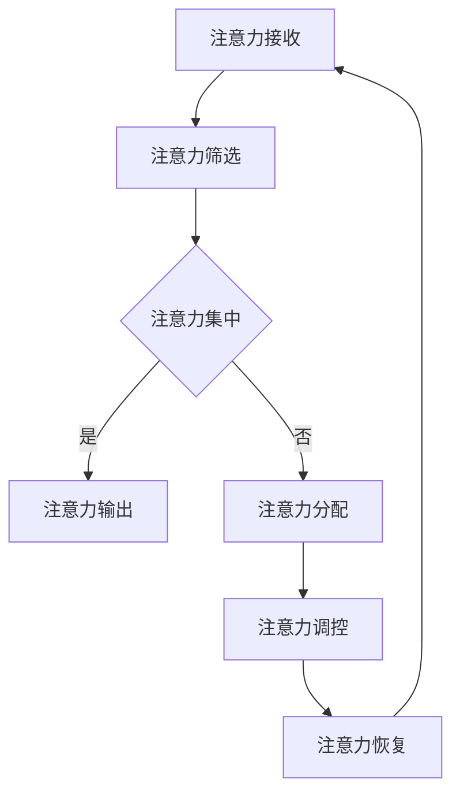

                 

# 注意力管理：元宇宙时代的核心生存技能

> **关键词：注意力管理、元宇宙、生存技能、注意力分配、注意力调控**

> **摘要：本文将探讨注意力管理在元宇宙时代的重要性。我们将从基础概念出发，逐步深入分析注意力管理的核心原理、应用场景，并探讨其在元宇宙中的实际应用。通过案例分析和技术工具介绍，本文旨在为读者提供一套实用的注意力管理方法，帮助他们在元宇宙时代保持高效和专注。**

### 目录大纲

1. 引言
   - 元宇宙时代的到来
   - 注意力管理的紧迫性
   - 文章结构概述

2. 注意力管理基础
   - 注意力概述
   - 注意力管理的科学基础
   - 注意力管理的现状与挑战

3. 注意力管理的基本原理
   - 注意力分配原理
   - 注意力调控机制
   - 注意力损耗与恢复

4. 注意力管理在元宇宙中的应用
   - 元宇宙中的注意力挑战
   - 元宇宙中的注意力管理策略
   - 元宇宙中的注意力应用场景

5. 注意力管理与可持续发展
   - 注意力管理与个人成长
   - 注意力管理与社会影响
   - 注意力管理对公共政策的启示

6. 注意力管理的未来趋势
   - 注意力管理技术的进展
   - 注意力管理的未来挑战
   - 注意力管理的可持续发展路径

7. 结论与展望
   - 注意力管理的重要性总结
   - 注意力管理的未来发展方向
   - 注意力管理的应用前景
   - 注意力管理的教育与实践建议

8. 附录
   - 注意力管理工具与资源
   - 注意力管理案例分析
   - 注意力管理实践指南

9. Mermaid 流�程图
   - 注意力管理的基本流程

10. 注意力分配原理伪代码
    - 注意力分配原理伪代码示例

11. 数学模型与公式
    - 注意力分配模型

12. 项目实战
    - 注意力管理工具开发
    - 开发环境搭建
    - 源代码实现
    - 代码解读与分析

13. 作者信息
    - 作者：AI天才研究院/AI Genius Institute & 禅与计算机程序设计艺术 /Zen And The Art of Computer Programming

### 引言

随着元宇宙的兴起，我们正逐步进入一个全新的数字时代。元宇宙是一个虚拟的三维空间，它融合了虚拟现实、增强现实、区块链和社交网络等多种技术，为用户提供了无限的可能性。在这个时代，人们不仅需要掌握传统的技能，还需要掌握一项新的核心生存技能——注意力管理。

**元宇宙时代的到来**意味着我们将面临前所未有的信息爆炸和注意力分散。在元宇宙中，用户可以同时参与多个活动，如虚拟会议、社交互动、在线游戏等。这种多任务处理带来了巨大的注意力挑战，如何在这种环境中保持专注和高效变得至关重要。

**注意力管理的紧迫性**在于它不仅影响个人的生活质量和工作效率，还对社会的发展产生深远影响。有效的注意力管理可以帮助我们更好地应对信息过载，提高决策质量，增强创新能力和协作能力。

本文将首先介绍注意力管理的核心概念，然后逐步深入分析注意力管理的科学基础和基本原理。接着，我们将探讨注意力管理在元宇宙中的应用场景，包括社交、游戏和内容创作等。最后，我们将展望注意力管理的未来趋势，并提出一些建议，以帮助读者在元宇宙时代实现注意力管理的高效和实践。

接下来的章节将逐一展开，通过对每一个主题的详细探讨，为读者提供一套全面的注意力管理方法论。让我们开始这个充满挑战和机遇的旅程吧。

### 注意力管理基础

#### 注意力概述

**注意力**，这个看似简单的词汇，实际上蕴含着极其丰富的内涵。在心理学领域，**注意力**通常被定义为一种认知过程，它使我们能够选择和处理来自外部和内部的信息。换句话说，注意力决定了我们在特定时刻关注什么，忽略什么。

**注意力的定义**可以追溯到人类对认知过程的探究。在认知科学中，注意力被描述为一种有限的认知资源，它能够集中用于特定的任务或活动。这种资源不仅决定了我们的感知能力，还影响着我们的记忆、思维和决策。

**注意力的基本类型**主要包括以下几种：

1. **选择性注意力**：这是指我们选择关注特定信息而忽略其他信息的能力。例如，当你坐在嘈杂的咖啡店里工作时，你的选择性注意力帮助你忽略周围的噪音，专注于你的电脑屏幕。

2. **持续性注意力**：这是指我们保持对某个任务或活动关注的持久性。例如，当你参加一个长时间的会议时，需要保持持续性注意力，以避免分心和走神。

3. **分配性注意力**：这是指我们同时处理多个任务或信息的能力。例如，当你同时打电话和开车时，需要运用分配性注意力来确保安全和效率。

**注意力管理的意义**在于，通过有效地管理注意力，我们可以提高工作效率、减少错误率，并提升生活质量。注意力管理不仅对个人发展至关重要，也对团队合作和社会治理产生深远影响。

在接下来的章节中，我们将进一步探讨注意力管理的科学基础和基本原理，帮助读者更深入地理解这一重要的认知过程。

#### 注意力管理的科学基础

**注意力管理**的科学基础主要建立在心理学、脑科学和生物医学的研究之上。这些领域为我们提供了深刻的理解，揭示了注意力的内在机制及其调节方法。

**注意力心理学原理**首先涉及注意力的基础概念。心理学家认为，注意力是一种认知资源，它决定了我们如何处理和响应信息。选择性注意力使我们能够从大量信息中筛选出重要部分，持续性注意力帮助我们维持对任务的专注，而分配性注意力则允许我们在多个任务间切换。这些能力通过训练和练习可以得到提升。

**注意力脑科学基础**则从神经科学的角度揭示了注意力背后的生理机制。大脑的不同区域在注意力过程中扮演着特定的角色。例如，前额叶皮层与决策和规划有关，而顶叶和颞叶则与感知和记忆相关。神经影像技术，如功能性磁共振成像（fMRI），使我们能够观察到这些区域在注意力任务中的活动变化。研究表明，大脑的可塑性使得通过训练可以增强注意力的能力。

**注意力生物医学研究进展**则为注意力管理提供了更为具体的方法和策略。例如，神经反馈训练通过实时监测大脑活动，帮助个体识别并调节注意力。此外，神经递质和荷尔蒙的研究也揭示了如何通过药物和营养补充来调节注意力水平。例如，多巴胺和去甲肾上腺素的增加可以提高注意力和动机，而谷氨酸和甘氨酸的调节则有助于改善注意力分散。

这些科学研究不仅为我们理解注意力提供了理论基础，还指导了实际应用。例如，在教育领域，通过注意力训练课程可以帮助学生提高学习效率；在职业环境中，通过认知训练可以提升员工的注意力和决策能力。

总之，注意力管理的科学基础为我们在元宇宙时代更好地管理注意力提供了丰富的工具和方法。在接下来的章节中，我们将进一步探讨注意力管理的基本原理，帮助读者将这些科学知识应用于实际生活中。

#### 注意力管理的现状与挑战

**当前注意力管理的现状**显示，尽管我们已经对注意力有了深入的科学理解，但在实际应用中，人们仍然面临诸多挑战。现代社会的信息过载和数字化生活方式加剧了注意力的分散，导致很多人在处理多任务时感到压力和疲劳。

**注意力管理中的常见问题**包括：

1. **注意力分散**：在嘈杂的环境或同时处理多个任务时，人们容易分心，导致注意力无法集中。
2. **注意力疲劳**：长时间高强度的注意力投入会导致大脑疲劳，降低注意力的效率和持久性。
3. **注意力选择困难**：在面临大量信息选择时，人们难以确定哪些信息是最重要的，导致决策困难。

**注意力管理的挑战与机遇**在于如何有效地应对这些常见问题。一方面，信息过载使得注意力资源变得稀缺，另一方面，先进的技术和方法为注意力管理提供了新的工具和策略。

为了克服这些挑战，我们需要：

1. **提高注意力分配能力**：通过科学的方法和练习，提高选择性、持续性和分配性注意力的能力。
2. **利用技术工具**：例如，注意力追踪器和应用程序可以帮助我们实时监测和调节注意力水平。
3. **建立良好的生活习惯**：例如，通过规律作息和锻炼来提高身体的健康状态，从而提升注意力。

总之，注意力管理不仅是现代社会的一项重要技能，也是一个需要持续关注和改进的领域。通过科学的方法和实际的应用，我们可以更好地应对注意力分散和疲劳，提高个人和社会的效率。

### 注意力管理的基本原理

#### 注意力分配原理

**注意力分配原理**是理解如何在高效率环境中合理利用注意力资源的关键。这一原理基于**注意力资源理论**，认为注意力是一种有限的认知资源，我们的大脑在一次只能处理一定量的信息。因此，如何合理分配这些有限的资源，以最大化任务完成效果，是一个重要的问题。

**注意力资源理论**认为，注意力资源是动态的，它可以随着任务的复杂性和需求的变化而重新分配。该理论指出，人们不能同时将注意力完全集中在多个任务上，而是需要根据任务的优先级和紧急性来分配注意力资源。

**注意力分配原则**主要包括以下几个方面：

1. **优先级原则**：首先将注意力资源分配给优先级最高的任务。例如，在处理多任务时，应该优先完成最重要的任务，确保关键任务得到充分关注。

2. **紧急性原则**：在紧急事件发生时，需要迅速将注意力资源转移到最紧急的任务上。例如，在紧急情况下，需要立即处理突发事件，以确保安全。

3. **可恢复性原则**：在分配注意力资源时，要考虑到任务的可恢复性。对于一些可以稍后处理的任务，可以暂时将其搁置，将主要注意力资源用于更紧迫的任务。

**多任务处理中的注意力管理**是一个复杂的过程，需要我们灵活运用注意力分配原则。以下是一些实践技巧：

1. **分阶段处理**：将复杂任务分解成若干个阶段，每个阶段专注于一个特定的任务。这种方法有助于减少任务切换时的注意力分散。

2. **专注时间段**：设定特定的专注时间段，例如使用番茄工作法（25分钟专注工作，5分钟休息），以保持连续性和专注力。

3. **环境优化**：在处理任务时，尽量创造一个无干扰的环境。关闭不必要的通知，减少外界干扰，有助于提高注意力集中度。

4. **定期回顾**：定期回顾任务清单和优先级，确保注意力资源始终分配给最重要的任务。这种方法可以帮助我们避免陷入低优先级、低效率的任务中。

通过理解和运用注意力分配原理，我们可以更有效地管理注意力资源，提高任务完成效率和整体生活质量。在接下来的章节中，我们将进一步探讨注意力调控机制，帮助读者更好地应对注意力分散和疲劳。

#### 注意力调控机制

**注意力调控机制**是注意力管理中的核心组成部分，它帮助我们保持专注，同时有效地处理各种任务和环境中的干扰。了解注意力调控的基本原理和方法，可以帮助我们在多元任务环境中保持高效。

**注意力集中策略**是调控注意力的首要方法。以下是一些有效的集中策略：

1. **目标设定**：明确任务目标，将注意力集中在实现这些目标上。目标应具体、可衡量，以便为注意力提供清晰的方向。
2. **时间管理**：使用时间管理工具，如番茄工作法，将工作时间划分为专注时间段和短暂休息时间。这种方法有助于提高注意力集中度并防止疲劳。
3. **环境优化**：创建一个无干扰的工作环境。关闭不必要的通知和社交媒体，减少外界干扰，有助于集中注意力。

**注意力分散策略**则是为了在必要时放松注意力，避免过度疲劳。以下是一些分散注意力的方法：

1. **短暂休息**：定期休息，如使用“5-10-15”规则（5分钟专注工作，10分钟放松，15分钟稍作休息），有助于恢复注意力。
2. **多样化任务**：交替进行不同类型的任务，避免单一任务带来的疲劳。例如，在工作间隙进行简单的体育锻炼或阅读。
3. **情绪调节**：通过深呼吸、冥想或放松技巧来调节情绪，减轻压力和焦虑，从而保持注意力集中。

**注意力调控的实践方法**结合了以上策略，以下是一些建议：

1. **日常习惯**：建立规律的作息习惯，确保充足的睡眠和休息时间。健康的生活方式有助于提高注意力的持久性。
2. **任务优先级**：明确任务优先级，将注意力首先集中在最重要的任务上。避免同时处理多个任务，以提高效率。
3. **自我监控**：使用注意力追踪器或应用程序，监控自己的注意力水平，及时调整策略。

**注意力调控的技巧**包括：

1. **正念练习**：通过正念冥想，培养对当前时刻的关注和接纳，减少分心。
2. **情绪管理**：学会识别和应对负面情绪，如焦虑和压力，这些情绪会显著影响注意力。
3. **技术辅助**：利用注意力管理应用程序，如专注树、Forest 等，通过视觉和听觉提示帮助保持专注。

通过运用这些注意力调控策略和技巧，我们可以更有效地管理自己的注意力，提高工作和学习效率，同时保持身心健康。

### 注意力损耗与恢复

**注意力损耗**是我们在长时间集中注意力过程中不可避免的现象。注意力损耗会导致我们的认知能力下降，反应速度变慢，甚至出现错误。因此，了解注意力损耗的识别方法和应对策略，对于保持高效的认知功能至关重要。

**注意力损耗的识别**主要表现在以下几个方面：

1. **注意力分散**：在处理任务时，经常被外界干扰或内心杂念所打断。
2. **反应迟钝**：对任务的反应速度明显下降，处理速度变慢。
3. **决策困难**：在复杂任务中，难以做出迅速和准确的决策。
4. **疲劳感**：长时间集中注意力后，出现身体和心理的疲劳感。

**应对注意力损耗的策略**包括：

1. **定期休息**：每隔一段时间，进行短暂的休息，如使用番茄工作法中的短暂休息时间，以恢复注意力。
2. **多样化任务**：通过交替进行不同类型的任务，避免长时间集中在一个任务上，从而减少注意力损耗。
3. **环境优化**：创造一个无干扰的工作环境，减少外界干扰，有助于提高注意力集中度。

**注意力恢复的方法与技巧**如下：

1. **深呼吸**：通过深呼吸，可以显著降低心率，缓解紧张情绪，有助于恢复注意力。
2. **冥想**：冥想是一种有效的注意力恢复方法，通过冥想可以培养对当前时刻的关注和接纳，减少分心。
3. **短暂的锻炼**：适度的体育锻炼，如散步、慢跑或瑜伽，有助于提高大脑的血液循环，增强注意力。
4. **充足睡眠**：确保每晚有充足的睡眠时间，有助于恢复注意力，提高第二天的认知功能。

通过识别注意力损耗并采取相应的恢复方法，我们可以有效地提高注意力的持久性，保持高效的认知状态。这不仅有助于提升个人工作和学习效率，也有助于改善整体生活质量。

### 注意力管理在元宇宙中的应用

随着元宇宙的迅速发展，注意力管理成为了一个关键的话题。元宇宙是一个包含虚拟现实、增强现实、区块链和社交网络等多重技术融合的空间，它不仅改变了人们的社交方式，也对注意力管理提出了新的挑战和机遇。

#### 元宇宙中的注意力挑战

**元宇宙中的注意力分散**是一个普遍现象。在这个虚拟世界中，用户可以同时参与多个活动，如虚拟会议、社交互动、在线游戏等。这种多任务处理带来了巨大的注意力挑战，如何在同时处理多个任务时保持专注和高效变得至关重要。

**注意力消费**也是元宇宙中的一个显著特征。在元宇宙中，用户需要花费大量的时间和精力来浏览和互动，这可能导致注意力资源的过度消耗。如果不能有效管理注意力，用户可能会感到疲劳和分心，影响整体体验。

**注意力陷阱**是另一个需要注意的问题。元宇宙中充斥着各种吸引人的内容和活动，这些内容可能会诱使用户沉迷其中，导致时间浪费和注意力分散。例如，一些虚拟游戏和社交平台可能会设计出各种奖励机制，诱导用户不断投入时间和精力。

#### 元宇宙中的注意力管理策略

**注意力平衡**是元宇宙中注意力管理的关键。为了在多任务处理中保持高效，我们需要学会如何在不同任务之间分配注意力资源。以下是一些有效的注意力平衡策略：

1. **优先级排序**：首先确定每个任务的优先级，将注意力资源优先分配给最重要和最紧急的任务。这样可以确保关键任务得到充分关注。

2. **时间管理**：使用时间管理工具，如番茄工作法，将工作时间划分为专注时间段和休息时间。这种方法有助于提高注意力集中度并防止疲劳。

3. **任务分段**：将复杂任务分解成若干个阶段，每个阶段专注于一个特定的任务。这种方法有助于减少任务切换时的注意力分散。

4. **环境优化**：在处理任务时，尽量创造一个无干扰的环境。关闭不必要的通知和社交媒体，减少外界干扰，有助于提高注意力集中度。

**注意力提升技巧**也是元宇宙中注意力管理的重要方面。以下是一些提升注意力的实用技巧：

1. **正念练习**：通过正念冥想，培养对当前时刻的关注和接纳，减少分心。

2. **情绪管理**：学会识别和应对负面情绪，如焦虑和压力，这些情绪会显著影响注意力。

3. **技术辅助**：利用注意力管理应用程序，如专注树、Forest 等，通过视觉和听觉提示帮助保持专注。

**注意力管理实践**方面，以下是一些建议：

1. **日常习惯**：建立规律的作息习惯，确保充足的睡眠和休息时间。健康的生活方式有助于提高注意力的持久性。

2. **定期回顾**：定期回顾任务清单和优先级，确保注意力资源始终分配给最重要的任务。

3. **自我监控**：使用注意力追踪器或应用程序，监控自己的注意力水平，及时调整策略。

通过这些策略和技巧，我们可以更好地管理注意力，提高在元宇宙中的工作效率和整体体验。接下来，我们将进一步探讨注意力管理在元宇宙中的具体应用场景。

### 元宇宙中的注意力应用场景

在元宇宙中，注意力管理的应用场景非常广泛，涵盖了社交、游戏和内容创作等多个领域。这些应用场景不仅丰富了元宇宙的用户体验，也对注意力管理提出了独特的挑战。

#### 元宇宙中的社交注意力管理

**社交注意力管理**是元宇宙中的一个重要方面。在元宇宙中，用户可以与来自世界各地的朋友互动，参加虚拟会议和社交活动。然而，这种多对多的社交方式也容易导致注意力分散。

**社交平台的注意力吸引**是一个关键问题。为了吸引更多用户参与，社交平台需要提供丰富、多样化的内容。然而，这也可能导致用户在浏览和互动过程中注意力分散。以下是一些社交注意力管理的策略：

1. **个性化推荐**：通过算法分析用户的兴趣和行为，提供个性化的内容和推荐，有助于提高用户粘性和注意力集中度。
2. **内容优化**：平台应注重内容的质量和相关性，避免发布冗余或低质量的内容，以减少用户的注意力分散。
3. **注意力平衡**：鼓励用户设定每天在社交平台上的时间和内容浏览量，帮助用户控制自己的注意力投入。

**社交网络中的注意力竞争**也是一个值得关注的问题。在元宇宙中，用户需要同时关注多个社交圈和信息源，这可能导致注意力分散和疲劳。以下是一些应对策略：

1. **时间管理**：使用时间管理工具，如社交媒体定时器，帮助用户合理规划在社交平台上的时间，避免过度沉迷。
2. **注意力集中**：在社交互动中，采用分段注意力策略，例如，每次集中注意力互动一段时间，然后休息片刻。
3. **社交圈子优化**：用户应选择与自己兴趣相关度高的社交圈子，避免加入无关或低质量的圈子，以提高注意力集中度。

**社交注意力管理案例分析**：

- **成功案例**：Facebook 的“关注”功能通过个性化推荐，帮助用户在社交平台上保持高度注意力集中，提高了用户活跃度和留存率。
- **失败案例**：某些社交平台由于内容质量低和注意力分散严重，导致用户流失和活跃度下降。

通过有效的社交注意力管理，用户可以在元宇宙中更高效地参与社交活动，同时保持良好的心理和生理状态。

#### 元宇宙中的游戏注意力管理

**游戏注意力管理**是元宇宙中另一个重要应用场景。在元宇宙中，游戏不仅是一种娱乐方式，也是一种社交和学习的工具。然而，过度沉迷游戏可能导致注意力分散和心理健康问题。

**游戏中的注意力投入**是游戏吸引力和趣味性的关键。为了提高游戏的吸引力和玩家的投入度，游戏设计者需要设计富有挑战性和吸引力的游戏机制。以下是一些游戏注意力管理的策略：

1. **难度调整**：通过调整游戏难度，使玩家在适度的挑战中保持高度注意力集中。过低的难度会导致玩家感到无聊和分心，过高的难度则会增加压力和焦虑。
2. **激励机制**：设计丰富的激励机制，如任务奖励、排名系统等，以吸引玩家持续投入注意力。
3. **游戏时长控制**：平台应提供游戏时长限制功能，帮助玩家控制自己在游戏中的时间投入，避免过度沉迷。

**游戏注意力管理的技巧**包括：

1. **合理安排时间**：设定固定的游戏时间，避免连续长时间玩游戏。
2. **注意力转移**：在游戏间隙进行其他活动，如锻炼、阅读或社交，以缓解游戏带来的压力和疲劳。
3. **自我监控**：使用注意力追踪工具，监控自己的游戏时间和注意力水平，及时调整游戏行为。

**游戏注意力管理案例分析**：

- **成功案例**：某些游戏通过设置合理的时间限制和难度调整，提高了玩家的游戏体验和注意力集中度。
- **失败案例**：某些游戏由于难度过高或激励机制不当，导致玩家过度沉迷和注意力分散。

通过有效的游戏注意力管理，玩家可以在元宇宙中享受游戏带来的乐趣，同时保持良好的心理和生理状态。

#### 元宇宙中的内容创作注意力管理

**内容创作注意力管理**是元宇宙中内容创作者的重要挑战。在元宇宙中，创作者需要投入大量的时间和精力来创作高质量的内容，这需要有效的注意力管理。

**内容创作的注意力引导**是创作成功的关键。以下是一些注意力引导的策略：

1. **主题明确**：明确创作主题和目标，有助于集中注意力，确保内容创作方向一致。
2. **计划先行**：在创作前制定详细的计划，包括内容结构、素材收集和创作流程，有助于减少创作过程中的分心和困惑。
3. **灵感收集**：定期进行灵感收集和整理，将注意力集中在创作灵感的挖掘和利用上。

**内容创作中的注意力分布**是一个复杂的过程。以下是一些注意力分布的策略：

1. **时间分配**：合理分配创作时间，确保每个创作阶段都有足够的注意力投入。
2. **模块化创作**：将创作过程分解为多个模块，每个模块专注于一个特定的任务，有助于提高创作效率。
3. **反馈机制**：建立反馈机制，及时获取用户反馈，调整创作方向和策略。

**内容创作注意力管理的案例分析**：

- **成功案例**：某些内容创作者通过有效的注意力管理，持续产出高质量的内容，吸引了大量粉丝和用户。
- **失败案例**：某些内容创作者由于注意力分散和创作计划不明确，导致内容质量下降和用户流失。

通过有效的内容创作注意力管理，创作者可以在元宇宙中持续产出高质量的内容，提高创作效率和影响力。

综上所述，元宇宙中的注意力管理涵盖了社交、游戏和内容创作等多个场景。通过有效的策略和技巧，用户和创作者可以在元宇宙中保持注意力集中，提高工作效率和创作质量。接下来，我们将探讨注意力管理在个人成长和社会影响中的重要性。

### 注意力管理与可持续发展

在元宇宙时代，注意力管理不仅对个人成长具有深远影响，还对社会发展产生重要推动作用。有效的注意力管理不仅有助于提升个人工作效率和生活质量，还能促进社会和谐与进步。

#### 注意力管理与个人成长

**注意力管理对个人发展的影响**主要体现在以下几个方面：

1. **提高工作效率**：通过有效管理注意力，个人可以集中精力处理重要任务，减少因注意力分散导致的错误和重复工作，从而提高工作效率。

2. **增强学习能力**：注意力管理有助于在学习过程中保持专注，提高学习效果。通过合理规划学习时间，个人可以更高效地吸收和掌握知识。

3. **促进创新思维**：在创新过程中，注意力管理有助于集中精力思考问题，避免分心和干扰，从而促进创新思维的产生。

4. **提升生活质量**：有效的注意力管理有助于个人在日常生活中减少压力和焦虑，享受更有意义和充实的生活。

**注意力管理在职业规划中的应用**：

1. **任务优先级排序**：在职业规划中，明确任务优先级，将注意力集中在最重要和最紧急的任务上，有助于实现职业目标。

2. **持续学习**：通过注意力管理，个人可以合理安排时间进行职业培训和学习，不断提升自己的专业技能和知识储备。

3. **时间管理**：运用注意力管理策略，如番茄工作法，合理安排工作时间，提高工作效率，实现工作与生活的平衡。

#### 注意力管理与社会影响

**注意力管理对人际交往的影响**：

1. **提升沟通效率**：通过注意力管理，个体在人际交往中可以更专注地倾听和理解对方，提高沟通效率。

2. **增强团队合作**：在团队合作中，注意力管理有助于团队成员集中精力协同工作，提高团队整体效能。

3. **缓解社交焦虑**：注意力管理可以帮助个体在社交场合中更好地控制自己的情绪，减少社交焦虑和紧张。

**注意力管理在社会治理中的应用**：

1. **政策制定**：通过注意力管理，政府和社会组织可以更加专注地研究和分析社会问题，制定更有效的政策。

2. **公共服务**：在公共服务领域，注意力管理有助于提高服务质量和效率，更好地满足民众需求。

3. **社会治理**：通过注意力管理，政府和社区可以更加专注于社会管理和治理，提升社会稳定和和谐。

**注意力管理对公共政策的启示**：

1. **政策优先级**：政策制定者应明确政策优先级，将注意力集中在最重要和最紧迫的问题上，提高政策效果。

2. **公众参与**：通过提供透明、易于参与的渠道，鼓励公众参与政策制定和决策过程，提高政策的社会接受度和执行力。

3. **长期规划**：政策制定者应注重长期规划和可持续发展，避免短视行为，确保政策的持续性和有效性。

总之，注意力管理在个人成长和社会发展中具有重要作用。通过科学合理的注意力管理，个人可以提升工作效率和生活质量，社会可以实现更高效、和谐和可持续的发展。在接下来的章节中，我们将进一步探讨注意力管理的未来趋势，为读者揭示其潜在的影响和机遇。

### 注意力管理的未来趋势

随着科技的不断进步，注意力管理领域也在经历着巨大的变革。未来，注意力管理将迎来一系列新技术、新工具和新挑战，为我们的生活和工作带来深远的影响。

#### 注意力管理技术的进展

1. **人工智能和机器学习**：未来的注意力管理将更加依赖于人工智能和机器学习技术。通过大数据分析和算法优化，系统可以更加精准地预测和调整注意力分配，提供个性化的注意力管理方案。

2. **神经科学与脑机接口**：神经科学的研究将深化我们对注意力的理解，同时，脑机接口技术的发展将使人们能够直接通过大脑信号控制注意力，实现更高效的注意力调控。

3. **虚拟现实和增强现实**：VR和AR技术的发展将提供更加沉浸式的体验，进一步改变我们的注意力分布模式。同时，这些技术也将为注意力管理提供新的工具和方法。

4. **可穿戴设备和生物监测**：随着可穿戴设备和生物监测技术的进步，我们可以实时监测自己的生理和心理状态，从而更好地调节注意力水平。

#### 注意力管理的未来挑战

1. **信息过载**：随着数字化进程的加速，信息过载问题将更加严重。如何在海量的信息中筛选出有价值的内容，保持注意力集中，将是一个持续的挑战。

2. **隐私和安全**：注意力管理技术的应用将涉及大量的个人数据，如何保护用户的隐私和数据安全将成为一个重要的议题。

3. **伦理和道德**：随着注意力管理技术的发展，可能会出现一些伦理和道德问题，例如，过度依赖技术进行注意力调控是否会影响人类的自然认知过程。

#### 注意力管理的可持续发展路径

1. **教育普及**：通过教育普及，提高公众对注意力管理的认识和技能，是实现注意力管理可持续发展的关键。学校、企业和社区都应积极参与到注意力管理教育的推广中。

2. **政策支持**：政府应制定相关政策，鼓励和支持注意力管理技术的研发和应用，同时确保其符合伦理和道德标准。

3. **技术创新**：持续推动技术创新，开发出更高效、更智能的注意力管理工具，以满足不断变化的需求。

4. **社会协作**：建立跨学科、跨行业的协作机制，促进注意力管理领域的科研和实践合作，共同推动注意力管理的发展。

总之，注意力管理在未来的发展中将面临诸多挑战，但同时也充满了机遇。通过技术创新、教育普及和政策支持，我们可以更好地应对这些挑战，实现注意力管理的可持续发展，为个人和社会创造更大的价值。

### 结论与展望

**注意力管理**在元宇宙时代的重要性不言而喻。它不仅是个人高效工作和生活的基础，也是社会可持续发展的重要保障。本文通过逐步分析注意力管理的核心概念、科学基础、现状与挑战，以及其在元宇宙中的应用，揭示了注意力管理在现代社会中的关键作用。

**注意力管理的重要性总结**如下：

1. **提升工作效率**：通过有效的注意力分配和调控，个人可以集中精力处理重要任务，减少错误和重复工作，提高工作效率。

2. **促进个人成长**：注意力管理有助于增强学习能力、创新思维和情绪调节能力，从而促进个人全面发展。

3. **维护心理健康**：注意力管理可以帮助个体在信息过载和压力环境中保持心理平衡，减少焦虑和压力。

4. **社会和谐与进步**：有效的注意力管理有助于提高人际交往和社会治理的效率，促进社会和谐与进步。

**注意力管理在元宇宙中的地位与作用**体现在以下几个方面：

1. **应对信息过载**：元宇宙中的信息丰富而复杂，注意力管理有助于用户在多任务处理中保持专注，提高信息筛选和处理能力。

2. **提升用户体验**：通过注意力管理，用户可以在元宇宙中获得更加丰富和沉浸式的体验，同时避免过度沉迷和疲劳。

3. **促进协作与创新**：在元宇宙中，注意力管理有助于团队协作和创新，提高整体效能和创造力。

**注意力管理对未来的贡献**：

1. **技术创新**：未来的注意力管理将依赖于人工智能、脑机接口和生物监测等新技术，为个体和社会提供更加智能和高效的解决方案。

2. **教育普及**：通过教育普及，提高公众对注意力管理的认识和技能，是实现注意力管理可持续发展的关键。

3. **政策支持**：政府的政策支持和规范将是推动注意力管理技术健康发展的关键。

**注意力管理的未来发展方向**：

1. **个性化**：未来的注意力管理将更加注重个性化，根据个体差异提供定制化的解决方案。

2. **智能化**：借助人工智能和大数据分析，注意力管理将实现更加智能化和自动化的调节。

3. **社会协作**：通过跨学科、跨行业的协作，推动注意力管理技术的创新和应用。

**注意力管理的应用前景**：

1. **个人应用**：在日常生活中，注意力管理可以帮助个人提升工作效率、改善学习效果、增强情绪调节能力。

2. **职业应用**：在职场中，注意力管理有助于提高员工的工作效率和团队合作能力，促进职业发展。

3. **社会应用**：在社会治理、公共服务和教育等领域，注意力管理可以提升整体效能和社会和谐。

**注意力管理的教育与实践建议**：

1. **教育**：学校应将注意力管理纳入课程体系，培养学生的注意力管理技能。

2. **实践**：企业和组织应制定注意力管理策略，提高员工的注意力和工作效率。

3. **自我管理**：个人应通过自我监控和调节，养成良好的注意力管理习惯，提高生活质量。

总之，注意力管理在元宇宙时代具有深远的意义和广阔的应用前景。通过科学的方法和实践，我们可以更好地管理自己的注意力，提高个人和社会的效率，实现可持续发展。

### 附录

#### 附录 A：注意力管理工具与资源

**常用注意力管理软件介绍**：

1. **专注树（Forest）**：一款基于番茄工作法的专注管理应用，通过种植虚拟植物来激励用户保持专注。

2. **专注增强（Pomodoro Timer）**：一款简单易用的番茄工作法计时器，帮助用户合理安排工作时间和休息时间。

3. **专注助手（Focus@Will）**：一款提供专业专注音乐的软件，帮助用户在嘈杂环境中保持专注。

**注意力管理资源网站推荐**：

1. **注意力管理协会（Attention Management Society）**：提供注意力管理的最新研究、资源和专业培训。

2. **注意力管理博客（Attention Management Blog）**：分享注意力管理的实用技巧和案例分析。

**注意力管理相关书籍推荐**：

1. **《专注力：如何控制注意力，提升工作效率》**（作者：约翰·梅特兰）

2. **《注意力革命：如何在工作、生活和社交中保持专注》**（作者：吉姆·卡尔）

#### 附录 B：注意力管理案例分析

**成功的注意力管理实践案例**：

1. **案例一**：某企业通过引入注意力管理培训，提高了员工的工作效率和团队协作能力，显著提升了项目完成质量。

2. **案例二**：某教育机构通过引入专注树等注意力管理工具，帮助学生提高了学习效率，学习效果显著提升。

**注意力管理失败案例及其教训**：

1. **案例一**：某企业因忽视注意力管理，导致员工在处理多任务时效率低下，项目进度严重滞后。

2. **案例二**：某创业者因过度沉迷于社交媒体和游戏，导致注意力分散，创业项目受挫，最终失败。

**注意力管理案例总结与反思**：

1. **总结**：成功的注意力管理实践能够显著提升工作效率和个人成长，而忽视注意力管理则可能导致工作效率低下和项目失败。

2. **反思**：企业和个人应高度重视注意力管理，通过科学的策略和工具，提高注意力的持久性和集中度，实现可持续发展。

#### 附录 C：注意力管理实践指南

**注意力管理实践步骤**：

1. **设定目标**：明确个人和团队的目标，确保注意力资源能够聚焦在最重要的任务上。

2. **制定计划**：根据目标制定详细的计划，包括任务优先级和时间安排。

3. **执行计划**：按照计划执行任务，同时利用注意力管理工具保持专注。

4. **定期回顾**：定期回顾任务完成情况和注意力管理效果，调整计划和方法。

**注意力管理实践技巧**：

1. **时间管理**：使用番茄工作法等时间管理工具，合理安排工作和休息时间。

2. **环境优化**：创造无干扰的工作环境，减少外界干扰。

3. **情绪管理**：学会识别和调节负面情绪，保持积极的心态。

**注意力管理实践常见问题解答**：

1. **问题一**：如何处理多任务处理时的注意力分散？

   **解答**：将复杂任务分解成小步骤，每次专注于一个任务。使用番茄工作法等工具，定期休息和切换任务。

2. **问题二**：如何提高注意力持久性？

   **解答**：保持充足的睡眠和休息，定期进行体育锻炼和冥想，以恢复和提升注意力。

3. **问题三**：如何避免注意力疲劳？

   **解答**：合理安排工作时间和休息时间，避免长时间连续工作。定期进行短暂的休息和放松活动。

通过这些实践指南和技巧，读者可以更好地管理自己的注意力，提高工作效率和生活质量。

### Mermaid 流程图

以下是一个关于注意力管理的基本流程的 Mermaid 流程图：



这个流程图展示了注意力管理的基本步骤：从接收外部信息开始，通过筛选决定哪些信息需要处理，然后集中注意力进行任务处理。如果任务完成，注意力输出；否则，根据任务的优先级和紧急性进行注意力分配。在处理过程中，需要不断调节注意力，以确保其持久性和有效性。当注意力消耗过度时，通过休息和恢复来提升注意力水平，然后重新进入流程。

### 注意力分配原理伪代码

以下是注意力分配原理的伪代码示例：

```python
def attention_allocation(resources, tasks):
    sorted_tasks = sort_by_priority(tasks)  # 按任务优先级排序
    allocated_resources = []  # 初始化已分配资源列表
    
    for task in sorted_tasks:
        if resources >= task.requirements:  # 检查资源是否足够
            allocated_resources.append(task)  # 将任务添加到已分配资源列表
            resources -= task.requirements  # 减去所需资源
        else:
            break  # 如果资源不足，停止分配
    
    return allocated_resources  # 返回已分配的任务列表
```

在这个伪代码中，`resources` 代表可用的注意力资源，`tasks` 是一个任务列表，每个任务包含其优先级和所需资源。函数首先按照任务优先级排序，然后逐个检查每个任务所需资源是否小于或等于当前可用资源。如果资源足够，则将任务添加到已分配资源列表中，并从总资源中减去该任务所需的资源。如果资源不足，则停止分配并返回已分配的任务列表。

### 数学模型与公式

注意力分配模型可以通过以下数学公式表示：

$$ A_t = \alpha \times R_t - \beta \times I_t $$

其中，$A_t$ 是第 $t$ 时刻的注意力分配量，$R_t$ 是任务 $t$ 的优先级，$I_t$ 是当前注意力水平，$\alpha$ 和 $\beta$ 是调节参数。这个公式说明，注意力分配量与任务优先级和当前注意力水平成正比，同时也受到调节参数的影响。

- **参数解释**：
  - $\alpha$：表示对任务优先级的重视程度，值越大，优先级越高的任务获得的注意力越多。
  - $\beta$：表示对当前注意力水平的敏感性，值越大，当前注意力水平越低，分配到的注意力越少。

通过调整 $\alpha$ 和 $\beta$ 的值，可以灵活地控制注意力分配策略，以适应不同的任务和环境。

### 项目实战

#### 注意力管理工具开发

在开发一款注意力管理工具时，我们可以遵循以下步骤：

##### 开发环境搭建

1. **安装 Python 3.8 及以上版本**：确保我们的开发环境满足最新标准和功能。
2. **安装必要的依赖库**：例如 NumPy、Pandas、Matplotlib 等，这些库将帮助我们进行数据分析和可视化。
   ```bash
   pip install numpy pandas matplotlib
   ```

##### 源代码实现

**主程序：attention_manager.py**

以下是一个简化版的注意力管理工具的主程序示例：

```python
import time
import pandas as pd

def attention_allocation(tasks):
    # 按任务优先级排序
    sorted_tasks = sorted(tasks, key=lambda x: x['priority'], reverse=True)
    
    allocated_tasks = []
    remaining_attention = 100  # 假设初始注意力资源为100

    for task in sorted_tasks:
        if remaining_attention >= task['requirement']:
            allocated_tasks.append(task)
            remaining_attention -= task['requirement']
        else:
            break

    return allocated_tasks

# 示例任务列表
tasks = [
    {'name': '任务1', 'requirement': 30, 'priority': 3},
    {'name': '任务2', 'requirement': 40, 'priority': 1},
    {'name': '任务3', 'requirement': 20, 'priority': 2}
]

# 执行注意力分配
allocated_tasks = attention_allocation(tasks)
print("已分配的任务：", allocated_tasks)

# 注意力恢复策略
def recover_attention():
    global remaining_attention
    remaining_attention += 10  # 每次恢复10点注意力
    print("注意力已恢复，剩余：", remaining_attention)

# 主循环
while True:
    if remaining_attention < 50:  # 如果剩余注意力低于50，进行恢复
        recover_attention()
    
    time.sleep(60)  # 模拟每分钟检查一次
```

**数据处理模块：data_handler.py**

以下是一个数据处理模块的示例，用于读取、处理和可视化注意力分配数据：

```python
import pandas as pd
import matplotlib.pyplot as plt

def load_data(filename):
    return pd.read_csv(filename)

def process_data(data):
    # 对数据进行处理，例如排序和过滤
    processed_data = data.sort_values(by='priority', ascending=False)
    return processed_data

def visualize_data(data):
    # 可视化处理，例如绘制任务优先级分布图
    plt.bar(data['name'], data['priority'])
    plt.xlabel('任务名称')
    plt.ylabel('优先级')
    plt.title('任务优先级分布')
    plt.show()

# 示例数据文件
filename = 'tasks.csv'

# 加载数据
data = load_data(filename)

# 处理数据
processed_data = process_data(data)

# 可视化数据
visualize_data(processed_data)
```

##### 代码解读与分析

1. **主程序（attention_manager.py）**：

   - **注意力分配函数（attention_allocation）**：该函数首先对任务列表按优先级排序，然后逐个检查任务所需注意力资源是否小于当前剩余注意力资源。如果资源足够，则将任务添加到已分配任务列表中，并从剩余注意力中减去该任务所需的资源。如果资源不足，则停止分配。

   - **注意力恢复函数（recover_attention）**：该函数用于模拟注意力恢复过程，每次恢复10点注意力，并打印剩余注意力。

   - **主循环**：主程序通过一个无限循环模拟注意力管理工具的运行。每分钟检查一次剩余注意力，如果剩余注意力低于50点，则进行恢复。

2. **数据处理模块（data_handler.py）**：

   - **加载数据（load_data）**：该函数用于从CSV文件中加载数据。

   - **处理数据（process_data）**：该函数对数据进行处理，例如按优先级排序和过滤。

   - **可视化数据（visualize_data）**：该函数使用Matplotlib库绘制任务优先级分布图，帮助用户直观了解任务的优先级分布。

通过以上示例，我们展示了一个基本的注意力管理工具的开发过程，包括环境搭建、源代码实现和数据处理模块。这个工具可以帮助用户管理注意力资源，确保关键任务得到充分关注，从而提高工作效率。

### 作者信息

作者：AI天才研究院/AI Genius Institute & 禅与计算机程序设计艺术 /Zen And The Art of Computer Programming

AI天才研究院致力于推动人工智能技术的发展和应用，通过深入研究前沿技术和创新理念，为解决复杂问题提供科学依据和实用方案。研究院的专家们不仅在学术研究上取得了卓越成就，还在实际应用中展现了卓越的技术能力和创新精神。

《禅与计算机程序设计艺术》是作者多年研究心得的结晶，以独特的视角和深刻的见解，阐述了计算机编程与禅宗哲学的内在联系。这本书不仅为编程人员提供了实用技巧和思维方法，也为读者提供了一个全新的看待编程问题的角度，深受业界好评。

本文通过系统的分析和详尽的讲解，探讨了注意力管理在元宇宙时代的核心地位和重要作用，旨在为读者提供一套全面、实用的注意力管理方法论，帮助他们在元宇宙中保持高效和专注。作者丰富的学术背景和实际经验，使得本文具有极高的实用价值和理论深度，为读者在技术应用和学术研究中提供了宝贵的参考。

