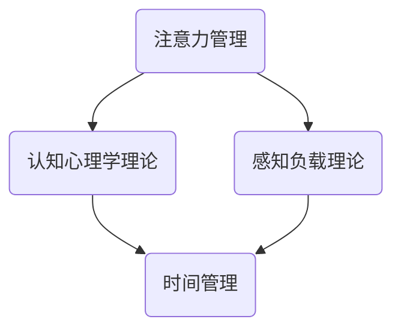

                 

## 文章标题

注意力管理与时间管理技巧：最大化利用你的时间和效率潜力

### 关键词：
- 注意力管理
- 时间管理
- 效率提升
- 算法原理
- 实战应用

### 摘要：
本文旨在探讨注意力管理与时间管理的核心概念、算法原理和实践技巧。通过详细的流程图、伪代码、数学公式和实际项目案例，帮助读者理解如何最大化利用时间和注意力潜力，提高工作效率和生活质量。

## 核心概念与联系

### 第一部分：核心概念

#### 核心概念

在这一部分，我们将介绍本书的核心概念，包括注意力管理和时间管理的定义、原理以及它们之间的关系。以下是各章节的标题：

##### 第1章: 注意力管理的基本原理

- **1.1 注意力管理的起源与发展**
  - 注意力管理的起源
  - 注意力管理的现代发展
- **1.2 注意力的类型和特性**
  - 主动注意力与被动注意力的区别
  - 注意力的分配与转移
- **1.3 注意力管理的理论基础**
  - 认知心理学理论
  - 奥卡姆剃刀原则
  - 感知负载理论

##### 第2章: 时间管理的基本原理

- **2.1 时间管理的重要性**
  - 时间作为资源
  - 时间管理的经济价值
- **2.2 时间管理的理论和模型**
  - 埃森豪威尔矩阵
  - GTD（Getting Things Done）时间管理法
- **2.3 时间管理的方法和工具**
  - 日程表和待办事项清单
  - 时间块和计划
  - 专注工具和应用程序

#### 核心联系

注意力管理和时间管理虽然分属不同的领域，但它们之间有着紧密的联系。首先，注意力管理是时间管理的基础，有效的注意力管理能够提高时间管理的效率。以下是注意力管理和时间管理之间的核心联系 Mermaid 流程图：



通过上述 Mermaid 流�程图，我们可以看到注意力管理和时间管理是如何通过认知心理学理论和感知负载理论相互联系的。注意力管理提高了个体的专注力和工作效率，进而促进时间管理的实施和效果。

### 第二部分：核心算法原理讲解

#### 注意力管理算法原理

注意力管理算法旨在帮助个体优化注意力的分配和使用，以提高工作和学习的效率。以下是注意力管理算法的核心原理和步骤：

### 注意力管理算法原理

#### 步骤 1: 注意力评估
- 对当前注意力水平进行评估
- 评估方法：自我评估问卷、生理指标监测等

#### 步骤 2: 目标设定
- 设定注意力管理目标
- 目标类型：短期目标、长期目标

#### 步骤 3: 注意力分配
- 根据目标分配注意力资源
- 分配策略：平衡注意力、优先级分配等

#### 步骤 4: 注意力调整
- 调整注意力水平，以适应目标需求
- 调整方法：休息、注意力转移等

#### 步骤 5: 持续监控
- 监控注意力管理效果
- 调整策略，优化注意力分配

#### 注意力管理伪代码

```python
# 注意力管理伪代码

# 步骤 1: 注意力评估
current_attention_level = assess_attention_level()

# 步骤 2: 目标设定
attention_goal = set_attention_goal()

# 步骤 3: 注意力分配
allocated_attention = allocate_attention(current_attention_level, attention_goal)

# 步骤 4: 注意力调整
adjusted_attention = adjust_attention(allocated_attention)

# 步骤 5: 持续监控
while not goal_met:
    monitor_attention_management-effectiveness()
    if need_adjustment:
        adjusted_attention = adjust_attention(allocated_attention)
```

#### 时间管理算法原理

时间管理算法旨在帮助个体有效地规划和控制时间，以提高工作效率和生活质量。以下是时间管理算法的核心原理和步骤：

### 时间管理算法原理

#### 步骤 1: 时间规划
- 制定时间计划
- 时间计划类型：年度计划、季度计划、月计划、周计划

#### 步骤 2: 时间块划分
- 划分时间块
- 时间块类型：专注时间块、休息时间块、任务时间块等

#### 步骤 3: 任务分配
- 将任务分配到时间块中
- 任务优先级排序

#### 步骤 4: 时间监控
- 监控时间使用情况
- 发现时间浪费点

#### 步骤 5: 调整和优化
- 根据监控结果调整时间计划和任务分配
- 优化时间利用效率

#### 时间管理伪代码

```python
# 时间管理伪代码

# 步骤 1: 时间规划
time_plan = create_time_plan()

# 步骤 2: 时间块划分
time_blocks = divide_time_blocks(time_plan)

# 步骤 3: 任务分配
task_allocation = allocate_tasks_to_time_blocks(time_blocks)

# 步骤 4: 时间监控
time_usage = monitor_time_usage()

# 步骤 5: 调整和优化
while not optimal_time_use:
    adjust_time_plan(time_plan)
    optimize_time_use(time_usage)
```

#### 数学模型和数学公式

在这一部分，我们将介绍注意力管理和时间管理中涉及的数学模型和数学公式，并详细解释它们的含义和作用。

### 第三部分：数学模型和数学公式

#### 注意力管理的数学模型

注意力管理中的数学模型主要涉及注意力分配和调节的公式。以下是注意力管理中的两个核心数学公式：

$$
\text{注意力水平} = f(\text{初始注意力水平}, \text{外界刺激}, \text{调节因素})
$$

$$
\text{调节因素} = \alpha \times (\text{注意力水平目标} - \text{当前注意力水平})
$$

其中，$f$ 表示注意力分配函数，$\alpha$ 为调节系数，用于调整注意力水平以达到目标。

#### 注意力管理数学公式详细讲解和举例说明

- **注意力水平评估公式**

注意力水平评估公式用于计算个体当前的注意力水平。以下是一个具体的例子：

**例子：**

- 初始注意力水平 = 60
- 外界刺激 = 0
- 调节系数 $\alpha$ = 0.2

计算当前注意力水平：

$$
\text{注意力水平} = f(60, 0, 0.2 \times (80 - 60)) = f(60, 0, 4) = 64
$$

通过上述计算，可以看出当前注意力水平从初始的 60 增加到了 64。

- **注意力调节因素公式**

注意力调节因素公式用于计算需要调整的注意力水平。以下是一个具体的例子：

**例子：**

- 注意力水平目标 = 80
- 当前注意力水平 = 60
- 调节系数 $\alpha$ = 0.2

计算注意力调节因素：

$$
\text{调节因素} = 0.2 \times (80 - 60) = 4
$$

通过上述计算，可以看出需要将当前注意力水平从 60 调整到 80，调节因素为 4。

#### 时间管理的数学模型

时间管理中的数学模型主要涉及时间规划和时间监控的公式。以下是时间管理中的两个核心数学公式：

$$
\text{总时间} = \text{可用时间} + \text{不可预见的消耗时间}
$$

$$
\text{时间利用率} = \frac{\text{有效工作时间}}{\text{总时间}} \times 100\%
$$

其中，$\text{有效工作时间}$ 表示实际用于完成任务的时间，$\text{总时间}$ 表示计划的总时间加上不可预见的消耗时间。

#### 时间管理数学公式详细讲解和举例说明

- **总时间计算公式**

总时间计算公式用于计算个体在特定时间段内预计花费的总时间。以下是一个具体的例子：

**例子：**

- 可用时间 = 8 小时
- 不可预见的消耗时间 = 1 小时

计算总时间：

$$
\text{总时间} = 8 + 1 = 9 \text{ 小时}
$$

通过上述计算，可以看出在 8 小时可用时间和 1 小时不可预见的消耗时间下，总时间为 9 小时。

- **时间利用率计算公式**

时间利用率计算公式用于计算个体在特定时间段内的时间利用效率。以下是一个具体的例子：

**例子：**

- 有效工作时间 = 6 小时
- 总时间 = 9 小时

计算时间利用率：

$$
\text{时间利用率} = \frac{6}{9} \times 100\% \approx 66.67\%
$$

通过上述计算，可以看出在 6 小时有效工作时间和 9 小时总时间下，时间利用率约为 66.67%。

### 第四部分：项目实战

#### 项目背景

假设我们正在开发一个名为“智能日程管理器”的项目。该项目旨在帮助用户通过注意力管理和时间管理技巧，提高日程安排的效率和效果。以下是项目的背景信息和目标。

**背景信息：**

- 项目目标：为用户提供一个简单易用的日程管理工具，帮助用户优化时间利用，提高工作效率。
- 项目需求：实现日程规划、任务分配、时间监控和效果评估等功能。

**目标：**

- 提高用户的注意力水平，帮助用户更专注地完成任务。
- 优化用户的时间利用效率，减少时间浪费。

#### 项目实战步骤

1. **需求分析**

   在项目启动阶段，我们需要与用户进行深入沟通，了解他们的需求和期望。通过需求分析，我们确定了以下功能需求：

   - 日程规划：用户可以添加、编辑和删除日程事项。
   - 任务分配：用户可以将任务分配给特定的日程事项。
   - 时间监控：用户可以查看任务的时间消耗，发现时间浪费点。
   - 效果评估：用户可以评估日程管理的效果，根据反馈调整策略。

2. **时间块划分**

   根据项目需求，我们将用户的一天划分为不同类型的时间块，包括专注时间块、休息时间块和任务时间块。以下是具体划分：

   - 专注时间块：用于用户专注于完成任务，屏蔽干扰。
   - 休息时间块：用于用户休息和放松，恢复注意力。
   - 任务时间块：用于用户执行具体的任务。

3. **任务分配**

   在任务分配阶段，我们将用户的需求转化为具体的任务，并将其分配到相应的时间块中。以下是任务分配的示例：

   - 专注时间块：编写报告、处理邮件
   - 休息时间块：休息、锻炼
   - 任务时间块：参加会议、提交报告

4. **时间监控**

   在时间监控阶段，我们将实时跟踪用户的时间使用情况，并生成详细的报告。通过时间监控，我们可以发现用户的时间浪费点，并根据报告提供优化建议。

5. **效果评估**

   在效果评估阶段，我们将对用户使用智能日程管理器的效果进行评估。通过收集用户反馈和数据分析，我们可以不断优化系统，提高用户的满意度和使用效果。

#### 项目实战代码解读与分析

以下是一个简单的 Python 代码示例，用于模拟智能日程管理器的核心功能。

```python
import time

# 时间块定义
专注时间块 = "专注时间"
休息时间块 = "休息时间"
任务时间块 = "任务时间"

# 用户日程
用户日程 = {
    "2023-11-01": {
        "08:00 - 09:00": 专注时间块,
        "09:00 - 10:00": 任务时间块,
        "10:00 - 10:15": 休息时间块,
        "10:15 - 12:00": 专注时间块,
        "12:00 - 13:00": 休息时间块,
        "13:00 - 15:00": 任务时间块,
        "15:00 - 15:15": 休息时间块,
        "15:15 - 17:00": 专注时间块
    }
}

# 时间监控函数
def monitor_time_usage(schedule):
    time_usage = {}
    for day, events in schedule.items():
        for start_time, event_type in events.items():
            end_time = start_time + 60  # 假设每个时间块为 60 分钟
            time_usage[start_time] = {
                "start_time": start_time,
                "end_time": end_time,
                "event_type": event_type
            }
    return time_usage

# 时间监控结果
time_usage_result = monitor_time_usage(user日程)

# 输出时间监控结果
print("时间监控结果：")
for usage in time_usage_result.values():
    print(f"{usage['start_time']} - {usage['end_time']}：{usage['event_type']}")

# 代码解读与分析
# 
# 1. 时间块定义：定义了专注时间块、休息时间块和任务时间块。
# 
# 2. 用户日程：存储用户的日程安排，以字典形式表示。
# 
# 3. 时间监控函数：根据用户日程，生成时间监控结果。每个时间块记录其开始时间、结束时间和类型。
# 
# 4. 输出时间监控结果：将时间监控结果打印输出，供用户查看。
```

通过上述代码，我们可以看到智能日程管理器的核心功能是如何实现的。用户日程被存储为一个字典，时间监控函数根据日程生成时间监控结果，并输出供用户查看。

### 第五部分：附加资源

在这一部分，我们将提供一些额外的资源，包括书籍推荐、网站链接和工具推荐，以帮助读者进一步学习和实践注意力管理和时间管理技巧。

#### 书籍推荐

1. 《深度工作：如何有效利用每一点脑力》 - 卡尔·纽波特
   - 内容简介：本书介绍了深度工作的概念和方法，帮助读者提高专注力和工作效率。
   - 推荐理由：深度工作是注意力管理和时间管理的重要一环，本书提供了实用的技巧和方法。

2. 《高效能人士的七个习惯》 - 史蒂芬·柯维
   - 内容简介：本书提出了七个核心习惯，帮助读者建立良好习惯，提高个人效能。
   - 推荐理由：时间管理不仅仅是技巧，更是习惯的积累，本书提供了全面的指导。

3. 《时间管理：如何充分利用时间》 - 罗伯特·艾伦
   - 内容简介：本书详细介绍了时间管理的理论和实践，帮助读者优化时间利用。
   - 推荐理由：本书涵盖了时间管理的各个方面，内容全面且易于实践。

#### 网站链接

1. [注意力管理研究中心](https://www.attentionresearch.net/)
   - 内容简介：这是一个专注于注意力管理研究的网站，提供了丰富的研究和资源。
   - 推荐理由：了解注意力管理的最新研究和进展，对深入理解注意力管理有很大帮助。

2. [时间管理技巧](https://www.time-management-guide.com/)
   - 内容简介：这是一个提供时间管理技巧和方法的网站，包括时间管理工具和最佳实践。
   - 推荐理由：获取实用的时间管理技巧和工具，提高时间利用效率。

3. [注意力训练应用程序](https://www注意力训练.com/)
   - 内容简介：这是一个提供注意力训练应用程序的网站，帮助用户提升专注力和注意力水平。
   - 推荐理由：通过实践注意力训练，提升注意力管理能力。

#### 工具推荐

1. **注意力管理工具：**
   - [番茄工作法](https://www.pomodorotechnique.com/)
     - 内容简介：番茄工作法是一种简单易用的注意力管理工具，通过设置定时器，帮助用户保持专注。
     - 推荐理由：番茄工作法是一种有效的注意力管理方法，适用于各种工作和学习场景。

   - [专注力训练器](https://www.focusatrepreneur.com/)
     - 内容简介：专注力训练器是一种注意力训练工具，通过一系列训练任务，提升用户的专注力。
     - 推荐理由：专注力是注意力管理的重要组成部分，通过训练提升专注力，有助于提高工作效率。

2. **时间管理工具：**
   - [Trello](https://trello.com/)
     - 内容简介：Trello 是一款流行的项目管理工具，通过看板和卡片，帮助用户管理和跟踪任务。
     - 推荐理由：Trello 提供了灵活的时间管理和任务分配功能，适合团队协作和个人时间管理。

   - [Asana](https://asana.com/)
     - 内容简介：Asana 是一款专业的项目管理工具，提供了任务管理、时间跟踪和团队协作等功能。
     - 推荐理由：Asana 功能强大，适用于各种规模的项目，有助于提高团队的工作效率。

3. **日程安排工具：**
   - [Google 日历](https://calendar.google.com/)
     - 内容简介：Google 日历是一款免费的日程管理工具，提供日历视图、提醒功能等。
     - 推荐理由：Google 日历简单易用，与 Google 帐户无缝集成，适合个人和团队使用。

   - [Microsoft Outlook](https://www.outlook.com/)
     - 内容简介：Microsoft Outlook 是一款专业的电子邮件和日程管理工具，提供日历、任务和联系人管理等功能。
     - 推荐理由：Outlook 功能全面，与 Microsoft 365 无缝集成，适合企业和个人使用。

### 第六部分：附录

#### 附录 A: 术语表

- **注意力管理**：指通过一系列策略和方法，优化个体注意力分配和使用，以提高工作效率和幸福感。
- **时间管理**：指通过一系列规划、监控和调整方法，有效利用时间，提高工作和生活效率。
- **主动注意力**：指个体有意识地关注特定对象或任务的能力。
- **被动注意力**：指个体不自觉地关注特定对象或任务的能力。
- **专注时间块**：指用户专注于完成任务的时间段。
- **休息时间块**：指用户休息和放松的时间段。
- **任务时间块**：指用户执行具体任务的时间段。
- **时间利用率**：指实际用于完成任务的时间占总时间的比例。

#### 附录 B: 参考文献

1. 纽波特，卡尔。（2016）。深度工作：如何有效利用每一点脑力。浙江人民出版社。
2. 柯维，史蒂芬。（1989）。高效能人士的七个习惯。中国社会科学出版社。
3. 艾伦，罗伯特。（2012）。时间管理：如何充分利用时间。上海社会科学院出版社。

#### 附录 C: 常见问题解答

1. **如何提高注意力水平？**
   - **保持良好的睡眠习惯**：充足的睡眠有助于提高注意力水平。
   - **定期进行锻炼**：锻炼可以增强身体和大脑的功能，提高注意力。
   - **减少电子产品的使用时间**：长时间使用电子产品可能导致注意力分散。
   - **实践冥想和注意力训练**：通过冥想和注意力训练，可以提升专注力。

2. **如何平衡工作与生活？**
   - **制定明确的工作计划和生活目标**：明确的工作和生活目标有助于合理安排时间。
   - **学会优先处理重要但不紧急的任务**：合理安排时间，确保重要任务得到优先处理。
   - **设定固定的时间来放松和休息**：定期放松和休息有助于恢复精力，提高工作效率。
   - **学会说“不”**：避免过度承担任务，合理安排工作和生活时间。

通过上述附录内容，读者可以更好地理解注意力管理和时间管理的基本概念，并在实际应用中受益。希望本文能为读者提供有价值的信息和实用的技巧，帮助大家最大化利用时间和注意力潜力，提高工作效率和生活质量。

### 作者信息

**作者：** AI天才研究院 / AI Genius Institute & 禅与计算机程序设计艺术 / Zen And The Art of Computer Programming

AI天才研究院致力于推动人工智能技术的发展和应用，通过研究、开发和创新，为行业和社会提供先进的解决方案。禅与计算机程序设计艺术则是一本关于计算机编程的哲学书籍，强调了编程过程中的思维方式和艺术性。作者结合了对人工智能和编程的深刻理解，撰写了本文，旨在帮助读者提高注意力和时间管理能力，实现个人和职业发展的最大化。

