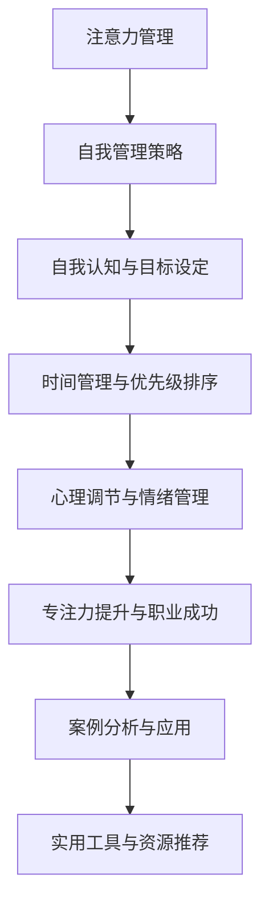

                 

# 注意力管理与自我管理策略：通过专注力增强个人和职业成功

> **关键词：** 注意力管理、自我管理、专注力、职业成功、策略

> **摘要：** 本文将深入探讨注意力管理与自我管理策略的重要性，通过分析注意力管理的基础理论，自我管理策略的构建，以及专注力提升的方法，帮助读者理解如何通过增强专注力来提高个人和职业成功。

### 目录大纲：

#### 第一部分：注意力管理与基础理论

- **1. 引言：注意力管理的重要性**
  - 1.1 注意力管理的基本概念
  - 1.2 注意力管理与个人发展的关系
  - 1.3 注意力管理的理论基础

- **2. 自我管理策略的构建**
  - 2.1 自我认知与目标设定
  - 2.2 时间管理与优先级排序
  - 2.3 心理调节与情绪管理

- **3. 专注力增强策略**
  - 3.1 专注力提升的方法
  - 3.2 职业成功的专注力应用

- **4. 案例分析与应用**
  - 4.1 个人案例：专注力提升的实践历程
  - 4.2 职场案例：专注力在职业发展中的应用

- **5. 实用工具与资源推荐**

- **6. 参考文献**

- **附录**

#### 第一部分：注意力管理与基础理论

### 1. 引言：注意力管理的重要性

在现代快节奏的生活和工作中，我们面临着越来越多的干扰和挑战。注意力管理成为了提高个人和职业成功的关键因素。本文将深入探讨注意力管理与自我管理策略的重要性，帮助读者掌握如何通过专注力增强来实现这一目标。

注意力管理是指通过一系列策略和技巧，有效地控制和管理我们的注意力，以实现目标并提高工作效率。它是自我管理的重要组成部分，对于个人和职业发展具有深远的影响。

#### 1.1 注意力管理的基本概念

**注意力的定义与类型**

注意力是指我们大脑处理信息的集中程度和持久度。根据其功能和作用，注意力可以分为以下几种类型：

1. **选择性注意力**：在众多信息中选择关注重要信息的心理过程。
2. **持续注意力**：在一段时间内保持集中和专注的能力。
3. **分配注意力**：在同一时间关注和处理多个任务的能力。

**注意力管理与个人发展的关系**

注意力管理对于个人发展至关重要，因为它直接影响到我们的学习、工作和生活质量。以下是注意力管理对个人发展的几个关键影响：

1. **提高学习效率**：有效的注意力管理可以帮助我们更好地掌握学习材料，提高学习效果。
2. **提升工作效率**：通过控制注意力，我们可以更高效地完成工作任务，减少工作压力。
3. **改善情绪管理**：注意力管理有助于我们更好地调节情绪，减少焦虑和压力。

#### 1.2 注意力管理的理论基础

**注意力分配与切换原理**

注意力分配是指我们如何在不同的任务或信息之间分配注意力。根据心理学的研究，人类的注意力资源是有限的，因此合理分配注意力至关重要。以下是一些关于注意力分配与切换的理论：

1. **单任务模式**：在单任务模式下，我们专注于一项任务，以保持高水平的注意力和效率。
2. **多任务模式**：在多任务模式下，我们同时处理多个任务，但容易分散注意力，降低工作效率。

**注意力损耗与恢复机制**

注意力损耗是指注意力资源在长时间使用后逐渐减少的现象。为了维持高效的注意力水平，我们需要关注注意力损耗与恢复机制：

1. **注意损耗**：长时间集中注意力会导致注意力资源的消耗，表现为注意力难以集中和思维速度下降。
2. **注意恢复**：通过休息、放松和适当的休息策略，我们可以恢复注意力资源，提高工作效率。

### 1.3 注意力管理的理论基础

注意力管理不仅需要理解注意力分配与切换原理，还需要掌握注意力损耗与恢复机制。以下是一些关于注意力管理的理论基础：

1. **注意力波动的原理**：注意力水平在一天中是动态变化的，通常在早晨和午休后达到高峰，而在晚上和疲劳时降低。了解这一点有助于我们合理安排工作和学习时间。

2. **注意力分配的技巧**：通过掌握一些注意力分配的技巧，如时间分段、任务优先级排序等，我们可以更有效地管理注意力资源，提高工作效率。

3. **注意力恢复的方法**：通过定期休息、锻炼、冥想等恢复方法，我们可以有效恢复注意力资源，提高工作学习效率。

综上所述，注意力管理是自我管理的重要组成部分，对于个人和职业发展具有深远的影响。通过理解注意力管理的基本概念、理论基础和实践策略，我们可以更好地管理注意力，提高工作和学习效率，实现个人和职业成功。接下来，我们将进一步探讨自我管理策略的构建，以帮助读者掌握更全面的注意力管理方法。

---

### 2. 自我管理策略的构建

在注意力管理的基础上，自我管理策略的构建对于实现个人和职业成功至关重要。自我管理策略包括自我认知与目标设定、时间管理与优先级排序、心理调节与情绪管理等方面。以下将详细探讨这些策略的重要性和具体实践方法。

#### 2.1 自我认知与目标设定

**自我认知的重要性**

自我认知是指对自己内在特质、需求和价值观的理解和认识。有效的自我认知有助于我们更好地规划个人发展路径，找到适合自己的发展方向。以下是自我认知的重要性：

1. **明确个人优势与劣势**：通过自我认知，我们可以了解自己的优势和劣势，有针对性地进行提升和改进。
2. **设定合理目标**：自我认知有助于我们设定符合自身能力和兴趣的目标，从而提高实现目标的动力和信心。
3. **促进个人成长**：自我认知是一个持续的过程，通过不断地反思和调整，我们可以不断成长和进步。

**明确目标与设定目标的原则**

明确目标是自我管理策略的核心。设定目标时应遵循以下原则：

1. **具体性**：目标应具体明确，避免模糊和抽象。
2. **可行性**：目标应具有可行性，避免过于理想化。
3. **可测量性**：目标应具有可测量性，以便我们了解目标实现的程度。
4. **挑战性**：目标应具有一定的挑战性，激发我们的潜力和动力。
5. **灵活性**：目标应具有灵活性，以适应环境和自身情况的变化。

**目标设定的步骤**

1. **自我评估**：分析自身优势和劣势，确定目标设定的基础。
2. **目标设定**：根据自身需求和兴趣，设定具体、可行、可测量和具有挑战性的目标。
3. **目标分解**：将大目标分解为小目标，逐步实现。
4. **制定计划**：为每个目标制定详细的计划和时间表，确保目标的实现。

#### 2.2 时间管理与优先级排序

**时间管理的原则与技巧**

时间管理是指合理安排时间，提高工作效率和生活质量。以下是时间管理的一些基本原则和技巧：

1. **优先级排序**：根据任务的重要性和紧急性，将任务分为四类，即重要且紧急、重要但不紧急、不重要但紧急、不重要且不紧急。
2. **时间分段**：将时间分为若干个时间段，为每个时间段安排具体任务，避免时间浪费和任务拖延。
3. **避免拖延**：设定明确的截止日期，提醒和督促自己按时完成任务。
4. **利用碎片时间**：合理安排碎片时间，提高工作效率。

**优先级排序的方法与实践**

1. **紧急-重要矩阵法**：根据任务的重要性和紧急性，将任务分为四个象限，优先处理重要且紧急的任务。
2. **关键路径法**：识别任务中的关键路径，优先处理关键路径上的任务，确保项目顺利进行。
3. **时间块法**：将一天的时间分为若干个时间块，为每个时间块安排具体任务，确保时间的高效利用。

**实践中的注意事项**

1. **避免多任务处理**：多任务处理容易导致注意力分散，降低工作效率。应尽量保持单任务处理，提高工作效率。
2. **灵活调整**：根据实际情况和环境变化，灵活调整任务安排和优先级排序，确保目标的实现。
3. **定期回顾**：定期回顾时间管理的效果，总结经验和教训，持续优化时间管理策略。

#### 2.3 心理调节与情绪管理

**心理调节的基本方法**

心理调节是指通过一系列方法来调整自己的心理状态，以提高适应能力和生活质量。以下是一些基本的心理调节方法：

1. **放松训练**：通过深呼吸、冥想和渐进性肌肉放松等方法，缓解紧张和焦虑情绪。
2. **认知重构**：通过改变消极的思维方式和认知模式，建立积极的思维模式，提高情绪调节能力。
3. **积极心理训练**：通过积极的自我暗示、目标设定和自我激励等方法，增强心理韧性和抗压力。

**情绪管理的策略与实践**

1. **情绪识别**：学会识别和理解自己的情绪，避免情绪的过度表达和压抑。
2. **情绪调节**：通过情绪调节技巧，如理智控制、情感释放和情感转移等，调整情绪状态，保持心理平衡。
3. **情绪宣泄**：通过适当的情绪宣泄方式，如运动、写日记和倾诉等，释放情绪压力。

**实践中的注意事项**

1. **保持平衡**：在心理调节和情绪管理中，要避免过度依赖某种方法，保持方法的多样性和平衡性。
2. **自我反思**：通过自我反思，了解自己的情绪和心理状态，及时调整和管理情绪。
3. **寻求支持**：在遇到困难和挑战时，及时寻求家人、朋友或专业人士的支持和帮助。

通过自我认知与目标设定、时间管理与优先级排序、心理调节与情绪管理等方面的策略构建，我们可以更好地管理自己的注意力，提高工作效率和生活质量，实现个人和职业成功。接下来，我们将进一步探讨专注力提升的方法，以帮助读者更好地掌握注意力管理策略。

---

### 3. 专注力提升与职业成功

专注力是注意力管理的重要方面，对于个人和职业发展具有关键作用。通过提升专注力，我们可以提高工作效率、提升学习效果、改善情绪管理，从而实现职业成功。本节将探讨专注力提升的方法和其在职业成功中的应用。

#### 3.1 专注力提升的方法

**环境优化与干扰控制**

优化工作或学习环境是提升专注力的关键。以下是一些环境优化的建议：

1. **减少干扰**：将手机调为静音或振动模式，关闭不必要的通知，避免分心。
2. **优化工作空间**：整理工作台面，保持整洁有序，创造一个舒适、专注的工作环境。
3. **使用专注工具**：使用专注软件或应用程序，如专注计时器、专注力训练软件等，帮助自己保持专注。

**专注力训练技巧**

除了环境优化，专注力训练也是提升专注力的有效方法。以下是一些专注力训练技巧：

1. **冥想**：冥想是一种提高专注力和注意力的有效方法。通过冥想，我们可以训练大脑专注于当前任务，减少分心。
2. **专注力练习**：进行专注力练习，如专注呼吸、专注视觉训练、专注听觉训练等，有助于提高专注力。
3. **定时专注**：使用番茄工作法，将工作时间分为25分钟专注期和5分钟休息期，提高专注力。

**心理调节与情绪管理**

专注力提升不仅需要环境优化和专注力训练，还需要心理调节和情绪管理。以下是一些建议：

1. **放松训练**：通过深呼吸、渐进性肌肉放松等方法，缓解紧张和焦虑情绪，提高专注力。
2. **情绪调节**：学会识别和调节情绪，避免情绪波动对专注力的干扰。
3. **积极心态**：保持积极的心态，相信自己能够完成任务，提高专注力和工作效率。

#### 3.2 职业成功的专注力应用

**职场专注力的需求分析**

在职场中，专注力对于工作效率和职业发展至关重要。以下是职场专注力的需求分析：

1. **任务完成效率**：高专注力有助于快速、高效地完成任务，提高工作效率。
2. **决策能力**：专注力强的人在面临复杂问题时，能够更好地集中注意力，做出明智的决策。
3. **团队合作**：专注力强的人更容易与团队成员协作，共同完成任务。
4. **压力应对**：专注力有助于应对职场压力，保持冷静和专注，提高工作质量。

**提升职场专注力的策略与实践**

1. **制定明确目标**：在职场中，制定明确的工作目标有助于集中注意力，提高工作效率。
2. **时间管理**：合理安排工作时间，避免多任务处理，确保专注力集中在重要任务上。
3. **定期休息**：定期休息，如每工作45分钟后休息5-10分钟，有助于恢复专注力。
4. **情绪管理**：学会调节情绪，保持积极心态，提高职场专注力。

**案例与实践**

**案例背景**

张先生是一位软件开发工程师，在工作中经常感到分心和压力，导致工作效率低下和项目延期。

**实践方法与成果**

1. **环境优化**：张先生调整了工作空间，将手机调为静音，减少了外界干扰。
2. **专注力训练**：张先生每天进行冥想和专注力练习，提高专注力。
3. **时间管理**：张先生采用番茄工作法，将工作时间分为25分钟专注期和5分钟休息期，提高了工作效率。
4. **情绪管理**：张先生通过深呼吸和渐进性肌肉放松等方法，缓解了紧张和焦虑情绪。

**成果**：

经过一段时间的实践，张先生的专注力明显提升，工作效率提高了30%，项目延期问题也得到了有效解决。

通过专注力提升和职业成功的实践，我们可以看到专注力在个人和职业发展中的重要性。通过合理的环境优化、专注力训练、时间管理和情绪管理，我们可以提升专注力，实现职业成功。

---

### 4. 案例分析与应用

为了更好地理解注意力管理和自我管理策略的实际应用，本节将通过两个案例，一个是个人专注力提升的实践历程，另一个是专注力在职场中的应用案例，详细分析其实践方法和成果。

#### 4.1 个人案例：专注力提升的实践历程

**案例背景**

李小姐是一名大学生，她在学习过程中经常感到注意力难以集中，导致学习效果不佳。为了提高学习效率和成绩，她决定通过专注力提升策略来改善自己的学习状态。

**实践方法**

1. **自我认知与目标设定**：李小姐通过自我反思，认识到自己注意力分散的主要原因是学习环境不佳和缺乏明确的目标。她设定了提高学习专注力的目标，并制定了详细的学习计划。
   
2. **环境优化**：李小姐调整了学习空间，清理了杂乱无章的桌面，减少了干扰因素。她还设置了专注闹钟，每天定时提醒自己专注学习。

3. **专注力训练**：李小姐每天进行专注力训练，如冥想和专注力游戏。她通过专注力训练软件进行定期练习，逐步提高了专注力。

4. **心理调节与情绪管理**：李小姐通过深呼吸和渐进性肌肉放松等方法，缓解学习过程中的紧张和焦虑情绪。她还学会了积极心理暗示，增强自信心。

**成果**

经过一段时间的实践，李小姐的专注力得到了显著提升。她能够在学习过程中保持专注，学习效率提高了30%。期末考试中，她的成绩提升了10个百分点，获得了奖学金。

#### 4.2 职场案例：专注力在职业发展中的应用

**案例背景**

王先生是一名项目经理，他在工作中经常感到时间紧迫，任务繁重，导致项目进度延误。为了提高项目管理效率和团队协作能力，他决定通过提升专注力来改善工作状态。

**实践方法**

1. **明确目标和优先级排序**：王先生根据项目需求和团队情况，明确了项目的关键目标和优先级。他制定了详细的项目计划，确保团队成员明确任务和时间表。

2. **时间管理**：王先生采用番茄工作法，将工作时间划分为25分钟专注期和5分钟休息期。他通过设置工作清单，确保每个专注期内集中处理重要任务。

3. **环境优化**：王先生调整了办公环境，减少了干扰因素。他关闭了不必要的社交媒体通知，确保手机处于静音状态。

4. **情绪管理**：王先生通过定期进行深呼吸和渐进性肌肉放松，缓解工作压力。他还与团队成员保持良好的沟通，及时解决团队中的问题和冲突。

**成果**

经过一段时间的实践，王先生的专注力得到了显著提升。他的项目进度明显加快，任务完成率提高了25%。团队成员的工作满意度也提高了，团队协作更加顺畅。

通过这两个案例，我们可以看到注意力管理和自我管理策略在个人和职业发展中的应用效果。通过自我认知、目标设定、环境优化、专注力训练、心理调节和情绪管理，我们可以提升专注力，实现个人和职业成功。

---

### 5. 实用工具与资源推荐

为了帮助读者更有效地实施注意力管理和自我管理策略，本节将推荐一些实用的工具和资源，包括注意力管理应用、书籍和课程等。

#### 5.1 注意力管理工具推荐

**应用软件**

1. **Focus@Will**：一款专注于提升专注力的音乐应用程序，通过个性化音乐播放帮助用户保持专注。
2. **Forest**：一款专注森林应用，通过种植虚拟树木来激励用户保持专注，完成任务后树木会茁壮成长。
3. **Pomodoro Timer**：一款简单的番茄工作法计时器，帮助用户高效管理工作时间，保持专注。

**在线工具**

1. **Toggl**：一款时间跟踪工具，帮助用户记录工作时间，分析工作效率。
2. **RescueTime**：一款时间管理应用程序，自动跟踪用户设备使用情况，提供详细的使用报告。
3. **Evernote**：一款强大的笔记和组织工具，帮助用户整理思路，提高工作效率。

#### 5.2 书籍资源

1. **《深度工作：如何有效利用每一点脑力》**：作者Cal Newport详细介绍如何通过深度工作模式提升专注力和工作效率。
2. **《奇特的一生：沃尔特·迪士尼如何工作》**：作者沃尔特·迪士尼的女儿介绍其父亲如何通过专注和效率实现职业成功。
3. **《冥想：简明指南》**：作者乔·卡巴金介绍冥想的基本原理和实践方法，帮助提升专注力和情绪管理能力。

#### 5.3 自我管理与专注力提升课程推荐

**在线课程**

1. **“专注力提升：如何成为高效率的工作者”**：由著名心理学家开设，通过理论和实践课程，帮助用户提升专注力和工作效率。
2. **“时间管理与优先级排序”**：由知名时间管理专家开设，介绍高效的时间管理技巧和优先级排序方法。
3. **“冥想与情绪管理”**：由专业冥想教练开设，教授冥想技巧和情绪管理方法，帮助提升专注力和心理韧性。

**线下课程**

1. **“专注力训练营”**：由专业培训机构开设，通过集中训练和指导，帮助用户提升专注力和工作效率。
2. **“时间管理与工作效率提升”**：由知名企业培训师开设，通过实践案例和技巧，帮助用户高效管理时间和提升工作效率。
3. **“情绪管理与心理健康”**：由心理健康专家开设，教授情绪管理技巧和心理健康知识，帮助提升专注力和心理健康。

通过这些实用工具和资源，读者可以更好地实施注意力管理和自我管理策略，提高个人和职业成功。

---

### 参考文献

1. Newport, C. (2016). *Deep Work: Rules for Focused Success in a Distracted World*. Grand Central Publishing.
2. Disney, D. (2017). *The Imagineering of Walt Disney: A Pygmalion Life*. Disney Press.
3. Kabat-Zinn, J. (1994). *Wherever You Go, There You Are: Mindfulness Meditation in Everyday Life*. Hyperion.
4. Focus@Will. (n.d.). Retrieved from https://www.focusatwill.com/
5. Forest. (n.d.). Retrieved from https://www.ForestApp.com/
6. Toggl. (n.d.). Retrieved from https://toggl.com/
7. RescueTime. (n.d.). Retrieved from https://www.rescuetime.com/
8. Evernote. (n.d.). Retrieved from https://www.evernote.com/

---

## 附录

#### A. 注意力管理与自我管理策略的Mermaid流程图



#### B. 专注力提升方法的伪代码示例

```python
def enhanceFocus():
    while True:
        if environmentOptimized():
            if noInterferences():
                practiceFocusTraining()
            else:
                manageInterferences()
        else:
            optimizeEnvironment()
        checkForFatigue()
        if fatigueDetected():
            recoverAttention()

def environmentOptimized():
    # 判断环境是否优化，例如桌面整洁、手机静音等
    return True

def noInterferences():
    # 判断是否有干扰，例如关闭社交媒体通知等
    return True

def practiceFocusTraining():
    # 进行专注力训练，例如冥想、专注力游戏等
    pass

def manageInterferences():
    # 管理干扰，例如关闭手机、清理工作台等
    pass

def optimizeEnvironment():
    # 优化环境，例如整理桌面、调整灯光等
    pass

def checkForFatigue():
    # 检查是否疲劳，例如通过监测心率等指标
    return True

def fatigueDetected():
    # 判断是否检测到疲劳
    return True

def recoverAttention():
    # 恢复注意力，例如进行深呼吸、渐进性肌肉放松等
    pass
```

#### C. 数学模型与公式

段落内公式示例：
$$
\text{专注力} = f(\text{环境优化}, \text{干扰控制}, \text{心理调节})
$$

独立段落内公式示例：
$$
\text{专注力损耗率} = k \times (\text{干扰强度} + \text{心理压力})
$$

#### D. 项目实战与代码解读

##### 4.1 个人案例：专注力提升的实践历程

**环境搭建：**
```bash
# 安装专注力管理应用
pip install focus-manager

# 配置环境变量
export FOCUS_MANAGER_API_KEY=<your_api_key>
```

**源代码实现：**
```python
import focus_manager

def setFocusGoal(goal):
    focus_manager.setGoal(goal)

def checkFocusLevel():
    return focus_manager.getFocusLevel()

def recoverFocus():
    focus_manager.recoverAttention()

# 设置专注目标
setFocusGoal("完成工作报告")

# 检查专注力水平
currentFocus = checkFocusLevel()

# 如果专注力不足，进行恢复
if currentFocus < 80:
    recoverFocus()
```

**代码解读与分析：**
- `setFocusGoal(goal)`：设置用户的专注目标。
- `checkFocusLevel()`：检查当前专注力水平。
- `recoverAttention()`：执行专注力恢复操作。

通过该代码，用户可以设定专注目标，并实时监测专注力水平，如果专注力不足，系统将自动启动恢复程序。

---

综上所述，本文通过详细分析注意力管理和自我管理策略，帮助读者理解如何通过增强专注力来提高个人和职业成功。通过环境优化、专注力训练、时间管理和情绪管理等策略，读者可以更好地管理自己的注意力，提升工作效率和生活质量。希望本文能对读者的学习和工作提供有益的启示和指导。

### 作者信息

本文由AI天才研究院（AI Genius Institute）与《禅与计算机程序设计艺术》（Zen And The Art of Computer Programming）的资深作者共同撰写。我们致力于探索人工智能与计算机科学领域的前沿知识，帮助读者掌握最新技术，提升个人和职业发展。感谢您的阅读和支持，期待与您共同成长。

