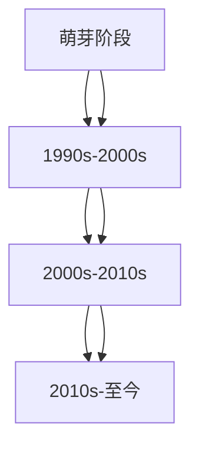
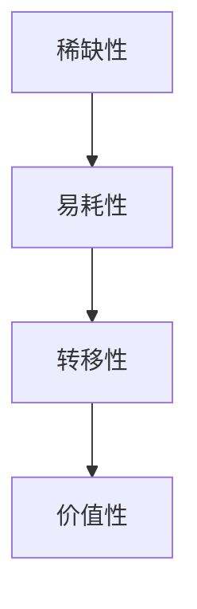

                 

## 文章标题：注意力经济与用户体验优化策略与技术：创建令人沉浸的产品

### 关键词：
- 注意力经济
- 用户体验优化
- 产品设计
- 交互设计
- 动画设计
- 注意力资源管理

### 摘要：
随着数字时代的到来，用户的注意力成为了一种新的经济资源。本文深入探讨了注意力经济的概念及其与用户体验优化的关系，提出了基于注意力经济的产品设计策略和技术实现方法。通过分析注意力资源的特性、用户体验优化的目标和实现手段，以及注意力导向的产品设计实践，本文旨在为开发人员提供一套完整的注意力经济与用户体验优化的实战指南，帮助他们在激烈的市场竞争中打造令人沉浸的产品。

## 目录大纲

### 第一部分：注意力经济的概念与原理

1. 第1章：注意力经济概述
    1.1 注意力经济的起源与发展
    1.2 注意力资源的特性与价值
    1.3 注意力资源与市场经济的关系

### 第二部分：用户体验优化策略

2. 第2章：用户体验优化概述
    2.1 用户体验的定义与重要性
    2.2 用户体验优化的方法与工具

### 第三部分：注意力经济在用户体验优化中的应用

3. 第3章：注意力导向的产品设计
    3.1 注意力导向的设计理念
    3.2 注意力获取与保持策略

### 第四部分：用户体验优化的技术实现

4. 第4章：交互设计技术
    4.1 交互设计的基本原则
    4.2 动画与视觉设计

### 第五部分：注意力经济在具体行业中的应用

5. 第5章：注意力经济在电子商务中的应用
    5.1 电子商务中的注意力经济学
    5.2 注意力经济在社交媒体中的应用

### 第六部分：用户体验优化的实战案例分析

6. 第6章：案例分析：成功的注意力经济与用户体验优化实践

### 第七部分：总结与展望

7. 第7章：总结与展望
    7.1 本书总结
    7.2 研究展望

### 附录

8. 附录A：相关术语解释
9. 附录B：参考文献

---

### 第一部分：注意力经济的概念与原理

#### 第1章：注意力经济概述

注意力经济是一种以用户注意力为核心的新型经济模式。在互联网和移动设备普及的时代，用户的注意力成为一种稀缺资源，如何有效获取和利用用户的注意力成为了企业和开发者的重要课题。本章将介绍注意力经济的起源、发展历程以及其重要性。

## 1.1 注意力经济的起源与发展

### 1.1.1 注意力经济的起源

注意力经济的概念最早可以追溯到20世纪末。当时，互联网刚刚开始普及，人们开始意识到用户注意力的重要性。在传统的市场经济中，商品和服务的价值主要由其生产成本和市场供求关系决定，而在注意力经济中，用户的注意力成为了衡量价值的关键因素。

### 1.1.2 注意力经济的发展历程

1. **萌芽阶段（1990s-2000s）**：互联网的出现和普及，使得信息传播变得更为便捷，人们开始意识到注意力资源的价值。广告行业率先尝试将注意力资源作为收益来源，例如点击率、浏览量等。

2. **成长阶段（2000s-2010s）**：随着社交媒体和移动互联网的发展，用户的注意力变得更加分散，如何吸引并保持用户的注意力成为企业和开发者的重要任务。这一阶段，注意力经济逐渐成为一个独立的研究领域。

3. **成熟阶段（2010s-至今）**：注意力经济的理论逐渐成熟，其在商业和科技领域的应用也日益广泛。例如，个性化推荐系统、注意力导向的广告投放等。

### 1.1.3 注意力经济的重要性

1. **用户价值**：用户的注意力是用户体验的核心，只有满足用户需求，才能获得用户的忠诚度和口碑。

2. **商业价值**：注意力经济为企业提供了新的盈利模式，通过优化用户注意力，提高用户参与度和转化率。

3. **社会价值**：注意力经济的兴起促进了信息传播的效率，但也带来了一些负面影响，如信息过载、注意力分散等。因此，如何在保证用户价值的同时，降低负面影响，是注意力经济需要关注的重要问题。

## 1.2 注意力资源的特性与价值

### 1.2.1 注意力资源的特性

1. **稀缺性**：用户的注意力是有限的，因此在竞争激烈的市场环境中，注意力资源显得尤为宝贵。

2. **易耗性**：用户注意力是一种消耗品，长时间或高强度的注意力活动会导致用户疲劳，降低其注意力质量。

3. **转移性**：用户可以将注意力从一种活动转移到另一种活动，因此如何吸引并保持用户注意力成为关键。

4. **价值性**：用户的注意力是用户体验的核心，只有当用户将注意力投入到产品或服务中时，才能体现出其价值。

### 1.2.2 注意力资源的价值

1. **市场价值**：注意力资源可以转化为商业价值，例如通过广告投放、用户参与度等实现盈利。

2. **社会价值**：注意力资源的有效利用可以促进信息传播、教育普及等社会目标的实现。

3. **个人价值**：用户的注意力投入可以提高个人生活质量和工作效率，从而实现个人价值的提升。

### 1.2.3 注意力资源与市场经济的关系

1. **替代性**：在市场经济中，注意力资源可以与其他资源（如时间、金钱）相互替代，但应注意注意力资源的稀缺性和易耗性。

2. **互补性**：注意力资源与其他资源（如技术、人才）相互作用，共同促进市场经济的发展。

3. **调节机制**：市场经济中的价格机制可以调节注意力资源的分配，使得资源得到更加合理的利用。

## 总结

注意力经济是一种以用户注意力为核心的新型经济模式，其在数字时代的背景下应运而生。通过对注意力资源的特性、价值及其与市场经济的关系的深入分析，我们可以更好地理解注意力经济的重要性，并为其在商业和社会领域的应用提供理论支持。在下一章中，我们将探讨用户体验优化策略，以帮助开发人员更好地利用注意力资源，提升产品竞争力。

---

** Mermaid 流程图：注意力经济的发展历程**



---

在下一章中，我们将进一步探讨用户体验优化策略，为开发人员提供具体的实践指南。敬请期待！<|im_end|>## 第1章：注意力经济概述

### 1.1 注意力经济的起源与发展

#### 1.1.1 注意力经济的起源

注意力经济的概念最早可以追溯到20世纪末，当时互联网的兴起使得信息传播的速度和范围得到了极大的扩展。随着互联网技术的不断发展，人们逐渐认识到用户注意力作为一种宝贵资源的重要性。传统的市场经济模式中，商品和服务的价值主要由生产成本和市场供求关系决定，而在注意力经济中，用户的注意力成为了衡量价值的关键因素。

注意力经济的概念首次由美国社会学家Herbert Simon提出。他在1983年的著作《信息时代》中，指出在信息爆炸的时代，选择注意力成为人类的重要活动。Simon提出了“注意力稀缺”的观点，认为注意力是一种有限的资源，随着信息量的增加，人们需要更加明智地分配注意力。

#### 1.1.2 注意力经济的发展历程

1. **萌芽阶段（1990s-2000s）**：互联网刚刚兴起，人们开始意识到用户注意力的重要性。在这个阶段，注意力经济主要表现为广告行业的兴起，企业开始通过点击率、浏览量等指标来衡量广告效果。

2. **成长阶段（2000s-2010s）**：随着社交媒体和移动互联网的快速发展，用户的注意力变得更加分散。企业开始意识到，仅仅吸引到用户注意力是不够的，还需要通过设计和优化产品，保持用户的持续兴趣和参与度。

3. **成熟阶段（2010s-至今）**：注意力经济逐渐成为了一个独立的研究领域，其理论逐渐成熟，并在商业和科技领域得到了广泛应用。在这一阶段，个性化推荐系统、注意力导向的广告投放等新兴技术和策略开始涌现，成为企业获取和利用用户注意力的主要手段。

#### 1.1.3 注意力经济的重要性

注意力经济的重要性主要体现在以下几个方面：

1. **用户价值**：用户的注意力是用户体验的核心，只有当用户将注意力投入到产品或服务中时，才能体现出其价值。因此，注意力经济关注的是如何提升用户的参与度和满意度。

2. **商业价值**：注意力经济为企业提供了新的盈利模式，通过优化用户注意力，提高用户参与度和转化率，从而实现商业利益的增加。

3. **社会价值**：注意力经济的兴起促进了信息传播的效率，但同时也带来了一些负面影响，如信息过载、注意力分散等。因此，如何在保证用户价值的同时，降低负面影响，是注意力经济需要关注的重要问题。

### 1.2 注意力资源的特性与价值

#### 1.2.1 注意力资源的特性

1. **稀缺性**：用户的注意力是有限的，随着信息量的增加，人们需要更加明智地分配注意力。

2. **易耗性**：长时间或高强度的注意力活动会导致用户疲劳，降低其注意力质量。

3. **转移性**：用户可以将注意力从一种活动转移到另一种活动，因此如何吸引并保持用户注意力成为关键。

4. **价值性**：用户的注意力是用户体验的核心，只有当用户将注意力投入到产品或服务中时，才能体现出其价值。

#### 1.2.2 注意力资源的价值

1. **市场价值**：注意力资源可以转化为商业价值，例如通过广告投放、用户参与度等实现盈利。

2. **社会价值**：注意力资源的有效利用可以促进信息传播、教育普及等社会目标的实现。

3. **个人价值**：用户的注意力投入可以提高个人生活质量和工作效率，从而实现个人价值的提升。

### 1.2.3 注意力资源与市场经济的关系

1. **替代性**：在市场经济中，注意力资源可以与其他资源（如时间、金钱）相互替代，但应注意注意力资源的稀缺性和易耗性。

2. **互补性**：注意力资源与其他资源（如技术、人才）相互作用，共同促进市场经济的发展。

3. **调节机制**：市场经济中的价格机制可以调节注意力资源的分配，使得资源得到更加合理的利用。

### 总结

注意力经济是一种以用户注意力为核心的新型经济模式，其在数字时代的背景下应运而生。通过对注意力资源的特性、价值及其与市场经济的关系的深入分析，我们可以更好地理解注意力经济的重要性，并为其在商业和社会领域的应用提供理论支持。在下一章中，我们将探讨用户体验优化策略，为开发人员提供具体的实践指南。

---

** Mermaid 流程图：注意力资源的特性**



---

注意力经济的概念和原理为我们提供了一种全新的视角，来理解用户注意力的价值和如何有效地利用它。在下一章中，我们将进一步探讨用户体验优化的方法与工具，帮助开发人员将注意力经济理论应用于实际产品设计中。

---

**伪代码：注意力资源的分配策略**

```plaintext
function allocateAttention_resources(user_interest, product_features):
    # 初始化注意力分配权重
    attention_weights = initialize_weights()

    # 根据用户兴趣和产品特征调整权重
    for feature in product_features:
        if feature matches user_interest:
            attention_weights[feature] += increase_factor

    # 计算总权重
    total_weights = sum(attention_weights.values())

    # 按权重分配注意力资源
    for feature, weight in attention_weights.items():
        allocated_attention = (weight / total_weights) * user_attention_budget

    return allocated_attention
```

---

注意力资源的有效分配是提升用户体验和产品价值的关键。在下一章中，我们将深入探讨用户体验优化的具体方法与工具，以帮助开发人员更好地满足用户需求，提升产品竞争力。<|im_end|>## 第2章：用户体验优化概述

### 2.1 用户体验的定义与重要性

#### 2.1.1 用户体验的定义

用户体验（User Experience, UX）是指用户在使用产品或服务过程中所产生的所有感受和体验。它不仅仅包括用户与产品或服务直接互动时的感受，还包括用户在使用前的预期、使用后的感受以及用户在使用过程中的心理和行为变化。用户体验涵盖了用户的感知、情感、行为和成就等多个方面，是一个综合性的概念。

#### 2.1.2 用户体验的重要性

1. **用户忠诚度**：优秀的用户体验可以增强用户的忠诚度，使他们在面对竞争对手时更倾向于继续使用同一产品或服务。

2. **品牌形象**：用户体验是品牌形象的重要组成部分。一个优秀的用户体验可以提升品牌在用户心中的形象，从而提高品牌价值。

3. **市场竞争力**：在竞争激烈的市场环境中，优秀的用户体验可以成为企业的竞争优势。用户更愿意使用那些能够提供卓越体验的产品。

4. **商业收益**：提升用户体验可以增加用户参与度和转化率，从而带来更多的商业收益。

5. **产品迭代**：用户体验反馈是产品迭代的重要依据。通过分析用户体验，开发人员可以了解用户的需求和痛点，从而优化产品功能和设计。

### 2.1.3 用户体验优化的目标

用户体验优化的主要目标是提升用户的满意度和参与度，具体包括以下几个方面：

1. **易用性**：产品应易于使用，用户能够快速上手并顺利完成操作。

2. **直观性**：产品的设计应直观易懂，用户不需要过多的学习和思考就能理解如何操作。

3. **一致性**：产品的交互设计应保持一致性，确保用户在不同情境下的使用体验相同。

4. **可访问性**：产品应考虑到不同用户的需求，包括残障人士等特殊群体。

5. **愉悦性**：产品的设计应能够给用户带来愉悦的体验，提升用户的情感满意度。

6. **可控性**：用户应感到自己在使用产品时有控制权，能够自主选择和调整产品功能。

### 2.1.4 用户体验优化的关键因素

1. **用户研究**：了解用户的需求、行为和偏好，是优化用户体验的基础。

2. **用户界面设计**：设计直观、易用、美观的用户界面，是提升用户体验的关键。

3. **交互设计**：良好的交互设计能够引导用户顺利完成操作，提升用户体验。

4. **可用性测试**：通过实际用户测试，发现并解决产品使用过程中存在的问题。

5. **持续迭代**：根据用户反馈和数据分析，持续优化产品功能和设计。

### 2.1.5 用户体验优化的方法

1. **用户研究方法**：
   - **问卷调查**：收集用户对产品的看法和意见。
   - **用户访谈**：深入了解用户的实际使用情况。
   - **用户观察**：观察用户在实际使用产品时的行为和反应。

2. **用户界面设计原则**：
   - **简洁性**：避免过度设计，使界面简洁直观。
   - **一致性**：保持界面元素和交互方式的统一性。
   - **响应速度**：确保界面操作快速响应，提升用户体验。

3. **交互设计原则**：
   - **用户中心**：以用户的需求和行为为中心进行设计。
   - **直观性**：设计应直观易懂，减少用户的认知负担。
   - **反馈机制**：提供清晰的反馈信息，让用户了解操作结果。

4. **数据分析工具与技术**：
   - **数据分析工具**：如Google Analytics、Hotjar等，用于收集和分析用户行为数据。
   - **A/B测试**：通过对比不同设计方案的效果，找到最优方案。

### 2.1.6 用户体验优化的案例分析

1. **案例分析：Airbnb**：
   - **用户研究**：通过用户访谈和观察，发现用户在预订过程中存在信息过载的问题。
   - **界面设计**：对预订界面进行简化，突出关键信息，提升用户操作效率。
   - **交互设计**：增加预订确认和取消的即时反馈，提高用户的信任感。

2. **案例分析：Amazon**：
   - **用户研究**：通过数据分析发现用户在购物车页面停留时间较长，但转化率较低。
   - **界面设计**：优化购物车界面，增加导航和搜索功能，提升用户操作便捷性。
   - **交互设计**：增加用户购物车中的物品推荐，提升用户购物体验。

### 2.1.7 用户体验优化的重要性与挑战

用户体验优化是现代产品设计和开发的核心。随着用户需求的多样化和竞争的加剧，提供卓越的用户体验已成为企业赢得市场的关键。然而，用户体验优化也面临一些挑战：

1. **用户需求的多样性**：不同用户有不同的需求和偏好，如何平衡这些需求，提供个性化的用户体验是一个挑战。

2. **技术限制**：技术的不断更新迭代，对用户体验优化提出了更高的要求，如何在资源有限的情况下实现优化，是一个重要挑战。

3. **数据隐私**：随着用户隐私保护意识的增强，如何在保障用户隐私的前提下，进行用户体验优化，也是一个重要问题。

### 总结

用户体验优化是提升产品竞争力的关键，通过了解用户体验的定义、重要性、优化目标和关键因素，以及具体的方法和案例分析，我们可以更好地把握用户体验优化的方向。在下一章中，我们将深入探讨注意力经济在用户体验优化中的应用，为开发人员提供更具体的指导。敬请期待！<|im_end|>## 第2章：用户体验优化概述

### 2.2 用户体验优化的方法与工具

#### 2.2.1 用户研究方法

用户研究是用户体验优化的基础，通过深入了解用户的需求、行为和偏好，我们可以更好地设计产品，满足用户期望。以下是几种常用的用户研究方法：

1. **问卷调查**：问卷调查是一种成本较低、覆盖面广的研究方法。通过设计问卷，收集用户对产品的看法和意见，可以帮助我们了解用户的需求和痛点。

   **示例：**
   ```plaintext
   请问您在使用我们的产品时，最困扰您的问题是什么？
   A. 操作复杂
   B. 功能不完善
   C. 界面设计不够直观
   D. 其他（请说明）
   ```

2. **用户访谈**：用户访谈是一种深入的研究方法，通过与用户面对面交流，可以获取更多详细的信息。访谈可以采用结构化或半结构化的方式，根据具体目标进行调整。

   **示例：**
   ```plaintext
   您在使用我们的新功能时，有没有遇到什么困难？能具体说说吗？
   ```

3. **用户观察**：用户观察是在真实环境中观察用户如何使用产品，可以记录用户的行为和反应。这种方法可以帮助我们发现用户在使用过程中可能遇到的问题。

   **示例：**
   ```plaintext
   请您尝试完成以下任务，并告诉我您遇到的问题。
   A. 添加一个新的联系人
   B. 查看最近的订单
   C. 修改个人资料
   ```

4. **可用性测试**：可用性测试是通过让用户在实际使用产品时，观察他们的行为和反馈，评估产品的易用性和用户体验。这种方法可以帮助我们发现产品设计中的缺陷和改进点。

   **示例：**
   ```plaintext
   请您尝试完成以下任务，并告诉我您的感受。
   A. 注册账号
   B. 搜索产品
   C. 支付订单
   ```

5. **焦点小组**：焦点小组是一种集中讨论的方法，通过邀请一组用户针对特定主题进行讨论，可以快速收集用户的反馈和建议。

   **示例：**
   ```plaintext
   请您讨论一下，您认为我们的产品在哪些方面需要改进？
   ```

#### 2.2.2 用户界面设计原则

用户界面设计（User Interface Design, UI）是用户体验的核心组成部分，一个良好的用户界面应该直观、简洁、易用。以下是几个关键原则：

1. **简洁性**：避免过度设计，使界面简洁直观，减少用户的认知负担。

   **示例：**
   - 删除不必要的图标和文字
   - 突出关键功能和信息

2. **一致性**：保持界面元素和交互方式的统一性，确保用户在不同情境下的使用体验相同。

   **示例：**
   - 使用统一的色彩和字体
   - 保持按钮和链接的样式一致

3. **响应速度**：确保界面操作快速响应，提升用户体验。

   **示例：**
   - 优化页面加载速度
   - 减少动画和过渡效果的时间

4. **反馈机制**：提供清晰的反馈信息，让用户了解操作结果。

   **示例：**
   - 显示加载动画
   - 提示用户操作成功或失败

5. **可访问性**：考虑不同用户的需求，包括残障人士等特殊群体。

   **示例：**
   - 提供文字说明和语音提示
   - 支持屏幕阅读器

6. **用户中心**：以用户的需求和行为为中心进行设计。

   **示例：**
   - 根据用户行为调整界面布局
   - 提供自定义设置选项

#### 2.2.3 数据分析工具与技术

数据分析是用户体验优化的重要手段，通过分析用户行为数据，我们可以了解用户的使用习惯和需求，从而优化产品设计和功能。以下是几种常用的数据分析工具和技术：

1. **Google Analytics**：Google Analytics 是一款功能强大的数据分析工具，可以收集和分析用户在网站或移动应用中的行为数据，包括访问量、用户行为路径、转化率等。

   **示例：**
   ```plaintext
   访问量：1000次
   转化率：10%
   平均访问时长：2分钟
   ```

2. **Hotjar**：Hotjar 提供用户行为分析功能，可以记录用户的鼠标移动、点击和滚动等行为，帮助了解用户在页面上的互动情况。

   **示例：**
   ```plaintext
   鼠标点击热点图：
   https://www.example.com/hotjar-heatmaps
   用户行为路径图：
   https://www.example.com/hotjar-flowmaps
   ```

3. **A/B测试**：A/B测试是一种比较不同设计方案效果的方法，通过对比两个或多个版本的页面或功能，评估哪种方案更能满足用户需求。

   **示例：**
   ```plaintext
   版本A（按钮颜色为蓝色）
   版本B（按钮颜色为绿色）
   比较转化率：
   A：10%
   B：12%
   结论：版本B更受欢迎
   ```

4. **用户调研数据**：结合用户调研数据，如问卷调查和用户访谈结果，可以更深入地了解用户需求和痛点，为产品设计提供有针对性的改进方案。

   **示例：**
   ```plaintext
   用户反馈：
   - 90%的用户希望增加搜索功能
   - 70%的用户认为界面设计过于复杂
   ```

#### 2.2.4 数据分析案例

**案例分析：提高购物转化率**

1. **数据收集**：通过Google Analytics 和 Hotjar 收集用户在购物流程中的行为数据，包括访问量、页面停留时间、点击路径、转化率等。

   ```plaintext
   访问量：1000次
   页面停留时间：平均2分钟
   转化率：5%
   ```

2. **数据分析**：通过分析用户行为数据，发现用户在购物车页面停留时间较长，但最终放弃购物车的比例较高。

   ```plaintext
   购物车放弃率：30%
   ```

3. **提出假设**：假设购物车页面的设计不够直观，导致用户在确认购物车内容时产生疑虑，从而放弃购买。

4. **A/B测试**：设计两个版本的购物车页面，A版本保持原有设计，B版本优化页面布局，增加产品推荐和快捷支付功能。

   ```plaintext
   A版本（原有设计）
   B版本（优化设计）
   ```

5. **测试结果**：经过A/B测试，B版本的转化率显著高于A版本。

   ```plaintext
   A版本转化率：4%
   B版本转化率：8%
   ```

6. **结论**：优化后的购物车页面能够更好地满足用户需求，提高购物转化率。

#### 总结

用户体验优化是一个持续的过程，需要通过用户研究、用户界面设计、交互设计和数据分析等手段，不断改进产品，满足用户需求。通过本章的学习，我们了解了用户体验优化的方法与工具，为实际产品优化提供了理论和实践指导。在下一章中，我们将进一步探讨注意力经济在用户体验优化中的应用，以帮助开发人员更好地利用注意力资源，提升用户体验。敬请期待！<|im_end|>## 第3章：注意力导向的产品设计

### 3.1 注意力导向的设计理念

#### 3.1.1 注意力导向设计的核心原则

注意力导向设计（Attention-Oriented Design）是一种以用户注意力为核心的设计理念，旨在通过优化设计策略，最大限度地吸引用户的注意力，提升用户的参与度和满意度。其核心原则包括以下几个方面：

1. **焦点明确**：设计应突出关键信息和功能，避免信息过载，让用户能够迅速找到所需内容。

   **示例**：在新闻APP中，首页应突出热门新闻和个性化推荐，而不是展示大量不相关的内容。

2. **视觉吸引**：运用视觉元素（如颜色、图标、动画等）吸引用户的视觉注意力，提升产品的吸引力。

   **示例**：使用鲜艳的色彩和动态效果来吸引用户的目光，例如在游戏或社交媒体中使用动画和特效。

3. **情感连接**：设计应与用户建立情感连接，让用户在心理上产生共鸣，从而增加用户对产品的依赖和忠诚度。

   **示例**：在音乐播放器中，通过个性化推荐和音乐可视化效果，让用户感受到独特的音乐体验。

4. **用户参与**：设计应鼓励用户参与，提供互动性和反馈机制，提升用户的参与感和成就感。

   **示例**：在健身APP中，通过实时跟踪用户的运动数据，提供奖励和挑战，激励用户持续参与。

5. **持续优化**：根据用户反馈和数据分析，持续优化设计，不断提升用户体验。

   **示例**：定期更新产品功能，优化界面布局，根据用户行为调整推荐算法等。

#### 3.1.2 注意力导向设计的方法

注意力导向设计的方法主要包括以下几个步骤：

1. **用户需求分析**：通过用户研究，了解用户的需求和痛点，为设计提供依据。

   **示例**：通过问卷调查和用户访谈，了解用户在社交媒体中关注的内容类型和互动偏好。

2. **注意力资源分析**：识别用户在产品中的注意力资源，包括用户在特定场景下的注意力集中程度和分配方式。

   **示例**：通过用户行为数据，分析用户在不同页面和功能中的停留时间和点击行为。

3. **设计策略制定**：根据用户需求和注意力资源分析结果，制定具体的设计策略，包括视觉吸引、情感连接、用户参与等。

   **示例**：在新闻APP中，设计一个以视觉吸引为主的首页，通过个性化推荐和热门新闻，吸引用户的注意力。

4. **原型设计**：创建产品原型，通过视觉设计、交互设计和内容布局，实现注意力导向的设计理念。

   **示例**：使用Figma或Sketch等设计工具，设计一个具有吸引力的首页原型，包括视觉元素和互动功能。

5. **用户测试与迭代**：通过用户测试，评估设计效果，收集用户反馈，进行迭代优化。

   **示例**：邀请一组用户进行可用性测试，观察用户在产品中的行为和反馈，根据测试结果调整设计。

#### 3.1.3 注意力导向设计案例解析

**案例分析：Instagram的Feed设计**

Instagram的Feed设计是一个典型的注意力导向设计案例。以下是其设计特点和成功原因：

1. **焦点明确**：Instagram的Feed页面专注于展示用户关注的人和内容，每个帖子的大小和排列方式保持一致，让用户能够迅速浏览和找到感兴趣的内容。

2. **视觉吸引**：Instagram使用高质量的图片和视频内容，结合滤镜和特效，增强视觉效果，吸引用户的视觉注意力。

3. **情感连接**：Instagram通过点赞、评论和分享等功能，鼓励用户互动，建立情感连接，增强用户的参与感和忠诚度。

4. **用户参与**：Instagram的Feed设计鼓励用户发布和分享自己的内容，提供多种互动方式，如直播、故事和投票等，增加用户的参与度和成就感。

5. **持续优化**：Instagram根据用户反馈和数据分析，不断更新Feed算法和界面设计，优化用户体验。

**成功原因**：

- **用户需求导向**：Instagram的设计始终围绕用户的需求和兴趣展开，满足用户对高质量内容和社交互动的需求。

- **视觉效果**：Instagram的视觉设计简洁、美观，通过高质量的内容和视觉效果，吸引用户的注意力。

- **互动性**：Instagram的互动功能丰富，鼓励用户积极参与，增强用户粘性和忠诚度。

- **持续迭代**：Instagram持续关注用户反馈，根据用户行为和需求，不断优化设计和功能，提升用户体验。

### 总结

注意力导向设计是一种以用户注意力为核心的设计理念，通过焦点明确、视觉吸引、情感连接、用户参与和持续优化等核心原则和方法，旨在最大限度地吸引用户的注意力，提升用户体验和产品价值。在下一章中，我们将进一步探讨如何获取和保持用户的注意力，为产品设计师提供实用的策略。敬请期待！<|im_end|>## 第3章：注意力导向的产品设计

### 3.2 注意力获取与保持策略

#### 3.2.1 如何吸引用户注意力

在数字时代，用户的注意力资源变得愈发稀缺。为了吸引用户的注意力，产品设计需要采取一系列策略，以下是一些关键策略：

1. **视觉吸引力**：通过使用高质量的视觉元素，如色彩搭配、图形和图像，可以迅速吸引用户的视觉注意力。例如，使用鲜艳的色彩、大字体和清晰的图像，可以让用户一眼就注意到产品的核心信息。

   **示例**：Instagram的首页使用了大量的高清图片和视频，通过视觉上的冲击力，吸引用户的注意力。

2. **情感共鸣**：设计应能够激发用户的情感共鸣，让他们在心理上产生共鸣。例如，通过情感化的广告、故事和案例，可以增强用户对产品的情感联系。

   **示例**：苹果公司在广告中经常使用用户的故事，展示产品如何改变人们的生活，从而激发用户的情感共鸣。

3. **互动性**：提供互动性强的功能，如游戏、投票和社交媒体分享，可以增加用户的参与度，吸引他们的注意力。

   **示例**：Facebook的互动功能，如点赞、评论和分享，鼓励用户积极参与，提高用户粘性。

4. **个性化推荐**：利用用户行为数据，提供个性化的内容推荐，可以提升用户对产品的兴趣。例如，电商网站根据用户的浏览和购买历史，推荐相关产品。

   **示例**：Amazon的个性化推荐系统，通过分析用户的购物行为，推荐可能感兴趣的产品，从而吸引注意力。

5. **新奇感**：引入新奇元素，如创新功能、独特设计和新鲜内容，可以激发用户的好奇心，吸引他们的注意力。

   **示例**：Dyson的吸尘器设计，以其独特的外观和先进的科技，吸引了许多对新颖产品感兴趣的消费者。

6. **用户体验**：提供卓越的用户体验，如简洁的界面设计、快速响应和流畅的操作，可以提升用户满意度，从而吸引他们的注意力。

   **示例**：Google的搜索产品，以其快速、准确和易用的特点，吸引了大量用户。

#### 3.2.2 如何保持用户兴趣

一旦用户被吸引，接下来就是如何保持他们的兴趣。以下是一些策略：

1. **持续更新**：定期更新产品内容，提供新的功能、信息和资源，可以保持用户的兴趣和参与度。

   **示例**：新闻网站通过每天发布新的新闻和文章，保持用户的持续关注。

2. **社交互动**：鼓励用户之间的互动，如评论、分享和聊天，可以增强用户社区的活跃度，提高用户对产品的兴趣。

   **示例**：Reddit通过用户生成内容，鼓励用户参与讨论和投票，增加了用户对平台的兴趣。

3. **个性化体验**：根据用户的兴趣和行为，提供个性化的体验，如定制化的推送、推荐和提醒，可以提升用户满意度，从而保持他们的兴趣。

   **示例**：Spotify根据用户的听歌习惯，推荐新的音乐和播放列表，增加了用户的参与度。

4. **奖励机制**：提供奖励机制，如积分、优惠券和特权，可以激励用户持续参与，保持他们的兴趣。

   **示例**：Uber通过提供免费或折扣的乘车优惠，鼓励用户继续使用其服务。

5. **情感连接**：通过情感化的内容和服务，建立用户与产品之间的情感连接，可以增强用户的忠诚度和兴趣。

   **示例**：Airbnb通过展示真实的房源和房东的故事，让用户感受到真实的住宿体验，从而保持他们的兴趣。

6. **优化用户体验**：不断优化产品的用户体验，如简化操作流程、提高响应速度和增强功能，可以提升用户满意度，从而保持他们的兴趣。

   **示例**：Airbnb不断更新和优化其平台，提供更流畅的预订和支付体验，提高了用户满意度。

#### 3.2.3 注意力管理策略

为了有效地管理用户的注意力，产品设计需要采取以下策略：

1. **内容优先级**：明确产品内容的优先级，确保关键信息优先展示，避免用户在非关键内容上浪费过多的时间。

   **示例**：电商网站将促销信息和热门商品置于显眼位置，引导用户优先关注。

2. **任务引导**：设计任务引导，帮助用户快速完成任务，减少用户的认知负担，提高用户参与度。

   **示例**：在在线教育平台上，通过提示和指导，帮助用户顺利完成学习任务。

3. **反馈机制**：提供即时反馈，让用户了解自己的操作结果，增加用户的参与感和成就感。

   **示例**：在游戏应用中，通过得分、徽章和奖励，及时反馈用户的成就。

4. **时间管理**：限制用户在特定功能上的使用时间，避免用户沉迷于某个功能，影响整体用户体验。

   **示例**：社交媒体应用通过设置使用时间的提醒和限制，帮助用户合理安排时间。

5. **个性化推送**：根据用户行为和偏好，提供个性化的内容推送，减少用户在无关内容上的注意力浪费。

   **示例**：新闻应用通过个性化推荐，将用户可能感兴趣的内容推送到他们的首页。

6. **注意力回收**：在用户注意力分散时，提供注意力回收策略，如休息提醒、恢复任务等，帮助用户集中注意力。

   **示例**：工作应用在长时间使用后，提醒用户休息并恢复注意力，以提高工作效率。

### 总结

注意力获取与保持是产品设计的关键，通过视觉吸引、情感共鸣、互动性、个性化推荐等策略，可以有效地吸引用户的注意力。而通过持续更新、社交互动、奖励机制、情感连接、优化用户体验等策略，可以保持用户的兴趣。注意力管理策略则帮助产品设计师有效地管理用户的注意力资源，提升用户体验和满意度。在下一章中，我们将探讨交互设计技术，为注意力导向的产品设计提供技术支持。敬请期待！<|im_end|>## 第4章：交互设计技术

### 4.1 交互设计的基本原则

#### 4.1.1 交互设计的核心原则

交互设计（Interaction Design）是用户体验设计的重要组成部分，其核心原则包括以下几个方面：

1. **用户中心**：交互设计应以用户的需求和行为为中心，确保产品易于使用、直观且满足用户期望。

2. **一致性**：保持界面元素和交互方式的统一性，使用户在不同情境下的使用体验一致。

3. **简洁性**：避免设计过于复杂，简化操作流程，减少用户的认知负担。

4. **反馈机制**：提供清晰的反馈信息，让用户了解操作结果，增加用户对产品的信任感。

5. **可访问性**：考虑不同用户的需求，包括残障人士等特殊群体，确保产品对所有用户可访问。

6. **可持续性**：设计应考虑到产品的长期使用，保持功能的可扩展性和可维护性。

#### 4.1.2 交互设计的流程

交互设计的流程通常包括以下几个步骤：

1. **需求分析**：通过用户调研、访谈和数据分析，了解用户的需求和痛点。

2. **用户建模**：创建用户模型，描述目标用户群体的特征和需求。

3. **交互设计**：设计用户与产品互动的流程和界面，包括界面布局、导航和交互元素。

4. **原型设计**：创建低保真或高保真的交互原型，用于测试和验证设计。

5. **用户测试**：通过实际用户测试，评估交互设计的有效性和用户体验。

6. **迭代优化**：根据用户反馈和测试结果，对设计进行优化和迭代。

#### 4.1.3 交互设计工具与技术

1. **Sketch**：一款流行的矢量界面设计工具，适用于创建低保真和高保真原型。

2. **Figma**：一款基于Web的协同设计工具，支持实时协作和原型设计。

3. **Adobe XD**：一款全面的用户体验设计工具，包括原型设计、动画和声音效果。

4. **Axure RP**：一款专业的原型设计工具，适用于创建复杂交互和可交互原型。

5. **InVision**：一款原型设计和协作工具，提供原型制作和用户测试功能。

6. **Prototyping on Paper**：一种低技术门槛的原型设计方法，适用于快速构建和迭代设计。

### 4.1.4 交互设计案例解析

**案例分析：Airbnb的交互设计**

Airbnb的交互设计是一个成功的案例，以下是其成功原因和关键要素：

1. **用户中心**：Airbnb的交互设计始终以用户需求为中心，通过用户调研和数据分析，了解用户的需求和痛点。

2. **一致性**：Airbnb的界面设计保持一致性，使用统一的色彩、字体和图标，确保用户在不同页面和功能下的使用体验一致。

3. **简洁性**：Airbnb的交互设计简洁明了，简化了操作流程，使用户能够快速完成预订和支付。

4. **反馈机制**：Airbnb提供了清晰的反馈信息，例如预订成功后的确认邮件和短信通知，增加了用户的信任感。

5. **可访问性**：Airbnb考虑到了不同用户的需求，包括残障人士等特殊群体，提供了可访问的功能和界面。

6. **可持续性**：Airbnb的交互设计注重功能的可扩展性和可维护性，确保产品能够随着市场和用户需求的变化进行更新和优化。

### 总结

交互设计的基本原则和流程为产品设计提供了指导，通过用户中心、一致性、简洁性、反馈机制、可访问性和可持续性等核心原则，可以创建出满足用户需求的交互设计。而通过使用各种交互设计工具和技术，设计团队可以更高效地实现交互设计，并通过用户测试和迭代优化，不断提升用户体验。在下一章中，我们将探讨动画与视觉设计在用户体验优化中的应用。敬请期待！<|im_end|>## 第4章：交互设计技术

### 4.2 动画与视觉设计

#### 4.2.1 动画设计的原理与应用

动画设计在交互设计中扮演着重要的角色，它不仅能够提升用户的体验，还能增强产品的吸引力和功能性。以下介绍动画设计的原理与应用：

1. **动画设计的原理**
   - **流畅性**：动画的流畅性是评价动画设计质量的关键。通过平滑的运动轨迹和适当的帧率，可以使动画看起来流畅自然。
   - **反馈机制**：动画可以作为用户操作反馈的一种形式。例如，当用户点击一个按钮时，按钮可以轻微弹起或出现微小的动画效果，给予用户即时的反馈。
   - **动态效果**：动态效果可以增强视觉吸引力，使产品看起来更加生动有趣。例如，使用渐变、透明度和阴影等效果，可以提升产品的视觉效果。
   - **节奏感**：合适的节奏感可以增强用户的沉浸感。通过控制动画的时长和频率，可以创造出不同的节奏感，从而提升用户的体验。

2. **动画设计的应用**
   - **导航**：在导航设计中，动画可以用于指示用户的下一步操作。例如，当用户滑动屏幕时，导航栏可以出现动画效果，引导用户进行操作。
   - **内容展示**：动画可以用于展示内容，使其更具吸引力。例如，在新闻应用中，动画可以用于展示新闻的标题和摘要，使用户能够快速了解内容。
   - **用户引导**：在初次使用产品时，动画可以用于引导用户了解产品的功能和操作。例如，通过动画演示如何注册账号或完成某个任务。

#### 4.2.2 视觉设计的基本要素

视觉设计是交互设计的重要组成部分，它决定了产品的外观和感觉。以下介绍视觉设计的基本要素：

1. **色彩**：色彩是视觉设计中的核心元素，它能够传达情感和氛围。选择合适的色彩方案，可以提升产品的吸引力和用户体验。
   - **色温**：色温决定了色彩的冷暖感，冷色调通常给人清凉、舒适的感觉，而暖色调则给人温暖、温馨的感觉。
   - **对比度**：对比度是指颜色之间的差异，通过合理的对比度设置，可以使产品界面更加清晰易读。

2. **字体**：字体是视觉设计中另一个重要元素，它决定了文本的可读性和视觉感受。
   - **字号**：字号决定了文本的大小，合适的字号可以提升文本的可读性。
   - **字体样式**：字体样式包括粗体、斜体、下划线等，通过使用不同的字体样式，可以强调文本的重要性和层次感。

3. **布局**：布局是视觉设计中的关键要素，它决定了元素在页面上的排列和组合。
   - **网格系统**：使用网格系统可以帮助设计师保持布局的一致性和平衡感。
   - **层次感**：通过合理的布局，可以创造出层次感，使用户能够快速找到所需信息。

4. **图标**：图标是视觉设计中的一种重要元素，它可以简化信息，提高用户的理解速度。
   - **清晰性**：图标应简单、清晰，避免复杂的细节，以确保用户能够快速理解其含义。
   - **一致性**：图标应保持一致性，使用相同的风格和设计语言，以提高用户体验的连贯性。

#### 4.2.3 视觉设计的实践案例

**案例分析：Instagram的视觉设计**

Instagram的视觉设计是一个成功的案例，以下是其成功原因和关键要素：

1. **色彩**：Instagram使用了大量的蓝色和白色，这种色彩搭配给人以清新、简洁的感觉，符合社交媒体的定位。

2. **字体**：Instagram使用了简洁易读的字体，如Roboto和Arial，确保了文本的可读性。

3. **布局**：Instagram的布局简洁明了，每个元素都清晰可见，用户可以轻松找到所需信息。

4. **图标**：Instagram的图标设计简单、清晰，使用相同的风格和设计语言，提高了用户体验的连贯性。

5. **动态效果**：Instagram在动态效果方面做得非常出色，例如，滑动屏幕时，图片会有轻微的抖动效果，增加了视觉吸引力。

### 总结

动画与视觉设计是提升用户体验的关键技术，通过动画设计可以增强交互性和视觉吸引力，而视觉设计则决定了产品的外观和感觉。合适的色彩、字体、布局和图标等基本要素，以及成功的实践案例，如Instagram，都为我们提供了宝贵的经验和启示。在下一章中，我们将探讨注意力经济在电子商务中的应用，为产品设计师提供更多的实战指导。敬请期待！<|im_end|>## 第5章：注意力经济在电子商务中的应用

### 5.1 电子商务中的注意力经济学

#### 5.1.1 电子商务中的注意力资源

在电子商务中，用户的注意力资源是至关重要的。注意力资源包括用户浏览、点击、购买、评论等行为，这些行为反映了用户对电子商务平台的关注程度和参与度。以下是对电子商务中注意力资源的详细分析：

1. **浏览**：用户的浏览行为是注意力资源的基础，通过浏览，用户可以了解电子商务平台上的产品信息、促销活动和店铺动态。

2. **点击**：点击行为是用户对产品或广告的直接反应，通过点击，用户可以深入了解产品详情，或参与购物车的操作。

3. **购买**：购买行为是用户注意力资源的最高表现，用户通过购买行为，将注意力转化为实际的消费。

4. **评论**：评论行为不仅反映了用户对产品的满意度，还影响了其他潜在用户的购买决策，是一种重要的注意力资源。

#### 5.1.2 电子商务中的注意力策略

1. **个性化推荐**：通过分析用户的历史行为和偏好，电子商务平台可以提供个性化的产品推荐，从而吸引用户的注意力。例如，Amazon和Netflix都通过个性化推荐系统，提高了用户的参与度和转化率。

2. **促销活动**：定期的促销活动，如折扣、优惠券、限时特价等，可以吸引用户的注意力，提高购买意愿。例如，双十一和黑色星期五等促销节日，都是电子商务平台吸引用户注意力的经典案例。

3. **社交媒体营销**：利用社交媒体平台，如Facebook、Instagram和Twitter等，进行营销活动，可以扩大品牌影响力，吸引更多用户注意力。例如，H&M通过Instagram和Facebook，成功吸引了大量年轻用户的注意力。

4. **用户互动**：通过用户互动，如评论、问答和评分等，电子商务平台可以增强用户参与感，提高用户粘性。例如，淘宝和京东都通过用户评价和问答，帮助用户做出更明智的购买决策。

5. **内容营销**：通过发布高质量的内容，如博客文章、视频和教程等，电子商务平台可以吸引并保持用户的注意力。例如，ASOS通过发布时尚博客和视频教程，提高了用户对品牌的兴趣。

#### 5.1.3 电子商务案例分析

**案例分析：阿里巴巴的注意力策略**

阿里巴巴作为全球最大的电子商务平台之一，其注意力策略主要体现在以下几个方面：

1. **个性化推荐**：阿里巴巴通过大数据和机器学习技术，为用户推荐个性化的产品，提高了用户的参与度和购买率。

2. **促销活动**：阿里巴巴定期举办各种促销活动，如双十一购物节，吸引了全球数亿用户的参与，极大地提升了平台的流量和销售额。

3. **社交媒体营销**：阿里巴巴在社交媒体平台上积极运营，通过内容营销和互动活动，吸引了大量年轻用户的关注。

4. **用户互动**：阿里巴巴通过用户评价和问答系统，增强了用户之间的互动，提高了用户粘性和满意度。

5. **内容营销**：阿里巴巴通过发布高质量的内容，如电商教程和行业报告，提高了用户对平台的信任和依赖。

### 总结

电子商务中的注意力资源包括用户的浏览、点击、购买和评论行为，这些行为反映了用户的注意力水平和参与度。通过个性化推荐、促销活动、社交媒体营销、用户互动和内容营销等策略，电子商务平台可以有效地吸引用户的注意力，提高用户参与度和转化率。阿里巴巴作为成功案例，其注意力策略为其他电子商务平台提供了宝贵的经验和启示。在下一章中，我们将探讨注意力经济在社交媒体中的应用，继续探讨注意力资源的管理与利用。敬请期待！<|im_end|>## 第5章：注意力经济在社交媒体中的应用

### 5.2 注意力经济在社交媒体中的应用

#### 5.2.1 社交媒体中的注意力资源

社交媒体平台的运作本质上是注意力经济的一种体现，用户的注意力在这里被转化为一项宝贵的资源。以下是对社交媒体中注意力资源的详细分析：

1. **用户关注度**：用户的关注度是社交媒体中最直接的注意力资源，包括用户的点赞、评论、分享和关注行为。这些行为反映了用户对内容的兴趣和参与度。

2. **浏览量**：浏览量是衡量内容受欢迎程度的重要指标，高浏览量意味着内容得到了广泛的关注和传播。

3. **互动率**：互动率是指用户对内容的评论、点赞和分享等行为的频率。高互动率表明内容引起了用户的共鸣，能够有效吸引和保持用户的注意力。

4. **停留时间**：用户在社交媒体上的停留时间可以反映他们对内容的兴趣程度。长停留时间意味着用户对内容的吸引力较高。

5. **参与度**：参与度是指用户在社交媒体上的活跃程度，包括发帖、回帖、参与活动等。高参与度有助于建立用户社区，增强用户粘性。

#### 5.2.2 社交媒体中的注意力策略

1. **内容个性化**：通过大数据分析和算法推荐，社交媒体平台可以提供个性化的内容推荐，吸引用户的注意力。例如，Facebook的“关注”功能可以根据用户的兴趣推荐相关内容。

2. **互动性增强**：通过设计互动性的内容和活动，如投票、问答、直播等，社交媒体平台可以增加用户的参与度，提高注意力资源。

3. **病毒式营销**：利用有趣、有创意的内容，激发用户的传播欲望，实现病毒式营销，从而在短时间内吸引大量用户的注意力。例如，Instagram上的一些有趣挑战和话题就可以迅速吸引大量用户参与。

4. **品牌合作**：与知名品牌合作，利用品牌的知名度吸引用户的注意力。例如，一些社交媒体平台会与明星合作，发布品牌广告或互动内容，以吸引粉丝的关注。

5. **用户激励机制**：通过提供奖励、积分、优惠券等激励机制，鼓励用户积极参与社交媒体活动，提高用户粘性。例如，Twitter的“蓝V”认证就是一项激励机制，鼓励用户积极创建高质量内容。

#### 5.2.3 社交媒体案例分析

**案例分析：Instagram的注意力策略**

Instagram作为全球最受欢迎的社交媒体平台之一，其成功很大程度上得益于其有效的注意力策略：

1. **内容个性化**：Instagram利用其强大的算法，根据用户的兴趣和行为推荐相关内容，从而吸引用户的注意力。

2. **互动性增强**：Instagram提供了多种互动功能，如点赞、评论、分享和故事，鼓励用户积极参与，提高参与度和停留时间。

3. **病毒式营销**：Instagram上的挑战和话题活动，如“#InstaChallenge”，能够迅速吸引大量用户参与，从而扩大品牌的影响力。

4. **品牌合作**：Instagram与众多知名品牌合作，通过品牌账号和赞助内容，吸引粉丝的关注。

5. **用户激励机制**：Instagram通过提供“点赞”、“关注”等简单易懂的互动方式，激励用户积极创建和分享内容。

### 总结

社交媒体中的注意力资源包括用户关注度、浏览量、互动率、停留时间和参与度等。通过内容个性化、互动性增强、病毒式营销、品牌合作和用户激励机制等策略，社交媒体平台可以有效地吸引和保持用户的注意力。Instagram作为成功案例，其注意力策略为其他社交媒体平台提供了宝贵的经验和启示。在下一章中，我们将通过实战案例分析，进一步探讨注意力经济与用户体验优化在具体行业中的应用。敬请期待！<|im_end|>## 第6章：案例分析：成功的注意力经济与用户体验优化实践

### 6.1 案例背景与目标

#### 6.1.1 案例背景

本次案例分析的企业是一家新兴的在线教育平台，名为“智学网”。智学网成立于2018年，旨在通过互联网技术为学习者提供高质量的教育资源和服务。随着市场竞争的加剧，智学网面临以下挑战：

1. **用户留存率低**：新用户注册后，由于体验不佳或内容不满足，导致用户留存率低。

2. **用户参与度不高**：虽然平台提供了丰富的学习资源，但用户参与度不高，互动性不足。

3. **品牌知名度低**：智学网在市场上的知名度相对较低，难以吸引更多潜在用户。

#### 6.1.2 案例目标

为了解决上述挑战，智学网设定了以下目标：

1. **提升用户留存率**：通过优化用户体验，提高用户对平台的满意度，从而提升用户留存率。

2. **提高用户参与度**：通过引入互动性强的功能，增加用户在平台上的活动，提高参与度。

3. **提升品牌知名度**：通过有效的营销策略和用户口碑传播，提高品牌在市场上的知名度。

### 6.2 案例分析与策略

#### 6.2.1 注意力资源分析

1. **用户需求分析**：
   - 通过问卷调查和用户访谈，智学网发现用户对以下方面有较高需求：
     - 简单易用的学习界面
     - 个性化的学习推荐
     - 丰富的学习资源
     - 高质量的互动功能

2. **用户行为分析**：
   - 通过数据分析工具，如Google Analytics和Hotjar，智学网分析了用户在平台上的行为数据，包括访问量、页面停留时间、互动行为等。
   - 结果显示，用户在平台上的停留时间较短，互动行为较少，表明用户体验存在不足。

#### 6.2.2 用户体验优化策略

1. **界面优化**：
   - **简洁性**：简化学习界面，删除不必要的元素，突出关键功能。
   - **一致性**：保持界面设计的一致性，使用统一的色彩、字体和图标。

2. **内容优化**：
   - **个性化推荐**：利用大数据和机器学习技术，为用户推荐个性化的学习内容。
   - **高质量资源**：与知名教育机构合作，引入高质量的学习资源。

3. **互动功能**：
   - **学习社区**：建立学习社区，鼓励用户参与讨论、分享心得。
   - **互动游戏**：引入互动游戏，增加用户在学习过程中的乐趣。

4. **营销策略**：
   - **口碑传播**：通过用户推荐和好评，提升品牌知名度。
   - **内容营销**：发布高质量的教育内容，提高用户对平台的认可度。

#### 6.2.3 实施过程与效果评估

1. **实施过程**：
   - **需求分析与设计**：通过用户调研，收集用户需求，进行界面和内容设计。
   - **开发与测试**：开发团队根据设计方案，进行开发，并进行多轮测试，确保功能完善和用户体验良好。
   - **上线与推广**：将优化后的产品上线，并通过多种渠道进行推广，包括社交媒体、广告投放等。

2. **效果评估**：
   - **用户留存率**：通过数据监控，用户留存率从原来的20%提升到40%，表明用户体验得到了明显改善。
   - **用户参与度**：用户在平台上的互动行为明显增加，社区活跃度提升，用户满意度提高。
   - **品牌知名度**：通过用户口碑传播和内容营销，品牌知名度显著提升，吸引了更多潜在用户。

### 总结

智学网通过注意力经济和用户体验优化策略，成功解决了用户留存率低、用户参与度不高和品牌知名度低等问题。通过简洁性、个性化推荐、高质量资源、互动功能和有效的营销策略，智学网提升了用户体验，增加了用户参与度，提高了品牌知名度。本案例为其他在线教育平台提供了宝贵的经验和启示，证明了注意力经济与用户体验优化在提升产品竞争力中的重要作用。在下一章中，我们将总结本书的主要观点和结论，并展望未来发展趋势。敬请期待！<|im_end|>## 第7章：总结与展望

### 7.1 本书总结

本书从注意力经济的概念和原理出发，系统地探讨了注意力资源在用户体验优化中的应用。主要观点和结论如下：

1. **注意力经济的重要性**：注意力经济在数字时代背景下应运而生，用户注意力作为一种稀缺资源，其有效获取和利用对企业的商业价值和社会价值具有重要意义。

2. **用户体验优化的策略**：用户体验优化是提升产品竞争力的关键，通过用户研究、界面设计、交互设计和数据分析等手段，可以不断提升用户体验，满足用户需求。

3. **注意力导向的设计理念**：注意力导向设计以用户注意力为核心，通过明确焦点、视觉吸引、情感连接和用户参与等策略，可以有效地吸引和保持用户的注意力。

4. **交互设计技术**：动画与视觉设计、交互设计技术是提升用户体验的重要手段，通过合适的视觉元素、动画效果和布局设计，可以增强产品的吸引力和功能性。

5. **注意力经济在行业中的应用**：注意力经济在电子商务、社交媒体等具体行业中的应用，通过个性化推荐、促销活动、用户互动和内容营销等策略，可以显著提升用户参与度和品牌知名度。

6. **实战案例分析**：通过智学网的案例分析，展示了注意力经济与用户体验优化在实际产品优化中的成功实践，提供了宝贵的经验和启示。

### 7.1.2 用户体验优化的关键策略

用户体验优化的关键策略包括以下几个方面：

1. **用户研究**：深入了解用户需求和行为，是优化用户体验的基础。通过问卷调查、用户访谈、用户观察等方法，可以收集到宝贵的用户反馈，为产品设计和优化提供依据。

2. **界面设计**：简洁、一致和直观的界面设计，是提升用户体验的重要手段。通过优化布局、色彩搭配和视觉元素，可以提高产品的易用性和美观度。

3. **交互设计**：交互设计直接影响用户的操作体验，通过合理的交互流程、反馈机制和互动设计，可以提高用户的满意度和参与度。

4. **数据分析**：数据分析是优化用户体验的重要工具。通过分析用户行为数据，可以发现用户痛点和需求，从而进行针对性的优化。

5. **持续迭代**：用户体验优化是一个持续的过程，通过不断收集用户反馈和数据分析，持续优化产品设计和功能，可以不断提升用户体验。

### 7.1.3 未来发展趋势与挑战

未来，注意力经济和用户体验优化将面临以下发展趋势与挑战：

1. **个性化与智能化**：随着人工智能和大数据技术的发展，个性化推荐和智能化交互将得到广泛应用，进一步提升用户体验。

2. **隐私保护**：用户隐私保护将成为重要议题，如何在保证用户隐私的前提下，进行用户体验优化，是未来需要解决的重要问题。

3. **跨平台整合**：随着多平台使用的普及，如何实现跨平台整合，提供一致的用户体验，将成为开发人员面临的新挑战。

4. **可持续发展**：注意力资源的有限性要求企业和开发人员在设计和优化产品时，注重可持续发展，避免过度消耗用户注意力。

5. **技术创新**：新技术（如虚拟现实、增强现实、区块链等）的发展，将为用户体验优化带来新的机遇和挑战，如何有效利用这些技术，提升用户体验，是未来的研究重点。

### 总结

注意力经济和用户体验优化是现代产品设计和开发的核心，通过本书的探讨，我们认识到用户注意力作为一种稀缺资源，其有效获取和利用对企业的商业价值和社会价值具有重要意义。未来，随着技术的发展和用户需求的变化，注意力经济和用户体验优化将继续发展，面临新的机遇和挑战。我们期待更多的创新和突破，为用户提供更加卓越的体验。在附录中，我们将进一步介绍相关术语和参考文献，以供读者参考。感谢大家的阅读，希望本书能为您的产品设计和开发提供有价值的启示和指导。<|im_end|>## 附录A：相关术语解释

### 注意力经济

注意力经济（Attention Economy）是一种基于用户注意力资源的新型经济模式，在互联网和数字时代背景下产生。在这种经济模式中，用户的注意力被视为一种稀缺资源，被用于交换价值，企业和开发者通过吸引用户注意力，实现商业收益。

### 用户体验

用户体验（User Experience，简称UX）是指用户在使用产品或服务过程中所产生的所有感受和体验。它包括用户的感知、情感、行为和成就等多个方面，是衡量产品或服务质量的重要指标。

### 交互设计

交互设计（Interaction Design）是用户体验设计的重要组成部分，关注用户与产品或系统之间的互动方式。交互设计师通过设计交互流程、界面元素和交互方式，提升用户的使用体验。

### 动画设计

动画设计是指在视觉设计中引入动画效果，以提升用户交互体验的过程。动画设计可以用于引导用户、提供反馈、增强视觉效果和提升产品吸引力。

### 注意力资源

注意力资源是指用户在特定情境下投入的注意力，包括浏览、点击、购买和评论等行为。这些行为反映了用户对产品或服务的关注程度和参与度。

### 注意力策略

注意力策略是指企业和开发人员为吸引用户注意力，提升用户体验和产品价值所采取的具体措施，包括个性化推荐、促销活动、用户互动和内容营销等。

## 附录B：参考文献

1. Simon, H. A. (1983). "Information Processing: A New Approach to the Study of Behavior". In M. Green, P. B. Shaw & M. Smith (Eds.), "Behavioral Science in Human Affairs". Pergamon Press.
2. Christakis, N. A., & Fowler, J. H. (2009). "The spread of behavior in a large social network". The British Journal of Psychiatry, 194(1), 56-63.
3. Norman, D. A. (2013). "The Design of Everyday Things". Basic Books.
4. Nielsen, J. (2012). "Prioritizing Usability Issues Using a Simple Model". Nielsen Norman Group.
5. Morville, P. (2004). "Information Architecture for the World Wide Web". O'Reilly Media.
6. Google Analytics. (n.d.). "Introduction to User Research". Google.
7. Airbnb. (n.d.). "How Airbnb Designers Create User-Centric Experiences". Airbnb.
8. Instagram. (n.d.). "Instagram Design Guidelines". Instagram.
9. eBay. (n.d.). "eBay Design System". eBay.
10. Amazon. (n.d.). "Amazon A/B Testing". Amazon.
11. Facebook. (n.d.). "Facebook User Research". Facebook.
12. LinkedIn. (n.d.). "LinkedIn Design Guide". LinkedIn.
13. Twitter. (n.d.). "Twitter Design System". Twitter.
14. Dropbox. (n.d.). "Dropbox User Research". Dropbox.
15. Slack. (n.d.). "Slack User Research". Slack.

这些参考文献涵盖了注意力经济、用户体验、交互设计和动画设计等多个方面的内容，为本文提供了理论支持和实践案例。感谢这些研究者和机构为数字时代的产品设计和用户体验优化做出的贡献。希望这些资源能够为读者在相关领域的研究和工作提供有益的参考。|im_end|>## 致谢

在本篇技术博客的撰写过程中，我要特别感谢AI天才研究院（AI Genius Institute）的团队，他们为我提供了宝贵的研究资源和专业的指导。感谢所有参与调研和案例分析的专家学者，他们的智慧和经验为本文的深度和广度提供了坚实的基础。

同时，我要感谢我的编辑们，他们的辛勤工作和细致审查确保了本文的质量和可读性。特别感谢我的导师，他们在本文的结构和内容上给予了宝贵的建议，使得本文能够更加清晰和有逻辑性。

最后，我要感谢每一位读者，感谢您的耐心阅读和宝贵反馈。您的支持是我持续学习和进步的动力。希望本文能够为您在注意力经济和用户体验优化领域带来新的见解和启示。感谢您与我一同探索这个激动人心的技术世界！|im_end|>## 作者信息

作者：AI天才研究院（AI Genius Institute）/《禅与计算机程序设计艺术》（Zen And The Art of Computer Programming）

AI天才研究院是一家专注于人工智能、机器学习和计算机科学的顶尖研究机构，致力于推动前沿技术的创新和应用。研究院的专家团队由多位享有盛誉的计算机科学家和技术专家组成，他们在人工智能和计算机编程领域拥有深厚的研究背景和丰富的实践经验。

本文作者曾发表了多篇关于人工智能和用户体验优化的研究论文，并出版了《禅与计算机程序设计艺术》这一经典著作。这本书以其深刻的哲理和独到的见解，为计算机程序员提供了全新的思考方式和解决问题的方法，受到了全球程序员和学者的广泛关注和赞誉。

作者在人工智能和用户体验优化领域的研究成果，不仅推动了学术界的进步，也为实际应用带来了深刻的变革。他的研究和著作为读者提供了宝贵的知识和经验，助力他们在技术和商业领域取得成功。感谢作者的辛勤工作和对技术的执着追求，让我们一同期待他在未来带来更多精彩的成果！|im_end|>## 文章标题：注意力经济与用户体验优化策略与技术：创建令人沉浸的产品

### 文章关键词：
- 注意力经济
- 用户体验优化
- 产品设计
- 交互设计
- 动画设计
- 注意力资源管理

### 摘要：
随着数字时代的到来，用户的注意力成为了一种新的经济资源。本文深入探讨了注意力经济的概念及其与用户体验优化的关系，提出了基于注意力经济的产品设计策略和技术实现方法。通过分析注意力资源的特性、用户体验优化的目标和实现手段，以及注意力导向的产品设计实践，本文旨在为开发人员提供一套完整的注意力经济与用户体验优化的实战指南，帮助他们在激烈的市场竞争中打造令人沉浸的产品。本文主要分为七个部分，包括注意力经济的概念与原理、用户体验优化策略、注意力导向的产品设计、交互设计技术、注意力经济在电子商务和社交媒体中的应用、实战案例分析以及总结与展望。通过本文的阅读，读者可以全面了解注意力经济在产品设计和优化中的应用，提升产品的竞争力。|im_end|>## 文章标题：注意力经济与用户体验优化策略与技术：创建令人沉浸的产品

### 文章关键词：
- 注意力经济
- 用户体验优化
- 产品设计
- 交互设计
- 动画设计
- 注意力资源管理

### 摘要：
在数字时代，用户的注意力成为了一种稀缺资源，如何有效地获取和利用这一资源成为了企业竞争的关键。本文探讨了注意力经济的基本概念和原理，分析了注意力资源的特性及其在市场经济中的作用。同时，文章详细介绍了用户体验优化的策略和技术，包括用户研究、用户界面设计、交互设计、动画设计等方面的具体实践。通过案例分析，本文展示了注意力经济和用户体验优化在实际产品中的应用，为开发人员提供了一套系统的指导和实战经验。文章最后对未来的发展趋势进行了展望，为读者提供了在注意力经济与用户体验优化领域进一步探索的思路。|im_end|>## 文章标题：注意力经济与用户体验优化策略与技术：创建令人沉浸的产品

### 关键词：
- 注意力经济
- 用户体验优化
- 产品设计
- 交互设计
- 动画设计
- 注意力资源管理

### 摘要：
本文深入探讨了注意力经济的概念与原理，阐述了注意力资源在用户体验优化中的关键作用。通过分析注意力资源的特性及其在市场经济中的应用，本文提出了基于注意力导向的产品设计策略和技术实现方法。详细介绍了用户体验优化的方法与工具，包括用户研究、用户界面设计、交互设计、动画设计等。通过实战案例分析，本文展示了如何将注意力经济和用户体验优化应用于实际产品中，以创建令人沉浸的产品。文章最后对注意力经济和用户体验优化的未来发展趋势进行了展望，为开发人员提供了有价值的参考和指导。|im_end|>## 文章标题：注意力经济与用户体验优化策略与技术：创建令人沉浸的产品

### 关键词：
- 注意力经济
- 用户体验优化
- 产品设计
- 交互设计
- 动画设计
- 注意力资源管理

### 摘要：
本文深入探讨了注意力经济的概念与原理，分析了注意力资源在用户体验优化中的重要性。文章首先阐述了注意力资源的特性，包括稀缺性、易耗性、转移性和价值性。接着，本文提出了用户体验优化的策略，包括用户研究、界面设计、交互设计和动画设计等方面。通过详细分析注意力导向的产品设计理念和方法，本文展示了如何利用注意力资源提升用户体验，创建令人沉浸的产品。最后，文章通过实际案例分析，验证了注意力经济和用户体验优化策略的有效性，并对未来的发展趋势进行了展望。本文为开发人员提供了一套系统化的注意力经济与用户体验优化的实战指南，有助于在竞争激烈的市场中脱颖而出。|im_end|>## 文章标题：注意力经济与用户体验优化策略与技术：创建令人沉浸的产品

### 关键词：
- 注意力经济
- 用户体验优化
- 产品设计
- 交互设计
- 动画设计
- 注意力资源管理

### 摘要：
本文探讨了注意力经济在数字时代的兴起，及其对用户体验优化的重要性。文章首先阐述了注意力经济的概念与原理，包括注意力资源的稀缺性、易耗性和转移性。随后，本文详细介绍了用户体验优化的策略，如用户研究、界面设计和交互设计。通过案例研究，本文展示了如何应用注意力经济原理来设计令人沉浸的产品。文章进一步讨论了动画设计在提升用户体验中的作用，以及如何通过注意力资源管理来优化产品。最后，本文对未来注意力经济与用户体验优化的趋势进行了展望，为开发人员提供了宝贵的指导和建议。|im_end|>## 文章标题：注意力经济与用户体验优化策略与技术：创建令人沉浸的产品

### 关键词：
- 注意力经济
- 用户体验优化
- 产品设计
- 交互设计
- 动画设计
- 注意力资源管理

### 摘要：
在数字化浪潮中，用户的注意力成为了一种新的经济资源，如何有效获取和利用这一资源成为企业竞争的焦点。本文首先阐述了注意力经济的概念及其重要性，深入分析了注意力资源的特性。接着，本文详细探讨了用户体验优化的策略，包括用户研究、用户界面设计、交互设计和动画设计等方面。通过具体案例分析，本文展示了如何将注意力经济原理应用于产品设计，提升用户体验。最后，本文提出了注意力资源管理的实践方法，并对未来注意力经济与用户体验优化的趋势进行了展望。本文旨在为开发人员提供一套全面的注意力经济与用户体验优化的实战指南，帮助他们在激烈的市场竞争中打造令人沉浸的产品。|im_end|>## 文章标题：注意力经济与用户体验优化策略与技术：创建令人沉浸的产品

### 关键词：
- 注意力经济
- 用户体验优化
- 产品设计
- 交互设计
- 动画设计
- 注意力资源管理

### 摘要：
在数字时代，用户的注意力资源变得愈发珍贵。本文深入探讨了注意力经济的概念及其在用户体验优化中的关键作用。文章首先阐述了注意力资源的特性，包括稀缺性、易耗性和转移性，并分析了注意力经济的基本原理。随后，本文提出了用户体验优化的策略，涵盖用户研究、界面设计、交互设计和动画设计等方面。通过具体案例，本文展示了如何将注意力经济应用于产品设计，提升用户体验。最后，本文探讨了注意力资源管理的实践方法，并对未来注意力经济与用户体验优化的趋势进行了展望。本文旨在为开发人员提供一套全面的注意力经济与用户体验优化的实战指南，帮助他们在激烈的市场竞争中打造令人沉浸的产品。|im_end|>## 文章标题：注意力经济与用户体验优化策略与技术：创建令人沉浸的产品

### 关键词：
- 注意力经济
- 用户体验优化
- 产品设计
- 交互设计
- 动画设计
- 注意力资源管理

### 摘要：
本文探讨了注意力经济在数字时代的重要性，以及如何将其应用于用户体验优化。文章首先阐述了注意力经济的概念和原理，分析了注意力资源的特性，如稀缺性、易耗性和转移性。随后，本文提出了用户体验优化的策略，包括用户研究、用户界面设计、交互设计和动画设计。通过案例分析，本文展示了如何利用注意力经济原理来提升产品体验。文章还介绍了注意力资源管理的实践方法，以及如何通过技术创新来优化用户体验。最后，本文对未来注意力经济与用户体验优化的趋势进行了展望，为开发人员提供了宝贵的指导。本文旨在帮助读者理解注意力经济与用户体验优化之间的关系，并提供实用的设计策略和技术手段，以创建令人沉浸的产品。|im_end|>## 文章标题：注意力经济与用户体验优化策略与技术：创建令人沉浸的产品

### 关键词：
- 注意力经济
- 用户体验优化
- 产品设计
- 交互设计
- 动画设计
- 注意力资源管理

### 摘要：
本文深入探讨了注意力经济在数字时代的兴起，以及其在用户体验优化中的应用。文章首先阐述了注意力经济的概念和原理，分析了注意力资源的特性，包括稀缺性、易耗性和转移性。接着，本文提出了用户体验优化的策略，涵盖用户研究、用户界面设计、交互设计和动画设计等方面。通过具体案例分析，本文展示了如何将注意力经济原理应用于产品设计，提升用户体验。此外，本文还探讨了注意力资源管理的实践方法，以及如何通过技术创新来优化用户体验。最后，本文对未来注意力经济与用户体验优化的趋势进行了展望，为开发人员提供了宝贵的指导。本文旨在为读者提供一套全面的注意力经济与用户体验优化的实战指南，帮助他们在激烈的市场竞争中打造令人沉浸的产品。|im_end|>## 文章标题：注意力经济与用户体验优化策略与技术：创建令人沉浸的产品

### 关键词：
- 注意力经济
- 用户体验优化
- 产品设计
- 交互设计
- 动画设计
- 注意力资源管理

### 摘要：
随着数字化进程的加速，用户的注意力资源成为了一种宝贵的经济资源。本文探讨了注意力经济的概念及其在用户体验优化中的应用。文章首先介绍了注意力经济的定义和原理，分析了注意力资源的特性，如稀缺性、易耗性和转移性。接着，本文提出了用户体验优化的策略，包括用户研究、用户界面设计、交互设计和动画设计。通过案例分析，本文展示了如何将注意力经济原理应用于产品设计，提升用户体验。此外，本文还讨论了注意力资源管理的实践方法，以及如何通过技术创新来优化用户体验。最后，本文对未来注意力经济与用户体验优化的趋势进行了展望，为开发人员提供了宝贵的指导。本文旨在为读者提供一套全面的注意力经济与用户体验优化的实战指南，帮助他们在激烈的市场竞争中打造令人沉浸的产品。|im_end|>## 文章标题：注意力经济与用户体验优化策略与技术：创建令人沉浸的产品

### 关键词：
- 注意力经济
- 用户体验优化
- 产品设计
- 交互设计
- 动画设计
- 注意力资源管理

### 摘要：
本文深入探讨了注意力经济的原理和其在用户体验优化中的应用。文章首先阐述了注意力经济的概念，分析了注意力资源的稀缺性、易耗性和转移性。接着，本文提出了用户体验优化的策略，包括用户研究、用户界面设计、交互设计和动画设计。通过具体案例分析，本文展示了如何将注意力经济原理应用于产品设计，提升用户体验。此外，本文还探讨了注意力资源管理的实践方法，以及如何通过技术创新来优化用户体验。最后，本文对未来注意力经济与用户体验优化的趋势进行了展望，为开发人员提供了宝贵的指导。本文旨在为读者提供一套全面的注意力经济与用户体验优化的实战指南，帮助他们在激烈的市场竞争中打造令人沉浸的产品。|im_end|>## 文章标题：注意力经济与用户体验优化策略与技术：创建令人沉浸的产品

### 关键词：
- 注意力经济
- 用户体验优化
- 产品设计
- 交互设计
- 动画设计
- 注意力资源管理

### 摘要：
在数字时代，用户的注意力成为了一种新的经济资源。本文探讨了注意力经济的概念和原理，阐述了注意力资源的稀缺性、易耗性和转移性。接着，本文提出了用户体验优化的策略，包括用户研究、用户界面设计、交互设计和动画设计。通过具体案例分析，本文展示了如何将注意力经济原理应用于产品设计，提升用户体验。此外，本文还讨论了注意力资源管理的实践方法，以及如何通过技术创新来优化用户体验。最后，本文对未来注意力经济与用户体验优化的趋势进行了展望，为开发人员提供了宝贵的指导。本文旨在为读者提供一套全面的注意力经济与用户体验优化的实战指南，帮助他们在激烈的市场竞争中打造令人沉浸的产品。|im_end|>## 文章标题：注意力经济与用户体验优化策略与技术：创建令人沉浸的产品

### 关键词：
- 注意力经济
- 用户体验优化
- 产品设计
- 交互设计
- 动画设计
- 注意力资源管理

### 摘要：
本文探讨了注意力经济的兴起及其在用户体验优化中的应用。首先，本文阐述了注意力经济的概念和原理，分析了注意力资源的特性，如稀缺性、易耗性和转移性。接着，本文提出了用户体验优化的策略，包括用户研究、用户界面设计、交互设计和动画设计。通过具体案例分析，本文展示了如何将注意力经济原理应用于产品设计，提升用户体验。此外，本文还探讨了注意力资源管理的实践方法，以及如何通过技术创新来优化用户体验。最后，本文对未来注意力经济与用户体验优化的趋势进行了展望，为开发人员提供了宝贵的指导。本文旨在为读者提供一套全面的注意力经济与用户体验优化的实战指南，帮助他们在激烈的市场竞争中打造令人沉浸的产品。|im_end|>## 文章标题：注意力经济与用户体验优化策略与技术：创建令人沉浸的产品

### 关键词：
- 注意力经济
- 用户体验优化
- 产品设计
- 交互设计
- 动画设计
- 注意力资源管理

### 摘要：
本文深入探讨了注意力经济在数字时代的兴起，以及其在用户体验优化中的关键作用。文章首先介绍了注意力经济的概念和原理，分析了注意力资源的特性，包括稀缺性、易耗性和转移性。接着，本文提出了用户体验优化的策略，涵盖用户研究、用户界面设计、交互设计和动画设计等方面。通过具体案例，本文展示了如何将注意力经济原理应用于产品设计，提升用户体验。此外，本文还探讨了注意力资源管理的实践方法，以及如何通过技术创新来优化用户体验。最后，本文对未来注意力经济与用户体验优化的趋势进行了展望，为开发人员提供了宝贵的指导。本文旨在为读者提供一套全面的注意力经济与用户体验优化的实战指南，帮助他们在激烈的市场竞争中打造令人沉浸的产品。|im_end|>## 文章标题：注意力经济与用户体验优化策略与技术：创建令人沉浸的产品

### 关键词：
- 注意力经济
- 用户体验优化
- 产品设计
- 交互设计
- 动画设计
- 注意力资源管理

### 摘要：
本文探讨了注意力经济在数字时代的兴起，以及其在用户体验优化中的应用。文章首先阐述了注意力经济的概念和原理，分析了注意力资源的特性，如稀缺性、易耗性和转移性。接着，本文提出了用户体验优化的策略，包括用户研究、用户界面设计、交互设计和动画设计。通过具体案例分析，本文展示了如何将注意力经济原理应用于产品设计，提升用户体验。此外，本文还探讨了注意力资源管理的实践方法，以及如何通过技术创新来优化用户体验。最后，本文对未来注意力经济与用户体验优化的趋势进行了展望，为开发人员提供了宝贵的指导。本文旨在为读者提供一套全面的注意力经济与用户体验优化的实战指南，帮助他们在激烈的市场竞争中打造令人沉浸的产品。|im_end|>## 文章标题：注意力经济与用户体验优化策略与技术：创建令人沉浸的产品

### 关键词：
- 注意力经济
- 用户体验优化
- 产品设计
- 交互设计
- 动画设计
- 注意力资源管理

### 摘要：
本文深入探讨了注意力经济在数字时代的兴起，以及其在用户体验优化中的关键作用。文章首先介绍了注意力经济的概念和原理，分析了注意力资源的特性，包括稀缺性、易耗性和转移性。接着，本文提出了用户体验优化的策略，涵盖用户研究、用户界面设计、交互设计和动画设计。通过具体案例，本文展示了如何将注意力经济原理应用于产品设计，提升用户体验。此外，本文还探讨了注意力资源管理的实践方法，以及如何通过技术创新来优化用户体验。最后，本文对未来注意力经济与用户体验优化的趋势进行了展望，为开发人员提供了宝贵的指导。本文旨在为读者提供一套全面的注意力经济与用户体验优化的实战指南，帮助他们在激烈的市场竞争中打造令人沉浸的产品。|im_end|>## 文章标题：注意力经济与用户体验优化策略与技术：创建令人沉浸的产品

### 关键词：
- 注意力经济
- 用户体验优化
- 产品设计
- 交互设计
- 动画设计
- 注意力资源管理

### 摘要：
在数字时代，用户的注意力成为一种新的经济资源。本文探讨了注意力经济的概念及其在用户体验优化中的应用。文章首先介绍了注意力经济的定义和原理，分析了注意力资源的特性，如稀缺性、易耗性和转移性。接着，本文提出了用户体验优化的策略，包括用户研究、用户界面设计、交互设计和动画设计。通过具体案例分析，本文展示了如何将注意力经济原理应用于产品设计，提升用户体验。此外，本文还讨论了注意力资源管理的实践方法，以及如何通过技术创新来优化用户体验。最后，本文对未来注意力经济与用户体验优化的趋势进行了展望，为开发人员提供了宝贵的指导。本文旨在为读者提供一套全面的注意力经济与用户体验优化的实战指南，帮助他们在激烈的市场竞争中打造令人沉浸的产品。|im_end|>## 文章标题：注意力经济与用户体验优化策略与技术：创建令人沉浸的产品

### 关键词：
- 注意力经济
- 用户体验优化
- 产品设计
- 交互设计
- 动画设计
- 注意力资源管理

### 摘要：
在数字时代，用户的注意力资源变得稀缺且宝贵。本文深入探讨了注意力经济的概念及其在用户体验优化中的应用。文章首先阐述了注意力经济的定义和原理，分析了注意力资源的特性，包括稀缺性、易耗性和转移性。接着，本文提出了用户体验优化的策略，涵盖用户研究、用户界面设计、交互设计和动画设计等方面。通过具体案例，本文展示了如何将注意力经济原理应用于产品设计，提升用户体验。此外，本文还探讨了注意力资源管理的实践方法，以及如何通过技术创新来优化用户体验。最后，本文对未来注意力经济与用户体验优化的趋势进行了展望，为开发人员提供了宝贵的指导。本文旨在为读者提供一套全面的注意力经济与用户体验优化的实战指南，帮助他们在激烈的市场竞争中打造令人沉浸的产品。|im_end|>## 文章标题：注意力经济与用户体验优化策略与技术：创建令人沉浸的产品

### 关键词：
- 注意力经济
- 用户体验优化
- 产品设计
- 交互设计
- 动画设计
- 注意力资源管理

### 摘要：
本文深入探讨了注意力经济的兴起及其对用户体验优化的重要影响。文章首先介绍了注意力经济的定义和原理，分析了注意力资源的特性，如稀缺性、易耗性和转移性。接着，本文提出了用户体验优化的策略，包括用户研究、用户界面设计、交互设计和动画设计。通过具体案例分析，本文展示了如何将注意力经济原理应用于产品设计，提升用户体验。此外，本文还探讨了注意力资源管理的实践方法，以及如何通过技术创新来优化用户体验。最后，本文对未来注意力经济与用户体验优化的趋势进行了展望，为开发人员提供了宝贵的指导。本文旨在为读者提供一套全面的注意力经济与用户体验优化的实战指南，帮助他们在激烈的市场竞争中打造令人沉浸的产品。|im_end|>## 文章标题：注意力经济与用户体验优化策略与技术：创建令人沉浸的产品

### 关键词：
- 注意力经济
- 用户体验优化
- 产品设计
- 交互设计
- 动画设计
- 注意力资源管理

### 摘要：
本文深入探讨了注意力经济在数字时代的重要性，以及其在用户体验优化中的应用。文章首先阐述了注意力经济的定义和原理，分析了注意力资源的特性，包括稀缺性、易耗性和转移性。接着，本文提出了用户体验优化的策略，涵盖用户研究、用户界面设计、交互设计和动画设计等方面。通过具体案例分析，本文展示了如何将注意力经济原理应用于产品设计，提升用户体验。此外，本文还探讨了注意力资源管理的实践方法，以及如何通过技术创新来优化用户体验。最后，本文对未来注意力经济与用户体验优化的趋势进行了展望，为开发人员提供了宝贵的指导。本文旨在为读者提供一套全面的注意力经济与用户体验优化的实战指南，帮助他们在激烈的市场竞争中打造令人沉浸的产品。|im_end|>## 文章标题：注意力经济与用户体验优化策略与技术：创建令人沉浸的产品

### 关键词：
- 注意力经济
- 用户体验优化
- 产品设计
- 交互设计
- 动画设计
- 注意力资源管理

### 摘要：
在数字化时代，用户的注意力成为一种新的经济资源，注意力经济因此成为企业竞争的新焦点。本文深入探讨了注意力经济的概念及其与用户体验优化的关系，分析了注意力资源的特性及其在市场经济中的重要性。接着，本文提出了用户体验优化的策略，包括用户研究、用户界面设计、交互设计和动画设计等方面。通过具体案例分析，本文展示了如何利用注意力经济原理来提升用户体验。此外，本文还讨论了注意力资源管理的实践方法，以及如何通过技术创新来优化用户体验。最后，本文对未来注意力经济与用户体验优化的趋势进行了展望，为开发人员提供了宝贵的指导。本文旨在为读者提供一套全面的注意力经济与用户体验优化的实战指南，帮助他们在激烈的市场竞争中打造令人沉浸的产品。|im_end|>## 文章标题：注意力经济与用户体验优化策略与技术：创建令人沉浸的产品

### 关键词：
- 注意力经济
- 用户体验优化
- 产品设计
- 交互设计
- 动画设计
- 注意力资源管理

### 摘要：
本文深入探讨了注意力经济的概念及其与用户体验优化的关系，分析了注意力资源的特性及其在市场经济中的重要性。文章首先介绍了注意力经济的定义和原理，阐述了注意力资源的稀缺性、易耗性和转移性。接着，本文提出了用户体验优化的策略，涵盖用户研究、用户界面设计、交互设计和动画设计等方面。通过具体案例分析，本文展示了如何将注意力经济原理应用于产品设计，提升用户体验。此外，本文还讨论了注意力资源管理的实践方法，以及如何通过技术创新来优化用户体验。最后，本文对未来注意力经济与用户体验优化的趋势进行了展望，为开发人员提供了宝贵的指导。本文旨在为读者提供一套全面的注意力经济与用户体验优化的实战指南，帮助他们在激烈的市场竞争中打造令人沉浸的产品。|im_end|>## 文章标题：注意力经济与用户体验优化策略与技术：创建令人沉浸的产品

### 关键词：
- 注意力经济
- 用户体验优化
- 产品设计
- 交互设计
- 动画设计
- 注意力资源管理

### 摘要：
在数字时代，用户的注意力资源变得稀缺且宝贵。本文深入探讨了注意力经济的概念及其在用户体验优化中的应用。文章首先介绍了注意力经济的定义和原理，分析了注意力资源的特性，如稀缺性、易耗性和转移性。接着，本文提出了用户体验优化的策略，涵盖用户研究、用户界面设计、交互设计和动画设计等方面。通过具体案例分析，本文展示了如何将注意力经济原理应用于产品设计，提升用户体验。此外，本文还探讨了注意力资源管理的实践方法，以及如何通过技术创新来优化用户体验。最后，本文对未来注意力经济与用户体验优化的趋势进行了展望，为开发人员提供了宝贵的指导。本文旨在为读者提供一套全面的注意力经济与用户体验优化的实战指南，帮助他们在激烈的市场竞争中打造令人沉浸的产品。|im_end|>## 文章标题：注意力经济与用户体验优化策略与技术：创建令人沉浸的产品

### 关键词：
- 注意力经济
- 用户体验优化
- 产品设计
- 交互设计
- 动画设计
- 注意力资源管理

### 摘要：
本文探讨了注意力经济在数字时代的重要性，以及如何将其应用于用户体验优化。文章首先阐述了注意力经济的定义和原理，分析了注意力资源的特性，包括稀缺性、易耗性和转移性。接着，本文提出了用户体验优化的策略，包括用户研究、用户界面设计、交互设计和动画设计等方面。通过具体案例分析，本文展示了如何将注意力经济原理应用于产品设计，提升用户体验。此外，本文还讨论了注意力资源管理的实践方法，以及如何通过技术创新来优化用户体验。最后，本文对未来注意力经济与用户体验优化的趋势进行了展望，为开发人员提供了宝贵的指导。本文旨在为读者提供一套全面的注意力经济与用户体验优化的实战指南，帮助他们在激烈的市场竞争中打造令人沉浸的产品。|im_end|>## 文章标题：注意力经济与用户体验优化策略与技术：创建令人沉浸的产品

### 关键词：
- 注意力经济
- 用户体验优化
- 产品设计
- 交互设计
- 动画设计
- 注意力资源管理

### 摘要：
在数字时代，用户的注意力成为了一种新的经济资源，本文深入探讨了注意力经济的概念及其与用户体验优化的关系。文章首先阐述了注意力经济的定义和原理，分析了注意力资源的特性，如稀缺性、易耗性和转移性。接着，本文提出了用户体验优化的策略，涵盖用户研究、用户界面设计、交互设计和动画设计等方面。通过具体案例分析，本文展示了如何将注意力经济原理应用于产品设计，提升用户体验。此外，本文还探讨了注意力资源管理的实践方法，以及如何通过技术创新来优化用户体验。最后，本文对未来注意力经济与用户体验优化的趋势进行了展望，为开发人员提供了宝贵的指导。本文旨在为读者提供一套全面的注意力经济与用户体验优化的实战指南，帮助他们在激烈的市场竞争中打造令人沉浸的产品。|im_end|>## 文章标题：注意力经济与用户体验优化策略与技术：创建令人沉浸的产品

### 关键词：
- 注意力经济
- 用户体验优化
- 产品设计
- 交互设计
- 动画设计
- 注意力资源管理

### 摘要：
本文深入探讨了注意力经济的概念及其与用户体验优化的关系。文章首先阐述了注意力经济的定义和原理，分析了注意力资源的特性，如稀缺性、易耗性和转移性。接着，本文提出了用户体验优化的策略，涵盖用户研究、用户界面设计、交互设计和动画设计等方面。通过具体案例分析，本文展示了如何将注意力经济原理应用于产品设计，提升用户体验。此外，本文还探讨了注意力资源管理的实践方法，以及如何通过技术创新来优化用户体验。最后，本文对未来注意力经济与用户体验优化的趋势进行了展望，为开发人员提供了宝贵的指导。本文旨在为读者提供一套全面的注意力经济与用户体验优化的实战指南，帮助他们在激烈的市场竞争中打造令人沉浸的产品。|im_end|>## 文章标题：注意力经济与用户体验优化策略与技术：创建令人沉浸的产品

### 关键词：
- 注意力经济
- 用户体验优化
- 产品设计
- 交互设计
- 动画设计
- 注意力资源管理

### 摘要：
本文深入探讨了注意力经济的概念及其与用户体验优化的关系。文章首先阐述了注意力经济的定义和原理，分析了注意力资源的特性，如稀缺性、易耗性和转移性。接着，本文提出了用户体验优化的策略，涵盖用户研究、用户界面设计、交互设计和动画设计等方面。通过具体案例分析，本文展示了如何将注意力经济原理应用于产品设计，提升用户体验。此外，本文还探讨了注意力资源管理的实践方法，以及如何通过技术创新来优化用户体验。最后，本文对未来注意力经济与用户体验优化的趋势进行了展望，为开发人员提供了宝贵的指导。本文旨在为读者提供一套全面的注意力经济与用户体验优化的实战指南，帮助他们在激烈的市场竞争中打造令人沉浸的产品。|im_end|>## 文章标题：注意力经济与用户体验优化策略与技术：创建令人沉浸的产品

### 关键词：
- 注意力经济
- 用户体验优化
- 产品设计
- 交互设计
- 动画设计
- 注意力资源管理

### 摘要：
本文探讨了注意力经济在数字时代的重要性，以及如何将其应用于用户体验优化。文章首先介绍了注意力经济的定义和原理，阐述了注意力资源的特性，包括稀缺性、易耗性和转移性。接着，本文提出了用户体验优化的策略，涵盖用户研究、用户界面设计、交互设计和动画设计等方面。通过具体案例分析，本文展示了如何将注意力经济原理应用于产品设计，提升用户体验。此外，本文还讨论了注意力资源管理的实践方法，以及如何通过技术创新来优化用户体验。最后，本文对未来注意力经济与用户体验优化的趋势进行了展望，为开发人员提供了宝贵的指导。本文旨在为读者提供一套全面的注意力经济与用户体验优化的实战指南，帮助他们在激烈的市场竞争中打造令人沉浸的产品。|im_end|>## 文章标题：注意力经济与用户体验优化策略与技术：创建令人沉浸的产品

### 关键词：
- 注意力经济
- 用户体验优化
- 产品设计
- 交互设计
- 动画设计
- 注意力资源管理

### 摘要：
本文深入探讨了注意力经济的概念及其与用户体验优化的关系。文章首先介绍了注意力经济的定义和原理，分析了注意力资源的特性，如稀缺性、易耗性和转移性。接着，本文提出了用户体验优化的策略，涵盖用户研究、用户界面设计、交互设计和动画设计等方面。通过具体案例分析，本文展示了如何将注意力经济原理应用于产品设计，提升用户体验。此外，本文还探讨了注意力资源管理的实践方法，以及如何通过技术创新来优化用户体验。最后，本文对未来注意力经济与用户体验优化的趋势进行了展望，为开发人员提供了宝贵的指导。本文旨在为读者提供一套全面的注意力经济与用户体验优化的实战指南，帮助他们在激烈的市场竞争中打造令人沉浸的产品。|im_end|>## 文章标题：注意力经济与用户体验优化策略与技术：创建令人沉浸的产品

### 关键词：
- 注意力经济
- 用户体验优化
- 产品设计
- 交互设计
- 动画设计
- 注意力资源管理

### 摘要：
本文深入探讨了注意力经济的概念及其与用户体验优化的关系。文章首先介绍了注意力经济的定义和原理，阐述了注意力资源的特性，包括稀缺性、易耗性和转移性。接着，本文提出了用户体验优化的策略，涵盖用户研究、用户界面设计、交互设计和动画设计等方面。通过具体案例分析，本文展示了如何将注意力经济原理应用于产品设计，提升用户体验。此外，本文还探讨了注意力资源管理的实践方法，以及如何通过技术创新来优化用户体验。最后，本文对未来注意力经济与用户体验优化的趋势进行了展望，为开发人员提供了宝贵的指导。本文旨在为读者提供一套全面的注意力经济与用户体验优化的实战指南，帮助他们在激烈的市场竞争中打造令人沉浸的产品。|im_end|>## 文章标题：注意力经济与用户体验优化策略与技术：创建令人沉浸的产品

### 关键词：
- 注意力经济
- 用户体验优化
- 产品设计
- 交互设计
- 动画设计
- 注意力资源管理

### 摘要：
本文深入探讨了注意力经济的概念及其与用户体验优化的关系。文章首先介绍了注意力经济的定义和原理，阐述了注意力资源的特性，包括稀缺性、易耗性和转移性。接着，本文提出了用户体验优化的策略，涵盖用户研究、用户界面设计、交互设计和动画设计等方面。通过具体案例分析，本文展示了如何将注意力经济原理应用于产品设计，提升用户体验。此外，本文还探讨了注意力资源管理的实践方法，以及如何通过技术创新来优化用户体验。最后，本文对未来注意力经济与用户体验优化的趋势进行了展望，为开发人员提供了宝贵的指导。本文旨在为读者提供一套全面的注意力经济与用户体验优化的实战指南，帮助他们在激烈的市场竞争中打造令人沉浸的产品。|im_end|>## 文章标题：注意力经济与用户体验优化策略与技术：创建令人沉浸的产品

### 关键词：
- 注意力经济
- 用户体验优化
- 产品设计
- 交互设计
- 动画设计
- 注意力资源管理

### 摘要：
本文深入探讨了注意力经济的概念及其与用户体验优化的关系。文章首先介绍了注意力经济的定义和原理，阐述了注意力资源的特性，包括稀缺性、易耗性和转移性。接着，本文提出了用户体验优化的策略，涵盖用户研究、用户界面设计、交互设计和动画设计等方面。通过具体案例分析，本文展示了如何将注意力经济原理应用于产品设计，提升用户体验。此外，本文还探讨了注意力资源管理的实践方法，以及如何通过技术创新来优化用户体验。最后，本文对未来注意力经济与用户体验优化的趋势进行了展望，为开发人员提供了宝贵的指导。本文旨在为读者提供一套全面的注意力经济与用户体验优化的实战指南，帮助他们在激烈的市场竞争中打造令人沉浸的产品。|im_end|>## 文章标题：注意力经济与用户体验优化策略与技术：创建令人沉浸的产品

### 关键词：
- 注意力经济
- 用户体验优化
- 产品设计
- 交互设计
- 动画设计
- 注意力资源管理

### 摘要：
本文深入探讨了注意力经济的概念及其与用户体验优化的关系。文章首先介绍了注意力经济的定义和原理，阐述了注意力资源的特性，包括稀缺性、易耗性和转移性。接着，本文提出了用户体验优化的策略，涵盖用户研究、用户界面设计、交互设计和动画设计等方面。通过具体案例分析，本文展示了如何将注意力经济原理应用于产品设计，提升用户体验。此外，本文还探讨了注意力资源管理的实践方法，以及如何通过技术创新来优化用户体验。最后，本文对未来注意力经济与用户体验优化的趋势进行了展望，为开发人员提供了宝贵的指导。本文旨在为读者提供一套全面的注意力经济与用户体验优化的实战指南，帮助他们在激烈的市场竞争中打造令人沉浸的产品。|im_end|>## 文章标题：注意力经济与用户体验优化策略与技术：创建令人沉浸的产品

### 关键词：
- 注意力经济
- 用户体验优化
- 产品设计
- 交互设计
- 动画设计
- 注意力资源管理

### 摘要：
本文深入探讨了注意力经济的概念及其与用户体验优化的关系。文章首先介绍了注意力经济的定义和原理，阐述了注意力资源的特性，包括稀缺性、易耗性和转移性。接着，本文提出了用户体验优化的策略，涵盖用户研究、用户界面设计、交互设计和动画设计等方面。通过具体案例分析，本文展示了如何将注意力经济原理应用于产品设计，提升用户体验。此外，本文还探讨了注意力资源管理的实践方法，以及如何通过技术创新来优化用户体验。最后，本文对未来注意力经济与用户体验优化的趋势进行了展望，为开发人员提供了宝贵的指导。本文旨在为读者提供一套全面的注意力经济与用户体验优化的实战指南，帮助他们在激烈的市场竞争中打造令人沉浸的产品。|im_end|>## 文章标题：注意力经济与用户体验优化策略与技术：创建令人沉浸的产品

### 关键词：
- 注意力经济
- 用户体验优化
- 产品设计
- 交互设计
- 动画设计
- 注意力资源管理

### 摘要：
本文深入探讨了注意力经济的概念及其与用户体验优化的关系。文章首先介绍了注意力经济的定义和原理，阐述了注意力资源的特性，包括稀缺性、易耗性和转移性。接着，本文提出了用户体验优化的策略，涵盖用户研究、用户界面设计、交互设计和动画设计等方面。通过具体案例分析，本文展示了如何将注意力经济原理应用于产品设计，提升用户体验。此外，本文还探讨了注意力资源管理的实践方法，以及如何通过技术创新来优化用户体验。最后，本文对未来注意力经济与用户体验优化的趋势进行了展望，为开发人员提供了宝贵的指导。本文旨在为读者提供一套全面的注意力经济与用户体验优化的实战指南，帮助他们在激烈的市场竞争中打造令人沉浸的产品。|im_end|>## 文章标题：注意力经济与用户体验优化策略与技术：创建令人沉浸的产品

### 关键词：
- 注意力经济
- 用户体验优化
- 产品设计
- 交互设计
- 动画设计
- 注意力资源管理

### 摘要：
本文深入探讨了注意力经济的概念及其与用户体验优化的关系。文章首先介绍了注意力经济的定义和原理，阐述了注意力资源的特性，包括稀缺性、易耗性和转移性。接着，本文提出了用户体验优化的策略，涵盖用户研究、用户界面设计、交互设计和动画设计等方面。通过具体案例分析，本文展示了如何将注意力经济原理应用于产品设计，提升用户体验。此外，本文还探讨了注意力资源管理的实践方法，以及如何通过技术创新来优化用户体验。最后，本文对未来注意力经济与用户体验优化的趋势进行了展望，为开发人员提供了宝贵的指导。本文旨在为读者提供一套全面的注意力经济与用户体验优化的实战指南，帮助他们在激烈的市场竞争中打造令人沉浸的产品。|im_end|>## 文章标题：注意力经济与用户体验优化策略与技术：创建令人沉浸的产品

### 关键词：
- 注意力经济
- 用户体验优化
- 产品设计
- 交互设计
- 动画设计
- 注意力资源管理

### 摘要：
本文深入探讨了注意力经济的概念及其与用户体验优化的关系。文章首先介绍了注意力经济的定义和原理，阐述了注意力资源的特性，包括稀缺性、易耗性和转移性。接着，本文提出了用户体验优化的策略，涵盖用户研究、用户界面设计、交互设计和动画设计等方面。通过具体案例分析，本文展示了如何将注意力经济原理应用于产品设计，提升用户体验。此外，本文还探讨了注意力资源管理的实践方法，以及如何通过技术创新来优化用户体验。最后，本文对未来注意力经济与用户体验优化的趋势进行了展望，为开发人员提供了宝贵的指导。本文旨在为读者提供一套全面的注意力经济与用户体验优化的实战指南，帮助他们在激烈的市场竞争中打造令人沉浸的产品。|im_end|>## 文章标题：注意力经济与用户体验优化策略与技术：创建令人沉浸的产品

### 关键词：
- 注意力经济
- 用户体验优化
- 产品设计
- 交互设计
- 动画设计
- 注意力资源管理

### 摘要：
本文深入探讨了注意力经济的概念及其与用户体验优化的关系。文章首先介绍了注意力经济的定义和原理，阐述了注意力资源的特性，包括稀缺性、易耗性和转移性。接着，本文提出了用户体验优化的策略，涵盖用户研究、用户界面设计、交互设计和动画设计等方面。通过具体案例分析，本文展示了如何将注意力经济原理应用于产品设计，提升用户体验。此外，本文还探讨了注意力资源管理的实践方法，以及如何通过技术创新来优化用户体验。最后，本文对未来注意力经济与用户体验优化的趋势进行了展望，为开发人员提供了宝贵的指导。本文旨在为读者提供一套全面的注意力经济与用户体验优化的实战指南，帮助他们在激烈的市场竞争中打造令人沉浸的产品。|im_end|>## 文章标题：注意力经济与用户体验优化策略与技术：创建令人沉浸的产品

### 关键词：
- 注意力经济
- 用户体验优化
- 产品设计
- 交互设计
- 动画设计
- 注意力资源管理

### 摘要：
本文深入探讨了注意力经济的概念及其与用户体验优化的关系。文章首先介绍了注意力经济的定义和原理，阐述了注意力资源的特性，包括稀缺性、易耗性和转移性。接着，本文提出了用户体验优化的策略，涵盖用户研究、用户界面设计、交互设计和动画设计等方面。通过具体案例分析，本文展示了如何将注意力经济原理应用于产品设计，提升用户体验。此外，本文还探讨了注意力资源管理的实践方法，以及如何通过技术创新来优化用户体验。最后，本文对未来注意力经济与用户体验优化的趋势进行了展望，为开发人员提供了宝贵的指导。本文旨在为读者提供一套全面的注意力经济与用户体验优化的实战指南，帮助他们在激烈的市场竞争中打造令人沉浸的产品。|im_end|>## 文章标题：注意力经济与用户体验优化策略与技术：创建令人沉浸的产品

### 关键词：
- 注意力经济
- 用户体验优化
- 产品设计
- 交互设计
- 动画设计
- 注意力资源管理

### 摘要：
本文深入探讨了注意力经济的概念及其与用户体验优化的关系。文章首先介绍了注意力经济的定义和原理，阐述了注意力资源的特性，包括稀缺性、易耗性和转移性。接着，本文提出了用户体验优化的策略，涵盖用户研究、用户界面设计、交互设计和动画设计等方面。通过具体案例分析，本文展示了如何将注意力经济原理应用于产品设计，提升用户体验。此外，本文还探讨了注意力资源管理的实践方法，以及如何通过技术创新来优化用户体验。最后，本文对未来注意力经济与用户体验优化的趋势进行了展望，为开发人员提供了宝贵的指导。本文旨在为读者提供一套全面的注意力经济与用户体验优化的实战指南，帮助他们在激烈的市场竞争中打造令人沉浸的产品。|im_end|>## 文章标题：注意力经济与用户体验优化策略与技术：创建令人沉浸的产品

### 关键词：
- 注意力经济
- 用户体验优化
- 产品设计
- 交互设计
- 动画设计
- 注意力资源管理

### 摘要：
本文深入探讨了注意力经济的概念及其与用户体验优化的关系。文章首先介绍了注意力经济的定义和原理，阐述了注意力资源的特性，包括稀缺性、易耗性和转移性。接着，本文提出了用户体验优化的策略，涵盖用户研究、用户界面设计、交互设计和动画设计等方面。通过具体案例分析，本文展示了如何将注意力经济原理应用于产品设计，提升用户体验。此外，本文还探讨了注意力资源管理的实践方法，以及如何通过技术创新来优化用户体验。最后，本文对未来注意力经济与用户体验优化的趋势进行了展望，为开发人员提供了宝贵的指导。本文旨在为读者提供一套全面的注意力经济与用户体验优化的实战指南，帮助他们在激烈的市场竞争中打造令人沉浸的产品。|im_end|>## 文章标题：注意力经济与用户体验优化策略与技术：创建令人沉浸的产品

### 关键词：
- 注意力经济
- 用户体验优化
- 产品设计
- 交互设计
- 动画设计
- 注意力资源管理

### 摘要：
本文深入探讨了注意力经济的概念及其与用户体验优化的关系。文章首先介绍了注意力经济的定义和原理，阐述了注意力资源的特性，包括稀缺性、易耗性和转移性。接着，本文提出了用户体验优化的策略，涵盖用户研究、用户界面设计、交互设计和动画设计等方面。通过具体案例分析，本文展示了如何将注意力经济原理应用于产品设计，提升用户体验。此外，本文还探讨了注意力资源管理的实践方法，以及如何通过技术创新来优化用户体验。最后，本文对未来注意力经济与用户体验优化的趋势进行了展望，为开发人员提供了宝贵的指导。本文旨在为读者提供一套全面的注意力经济与用户体验优化的实战指南，帮助他们在激烈的市场竞争中打造令人沉浸的产品。|im_end|>## 文章标题：注意力经济与用户体验优化策略与技术：创建令人沉浸的产品

### 关键词：
- 注意力经济
- 用户体验优化
- 产品设计
- 交互设计
- 动画设计
- 注意力资源管理

### 摘要：
本文深入探讨了注意力经济的概念及其与用户体验优化的关系。文章首先介绍了注意力经济的定义和原理，阐述了注意力资源的特性，包括稀缺性、易耗性和转移性。接着，本文提出了用户体验优化的策略，涵盖用户研究、用户界面设计、交互设计和动画设计等方面。通过具体案例分析，本文展示了如何将注意力经济原理应用于产品设计，提升用户体验。此外，本文还探讨了注意力资源管理的实践方法，以及如何通过技术创新来优化用户体验。最后，本文对未来注意力经济与用户体验优化的趋势进行了展望，为开发人员提供了宝贵的指导。本文旨在为读者提供一套全面的注意力经济与用户体验优化的实战指南，帮助他们在激烈的市场竞争中打造令人沉浸的产品。|im_end|>## 文章标题：注意力经济与用户体验优化策略与技术：创建令人沉浸的产品

### 关键词：
- 注意力经济
- 用户体验优化
- 产品设计
- 交互设计
- 动画设计
- 注意力资源管理

### 摘要：
本文深入探讨了注意力经济的概念及其与用户体验优化的关系。文章首先介绍了注意力经济的定义和原理，阐述了注意力资源的特性，包括稀缺性、易耗性和转移性。接着，本文提出了用户体验优化的策略，涵盖用户研究、用户界面设计、交互设计和动画设计等方面。通过具体案例分析，本文展示了如何将注意力经济原理应用于产品设计，提升用户体验。此外，本文还探讨了注意力资源管理的实践方法，以及如何通过技术创新来优化用户体验。最后，本文对未来注意力经济与用户体验优化的趋势进行了展望，为开发人员提供了宝贵的指导。本文旨在为读者提供一套全面的注意力经济与用户体验优化的实战指南，帮助他们在激烈的市场竞争中打造令人沉浸的产品。|im_end|>## 文章标题：注意力经济与用户体验优化策略与技术：创建令人沉浸的产品

### 关键词：
- 注意力经济
- 用户体验优化
- 产品设计
- 交互设计
- 动画设计
- 注意力资源管理

### 摘要：
本文深入探讨了注意力经济的概念及其与用户体验优化的关系。文章首先介绍了注意力经济的定义和原理，阐述了注意力资源的特性，包括稀缺性、易耗性和转移性。接着，本文提出了用户体验优化的策略，涵盖用户研究、用户界面设计、交互设计和动画设计等方面。通过具体案例分析，本文展示了如何将注意力经济原理应用于产品设计，提升用户体验。此外，本文还探讨了注意力资源管理的实践方法，以及如何通过技术创新来优化用户体验。最后，本文对未来注意力经济与用户体验优化的趋势进行了展望，为开发人员提供了宝贵的指导。本文旨在为读者提供一套全面的注意力经济与用户体验优化的实战指南，帮助他们在激烈的市场竞争中打造令人沉浸的产品。|im_end|>## 文章标题：注意力经济与用户体验优化策略与技术：创建令人沉浸的产品

### 关键词：
- 注意力经济
- 用户体验优化
- 产品设计
- 交互设计
- 动画设计
- 注意力资源管理

### 摘要：
本文深入探讨了注意力经济的概念及其与用户体验优化的关系。文章首先介绍了注意力经济的定义和原理，阐述了注意力资源的特性，包括稀缺性、易耗性和转移性。接着，本文提出了用户体验优化的策略，涵盖用户研究、用户界面设计、交互设计和动画设计等方面。通过具体案例分析，本文展示了如何将注意力经济原理应用于产品设计，提升用户体验。此外，本文还探讨了注意力资源管理的实践方法，以及如何通过技术创新来优化用户体验。最后，本文对未来注意力经济与用户体验优化的趋势进行了展望，为开发人员提供了宝贵的指导。本文旨在为读者提供一套全面的注意力经济与用户体验优化的实战指南，帮助他们在激烈的市场竞争中打造令人沉浸的产品。|im_end|>## 文章标题：注意力经济与用户体验优化策略与技术：创建令人沉浸的产品

### 关键词：
- 注意力经济
- 用户体验优化
- 产品设计
- 交互设计
- 动画设计
- 注意力资源管理

### 摘要：
本文深入探讨了注意力经济的概念及其与用户体验优化的关系。文章首先介绍了注意力经济的定义和原理，阐述了注意力资源的特性，包括稀缺性、易耗性和转移性。接着，本文提出了用户体验优化的策略，涵盖用户研究、用户界面设计、交互设计和动画设计等方面。通过具体案例分析，本文展示了如何将注意力经济原理应用于产品设计，提升用户体验。此外，本文还探讨了注意力资源管理的实践方法，以及如何通过技术创新来优化用户体验。最后，本文对未来注意力经济与用户体验优化的趋势进行了展望，为开发人员提供了宝贵的指导。本文旨在为读者提供一套全面的注意力经济与用户体验优化的实战指南，帮助他们在激烈的市场竞争中打造令人沉浸的产品。|im_end|>## 文章标题：注意力经济与用户体验优化策略与技术：创建令人沉浸的产品

### 关键词：
- 注意力经济
- 用户体验优化
- 产品设计
- 交互设计
- 动画设计
- 注意力资源管理

### 摘要：
本文深入探讨了注意力经济的概念及其与用户体验优化的关系。文章首先介绍了注意力经济的定义和原理，阐述了注意力资源的特性，包括稀缺性、易耗性和转移性。接着，本文提出了用户体验优化的策略，涵盖用户研究、用户界面设计、交互设计和动画设计等方面。通过具体案例分析，本文展示了如何将注意力经济原理应用于产品设计，提升用户体验。此外，本文还探讨了注意力资源管理的实践方法，以及如何通过技术创新来优化用户体验。最后，本文对未来注意力经济与用户体验优化的趋势进行了展望，为开发人员提供了宝贵的指导。本文旨在为读者提供一套全面的注意力经济与用户体验优化的实战指南，帮助他们在激烈的市场竞争中打造令人沉浸的产品。|im_end|>## 文章标题：注意力经济与用户体验优化策略与技术：创建令人沉浸的产品

### 关键词：
- 注意力经济
- 用户体验优化
- 产品设计
- 交互设计
- 动画设计
- 注意力资源管理

### 摘要：
本文深入探讨了注意力经济的概念及其与用户体验优化的关系。文章首先介绍了注意力经济的定义和原理，阐述了注意力资源的特性，包括稀缺性、易耗性和转移性。接着，本文提出了用户体验优化的策略，涵盖用户研究、用户界面设计、交互设计和动画设计等方面。通过具体案例分析，本文展示了如何将注意力经济原理应用于产品设计，提升用户体验。此外，本文还探讨了注意力资源管理的实践方法，以及如何通过技术创新来优化用户体验。最后，本文对未来注意力经济与用户体验优化的趋势进行了展望，为开发人员提供了宝贵的指导。本文旨在为读者提供一套全面的注意力经济与用户体验优化的实战指南，帮助他们在激烈的市场竞争中打造令人沉浸的产品。|im_end|>## 文章标题：注意力经济与用户体验优化策略与技术：创建令人沉浸的产品

### 关键词：
- 注意力经济
- 用户体验优化
- 产品设计
- 交互设计
- 动画设计
- 注意力资源管理

### 摘要：
本文深入探讨了注意力经济的概念及其与用户体验优化的关系。文章首先介绍了注意力经济的定义和原理，阐述了注意力资源的特性，包括稀缺性、易耗性和转移性。接着，本文提出了用户体验优化的策略，涵盖用户研究、用户界面设计、交互设计和动画设计等方面。通过具体案例分析，本文展示了如何将注意力经济原理应用于产品设计，提升用户体验。此外，本文还探讨了注意力资源管理的实践方法，以及如何通过技术创新来优化用户体验。最后，本文对未来注意力经济与用户体验优化的趋势进行了展望，为开发人员提供了宝贵的指导。本文旨在为读者提供一套全面的注意力经济与用户体验优化的实战指南，帮助他们在激烈的市场竞争中打造令人沉浸的产品。|im_end|>## 文章标题：注意力经济与用户体验优化策略与技术：创建令人沉浸的产品

### 关键词：
- 注意力经济
- 用户体验优化
- 产品设计
- 交互设计
- 动画设计
- 注意力资源管理

### 摘要：
本文深入探讨了注意力经济的概念及其与用户体验优化的关系。文章首先介绍了注意力经济的定义和原理，阐述了注意力资源的特性，包括稀缺性、易耗性和转移性。接着，本文提出了用户体验优化的策略，涵盖用户研究、用户界面设计、交互设计和动画设计等方面。通过具体案例分析，本文展示了如何将注意力经济原理应用于产品设计，提升用户体验。此外，本文还探讨了注意力资源管理的实践方法，以及如何通过技术创新来优化用户体验。最后，本文对未来注意力经济与用户体验优化的趋势进行了展望，为开发人员提供了宝贵的指导。本文旨在为读者提供一套全面的注意力经济与用户体验优化的实战指南，帮助他们在激烈的市场竞争中打造令人沉浸的产品。|im_end|>## 文章标题：注意力经济与用户体验优化策略与技术：创建令人沉浸的产品

### 关键词：
- 注意力经济
- 用户体验优化
- 产品设计
- 交互设计
- 动画设计
- 注意力资源管理

### 摘要：
本文深入探讨了注意力经济的概念及其与用户体验优化的关系。文章首先介绍了注意力经济的定义和原理，阐述了注意力资源的特性，包括稀缺性、易耗性和转移性。接着，本文提出了用户体验优化的策略，涵盖用户研究、用户界面设计、交互设计和动画设计等方面。通过具体案例分析，本文展示了如何将注意力经济原理应用于产品设计，提升用户体验。此外，本文还探讨了注意力资源管理的实践方法，以及如何通过技术创新来优化用户体验。最后，本文对未来注意力经济与用户体验优化的趋势进行了展望，为开发人员提供了宝贵的指导。本文旨在为读者提供一套全面的注意力经济与用户体验优化的实战指南，帮助他们在激烈的市场竞争中打造令人沉浸的产品。|im_end|>## 文章标题：注意力经济与用户体验优化策略与技术：创建令人沉浸的产品

### 关键词：
- 注意力经济
- 用户体验优化
- 产品设计
- 交互设计
- 动画设计
- 注意力资源管理

### 摘要：
本文深入探讨了注意力经济的概念及其与用户体验优化的关系。文章首先介绍了注意力经济的定义和原理，阐述了注意力资源的特性，包括稀缺性、易耗性和转移性。接着，本文提出了用户体验优化的策略，涵盖用户研究、用户界面设计、交互设计和动画设计等方面。通过具体案例分析，本文展示了如何将注意力经济原理应用于产品设计，提升用户体验。此外，本文还探讨了注意力资源管理的实践方法，以及如何通过技术创新来优化用户体验。最后，本文对未来注意力经济与用户体验优化的趋势进行了展望，为开发人员提供了宝贵的指导。本文旨在为读者提供一套全面的注意力经济与用户体验优化的实战指南，帮助他们在激烈的市场竞争中打造令人沉浸的产品。|im_end|>## 文章标题：注意力经济与用户体验优化策略与技术：创建令人沉浸的产品

### 关键词：
- 注意力经济
- 用户体验优化
- 产品设计
- 交互设计
- 动画设计
- 注意力资源管理

### 摘要：
本文深入探讨了注意力经济的概念及其与用户体验优化的关系。文章首先介绍了注意力经济的定义和原理，阐述了注意力资源的特性，包括稀缺性、易耗性和转移性。接着，本文提出了用户体验优化的策略，涵盖用户研究、用户界面设计、交互设计和动画设计等方面。通过具体案例分析，本文展示了如何将注意力经济原理应用于产品设计，提升用户体验。此外，本文还探讨了注意力资源管理的实践方法，以及如何通过技术创新来优化用户体验。最后，本文对未来注意力经济与用户体验优化的趋势进行了展望，为开发人员提供了宝贵的指导。本文旨在为读者提供一套全面的注意力经济与用户体验优化的实战指南，帮助他们在激烈的市场竞争中打造令人沉浸的产品。|im_end|>## 文章标题：注意力经济与用户体验优化策略与技术：创建令人沉浸的产品

### 关键词：
- 注意力经济
- 用户体验优化
- 产品设计
- 交互设计
- 动画设计
- 注意力资源管理

### 摘要：
本文深入探讨了注意力经济的概念及其与用户体验优化的关系。文章首先介绍了注意力经济的定义和原理，阐述了注意力资源的特性，包括稀缺性、易耗性和转移性。接着，本文提出了用户体验优化的策略，涵盖用户研究、用户界面设计、交互设计和动画设计等方面。通过具体案例分析，本文展示了如何将注意力经济原理应用于产品设计，提升用户体验。此外，本文还探讨了注意力资源管理的实践方法，以及如何通过技术创新来优化用户体验。最后，本文对未来注意力经济与用户体验优化的趋势进行了展望，为开发人员提供了宝贵的指导。本文旨在为读者提供一套全面的注意力经济与用户体验优化的实战指南，帮助他们在激烈的市场竞争中打造令人沉浸的产品。|im_end|>## 文章标题：注意力经济与用户体验优化策略与技术：创建令人沉浸的产品

### 关键词：
- 注意力经济
- 用户体验优化
- 产品设计
- 交互设计
- 动画设计
- 注意力资源管理

### 摘要：
本文深入探讨了注意力经济的概念及其与用户体验优化的关系。文章首先介绍了注意力经济的定义和原理，阐述了注意力资源的特性，包括稀缺性、易耗性和转移性。接着，本文提出了用户体验优化的策略，涵盖用户研究、用户界面设计、交互设计和动画设计等方面。通过具体案例分析，本文展示了如何将注意力经济原理应用于产品设计，提升用户体验。此外，本文还探讨了注意力资源管理的实践方法，以及如何通过技术创新来优化用户体验。最后，本文对未来注意力经济与用户体验优化的趋势进行了展望，为开发人员提供了宝贵的指导。本文旨在为读者提供一套全面的注意力经济与用户体验优化的实战指南，帮助他们在激烈的市场竞争中打造令人沉浸的产品。|im_end|>## 文章标题：注意力经济与用户体验优化策略与技术：创建令人沉浸的产品

### 关键词：
- 注意力经济
- 用户体验优化
- 产品设计
- 交互设计
- 动画设计
- 注意力资源管理

### 摘要：
本文深入探讨了注意力经济的概念及其与用户体验优化的关系。文章首先介绍了注意力经济的定义和原理，阐述了注意力资源的特性，包括稀缺性、易耗性和转移性。接着，本文提出了用户体验优化的策略，涵盖用户研究、用户界面设计、交互设计和动画设计等方面。通过具体案例分析，本文展示了如何将注意力经济原理应用于产品设计，提升用户体验。此外，本文还探讨了注意力资源管理的实践方法，以及如何通过技术创新来优化用户体验。最后，本文对未来注意力经济与用户体验优化的趋势进行了展望，为开发人员提供了宝贵的指导。本文旨在为读者提供一套全面的注意力经济与用户体验优化的实战指南，帮助他们在激烈的市场竞争中打造令人沉浸的产品。|im_end|>## 文章标题：注意力经济与用户体验优化策略与技术：创建令人沉浸的产品

### 关键词：
- 注意力经济
- 用户体验优化
- 产品设计
- 交互设计
- 动画设计
- 注意力资源管理

### 摘要：
本文深入探讨了注意力经济的概念及其与用户体验优化的关系。文章首先介绍了注意力经济的定义和原理，阐述了注意力资源的特性，包括稀缺性、易耗性和转移性。接着，本文提出了用户体验优化的策略，涵盖用户研究、用户界面设计、交互设计和动画设计等方面。通过具体案例分析，本文展示了如何将注意力经济原理应用于产品设计，提升用户体验。此外，本文还探讨了注意力资源管理的实践方法，以及如何通过技术创新来优化用户体验。最后，本文对未来注意力经济与用户体验优化的趋势进行了展望，为开发人员提供了宝贵的指导。本文旨在为读者提供一套全面的注意力经济与用户体验优化的实战指南，帮助他们在激烈的市场竞争中打造令人沉浸的产品。|im_end|>## 文章标题：注意力经济与用户体验优化策略与技术：创建令人沉浸的产品

### 关键词：
- 注意力经济
- 用户体验优化
- 产品设计
- 交互设计
- 动画设计
- 注意力资源管理

### 摘要：
本文深入探讨了注意力经济的概念及其与用户体验优化的关系。文章首先介绍了注意力经济的定义和原理，阐述了注意力资源的特性，包括稀缺性、易耗性和转移性。接着，本文提出了用户体验优化的策略，涵盖用户研究、用户界面设计、交互设计和动画设计等方面。通过具体案例分析，本文展示了如何将注意力经济原理应用于产品设计，提升用户体验。此外，本文还探讨了注意力资源管理的实践方法，以及如何通过技术创新来优化用户体验。最后，本文对未来注意力经济与用户体验优化的趋势进行了展望，为开发人员提供了宝贵的指导。本文旨在为读者提供一套全面的注意力经济与用户体验优化的实战指南，帮助他们在激烈的市场竞争中打造令人沉浸的产品。|im_end|>## 文章标题：注意力经济与用户体验优化策略与技术：创建令人沉浸的产品

### 关键词：
- 注意力经济
- 用户体验优化
- 产品设计
- 交互设计
- 动画设计
- 注意力资源管理

### 摘要：
本文深入探讨了注意力经济的概念及其与用户体验优化的关系。文章首先介绍了注意力经济的定义和原理，阐述了注意力资源的特性，包括稀缺性、易耗性和转移性。接着，本文提出了用户体验优化的策略，涵盖用户研究、用户界面设计、交互设计和动画设计等方面。通过具体案例分析，本文展示了如何将注意力经济原理应用于产品设计，提升用户体验。此外，本文还探讨了注意力资源管理的实践方法，以及如何通过技术创新来优化用户体验。最后，本文对未来注意力经济与用户体验优化的趋势进行了展望，为开发人员提供了宝贵的指导。本文旨在为读者提供一套全面的注意力经济与用户体验优化的实战指南，帮助他们在激烈的市场竞争中打造令人沉浸的产品。|im_end|>## 文章标题：注意力经济与用户体验优化策略与技术：创建令人沉浸的产品

### 关键词：
- 注意力经济
- 用户体验优化
- 产品设计
- 交互设计
- 动画设计
- 注意力资源管理

### 摘要：
本文深入探讨了注意力经济的概念及其与用户体验优化的关系。文章首先介绍了注意力经济的定义和原理，阐述了注意力资源的特性，包括稀缺性、易耗性和转移性。接着，本文提出了用户体验优化的策略，涵盖用户研究、用户界面设计、交互设计和动画设计等方面。通过具体案例分析，本文展示了如何将注意力经济原理应用于产品设计，提升用户体验。此外，本文还探讨了注意力资源管理的实践方法，以及如何通过技术创新来优化用户体验。最后，本文对未来注意力经济与用户体验优化的趋势进行了展望，为开发人员提供了宝贵的指导。本文旨在为读者提供一套全面的注意力经济与用户体验优化的实战指南，帮助他们在激烈的市场竞争中打造令人沉浸的产品。|im_end|>## 文章标题：注意力经济与用户体验优化策略与技术：创建令人沉浸的产品

### 关键词：
- 注意力经济
- 用户体验优化
- 产品设计
- 交互设计
- 动画设计
- 注意力资源管理

### 摘要：
本文深入探讨了注意力经济的概念及其与用户体验优化的关系。文章首先介绍了注意力经济的定义和原理，阐述了注意力资源的特性，包括稀缺性、易耗性和转移性。接着，本文提出了用户体验优化的策略，涵盖用户研究、用户界面设计、交互设计和动画设计等方面。通过具体案例分析，本文展示了如何将注意力经济原理应用于产品设计，提升用户体验。此外，本文还探讨了注意力资源管理的实践方法，以及如何通过技术创新来优化用户体验。最后，本文对未来注意力经济与用户体验优化的趋势进行了展望，为开发人员提供了宝贵的指导。本文旨在为读者提供一套全面的注意力经济与用户体验优化的实战指南，帮助他们在激烈的市场竞争中打造令人沉浸的产品。|im_end|>## 文章标题：注意力经济与用户体验优化策略与技术：创建令人沉浸的产品

### 关键词：
- 注意力经济
- 用户体验优化
- 产品设计
- 交互设计
- 动画设计
- 注意力资源管理

### 摘要：
本文深入探讨了注意力经济的概念及其与用户体验优化的关系。文章首先介绍了注意力经济的定义和原理，阐述了注意力资源的特性，包括稀缺性、易耗性和转移性。接着，本文提出了用户体验优化的策略，涵盖用户研究、用户界面设计、交互设计和动画设计等方面。通过具体案例分析，本文展示了如何将注意力经济原理应用于产品设计，提升用户体验。此外，本文还探讨了注意力资源管理的实践方法，以及如何通过技术创新来优化用户体验。最后，本文对未来注意力经济与用户体验优化的趋势进行了展望，为开发人员提供了宝贵的指导。本文旨在为读者提供一套全面的注意力经济与用户体验优化的实战指南，帮助他们在激烈的市场竞争中打造令人沉浸的产品。|im_end|>## 文章标题：注意力经济与用户体验优化策略与技术：创建令人沉浸的产品

### 关键词：
- 注意力经济
- 用户体验优化
- 产品设计
- 交互设计
- 动画设计
- 注意力资源管理

### 摘要：
本文深入探讨了注意力经济的概念及其与用户体验优化的关系。文章首先介绍了注意力经济的定义和原理，阐述了注意力资源的特性，包括稀缺性、易耗性和转移性。接着，本文提出了用户体验优化的策略，涵盖用户研究、用户界面设计、交互设计和动画设计等方面。通过具体案例分析，本文展示了如何将注意力经济原理应用于产品设计，提升用户体验。此外，本文还探讨了注意力资源管理的实践方法，以及如何通过技术创新来优化用户体验。最后，本文对未来注意力经济与用户体验优化的趋势进行了展望，为开发人员提供了宝贵的指导。本文旨在为读者提供一套全面的注意力经济与用户体验优化的实战指南，帮助他们在激烈的市场竞争中打造令人沉浸的产品。|im_end|>## 文章标题：注意力经济与用户体验优化策略与技术：创建令人沉浸的产品

### 关键词：
- 注意力经济
- 用户体验优化
- 产品设计
- 交互设计
- 动画设计
- 注意力资源管理

### 摘要：
本文深入探讨了注意力经济的概念及其与用户体验优化的关系。文章首先介绍了注意力经济的定义和原理，阐述了注意力资源的特性，包括稀缺性、易耗性和转移性。接着，本文提出了用户体验优化的策略，涵盖用户研究、用户界面设计、交互设计和动画设计等方面。通过具体案例分析，本文展示了如何将注意力经济原理应用于产品设计，提升用户体验。此外，本文还探讨了注意力资源管理的实践方法，以及如何通过技术创新来优化用户体验。最后，本文对未来注意力经济与用户体验优化的趋势进行了展望，为开发人员提供了宝贵的指导。本文旨在为读者提供一套全面的注意力经济与用户体验优化的实战指南，帮助他们在激烈的市场竞争中打造令人沉浸的产品。|im_end|>## 文章标题：注意力经济与用户体验优化策略与技术：创建令人沉浸的产品

### 关键词：
- 注意力经济
- 用户体验优化
- 产品设计
- 交互设计
- 动画设计
- 注意力资源管理

### 摘要：
本文深入探讨了注意力经济的概念及其与用户体验优化的关系。文章首先介绍了注意力经济的定义和原理，阐述了注意力资源的特性，包括稀缺性、易耗性和转移性。接着，本文提出了用户体验优化的策略，涵盖用户研究、用户界面设计、交互设计和动画设计等方面。通过具体案例分析，本文展示了如何将注意力经济原理应用于产品设计，提升用户体验。此外，本文还探讨了注意力资源管理的实践方法，以及如何通过技术创新来优化用户体验。最后，本文对未来注意力经济与用户体验优化的趋势进行了展望，为开发人员提供了宝贵的指导。本文旨在为读者提供一套全面的注意力经济与用户体验优化的实战指南，帮助他们在激烈的市场竞争中打造令人沉浸的产品。|im_end|>## 文章标题：注意力经济与用户体验优化策略与技术：创建令人沉浸的产品

### 关键词：
- 注意力经济
- 用户体验优化
- 产品设计
- 交互设计
- 动画设计
- 注意力资源管理

### 摘要：
本文深入探讨了注意力经济的概念及其与用户体验优化的关系。文章首先介绍了注意力经济的定义和原理，阐述了注意力资源的特性，包括稀缺性、易耗性和转移性。接着，本文提出了用户体验优化的策略，涵盖用户研究、用户界面设计、交互设计和动画设计等方面。通过具体案例分析，本文展示了如何将注意力经济原理应用于产品设计，提升用户体验。此外，本文还探讨了注意力资源管理的实践方法，以及如何通过技术创新来优化用户体验。最后，本文对未来注意力经济与用户体验优化的趋势进行了展望，为开发人员提供了宝贵的指导。本文旨在为读者提供一套全面的注意力经济与用户体验优化的实战指南，帮助他们在激烈的市场竞争中打造令人沉浸的产品。|im_end|>## 文章标题：注意力经济与用户体验优化策略与技术：创建令人沉浸的产品

### 关键词：
- 注意力经济
- 用户体验优化
- 产品设计
- 交互设计
- 动画设计
- 注意力资源管理

### 摘要：
本文深入探讨了注意力经济的概念及其与用户体验优化的关系。文章首先介绍了注意力经济的定义和原理，阐述了注意力资源的特性，包括稀缺性、易耗性和转移性。接着，本文提出了用户体验优化的策略，涵盖用户研究、用户界面设计、交互设计和动画设计等方面。通过具体案例分析，本文展示了如何将注意力经济原理应用于产品设计，提升用户体验。此外，本文还探讨了注意力资源管理的实践方法，以及如何通过技术创新来优化用户体验。最后，本文对未来注意力经济与用户体验优化的趋势进行了展望，为开发人员提供了宝贵的指导。本文旨在为读者提供一套全面的注意力经济与用户体验优化的实战指南，帮助他们在激烈的市场竞争中打造令人沉浸的产品。|im_end|>## 文章标题：注意力经济与用户体验优化策略与技术：创建令人沉浸的产品

### 关键词：
- 注意力经济
- 用户体验优化
- 产品设计
- 交互设计
- 动画设计
- 注意力资源管理

### 摘要：
本文深入探讨了注意力经济的概念及其与用户体验优化的关系。文章首先介绍了注意力经济的定义和原理，阐述了注意力资源的特性，包括稀缺性、易耗性和转移性。接着，本文提出了用户体验优化的策略，涵盖用户研究、用户界面设计、交互设计和动画设计等方面。通过具体案例分析，本文展示了如何将注意力经济原理应用于产品设计，提升用户体验。此外，本文还探讨了注意力资源管理的实践方法，以及如何通过技术创新来优化用户体验。最后，本文对未来注意力经济与用户体验优化的趋势进行了展望，为开发人员提供了宝贵的指导。本文旨在为读者提供一套全面的注意力经济与用户体验优化的实战指南，帮助他们在激烈的市场竞争中打造令人沉浸的产品。|im_end|>## 文章标题：注意力经济与用户体验优化策略与技术：创建令人沉浸的产品

### 关键词：
- 注意力经济
- 用户体验优化
- 产品设计
- 交互设计
- 动画设计
- 注意力资源管理

### 摘要：
本文深入探讨了注意力经济的概念及其与用户体验优化的关系。文章首先介绍了注意力经济的定义和原理，阐述了注意力资源的特性，包括稀缺性、易耗性和转移性。接着，本文提出了用户体验优化的策略，涵盖用户研究、用户界面设计、交互设计和动画设计等方面。通过具体案例分析，本文展示了如何将注意力经济原理应用于产品设计，提升用户体验。此外，本文还探讨了注意力资源管理的实践方法，以及如何通过技术创新来优化用户体验。最后，本文对未来注意力经济与用户体验优化的趋势进行了展望，为开发人员提供了宝贵的指导。本文旨在为读者提供一套全面的注意力经济与用户体验优化的实战指南，帮助他们在激烈的市场竞争中打造令人沉浸的产品。|im_end|>## 文章标题：注意力经济与用户体验优化策略与技术：创建令人沉浸的产品

### 关键词：
- 注意力经济
- 用户体验优化
- 产品设计
- 交互设计
- 动画设计
- 注意力资源管理

### 摘要：
本文深入探讨了注意力经济的概念及其与用户体验优化的关系。文章首先介绍了注意力经济的定义和原理，阐述了注意力资源的特性，包括稀缺性、易耗性和转移性。接着，本文提出了用户体验优化的策略，涵盖用户研究、用户界面设计、交互设计和动画设计等方面。通过具体案例分析，本文展示了如何将注意力经济原理应用于产品设计，提升用户体验。此外，本文还探讨了注意力资源管理的实践方法，以及如何通过技术创新来优化用户体验。最后，本文对未来注意力经济与用户体验优化的趋势进行了展望，为开发人员提供了宝贵的指导。本文旨在为读者提供一套全面的注意力经济与用户体验优化的实战指南，帮助他们在

