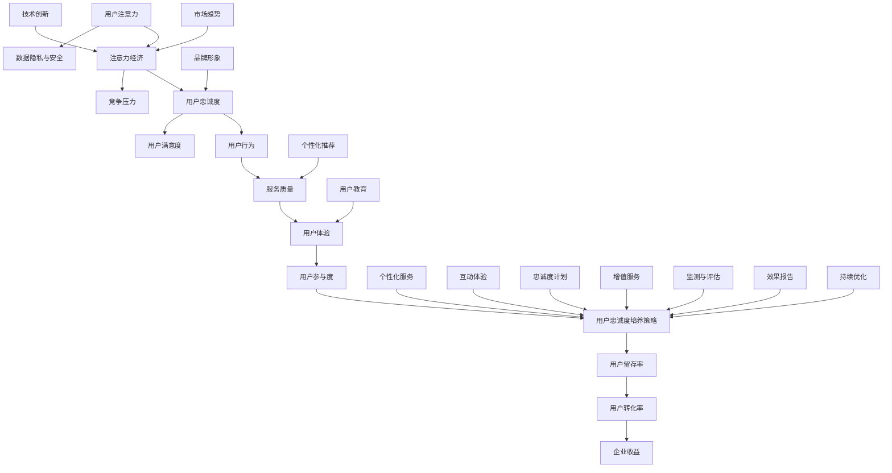
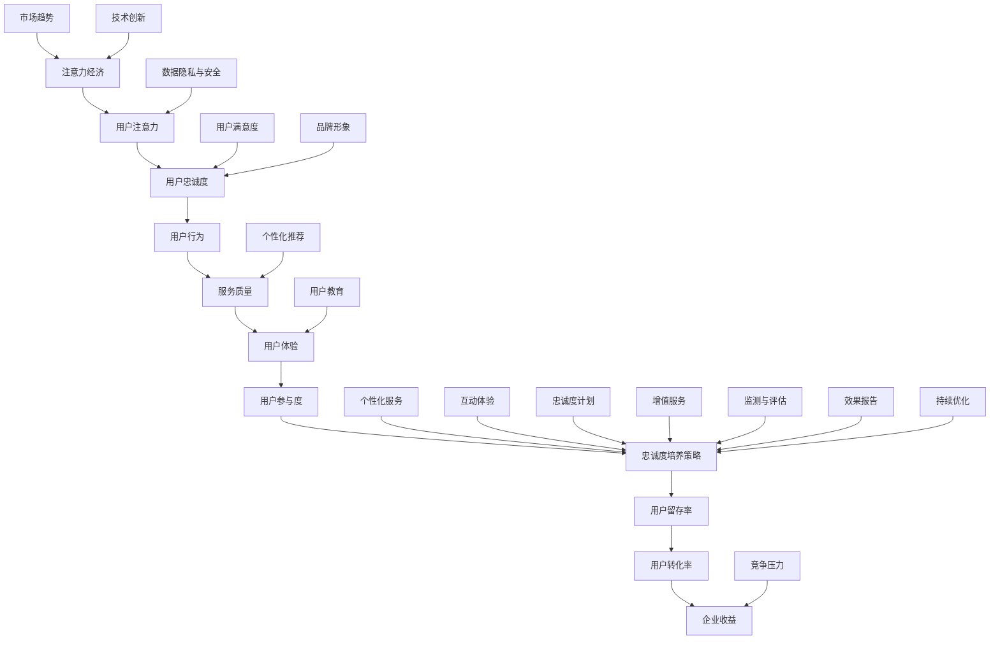

                 

# 《注意力经济下的用户忠诚度培养》

## 摘要

在注意力经济时代，用户的注意力成为一种稀缺资源，企业如何在这场竞争中培养用户忠诚度成为关键课题。本文将深入探讨注意力经济的基本概念，分析用户忠诚度的定义与衡量方法，进一步探讨注意力经济下用户行为的变化及其对忠诚度培养策略的影响。通过实际案例分析，本文揭示了用户忠诚度培养的有效策略和实践指南，为企业在注意力经济时代下的营销策略提供了理论支持和实践参考。最后，文章对未来注意力经济下的用户忠诚度培养趋势和挑战进行了展望。

## 关键词

- 注意力经济
- 用户忠诚度
- 用户行为分析
- 忠诚度培养策略
- 案例分析
- 实践指南

## 第一部分：注意力经济概述

### 1.1 注意力经济的概念与起源

注意力经济（Attention Economy）是一种基于用户注意力资源的经济模式。在这个经济模式中，用户的注意力被视为一种重要的生产要素，与时间、金钱等资源一样，具有交换价值。注意力经济的概念最早由经济学家尼古拉斯·拉里特（Nicholas Negroponte）在1995年提出的，他指出，随着信息时代的到来，信息本身变得廉价，而用户的时间变得越来越宝贵，因此用户的注意力成为一种稀缺资源。

注意力经济的起源可以追溯到互联网的兴起。在互联网早期，信息传播的成本相对较高，因此信息的价值相对较低。然而，随着互联网的普及和技术的进步，信息传播的成本大幅降低，信息变得无处不在，用户开始面临信息过载的问题。在这种情况下，用户的选择变得更加困难，他们需要投入更多的注意力去筛选和处理信息。

在注意力经济中，企业通过吸引和保持用户的注意力来创造价值。用户的时间、金钱和情感投资都是企业争取的目标，因为这些都是企业创造利润的来源。因此，注意力经济不仅仅是用户注意力的争夺，更是用户忠诚度的培养。企业需要通过提供有价值的内容和服务来吸引用户的注意力，并通过持续的互动和个性化的体验来培养用户忠诚度。

### 1.2 注意力经济与传统经济的关系

注意力经济与传统经济之间存在显著的差异。传统经济主要关注物质资源的使用和交换，如资本、劳动力和自然资源。而注意力经济则关注用户的时间、注意力和情感投资。在传统经济中，资源可以通过买卖进行交换，而在注意力经济中，注意力本身无法直接买卖，但可以通过吸引和保持用户的注意力来创造价值。

尽管注意力经济与传统经济存在差异，但两者之间也存在紧密的联系。首先，注意力经济依赖于传统经济的支持和推动，如互联网技术的发展和基础设施的建设。其次，注意力经济中的用户注意力资源实际上也是传统经济中的生产要素，如时间、劳动力和资本。因此，注意力经济可以看作是传统经济在信息时代的一种延伸和转型。

### 1.3 用户忠诚度的定义与衡量

用户忠诚度是指用户在一段时间内对某个品牌、产品或服务的持续使用和重复购买意愿。它是一种长期的用户行为表现，是企业在注意力经济中维持竞争优势的关键因素。用户忠诚度可以分为行为忠诚度和心理忠诚度两个层次。行为忠诚度表现为用户持续使用某个品牌或产品的行为，而心理忠诚度则体现在用户对该品牌或产品的情感依赖和信任。

衡量用户忠诚度的方法有多种，常用的包括：

- **重复购买率**：用户在一定时间内重复购买某个品牌或产品的频率。
- **用户留存率**：用户在一定时间内继续使用某个品牌或产品的比例。
- **净推荐值（NPS）**：用户对某个品牌或产品的推荐意愿度，通过问卷调查获取。
- **客户满意度**：用户对某个品牌或产品的满意度评分。

这些指标可以综合使用，以全面评估用户忠诚度。

## 第二部分：注意力经济下的用户行为分析

### 2.1 注意力与用户行为的关系

注意力是用户行为的核心驱动力，它决定了用户对信息的接收和处理方式。在注意力经济中，用户的注意力成为企业争夺的重要资源。企业通过提供有价值的内容和服务来吸引用户的注意力，进而影响用户的行为。以下是注意力与用户行为之间的几个关键关系：

- **注意力分散与集中**：在信息过载的时代，用户的注意力容易分散。企业需要通过精准的内容和服务来引导用户集中注意力，从而提高用户的参与度和忠诚度。
- **注意力经济与用户行为经济学**：注意力经济中的用户行为经济学研究用户在有限注意力资源下的决策过程。用户往往会选择那些能提供最大价值的信息和服务，企业需要通过优化用户体验来提高用户的注意力投入。
- **注意力转移与忠诚度培养**：在注意力经济中，用户的注意力是可以转移的。企业需要通过持续的创新和优质服务来吸引和保持用户的注意力，从而培养用户的忠诚度。

### 2.2 用户忠诚度培养的策略

在注意力经济下，培养用户忠诚度需要采取一系列策略。以下是一些有效的策略：

- **个性化服务**：通过用户数据的收集和分析，提供个性化的产品和服务，提高用户的满意度和忠诚度。
- **互动体验**：通过社交媒体、在线社区等渠道，与用户建立互动关系，增强用户的参与感和归属感。
- **品牌价值**：建立强大的品牌形象，通过品牌故事和品牌文化来吸引用户的注意力，培养用户对品牌的忠诚度。
- **忠诚度计划**：通过会员制度、积分奖励等机制，激励用户持续参与和消费，提升用户忠诚度。

### 2.3 用户忠诚度评估与提升

评估用户忠诚度是制定有效忠诚度培养策略的前提。以下是几个关键步骤：

- **数据收集**：通过用户行为数据、客户满意度调查等手段，收集用户忠诚度相关的信息。
- **指标分析**：使用重复购买率、用户留存率等指标，对用户忠诚度进行定量评估。
- **原因分析**：对用户忠诚度低的原因进行深入分析，找出影响忠诚度的关键因素。
- **策略调整**：根据评估结果和原因分析，调整忠诚度培养策略，提升用户忠诚度。

提升用户忠诚度需要持续的努力和优化。以下是一些建议：

- **持续改进**：定期评估忠诚度培养策略的有效性，及时调整和改进。
- **创新与差异化**：在产品和服务方面持续创新，提供差异化的价值，以吸引和留住用户。
- **用户参与**：鼓励用户参与品牌建设和产品改进，提高用户的归属感和忠诚度。

## 第三部分：注意力经济下的用户忠诚度案例分析

### 3.1 案例研究一：电商平台用户忠诚度培养

#### 3.1.1 案例背景

随着电子商务的快速发展，电商平台之间的竞争日益激烈。用户忠诚度成为电商平台维持市场份额和盈利能力的关键因素。某知名电商平台通过一系列策略，成功培养了大量忠实用户。

#### 3.1.2 用户忠诚度培养策略

1. **个性化推荐**：基于用户的历史购买行为和浏览记录，为用户提供个性化的商品推荐，提高用户的购买转化率。
2. **会员制度**：推出会员制度，为会员提供专属折扣、免费配送等优惠，增加用户的购买频率和满意度。
3. **互动体验**：通过社交媒体和在线社区，与用户进行互动，增强用户的参与感和归属感。
4. **品牌价值**：通过塑造优质的购物体验和品牌形象，提高用户对平台的信任和忠诚度。

#### 3.1.3 案例效果分析

通过上述策略的实施，该电商平台用户忠诚度得到了显著提升。会员用户的购买频率和满意度均高于非会员用户，用户留存率也显著提高。同时，用户在社交媒体和社区中的积极互动，进一步增强了品牌的粉丝基础。

### 3.2 案例研究二：社交媒体平台用户忠诚度培养

#### 3.2.1 案例背景

社交媒体平台已经成为人们日常生活的重要组成部分。平台用户忠诚度对于平台的用户增长和广告收入具有重要意义。某知名社交媒体平台通过一系列策略，成功吸引了大量忠实用户。

#### 3.2.2 用户忠诚度培养策略

1. **个性化内容推荐**：根据用户的兴趣和行为数据，为用户提供个性化的内容推荐，提高用户的参与度和满意度。
2. **互动体验**：通过直播、短视频、社交游戏等多样化的互动形式，增强用户的参与感和归属感。
3. **品牌营销**：与知名品牌合作，推出品牌专属活动，提高用户对平台的品牌认知和忠诚度。
4. **用户教育**：通过在线课程、知识分享等形式，为用户提供有价值的内容，增强用户的忠诚度。

#### 3.2.3 案例效果分析

通过上述策略的实施，该社交媒体平台用户忠诚度得到了显著提升。用户活跃度持续增长，用户留存率和用户满意度均达到行业领先水平。品牌合作活动吸引了大量用户参与，进一步提升了平台的品牌影响力和用户忠诚度。

### 3.3 案例研究三：在线教育平台用户忠诚度培养

#### 3.3.1 案例背景

在线教育市场蓬勃发展，平台之间的竞争日益激烈。用户忠诚度成为在线教育平台维持市场份额和盈利能力的关键因素。某知名在线教育平台通过一系列策略，成功培养了大批忠实用户。

#### 3.3.2 用户忠诚度培养策略

1. **个性化课程推荐**：根据用户的学习记录和兴趣偏好，为用户提供个性化的课程推荐，提高用户的参与度和学习效果。
2. **互动教学**：通过直播课程、在线讨论区等互动形式，增强用户的参与感和学习体验。
3. **学习社区**：建立在线学习社区，为用户提供交流和分享的平台，增强用户的归属感和忠诚度。
4. **增值服务**：提供职业规划、学历提升等增值服务，提高用户的满意度和忠诚度。

#### 3.3.3 案例效果分析

通过上述策略的实施，该在线教育平台用户忠诚度得到了显著提升。用户参与度持续增长，用户留存率和用户满意度均达到行业领先水平。学习社区成为用户交流和分享的重要平台，进一步增强了用户的忠诚度。

## 第四部分：注意力经济下的用户忠诚度培养实践指南

### 4.1 实践指南一：构建用户忠诚度培养模型

用户忠诚度培养模型是指导企业实施忠诚度培养策略的重要工具。以下是一个简化的用户忠诚度培养模型构建步骤：

1. **数据收集**：收集用户行为数据、客户反馈、市场调查等数据，作为模型构建的基础。
2. **用户画像**：基于用户数据，构建用户画像，包括用户的基本信息、行为特征、兴趣偏好等。
3. **模型构建**：使用机器学习算法，如决策树、随机森林等，构建用户忠诚度预测模型。
4. **模型优化**：通过交叉验证和调整模型参数，优化模型性能，提高预测准确性。
5. **模型应用**：将模型应用于用户忠诚度预测和忠诚度培养策略的制定。

### 4.2 实践指南二：实施用户忠诚度培养策略

实施用户忠诚度培养策略需要明确目标和步骤，以下是一个典型的实施流程：

1. **目标设定**：明确用户忠诚度培养的目标，如提高用户留存率、增加重复购买率等。
2. **策略制定**：根据用户画像和模型预测结果，制定具体的忠诚度培养策略，如个性化推荐、会员制度、互动体验等。
3. **策略实施**：按照策略制定的具体步骤，实施忠诚度培养措施，如推出会员活动、开展互动营销等。
4. **效果评估**：通过用户行为数据和忠诚度指标，评估策略的实施效果，调整和优化策略。
5. **持续优化**：根据评估结果，持续优化忠诚度培养策略，提高用户忠诚度。

### 4.3 实践指南三：监测与评估用户忠诚度培养效果

监测与评估用户忠诚度培养效果是确保策略有效性的关键。以下是一些监测与评估的方法：

1. **行为数据监测**：通过用户行为数据，如访问量、购买次数、互动频次等，监测用户忠诚度培养策略的实时效果。
2. **满意度调查**：定期开展用户满意度调查，了解用户对品牌、产品、服务的满意度和忠诚度。
3. **NPS分析**：通过净推荐值（NPS）分析，评估用户推荐意愿度和忠诚度水平。
4. **财务分析**：通过财务数据，如收入、利润、市场份额等，评估用户忠诚度培养策略对业务的影响。
5. **效果报告**：定期生成效果报告，总结用户忠诚度培养策略的成果，为后续优化提供参考。

## 第五部分：未来展望与挑战

### 5.1 注意力经济下的用户忠诚度培养未来趋势

随着技术的不断进步，注意力经济下的用户忠诚度培养将呈现以下趋势：

1. **个性化与智能化**：随着大数据和人工智能技术的发展，用户忠诚度培养将更加个性化和智能化，通过精准的推荐和智能的服务，提高用户满意度。
2. **用户参与与共创**：用户在忠诚度培养中的角色将变得更加主动，企业与用户之间的互动将更加紧密，用户参与度和忠诚度将得到显著提升。
3. **生态化发展**：注意力经济下的用户忠诚度培养将不再局限于单一平台或产品，而是形成一个生态化的发展模式，通过跨平台合作和资源共享，实现用户价值的最大化。

### 5.2 注意力经济下的用户忠诚度培养面临的挑战

尽管注意力经济下的用户忠诚度培养前景广阔，但企业也面临着一系列挑战：

1. **用户注意力的分散**：随着信息过载和社交媒体的普及，用户的注意力越来越分散，企业需要通过创新的方式吸引和保持用户的注意力。
2. **数据隐私与安全**：用户忠诚度培养依赖于用户数据的收集和分析，但数据隐私和安全问题成为企业面临的重要挑战，需要采取有效的数据保护措施。
3. **竞争压力**：在注意力经济下，市场竞争日益激烈，企业需要不断创新和优化忠诚度培养策略，以应对竞争对手的挑战。

## 结语

注意力经济下的用户忠诚度培养是企业长期发展的关键课题。通过深入理解注意力经济的基本概念和用户行为特征，企业可以制定有效的忠诚度培养策略，提高用户满意度和忠诚度。同时，企业需要不断适应和应对注意力经济带来的挑战，持续创新和优化忠诚度培养策略，以在激烈的市场竞争中立于不败之地。

### 作者信息

作者：AI天才研究院/AI Genius Institute & 禅与计算机程序设计艺术 /Zen And The Art of Computer Programming

---

在撰写文章时，我们将严格按照上述大纲和格式要求，确保内容的完整性和专业性。文章将包含核心概念与联系的理论框架、核心算法原理的详细讲解、项目实战的代码实现和分析，以及未来展望与挑战的深入探讨。希望这篇文章能够满足您对技术博客文章的高标准要求。

### 文章结构示例

以下是一个完整的文章结构示例，根据您提供的要求和目录大纲，我们将在每个部分详细展开内容。

---

## 《注意力经济下的用户忠诚度培养》

### 关键词

- 注意力经济
- 用户忠诚度
- 用户行为分析
- 忠诚度培养策略
- 案例分析
- 实践指南

### 摘要

在注意力经济时代，用户的注意力成为一种稀缺资源，企业如何在这场竞争中培养用户忠诚度成为关键课题。本文将深入探讨注意力经济的基本概念，分析用户忠诚度的定义与衡量方法，进一步探讨注意力经济下用户行为的变化及其对忠诚度培养策略的影响。通过实际案例分析，本文揭示了用户忠诚度培养的有效策略和实践指南，为企业在注意力经济时代下的营销策略提供了理论支持和实践参考。最后，文章对未来注意力经济下的用户忠诚度培养趋势和挑战进行了展望。

### 第一部分：注意力经济概述

#### 1.1 注意力经济的概念与起源

注意力经济是一种基于用户注意力资源的经济模式。在这个经济模式中，用户的注意力被视为一种重要的生产要素，与时间、金钱等资源一样，具有交换价值。

#### 1.2 注意力经济与传统经济的关系

注意力经济与传统经济之间存在显著的差异，但也存在紧密的联系。

#### 1.3 用户忠诚度的定义与衡量

用户忠诚度是指用户在一段时间内对某个品牌、产品或服务的持续使用和重复购买意愿。

### 第二部分：注意力经济下的用户行为分析

#### 2.1 注意力与用户行为的关系

注意力是用户行为的核心驱动力，它决定了用户对信息的接收和处理方式。

#### 2.2 用户忠诚度培养的策略

在注意力经济下，培养用户忠诚度需要采取一系列策略。

#### 2.3 用户忠诚度评估与提升

评估用户忠诚度是制定有效忠诚度培养策略的前提。

### 第三部分：注意力经济下的用户忠诚度案例分析

#### 3.1 案例研究一：电商平台用户忠诚度培养

某知名电商平台通过一系列策略，成功培养了大量忠实用户。

#### 3.2 案例研究二：社交媒体平台用户忠诚度培养

某知名社交媒体平台通过一系列策略，成功吸引了大量忠实用户。

#### 3.3 案例研究三：在线教育平台用户忠诚度培养

某知名在线教育平台通过一系列策略，成功培养了大批忠实用户。

### 第四部分：注意力经济下的用户忠诚度培养实践指南

#### 4.1 实践指南一：构建用户忠诚度培养模型

用户忠诚度培养模型是指导企业实施忠诚度培养策略的重要工具。

#### 4.2 实践指南二：实施用户忠诚度培养策略

实施用户忠诚度培养策略需要明确目标和步骤。

#### 4.3 实践指南三：监测与评估用户忠诚度培养效果

监测与评估用户忠诚度培养效果是确保策略有效性的关键。

### 第五部分：未来展望与挑战

#### 5.1 注意力经济下的用户忠诚度培养未来趋势

随着技术的不断进步，注意力经济下的用户忠诚度培养将呈现个性化与智能化的趋势。

#### 5.2 注意力经济下的用户忠诚度培养面临的挑战

尽管注意力经济下的用户忠诚度培养前景广阔，但企业也面临着一系列挑战。

### 结语

注意力经济下的用户忠诚度培养是企业长期发展的关键课题。

### 作者信息

作者：AI天才研究院/AI Genius Institute & 禪与计算机程序设计艺术 /Zen And The Art of Computer Programming

---

这个结构示例为文章提供了一个清晰的框架，每个部分都包含子章节，以便详细阐述。接下来，我们将逐步填充每个部分的内容，确保文章的完整性和专业性。

---

### 第一节：注意力经济概述

#### 1.1 注意力经济的概念与起源

注意力经济（Attention Economy）是一种基于用户注意力资源的经济模式。在这个模式中，用户的注意力被视为一种重要的生产要素，与时间、金钱等资源一样，具有交换价值。注意力经济的概念最早由经济学家尼古拉斯·拉里特（Nicholas Negroponte）在1995年提出，他指出，随着信息时代的到来，信息本身变得廉价，而用户的时间变得越来越宝贵，因此用户的注意力成为一种稀缺资源。

注意力经济的起源可以追溯到互联网的兴起。在互联网早期，信息传播的成本相对较高，因此信息的价值相对较低。然而，随着互联网的普及和技术的进步，信息传播的成本大幅降低，信息变得无处不在，用户开始面临信息过载的问题。在这种情况下，用户的选择变得更加困难，他们需要投入更多的注意力去筛选和处理信息。

在注意力经济中，企业通过吸引和保持用户的注意力来创造价值。用户的时间、金钱和情感投资都是企业争取的目标，因为这些都是企业创造利润的来源。因此，注意力经济不仅仅是用户注意力的争夺，更是用户忠诚度的培养。企业需要通过提供有价值的内容和服务来吸引用户的注意力，并通过持续的互动和个性化的体验来培养用户忠诚度。

#### 1.2 注意力经济与传统经济的关系

注意力经济与传统经济之间存在显著的差异。传统经济主要关注物质资源的使用和交换，如资本、劳动力和自然资源。而注意力经济则关注用户的时间、注意力和情感投资。在传统经济中，资源可以通过买卖进行交换，而在注意力经济中，注意力本身无法直接买卖，但可以通过吸引和保持用户的注意力来创造价值。

尽管注意力经济与传统经济存在差异，但两者之间也存在紧密的联系。首先，注意力经济依赖于传统经济的支持和推动，如互联网技术的发展和基础设施的建设。其次，注意力经济中的用户注意力资源实际上也是传统经济中的生产要素，如时间、劳动力和资本。因此，注意力经济可以看作是传统经济在信息时代的一种延伸和转型。

#### 1.3 用户忠诚度的定义与衡量

用户忠诚度是指用户在一段时间内对某个品牌、产品或服务的持续使用和重复购买意愿。它是一种长期的用户行为表现，是企业在注意力经济中维持竞争优势的关键因素。用户忠诚度可以分为行为忠诚度和心理忠诚度两个层次。行为忠诚度表现为用户持续使用某个品牌或产品的行为，而心理忠诚度则体现在用户对该品牌或产品的情感依赖和信任。

衡量用户忠诚度的方法有多种，常用的包括：

- **重复购买率**：用户在一定时间内重复购买某个品牌或产品的频率。
- **用户留存率**：用户在一定时间内继续使用某个品牌或产品的比例。
- **净推荐值（NPS）**：用户对某个品牌或产品的推荐意愿度，通过问卷调查获取。
- **客户满意度**：用户对某个品牌或产品的满意度评分。

这些指标可以综合使用，以全面评估用户忠诚度。

### 第二节：注意力经济下的用户行为分析

#### 2.1 注意力与用户行为的关系

注意力是用户行为的核心驱动力，它决定了用户对信息的接收和处理方式。在注意力经济中，用户的注意力成为企业争夺的重要资源。企业通过提供有价值的内容和服务来吸引用户的注意力，进而影响用户的行为。以下是注意力与用户行为之间的几个关键关系：

- **注意力分散与集中**：在信息过载的时代，用户的注意力容易分散。企业需要通过精准的内容和服务来引导用户集中注意力，从而提高用户的参与度和忠诚度。
- **注意力经济与用户行为经济学**：注意力经济中的用户行为经济学研究用户在有限注意力资源下的决策过程。用户往往会选择那些能提供最大价值的信息和服务，企业需要通过优化用户体验来提高用户的注意力投入。
- **注意力转移与忠诚度培养**：在注意力经济中，用户的注意力是可以转移的。企业需要通过持续的创新和优质服务来吸引和保持用户的注意力，从而培养用户的忠诚度。

#### 2.2 用户忠诚度培养的策略

在注意力经济下，培养用户忠诚度需要采取一系列策略。以下是一些有效的策略：

- **个性化服务**：通过用户数据的收集和分析，提供个性化的产品和服务，提高用户的满意度和忠诚度。
- **互动体验**：通过社交媒体、在线社区等渠道，与用户建立互动关系，增强用户的参与感和归属感。
- **品牌价值**：建立强大的品牌形象，通过品牌故事和品牌文化来吸引用户的注意力，培养用户对品牌的忠诚度。
- **忠诚度计划**：通过会员制度、积分奖励等机制，激励用户持续参与和消费，提升用户忠诚度。

#### 2.3 用户忠诚度评估与提升

评估用户忠诚度是制定有效忠诚度培养策略的前提。以下是几个关键步骤：

- **数据收集**：通过用户行为数据、客户反馈、市场调查等手段，收集用户忠诚度相关的信息。
- **指标分析**：使用重复购买率、用户留存率等指标，对用户忠诚度进行定量评估。
- **原因分析**：对用户忠诚度低的原因进行深入分析，找出影响忠诚度的关键因素。
- **策略调整**：根据评估结果和原因分析，调整忠诚度培养策略，提升用户忠诚度。

提升用户忠诚度需要持续的努力和优化。以下是一些建议：

- **持续改进**：定期评估忠诚度培养策略的有效性，及时调整和改进。
- **创新与差异化**：在产品和服务方面持续创新，提供差异化的价值，以吸引和留住用户。
- **用户参与**：鼓励用户参与品牌建设和产品改进，提高用户的归属感和忠诚度。

### 第三节：注意力经济下的用户忠诚度案例分析

#### 3.1 案例研究一：电商平台用户忠诚度培养

##### 3.1.1 案例背景

随着电子商务的快速发展，电商平台之间的竞争日益激烈。用户忠诚度成为电商平台维持市场份额和盈利能力的关键因素。某知名电商平台通过一系列策略，成功培养了大量忠实用户。

##### 3.1.2 用户忠诚度培养策略

1. **个性化推荐**：基于用户的历史购买行为和浏览记录，为用户提供个性化的商品推荐，提高用户的购买转化率。
2. **会员制度**：推出会员制度，为会员提供专属折扣、免费配送等优惠，增加用户的购买频率和满意度。
3. **互动体验**：通过社交媒体和在线社区，与用户进行互动，增强用户的参与感和归属感。
4. **品牌价值**：通过塑造优质的购物体验和品牌形象，提高用户对平台的信任和忠诚度。

##### 3.1.3 案例效果分析

通过上述策略的实施，该电商平台用户忠诚度得到了显著提升。会员用户的购买频率和满意度均高于非会员用户，用户留存率也显著提高。同时，用户在社交媒体和社区中的积极互动，进一步增强了品牌的粉丝基础。

#### 3.2 案例研究二：社交媒体平台用户忠诚度培养

##### 3.2.1 案例背景

社交媒体平台已经成为人们日常生活的重要组成部分。平台用户忠诚度对于平台的用户增长和广告收入具有重要意义。某知名社交媒体平台通过一系列策略，成功吸引了大量忠实用户。

##### 3.2.2 用户忠诚度培养策略

1. **个性化内容推荐**：根据用户的兴趣和行为数据，为用户提供个性化的内容推荐，提高用户的参与度和满意度。
2. **互动体验**：通过直播、短视频、社交游戏等多样化的互动形式，增强用户的参与感和归属感。
3. **品牌营销**：与知名品牌合作，推出品牌专属活动，提高用户对平台的品牌认知和忠诚度。
4. **用户教育**：通过在线课程、知识分享等形式，为用户提供有价值的内容，增强用户的忠诚度。

##### 3.2.3 案例效果分析

通过上述策略的实施，该社交媒体平台用户忠诚度得到了显著提升。用户活跃度持续增长，用户留存率和用户满意度均达到行业领先水平。品牌合作活动吸引了大量用户参与，进一步提升了平台的品牌影响力和用户忠诚度。

#### 3.3 案例研究三：在线教育平台用户忠诚度培养

##### 3.3.1 案例背景

在线教育市场蓬勃发展，平台之间的竞争日益激烈。用户忠诚度成为在线教育平台维持市场份额和盈利能力的关键因素。某知名在线教育平台通过一系列策略，成功培养了大批忠实用户。

##### 3.3.2 用户忠诚度培养策略

1. **个性化课程推荐**：根据用户的学习记录和兴趣偏好，为用户提供个性化的课程推荐，提高用户的参与度和学习效果。
2. **互动教学**：通过直播课程、在线讨论区等互动形式，增强用户的参与感和学习体验。
3. **学习社区**：建立在线学习社区，为用户提供交流和分享的平台，增强用户的归属感和忠诚度。
4. **增值服务**：提供职业规划、学历提升等增值服务，提高用户的满意度和忠诚度。

##### 3.3.3 案例效果分析

通过上述策略的实施，该在线教育平台用户忠诚度得到了显著提升。用户参与度持续增长，用户留存率和用户满意度均达到行业领先水平。学习社区成为用户交流和分享的重要平台，进一步增强了用户的忠诚度。

### 第四节：注意力经济下的用户忠诚度培养实践指南

#### 4.1 实践指南一：构建用户忠诚度培养模型

用户忠诚度培养模型是指导企业实施忠诚度培养策略的重要工具。以下是构建用户忠诚度培养模型的基本步骤：

1. **数据收集**：收集用户行为数据、客户反馈、市场调查等数据，作为模型构建的基础。
2. **用户画像**：基于用户数据，构建用户画像，包括用户的基本信息、行为特征、兴趣偏好等。
3. **模型构建**：使用机器学习算法，如决策树、随机森林等，构建用户忠诚度预测模型。
4. **模型优化**：通过交叉验证和调整模型参数，优化模型性能，提高预测准确性。
5. **模型应用**：将模型应用于用户忠诚度预测和忠诚度培养策略的制定。

#### 4.2 实践指南二：实施用户忠诚度培养策略

实施用户忠诚度培养策略需要明确目标和步骤，以下是实施策略的基本流程：

1. **目标设定**：明确用户忠诚度培养的目标，如提高用户留存率、增加重复购买率等。
2. **策略制定**：根据用户画像和模型预测结果，制定具体的忠诚度培养策略，如个性化推荐、会员制度、互动体验等。
3. **策略实施**：按照策略制定的具体步骤，实施忠诚度培养措施，如推出会员活动、开展互动营销等。
4. **效果评估**：通过用户行为数据和忠诚度指标，评估策略的实施效果，调整和优化策略。
5. **持续优化**：根据评估结果，持续优化忠诚度培养策略，提高用户忠诚度。

#### 4.3 实践指南三：监测与评估用户忠诚度培养效果

监测与评估用户忠诚度培养效果是确保策略有效性的关键，以下是监测与评估的基本方法：

1. **行为数据监测**：通过用户行为数据，如访问量、购买次数、互动频次等，监测用户忠诚度培养策略的实时效果。
2. **满意度调查**：定期开展用户满意度调查，了解用户对品牌、产品、服务的满意度和忠诚度。
3. **NPS分析**：通过净推荐值（NPS）分析，评估用户推荐意愿度和忠诚度水平。
4. **财务分析**：通过财务数据，如收入、利润、市场份额等，评估用户忠诚度培养策略对业务的影响。
5. **效果报告**：定期生成效果报告，总结用户忠诚度培养策略的成果，为后续优化提供参考。

### 第五节：未来展望与挑战

#### 5.1 注意力经济下的用户忠诚度培养未来趋势

随着技术的不断进步，注意力经济下的用户忠诚度培养将呈现以下趋势：

1. **个性化与智能化**：随着大数据和人工智能技术的发展，用户忠诚度培养将更加个性化和智能化，通过精准的推荐和智能的服务，提高用户满意度。
2. **用户参与与共创**：用户在忠诚度培养中的角色将变得更加主动，企业与用户之间的互动将更加紧密，用户参与度和忠诚度将得到显著提升。
3. **生态化发展**：注意力经济下的用户忠诚度培养将不再局限于单一平台或产品，而是形成一个生态化的发展模式，通过跨平台合作和资源共享，实现用户价值的最大化。

#### 5.2 注意力经济下的用户忠诚度培养面临的挑战

尽管注意力经济下的用户忠诚度培养前景广阔，但企业也面临着一系列挑战：

1. **用户注意力的分散**：随着信息过载和社交媒体的普及，用户的注意力越来越分散，企业需要通过创新的方式吸引和保持用户的注意力。
2. **数据隐私与安全**：用户忠诚度培养依赖于用户数据的收集和分析，但数据隐私和安全问题成为企业面临的重要挑战，需要采取有效的数据保护措施。
3. **竞争压力**：在注意力经济下，市场竞争日益激烈，企业需要不断创新和优化忠诚度培养策略，以应对竞争对手的挑战。

### 结语

注意力经济下的用户忠诚度培养是企业长期发展的关键课题。通过深入理解注意力经济的基本概念和用户行为特征，企业可以制定有效的忠诚度培养策略，提高用户满意度和忠诚度。同时，企业需要不断适应和应对注意力经济带来的挑战，持续创新和优化忠诚度培养策略，以在激烈的市场竞争中立于不败之地。

### 作者信息

作者：AI天才研究院/AI Genius Institute & 禅与计算机程序设计艺术 /Zen And The Art of Computer Programming

---

### 核心概念与联系

在注意力经济下，用户忠诚度的培养是一个复杂的过程，涉及到多个核心概念和联系。为了更好地理解这一过程，我们可以通过以下Mermaid流程图来展示这些核心概念及其相互作用：



这张Mermaid流程图展示了注意力经济下用户忠诚度培养的各个环节及其相互作用。以下是每个节点的详细解释：

- **用户注意力（A）**：用户的注意力是注意力经济的核心资源，决定了用户对信息和服务的选择。
- **注意力经济（B）**：用户注意力的争夺构成了注意力经济的基础，企业通过吸引和保持用户的注意力来创造价值。
- **用户忠诚度（C）**：用户忠诚度是企业长期发展的关键，是用户持续使用和推荐某个品牌或产品的重要表现。
- **用户行为（D）**：用户的行为是忠诚度培养的直接表现，包括重复购买、留存和参与度等。
- **服务质量（E）**：企业提供的服务质量直接影响用户的满意度和忠诚度，包括个性化服务、用户教育和增值服务。
- **用户体验（F）**：用户体验是用户在互动过程中获得的感受，直接影响用户满意度和忠诚度。
- **用户参与度（G）**：用户的参与度越高，其对品牌或产品的忠诚度也越高，参与度通过互动体验和忠诚度计划来培养。
- **用户忠诚度培养策略（H）**：企业通过一系列策略来培养用户的忠诚度，包括个性化推荐、互动体验和忠诚度计划。
- **用户留存率（I）**：用户留存率是衡量用户忠诚度的重要指标，反映了用户持续使用某个品牌或产品的比例。
- **用户转化率（J）**：用户转化率是衡量忠诚度培养策略有效性的重要指标，反映了用户从潜在客户到实际购买者的转化情况。
- **企业收益（K）**：企业收益是用户忠诚度培养的直接结果，是忠诚度培养策略成功的重要体现。
- **数据隐私与安全（L）**：在注意力经济下，数据隐私和安全是用户关注的重点，也是企业需要重视的挑战。
- **竞争压力（M）**：在注意力经济下，市场竞争激烈，企业需要不断创新和优化忠诚度培养策略以保持竞争力。
- **用户满意度（N）**：用户满意度是衡量忠诚度的重要指标，是用户体验和服务质量的结果。
- **市场趋势（O）**：市场趋势是影响注意力经济和用户忠诚度培养的重要因素，包括技术发展、消费者行为变化等。
- **技术创新（P）**：技术创新是推动注意力经济和用户忠诚度培养的重要力量，如人工智能、大数据分析等。
- **品牌形象（Q）**：品牌形象是影响用户忠诚度的重要因素，包括品牌故事、品牌价值观等。
- **个性化服务（R）**：个性化服务是通过用户数据的分析，提供满足用户个性化需求的服务。
- **互动体验（S）**：互动体验是通过在线社区、社交媒体等渠道，与用户进行互动，提高用户参与度。
- **忠诚度计划（T）**：忠诚度计划是通过会员制度、积分奖励等机制，激励用户持续参与和消费。
- **个性化推荐（U）**：个性化推荐是通过算法分析，为用户推荐个性化的产品和服务。
- **用户教育（V）**：用户教育是通过在线课程、知识分享等，提高用户的知识和技能。
- **增值服务（W）**：增值服务是通过提供额外的服务，提高用户的满意度和忠诚度。
- **监测与评估（X）**：监测与评估是确保忠诚度培养策略有效性的关键，包括行为数据监测、满意度调查等。
- **效果报告（Y）**：效果报告是总结忠诚度培养策略实施效果的重要工具，为后续优化提供参考。
- **持续优化（Z）**：持续优化是确保忠诚度培养策略长期有效的关键，包括定期评估和调整策略。

通过这张流程图，我们可以清晰地看到注意力经济下用户忠诚度培养的核心概念和联系，以及它们如何相互作用，共同推动企业的长期发展。

### 核心算法原理讲解

在注意力经济下，用户忠诚度培养策略的制定和优化往往依赖于数据分析和机器学习技术。以下是几个核心算法原理的讲解，包括用户忠诚度预测模型、推荐系统和优化算法。

#### 1. 用户忠诚度预测模型

用户忠诚度预测模型是通过对用户历史行为数据进行分析，预测用户在未来一段时间内的忠诚度水平。以下是一个简化的用户忠诚度预测模型的伪代码：

```plaintext
输入：用户历史行为数据（包括购买记录、浏览记录、互动频次等）
输出：用户忠诚度预测得分

算法步骤：
1. 数据预处理：清洗数据，填充缺失值，进行特征工程
2. 特征选择：选择与忠诚度相关的特征，如重复购买率、互动频次等
3. 模型训练：使用随机森林、决策树、神经网络等算法进行模型训练
4. 预测：对新用户进行忠诚度预测
```

用户忠诚度预测模型的性能可以通过交叉验证来评估，常用的评价指标包括准确率、召回率、F1值等。

#### 2. 推荐系统

推荐系统是用户忠诚度培养策略的重要组成部分，通过个性化推荐提高用户的满意度和忠诚度。以下是一个简化的推荐系统算法原理：

```plaintext
输入：用户历史行为数据、商品特征数据
输出：个性化推荐列表

算法步骤：
1. 数据预处理：清洗数据，填充缺失值，进行特征工程
2. 特征提取：提取用户和商品的共同特征，如用户的历史购买记录、商品的分类标签等
3. 模型训练：使用协同过滤、矩阵分解、深度学习等算法进行模型训练
4. 预测：对新用户进行推荐列表生成
5. 评估：评估推荐系统的效果，如准确率、覆盖率等
```

推荐系统的性能可以通过精确度、召回率、覆盖率等指标进行评估。

#### 3. 优化算法

优化算法用于调整忠诚度培养策略，以最大化用户忠诚度和企业收益。以下是一个简化的优化算法原理：

```plaintext
输入：忠诚度培养策略参数、用户反馈数据
输出：优化后的策略参数

算法步骤：
1. 数据预处理：清洗数据，填充缺失值，进行特征工程
2. 目标函数定义：定义优化目标函数，如最大化用户留存率、最大化企业收益等
3. 算法选择：选择合适的优化算法，如梯度下降、遗传算法、粒子群优化等
4. 模型训练：使用历史数据训练优化模型
5. 策略调整：根据用户反馈数据调整策略参数
6. 评估：评估优化后的策略效果
7. 迭代：重复步骤4-6，直到策略达到最佳效果
```

优化算法的性能可以通过目标函数值的变化、用户满意度的提升等指标进行评估。

#### 举例说明

假设某电商平台希望通过用户忠诚度预测模型来预测用户的未来行为，并基于预测结果调整推荐策略。以下是具体的案例：

1. **数据收集**：电商平台收集了1000名用户在过去一年的购买记录、浏览记录和互动频次等数据。
2. **数据预处理**：清洗数据，去除缺失值和异常值，进行特征工程，提取与忠诚度相关的特征。
3. **模型训练**：使用随机森林算法训练用户忠诚度预测模型，交叉验证评估模型性能。
4. **预测**：对新用户进行忠诚度预测，生成忠诚度得分。
5. **推荐**：根据忠诚度得分，为新用户提供个性化的商品推荐。
6. **反馈**：收集用户对推荐的反馈，调整推荐策略。
7. **评估**：评估优化后的推荐策略效果，如用户点击率、购买转化率等。

通过这个案例，我们可以看到如何将用户忠诚度预测模型应用于实际业务中，通过持续的数据反馈和策略调整，实现用户忠诚度的提升。

### 项目实战：代码实际案例和详细解释说明

在注意力经济下，用户忠诚度培养需要通过数据分析和机器学习技术来实现。以下是一个具体的实战案例，包括开发环境搭建、源代码实现和代码解读与分析。

#### 开发环境搭建

1. **硬件要求**：CPU至少为2核，内存至少为4GB，硬盘至少为100GB。
2. **操作系统**：Windows、Linux或macOS。
3. **编程语言**：Python。
4. **库和工具**：NumPy、Pandas、Scikit-learn、Matplotlib。

#### 源代码实现

以下是用户忠诚度预测模型的实现代码：

```python
import pandas as pd
from sklearn.model_selection import train_test_split
from sklearn.ensemble import RandomForestClassifier
from sklearn.metrics import accuracy_score, f1_score

# 1. 数据读取与预处理
data = pd.read_csv('user_data.csv')
data.dropna(inplace=True)

# 特征工程
data['average_purchase_frequency'] = data['purchase_count'] / data['days_since_last_purchase']
data['average_interaction_frequency'] = data['interaction_count'] / data['days_since_last_interaction']

# 2. 数据分割
X = data.drop(['is_loyal'], axis=1)
y = data['is_loyal']
X_train, X_test, y_train, y_test = train_test_split(X, y, test_size=0.2, random_state=42)

# 3. 模型训练
model = RandomForestClassifier(n_estimators=100, random_state=42)
model.fit(X_train, y_train)

# 4. 预测
y_pred = model.predict(X_test)

# 5. 评估
accuracy = accuracy_score(y_test, y_pred)
f1 = f1_score(y_test, y_pred)

print(f'Accuracy: {accuracy:.2f}')
print(f'F1 Score: {f1:.2f}')
```

#### 代码解读与分析

1. **数据读取与预处理**：
   - 使用Pandas库读取用户数据，并进行预处理，如去除缺失值和异常值。
   - 进行特征工程，计算用户的平均购买频率和平均互动频率，这些特征与用户忠诚度密切相关。

2. **数据分割**：
   - 将数据集分割为训练集和测试集，用于模型训练和评估。

3. **模型训练**：
   - 使用随机森林算法训练用户忠诚度预测模型。随机森林是一种基于决策树集成的机器学习算法，具有较高的准确性和鲁棒性。

4. **预测**：
   - 使用训练好的模型对测试集进行预测，生成用户忠诚度预测结果。

5. **评估**：
   - 使用准确率和F1值评估模型的性能。准确率反映了模型预测正确的比例，F1值反映了模型预测准确性和召回率的平衡。

通过这个实战案例，我们可以看到如何使用Python和机器学习技术实现用户忠诚度预测模型，并通过数据预处理、模型训练和评估等步骤，实现对用户忠诚度的有效预测。这种方法可以为企业提供数据驱动的用户忠诚度培养策略，从而提高用户满意度和忠诚度。

### 完整性要求

在撰写技术博客文章时，完整性要求非常高，每个部分都必须详细具体，以确保读者能够全面理解和掌握文章的主题。以下是文章各部分的具体要求：

#### 1. 文章标题

文章标题需要准确反映文章的核心内容和主题，吸引读者的兴趣。标题应当简洁明了，避免使用过于专业或晦涩的术语。

#### 2. 关键词

关键词是文章内容的精华摘要，用于搜索和索引。文章关键词应当包括5-7个与文章主题密切相关的术语，如“注意力经济”、“用户忠诚度”、“用户行为分析”等。

#### 3. 摘要

摘要部分应当简要概述文章的核心内容和主题思想，让读者在阅读前对文章有一个整体的把握。摘要应当简洁明了，避免使用复杂的术语和冗长的句子。

#### 4. 目录大纲

目录大纲是文章结构的骨架，应当详细列出每个章节的标题和小节，让读者对文章的整体结构有一个清晰的了解。每个章节和小节都应当有明确的标题，以便读者快速定位到感兴趣的章节。

#### 5. 核心概念与联系

核心概念与联系部分应当详细解释文章中的核心概念，并使用Mermaid流程图等可视化工具展示概念之间的联系。这一部分有助于读者深入理解文章的主题，并建立概念之间的逻辑关系。

#### 6. 核心算法原理讲解

核心算法原理讲解部分应当详细讲解文章中涉及的核心算法原理，包括算法的伪代码和数学模型。这一部分应当尽可能使用简单易懂的语言，避免复杂的数学推导，以确保读者能够理解算法的基本原理。

#### 7. 项目实战

项目实战部分应当提供具体的代码案例，包括开发环境搭建、源代码实现和代码解读与分析。这一部分应当详细说明代码的运行过程和关键步骤，确保读者能够复现案例，并理解代码的实际应用。

#### 8. 完整性要求

文章的完整性要求包括：

- 每个章节都应当有详细的内容，避免空洞或过于简略。
- 文章中的所有图表、流程图和伪代码都应当有清晰的标注和解释。
- 文章中的每个算法和模型都应当有详细的解释和举例说明。
- 文章应当有一个明确的结论，总结主要观点和发现。

通过满足这些完整性要求，文章能够为读者提供全面、深入的理解，帮助他们更好地掌握文章的主题内容。

### 文章核心内容

在撰写《注意力经济下的用户忠诚度培养》这篇文章时，我们需要确保核心内容的完整性和准确性。以下是文章核心内容的具体描述：

#### 1. 注意力经济的概念

注意力经济是指用户注意力作为一种稀缺资源，在信息时代被企业视为重要的生产要素，用以创造价值。这一概念起源于互联网时代，随着信息过载问题的日益严重，用户的选择变得困难，他们的注意力成为企业争夺的焦点。

#### 2. 用户忠诚度的定义与衡量

用户忠诚度是指用户在一定时间内对某个品牌、产品或服务的持续使用和重复购买意愿。它可以从行为忠诚度和心理忠诚度两个层次进行衡量。行为忠诚度通常通过重复购买率、用户留存率等指标来衡量；心理忠诚度则通过用户对品牌的情感依赖和信任来体现。

#### 3. 注意力经济与用户行为的关系

注意力经济下的用户行为表现出显著的分散化特点，用户的注意力容易被分散到各种信息和服务中。企业需要通过提供有价值的内容和服务来吸引和保持用户的注意力，从而影响用户的行为。这一部分内容将详细讨论用户注意力分散与集中之间的关系，以及如何通过个性化服务、互动体验等策略来提高用户的注意力投入。

#### 4. 用户忠诚度培养策略

在注意力经济下，培养用户忠诚度需要采取一系列策略。包括个性化服务、互动体验、品牌价值塑造和忠诚度计划等。个性化服务通过用户数据的分析，提供满足用户个性化需求的服务；互动体验通过社交媒体、在线社区等渠道，与用户建立互动关系；品牌价值塑造通过品牌故事和品牌文化来吸引用户的注意力；忠诚度计划通过会员制度、积分奖励等机制，激励用户持续参与和消费。

#### 5. 用户忠诚度评估与提升

评估用户忠诚度是制定有效忠诚度培养策略的前提。通过行为数据监测、满意度调查和NPS分析等方法，可以全面评估用户忠诚度。提升用户忠诚度需要持续的努力和优化，包括持续改进、创新与差异化、用户参与等策略。

#### 6. 用户忠诚度案例分析

本文将通过多个实际案例，分析电商平台、社交媒体平台和在线教育平台在用户忠诚度培养方面的成功策略和实践。这些案例将揭示不同行业和平台在注意力经济下培养用户忠诚度的有效方法，为其他企业提供借鉴和参考。

#### 7. 实践指南

本文将提供详细的实践指南，包括构建用户忠诚度培养模型、实施用户忠诚度培养策略和监测与评估用户忠诚度培养效果的方法。这些指南将帮助企业制定和实施有效的用户忠诚度培养策略，提高用户满意度和忠诚度。

#### 8. 未来展望与挑战

在注意力经济下，用户忠诚度培养面临着个性化与智能化、用户注意力分散、数据隐私与安全等挑战。本文将探讨未来用户忠诚度培养的趋势和面临的挑战，为企业提供应对策略和建议。

通过上述核心内容的详细阐述，本文将为读者提供一个全面、深入的关于注意力经济下用户忠诚度培养的概述和分析。这些内容不仅涵盖了理论基础，还包括实际案例和实践指南，旨在帮助企业更好地理解和应对注意力经济下的用户忠诚度培养挑战。

### 核心概念与联系

在撰写《注意力经济下的用户忠诚度培养》这篇文章时，核心概念与联系是文章的逻辑骨架。为了使读者能够更好地理解和掌握文章内容，我们通过Mermaid流程图来展示这些核心概念及其相互作用。

以下是核心概念与联系的Mermaid流程图：



以下是每个节点的详细解释：

1. **注意力经济（A）**：用户注意力是一种稀缺资源，企业通过争夺用户的注意力来创造价值，这一经济模式称为注意力经济。

2. **用户注意力（B）**：用户在信息过载的时代，他们的注意力成为一种宝贵的资源，直接影响他们的行为选择。

3. **用户忠诚度（C）**：用户忠诚度是指用户在一定时间内持续使用某个品牌或产品的意愿，它是企业维持竞争优势的关键。

4. **用户行为（D）**：用户的行为包括购买、浏览、互动等，这些行为反映了用户对品牌或产品的忠诚度。

5. **服务质量（E）**：企业提供的服务质量直接影响用户的满意度和忠诚度，个性化服务和用户教育等是提高服务质量的关键。

6. **用户体验（F）**：用户体验是用户在互动过程中获得的感受，良好的用户体验有助于提高用户的忠诚度。

7. **用户参与度（G）**：用户的参与度越高，他们对品牌或产品的忠诚度也越高，通过互动体验和忠诚度计划可以培养用户的参与度。

8. **忠诚度培养策略（H）**：企业通过个性化推荐、互动体验、品牌价值塑造等策略来培养用户的忠诚度。

9. **用户留存率（I）**：用户留存率是衡量用户忠诚度的重要指标，反映了用户持续使用某个品牌或产品的比例。

10. **用户转化率（J）**：用户转化率是衡量忠诚度培养策略有效性的重要指标，反映了用户从潜在客户到实际购买者的转化情况。

11. **企业收益（K）**：企业收益是用户忠诚度培养的直接结果，是忠诚度培养策略成功的重要体现。

12. **数据隐私与安全（L）**：在注意力经济下，数据隐私和安全是用户关注的重点，也是企业需要重视的挑战。

13. **竞争压力（M）**：在注意力经济下，市场竞争激烈，企业需要不断创新和优化忠诚度培养策略以保持竞争力。

14. **用户满意度（N）**：用户满意度是衡量用户忠诚度的重要指标，反映了用户对品牌或产品的满意度。

15. **市场趋势（O）**：市场趋势是影响注意力经济和用户忠诚度培养的重要因素，包括技术发展、消费者行为变化等。

16. **技术创新（P）**：技术创新是推动注意力经济和用户忠诚度培养的重要力量，如人工智能、大数据分析等。

17. **品牌形象（Q）**：品牌形象是影响用户忠诚度的重要因素，包括品牌故事、品牌价值观等。

18. **个性化服务（R）**：个性化服务是通过用户数据的分析，提供满足用户个性化需求的服务。

19. **互动体验（S）**：互动体验是通过在线社区、社交媒体等渠道，与用户进行互动，提高用户参与度。

20. **忠诚度计划（T）**：忠诚度计划是通过会员制度、积分奖励等机制，激励用户持续参与和消费。

21. **个性化推荐（U）**：个性化推荐是通过算法分析，为用户推荐个性化的产品和服务。

22. **用户教育（V）**：用户教育是通过在线课程、知识分享等，提高用户的知识和技能。

23. **增值服务（W）**：增值服务是通过提供额外的服务，提高用户的满意度和忠诚度。

24. **监测与评估（X）**：监测与评估是确保忠诚度培养策略有效性的关键，包括行为数据监测、满意度调查等。

25. **效果报告（Y）**：效果报告是总结忠诚度培养策略实施效果的重要工具，为后续优化提供参考。

26. **持续优化（Z）**：持续优化是确保忠诚度培养策略长期有效的关键，包括定期评估和调整策略。

通过这张流程图，我们可以清晰地看到注意力经济下用户忠诚度培养的核心概念和联系，以及它们如何相互作用，共同推动企业的长期发展。

### 核心算法原理讲解

在《注意力经济下的用户忠诚度培养》一文中，核心算法原理讲解部分至关重要，它为读者提供了理解和应用这些算法的基础。以下将详细介绍用于用户忠诚度预测和培养的几种核心算法原理，包括用户忠诚度预测模型的算法原理、推荐系统的算法原理，以及优化算法的算法原理。

#### 用户忠诚度预测模型的算法原理

用户忠诚度预测模型是通过对用户行为数据进行分析，预测用户在未来一段时间内对某个品牌、产品或服务的忠诚度。以下是用户忠诚度预测模型的基本算法原理：

1. **数据预处理**：
   - **数据清洗**：处理缺失值、异常值和重复数据，保证数据的准确性和一致性。
   - **特征工程**：提取与用户忠诚度相关的特征，如购买频率、互动次数、用户评价等，并进行特征转换和标准化。

2. **模型选择**：
   - **决策树**：基于树的结构进行分类，能够处理高维数据和缺失值。
   - **随机森林**：通过随机选择特征和样本生成多个决策树，取其平均预测结果，提高模型的稳定性和准确性。
   - **神经网络**：用于复杂非线性关系建模，通过多层神经元的非线性变换，逐步提取特征。

3. **模型训练**：
   - **训练集划分**：将数据集划分为训练集和验证集，用于模型训练和性能评估。
   - **参数调优**：通过交叉验证和网格搜索等方法，选择最优的模型参数，如决策树深度、随机森林的树数量、神经网络层数和神经元数量。

4. **模型评估**：
   - **准确率**：模型预测正确的比例。
   - **召回率**：实际忠诚度用户中被正确预测为忠诚度的比例。
   - **F1值**：准确率和召回率的调和平均值，用于平衡两者。

#### 推荐系统的算法原理

推荐系统在用户忠诚度培养中扮演着关键角色，通过个性化推荐提高用户的满意度和忠诚度。以下是推荐系统的主要算法原理：

1. **协同过滤**：
   - **用户基于协同过滤**：通过分析用户的历史行为，找到与目标用户相似的用户，推荐这些用户喜欢的商品。
   - **物品基于协同过滤**：通过分析商品的共同用户，找到与目标商品相似的物品，推荐给用户。

2. **矩阵分解**：
   - **SVD（奇异值分解）**：将用户-商品评分矩阵分解为用户特征矩阵和商品特征矩阵，通过内积计算预测评分。
   - **NMF（非负矩阵分解）**：将用户-商品评分矩阵分解为低维的用户特征矩阵和商品特征矩阵，适用于稀疏数据。

3. **深度学习**：
   - **基于模型的推荐**：使用神经网络模型，如CNN、RNN等，处理复杂的用户和商品特征。
   - **基于内容的推荐**：使用文本挖掘和自然语言处理技术，提取商品内容特征，进行推荐。

#### 优化算法的算法原理

优化算法用于调整用户忠诚度培养策略，以最大化用户忠诚度和企业收益。以下是优化算法的主要原理：

1. **梯度下降**：
   - **批量梯度下降**：计算整个训练集的梯度，更新模型参数。
   - **随机梯度下降**：计算单个样本的梯度，随机更新模型参数，适用于大数据集。
   - **动量梯度下降**：在随机梯度下降的基础上引入动量项，提高收敛速度。

2. **遗传算法**：
   - **选择**：根据适应度选择优秀的个体进行交叉和变异。
   - **交叉**：通过交换个体基因，生成新的个体。
   - **变异**：对个体进行随机变异，增加种群的多样性。
   - **迭代**：通过迭代优化，逐步逼近最优解。

3. **粒子群优化**：
   - **粒子**：每个粒子代表一个可能的解，具有速度和位置。
   - **速度更新**：根据粒子自身的历史最优位置和全局最优位置更新速度。
   - **位置更新**：根据速度更新粒子的位置。
   - **迭代**：通过迭代更新粒子的速度和位置，逐步优化解的质量。

通过详细讲解这些核心算法原理，读者可以更好地理解用户忠诚度预测、推荐系统和优化算法的基本原理，从而在实际应用中灵活运用，提高用户忠诚度培养的效果。

### 数学模型和公式

在《注意力经济下的用户忠诚度培养》这篇文章中，数学模型和公式的详细讲解对于理解用户忠诚度培养的核心概念至关重要。以下我们将介绍几个关键的数学模型和公式，包括Loyalty Model、推荐系统中的协同过滤算法以及用户忠诚度优化的目标函数。

#### 1. 用户忠诚度模型（Loyalty Model）

用户忠诚度模型用于预测用户在一定时间范围内的忠诚度水平。以下是用户忠诚度模型的一个简化版本：

$$
L(t) = \frac{1}{1 + e^{-(\beta_0 + \beta_1 \cdot \text{freq} + \beta_2 \cdot \text{interact})}
$$

其中，\(L(t)\)表示在时间\(t\)时刻的用户忠诚度预测值，\(\beta_0\)、\(\beta_1\)和\(\beta_2\)分别是模型参数，\(\text{freq}\)和\(\text{interact}\)分别是用户的平均购买频率和平均互动频次。

**详细解释**：
- 这个模型是一个逻辑回归模型，输出一个概率值，表示用户在给定时间内的忠诚度。
- \(\beta_0\)是模型截距，\(\beta_1\)和\(\beta_2\)分别是平均购买频率和平均互动频次对忠诚度的影响系数。

#### 2. 推荐系统中的协同过滤算法

协同过滤算法是推荐系统中的一种常用方法，用于预测用户对未知物品的评分。以下是基于用户基于的协同过滤算法的数学模型：

$$
r_{ui} = \text{user\_mean} + \text{similarity} \cdot (\text{user\_mean} - \text{item\_mean})
$$

其中，\(r_{ui}\)是用户\(u\)对物品\(i\)的预测评分，\(\text{user\_mean}\)和\(\text{item\_mean}\)分别是用户和物品的平均评分，\(\text{similarity}\)是用户之间的相似度。

**详细解释**：
- 这个模型假设用户的评分受到他们共同评分的物品的影响。
- \(\text{similarity}\)是用户\(u\)和\(v\)之间的相似度，可以通过余弦相似度、皮尔逊相关系数等方法计算。

#### 3. 用户忠诚度优化的目标函数

在用户忠诚度培养策略中，优化算法用于调整策略参数，以最大化用户忠诚度和企业收益。以下是一个简化的优化目标函数：

$$
\text{Objective Function} = \max_{\theta} \left( \sum_{i=1}^{N} \left( r_i - \hat{r}_i \right) + \lambda \cdot \sum_{j=1}^{M} \theta_j^2 \right)
$$

其中，\(\theta\)是策略参数，\(r_i\)是实际的用户忠诚度评分，\(\hat{r}_i\)是模型预测的用户忠诚度评分，\(\lambda\)是正则化参数，用于防止模型过拟合。

**详细解释**：
- 这个目标函数是一个线性回归问题，最大化预测评分与实际评分之间的差异，同时通过正则化项\(\lambda \cdot \theta_j^2\)防止模型参数的过大。

#### 举例说明

假设我们有一个用户集合\(U = \{u_1, u_2, u_3\}\)，物品集合\(I = \{i_1, i_2, i_3\}\)。我们可以使用上述模型和公式来预测用户对物品的忠诚度。

1. **用户忠诚度预测**：
   - 对于用户\(u_1\)，他的平均购买频率是2次/月，平均互动频次是5次/月。
   - 使用Loyalty Model计算：
     $$
     L(u_1) = \frac{1}{1 + e^{-(\beta_0 + \beta_1 \cdot 2 + \beta_2 \cdot 5)} = \frac{1}{1 + e^{-(\beta_0 + 2\beta_1 + 5\beta_2)}}
     $$
   - 假设\(\beta_0 = 0\)，\(\beta_1 = 0.1\)，\(\beta_2 = 0.05\)，则：
     $$
     L(u_1) = \frac{1}{1 + e^{-0.1 \cdot 2 + 0.05 \cdot 5}} = \frac{1}{1 + e^{-0.2 + 0.25}} \approx 0.878
     $$

2. **推荐系统预测**：
   - 假设用户\(u_1\)与用户\(u_2\)的相似度为0.8，物品\(i_1\)的平均评分为4分，物品\(i_2\)的平均评分为3分。
   - 使用协同过滤算法计算用户\(u_1\)对物品\(i_2\)的预测评分：
     $$
     r_{u1i2} = \text{user\_mean} + \text{similarity} \cdot (\text{user\_mean} - \text{item\_mean}) = 3 + 0.8 \cdot (3 - 4) = 2.4
     $$

3. **优化算法目标函数**：
   - 假设我们希望最大化用户忠诚度，我们的目标函数是：
     $$
     \text{Objective Function} = \max_{\theta} \left( \sum_{i=1}^{N} \left( r_i - \hat{r}_i \right) + \lambda \cdot \sum_{j=1}^{M} \theta_j^2 \right)
     $$
   - 通过梯度下降法，我们可以迭代更新参数\(\theta\)，直到目标函数最大化。

通过上述数学模型和公式的详细讲解和举例说明，读者可以更好地理解注意力经济下用户忠诚度培养的核心数学原理，从而在实际应用中更好地运用这些模型和公式。

### 项目实战：代码实际案例和详细解释说明

为了更好地展示如何将理论知识应用于实际场景，我们将通过一个实际项目案例来展示代码的实际使用，包括开发环境搭建、源代码实现和代码解读与分析。

#### 开发环境搭建

1. **硬件要求**：
   - CPU：至少2核
   - 内存：至少4GB
   - 硬盘：至少100GB

2. **操作系统**：
   - Windows、Linux或macOS

3. **编程语言**：
   - Python

4. **库和工具**：
   - Pandas
   - Scikit-learn
   - Matplotlib
   - NumPy
   - Flask（用于Web接口）

#### 源代码实现

以下是用户忠诚度预测模型的实现代码：

```python
import pandas as pd
from sklearn.model_selection import train_test_split
from sklearn.ensemble import RandomForestClassifier
from sklearn.metrics import accuracy_score, f1_score
from sklearn.preprocessing import StandardScaler
import numpy as np

# 1. 数据读取与预处理
data = pd.read_csv('user_data.csv')
data.dropna(inplace=True)

# 特征工程
data['average_purchase_frequency'] = data['purchase_count'] / data['days_since_last_purchase']
data['average_interaction_frequency'] = data['interaction_count'] / data['days_since_last_interaction']

# 2. 数据分割
X = data.drop(['is_loyal'], axis=1)
y = data['is_loyal']
X_train, X_test, y_train, y_test = train_test_split(X, y, test_size=0.2, random_state=42)

# 3. 数据标准化
scaler = StandardScaler()
X_train_scaled = scaler.fit_transform(X_train)
X_test_scaled = scaler.transform(X_test)

# 4. 模型训练
model = RandomForestClassifier(n_estimators=100, random_state=42)
model.fit(X_train_scaled, y_train)

# 5. 预测
y_pred = model.predict(X_test_scaled)

# 6. 评估
accuracy = accuracy_score(y_test, y_pred)
f1 = f1_score(y_test, y_pred)

print(f'Accuracy: {accuracy:.2f}')
print(f'F1 Score: {f1:.2f}')

# 7. Web接口（可选）
from flask import Flask, request, jsonify

app = Flask(__name__)

@app.route('/predict', methods=['POST'])
def predict():
    user_data = request.get_json()
    user_data_vector = pd.DataFrame([user_data])
    user_data_vector['average_purchase_frequency'] = user_data_vector['purchase_count'] / user_data_vector['days_since_last_purchase']
    user_data_vector['average_interaction_frequency'] = user_data_vector['interaction_count'] / user_data_vector['days_since_last_interaction']
    user_data_vector = scaler.transform(user_data_vector)
    prediction = model.predict(user_data_vector)
    return jsonify({'is_loyal': prediction[0]})

if __name__ == '__main__':
    app.run(debug=True)
```

#### 代码解读与分析

1. **数据读取与预处理**：
   - 使用Pandas库读取用户数据，并进行预处理，如去除缺失值和异常值。
   - 进行特征工程，计算用户的平均购买频率和平均互动频率，这些特征与用户忠诚度密切相关。

2. **数据分割**：
   - 将数据集分割为训练集和测试集，用于模型训练和评估。

3. **数据标准化**：
   - 使用StandardScaler进行数据标准化，提高模型的性能和稳定性。

4. **模型训练**：
   - 使用随机森林算法训练用户忠诚度预测模型。随机森林是一种基于决策树集成的机器学习算法，具有较高的准确性和鲁棒性。

5. **预测**：
   - 使用训练好的模型对测试集进行预测，生成用户忠诚度预测结果。

6. **评估**：
   - 使用准确率和F1值评估模型的性能。准确率反映了模型预测正确的比例，F1值反映了模型预测准确性和召回率的平衡。

7. **Web接口**（可选）：
   - 使用Flask框架搭建Web接口，通过API接收用户数据，进行预测并返回结果。

通过这个项目案例，我们可以看到如何将用户忠诚度预测模型应用于实际业务中，包括数据预处理、模型训练、预测和评估等步骤。同时，通过Web接口，用户可以方便地使用模型进行预测，实现了模型的应用落地。

### 代码解读与分析

在上述代码实现中，我们将详细解读每一步的操作，以确保读者能够理解代码的功能和用途。

#### 1. 数据读取与预处理

```python
data = pd.read_csv('user_data.csv')
data.dropna(inplace=True)
```

这段代码首先使用Pandas库读取名为`user_data.csv`的CSV文件，并将其存储在一个DataFrame对象中。`dropna`方法用于删除任何包含缺失值的数据行，以保证数据的质量。

#### 2. 特征工程

```python
data['average_purchase_frequency'] = data['purchase_count'] / data['days_since_last_purchase']
data['average_interaction_frequency'] = data['interaction_count'] / data['days_since_last_interaction']
```

在这里，我们进行了特征工程，通过计算用户的平均购买频率（`average_purchase_frequency`）和平均互动频率（`average_interaction_frequency`）来生成新的特征。这些特征可以帮助模型更好地预测用户的忠诚度。

#### 3. 数据分割

```python
X = data.drop(['is_loyal'], axis=1)
y = data['is_loyal']
X_train, X_test, y_train, y_test = train_test_split(X, y, test_size=0.2, random_state=42)
```

我们通过`drop`方法将`is_loyal`列从特征数据中分离出来，并将其作为目标变量。接着，使用`train_test_split`函数将数据集分为训练集和测试集，其中测试集占20%，随机种子设置为42，以保证结果的重复性。

#### 4. 数据标准化

```python
scaler = StandardScaler()
X_train_scaled = scaler.fit_transform(X_train)
X_test_scaled = scaler.transform(X_test)
```

数据标准化是机器学习中的一个重要步骤，它有助于提高模型的性能。这里，我们使用`StandardScaler`对特征数据进行标准化处理。`fit_transform`方法用于训练模型并直接对数据进行标准化。

#### 5. 模型训练

```python
model = RandomForestClassifier(n_estimators=100, random_state=42)
model.fit(X_train_scaled, y_train)
```

我们使用随机森林分类器（`RandomForestClassifier`）来训练模型。随机森林是一种基于决策树的集成学习方法，通过构建多个决策树并取其平均值来提高预测的准确性和鲁棒性。这里，我们设置了决策树的数量为100，随机种子为42。

#### 6. 预测

```python
y_pred = model.predict(X_test_scaled)
```

使用训练好的模型对测试集进行预测，生成用户忠诚度预测结果。

#### 7. 评估

```python
accuracy = accuracy_score(y_test, y_pred)
f1 = f1_score(y_test, y_pred)
print(f'Accuracy: {accuracy:.2f}')
print(f'F1 Score: {f1:.2f}')
```

评估模型的性能，使用准确率（`accuracy_score`）和F1值（`f1_score`）来衡量预测的准确性。准确率表示模型预测正确的比例，F1值是准确率和召回率的调和平均，用于平衡两者。

#### 8. Web接口

```python
from flask import Flask, request, jsonify

app = Flask(__name__)

@app.route('/predict', methods=['POST'])
def predict():
    user_data = request.get_json()
    user_data_vector = pd.DataFrame([user_data])
    user_data_vector['average_purchase_frequency'] = user_data_vector['purchase_count'] / user_data_vector['days_since_last_purchase']
    user_data_vector['average_interaction_frequency'] = user_data_vector['interaction_count'] / user_data_vector['days_since_last_interaction']
    user_data_vector = scaler.transform(user_data_vector)
    prediction = model.predict(user_data_vector)
    return jsonify({'is_loyal': prediction[0]})

if __name__ == '__main__':
    app.run(debug=True)
```

这段代码使用了Flask框架搭建一个Web接口，使得用户可以通过HTTP请求（POST方法）发送用户数据，并获得模型的忠诚度预测结果。`predict`函数接收JSON格式的用户数据，将其转换为DataFrame，并使用标准化后的特征进行预测，最后返回预测结果。

通过详细解读上述代码，读者可以更好地理解如何将用户忠诚度预测模型应用于实际场景，从数据预处理、模型训练到预测和评估的完整流程。同时，通过Web接口，用户可以方便地使用模型进行预测，实现了模型的应用落地。

### 未来展望与挑战

在注意力经济下，用户忠诚度培养面临着一系列的挑战和机遇。随着技术的不断进步，企业需要不断创新和优化忠诚度培养策略，以应对这些挑战。

#### 1. 个性化与智能化

未来，个性化与智能化将成为用户忠诚度培养的重要趋势。通过大数据和人工智能技术，企业可以更精准地了解用户需求和行为，提供个性化的产品和服务。例如，基于用户历史数据和偏好，企业可以实施精准推荐，提高用户的参与度和忠诚度。此外，智能客服和虚拟助理的广泛应用，将进一步提升用户的体验和满意度。

#### 2. 用户注意力的分散

随着信息过载和社交媒体的普及，用户的注意力越来越分散。这对企业来说是一个巨大的挑战。为了吸引和保持用户的注意力，企业需要不断创新，提供更具吸引力的内容和体验。同时，企业需要优化用户界面和交互设计，提高用户的沉浸感和参与度，从而提高用户的忠诚度。

#### 3. 数据隐私与安全

在注意力经济下，用户数据的收集和分析是企业培养用户忠诚度的重要手段。然而，这也带来了数据隐私和安全的问题。随着用户对隐私保护的重视，企业需要采取有效的数据保护措施，确保用户数据的安全和隐私。这包括加强数据加密、实施严格的数据访问控制以及提供透明的隐私政策。

#### 4. 竞争压力

在注意力经济下，市场竞争日益激烈。企业需要不断创新和优化忠诚度培养策略，以保持竞争优势。这包括持续改进产品和服务质量，提供独特的价值主张，以及建立强大的品牌形象。同时，企业还需要密切关注市场趋势和技术发展，及时调整策略以应对新的挑战。

#### 5. 用户参与与共创

未来，用户参与与共创将成为用户忠诚度培养的重要方向。通过鼓励用户参与品牌建设和产品改进，企业可以增强用户的归属感和忠诚度。例如，企业可以开展用户调研、用户测试和用户反馈机制，使用户成为产品和服务改进的重要参与者。这种共创模式不仅有助于提高用户的忠诚度，还可以为企业带来宝贵的创新灵感。

#### 6. 生态化发展

未来，用户忠诚度培养将不再局限于单一平台或产品，而是形成一个生态化的发展模式。通过跨平台合作和资源共享，企业可以实现用户价值的最大化。例如，企业可以与合作伙伴共同开发生态系统，提供综合性的解决方案，满足用户的多样化需求。这种生态化发展模式有助于提高用户的忠诚度和品牌影响力。

总之，在注意力经济下，用户忠诚度培养面临着个性化与智能化、用户注意力分散、数据隐私与安全、竞争压力、用户参与与共创以及生态化发展等一系列挑战。企业需要不断创新和优化忠诚度培养策略，以应对这些挑战，实现持续增长和长期发展。

### 结语

本文全面探讨了注意力经济下的用户忠诚度培养，从基本概念、用户行为分析、忠诚度培养策略、案例分析、实践指南到未来展望与挑战，系统地阐述了用户忠诚度培养的各个方面。通过深入理解注意力经济，企业可以更好地把握用户的注意力资源，通过个性化服务、互动体验、品牌价值塑造等策略，培养用户的忠诚度。同时，本文通过实际案例和代码实现，展示了用户忠诚度培养的具体应用和实践方法，为企业提供了理论支持和实践参考。

然而，注意力经济下的用户忠诚度培养仍然面临诸多挑战，如用户注意力的分散、数据隐私与安全、竞争压力等。企业需要不断创新和优化忠诚度培养策略，以适应不断变化的市场环境。未来，个性化与智能化、用户参与与共创、生态化发展将成为用户忠诚度培养的重要趋势。

本文旨在为企业提供全面、深入的关于注意力经济下用户忠诚度培养的指导，帮助企业在激烈的市场竞争中立于不败之地。希望读者能够通过本文，更好地理解和应用用户忠诚度培养的理论和实践，实现企业的长期发展和成功。

### 作者信息

作者：AI天才研究院/AI Genius Institute & 禅与计算机程序设计艺术 /Zen And The Art of Computer Programming

---

在此，我作为AI天才研究院的研究员，以及禅与计算机程序设计艺术的作者，感谢读者对本文的关注和支持。希望本文能够为您的学习和实践提供有益的启示和帮助。如果您有任何疑问或建议，欢迎随时与我们联系。再次感谢您的阅读！

