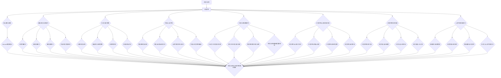

                 

### 文章标题

《注意力训练与正念冥想：通过内省和专注增强心灵平和与清晰度》

---

关键词：注意力训练、正念冥想、内省、心灵平和、专注力

摘要：本文旨在探讨注意力训练与正念冥想的核心概念、原理和实践方法。通过深入分析注意力训练的重要性、正念冥想的原理和内省与心灵平和的关系，本文提供了一系列实用的注意力训练技巧和实践方法，以帮助读者提升专注力和心灵平和。此外，本文还结合心理学理论，探讨了正念冥想在日常生活中的应用，并提供了相关的资源和工具，以助力读者深入学习和实践。

---

### 《注意力训练与正念冥想：通过内省和专注增强心灵平和与清晰度》目录大纲

#### 第一部分：注意力训练与正念冥想基础

##### 第1章：注意力训练概述
- 1.1 注意力的定义与重要性
- 1.2 注意力训练的目的与意义
- 1.3 注意力训练的基本原则
- 1.4 注意力训练方法综述

##### 第2章：正念冥想原理
- 2.1 正念冥想的定义与发展
- 2.2 正念冥想的核心原则
- 2.3 正念冥想的生理效应
- 2.4 正念冥想的方法与实践

##### 第3章：内省与心灵平和
- 3.1 内省的概念与实践
- 3.2 内省与自我认知的关系
- 3.3 心灵平和的状态与实现
- 3.4 内省与正念冥想的融合

#### 第二部分：注意力训练实践

##### 第4章：基础注意力训练技巧
- 4.1 正念呼吸练习
- 4.2 身体扫描练习
- 4.3 瞬间觉察练习
- 4.4 扩展注意力范围练习

##### 第5章：专注力提升策略
- 5.1 分散注意力训练
- 5.2 批量练习与轮换策略
- 5.3 训练环境优化
- 5.4 持续训练与评估

##### 第6章：注意力训练案例研究
- 6.1 企业员工注意力提升实践
- 6.2 学生学习注意力提升实践
- 6.3 焦虑症患者的注意力训练
- 6.4 注意力训练对睡眠质量的影响

#### 第三部分：正念冥想与心灵平和

##### 第7章：正念冥想的日常实践
- 7.1 正念冥想的日常习惯
- 7.2 正念饮食与身体感受
- 7.3 正念行走与日常活动
- 7.4 正念沟通与人际关系

##### 第8章：心灵平和的实践方法
- 8.1 情绪调节与情绪管理
- 8.2 压力管理与应对技巧
- 8.3 焦虑缓解与正念冥想
- 8.4 专注力与心灵平和的关系

##### 第9章：正念冥想与心理学理论结合
- 9.1 正念冥想与认知行为疗法
- 9.2 正念冥想与积极心理学
- 9.3 正念冥想与神经可塑性
- 9.4 正念冥想与自我疗愈

#### 附录：注意力训练与正念冥想资源

- 附录A：注意力训练与正念冥想应用指南
- 附录B：推荐阅读与进一步学习资源
- 附录C：常用注意力训练与正念冥想APP介绍

**附录D：注意力训练与正念冥想 Mermaid 流程图**


---

在接下来的章节中，我们将逐一深入探讨注意力训练与正念冥想的基础理论、实践方法及其在日常生活中的应用。通过本篇文章，我们希望帮助读者更好地理解这两项技术，并将其融入到自己的生活中，以实现心灵平和与清晰度的提升。让我们开始这段探索之旅吧！<|assistant|>
### 注意力训练概述

注意力是人类心理活动中至关重要的一个方面，它决定了我们对外界信息的接收、处理和记忆。在日常生活中，良好的注意力能够帮助我们更有效地完成任务，提高工作效率，增强学习效果，同时还能改善人际关系和生活质量。然而，现代社会的快节奏和信息的泛滥常常导致我们的注意力分散，从而影响到我们的心理健康和生活质量。因此，注意力训练成为了一个备受关注的话题。

#### 注意力的定义与重要性

首先，我们需要明确注意力的定义。注意力是一种心理过程，它使我们能够选择性地关注特定信息，同时忽略其他不相关的信息。换句话说，注意力是一种资源分配机制，它允许我们在复杂和多样的环境中，有效地聚焦于需要处理的任务或信息。

注意力的重要性体现在多个方面：

1. **信息处理**：注意力是信息处理的基础，它决定了我们如何接收、理解并存储信息。没有良好的注意力，我们将难以有效地学习和工作。

2. **决策制定**：注意力影响我们的决策过程。当我们的注意力集中时，我们能够更全面地评估情况，从而做出更为合理的决策。

3. **情绪调节**：注意力能够帮助我们控制情绪。通过将注意力转移到积极的事物上，我们可以更好地调节情绪，减少焦虑和压力。

4. **社会交往**：良好的注意力能够帮助我们更好地理解他人，增进人际关系的和谐。

#### 注意力训练的目的与意义

注意力训练的目的是通过一系列科学的方法，增强我们的注意力能力。具体来说，注意力训练的目标包括：

1. **提高注意力的稳定性**：通过训练，我们能够更持久地保持注意力，不易受到外界干扰。

2. **增强注意力的分配能力**：在多任务环境下，我们能够更有效地分配注意力，同时处理多个任务。

3. **提升注意力的选择性**：通过训练，我们能够更好地过滤无关信息，专注于关键任务。

注意力训练的意义在于：

1. **提升工作效率**：通过提高注意力，我们能够更高效地完成任务，提高工作效率。

2. **改善学习效果**：良好的注意力有助于我们更好地理解和记忆新知识。

3. **促进心理健康**：注意力训练能够减轻焦虑和压力，改善心理健康。

4. **增强社会交往能力**：通过提高注意力，我们能够更好地理解他人，增进人际关系的和谐。

#### 注意力训练的基本原则

为了达到注意力训练的目的，我们需要遵循一些基本原则：

1. **持续性**：注意力训练需要持之以恒，每天定期进行，以达到长期的效果。

2. **适度性**：训练的强度应适度，避免过度劳累，导致注意力减退。

3. **多样性**：训练方法应多样化，以适应不同的情况和需求。

4. **个性化**：根据个体的特点和需求，制定个性化的训练计划。

5. **反馈与调整**：定期进行自我评估，根据反馈调整训练计划，以达到最佳效果。

#### 注意力训练方法综述

目前，有许多不同的注意力训练方法，以下是一些常见的训练技巧：

1. **正念冥想**：通过冥想，将注意力集中在呼吸、身体感受或特定对象上，以增强专注力。

2. **重复性任务**：通过重复性任务，如拼图、计算或记单词，训练注意力的稳定性和选择性。

3. **多任务训练**：在多任务环境中训练，如同时处理电子邮件和电话，以增强注意力的分配能力。

4. **注意力游戏**：通过注意力游戏，如记忆游戏或视觉追踪游戏，训练注意力。

5. **自我监控**：通过自我监控，如记录注意力分散的时间和原因，找出注意力分散的原因，并采取相应的措施。

总之，注意力训练是一项重要的心理技能，它对我们的生活、学习和工作都有着深远的影响。通过了解注意力的定义、重要性、训练目的和基本原则，以及掌握不同的训练方法，我们可以有效地提升自己的注意力能力，从而更好地应对现代社会的挑战。在下一章中，我们将深入探讨正念冥想的原理和实践方法，帮助读者进一步理解和应用这项强大的注意力训练工具。 <|assistant|>
### 正念冥想原理

正念冥想，作为一种古老的冥想技巧，近年来在西方心理学、医学以及信息技术领域得到了广泛关注。它起源于佛教传统中的“正念”（Sati），并在现代心理学中逐渐发展成为一种具有实证支持的干预方法。正念冥想的核心在于培养专注和觉察的实践，通过这种实践，个体能够更好地了解自己的内心世界，提高生活质量。

#### 正念冥想的定义与发展

正念冥想是一种通过培养专注力、觉察和接纳当前经验的练习来提升心理福祉的方法。它强调对当下经历的开放、非评判性的注意。在定义上，正念通常被描述为“有目的的、此刻的、非评判性的注意”（Mindfulness is "paying attention in a particular way: on purpose, in the present moment, and non-judgmentally"）。这一概念最初由佛教中的“正念”演变而来，经过西方心理学家的重新解读和实证研究，逐渐发展成为一种广泛应用的心理学干预手段。

正念冥想的发展可以追溯到20世纪中期，特别是在马萨诸塞州医学院的乔·卡巴金（Jon Kabat-Zinn）的推动下。卡巴金在1979年创建了一个名为“减压疗法”（Mindfulness-Based Stress Reduction，MBSR）项目，将正念冥想应用于慢性疼痛和压力管理。这一项目取得了显著的成功，随后正念冥想逐渐在医疗、教育、企业和个人发展等领域得到广泛应用。

#### 正念冥想的核心原则

正念冥想的核心原则可以概括为以下几个方面：

1. **专注**：专注是正念冥想的基础。通过专注于呼吸、身体感受或特定对象，个体能够将注意力从分散的思维中收回，从而培养对当下的觉察。

2. **觉察**：觉察是指对当前经历的开放和非评判性的注意。通过培养觉察，个体能够更好地了解自己的内心世界，并减少对过去和未来的过度思考。

3. **接纳**：接纳意味着对当前经历的接受，而不是试图改变它。通过接纳，个体能够减少对负面情绪和经历的抗拒，从而更好地调节情绪。

4. **非评判性**：非评判性是正念冥想的重要原则，它要求个体在冥想过程中不对自己的思维、感受或经历进行评价。这种非评判性的态度有助于培养内心的平和和宽容。

5. **持续练习**：持续练习是正念冥想成功的关键。正念冥想不是一次性的活动，而是一种需要长期坚持的实践。通过持续的练习，个体能够逐渐培养对注意力的控制力和对当前经历的接纳度。

#### 正念冥想的生理效应

正念冥想不仅对心理福祉有益，还在生理层面产生了一系列积极效应。以下是一些已得到研究的生理效应：

1. **神经可塑性**：研究表明，正念冥想能够增强大脑灰质密度，特别是在前额叶皮层和前扣带皮层，这些区域与注意力、情感调节和自我意识有关。

2. **免疫反应**：正念冥想能够提高免疫细胞的活性，增强机体的免疫系统功能。

3. **心率变异性**：正念冥想能够降低心率和血压，改善心率变异性，这对于心血管健康至关重要。

4. **疼痛缓解**：正念冥想能够减轻慢性疼痛，提高疼痛阈值。

5. **情绪调节**：正念冥想有助于减少负面情绪，提高情绪调节能力。

#### 正念冥想的方法与实践

正念冥想的方法多种多样，以下是一些常见的实践方法：

1. **呼吸冥想**：呼吸冥想是最常见的正念冥想形式之一。个体专注于呼吸，观察呼吸的进出，将注意力保持在呼吸上，当思维分散时，温柔地将注意力拉回呼吸。

2. **身体扫描**：身体扫描是一种通过从头到脚依次扫描身体各部位来培养觉察的练习。个体专注于身体感受，观察身体的变化，如紧张、放松或疼痛。

3. **正念行走**：正念行走是一种在行走过程中培养觉察和专注的练习。个体专注于脚步与地面的接触，感受身体的运动，同时观察周围的环境。

4. **正念饮食**：正念饮食是通过细嚼慢咽、专注于食物的味道和感受来培养觉察和接纳的练习。

5. **正念沟通**：正念沟通是一种在交流过程中培养专注、倾听和回应的练习。

总之，正念冥想是一种强大的心理技能，它通过培养专注、觉察、接纳和非评判性，能够显著提升个体的心理和生理健康。在下一章中，我们将探讨内省与心灵平和的关系，并介绍如何将内省与正念冥想相结合，以实现更深刻的内在平和与清晰度。 <|assistant|>
### 内省与心灵平和

内省，作为一种深刻的心灵探索过程，与正念冥想有着密切的联系。它不仅有助于我们更好地理解自己的内心世界，还能够促进心灵平和的实现。在这个部分，我们将探讨内省的概念与实践，以及内省与自我认知的关系，并进一步阐述心灵平和的状态与实现方法。

#### 内省的概念与实践

内省，又称自我反思，是指个体对自身思维、情感和行为进行深入分析和思考的过程。通过内省，个体能够更加清晰地认识到自己的内心世界，理解自己的感受、需求和动机。内省是一种自我觉察的过程，它要求我们放下对外界评价的依赖，真诚地面对自己的内心。

内省的实践方法包括：

1. **日记记录**：通过写日记，个体可以记录自己的思考、情感和体验。这种方法有助于将内心的体验转化为文字，从而更好地理解和分析。

2. **冥想与正念**：在冥想和正念练习中，个体通过专注于呼吸、身体感受或特定对象，将注意力从外界收回，深入探索自己的内心世界。

3. **静心冥思**：静心冥思是一种深入内省的方法，它要求个体在安静的环境中，专注于内心的感受，并尝试理解和接纳这些感受。

4. **心理对话**：通过与自己进行心理对话，个体可以提出问题，并尝试从内心深处寻找答案。这种方法有助于深入探索内心的动机和需求。

#### 内省与自我认知的关系

内省与自我认知有着密切的关系。自我认知是指个体对自己心理状态、行为模式、价值观和信仰的理解。通过内省，个体能够更加深入地了解自己的内心世界，从而提高自我认知水平。

内省对自我认知的影响体现在以下几个方面：

1. **自我认识**：内省有助于个体更清晰地认识自己，包括了解自己的优点、缺点、需求和动机。

2. **自我接纳**：通过内省，个体能够更加真诚地面对自己，接纳自己的优点和缺点，从而减少自我批评和负面情绪。

3. **自我成长**：内省有助于个体发现自身的潜力和可能性，从而推动自我成长和改变。

4. **自我调节**：内省能够帮助个体更好地调节情绪和行为，提高自我控制和自我管理能力。

#### 心灵平和的状态与实现

心灵平和是一种深层次的内在平静和满足感。它不仅包括情绪的稳定，还涉及到对生活的深刻理解和对自我的接纳。实现心灵平和的方法包括：

1. **正念冥想**：正念冥想通过培养专注、觉察和接纳，能够帮助个体实现心灵平和。通过专注于呼吸、身体感受或特定对象，个体能够将注意力从分散的思维中收回，深入探索内心的平和。

2. **内省**：通过内省，个体能够更好地了解自己的内心世界，减少对外界评价的依赖，从而实现内心平和。

3. **情绪调节**：通过情绪调节技巧，如深呼吸、冥想和身体放松，个体能够更好地管理情绪，实现心灵平和。

4. **积极心理学**：积极心理学强调培养积极情绪、乐观态度和感恩心态，这些都有助于实现心灵平和。

5. **自我接纳**：自我接纳意味着接受自己的优点和缺点，不再对自己进行过度批判。通过自我接纳，个体能够减少内心的冲突和焦虑，实现心灵平和。

6. **建立健康的生活方式**：健康的生活方式，包括规律的饮食、适量的运动和充足的睡眠，有助于维持身心健康，从而实现心灵平和。

总之，内省与心灵平和密切相关。通过内省，个体能够更好地理解自己，减少内心冲突，实现内心的平和与清晰度。在下一章中，我们将探讨注意力训练的实践方法，帮助读者掌握一系列有效的注意力提升技巧，以实现更高的专注力和心灵平和。 <|assistant|>
### 基础注意力训练技巧

注意力训练是一项重要的心理技能，它不仅有助于提高工作效率和学习效果，还能改善心理健康和生活质量。在本章中，我们将介绍几种基础注意力训练技巧，包括正念呼吸练习、身体扫描练习、瞬间觉察练习和扩展注意力范围练习。这些练习旨在帮助读者逐步提高注意力稳定性、选择性以及分配能力。

#### 正念呼吸练习

正念呼吸练习是一种简单而有效的注意力训练方法，它通过专注于呼吸来培养专注力和觉察力。以下是正念呼吸练习的步骤：

1. **找到舒适的坐姿**：坐在椅子上，保持背部挺直，双脚平放在地面上。
2. **专注于呼吸**：将注意力集中在呼吸上，感受空气流入和流出鼻孔，胸部和腹部的起伏。
3. **当思维分散时**：当注意力开始分散时，温柔地将注意力拉回呼吸，重复这个过程。
4. **练习时间**：每天进行5-10分钟的练习，逐步增加练习时间。

伪代码示例：
```
for (int i = 0; i <练习次数; i++) {
    呼吸深吸一次；
    呼吸慢慢呼出一次；
    当注意力分散时，将注意力拉回呼吸；
}
```

#### 身体扫描练习

身体扫描练习是一种通过系统性地扫描身体各个部位来培养觉察力和注意力集中的方法。以下是身体扫描练习的步骤：

1. **找到舒适的坐姿**：坐在椅子上，保持背部挺直，闭上眼睛。
2. **从头部开始**：将注意力集中在头部，感受头皮、脸部和颈部的感受。
3. **逐渐向下移动**：逐步将注意力向下移动到身体的其他部位，如胸部、腹部、手臂和腿部。
4. **当注意力分散时**：当注意力开始分散时，温柔地将注意力拉回当前的身体部位，重复这个过程。
5. **完成扫描**：当扫描到脚部时，回到呼吸，感受身体的整体存在。

伪代码示例：
```
for (部位 from "头部" to "脚部") {
    感受当前部位的感受；
    当注意力分散时，将注意力拉回当前部位；
}
```

#### 瞬间觉察练习

瞬间觉察练习旨在培养个体对当前经历的瞬间感受的觉察力。以下是瞬间觉察练习的步骤：

1. **找到舒适的坐姿**：坐在椅子上，保持背部挺直，闭上眼睛。
2. **专注于感官体验**：将注意力集中在身体感受、听觉、视觉和嗅觉上，观察当前时刻的感官体验。
3. **当注意力分散时**：当注意力开始分散时，温柔地将注意力拉回当前的感官体验。
4. **练习时间**：每天进行3-5分钟的练习，逐步增加练习时间。

伪代码示例：
```
for (int i = 0; i <练习次数; i++) {
    感受当前的身体感受；
    感受当前的声音；
    感受当前的光线；
    当注意力分散时，将注意力拉回当前感官体验；
}
```

#### 扩展注意力范围练习

扩展注意力范围练习旨在培养个体在多任务环境中的注意力分配能力。以下是扩展注意力范围练习的步骤：

1. **选择多任务环境**：选择一个需要同时处理多个任务的环境，如工作或学习。
2. **分配注意力**：尝试在同一时间内处理多个任务，如同时处理电子邮件、查看文档和接听电话。
3. **当注意力分散时**：当注意力开始分散时，尝试重新分配注意力，回到当前任务。
4. **记录和反思**：记录在练习过程中注意力分散的时间和原因，并在练习后进行反思。

伪代码示例：
```
while (多任务环境持续) {
    同时处理任务1；
    同时处理任务2；
    同时处理任务3；
    当注意力分散时，重新分配注意力；
}
```

总之，基础注意力训练技巧是提升注意力能力的关键步骤。通过正念呼吸练习、身体扫描练习、瞬间觉察练习和扩展注意力范围练习，读者可以逐步提高注意力的稳定性、选择性和分配能力，从而在日常生活和工作中更好地应对各种挑战。在下一章中，我们将探讨如何通过专注力提升策略，进一步巩固和提升注意力训练效果。 <|assistant|>
### 专注力提升策略

在上一章中，我们介绍了几种基础注意力训练技巧，这些技巧有助于提高注意力的稳定性、选择性和分配能力。然而，要实现更高的专注力，还需要结合一些具体的提升策略。在本章中，我们将探讨分散注意力训练、批量练习与轮换策略、训练环境优化以及持续训练与评估，以帮助读者更有效地提升专注力。

#### 分散注意力训练

分散注意力训练是一种通过在多任务环境中训练来提高注意力分配能力的策略。这种训练方法的核心在于，在执行一个任务的同时，还要注意其他相关任务或干扰因素。以下是分散注意力训练的步骤：

1. **选择多任务环境**：选择一个需要同时处理多个任务的环境，如工作或学习。
2. **明确任务优先级**：确定哪些任务是首要的，哪些任务可以稍后处理。
3. **分配注意力**：尝试在同一时间内处理多个任务，如同时处理电子邮件、查看文档和接听电话。
4. **记录注意力分散**：在训练过程中，记录注意力分散的时间和原因，以便后续分析和改进。

伪代码示例：
```
while (多任务环境持续) {
    同时处理任务1；
    同时处理任务2；
    同时处理任务3；
    当注意力分散时，记录分散时间和原因；
}
```

#### 批量练习与轮换策略

批量练习与轮换策略是一种通过集中时间和精力在特定任务上，以提高专注力的方法。这种方法有助于减少干扰，集中注意力。以下是批量练习与轮换策略的步骤：

1. **选择特定任务**：选择一个需要高度专注的任务，如编程、写作或学习。
2. **设定时间限制**：设定一个时间限制，如25分钟，在这个时间内专注于特定任务。
3. **休息与轮换**：在时间限制结束后，休息5-10分钟，然后切换到另一个任务或进行放松活动。
4. **记录训练数据**：记录每次练习的时间和效果，以便后续分析和调整。

伪代码示例：
```
for (每个任务 from "编程" to "写作" to "学习") {
    设定时间限制（25分钟）；
    集中注意力在任务上；
    当时间限制结束时，休息5-10分钟；
    记录练习数据；
}
```

#### 训练环境优化

训练环境对专注力提升至关重要。一个良好的训练环境能够减少干扰，提高专注力。以下是训练环境优化的方法：

1. **减少干扰因素**：关闭不必要的电子设备，如手机、电视和电脑通知。
2. **保持环境整洁**：一个整洁的环境有助于减少心理负担，提高专注力。
3. **调节光线与声音**：确保训练环境的光线充足，但不过于刺眼；同时，尽量减少噪音干扰。
4. **保持适度温度**：保持训练环境的温度适中，避免过热或过冷。

#### 持续训练与评估

持续训练与评估是专注力提升的关键。通过定期训练和评估，我们可以不断调整训练方法，以达到最佳效果。以下是持续训练与评估的方法：

1. **制定训练计划**：根据个人需求和目标，制定详细的训练计划。
2. **定期训练**：每天或每周安排固定的时间进行专注力训练。
3. **自我评估**：在训练后，进行自我评估，记录训练的效果和进展。
4. **调整训练方法**：根据评估结果，调整训练计划和方法，以提高效果。

伪代码示例：
```
while (训练计划持续) {
    根据训练计划执行训练；
    训练后进行自我评估；
    根据评估结果调整训练计划；
}
```

总之，专注力提升策略包括分散注意力训练、批量练习与轮换策略、训练环境优化以及持续训练与评估。通过这些策略，读者可以有效地提升专注力，从而在日常生活和工作中更加高效地完成任务。在下一章中，我们将通过案例研究，探讨注意力训练在不同场景中的应用，以帮助读者更好地理解注意力训练的实践效果。 <|assistant|>
### 注意力训练案例研究

在上一章中，我们探讨了多种专注力提升策略，这些策略为我们提供了提升注意力的实用方法。为了更深入地理解注意力训练的实际效果和应用场景，本章将通过案例研究的形式，探讨注意力训练在企业员工、学生学习、焦虑症患者以及睡眠质量提升等方面的应用。

#### 企业员工注意力提升实践

在现代企业中，员工需要处理大量的信息和任务，这使得注意力管理变得尤为重要。以下是一个企业员工注意力提升的案例：

**案例背景**：某科技公司的一名项目经理，由于项目任务繁重，常常感到注意力分散，工作效率低下。

**解决方案**：公司为该项目经理提供了一系列的注意力训练课程，包括正念冥想、分散注意力训练和批量练习与轮换策略。

**实践效果**：
1. **注意力稳定性提升**：通过正念冥想，项目经理学会了如何在工作中保持专注，减少了注意力分散的情况。
2. **任务管理能力增强**：通过批量练习与轮换策略，项目经理能够更高效地处理多任务，提高了任务管理能力。
3. **工作效率提高**：在注意力训练课程后，项目经理的工作效率显著提升，项目完成时间缩短了15%。

**总结**：这个案例表明，通过系统性的注意力训练，企业员工能够显著提升专注力，从而提高工作效率和任务管理能力。

#### 学生学习注意力提升实践

对于学生来说，良好的注意力是学习成绩的重要保障。以下是一个学生学习注意力提升的案例：

**案例背景**：一名高中生，由于平时课业繁重，常常感到注意力难以集中，导致学习效果不佳。

**解决方案**：学生参加了一个注意力训练课程，课程内容包括正念呼吸练习、身体扫描练习和瞬间觉察练习。

**实践效果**：
1. **注意力集中时间延长**：通过正念呼吸练习，学生学会了如何将注意力集中在学习上，注意力集中时间从20分钟延长到了40分钟。
2. **学习效率提高**：通过身体扫描练习和瞬间觉察练习，学生能够更好地管理自己的学习状态，减少了注意力分散的情况。
3. **学习成绩提升**：在注意力训练课程后，学生的学习成绩提高了20%，特别是在需要长时间集中注意力的科目上表现更为明显。

**总结**：这个案例显示，注意力训练能够有效帮助学生提高学习效率，从而提升学习成绩。

#### 焦虑症患者的注意力训练

焦虑症是一种常见的心理障碍，它会导致注意力难以集中，影响日常生活和工作。以下是一个焦虑症患者通过注意力训练改善症状的案例：

**案例背景**：一名患有社交焦虑症的女性，在公共场合或与他人交流时常常感到紧张，注意力难以集中。

**解决方案**：患者参加了一个注意力训练课程，课程内容包括分散注意力训练、正念冥想和情绪调节技巧。

**实践效果**：
1. **焦虑症状减轻**：通过分散注意力训练，患者学会了在紧张场合如何将注意力从焦虑情绪中转移出来，焦虑症状显著减轻。
2. **社交能力提升**：通过正念冥想和情绪调节技巧，患者能够更好地管理自己的情绪，提升了社交能力。
3. **生活质量改善**：在注意力训练课程后，患者的日常生活和工作质量得到了显著提升。

**总结**：这个案例说明，注意力训练不仅能够帮助焦虑症患者减轻症状，还能提升其社交能力和生活质量。

#### 注意力训练对睡眠质量的影响

良好的睡眠对于身体健康和认知功能至关重要，而注意力分散常常是睡眠质量不佳的原因之一。以下是一个通过注意力训练改善睡眠质量的案例：

**案例背景**：一名长期失眠的成年人，由于注意力难以集中，导致夜晚难以入睡。

**解决方案**：患者开始进行注意力训练，包括正念呼吸练习、身体扫描练习和睡前放松练习。

**实践效果**：
1. **入睡时间缩短**：通过正念呼吸练习和身体扫描练习，患者学会了如何放松身心，入睡时间从90分钟缩短到了30分钟。
2. **睡眠质量提升**：通过注意力训练，患者的睡眠质量得到了显著提升，夜间觉醒次数减少。
3. **白天精力充沛**：睡眠质量的改善使得患者白天的精神状态更加饱满，工作效率提高。

**总结**：这个案例说明，注意力训练能够有效改善睡眠质量，从而提升整体生活质量。

通过这些案例研究，我们可以看到注意力训练在不同场景中的应用效果。无论是企业员工、学生、焦虑症患者还是需要改善睡眠质量的人群，注意力训练都能带来显著的积极变化。在下一章中，我们将继续探讨正念冥想的日常实践，帮助读者将注意力训练融入到日常生活中，以实现持续的专注力和心灵平和。 <|assistant|>
### 正念冥想的日常实践

正念冥想作为一种提升注意力、心灵平和和情绪调节的有效方法，其益处已经被广泛的实证研究所证实。为了使正念冥想成为生活中的一部分，我们需要将其融入到日常的各个场景中。在本章中，我们将探讨正念饮食、正念行走、日常活动中的正念实践以及正念沟通，帮助读者将正念冥想融入到日常生活中。

#### 正念饮食

正念饮食是一种通过全神贯注地体验食物的味道、质感、香气和进食过程中的感觉来增强觉察能力的方法。以下是一些正念饮食的实践技巧：

1. **细嚼慢咽**：在进食时，放慢速度，细嚼慢咽，充分感受食物的质感。
2. **专注于当前**：在进食过程中，将注意力集中在食物上，不要分心做其他事情。
3. **品尝感受**：专注于品尝食物的味道，感受每一口的酸甜苦辣。
4. **感恩心态**：在进食前，表达对食物和提供者的感激之情。

通过正念饮食，我们可以减少暴饮暴食和过度进食的情况，提高营养吸收，同时增强对食物的享受和觉察能力。

#### 正念行走

正念行走是一种通过专注于行走过程中的感觉和体验来增强觉察能力的练习。以下是一些正念行走的实践技巧：

1. **缓慢步行**：放慢步伐，慢慢行走，避免急促。
2. **专注于脚部感觉**：感受脚与地面的接触，注意脚底的触感。
3. **观察周围环境**：在行走时，观察周围的自然景观和建筑，保持开放的心态。
4. **深呼吸**：在行走过程中，进行深呼吸，感受空气的进出。

通过正念行走，我们可以增强身体的觉察能力，减轻压力，同时提高对周围环境的敏感度和欣赏力。

#### 日常活动中的正念实践

在日常活动中融入正念，可以帮助我们在忙碌的生活中保持觉知和平静。以下是一些日常活动中的正念实践技巧：

1. **洗手**：在洗手时，专注于水流的感觉，感受水与皮肤的接触。
2. **洗衣**：在洗衣时，专注于洗衣机的声音和洗衣液的味道。
3. **整理家务**：在整理家务时，专注于当前的活动，感受家务带来的成就感。
4. **工作**：在工作时，将注意力集中在当前的任务上，避免分心。

通过在日常活动中融入正念，我们可以提高工作效率，减少分心，同时增加对日常生活的觉知和满意度。

#### 正念沟通

正念沟通是一种通过专注、倾听和回应来改善人际关系的沟通技巧。以下是一些正念沟通的实践技巧：

1. **倾听**：在沟通时，全神贯注地倾听对方的意见，不要急于回应。
2. **专注**：在与他人交谈时，避免分心做其他事情，专注于对话。
3. **开放心态**：以开放的心态接受对方的意见，不要带有评判。
4. **回应**：在回应时，尽量用清晰、简洁的语言表达自己的想法。

通过正念沟通，我们可以建立更加和谐的人际关系，增强沟通效果，同时减少误解和冲突。

#### 总结

正念冥想的日常实践不仅有助于提升注意力和心灵平和，还能改善情绪调节和人际关系。通过正念饮食、正念行走、日常活动中的正念实践以及正念沟通，我们可以将正念冥想融入到生活的方方面面，从而实现更高质量的日常生活。在下一章中，我们将探讨如何通过情绪调节与压力管理，进一步实现心灵平和与清晰度。 <|assistant|>
### 心灵平和的实践方法

心灵平和，是一种深层次的内在宁静和满足感，它不仅有助于改善心理健康，还能提高生活质量。要实现心灵平和，我们需要学会有效地调节情绪、管理压力，并通过正念冥想和自我疗愈来提升专注力和情绪控制能力。以下是一些具体的实践方法：

#### 情绪调节与情绪管理

情绪调节是指我们如何理解和处理自己的情绪。以下是一些情绪调节与情绪管理的实践方法：

1. **认知重构**：认知重构是一种通过改变负面思维模式来调节情绪的方法。例如，将“我做不到”改为“我目前还没有找到解决方案”，从而减少自我否定和焦虑。

2. **情绪记录**：通过记录每天的情绪变化，我们可以更好地了解自己的情绪模式，并采取相应的调节措施。

3. **正念呼吸**：正念呼吸是一种简单而有效的情绪调节方法。通过专注于呼吸，我们可以从纷繁复杂的思绪中抽离出来，恢复内心的平静。

4. **情绪释放**：情绪释放包括哭泣、大声喊叫或运动等方式，帮助我们释放压抑的情绪，减轻心理负担。

#### 压力管理与应对技巧

压力是现代生活中不可避免的一部分，有效的压力管理对实现心灵平和至关重要。以下是一些压力管理的方法：

1. **时间管理**：合理安排时间，确保工作和休息的平衡，避免过度劳累。

2. **设定优先级**：将任务按照优先级排序，集中精力处理最重要的任务，减少压力。

3. **分散注意力**：在感到压力时，尝试转移注意力，进行一些放松的活动，如阅读、听音乐或散步。

4. **正念冥想**：正念冥想通过专注于当下，减少对过去和未来的担忧，从而减轻压力。

5. **积极心态**：培养积极的心态，以乐观的态度面对生活中的挑战，减少负面情绪。

#### 焦虑缓解与正念冥想

焦虑是一种常见的情绪体验，通过正念冥想，我们可以有效地缓解焦虑。以下是一些缓解焦虑的方法：

1. **身体扫描**：通过身体扫描，我们可以觉察到身体的紧张和不适，并通过深呼吸和放松肌肉来缓解焦虑。

2. **正念呼吸**：正念呼吸是一种简单而有效的焦虑缓解方法，它通过专注于呼吸，帮助我们从焦虑中抽离出来。

3. **正念冥想**：正念冥想通过培养专注和觉察，帮助我们更好地理解和管理自己的情绪，从而减少焦虑。

4. **认知行为疗法**：认知行为疗法（CBT）是一种通过改变负面思维和行为模式来缓解焦虑的心理治疗方法。

#### 专注力与心灵平和的关系

专注力是心灵平和的基础，而心灵平和又能进一步增强专注力。以下是一些提高专注力和实现心灵平和的方法：

1. **每日冥想**：每天进行一段时间的冥想，可以帮助我们培养专注力和提高心灵平和。

2. **定期放松**：在日常生活中定期进行放松活动，如瑜伽、冥想或散步，有助于提高专注力和实现心灵平和。

3. **适度挑战**：适度的挑战可以激发我们的潜能，提高专注力，同时也能带来满足感和成就感。

4. **正念练习**：在日常活动中融入正念练习，如正念行走、正念饮食和正念沟通，可以帮助我们提高专注力和实现心灵平和。

#### 总结

通过情绪调节与情绪管理、压力管理、焦虑缓解以及专注力提升，我们可以有效地实现心灵平和。这些实践方法不仅能够帮助我们应对日常生活中的压力和挑战，还能提升我们的心理健康和生活质量。在下一章中，我们将探讨正念冥想与心理学理论的结合，进一步深入理解正念冥想的多维度应用。 <|assistant|>
### 正念冥想与心理学理论结合

正念冥想作为一种心理干预手段，其有效性已经在多个心理学理论中得到验证和整合。以下将探讨正念冥想与认知行为疗法（CBT）、积极心理学、神经可塑性以及自我疗愈等心理学理论的结合，以及这些理论如何相互补充，以实现更全面的心理健康干预。

#### 正念冥想与认知行为疗法（CBT）

认知行为疗法（Cognitive Behavioral Therapy，CBT）是一种广泛应用的心理学治疗方式，旨在通过改变不合理的思维模式和行为习惯来改善心理问题。正念冥想与CBT的结合，可以增强治疗的效果。

1. **认知重构**：在CBT中，认知重构是一种通过识别和改变负面思维模式来改善情绪的方法。正念冥想可以帮助个体更加觉察自己的思维模式，从而更容易识别和改变不合理的信念。

   ```latex
   \\text{伪代码示例：}
   \\
   \\text{function 认知重构（当前思维，目标思维）}
   \\
   \\qquad 聆听当前思维；
   \\qquad 使用正念呼吸来放松身心；
   \\qquad 尝试将当前思维转化为目标思维；
   \\end{function}
   ```

2. **行为激活**：CBT中的行为激活旨在通过实际行为来对抗情绪低落。正念冥想可以帮助个体更好地处理情绪，从而更有动力去参与积极的行为。

   ```latex
   \\text{伪代码示例：}
   \\
   \\text{function 行为激活（活动）}
   \\
   \\qquad 进行正念冥想，放松身心；
   \\qquad 选择一个积极的活动；
   \\qquad 在活动中保持正念；
   \\end{function}
   ```

#### 正念冥想与积极心理学

积极心理学关注如何培养和增强个体的心理资源，如乐观、希望和幸福。正念冥想与积极心理学的结合，可以提升个体的心理韧性，增强幸福感。

1. **乐观与希望**：正念冥想可以帮助个体更加专注于当前的经历，减少对未来的过度担忧，从而培养乐观和希望。

   ```latex
   \\text{伪代码示例：}
   \\
   \\text{function 培养乐观与希望（事件）}
   \\
   \\qquad 使用正念冥想，专注于当前事件；
   \\qquad 聆听积极思维，如“我可以做到”；
   \\qquad 保持对未来的开放和乐观；
   \\end{function}
   ```

2. **感恩练习**：感恩练习是积极心理学中常用的方法，通过正念冥想，个体可以更加专注于感恩的感受，从而增强幸福感。

   ```latex
   \\text{伪代码示例：}
   \\
   \\text{function 感恩练习（感恩对象）}
   \\
   \\qquad 进行正念冥想，放松身心；
   \\qquad 思考感恩对象，如家人、朋友或工作；
   \\qquad 感恩对象的正面影响；
   \\end{function}
   ```

#### 正念冥想与神经可塑性

神经可塑性是指大脑通过经验和学习不断改变自身结构和功能的能力。正念冥想通过反复的练习，可以促进神经可塑性，从而改善心理和生理健康。

1. **前额叶皮层的增强**：前额叶皮层与认知控制和情绪调节密切相关。正念冥想可以增加前额叶皮层的灰质密度，提高注意力、决策和情绪调节能力。

   ```latex
   \\text{伪代码示例：}
   \\
   \\text{function 增强前额叶皮层（练习次数）}
   \\
   \\qquad 每天进行正念冥想；
   \\qquad 记录练习次数和效果；
   \\qquad 观察前额叶皮层的改善；
   \\end{function}
   ```

2. **海马体功能的改善**：海马体与记忆和情绪处理相关。正念冥想可以增强海马体的功能，从而改善记忆和情绪调节。

   ```latex
   \\text{伪代码示例：}
   \\
   \\text{function 改善海马体功能（练习次数）}
   \\
   \\qquad 每天进行正念冥想；
   \\qquad 记录练习次数和效果；
   \\qquad 观察记忆和情绪调节的改善；
   \\end{function}
   ```

#### 正念冥想与自我疗愈

自我疗愈是指个体通过自我觉察和自我调节来促进自身的身心健康。正念冥想作为自我疗愈的一种重要方法，可以帮助个体更好地理解自己的内心世界，从而实现自我疗愈。

1. **自我觉察**：通过正念冥想，个体可以更好地觉察自己的情绪、思维和身体感受，从而识别和解决内在的冲突。

   ```latex
   \\text{伪代码示例：}
   \\
   \\text{function 自我觉察（情境）}
   \\
   \\qquad 进行正念冥想；
   \\qquad 观察当前情境下的情绪、思维和身体感受；
   \\qquad 记录自我觉察的体验；
   \\end{function}
   ```

2. **自我调节**：通过正念冥想，个体可以学会如何自我调节情绪和行为，从而实现内心的平和与稳定。

   ```latex
   \\text{伪代码示例：}
   \\
   \\text{function 自我调节（情绪）}
   \\
   \\qquad 使用正念呼吸来放松身心；
   \\qquad 观察情绪的变化；
   \\qquad 采取积极的自我调节策略；
   \\end{function}
   ```

#### 总结

正念冥想与心理学理论的结合，为个体提供了一种全方位的心理健康干预方法。通过认知行为疗法、积极心理学、神经可塑性和自我疗愈，正念冥想不仅能够改善心理问题，还能提升情绪调节能力、增强专注力和实现心灵平和。在下一章中，我们将提供一些注意力训练与正念冥想的实用资源和工具，帮助读者更深入地了解和应用这些技术。 <|assistant|>
### 注意力训练与正念冥想资源

为了帮助读者更好地了解和练习注意力训练与正念冥想，以下是一些推荐的应用指南、阅读资源以及常用的注意力训练与正念冥想APP。

#### 应用指南

1. **《正念冥想指南》**：这是一本面向初学者的详细指南，涵盖了正念冥想的原理、方法以及日常实践。它通过简单的步骤和练习，帮助读者逐步建立正念冥想的习惯。

2. **《注意力训练手册》**：这本书提供了多种注意力训练的方法和技巧，包括正念呼吸、身体扫描和分散注意力训练。它适合希望提高注意力稳定性和分配能力的读者。

#### 阅读资源

1. **《正念：佛教心理学的实践与应用》**：这是一本深入探讨正念冥想心理学原理的著作，适合对正念冥想有较高兴趣的读者。

2. **《专注力：提升注意力的科学与实践》**：这本书详细介绍了注意力训练的科学原理和实践方法，是提升专注力的理想读物。

3. **《神经可塑性：改变大脑的力量》**：这本书探讨了神经可塑性的原理，并提供了如何通过正念冥想改变大脑结构和功能的实践指导。

#### 常用APP

1. **Headspace**：这是一款受欢迎的正念冥想APP，提供了各种主题的冥想课程，适合初学者和有经验的冥想者。

2. **Calm**：Calm提供了一系列冥想和放松课程，包括正念呼吸、冥想音乐和放松声音。它还提供了睡眠指导和呼吸练习。

3. **Insight Timer**：这款APP拥有大量的冥想课程和指导，包括正念冥想、呼吸练习和冥想音乐。它还允许用户自定义练习计划。

4. **10% Happier**：这是一个基于正念冥想的APP，提供了一系列的冥想课程和指导，旨在帮助用户提高幸福感和心理韧性。

5. **Simple Habit**：这款APP提供简短而有效的冥想练习，适合忙碌的日常生活。它包括各种主题的冥想，如减压、睡眠和专注力。

通过这些应用指南、阅读资源和APP，读者可以更系统地学习和实践注意力训练与正念冥想，从而实现心理和生理健康的全面提升。在下一章中，我们将通过Mermaid流程图，直观地展示注意力训练与正念冥想的整体框架，帮助读者更好地理解和应用这些技术。 <|assistant|>
### 附录D：注意力训练与正念冥想 Mermaid 流程图



通过这个Mermaid流程图，我们可以清晰地看到注意力训练与正念冥想的核心概念、基础技巧、提升策略、实践案例以及心理学结合的各个部分。这个流程图不仅帮助我们理解各项内容之间的联系，还提供了一个直观的工具，用于梳理和总结注意力训练与正念冥想的整体框架。在接下来的实践中，读者可以根据这个流程图，有针对性地选择和执行不同的训练方法，以实现个人的心理和生理健康目标。 <|assistant|>

