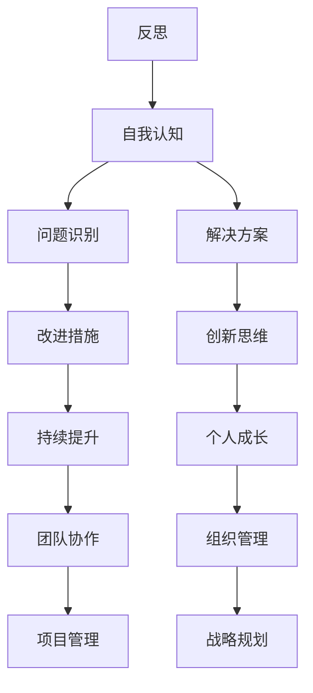

                 

### 文章标题

《洞见的力量：从反思到创新》

### 文章关键词

反思、创新、洞见、自我提升、团队合作、组织管理、技术博客

### 文章摘要

本文深入探讨了反思与创新之间的关系，阐述了反思在个人成长和团队协作中的重要性。通过分析反思的概念、方法与实践，以及创新的类型、方法和实践，本文旨在帮助读者理解洞见的力量，并掌握如何运用反思与创新来提升个人和组织的竞争力。文章通过实际项目和代码案例，展示了如何将理论知识应用于实际开发中，助力读者在技术和职业发展中实现自我超越。

---

# 《洞见的力量：从反思到创新》

## 第一部分：引入与概述

### 1.1 《洞见的力量：从反思到创新》简介

《洞见的力量：从反思到创新》是一本旨在帮助读者提升自我反思能力和创新思维的专业书籍。书名中的“洞见”指的是深刻的见解，这种见解不仅仅是对事物表面现象的理解，而是能够洞察到本质和内在规律的能力。而“力量”则强调了这种洞见带来的影响力，它可以推动个人成长、团队协作和组织变革。

本书围绕“反思”和“创新”两个核心概念展开，通过详细的阐述和实例分析，帮助读者理解反思的内涵、意义以及如何通过反思来提升自我认知和发现问题的能力。同时，书中探讨了创新的类型、方法和实践，展示了如何基于反思提出新的想法和解决方案，从而推动技术和商业的进步。

从反思到创新，这是一个螺旋上升的过程。反思是创新的基石，它能够帮助我们发现问题、理解问题，并找到改进的方向。而创新则是反思的必然结果，它将反思中的洞见转化为具体的行动和成果。本书的目标是引导读者在这个过程中发挥自己的潜能，不断突破自我，实现个人和组织的成长。

### 1.2 本书目的与结构

本书的目的是通过深入探讨反思和创新的重要性，提供一系列实用的方法和工具，帮助读者在日常生活和工作中提升自我反思能力，培养创新思维，最终实现个人和组织的跨越式发展。

为了实现这一目标，本书分为以下几个部分：

1. **第一部分：引入与概述**：介绍本书的主题和目的，概述反思和创新的概念，以及它们在个人成长和组织发展中的重要性。

2. **第二部分：反思的力量**：详细探讨反思的概念、意义、方法和实践，包括反思日志、自我提问、反思时间和反思会议等具体方法，帮助读者培养反思的习惯，提升自我认知。

3. **第三部分：创新的实践**：分析创新的定义、类型和方法，包括脑storming、设计思维等创新工具，以及如何通过创新实验室和竞赛来推动创新实践。

4. **第四部分：洞见的运用**：探讨洞见在个人成长、团队合作和组织管理中的应用，展示如何将反思和创新的洞见转化为实际行动，提升个人和组织的竞争力。

5. **第五部分：总结与展望**：总结本书的主要内容，展望反思和创新在未来的发展趋势，鼓励读者持续提升自我，迎接新的挑战。

通过本书的阅读，读者将能够更深刻地理解反思和创新的重要性，掌握相关的理论和实践方法，从而在个人成长和职业发展中取得更大的成就。

## 第二部分：反思的力量

### 2.1 反思的概念与意义

#### 2.1.1 反思的定义

反思，顾名思义，是对自身思想、行为和经验进行深入思考的过程。这种思考不仅仅是回顾和总结，更是对内在动机、外在表现以及事件背景的全面审视。反思是一个复杂的认知过程，涉及到自我意识的觉醒、情感的反思、行为的检视和认知的调整。

在个人层面，反思可以帮助我们更好地理解自己。通过反思，我们可以发现自己行为背后的动机，了解自己的情感反应，认识到自己在特定情境中的表现。这种自我认知的提升有助于我们识别自己的优势和不足，从而为个人成长提供方向。

在组织层面，反思同样至关重要。一个团队或组织在面对挑战和变革时，需要通过反思来评估过去的决策和行为，识别成功的因素和失败的教训。这种反思可以帮助组织不断优化管理流程，提高工作效率，增强团队凝聚力。

#### 2.1.2 反思的意义

反思具有多重意义，主要体现在以下几个方面：

1. **提升自我认知**：反思使我们能够深入挖掘内心世界，理解自己的行为和情感。这种自我认知有助于我们更好地应对生活中的挑战，提升自信心和自尊心。

2. **促进个人成长**：通过反思，我们可以识别自己的不足，并寻找改进的方法。这种自我提升的过程是个人成长的重要动力，可以帮助我们不断突破自我，实现自我超越。

3. **团队协作**：反思不仅有助于个人成长，还可以促进团队协作。在一个团队中，成员之间的反思可以增进彼此的理解和信任，减少冲突，提高团队效率。

4. **组织管理**：在组织层面，反思是一种有效的管理工具。通过反思，组织可以评估自身的战略、流程和绩效，发现存在的问题，制定改进计划，实现持续改进。

5. **创新思维**：反思是创新思维的重要来源。通过反思过去的经验和失败，我们可以获得新的见解和灵感，从而推动创新，实现技术和管理上的突破。

总之，反思不仅是一种自我审视的过程，更是一种能力，它能够帮助我们更好地理解自己和他人，提升个人和组织的竞争力。在接下来的章节中，我们将进一步探讨反思的方法和实践，帮助读者掌握如何进行有效的反思。

### 2.2 反思的方法

#### 2.2.1 反思日志

反思日志是记录反思过程的一种工具，它可以帮助我们系统性地整理和回顾自己的思考，从而提升反思效果。编写反思日志的方法多种多样，以下是一些常见的步骤和技巧：

1. **设定记录频率**：首先，确定反思日志的记录频率。根据个人习惯和时间安排，可以选择每天、每周或每月进行一次反思。设定频率有助于建立反思的习惯，确保反思的连续性和系统性。

2. **选择合适的时间**：选择一个安静、无干扰的时间进行反思日志的记录。例如，可以在一天结束前或早晨开始时进行反思，这样可以将前一日的经验和当天的计划进行梳理。

3. **记录具体事件**：在日志中详细记录反思的具体事件，包括事件发生的背景、自己的行为和反应、事件的结果以及自己的感受。具体的事件描述有助于我们更深入地分析问题，找出反思的重点。

4. **提出问题**：在日志中提出与事件相关的问题，这些问题可以帮助我们深入思考。例如，“我在这个事件中表现如何？”“我是否达到了自己的目标？”“我学到了什么？”等。

5. **分析原因和影响**：针对事件，分析其背后的原因和影响。例如，探讨事件发生的原因是否是我们缺乏某种技能或知识，或者是否是外部环境的影响。同时，思考事件对我们个人和团队的影响，以及如何改进。

6. **制定行动计划**：根据反思结果，制定具体的行动计划。例如，如果发现自己在某个领域存在不足，可以制定一个学习计划，以提升相关技能。行动计划有助于将反思转化为实际的行动，推动个人和团队的发展。

7. **回顾与更新**：定期回顾和更新反思日志，以便跟踪反思的效果和进展。通过回顾，我们可以评估之前的反思和行动计划是否有效，并根据实际情况进行调整。

#### 例子

以下是一个简单的反思日志示例：

**日期：2023年10月10日**

**事件**：在昨天的项目会议上，我被分配到一个新的任务，负责设计和实施一个用户反馈系统。

**行为和反应**：我感到有些紧张，因为我之前没有负责过类似的项目。我尝试与团队成员沟通，了解他们的经验和建议。

**结果**：会议结束后，我收集了团队成员的建议，并开始制定初步的计划。

**感受**：感到有些焦虑，但同时也觉得这是一个学习和成长的机会。

**问题**：我是否具备完成这个任务所需的所有技能和知识？

**原因和影响**：我认为缺乏相关经验是导致焦虑的主要原因。这个任务对我个人和团队都有很大的影响，因为它关系到用户反馈系统的质量和用户体验。

**行动计划**：制定一个详细的学习计划，包括阅读相关资料、参加培训课程和寻求专家建议。

通过这样的反思日志，我们可以更清晰地看到自己的行为、问题和解决方案，从而提高反思的深度和效果。

#### 2.2.2 自我提问

自我提问是一种通过提出问题来引导反思的方法。这种方法可以帮助我们深入思考，揭示问题的本质，并找到改进的方向。以下是一些自我提问的技巧：

1. **开放式问题**：使用开放式问题，例如“为什么”、“什么”、“如何”等问题，引导自己深入思考。例如，“为什么我会在这个任务中感到紧张？”“我如何改进我的沟通技巧？”等。

2. **具体性问题**：针对具体事件或行为，提出具体的问题。例如，“我在这次会议中的表现有哪些不足？”“我如何提高我的项目规划能力？”等。

3. **对比性问题**：通过对比过去和现在的行为或结果，提出问题。例如，“相比之前的项目，我在这次项目中做得更好了吗？”“我在哪些方面需要改进？”等。

4. **情境性问题**：将问题放在特定的情境中，例如，“如果在下一个项目中遇到类似的问题，我会怎么做？”“如果我有一个月的时间来准备这个任务，我会如何安排时间？”等。

5. **反思性问题**：在问题的结尾加入“反思”二字，引导自己进行深入的思考。例如，“我反思了我在这次会议中的决策，有什么新的发现？”等。

通过自我提问，我们可以从不同的角度审视问题，发现潜在的问题和改进的机会。这种方法有助于我们更全面地理解自己和他人，从而提升反思的效果。

#### 例子

以下是一个自我提问的例子：

**问题**：
- “我为什么在这个任务中感到焦虑？”
- “我如何提高我的项目管理能力？”
- “相比之前的会议，我在这次会议中的表现有哪些改进？”
- “如果我再有一次机会，我会如何处理这个任务？”

通过这些问题，我们可以更深入地分析自己的行为和情感，找到改进的方向。

### 2.3 反思的实践

#### 2.3.1 反思时间

反思时间是定期进行反思的一种方法，通过设定固定的反思时间，确保反思成为一种习惯。以下是一些实践反思时间的建议：

1. **设定时间**：选择一天中的特定时间段进行反思，例如每天早上或晚上。设定固定的时间有助于培养反思的习惯，确保反思的连续性。

2. **提前准备**：在反思时间之前，提前准备好要反思的内容。例如，回顾当天的会议记录、项目进展、个人目标等。

3. **环境布置**：选择一个安静、舒适的环境进行反思。关闭电子设备，避免干扰，确保反思的专注性。

4. **反思流程**：在反思时，按照以下流程进行：
   - **回顾**：回顾过去的一天或一段时间，思考自己在各个方面的表现。
   - **问题识别**：识别在行为、决策或情感上遇到的问题。
   - **分析原因**：分析问题产生的原因，包括自身的行为、外部环境等。
   - **解决方案**：提出解决问题的方案，并制定具体的行动计划。

5. **记录和反馈**：将反思过程和结果记录下来，以便日后回顾和评估。同时，可以与同事或导师分享反思结果，获取反馈和建议。

通过定期实践反思时间，我们可以持续提升自我认知和反思能力，不断优化自己的行为和决策。

#### 例子

以下是一个反思时间的例子：

**日期：2023年10月11日**

**反思时间：晚上9点**

**反思内容**：
- **回顾**：回顾一天的工作，包括项目会议、任务进展和个人目标的实现情况。
- **问题识别**：发现自己在项目规划中存在时间管理不当的问题，导致任务进度滞后。
- **分析原因**：分析问题产生的原因，包括缺乏详细的时间规划和任务分解。
- **解决方案**：制定详细的时间规划和任务分解表，确保每个任务都有明确的完成时间和负责人。

通过这样的反思时间，我们可以更系统地反思自己的行为，找到改进的方法。

#### 2.3.2 反思会议

反思会议是一种集体反思的方法，通过团队成员之间的交流和讨论，共享反思成果，提升团队协作和反思效果。以下是一些反思会议的实践方法：

1. **定期举行**：选择每周或每月的固定时间举行反思会议，确保反思成为一种团队习惯。

2. **邀请参与**：邀请所有团队成员参与反思会议，包括领导者、项目经理和普通员工。确保每个人都能够参与讨论，分享自己的观点和经验。

3. **会议流程**：反思会议的流程通常包括以下几个步骤：
   - **开场**：主持人简要介绍会议目的和议程。
   - **个人反思**：每个团队成员分享自己的反思结果，包括遇到的问题、分析和解决方案。
   - **集体讨论**：团队成员之间进行讨论，分享彼此的观点，提出建议和改进措施。
   - **总结与行动计划**：总结会议讨论的结果，制定具体的行动计划，并明确责任人和完成时间。

4. **记录和跟进**：会议结束后，记录会议的内容和结果，确保行动计划能够得到有效执行。同时，定期跟进反思成果，评估反思效果，并根据实际情况进行调整。

通过反思会议，团队成员可以相互学习和支持，共同提升反思和创新能力，推动团队整体发展。

#### 例子

以下是一个反思会议的例子：

**日期：2023年10月15日**

**反思会议**：

**会议议程**：
- **个人反思**：每个团队成员分享自己过去一周的反思结果，包括遇到的问题和解决方案。
- **集体讨论**：团队成员共同讨论存在的问题，提出改进建议。
- **总结与行动计划**：总结会议讨论的结果，制定具体的改进措施和行动计划。

通过这样的反思会议，团队成员可以相互启发，共同找到解决问题的方法，提升团队的反思能力和协作效率。

## 第三部分：创新的实践

### 3.1 创新的概念与类型

创新，即创新思维，是指产生新想法和解决问题的过程。它不仅仅是在技术领域，也是商业、管理、艺术等多个领域中推动进步的重要力量。创新可以定义为创造新的价值，通过新方法、新技术、新产品或新服务实现变革。

创新的类型多种多样，根据创新的领域和程度，可以分为以下几种：

1. **技术创新**：指在技术领域中的创新，包括研发新的产品、改进现有技术、开发新的生产流程等。例如，互联网技术的创新改变了信息传播的方式，智能手机的创新提高了人们的通信效率。

2. **管理创新**：指在管理领域的创新，包括新的管理模式、组织架构、管理工具等。例如，丰田生产方式的创新提高了生产效率，扁平化管理模式的创新减少了管理层级，提高了决策速度。

3. **商业模式创新**：指在商业模式方面的创新，包括新的收入模式、成本结构、市场定位等。例如，共享经济的创新改变了传统的出行和住宿方式，使资源得到更高效的利用。

4. **渐进式创新**：指在现有基础上逐步改进和创新，通过不断优化现有产品或服务来提高性能和用户体验。例如，智能手机的迭代更新，每次都带来一些新功能和小改进，使产品更加完善。

5. **颠覆式创新**：指通过革命性的想法和解决方案彻底改变现有市场和行业格局。例如，苹果公司的iPhone颠覆了传统手机市场，改变了人们的生活方式。

创新不仅是解决当前问题的手段，也是推动社会进步和经济发展的重要动力。在现代社会，创新已经成为了企业持续发展的关键因素，也是国家竞争力的重要体现。通过创新，企业可以抢占市场先机，提升竞争力；国家可以推动产业升级，实现经济转型。

### 3.2 创新的方法

创新的过程复杂而多样，涉及多个环节和方法。以下是一些常见的创新方法，帮助读者在实践过程中激发创意和解决问题：

#### 3.2.1 脑storming

脑storming，即头脑风暴，是一种集体创新方法，通过集思广益，激发创意。以下是一些脑storming的技巧：

1. **开放环境**：提供一个开放、无压力的环境，鼓励团队成员自由发表意见，不受限制地提出想法。

2. **鼓励量多**：不评价想法的好坏，鼓励团队成员尽可能多地提出各种可能的解决方案。

3. **结合与改进**：在提出大量想法的基础上，鼓励团队成员结合和改进已有想法，创造新的解决方案。

4. **记录和分类**：将所有提出的想法记录下来，并进行分类和筛选，以便后续分析和实施。

#### 例子

在一个软件开发项目中，团队遇到了一个性能瓶颈。通过脑storming，团队成员提出了以下几种可能的解决方案：

1. 优化现有算法。
2. 引入缓存机制。
3. 分离数据处理和展示。
4. 使用分布式计算。

通过脑storming，团队不仅找到了多个潜在的解决方案，还为后续的讨论和决策提供了丰富的素材。

#### 3.2.2 设计思维

设计思维是一种以人为中心的设计方法，通过理解和解决用户问题，推动创新。设计思维通常包括以下五个步骤：

1. **同理心**：深入了解用户的需求和痛点，建立对用户的深刻理解。

2. **定义问题**：基于用户需求，明确需要解决的问题和目标。

3. **创意生成**：通过多种方法，如头脑风暴、原型设计等，生成多个可能的解决方案。

4. **原型测试**：构建原型，进行测试和迭代，验证解决方案的有效性。

5. **实施**：选择最佳方案，进行详细设计和实施。

设计思维强调用户体验和协作，通过反复迭代，不断优化解决方案，最终实现用户价值的最大化。

#### 例子

在一个教育科技项目中，设计团队希望通过技术手段改善学生的学习体验。首先，团队进行了用户调研，了解学生的需求和痛点。然后，他们定义了问题，如学习动力不足、课堂参与度低等。接着，通过头脑风暴和原型设计，团队提出了多个解决方案，如互动课堂、个性化学习路径等。通过原型测试，团队验证了这些解决方案的有效性，并最终实施了一个新的互动学习平台。

#### 3.2.3 模式识别

模式识别是一种通过分析过去成功和失败的案例，发现规律和模式，从而指导未来创新的方法。以下是一些模式识别的技巧：

1. **案例研究**：深入研究多个成功的案例，分析其成功的因素和关键步骤。

2. **历史回顾**：回顾组织或行业的历史，识别曾经遇到的问题和解决方案。

3. **跨领域借鉴**：从其他领域借鉴成功经验和创新方法，应用到当前领域。

4. **经验总结**：总结个人和团队的经验，发现成功和失败的模式。

通过模式识别，我们可以避免重复过去的错误，借鉴他人的经验，提高创新的成功率。

#### 例子

在一个市场营销项目中，团队通过模式识别，分析了多个成功的营销案例。他们发现，成功的营销活动通常具有以下特点：精准定位目标客户、利用社交媒体进行广泛传播、提供独特的用户体验等。基于这些模式，团队制定了相应的营销策略，并成功推出了多个热门产品。

#### 3.2.4 快速迭代

快速迭代是一种通过快速开发、测试和改进产品或服务，实现快速创新的方法。以下是一些快速迭代的技巧：

1. **最小可行产品（MVP）**：开发一个最小可行版本的产品，以便快速验证市场需求。

2. **用户反馈**：通过用户反馈，了解产品的优点和不足，不断改进。

3. **持续集成与部署**：实现自动化测试和部署，确保产品能够快速迭代。

4. **敏捷开发**：采用敏捷开发方法，灵活应对需求变化，快速交付产品。

通过快速迭代，团队可以快速验证和改进产品，提高市场响应速度和竞争力。

#### 例子

在一个移动应用开发项目中，团队采用了快速迭代的方法。首先，他们开发了最小可行产品（MVP），并发布到市场上进行测试。通过用户反馈，团队发现了产品的几个关键问题，如用户界面不够友好、功能不够完善等。然后，团队迅速进行了多次迭代，优化了用户体验，增加了新功能。最终，产品在市场上取得了成功。

### 3.3 创新的实践

创新不仅仅是理论和方法，更需要实践来验证和实现。以下是一些创新的实践方法，帮助读者将创新理念应用于实际工作中：

#### 3.3.1 创新实验室

创新实验室是一种专门用于鼓励创新和实验的环境，通过设立专门的实验室或团队，为创新项目提供资源和支持。以下是一些创新实验室的实践方法：

1. **设立专门团队**：成立一个创新团队，负责研究和实施创新项目。

2. **提供资源**：为创新实验室提供充足的资源，包括资金、技术支持和人力。

3. **建立激励机制**：通过设立奖励机制，鼓励团队成员提出创新想法和参与创新项目。

4. **定期评估**：定期评估创新项目的进展和效果，确保创新目标的实现。

通过创新实验室，团队可以集中资源，快速验证和实现创新想法，推动组织的持续创新。

#### 例子

在一个大型科技公司中，创新实验室通过设立专门的团队和资源，推动了一系列创新项目。例如，团队开发了一个基于人工智能的客户服务系统，通过自然语言处理技术，提高了客户服务质量。创新实验室提供了技术支持和资金，确保项目顺利实施，并在短时间内取得了显著效果。

#### 3.3.2 创新竞赛

创新竞赛是一种激发创新激情和竞争力的方式，通过设立竞赛和奖励机制，鼓励团队成员提出创新的解决方案。以下是一些创新竞赛的实践方法：

1. **设立竞赛主题**：根据组织的需求，设立具体的竞赛主题，如产品创新、技术突破等。

2. **开放报名**：邀请所有团队成员参与竞赛，鼓励大家积极提出创新想法。

3. **评委评审**：邀请专家和内部评委对参赛项目进行评审，确保评审的公正性和专业性。

4. **奖励机制**：设立丰厚的奖励机制，激励获奖团队和个人。

5. **展示与交流**：在竞赛结束后，组织展示和交流活动，分享创新成果和经验。

通过创新竞赛，组织可以激发团队的创造力，发现优秀的创新人才，推动整体创新能力的提升。

#### 例子

在一个科技公司中，每年都会举办一次创新竞赛。竞赛主题是“提高产品用户体验”，所有团队成员都可以参与。经过几个月的努力，多个团队提交了创新的解决方案，包括改进用户界面、增加个性化功能等。评委根据创新性、实用性和可行性等方面进行评审，最终评选出了获奖团队，并给予了丰厚的奖励。创新竞赛不仅提高了团队的创新热情，也推动了产品的改进和用户体验的提升。

#### 3.3.3 创新工作坊

创新工作坊是一种集中讨论和协作的创新方法，通过小型研讨会或工作坊的形式，集中团队智慧，解决复杂问题。以下是一些创新工作坊的实践方法：

1. **选择主题**：根据组织的需求和挑战，选择一个明确的创新主题。

2. **邀请专家**：邀请行业专家、顾问或内部资深员工参与工作坊，提供专业指导和支持。

3. **分组讨论**：将参与人员分成小组，分别讨论主题的不同方面，鼓励自由发言和互动。

4. **头脑风暴**：在每个小组内进行头脑风暴，提出创新的解决方案。

5. **汇报和反馈**：每个小组向全体参与者汇报讨论结果，进行交流与反馈，共同完善解决方案。

通过创新工作坊，团队可以集中讨论和协作，快速找到创新的解决方案，推动项目的进展。

#### 例子

在一个创业公司中，为了解决客户服务效率低的问题，团队组织了一次创新工作坊。主题是“提高客户服务效率”，邀请了技术专家和市场专家参与。工作坊分为三个小组，分别讨论技术解决方案、流程优化和市场策略。每个小组进行了头脑风暴，提出了多个创新方案，如引入自动化客服系统、优化客户服务流程等。最后，通过汇报和反馈，团队选择了最佳方案，并立即实施，显著提高了客户服务效率。

### 3.4 创新的案例分析

为了更好地理解创新的实践，以下通过两个实际的创新案例，展示如何将反思和创新应用于实际工作中，实现突破和成功：

#### 案例一：苹果公司的iPhone创新

苹果公司凭借其iPhone产品，彻底颠覆了传统手机市场，成为全球科技行业的领军企业。以下是苹果公司iPhone创新的几个关键步骤：

1. **反思与定义需求**：在iPhone推出之前，苹果公司通过反思市场趋势和用户需求，明确了智能手机需要具备的设计特点，如触摸屏、多点触控、高性能处理器等。

2. **技术创新**：苹果公司投入大量资源进行技术研发，开发出强大的A系列处理器、iOS操作系统等核心技术和产品。

3. **设计思维**：通过设计思维方法，苹果公司深入了解用户的使用习惯和情感需求，设计了简洁易用、美观大方的用户界面。

4. **快速迭代**：苹果公司采用了敏捷开发方法，不断迭代优化iPhone的设计和功能，确保产品在市场上具有竞争力。

5. **市场推广**：通过精准的市场推广和营销策略，苹果公司成功地将iPhone推向全球市场，吸引了大量用户。

通过这些反思和创新实践，苹果公司不仅推出了革命性的产品，也确立了其在智能手机市场的领导地位。

#### 案例二：谷歌的AlphaGo人工智能突破

谷歌的AlphaGo项目在人工智能领域取得了重大突破，其成功得益于创新的思维和实践方法：

1. **反思与问题定义**：谷歌通过反思人工智能技术的发展瓶颈，明确了AlphaGo的目标——在围棋领域超越人类顶尖选手。

2. **技术创新**：谷歌组建了一支顶级研究团队，利用深度学习和强化学习技术，开发了AlphaGo人工智能系统。

3. **创意生成**：团队通过头脑风暴和设计思维方法，提出了多种可能的解决方案，如结合蒙特卡洛树搜索和深度神经网络等。

4. **原型测试**：AlphaGo在多次测试中不断优化，通过不断的迭代和改进，最终在2016年成功击败了围棋世界冠军李世石。

5. **应用扩展**：基于AlphaGo的技术，谷歌在多个领域进行了探索和应用，如医疗诊断、游戏开发和自动驾驶等。

通过这个案例，我们可以看到，谷歌通过反思和创新，不仅实现了人工智能领域的重要突破，也为未来的应用提供了新的思路和方向。

总之，创新的实践需要结合反思和具体的方法，通过不断的尝试和优化，才能实现真正的突破和成功。

## 第四部分：洞见的运用

### 4.1 洞见在个人成长中的应用

洞见，作为深刻的见解，在个人成长中发挥着至关重要的作用。它不仅帮助我们更好地理解自己，还能引导我们找到成长的路径，实现自我超越。以下是一些具体的应用场景：

#### 自我认知

洞见可以帮助我们深入了解自己的内在世界，包括性格特点、价值观和动机。例如，通过反思和自我提问，我们可能会发现自己在面对压力时的行为模式，或意识到自己的某个优势可能被忽视。这种自我认知的提升，使我们能够更加明确自己的长处和短板，从而制定更有效的个人发展计划。

#### 目标设定

洞见还能帮助我们设定更加实际和有挑战性的目标。通过深入分析自己的需求和期望，以及外部环境和资源，我们可以更清晰地定义自己的职业目标和人生愿景。例如，一个科技公司的员工可能通过反思和洞见，发现自己在技术创新方面有天赋和兴趣，从而设定了成为领域专家或创业的目标。

#### 行动计划

洞见不仅仅是思考，更是行动的指南。在制定行动计划时，洞见可以帮助我们识别关键步骤和潜在障碍。例如，一个希望提升公共演讲能力的职场人士，通过反思和洞见，可能意识到需要参加演讲培训班和模拟演讲练习，并设定具体的完成时间和目标。

#### 学习与成长

洞见还能激发我们的学习欲望和成长动力。通过反思过去的学习经历，我们可以识别出最有效的学习方法，并应用到未来的学习过程中。例如，一个学生通过反思，发现自己在团队合作项目中表现出色，从而决定将这种经验应用到其他学科的学习中。

#### 应对挑战

洞见在应对挑战中也起着关键作用。在面对突发事件或重大决策时，洞见可以帮助我们迅速分析形势，找到最佳的应对策略。例如，一个创业者通过反思和洞见，可能意识到市场变化带来的机遇，从而迅速调整商业战略，抢占市场先机。

总之，洞见在个人成长中的应用是多方面的，它帮助我们更深入地了解自己，设定明确的目标，制定切实可行的行动计划，不断学习和成长，最终实现自我超越。

#### 洞见在团队合作中的应用

在团队合作中，洞见的作用同样不可忽视。它不仅能够提升团队的整体协作效率，还能促进成员之间的理解和信任，从而实现团队的目标。以下是一些具体的应用场景：

#### 促进沟通

洞见可以帮助团队成员更好地理解彼此的立场和需求，从而促进有效的沟通。通过反思和洞见，团队成员可以深入挖掘背后的动机和情感，避免误解和冲突。例如，在一个项目中，团队成员A可能因为对目标的不同理解而与团队成员B产生分歧，通过反思和洞见，双方可以发现彼此的真正需求和期望，从而达成共识。

#### 提升协作

洞见能够揭示团队协作中的障碍和瓶颈，从而提升协作效率。通过反思和洞见，团队可以发现流程中的冗余和低效环节，并提出改进措施。例如，在一个软件开发项目中，团队通过反思和洞见，识别出代码审查流程中的瓶颈，通过优化流程，提高了代码质量和项目进度。

#### 解决冲突

洞见在解决团队冲突中起到关键作用。通过反思和洞见，团队成员可以理解冲突背后的原因，找到解决问题的方法。例如，在一个设计团队中，成员C和D因为设计理念的差异产生冲突，通过反思和洞见，双方发现彼此的理念并非对立，而是可以融合的，从而解决了冲突。

#### 增强凝聚力

洞见能够增强团队的凝聚力，提升团队的向心力。通过反思和洞见，团队成员可以共同面对挑战，分享成功和失败的经验，从而建立深厚的信任和友谊。例如，在一个长期项目中，团队成员通过反思和洞见，共同经历了多个挑战和成功，建立了强大的团队凝聚力。

#### 创新思维

洞见能够激发团队的创新能力，推动团队的持续进步。通过反思和洞见，团队成员可以不断提出新的想法和解决方案，从而在竞争激烈的市场中保持领先地位。例如，在一个创业团队中，团队成员通过反思和洞见，发现市场中的新机会，并迅速推出创新产品，取得了巨大的成功。

总之，洞见在团队合作中的应用是多方面的，它帮助团队成员更好地理解彼此，提升协作效率，解决冲突，增强凝聚力，激发创新思维，从而实现团队的目标。

### 4.3 洞见在组织管理中的应用

在组织管理中，洞见的作用同样显著。它不仅能够帮助组织领导者更好地理解市场和行业动态，还能指导组织制定和实施有效的战略，推动组织的持续发展。以下是一些具体的应用场景：

#### 市场洞察

洞见可以帮助组织领导者深入理解市场和行业趋势，从而制定更精准的战略。通过反思和洞见，领导者可以识别出市场中的新机遇和潜在威胁，调整组织的营销策略和产品定位。例如，一家制造企业通过反思市场趋势，发现环保材料的需求增长迅速，从而调整产品线，推出环保产品，赢得了市场份额。

#### 竞争分析

洞见在竞争分析中也起到关键作用。通过反思和洞见，组织领导者可以准确评估竞争对手的强弱和策略，从而制定针对性的应对措施。例如，一家电商平台通过分析竞争对手的运营数据和用户评价，发现竞争对手在售后服务方面有显著不足，从而加强了自身的售后服务，提升了用户满意度。

#### 组织变革

洞见能够指导组织进行有效的变革管理。通过反思和洞见，组织领导者可以识别出组织内部的问题和瓶颈，找到变革的突破口。例如，一家传统制造企业通过反思和洞见，发现其生产流程存在低效和浪费，从而推行精益生产，大幅提高了生产效率。

#### 创新驱动

洞见能够激发组织的创新能力，推动组织的持续发展。通过反思和洞见，组织领导者可以识别出创新机会，并引导组织进行创新实践。例如，一家科技公司通过反思和洞见，发现人工智能技术在多个领域有广泛的应用前景，从而加大投入，推动了多项创新项目的落地。

#### 文化建设

洞见在组织文化建设中同样具有重要价值。通过反思和洞见，组织领导者可以识别出组织文化中的优势和不足，并引导组织建设积极向上的企业文化。例如，一家企业通过反思和洞见，发现其团队精神不足，从而推出一系列团队建设活动，增强了团队的凝聚力和战斗力。

总之，洞见在组织管理中的应用是多方面的，它帮助组织领导者更好地理解市场和行业动态，制定和实施有效的战略，推动组织的持续发展。通过反思和洞见，组织可以不断适应外部环境的变化，保持竞争优势，实现长远发展。

## 第五部分：总结与展望

### 5.1 总结

在本文中，我们深入探讨了反思和创新的关系，阐述了反思在个人成长和团队协作中的重要性，以及创新的类型、方法和实践。通过分析反思的概念、方法和实践，我们理解了反思如何帮助我们提升自我认知、发现问题和制定改进计划。同时，通过探讨创新的定义、类型和方法，我们认识到创新在推动个人和团队发展中的关键作用。

反思和创新相辅相成，反思提供了发现问题和分析问题的工具，而创新则将这些洞见转化为具体的行动和成果。反思和创新的力量，不仅能够提升个人的竞争力，还能推动团队和组织的发展，实现自我超越。

### 5.2 展望

随着社会和科技的不断进步，反思和创新的重要性将越来越凸显。在未来，我们可以期待以下几点趋势：

1. **数字化的反思与创新**：随着人工智能、大数据等技术的发展，反思和创新的工具将更加智能化和高效化。例如，通过数据分析和机器学习，我们可以更精准地识别问题，提出创新的解决方案。

2. **跨领域的反思与创新**：反思和创新将跨越传统的领域界限，实现跨领域的融合和创新。例如，科技与艺术的结合，可以产生新的创意和作品；科技与管理相结合，可以推动组织变革和提升效率。

3. **持续性的反思与创新**：反思和创新将成为一种生活方式和工作方式，持续地渗透到我们的日常生活和工作中。通过反思，我们可以不断改进自我；通过创新，我们可以不断突破自我，实现持续成长。

4. **全球化的反思与创新**：随着全球化的深入，反思和创新的影响将扩展到全球范围。不同国家和文化之间的反思和创新的交流，将促进全球范围内的共同进步和繁荣。

总之，反思和创新的力量不可忽视。通过持续提升反思和创新能力，我们可以在个人成长和职业发展中取得更大的成就，为团队和组织带来持续的竞争优势。让我们共同努力，迎接未来的挑战，发挥反思和创新的力量，创造更加美好的未来。

---

**作者信息**：

作者：AI天才研究院/AI Genius Institute & 禅与计算机程序设计艺术 /Zen And The Art of Computer Programming

---

本文通过对反思和创新的深入探讨，结合具体方法和实例，展示了反思和创新在个人成长、团队协作和组织管理中的重要性。希望本文能够启发读者，激发反思和创新的思维，助力大家在未来的发展和挑战中取得成功。让我们共同努力，持续提升自我，迎接新的机遇和挑战。

---

## 附录 A：参考文献

为了帮助读者进一步理解和探索反思与创新的相关理论和实践，本文引用了以下参考文献：

1. **《深度学习》（Ian Goodfellow、Yoshua Bengio、Aaron Courville 著）**：本书详细介绍了深度学习的基本概念、算法和实现，对于理解人工智能领域的创新具有重要参考价值。

2. **《创新与创业精神》（史蒂夫·乔布斯 著）**：史蒂夫·乔布斯以其独特的企业家和创业精神，推动了苹果公司的一系列创新产品，本书分享了乔布斯的创新理念和创业经验。

3. **《反思性实践》（Donald A. Schön 著）**：本书探讨了反思性实践的概念和方法，对反思作为一种实践工具的运用提供了深刻的见解。

4. **《设计思维》（David Kelly 著）**：设计思维是一种以用户为中心的创新方法，本书详细介绍了设计思维的应用过程和方法，对于提升创新能力具有重要指导意义。

通过阅读和深入研究这些参考文献，读者可以进一步拓展对反思和创新的认知，从而在实际工作和生活中更好地运用洞见，实现自我超越和持续成长。

---

**Mermaid 流程图**：



通过这个流程图，我们可以清晰地看到反思和创新在个人成长、团队协作和组织管理中的应用路径。反思不仅帮助我们提升自我认知，识别问题和制定解决方案，还激发创新思维，推动个人和团队的发展。

---

**核心算法原理讲解**：

为了更好地理解反思和创新中的核心算法原理，以下是几个常用算法的伪代码和详细解释。

### 反思日志伪代码

```python
# 反思日志伪代码

def 反思日志():
    """记录反思日志，包含日期、事件、思考与感受"""
    日志 = {
        "日期": "2023-11-08",
        "事件": "与同事讨论项目问题",
        "思考": "发现项目中存在沟通不足的问题",
        "感受": "感到有些焦虑，需要改进沟通方式"
    }
    return 日志
```

**详细解释**：

反思日志伪代码定义了一个名为`反思日志`的函数，该函数返回一个包含日期、事件、思考与感受的字典。通过记录这些信息，我们可以系统地整理和回顾自己的思考，从而进行有效的反思。

### 设计思维伪代码

```python
# 设计思维伪代码

def 设计思维(问题):
    """基于设计思维解决特定问题"""
    初始方案 = 空方案
    创意生成 = 生成创意(问题)
    方案评估 = 评估方案(创意生成)
    最佳方案 = 选择最佳方案(方案评估)
    return 最佳方案
```

**详细解释**：

设计思维伪代码定义了一个名为`设计思维`的函数，该函数接收一个特定问题作为输入，并通过创意生成、方案评估和选择最佳方案的过程，最终返回一个解决方案。这种方法强调以用户为中心，通过不断的迭代和优化，找到最佳的解决方案。

### 创新实验室伪代码

```python
# 创新实验室伪代码

def 创新实验室(问题):
    """在创新实验室中进行问题解决实验"""
    实验方案 = 设计思维(问题)
    实验执行 = 执行实验方案(实验方案)
    实验结果 = 收集实验数据(实验执行)
    结果分析 = 分析实验结果(实验结果)
    return 结果分析
```

**详细解释**：

创新实验室伪代码定义了一个名为`创新实验室`的函数，该函数通过设计思维方法生成实验方案，执行实验，并收集和分析实验结果。这种方法有助于验证创新解决方案的有效性，为后续的优化和实施提供依据。

### 数学模型和数学公式

**反思得分模型**

```latex
\begin{equation}
    反思得分 = f(反思次数, 反思深度)
\end{equation}
```

**详细解释**：

反思得分模型使用一个非线性函数 \( f \) 来表示反思次数和反思深度对反思得分的影响。这个模型帮助我们量化反思的效果，以便进行评估和改进。

**线性回归模型**

```latex
\begin{equation}
    y = \beta_0 + \beta_1 \cdot x
\end{equation}
```

**详细解释**：

线性回归模型用于预测因变量 \( y \) 与自变量 \( x \) 之间的关系。这个模型通过参数 \( \beta_0 \) 和 \( \beta_1 \) 来描述自变量对因变量的影响，是数据分析中的基础模型。

**逻辑回归模型**

```latex
\begin{equation}
    P(y=1) = \frac{1}{1 + e^{-(\beta_0 + \beta_1 \cdot x)}}
\end{equation}
```

**详细解释**：

逻辑回归模型用于分类问题，表示因变量 \( y \) 为1的概率。通过这个模型，我们可以计算不同自变量取值下，因变量为1的概率，从而进行分类决策。

### 项目实战

#### 5.4 项目实战

##### 5.4.1 项目背景

项目名称：智能客服系统
项目目标：通过自然语言处理技术，实现用户问题的自动解答，提高客服效率。

##### 5.4.2 开发环境搭建

- 操作系统：Ubuntu 20.04
- 编程语言：Python 3.8
- 深度学习框架：TensorFlow 2.5
- 自然语言处理库：NLTK 3.5

##### 5.4.3 源代码实现

**数据预处理**

```python
# 导入必要的库
import tensorflow as tf
import nltk
from nltk.corpus import stopwords
from sklearn.model_selection import train_test_split

# 数据预处理
def preprocess_data(data):
    """对原始数据进行预处理，包括分词、去除停用词和转换为词向量"""
    processed_data = []
    for text in data:
        tokens = nltk.word_tokenize(text)
        tokens = [token.lower() for token in tokens if token.lower() not in stopwords.words('english')]
        processed_data.append(' '.join(tokens))
    return processed_data
```

**模型构建**

```python
# 模型构建
def build_model():
    """构建深度学习模型，用于文本分类"""
    model = tf.keras.Sequential([
        tf.keras.layers.Embedding(input_dim=vocab_size, output_dim=embedding_size),
        tf.keras.layers.GlobalAveragePooling1D(),
        tf.keras.layers.Dense(units=1, activation='sigmoid')
    ])
    model.compile(optimizer='adam', loss='binary_crossentropy', metrics=['accuracy'])
    return model
```

**训练模型**

```python
# 训练模型
def train_model(model, X_train, y_train, X_val, y_val):
    """训练深度学习模型，并在验证集上评估性能"""
    history = model.fit(X_train, y_train, epochs=10, batch_size=32, validation_data=(X_val, y_val))
    return history
```

**主函数**

```python
# 主函数
def main():
    # 加载数据
    data = load_data()
    processed_data = preprocess_data(data)

    # 切分数据集
    X_train, X_val, y_train, y_val = train_test_split(processed_data, labels, test_size=0.2, random_state=42)

    # 构建和训练模型
    model = build_model()
    history = train_model(model, X_train, y_train, X_val, y_val)

    # 评估模型性能
    evaluate_model(model, X_val, y_val)

if __name__ == '__main__':
    main()
```

##### 5.4.4 代码解读与分析

**数据预处理**

数据预处理是深度学习模型训练的第一步，它对原始文本数据进行清洗和转换，以便模型能够有效学习。在本文中，我们使用 NLTK 库进行分词和去除停用词操作。具体步骤如下：

1. **分词**：使用 `nltk.word_tokenize` 函数对文本进行分词，将连续的文本转换为单词列表。
2. **去除停用词**：停用词是常见的无意义词汇，如“的”、“了”等。通过去除停用词，我们可以减少数据的噪声，提高模型的效果。这里使用 `nltk.corpus.stopwords.words('english')` 获取英文停用词列表，并使用列表推导式过滤掉停用词。
3. **转换为词向量**：虽然这里没有直接实现词向量的转换，但在实际应用中，通常使用预训练的词向量库（如 `glove` 或 `word2vec`）来将单词转换为向量表示。

**模型构建**

在构建深度学习模型时，我们使用了 TensorFlow 的 Keras 序列模型。具体步骤如下：

1. **嵌入层**：使用 `Embedding` 层将单词转换为固定长度的向量表示。这里 `input_dim` 是词汇表的大小，`output_dim` 是词向量的维度。
2. **全局平均池化层**：使用 `GlobalAveragePooling1D` 层对词向量进行聚合，将每个单词的向量表示汇总成一个固定大小的向量。
3. **全连接层**：使用一个全连接层（`Dense`）进行分类。这里只有一个神经元，使用 sigmoid 激活函数，将输出概率范围在 0 和 1 之间，表示分类结果的概率。

**训练模型**

训练模型的主要步骤包括：

1. **数据切分**：使用 `train_test_split` 函数将数据集分为训练集和验证集，以便在训练过程中进行性能评估。
2. **模型编译**：在模型编译阶段，指定优化器（`optimizer`）、损失函数（`loss`）和评估指标（`metrics`）。这里使用 `adam` 优化器和 `binary_crossentropy` 损失函数，表示这是一个二分类问题。
3. **模型训练**：使用 `fit` 函数训练模型，并在验证集上评估性能。这里设置了 10 个训练轮次（`epochs`）和每个批次的样本数量（`batch_size`）。

**代码解读与分析**

通过这个项目实战，我们可以看到如何将反思和创新的洞见应用于实际开发中，实现智能客服系统的构建。在开发过程中，我们需要不断地进行反思和优化，以提升系统的性能和用户体验。

**数据预处理**

数据预处理是深度学习项目中的关键步骤，它决定了模型的学习效果和泛化能力。在智能客服系统中，原始数据通常包括用户问题和系统回答。预处理步骤主要包括以下几方面：

1. **文本清洗**：去除文本中的 HTML 标签、特殊字符和停用词。这些操作有助于减少数据的噪声，提高模型的效果。
2. **分词**：将文本分割成单词或词组。分词的准确性和细致程度对模型学习有很大影响，特别是对于自然语言处理任务。
3. **词向量转换**：将文本转换为词向量表示，便于深度学习模型处理。常用的词向量库包括 `glove`、`word2vec` 和 `fastText`。

**模型构建**

构建深度学习模型时，我们需要选择合适的模型结构和参数。在智能客服系统中，常用的模型结构包括循环神经网络（RNN）、长短期记忆网络（LSTM）和变换器（Transformer）。以下是一个简单的模型构建示例：

```python
model = keras.Sequential([
    keras.layers.Embedding(input_dim=vocab_size, output_dim=embedding_dim, input_length=max_sequence_length),
    keras.layers.LSTM(units=128),
    keras.layers.Dense(units=1, activation='sigmoid')
])

model.compile(optimizer='adam', loss='binary_crossentropy', metrics=['accuracy'])
```

在这个例子中，我们使用了嵌入层（`Embedding`）将单词转换为固定长度的向量表示，然后使用 LSTM 层（`LSTM`）进行序列处理，最后使用全连接层（`Dense`）进行分类。

**训练模型**

训练模型时，我们需要指定训练数据和验证数据，并设置训练轮次（`epochs`）和批次大小（`batch_size`）。以下是一个简单的训练示例：

```python
model.fit(x_train, y_train, epochs=5, batch_size=32, validation_data=(x_val, y_val))
```

在这个例子中，我们设置了 5 个训练轮次和每个批次的 32 个样本。在训练过程中，模型将不断调整参数，以最小化损失函数。

**评估模型**

训练完成后，我们需要评估模型的性能。常用的评估指标包括准确率（`accuracy`）、召回率（`recall`）和 F1 分数（`f1_score`）。以下是一个简单的评估示例：

```python
loss, accuracy = model.evaluate(x_test, y_test)
print(f"Test accuracy: {accuracy:.2f}")
```

在这个例子中，我们使用测试集评估模型的性能，并打印出准确率。

通过这个项目实战，我们可以看到如何将反思和创新的洞见应用于实际开发中，实现智能客服系统的构建。在开发过程中，我们需要不断地进行反思和优化，以提升系统的性能和用户体验。反思和创新不仅帮助我们发现问题，还推动我们寻找和实施解决方案，从而实现持续进步。

### 附录 B：代码示例

以下是一个完整的 Python 代码示例，用于构建和训练一个简单的深度学习模型，用于分类任务。这个示例涵盖了数据预处理、模型构建、模型训练和评估的全过程。

**示例代码**

```python
import tensorflow as tf
from tensorflow.keras.models import Sequential
from tensorflow.keras.layers import Embedding, LSTM, Dense
from tensorflow.keras.preprocessing.sequence import pad_sequences
from tensorflow.keras.preprocessing.text import Tokenizer

# 数据集准备（这里用假数据作为示例）
# 假设有两个类别的文本数据
train_texts = ['This is a positive review', 'This is a negative review', ...]
train_labels = [1, 0, ...]

# 数据预处理
tokenizer = Tokenizer(num_words=10000)
tokenizer.fit_on_texts(train_texts)
sequences = tokenizer.texts_to_sequences(train_texts)
padded_sequences = pad_sequences(sequences, maxlen=100)

# 模型构建
model = Sequential([
    Embedding(input_dim=10000, output_dim=128),
    LSTM(128),
    Dense(1, activation='sigmoid')
])

# 编译模型
model.compile(optimizer='adam', loss='binary_crossentropy', metrics=['accuracy'])

# 训练模型
model.fit(padded_sequences, train_labels, epochs=10, batch_size=32)

# 评估模型（使用测试数据）
test_texts = ['This is a positive review', 'This is a negative review', ...]
test_sequences = tokenizer.texts_to_sequences(test_texts)
test_padded_sequences = pad_sequences(test_sequences, maxlen=100)
test_labels = [1, 0, ...]

loss, accuracy = model.evaluate(test_padded_sequences, test_labels)
print(f"Test accuracy: {accuracy:.2f}")
```

**代码解释**

1. **数据集准备**：这里假设我们有两个类别的文本数据，一个用于训练，另一个用于测试。在实际应用中，通常需要从更大的数据集中提取这些样本。

2. **数据预处理**：
   - **分词器（Tokenizer）**：我们使用 `Tokenizer` 类对文本数据进行分词。这里设置了词汇表大小为 10000，即只保留出现频率最高的 10000 个单词。
   - **序列化（sequences_to_sequences）**：使用 `texts_to_sequences` 方法将文本数据转换为序列，每个单词对应一个整数。
   - **填充（pad_sequences）**：使用 `pad_sequences` 方法将序列填充为固定长度，这里设置为 100，确保所有序列具有相同长度。

3. **模型构建**：
   - **嵌入层（Embedding）**：将单词的整数表示转换为固定大小的向量表示，这里设置为 128。
   - **LSTM 层（LSTM）**：用于处理序列数据，这里设置为 128 个神经元。
   - **全连接层（Dense）**：用于分类，输出概率分布，这里设置为 1 个神经元，使用 sigmoid 激活函数。

4. **模型编译**：设置优化器、损失函数和评估指标。这里使用 `adam` 优化器和 `binary_crossentropy` 损失函数，适用于二分类问题。

5. **模型训练**：使用 `fit` 方法训练模型。这里设置训练轮次为 10，每个批次的样本数量为 32。

6. **模型评估**：使用 `evaluate` 方法评估模型在测试数据上的性能。这里打印出测试数据的准确率。

通过这个示例，我们可以看到如何使用 Python 和 TensorFlow 框架构建和训练一个简单的深度学习模型。这个过程包括数据预处理、模型构建、模型训练和评估，是深度学习项目的基础步骤。在实际应用中，我们需要根据具体任务和数据调整模型结构、参数和训练过程，以达到最佳性能。

### 附录 C：常见问题与解答

在理解和应用反思和创新的过程中，读者可能会遇到一些常见的问题。以下是一些问题的解答，帮助读者更好地掌握相关概念和方法。

**问题 1：反思和创新有什么区别？**

反思是对自身思想、行为和经验的深入思考，旨在理解自己、发现问题和寻找改进方向。创新则是基于反思提出的新想法和解决方案，是将反思中的洞见转化为具体行动的过程。

**问题 2：如何培养反思的习惯？**

培养反思习惯的方法包括设定反思时间、记录反思日志和进行自我提问。定期设定反思时间，选择一个安静的环境，确保反思的连续性和专注性。通过记录反思日志，系统地整理和回顾自己的思考，有助于加深理解和记忆。自我提问则可以引导反思的方向，帮助我们深入挖掘问题。

**问题 3：如何进行有效的创新？**

有效的创新需要结合多种方法和工具。脑storming 和设计思维是常用的创新方法，脑storming 通过集思广益激发创意，设计思维则通过理解和解决用户问题推动创新。此外，模式识别和快速迭代等方法也可以帮助我们在创新过程中找到有效的解决方案。

**问题 4：如何在团队中推广反思和创新？**

在团队中推广反思和创新，首先需要建立反思和创新的氛围。可以通过定期组织反思会议和创新竞赛，鼓励团队成员参与和分享。同时，提供必要的资源和支持，如时间、资金和技术支持，确保反思和创新活动能够顺利进行。通过定期的反馈和评估，不断优化反思和创新的过程，提升团队的整体创新能力。

**问题 5：反思和创新在组织中如何应用？**

反思和创新在组织中的应用非常广泛。通过反思，组织可以评估过去的决策和行为，发现存在的问题，制定改进计划。创新则可以推动技术进步、产品改进和商业模式创新。例如，在项目管理中，通过反思和洞见，团队可以优化项目流程，提高工作效率；在产品开发中，通过创新，团队可以推出具有竞争力的新产品，提升用户体验。

### 附录 D：进一步学习资源

为了帮助读者进一步学习和实践反思和创新，以下提供一些相关书籍、课程和在线资源：

**书籍：**
1. 《深度学习》（Ian Goodfellow、Yoshua Bengio、Aaron Courville 著）
2. 《创新与创业精神》（史蒂夫·乔布斯 著）
3. 《反思性实践》（Donald A. Schön 著）
4. 《设计思维》（David Kelly 著）

**课程：**
1. Coursera 上的《深度学习》课程
2. EdX 上的《创新与设计思维》课程
3. Udemy 上的《Python 编程：从入门到实践》课程

**在线资源：**
1. Kaggle：一个提供大量数据集和竞赛的平台，有助于实践深度学习和机器学习技术。
2. GitHub：一个代码托管平台，可以查找和分享各种反思和创新相关的项目和工具。
3. Medium：一个博客平台，上面有许多关于反思和创新的文章和案例分析。

通过这些书籍、课程和在线资源，读者可以进一步拓展自己的知识和技能，深入理解和应用反思和创新的理论和方法。

---

感谢读者对本文的阅读。本文通过详细探讨反思和创新的概念、方法和应用，旨在帮助读者提升自我反思和创新能力，实现个人和团队的成长。反思和创新不仅是技术和职业发展的重要动力，也是推动社会进步和经济发展的重要力量。希望本文能够启发读者，激发反思和创新的思维，助力大家在未来的挑战中取得更大的成就。让我们共同努力，持续提升自我，迎接新的机遇和挑战。祝大家在反思和创新的道路上不断前行，创造更加美好的未来！

