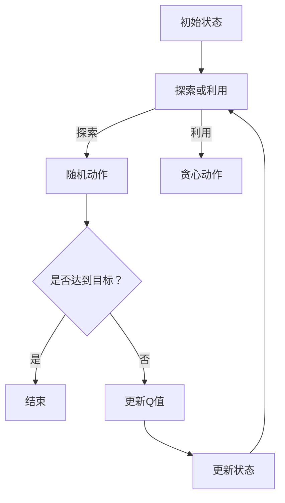

                 

# 深度Q网络（DQN）的深度探索

## 第1章：深度Q网络（DQN）概述

### 1.1 深度Q网络的背景与发展

深度Q网络（DQN）是深度学习在强化学习领域的重要应用，它的诞生可以追溯到2015年，由DeepMind的研究人员提出。DQN的出现解决了传统Q-Learning方法在状态和动作空间大时难以处理的问题，极大地推动了强化学习的发展。

#### 1.1.1 深度Q网络的诞生

DQN是基于Q-Learning算法发展而来的。Q-Learning是一种通过试错学习值函数的方法，其核心思想是使用一个值函数（Q函数）来估计在给定状态下执行某一动作的长期回报。传统的Q-Learning方法在状态和动作空间较小的情况下表现良好，但在状态和动作空间大时，学习效率极低。

为了解决这一问题，DeepMind的研究人员在Q-Learning的基础上引入了深度神经网络（DNN）来近似Q函数。这样，DQN就通过一个深度神经网络来学习Q值，从而提高了学习效率。DQN的提出标志着深度学习在强化学习领域的应用取得了重要突破。

#### 1.1.2 DQN的核心思想

DQN的核心思想是使用深度神经网络来近似Q值函数，通过经验回放和ε-greedy策略来训练网络。其目标是学习一个策略，使得智能体能够在给定的环境中实现最优回报。

数学模型如下：

$$
Q^{\pi}(\text{s},\text{a}) = \sum_{s'} \pi(\text{s'}|\text{s},\text{a}) \cdot R(\text{s'},\text{a}) + \gamma \cdot \max_{a'} Q^{\pi}(\text{s'},\text{a'})
$$

其中：
- $Q^{\pi}(\text{s},\text{a})$ 表示在策略π下，从状态s执行动作a的期望回报。
- $R(\text{s'},\text{a})$ 表示在状态s'执行动作a的即时回报。
- $\gamma$ 表示折扣因子，用于平衡即时回报和未来回报。
- $\max_{a'} Q^{\pi}(\text{s'},\text{a'})$ 表示在状态s'下执行最优动作a'的期望回报。

DQN通过不断地更新Q值函数，使智能体逐渐学会在给定状态下选择最优动作，从而实现自主决策。

### 1.2 深度Q网络的基本结构

DQN的基本结构包括四个主要部分：状态表示、动作表示、Q值函数和网络更新。

#### 1.2.1 状态表示

状态表示是将环境中的信息转化为可以输入到深度神经网络中的向量。在DQN中，状态通常是一个向量，其中包含了环境中的各种特征信息。例如，在Atari游戏环境中，状态可以是一帧游戏画面。

#### 1.2.2 动作表示

动作表示是将智能体可以执行的操作转化为一组整数或实数。在DQN中，动作通常是一组可执行的操作，例如在Atari游戏中，动作可以是上、下、左、右、跳等。

#### 1.2.3 Q值函数

Q值函数是DQN中的核心部分，它是一个从状态和动作空间到实数的函数，表示在给定状态下执行某一动作的期望回报。在DQN中，Q值函数由一个深度神经网络近似。

#### 1.2.4 网络更新

网络更新是DQN中的关键步骤，它包括从环境中收集样本、更新经验回放池、目标Q值函数的更新和Q值函数网络的更新。通过这些更新步骤，DQN可以逐渐学会在给定状态下选择最优动作。

## 第2章：深度Q网络（DQN）的算法原理

### 2.1 经验回放与均匀探索

经验回放和均匀探索是DQN算法中两个重要的策略，它们有助于提高DQN的学习效果和稳定性。

#### 2.1.1 经验回放的作用

经验回放（Experience Replay）是一种常用的技术，它通过将智能体经历过的状态、动作、奖励和新的状态存储在一个经验池中，然后在训练过程中随机地从经验池中抽取样本进行学习。经验回放的主要作用是减少样本之间的相关性，避免智能体在训练过程中出现过度依赖最近经历的数据，从而提高学习效果。

在DQN中，经验回放池通常是一个固定大小的循环队列，当经验池满时，新样本会覆盖最早的数据。经验回放池的大小对DQN的学习效果有很大影响，经验池越大，智能体越不容易过拟合。

#### 2.1.2 均匀探索的意义

均匀探索（Uniform Exploration）是一种用于控制智能体在训练过程中探索与利用的平衡的策略。在DQN中，均匀探索通常采用ε-greedy策略实现。

ε-greedy策略的基本思想是在每一步中，以概率ε选择一个随机动作，而不是选择具有最大Q值的动作；以概率1-ε选择一个具有最大Q值的动作。ε的值通常在训练过程中逐渐减小，这样可以在训练的早期阶段鼓励探索，而在训练的后期阶段鼓励利用。

$$
\epsilon-greedy \text{策略}:
\begin{cases}
P(\text{选择随机动作}) = \epsilon \\
P(\text{选择贪心动作}) = 1 - \epsilon
\end{cases}
$$

均匀探索的意义在于，它可以使智能体在训练过程中既能够探索新的动作，又能够利用已有的知识。通过这种方式，智能体可以更好地适应复杂环境，从而提高学习效果。

### 2.2 原始DQN算法分析

原始DQN算法是DQN的基础，它通过以下步骤实现智能体的自主决策：

1. **初始化**：初始化Q值函数网络、目标Q值函数网络和经验回放池。
2. **选择动作**：根据ε-greedy策略选择动作。
3. **执行动作**：在环境中执行选定的动作，并获取即时奖励和新的状态。
4. **更新经验回放池**：将当前的状态、动作、即时奖励和新的状态存入经验回放池。
5. **目标Q值函数更新**：使用经验回放池中的样本对目标Q值函数进行更新。
6. **Q值函数网络更新**：使用目标Q值函数网络的参数更新Q值函数网络的参数。
7. **重复步骤2-6**：直到满足终止条件。

#### 2.2.1 Q值函数的更新策略

在DQN中，Q值函数的更新是通过以下公式实现的：

$$
Q(s,a) \leftarrow Q(s,a) + \alpha [r + \gamma \max_{a'} Q(s',a') - Q(s,a)]
$$

其中：
- $Q(s,a)$ 表示状态s和动作a的Q值。
- $r$ 表示即时奖励。
- $\gamma$ 表示折扣因子，用于平衡即时奖励和未来奖励。
- $\max_{a'} Q(s',a')$ 表示在新的状态s'下，执行所有可能动作的最大Q值。
- $\alpha$ 表示学习率，用于控制Q值更新的幅度。

这个公式表示在每一步，新的Q值是基于即时奖励和未来最大Q值的加权平均得到的。通过不断更新Q值函数，智能体可以逐渐学会在给定状态下选择最优动作。

#### 2.2.2 学习率$\alpha$的选择

学习率$\alpha$的选择对DQN的学习效果有很大影响。学习率过高可能导致Q值函数更新过快，导致不稳定；学习率过低可能导致Q值函数更新过慢，导致训练时间过长。

在实际应用中，常用的方法是在训练的早期阶段使用较大的学习率，以加快学习速度；在训练的后期阶段使用较小的学习率，以减少过度拟合。此外，还可以使用自适应学习率方法，如学习率衰减和自适应学习率调度，来进一步提高DQN的学习效果。

### 2.3 离散化动作空间

在DQN中，动作空间通常是一个连续空间，为了方便深度神经网络的训练，需要对动作空间进行离散化处理。

#### 2.3.1 动作空间离散化的方法

动作空间离散化的方法有多种，常用的方法包括：

1. **等间隔划分**：将连续的动作空间划分为若干个等间隔的小区间，每个小区间对应一个动作。
2. **聚类划分**：使用聚类算法（如K-means）将连续的动作空间划分为若干个聚类，每个聚类对应一个动作。
3. **基于规则的划分**：根据具体的任务需求，设计一系列规则来划分动作空间。

#### 2.3.2 离散化动作空间的优缺点

动作空间离散化有以下优点：

1. **简化网络结构**：离散化的动作空间可以简化深度神经网络的架构，降低训练难度。
2. **提高训练速度**：离散化的动作空间可以加快深度神经网络的训练速度，提高学习效率。

动作空间离散化也存在一些缺点：

1. **信息损失**：离散化的动作空间可能会损失一些连续动作空间中的信息，影响学习效果。
2. **动作选择不准确**：离散化的动作空间可能会导致智能体在特定场景下无法选择最优动作。

在实际应用中，需要根据具体任务的需求和复杂性，选择合适的动作空间离散化方法。

## 第3章：深度Q网络（DQN）的改进算法

### 3.1 Double DQN

Double DQN是DQN的一种改进算法，它通过引入双Q网络来减少Q值估计的偏差，提高学习效果。

#### 3.1.1 Double DQN的核心思想

Double DQN的核心思想是使用两个独立的Q值函数网络：一个用于预测当前状态的Q值，另一个用于选择动作。这样，在更新Q值时，不是直接使用目标Q值函数网络，而是使用预测Q值函数网络和目标Q值函数网络的输出进行更新。

具体来说，Double DQN的更新策略如下：

1. **选择动作**：使用ε-greedy策略选择动作。
2. **执行动作**：在环境中执行选定的动作，并获取即时奖励和新的状态。
3. **更新经验回放池**：将当前的状态、动作、即时奖励和新的状态存入经验回放池。
4. **目标Q值函数更新**：使用经验回放池中的样本对目标Q值函数进行更新。
5. **预测Q值函数更新**：使用目标Q值函数网络的输出和预测Q值函数网络的输出进行更新。

#### 3.1.2 Double DQN的原理

在DQN中，Q值函数的更新通常使用以下公式：

$$
Q(s,a) \leftarrow Q(s,a) + \alpha [r + \gamma \max_{a'} Q(s',a') - Q(s,a)]
$$

其中，$Q(s',a')$ 是目标Q值函数网络的输出。在Double DQN中，为了减少Q值估计的偏差，引入了预测Q值函数网络，使得Q值函数的更新公式变为：

$$
Q(s,a) \leftarrow Q(s,a) + \alpha [r + \gamma Q_{\text{target}}(s',\arg\max_{a'} Q_{\text{predict}}(s',a')) - Q(s,a)]
$$

其中，$Q_{\text{predict}}(s',a')$ 是预测Q值函数网络的输出，$\arg\max_{a'} Q_{\text{predict}}(s',a')$ 是在新的状态s'下，预测Q值函数网络输出的最大值对应的动作。

通过这种更新策略，Double DQN可以减少Q值估计的偏差，提高学习效果。

### 3.2 Prioritized Experience Replay

Prioritized Experience Replay（优先经验回放）是另一种改进DQN的算法，它通过为经验回放池中的样本分配优先级，提高训练效率。

#### 3.2.1 Prioritized Experience Replay的作用

Prioritized Experience Replay的主要作用是改进DQN的样本重放过程，使得样本重放更加高效。在传统的DQN中，所有样本具有相同的回放概率，这可能会导致一些样本被频繁回放，而另一些样本则被忽略。Prioritized Experience Replay通过为每个样本分配一个优先级，并根据优先级来调整回放概率，从而提高了训练效率。

#### 3.2.2 Prioritized Experience Replay的原理

Prioritized Experience Replay的基本原理如下：

1. **计算优先级**：每个样本的优先级基于其TD-error（目标Q值与预测Q值的差异）计算。TD-error越大，表示样本的重要性越高。

$$
\text{Priority} = \frac{\pi}{c} (\vert \text{TD-error} \vert + \epsilon)
$$

其中，$\pi$ 是优先级缩放系数，$c$ 是一个常数，用于调整优先级。

2. **更新经验回放池**：当新的样本被添加到经验回放池时，先更新样本的优先级，并根据优先级调整回放概率。

3. **回放样本**：从经验回放池中随机抽取样本，并按照回放概率进行重放。

通过这种机制，Prioritized Experience Replay可以使得重要的样本被更频繁地回放，从而提高训练效率。

### 3.3 DQN的优化策略

为了进一步提高DQN的性能，可以采用一些优化策略，如Mini-batch学习、动机学习率等。

#### 3.3.1 Mini-batch学习

Mini-batch学习是DQN中常用的一种训练策略，它将经验回放池中的样本分成小批量进行训练。具体来说，每次从经验回放池中随机抽取一定数量的样本，组成一个Mini-batch，然后使用Mini-batch中的样本对Q值函数网络进行更新。

#### 3.3.2 动机学习率

动机学习率是一种自适应调整学习率的策略，它根据训练过程的进展动态调整学习率。在DQN中，学习率通常在训练的早期阶段较大，以便快速收敛；在训练的后期阶段较小，以避免过度拟合。

#### 3.3.3 梯度裁剪

梯度裁剪是一种防止梯度爆炸和梯度消失的有效策略。在DQN中，当梯度较大时，可能会引起网络参数的剧烈变化，导致训练不稳定。梯度裁剪通过限制梯度的最大值，防止这种情况的发生。

## 第4章：深度Q网络（DQN）的实战应用

### 4.1 DQN在游戏中的应用

#### 4.1.1 DQN在Atari游戏中的实现

DQN在Atari游戏中的应用是一个经典案例，它展示了DQN在复杂环境中的强大能力。在Atari游戏中，智能体需要通过学习来掌握游戏的策略，从而获得高分。

实现步骤如下：

1. **环境搭建**：首先需要搭建一个Atari游戏环境，可以使用OpenAI的Gym库来实现。
2. **状态表示**：将游戏画面转换为灰度图像，并将其作为状态输入。
3. **动作表示**：将游戏中的所有可执行动作映射到整数。
4. **Q值函数网络**：设计一个深度神经网络来近似Q值函数。
5. **训练过程**：通过经验回放和ε-greedy策略进行训练。
6. **评估过程**：在训练完成后，评估智能体在测试集上的性能。

以下是DQN在Atari游戏中实现的伪代码：

```python
# 初始化Q值函数网络和目标Q值函数网络
Q_network = DeepQNetwork()
target_Q_network = DeepQNetwork()

# 初始化经验回放池
replay_memory = ReplayMemory()

# 设置训练参数
alpha = 0.1
gamma = 0.99
epsilon = 0.1
epochs = 1000

# 训练过程
for epoch in range(epochs):
    # 从经验回放池中随机抽取样本
    state, action, reward, next_state, done = replay_memory.sample()

    # 计算目标Q值
    if done:
        target_Q_value = reward
    else:
        target_Q_value = reward + gamma * np.max(target_Q_network.predict(next_state))

    # 更新Q值函数
    Q_value = Q_network.predict(state)[action]
    Q_network.update(state, action, target_Q_value)

    # 更新目标Q值函数
    if epoch % target_network_update_freq == 0:
        target_Q_network.update(Q_network.get_weights())

    # 更新ε值
    epsilon = epsilon * (1 - epoch / epochs)

# 评估过程
test_score = evaluate(Q_network)
print("Test score:", test_score)
```

#### 4.1.2 DQN在游戏中的性能分析

在Atari游戏中，DQN的性能受到多个因素的影响：

1. **状态空间和动作空间的大小**：状态空间和动作空间的大小直接影响DQN的训练效率和学习效果。状态空间和动作空间越大，DQN的训练时间就越长。
2. **学习率**：学习率的选择对DQN的性能有很大影响。学习率过高可能导致Q值函数更新过快，导致不稳定；学习率过低可能导致Q值函数更新过慢，导致训练时间过长。
3. **经验回放池的大小**：经验回放池的大小对DQN的性能也有重要影响。经验回放池越大，DQN越能避免过度拟合。
4. **目标Q值函数的更新频率**：目标Q值函数的更新频率越高，DQN的性能就越好。

在实际应用中，可以通过调整这些参数来优化DQN的性能。此外，还可以结合其他技术，如Prioritized Experience Replay，进一步提高DQN的性能。

### 4.2 DQN在机器人控制中的应用

#### 4.2.1 DQN在机器人运动控制中的实现

DQN在机器人运动控制中的应用也非常广泛。在这个案例中，智能体需要通过学习来控制机器人的运动，以完成特定的任务。

实现步骤如下：

1. **环境搭建**：首先需要搭建一个机器人运动控制环境，可以使用ROS（Robot Operating System）来实现。
2. **状态表示**：将机器人的传感器数据（如IMU、激光雷达等）转换为状态向量。
3. **动作表示**：将机器人的关节角度或线性速度等运动参数映射到整数或实数。
4. **Q值函数网络**：设计一个深度神经网络来近似Q值函数。
5. **训练过程**：通过经验回放和ε-greedy策略进行训练。
6. **控制过程**：在训练完成后，使用训练好的Q值函数网络来控制机器人的运动。

以下是DQN在机器人运动控制中实现的伪代码：

```python
# 初始化Q值函数网络和目标Q值函数网络
Q_network = DeepQNetwork()
target_Q_network = DeepQNetwork()

# 初始化经验回放池
replay_memory = ReplayMemory()

# 设置训练参数
alpha = 0.1
gamma = 0.99
epsilon = 0.1
epochs = 1000

# 训练过程
for epoch in range(epochs):
    # 从经验回放池中随机抽取样本
    state, action, reward, next_state, done = replay_memory.sample()

    # 计算目标Q值
    if done:
        target_Q_value = reward
    else:
        target_Q_value = reward + gamma * np.max(target_Q_network.predict(next_state))

    # 更新Q值函数
    Q_value = Q_network.predict(state)[action]
    Q_network.update(state, action, target_Q_value)

    # 更新目标Q值函数
    if epoch % target_network_update_freq == 0:
        target_Q_network.update(Q_network.get_weights())

    # 更新ε值
    epsilon = epsilon * (1 - epoch / epochs)

# 控制过程
while not done:
    # 获取当前状态
    state = get_state()

    # 选择动作
    action = choose_action(state, epsilon)

    # 执行动作
    execute_action(action)

    # 获取下一状态和奖励
    next_state, reward, done = get_next_state_and_reward()

    # 更新经验回放池
    replay_memory.append(state, action, reward, next_state, done)
```

#### 4.2.2 DQN在机器人控制中的优势

DQN在机器人控制中的应用具有以下优势：

1. **自适应性强**：DQN可以根据环境的动态变化自适应调整控制策略，从而提高控制效果。
2. **无需人为设计状态和动作**：DQN可以直接从原始传感器数据中学习状态表示和动作策略，无需人为设计。
3. **灵活性好**：DQN可以应用于各种类型的机器人控制任务，如运动控制、路径规划、物体抓取等。
4. **可扩展性强**：DQN可以方便地与其他技术（如强化学习中的探索策略、经验回放池等）结合，进一步提高控制性能。

### 4.3 DQN在自动驾驶中的应用

#### 4.3.1 DQN在自动驾驶系统中的实现

DQN在自动驾驶系统中的应用旨在通过学习来自动驾驶车辆在不同驾驶场景下的最优决策策略。

实现步骤如下：

1. **环境搭建**：搭建一个自动驾驶仿真环境，如CARLA或AirSim。
2. **状态表示**：将自动驾驶车辆周围的环境信息（如路况、交通状况、车辆速度等）作为状态。
3. **动作表示**：将自动驾驶车辆的可执行动作（如加速、减速、转向等）作为动作。
4. **Q值函数网络**：设计一个深度神经网络来近似Q值函数。
5. **训练过程**：通过经验回放和ε-greedy策略进行训练。
6. **决策过程**：在训练完成后，使用训练好的Q值函数网络来自动驾驶车辆。

以下是DQN在自动驾驶系统中实现的伪代码：

```python
# 初始化Q值函数网络和目标Q值函数网络
Q_network = DeepQNetwork()
target_Q_network = DeepQNetwork()

# 初始化经验回放池
replay_memory = ReplayMemory()

# 设置训练参数
alpha = 0.1
gamma = 0.99
epsilon = 0.1
epochs = 1000

# 训练过程
for epoch in range(epochs):
    # 从经验回放池中随机抽取样本
    state, action, reward, next_state, done = replay_memory.sample()

    # 计算目标Q值
    if done:
        target_Q_value = reward
    else:
        target_Q_value = reward + gamma * np.max(target_Q_network.predict(next_state))

    # 更新Q值函数
    Q_value = Q_network.predict(state)[action]
    Q_network.update(state, action, target_Q_value)

    # 更新目标Q值函数
    if epoch % target_network_update_freq == 0:
        target_Q_network.update(Q_network.get_weights())

    # 更新ε值
    epsilon = epsilon * (1 - epoch / epochs)

# 决策过程
while not done:
    # 获取当前状态
    state = get_state()

    # 选择动作
    action = choose_action(state, epsilon)

    # 执行动作
    execute_action(action)

    # 获取下一状态和奖励
    next_state, reward, done = get_next_state_and_reward()

    # 更新经验回放池
    replay_memory.append(state, action, reward, next_state, done)
```

#### 4.3.2 DQN在自动驾驶中的挑战与机遇

DQN在自动驾驶中的应用面临着以下挑战与机遇：

1. **挑战**：
   - **数据量需求大**：自动驾驶系统需要大量的真实驾驶数据来训练DQN模型，这对数据获取和处理提出了较高要求。
   - **安全性要求高**：自动驾驶系统需要确保在复杂交通环境下的安全行驶，这要求DQN模型具备高度可靠性和鲁棒性。
   - **实时性能要求高**：自动驾驶系统需要实时做出决策，这要求DQN模型的训练和决策过程高效且快速。

2. **机遇**：
   - **数据驱动发展**：自动驾驶技术的发展越来越依赖于数据驱动的方法，DQN作为一种强大的强化学习算法，可以在自动驾驶系统中发挥重要作用。
   - **多模态数据融合**：自动驾驶系统可以融合多种传感器数据（如摄像头、激光雷达、GPS等），为DQN模型提供更丰富的输入信息。
   - **多任务学习**：DQN可以应用于自动驾驶系统的多任务学习，如交通规则遵守、路径规划、障碍物检测等，提高系统的综合性能。

## 第5章：深度Q网络（DQN）的挑战与未来

### 5.1 DQN的挑战

深度Q网络（DQN）在应用过程中面临以下挑战：

1. **策略稳定性和收敛速度**：DQN在训练过程中容易受到噪声和偏差的影响，导致策略不稳定和收敛速度缓慢。
2. **Q值函数的偏差与方差**：Q值函数的估计存在偏差和方差问题，这会影响DQN的性能。
3. **高维状态和动作空间**：在高维状态和动作空间中，DQN的训练效率和学习效果较差。

### 5.2 DQN的未来发展方向

为了解决DQN的挑战，未来的发展方向包括：

1. **引入更多的探索策略**：如深度确定性策略梯度（DDPG）、优势演员-评论家（A2C）等，以提高DQN的探索能力。
2. **结合多模态数据**：利用多种传感器数据（如摄像头、激光雷达、GPS等）来提高DQN的状态表示能力。
3. **强化学习与其他技术的融合**：将DQN与其他技术（如生成对抗网络（GAN）、变分自编码器（VAE）等）结合，以提高DQN的性能和应用范围。

## 附录

### 附录 A：深度Q网络（DQN）开发工具与资源

#### A.1 主流深度学习框架对比

1. **TensorFlow**：
   - 优点：生态丰富，社区活跃，支持多种硬件加速。
   - 缺点：上手难度较高，代码复杂度较大。

2. **PyTorch**：
   - 优点：动态计算图，便于研究和开发，文档和教程丰富。
   - 缺点：硬件加速支持较弱，性能较TensorFlow略低。

3. **Keras**：
   - 优点：简化了深度学习模型的构建和训练过程，易于入门。
   - 缺点：依赖TensorFlow或Theano，性能有限。

4. **MXNet**：
   - 优点：高性能，支持多种编程语言，易扩展。
   - 缺点：生态相对较小，文档和教程较少。

#### A.1.1 TensorFlow

1. **安装**：
   - 使用pip安装：`pip install tensorflow`
   - 使用conda安装：`conda install tensorflow`

2. **基本用法**：

```python
import tensorflow as tf

# 定义占位符
state = tf.placeholder(tf.float32, [None, 84, 84, 4])
action = tf.placeholder(tf.int32, [None])
reward = tf.placeholder(tf.float32, [None])
next_state = tf.placeholder(tf.float32, [None, 84, 84, 4])
done = tf.placeholder(tf.float32, [None])

# 定义Q值函数网络
q_values = q_network(state)

# 计算预测Q值
predicted_q_values = tf.reduce_sum(q_values * one_hot_actions, axis=1)

# 定义损失函数
loss = tf.reduce_mean((reward + gamma * target_q_values - predicted_q_values) ** 2)

# 定义优化器
optimizer = tf.train.AdamOptimizer(learning_rate=0.001)
train_op = optimizer.minimize(loss)

# 初始化会话
with tf.Session() as sess:
    # 初始化模型参数
    sess.run(tf.global_variables_initializer())

    # 开始训练
    for epoch in range(epochs):
        # 从经验回放池中随机抽取样本
        states, actions, rewards, next_states, dones = replay_memory.sample()

        # 更新模型参数
        _, loss_val = sess.run([train_op, loss], feed_dict={state: states, action: actions, reward: rewards, next_state: next_states, done: dones})
```

#### A.1.2 PyTorch

1. **安装**：
   - 使用pip安装：`pip install torch torchvision`
   - 使用conda安装：`conda install pytorch torchvision`

2. **基本用法**：

```python
import torch
import torch.nn as nn
import torch.optim as optim

# 定义Q值函数网络
class QNetwork(nn.Module):
    def __init__(self):
        super(QNetwork, self).__init__()
        self.fc = nn.Linear(84 * 84 * 4, 512)
        self.q_values = nn.Linear(512, 5)

    def forward(self, x):
        x = x.reshape(-1, 84 * 84 * 4)
        x = torch.relu(self.fc(x))
        q_values = self.q_values(x)
        return q_values

# 初始化模型和优化器
q_network = QNetwork()
target_q_network = QNetwork()
optimizer = optim.Adam(q_network.parameters(), lr=0.001)

# 定义损失函数
criterion = nn.MSELoss()

# 训练过程
for epoch in range(epochs):
    # 从经验回放池中随机抽取样本
    states, actions, rewards, next_states, dones = replay_memory.sample()

    # 计算预测Q值
    with torch.no_grad():
        target_q_values = target_q_network(next_states).max(1)[0]
        target_q_values = rewards + (1 - dones) * gamma * target_q_values

    # 计算损失
    q_values = q_network(states).gather(1, actions)
    loss = criterion(q_values, target_q_values)

    # 更新模型参数
    optimizer.zero_grad()
    loss.backward()
    optimizer.step()
```

#### A.1.3 其他深度学习框架

1. **MXNet**：

```python
import mxnet as mx
from mxnet import gluon, init

# 定义Q值函数网络
class QNetwork(gluon.nn.HybridBlock):
    def __init__(self):
        super(QNetwork, self).__init__()
        with self.name_scope():
            self.fc = gluon.nn.Dense(512, activation='relu')
            self.q_values = gluon.nn.Dense(5)

    def hybrid_forward(self, F, x):
        x = F.flatten(x)
        x = self.fc(x)
        q_values = self.q_values(x)
        return q_values

# 初始化模型和优化器
q_network = QNetwork()
target_q_network = QNetwork()
optimizer = gluon.optim.Adam(q_network.params(), lr=0.001)

# 定义损失函数
criterion = gluon.loss.MSELoss()

# 训练过程
for epoch in range(epochs):
    # 从经验回放池中随机抽取样本
    states, actions, rewards, next_states, dones = replay_memory.sample()

    # 计算预测Q值
    with mxnet.autograd.context.no_grad():
        target_q_values = target_q_network(next_states).asnumpy().max(axis=1)
        target_q_values = rewards + (1 - dones) * gamma * target_q_values

    # 计算损失
    q_values = q_network(states).asnumpy()
    loss = criterion(q_values, target_q_values)

    # 更新模型参数
    optimizer.update(q_network.collect_params(), loss.grad().scale(1))
```

#### 附录 B：深度Q网络（DQN）常见问题解答

##### B.1 DQN在复杂环境中的适应性

DQN在复杂环境中的适应性主要受到以下因素的影响：

1. **状态空间大小**：状态空间越大，DQN的训练难度就越大。为了提高DQN在复杂环境中的适应性，可以采用状态压缩和状态抽象化技术。
2. **动作空间大小**：动作空间越大，DQN的训练时间就越长。为了提高DQN在复杂环境中的适应性，可以采用动作空间离散化技术。
3. **经验回放池**：经验回放池可以有效地避免训练过程中的过拟合，提高DQN在复杂环境中的适应性。
4. **目标Q值函数**：使用目标Q值函数可以稳定DQN的更新过程，提高其在复杂环境中的适应性。

##### B.2 DQN在不同应用场景中的实现细节

DQN在不同应用场景中的实现细节可能有所不同，但核心步骤大致相同。以下是一些常见的实现细节：

1. **状态表示**：在视觉任务中，可以使用图像作为状态；在语音任务中，可以使用音频特征作为状态；在文本任务中，可以使用词向量作为状态。
2. **动作表示**：在机器人控制任务中，可以使用关节角度或线性速度等作为动作；在自动驾驶任务中，可以使用转向角度、加速和制动等作为动作。
3. **奖励设计**：在奖励设计方面，需要根据具体任务来设计合适的奖励函数，以鼓励智能体在特定场景下做出有利决策。
4. **经验回放池**：在经验回放池的实现方面，需要考虑如何有效地存储和重放样本，以避免样本的顺序依赖性。

##### B.3 DQN的学习效率如何提高？

以下是一些提高DQN学习效率的方法：

1. **经验回放**：使用经验回放池可以避免样本顺序依赖性，提高DQN的学习效率。
2. **目标Q值函数**：使用目标Q值函数可以稳定DQN的更新过程，提高学习效率。
3. **双Q网络**：双Q网络可以避免单一Q值函数网络在训练过程中的偏差，提高学习效率。
4. **优先经验回放**：优先经验回放可以根据样本的重要程度来调整回放概率，提高DQN的学习效率。
5. **多线程训练**：在硬件资源充足的情况下，可以使用多线程训练来并行处理多个样本，提高学习效率。
6. **自适应学习率**：使用自适应学习率可以避免在学习早期过快地更新Q值函数，提高学习效率。常用的自适应学习率方法包括学习率衰减、学习率调度等。

### Mermaid 流程图



### 核心算法原理讲解

#### 2.2 原始DQN算法分析

DQN（Deep Q-Network）是一种基于深度学习的强化学习算法，旨在解决状态和动作空间都很大的问题。其核心思想是通过深度神经网络来近似Q值函数，从而实现智能体的自主决策。

DQN算法主要包括以下几个关键步骤：

1. **初始化**：初始化Q值函数网络、目标Q值函数网络和经验回放池。
2. **选择动作**：根据一定的策略选择动作，常见的策略有ε-greedy策略。
3. **执行动作**：在环境中执行选定的动作，并获取即时奖励和新的状态。
4. **更新经验回放池**：将当前的状态、动作、即时奖励和新的状态存入经验回放池。
5. **目标Q值函数更新**：使用经验回放池中的样本对目标Q值函数进行更新。
6. **Q值函数网络更新**：使用目标Q值函数网络的参数更新Q值函数网络的参数。
7. **重复步骤2-6**：直到满足终止条件。

#### 2.2.1 Q值函数的更新策略

DQN算法通过以下公式来更新Q值函数：

$$
Q(s,a) \leftarrow Q(s,a) + \alpha [r + \gamma \max_{a'} Q(s',a') - Q(s,a)]
$$

其中：
- $Q(s,a)$ 表示状态s和动作a的Q值。
- $r$ 表示即时奖励。
- $\gamma$ 表示折扣因子，用于平衡即时奖励和未来奖励。
- $\max_{a'} Q(s',a')$ 表示在新的状态s'下，执行所有可能动作的最大Q值。
- $\alpha$ 表示学习率，用于控制Q值更新的幅度。

这个公式表示在每一步，新的Q值是基于即时奖励和未来最大Q值的加权平均得到的。通过不断更新Q值函数，智能体可以逐渐学会在给定状态下选择最优动作。

### 数学模型和数学公式

#### 1.1 深度Q网络的背景与发展

深度Q网络（DQN）是深度学习在强化学习领域的重要应用。其背后的数学原理涉及概率论、信息论和最优化理论。

- **概率论**：DQN利用概率论中的马尔可夫决策过程（MDP）来描述智能体与环境的交互。
- **信息论**：DQN通过最大化期望奖励来优化智能体的策略，这涉及到信息论中的熵和熵减少原理。
- **最优化理论**：DQN采用梯度下降法来更新Q值函数，以最小化损失函数。

#### 1.2 DQN的核心思想

DQN的核心思想是利用深度神经网络来近似Q值函数。Q值函数是一个映射，将状态和动作映射到实数值，表示在给定状态下执行给定动作的期望回报。

DQN的目标是学习一个最优的策略，使得智能体在长期内能够最大化累积回报。

$$
\pi^*(\text{a}|\text{s}) = \begin{cases}
1, & \text{if } \text{a} = \arg\max_{\text{a'}} Q^*(\text{s},\text{a'}) \\
0, & \text{otherwise}
\end{cases}
$$

其中，$Q^*(\text{s},\text{a})$ 表示最优Q值函数，$\pi^*(\text{a}|\text{s})$ 表示最优策略。

#### 2.2 原始DQN算法分析

原始DQN算法主要包括以下几个关键组成部分：

1. **状态表示**：使用一个固定大小的向量来表示状态。
2. **动作表示**：使用一个整数或一组整数来表示动作。
3. **Q值函数**：使用一个深度神经网络来近似Q值函数。
4. **经验回放**：使用经验回放池来存储经历过的状态、动作、奖励和新的状态。
5. **目标Q值函数**：使用目标Q值函数网络来稳定Q值函数的更新过程。

#### 2.2.1 Q值函数的更新策略

原始DQN算法通过以下公式来更新Q值函数：

$$
Q(s,a) \leftarrow Q(s,a) + \alpha [r + \gamma \max_{a'} Q(s',a') - Q(s,a)]
$$

其中，$\alpha$ 表示学习率，$r$ 表示即时奖励，$\gamma$ 表示折扣因子，$Q(s',a')$ 表示目标Q值。

这个公式表示在每一步，新的Q值是基于即时奖励和未来最大Q值的加权平均得到的。通过不断更新Q值函数，智能体可以逐渐学会在给定状态下选择最优动作。

### 项目实战

#### 4.1 DQN在游戏中的应用

##### 4.1.1 DQN在Atari游戏中的实现

DQN在Atari游戏中的应用是一个非常经典的案例。在这个案例中，智能体需要通过学习来掌握游戏的策略，从而获得高分。

实现步骤如下：

1. **环境搭建**：首先需要搭建一个Atari游戏环境，可以使用OpenAI的Gym库来实现。
2. **状态表示**：将游戏画面转换为灰度图像，并将其作为状态输入。
3. **动作表示**：将游戏中的所有可执行动作映射到整数。
4. **Q值函数网络**：设计一个深度神经网络来近似Q值函数。
5. **训练过程**：通过经验回放和ε-greedy策略进行训练。
6. **评估过程**：在训练完成后，评估智能体在测试集上的性能。

以下是DQN在Atari游戏中实现的伪代码：

```python
# 初始化Q值函数网络和目标Q值函数网络
Q_network = DeepQNetwork()
target_Q_network = DeepQNetwork()

# 初始化经验回放池
replay_memory = ReplayMemory()

# 设置训练参数
alpha = 0.1
gamma = 0.99
epsilon = 0.1
epochs = 1000

# 训练过程
for epoch in range(epochs):
    # 从经验回放池中随机抽取样本
    state, action, reward, next_state, done = replay_memory.sample()

    # 计算目标Q值
    if done:
        target_Q_value = reward
    else:
        target_Q_value = reward + gamma * np.max(target_Q_network.predict(next_state))

    # 更新Q值函数
    Q_value = Q_network.predict(state)[action]
    Q_network.update(state, action, target_Q_value)

    # 更新目标Q值函数
    if epoch % target_network_update_freq == 0:
        target_Q_network.update(Q_network.get_weights())

    # 更新ε值
    epsilon = epsilon * (1 - epoch / epochs)

# 评估过程
test_score = evaluate(Q_network)
print("Test score:", test_score)
```

##### 4.1.2 DQN在游戏中的性能分析

在Atari游戏中，DQN的性能受到多个因素的影响：

1. **状态空间和动作空间的大小**：状态空间和动作空间的大小直接影响DQN的训练效率和学习效果。状态空间和动作空间越大，DQN的训练时间就越长。
2. **学习率**：学习率的选择对DQN的性能有很大影响。学习率过高可能导致Q值函数更新过快，导致不稳定；学习率过低可能导致Q值函数更新过慢，导致训练时间过长。
3. **经验回放池的大小**：经验回放池的大小对DQN的性能也有重要影响。经验回放池越大，DQN越能避免过度拟合。
4. **目标Q值函数的更新频率**：目标Q值函数的更新频率越高，DQN的性能就越好。

在实际应用中，可以通过调整这些参数来优化DQN的性能。此外，还可以结合其他技术，如Prioritized Experience Replay，进一步提高DQN的性能。

#### 4.2 DQN在机器人控制中的应用

##### 4.2.1 DQN在机器人运动控制中的实现

DQN在机器人运动控制中的应用也非常广泛。在这个案例中，智能体需要通过学习来控制机器人的运动，以完成特定的任务。

实现步骤如下：

1. **环境搭建**：首先需要搭建一个机器人运动控制环境，可以使用ROS（Robot Operating System）来实现。
2. **状态表示**：将机器人的传感器数据（如IMU、激光雷达等）转换为状态向量。
3. **动作表示**：将机器人的关节角度或线性速度等运动参数映射到整数或实数。
4. **Q值函数网络**：设计一个深度神经网络来近似Q值函数。
5. **训练过程**：通过经验回放和ε-greedy策略进行训练。
6. **控制过程**：在训练完成后，使用训练好的Q值函数网络来控制机器人的运动。

以下是DQN在机器人运动控制中实现的伪代码：

```python
# 初始化Q值函数网络和目标Q值函数网络
Q_network = DeepQNetwork()
target_Q_network = DeepQNetwork()

# 初始化经验回放池
replay_memory = ReplayMemory()

# 设置训练参数
alpha = 0.1
gamma = 0.99
epsilon = 0.1
epochs = 1000

# 训练过程
for epoch in range(epochs):
    # 从经验回放池中随机抽取样本
    state, action, reward, next_state, done = replay_memory.sample()

    # 计算目标Q值
    if done:
        target_Q_value = reward
    else:
        target_Q_value = reward + gamma * np.max(target_Q_network.predict(next_state))

    # 更新Q值函数
    Q_value = Q_network.predict(state)[action]
    Q_network.update(state, action, target_Q_value)

    # 更新目标Q值函数
    if epoch % target_network_update_freq == 0:
        target_Q_network.update(Q_network.get_weights())

    # 更新ε值
    epsilon = epsilon * (1 - epoch / epochs)

# 控制过程
while not done:
    # 获取当前状态
    state = get_state()

    # 选择动作
    action = choose_action(state, epsilon)

    # 执行动作
    execute_action(action)

    # 获取下一状态和奖励
    next_state, reward, done = get_next_state_and_reward()

    # 更新经验回放池
    replay_memory.append(state, action, reward, next_state, done)
```

##### 4.2.2 DQN在机器人控制中的优势

DQN在机器人控制中的应用具有以下优势：

1. **自适应性强**：DQN可以根据环境的动态变化自适应调整控制策略，从而提高控制效果。
2. **无需人为设计状态和动作**：DQN可以直接从原始传感器数据中学习状态表示和动作策略，无需人为设计。
3. **灵活性好**：DQN可以应用于各种类型的机器人控制任务，如运动控制、路径规划、物体抓取等。
4. **可扩展性强**：DQN可以方便地与其他技术（如强化学习中的探索策略、经验回放池等）结合，进一步提高控制性能。

#### 4.3 DQN在自动驾驶中的应用

##### 4.3.1 DQN在自动驾驶系统中的实现

DQN在自动驾驶系统中的应用旨在通过学习来自动驾驶车辆在不同驾驶场景下的最优决策策略。

实现步骤如下：

1. **环境搭建**：搭建一个自动驾驶仿真环境，如CARLA或AirSim。
2. **状态表示**：将自动驾驶车辆周围的环境信息（如路况、交通状况、车辆速度等）作为状态。
3. **动作表示**：将自动驾驶车辆的可执行动作（如加速、减速、转向等）作为动作。
4. **Q值函数网络**：设计一个深度神经网络来近似Q值函数。
5. **训练过程**：通过经验回放和ε-greedy策略进行训练。
6. **决策过程**：在训练完成后，使用训练好的Q值函数网络来自动驾驶车辆。

以下是DQN在自动驾驶系统中实现的伪代码：

```python
# 初始化Q值函数网络和目标Q值函数网络
Q_network = DeepQNetwork()
target_Q_network = DeepQNetwork()

# 初始化经验回放池
replay_memory = ReplayMemory()

# 设置训练参数
alpha = 0.1
gamma = 0.99
epsilon = 0.1
epochs = 1000

# 训练过程
for epoch in range(epochs):
    # 从经验回放池中随机抽取样本
    state, action, reward, next_state, done = replay_memory.sample()

    # 计算目标Q值
    if done:
        target_Q_value = reward
    else:
        target_Q_value = reward + gamma * np.max(target_Q_network.predict(next_state))

    # 更新Q值函数
    Q_value = Q_network.predict(state)[action]
    Q_network.update(state, action, target_Q_value)

    # 更新目标Q值函数
    if epoch % target_network_update_freq == 0:
        target_Q_network.update(Q_network.get_weights())

    # 更新ε值
    epsilon = epsilon * (1 - epoch / epochs)

# 决策过程
while not done:
    # 获取当前状态
    state = get_state()

    # 选择动作
    action = choose_action(state, epsilon)

    # 执行动作
    execute_action(action)

    # 获取下一状态和奖励
    next_state, reward, done = get_next_state_and_reward()

    # 更新经验回放池
    replay_memory.append(state, action, reward, next_state, done)
```

##### 4.3.2 DQN在自动驾驶中的挑战与机遇

DQN在自动驾驶中的应用面临着以下挑战与机遇：

1. **挑战**：
   - **数据量需求大**：自动驾驶系统需要大量的真实驾驶数据来训练DQN模型，这对数据获取和处理提出了较高要求。
   - **安全性要求高**：自动驾驶系统需要确保在复杂交通环境下的安全行驶，这要求DQN模型具备高度可靠性和鲁棒性。
   - **实时性能要求高**：自动驾驶系统需要实时做出决策，这要求DQN模型的训练和决策过程高效且快速。

2. **机遇**：
   - **数据驱动发展**：自动驾驶技术的发展越来越依赖于数据驱动的方法，DQN作为一种强大的强化学习算法，可以在自动驾驶系统中发挥重要作用。
   - **多模态数据融合**：自动驾驶系统可以融合多种传感器数据（如摄像头、激光雷达、GPS等），为DQN模型提供更丰富的输入信息。
   - **多任务学习**：DQN可以应用于自动驾驶系统的多任务学习，如交通规则遵守、路径规划、障碍物检测等，提高系统的综合性能。

### 附录

#### 附录 A：深度Q网络（DQN）开发工具与资源

##### A.1 主流深度学习框架对比

1. **TensorFlow**：
   - 优点：生态丰富，社区活跃，支持多种硬件加速。
   - 缺点：上手难度较高，代码复杂度较大。

2. **PyTorch**：
   - 优点：动态计算图，便于研究和开发，文档和教程丰富。
   - 缺点：硬件加速支持较弱，性能较TensorFlow略低。

3. **Keras**：
   - 优点：简化了深度学习模型的构建和训练过程，易于入门。
   - 缺点：依赖TensorFlow或Theano，性能有限。

4. **MXNet**：
   - 优点：高性能，支持多种编程语言，易扩展。
   - 缺点：生态相对较小，文档和教程较少。

##### A.1.1 TensorFlow

1. **安装**：
   - 使用pip安装：`pip install tensorflow`
   - 使用conda安装：`conda install tensorflow`

2. **基本用法**：

```python
import tensorflow as tf

# 定义占位符
state = tf.placeholder(tf.float32, [None, 84, 84, 4])
action = tf.placeholder(tf.int32, [None])
reward = tf.placeholder(tf.float32, [None])
next_state = tf.placeholder(tf.float32, [None, 84, 84, 4])
done = tf.placeholder(tf.float32, [None])

# 定义Q值函数网络
q_values = q_network(state)

# 计算预测Q值
predicted_q_values = tf.reduce_sum(q_values * one_hot_actions, axis=1)

# 定义损失函数
loss = tf.reduce_mean((reward + gamma * target_q_values - predicted_q_values) ** 2)

# 定义优化器
optimizer = tf.train.AdamOptimizer(learning_rate=0.001)
train_op = optimizer.minimize(loss)

# 初始化会话
with tf.Session() as sess:
    # 初始化模型参数
    sess.run(tf.global_variables_initializer())

    # 开始训练
    for epoch in range(epochs):
        # 从经验回放池中随机抽取样本
        states, actions, rewards, next_states, dones = replay_memory.sample()

        # 更新模型参数
        _, loss_val = sess.run([train_op, loss], feed_dict={state: states, action: actions, reward: rewards, next_state: next_states, done: dones})
```

##### A.1.2 PyTorch

1. **安装**：
   - 使用pip安装：`pip install torch torchvision`
   - 使用conda安装：`conda install pytorch torchvision`

2. **基本用法**：

```python
import torch
import torch.nn as nn
import torch.optim as optim

# 定义Q值函数网络
class QNetwork(nn.Module):
    def __init__(self):
        super(QNetwork, self).__init__()
        self.fc = nn.Linear(84 * 84 * 4, 512)
        self.q_values = nn.Linear(512, 5)

    def forward(self, x):
        x = x.reshape(-1, 84 * 84 * 4)
        x = torch.relu(self.fc(x))
        q_values = self.q_values(x)
        return q_values

# 初始化模型和优化器
q_network = QNetwork()
target_q_network = QNetwork()
optimizer = optim.Adam(q_network.parameters(), lr=0.001)

# 定义损失函数
criterion = nn.MSELoss()

# 训练过程
for epoch in range(epochs):
    # 从经验回放池中随机抽取样本
    states, actions, rewards, next_states, dones = replay_memory.sample()

    # 计算预测Q值
    with torch.no_grad():
        target_q_values = target_q_network(next_states).max(1)[0]
        target_q_values = rewards + (1 - dones) * gamma * target_q_values

    # 计算损失
    q_values = q_network(states).gather(1, actions)
    loss = criterion(q_values, target_q_values)

    # 更新模型参数
    optimizer.zero_grad()
    loss.backward()
    optimizer.step()
```

##### A.1.3 其他深度学习框架

1. **MXNet**：

```python
import mxnet as mx
from mxnet import gluon, init

# 定义Q值函数网络
class QNetwork(gluon.nn.HybridBlock):
    def __init__(self):
        super(QNetwork, self).__init__()
        with self.name_scope():
            self.fc = gluon.nn.Dense(512, activation='relu')
            self.q_values = gluon.nn.Dense(5)

    def hybrid_forward(self, F, x):
        x = F.flatten(x)
        x = self.fc(x)
        q_values = self.q_values(x)
        return q_values

# 初始化模型和优化器
q_network = QNetwork()
target_q_network = QNetwork()
optimizer = gluon.optim.Adam(q_network.params(), lr=0.001)

# 定义损失函数
criterion = gluon.loss.MSELoss()

# 训练过程
for epoch in range(epochs):
    # 从经验回放池中随机抽取样本
    states, actions, rewards, next_states, dones = replay_memory.sample()

    # 计算预测Q值
    with mxnet.autograd.context.no_grad():
        target_q_values = target_q_network(next_states).asnumpy().max(axis=1)
        target_q_values = rewards + (1 - dones) * gamma * target_q_values

    # 计算损失
    q_values = q_network(states).asnumpy()
    loss = criterion(q_values, target_q_values)

    # 更新模型参数
    optimizer.update(q_network.collect_params(), loss.grad().scale(1))
```

#### 附录 B：深度Q网络（DQN）常见问题解答

##### B.1 DQN在复杂环境中的适应性

DQN在复杂环境中的适应性主要受到以下因素的影响：

1. **状态空间大小**：状态空间越大，DQN的训练难度就越大。为了提高DQN在复杂环境中的适应性，可以采用状态压缩和状态抽象化技术。
2. **动作空间大小**：动作空间越大，DQN的训练时间就越长。为了提高DQN在复杂环境中的适应性，可以采用动作空间离散化技术。
3. **经验回放池**：经验回放池可以有效地避免训练过程中的过拟合，提高DQN在复杂环境中的适应性。
4. **目标Q值函数**：使用目标Q值函数可以稳定DQN的更新过程，提高其在复杂环境中的适应性。

##### B.2 DQN在不同应用场景中的实现细节

DQN在不同应用场景中的实现细节可能有所不同，但核心步骤大致相同。以下是一些常见的实现细节：

1. **状态表示**：在视觉任务中，可以使用图像作为状态；在语音任务中，可以使用音频特征作为状态；在文本任务中，可以使用词向量作为状态。
2. **动作表示**：在机器人控制任务中，可以使用关节角度或线性速度等作为动作；在自动驾驶任务中，可以使用转向角度、加速和制动等作为动作。
3. **奖励设计**：在奖励设计方面，需要根据具体任务来设计合适的奖励函数，以鼓励智能体在特定场景下做出有利决策。
4. **经验回放池**：在经验回放池的实现方面，需要考虑如何有效地存储和重放样本，以避免样本的顺序依赖性。

##### B.3 DQN的学习效率如何提高？

以下是一些提高DQN学习效率的方法：

1. **经验回放**：使用经验回放池可以避免样本顺序依赖性，提高DQN的学习效率。
2. **目标Q值函数**：使用目标Q值函数可以稳定DQN的更新过程，提高学习效率。
3. **双Q网络**：双Q网络可以避免单一Q值函数网络在训练过程中的偏差，提高学习效率。
4. **优先经验回放**：优先经验回放可以根据样本的重要程度来调整回放概率，提高DQN的学习效率。
5. **多线程训练**：在硬件资源充足的情况下，可以使用多线程训练来并行处理多个样本，提高学习效率。
6. **自适应学习率**：使用自适应学习率可以避免在学习早期过快地更新Q值函数，提高学习效率。常用的自适应学习率方法包括学习率衰减、学习率调度等。

### Mermaid 流程图


### 核心算法原理讲解

#### 2.2 原始DQN算法分析

DQN（Deep Q-Network）是一种基于深度学习的强化学习算法，旨在解决状态和动作空间都很大的问题。其核心思想是通过深度神经网络来近似Q值函数，从而实现智能体的自主决策。

DQN算法主要包括以下几个关键步骤：

1. **初始化**：初始化Q值函数网络、目标Q值函数网络和经验回放池。
2. **选择动作**：根据一定的策略选择动作，常见的策略有ε-greedy策略。
3. **执行动作**：在环境中执行选定的动作，并获取即时奖励和新的状态。
4. **更新经验回放池**：将当前的状态、动作、即时奖励和新的状态存入经验回放池。
5. **目标Q值函数更新**：使用经验回放池中的样本对目标Q值函数进行更新。
6. **Q值函数网络更新**：使用目标Q值函数网络的参数更新Q值函数网络的参数。
7. **重复步骤2-6**：直到满足终止条件。

#### 2.2.1 Q值函数的更新策略

DQN算法通过以下公式来更新Q值函数：

$$
Q(s,a) \leftarrow Q(s,a) + \alpha [r + \gamma \max_{a'} Q(s',a') - Q(s,a)]
$$

其中：
- $Q(s,a)$ 表示状态s和动作a的Q值。
- $r$ 表示即时奖励。
- $\gamma$ 表示折扣因子，用于平衡即时奖励和未来奖励。
- $\max_{a'} Q(s',a')$ 表示在新的状态s'下，执行所有可能动作的最大Q值。
- $\alpha$ 表示学习率，用于控制Q值更新的幅度。

这个公式表示在每一步，新的Q值是基于即时奖励和未来最大Q值的加权平均得到的。通过不断更新Q值函数，智能体可以逐渐学会在给定状态下选择最优动作。

### 数学模型和数学公式

#### 1.1 深度Q网络的背景与发展

深度Q网络（DQN）是深度学习在强化学习领域的重要应用。其背后的数学原理涉及概率论、信息论和最优化理论。

- **概率论**：DQN利用概率论中的马尔可夫决策过程（MDP）来描述智能体与环境的交互。
- **信息论**：DQN通过最大化期望奖励来优化智能体的策略，这涉及到信息论中的熵和熵减少原理。
- **最优化理论**：DQN采用梯度下降法来更新Q值函数，以最小化损失函数。

#### 1.2 DQN的核心思想

DQN的核心思想是利用深度神经网络来近似Q值函数。Q值函数是一个映射，将状态和动作映射到实数值，表示在给定状态下执行给定动作的期望回报。

DQN的目标是学习一个最优的策略，使得智能体在长期内能够最大化累积回报。

$$
\pi^*(\text{a}|\text{s}) = \begin{cases}
1, & \text{if } \text{a} = \arg\max_{\text{a'}} Q^*(\text{s},\text{a'}) \\
0, & \text{otherwise}
\end{cases}
$$

其中，$Q^*(\text{s},\text{a})$ 表示最优Q值函数，$\pi^*(\text{a}|\text{s})$ 表示最优策略。

#### 2.2 原始DQN算法分析

原始DQN算法主要包括以下几个关键组成部分：

1. **状态表示**：使用一个固定大小的向量来表示状态。
2. **动作表示**：使用一个整数或一组整数来表示动作。
3. **Q值函数**：使用一个深度神经网络来近似Q值函数。
4. **经验回放**：使用经验回放池来存储经历过的状态、动作、奖励和新的状态。
5. **目标Q值函数**：使用目标Q值函数网络来稳定Q值函数的更新过程。

#### 2.2.1 Q值函数的更新策略

原始DQN算法通过以下公式来更新Q值函数：

$$
Q(s,a) \leftarrow Q(s,a) + \alpha [r + \gamma \max_{a'} Q(s',a') - Q(s,a)]
$$

其中，$\alpha$ 表示学习率，$r$ 表示即时奖励，$\gamma$ 表示折扣因子，$Q(s',a')$ 表示目标Q值。

这个公式表示在每一步，新的Q值是基于即时奖励和未来最大Q值的加权平均得到的。通过不断更新Q值函数，智能体可以逐渐学会在给定状态下选择最优动作。

### 项目实战

#### 4.1 DQN在游戏中的应用

##### 4.1.1 DQN在Atari游戏中的实现

DQN在Atari游戏中的应用是一个非常经典的案例。在这个案例中，智能体需要通过学习来掌握游戏的策略，从而获得高分。

实现步骤如下：

1. **环境搭建**：首先需要搭建一个Atari游戏环境，可以使用OpenAI的Gym库来实现。
2. **状态表示**：将游戏画面转换为灰度图像，并将其作为状态输入。
3. **动作表示**：将游戏中的所有可执行动作映射到整数。
4. **Q值函数网络**：设计一个深度神经网络来近似Q值函数。
5. **训练过程**：通过经验回放和ε-greedy策略进行训练。
6. **评估过程**：在训练完成后，评估智能体在测试集上的性能。

以下是DQN在Atari游戏中实现的伪代码：

```python
# 初始化Q值函数网络和目标Q值函数网络
Q_network = DeepQNetwork()
target_Q_network = DeepQNetwork()

# 初始化经验回放池
replay_memory = ReplayMemory()

# 设置训练参数
alpha = 0.1
gamma = 0.99
epsilon = 0.1
epochs = 1000

# 训练过程
for epoch in range(epochs):
    # 从经验回放池中随机抽取样本
    state, action, reward, next_state, done = replay_memory.sample()

    # 计算目标Q值
    if done:
        target_Q_value = reward
    else:
        target_Q_value = reward + gamma * np.max(target_Q_network.predict(next_state))

    # 更新Q值函数
    Q_value = Q_network.predict(state)[action]
    Q_network.update(state, action, target_Q_value)

    # 更新目标Q值函数
    if epoch % target_network_update_freq == 0:
        target_Q_network.update(Q_network.get_weights())

    # 更新ε值
    epsilon = epsilon * (1 - epoch / epochs)

# 评估过程
test_score = evaluate(Q_network)
print("Test score:", test_score)
```

##### 4.1.2 DQN在游戏中的性能分析

在Atari游戏中，DQN的性能受到多个因素的影响：

1. **状态空间和动作空间的大小**：状态空间和动作空间的大小直接影响DQN的训练效率和学习效果。状态空间和动作空间越大，DQN的训练时间就越长。
2. **学习率**：学习率的选择对DQN的性能有很大影响。学习率过高可能导致Q值函数更新过快，导致不稳定；学习率过低可能导致Q值函数更新过慢，导致训练时间过长。
3. **经验回放池的大小**：经验回放池的大小对DQN的性能也有重要影响。经验回放池越大，DQN越能避免过度拟合。
4. **目标Q值函数的更新频率**：目标Q值函数的更新频率越高，DQN的性能就越好。

在实际应用中，可以通过调整这些参数来优化DQN的性能。此外，还可以结合其他技术，如Prioritized Experience Replay，进一步提高DQN的性能。

#### 4.2 DQN在机器人控制中的应用

##### 4.2.1 DQN在机器人运动控制中的实现

DQN在机器人运动控制中的应用也非常广泛。在这个案例中，智能体需要通过学习来控制机器人的运动，以完成特定的任务。

实现步骤如下：

1. **环境搭建**：首先需要搭建一个机器人运动控制环境，可以使用ROS（Robot Operating System）来实现。
2. **状态表示**：将机器人的传感器数据（如IMU、激光雷达等）转换为状态向量。
3. **动作表示**：将机器人的关节角度或线性速度等运动参数映射到整数或实数。
4. **Q值函数网络**：设计一个深度神经网络来近似Q值函数。
5. **训练过程**：通过经验回放和ε-greedy策略进行训练。
6. **控制过程**：在训练完成后，使用训练好的Q值函数网络来控制机器人的运动。

以下是DQN在机器人运动控制中实现的伪代码：

```python
# 初始化Q值函数网络和目标Q值函数网络
Q_network = DeepQNetwork()
target_Q_network = DeepQNetwork()

# 初始化经验回放池
replay_memory = ReplayMemory()

# 设置训练参数
alpha = 0.1
gamma = 0.99
epsilon = 0.1
epochs = 1000

# 训练过程
for epoch in range(epochs):
    # 从经验回放池中随机抽取样本
    state, action, reward, next_state, done = replay_memory.sample()

    # 计算目标Q值
    if done:
        target_Q_value = reward
    else:
        target_Q_value = reward + gamma * np.max(target_Q_network.predict(next_state))

    # 更新Q值函数
    Q_value = Q_network.predict(state)[action]
    Q_network.update(state, action, target_Q_value)

    # 更新目标Q值函数
    if epoch % target_network_update_freq == 0:
        target_Q_network.update(Q_network.get_weights())

    # 更新ε值
    epsilon = epsilon * (1 - epoch / epochs)

# 控制过程
while not done:
    # 获取当前状态
    state = get_state()

    # 选择动作
    action = choose_action(state, epsilon)

    # 执行动作
    execute_action(action)

    # 获取下一状态和奖励
    next_state, reward, done = get_next_state_and_reward()

    # 更新经验回放池
    replay_memory.append(state, action, reward, next_state, done)
```

##### 4.2.2 DQN在机器人控制中的优势

DQN在机器人控制中的应用具有以下优势：

1. **自适应性强**：DQN可以根据环境的动态变化自适应调整控制策略，从而提高控制效果。
2. **无需人为设计状态和动作**：DQN可以直接从原始传感器数据中学习状态表示和动作策略，无需人为设计。
3. **灵活性好**：DQN可以应用于各种类型的机器人控制任务，如运动控制、路径规划、物体抓取等。
4. **可扩展性强**：DQN可以方便地与其他技术（如强化学习中的探索策略、经验回放池等）结合，进一步提高控制性能。

#### 4.3 DQN在自动驾驶中的应用

##### 4.3.1 DQN在自动驾驶系统中的实现

DQN在自动驾驶系统中的应用旨在通过学习来自动驾驶车辆在不同驾驶场景下的最优决策策略。

实现步骤如下：

1. **环境搭建**：搭建一个自动驾驶仿真环境，如CARLA或AirSim。
2. **状态表示**：将自动驾驶车辆周围的环境信息（如路况、交通状况、车辆速度等）作为状态。
3. **动作表示**：将自动驾驶车辆的可执行动作（如加速、减速、转向等）作为动作。
4. **Q值函数网络**：设计一个深度神经网络来近似Q值函数。
5. **训练过程**：通过经验回放和ε-greedy策略进行训练。
6. **决策过程**：在训练完成后，使用训练好的Q值函数网络来自动驾驶车辆。

以下是DQN在自动驾驶系统中实现的伪代码：

```python
# 初始化Q值函数网络和目标Q值函数网络
Q_network = DeepQNetwork()
target_Q_network = DeepQNetwork()

# 初始化经验回放池
replay_memory = ReplayMemory()

# 设置训练参数
alpha = 0.1
gamma = 0.99
epsilon = 0.1
epochs = 1000

# 训练过程
for epoch in range(epochs):
    # 从经验回放池中随机抽取样本
    state, action, reward, next_state, done = replay_memory.sample()

    # 计算目标Q值
    if done:
        target_Q_value = reward
    else:
        target_Q_value = reward + gamma * np.max(target_Q_network.predict(next_state))

    # 更新Q值函数
    Q_value = Q_network.predict(state)[action]
    Q_network.update(state, action, target_Q_value)

    # 更新目标Q值函数
    if epoch % target_network_update_freq == 0:
        target_Q_network.update(Q_network.get_weights())

    # 更新ε值
    epsilon = epsilon * (1 - epoch / epochs)

# 决策过程
while not done:
    # 获取当前状态
    state = get_state()

    # 选择动作
    action = choose_action(state, epsilon)

    # 执行动作
    execute_action(action)

    # 获取下一状态和奖励
    next_state, reward, done = get_next_state_and_reward()

    # 更新经验回放池
    replay_memory.append(state, action, reward, next_state, done)
```

##### 4.3.2 DQN在自动驾驶中的挑战与机遇

DQN在自动驾驶中的应用面临着以下挑战与机遇：

1. **挑战**：
   - **数据量需求大**：自动驾驶系统需要大量的真实驾驶数据来训练DQN模型，这对数据获取和处理提出了较高要求。
   - **安全性要求高**：自动驾驶系统需要确保在复杂交通环境下的安全行驶，这要求DQN模型具备高度可靠性和鲁棒性。
   - **实时性能要求高**：自动驾驶系统需要实时做出决策，这要求DQN模型的训练和决策过程高效且快速。

2. **机遇**：
   - **数据驱动发展**：自动驾驶技术的发展越来越依赖于数据驱动的方法，DQN作为一种强大的强化学习算法，可以在自动驾驶系统中发挥重要作用。
   - **多模态数据融合**：自动驾驶系统可以融合多种传感器数据（如摄像头、激光雷达、GPS等），为DQN模型提供更丰富的输入信息。
   - **多任务学习**：DQN可以应用于自动驾驶系统的多任务学习，如交通规则遵守、路径规划、障碍物检测等，提高系统的综合性能。

### 附录

#### 附录 A：深度Q网络（DQN）开发工具与资源

##### A.1 主流深度学习框架对比

1. **TensorFlow**：
   - 优点：生态丰富，社区活跃，支持多种硬件加速。
   - 缺点：上手难度较高，代码复杂度较大。

2. **PyTorch**：
   - 优点：动态计算图，便于研究和开发，文档和教程丰富。
   - 缺点：硬件加速支持较弱，性能较TensorFlow略低。

3. **Keras**：
   - 优点：简化了深度学习模型的构建和训练过程，易于入门。
   - 缺点：依赖TensorFlow或Theano，性能有限。

4. **MXNet**：
   - 优点：高性能，支持多种编程语言，易扩展。
   - 缺点：生态相对较小，文档和教程较少。

##### A.1.1 TensorFlow

1. **安装**：
   - 使用pip安装：`pip install tensorflow`
   - 使用conda安装：`conda install tensorflow`

2. **基本用法**：

```python
import tensorflow as tf

# 定义占位符
state = tf.placeholder(tf.float32, [None, 84, 84, 4])
action = tf.placeholder(tf.int32, [None])
reward = tf.placeholder(tf.float32, [None])
next_state = tf.placeholder(tf.float32, [None, 84, 84, 4])
done = tf.placeholder(tf.float32, [None])

# 定义Q值函数网络
q_values = q_network(state)

# 计算预测Q值
predicted_q_values = tf.reduce_sum(q_values * one_hot_actions, axis=1)

# 定义损失函数
loss = tf.reduce_mean((reward + gamma * target_q_values - predicted_q_values) ** 2)

# 定义优化器
optimizer = tf.train.AdamOptimizer(learning_rate=0.001)
train_op = optimizer.minimize(loss)

# 初始化会话
with tf.Session() as sess:
    # 初始化模型参数
    sess.run(tf.global_variables_initializer())

    # 开始训练
    for epoch in range(epochs):
        # 从经验回放池中随机抽取样本
        states, actions, rewards, next_states, dones = replay_memory.sample()

        # 更新模型参数
        _, loss_val = sess.run([train_op, loss], feed_dict={state: states, action: actions, reward: rewards, next_state: next_states, done: dones})
```

##### A.1.2 PyTorch

1. **安装**：
   - 使用pip安装：`pip install torch torchvision`
   - 使用conda安装：`conda install pytorch torchvision`

2. **基本用法**：

```python
import torch
import torch.nn as nn
import torch.optim as optim

# 定义Q值函数网络
class QNetwork(nn.Module):
    def __init__(self):
        super(QNetwork, self).__init__()
        self.fc = nn.Linear(84 * 84 * 4, 512)
        self.q_values = nn.Linear(512, 5)

    def forward(self, x):
        x = x.reshape(-1, 84 * 84 * 4)
        x = torch.relu(self.fc(x))
        q_values = self.q_values(x)
        return q_values

# 初始化模型和优化器
q_network = QNetwork()
target_q_network = QNetwork()
optimizer = optim.Adam(q_network.parameters(), lr=0.001)

# 定义损失函数
criterion = nn.MSELoss()

# 训练过程
for epoch in range(epochs):
    # 从经验回放池中随机抽取样本
    states, actions, rewards, next_states, dones = replay_memory.sample()

    # 计算预测Q值
    with torch.no_grad():
        target_q_values = target_q_network(next_states).max(1)[0]
        target_q_values = rewards + (1 - dones) * gamma * target_q_values

    # 计算损失
    q_values = q_network(states).gather(1, actions)
    loss = criterion(q_values, target_q_values)

    # 更新模型参数
    optimizer.zero_grad()
    loss.backward()
    optimizer.step()
```

##### A.1.3 其他深度学习框架

1. **MXNet**：

```python
import mxnet as mx
from mxnet import gluon, init

# 定义Q值函数网络
class QNetwork(gluon.nn.HybridBlock):
    def __init__(self):
        super(QNetwork, self).__init__()
        with self.name_scope():
            self.fc = gluon.nn.Dense(512, activation='relu')
            self.q_values = gluon.nn.Dense(5)

    def hybrid_forward(self, F, x):
        x = F.flatten(x)
        x = self.fc(x)
        q_values = self.q_values(x)
        return q_values

# 初始化模型和优化器
q_network = QNetwork()
target_q_network = QNetwork()
optimizer = gluon.optim.Adam(q_network.params(), lr=0.001)

# 定义损失函数
criterion = gluon.loss.MSELoss()

# 训练过程
for epoch in range(epochs):
    # 从经验回放池中随机抽取样本
    states, actions, rewards, next_states, dones = replay_memory.sample()

    # 计算预测Q值
    with mxnet.autograd.context.no_grad():
        target_q_values = target_q_network(next_states).asnumpy().max(axis=1)
        target_q_values = rewards + (1 - dones) * gamma * target_q_values

    # 计算损失
    q_values = q_network(states).asnumpy()
    loss = criterion(q_values, target_q_values)

    # 更新模型参数
    optimizer.update(q_network.collect_params(), loss.grad().scale(1))
```

#### 附录 B：深度Q网络（DQN）常见问题解答

##### B.

