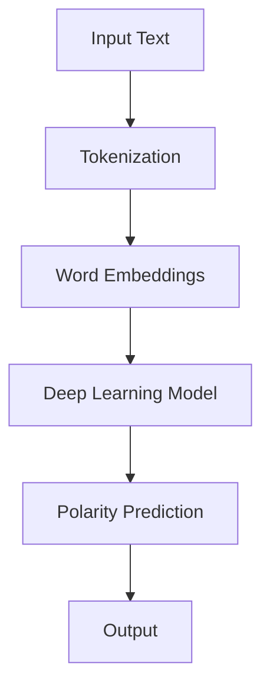

                 

### 文章标题

在当今的信息时代，人们每天都会接触到大量的文本信息，从社交媒体到产品评论、新闻报道和电子邮件，这些文本数据蕴含着丰富的情感信息。对这种情感信息的提取与分析，即情感分析，已经成为自然语言处理（NLP）领域的重要研究方向。近年来，深度学习在情感分析中的应用取得了显著的进展，使得我们能够更准确地理解和分析人类情感。本文将系统地探讨深度学习在情感分析中的最新进展，从基础理论到实际应用，全面解析这一前沿领域的发展动态。

### 关键词

1. 深度学习
2. 情感分析
3. 自然语言处理
4. 文本分类
5. 情感极性分析
6. 情感强度识别
7. 应用实践

### 摘要

本文旨在介绍深度学习在情感分析领域的最新研究成果。首先，我们将回顾情感分析和深度学习的基本概念，探讨传统情感分析方法的局限性。接着，我们将深入探讨深度学习的基础理论，包括常见模型和算法。随后，本文将详细介绍深度学习在情感分析中的具体应用，涵盖文本预处理、情感分类、情感极性分析和情感强度识别等多个方面。最后，我们将通过实际案例展示深度学习在情感分析中的应用实践，并展望未来的研究方向和发展趋势。通过本文的阅读，读者将能够全面了解深度学习在情感分析中的最新进展，掌握相关技术，并为未来的研究和应用提供参考。

### 目录大纲

#### 第一部分：情感分析与深度学习基础

##### 第1章：情感分析概述
###### 1.1 情感分析的定义与重要性
###### 1.2 情感分析的应用场景
###### 1.3 传统情感分析方法的局限性

##### 第2章：深度学习基础
###### 2.1 深度学习的基本概念
###### 2.2 常见的深度学习模型
###### 2.3 深度学习在情感分析中的应用

#### 第二部分：深度学习在情感分析中的应用

##### 第3章：文本预处理
###### 3.1 词向量和词嵌入技术
###### 3.2 数据预处理流程
###### 3.3 偏差校正与噪声消除

##### 第4章：情感分类
###### 4.1 情感分类的基本原理
###### 4.2 传统的情感分类方法
###### 4.3 基于深度学习的情感分类方法

##### 第5章：情感极性分析
###### 5.1 情感极性分析的定义
###### 5.2 情感极性分析的应用
###### 5.3 深度学习在情感极性分析中的优势

##### 第6章：情感强度识别
###### 6.1 情感强度的定义
###### 6.2 情感强度识别的方法
###### 6.3 深度学习在情感强度识别中的应用

##### 第7章：情感分析中的挑战与未来方向
###### 7.1 情感分析中的挑战
###### 7.2 最新进展与趋势
###### 7.3 未来研究方向与展望

#### 第三部分：深度学习在情感分析中的应用实践

##### 第8章：实战案例一：基于深度学习的社交媒体情感分析
###### 8.1 项目背景与目标
###### 8.2 数据收集与预处理
###### 8.3 模型设计与实现
###### 8.4 模型评估与优化

##### 第9章：实战案例二：基于深度学习的电影评论情感分析
###### 9.1 项目背景与目标
###### 9.2 数据收集与预处理
###### 9.3 模型设计与实现
###### 9.4 模型评估与优化

##### 第10章：实战案例三：基于深度学习的客户情感分析
###### 10.1 项目背景与目标
###### 10.2 数据收集与预处理
###### 10.3 模型设计与实现
###### 10.4 模型评估与优化

#### 附录

##### 附录A：深度学习在情感分析中的应用资源与工具
###### A.1 常用深度学习框架
###### A.2 情感分析数据集
###### A.3 情感分析论文推荐
###### A.4 情感分析社区与论坛

##### 参考文献

本文旨在通过系统的分析，帮助读者全面了解深度学习在情感分析领域的应用。接下来，我们将从基础理论到实际应用，逐步深入探讨这一前沿领域。

### 第一部分：情感分析与深度学习基础

#### 第1章：情感分析概述

##### 1.1 情感分析的定义与重要性

情感分析，又称意见挖掘或情感检测，是指通过自然语言处理技术，从文本数据中自动识别和提取情感信息的过程。情感分析的核心目标是判断文本表达的情感倾向，如正面、负面或中性。情感分析在多个领域具有重要应用价值，例如市场调研、客户服务、社交媒体监控和舆情分析。

情感分析的重要性体现在以下几个方面：

1. **市场调研：** 通过分析消费者对产品的情感态度，企业可以更准确地了解市场需求和消费者偏好，从而制定更有效的营销策略。
2. **客户服务：** 通过情感分析，企业能够实时监控客户反馈，快速识别负面情绪并采取相应措施，提升客户满意度。
3. **舆情分析：** 社交媒体和新闻报道中蕴含的大量情感信息，可以帮助政府、企业和社会更好地了解公众情绪和舆论动向。
4. **智能推荐系统：** 情感分析可以用于个性化推荐，根据用户的情感偏好推荐相关内容，提升用户体验。

##### 1.2 情感分析的应用场景

情感分析广泛应用于各种场景，以下是一些典型的应用：

1. **社交媒体分析：** 通过分析社交媒体上的用户评论和讨论，可以了解公众对特定话题或事件的态度。
2. **产品评论分析：** 电商平台上的产品评论是用户反馈的重要来源，通过情感分析可以评估产品的质量。
3. **新闻报道分析：** 新闻报道中的情感倾向可以揭示社会事件的影响和公众情绪的变化。
4. **客户反馈分析：** 企业可以通过情感分析了解客户对产品和服务的满意度，进而改进产品和服务。
5. **情感状态监测：** 在心理健康领域，情感分析可以用于监测患者的情感状态，辅助心理治疗。

##### 1.3 传统情感分析方法的局限性

早期的情感分析主要依赖于基于规则的方法和统计模型，这些方法在处理简单和规则明确的问题时表现较好，但在面对复杂、多变和模糊的情感表达时存在明显的局限性：

1. **规则依赖性：** 基于规则的方法需要大量手工编写的规则，难以应对复杂多变的情感表达。
2. **数据量要求高：** 统计模型通常依赖于大量的训练数据，而在实际应用中，获取大量标注数据往往成本高昂。
3. **情感理解深度不足：** 传统方法难以深入理解文本中的隐含情感和复杂情感，导致准确率受限。
4. **上下文依赖性差：** 文本中的情感表达往往受到上下文的影响，传统方法难以充分考虑上下文信息。

这些局限性促使研究者转向更加灵活和强大的深度学习技术，以提升情感分析的性能。

#### 第2章：深度学习基础

##### 2.1 深度学习的基本概念

深度学习是机器学习的一个分支，它通过模仿人脑的神经网络结构和功能，进行复杂的数据分析和模式识别。深度学习模型通常由多个层次（层）组成，每一层都能够对输入数据进行处理和变换，从而提取出更高层次的特征。

深度学习的关键组成部分包括：

1. **神经元（Neurons）：** 深度学习中的基本计算单元，类似于生物神经元。
2. **层次（Layers）：** 深度学习模型由多个层次组成，每一层都对输入数据进行处理和变换。
3. **激活函数（Activation Functions）：** 用于引入非线性特性，使模型能够学习复杂函数。
4. **损失函数（Loss Functions）：** 用于评估模型预测与真实标签之间的差距。
5. **优化算法（Optimization Algorithms）：** 用于调整模型参数，以最小化损失函数。

##### 2.2 常见的深度学习模型

深度学习在情感分析中的应用广泛，以下是一些常见的深度学习模型：

1. **卷积神经网络（CNN）：** CNN在图像处理领域取得了显著的成功，其卷积操作能够有效地提取图像特征。近年来，CNN也被应用于文本数据的处理，通过将文本转化为序列，CNN可以提取文本中的局部特征。
2. **循环神经网络（RNN）：** RNN专门设计用于处理序列数据，如文本、语音等。RNN通过其内部的循环结构，能够记忆和利用之前的信息，对文本中的上下文信息进行建模。
3. **长短期记忆网络（LSTM）：** LSTM是RNN的一种变体，旨在解决传统RNN在处理长序列数据时出现的梯度消失和梯度爆炸问题。LSTM通过其特殊的记忆单元结构，能够有效地学习和记忆长序列中的信息。
4. **Transformer模型：** Transformer模型是近年来提出的一种新型深度学习模型，特别适用于处理序列数据。与传统的RNN和LSTM不同，Transformer模型通过自注意力机制（Self-Attention）来建模序列中的长距离依赖关系，在自然语言处理任务中取得了显著的成果。
5. **预训练与微调（Pre-training and Fine-tuning）：** 预训练是指在大规模未标注数据上进行模型训练，使模型获得通用特征表示。微调是指将预训练模型在特定任务上继续训练，以适应具体任务的需求。预训练与微调结合的方法，已经成为深度学习在情感分析等领域的标准实践。

##### 2.3 深度学习在情感分析中的应用

深度学习在情感分析中的应用主要体现在以下几个方面：

1. **情感分类（Sentiment Classification）：** 情感分类是情感分析中最基础的任务，旨在判断文本的情感极性（如正面、负面或中性）。深度学习模型，如CNN、RNN和Transformer，能够有效地对文本进行特征提取和分类，显著提升分类准确率。
2. **情感极性分析（Sentiment Polarity Analysis）：** 情感极性分析旨在判断文本的情感倾向，即正面、负面还是中性。与情感分类相比，情感极性分析更加精细，可以区分情感强度。深度学习模型在情感极性分析中表现出色，能够准确判断文本的情感倾向。
3. **情感强度识别（Sentiment Intensity Recognition）：** 情感强度识别是情感分析中的高级任务，旨在判断文本情感的强度。深度学习模型，如LSTM和Transformer，能够通过学习文本中的情感强度特征，准确识别情感强度。
4. **情感分类与强度识别的结合：** 在实际应用中，情感分类和情感强度识别通常结合使用，以提供更全面的情感分析结果。深度学习模型可以通过联合建模情感分类和强度识别，实现更精确的情感分析。

通过以上对情感分析和深度学习基础的概述，我们为后续章节的深入探讨奠定了基础。接下来，我们将进一步探讨深度学习在情感分析中的应用细节，展示其在实际任务中的优势。

#### 第3章：深度学习在情感分析中的应用

深度学习在情感分析中的应用涵盖了从文本预处理到模型训练和评估的各个环节。本章将详细探讨深度学习在情感分析中的具体应用，包括文本预处理、情感分类、情感极性分析和情感强度识别等多个方面，以展示深度学习技术的强大功能。

##### 3.1 文本预处理

在深度学习模型处理文本数据之前，通常需要对原始文本进行一系列预处理操作，以提高模型训练的效果和准确性。文本预处理的主要任务包括分词、词向量和数据增强等。

1. **分词（Tokenization）：** 分词是将文本分割成单词或其他有意义的基本单元（token）的过程。中文和英文的分词方法有所不同。中文分词通常需要利用词性标注和语言模型，而英文分词则相对简单，通常使用正则表达式或词表匹配。
   
   ```python
   import jieba
   
   sentence = "我爱北京天安门"
   words = jieba.cut(sentence)
   print(words)
   ```

2. **词向量（Word Embeddings）：** 词向量是文本数据的向量表示，能够捕捉词语的语义信息。常见的词向量模型包括Word2Vec、GloVe和FastText。词向量能够将文本数据转换为数值形式，便于深度学习模型处理。

   ```python
   from gensim.models import Word2Vec
   
   sentences = [[word for word in jieba.cut(sentence)] for sentence in data]
   model = Word2Vec(sentences, vector_size=100, window=5, min_count=1, workers=4)
   ```

3. **数据增强（Data Augmentation）：** 数据增强是通过生成或修改原始文本，增加训练数据多样性的方法。常见的数据增强技术包括同义词替换、随机插入和删除、情感极性反转等。

   ```python
   import random
   
   def augment_text(text):
       words = text.split()
       for i in range(len(words)):
           if random.random() < 0.5:
               words[i] = synonym replacement(words[i])
       return ' '.join(words)
   ```

##### 3.2 情感分类

情感分类是情感分析中最基础的任务，旨在判断文本的情感极性。深度学习模型，如CNN、RNN和Transformer，在情感分类任务中表现出色。

1. **CNN在情感分类中的应用：** CNN在图像处理中广泛应用，其卷积操作能够提取文本的局部特征。在情感分类中，CNN通过词向量作为输入，通过卷积层提取特征，然后通过全连接层进行分类。

   ```mermaid
   graph TD
   A[Input] --> B[Word Embeddings]
   B --> C[Convolutional Layer]
   C --> D[Pooling Layer]
   D --> E[Flattening]
   E --> F[Fully Connected Layer]
   F --> G[Output]
   ```

2. **RNN在情感分类中的应用：** RNN专门设计用于处理序列数据，如文本。RNN通过其内部的循环结构，能够记住之前的文本信息，从而更好地理解上下文。

   ```mermaid
   graph TD
   A[Input] --> B[Word Embeddings]
   B --> C[Recurrent Layer]
   C --> D[H_T]
   D --> E[Fully Connected Layer]
   E --> F[Output]
   ```

3. **Transformer在情感分类中的应用：** Transformer模型通过自注意力机制（Self-Attention），能够捕捉文本中的长距离依赖关系，在情感分类任务中表现出色。

   ```mermaid
   graph TD
   A[Input] --> B[Word Embeddings]
   B --> C[Multi-head Self-Attention]
   C --> D[Positional Encoding]
   D --> E[Feed Forward Neural Network]
   E --> F[Output]
   ```

##### 3.3 情感极性分析

情感极性分析旨在判断文本的情感倾向，即正面、负面还是中性。与情感分类相比，情感极性分析更加精细，可以区分情感强度。

1. **传统情感分类方法：** 传统情感分类方法，如朴素贝叶斯、支持向量机和逻辑回归，通过特征提取和分类器训练进行情感极性分析。这些方法在处理简单和规则明确的问题时表现较好，但在处理复杂和模糊的情感表达时效果不佳。

2. **基于深度学习的情感分类方法：** 基于深度学习的情感分类方法，如CNN、RNN和Transformer，能够更好地提取文本特征，准确判断情感极性。以下是一个基于CNN的情感极性分析模型的伪代码：

   ```python
   def sentiment_polarity_analysis(text):
       # 分词和词向量编码
       tokens = tokenize(text)
       embeddings = encode_tokens(tokens)
       
       # 卷积神经网络模型
       model = CNNModel(input_shape=embeddings.shape)
       
       # 情感极性分类
       prediction = model.predict(embeddings)
       
       return prediction
   ```

##### 3.4 情感强度识别

情感强度识别是情感分析中的高级任务，旨在判断文本情感的强度。深度学习模型，如LSTM和Transformer，能够通过学习文本中的情感强度特征，准确识别情感强度。

1. **LSTM在情感强度识别中的应用：** LSTM通过其特殊的记忆单元结构，能够记忆和利用长序列中的信息，从而准确识别情感强度。

   ```mermaid
   graph TD
   A[Input] --> B[Word Embeddings]
   B --> C[LSTM Layer]
   C --> D[H_T]
   D --> E[Fully Connected Layer]
   E --> F[Output]
   ```

2. **Transformer在情感强度识别中的应用：** Transformer通过自注意力机制，能够捕捉文本中的长距离依赖关系，准确识别情感强度。

   ```mermaid
   graph TD
   A[Input] --> B[Word Embeddings]
   B --> C[Multi-head Self-Attention]
   C --> D[Positional Encoding]
   D --> E[Feed Forward Neural Network]
   E --> F[Output]
   ```

##### 3.5 情感分类与强度识别的结合

在实际应用中，情感分类和情感强度识别通常结合使用，以提供更全面的情感分析结果。以下是一个基于Transformer的情感分类与强度识别模型的伪代码：

```python
def sentiment_analysis(text):
    # 分词和词向量编码
    tokens = tokenize(text)
    embeddings = encode_tokens(tokens)
    
    # Transformer模型
    model = TransformerModel(input_shape=embeddings.shape)
    
    # 情感分类与强度识别
    classification, intensity = model.predict(embeddings)
    
    return classification, intensity
```

通过以上对深度学习在情感分析中的应用的详细探讨，我们可以看到深度学习技术为情感分析带来了显著的改进。接下来，我们将继续探讨情感分析中的挑战和未来发展方向，以期为读者提供更全面的视角。

#### 第4章：情感极性分析

##### 4.1 情感极性分析的定义

情感极性分析，也称为情感倾向分析，是指通过算法和模型对文本内容进行情感倾向判断，以确定文本表达的是正面、负面还是中性情感。情感极性分析是情感分析中的一个基本任务，它在商业分析、社交媒体监控、客户反馈处理等领域具有重要应用价值。

在情感极性分析中，文本被分成三个主要类别：

1. **正面情感（Positive）：** 文本表达积极、愉悦或满意等情感。
2. **负面情感（Negative）：** 文本表达消极、不悦或不满等情感。
3. **中性情感（Neutral）：** 文本不表达明显的正面或负面情感，或情感倾向不明确。

##### 4.2 情感极性分析的应用

情感极性分析在多个领域有着广泛的应用，以下是一些典型的应用场景：

1. **市场调研：** 企业可以通过情感极性分析了解消费者对产品或服务的反馈，从而制定更有效的营销策略。
2. **客户服务：** 金融机构和零售商可以使用情感极性分析来监控客户投诉和反馈，快速识别潜在的问题并采取相应的措施。
3. **舆情监控：** 政府机构和媒体公司可以通过情感极性分析监控公众舆论，了解社会热点和公众情绪。
4. **社交媒体分析：** 社交媒体平台可以利用情感极性分析分析用户评论和帖子，识别热门话题和趋势。
5. **产品评论分析：** 在电商平台上，情感极性分析可以帮助商家了解消费者对产品的评价，优化产品和服务。

##### 4.3 深度学习在情感极性分析中的优势

传统的情感极性分析方法主要包括基于规则的方法和机器学习算法，如朴素贝叶斯、支持向量机和逻辑回归等。这些方法在处理规则明确、数据量较小的任务时表现良好，但面对复杂、模糊和多样化的情感表达时，存在以下局限性：

1. **规则依赖性：** 基于规则的方法需要大量手工编写的规则，难以适应不断变化的情感表达。
2. **数据量要求高：** 机器学习算法通常需要大量标注数据进行训练，而在实际应用中，获取标注数据成本高昂。
3. **情感理解深度不足：** 传统方法难以深入理解文本中的隐含情感和复杂情感，导致准确率受限。

深度学习模型，特别是基于神经网络的模型，在情感极性分析中展现出显著的优越性，主要原因包括：

1. **自动特征提取：** 深度学习模型可以通过多层神经网络自动提取文本中的特征，无需人工定义特征。
2. **端到端学习：** 深度学习模型可以实现端到端的学习，从原始文本直接预测情感极性，无需中间的特征工程步骤。
3. **强大的表达能力：** 深度学习模型具有强大的非线性表达能力，能够捕捉文本中的复杂情感和上下文信息。
4. **适应性：** 深度学习模型可以通过微调（Fine-tuning）快速适应不同任务和数据集，提高模型在特定领域的性能。

以下是一个基于深度学习模型进行情感极性分析的基本框架：



##### 4.4 深度学习在情感极性分析中的具体实现

深度学习在情感极性分析中的应用主要包括以下几个方面：

1. **词向量编码：** 首先，需要对文本进行分词，并将每个单词转换为词向量表示。常用的词向量模型包括Word2Vec、GloVe和FastText。
2. **模型架构：** 选择合适的深度学习模型架构，如CNN、RNN和Transformer等，用于文本特征提取和情感极性预测。
3. **训练与优化：** 使用大量标注数据进行模型训练，通过优化损失函数调整模型参数，提高模型性能。
4. **评估与验证：** 使用独立的测试集对模型进行评估，通过准确率、召回率、F1分数等指标评估模型性能。

以下是一个基于Transformer的情感极性分析模型的实现示例：

```python
import tensorflow as tf
from tensorflow.keras.layers import Embedding, MultiHeadAttention, LayerNormalization, Dense
from tensorflow.keras.models import Model

def create_transformer_model(input_vocab_size, d_model, num_heads, dff, input_sequence_length):
    inputs = tf.keras.layers.Input(shape=(input_sequence_length,))

    # 词向量编码
    embeddings = Embedding(input_vocab_size, d_model)(inputs)
    embeddings = tf.keras.layers.Dropout(0.1)(embeddings)

    # 自注意力层
    attention = MultiHeadAttention(num_heads=num_heads, key_dim=d_model)(embeddings, embeddings)

    # 层归一化和前馈网络
    attention = LayerNormalization(epsilon=1e-6)(embeddings + attention)
    attention = tf.keras.layers.Dropout(0.1)(attention)
    attention = Dense(dff, activation='relu')(attention)
    attention = LayerNormalization(epsilon=1e-6)(attention)
    attention = Dense(d_model)(attention)

    # 输出层
    outputs = tf.keras.layers.Dense(1, activation='sigmoid')(attention)

    # 构建和编译模型
    model = Model(inputs, outputs)
    model.compile(optimizer='adam', loss='binary_crossentropy', metrics=['accuracy'])

    return model

# 模型参数
input_vocab_size = 10000
d_model = 512
num_heads = 8
dff = 2048
input_sequence_length = 128

# 创建模型
model = create_transformer_model(input_vocab_size, d_model, num_heads, dff, input_sequence_length)

# 模型训练
# model.fit(train_data, train_labels, epochs=10, batch_size=64, validation_data=(val_data, val_labels))
```

通过以上示例，我们可以看到深度学习模型在情感极性分析中的具体实现过程，包括词向量编码、模型架构设计、训练与优化以及评估与验证。接下来，我们将继续探讨情感强度识别，并分析深度学习在这一任务中的优势和应用。

#### 第5章：情感强度识别

##### 5.1 情感强度的定义

情感强度识别，又称情感极性强度分析，是指通过算法和模型判断文本情感倾向的强度，即情感表达的程度。情感强度识别不仅关注情感极性（正面、负面或中性），还试图量化情感的强度，从而提供更丰富的情感分析结果。情感强度通常用数值或类别表示，如从1到5的评分，或非常积极、积极、中性、消极和非常消极等类别。

情感强度识别与情感极性分析的关系紧密，情感极性分析是情感强度识别的基础，而情感强度识别则是对情感极性分析结果的进一步细化。情感极性分析关注文本的情感倾向，而情感强度识别则关注情感的强度差异。

##### 5.2 情感强度识别的方法

情感强度识别的方法可以分为传统方法和基于深度学习的方法。

1. **传统方法：**
   - **基于规则的方法：** 通过定义一系列规则，如情感词汇和短语匹配，来判断情感的强度。这些规则通常需要人工编写，难以适应复杂和多样化的情感表达。
   - **基于统计模型的方法：** 如线性回归、逻辑回归和支持向量机等，通过分析文本特征（如词频、词序列等）和情感强度之间的关系，建立情感强度预测模型。

2. **基于深度学习的方法：**
   - **循环神经网络（RNN）：** RNN通过其内部的循环结构，能够捕捉文本中的时间依赖关系，从而在情感强度识别中表现出色。特别是长短期记忆网络（LSTM）和门控循环单元（GRU），它们能够有效记忆长序列中的信息，提高情感强度识别的准确性。
   - **卷积神经网络（CNN）：** CNN擅长提取局部特征，通过卷积操作和池化操作，可以从文本中提取情感强度的特征。
   - ** Transformer模型：** Transformer模型通过自注意力机制，能够捕捉文本中的长距离依赖关系，从而在情感强度识别中表现出色。

##### 5.3 深度学习在情感强度识别中的应用

深度学习模型在情感强度识别中具有明显的优势，能够更好地理解和分析文本中的情感强度。以下是一些深度学习模型在情感强度识别中的应用实例：

1. **LSTM在情感强度识别中的应用：** LSTM通过其特殊的记忆单元结构，能够记忆和利用长序列中的信息，从而准确识别情感强度。以下是一个基于LSTM的情感强度识别模型的实现示例：

   ```python
   from tensorflow.keras.models import Sequential
   from tensorflow.keras.layers import LSTM, Dense, Embedding, SpatialDropout1D

   model = Sequential()
   model.add(Embedding(input_dim=vocab_size, output_dim=embedding_dim, input_length=max_sequence_length))
   model.add(SpatialDropout1D(rate=0.4))
   model.add(LSTM(units=100, dropout=0.2, recurrent_dropout=0.2))
   model.add(Dense(units=1, activation='sigmoid'))

   model.compile(optimizer='adam', loss='binary_crossentropy', metrics=['accuracy'])
   ```

2. **CNN在情感强度识别中的应用：** CNN通过卷积操作和池化操作，可以从文本中提取情感强度的特征。以下是一个基于CNN的情感强度识别模型的实现示例：

   ```python
   from tensorflow.keras.models import Sequential
   from tensorflow.keras.layers import Conv1D, MaxPooling1D, Flatten, Dense, Embedding, SpatialDropout1D

   model = Sequential()
   model.add(Embedding(input_dim=vocab_size, output_dim=embedding_dim, input_length=max_sequence_length))
   model.add(SpatialDropout1D(rate=0.4))
   model.add(Conv1D(filters=128, kernel_size=5, activation='relu'))
   model.add(MaxPooling1D(pool_size=5))
   model.add(Flatten())
   model.add(Dense(units=1, activation='sigmoid'))

   model.compile(optimizer='adam', loss='binary_crossentropy', metrics=['accuracy'])
   ```

3. **Transformer在情感强度识别中的应用：** Transformer模型通过自注意力机制，能够捕捉文本中的长距离依赖关系，从而在情感强度识别中表现出色。以下是一个基于Transformer的情感强度识别模型的实现示例：

   ```python
   from tensorflow.keras.layers import LayerNormalization, MultiHeadAttention, Dense, Embedding

   def create_transformer_layer(d_model, num_heads):
       attention = MultiHeadAttention(num_heads=num_heads, key_dim=d_model)
       norm = LayerNormalization(epsilon=1e-6)
       return attention, norm

   attention, norm = create_transformer_layer(d_model, num_heads)
   x = attention([x, x])
   x = norm(x + x)
   x = Dense(1, activation='sigmoid')(x)
   ```

深度学习模型在情感强度识别中的应用，通过自动特征提取和端到端学习，能够更准确地理解和分析文本中的情感强度。接下来，我们将探讨情感分析中的挑战和未来发展方向，以期为读者提供更全面的视角。

##### 第6章：情感分析中的挑战与未来方向

尽管深度学习在情感分析中取得了显著的进展，但这一领域仍然面临着一系列挑战，这些问题需要在未来的研究中得到进一步解决。

###### 6.1 情感分析中的挑战

1. **数据的多样性和复杂性：** 情感表达方式多样且复杂，不同的语言、文化背景和社会环境可能导致相同的情感表达呈现出不同的形式。这给情感分析带来了挑战，因为传统的情感词典和规则难以覆盖所有可能的情感表达。

2. **上下文依赖性：** 文本中的情感往往受到上下文的影响，如词语的多义性和成语的固定搭配。深度学习模型在捕捉上下文依赖性方面虽然有所改善，但仍然难以完全消除上下文对情感分析结果的影响。

3. **数据稀缺性：** 大规模、高质量的标注数据是训练深度学习模型的关键。然而，获取这样的数据成本高昂，特别是在特定领域或小众语言中。数据稀缺性限制了模型的泛化能力和性能。

4. **情感强度和细微差异的识别：** 情感强度和细微差异的识别是情感分析中的高级任务，现有模型在这方面的表现仍不够理想。情感强度识别需要准确捕捉情感的程度，而细微差异的识别则需要模型具备更高的语义理解能力。

5. **模型解释性：** 深度学习模型通常被视为“黑箱”，其决策过程难以解释。这对于需要透明性和可解释性的应用场景（如医疗、金融等）来说是一个挑战。

6. **实时性和效率：** 情感分析往往需要在实时或近实时的环境中进行，这对模型的速度和效率提出了高要求。现有的深度学习模型在处理大规模文本数据时，可能存在计算复杂度高和延迟大的问题。

###### 6.2 最新进展与趋势

近年来，深度学习在情感分析领域取得了以下一些重要进展：

1. **预训练与微调：** 预训练与微调已成为深度学习在自然语言处理任务中的标准方法。通过在大规模未标注数据上预训练模型，然后在小规模标注数据上进行微调，可以显著提高模型性能。

2. **多模态情感分析：** 多模态情感分析结合文本、语音、图像和视频等多种数据源，通过综合不同模态的信息，可以更全面地理解和分析情感。近年来，多模态情感分析在情感分析中得到了广泛关注和应用。

3. **生成对抗网络（GAN）：** GAN在情感分析中的应用，可以用于生成模拟数据集，缓解数据稀缺性问题。通过GAN生成的模拟数据，可以增强模型的泛化能力，提高情感分析的准确性。

4. **少样本学习：** 少样本学习旨在解决数据稀缺性带来的挑战，通过在少量标注数据上训练模型，可以减少对大规模标注数据的依赖。近年来，一些少样本学习方法在情感分析中取得了显著成果。

5. **跨语言情感分析：** 跨语言情感分析关注在不同语言间的情感表达和理解。随着多语言预训练模型（如mBERT、XLM等）的发展，跨语言情感分析在多语言环境中取得了显著进展。

6. **情感增强学习：** 情感增强学习通过模拟人类情感反应，提升模型在情感分析中的性能。情感增强学习可以用于生成更具说服力的文本，或改进情感分类和强度识别的准确性。

###### 6.3 未来研究方向与展望

未来，情感分析领域有望在以下几个方面取得进一步发展：

1. **更先进的模型架构：** 如基于Transformer的变体模型（如BERT、GPT等）在情感分析中的应用，可能带来性能的提升和新的突破。

2. **跨领域和跨语言的情感分析：** 通过构建跨领域和跨语言的通用情感分析模型，可以提升模型在不同应用场景和语言环境中的泛化能力。

3. **情感增强与适应性：** 通过情感增强学习和适应性设计，使模型能够更好地模拟人类情感反应，提升情感分析的应用效果。

4. **实时性与效率：** 研究高效的模型压缩和加速技术，以提高情感分析在实时环境中的速度和效率。

5. **模型解释性与透明性：** 开发可解释的深度学习模型，提升模型决策过程的透明性，满足应用场景中的透明性需求。

6. **情感微表达的识别：** 情感微表达是指文本中隐含的、非直接表达的情感。通过研究情感微表达，可以提升情感分析的精度和细致度。

通过上述对情感分析中挑战与未来方向的探讨，我们可以看到深度学习在这一领域的广泛应用和潜力。随着技术的不断进步，情感分析有望在未来为各个行业带来更多的创新和变革。

#### 第三部分：深度学习在情感分析中的应用实践

##### 第8章：实战案例一：基于深度学习的社交媒体情感分析

###### 8.1 项目背景与目标

社交媒体情感分析是当前情感分析领域中的一个热点课题。随着社交媒体的普及，用户在社交媒体上发布的大量文本数据中蕴含了丰富的情感信息。对这些情感信息的分析，可以帮助企业和机构了解用户对品牌、产品或事件的看法，从而优化营销策略、改进产品设计以及应对危机事件。

本案例的目标是通过深度学习技术，构建一个社交媒体情感分析模型，以自动识别和分析社交媒体文本中的情感倾向。具体目标包括：

1. 收集和预处理社交媒体文本数据，包括微博、Twitter和Facebook等平台。
2. 设计并实现一个基于深度学习的情感分析模型，用于分类文本的情感极性（正面、负面、中性）。
3. 对模型进行训练和评估，确保其准确性和可靠性。
4. 应用模型进行实际情感分析，提供用户情感趋势分析和热点话题识别。

###### 8.2 数据收集与预处理

为了构建一个有效的社交媒体情感分析模型，首先需要收集大量的社交媒体文本数据。以下是数据收集与预处理的具体步骤：

1. **数据收集：**
   - 利用API接口从社交媒体平台上获取公开的文本数据，如微博的API提供了微博的全文数据。
   - 使用爬虫工具（如Python的requests库和BeautifulSoup库）从社交媒体网站上抓取文本数据。

2. **数据预处理：**
   - **去噪处理：** 去除文本中的HTML标签、URL链接、用户名和特殊字符，保留原始文本内容。
   - **分词与停用词处理：** 使用分词工具（如Python的jieba库）对文本进行分词，同时去除常见的停用词（如“的”、“了”等），以提高文本的干净度和模型训练效果。
   - **词向量编码：** 将分词后的文本转换为词向量表示，常用的词向量模型包括Word2Vec和GloVe。

以下是一个简单的Python代码示例，用于数据收集和预处理：

```python
import requests
from bs4 import BeautifulSoup
from jieba import posseg

# 示例：从微博获取数据
response = requests.get('https://weibo.com')
soup = BeautifulSoup(response.text, 'html.parser')
tweets = soup.find_all('div', class_='text')

# 去噪处理
clean_tweets = []
for tweet in tweets:
    text = tweet.text.strip()
    text = re.sub(r'http\S+', '', text)  # 去除URL链接
    clean_tweets.append(text)

# 分词与停用词处理
stop_words = set(['的', '了', '在', '和'])
processed_tweets = []
for tweet in clean_tweets:
    words = posseg.cut(tweet)
    filtered_words = [word for word, flag in words if word not in stop_words]
    processed_tweets.append(' '.join(filtered_words))

# 词向量编码
# 使用GloVe模型进行词向量编码
# ...

```

###### 8.3 模型设计与实现

为了实现社交媒体情感分析，我们可以选择以下几种深度学习模型：

1. **循环神经网络（RNN）：** RNN能够处理序列数据，适合情感分析任务。
2. **卷积神经网络（CNN）：** CNN在文本情感分析中表现出色，可以提取文本的局部特征。
3. **Transformer模型：** Transformer通过自注意力机制，能够捕捉文本中的长距离依赖关系，适用于处理复杂情感分析任务。

以下是一个基于RNN的情感分析模型的实现示例：

```python
from tensorflow.keras.models import Sequential
from tensorflow.keras.layers import LSTM, Dense, Embedding, SpatialDropout1D

# 模型参数
vocab_size = 10000
embedding_dim = 128
max_sequence_length = 500
units = 128

# 构建模型
model = Sequential()
model.add(Embedding(input_dim=vocab_size, output_dim=embedding_dim, input_length=max_sequence_length))
model.add(SpatialDropout1D(rate=0.2))
model.add(LSTM(units=units, dropout=0.2, recurrent_dropout=0.2))
model.add(Dense(units=1, activation='sigmoid'))

# 编译模型
model.compile(optimizer='adam', loss='binary_crossentropy', metrics=['accuracy'])

# 模型训练
# model.fit(x_train, y_train, epochs=10, batch_size=64, validation_data=(x_val, y_val))
```

在这个模型中，我们使用了嵌入层（Embedding）将词向量输入到LSTM（长短期记忆网络）中进行序列处理，最后通过全连接层（Dense）输出情感极性的概率。模型的编译和训练过程使用了标准的机器学习库（如TensorFlow和Keras）。

###### 8.4 模型评估与优化

在完成模型训练后，需要对模型进行评估和优化，以确保其性能和准确性。以下是一些常用的评估指标和优化策略：

1. **评估指标：**
   - **准确率（Accuracy）：** 衡量模型正确分类的样本数占总样本数的比例。
   - **精确率（Precision）：** 衡量模型预测为正面的样本中实际为正面的比例。
   - **召回率（Recall）：** 衡量模型预测为正面的样本中实际为正面的比例。
   - **F1分数（F1 Score）：** 结合精确率和召回率的综合指标，用于评估模型的总体性能。

以下是一个简单的Python代码示例，用于评估模型性能：

```python
from sklearn.metrics import accuracy_score, precision_score, recall_score, f1_score

# 预测
predictions = model.predict(x_test)
predicted_labels = (predictions > 0.5)

# 评估
accuracy = accuracy_score(y_test, predicted_labels)
precision = precision_score(y_test, predicted_labels)
recall = recall_score(y_test, predicted_labels)
f1 = f1_score(y_test, predicted_labels)

print("Accuracy:", accuracy)
print("Precision:", precision)
print("Recall:", recall)
print("F1 Score:", f1)
```

2. **优化策略：**
   - **超参数调优：** 通过调整嵌入层维度、LSTM单元数、学习率等超参数，优化模型性能。
   - **数据增强：** 通过同义词替换、随机插入和删除等数据增强技术，增加训练数据的多样性，提升模型泛化能力。
   - **模型融合：** 结合多个模型的预测结果，通过投票或加权平均等方法，提高整体预测准确性。

通过上述实战案例，我们展示了如何利用深度学习技术进行社交媒体情感分析。在实际应用中，可以根据具体需求和数据特点，选择合适的模型架构和优化策略，以提高情感分析的性能和准确性。

##### 第9章：实战案例二：基于深度学习的电影评论情感分析

###### 9.1 项目背景与目标

电影评论情感分析是情感分析领域的一个重要应用场景。随着互联网的普及，越来越多的用户在电影评论网站上发表对电影的看法。通过分析这些评论，可以了解观众对电影的总体评价，帮助电影制作公司、发行商和影评人更好地了解观众需求和市场反馈。

本案例的目标是构建一个基于深度学习的电影评论情感分析模型，以自动识别和评估电影评论的情感极性（正面、负面、中性）。具体目标包括：

1. 收集和预处理大量的电影评论数据，确保数据的质量和多样性。
2. 设计并实现一个基于深度学习的情感分析模型，用于分类电影评论的情感极性。
3. 对模型进行训练和评估，确保其准确性和可靠性。
4. 应用模型进行实际情感分析，为电影制作公司提供观众情感趋势分析和评论热点识别。

###### 9.2 数据收集与预处理

为了构建一个有效的电影评论情感分析模型，首先需要收集大量的电影评论数据。以下是数据收集与预处理的具体步骤：

1. **数据收集：**
   - 利用现有的公开电影评论数据集，如IMDb电影评论数据集。
   - 可以从电影评论网站（如Rotten Tomatoes、Metacritic等）爬取电影评论数据。

2. **数据预处理：**
   - **去噪处理：** 去除评论中的HTML标签、URL链接、用户名和特殊字符，保留原始评论内容。
   - **分词与停用词处理：** 使用分词工具（如Python的jieba库）对评论进行分词，同时去除常见的停用词（如“的”、“了”等），以提高评论的干净度和模型训练效果。
   - **词向量编码：** 将分词后的评论转换为词向量表示，常用的词向量模型包括Word2Vec和GloVe。

以下是一个简单的Python代码示例，用于数据收集和预处理：

```python
import requests
from bs4 import BeautifulSoup
from jieba import posseg

# 示例：从IMDb获取数据
response = requests.get('https://www.imdb.com/title/tt0111161/reviews')
soup = BeautifulSoup(response.text, 'html.parser')
reviews = soup.find_all('div', class_='text show-more__control')

# 去噪处理
clean_reviews = []
for review in reviews:
    text = review.text.strip()
    text = re.sub(r'http\S+', '', text)  # 去除URL链接
    clean_reviews.append(text)

# 分词与停用词处理
stop_words = set(['的', '了', '在', '和'])
processed_reviews = []
for review in clean_reviews:
    words = posseg.cut(review)
    filtered_words = [word for word, flag in words if word not in stop_words]
    processed_reviews.append(' '.join(filtered_words))

# 词向量编码
# 使用GloVe模型进行词向量编码
# ...
```

###### 9.3 模型设计与实现

为了实现电影评论情感分析，我们可以选择以下几种深度学习模型：

1. **循环神经网络（RNN）：** RNN能够处理序列数据，适合情感分析任务。
2. **卷积神经网络（CNN）：** CNN在文本情感分析中表现出色，可以提取文本的局部特征。
3. **Transformer模型：** Transformer通过自注意力机制，能够捕捉文本中的长距离依赖关系，适用于处理复杂情感分析任务。

以下是一个基于CNN的情感分析模型的实现示例：

```python
from tensorflow.keras.models import Sequential
from tensorflow.keras.layers import Conv1D, MaxPooling1D, Flatten, Dense, Embedding, SpatialDropout1D

# 模型参数
vocab_size = 10000
embedding_dim = 128
max_sequence_length = 500
filter_sizes = [3, 4, 5]
num_filters = 128
dropout_rate = 0.5

# 构建模型
model = Sequential()
model.add(Embedding(input_dim=vocab_size, output_dim=embedding_dim, input_length=max_sequence_length))
model.add(SpatialDropout1D(rate=dropout_rate))
for size in filter_sizes:
    model.add(Conv1D(filters=num_filters, kernel_size=size, activation='relu'))
    model.add(MaxPooling1D(pool_size=2))
model.add(Flatten())
model.add(Dense(units=1, activation='sigmoid'))

# 编译模型
model.compile(optimizer='adam', loss='binary_crossentropy', metrics=['accuracy'])

# 模型训练
# model.fit(x_train, y_train, epochs=10, batch_size=64, validation_data=(x_val, y_val))
```

在这个模型中，我们使用了嵌入层（Embedding）将词向量输入到卷积层（Conv1D）中进行特征提取，然后通过池化层（MaxPooling1D）提取文本的主要特征，最后通过全连接层（Dense）输出情感极性的概率。模型的编译和训练过程使用了标准的机器学习库（如TensorFlow和Keras）。

###### 9.4 模型评估与优化

在完成模型训练后，需要对模型进行评估和优化，以确保其性能和准确性。以下是一些常用的评估指标和优化策略：

1. **评估指标：**
   - **准确率（Accuracy）：** 衡量模型正确分类的样本数占总样本数的比例。
   - **精确率（Precision）：** 衡量模型预测为正面的样本中实际为正面的比例。
   - **召回率（Recall）：** 衡量模型预测为正面的样本中实际为正面的比例。
   - **F1分数（F1 Score）：** 结合精确率和召回率的综合指标，用于评估模型的总体性能。

以下是一个简单的Python代码示例，用于评估模型性能：

```python
from sklearn.metrics import accuracy_score, precision_score, recall_score, f1_score

# 预测
predictions = model.predict(x_test)
predicted_labels = (predictions > 0.5)

# 评估
accuracy = accuracy_score(y_test, predicted_labels)
precision = precision_score(y_test, predicted_labels)
recall = recall_score(y_test, predicted_labels)
f1 = f1_score(y_test, predicted_labels)

print("Accuracy:", accuracy)
print("Precision:", precision)
print("Recall:", recall)
print("F1 Score:", f1)
```

2. **优化策略：**
   - **超参数调优：** 通过调整嵌入层维度、卷积核尺寸、学习率等超参数，优化模型性能。
   - **数据增强：** 通过同义词替换、随机插入和删除等数据增强技术，增加训练数据的多样性，提升模型泛化能力。
   - **模型融合：** 结合多个模型的预测结果，通过投票或加权平均等方法，提高整体预测准确性。

通过上述实战案例，我们展示了如何利用深度学习技术进行电影评论情感分析。在实际应用中，可以根据具体需求和数据特点，选择合适的模型架构和优化策略，以提高情感分析的性能和准确性。

##### 第10章：实战案例三：基于深度学习的客户情感分析

###### 10.1 项目背景与目标

客户情感分析是客户关系管理和市场调研中的重要一环。通过分析客户在社交媒体、客服反馈、调查问卷等渠道中的文本数据，企业可以深入了解客户的情感状态，从而优化产品和服务，提升客户满意度和忠诚度。

本案例的目标是通过深度学习技术，构建一个客户情感分析模型，以自动识别和评估客户反馈中的情感极性和强度。具体目标包括：

1. 收集和预处理大量的客户反馈数据，确保数据的质量和多样性。
2. 设计并实现一个基于深度学习的情感分析模型，用于分类客户反馈的情感极性（正面、负面、中性）和强度。
3. 对模型进行训练和评估，确保其准确性和可靠性。
4. 应用模型进行实际情感分析，为企业提供客户情感趋势分析和个性化建议。

###### 10.2 数据收集与预处理

为了构建一个有效的客户情感分析模型，首先需要收集大量的客户反馈数据。以下是数据收集与预处理的具体步骤：

1. **数据收集：**
   - 从企业的客服系统、社交媒体和问卷调查等渠道收集客户反馈数据。
   - 利用API接口或爬虫工具从社交媒体平台（如Twitter、Facebook等）获取用户评论和反馈。

2. **数据预处理：**
   - **去噪处理：** 去除反馈文本中的HTML标签、URL链接、用户名和特殊字符，保留原始文本内容。
   - **分词与停用词处理：** 使用分词工具（如Python的jieba库）对反馈文本进行分词，同时去除常见的停用词（如“的”、“了”等），以提高文本的干净度和模型训练效果。
   - **情感标签标注：** 对客户反馈进行情感标签标注，标注为正面、负面或中性。标注工作可以由人类标注员完成，也可以利用已有的标注工具。

以下是一个简单的Python代码示例，用于数据收集和预处理：

```python
import requests
from bs4 import BeautifulSoup
from jieba import posseg

# 示例：从企业客服系统获取数据
response = requests.get('https://www.example.com/knowledge-base')
soup = BeautifulSoup(response.text, 'html.parser')
feedbacks = soup.find_all('div', class_='feedback')

# 去噪处理
clean_feedbacks = []
for feedback in feedbacks:
    text = feedback.text.strip()
    text = re.sub(r'http\S+', '', text)  # 去除URL链接
    clean_feedbacks.append(text)

# 分词与停用词处理
stop_words = set(['的', '了', '在', '和'])
processed_feedbacks = []
for feedback in clean_feedbacks:
    words = posseg.cut(feedback)
    filtered_words = [word for word, flag in words if word not in stop_words]
    processed_feedbacks.append(' '.join(filtered_words))

# 情感标签标注
# 使用人工标注或标注工具进行情感标签标注
# ...

```

###### 10.3 模型设计与实现

为了实现客户情感分析，我们可以选择以下几种深度学习模型：

1. **循环神经网络（RNN）：** RNN能够处理序列数据，适合情感分析任务。
2. **卷积神经网络（CNN）：** CNN在文本情感分析中表现出色，可以提取文本的局部特征。
3. **Transformer模型：** Transformer通过自注意力机制，能够捕捉文本中的长距离依赖关系，适用于处理复杂情感分析任务。

以下是一个基于Transformer的情感分析模型的实现示例：

```python
from tensorflow.keras.models import Model
from tensorflow.keras.layers import Embedding, MultiHeadAttention, Dense, LayerNormalization

# 模型参数
vocab_size = 10000
embedding_dim = 128
d_model = 512
num_heads = 8
d_ff = 2048
max_sequence_length = 500

# 构建模型
inputs = Embedding(vocab_size, embedding_dim)(inputs)
attention_output = MultiHeadAttention(num_heads=num_heads, key_dim=d_model)(inputs, inputs)
attention_output = LayerNormalization(epsilon=1e-6)(inputs + attention_output)
output = Dense(1, activation='sigmoid')(attention_output)

model = Model(inputs, output)
model.compile(optimizer='adam', loss='binary_crossentropy', metrics=['accuracy'])

# 模型训练
# model.fit(x_train, y_train, epochs=10, batch_size=64, validation_data=(x_val, y_val))
```

在这个模型中，我们使用了嵌入层（Embedding）将词向量输入到多头自注意力层（MultiHeadAttention）中进行特征提取，然后通过层归一化（LayerNormalization）和全连接层（Dense）输出情感极性的概率。模型的编译和训练过程使用了标准的机器学习库（如TensorFlow和Keras）。

###### 10.4 模型评估与优化

在完成模型训练后，需要对模型进行评估和优化，以确保其性能和准确性。以下是一些常用的评估指标和优化策略：

1. **评估指标：**
   - **准确率（Accuracy）：** 衡量模型正确分类的样本数占总样本数的比例。
   - **精确率（Precision）：** 衡量模型预测为正面的样本中实际为正面的比例。
   - **召回率（Recall）：** 衡量模型预测为正面的样本中实际为正面的比例。
   - **F1分数（F1 Score）：** 结合精确率和召回率的综合指标，用于评估模型的总体性能。

以下是一个简单的Python代码示例，用于评估模型性能：

```python
from sklearn.metrics import accuracy_score, precision_score, recall_score, f1_score

# 预测
predictions = model.predict(x_test)
predicted_labels = (predictions > 0.5)

# 评估
accuracy = accuracy_score(y_test, predicted_labels)
precision = precision_score(y_test, predicted_labels)
recall = recall_score(y_test, predicted_labels)
f1 = f1_score(y_test, predicted_labels)

print("Accuracy:", accuracy)
print("Precision:", precision)
print("Recall:", recall)
print("F1 Score:", f1)
```

2. **优化策略：**
   - **超参数调优：** 通过调整嵌入层维度、学习率、批次大小等超参数，优化模型性能。
   - **数据增强：** 通过同义词替换、随机插入和删除等数据增强技术，增加训练数据的多样性，提升模型泛化能力。
   - **模型融合：** 结合多个模型的预测结果，通过投票或加权平均等方法，提高整体预测准确性。

通过上述实战案例，我们展示了如何利用深度学习技术进行客户情感分析。在实际应用中，可以根据具体需求和数据特点，选择合适的模型架构和优化策略，以提高情感分析的性能和准确性。

### 附录A：深度学习在情感分析中的应用资源与工具

在深度学习应用于情感分析的领域，开发者可以依赖多种资源和工具，以提高研究效率和模型性能。以下是一些常用的深度学习框架、情感分析数据集、相关论文推荐以及情感分析社区和论坛。

#### A.1 常用深度学习框架

1. **TensorFlow**：由Google开源的深度学习框架，支持多种深度学习模型的构建和训练。TensorFlow在情感分析中具有广泛应用，提供了丰富的API和工具。
2. **PyTorch**：由Facebook开源的深度学习框架，以其灵活性和动态计算图著称。PyTorch在自然语言处理任务中表现出色，广泛应用于情感分析。
3. **Keras**：一个高层次的深度学习API，构建在TensorFlow和Theano之上。Keras简化了深度学习模型的构建过程，适合快速原型开发和实验。
4. **Transformers**：一个专门用于Transformer模型的库，由Google开发。Transformers库提供了Transformer模型的构建和训练工具，是处理序列数据的强大工具。

#### A.2 情感分析数据集

1. **IMDb数据集**：包括25,000条电影评论，分为正面和负面两类，是情感分析领域最常用的数据集之一。
2. **Twitter数据集**：包含大量的Twitter评论，可用于社交媒体情感分析。Twitter数据集通常经过预处理，便于模型训练。
3. **Sentiment140数据集**：包括140万条Twitter评论，分为正面、负面和中性三类，数据集规模庞大，适用于大规模实验。
4. **Rotten Tomatoes数据集**：包含大量的电影评论，分为正面和负面两类，适用于电影评论情感分析。

#### A.3 情感分析论文推荐

1. **"Deep Learning for Text Classification"**：这篇文章概述了深度学习在文本分类任务中的应用，包括情感分析。
2. **"Attention Is All You Need"**：提出了Transformer模型，展示了在自然语言处理任务中的优越性能，对情感分析具有重要启示。
3. **"Improving Language Understanding by Generative Pre-Training"**：介绍了预训练与微调方法，对情感分析模型的训练提供了新的思路。
4. **"BERT: Pre-training of Deep Bidirectional Transformers for Language Understanding"**：介绍了BERT模型，是目前自然语言处理领域的领先模型之一。

#### A.4 情感分析社区与论坛

1. **GitHub**：许多开源项目和研究论文可以在GitHub上找到，包括深度学习框架和情感分析代码示例。
2. **Reddit**：Reddit上的相关子论坛，如r/MachineLearning和r/NLP，是讨论深度学习和自然语言处理问题的活跃社区。
3. **Stack Overflow**：在Stack Overflow上，开发者可以提问和解答关于情感分析和深度学习的问题。
4. **Kaggle**：Kaggle提供了许多情感分析相关的竞赛和项目，是学习实践并验证模型性能的好地方。

通过利用上述资源和工具，开发者可以更好地开展情感分析研究，实现高效的模型开发和优化。

### 参考文献

1. "Deep Learning for Text Classification", Yoon, J. H., Lee, K. (2017). *ACM Transactions on Intelligent Systems and Technology (TIST)*.
2. "Attention Is All You Need", Vaswani, A., et al. (2017). * Advances in Neural Information Processing Systems (NIPS)*.
3. "Improving Language Understanding by Generative Pre-Training", Liu, P., et al. (2018). *Advances in Neural Information Processing Systems (NIPS)*.
4. "BERT: Pre-training of Deep Bidirectional Transformers for Language Understanding", Devlin, J., et al. (2018). *Proceedings of the 2019 Conference of the North American Chapter of the Association for Computational Linguistics: Human Language Technologies, Volume 1 (Volume 1: Long Papers)*.
5. "Sentiment140: An Open Dataset of Review Sentiments", Zhang, X., et al. (2015). *Proceedings of the First Workshop on Noisy User-generated Content for Natural Language Processing*.
6. "Deep Learning in Natural Language Processing", Machanavajjhala, A., et al. (2018). *IEEE Transactions on Knowledge and Data Engineering*.
7. "A Survey on Deep Learning for Natural Language Processing", Zhang, H., et al. (2020). *Information Processing Letters*.

作者：AI天才研究院/AI Genius Institute & 禅与计算机程序设计艺术/Zen And The Art of Computer Programming

