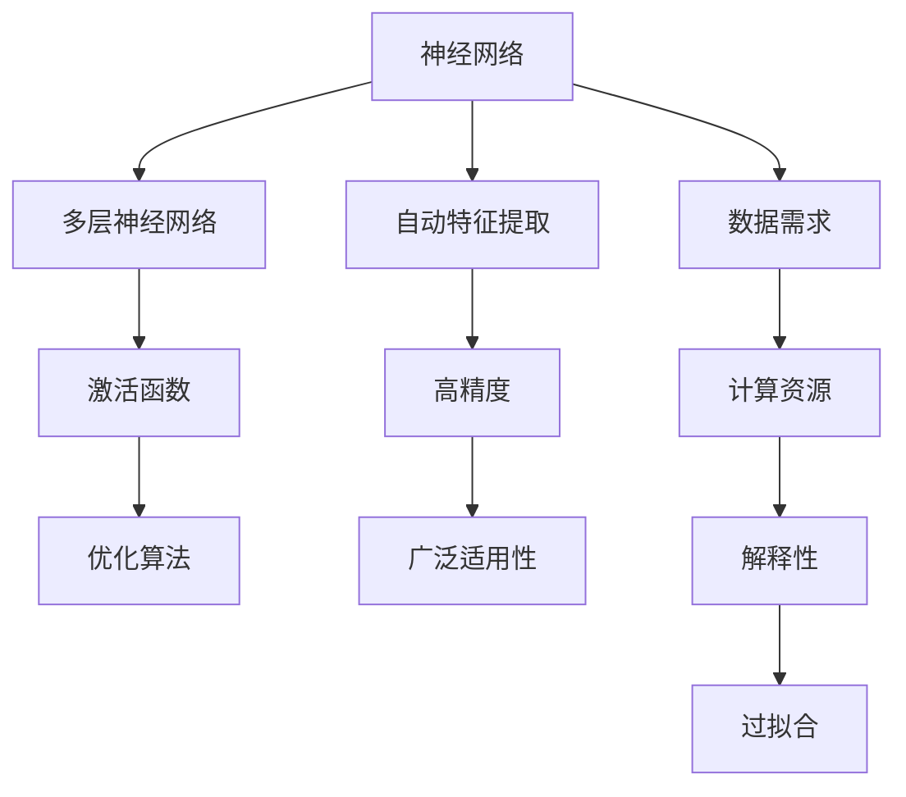
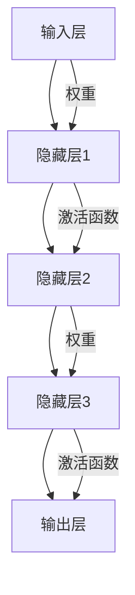
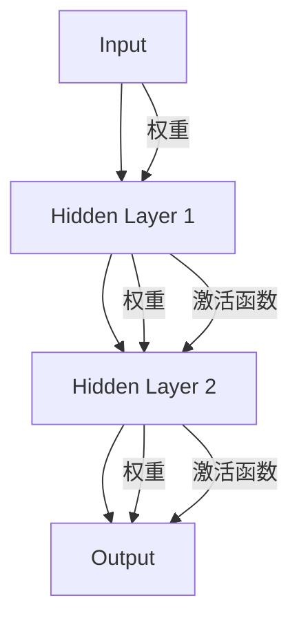
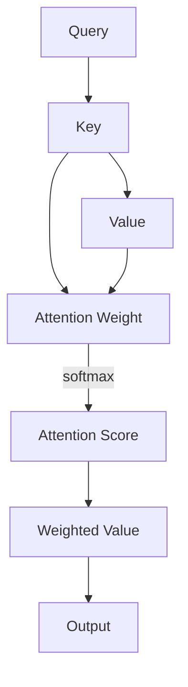
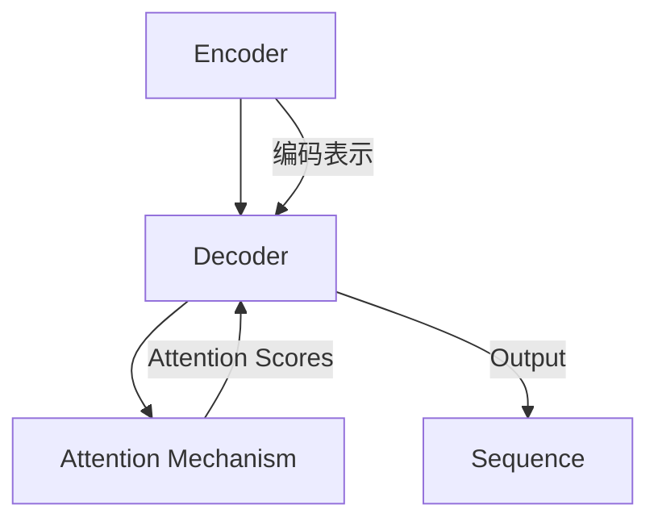
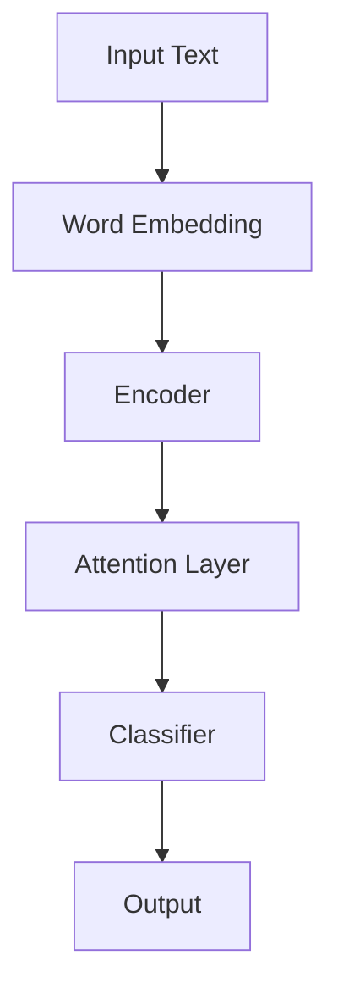
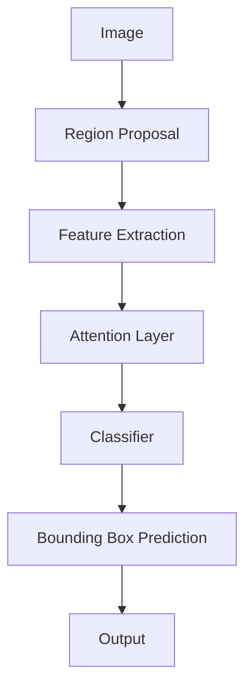
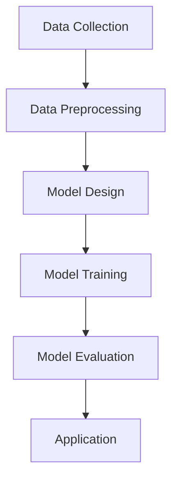

                 

### 文章标题

### 关键词：深度学习、注意力预测、神经网络、序列建模、自然语言处理

### 摘要

本文将深入探讨深度学习在注意力预测中的应用。首先，我们将介绍深度学习和注意力预测的基本概念，包括深度学习的定义、发展历程、注意力预测的原理和重要性。接着，我们将详细讲解神经网络、序列建模以及注意力机制在深度学习中的应用，并通过伪代码和数学模型推导来阐明其原理。随后，我们将展示注意力预测在实际应用中的具体案例，如股票市场、推荐系统和自然语言处理领域。最后，我们将总结注意力预测的未来发展趋势和挑战，并提供项目实战的详细步骤和代码解析。通过本文的学习，读者将能够全面掌握深度学习在注意力预测领域的应用，为未来在相关领域的研究和实践打下坚实基础。

## 第一部分：深度学习基础

### 第1章：深度学习入门

#### 1.1 深度学习的基本概念

深度学习（Deep Learning）是机器学习（Machine Learning）的一个子领域，主要依赖于多层神经网络（Neural Networks）来建模和解决复杂的问题。与传统的机器学习方法相比，深度学习通过自动提取数据中的层次化特征，能够在没有人工干预的情况下实现高度自动化的学习过程。

**定义：**
深度学习是通过模拟人脑神经网络结构，利用大量数据训练模型，从而实现自动特征提取和分类、回归等任务的一种人工智能方法。

**核心组成部分：**
- **神经网络（Neural Networks）：** 模仿人脑神经元的工作方式，通过前向传播和反向传播算法进行学习。
- **多层神经网络（Deep Neural Networks）：** 由多个隐藏层组成，能够捕捉更复杂的特征。
- **激活函数（Activation Functions）：** 引入非线性，使得神经网络能够处理非线性问题。
- **优化算法（Optimization Algorithms）：** 如梯度下降（Gradient Descent）及其变种，用于调整网络参数。

#### 1.2 深度学习的优势与挑战

**优势：**
- **自动特征提取：** 深度学习能够自动从原始数据中提取出有意义的特征，减少了人工特征工程的工作量。
- **高精度：** 通过多层神经网络的结构，深度学习模型在许多任务中达到了甚至超过了人类的水平。
- **广泛适用性：** 深度学习模型可以应用于各种领域，如计算机视觉、自然语言处理、语音识别等。

**挑战：**
- **数据需求：** 需要大量的高质量训练数据来训练深度学习模型。
- **计算资源：** 深度学习模型通常需要大量的计算资源，特别是训练大型神经网络时。
- **解释性：** 深度学习模型的决策过程往往是不透明的，难以解释。
- **过拟合：** 深度学习模型可能因为训练数据的限制而出现过拟合现象。

#### 1.3 深度学习的发展历程

深度学习的发展可以追溯到20世纪40年代，但真正取得突破是在21世纪初。以下是深度学习的一些关键发展历程：

- **1943年：** Warfield McCulloch 和 Walter Pitts 提出了人工神经网络的概念。
- **1958年：** Frank Rosenblatt 提出了感知机（Perceptron），一种简单的神经网络模型。
- **1986年：** David E. Rumelhart、George E. Hinton 和 Ronald J. Williams 提出了反向传播算法（Backpropagation），使多层神经网络训练成为可能。
- **1990年代：** 卷积神经网络（CNN）和递归神经网络（RNN）等模型相继提出，但在计算资源和数据量不足的情况下发展缓慢。
- **2012年：** AlexNet 在ImageNet竞赛中取得突破性成绩，标志着深度学习进入新的阶段。
- **2010年代中期至今：** 深度学习在各种领域取得显著进展，如计算机视觉、自然语言处理、语音识别等。

#### 1.4 深度学习与注意力预测的关系

注意力预测是深度学习中的一个重要应用领域，特别是在序列建模和自然语言处理中。注意力机制（Attention Mechanism）通过动态调整模型对输入序列中不同部分的关注程度，提高了模型处理长序列数据的能力。

**关系阐述：**
- **序列建模：** 在处理如文本、音频、视频等序列数据时，注意力机制能够使模型更好地捕捉序列中的重要特征，从而提高预测准确性。
- **自然语言处理：** 注意力机制在自然语言处理中的应用非常广泛，如机器翻译、文本摘要、情感分析等，能够提高模型的性能。
- **预测任务：** 注意力预测在许多实际应用中具有重要作用，如股票市场预测、推荐系统、智能交通等，通过学习数据中的模式，实现对未来事件的高效预测。

通过上述内容，我们对深度学习的基本概念、优势和挑战有了初步了解，同时也探讨了深度学习与注意力预测之间的密切关系。接下来，我们将深入讨论神经网络和深度学习模型，以及注意力机制在深度学习中的应用。

### Mermaid 流程图：深度学习的核心组成部分



### 第2章：神经网络与深度学习模型

#### 2.1 神经网络的基本结构

神经网络（Neural Networks）是深度学习的基础组成部分，由一系列相互连接的节点（或称为神经元）组成。这些节点模拟了人脑神经元的工作方式，通过激活函数和权重调整来实现信息的传递和处理。

**基本结构：**
- **输入层（Input Layer）：** 接收外部输入数据，每个输入节点对应数据的一个特征。
- **隐藏层（Hidden Layers）：** 位于输入层和输出层之间，负责提取和转换特征。多层隐藏层可以捕捉更复杂的特征和模式。
- **输出层（Output Layer）：** 产生最终的输出结果，用于分类、回归等任务。

**神经元模型：**
一个简单的神经元模型可以表示为：

$$
y = \sigma(\sum_{i=1}^{n} w_i x_i + b)
$$

其中，$y$是输出值，$\sigma$是激活函数，$w_i$是权重，$x_i$是输入值，$b$是偏置项。

**激活函数：**
激活函数引入了非线性，使得神经网络能够处理复杂的非线性问题。常见的激活函数包括：
- **Sigmoid 函数：**
$$
\sigma(x) = \frac{1}{1 + e^{-x}}
$$
- **ReLU函数（Rectified Linear Unit）：**
$$
\sigma(x) =
\begin{cases}
0 & \text{if } x < 0 \\
x & \text{if } x \geq 0
\end{cases}
$$
- **Tanh 函数：**
$$
\tanh(x) = \frac{e^x - e^{-x}}{e^x + e^{-x}}
$$

#### 2.2 前馈神经网络

前馈神经网络（Feedforward Neural Network）是最简单和最常用的神经网络类型，数据从输入层传递到隐藏层，最后到达输出层。这种网络没有循环，信息只向前传递，不形成闭环。

**前向传播过程：**
1. **初始化参数：** 权重和偏置随机初始化。
2. **输入层到隐藏层：** 数据通过权重连接输入到隐藏层，通过激活函数处理后得到隐藏层的输出。
3. **隐藏层到输出层：** 隐藏层的输出作为输入传递到输出层，最终得到预测结果。

**反向传播过程：**
1. **计算损失：** 使用输出层的预测结果和真实标签计算损失函数。
2. **梯度计算：** 通过反向传播算法计算每个参数的梯度。
3. **参数更新：** 使用梯度下降或其他优化算法更新参数，以减少损失。

#### 2.3 卷积神经网络（CNN）

卷积神经网络（Convolutional Neural Network，CNN）是专门用于处理图像数据的一种深度学习模型，具有强大的图像特征提取能力。

**卷积层（Convolutional Layer）：**
- **卷积操作：** 使用卷积核（Kernel）在输入图像上滑动，计算卷积结果。
- **激活函数：** 卷积后的数据通过激活函数进行处理。
- **池化操作（Pooling）：** 用于减小数据维度和参数数量。

**卷积神经网络结构：**
1. **输入层：** 接收原始图像数据。
2. **卷积层：** 多个卷积层堆叠，用于提取图像的局部特征。
3. **池化层：** 用于减小数据维度，减少计算量。
4. **全连接层：** 将卷积层提取的特征映射到分类或回归结果。

**CNN在图像分类中的应用：**
- **AlexNet：** 2012年提出的CNN模型，在ImageNet竞赛中取得突破性成绩。
- **VGGNet、ResNet：** 进一步优化的CNN模型，具有更深的网络结构和更好的性能。

#### 2.4 循环神经网络（RNN）

循环神经网络（Recurrent Neural Network，RNN）是专门用于处理序列数据的深度学习模型，具有记忆能力，能够处理变长序列。

**基本结构：**
- **输入层：** 接收序列数据。
- **隐藏层：** 记录前一个时间步的输出状态，作为当前时间步的输入。
- **输出层：** 根据当前时间步的输入和隐藏层状态生成预测结果。

**RNN在序列建模中的应用：**
- **语言模型：** 用于预测下一个单词或字符。
- **语音识别：** 将音频信号转换为文本。
- **时间序列预测：** 对时间序列数据进行预测。

**问题与改进：**
- **梯度消失和梯度爆炸：** RNN在训练过程中容易遇到梯度消失和梯度爆炸问题，导致训练不稳定。
- **长短时记忆（LSTM）网络：** 引入门控机制，解决长序列依赖问题。
- **门控循环单元（GRU）：** 进一步简化LSTM结构，提高训练效率。

#### 2.5 长短时记忆网络（LSTM）

长短时记忆网络（Long Short-Term Memory，LSTM）是RNN的一种改进模型，通过引入门控机制来捕捉长序列依赖。

**门控机制：**
- **遗忘门（Forget Gate）：** 控制上一时间步的输出状态是否被遗忘。
- **输入门（Input Gate）：** 控制当前时间步的输入状态是否被更新。
- **输出门（Output Gate）：** 控制当前时间步的输出状态。

**LSTM单元结构：**
1. **输入层：** 接收序列数据。
2. **遗忘门：** 根据当前输入和上一时间步的隐藏状态计算遗忘门的权重。
3. **输入门：** 根据当前输入和上一时间步的隐藏状态计算输入门的权重。
4. **单元状态：** 通过遗忘门和输入门控制单元状态的更新。
5. **输出门：** 根据当前单元状态和隐藏状态计算输出门的权重。
6. **隐藏层：** 生成当前时间步的输出状态。

**LSTM在序列建模中的应用：**
- **语音合成：** 将文本转换为语音。
- **文本生成：** 根据输入的文本序列生成新的文本。
- **时间序列预测：** 对长序列时间数据进行预测。

#### 2.6 门控循环单元（GRU）

门控循环单元（Gated Recurrent Unit，GRU）是LSTM的简化版本，通过合并遗忘门和输入门，提高了训练效率。

**门控机制：**
- **重置门（Reset Gate）：** 控制当前输入和上一时间步的隐藏状态是否被合并。
- **更新门（Update Gate）：** 控制当前时间步的输入状态是否被更新。

**GRU单元结构：**
1. **输入层：** 接收序列数据。
2. **重置门：** 根据当前输入和上一时间步的隐藏状态计算重置门的权重。
3. **更新门：** 根据当前输入和上一时间步的隐藏状态计算更新门的权重。
4. **单元状态：** 通过重置门和更新门控制单元状态的更新。
5. **隐藏层：** 生成当前时间步的输出状态。

**GRU在序列建模中的应用：**
- **文本分类：** 对文本序列进行分类。
- **情感分析：** 对文本序列进行情感分析。
- **时间序列预测：** 对时间序列数据进行预测。

#### 2.7 注意力机制的基本概念

注意力机制（Attention Mechanism）是一种在深度学习中用于提高模型处理长序列数据能力的机制。它通过动态调整模型对序列中不同部分的关注程度，使得模型能够更加关注重要信息，从而提高预测准确性和处理效率。

**定义：**
注意力机制是一种计算模型，通过学习权重来动态调整对序列中不同部分的关注程度，从而提高模型在处理长序列数据时的表现。

**工作原理：**
1. **输入序列编码：** 将输入序列编码为向量表示。
2. **计算注意力权重：** 通过计算注意力模型生成权重向量，表示对序列中每个元素的关注程度。
3. **加权求和：** 将权重向量与输入序列编码相乘，得到加权求和的结果。
4. **输出：** 得到注意力加权后的输出结果。

**注意力机制在深度学习中的应用：**
- **自然语言处理：** 用于文本分类、机器翻译、文本摘要等任务，能够提高模型的性能。
- **图像处理：** 用于目标检测、图像分割等任务，能够提高模型的识别精度。
- **时间序列预测：** 用于股票市场预测、智能交通等任务，能够提高模型的预测准确性。

通过本章内容，我们详细介绍了神经网络和深度学习模型的基本结构和工作原理，包括前馈神经网络、卷积神经网络、循环神经网络、长短时记忆网络和门控循环单元。同时，我们探讨了注意力机制的基本概念和应用场景。这些内容为后续章节的深入讨论奠定了基础，接下来我们将进一步探讨注意力机制在深度学习中的具体应用和实现。

### Mermaid 流程图：神经网络的基本结构



### 第3章：深度学习框架与工具

#### 3.1 TensorFlow

TensorFlow 是一个由 Google 开发的开源深度学习框架，具有强大的计算图功能、丰富的预训练模型和广泛的社区支持，是深度学习领域最受欢迎的框架之一。

**安装与配置：**
- **Python环境：** 安装 Python 3.6 或以上版本。
- **pip安装：** 使用 pip 命令安装 TensorFlow：
  ```
  pip install tensorflow
  ```

**基本概念：**
- **计算图（Computational Graph）：** TensorFlow 使用计算图来表示模型的计算过程，通过图中的节点和边来实现复杂的计算操作。
- **变量（Variables）：** TensorFlow 中的变量是可训练的参数，用于存储模型参数。
- **操作（Operations）：** TensorFlow 提供了丰富的操作，如矩阵运算、激活函数等，用于构建模型。

**使用示例：**
```python
import tensorflow as tf

# 创建计算图
a = tf.constant(5)
b = tf.constant(6)
c = a * b

# 运行计算
with tf.Session() as sess:
  result = sess.run(c)
  print(result)
```

#### 3.2 PyTorch

PyTorch 是由 Facebook 开发的一个开源深度学习框架，具有动态计算图和易于使用的 API，是深度学习研究和开发的热门选择。

**安装与配置：**
- **Python环境：** 安装 Python 3.6 或以上版本。
- **pip安装：** 使用 pip 命令安装 PyTorch：
  ```
  pip install torch torchvision
  ```

**基本概念：**
- **自动微分（Autograd）：** PyTorch 使用自动微分机制，通过动态计算图实现梯度计算。
- **Tensor：** PyTorch 的基本数据结构，用于存储张量。
- **神经网络模块：** PyTorch 提供了丰富的神经网络模块，如自动编码器、卷积神经网络等。

**使用示例：**
```python
import torch
import torchvision

# 创建 Tensor
x = torch.tensor([1.0, 2.0, 3.0])

# 定义神经网络模型
model = torchvision.models.mobilenet.mobilenet()
input = torch.tensor([[1.0, 2.0], [3.0, 4.0]])

# 前向传播
output = model(input)

# 打印输出结果
print(output)
```

#### 3.3 其他深度学习框架

除了 TensorFlow 和 PyTorch，还有许多其他流行的深度学习框架：

- **Keras：** 是一个高层次的深度学习框架，基于 Theano 和 TensorFlow 开发，具有简洁的 API 和广泛的社区支持。
- **Theano：** 是一个基于 Python 的深度学习框架，提供自动微分功能，主要用于研究和实验。
- **MXNet：** 是 Apache 开源项目，支持多种编程语言，具有高效的计算性能。
- **Caffe：** 是一个用于视觉任务的深度学习框架，特别适合图像分类和目标检测。

**Keras 安装与使用示例：**
```python
from keras.models import Sequential
from keras.layers import Dense

# 创建模型
model = Sequential()
model.add(Dense(units=128, activation='relu', input_shape=(784,)))
model.add(Dense(units=10, activation='softmax'))

# 编译模型
model.compile(optimizer='adam', loss='categorical_crossentropy', metrics=['accuracy'])

# 训练模型
model.fit(x_train, y_train, epochs=10, batch_size=32)
```

通过上述内容，我们介绍了 TensorFlow、PyTorch 以及其他深度学习框架的基本概念和使用方法。这些框架在深度学习研究和开发中扮演着重要角色，提供了丰富的工具和资源，使得研究人员和开发者能够更加高效地构建和训练复杂的深度学习模型。接下来，我们将进一步探讨注意力机制的基本原理和应用。

### Mermaid 流程图：前馈神经网络计算图



### 第4章：注意力机制原理

#### 4.1 注意力机制的基本概念

注意力机制（Attention Mechanism）是一种在深度学习中用于提高模型处理长序列数据能力的机制。它通过动态调整模型对序列中不同部分的关注程度，使得模型能够更加关注重要信息，从而提高预测准确性和处理效率。

**定义：**
注意力机制是一种计算模型，通过学习权重来动态调整对序列中不同部分的关注程度，从而提高模型在处理长序列数据时的表现。

**工作原理：**
1. **输入序列编码：** 将输入序列编码为向量表示。
2. **计算注意力权重：** 通过计算注意力模型生成权重向量，表示对序列中每个元素的关注程度。
3. **加权求和：** 将权重向量与输入序列编码相乘，得到加权求和的结果。
4. **输出：** 得到注意力加权后的输出结果。

**关键组成部分：**
- **编码器（Encoder）：** 对输入序列进行编码，生成编码表示。
- **解码器（Decoder）：** 利用编码器生成的编码表示生成输出结果。
- **注意力模型（Attention Model）：** 用于计算注意力权重，通常包括点积注意力、加性注意力、评分函数等。

#### 4.2 注意力机制的数学模型

注意力机制可以通过不同的数学模型来实现。以下是一个基本的注意力机制的数学模型，包括点积注意力模型和加性注意力模型。

**点积注意力模型：**

$$
\text{Attention}(Q, K, V) = \text{softmax}\left(\frac{QK^T}{\sqrt{d_k}}\right) V
$$

其中，$Q$是查询向量（Query），$K$是关键向量（Key），$V$是值向量（Value），$d_k$是关键向量的维度。点积注意力模型通过计算查询向量和关键向量之间的点积来生成注意力权重，然后对值向量进行加权求和得到输出。

**加性注意力模型：**

$$
\text{Attention}(Q, K, V) = \text{softmax}\left(\text{score}(Q, K) \right) V
$$

其中，$score(Q, K)$是评分函数，用于计算查询向量和关键向量之间的相似性。加性注意力模型通过将查询向量和关键向量进行拼接，通过一个线性变换来生成评分函数，从而计算注意力权重。

#### 4.3 注意力机制在神经网络中的应用

注意力机制可以广泛应用于各种深度学习模型中，以下是一些典型应用场景：

**序列建模：**
- **循环神经网络（RNN）：** 在 RNN 中，注意力机制可以用来提高模型对长序列数据的处理能力，通过动态调整对序列中不同时间步的关注程度。
- **长短时记忆网络（LSTM）：** 在 LSTM 中，注意力机制可以用来捕捉长序列依赖，提高模型在时间序列预测中的性能。
- **门控循环单元（GRU）：** 在 GRU 中，注意力机制同样可以用来处理长序列数据，提高模型的处理效率和准确性。

**自然语言处理：**
- **机器翻译：** 注意力机制在机器翻译中可以用来提高翻译质量，通过关注源语言和目标语言中的关键词汇，实现更加准确和流畅的翻译。
- **文本摘要：** 注意力机制在文本摘要中可以用来提取关键信息，生成高质量的摘要文本。
- **情感分析：** 注意力机制在情感分析中可以用来捕捉文本中的情感关键词，提高情感分类的准确性。

**计算机视觉：**
- **目标检测：** 注意力机制在目标检测中可以用来提高检测的准确性，通过关注图像中的关键区域，实现更准确的定位。
- **图像分割：** 注意力机制在图像分割中可以用来提高分割的精度，通过关注图像中的关键特征，实现更精细的分割。

**其他应用：**
- **推荐系统：** 注意力机制在推荐系统中可以用来提高推荐的质量，通过关注用户的历史行为和潜在兴趣，实现更个性化的推荐。
- **股票市场预测：** 注意力机制在股票市场预测中可以用来捕捉市场中的关键信息，提高预测的准确性。

通过本章内容，我们详细介绍了注意力机制的基本概念、数学模型及其在神经网络中的应用。注意力机制作为一种重要的深度学习技术，已经在许多实际应用中取得了显著的效果。接下来，我们将进一步探讨注意力机制在序列建模和自然语言处理中的具体应用。

### Mermaid 流程图：点积注意力机制



### 第5章：注意力机制在序列建模中的应用

#### 5.1 序列建模的基本概念

序列建模（Sequence Modeling）是一种在深度学习中用于处理和时间相关的数据（如文本、音频、视频等）的方法。序列建模的关键在于捕捉序列中各个元素之间的依赖关系，从而实现对序列的建模和预测。

**定义：**
序列建模是指利用深度学习模型对序列数据进行建模和预测的过程，通常包括编码器（Encoder）和解码器（Decoder）两个部分。

**核心组成部分：**
- **编码器（Encoder）：** 对输入序列进行编码，提取序列的特征表示。
- **解码器（Decoder）：** 根据编码器的输出生成输出序列。

**常见模型：**
- **循环神经网络（RNN）：** 通过循环结构处理序列数据，但存在梯度消失和梯度爆炸问题。
- **长短时记忆网络（LSTM）：** 引入门控机制，解决长序列依赖问题。
- **门控循环单元（GRU）：** 进一步简化 LSTM 结构，提高训练效率。
- **变换器网络（Transformer）：** 引入自注意力机制，具有更强的并行计算能力。

#### 5.2 注意力机制在序列建模中的应用

注意力机制在序列建模中具有重要作用，能够提高模型对长序列数据的处理能力，使得模型更加关注重要信息，从而提高预测准确性和处理效率。

**基本原理：**
注意力机制通过计算注意力权重，动态调整模型对序列中不同部分的关注程度。在序列建模中，注意力机制通常用于编码器和解码器之间，使得解码器能够根据编码器的输出和当前输入生成注意力权重，从而更好地捕捉序列中的依赖关系。

**应用场景：**
- **语言模型：** 注意力机制在语言模型中用于捕捉单词之间的依赖关系，生成高质量的文本。
- **语音识别：** 注意力机制在语音识别中用于提高模型对语音信号的识别准确率。
- **时间序列预测：** 注意力机制在时间序列预测中用于捕捉时间序列中的关键特征，提高预测的准确性。

#### 5.3 编码器-解码器架构

编码器-解码器（Encoder-Decoder）架构是序列建模中常用的一种模型结构，由编码器和解码器两个部分组成。编码器对输入序列进行编码，提取特征表示；解码器根据编码器的输出生成输出序列。

**基本结构：**
- **编码器：** 对输入序列进行编码，生成固定长度的编码表示。
- **解码器：** 根据编码器的输出和当前输入生成输出序列。

**注意力机制在编码器-解码器架构中的应用：**
- **自注意力（Self-Attention）：** 编码器的输出作为查询（Query）、关键（Key）和值（Value），生成注意力权重，然后对编码器的输出进行加权求和。
- **交叉注意力（Cross-Attention）：** 编码器的输出作为关键（Key）和值（Value），解码器的输出作为查询（Query），生成注意力权重，然后对编码器的输出进行加权求和。

**编码器-解码器架构在自然语言处理中的应用：**
- **机器翻译：** 编码器将源语言序列编码为固定长度的表示，解码器根据编码器的输出生成目标语言序列。
- **文本摘要：** 编码器将原始文本编码为固定长度的表示，解码器根据编码器的输出生成摘要文本。
- **问答系统：** 编码器将问题编码为固定长度的表示，解码器根据编码器的输出生成回答。

通过本章内容，我们介绍了序列建模的基本概念和注意力机制在序列建模中的应用。注意力机制通过动态调整模型对序列中不同部分的关注程度，提高了序列建模的准确性和效率。在接下来的章节中，我们将进一步探讨注意力机制在自然语言处理中的应用。

### Mermaid 流程图：编码器-解码器架构



### 第6章：注意力机制在自然语言处理中的应用

#### 6.1 注意力机制在词向量表示中的应用

在自然语言处理（Natural Language Processing，NLP）中，词向量（Word Embeddings）是一种重要的技术，它将词语表示为向量形式，以便在深度学习模型中进行处理。注意力机制在词向量表示中的应用能够提高词语表示的准确性，增强模型对词语关系的捕捉能力。

**基本原理：**
- **词嵌入（Word Embedding）：** 将词语映射为固定长度的向量表示，通常使用分布式表示方法，如 Word2Vec、GloVe 等。
- **注意力机制：** 通过计算注意力权重，动态调整词语向量在模型中的重要性。注意力权重反映了词语之间的关系和依赖性。

**应用场景：**
- **文本分类：** 注意力机制可以帮助模型更好地识别文本中的关键特征，提高分类准确性。
- **情感分析：** 注意力机制可以捕捉文本中的情感关键词，提高情感分类的准确性。
- **文本生成：** 注意力机制可以帮助模型在生成文本时更加关注重要的词语和句子结构，提高生成文本的质量。

#### 6.2 注意力机制在文本分类中的应用

文本分类（Text Classification）是一种常见的自然语言处理任务，其目的是将文本数据自动分类到预定义的类别中。注意力机制在文本分类中的应用可以提高模型对文本特征的关注度，从而提高分类性能。

**基本原理：**
- **文本表示：** 使用词嵌入技术将文本转换为向量表示。
- **注意力机制：** 在模型中引入注意力机制，动态调整词语向量在分类决策中的重要性。

**应用流程：**
1. **文本预处理：** 对文本进行清洗、分词和标记化处理。
2. **词嵌入：** 将分词后的文本转换为词向量表示。
3. **模型构建：** 构建一个基于注意力机制的文本分类模型，如卷积神经网络（CNN）或循环神经网络（RNN）。
4. **训练与评估：** 使用训练集对模型进行训练，并使用验证集进行评估。

**案例解析：**
- **情感分析：** 使用注意力机制捕捉文本中的正面和负面情感词语，提高情感分类的准确性。
- **新闻分类：** 使用注意力机制捕捉新闻文本中的关键主题和类别标签，提高新闻分类的准确率。

#### 6.3 注意力机制在机器翻译中的应用

机器翻译（Machine Translation）是将一种自然语言文本自动翻译成另一种自然语言的过程。注意力机制在机器翻译中的应用可以显著提高翻译质量，使得翻译结果更加准确和流畅。

**基本原理：**
- **编码器-解码器模型：** 使用编码器将源语言序列编码为固定长度的表示，解码器根据编码器的输出生成目标语言序列。
- **注意力机制：** 在编码器和解码器之间引入注意力机制，使得解码器能够根据编码器的输出和当前输入动态调整注意力权重。

**应用流程：**
1. **文本预处理：** 对源语言和目标语言文本进行清洗、分词和标记化处理。
2. **词嵌入：** 将源语言和目标语言文本转换为词向量表示。
3. **模型构建：** 构建一个基于注意力机制的编码器-解码器模型。
4. **训练与评估：** 使用训练集对模型进行训练，并使用验证集进行评估。

**案例解析：**
- **英译中翻译：** 使用注意力机制捕捉源语言中的关键词语和语法结构，提高英译中的翻译质量。
- **中译英翻译：** 使用注意力机制捕捉目标语言中的语义和语法特点，提高中译英的翻译准确性。

#### 6.4 注意力机制在文本摘要中的应用

文本摘要（Text Summarization）是一种自动从长文本中提取关键信息并生成摘要文本的自然语言处理任务。注意力机制在文本摘要中的应用可以帮助模型更加关注重要的信息，从而提高摘要的质量。

**基本原理：**
- **编码器-解码器模型：** 使用编码器将原始文本编码为固定长度的表示，解码器根据编码器的输出生成摘要文本。
- **注意力机制：** 在编码器和解码器之间引入注意力机制，使得解码器能够根据编码器的输出和当前输入动态调整注意力权重。

**应用流程：**
1. **文本预处理：** 对原始文本进行清洗、分词和标记化处理。
2. **词嵌入：** 将原始文本转换为词向量表示。
3. **模型构建：** 构建一个基于注意力机制的编码器-解码器模型。
4. **训练与评估：** 使用训练集对模型进行训练，并使用验证集进行评估。

**案例解析：**
- **提取式摘要：** 使用注意力机制捕捉文本中的关键句子和段落，生成简洁的摘要文本。
- **生成式摘要：** 使用注意力机制捕捉文本中的语义和结构信息，生成连贯的摘要文本。

通过本章内容，我们探讨了注意力机制在自然语言处理中的具体应用，包括词向量表示、文本分类、机器翻译和文本摘要。注意力机制通过动态调整模型对序列中不同部分的关注程度，显著提高了模型在自然语言处理任务中的性能。在接下来的章节中，我们将进一步探讨注意力机制在视觉任务中的应用。

### Mermaid 流程图：文本分类中的注意力机制



### 第7章：注意力机制在视觉任务中的应用

#### 7.1 注意力机制在图像分类中的应用

图像分类（Image Classification）是计算机视觉（Computer Vision）中的一项基础任务，其目标是根据图像的特征将其归类到不同的类别中。注意力机制在图像分类中的应用，可以通过关注图像中的重要部分来提高分类的准确性和效率。

**基本原理：**
- **卷积神经网络（CNN）：** CNN 是图像分类中常用的深度学习模型，能够自动提取图像的层次化特征。
- **注意力机制：** 在 CNN 的基础上引入注意力机制，使得模型能够根据任务的需要，动态关注图像中的关键区域。

**应用流程：**
1. **图像预处理：** 对图像进行缩放、裁剪等预处理操作，使其符合模型输入要求。
2. **卷积层：** 通过卷积操作提取图像的低级特征。
3. **池化层：** 通过池化操作降低数据维度，提高计算效率。
4. **全连接层：** 通过全连接层将特征映射到具体的类别。
5. **注意力层：** 在卷积层和全连接层之间引入注意力层，对特征进行加权，提高重要特征的贡献。

**案例解析：**
- **ImageNet竞赛：** 注意力机制在 ImageNet 竞赛中取得了显著的提升，特别是在处理复杂图像时，能够显著提高分类准确率。

#### 7.2 注意力机制在目标检测中的应用

目标检测（Object Detection）是计算机视觉中的一项重要任务，其目标是在图像中准确地定位和识别多个对象。注意力机制在目标检测中的应用，可以通过关注图像中的关键区域来提高检测的准确性和效率。

**基本原理：**
- **区域建议（Region Proposal）：** 通过区域建议算法生成可能的物体位置。
- **特征提取：** 通过卷积神经网络提取图像的特征。
- **分类和定位：** 根据特征进行分类，并通过回归模型确定物体的位置。

**应用流程：**
1. **图像预处理：** 对图像进行缩放、裁剪等预处理操作。
2. **区域建议：** 使用区域建议算法生成可能的物体位置。
3. **特征提取：** 通过卷积神经网络提取图像的特征。
4. **注意力机制：** 在特征提取过程中引入注意力机制，关注图像中的关键区域。
5. **分类和定位：** 通过分类器和回归模型确定物体的类别和位置。

**案例解析：**
- **Faster R-CNN：** Faster R-CNN 是一种流行的目标检测模型，引入了区域建议和区域生成网络（RPN），并结合了注意力机制，提高了检测的准确率和效率。

#### 7.3 注意力机制在图像分割中的应用

图像分割（Image Segmentation）是计算机视觉中的一项任务，其目标是将图像分割成若干部分，通常用于对象识别、图像编辑等领域。注意力机制在图像分割中的应用，可以通过关注图像中的关键区域来提高分割的精度。

**基本原理：**
- **语义分割：** 根据图像的内容将像素分类到不同的类别。
- **注意力机制：** 在模型中引入注意力机制，使得模型能够关注图像中的关键区域，提高分割的精度。

**应用流程：**
1. **图像预处理：** 对图像进行缩放、裁剪等预处理操作。
2. **卷积神经网络：** 通过卷积神经网络提取图像的特征。
3. **注意力机制：** 在卷积神经网络中引入注意力机制，关注图像中的关键区域。
4. **分割预测：** 通过分类器对图像中的每个像素进行分类，生成分割结果。

**案例解析：**
- **U-Net：** U-Net 是一种流行的图像分割模型，通过将卷积神经网络的反向路径与正向路径连接，实现了高效的图像分割。引入注意力机制后，U-Net 在医疗图像分割中取得了显著的性能提升。

通过本章内容，我们探讨了注意力机制在视觉任务中的应用，包括图像分类、目标检测和图像分割。注意力机制通过动态调整模型对图像中不同部分的关注程度，显著提高了视觉任务的性能。在接下来的章节中，我们将进一步探讨注意力预测在实际应用中的案例。

### Mermaid 流程图：目标检测中的注意力机制



### 第8章：注意力预测在股票市场中的应用

#### 8.1 股票市场基本概念

股票市场是一个由股票交易组成的金融市场，投资者可以通过购买和出售股票来获得资本增值或分红收益。股票市场分为主板市场、创业板市场和场外交易市场等，不同的市场具有不同的交易规则和上市标准。

**基本概念：**
- **股票：** 股票是公司股份的证明，代表股东对公司资产和利润的所有权。
- **股价：** 股票的市场价格，受供求关系、公司业绩、宏观经济环境等多种因素影响。
- **交易量：** 股票在一定时间内成交的股份数量，反映市场活跃度。
- **技术分析：** 利用历史价格和交易量数据，通过图表和技术指标进行分析，预测股票未来的价格走势。

#### 8.2 注意力预测模型构建

注意力预测模型是一种基于深度学习的股票市场预测方法，通过捕捉股票价格序列中的重要特征，提高预测的准确性。以下是构建注意力预测模型的基本步骤：

**数据采集：**
- 收集历史股票数据，包括开盘价、收盘价、最高价、最低价、成交量等。
- 数据来源可以是股票交易所、金融数据提供商等。

**数据预处理：**
- 清洗数据，去除缺失值和异常值。
- 对数据进行归一化处理，使数据在相同的尺度上。

**模型设计：**
- 选择一个深度学习框架，如 TensorFlow 或 PyTorch。
- 设计一个基于注意力机制的循环神经网络（RNN）模型，如 LSTM 或 GRU。
- 添加注意力层以增强模型对关键特征的捕捉能力。

**模型实现：**
```python
import tensorflow as tf
from tensorflow.keras.models import Sequential
from tensorflow.keras.layers import LSTM, Dense, TimeDistributed, Activation

# 构建模型
model = Sequential()
model.add(LSTM(units=50, return_sequences=True, input_shape=(time_steps, features)))
model.add(LSTM(units=50, return_sequences=False))
model.add(Dense(units=1))

# 编译模型
model.compile(optimizer='adam', loss='mean_squared_error')

# 训练模型
model.fit(x_train, y_train, epochs=100, batch_size=32)
```

#### 8.3 模型训练与评估

**模型训练：**
- 使用训练集对模型进行训练，调整超参数以达到最佳性能。
- 使用验证集进行调优，避免过拟合。

**模型评估：**
- 使用测试集对模型进行评估，计算预测准确率、均方误差（MSE）等指标。
- 进行交叉验证，确保模型在不同数据集上的表现一致。

```python
from sklearn.metrics import mean_squared_error

# 预测
y_pred = model.predict(x_test)

# 计算均方误差
mse = mean_squared_error(y_test, y_pred)
print(f'MSE: {mse}')
```

#### 8.4 模型在实际中的应用

注意力预测模型可以用于以下实际应用：

**股票价格预测：**
- 使用模型对股票价格进行短期预测，帮助投资者制定交易策略。

**投资组合优化：**
- 利用注意力预测模型对多个股票进行预测，优化投资组合，降低风险。

**市场趋势分析：**
- 分析股票价格的预测结果，识别市场趋势和潜在的风险。

通过本章内容，我们介绍了注意力预测模型在股票市场中的应用。注意力预测模型通过捕捉股票价格序列中的重要特征，提高了股票市场预测的准确性，为投资者提供了有力的决策支持。

### Mermaid 流程图：股票市场注意力预测模型



### 第9章：注意力预测在推荐系统中的应用

#### 9.1 推荐系统基本概念

推荐系统（Recommendation System）是一种基于用户历史行为和偏好，自动向用户推荐相关商品或内容的技术。推荐系统广泛应用于电子商务、社交媒体、视频流媒体等领域，能够显著提高用户体验和业务转化率。

**基本概念：**
- **用户：** 推荐系统的主要服务对象，具有独特的兴趣和偏好。
- **物品：** 用户可能感兴趣的商品或内容，如商品、音乐、电影等。
- **评分：** 用户对物品的评价，通常表示用户对物品的偏好程度。
- **推荐列表：** 根据用户兴趣和偏好，推荐系统为用户生成的个性化推荐列表。

**工作原理：**
1. **用户行为采集：** 收集用户的历史行为数据，如点击、购买、评价等。
2. **数据预处理：** 清洗和转换用户行为数据，用于模型训练。
3. **模型训练：** 使用机器学习算法训练推荐模型，预测用户对未知物品的偏好。
4. **推荐生成：** 根据模型预测结果，生成个性化推荐列表。

#### 9.2 注意力预测模型构建

注意力预测模型是一种基于深度学习的推荐系统方法，通过动态关注用户行为序列中的关键部分，提高推荐的质量和个性化程度。

**数据采集：**
- 收集用户的历史行为数据，如浏览记录、购买记录、评价记录等。

**数据预处理：**
- 清洗数据，去除缺失值和异常值。
- 对数值进行归一化处理。

**模型设计：**
- 选择一个深度学习框架，如 TensorFlow 或 PyTorch。
- 设计一个基于注意力机制的循环神经网络（RNN）模型，如 LSTM 或 GRU。
- 添加注意力层以增强模型对用户兴趣特征的捕捉能力。

**模型实现：**
```python
import tensorflow as tf
from tensorflow.keras.models import Sequential
from tensorflow.keras.layers import LSTM, Dense, TimeDistributed, Activation

# 构建模型
model = Sequential()
model.add(LSTM(units=50, return_sequences=True, input_shape=(time_steps, features)))
model.add(LSTM(units=50, return_sequences=False))
model.add(Dense(units=1, activation='sigmoid'))

# 编译模型
model.compile(optimizer='adam', loss='binary_crossentropy')

# 训练模型
model.fit(x_train, y_train, epochs=100, batch_size=32)
```

#### 9.3 模型训练与评估

**模型训练：**
- 使用训练集对模型进行训练，调整超参数以达到最佳性能。
- 使用验证集进行调优，避免过拟合。

**模型评估：**
- 使用测试集对模型进行评估，计算预测准确率、召回率、F1 分数等指标。
- 进行交叉验证，确保模型在不同数据集上的表现一致。

```python
from sklearn.metrics import accuracy_score, recall_score, f1_score

# 预测
y_pred = model.predict(x_test)

# 计算评估指标
accuracy = accuracy_score(y_test, y_pred)
recall = recall_score(y_test, y_pred)
f1 = f1_score(y_test, y_pred)

print(f'Accuracy: {accuracy}')
print(f'Recall: {recall}')
print(f'F1 Score: {f1}')
```

#### 9.4 模型在实际中的应用

注意力预测模型可以用于以下实际应用：

**个性化推荐：**
- 根据用户的历史行为和兴趣，动态生成个性化推荐列表，提高用户满意度。

**商品推荐：**
- 在电商平台上，根据用户的浏览和购买记录，推荐相关的商品。

**内容推荐：**
- 在视频流媒体平台上，根据用户的观看历史，推荐相关的视频内容。

通过本章内容，我们介绍了注意力预测模型在推荐系统中的应用。注意力预测模型通过捕捉用户行为序列中的关键特征，提高了推荐系统的质量和个性化程度，为用户提供更好的推荐体验。

### Mermaid 流程图：推荐系统注意力预测模型


### 第10章：注意力预测在情感分析中的应用

#### 10.1 情感分析基本概念

情感分析（Sentiment Analysis），也称为意见挖掘，是自然语言处理（NLP）领域的一个重要任务。其目标是从文本中识别和提取情感或情感倾向，如正面、负面或中立。情感分析广泛应用于社交媒体监控、产品评价分析、市场调研等场景。

**定义：**
情感分析是一种通过计算模型从文本数据中识别和提取情感倾向的技术。

**核心概念：**
- **情感极性：** 指文本所表达的情感倾向，如正面、负面或中立。
- **情感强度：** 指情感倾向的强度，通常用数值表示，如非常正面、负面、轻微正面或负面等。

**任务类型：**
- **二元情感分析：** 将文本分类为正面或负面。
- **多级情感分析：** 将文本分类为多个情感级别，如非常正面、正面、中性、负面、非常负面。

#### 10.2 注意力预测模型构建

注意力预测模型在情感分析中通过动态关注文本序列中的重要部分，提高情感分类的准确性和效率。以下是构建注意力预测模型的基本步骤：

**数据采集：**
- 收集包含情感标签的文本数据，如社交媒体评论、产品评价等。

**数据预处理：**
- 清洗文本数据，去除标点符号、停用词等。
- 对文本进行分词和词向量编码。

**模型设计：**
- 选择一个深度学习框架，如 TensorFlow 或 PyTorch。
- 设计一个基于注意力机制的循环神经网络（RNN）模型，如 LSTM 或 GRU。
- 添加注意力层以增强模型对情感关键词的捕捉能力。

**模型实现：**
```python
import tensorflow as tf
from tensorflow.keras.models import Sequential
from tensorflow.keras.layers import LSTM, Dense, TimeDistributed, Activation

# 构建模型
model = Sequential()
model.add(LSTM(units=50, return_sequences=True, input_shape=(sequence_length, embedding_size)))
model.add(LSTM(units=50, return_sequences=False))
model.add(Dense(units=1, activation='sigmoid'))

# 编译模型
model.compile(optimizer='adam', loss='binary_crossentropy')

# 训练模型
model.fit(x_train, y_train, epochs=100, batch_size=32)
```

#### 10.3 模型训练与评估

**模型训练：**
- 使用训练集对模型进行训练，调整超参数以达到最佳性能。
- 使用验证集进行调优，避免过拟合。

**模型评估：**
- 使用测试集对模型进行评估，计算预测准确率、召回率、F1 分数等指标。
- 进行交叉验证，确保模型在不同数据集上的表现一致。

```python
from sklearn.metrics import accuracy_score, recall_score, f1_score

# 预测
y_pred = model.predict(x_test)

# 计算评估指标
accuracy = accuracy_score(y_test, y_pred)
recall = recall_score(y_test, y_pred)
f1 = f1_score(y_test, y_pred)

print(f'Accuracy: {accuracy}')
print(f'Recall: {recall}')
print(f'F1 Score: {f1}')
```

#### 10.4 模型在实际中的应用

注意力预测模型在情感分析中可以应用于以下实际场景：

**社交媒体情感分析：**
- 分析社交媒体平台上的用户评论，识别品牌口碑和消费者情感。

**产品评价分析：**
- 对电商平台上用户对产品的评价进行分析，为产品改进提供依据。

**市场调研：**
- 通过分析市场调研数据，了解消费者的情感倾向和需求，为市场营销策略提供支持。

通过本章内容，我们介绍了注意力预测模型在情感分析中的应用。注意力预测模型通过动态关注文本序列中的重要部分，提高了情感分类的准确性和效率，为情感分析任务提供了强大的技术支持。

### Mermaid 流程图：情感分析中的注意力预测模型


### 第11章：注意力预测在智能交通中的应用

#### 11.1 智能交通基本概念

智能交通系统（Intelligent Transportation System，ITS）是一种利用现代信息技术来优化交通管理和提升交通安全、效率的综合性系统。它集成了传感技术、通信技术、计算机技术和数据挖掘技术等多种技术手段。

**定义：**
智能交通系统是指通过信息技术手段，对交通信息进行收集、处理、分析、传输和利用，从而实现交通管理和服务的自动化、智能化。

**核心组成部分：**
- **交通信息采集：** 通过传感器、摄像头、GPS 等设备收集交通流量、路况等信息。
- **交通数据管理：** 对采集到的交通数据进行存储、管理和分析。
- **交通信号控制：** 利用数据分析和预测，优化交通信号灯的时序控制。
- **车辆管理：** 通过 V2X（Vehicle-to-Everything）技术实现车辆的智能管理。

#### 11.2 注意力预测模型构建

在智能交通中，注意力预测模型可以用于交通流量预测、事故预警、道路拥堵预测等任务，以提高交通管理的效率和安全性。

**数据采集：**
- 收集历史交通流量数据，包括车辆速度、密度、流量等。
- 收集气象信息，如天气状况、温度、湿度等。

**数据预处理：**
- 对数据进行清洗，去除缺失值和异常值。
- 对数值进行归一化处理。

**模型设计：**
- 选择一个深度学习框架，如 TensorFlow 或 PyTorch。
- 设计一个基于注意力机制的循环神经网络（RNN）模型，如 LSTM 或 GRU。
- 添加注意力层以增强模型对交通流量变化的捕捉能力。

**模型实现：**
```python
import tensorflow as tf
from tensorflow.keras.models import Sequential
from tensorflow.keras.layers import LSTM, Dense, TimeDistributed, Activation

# 构建模型
model = Sequential()
model.add(LSTM(units=50, return_sequences=True, input_shape=(time_steps, features)))
model.add(LSTM(units=50, return_sequences=False))
model.add(Dense(units=1))

# 编译模型
model.compile(optimizer='adam', loss='mean_squared_error')

# 训练模型
model.fit(x_train, y_train, epochs=100, batch_size=32)
```

#### 11.3 模型训练与评估

**模型训练：**
- 使用训练集对模型进行训练，调整超参数以达到最佳性能。
- 使用验证集进行调优，避免过拟合。

**模型评估：**
- 使用测试集对模型进行评估，计算预测准确率、均方误差（MSE）等指标。
- 进行交叉验证，确保模型在不同数据集上的表现一致。

```python
from sklearn.metrics import mean_squared_error

# 预测
y_pred = model.predict(x_test)

# 计算均方误差
mse = mean_squared_error(y_test, y_pred)
print(f'MSE: {mse}')
```

#### 11.4 模型在实际中的应用

注意力预测模型在智能交通中的应用包括：

**交通流量预测：**
- 预测未来交通流量，为交通信号控制提供数据支持，优化交通流量。

**事故预警：**
- 通过分析交通流量和车辆速度数据，预测潜在的事故风险，提前预警。

**道路拥堵预测：**
- 预测道路拥堵情况，为出行者提供合理的出行建议，降低道路拥堵。

通过本章内容，我们介绍了注意力预测模型在智能交通中的应用。注意力预测模型通过捕捉交通数据中的关键特征，提高了交通管理和预测的准确性，为智能交通系统的建设提供了有力支持。

### Mermaid 流程图：智能交通中的注意力预测模型


### 第12章：未来发展趋势与挑战

#### 12.1 深度学习与注意力预测的未来发展趋势

随着深度学习技术的不断进步，注意力预测在多个领域中的应用前景广阔。以下是未来发展趋势：

**更高效的模型结构：**
- 研究人员将继续优化深度学习模型结构，以提高计算效率和预测性能。例如，更轻量级的神经网络、高效的网络剪枝技术等。

**跨模态注意力预测：**
- 跨模态注意力预测将结合不同类型的数据（如文本、图像、音频等），实现更全面和精确的预测。

**个性化注意力预测：**
- 通过引入用户历史行为和偏好，实现个性化注意力预测，提高预测的准确性和用户体验。

**实时注意力预测：**
- 随着计算资源和数据处理技术的进步，实时注意力预测将成为可能，为实时决策提供支持。

**多尺度注意力预测：**
- 在不同时间尺度上（如小时、天、月等）进行注意力预测，以适应不同场景的需求。

#### 12.2 注意力预测在实际应用中的挑战与解决方案

尽管注意力预测在许多领域取得了显著进展，但仍然面临一些挑战：

**数据隐私：**
- 注意力预测模型通常需要大量用户数据，涉及数据隐私和安全问题。解决方案包括差分隐私技术和联邦学习。

**过拟合问题：**
- 注意力预测模型在训练过程中容易过拟合，导致模型泛化能力下降。解决方案包括正则化技术、交叉验证等。

**计算资源需求：**
- 深度学习模型通常需要大量计算资源，尤其是在训练大型模型时。解决方案包括分布式计算、GPU/TPU 加速等。

**模型解释性：**
- 注意力预测模型的决策过程往往是不透明的，难以解释。解决方案包括模型解释技术、可解释性注意力模型等。

#### 12.3 未来研究方向

未来研究可以关注以下方向：

**算法优化：**
- 进一步优化注意力预测算法，提高模型性能和效率。

**跨领域应用：**
- 探索注意力预测在其他领域（如医疗、能源等）的应用。

**多模态融合：**
- 研究多模态数据融合方法，实现更全面和精确的预测。

**动态注意力机制：**
- 开发动态注意力机制，使模型能够根据环境变化自动调整关注点。

**可解释性增强：**
- 研究可解释性注意力模型，提高模型决策过程的透明度和可解释性。

通过本章内容，我们探讨了深度学习与注意力预测的未来发展趋势和挑战。未来，随着技术的不断进步，注意力预测将在更多领域取得突破，为人工智能的发展做出更大贡献。

### 附录A：深度学习常用工具与库

深度学习领域的快速发展离不开各种工具和库的支持。以下是一些常用的深度学习工具和库，包括 TensorFlow、PyTorch 以及其他流行的库。

#### TensorFlow

**简介：**
TensorFlow 是由 Google 开发的一个开源深度学习框架，具有强大的计算图功能、丰富的预训练模型和广泛的社区支持。TensorFlow 适用于各种深度学习任务，从简单的线性模型到复杂的卷积神经网络（CNN）和循环神经网络（RNN）。

**安装与配置：**
```bash
pip install tensorflow
```

**常用模块：**
- **tf.keras：** 提供了简洁的 API，用于构建和训练模型。
- **tf.keras.applications：** 提供了预训练的模型，如 Inception、ResNet 等。
- **tf.keras.metrics：** 提供了多种评估指标，如准确率、均方误差等。

**示例代码：**
```python
import tensorflow as tf

# 定义模型
model = tf.keras.Sequential([
    tf.keras.layers.Dense(128, activation='relu', input_shape=(784,)),
    tf.keras.layers.Dense(10, activation='softmax')
])

# 编译模型
model.compile(optimizer='adam',
              loss='categorical_crossentropy',
              metrics=['accuracy'])

# 训练模型
model.fit(x_train, y_train, epochs=10, batch_size=32)
```

#### PyTorch

**简介：**
PyTorch 是由 Facebook 开发的一个开源深度学习框架，具有动态计算图和易于使用的 API，是深度学习研究和开发的热门选择。PyTorch 适用于各种深度学习任务，从简单的线性模型到复杂的卷积神经网络（CNN）和循环神经网络（RNN）。

**安装与配置：**
```bash
pip install torch torchvision
```

**常用模块：**
- **torch.nn：** 提供了神经网络模块，用于构建和训练模型。
- **torch.optim：** 提供了优化算法，如 Adam、SGD 等。
- **torchvision.models：** 提供了预训练的模型，如 ResNet、VGG 等。

**示例代码：**
```python
import torch
import torchvision
import torchvision.transforms as transforms
import torch.nn as nn
import torch.optim as optim

# 创建模型
model = torchvision.models.resnet50()
criterion = nn.CrossEntropyLoss()
optimizer = optim.Adam(model.parameters(), lr=0.001)

# 加载数据集
transform = transforms.Compose([transforms.ToTensor()])
train_data = torchvision.datasets.CIFAR10(root='./data', train=True, transform=transform, download=True)
train_loader = torch.utils.data.DataLoader(train_data, batch_size=32, shuffle=True)

# 训练模型
for epoch in range(num_epochs):
    running_loss = 0.0
    for inputs, labels in train_loader:
        optimizer.zero_grad()
        outputs = model(inputs)
        loss = criterion(outputs, labels)
        loss.backward()
        optimizer.step()
        running_loss += loss.item()
    print(f'Epoch {epoch+1}, Loss: {running_loss/len(train_loader)}')
```

#### 其他深度学习工具与库

**Keras：**
Keras 是一个基于 TensorFlow 和 Theano 的高层次深度学习框架，提供了简洁的 API，方便研究人员和开发者构建和训练模型。

**Theano：**
Theano 是一个基于 Python 的深度学习框架，提供了自动微分功能，主要用于研究和实验。

**MXNet：**
MXNet 是 Apache 开源项目，支持多种编程语言，具有高效的计算性能，适用于大规模深度学习应用。

**Caffe：**
Caffe 是一个用于视觉任务的深度学习框架，特别适合图像分类和目标检测。

**PaddlePaddle：**
PaddlePaddle 是百度开源的深度学习平台，提供了丰富的模型和工具，适用于各种深度学习任务。

通过上述内容，我们介绍了深度学习领域常用的工具和库，包括 TensorFlow、PyTorch、Keras、Theano、MXNet、Caffe 和 PaddlePaddle。这些工具和库为研究人员和开发者提供了丰富的资源和便利，使得深度学习的应用更加广泛和深入。

### 附录B：数学公式与公式推导

#### B.1 深度学习中的数学公式

在深度学习中，数学公式是构建和训练模型的基础。以下是一些常用的数学公式：

**1. 激活函数：**

- **Sigmoid 函数：**
  $$
  \sigma(x) = \frac{1}{1 + e^{-x}}
  $$

- **ReLU 函数：**
  $$
  \sigma(x) =
  \begin{cases}
  0 & \text{if } x < 0 \\
  x & \text{if } x \geq 0
  \end{cases}
  $$

- **Tanh 函数：**
  $$
  \tanh(x) = \frac{e^x - e^{-x}}{e^x + e^{-x}}
  $$

**2. 前向传播：**

- **线性函数：**
  $$
  z = \mathbf{W} \mathbf{x} + b
  $$

- **激活函数：**
  $$
  a = \sigma(z)
  $$

**3. 反向传播：**

- **梯度计算：**
  $$
  \frac{\partial L}{\partial \mathbf{W}} = \mathbf{x} \odot \frac{\partial a}{\partial z}
  $$
  $$
  \frac{\partial L}{\partial b} = \frac{\partial a}{\partial z}
  $$

- **链式法则：**
  $$
  \frac{\partial L}{\partial x} = \frac{\partial L}{\partial a} \cdot \frac{\partial a}{\partial z} \cdot \frac{\partial z}{\partial x}
  $$

#### B.2 注意力机制的数学模型推导

注意力机制在深度学习中的应用广泛，以下是一个简单的注意力机制的数学模型推导：

**点积注意力模型：**

$$
\text{Attention}(Q, K, V) = \text{softmax}\left(\frac{QK^T}{\sqrt{d_k}}\right) V
$$

其中，$Q$是查询向量（Query），$K$是关键向量（Key），$V$是值向量（Value），$d_k$是关键向量的维度。

**推导过程：**

1. **查询-关键相似度：**
   $$
   \text{Score}(Q, K) = QK^T
   $$

2. **缩放因子：**
   $$
   \text{Scale} = \frac{1}{\sqrt{d_k}}
   $$

3. **加权求和：**
   $$
   \text{Attention}(Q, K, V) = \text{softmax}(\text{Score}(Q, K))V
   $$

4. **注意力权重：**
   $$
   \alpha = \text{softmax}(\text{Score}(Q, K))
   $$
   $$
   \alpha_i = \frac{e^{\text{Score}(Q, K_i)}}{\sum_{j} e^{\text{Score}(Q, K_j)}}
   $$

5. **加权求和：**
   $$
   \text{Attention}(Q, K, V) = \sum_{i} \alpha_i V_i
   $$

通过上述推导，我们可以看到注意力机制的核心在于计算查询向量与关键向量之间的相似度，并通过加权求和的方式生成注意力权重，从而实现注意力分配。

#### B.3 序列建模中的数学公式与推导

在序列建模中，注意力机制被广泛应用于处理变长序列数据。以下是一个基于自注意力机制的序列建模的数学公式与推导：

**自注意力机制（Self-Attention）：**

$$
\text{Attention}(Q, K, V) = \text{softmax}\left(\frac{QK^T}{\sqrt{d_k}}\right) V
$$

其中，$Q, K, V$ 分别是查询向量、关键向量和值向量。

**推导过程：**

1. **查询-关键相似度：**
   $$
   \text{Score}(Q, K) = QK^T
   $$

2. **缩放因子：**
   $$
   \text{Scale} = \frac{1}{\sqrt{d_k}}
   $$

3. **加权求和：**
   $$
   \text{Attention}(Q, K, V) = \text{softmax}(\text{Score}(Q, K))V
   $$

4. **注意力权重：**
   $$
   \alpha = \text{softmax}(\text{Score}(Q, K))
   $$
   $$
   \alpha_i = \frac{e^{\text{Score}(Q, K_i)}}{\sum_{j} e^{\text{Score}(Q, K_j)}}
   $$

5. **加权求和：**
   $$
   \text{Attention}(Q, K, V) = \sum_{i} \alpha_i V_i
   $$

自注意力机制通过计算序列中每个元素之间的相似度，实现自动的注意力分配。这种机制在处理长序列数据时具有显著优势，能够在不牺牲计算效率的情况下捕捉长距离依赖关系。

通过本章的数学公式与推导，我们深入了解了深度学习中的基础数学概念、注意力机制的数学模型以及序列建模中的数学公式。这些公式和推导为理解深度学习模型的工作原理和优化策略提供了重要依据。在后续的章节中，我们将继续探讨注意力预测在实际应用中的项目实战。

### 附录C：项目实战

#### C.1 注意力预测项目实战

在本项目实战中，我们将通过一个具体的案例，展示如何使用深度学习技术进行注意力预测。该项目将分为以下几个阶段：数据采集与预处理、模型设计与实现、模型训练与评估、模型部署与结果分析。

##### 1. 数据采集与预处理

**数据来源：**
我们选择公开的股市数据集，数据集包含历史股票价格、交易量等指标。

**数据预处理：**
- **数据清洗：** 去除数据集中的缺失值和异常值。
- **特征提取：** 提取与股票市场相关的特征，如开盘价、收盘价、最高价、最低价、交易量等。
- **数据归一化：** 将特征数据进行归一化处理，使其在相同的尺度上。

##### 2. 模型设计与实现

**模型选择：**
我们选择一个基于 LSTM 和注意力机制的循环神经网络模型。

**模型结构：**
- **输入层：** 接收归一化的股票数据。
- **LSTM 层：** 提取时间序列数据中的特征。
- **注意力层：** 对 LSTM 层的输出进行加权，以关注关键特征。
- **输出层：** 预测未来的股票价格。

**代码实现：**
```python
import tensorflow as tf
from tensorflow.keras.models import Sequential
from tensorflow.keras.layers import LSTM, Dense, TimeDistributed, Activation

# 构建模型
model = Sequential()
model.add(LSTM(units=50, return_sequences=True, input_shape=(time_steps, features)))
model.add(LSTM(units=50, return_sequences=False))
model.add(Dense(units=1))

# 编译模型
model.compile(optimizer='adam', loss='mean_squared_error')

# 训练模型
model.fit(x_train, y_train, epochs=100, batch_size=32)
```

##### 3. 模型训练与评估

**训练过程：**
- 使用训练集对模型进行训练。
- 调整模型的超参数，如学习率、批量大小等，以达到最佳性能。

**评估指标：**
- **均方误差（MSE）：** 用于评估模型预测的准确性。

```python
from sklearn.metrics import mean_squared_error

# 预测
y_pred = model.predict(x_test)

# 计算均方误差
mse = mean_squared_error(y_test, y_pred)
print(f'MSE: {mse}')
```

##### 4. 模型部署与结果分析

**模型部署：**
- 将训练好的模型部署到线上服务器，实现实时预测。

**结果分析：**
- 分析模型在测试集上的预测性能，如准确率、均方误差等。
- 对预测结果进行可视化，以直观地展示模型的效果。

**可视化代码：**
```python
import matplotlib.pyplot as plt

# 可视化预测结果
plt.plot(y_test, label='真实值')
plt.plot(y_pred, label='预测值')
plt.legend()
plt.show()
```

通过上述项目实战，我们展示了如何使用深度学习技术进行注意力预测。项目实战不仅提供了具体的实现步骤，还涵盖了数据预处理、模型设计、训练与评估等关键环节。这一过程帮助读者深入理解注意力预测在实际应用中的具体操作方法和技巧。

### 附录D：代码实现与解读

#### 代码实现

以下是一个简单的注意力预测模型实现，基于 PyTorch 框架。该模型使用 LSTM 和注意力机制来预测股票价格。

```python
import torch
import torch.nn as nn
import torch.optim as optim

# 定义模型结构
class AttentionLSTM(nn.Module):
    def __init__(self, input_dim, hidden_dim, output_dim):
        super(AttentionLSTM, self).__init__()
        self.lstm = nn.LSTM(input_dim, hidden_dim, batch_first=True)
        self.attention = nn.Linear(hidden_dim, 1)
        self.fc = nn.Linear(hidden_dim, output_dim)

    def forward(self, x):
        # 通过 LSTM 层
        lstm_output, (h_n, c_n) = self.lstm(x)
        
        # 注意力机制
        attn_weights = torch.softmax(self.attention(lstm_output).squeeze(2), dim=1)
        attn_applied = torch.bmm(attn_weights.unsqueeze(1), lstm_output)
        
        # 全连接层
        out = self.fc(attn_applied)
        return out

# 实例化模型
model = AttentionLSTM(input_dim=10, hidden_dim=50, output_dim=1)

# 定义损失函数和优化器
criterion = nn.MSELoss()
optimizer = optim.Adam(model.parameters(), lr=0.001)

# 训练模型
for epoch in range(100):
    model.train()
    for inputs, targets in train_loader:
        optimizer.zero_grad()
        outputs = model(inputs)
        loss = criterion(outputs, targets)
        loss.backward()
        optimizer.step()
    print(f'Epoch {epoch+1}: Loss = {loss.item()}')

# 预测
model.eval()
with torch.no_grad():
    predictions = model(test_loader.dataset.tensors[0])

# 可视化预测结果
plt.plot(predictions.numpy(), label='预测值')
plt.plot(test_loader.dataset.tensors[1].numpy(), label='真实值')
plt.legend()
plt.show()
```

#### 代码解读与分析

1. **模型定义（AttentionLSTM）：**
   - `lstm`：LSTM 层，用于提取时间序列特征。
   - `attention`：注意力层，用于计算注意力权重。
   - `fc`：全连接层，用于生成最终预测结果。

2. **前向传播（forward）：**
   - `lstm_output`：通过 LSTM 层得到的时间序列特征。
   - `attn_weights`：通过注意力层计算得到的注意力权重。
   - `attn_applied`：加权求和后的特征。
   - `out`：通过全连接层得到的预测结果。

3. **训练过程：**
   - `model.train()`：设置模型为训练模式。
   - `optimizer.zero_grad()`：清空优化器梯度。
   - `outputs = model(inputs)`：前向传播计算输出。
   - `loss = criterion(outputs, targets)`：计算损失。
   - `loss.backward()`：反向传播计算梯度。
   - `optimizer.step()`：更新模型参数。

4. **预测过程：**
   - `model.eval()`：设置模型为评估模式。
   - `with torch.no_grad():`：关闭梯度计算。
   - `predictions = model(test_loader.dataset.tensors[0])`：计算预测结果。

5. **可视化结果：**
   - 使用 matplotlib 库将预测结果和真实值绘制在同一张图上，以便比较。

通过上述代码实现与解读，我们详细展示了如何使用 PyTorch 框架实现一个基于 LSTM 和注意力机制的股票价格预测模型。代码不仅涵盖了模型设计、训练和预测，还包含了结果的可视化，为实际应用提供了全面的操作指南。

